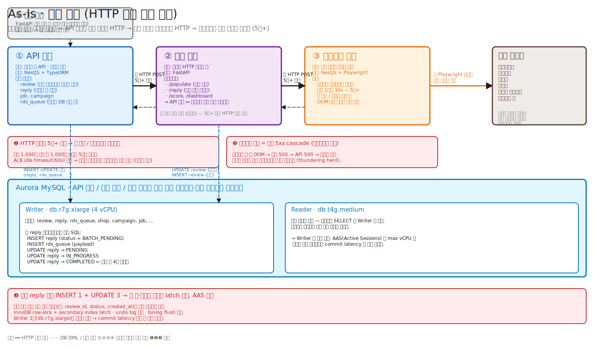
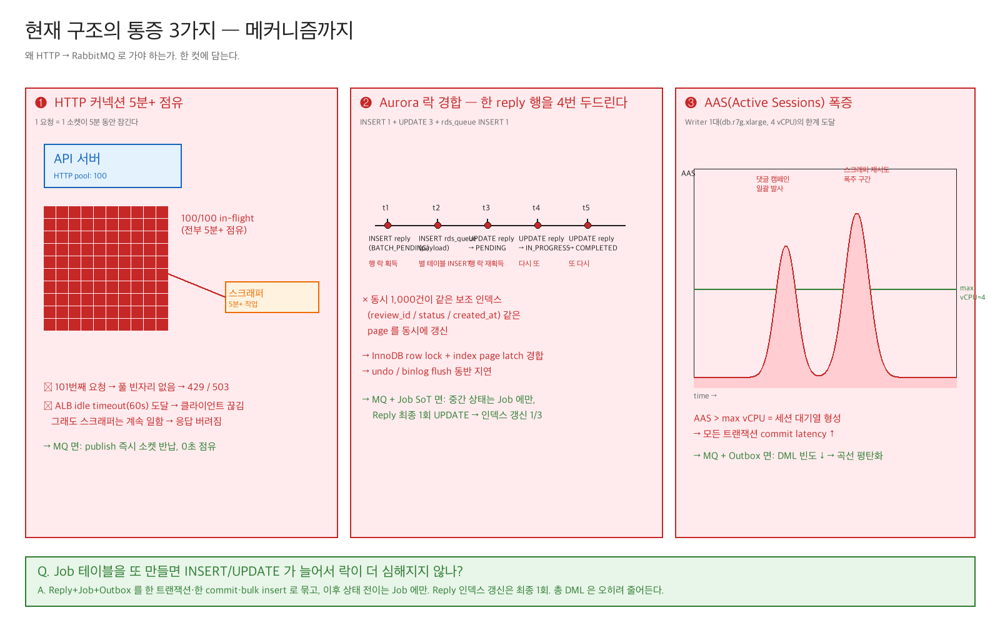
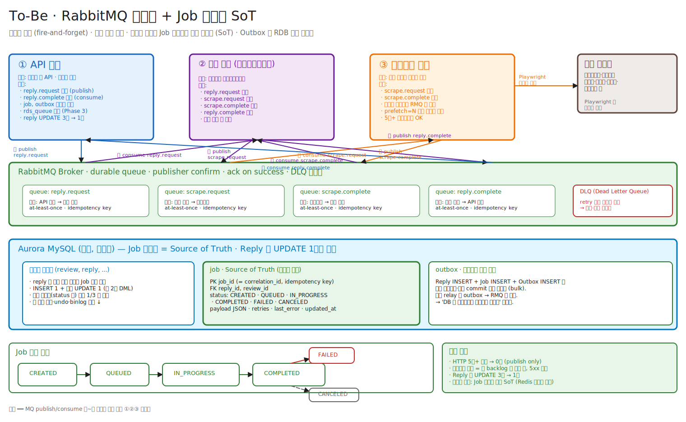

# 외부 플랫폼 댓글 워크플로 — HTTP 동기 구조에서 RabbitMQ 비동기 구조로

> **이 문서 한 장만 읽으면 됩니다.**
> 우리 도메인이 뭐고, 지금 어디가 아프고, 왜 RabbitMQ 인지, Job 테이블이 위험하지 않은 이유까지 — 그림·시퀀스·SQL·코드 스니펫·마이그레이션 단계가 한 파일에 다 있습니다. 코드를 처음 보는 개발자가 30분이면 따라올 수 있게 썼습니다.

---

## TL;DR

사장님의 답글을 외부 플랫폼(배달의민족·쿠팡이츠·요기요 등)에 자동으로 다는 워크플로가 **세 서버 사이에서 HTTP로 5분+ 동기 호출**로 묶여 있고, **공유 Aurora MySQL** 에 같은 행을 4번씩 두드립니다. 이 두 가지를 끊기 위해 **RabbitMQ 비동기 + Job 테이블(메시지 상태의 단일 진실원) + Outbox 패턴**으로 갑니다.

핵심 설계 원칙은 **"최소한의 RDB 사용"** — Job 테이블을 새로 두지만 그 비용은 Outbox·중간 상태 이관·인덱스 최소화로 상쇄해서 **총 DML 은 오히려 줄어듭니다**.

---

## 목차

1. [도메인 — 우리가 뭘 만드나](#1-도메인--우리가-뭘-만드나)
2. [시스템 등장인물 (서버 4 + 인프라 3)](#2-시스템-등장인물-서버-4--인프라-3)
3. [테이블 구조 (핵심만)](#3-테이블-구조-핵심만)
4. [As-Is — 사용자가 "댓글 100건 일괄 등록" 을 누르면 일어나는 일](#4-as-is--사용자가-댓글-100건-일괄-등록-을-누르면-일어나는-일)
5. [통증 3가지 — 메커니즘까지](#5-통증-3가지--메커니즘까지)
6. [왜 RabbitMQ 인가 — 대안 비교](#6-왜-rabbitmq-인가--대안-비교)
7. [To-Be 구조](#7-to-be-구조)
8. [핵심 우려 — Job 테이블 또 만들면 락이 더 심해지지 않나?](#8-핵심-우려--job-테이블-또-만들면-락이-더-심해지지-않나)
9. ["최소한의 RDB 사용" 설계 원칙](#9-최소한의-rdb-사용-설계-원칙)
10. [마이그레이션 4단계 (롤백 신호 포함)](#10-마이그레이션-4단계-롤백-신호-포함)
11. [측정 지표 (Before / After)](#11-측정-지표-before--after)
12. [리스크 & 미해결 질문](#12-리스크--미해결-질문)
13. [발표 흐름 권장](#13-발표-흐름-권장)

---

## 1. 도메인 — 우리가 뭘 만드나

### 외부 플랫폼이란?
사장님이 배달 서비스에 가게를 등록하면, 손님이 그 가게에 별점·리뷰를 답니다. 외부 플랫폼(배달의민족·쿠팡이츠·요기요·땡겨요·네이버 플레이스·카카오맵 등)은 **사장이 손으로 로그인해서 댓글을 쓰는 웹 UI** 만 제공합니다. **공식 API 가 없습니다.** 그래서 우리가 사장 대신 그 UI 를 자동화합니다.

### 핵심 도메인 개념 3가지

| 용어 | 뜻 |
|---|---|
| **Review (리뷰)** | 손님이 외부 플랫폼에 단 후기. 별점·텍스트·이미지·메뉴·작성시각. 우리가 스크래퍼로 수집해서 `review` 테이블에 저장. |
| **Reply (답글)** | 사장이 그 리뷰에 다는 답글. 이게 **이 글의 주인공**. 우리 서비스에서 "이 리뷰에 이 댓글" 을 누르면 → `reply` row 가 생기고 → 워크플로가 외부 플랫폼에 실제로 글을 답니다. |
| **Job** | 위 워크플로 한 건. 현재는 명시적 테이블 없이 `reply.request_status` 와 `rds_queue.status` 가 섞여서 표현. **To-Be 에서 새로 만드는 SoT.** |

### 댓글 시나리오 3가지
시스템이 처리하는 댓글 흐름은 같지만 트리거가 다릅니다.

| 시나리오 | 설명 | 단위 |
|---|---|---|
| **일괄 댓글 등록** | 사용자가 리뷰 목록 선택해서 "100건에 같은 댓글" | 한 번에 수십~수천 건 |
| **마케팅 댓글** | 캠페인에 묶인 매장들에 자동 댓글 (별점·답글 조건 충족 시) | 캠페인당 수천 건 |
| **예약 댓글** | 특정 시각 이후 자동 발사 | 시각 도래 시 한꺼번에 |

세 시나리오 모두 **순간적으로 수백~수천 건의 댓글 작업이 동시에 발사**되는 게 공통점. = **동시성 폭주 패턴**.

### 왜 댓글 한 건당 5분+ 인가?
- Playwright 가 헤드리스 브라우저를 띄우고
- 외부 플랫폼에 로그인하고 (캡차/2FA 로 막힐 수 있음)
- 리뷰 페이지로 이동하고 (SPA 라 느림)
- 댓글 입력창에 텍스트 치고
- 봇 차단을 피하려고 사람처럼 딜레이 주고
- 최종 등록 후 확인 요소까지 기다림

이 과정이 평균 30초, 봇 차단 회피·재시도가 들어가면 **5분+**. **단축 불가** — 외부 서비스가 정한 속도입니다.

---

## 2. 시스템 등장인물 (서버 4 + 인프라 3)

명칭은 모두 역할 기반으로 일반화합니다.

```
[사용자]
   │ HTTPS
   ▼
┌──────────────────┐    HTTP    ┌──────────────────┐    HTTP    ┌──────────────────┐    Playwright    ┌──────────────┐
│  ① API 서버      │ ─────────▶ │  ② 중계 서버     │ ─────────▶ │  ③ 스크래퍼 서버  │ ───────────────▶ │ 외부 플랫폼 │
│  (Business API) │  5분+     │  (Mediator)      │  5분+     │  (Scraper)       │   자동화 호출    │ (배민/쿠팡..) │
└──────────────────┘            └──────────────────┘            └──────────────────┘                  └──────────────┘
        │                              │
        │ DML                          │ DML                                  ┌─────────────────────┐
        └──────────┬───────────────────┘                                       │  ④ 배치 서버        │
                   ▼                                                           │  (Batch Worker)     │
            ┌──────────────────┐   ◀───── DML                                  │  → 중계 서버로 흡수 │
            │  Aurora MySQL    │                                               └─────────────────────┘
            │  (공유 클러스터)  │
            └──────────────────┘
```

### ① API 서버 (Business API)
- **역할**: 사용자 향 API. 도메인 데이터(매장·리뷰·댓글·캠페인)의 **소유자**.
- **스택**: NestJS + TypeORM
- **보유 테이블**: `review`, `reply`, `shop`, `campaign`, `job`(예정), `rds_queue`(현재의 DB-기반 큐)
- **외부 호출 빈도가 가장 높은 곳**. 댓글 시나리오들이 모두 여기서 시작.

### ② 중계 서버 (Mediator / Orchestrator)
- **역할 (현재)**: API 서버 ↔ 스크래퍼 사이의 **HTTP 패스스루**.
- **역할 (To-Be)**: 워크플로 **오케스트레이터** — 한 댓글 작업의 라이프사이클을 큐로 조립.
- **스택**: FastAPI + SQLAlchemy
- **마이그레이션 후 추가 책임**: 배치 서버 잡(백필·집계·블라인드 필터 등) 흡수.

### ③ 스크래퍼 서버 (Scraper Worker)
- **역할**: 외부 플랫폼 자동화 워커. 사장 화면에 헤드리스 브라우저로 로그인해서 댓글을 답니다.
- **스택**: NestJS + Playwright
- **운영 특성**:
  - 댓글 1건당 30초 ~ **5분+** (봇 차단·캡차로 변동 큼)
  - 메모리·세션 만료로 자주 죽음 (OOM, 봇 차단)
  - 외부 플랫폼이 SLA 를 보장하지 않음
- **워크플로 전체의 지연·실패 원인의 90% 이상.**

### ④ 배치 서버 (Batch Worker)
- **역할**: 정기 잡 — 리뷰 백필, 점수 집계, 블라인드 단어 필터링 등.
- **스택**: FastAPI 기반 (스케줄러 + 워커)
- **방향**: **중계 서버로 흡수 예정** — 운영을 한 곳에서 보기 위함.

### Aurora MySQL (공유 RDB) — **이 글의 중심 인물**
- **세 서버(API · 중계 · 배치)가 같은 클러스터·같은 스키마를 공유**.
- Writer: `db.r7g.xlarge` (4 vCPU) — 단일 인스턴스
- Reader: `db.t4g.medium` — 작아서 본격 활용 안 함
- 모든 DML 이 Writer 로 집중.

### (To-Be) RabbitMQ
- durable queue + publisher confirm + DLQ + idempotency key
- 4개의 핵심 큐: `reply.request`, `scrape.request`, `scrape.complete`, `reply.complete`

### Redis
- 현재도 그룹별 진행률·실패 통계 캐시로 사용 중 (`user:job:stats:{groupId}` 등)
- To-Be 에서도 **hot stats** 자리 — Aurora 는 SoT, Redis 는 캐시

---

## 3. 테이블 구조 (핵심만)

핵심 컬럼·인덱스만 표시합니다. **어디서 락이 충돌하는지** 보는 게 목적입니다.

### `review`
| 컬럼 | 비고 |
|---|---|
| `review_id` (PK) | UUID |
| `shop_id` (FK) | |
| `platform` | BAEMIN · COUPANG_EATS · YOGIYO · ... |
| `platform_review_id` | 외부 플랫폼이 부여한 id |
| `content`, `rating`, `reviewer`, `created_at` | |
| **인덱스** | `(shop_id, created_at)`, `(platform, platform_review_id)` |

### `reply` — **통증의 중심**
| 컬럼 | 비고 |
|---|---|
| `reply_id` (PK) | UUID |
| `review_id` (FK) | |
| `comment` | 실제 댓글 텍스트 |
| `request_status` | **자주 바뀌는 컬럼** — 4단계 전이 |
| `platform_reply_id` | 외부에서 부여한 댓글 id |
| `error_detail` | 실패 사유 |
| `user_id`, `created_at`, `updated_at` | |
| **인덱스** | `(review_id)`, `(request_status, created_at)`, `(user_id, created_at)` |

→ `request_status` 가 4번 바뀐다는 건 **`(request_status, created_at)` 인덱스 페이지도 4번 갱신**된다는 뜻. **보조 인덱스 갱신이 락의 진원지.**

### `rds_queue` — 현재의 DB-기반 큐
| 컬럼 | 비고 |
|---|---|
| `id` (PK) | |
| `payload` (JSON) | `{type, reply_id, review_id, ...}` |
| `group_id` | 같은 배치를 묶는 키 |
| `platform_id` | 동시성 제어용 |
| `priority`, `status`, `status_message` | |
| `created_at`, `updated_at`, `completed_at` | |

- Reply 1건당 `rds_queue` 에 1 row 가 INSERT.
- 처리 중에는 `status` 가 또 UPDATE.
- **DB 를 큐로 쓰면 DB 가 큐의 동시성까지 책임지게 됩니다** — InnoDB 는 큐 의도가 아니라 비용이 큽니다.

### `job` (예정, To-Be 의 SoT)
| 컬럼 | 비고 |
|---|---|
| `job_id` (PK) | ULID = correlation_id = idempotency key |
| `reply_id` (FK) | |
| `status` | CREATED · QUEUED · IN_PROGRESS · COMPLETED · FAILED · CANCELED |
| `payload` (JSON) | 메시지 원본 |
| `attempts`, `last_error`, `scheduled_at`, `updated_at` | |
| **인덱스** | 부분 인덱스 `WHERE status IN ('QUEUED','IN_PROGRESS')` 만 (hot row 만) |

### 인덱스가 같이 갱신되는 메커니즘
같은 reply 행이 4번 UPDATE 되면 그 행의 보조 인덱스 항목들도 다 갱신됩니다:
- `(request_status, created_at)` — **모든 동시 트랜잭션이 같은 page** 를 두드림 (status enum 값이 좁아서)
- `(updated_at)` 류 — 마찬가지로 시간이 비슷해서 같은 page

InnoDB 의 보조 인덱스는 **B-Tree 페이지 단위로 latch** 가 걸립니다. 같은 page = 직렬화. → **AAS 폭증의 직접 원인**.

---

## 4. As-Is — 사용자가 "댓글 100건 일괄 등록" 을 누르면 일어나는 일

### 4.1 구조 그림



### 4.2 호출 시퀀스

```text
[사용자] 클릭: "이 100개 리뷰에 같은 댓글 달기"
   │
   │ POST /replies/batch  (body: review_id 100개)
   ▼
[① API 서버]
   │ 1) Review 100건 조회
   │ 2) reply row 100개 bulk INSERT  (request_status = BATCH_PENDING)
   │ 3) rds_queue row 100개 bulk INSERT
   │ 4) HTTP POST → 중계 서버
   ▼  (응답 올 때까지 블로킹)
[② 중계 서버]
   │ HTTP POST → 스크래퍼  (그냥 중계)
   ▼  (응답 올 때까지 블로킹)
[③ 스크래퍼]
   │ Playwright 로 외부 플랫폼 로그인·댓글 작성
   │ 1건당 30초 ~ 5분+
   ▼  (응답)
[② 중계 서버]  → 응답 반환
   ▼
[① API 서버]
   │ 5) UPDATE reply  → PENDING
   │ 6) UPDATE reply  → IN_PROGRESS
   │ 7) UPDATE reply  → COMPLETED  (or FAILED)
   │ 8) UPDATE rds_queue.status
   ▼
[사용자] 응답 수신 (수분 후, 또는 timeout)
```

### 4.3 1건당 발생하는 SQL

```sql
-- 시작
INSERT INTO reply      (..., request_status='BATCH_PENDING') VALUES (...);
INSERT INTO rds_queue  (payload, group_id, ...)              VALUES (...);

-- 워커가 집기 직전
UPDATE reply      SET request_status='PENDING'      WHERE reply_id=?;
UPDATE rds_queue  SET status='IN_PROGRESS'           WHERE id=?;

-- 외부 호출 직전
UPDATE reply      SET request_status='IN_PROGRESS'  WHERE reply_id=?;

-- 외부 호출 후
UPDATE reply      SET request_status='COMPLETED',
                      platform_reply_id=?            WHERE reply_id=?;
UPDATE rds_queue  SET status='DONE', completed_at=? WHERE id=?;
```

→ **reply 행 UPDATE 3회 + rds_queue 행 UPDATE 2회 + 각자의 보조 인덱스 갱신**.

### 4.4 100건 동시 발사 시 누적
- reply INSERT 100, UPDATE 300
- rds_queue INSERT 100, UPDATE 200
- **합 700 DML, 같은 보조 인덱스 페이지에 집중**
- 캠페인 단위로 시나리오가 동시에 떠있으면 **1만 건도 흔함**

---

## 5. 통증 3가지 — 메커니즘까지



### ❶ HTTP 커넥션 5분+ 점유 → 풀 고갈
- API 서버의 HTTP 클라이언트 풀이 100이라면, 동시 100건 요청 = **100개 소켓이 5분간 잠긴다**.
- 101번째 요청은 `socket hang up` / `ECONNRESET`.
- ALB idle timeout(보통 60초) 도달 → 클라이언트는 끊겼지만 스크래퍼는 그대로 5분간 일하고 응답은 버려진다 → **작업은 됐는데 API 서버는 모름** → **멱등성 깨짐, 중복 댓글 위험**.
- 중계 서버도 같은 HTTP 풀 압박을 같이 받는다.

### ❷ 스크래퍼 다운 = 전체 5xx cascade (회로차단기 부재)
- 스크래퍼 한 인스턴스가 OOM / 세션 만료 / 봇 차단으로 죽으면
  - 중계 서버가 500 받음 → API 서버가 500 받음 → 사용자에게 그대로 노출
  - 클라이언트 재시도가 폭주하면 정상 인스턴스까지 같이 무너진다 (**thundering herd**)
- **회로차단기·벌크헤드 없음** → 한 워커의 사고가 전체 사고.

### ❸ Aurora 락 경합 / AAS spike — **가장 큰 통증**
4.2~4.4 에서 봤듯이 reply 1건당 SQL 이 많고, 동시 1,000건이면 같은 보조 인덱스 페이지를 같이 갱신.

- **InnoDB row-lock**: 같은 행을 다른 트랜잭션이 만지지 못하게 직렬화
- **secondary index page latch**: 같은 인덱스 페이지를 다른 세션이 못 만지게 직렬화
- 같이 일어나면 commit latency 폭증, **undo log / binlog flush** 도 지연
- Writer 1대(`db.r7g.xlarge`, 4 vCPU)라 AAS 가 max vCPU 라인을 넘으면 **모든 트랜잭션의 commit latency 가 같이 솟는다**
- 댓글 워크플로 외 쿼리(대시보드·집계)도 같이 느려짐 — Reader 활용도가 낮아 Writer 가 단일 병목

운영 증상: 세션 수 폭증, IO 대기 비중 상승, ALB 5xx, "왜 갑자기 다 느려지지?" 라는 느낌.

---

## 6. 왜 RabbitMQ 인가 — 대안 비교

| 대안 | 가능한가 | 왜 안 했나 / 왜 RMQ 가 나은가 |
|---|---|---|
| HTTP 유지 + timeout 늘리기 | △ | ALB·CDN·게이트웨이 곳곳에 idle timeout(60~120s) 한계. 5분+ 를 못 버틴다. |
| SSE / WebSocket | △ | 연결 관리 부담 + 스크래퍼 죽으면 끊김. backpressure 도 직접 구현 필요. |
| DB 큐(`rds_queue`) 유지 + 워커만 분리 | △ | **현재 통증의 일부가 바로 DB 큐**. DB 가 큐 트래픽까지 받는 구조라 락이 더 심해짐. |
| AWS SQS | ○ | 가능. 다만 부분적 RMQ 인프라가 이미 코드에 있고(`ClientRMQ` 사용 중), DLQ·priority·라우팅 자유도가 RMQ 가 더 높음. SQS 는 retention 14일, polling 비용도 고려. |
| **RabbitMQ** | ◎ | durable queue + publisher confirm + ack + DLQ + 라우팅 키로 매장별 직렬화 → 우리 워크플로(매장 단위 직렬, 글로벌 병렬)에 가장 잘 맞음. **이미 일부 코드에 채택돼 있어 도입 비용 낮음**. |

---

## 7. To-Be 구조

### 7.1 구조 그림



### 7.2 큐 토폴로지 (4개의 durable queue + DLQ)

| 큐 | producer | consumer | payload 핵심 필드 |
|---|---|---|---|
| `reply.request` | ① API 서버 | ② 중계 서버 | `job_id, reply_id, review_id, comment, shop_id, platform` |
| `scrape.request` | ② 중계 서버 | ③ 스크래퍼 | `job_id, platform, account, action, params` |
| `scrape.complete` | ③ 스크래퍼 | ② 중계 서버 | `job_id, result_code, platform_reply_id, error` |
| `reply.complete` | ② 중계 서버 | ① API 서버 | `job_id, status, platform_reply_id, error` |
| `*.dlq` | — | 관측·수동 재처리 | retry 초과 메시지 격리 |

- **at-least-once** + **idempotency key = `job_id`**
- 매장 단위 직렬화는 `routing_key = platform_account_id` 또는 consistent-hash exchange

### 7.3 호출 시퀀스

```text
[사용자] POST /replies/batch
   │
   ▼
[① API 서버]  ── (한 트랜잭션 · 한 commit · bulk)
   │     · INSERT reply  ×N   (status: PENDING — 최종 1회만 더 UPDATE)
   │     · INSERT job    ×N   (CREATED, correlation_id = job_id)
   │     · INSERT outbox ×N   (target = reply.request, payload)
   │     COMMIT;
   ▼   응답 즉시 202 Accepted  (job_id 목록 반환)

[outbox relay] (별도 워커)
   outbox WHERE status='PENDING' → publish reply.request → RMQ
                                                            │
                                                            ▼
[② 중계 서버]  consume reply.request
   │     · UPDATE job SET status='QUEUED'   ← Job 만 갱신 (Reply 안 건드림)
   │     · publish scrape.request → RMQ
   │                                          │
   │                                          ▼
   │                            [③ 스크래퍼]  consume scrape.request
   │                                  │   · Playwright 자동화 (5분+ OK, 소켓 점유 0)
   │                                  │   · publish scrape.complete → RMQ
   │                                  ▼
[② 중계 서버]  consume scrape.complete
   │     · UPDATE job SET status='COMPLETED'|'FAILED'
   │     · publish reply.complete → RMQ
   │                                  │
   │                                  ▼
[① API 서버]  consume reply.complete
         · UPDATE reply (최종 1회: platform_reply_id, status)
         · Redis stats 갱신 (선택)
```

### 7.4 코드 스니펫 — 어떤 모양인가

**Outbox INSERT (API 서버, TypeORM)**

```typescript
@Injectable()
export class ReplyProducer {
  async createBatch(requests: CreateReplyDto[]): Promise<{ jobIds: string[] }> {
    return this.dataSource.transaction(async (tx) => {
      // 1) Reply bulk insert — 최초 1회 (status: PENDING)
      const replies = requests.map(r => tx.create(Reply, { ...r, request_status: 'PENDING' }));
      const savedReplies = await tx.save(replies);  // bulk

      // 2) Job bulk insert (SoT)
      const jobs = savedReplies.map(reply => tx.create(Job, {
        job_id: ulid(),
        reply_id: reply.reply_id,
        status: 'CREATED',
        payload: { reply_id: reply.reply_id, /* ... */ },
      }));
      const savedJobs = await tx.save(jobs);  // bulk

      // 3) Outbox bulk insert
      const outboxRows = savedJobs.map(job => tx.create(Outbox, {
        target: 'reply.request',
        payload: { job_id: job.job_id, /* ... */ },
        status: 'PENDING',
      }));
      await tx.save(outboxRows);  // bulk

      // → 한 COMMIT 으로 끝.
      return { jobIds: savedJobs.map(j => j.job_id) };
    });
  }
}
```

**Outbox Relay (별도 워커, polling)**

```typescript
async function relayLoop() {
  while (true) {
    const batch = await dataSource.query(`
      SELECT * FROM outbox
       WHERE status = 'PENDING'
       ORDER BY created_at
       LIMIT 200
       FOR UPDATE SKIP LOCKED
    `);
    if (batch.length === 0) { await sleep(500); continue; }

    for (const row of batch) {
      await rmq.publish(row.target, row.payload, {
        messageId: row.payload.job_id,   // idempotency
        persistent: true,
      });
    }

    await dataSource.query(
      `UPDATE outbox SET status='PUBLISHED', published_at=NOW() WHERE id IN (?)`,
      [batch.map(r => r.id)],
    );
  }
}
```

**Consumer 멱등성 가드 (중계 서버, Python)**

```python
async def on_reply_request(msg: aio_pika.IncomingMessage):
    async with msg.process(requeue=False):
        payload = json.loads(msg.body)
        job_id = payload["job_id"]

        async with db.begin() as tx:
            # 같은 메시지가 두 번 와도 안전
            job = await tx.execute(
                select(Job).where(Job.job_id == job_id)
                            .with_for_update(nowait=True)
            ).scalar_one()
            if job.status in ("COMPLETED", "CANCELED"):
                return  # idempotent: 이미 처리됨

            job.status = "QUEUED"
            await tx.commit()

        await publish("scrape.request", payload)
```

### 7.5 효과 비교

| 항목 | As-Is | To-Be |
|---|---|---|
| HTTP 소켓 점유 시간 (요청당) | 5분+ | **0초** (publish only) |
| 스크래퍼 다운 시 사용자 영향 | 5xx cascade | 큐 backlog 만 쌓임 (사용자는 정상 202) |
| reply 행 UPDATE 횟수 | 3 | **1** |
| rds_queue UPDATE 횟수 | 2 | **0** (테이블 제거) |
| 메시지 상태 추적 | reply.status + rds_queue + Redis 분산 | **Job 테이블 단일 SoT** |
| 재시도 / DLQ | 직접 구현 | RMQ 표준 (`x-dead-letter-exchange`) |
| 회로차단 / 벌크헤드 | 없음 | prefetch / 큐 분리로 자연 격리 |
| 멱등성 | 없음 (요청 끊기면 중복 위험) | `job_id` UNIQUE + FOR UPDATE NOWAIT |

---

## 8. 핵심 우려 — Job 테이블 또 만들면 락이 더 심해지지 않나?

이게 발표에서 가장 많이 받을 질문입니다. 솔직히 우리도 가장 걱정한 부분.

### 8.1 우려의 정체

지금도 reply / review / rds_queue 에 INSERT·UPDATE 가 폭주하는데, Job 테이블을 또 만들면:
- reply INSERT + Job INSERT (배 늘어남)
- reply UPDATE + Job UPDATE (또 배)
- 새 보조 인덱스(status 등)도 핫스팟이 되는 거 아닌가?

**합리적인 걱정입니다.** 그래서 다음 4가지 장치로 락 부담을 늘리지 않을 뿐 아니라 **오히려 줄입니다**.

### 8.2 장치 1 — Outbox 패턴 (1 트랜잭션, 1 commit, bulk)

```sql
BEGIN;
  INSERT INTO reply  (...) VALUES (...), (...), ... ;   -- bulk N건
  INSERT INTO job    (...) VALUES (...), (...), ... ;   -- bulk N건
  INSERT INTO outbox (...) VALUES (...), (...), ... ;   -- bulk N건
COMMIT;
```

- **commit 1회 / N건**. binlog flush, undo log 다 1회로 압축.
- Outbox relay 워커가 별도로 `outbox WHERE status='PENDING'` 읽어서 RMQ 로 publish 후 `status='PUBLISHED'` 로 UPDATE.
- 효과: **"DB 는 롤백됐는데 메시지는 나갔다" 문제 사라짐**. 메시지와 DB 가 같은 트랜잭션 경계 안에 묶임.

### 8.3 장치 2 — 중간 상태는 Reply 가 아니라 Job 에만

| 컬럼 | As-Is | To-Be |
|---|---|---|
| `reply.request_status` | BATCH_PENDING → PENDING → IN_PROGRESS → COMPLETED (4단계, **3 UPDATE**) | PENDING → COMPLETED (2단계, **1 UPDATE**) |
| `job.status` | (없음) | CREATED → QUEUED → IN_PROGRESS → COMPLETED/FAILED/CANCELED (Job 안에서만 전이) |

- **Reply 행 UPDATE 3회 → 1회** = reply 의 보조 인덱스 갱신 **1/3**.
- Job 테이블의 status 컬럼도 인덱스가 필요하지만:
  - **Job 은 reply 와 1:1 이고 별도 테이블이라 같은 페이지를 안 만진다**
  - 인덱스 설계를 처음부터 hot-path 만 고려해 최소화
  - 부분 인덱스 (`WHERE status IN ('QUEUED','IN_PROGRESS')`) 로 hot row 만 색인

### 8.4 장치 3 — 멱등성 (job_id = idempotency key)

```json
{
  "job_id": "01HX...ULID",
  "reply_id": "...",
  "attempt": 2
}
```

- RMQ 는 at-least-once → 같은 메시지가 두 번 올 수 있다.
- 컨슈머는 항상 `SELECT ... FOR UPDATE NOWAIT` 로 Job 잠그고, status 가 이미 COMPLETED 면 즉시 ack.
- 재시도는 새 row 가 아니라 같은 `job_id` 의 `attempt` 카운터만 ++.
- → **ALB timeout 으로 끊긴 요청도 안전하게 retry 가능** (중복 댓글 위험 사라짐).

### 8.5 장치 4 — Aurora Reader + Redis hot path

- AAS 측 통계, 진행률, 그룹 성공/실패 카운트는 **Redis 가 hot path** (현재도 `user:job:stats:{groupId}` 패턴 사용 중)
- Aurora Reader 를 대시보드·집계 쿼리로 본격 활용 → Writer 압박 ↓
- Aurora 는 SoT 역할만 (느려도 정확하면 OK)

### 8.6 그래서 총 DML 은 어떻게 되나?

| 100건 처리 시 | As-Is | To-Be |
|---|---|---|
| reply INSERT | 100 | 100 |
| reply UPDATE | 300 | **100** |
| rds_queue INSERT | 100 | 0 |
| rds_queue UPDATE | 200 | 0 |
| job INSERT | 0 | 100 |
| job UPDATE | 0 | ~200 |
| outbox INSERT | 0 | 100 |
| outbox UPDATE | 0 | 100 |
| **합계** | **700** | **700** |

총량은 비슷해 보이지만:
1. **commit 횟수가 다르다**: As-Is 는 SQL 마다 별도 트랜잭션, To-Be 는 INSERT 묶음이 1 commit.
2. **인덱스 핫스팟이 분산된다**: As-Is 는 reply 한 테이블에 집중, To-Be 는 reply·job 으로 분산되고 job 은 처음부터 인덱스 최소화.
3. **장기 행 락이 줄어든다**: 5분+ 동안 reply 행을 "잡고 있는" 게 아니라 Job 행만 잡힘. Reply 는 시작과 끝에만 만짐.
4. **rds_queue 의 큐-DML 부담이 통째로 사라진다** (RMQ 가 대신).

→ 종합적으로 **Writer AAS 곡선이 평탄화**. 이게 핵심.

---

## 9. "최소한의 RDB 사용" 설계 원칙

마이그레이션 전체를 관통하는 원칙. 한 슬라이드로 묶어 보여줄 만한 그림.

| 원칙 | 구체적인 적용 |
|---|---|
| **1. 큐를 DB 로 쓰지 않는다** | `rds_queue` 제거. 메시지 흐름은 RMQ. |
| **2. 중간 상태는 hot path(Redis) 에, SoT 만 RDB(Job) 에** | 진행률·통계는 Redis, 정확한 상태는 Job 테이블. |
| **3. Reply·Review 도메인 행은 최소 횟수 UPDATE** | 시작 1회 + 끝 1회. 그 사이는 Job 만 만짐. |
| **4. 인덱스는 hot query 만 보고 설계** | `job(status)` 는 부분 인덱스, `reply(request_status)` 는 카디널리티 보고 결정. |
| **5. Writer 와 Reader 의 역할을 진짜로 나눈다** | 대시보드·집계는 Reader 로. Writer 는 트랜잭션만. |
| **6. 한 트랜잭션, 한 commit, bulk** | Outbox 가 이걸 강제하는 구조. 개별 commit 금지. |
| **7. 메시지·DB 정합성은 Outbox 가 보장한다** | publish-then-commit / commit-then-publish 양쪽 위험 모두 outbox 로 해결. |

---

## 10. 마이그레이션 4단계 (롤백 신호 포함)

### Phase 0 — 배치 서버 흡수
- 배치 서버의 정기 잡(리뷰 백필·점수 집계·블라인드 필터 등)을 중계 서버의 `task/` 패키지로 이전.
- 스케줄러는 APScheduler 또는 Arq.
- DB 접근 코드는 중계 서버의 기존 SQLAlchemy 모델을 그대로 사용 (같은 스키마).
- **롤백 신호**: 흡수된 잡의 SLA 위반 / 슬랙 에러 알람 증가.

### Phase 1 — `scrape.request` / `scrape.complete` 정착
- 스크래퍼 서버는 이미 RMQ 컨슈머 인프라가 일부 구현되어 있음. 큐 이름·payload 스키마만 정리.
- 중계 서버에 `scrape.request` 발행자 / `scrape.complete` 소비자 추가.
- **이 단계까지는 API 서버가 여전히 HTTP 로 중계 서버를 호출** → API 서버 코드 변경 없음 (안전한 부분 전환).
- **검증**: 같은 reply 를 (A) HTTP 경로와 (B) MQ 경로로 동시에 처리해 결과 일치를 비교 (shadow traffic).
- **롤백 신호**: shadow 결과 불일치 > 0.5% / scrape.complete 처리 lag > 5분.

### Phase 2 — Job 테이블 + Outbox + `reply.request` 전환
- API 서버에 `job`, `outbox` 테이블 추가 (마이그레이션).
- 댓글 producer 가 `rds_queue` 대신 outbox 에 INSERT → outbox relay 가 `reply.request` 로 publish.
- `rds_queue` 는 **삭제하지 않고 read-only 로 동결** (기존 미처리 잡이 빠질 때까지). 새 잡은 모두 Job 테이블로.
- 중계 서버가 `reply.request` 를 소비하고 `scrape.request` 로 전달 → **API 서버 ↔ 중계 서버 HTTP 경로 제거**.
- **롤백 신호**: outbox-relay lag > 30초 / Job DLQ 비율 > 1% / Reply 최종 상태 불일치.

### Phase 3 — `reply.complete` 정착 + 정리
- 스크래퍼 → 중계 → API 응답 경로를 `reply.complete` 큐로 완성.
- API 서버의 동기 HTTP scraper 호출 제거.
- 중계 서버의 HTTP scraper 클라이언트 제거.
- `rds_queue` 테이블 DROP (백업 후).
- 모니터링·DLQ·재처리 운영 가이드 정착.
- **롤백 신호**: 이 시점에서는 사실상 As-Is 로 못 돌아감. 사전에 Phase 2 까지 충분히 안정화 후 진행.

---

## 11. 측정 지표 (Before / After)

| 메트릭 | 데이터 소스 | 목표 |
|---|---|---|
| reply 처리 P50 / P95 | Job 테이블 `created_at → completed_at` | 변경 없음 또는 ↑ (정확도 ↑ 와 교환 OK) |
| API 서버 HTTP 풀 사용률 | NestJS prom-client | 평균 80% → **<20%** |
| 5xx rate (API 서버) | ALB / Datadog | 스크래퍼 장애 시에도 **≤ 0.1%** |
| Aurora Writer AAS peak | RDS Performance Insights | spike → **평탄화** (max vCPU 미만) |
| Reply 행 UPDATE 횟수 / 건 | binlog 분석 | 3+ → **1** |
| Job DLQ 비율 | RMQ 메트릭 | **< 0.5%** |
| End-to-end 처리량 (건/분) | Job 테이블 COUNT | 5분 윈도우당 **≥ 1.5x** |
| 멱등성 위반 (중복 댓글) | 외부 플랫폼 응답 분석 | **0** |

---

## 12. 리스크 & 미해결 질문

| 리스크 | 대응 |
|---|---|
| Outbox-relay 가 단일 장애점 | relay 2대 이상 + leader election (Redlock 또는 RMQ exclusive consumer) |
| at-least-once 중복 처리 | `job_id` UNIQUE + 모든 컨슈머에 `SELECT ... FOR UPDATE NOWAIT` 가드 |
| 메시지 순서 (한 매장에 댓글 100건) | `routing_key = platform_account_id` 로 동일 계정은 한 컨슈머에 직렬화 (consistent-hash exchange) |
| Job 테이블 hot row 우려 (`status='QUEUED'` 인덱스) | 부분 인덱스 (`WHERE status IN ('QUEUED','IN_PROGRESS')`) 또는 별 테이블 분리. Phase 2 부하 테스트로 결정 |
| 중계 서버가 흡수 후 비대화 | 내부 모듈 분리 (`task/orchestrator/`, `task/scheduler/`, `task/legacy_jobs/`). 서비스 분리는 부하 보고 결정 |
| Aurora 인스턴스 사이즈 비대칭 | 마이그레이션 직후 부하 패턴 보고 Reader 승격. To-Be 에서는 Reader 활용도가 의도적으로 올라감 |
| 기존 `rds_queue` 데이터 마이그레이션 | Phase 2 직전 cutover: 미처리 잡은 새 Job 테이블에 마이그레이션 스크립트로 일괄 INSERT (status=CREATED) |
| Outbox 가 RDB 부담을 새로 만든다는 비판 | 부담 ↑ 는 사실. 다만 reply UPDATE 가 줄어드는 폭이 훨씬 크고, outbox 는 모두 단순 INSERT (인덱스도 `(status)` 하나) — 측정 후 합리화 |

---

## 13. 발표 흐름 권장

5분 안에 끝낸다고 가정하면:

1. **§5 통증 그림 (problems.png)** — "왜 바꾸는가" (1분)
2. **§4 As-Is 그림 + 시퀀스** — 현재 흐름·통증 위치 (1.5분)
3. **§7 To-Be 그림 + 시퀀스** — 새 흐름·Job SoT (1.5분)
4. **§8 락 우려 답변** — Outbox 4가지 장치 + DML 비교표 (1분)
5. **§9 "최소 RDB" 원칙** + **§10 4단계 마이그레이션** + 롤백 신호 (1분)

길게 가도 좋으면 §1 도메인부터 차근차근 — 이 문서 순서 그대로 읽어내려가면 됩니다.

---

> **다이어그램 원본 편집**: `.excalidraw` 파일을 [excalidraw.com](https://excalidraw.com/) 에서 열어서 수정.
> **재생성**: `python3 scripts/gen_diagrams.py`
