# 메시지 큐 도입 후 DB 가 더 느려지는 함정 — Consumer-Side Batching 패턴

> **한 줄 요약**
> RabbitMQ 같은 메시지 큐를 도입하면 **Producer 쪽 DB 부하는 줄지만, Consumer 쪽에서 단건 UPDATE 폭주로 DB 부하가 다시 살아납니다.** 이 글은 그 함정을 어떤 개발자라도 이해할 수 있게 풀고, Consumer-side micro-batching 으로 푸는 법을 설명합니다.

---

## 목차

1. [전제 — 우리가 풀려던 문제](#1-전제--우리가-풀려던-문제)
2. [메시지 큐 도입 후 생기는 새로운 문제](#2-메시지-큐-도입-후-생기는-새로운-문제)
3. [왜 이 문제가 생기나 — Producer/Consumer 비대칭](#3-왜-이-문제가-생기나--producerconsumer-비대칭)
4. [Page Latch — 왜 단건 UPDATE 가 무거운가](#4-page-latch--왜-단건-update-가-무거운가)
5. [해결책 — Consumer-Side Batching](#5-해결책--consumer-side-batching)
6. [구체적 구현](#6-구체적-구현)
7. [언제 더 강한 카드를 꺼내야 하나](#7-언제-더-강한-카드를-꺼내야-하나)
8. [정리 — 면접 / 리뷰에서 받았을 때 안전한 답](#8-정리--면접--리뷰에서-받았을-때-안전한-답)

---

## 1. 전제 — 우리가 풀려던 문제

원래 우리 댓글 워크플로는 **HTTP 동기 호출 + 공유 RDB 직접 쓰기** 구조였습니다.

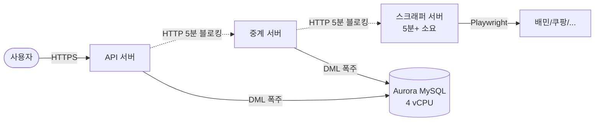

### 통증 3가지

| 통증 | 원인 |
|---|---|
| **HTTP 풀 고갈** | 5분+ 짜리 소켓이 동시 수백 개 → 새 요청 거절 |
| **장애 cascade** | 스크래퍼 1대 죽으면 5xx 가 API 까지 전파 |
| **Aurora 락 경합** | reply 1건당 INSERT 1 + UPDATE 3 + rds_queue 까지 → AAS 폭증 |

→ 이걸 풀려고 **RabbitMQ + Job 테이블 + Outbox 패턴**으로 가기로 결정.

---

## 2. 메시지 큐 도입 후 생기는 새로운 문제

To-Be 구조는 이렇게 됩니다.

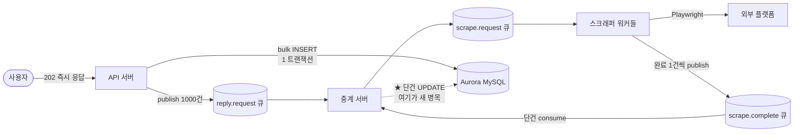

### 새로 생긴 문제 — Consumer 쪽 단건 UPDATE 폭주

- **Producer (API 서버)**: 1000건을 한 트랜잭션에 bulk INSERT → DB 부하 효율적
- **Scraper**: 어쩔 수 없이 1건씩 5분+ 처리 (외부 사이트 자동화는 직렬)
- **Consumer (중계 서버)**: 메시지가 1건씩 도착 → **1건씩 UPDATE → 1건씩 commit**

```
1000건 일괄 등록 시:
  Producer:  1 commit  (효율적)
  Consumer:  1000 commit  ← ★ 여기서 다 까먹음
```

**즉, RMQ 도입 후 DB 부하가 사라진 게 아니라 Producer → Consumer 로 자리만 옮겨갔습니다.** 이걸 모르고 운영하면 "왜 RMQ 도입했는데 DB 가 또 느려지지?" 라는 당황스러운 상황을 만납니다.

---

## 3. 왜 이 문제가 생기나 — Producer/Consumer 비대칭

본질은 **메시지 큐의 자연스러운 동작 방식** 에 있습니다.

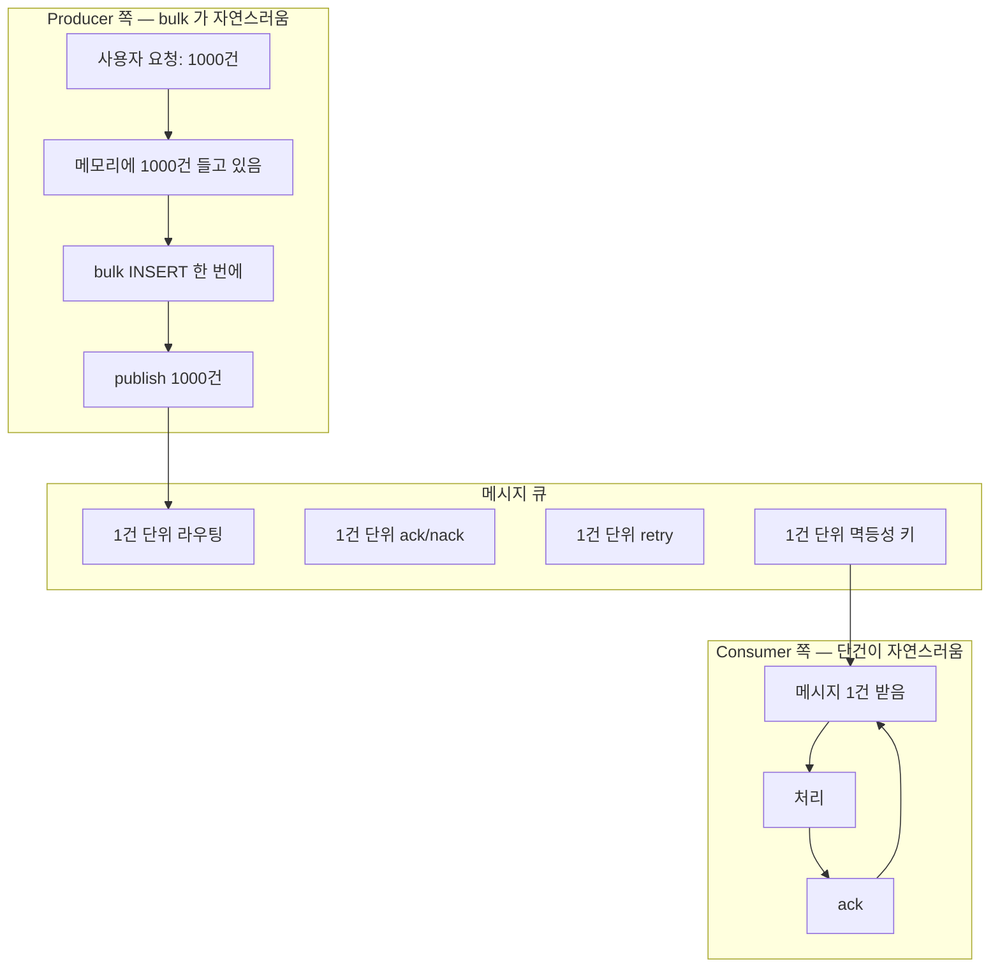

| 측면 | Producer | Consumer |
|---|---|---|
| 데이터 형태 | "한 묶음을 가지고 있다" | "한 알씩 도착한다" |
| 자연스러운 패턴 | bulk INSERT | 단건 처리 |
| Batching 도입 | 그냥 됨 (이미 묶여 있음) | **의도적으로 코드 짜야 됨** |

**이게 핵심**: batching 은 Producer 쪽엔 공짜로 따라오고, Consumer 쪽엔 "노력해서 도입해야" 합니다. 모르면 안 합니다.

---

## 4. Page Latch — 왜 단건 UPDATE 가 무거운가

"단건 UPDATE 1000번 = bulk UPDATE 1번" 으로 생각하면 안 됩니다. **InnoDB 의 page latch 때문에 동시성이 망가집니다.**

### Page 란?

- InnoDB 는 데이터를 **16KB page 단위**로 디스크와 메모리 사이에서 주고받습니다
- 한 page 안에 row 가 수십~수백 개
- B+Tree 의 모든 노드(root/branch/leaf)가 page

### Page Latch 란?

- 한 트랜잭션이 page 를 수정하는 동안 그 page 전체에 걸리는 **mutex (메모리 보호용)**
- row lock 과 다름:
  - row lock = 트랜잭션 끝까지 (수 초~수 분)
  - page latch = 페이지 수정 중에만 (μs~ms 단위)

### 단건 UPDATE 가 망가지는 메커니즘

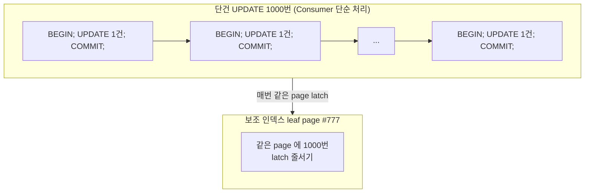

- **status 같은 좁은 enum 컬럼**은 인덱스에서 같은 page 에 몰림
- **created_at 처럼 단조 증가**하는 키는 항상 right-most page 가 hot
- → 단건 commit 1000번 = page latch 1000번 줄서기
- → AAS (Active Sessions) 가 vCPU 한계(4) 위로 폭증

### Bulk UPDATE 가 본질적으로 다른 이유

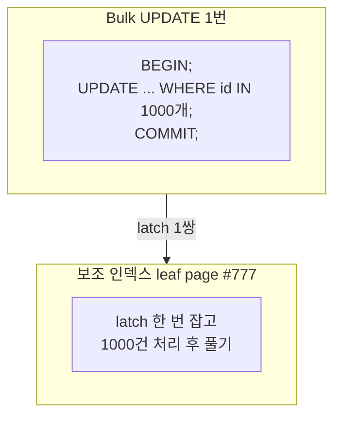

- **page header / free space pointer 같은 공통 자료구조는 한 번만 갱신**
- latch 점유 시간은 1000배가 안 됨
- commit 1번 = redo log fsync 1번 = binlog flush 1번

**같은 양의 데이터라도 단건 vs bulk 의 latch 부담 차이는 보통 50~200배.**

---

## 5. 해결책 — Consumer-Side Batching

**메시지 1건 받자마자 DB 쓰지 말고, 메모리에 모았다가 한 번에 쓰자.**

### 패턴: 시간 창 + 개수 창 하이브리드

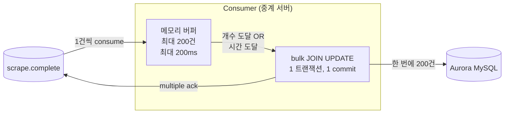

### 트리거 조건

| 조건 | 의미 |
|---|---|
| **개수 임계** | 200건 모이면 즉시 flush (지연 방지) |
| **시간 임계** | 200ms 지나면 무조건 flush (적은 트래픽도 처리) |

### 효과

| 지표 | Before (단건) | After (batching) |
|---|---|---|
| commit 횟수 | 1000 | 5~10 |
| page latch 잡는 횟수 | 1000+ | 5~10 |
| 메시지 처리 지연 | 즉시 (~10ms) | 평균 +100ms |
| Consumer 처리량 | DB 한계에 묶임 | 5~50배 ↑ |
| AAS peak | vCPU × 3+ | vCPU 이하 평탄 |

→ **메시지 처리가 100ms 더 늦어지는 대신 DB 부하는 100배 가벼워짐.** 우리처럼 어차피 5분+ 비동기 잡이면 100ms 지연은 무의미합니다.

---

## 6. 구체적 구현

### 6.1 Consumer 코드 (Python, aio_pika)

```python
import asyncio
import time

class CompletionBatchConsumer:
    BATCH_SIZE = 200          # 개수 임계
    BATCH_WINDOW_MS = 200     # 시간 임계

    def __init__(self, db):
        self.db = db
        self.buffer = []
        self.lock = asyncio.Lock()
        self.flush_task = None

    async def on_message(self, msg):
        async with self.lock:
            self.buffer.append(msg)

            # 개수 도달 → 즉시 flush
            if len(self.buffer) >= self.BATCH_SIZE:
                await self._flush()
                return

            # 첫 메시지면 시간 타이머 시작
            if self.flush_task is None:
                self.flush_task = asyncio.create_task(self._delayed_flush())

    async def _delayed_flush(self):
        await asyncio.sleep(self.BATCH_WINDOW_MS / 1000)
        async with self.lock:
            await self._flush()

    async def _flush(self):
        if not self.buffer:
            return

        batch = self.buffer
        self.buffer = []
        if self.flush_task and not self.flush_task.done():
            self.flush_task.cancel()
        self.flush_task = None

        try:
            await self._bulk_update(batch)
            # multiple ack — 마지막 delivery_tag 까지 한 번에 ack
            await batch[-1].ack(multiple=True)
        except Exception:
            # batch 전체 nack & requeue (멱등성 키로 안전)
            for msg in batch:
                await msg.nack(requeue=True)

    async def _bulk_update(self, batch):
        rows = [
            (m.body["job_id"], m.body["status"],
             m.body.get("platform_reply_id"), m.body.get("error"))
            for m in batch
        ]

        async with self.db.begin() as tx:
            # 임시 테이블에 batch 적재
            await tx.execute("TRUNCATE tmp_complete")
            await tx.executemany(
                "INSERT INTO tmp_complete VALUES (%s, %s, %s, %s)", rows
            )

            # JOIN UPDATE — job 일괄
            await tx.execute("""
                UPDATE job j
                  JOIN tmp_complete t ON j.job_id = t.job_id
                   SET j.status = t.status,
                       j.platform_reply_id = t.platform_reply_id,
                       j.error = t.error,
                       j.updated_at = NOW()
            """)

            # JOIN UPDATE — reply 일괄 (최종 1회만)
            await tx.execute("""
                UPDATE reply r
                  JOIN job j ON r.reply_id = j.reply_id
                  JOIN tmp_complete t ON j.job_id = t.job_id
                   SET r.request_status =
                         CASE t.status
                           WHEN 'COMPLETED' THEN 'COMPLETED'
                           WHEN 'FAILED'    THEN 'FAILED'
                         END,
                       r.platform_reply_id = t.platform_reply_id,
                       r.updated_at = NOW()
            """)
```

### 6.2 SQL 패턴 — 단일 SQL 로 묶기

**나쁜 예 — 한 트랜잭션이지만 단건 SQL 반복**

```sql
BEGIN;
  UPDATE job SET status='COMPLETED' WHERE job_id='j1';
  UPDATE job SET status='FAILED'    WHERE job_id='j2';
  ...  -- 200번 반복
COMMIT;
```

→ commit 은 1번이지만 **page latch 는 여전히 200번 잡았다 풀림**. 개선 절반.

**좋은 예 — JOIN UPDATE**

```sql
-- 임시 테이블 한 번에 적재
INSERT INTO tmp_complete VALUES (...), (...), ... ;

-- 한 SQL 로 200건 처리
UPDATE job j JOIN tmp_complete t ON j.job_id = t.job_id
   SET j.status = t.status, ...;
```

→ 옵티마이저가 같은 page 의 row 들을 함께 처리. **page latch 효율 극대화**.

### 6.3 ack 전략 — Multiple Ack

RabbitMQ 는 `basic.ack(multiple=True)` 로 **"이 delivery_tag 까지 다 ack"** 가능. 200건 ack 도 1번의 네트워크 왕복.

```python
await batch[-1].ack(multiple=True)
```

---

## 7. 언제 더 강한 카드를 꺼내야 하나

Consumer batching + JOIN UPDATE 로도 부족할 때의 추가 카드:

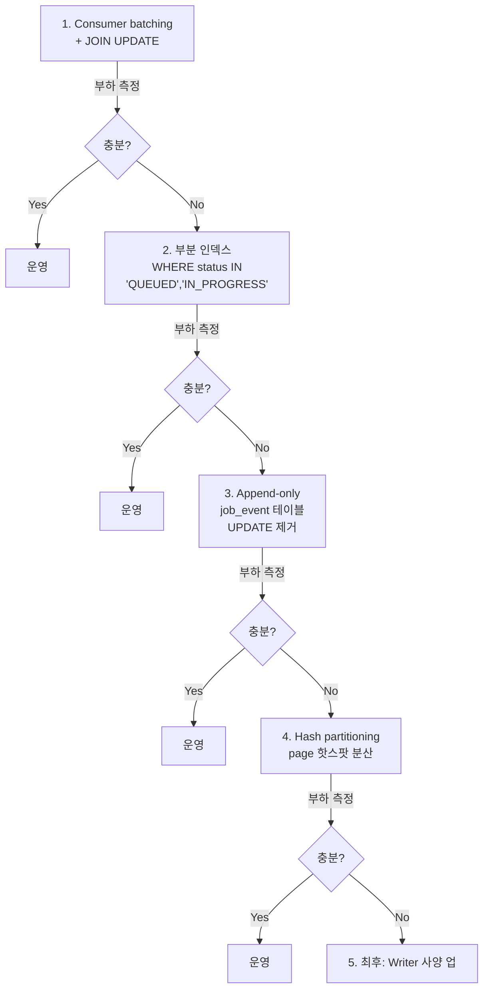

| 단계 | 효과 | 비용 |
|---|---|---|
| **1. Batching + JOIN UPDATE** | commit 100배 ↓ | 낮음 (코드만) |
| **2. 부분 인덱스** | hot row 만 색인, B+Tree 작아짐 | 낮음 (인덱스 변경) |
| **3. Append-only** | UPDATE 자체 제거 | 중간 (조회 로직 변경) |
| **4. Partitioning** | 같은 page 핫스팟을 N 분할 | 높음 (운영 복잡도) |
| **5. 사양 업** | AAS 여유 ↑ | 높음 (월 비용) |

**대부분의 케이스는 1단계에서 끝납니다.** 그 다음은 측정 후 결정.

---

## 8. 정리 — 면접 / 리뷰에서 받았을 때 안전한 답

### Q. "메시지 큐 도입하면 DB 부하 줄지 않나요?"

> "Producer 쪽 부하는 줍니다. 사용자 요청을 즉시 publish 하고 끝내니까 트랜잭션이 짧아집니다. 하지만 Consumer 쪽에서 메시지를 단건씩 받아 단건 UPDATE 를 하면 commit 횟수와 page latch 부담이 그대로 살아납니다. **부하가 자리만 옮겨가는 거지 사라지는 게 아닙니다.**"

### Q. "그럼 어떻게 풀어야 하나요?"

> "Consumer 쪽에 micro-batching 을 도입합니다. 시간 윈도우(예: 200ms)와 개수 윈도우(예: 200건)를 동시에 걸고, 둘 중 먼저 도달하는 쪽에서 flush 합니다. flush 시에는 임시 테이블 + JOIN UPDATE 로 **단일 SQL 안에서 일괄 처리**해야 page latch 가 진짜로 줄어듭니다. ack 도 RabbitMQ 의 multiple ack 로 묶어서 네트워크 비용도 줄입니다."

### Q. "Trade-off 는?"

> "메시지 처리 지연이 평균 100ms 늘어납니다. 동기 응답이 필요한 워크플로엔 못 씁니다. 우리 케이스처럼 어차피 비동기·5분+ 잡이라면 무의미한 지연이고, 대신 DB 부하가 100배 가벼워져서 운영이 안정됩니다."

### 한 줄로

**"메시지 큐 도입 = DB 부하의 Producer→Consumer 이전. Consumer 쪽에서 batching 으로 대칭을 맞춰주지 않으면 As-Is 와 비슷한 부하가 재현된다."**

---

## 참고 — 핵심 다이어그램 1장 요약

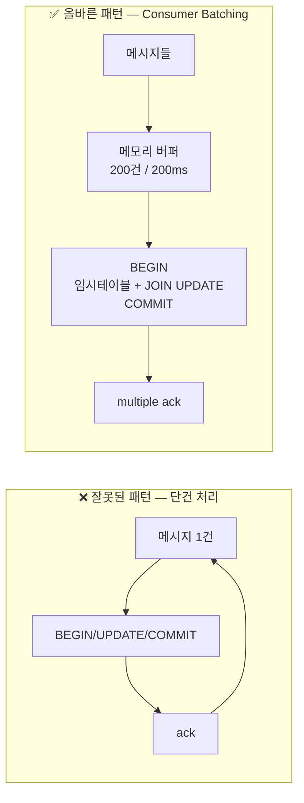

- **잘못된 패턴**: page latch 폭주, AAS 초과, DB 병목 재발
- **올바른 패턴**: latch 한 번 잡고 묶음 처리, AAS 평탄, DB 안정

---

## 9. 해결책 전체 카드 (펼쳐서 보기)

지금까지 본문에서 다룬 + 추가 카드를 한눈에 정리. 각 항목 클릭해서 펼치면 됩니다.

> **권장 도입 순서**: ① → ② → ⑤ 를 먼저 묶어서 도입 → 부하 측정 → 부족하면 ③ ④ ⑥ → 그래도 부족하면 ⑦

---

<details>
<summary><b>① Consumer-Side Batching</b> — 메시지를 메모리에 모았다가 한 번에 쓴다 (★ 최우선)</summary>

### 핵심 아이디어
메시지 1건 받자마자 DB 쓰지 말고, **시간 윈도우 + 개수 윈도우** 로 묶어서 한 번에 처리.

### 트리거 조건
- **개수 도달**: 200건 모이면 즉시 flush
- **시간 도달**: 200ms 지나면 무조건 flush
- 둘 중 먼저 오는 쪽

### 효과
- commit 횟수 100~200배 감소
- AAS peak 감소 → DB 평탄화
- ack 도 multiple ack 로 묶어서 네트워크 비용 ↓

### Trade-off
| 비용 | 영향 |
|---|---|
| 메시지 지연 +100ms | 우리 워크플로는 5분+ 비동기 잡 → **무의미** |
| Consumer crash 시 buffer 손실 | at-least-once + idempotency key 로 안전 |
| 한 건 실패 시 batch 처리 정책 | 전체 nack & requeue 가 기본 |

### 언제 도입
**무조건 도입.** Phase 2 의 첫날부터. 우리 시나리오엔 거의 공짜로 들어옴.

### 한 줄 요약
> "Producer 의 bulk 와 대칭을 맞춰주는 Consumer 의 거울 패턴."

</details>

---

<details>
<summary><b>② JOIN UPDATE (CASE WHEN / 임시 테이블)</b> — batching 했으면 SQL 도 한 방으로</summary>

### 핵심 아이디어
batching 으로 묶었어도 `UPDATE ... WHERE id=?` 를 200번 반복하면 **commit 만 줄고 page latch 는 안 줄어듭니다.** 단일 SQL 로 묶어야 진짜 효과.

### 두 가지 패턴

#### A. CASE WHEN
```sql
UPDATE job
   SET status = CASE job_id
                  WHEN 'j1' THEN 'COMPLETED'
                  WHEN 'j2' THEN 'FAILED'
                  ...
                END,
       platform_reply_id = CASE job_id WHEN 'j1' THEN 'p1' ... END
 WHERE job_id IN ('j1', 'j2', ...);
```

- 장점: 임시 테이블 불필요
- 단점: 컬럼·건수 많아지면 SQL 이 거대해짐, parse 비용 ↑

#### B. 임시 테이블 + JOIN UPDATE (★ 권장)
```sql
TRUNCATE tmp_complete;
INSERT INTO tmp_complete VALUES (...), (...), ... ;  -- bulk

UPDATE job j
  JOIN tmp_complete t ON j.job_id = t.job_id
   SET j.status = t.status,
       j.platform_reply_id = t.platform_reply_id,
       j.error = t.error;
```

- 장점: 옵티마이저가 같은 page row 들을 함께 처리, SQL parse 비용 일정
- 단점: 세션별 임시 테이블 관리 필요

### 효과
같은 page 의 row 들이 **한 번의 latch 안에서 처리됨** → page latch 진짜로 줄어듦.

### 언제 도입
**batching 도입 시 같이.** ① 과 항상 세트.

### 한 줄 요약
> "trans 1번 + commit 1번만으론 부족하다. SQL 자체가 1번이어야 한다."

</details>

---

<details>
<summary><b>③ Write-Behind Buffer (Redis Sink)</b> — DB 쓰기를 비동기 sink 로 분리</summary>

### 핵심 아이디어
Consumer 가 메시지를 받으면 **DB 가 아니라 Redis 에 먼저** 기록. 별도의 sink 워커가 Redis 의 누적된 변경분을 주기적으로 bulk DB 에 flush.

### 구조
```
scrape.complete → Consumer → Redis (HSET pending_writes)
                                  ↓ 1초 또는 1000건
                              DB Sink Worker → Aurora (bulk JOIN UPDATE)
```

### 효과
- Consumer 의 ack 가 microsecond 단위로 빨라짐
- DB 부하가 완전 격리됨 (sink 가 자기 페이스로 처리)
- 백프레셔가 DB → Redis 로 이동

### Trade-off
| 비용 | 영향 |
|---|---|
| Crash 시 Redis 미반영 손실 위험 | AOF every-write 로 완화 |
| 시스템 복잡도 ↑↑ | sink 서비스 신규 운영 |
| 최종 일관성 시간 ↑ (즉시 → 1~2초) | 진행률 표시 등 영향 |
| 디버깅 추적 길어짐 | "DB 에 왜 반영 안 됐지?" 추적 어려움 |

### 언제 도입
**① + ② 로도 부족할 때만.** 처음부터 도입하면 over-engineering. 트래픽이 10배쯤 더 늘어나거나, peak burst 가 분당 수만 건 수준이면 검토.

### 한 줄 요약
> "DB 쓰기를 메시지 처리에서 떼어내서 별도 비동기 sink 로."

</details>

---

<details>
<summary><b>④ Append-Only (Event Sourcing) 패턴</b> — UPDATE 자체를 INSERT 로 대체</summary>

### 핵심 아이디어
**UPDATE 가 본질적으로 INSERT 보다 비싸다** (인덱스 키 바뀌면 옛 page 삭제 + 새 page 삽입 = 2배). 그러면 UPDATE 를 아예 안 하고 상태 변화를 INSERT 만으로 기록.

### 구조
```sql
-- 기존: UPDATE
UPDATE job SET status='COMPLETED' WHERE job_id=?;

-- Append-only:
INSERT INTO job_event (job_id, status, occurred_at, payload)
VALUES (?, 'COMPLETED', NOW(), ?);

-- 현재 상태 조회
SELECT job_id, status FROM (
  SELECT job_id, status,
         ROW_NUMBER() OVER (PARTITION BY job_id ORDER BY occurred_at DESC) rn
    FROM job_event
) WHERE rn = 1;
```

### 왜 더 싼가
| 항목 | INSERT | UPDATE |
|---|---|---|
| 만지는 page | right-most 1개 | 임의의 page (옛 + 새) |
| 보조 인덱스 갱신 | append 만 | 삭제 + 삽입 |
| 단조 추가 특성 | 있음 → 락 충돌 적음 | 없음 → 충돌 가능 |

### Trade-off
| 비용 | 영향 |
|---|---|
| 디스크 사용량 ↑ | 이력 다 저장 → 파티션·TTL 필요 |
| 읽기 비용 ↑ | latest 찾는 윈도우 함수 |
| Materialized view 필요 | 자주 조회되면 snapshot 테이블 별도 운영 |
| 이력 자동 보존 (덤) | 감사 로그 공짜로 따라옴 |

### 언제 도입
**Job 의 status UPDATE 가 진짜 핫스팟으로 확인됐을 때.** 우리 워크플로에선 job 의 상태 전이가 5~6번 일어나므로 후보가 됨. 다만 조회 패턴이 바뀌므로 큰 변경.

### 한 줄 요약
> "Kafka·ClickHouse·Cassandra 가 다 이 사상. UPDATE 를 없애면 동시성 문제가 본질적으로 사라진다."

</details>

---

<details>
<summary><b>⑤ 부분 인덱스 + 인덱스 다이어트</b> — hot row 만 색인해서 B+Tree 를 작게</summary>

### 핵심 아이디어
`job.status` 인덱스에 들어가는 row 는 모든 잡(수백만 건)이 아니라, **현재 진행 중인 잡(수십~수백 건)만** 들어가도록 제한.

### MySQL 8.0+ 에서 (Generated Column 트릭)
```sql
ALTER TABLE job ADD COLUMN status_hot VARCHAR(20) AS
  (CASE WHEN status IN ('QUEUED', 'IN_PROGRESS')
        THEN status
        ELSE NULL END)
  STORED;

CREATE INDEX idx_job_status_hot ON job(status_hot, created_at);
```

→ `status_hot` 이 NULL 인 row 는 인덱스에 들어가지 않음. 완료된 잡(COMPLETED, FAILED) 은 자동으로 인덱스에서 빠짐.

### PostgreSQL 의 진짜 부분 인덱스 (참고)
```sql
CREATE INDEX idx_job_active ON job(status, created_at)
WHERE status IN ('QUEUED', 'IN_PROGRESS');
```

### 효과
| 항목 | 일반 인덱스 | 부분 인덱스 |
|---|---|---|
| 색인된 row 수 | 100만+ | 수십~수백 |
| B+Tree 깊이 | 4~5 | 1~2 |
| leaf page 수 | 수천 | 1~2 장 |
| UPDATE 시 인덱스 갱신 비용 | 큼 | 거의 0 |
| 같은 page 핫스팟 | 발생 | 작은 인덱스라 무의미 |

### 추가 — 인덱스 다이어트
같은 김에 **안 쓰는 보조 인덱스도 함께 삭제**:
```sql
-- 6개월 동안 쿼리에 안 쓰인 인덱스 찾기
SELECT * FROM sys.schema_unused_indexes
WHERE object_schema = 'flab';
```

인덱스 1개 = INSERT/UPDATE 마다 page 갱신 1개 추가. 안 쓰면 삭제가 정답.

### 언제 도입
**무조건 검토.** ① ② 와 같이 묶어서. 코드 변경 거의 없고 효과 큼.

### 한 줄 요약
> "인덱스가 작아지면 핫스팟도 작아진다. 끝난 잡은 색인할 이유가 없다."

</details>

---

<details>
<summary><b>⑥ Partitioning / Sharding</b> — page 핫스팟을 물리적으로 N 분할</summary>

### 핵심 아이디어
`job` 테이블이 진짜로 핫하면, **물리적으로 쪼개서** right-most page 가 N 개가 되도록.

### 두 가지 전략

#### A. 시간 기반 Range Partitioning
```sql
ALTER TABLE job
PARTITION BY RANGE (TO_DAYS(created_at)) (
  PARTITION p_202404 VALUES LESS THAN (TO_DAYS('2024-05-01')),
  PARTITION p_202405 VALUES LESS THAN (TO_DAYS('2024-06-01')),
  PARTITION p_202406 VALUES LESS THAN (TO_DAYS('2024-07-01'))
);
```

- 각 partition = 독립된 B+Tree → 독립된 page 들
- 옛 partition 은 cold, 현재 partition 만 hot
- 옛 partition **DROP** 만으로 정리 가능 (수십 GB 도 즉시)
- **운영 데이터 retention 관리에 압도적으로 유리**

#### B. Hash Partitioning
```sql
PARTITION BY HASH(CRC32(job_id)) PARTITIONS 16;
```

- 같은 시점 INSERT 들이 16개 partition 에 분산
- **right-most page 핫스팟이 16개로 쪼개짐**
- partition key (job_id) 로 조회 시 partition pruning 됨

### Trade-off
| 비용 | 영향 |
|---|---|
| partition key 안 쓰는 쿼리 | 모든 partition 스캔 |
| FK 제약 일부 제약 | MySQL 의 partitioning 제약 |
| 운영 자동화 필요 | 새 partition 추가 cron |
| 마이그레이션 비용 ↑ | 기존 테이블 → 파티션 테이블 |

### 언제 도입
**Phase 2 부하 측정 결과 ⑤ 까지 했는데도 진짜 hot page 가 보일 때.** 트래픽이 분당 만 건 이상이거나 retention 관리가 필요해질 때.

### 한 줄 요약
> "page latch 는 메모리 mutex. 다른 partition 은 다른 mutex. 진짜 병렬화의 마지막 카드."

</details>

---

<details>
<summary><b>⑦ Writer 사양 업그레이드</b> — 최후의 카드</summary>

### 핵심 아이디어
위 1~6 다 했는데도 부족하면 vCPU 와 메모리를 늘림.

### 단계
```
db.r7g.xlarge  (4 vCPU,  32 GB)  ← 현재
   ↓
db.r7g.2xlarge (8 vCPU,  64 GB)  ← AAS 한계 2배
   ↓
db.r7g.4xlarge (16 vCPU, 128 GB)
   ↓
db.r7g.8xlarge (32 vCPU, 256 GB)
```

비용은 거의 선형 증가.

### 효과
| 항목 | 효과 |
|---|---|
| AAS 한계 | vCPU 따라 비례 증가 → 다른 트랜잭션 묻혀가는 영향 ↓ |
| Buffer Pool | hot data 더 많이 RAM 에 적재 |
| Connection 처리 | 여유 ↑ |
| **page latch 자체** | **줄어들지 않음** (mutex 는 코어 늘어도 같은 mutex) |

### 한계
**돈으로 사는 시간 벌이.** 구조 개선을 안 한 채 사양만 올리면:
- 트래픽 증가 시 같은 문제 재발
- 비용은 사양에 선형이지만 효과는 sub-linear
- 결국 ① ~ ⑥ 를 해야 함

### 언제 도입
**진짜 마지막.** 구조 개선 다 한 다음, 그래도 비즈니스가 더 빨리 자라서 시간이 필요할 때. 또는 "내일까지 운영 안정화 해라" 같은 비상 상황의 임시방편.

### 한 줄 요약
> "사양 업은 시간을 사는 일이지 문제를 푸는 일이 아니다."

</details>

---

## 10. 요약 카드 — 한 장으로

| # | 카드 | 비용 | 효과 | 우선순위 |
|---|---|---|---|---|
| ① | Consumer Batching | 낮음 | commit 100배 ↓ | ★★★ 즉시 |
| ② | JOIN UPDATE | 낮음 | page latch 진짜 ↓ | ★★★ ① 과 세트 |
| ⑤ | 부분 인덱스 | 낮음 | hot row 만 색인 | ★★★ 같이 도입 |
| ③ | Redis Sink | 중간 | DB 격리 | ★ 필요시 |
| ④ | Append-Only | 중간 | UPDATE 제거 | ★ 필요시 |
| ⑥ | Partitioning | 높음 | page 핫스팟 분산 | ★ 트래픽 10배 시 |
| ⑦ | 사양 업 | 높음 | 시간 벌이 | ☆ 최후 |

**우리 Phase 2 의 정답**: **① + ② + ⑤** 를 묶어서 도입 → 측정 → 부족하면 다음 카드.

---

## 11. 멀티 인스턴스 함정 — Consumer Scale-out 의 천장

> **여기까지 읽고 안심하면 안 됩니다.**
> 위의 카드들은 **Consumer 1대 기준의 단건 → bulk** 문제를 풀어줍니다. 그러나 production 에서 Consumer 는 보통 여러 대로 돌립니다 (장애 대비, 처리량 확보). 이때 새로운 함정이 생깁니다.

### 11.1 문제 — Consumer N대가 동시 flush 하면?

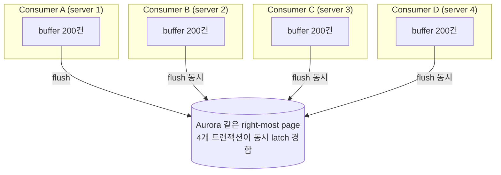

**Consumer 1대일 땐 동시 트랜잭션 1개여서 latch 줄서기가 없었는데**, N대가 되면 같은 시점에 N개의 bulk 트랜잭션이 같은 page 를 노립니다.

### 11.2 정량 비교 — "여전히 200배 좋음"

| 시나리오 | 동시 트랜잭션 | page latch 경합 |
|---|---|---|
| 단건 처리, 1대 (prefetch=50) | 50 | 50 |
| 단건 처리, 4대 (prefetch=50) | 200 | **200** |
| Batching 200, 1대 | 1 | 0 |
| Batching 200, 4대 | 4 | **4** |
| Batching 200, 40대 | 40 | **40** |

```
   ★ 핵심 비교 ★
   ──────────────────────────────────────
   단건 4대:  800 트랜잭션 → 800 latch 경합
   Batch 4대:   4 트랜잭션 →   4 latch 경합
   ──────────────────────────────────────
              여전히 200배 차이
```

→ **batching 의 효과는 살아있지만, 경합이 0 이 아니라 "확연히 적음"**.

### 11.3 진짜 위험 — Consumer 수가 vCPU 한계를 넘어서면

```
┌──────────────────────────────────────────────────────────┐
│  Aurora Writer = 4 vCPU                                   │
├──────────────────────────────────────────────────────────┤
│  Consumer 1대 batching:  1 트랜잭션 동시 → 안전           │
│  Consumer 2대 batching:  2 트랜잭션 동시 → 안전           │
│  Consumer 4대 batching:  4 트랜잭션 동시 → 한계선         │
│  Consumer 8대 batching:  8 트랜잭션 동시 → AAS 초과       │
│  Consumer 16대 batching: 16 트랜잭션 동시 → 폭주          │
└──────────────────────────────────────────────────────────┘
```

**"batching 했으니 Consumer 를 무한히 늘릴 수 있다"는 착각이 위험.**

- ALB 뒤의 stateless 웹서버: DB 가 안 받쳐주면 응답만 느려짐
- Consumer: DB 가 안 받쳐주면 **자기 큐에 backlog 가 쌓여 시스템 무너짐**

→ **Consumer scale-out 은 항상 DB write 천장 아래에서만 작동.**

### 11.4 멀티 인스턴스용 추가 장치 5가지 (토글로 보기)

<details>
<summary><b>⑧ Routing Key 메시지 샤딩</b> — 같은 키는 같은 Consumer 로 (consistent hashing)</summary>

### 핵심 아이디어
RabbitMQ 의 **consistent-hash exchange** 또는 direct exchange + routing key 로, **같은 shop_id 의 메시지는 항상 같은 Consumer 인스턴스로** 라우팅.

### 구조
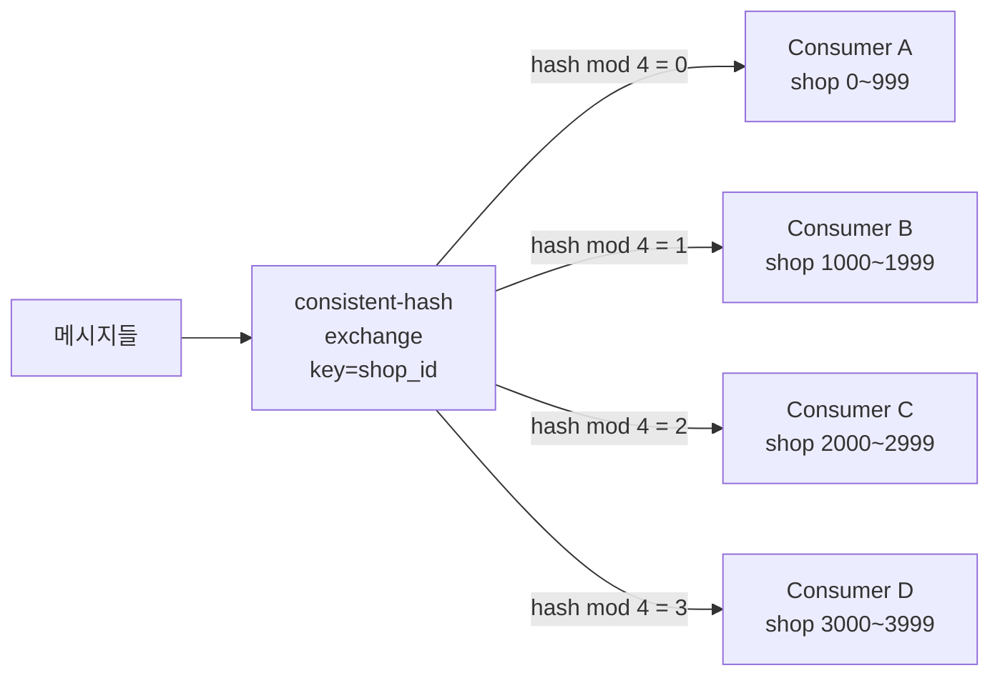

### 효과
- 각 Consumer 가 서로 다른 shop_id 집합만 처리
- 다른 shop = 다른 reply row → 다른 page 가 hit 될 확률 ↑
- page latch 경합 자연 분산
- **순서 보장 보너스**: 같은 shop 의 댓글이 도착 순서대로 처리됨

### 한계
`(request_status, created_at)` 처럼 **shop 과 무관한 인덱스 키**는 여전히 같은 page 핫스팟. shop 분산이 created_at 분산을 보장하지는 않음.

### 언제 도입
**Consumer 가 2대 이상 되는 순간.** 멀티 인스턴스의 출발점.

### 한 줄 요약
> "메시지 큐가 라운드 로빈으로 던지면 경합, 키 해시로 던지면 격리."

</details>

---

<details>
<summary><b>⑨ Hash Partitioning 결합</b> — DB 레벨에서도 같은 키로 분산</summary>

### 핵심 아이디어
⑧ routing key 만으론 인덱스 page 핫스팟이 남으니, **DB 테이블도 같은 키로 partition** 으로 쪼개서 같은 시간대 INSERT 가 다른 partition 으로 가게.

### SQL
```sql
ALTER TABLE job
PARTITION BY HASH(CRC32(shop_id)) PARTITIONS 16;
```

### 구조
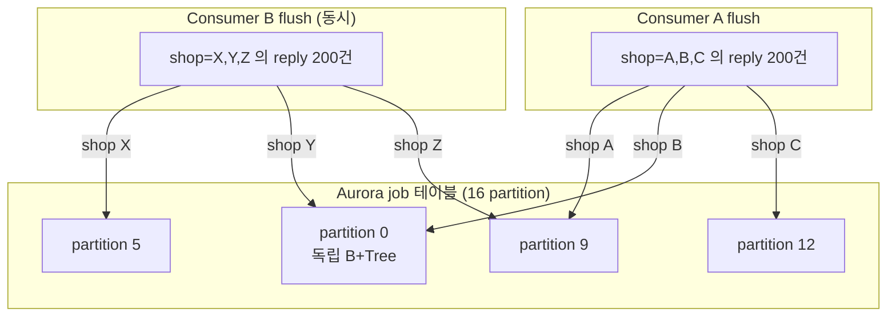

### 효과
- 동시 flush 해도 **partition 단위로 latch 가 다름**
- 같은 partition 충돌 확률 = `1 / partition 수`
- 16 partition + 4 consumer = 충돌 확률 25% 이하

### ⑧ + ⑨ 의 시너지
- ⑧ : 메시지 레벨 격리
- ⑨ : DB 레벨 격리
- 두 단계가 **같은 키(shop_id) 로 정렬**되면 → 완전 격리

### 언제 도입
Consumer 가 4대 넘기 시작하고 latch 경합이 보이기 시작할 때. ⑧ 와 항상 같은 키로 묶어 도입.

### 한 줄 요약
> "메시지가 4개 큐로 갈라지고, DB 도 16 partition 으로 갈라지면 같은 page 만날 확률이 곱으로 줄어든다."

</details>

---

<details>
<summary><b>⑩ DB Sink Worker</b> — Consumer 와 DB Writer 의 완전 분리 (★ 강력)</summary>

### 핵심 아이디어
Consumer 가 N대여도, **DB 쓰기는 소수의 sink worker (보통 1~2대) 만 담당**. Consumer 는 메시지 처리 후 Redis 에 누적, sink 가 주기적으로 bulk flush.

### 구조
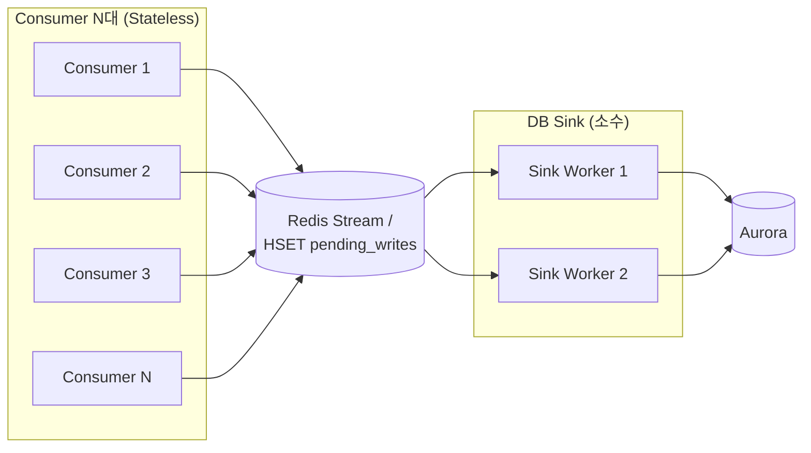

### 효과
| Consumer 수 | Sink 수 | DB 동시 트랜잭션 |
|---|---|---|
| 1 | 1 | 1 |
| 10 | 1 | **1** ★ |
| 100 | 2 | **2** ★ |

**Consumer 를 무한 확장해도 DB 동시성은 sink 수에 묶임.** Consumer scale-out 의 천장이 사실상 사라짐.

### 단점
| 비용 | 영향 |
|---|---|
| Sink 가 SPoF | leader election 으로 2~3대 + standby |
| Redis 가 새 SPoF | AOF every-write + replication |
| 시스템 복잡도 ↑↑ | 신규 컴포넌트 운영 부담 |
| 최종 일관성 ↑ (1~2초) | 진행률 표시 영향 |

### 언제 도입
**Consumer 가 10대 이상 필요해질 때.** 또는 ⑧⑨ 적용 후에도 DB 가 천장에 부딪힐 때. 초기엔 over-engineering.

### 한 줄 요약
> "DB write 를 메시지 처리에서 떼어내면, Consumer scale-out 과 DB scale 이 독립된다."

</details>

---

<details>
<summary><b>⑪ Consumer 자연 상한선 + Window 튜닝</b> — 늘리지 말고 잘 쓰기</summary>

### 핵심 아이디어
Consumer 수를 **vCPU × 2 = 8대 이하**로 제한하고, 처리량이 부족하면 **batching 윈도우를 키우기**.

### 처리량 부족 시 대처 순서
1. ❌ Consumer 늘리기 (천장 빠르게 부딪힘)
2. ✅ batching window 늘리기 (200ms → 500ms)
3. ✅ batching size 늘리기 (200 → 500)
4. ✅ 그래도 부족하면 ⑩ Sink 패턴으로

### 왜 Window 키우는 게 더 나은가
- Consumer 늘림 = 동시 트랜잭션 증가 = latch 경합 증가
- Window 늘림 = 트랜잭션 당 처리 row 증가 = **commit 횟수는 그대로** = latch 경합 동일
- 같은 처리량을 더 적은 commit 으로 달성

### Trade-off
| 비용 | 영향 |
|---|---|
| 메시지 지연 ↑ (200ms → 500ms) | 우리 5분+ 잡엔 무의미 |
| Consumer 메모리 ↑ | 500건 buffer 도 수 MB 수준 |
| Crash 시 손실 범위 ↑ | 멱등성 키로 안전 |

### 언제 도입
**항상.** Consumer 수 결정 정책의 기본값.

### 한 줄 요약
> "수평 확장의 본능을 누르고, batching window 부터 키워라."

</details>

---

<details>
<summary><b>⑫ 글로벌 Coordinator (분산 락 / 토큰)</b> — 참고용 (보통 안 함)</summary>

### 핵심 아이디어
Redis 또는 RMQ exclusive consumer 로 **"지금 DB 쓸 수 있는 Consumer 는 N 대"** 토큰 제한.

### 동작
```
Redis: SET write_token:1, write_token:2, ..., write_token:N
Consumer: SETNX write_token:? → 획득해야만 flush
        → 끝나면 DEL
```

### 효과
- DB 동시 트랜잭션을 N 으로 강제 제한
- Consumer 가 100대여도 DB 부하 일정

### 왜 보통 안 하나
- Consumer latency 증가 (락 대기)
- 분산 락 자체의 운영 부담
- **⑩ Sink 패턴이 같은 목적을 더 깔끔하게 달성**

### 언제 도입
거의 안 함. ⑩ Sink 패턴이 정치적으로 어려운 (인프라 추가 거부) 환경에서 임시방편으로.

### 한 줄 요약
> "코디네이터로 DB write 를 throttle 하느니, Sink 로 아키텍처를 깔끔하게 가르는 게 낫다."

</details>

### 11.5 권장 도입 순서 (멀티 인스턴스 환경)

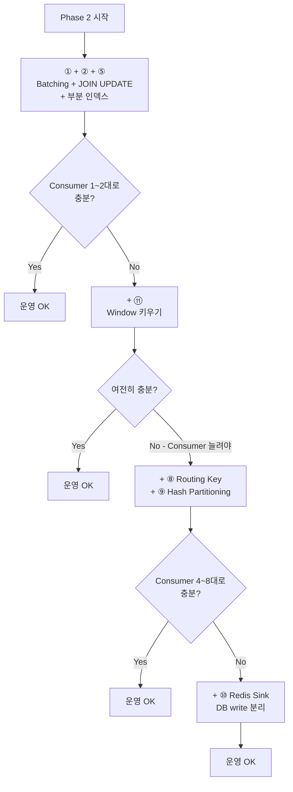

| 단계 | 도입 시점 | 효과 |
|---|---|---|
| **① + ② + ⑤** | 처음부터 | 단건 → bulk, latch 100배 ↓ |
| **+ ⑪ Window 튜닝** | Consumer 1대 처리량 부족 시 | 수평 확장 미루기 |
| **+ ⑧ Routing Key** | Consumer 가 2~4대 넘을 때 | 메시지 레벨 격리 |
| **+ ⑨ Partitioning** | DB latch 다시 보일 때 | DB 레벨 격리 |
| **+ ⑩ Redis Sink** | Consumer 10대+ 필요 | Consumer/DB 완전 분리 |

### 11.6 멀티 인스턴스 환경에서 진짜 봐야 할 지표

```
[Performance Insights]
   ├─ AAS (Average Active Sessions)
   │    → vCPU 한계(4) 위로 솟는가?
   │
   ├─ Top Wait Events
   │    → wait/synch/rwlock/innodb/index_tree_rw_lock 비중
   │    → Consumer 늘리면 같이 증가하는가? (Yes 면 latch 천장)
   │
   ├─ Lock Waits
   │    → 같은 page 에 모이는 패턴 보임
   │
   └─ Consumer 메트릭
        → Consumer 별 처리량이 균등한가? (routing 잘 됨)
        → Consumer N 대 추가 시 throughput 이 N 배 늘어나는가?
          → 안 늘면 이미 DB latch 천장
```

**핵심 신호**: "Consumer 1대 추가했을 때 throughput 이 진짜 1.X 배 늘어나는가?" 안 늘어나면 DB write 가 천장. 그땐 ⑧⑨⑩ 차례.

### 11.7 정리 — 한 줄로

> **"Consumer batching 은 단일 인스턴스의 단건 → bulk 문제를 풉니다. 멀티 인스턴스의 동시 flush 경합은 routing key + partitioning + (필요시) sink 분리, 이건 batching 과 다른 차원의 문제입니다. 둘은 결합해야 완성됩니다."**

면접에서 받았을 때 안전한 답:
> "단일 인스턴스의 batching 과 멀티 인스턴스의 경합은 별개 문제입니다. 전자는 commit 횟수 압축, 후자는 메시지·DB 양 단의 키 기반 격리(routing key + hash partition)로 풉니다. Consumer scale-out 은 항상 DB write 천장 아래에서만 작동한다는 게 본질입니다."

---

## 12. 부록 — Connection 수와 AAS, 정확히 이해하기

> **운영 마스터와 초보 운영자의 차이가 갈리는 지점.**
> "max_connections=2000 인데 왜 AAS 는 vCPU × 2 만 안전선이지?" — 두 숫자가 같은 단위가 아닙니다. 정확히 풀어둡니다.

<details>
<summary><b>① 한 줄 요약 — Connection ≠ Active Session ≠ AAS</b></summary>

### 세 개념의 명확한 구분

| 개념 | 정의 | 단위 | 우리 사양 한계 |
|---|---|---|---|
| **Connection** | TCP 소켓 + DB 세션. "줄로 꽂혀 있는" 상태 | 개수 | **2,000** (max_connections) |
| **Active Session** | 그 중에서 지금 **실제로 일하고 있는** 세션 | 개수 (순간값) | 보통 1~수 명 |
| **AAS** | Active Session 의 **시간 평균** | 명·시간/시간 (= 무차원) | vCPU × 2 ≈ **8** 안전선 |

### 핵심 통찰
- Connection 2,000 까지 차도 AAS 만 낮으면 DB 는 멀쩡
- Connection 100 만 차도 AAS 가 10 이면 DB 가 죽음
- **진짜 봐야 할 건 AAS 한 줄**

</details>

---

<details>
<summary><b>② 식당 비유</b> — 가장 정확한 직관</summary>

```
┌──────────────────────────────────────────────────────────────────┐
│                  식당 (Aurora Writer)                              │
│                                                                    │
│   테이블 수: 2,000 (max_connections)                              │
│                                                                    │
│   ┌────────────────────────────────────────────────────────┐    │
│   │ T1 [손님]   T2 [손님]   T3 [빈]   T4 [손님]   ...        │    │
│   │   앉아만      메뉴 보는중       앉아만                    │    │
│   │   있음                          있음                      │    │
│   └────────────────────────────────────────────────────────┘    │
│                                                                    │
│   주방 화구: 4개 (vCPU)                                          │
│   ┌────────────────────────────────────────────────────────┐    │
│   │  🔥 요리중   🔥 요리중   🔥 빈    🔥 빈                  │    │
│   │  김씨 주문    이씨 주문                                   │    │
│   └────────────────────────────────────────────────────────┘    │
│                                                                    │
│   현재 상태:                                                       │
│   - 테이블 사용: 1,500 / 2,000  ← connection                     │
│   - 실제 음식 만드는 손님: 2명  ← active session                 │
│   - AAS ≈ 2                                                       │
└──────────────────────────────────────────────────────────────────┘
```

### 비유 매핑

| 식당 | DB |
|---|---|
| 앉아 있는 손님 | connection |
| 음식 만들고 있는 손님 | active session |
| 음식 만드는 화구 | vCPU |
| 화구가 부족하면 줄 섬 | AAS > vCPU 일 때 commit latency 폭증 |
| 손님이 앉아만 있고 안 시킴 | IDLE connection (정상) |
| 주문 후 화구 부족해서 대기 | WAITING (락/I/O 대기) |

### 핵심
**대부분의 손님은 그냥 앉아 있을 뿐, 음식을 만드는 손님은 항상 소수.** Connection 이 많아도 AAS 는 낮은 게 정상.

</details>

---

<details>
<summary><b>③ DB 세션의 4가지 상태</b> — 어떤 상태가 AAS 에 잡히나</summary>

### 세션 상태 전이

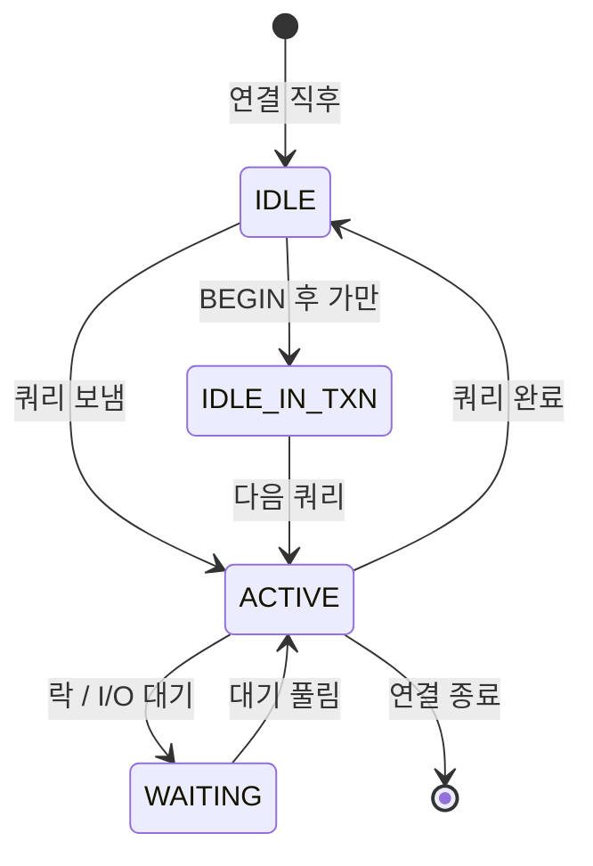

### 상태별 AAS 카운트

| 상태 | 의미 | AAS 에 잡힘? |
|---|---|---|
| **IDLE** | 연결만 됨, 쿼리 안 보냄 | ❌ |
| **ACTIVE** | 지금 CPU 위에서 쿼리 실행 중 | ✅ |
| **WAITING** | 락 / I/O 대기 (CPU 점유 X but 일은 못함) | ✅ |
| **IDLE IN TRANSACTION** | BEGIN 후 다음 쿼리 안 보내고 가만 | △ (위험 신호) |

### IDLE IN TRANSACTION 이 위험한 이유
앱이 BEGIN 만 해놓고 외부 호출(HTTP, 파일 IO 등) 로 5분간 대기 → 그 동안 잡은 row lock 은 안 풀림. AAS 는 낮지만 **다른 세션이 그 row 를 못 만지는** 무서운 상태.

→ **우리 As-Is 의 5분+ 트랜잭션이 정확히 이 패턴.**

</details>

---

<details>
<summary><b>④ AAS 계산식 + 예시 3개</b> — 같은 connection 수, 다른 AAS</summary>

### 정확한 정의

```
              ∑ (각 세션이 활성/대기 상태였던 시간)
   AAS  =  ────────────────────────────────────────
                       관측 시간 윈도우
```

**시간 평균.** 1초 동안 AAS 가 2 라는 건 "1초 중 평균 2개의 세션이 일했다" 는 뜻.

### 시나리오 A: 빠른 쿼리, 많은 connection
```
1000 connection, 모두 10ms 짜리 쿼리, 1초에 1번
─────────────────────────────────────────────
세션 1: ▮▮ (10ms active) ⋯⋯⋯ (990ms idle)
세션 2: ▮▮ (10ms active) ⋯⋯⋯
...
세션 1000: ▮▮ (10ms active) ⋯⋯⋯

총 active 시간 = 1000 × 10ms = 10,000ms = 10초
관측 시간 = 1초
AAS = 10초 / 1초 = 10
```
→ connection 1000개여도 AAS = 10. **vCPU 4 초과. 위험.**

### 시나리오 B: 같은 connection, 더 빠른 쿼리
```
1000 connection, 모두 1ms 짜리 쿼리, 1초에 1번
AAS = 1000 × 1ms / 1초 = 1
```
→ 같은 connection 수지만 AAS = 1. **여유.**

### 시나리오 C: 우리 As-Is (5분+ 트랜잭션)
```
세션 1: ▮▮▮▮▮▮▮▮▮▮▮▮▮▮▮▮▮▮▮▮ (5분 동안 IDLE IN TXN, 락 잡고 있음)
세션 2: ▮▮▮▮▮▮▮▮▮▮▮▮▮▮▮▮▮▮▮▮ 
...
```
→ active 가 아니라 IDLE IN TRANSACTION. AAS 는 낮지만 **connection 풀이 5분간 잠김**. AAS 가 멀쩡해 보여도 죽어가는 패턴.

### 결론
**연결 수 × 쿼리 길이 = AAS 의 본질.** 짧은 쿼리는 connection 이 많아도 안전, 긴 쿼리는 connection 이 적어도 위험.

</details>

---

<details>
<summary><b>⑤ 왜 안전선이 vCPU × 2 인가</b> — vCPU 가 아니라 × 2</summary>

### 직관 vs 현실

직관적으로는 "vCPU 4개니까 AAS 4까지 OK" 같지만, 실제로는 **× 2 가 sweet spot** 입니다.

### 이유 — 세션은 CPU 를 100% 점유하지 않는다

```
세션 하나의 시간 분해
─────────────────────
   ▮▮▮▮▮▮ active (CPU 위에서 계산 중)
   ▮▮     CPU 점유 50% 정도
   
   ▭▭▭▭ waiting (I/O, lock, network)
   ▭▭▭▭ CPU 비어 있음
```

세션이 active 상태여도 **실제 CPU 점유 시간은 절반쯤** (나머지는 디스크 I/O, 네트워크, 로그 flush 등).

```
CPU 효율 ≈ 50%
   ↓
vCPU 4 × 2 = 8 정도의 AAS 까지 CPU 가 안 비고 잘 활용됨
   ↓
그 이상부턴 진짜로 CPU 큐가 쌓임 → context switching 비용 폭증
```

### 안전선 휴리스틱

```
┌──────────────────────────────────────────────────────┐
│  AAS ≤ vCPU × 1   → 한가함, 자원 남음               │
│  AAS ≤ vCPU × 2   → 적정 부하 (sweet spot)          │
│  AAS ≤ vCPU × 3   → 한계선, P95 latency 솟기 시작   │
│  AAS  > vCPU × 4  → 폭주, commit latency 폭증       │
└──────────────────────────────────────────────────────┘
```

본문에서 "vCPU × 2 가 안전선" 이라고 한 건 이 sweet spot 의 보수적 표기. 정확히는 1~3 사이.

</details>

---

<details>
<summary><b>⑥ Production 에서 보는 법</b> — Performance Insights / SQL</summary>

### Aurora Performance Insights — 핵심 화면

```
┌────────────────────────────────────────────────────────────────┐
│  Performance Insights                                            │
├────────────────────────────────────────────────────────────────┤
│                                                                  │
│  Database Load (= AAS 그래프)                                   │
│                                                                  │
│  ┌─────────────────────────────────────────────────────────┐   │
│  │ ─── max vCPU = 4 ─────────────────────────────────  ★   │   │
│  │                                                          │   │
│  │              ▓▓▓ ← CPU                                  │   │
│  │           ▓▓▓▓▓▓                                        │   │
│  │        ▓▓▓▓▓▓▓▓▓ ░░░░ ← Lock waits                     │   │
│  │     ▓▓▓▓▓▓▓▓▓▓░░░░░░░                                  │   │
│  │  ▓▓▓▓▓▓▓▓▓▓░░░░░░░░░░                                  │   │
│  │  ─────────────────────────── (시간)                     │   │
│  └─────────────────────────────────────────────────────────┘   │
│                                                                  │
│  진단 포인트:                                                    │
│   ★ max vCPU 라인 위로 솟으면 AAS 초과                         │
│   ★ 색깔별로 wait event 분포 보임                              │
│   ★ 빨간색 (Lock) 많으면 latch / row lock 경합                 │
└────────────────────────────────────────────────────────────────┘
```

### CloudWatch 지표 매핑

| 지표 | 의미 | 무엇을 보나 |
|---|---|---|
| `DatabaseConnections` | 현재 연결 수 | 2000 가까이 가는지 |
| `CPUUtilization` | CPU 사용률 | 80% 넘으면 위험 |
| **`DBLoad`** | **AAS** | **vCPU 라인 위로 솟는지** |
| `DBLoadCPU` | CPU 위에서 활성인 AAS | CPU 자체가 병목인지 |
| `DBLoadNonCPU` | 대기 중인 AAS | Lock / IO 가 병목인지 |

### SQL 로 직접 확인 — 지금 누가 일하나

```sql
SELECT 
  COUNT(*) AS total_conn,
  SUM(CASE WHEN COMMAND != 'Sleep' THEN 1 ELSE 0 END) AS active,
  SUM(CASE WHEN COMMAND = 'Sleep' THEN 1 ELSE 0 END) AS idle,
  SUM(CASE WHEN STATE LIKE '%lock%' THEN 1 ELSE 0 END) AS waiting_lock
FROM INFORMATION_SCHEMA.PROCESSLIST;
```

결과 예시:
```
total_conn | active | idle  | waiting_lock
   1,500   |    3   | 1,495 |       2
```

→ connection 1,500 중 실제 일하는 건 3개. **AAS ≈ 3. 건강한 상태.**

</details>

---

<details>
<summary><b>⑦ As-Is 의 진짜 위험 패턴</b> — connection 멀쩡한데 왜 느려?</summary>

### 운영자가 처음 마주치는 가장 헷갈리는 패턴

```
┌─────────────────────────────────────────────────────────────┐
│  As-Is 의 위험 패턴                                          │
│  — connection 은 안 차도 AAS 가 폭증                         │
├─────────────────────────────────────────────────────────────┤
│                                                               │
│  1. HTTP 요청 100건 동시                                      │
│     ↓                                                         │
│  2. API 서버가 100개 트랜잭션 BEGIN                          │
│     ↓                                                         │
│  3. 각자 reply INSERT + UPDATE 시작                           │
│     ↓                                                         │
│  4. 같은 page latch 경합으로 99개가 대기                     │
│     ↓                                                         │
│  ★ AAS 가 순간적으로 100 가까이 솟음 (waiting on lock)        │
│  ★ connection 은 100 으로 멀쩡 (max 2000 의 5%)              │
│  ★ DBLoad 그래프는 max vCPU 라인 25배 위로                   │
│  ★ P95 latency 100ms → 10s                                  │
│                                                               │
└─────────────────────────────────────────────────────────────┘
```

### 잘못된 진단 흐름 (초보 운영자)
```
"왜 느려?"
   ↓
DatabaseConnections 확인 → "100 밖에 안 되네 정상" 
   ↓
CPUUtilization 확인 → "50% 밖에 안 되네 정상"
   ↓
"그럼 왜 느려?"  ← 미궁
```

### 올바른 진단 흐름 (운영 마스터)
```
"왜 느려?"
   ↓
DBLoad (AAS) 그래프 → "max vCPU 라인 위로 솟네"
   ↓
DBLoadNonCPU 색 분포 → "빨간색(Lock) 우세"
   ↓
Top SQL → "reply UPDATE 가 90% 차지"
   ↓
SHOW ENGINE INNODB STATUS → "index page latch 경합"
   ↓
✅ 원인 확정: 같은 보조 인덱스 page 핫스팟
```

### 한 줄
**"connection 수 묻지 말고 AAS 그래프 가져와봐"** — 운영 마스터의 진단 한 마디.

</details>

---

<details>
<summary><b>⑧ To-Be 가 이걸 어떻게 바꾸나</b> — Before / After</summary>

### 지표 변화

| 지표 | As-Is | To-Be | 변화 본질 |
|---|---|---|---|
| **Connections (peak)** | 500~1000 (5분 트랜잭션 누적) | 50~100 (ms 단위 짧은 TX) | 트랜잭션 길이 단축 |
| **Active connections** | 100+ (동시 진행) | 1~4 (bulk 후 즉시 해제) | 트랜잭션 동시성 ↓ |
| **AAS peak** | **10~30 (vCPU 7배)** | **2~4 (vCPU 한계 이하)** | **page latch 경합 해소** |
| AAS 색 분포 | 빨강 (Lock) 우세 | 파랑 (CPU) 우세 (정상) | latch → 정상 CPU |
| Commit latency P95 | 1~5s | 10~50ms | 줄어든 경합의 결과 |
| Idle in Transaction | 100+ (5분짜리) | ~0 (트랜잭션 ms) | HTTP 분리의 효과 |

### 핵심 통찰
- To-Be 는 **connection 도 줄고 AAS 도 줄지만**, **진짜 줄이는 건 AAS**
- connection 감소는 부수효과 (트랜잭션이 짧아지니까 자연스럽게)
- **AAS 가 vCPU × 2 이하로 평탄해지는 게 성공의 지표**

### 측정 KPI (Phase 2 검증)

| 시점 | 기대값 |
|---|---|
| Phase 1 완료 후 | AAS peak 가 As-Is 대비 30% 감소 |
| Phase 2 완료 후 | AAS peak 가 vCPU × 2 (= 8) 이하로 평탄화 |
| Phase 3 완료 후 | AAS peak 가 vCPU (= 4) 이하로 유지 |

</details>

---

### 12.X 한 줄 정리

> **"max_connections=2000 은 '최대 몇 명이 식당에 앉을 수 있는가', AAS 는 '지금 몇 명이 음식을 만들고 있는가'. 두 숫자는 같은 단위가 아닙니다. Connection 은 단순한 줄꽂힘 한도이고, AAS = ∑(각 세션 활성 시간) / 관측 시간 으로 계산되는 시간 평균이며, vCPU 의 1~3 배가 안전선입니다. 우리 As-Is 의 위험은 connection 부족이 아니라, 같은 page latch 경합으로 AAS 가 vCPU 한계의 수 배 위로 솟는 패턴입니다."**

운영 마스터 한 마디:
> **"connection 수 묻지 말고 AAS 그래프 가져와봐."**
