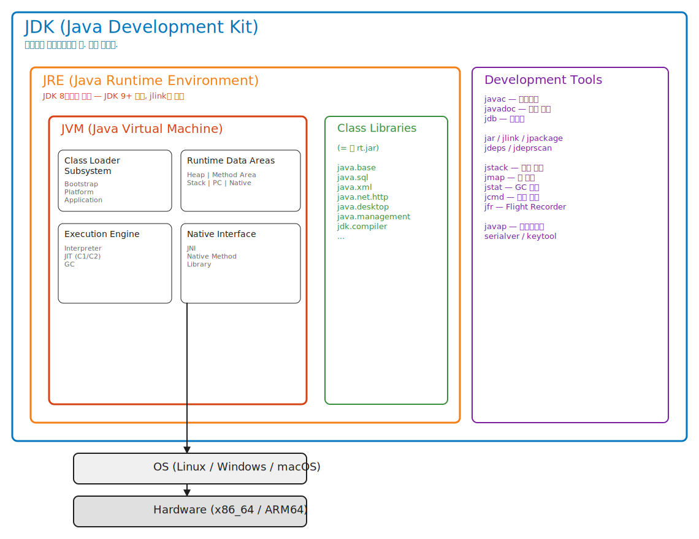
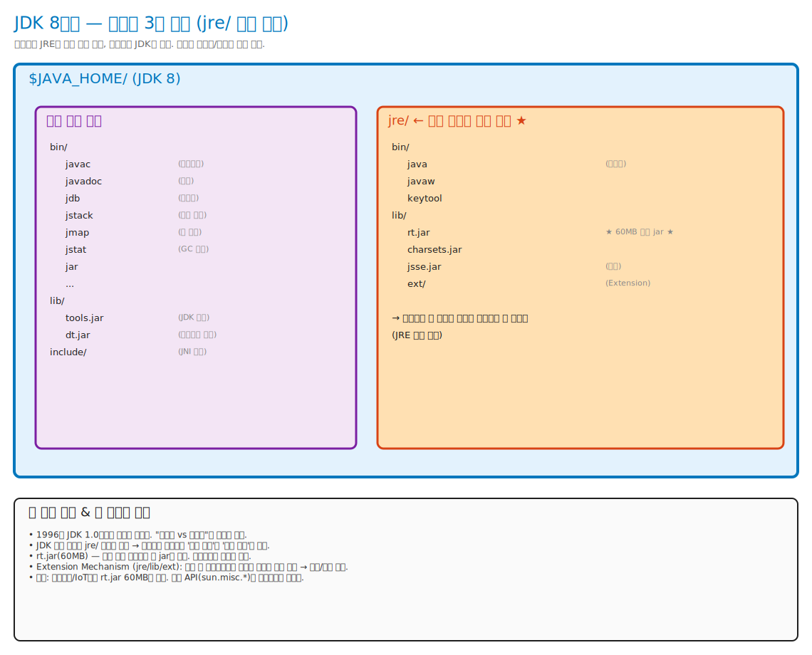
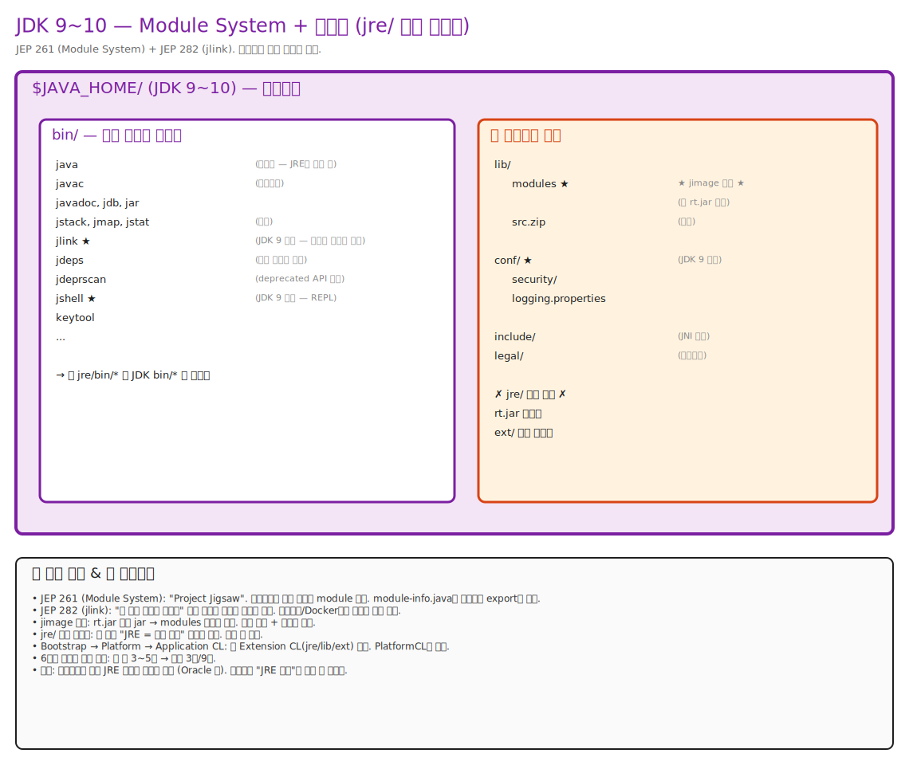
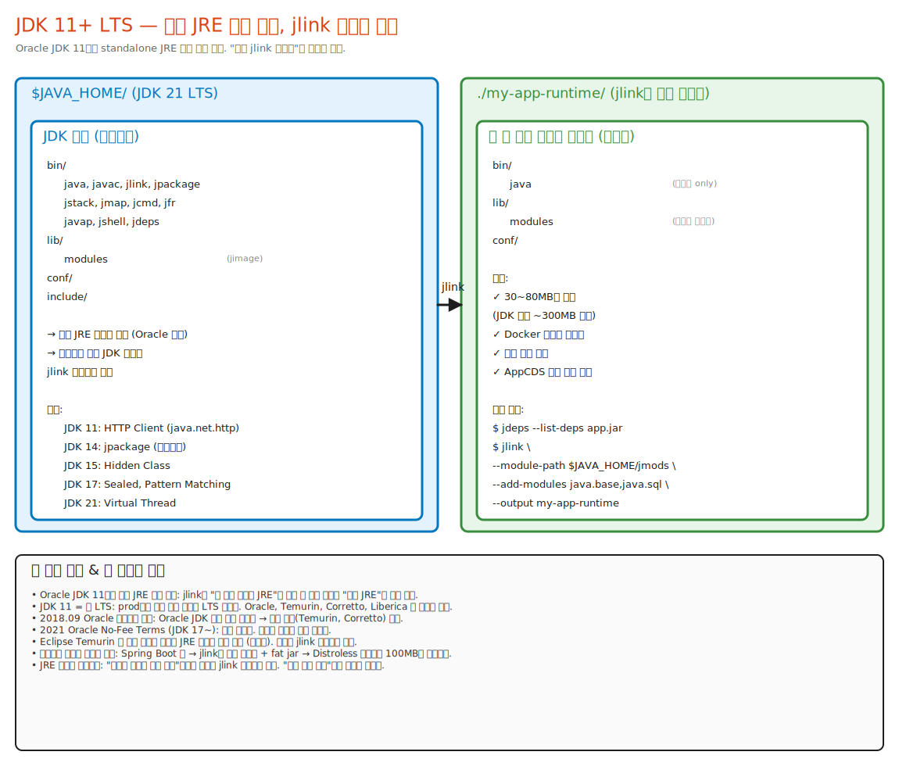

# 01. JVM, JRE, JDK — 가장 흔한 질문, 가장 흔히 틀리는 답

> "JVM이 뭔가요?" 라고 물으면 90%가 "Java를 실행하는 가상 머신"이라고 답한다.
> 그건 위키피디아 첫 줄이다. 다음 세 줄을 분리해서 말할 수 있어야 한다:
>
> 1. **JVMS (The Java Virtual Machine Specification)** — Oracle이 관리하는 PDF 명세. 가상 머신이 따라야 할 규칙.
> 2. **JVM 구현체** — JVMS를 따르는 실제 소프트웨어. HotSpot, OpenJ9, GraalVM, Zing 등.
> 3. **ClassFile** — JVMS가 정의한 **입력 포맷**(.class 바이트 구조). JVM이 먹는 "음식".
>
> 흔한 혼동: "JVM = ClassFile 포맷의 구현체" 같은 표현은 **세 레이어를 한 덩어리로 뭉치는** 것이라 정확하지 않다.
> 정확히는: **JVMS가 ClassFile 포맷과 실행 모델을 정의**하고, **HotSpot 등 구현체가 그 명세를 따른다**.

---

## 📍 학습 목표

이 챕터가 끝나면 다음을 막힘없이 답할 수 있어야 한다.

1. JVM, JRE, JDK의 포함 관계를 손으로 그릴 수 있다.
2. **JVM 명세(JVMS) / JVM 구현(HotSpot 등) / 입력 포맷(ClassFile)** 세 레이어를 구분해 예시로 설명할 수 있다.
3. JDK 9 이후 "별도 JRE 배포"가 어떻게 사라지고 `jlink` 기반 커스텀 런타임으로 바뀌었는지 안다 — JRE라는 **개념 자체가 사라진 건 아님**.
4. `java` / `javac` / `jstack` 등이 JDK 8 그림과 JDK 9+ 그림에서 어떻게 배치되는지 안다.
5. HotSpot이 (구현 기준) `JNI_CreateJavaVM` 호출로 시작된다는 사실을 설명할 수 있다.

---

## 🎨 1단계: 백지 그리기 가이드

> Excalidraw나 종이에 다음 순서로 그려라. **이 그림이 머릿속에 박히면 절반은 끝났다.**

### Step 1: 가장 큰 박스 — JDK
- 화면 전체에 큰 사각형을 그리고 우상단에 라벨 **"JDK (Java Development Kit)"**
- 사이드에 작은 글씨로 "개발자가 다운로드받는 그것"

### Step 2: JDK 안에 두 영역
1. 큰 박스 안 좌측 약 60%에 또 다른 박스 → **"JRE (Java Runtime Environment)"** (JDK 8까지의 전통적 배포 모델. JDK 9+에서는 별도 JRE 배포가 사라지고 jlink 이미지로 대체되는 추세)
2. 우측 40%에는 박스 없이 항목들 나열:
   - `javac` (컴파일러)
   - `javadoc` (문서)
   - `jdb` (디버거)
   - `jar`, `jlink`, `jpackage` (도구)
   - `jstack`, `jmap`, `jstat` (모니터링)

### Step 3: JRE 박스 안에 또 다음을 배치
1. 좌측 상단에 가장 안쪽 박스 → **"JVM (Java Virtual Machine)"**
2. JVM 박스 우측에 **Class Library**: `java.base`, `java.sql`, `java.xml`, ... (= rt.jar 였던 것)

### Step 4: JVM 박스 안에 다음 4구역
1. **Class Loader Subsystem** (좌상단)
2. **Runtime Data Areas** (우상단) — Heap / Stack / Method Area / PC / Native Stack
3. **Execution Engine** (좌하단) — Interpreter / JIT Compiler / GC
4. **Native Interface (JNI)** (우하단)

### Step 5: 외부 화살표
- JVM 박스에서 박스 밖으로 화살표 → **OS** (Linux/Windows/macOS)
- OS에서 또 화살표 → **Hardware** (x86_64/ARM64)

### 정답 그림



> 위 그림은 [_excalidraw/01-jvm-jre-jdk.svg](./_excalidraw/01-jvm-jre-jdk.svg)에 SVG로 임베드되어 있다.
> 직접 수정/확장하고 싶으면 [01-jvm-jre-jdk.excalidraw](./_excalidraw/01-jvm-jre-jdk.excalidraw) 파일을 [excalidraw.com](https://excalidraw.com/)에서 "Open" 으로 열어 편집하면 된다.

---

## 🧠 2단계: 직관 — 왜 이런 구조인가

### 한 줄 비유

- **JVM** = 게임기 본체 (실행만 함)
- **JRE** = 게임기 본체 + 번들 게임팩 (실행 + 라이브러리)
- **JDK** = 게임기 본체 + 게임팩 + 게임 개발 키트 (실행 + 라이브러리 + 개발 도구)

**정확한 정의** (비유와 분리):
- **JVM**: bytecode를 실행하는 가상 머신. `java.exe`/`java` 런처가 `libjvm` 라이브러리를 로드해 띄우는 런타임.
- **JRE**: JVM + 표준 클래스 라이브러리(`java.base`, `java.sql`, ...) + 실행 도구(`java`, `keytool` 등). JDK 8까지는 별도 배포 형태로 존재했고, JDK 9+에서는 `jlink`로 만드는 커스텀 이미지로 대체되는 추세.
- **JDK**: JRE 구성 요소 + 개발 도구(`javac`, `javadoc`, `jdb`, `jstack`, `jmap` 등). 개발자가 다운로드받는 배포본.

### 본질 질문: "왜 JVM이 필요했나?"

> 1991년 Sun의 Green Project. 목표는 **임베디드 디바이스(셋톱박스, 스마트 토스터)용 언어**.
> 문제: 디바이스마다 CPU가 다 다르다. 모토로라 68k, ARM, MIPS, ...
> C/C++은 each 타겟마다 컴파일러를 만들어야 한다. 그게 곧 **포팅 지옥**.

**해결책**: 가상의 CPU(=JVM)를 정의하고, 그 가상 CPU의 명령어(=bytecode)를 만들자.
실제 CPU와의 차이는 JVM 구현이 흡수한다.

이게 **"Write Once, Run Anywhere"**의 진짜 의미다.
프로그래머는 가상 CPU 한 종류만 신경 쓰면 된다. 실제 CPU 다양성은 JVM 벤더의 문제다.

### "JVM은 가상 머신이다"의 진짜 뜻

여기서 **가상 머신**은 두 가지 의미가 섞여 있다.

| 가상 머신의 두 의미 | 설명 | 예시 |
|---|---|---|
| **System VM** | 진짜 하드웨어를 통째로 에뮬레이션 | VMware, QEMU |
| **Process VM** | 한 프로세스 안에서 가상 명령어를 실행 | JVM, CLR, V8 |

JVM은 **Process VM**이다. OS 위에서 그냥 하나의 프로세스로 돈다.
이걸 헷갈리면 안 된다.

---

## 🔬 3단계: 구조 — 명세 vs 구현

### 핵심 분리

```
┌─────────────────────────────────────────────────────────┐
│  The Java Virtual Machine Specification (JVMS)          │
│  - ClassFile 포맷 (16바이트 매직넘버 CAFEBABE부터)         │
│  - 200여 개의 bytecode 명령어                            │
│  - Runtime Data Areas의 종류 (Heap, Stack, ...)         │
│  - Verifier의 검증 규칙                                  │
│  - 동시성 모델 (JMM)                                     │
│                                                         │
│  → 이건 "PDF 문서". Oracle이 정의하고 모두가 따라야 함.   │
└────────────────────┬────────────────────────────────────┘
                     │ 구현
        ┌────────────┼────────────┬─────────────┬────────┐
        ▼            ▼            ▼             ▼        ▼
   ┌─────────┐  ┌─────────┐  ┌──────────┐  ┌──────┐ ┌──────┐
   │ HotSpot │  │ OpenJ9  │  │ GraalVM  │  │ Zing │ │ ... │
   │ (C++)   │  │ (C/C++) │  │ (Java)   │  │      │ │      │
   │ Oracle  │  │ Eclipse │  │ Oracle   │  │Azul  │ │      │
   └─────────┘  └─────────┘  └──────────┘  └──────┘ └──────┘
```

### JDK ⊃ JRE ⊃ JVM 포함 관계 (개념 모델)

> ⚠️ 이 그림은 **JDK 8까지의 개념 모델**이다.
> JDK 9 이후의 실제 디렉토리 구조는 위의 [🕰️ 패키징 구조의 시대별 진화](#🕰️-패키징-구조의-시대별-진화--그림-3장) 섹션 참조.

```
┌─────────────────────────────────────────────────────────────────┐
│ JDK (Java Development Kit)  — 개발자 배포본                       │
│                                                                 │
│  ┌───────────────────────────────────────────────────────────┐  │
│  │ JRE (Java Runtime Environment)  — 실행에 필요한 최소 집합    │  │
│  │                                                           │  │
│  │  ┌─────────────────────────────────────────────────────┐  │  │
│  │  │ JVM (Java Virtual Machine)  — bytecode 실행 런타임   │  │  │
│  │  │                                                     │  │  │
│  │  │   ├─ ① Class Loader Subsystem                        │  │  │
│  │  │   │     (Bootstrap → Platform → Application)         │  │  │
│  │  │   │                                                  │  │  │
│  │  │   ├─ ② Runtime Data Areas                            │  │  │
│  │  │   │     Heap | Stack | Method Area(Metaspace)        │  │  │
│  │  │   │     PC | Native Method Stack                     │  │  │
│  │  │   │                                                  │  │  │
│  │  │   ├─ ③ Execution Engine                              │  │  │
│  │  │   │     Interpreter | JIT(C1/C2) | (★ GC는 별도)     │  │  │
│  │  │   │                                                  │  │  │
│  │  │   └─ ④ Native Interface (JNI)                        │  │  │
│  │  │                                                     │  │  │
│  │  └─────────────────────────────────────────────────────┘  │  │
│  │                                                           │  │
│  │  + Class Libraries                                        │  │
│  │     (java.base, java.sql, java.xml, java.net.http, ...)    │  │
│  └───────────────────────────────────────────────────────────┘  │
│                                                                 │
│  + Development Tools                                            │
│     javac, javadoc, jdb, jar, jlink, jpackage,                 │
│     jstack, jmap, jstat, jcmd, jfr, javap, jdeps, ...           │
└─────────────────────────────────────────────────────────────────┘
```

**읽는 법**:
- **포함 관계**: JDK ⊃ JRE ⊃ JVM. 안쪽일수록 핵심.
- **JVM 내부 ①~④**: 챕터 [03-jvm-architecture-bigpicture.md](./03-jvm-architecture-bigpicture.md)의 4대 서브시스템과 동일.
- **GC는 ③의 하위가 아님** — Execution Engine과 별도의 메모리 관리 책임. 자세히는 03번 챕터.

**JDK 9+에서 달라지는 것**:
- `jre/` 폴더가 디렉토리에서 사라지지만, "JRE 개념(=실행에 필요한 최소 집합)"은 여전히 살아있다.
- `Class Libraries`는 모듈(`java.base` 등) 단위로 분해되어 `lib/modules` (jimage)에 저장.
- `jlink` 이미지가 사실상 "내 앱 전용 JRE" 역할.

### 명령어 매핑 — JDK 8 vs JDK 9+ 분리

**JDK 8 기준** (전통적 그림):

| 무엇이 | 어디에 |
|---|---|
| `java` (실행기) | JRE (JDK에도 포함) |
| `javac` (컴파일러) | JDK만 |
| `javap`, `javadoc` | JDK만 |
| `jstack`, `jmap`, `jstat` | JDK만 (운영 진단용) |

**JDK 9+ 기준** (모듈 시스템 이후, 변경 사항):

| 무엇이 | 어디에 |
|---|---|
| 별도 `JRE` 배포 | Oracle 기준 JDK 11부터 사실상 중단. AdoptOpenJDK/Temurin 등 일부 벤더는 한동안 JRE 빌드 유지 |
| `jlink` (커스텀 런타임 빌더) | JDK만, JDK 9+. 필요한 모듈만 골라 "내 앱 전용 런타임 이미지" 생성 |
| `jpackage` (설치파일 빌더) | JDK 14+ |
| `jdeps`, `jdeprscan` | JDK만, 모듈 의존성/deprecated API 진단 |

> **개념 vs 배포 구분**:
> - **개념적으로 JRE는 여전히 존재** — "실행에 필요한 최소 집합"이라는 개념 자체는 살아있다.
> - **배포 형태가 바뀌었을 뿐** — "어디서나 똑같이 받는 표준 JRE" 대신, **jlink로 앱에 맞춰 만드는 커스텀 이미지**가 권장된다.
> - **실무 함정**: prod 서버에 JRE만 깔아두면 NullPointerException이 나도 `jstack`을 못 쓴다. 그래서 운영팀은 prod에도 JDK 또는 진단 도구를 포함한 jlink 이미지를 배포한다.

### JVM 구현 비교

| 구현 | 언어 | 만든 곳 | 특징 |
|---|---|---|---|
| **HotSpot** | C++ | Sun → Oracle / OpenJDK | de facto 표준, Template Interpreter + C1/C2 JIT |
| **OpenJ9** | C/C++ | IBM → Eclipse | 메모리 footprint 작음, Cloud-friendly |
| **GraalVM** | Java (JIT) / 다양 | Oracle Labs | JIT을 Java로 작성한 Graal + Native Image(SVM) AOT 빌더의 묶음. 아래 별도 설명 참조 |
| **Zing/Falcon** | C++ | Azul Systems | C4 GC (pauseless), LLVM 기반 JIT |
| **Avian** | C++ | 개인 프로젝트 | 임베디드용, 작은 footprint |

> **GraalVM은 한 줄로 정리되지 않는다** — 사실 세 가지를 묶은 이름이다:
> 1. **GraalVM 실행 환경 (JDK 배포)**: HotSpot의 기본 JIT(C2) 자리를 **Graal 컴파일러**로 대체할 수 있는 JDK 배포. "JVM의 일종"이라기보다 "HotSpot의 JIT을 교체한 변형"에 가깝다.
> 2. **Graal 컴파일러**: **Java로 작성된 JIT 컴파일러**. JVMCI(JEP 243)라는 인터페이스를 통해 HotSpot에 plug-in 형태로 결합된다.
> 3. **Native Image (SVM, Substrate VM)**: AOT 빌더 + 작은 런타임. Java 코드를 standalone 바이너리로 컴파일하고, 실행 시에는 HotSpot이 아니라 **SVM이라는 별도의 작은 런타임**이 동작한다.
>
> 그래서 "GraalVM = HotSpot 대체"는 일부만 맞다. **Graal JIT은 HotSpot 안에 끼워 넣는 것**이고, **Native Image는 HotSpot 자체를 쓰지 않는 별개의 런타임**이다. 더 깊이는 [08-graalvm](../08-graalvm/) 챕터에서.

→ 이 챕터들은 **HotSpot 기준**으로 진행한다. 가장 널리 쓰이고 OpenJDK에 포함된 레퍼런스 구현이기 때문이다.

---

## 🧬 4단계: 내부 구현 — JVM은 어떻게 시작되나

### `java HelloWorld`를 입력했을 때 일어나는 일

`java`는 그냥 작은 C 프로그램이다. 이 프로그램이 하는 일은 단순하다:
**libjvm.so를 dlopen으로 로드하고, JNI_CreateJavaVM을 호출**.

#### 핵심 함수 1: `JNI_CreateJavaVM`

위치: `src/hotspot/share/prims/jni.cpp`

```cpp
// jni.cpp (요약. 실제 코드는 더 길지만 본질은 이것)
_JNI_IMPORT_OR_EXPORT_ jint JNICALL
JNI_CreateJavaVM(JavaVM **vm, void **penv, void *args) {
  // 1. 인자 검증 (-Xmx, -Xms, -classpath 등 파싱)
  jint result = JNI_CreateJavaVM_inner(vm, penv, args);
  return result;
}

static jint JNI_CreateJavaVM_inner(JavaVM **vm, void **penv, void *args) {
  // 2. Threads::create_vm() — 진짜 시작점
  if (Threads::create_vm((JavaVMInitArgs*) args, &can_try_again) == JNI_OK) {
    // ...
    *vm = (JavaVM *)(&main_vm);
    *(JNIEnv**)penv = thread->jni_environment();
    return JNI_OK;
  }
}
```

#### 핵심 함수 2: `Threads::create_vm`

위치: `src/hotspot/share/runtime/threads.cpp`

이 함수가 JVM의 **진짜 main**이다. 순서대로:

```cpp
// threads.cpp (핵심 흐름만)
jint Threads::create_vm(JavaVMInitArgs* args, bool* canTryAgain) {
  // (1) 인자 파싱: -Xmx, -XX:+UseG1GC, ...
  jint parse_result = Arguments::parse(args);

  // (2) OS 모듈 초기화 (스레드 라이브러리, 신호 처리)
  os::init();

  // (3) 메모리 페이지 크기 결정, NUMA 설정
  os::init_2();

  // (4) Heap 등 Runtime Data Areas 생성
  jint status = init_globals();
  //   ↓ 이 안에서 universe_init() 호출 → Heap 생성
  //   ↓ Bootstrap ClassLoader 초기화
  //   ↓ String table, Symbol table 생성

  // (5) main 스레드 생성
  JavaThread* main_thread = new JavaThread();
  main_thread->set_thread_state(_thread_in_vm);

  // (6) java.lang.Thread 인스턴스 생성
  initialize_java_lang_classes(main_thread, CHECK_JNI_ERR);

  // (7) java.lang.System.initPhase1() 호출
  call_initPhase1(CHECK_JNI_ERR);

  // (8) Service threads 시작 (GC thread, Compiler thread, ...)
  Service_lock->notify_all();

  // (9) JIT 컴파일러 초기화 (C1, C2)
  CompileBroker::compilation_init(CHECK_JNI_ERR);

  // (10) Main thread를 JNI에 등록하고 리턴
  // → 이제 사용자 main() 메서드 호출 준비 완료
  return JNI_OK;
}
```

#### 그 다음: main 메서드 호출

`java` 런처가 main을 invoke하는 코드:

위치: `src/java.base/share/native/libjli/java.c`

```c
// java.c — 이건 JVM이 아니라 java 런처
int JLI_Launch(int argc, char ** argv, ...) {
  // 1. libjvm.so 로드 (dlopen)
  LoadJavaVM(jvmpath, &ifn);

  // 2. JNI_CreateJavaVM 호출
  ifn.CreateJavaVM(&vm, (void**)&env, &args);

  // 3. 메인 클래스의 main 메서드 찾기
  mainClass = LoadMainClass(env, mode, what);
  mainID = (*env)->GetStaticMethodID(env, mainClass, "main",
                                      "([Ljava/lang/String;)V");

  // 4. 호출! 여기서부터 사용자 코드 시작
  (*env)->CallStaticVoidMethod(env, mainClass, mainID, mainArgs);

  // 5. 종료 시 JVM 파괴
  (*vm)->DestroyJavaVM(vm);
}
```

> **포인트**: `java`라는 명령은 그냥 C 런처고, 진짜 JVM은 **libjvm.so (Linux) / jvm.dll (Windows) / libjvm.dylib (macOS)** 라는 공유 라이브러리다.
> `find $JAVA_HOME -name "libjvm.*"` 해보면 한 줄 나온다.

<details>
<summary><strong>📖 부록: `.so`, `dlopen`이란 — JVM 시동의 OS 메커니즘</strong></summary>

> 위 흐름에서 "`java` 런처가 `libjvm.so`를 `dlopen`으로 로드한다"는 한 줄에 세 가지 개념이 압축되어 있다.
> 세 개 모두 Java뿐 아니라 모든 동적 라이브러리 시스템의 기본이라 한 번 잡아두면 어디서나 통한다.

### 한 줄 정의

| 용어 | 정의 |
|---|---|
| **`.so`** | Linux의 동적 공유 라이브러리 파일 (Shared Object). Windows `.dll`, macOS `.dylib`에 해당 |
| **`dlopen()`** | 실행 시점에 `.so`를 동적으로 로드하는 POSIX 함수 (`libdl.so`에 정의) |
| **"로드한다"** | `.so` 파일을 프로세스의 가상 메모리에 `mmap`으로 매핑 + 의존성 해결 + 심볼 등록 |

### 1. `.so` — Shared Object

ELF(Executable and Linkable Format) 포맷의 동적 라이브러리.

```
파일 비교:
[실행 파일]                    [정적 라이브러리]              [동적 라이브러리]
   .out (Linux)                   .a (archive)               .so (Linux)
   .exe (Windows)                 .lib (Windows)             .dll (Windows)
                                                              .dylib (macOS)
```

**Static vs Dynamic Linking**:

```
[Static]                                [Dynamic — .so]
━━━━━━━━━━━━━━                          ━━━━━━━━━━━━━━━━

내 프로그램 (50MB)                       내 프로그램 (1MB)
├── 내 코드 (1MB)                       └── 내 코드만
└── libfoo의 모든 함수 (49MB) ← 포함     
                                        실행 시 자동 로드:
                                        libfoo.so (49MB) ← 다른 앱도 공유

장점: 단독 실행                          장점: 작은 바이너리, 메모리 공유,
단점: 큰 크기, 업데이트 어려움            라이브러리만 업데이트 가능
```

**실제 위치 확인**:
```bash
# Linux
$ find $JAVA_HOME -name "libjvm*"
$JAVA_HOME/lib/server/libjvm.so       ← 30MB짜리 거대 라이브러리

# macOS:  libjvm.dylib
# Windows: jvm.dll

$ file $JAVA_HOME/lib/server/libjvm.so
libjvm.so: ELF 64-bit LSB shared object, x86-64, dynamically linked

$ ldd $JAVA_HOME/lib/server/libjvm.so   # libjvm이 의존하는 다른 .so들
libpthread.so.0  ← POSIX 스레드
libc.so.6        ← C 표준 라이브러리
libdl.so.2       ← ★ 동적 로딩 (dlopen이 여기)
libm.so.6        ← 수학 함수
```

### 2. `dlopen()` — 실행 시점 동적 로드 함수

POSIX 표준. **실행 중에** 새 `.so`를 메모리에 로드.

```c
#include <dlfcn.h>

void* dlopen(const char* filename, int flags);
//      ↑     ↑                   ↑
//      |     로드할 .so 경로      RTLD_NOW (즉시) / RTLD_LAZY (지연)
//      반환: 핸들 — 이후 함수 호출에 사용. 실패 시 NULL
```

관련 함수 4종 (`libdl` 제공):

| 함수 | 역할 |
|---|---|
| `dlopen()` | .so 로드, 핸들 반환 |
| `dlsym()` | 핸들에서 심볼(함수/변수) 주소 검색 |
| `dlclose()` | 핸들 해제 (참조 없으면 unload) |
| `dlerror()` | 마지막 에러 메시지 |

**왜 `dlopen`을 굳이 쓰나** (일반 dynamic linking과 차이):

```
[1] 빌드 시 명시 (일반)               [2] dlopen으로 명시적 로드
━━━━━━━━━━━━━━━━━━━━━━━━━━━━           ━━━━━━━━━━━━━━━━━━━━━━━━━

gcc main.c -lfoo -o main              gcc main.c -ldl -o main

→ 프로그램 시작 전 OS의 동적 링커가     → 시작 시점에는 libfoo 미로드
  자동으로 libfoo.so 로드               → 코드에서 dlopen 호출 시점에 로드
→ main() 들어가기 전에 모두 끝남        → 로드 여부를 런타임 결정 가능
```

→ **java 런처가 dlopen을 쓰는 이유**: 어느 JVM 구현(Server/Client/GraalVM)을 로드할지 **옵션 파싱 후에 결정**해야 하기 때문.

### 3. "로드한다"의 진짜 의미

`dlopen("libjvm.so", RTLD_NOW)` 호출 시 OS가 하는 일:

```
[1] 파일 찾기
   - LD_LIBRARY_PATH, /etc/ld.so.conf, /lib, /lib64 검색
   - 못 찾으면 NULL + dlerror() 메시지

[2] mmap으로 가상 메모리에 매핑
   - .so 파일을 프로세스 가상 주소 공간에 mmap
   - .text (코드) — read+execute
   - .data, .bss (데이터) — read+write
   - 페이지 폴트 시 실제 물리 메모리에 로드 (lazy)

[3] 의존성 재귀 로드
   - libjvm.so가 require하는 libpthread, libc, libdl 등
   - 이미 로드되어 있으면 reference count만 +1

[4] Relocation (재배치)
   - PIC 코드지만 일부 절대 주소 필요
   - GOT (Global Offset Table)에 실제 주소 채움
   - PLT (Procedure Linkage Table) 설정

[5] Constructor 실행
   - __attribute__((constructor)) 함수
   - C++ 전역 객체 생성자

[6] 심볼 테이블 등록
   - 이후 dlsym으로 검색 가능

[7] 핸들 반환 (void*)
```

**메모리 상의 모습**:

```
[dlopen 전]                              [dlopen("libjvm.so") 후]
━━━━━━━━━━━━━━━━━━                       ━━━━━━━━━━━━━━━━━━━━━━━━━

프로세스 가상 메모리                       프로세스 가상 메모리
┌─────────────────┐                       ┌─────────────────┐
│ java 런처 코드   │                       │ java 런처        │
│ (수MB)          │                       ├─────────────────┤
├─────────────────┤                       │ libc.so          │
│ libc.so          │                       ├─────────────────┤
└─────────────────┘                       │ libjvm.so 코드 ★ │  ← 새로 매핑
                                           │ (30MB)           │
                                           │ (Threads::create │
                                           │  JNI_CreateJavaVM│
                                           │  GC, JIT, ...)   │
                                           ├─────────────────┤
                                           │ libjvm.so 데이터 │
                                           ├─────────────────┤
                                           │ libpthread.so    │  ← 의존성
                                           ├─────────────────┤
                                           │ libdl.so         │
                                           └─────────────────┘
```

### Position-Independent Code (PIC) — 어디든 매핑 가능한 비결

`.so`는 `-fPIC` 옵션으로 컴파일.

```c
// 일반 코드 (PIC 아님)
call func        // CPU 명령에 func의 절대 주소가 박힘

// PIC 코드
call func@PLT    // PLT를 거쳐 호출 (간접)
                 // PLT가 GOT를 보고 실제 주소로 점프
```

→ PIC 덕분에 **여러 프로세스가 같은 `.so`의 코드 페이지를 메모리에서 공유**. 같은 머신에서 java 프로세스 10개를 띄워도 libjvm 코드는 메모리에 1번만.

### java 런처의 실제 dlopen 코드

위치: `src/java.base/unix/native/libjli/java_md.c`

```c
// java_md.c — Linux/macOS 버전
static jboolean LoadJavaVM(const char* jvmpath, InvocationFunctions* ifn) {
    // ★ dlopen ★
    void* libjvm = dlopen(jvmpath, RTLD_NOW + RTLD_GLOBAL);
    if (libjvm == NULL) {
        JLI_ReportErrorMessage(JVM_ERROR1, jvmpath, dlerror());
        return JNI_FALSE;
    }

    // ★ dlsym으로 함수 포인터 얻기 ★
    ifn->CreateJavaVM = (CreateJavaVM_t)
        dlsym(libjvm, "JNI_CreateJavaVM");

    ifn->GetDefaultJavaVMInitArgs = (GetDefaultJavaVMInitArgs_t)
        dlsym(libjvm, "JNI_GetDefaultJavaVMInitArgs");

    if (ifn->CreateJavaVM == NULL) {
        JLI_ReportErrorMessage(JVM_ERROR2, dlerror());
        return JNI_FALSE;
    }

    return JNI_TRUE;
}
```

### 왜 이렇게 분리했나

```
[직접 통합 모델 — 가상]                  [현재 모델 — 분리]
━━━━━━━━━━━━━━━━━━━━━━━                  ━━━━━━━━━━━━━━━━━

java = 런처 + JVM 전체 (~30MB)           java 런처 (수MB) + libjvm.so (30MB)
- -client vs -server 같은 옵션 어려움    - 런처가 옵션 파싱 후 적절한 libjvm 선택
- GraalVM 같은 대체 JVM 끼우기 어려움    - GraalVM은 자기 libjvm.so 제공 → 끼워 넣기
- 시스템 전체에서 libjvm 공유 못 함      - 여러 java 프로세스가 코드 페이지 공유
```

### OS별 차이

| OS | 확장자 | 로딩 API | 헤더 |
|---|---|---|---|
| **Linux** | `.so` | `dlopen`, `dlsym`, `dlclose` | `<dlfcn.h>` |
| **macOS** | `.dylib` | `dlopen` 등 (POSIX 호환) | `<dlfcn.h>` |
| **Windows** | `.dll` | `LoadLibrary`, `GetProcAddress`, `FreeLibrary` | `<windows.h>` |

HotSpot 소스에서 OS별 구현 분리:
- `src/java.base/unix/native/libjli/java_md.c` ← Linux/macOS
- `src/java.base/windows/native/libjli/java_md.c` ← Windows

### 운영 함정 / 진단

**흔한 에러**: `error while loading shared libraries: libjvm.so`

```bash
$ java -version
error while loading shared libraries: libjvm.so: cannot open shared object file

# 진단
$ find / -name "libjvm.so" 2>/dev/null     # 어디 있나
$ ldd $(which java)                         # java가 의존하는 .so
$ echo $LD_LIBRARY_PATH                     # 동적 링커 경로
$ strace -e openat java -version 2>&1 | grep libjvm   # 어디서 찾으려 했나
```

**`LD_PRELOAD`**: 라이브러리 가로채기 — JVM 운영에서 흔히 사용

```bash
# jemalloc/tcmalloc 대안 malloc 사용
LD_PRELOAD=/usr/lib/libjemalloc.so java -jar app.jar
```

### 한 줄 통찰

> **`libjvm.so`는 진짜 JVM 구현이 들어있는 Linux 동적 라이브러리(`.so`)다. `java` 명령은 작은 C 런처일 뿐이고, `dlopen()`이라는 POSIX 함수로 실행 시점에 `libjvm.so`를 가상 메모리에 매핑한다(=로드한다). 이후 `dlsym()`으로 `JNI_CreateJavaVM` 같은 함수 주소를 찾아 호출하면, 그때부터 진짜 JVM이 동작한다.**

### 흔한 오해

| 오해 | 사실 |
|---|---|
| "`java`가 JVM이다" | ❌ `java`는 런처. JVM은 `libjvm.so` 안에 있음 |
| "`.so` 파일은 실행 가능" | △ 일부만. `lib*.so`는 보통 실행 불가, 라이브러리만 |
| "dlopen이 JVM 자체 기능" | ❌ POSIX 표준 함수, `libdl.so`에서 제공 |
| "정적 링크가 항상 빠르다" | △ 시동은 약간 빠를 수 있지만 메모리 공유 못 함 |

</details>

---

## 📜 5단계: 역사 — 어떻게 여기까지 왔나

### 1991: Green Project

- **James Gosling**, Sun Microsystems
- 가전제품용 언어 "**Oak**" 개발 (참나무 보고 지음)
- 트레이드마크 충돌로 1995년 **Java**로 개명 (인도네시아 자바 섬, 커피)

### 1995: Java 1.0 출시

- HotJava 브라우저 + Java applet
- JVM은 그냥 **interpreter only**. 느렸다. 정말 느렸다.

### 1996: Sun JDK 1.0 정식 출시

- Classic VM이라고 불리던 첫 JVM
- 인터프리터만 있었음. C++ 대비 20~50배 느림.

### 1999: HotSpot 등장 (JDK 1.3)

- Sun이 Animorphic Systems (Strongtalk VM 만든 회사) 인수
- **JIT 컴파일러** 탑재. 핵심 아이디어: **"핫스팟(자주 실행되는 코드)만 컴파일"**
- 이름의 유래.

### 2006: OpenJDK 출범

- Sun이 JDK를 **GPLv2로 오픈소스화**
- 그 전까지는 클로즈드 소스 + 무료 사용

### 2010: Oracle, Sun 인수

- Java 소유권이 Oracle로
- IBM, Apple 등은 자체 JVM 운영하다 점차 OpenJDK로 통합

### 2014: JDK 8 — Lambda + Stream

- **함수형 프로그래밍** 본격 도입
- `default` method, `Optional`, `LocalDateTime`

### 2017: JDK 9 — Module System (Jigsaw)

- **JEP 261**: 패키지보다 상위 캡슐화 단위
- **별도 JRE 배포 종료**: 표준 JRE 별도 배포가 사실상 끝났고, `jlink`로 모듈을 골라 커스텀 런타임을 만드는 모델로 전환. JRE의 **개념**은 유지.
- 6개월 릴리스 주기 시작

### 2021: JDK 17 — LTS, 모던 Java의 분기점

- Sealed classes, Pattern matching for switch (preview), Records
- 많은 기업이 8 → 17로 점프

### 2023: JDK 21 — Virtual Thread (Project Loom)

- **JEP 444**: OS 스레드 1:1 매핑을 끊고, 사용자 영역 스케줄링
- 100만 동시 연결도 메모리 GB 단위로 처리

### 핵심 통찰: "표준 JRE 별도 배포"는 어떻게 사라졌나? (JRE 개념 자체가 사라진 게 아님)

> JDK 9 이전: JDK에는 모든 클래스가 `rt.jar` (60MB)에 묶여 있었다.
> 임베디드 디바이스에선 이게 너무 컸다.
> **JEP 261 (Module System) + JEP 282 (jlink)**: 필요한 모듈만 골라서 커스텀 런타임 이미지를 만들 수 있게 됨.
>
> 결과:
> - **"하나의 표준 JRE를 모두에게 배포한다"** 모델의 가치가 떨어졌다.
> - Oracle은 **JDK 11부터 standalone JRE 별도 배포를 중단**했다.
> - 단, **JRE라는 개념(=실행에 필요한 최소 구성)은 그대로 살아있다**. jlink 이미지가 사실상 "내 앱 전용 JRE"의 역할을 한다.
> - Eclipse Temurin 등 일부 벤더는 한동안 JRE 빌드를 별도 제공했고, 지금도 일부 LTS에서 JRE 빌드가 존재하기도 한다.

```
JDK 8까지:  [거대한 표준 JRE] ← 한 덩어리, 모두에게 같은 것
JDK 9부터:  [모듈들] → jlink → [내가 필요한 만큼만의 커스텀 런타임 이미지]
            ※ "JRE 개념" 자체는 유지, "표준 JRE 배포 모델"이 사라진 것
```

---

## 🤔 왜 처음부터 분리됐나 — 설계 철학

> 흔한 의문: "JVM, JRE, JDK, 개발 도구를 왜 각각 따로 분리하고 다운로드받게 했지? 그냥 하나로 합치는 게 제일 간단하잖아?"
>
> **결론**: 1990년대의 디스크/네트워크 제약 + 사용자(end-user) vs 개발자 분리 사고 + 보안 표면 축소 + 라이선스 제어 — 네 가지가 동시에 작용해 분리됐다. 지금은 부분적으로 합쳐졌지만(JDK 9+), 보안·모듈성·운영 효율 때문에 **여전히 분리가 유지**된다.

### 분리의 4가지 이유

#### ① 1990년대의 자원 제약 (가장 큰 동기)

| 항목 | 1995년 | 2024년 |
|---|---|---|
| HDD 가격 | 1GB ≈ $200 | 1GB ≈ $0.02 |
| 가정용 인터넷 | 56kbps 모뎀 | 1Gbps 광 |
| JRE 100MB 다운로드 시간 | ≈ 4시간 | <1초 |
| 사용자 디스크 | 1~2GB | 500GB~수TB |

→ 사용자에게 "applet 하나 실행하려고 `javac`/`javadoc`/`jdb`까지 받으라"고 하면 **물리적으로 불가능**.
→ JRE를 따로 빼서 ~10MB 수준으로 가볍게 만들어야 했음.

#### ② 사용자 vs 개발자 분리 사고 (1990s applet 시대)

```
[일반 사용자]                 [개발자]
       │                        │
       ▼                        ▼
  웹브라우저 + JRE          IDE + JDK
  (applet 실행만)           (개발 + 디버깅 + 빌드)
       │                        │
       ▼                        ▼
  10MB 다운로드             80MB+ 다운로드
```

당시 가정: **Java 사용자 수가 개발자 수보다 100배 많다** (브라우저 applet 가정).
→ "사용자에게 가벼운 JRE만" 모델이 합리적.

#### ③ 보안 표면 축소

사용자 머신에 개발 도구가 있으면 위험:
- `javac` 있음 → 악성 코드가 사용자 머신에서 새 클래스 컴파일 가능.
- `jar` 있음 → signed jar 변조 + 재포장.
- `jdb` (디버거) 있음 → 다른 Java 프로세스에 attach해서 메모리 읽기/수정.
- `keytool` 추가 노출.

→ **"최소 권한 원칙"**: 사용자에게 필요 없는 도구는 깔지 않는다.

#### ④ 라이선스/배포 제어 (옛 Sun)

- **JRE**: 누구나 무료 재배포 가능 ("end user license").
- **JDK**: Sun이 별도 라이선스 관리 — 옛날엔 일부 상업 사용 제약.
- → 게임 회사가 자기 게임에 JRE를 끼워 배포 가능, JDK는 못 끼움.
- → OpenJDK 통합 후 이 차이는 거의 사라짐.

### "그럼 지금은 왜 안 합치나?"

사실 **합쳐지는 방향**으로 가긴 했다. JDK 9+:
- `jre/` 폴더 사라짐
- 별도 JRE 배포 (Oracle 기준) 사라짐
- JDK 자체가 평탄화 + 모듈화

그런데 **완전히 한 덩어리**로 가지 않는 이유:

| 측면 | 합쳤을 때 손해 |
|---|---|
| **컨테이너 이미지 크기** | JDK 전체 ~300MB → 100MB 컨테이너 목표 불가 → 클라우드 비용 ↑ |
| **콜드스타트** | 더 많은 클래스 로딩 → 시동 느림 (FaaS 치명적) |
| **보안 표면** | 운영 컨테이너에 `jdb`, `jaotc` 등 다 있으면 공격 표면 확대 |
| **메모리 footprint** | 사용 안 하는 모듈도 Metaspace 차지 |
| **임베디드/IoT** | 라즈베리 파이급 디바이스에 200MB+ 부담 |

→ **"한 덩어리 = 편하다"는 dev 머신 한정**. prod / 임베디드 / cloud에서는 **여전히 모듈 분리가 가치 있음**.

### 진화 — 분리의 입자가 바뀌었다

```
옛 분리 (JDK 8까지):              새 분리 (JDK 9+):
━━━━━━━━━━━━━━━━━━━━━              ━━━━━━━━━━━━━━━━━━━━━
디렉토리 레벨 분리                  모듈 레벨 분리
($JAVA_HOME/jre/ vs JDK)          (java.base, java.sql, jdk.compiler, ...)

장점: 단순                         장점: 미세 조정 가능
단점: 거친 입자                     단점: 모듈 시스템 복잡도

사용자 선택:                        개발자 선택:
"JRE 받기 vs JDK 받기"             "이 모듈을 require할지 선언"
                                  → jlink로 필요한 만큼만 묶음
```

→ **분리의 입자가 폴더 → 모듈로 미세해진 것**일 뿐, 철학은 동일.

### 다른 언어와 비교 — 분리가 정답은 아니다

| 언어 | 배포 모델 | 분리 vs 통합 |
|---|---|---|
| **Java** | JDK / JRE / jlink 이미지 / Native Image | 분리 → 모듈화 |
| **Python** | python 인터프리터 + 표준 라이브러리 통합 | 통합 (pip/venv로 의존성 격리) |
| **Node.js** | node + npm 통합 | 통합 (node_modules) |
| **Go** | `go` toolchain (컴파일러 + 런타임 통합) | 통합 → 단일 바이너리 배포 |
| **Rust** | `cargo` + 컴파일러 통합 | 통합 → 단일 바이너리 |
| **C/C++** | 컴파일러 별도(gcc/clang), 런타임은 OS 통합(glibc) | 분리 |
| **.NET** | SDK / Runtime 분리 | 분리 (Java와 유사) |
| **Ruby** | ruby + gem 통합 | 통합 |

**관찰**:
- **AOT + 단일 바이너리**(Go, Rust) → 통합이 자연스러움.
- **인터프리트 + 의존성 외부 격리**(Python, Node) → 런타임 통합 + 의존성 분리.
- **VM 기반 + 광범위한 호환성**(Java, .NET) → SDK/Runtime 분리 + 모듈화.

→ "분리 vs 통합"은 **사용 시나리오에 맞춰 결정**될 뿐, "분리가 무조건 옳다"가 아님.

### 만약 1995년 Sun이 분리하지 않았다면?

```
[1995년 Sun이 JDK 하나만 배포]
                │
                ▼
[Java applet이 80MB JDK 다운로드 강제]
                │
                ▼
[사용자가 못 받음 → applet 시장 형성 안 됨]
                │
                ▼
[Java가 데스크탑 언어로만 성공하고 웹 사라짐]
                │
                ▼
[지금 Java가 서버 1위 언어가 됐을지 의문]
```

→ 분리가 **Java 보급의 핵심 결정** 중 하나였다.

### 시대별 prod 배포 진화 — 같은 철학의 다른 구현

- **2010년대까지**: 서버에 JDK/JRE 깔고 fat jar 배포.
- **2018년+**: Docker + JDK 베이스 이미지.
- **2020년+**: `jlink` 이미지 + Distroless / scratch — 100~150MB 컨테이너.
- **2022년+**: GraalVM Native Image — 콜드스타트 ms, 메모리 ~수십MB (FaaS 시장).

각 시대마다 **"필요한 만큼만 받자"** 라는 같은 철학의 다른 구현. 분리의 형식은 바뀌었지만 본질은 30년째 유지됨.

### 한 줄 통찰

> **분리는 "최소한만 받자"는 1990s의 제약이 만든 것이고, 합치지 않는 이유는 "최소한만 받자"가 클라우드·임베디드·FaaS 시대에 더 중요해졌기 때문이다. 디렉토리 분리(JRE/JDK)는 사라졌지만 모듈 분리(JPMS)는 강화됐다 — 분리의 입자가 더 미세해진 것일 뿐, 철학은 동일하다.**

---

## 🕰️ 패키징 구조의 시대별 진화 — 그림 3장

> **왜 그림이 3장인가**: "JDK 안에 JRE가 있다" 라는 그림은 **JDK 8까지만 정확**하다.
> JDK 9에서 디렉토리 구조 자체가 바뀌었고, JDK 11에서 별도 JRE 배포가 사라졌다.
> 한 장의 그림으로 30년을 표현하면 어느 시대를 보고 있는지 헷갈린다.

> 각 시대의 변화는 **JVM 자체가 바뀐 게 아니라 패키징/배포가 바뀐 것**이다.
> JVM 내부 구조 변화(PermGen→Metaspace 등)는 [03-jvm-architecture-bigpicture.md](./03-jvm-architecture-bigpicture.md), GC 진화는 04-gc, ClassFile 진화는 [01-class-lifecycle](../01-class-lifecycle/)에서 다룬다.

### 그림 ① JDK 8까지 — 전통적 3중 박스



**개념** (디렉토리 = 개념):
- `$JAVA_HOME/` = JDK
- `$JAVA_HOME/jre/` = **JRE가 진짜 폴더로 존재**
- `$JAVA_HOME/jre/lib/rt.jar` = 모든 표준 클래스가 묶인 단일 60MB jar

**왜 이 모양이었나**:
- 1996년 JDK 1.0부터의 디자인.
- "사용자(실행자) vs 개발자"를 명확히 분리하려는 사고: 사용자는 JRE만, 개발자는 JDK.
- 단일 `rt.jar`로 간단한 클래스 로딩 모델.

**한계가 드러난 시점**:
- 2010년대 초 — Android, IoT, 임베디드 디바이스의 부상.
- 60MB짜리 `rt.jar`가 너무 크고, 모든 표준 클래스를 한꺼번에 가져야 함.
- `sun.misc.Unsafe` 같은 내부 API가 무분별하게 노출되어 라이브러리들이 의존하게 됨 → 호환성 깨기 어려움.

### 그림 ② JDK 9~10 — Module System + 평탄화



**개념** (디렉토리 = 개념):
- `$JAVA_HOME/` = JDK (평탄)
- **`jre/` 폴더 사라짐** — 옛 `jre/bin/java` 등이 `$JAVA_HOME/bin/`으로 통합
- `lib/modules` = **jimage 포맷** — 옛 `rt.jar`을 모듈 단위로 분해 + 압축
- `conf/` = 옛 `jre/lib/`의 설정 파일들이 분리
- `ext/` 폴더 사라짐 — Extension Mechanism 폐기

**왜 바뀌었나** (변화의 트리거):
- **JEP 261 — Module System (Project Jigsaw)**: 패키지보다 상위의 module 단위 도입. `module-info.java`로 의존성 + export를 명시.
- **JEP 282 — jlink**: 필요한 모듈만 골라 "내 앱 전용 런타임 이미지" 생성 가능.
- **JEP 220 — Modular Run-Time Images**: `rt.jar`을 모듈별로 분해해 `lib/modules` (jimage)로 재구성.

**ClassLoader 모델도 바뀜**:
- 그 전: Bootstrap → **Extension CL** (jre/lib/ext) → Application CL
- 그 다음: Bootstrap → **Platform CL** → Application CL (Extension CL 폐기)

**이 시대의 특징**:
- 별도 JRE 배포는 **아직 존재** — Oracle, AdoptOpenJDK 등이 JRE 빌드를 따로 배포.
- 사용자는 여전히 "JRE 단독"을 받을 수 있었음.
- 6개월 릴리스 주기 시작 (그 전 3~5년).

### 그림 ③ JDK 11+ LTS — 별도 JRE 배포 종료, jlink 시대



**개념** (디렉토리 = 개념):
- 좌측: **JDK 전체** — 개발자가 받는 것. JDK 9 구조 + 추가 모듈(`java.net.http` 등) + 추가 도구(`jpackage`, `jcmd`, `jfr`).
- 우측: **jlink 이미지** — 배포용. "내 앱 전용 JRE". 30~80MB로 작음.
- 그 사이의 화살표: `jlink` 명령으로 JDK → 커스텀 이미지 생성.

**왜 별도 JRE 배포가 종료됐나**:
- jlink가 **"내 앱에 맞춤형 JRE"**를 만들 수 있게 됨 → "범용 JRE 하나로 모두에게"의 가치가 떨어짐.
- Oracle은 **JDK 11부터** standalone JRE 별도 배포 중단.
- 컨테이너 시대(Docker, Kubernetes) 도래 — 작은 이미지가 더 중요해짐. jlink가 그 답.

**라이선스 격동기** (이해 필수):
- **2018.09 Oracle JDK 11**: 상업적 사용 유료화 → 대안 빌드 폭발 (AdoptOpenJDK→Temurin, Amazon Corretto, Azul Zulu, BellSoft Liberica, SapMachine, Red Hat OpenJDK 등).
- **2021.09 Oracle JDK 17**: "Oracle No-Fee Terms" — 다시 무료화 (단 2024년 9월 라이선스 변경으로 또 조정됨, 항상 최신 약관 확인).

**현재의 JRE 개념**:
- **JRE라는 단어**는 계속 쓰이지만, **표준화된 단일 형태**는 사라졌다.
- 각 앱이 jlink로 만드는 "내 앱 전용 런타임 이미지"가 사실상의 JRE 역할을 한다.
- Eclipse Temurin 등 일부 벤더는 호환성을 위해 한동안 JRE 빌드를 별도 제공.

### 한눈에 비교 표

| 측면 | JDK 8까지 | JDK 9~10 | JDK 11+ |
|---|---|---|---|
| **`jre/` 폴더** | ✅ 존재 | ❌ 사라짐 | ❌ 사라짐 |
| **`rt.jar`** | ✅ 60MB 단일 | ❌ `lib/modules` (jimage) | ❌ 동일 |
| **`ext/` 폴더 (Extension)** | ✅ 존재 | ❌ 폐기 | ❌ |
| **별도 JRE 배포** | ✅ 표준 | ✅ 존재 | ❌ Oracle 기준 종료 |
| **Module System** | ❌ | ✅ JEP 261 | ✅ |
| **`jlink`** | ❌ | ✅ JEP 282 | ✅ 사실상 표준 |
| **ClassLoader 모델** | Boot → Ext → App | Boot → **Platform** → App | 동일 |
| **릴리스 주기** | 3~5년 | 6개월 (LTS는 2~3년) | 6개월 (LTS는 2~3년) |

### 운영 체크리스트 (시대별)

**JDK 8 운영 시**:
- `jre/lib/ext/`에 의존 라이브러리가 꽂혀있지 않은지 확인 (보안 + 충돌).
- `rt.jar` 안의 클래스 버전 충돌 (`sun.misc.*` 등) — 추후 JDK 9+ 마이그레이션 시 깨지는 원인.

**JDK 9~10 마이그레이션**:
- `--add-modules`, `--add-opens` 옵션이 갑자기 필요해질 수 있음.
- `jdeps --jdk-internals my-app.jar`로 내부 API 의존 검출.

**JDK 11+ 운영 시**:
- Docker 이미지를 작게 만들고 싶으면 `jlink`로 커스텀 런타임 생성.
- prod에 JDK 받지 말고 jlink 이미지 + Distroless로 100MB대 컨테이너 목표.
- `--add-opens` 정책: JDK 16부터 reflection이 default deny, 17부터 더 엄격.

---

## 🏗️ 개발 vs 프로덕션 — 어떤 런타임에서 실제로 실행되나

> **흔한 혼동**: "jlink 이미지를 만든다"고 했는데, IDE에서 Run 누르면 그것도 jlink 이미지를 쓰나?
> **답**: 아니다. dev는 JDK 전체, jlink는 prod 배포용이다.

### 시나리오별 런타임 비교

| 시나리오 | 어떤 런타임? | 왜 |
|---|---|---|
| **IntelliJ Run / Debug** | Project SDK (JDK 전체) | 디버거 + JFR + 추가 도구 필요 |
| **`./gradlew run`** | `JAVA_HOME` 또는 Gradle Toolchain의 JDK 전체 | 빌드 + 테스트에 모든 도구 필요 |
| **`./gradlew test`** | JDK 전체 | 테스트 러너, Mock 라이브러리 등 |
| **`java -jar app.jar`** (전통적 prod) | JDK 또는 JRE 설치 | "어떤 머신이든 자바만 깔려있으면 동작" |
| **Docker `eclipse-temurin:21` 베이스** | JDK 전체 (베이스 이미지에 포함) | 300~500MB 컨테이너 |
| **Docker + jlink 이미지** ⭐ | 커스텀 런타임 이미지 | 100~150MB 컨테이너 |
| **GraalVM Native Image** | 아예 JVM 없음 (단일 바이너리) | 콜드스타트 ms, 메모리 ~수십MB |

### IntelliJ + Gradle 실행 흐름 (구체적)

```
[IntelliJ Run 버튼 클릭]
       │
       ▼
[Project SDK 확인]
   예: /Users/me/sdkman/candidates/java/21.0.1-tem  (Eclipse Temurin JDK 전체)
       │
       ▼
[Gradle이 JavaExec task 실행]
   = $JAVA_HOME/bin/java -classpath <build/classes + dep jar들> MainClass
       │
       ▼
[java 실행기가 libjvm 로드 → JNI_CreateJavaVM]
       │
       ▼
[lib/modules에서 필요한 모듈 로드]   ← ★ JDK 전체의 lib/modules
   - java.base, java.sql, java.net.http, ...
   - 모든 모듈이 다 있으니 require 하면 즉시 사용 가능
       │
       ▼
[사용자 앱 클래스 로드]
   - build/classes/java/main/MainClass.class
   - 의존 라이브러리 jar들 (Spring, etc.)
       │
       ▼
[main() 실행]
```

→ dev에서는 jlink 이미지 따로 **안 만들고**, **IntelliJ가 설정한 JDK 전체**를 그대로 쓴다.

### 왜 dev에서는 jlink를 안 쓰나

1. **디버거 필요**: JDWP agent 등 추가 모듈.
2. **JFR / jstack / jmap**: 운영 진단 도구는 dev에서도 자주 씀.
3. **Hot reload / agent**: Spring DevTools, JRebel 등이 추가 모듈 의존.
4. **빌드 속도**: jlink 자체가 수 초 — 매 Run마다 새로 만들면 비효율.
5. **개발 편의 > 이미지 크기**: dev 머신에 JDK 한 번 깔아두면 됨.

### 흔한 오해

| 오해 | 사실 |
|---|---|
| "jlink가 항상 자동으로 만들어진다" | ❌ 명시적으로 `jlink` 명령(또는 `./gradlew jlink`)을 실행해야 함 |
| "IntelliJ가 JRE를 다운로드한다" | ❌ IntelliJ JDK Manager는 JDK(예: Temurin)를 다운로드 |
| "Gradle은 자체 JVM을 가진다" | ❌ Gradle 자체가 JDK 위에서 도는 Java 앱. `org.gradle.java.home` 또는 Gradle Toolchain으로 어느 JDK를 쓸지 지정 |
| "prod에는 무조건 JDK 전체 깔아야 한다" | ❌ JDK / jlink 이미지 / Native Image — 모두 가능 |

---

## 📦 JAR 패키징 — Plain / Fat / Spring Boot / Native Image

> JAR을 어떻게 묶느냐가 **배포 모델**을 결정한다. 사용하는 JDK 도구는 같지만(`javac` + `jar`), 결과물의 **내부 구조와 실행 방식**이 다르다.

### 4종 비교

| 종류 | 안에 뭐가 들어있나 | 크기 | 빌드 도구 | 실행 명령 |
|---|---|---|---|---|
| **Plain jar** (thin/library) | 내 `.class`만 | 수십 KB ~ MB | JDK `jar` / Gradle 기본 `jar` task | `java -cp app.jar:lib/*.jar Main` |
| **Fat jar** (uber/shadow) | 내 + dep `.class` **모두 평탄화** | 수십 MB | Gradle **Shadow** plugin / Maven **Shade** plugin | `java -jar fat.jar` |
| **Spring Boot jar** | 내 `.class` + dep `.jar`을 **중첩 보관** (압축 안 풂) | 수십 MB | `spring-boot-gradle-plugin` (`bootJar`) | `java -jar boot.jar` |
| **GraalVM Native Image** | 아예 jar 아님 — **단일 native 바이너리** | 수십 MB | `native-image` (GraalVM 도구) | `./my-app` (JVM 없이) |

### JAR이 뭔지부터 — JDK의 일부

```
JAR 파일 = ZIP + META-INF/MANIFEST.MF (선언 파일)

my-app.jar (사실 ZIP)
├── META-INF/
│   └── MANIFEST.MF          ← Main-Class, dependencies 선언
├── com/example/
│   └── Main.class
└── ...
```

이걸 만드는 도구가 JDK에 포함된 **`$JAVA_HOME/bin/jar`**.
Gradle/Maven은 결국 이걸 호출하거나 동등한 ZIP 라이브러리로 같은 포맷을 만든다.

### 빌드 흐름 — JDK가 어떻게 쓰이나

#### Plain jar (가장 단순)

```
[1단계] javac으로 컴파일
   src/main/java/com/example/Main.java
        │ $JAVA_HOME/bin/javac
        ▼
   build/classes/java/main/com/example/Main.class

[2단계] jar 명령으로 묶기
   $ jar --create --file app.jar \
         --main-class com.example.Main \
         -C build/classes/java/main .
        │
        ▼
   app.jar
   ├── META-INF/MANIFEST.MF  (Main-Class: com.example.Main)
   └── com/example/Main.class
```

**한계**: dependency가 안 들어있어서 실행 시 별도 classpath 필요.
```bash
java -cp "app.jar:lib/*" com.example.Main
```

#### Fat jar (Shadow / Shade)

```
[1단계] 내 코드 컴파일 (javac)
[2단계] dependency jar들 압축 해제
   commons-lang3-3.12.0.jar  →  classes를 임시로 풀어둠
   spring-core-6.0.10.jar    →  ...
[3단계] 충돌 해결 (relocation/shading)
   - 같은 패키지에 다른 버전이 있으면 패키지명 변경
   - 예: com.fasterxml.jackson → my.shaded.jackson
[4단계] 모든 .class를 하나의 ZIP으로 묶음
        │
        ▼
   app-all.jar (수십 MB)
   ├── META-INF/MANIFEST.MF  (Main-Class)
   ├── com/example/Main.class            ← 내 클래스
   ├── org/apache/commons/lang3/...      ← dep 클래스 (평탄)
   ├── org/springframework/core/...
   └── ... 모두 평탄
```

실행:
```bash
java -jar app-all.jar    # ★ -cp 안 줘도 됨, 다 들어있음
```

#### Spring Boot jar (특별한 중첩 구조)

```
[1단계] 내 코드 컴파일
[2단계] dependency jar들을 그대로 (★ 압축 해제 안 함 ★) 보관
[3단계] Spring Boot Loader 클래스를 jar 안에 포함
        │
        ▼
   app-boot.jar
   ├── META-INF/MANIFEST.MF
   │     Main-Class: org.springframework.boot.loader.JarLauncher  ★
   │     Start-Class: com.example.MyApplication
   ├── org/springframework/boot/loader/   ← Loader 클래스들
   ├── BOOT-INF/
   │   ├── classes/
   │   │   └── com/example/MyApplication.class   ← 내 클래스
   │   └── lib/                                   ← dep jar들 (★ 풀지 않음 ★)
   │       ├── spring-core-6.0.10.jar
   │       ├── jackson-databind-2.15.0.jar
   │       └── ...
   └── ...
```

실행:
```bash
java -jar app-boot.jar
# JarLauncher가 BOOT-INF/lib/ 안의 nested jar들을 동적 로드
```

**왜 풀지 않나**:
- 같은 클래스가 여러 dep에 있을 때 conflict 회피.
- signed jar 무결성 유지.
- 빌드 속도 빠름 (압축 해제 불필요).

#### Native Image (참고)

```
[1단계] 내 코드 컴파일 (javac)
[2단계] native-image 도구가 reachability analysis
   - 실제 호출되는 메서드/클래스만 추출
   - reflection은 metadata 파일로 명시
[3단계] AOT 컴파일 → 단일 native 바이너리
        │
        ▼
   ./my-app (Linux ELF / macOS Mach-O / Windows PE)
   - JVM 없음
   - JIT 없음 (AOT 결과만)
   - GC는 SVM (Substrate VM)이 담당
```

실행:
```bash
./my-app    # JVM 없이 직접 실행, 수십 ms 시동
```

### 디스크 위 모습 비교

```
[Plain jar]                  [Fat/Shadow jar]              [Spring Boot jar]
━━━━━━━━━━━                  ━━━━━━━━━━━━━━━━              ━━━━━━━━━━━━━━━━━
app.jar (50 KB)              app-all.jar (35 MB)           app-boot.jar (40 MB)
├── META-INF/                ├── META-INF/                 ├── META-INF/
│                            │                             │     Main-Class:
│                            │                             │     ★ JarLauncher ★
└── com/example/             ├── com/example/              ├── org/springframework/
    └── Main.class           ├── org/apache/commons/...    │   └── boot/loader/
                             ├── com/fasterxml/jackson/    ├── BOOT-INF/
+ 별도 lib/ 폴더 필요         ├── org/slf4j/...             │   ├── classes/
  ├── commons-lang3.jar      └── ...  (모두 평탄)           │   │   └── com/example/
  ├── slf4j-api.jar                                        │   └── lib/  ★ nested
  └── ...                                                  │       ├── spring-core.jar
                                                           │       ├── jackson-...jar
                                                           │       └── ...
                                                           └── ...
```

### 실행 시점 ClassLoader 동작

| jar 종류 | 실행 시 ClassLoader |
|---|---|
| **Plain jar** | AppClassLoader가 `-cp`에 지정된 jar들 순회 |
| **Fat jar** | AppClassLoader가 한 jar 안의 모든 클래스 검색 (단순) |
| **Spring Boot jar** | **JarLauncher**가 자체 `LaunchedURLClassLoader` 생성 → `BOOT-INF/lib/*.jar`를 **nested jar URL**로 추가 → 그 CL이 클래스 검색 |
| **Native Image** | ClassLoader 거의 안 씀 — 모든 클래스가 AOT 시점에 native 코드로 박힘 |

### 어느 JDK 도구가 쓰이나 (정리)

| 단계 | 도구 | 어디 |
|---|---|---|
| 컴파일 (`.java` → `.class`) | `javac` | JDK only |
| JAR 묶기 | `jar` 또는 Gradle/Maven ZIP API | JDK `jar` 또는 빌드 도구 내장 |
| Fat jar 처리 (relocation) | Gradle Shadow / Maven Shade | 빌드 도구 plugin |
| Spring Boot jar | `spring-boot-gradle-plugin` | 빌드 도구 plugin |
| Native Image 빌드 | `native-image` (GraalVM) | GraalVM JDK 필요 |
| 실행 (`java -jar app.jar`) | `java` 런처 | JDK / JRE / jlink 이미지 어디서나 OK |

→ **빌드는 JDK 필요** (`javac`, `jar`).
→ **실행은 java 런처만 있으면 OK** (JDK / JRE / jlink 이미지 / Native Image 자체 실행).

### 언제 어떤 jar를 만드나 (운영 가이드)

| 상황 | 권장 |
|---|---|
| 라이브러리 배포 (다른 프로젝트가 의존) | **Plain jar** + dependency 관리 (Maven Central에 그대로 publish) |
| CLI 도구 / 단독 실행 파일 | **Fat jar** (1개 파일로 끝) |
| Spring Boot 앱 | **Spring Boot jar** (`bootJar` task) |
| 컨테이너 이미지 최적화 (큰 Spring 앱) | **Spring Boot Layered jar** + Docker 멀티스테이지 + **jlink 베이스** |
| 콜드스타트 ms 단위 (FaaS / CLI) | **GraalVM Native Image** |
| 데스크탑 앱 (설치 파일 .exe/.dmg/.deb) | **jpackage** (jlink 이미지 + OS 설치 패키지로 포장) |

### 한 줄 정리

> **세 jar 종류 모두 결국 `javac` + `jar` (또는 ZIP 라이브러리)로 만든다. 차이는 "내 클래스만 / dep까지 평탄화 / dep을 jar 그대로 중첩". 빌드 시점에는 JDK가 필요하고, 실행은 java 런처만 있으면 어느 런타임이든 OK. jlink는 "런타임 자체"를 작게 만드는 것이고, Fat jar는 "내 앱 패키지"를 한 파일로 만드는 것 — 두 가지는 직교(独立)하며 같이 쓸 수 있다.**

---

## ⚔️ 6단계: 꼬리질문 트리

### Q1. JVM, JRE, JDK의 차이를 설명하세요.

**예상 답변**:
> JDK는 JRE를 포함하고, JRE는 JVM과 클래스 라이브러리를 포함한다.
> JVM이 실행, JRE가 실행 + 라이브러리, JDK가 실행 + 라이브러리 + 개발 도구.

#### 🪝 꼬리 Q1-1: "그럼 JRE만 있어도 Java 프로그램을 컴파일할 수 있나요?"

**예상 답변**:
> 못 한다. 컴파일은 `javac`인데, `javac`는 JDK에만 있다.
> JRE에는 실행기 `java`만 있다.

##### 🪝 꼬리 Q1-1-1: "그럼 IntelliJ에서 코드를 실행할 때 컴파일은 어디서 하나요?"

**예상 답변**:
> IntelliJ는 자체 내장 컴파일러를 쓰거나, 설정된 JDK의 `javac`를 호출한다.
> 다만 IntelliJ는 ECJ (Eclipse Compiler for Java)를 in-process로 쓰는 경우도 있다 — 빌드 속도를 위해.

#### 🪝 꼬리 Q1-2: "JDK 9 이후 별도 JRE 배포가 사라졌다고 하던데, 그럼 사용자는 어떻게 Java 프로그램을 실행하죠? (참고: JRE 개념 자체가 없어진 건 아님)"

**예상 답변**:
> JDK를 받거나, `jlink`로 만든 커스텀 런타임 이미지를 배포받는다.
> 표준 JRE는 사라졌지만, JDK 자체에 java 런처가 들어있으므로 JDK = JRE + 도구.

##### 🪝 꼬리 Q1-2-1: "jlink로 만든 런타임이 일반 JRE보다 작아지는 이유는?"

**예상 답변**:
> `rt.jar` 통째가 아니라 내 앱이 require하는 모듈(`java.base`, `java.sql` 등)만 포함된다.
> 또한 jlink는 `.class` 파일들을 `jimage` 포맷으로 압축한다. CDS(Class Data Sharing)도 같이 생성 가능.

### Q2. JVM은 가상 머신이라는데, VMware와 뭐가 다른가요?

**예상 답변**:
> VMware는 **System VM** — 하드웨어를 통째로 에뮬레이션해서 게스트 OS를 올린다.
> JVM은 **Process VM** — OS 위 한 프로세스로 돌며, 자체 정의한 bytecode를 실행한다.
> JVM은 OS 커널을 통해 시스템 콜을 한다. VMware는 자체 가상 디바이스를 만든다.

#### 🪝 꼬리 Q2-1: "그럼 Docker는 어디에 해당하나요?"

**예상 답변**:
> Docker는 가상 머신이 아니다. **컨테이너** — OS 커널을 공유하면서 namespace + cgroup으로 격리.
> System VM과 Process VM의 중간이 아니라, **OS-level virtualization**이라는 또 다른 카테고리.

### Q3. JVM 명세와 구현의 차이를 예시로 설명하세요.

**예상 답변**:
> 명세(JVMS)는 ClassFile 포맷, bytecode 의미론, Runtime Data Areas의 종류를 정의한다.
> 어떻게 GC를 구현하라거나, JIT을 어떻게 만들라거나는 정의 안 한다.
> 그래서 HotSpot은 G1/ZGC를 만들었고 OpenJ9은 Balanced GC를 만들었다.
> 둘 다 JVMS는 준수한다.

#### 🪝 꼬리 Q3-1: "그럼 명세를 어기는 구현이 있나요?"

**예상 답변**:
> 공식 JVM 인증(TCK)을 통과하려면 명세를 따라야 한다.
> 다만 Android의 Dalvik/ART는 **JVM이 아니다** — bytecode 포맷부터 다르다 (.dex).
> JVMS를 따르지 않으므로 "JVM"이라 부를 수 없고, Java 호환 VM이라고 부른다.

##### 🪝 꼬리 Q3-1-1: "Dalvik이 stack-based가 아니라 register-based였는데, 왜 그런 결정을 했나요?"

**예상 답변**:
> ARM 같은 register-rich CPU에서 register-based VM이 더 적은 인스트럭션으로 같은 일을 한다.
> JVM의 stack-based는 명령어가 작고 단순하지만 같은 연산에 더 많은 instruction이 필요.
> 모바일 디바이스에서는 코드 크기(.dex)와 실행 효율 트레이드오프가 register-based 쪽이 유리.
> 다만 ART(Android Runtime)는 AOT 컴파일을 도입하면서 이 차이가 흐려졌다.

### Q4. `java HelloWorld`를 입력하면 일어나는 일을 처음부터 끝까지 설명하세요.

**예상 답변**:
> 1. 셸이 `java` 바이너리를 exec한다.
> 2. `java` 런처가 `libjvm.so`를 dlopen으로 로드한다.
> 3. `JNI_CreateJavaVM`을 호출 → `Threads::create_vm`.
> 4. JVM이 인자(-Xmx 등)를 파싱하고 Heap, ClassLoader, JIT 컴파일러를 초기화.
> 5. 부트스트랩 ClassLoader가 `java.lang.Object`, `java.lang.Class` 등을 로드.
> 6. 사용자 ClassLoader가 `HelloWorld.class`를 로드 (현재 디렉토리 또는 -classpath에서).
> 7. Verifier가 bytecode의 타입 안전성 검증.
> 8. `main(String[])` 메서드의 메서드 ID를 얻음.
> 9. `CallStaticVoidMethod`로 호출 → Interpreter가 bytecode 실행 시작.
> 10. 처음엔 인터프리트만 하다, 호출 빈도가 임계치를 넘으면 C1 → C2로 JIT 컴파일.
> 11. main 종료 → JVM이 daemon이 아닌 모든 스레드 종료 대기.
> 12. 종료. `DestroyJavaVM`.

#### 🪝 꼬리 Q4-1: "6번에서 ClassLoader가 .class를 어떻게 찾나요?"

**예상 답변**:
> **부모 위임 모델**: AppClassLoader → PlatformClassLoader → BootstrapClassLoader 순으로 위로 올라가서 먼저 부모에게 묻는다.
> 부모가 못 찾으면 자신이 찾는다.
> AppClassLoader는 `-classpath` (또는 `CLASSPATH` 환경변수, 기본은 현재 디렉토리)에서 찾는다.

##### 🪝 꼬리 Q4-1-1: "그 위임 모델을 깨는 케이스가 있나요?"

**예상 답변**:
> 있다. **Thread Context ClassLoader**, OSGi, Tomcat의 WebappClassLoader는 의도적으로 부모 위임을 어긴다.
> Tomcat은 자기 자신이 먼저 찾고 없으면 부모에게 묻는다 — 웹앱마다 다른 버전의 라이브러리를 격리하기 위해.
> JDBC DriverManager가 ServiceLoader로 드라이버를 찾을 때도 부모 위임으로는 못 찾기 때문에 Thread Context ClassLoader를 쓴다.

#### 🪝 꼬리 Q4-2: "10번에서 'JIT 컴파일' 한다고 했는데, 컴파일된 코드는 어디 저장되나요?"

**예상 답변**:
> **Code Cache** — Metaspace와 별개의 native 메모리 영역.
> 기본 크기는 240MB. `-XX:ReservedCodeCacheSize`로 조정.
> Code Cache가 full이 되면 JIT 컴파일이 중단되고 인터프리터로만 동작해서 성능이 급락한다.
> JDK 9부터 Tiered Code Cache: profiled / non-profiled / non-method 세 영역으로 분리.

##### 🪝 꼬리 Q4-2-1: "Code Cache가 full이 됐을 때 어떻게 감지하나요?"

**예상 답변**:
> `-XX:+PrintCodeCache` 또는 JFR `jdk.CodeCacheStatistics` 이벤트.
> 운영 환경에서는 `jstat -gc <pid>`로는 안 보이고, JMX의 `MemoryPoolMXBean` 중 "CodeCache"를 모니터링.
> 또는 `-XX:+UseCodeCacheFlushing`이 켜져 있는지 확인 (기본 on).

### Q5. (Killer) HotSpot, OpenJ9, GraalVM 중 무엇을 prod에 쓰시겠어요? 왜?

**예상 답변** (예시 — 정답은 없다. 논리가 중요):
> 워크로드에 따라 다르다.
> - **장기 실행 서버 + Throughput 중요**: HotSpot C2 + G1 또는 ZGC. 검증된 조합.
> - **메모리 제약 + 빠른 startup**: OpenJ9 또는 GraalVM Native Image.
> - **CLI 도구 / FaaS / 콜드 스타트**: GraalVM Native Image. AOT로 수 ms startup.
> - **초저지연 (< 10ms tail)**: Azul Zing의 C4 GC 또는 OpenJDK ZGC + Generational.
> 단, GraalVM Native Image는 reflection / dynamic class loading에 제약이 있어 Spring Boot 같은 프레임워크는 추가 메타데이터 설정이 필요하다.

---

## 🔗 다음 단계

이 챕터를 마스터했으면:
- → [02. 컴파일 흐름](./02-class-compilation-flow.md): `.java`가 `.class`로, 그리고 native 코드로 변환되는 전체 여정
- → [03. JVM 아키텍처 큰 그림](./03-jvm-architecture-bigpicture.md): 이 챕터에서 그린 다이어그램을 더 깊이
- → [04. JVM 역사 상세판](./04-jvm-history-detailed.md): 이 챕터의 역사 섹션을 25년 풀버전으로

## 📚 참고

- **The Java Virtual Machine Specification, Java SE 21 Edition**: https://docs.oracle.com/javase/specs/jvms/se21/html/
- **OpenJDK source**: https://github.com/openjdk/jdk
- **HotSpot Glossary**: https://openjdk.org/groups/hotspot/docs/HotSpotGlossary.html
- **JEP Index**: https://openjdk.org/jeps/0
