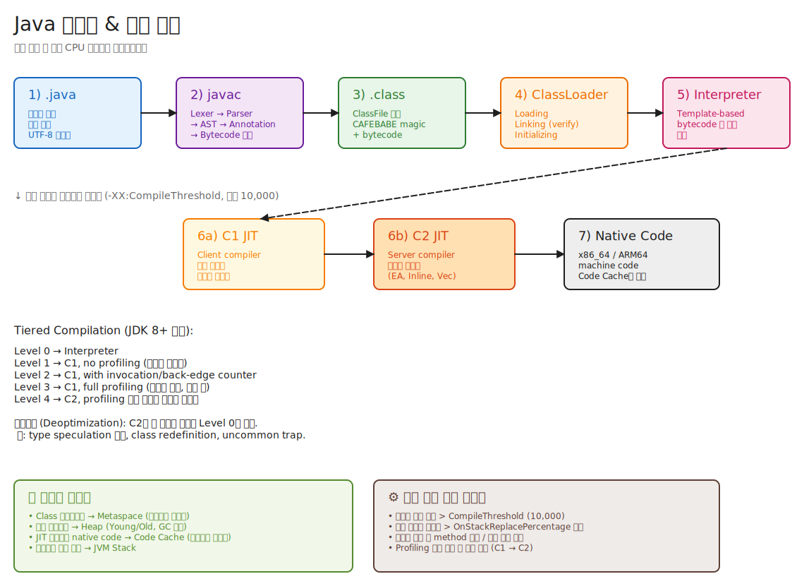

# 02. 컴파일 흐름 — .java가 CPU 명령어가 되기까지

> "Java는 컴파일 언어인가요, 인터프리트 언어인가요?" 라는 함정 질문에 "둘 다요" 라고 답할 수 있어야 한다.
> 더 정확히는: **"javac로 한 번, JIT으로 한 번 — 두 번 컴파일한다. 그 사이엔 인터프리트한다."**

---

## 📍 학습 목표

1. `.java` → `.class` → 메모리 → native 코드의 7단계를 머리에서 그릴 수 있다.
2. `javac`가 하는 일을 4단계로 분해할 수 있다 (Lexing → Parsing → Annotation Processing → Bytecode Gen).
3. `.class` 파일의 첫 4바이트가 왜 `CAFEBABE`인지, 그 뒤에 무엇이 오는지 안다.
4. Tiered Compilation의 Level 0~4를 설명하고, 왜 이렇게 5단계로 나눴는지 안다.
5. JIT 컴파일된 코드가 어디에 저장되며, 어떻게 폐기되는지 안다.
6. `javap -c -p HelloWorld`의 출력을 해석할 수 있다.

---

## 🎨 1단계: 백지 그리기 가이드

> 가로로 긴 흐름도다. A4를 가로로 놓고 그려라.

### Step 1: 좌우로 7개 박스 — 메인 흐름

```
[1) .java] → [2) javac] → [3) .class] → [4) ClassLoader] → [5) Interpreter] → [6) JIT] → [7) Native]
```

박스마다 색을 다르게 (파랑 → 보라 → 초록 → 주황 → 분홍 → 진주황 → 회색)

### Step 2: 단계 5(Interpreter) 아래에 갈래
- 인터프리트 후 호출 빈도 측정 → 임계치 넘으면 6a (C1), 더 핫하면 6b (C2)
- "역최적화(Deopt)" 화살표를 6b → 5로 점선으로 (가정 깨지면 인터프리터로 복귀)

### Step 3: 우측 하단에 5단 Tiered Compilation 사다리
- L0 → L1 → L2 → L3 → L4
- 각 단계 옆에 한 줄 설명

### Step 4: 좌하단에 javac 4단계
- Lexer / Parser / Annotation Processor / Bytecode Gen 박스를 javac 박스 안 작은 박스들로

### Step 5: 우상단 메모리 행선지 표
- Class 메타데이터 → Metaspace
- 객체 → Heap
- Native code → Code Cache
- 스택 프레임 → JVM Stack

### 정답 그림



> SVG로 직접 임베드된다. 편집하려면 [02-compile-flow.excalidraw](./_excalidraw/02-compile-flow.excalidraw)을 [excalidraw.com](https://excalidraw.com/)에서 "Open" 으로 열면 된다.

---

## 🧠 2단계: 직관

### 핵심 비유

> 통역사 비유:
> - 인터프리터 = 동시통역사. 한 문장 듣고 한 문장 통역. 즉시. 하지만 같은 문장이 100번 나오면 100번 통역.
> - JIT = 번역가. 한 문단을 모아서 정성껏 번역. 처음엔 느리지만 같은 문단이 또 나오면 즉시 재사용.
> - JVM은 **두 사람 다 고용**한다. 처음엔 인터프리터로 빠르게 시작 (warmup 빠름), 자주 나오는 문단은 번역가에게 맡긴다 (steady-state 빠름).

**정확한 정의** (비유와 분리):
- **인터프리터**: bytecode 명령어를 한 번에 하나씩 해석해 실행하는 방식. HotSpot은 Template Interpreter 변형을 쓰지만, 다른 JVM 구현은 다른 방식일 수 있다.
- **JIT (Just-In-Time) 컴파일러**: 런타임에 bytecode(또는 그 일부)를 native machine code로 변환하는 컴파일러. HotSpot은 C1(빠른 컴파일)과 C2(공격적 최적화)를 Tiered Compilation으로 조합한다.
- **두 방식 공존의 이유**: 컴파일 비용 vs 실행 성능의 균형. 자주 안 쓰이는 코드까지 컴파일하면 시동이 느려진다.

<details>
<summary><b>🔎 "Template Interpreter 변형"이 정확히 뭐고, 다른 JVM은 뭐가 다른가?</b></summary>

> "인터프리터"라는 단어 하나가 구현 방식을 다 가린다. JVM 인터프리터 구현은 4가지 스펙트럼이 있고, JVM 구현체마다 선택이 다르다.

### 인터프리터 구현 스펙트럼 — 4가지 방식

**(1) Switch-based Interpreter — 가장 순진한 방식**

```c
while (true) {
    uint8_t opcode = *pc++;
    switch (opcode) {
        case ICONST_0: push(0); break;
        case ICONST_1: push(1); break;
        case IADD: { int b=pop(), a=pop(); push(a+b); } break;
        // ... 200여 개 case
    }
}
```

- C/C++의 `switch` 문 하나에 모든 bytecode를 case로 나열.
- **문제**: 매 bytecode마다 점프 테이블을 거치고, CPU의 **branch predictor가 다음 opcode를 예측 못 함** (인덱스가 매번 다름) → indirect branch misprediction이 거의 항상 발생.
- 1996년 Classic VM이 이 방식. **C++ 대비 20~50배 느렸던 이유**.

**(2) Direct-Threaded Interpreter — 살짝 진화**

각 opcode 핸들러의 주소를 테이블에 저장하고, 각 핸들러 끝에서 다음 opcode 주소로 직접 점프 (`goto *next_handler`). GCC 확장 `&&label`을 쓴다. switch보다 빠르지만, 표준 C는 아님. **CPython 3.11+, Lua가 이 방식**.

**(3) Template Interpreter — HotSpot의 방식 ★**

이게 핵심이다. **"인터프리터지만 사실상 매우 단순한 JIT"**.

```
JVM 시작 시:
1. CPU 아키텍처 감지 (x86_64인지 aarch64인지)
2. 각 bytecode opcode에 대해 "이 opcode에 해당하는 어셈블리 시퀀스"를 생성
3. 생성된 어셈블리를 메모리에 배치 (이게 진짜 인터프리터의 실체)
4. 각 어셈블리 끝에는 "다음 bytecode 위치 계산 → 그 핸들러로 점프" 코드 자동 추가

실행 시:
- bytecode를 만나면 → 해당 opcode의 generated assembly로 jump
- switch도, 함수 호출도 없음. 그냥 직접 점프.
```

**예시**: `iadd` opcode를 만나면 HotSpot은 미리 생성해둔 어셈블리로 점프:

```asm
pop     rax              ; operand stack에서 두번째 값
add     [rsp], eax       ; 첫번째 값과 더해서 stack top에 저장
movzbl  eax, [r13+1]     ; 다음 bytecode opcode 읽기
inc     r13              ; pc 증가
jmp     [r14 + rax*8]    ; 다음 opcode의 generated assembly로 점프
```

즉, **HotSpot 인터프리터는 부팅 시점에 자기 자신을 어셈블리로 컴파일한다**. 그래서 `templateInterpreter.cpp`가 그렇게 길고 이상한 매크로(`__`)를 쓴다.

**왜 이렇게 만들었나**:
- 일반 C++ switch보다 2~3배 빠름.
- JIT 컴파일된 코드와 **calling convention이 동일** → 인터프리터 ↔ JIT 코드 전환이 매끄러움 (OSR, Deopt이 가능한 결정적 이유).
- Register 사용도 직접 제어 가능 → operand stack pointer를 register에 고정 (x86_64에선 `rsp`/`r13` 등).

**(4) AST + Self-optimizing — Truffle (GraalVM)**

이건 완전히 다른 발상. 뒤 GraalVM 항목에서 설명.

---

### JVM 구현별 인터프리터 차이

| JVM | 인터프리터 | JIT |
|---|---|---|
| **HotSpot (OpenJDK)** | Template Interpreter | C1 + C2 (Tiered) |
| **OpenJDK** | = HotSpot (사실상 같은 코드) | = HotSpot |
| **GraalVM (Community/Enterprise)** | HotSpot Template Interpreter 그대로 | **Graal JIT**으로 C2를 교체 |
| **GraalVM Native Image** | **없음** (AOT 컴파일) | 없음 (AOT) |
| **Eclipse OpenJ9 (IBM)** | 자체 구현 (어셈블리 + JIT helper) | **Testarossa JIT** (TR) |
| **Azul Zing / Prime** | HotSpot fork (Template) | **Falcon** (LLVM 기반) |
| **Android ART** | 자체 (register-based) | **AOT + JIT 혼합** |
| **Dalvik (구 Android)** | register-based 인터프리터 | JIT (4.0~) |
| **Avian, JamVM** | switch 또는 threaded | 미니 JIT 또는 없음 |

#### OpenJDK vs HotSpot — 사실상 같은 것

자주 혼동되는 지점:
- **OpenJDK** = "Java 표준의 오픈소스 구현체" (JDK 라이브러리 + 도구 + JVM 전부 포함)
- **HotSpot** = 그 OpenJDK 안에 들어있는 **JVM 부분의 이름**
- 즉 OpenJDK = HotSpot JVM + JDK 라이브러리 + javac 등 도구

Oracle JDK, Amazon Corretto, Azul Zulu, Adoptium Temurin, Microsoft OpenJDK 등은 전부 **OpenJDK 소스를 빌드한 결과물**이라 인터프리터가 동일하다 (Template Interpreter).

#### GraalVM — 인터프리터는 같지만, JIT은 다름

**모드 A: HotSpot + Graal JIT (기본)**
- 인터프리터: HotSpot Template Interpreter **그대로**
- C1: HotSpot C1 **그대로**
- C2: **Graal JIT으로 교체** (Java로 작성된 컴파일러)
- 즉, "C2만 갈아끼운 HotSpot"

```
[Template Interpreter (HotSpot)] → [C1 (HotSpot)] → [Graal JIT (Java)]
```

Graal JIT의 장점:
- Java로 작성됨 → 디버깅/확장 쉬움
- Partial Escape Analysis가 C2보다 강력
- Stream/람다 최적화가 더 좋다고 알려짐

**모드 B: Native Image (AOT)**
- **인터프리터, JIT 둘 다 없음**
- 빌드 시점에 reachable한 모든 코드를 native binary로 AOT 컴파일
- closed-world assumption — reflection은 빌드 시점에 설정으로 알려줘야 함
- 시작 시간이 ms 단위 (HotSpot은 수백 ms ~ 수 초)

**모드 C: Truffle Framework**
Ruby(TruffleRuby), Python(GraalPy), JavaScript(GraalJS)를 GraalVM에서 돌릴 때 쓰는 방식:

```
1. 언어 구현자가 AST 인터프리터를 Java로 작성
2. Truffle이 AST의 각 노드에 "자기-프로파일링" 기능 추가
3. 핫한 AST 서브트리는 Graal JIT이 통째로 native code로 컴파일
4. 가정 깨지면 다시 AST 인터프리터로 폴백
```

**"AST 자체가 인터프리터이자 IR"**. AST를 직접 JIT한다. 일반적인 bytecode 인터프리터와는 차원이 다른 접근.

#### Eclipse OpenJ9 — 완전히 다른 코드베이스

IBM J9가 오픈소스화된 것. HotSpot과 **소스 공유 전혀 없음**.
- **인터프리터**: HotSpot처럼 어셈블리 템플릿 기반이지만 구조가 다름. `bcInterp.asm` 같은 어셈블리 파일에 직접 작성.
- **JIT**: Testarossa (TR). HotSpot C1/C2와 완전히 다른 아키텍처.
- **차이가 두드러지는 지점**:
  - 메모리 사용량이 HotSpot보다 작음 (메모리 제약 환경에 강함)
  - Shared Class Cache (여러 JVM이 클래스 메타데이터 공유) — 컨테이너에서 강력
  - Pauseless GC (Metronome) 옵션

#### Android ART — register-based, 완전 다른 길

- **register-based bytecode** (Dalvik bytecode, `.dex`)
- 처음엔 인터프리터로 시작 → hot 메서드는 **AOT로 디스크에 저장** (앱 설치/유휴 시) → 이후 실행 시 즉시 native
- HotSpot 식 "어셈블리 템플릿"이 아니라 **C++로 작성된 switch interpreter**가 기본. 단, "Mterp"라는 어셈블리 인터프리터를 별도로 갖고 있어 hot path에선 그걸 사용.

---

### 그래서 "Template Interpreter 변형" 표현은 왜 썼나

아래 [4단계 내부 구현](#-4단계-내부-구현-hotspot)의 Template Interpreter 절이 답이다. HotSpot 인터프리터는 **부팅 시점에 어셈블리를 generate**하는 매우 독특한 구현이고, 학술적으로 분류하면 "switch-based"도 "threaded"도 아니라 별도 카테고리다.

다른 JVM도 비슷한 발상을 쓰지만 (OpenJ9도 어셈블리 기반), HotSpot의 구체적 구현 — `TemplateTable` 클래스, `MacroAssembler` 매크로, 부팅 시 `generate_all()` — 은 HotSpot 고유이므로 "HotSpot은 Template Interpreter 변형을 쓴다"고 한정한 것이다.

---

### 한 줄 요약

- **인터프리터에도 여러 구현 방식이 있다** (switch / threaded / template / AST)
- **HotSpot은 Template Interpreter**: 부팅 시 각 opcode를 어셈블리로 미리 generate해서 그걸 점프 테이블처럼 쓴다. 사실상 매우 단순한 JIT.
- **OpenJDK = HotSpot** (같은 코드)
- **GraalVM**: 인터프리터는 HotSpot 그대로 빌려 쓰고, C2 자리만 Graal JIT으로 교체. Native Image 모드면 인터프리터 자체가 없음 (AOT).
- **OpenJ9**: 별도 코드베이스. 인터프리터/JIT 둘 다 자체 구현. 메모리 효율 강점.
- **Android ART**: 아예 register-based + AOT 중심으로 다른 길.

> 💡 면접 꼬리질문 소재: "왜 GraalVM은 C2만 갈아끼웠을까?" → 인터프리터/JIT/Calling Convention의 분리도를 묻는 좋은 시그널.

</details>

<details>
<summary><b>🔎 opcode가 정확히 뭐고, 왜 핸들러 주소 테이블을 만들어 직접 점프하는가?</b></summary>

위 토글의 "Switch-based / Direct-Threaded" 설명에서 등장한 두 핵심 개념 — `opcode`와 `goto *handler_table[...]` — 을 한 단계 더 풀어본다.

---

### 1. opcode란 무엇인가

> **opcode = "operation code"의 줄임말**. CPU나 가상 머신이 이해하는 **기본 명령어 단위**의 식별자.

JVM 바이트코드에서 한 명령은 보통:
- **1바이트 opcode** (0~255 중 하나의 숫자)
- **0~여러 바이트의 operand** (피연산자, 명령에 따라 가변)

예를 들어 `iconst_1` 명령은 **1바이트짜리 숫자 `0x04`** 한 개로 표현된다. 사람이 읽기 좋게 `iconst_1`이라는 이름을 붙였을 뿐, JVM이 보는 건 숫자 하나.

#### JVM의 200여 개 opcode (대표적인 것들)

| 16진수 | 이름 | 동작 |
|---|---|---|
| `0x01` | `aconst_null` | null을 operand stack에 push |
| `0x03` | `iconst_0` | int 0을 stack에 push |
| `0x04` | `iconst_1` | int 1을 stack에 push |
| `0x1B` | `iload_1` | 지역변수 1번을 stack에 push |
| `0x3E` | `istore_3` | stack top을 지역변수 3번에 저장 |
| `0x60` | `iadd` | int 두 개 pop → 더해서 push |
| `0x99` | `ifeq` | stack top이 0이면 분기 |
| `0xB6` | `invokevirtual` | 가상 메서드 호출 |
| `0xB8` | `invokestatic` | static 메서드 호출 |
| `0xBA` | `invokedynamic` | 동적 메서드 호출 (JDK 7+) |
| `0xBB` | `new` | 객체 할당 |

#### `.class` 파일에 실제로 들어있는 모습

```java
int c = a + b;
```

이 한 줄이 `.class` 파일에선 정확히 이런 4바이트로 들어간다:

```
1B 1C 60 3E
```

각 바이트의 의미:
- `0x1B` → `iload_1` (a를 push)
- `0x1C` → `iload_2` (b를 push)
- `0x60` → `iadd` (더하기)
- `0x3E` → `istore_3` (c에 저장)

`javap -c`가 보여주는 `iload_1` 같은 이름은 **사람을 위한 디스어셈블리 결과**일 뿐, 디스크에는 숫자 한 바이트로 저장돼 있다.

#### 왜 1바이트인가

- **컴팩트함**: `.class` 파일이 작아짐 → 메모리/디스크/네트워크 효율
- **빠른 디스패치**: 1바이트면 0~255 → 256-entry 점프 테이블의 **인덱스로 바로 사용 가능**
- **단순한 디코딩**: 한 바이트만 읽으면 명령 종류가 결정됨

255개로 부족하지 않나? JVM은 현재 약 200여 개 opcode 사용. 여유 있음. 추가 인자 확장이 필요하면 `wide` opcode (`0xC4`) — "다음 명령의 인자를 2바이트로 확장"이라는 prefix가 있다.

> 📌 정리: **opcode = "이 1바이트가 어떤 동작을 의미하는가"를 식별하는 숫자**. JVM 인터프리터의 출발점은 매번 "이 바이트가 어느 opcode야?"를 묻는 것이다.

---

### 2. 핸들러 주소 테이블 — 왜 만들고, 왜 직접 점프하나

#### 출발점: Switch 문은 왜 느린가?

가장 단순한 구현:

```c
while (true) {
    uint8_t opcode = *pc++;
    switch (opcode) {
        case 0x1B: /* iload_1 */ push(local[1]); break;
        case 0x1C: /* iload_2 */ push(local[2]); break;
        case 0x60: /* iadd */ { int b=pop(), a=pop(); push(a+b); } break;
        // ... 200여 개 case
    }
}
```

컴파일러는 보통 이걸 **점프 테이블**로 최적화한다:

```asm
jump_table:
    .quad case_iload_1     ; opcode 0x1B에 대응하는 코드 주소
    .quad case_iload_2     ; opcode 0x1C에 대응하는 코드 주소
    .quad case_iadd        ; opcode 0x60에 대응하는 코드 주소
    ...

main_loop:                  ; ← 모든 case가 여기로 돌아옴
    movzx eax, byte [pc]
    inc   pc
    jmp   [jump_table + rax*8]   ; ← 단 하나의 디스패치 지점

case_iload_1:
    push local[1]
    jmp main_loop           ; ← 다시 디스패치 지점으로

case_iload_2:
    push local[2]
    jmp main_loop           ; ← 또 다시 디스패치 지점으로

case_iadd:
    ...
    jmp main_loop           ; ← 항상 같은 곳으로 복귀
```

**문제**: 모든 디스패치가 `main_loop`의 단 한 줄 `jmp [jump_table + rax*8]`에서 일어난다.

이 한 줄은 매번 `rax` 값에 따라 다른 곳으로 점프한다 (indirect branch). CPU 입장에서:
- **branch predictor가 학습 못 함**: "여기선 다음에 어디로 갈까?"를 묻는데, 입력 패턴이 사실상 random
- → 거의 항상 **branch misprediction**
- → 파이프라인이 잘못된 명령을 prefetch했다가 버림 (수 사이클 손실)

200줄짜리 메서드 실행하면 200번 다 misprediction → 인터프리터가 느려지는 진짜 이유.

#### 해결: 디스패치를 "분산"시킨다 — Direct-Threaded

> **핵심 아이디어**: 디스패치 지점을 한 곳에 모으지 말고, **각 핸들러 끝에 따로따로** 두자.

```c
// 각 라벨의 주소를 담은 테이블 (GCC 확장)
static void* handler_table[256] = {
    [0x1B] = &&handle_iload_1,    // && 는 라벨 주소를 얻는 GCC 문법
    [0x1C] = &&handle_iload_2,
    [0x60] = &&handle_iadd,
    // ...
};

// 시작: 첫 opcode를 읽고 그 핸들러로 점프
goto *handler_table[*pc++];

handle_iload_1:
    push(local[1]);
    goto *handler_table[*pc++];   // ← 이 핸들러 전용 디스패치 지점

handle_iload_2:
    push(local[2]);
    goto *handler_table[*pc++];   // ← 또 다른 디스패치 지점

handle_iadd:
    int b = pop(), a = pop();
    push(a + b);
    goto *handler_table[*pc++];   // ← 여기도 자기만의 디스패치 지점
```

이제 디스패치가 **200개 핸들러에 200개 분산**된다.

#### 왜 이게 빠른가 — branch predictor의 학습

CPU의 indirect branch predictor는 **각 점프 명령마다 별도의 학습 기록**을 가진다.

- **Switch**: 디스패치 지점 = 1개 → 1개의 학습 기록에 200개 opcode 시퀀스를 다 우겨넣으려고 함 → 패턴 분간 못함
- **Direct-Threaded**: 디스패치 지점 = 200개 → 각 핸들러가 자기만의 학습 기록을 가짐

자바 코드의 실제 분포:
```
iload + iload + iadd + istore + iload + iload + iadd + istore + ...
```

이런 패턴이 흔하다. Direct-Threaded에선 `iload_1` 핸들러 끝의 디스패치 지점이 **"내 다음엔 iload_2가 자주 와"** 를 학습한다. Predictor 적중률이 급격히 올라감.

> 측정 결과: Direct-Threaded는 일반적으로 Switch보다 **20~50% 빠름**. Python 3.11이 이 방식으로 바꿔서 평균 25% 빨라진 이유.

#### 왜 "주소 테이블"인가 — opcode를 인덱스로 쓰기 위해

핵심 질문: **opcode 값 `0x1B`를 받았을 때 어떻게 `handle_iload_1`로 가나?**

답: **opcode가 곧 테이블의 인덱스**. `handler_table[0x1B]`이 곧 `&&handle_iload_1`을 담고 있다.

```
opcode = 0x1B  →  handler_table[0x1B]  →  &&handle_iload_1 (주소)  →  jmp 그 주소
```

- 배열 인덱싱은 **O(1) 메모리 접근 한 번** — 사실상 register 연산 한두 개로 끝
- if-else 체인이면 O(N), 평균 N/2번 비교 — 200개면 100번 비교
- 점프 테이블이면 1번의 메모리 로드 + 1번의 점프

→ **opcode가 1바이트이고 0~255 범위인 것**과 **256-entry 테이블의 인덱스**가 정확히 맞물려서 설계됐다.

#### 왜 "직접 점프(goto)"인가 — 함수 호출 비용 회피

대안 1: 핸들러를 함수로 만들기

```c
void handle_iload_1(VM* vm) { vm->push(vm->local[1]); }

while (true) {
    handler_funcs[*pc++](vm);   // 함수 포인터 호출
}
```

이 경우 매 핸들러마다 발생하는 비용:
- 함수 호출 prologue (스택 프레임 생성, callee-saved register 저장)
- 인자 전달 (calling convention)
- 핸들러 본문
- 함수 호출 epilogue (register 복원, 스택 정리)
- `ret` 명령
- 다시 루프로 돌아와 디스패치

대안 2: `goto *...`로 직접 점프

- 그냥 `jmp` 명령 한 번
- 함수 호출 prologue/epilogue **없음**
- 모든 핸들러가 **같은 함수 안에 있음** → 컴파일러가 operand stack pointer, frame pointer 같은 핵심 변수를 **register에 고정 배치 가능**
- 함수 호출이면 그 register들을 매번 save/restore 해야 함

→ goto 방식이 **함수 호출 비용 + register 트래픽 둘 다 0**.

---

### 3. HotSpot Template Interpreter는 이걸 한 단계 더 — 어셈블리 직접 생성

위에서 본 Direct-Threaded도 결국 C로 작성한 인터프리터다. 핸들러 **본문은 C 컴파일러가 만든 어셈블리**.

HotSpot은 거기서 한 발 더 나간다:
- C 코드를 거치지 않고
- **부팅 시점에 어셈블리를 직접 generate**
- 각 opcode별로 가장 효율적인 native instruction sequence를 손수 설계
- `r13` (bytecode pointer), `r14` (handler table base), `rsp` (operand stack) 같은 register를 **강제로 고정 배치**
- C 컴파일러가 절대 못 만드는 calling convention을 만들어서 JIT 코드와 호환되게 함

결과: C로 짠 인터프리터(Direct-Threaded 포함)보다 또 **2~3배 빠름**. 이게 HotSpot이 "Template Interpreter"라는 별도 카테고리로 분류되는 이유.

---

### 한 줄 요약

- **opcode** = JVM이 이해하는 명령어의 1바이트 식별자 (0x1B = iload_1, 0x60 = iadd, ...). `.class`에 실제로 들어가는 건 이 숫자 하나
- **핸들러 테이블** = `handler_table[opcode]` → 그 opcode 처리 코드의 주소. opcode가 곧 인덱스
- **직접 점프(goto)** = 함수 호출 비용 회피 + register 고정 배치 가능 + branch predictor 학습 가능

세 가지가 합쳐져서 "C++의 switch 인터프리터보다 훨씬 빠른 native-speed dispatch"가 가능해진다. HotSpot은 거기서 한 발 더 나가 어셈블리를 직접 생성한다.

</details>

### 왜 두 번 컴파일하나?

> **답**: 트레이드오프의 균형.
>
> - 옵션 A: 전부 AOT (Ahead-of-Time) 컴파일 → C/C++ 방식. 시작은 빠르지만 **포팅 어려움**, **동적 정보 활용 못 함**.
> - 옵션 B: 전부 인터프리트 → 원조 JVM (1.0). 단순하지만 **느림**.
> - 옵션 C: AOT + 인터프리트 → 효율적이지만 **JVM의 동적 기능 (reflection, dynamic class loading) 약함**.
> - 옵션 D: javac (bytecode) + JIT — **현재 JVM 방식**. javac가 플랫폼 독립적 중간 표현으로 컴파일 → JVM이 런타임에 실측 프로파일로 추가 컴파일.

<details>
<summary><b>🔎 AOT란 뭐고, JVM의 javac+JIT 모델은 어떻게 동작하는가? 동적 컴파일이 정확히 뭔가?</b></summary>

### 1. AOT (Ahead-of-Time) 컴파일이란

> **"실행되기 전에 미리"** 컴파일.

C/C++, Rust, Go가 이 방식이다. 빌드 시점에 소스코드 → CPU가 직접 실행하는 **기계어(native code)** 까지 한 번에 만든다.

```
[hello.c] → (gcc) → [hello.exe]
                     ↑
                     이게 이미 x86_64 기계어. CPU가 바로 실행.
```

**장점**:
- **시작이 빠름**: 변환 비용을 빌드 때 다 지불했으니 실행 시점엔 0
- **결정론적**: 같은 입력 → 같은 결과 (워밍업 변동 없음)
- **메모리 적음**: 런타임에 컴파일러를 들고 있을 필요 없음

**한계**:
- **플랫폼 종속**: x86_64 Linux 바이너리는 ARM Mac에서 못 돈다. 새 플랫폼마다 재컴파일/포팅
- **동적 정보 0**: 컴파일 시점엔 "어떤 분기가 99% 잡힌다", "어떤 타입이 항상 들어온다"를 **알 길이 없음**. 그래서 보수적 최적화만 가능
- **Dynamic feature 약함**: reflection, dynamic class loading, 코드 hot-swap이 본질적으로 어렵다

> GraalVM Native Image가 정확히 이 길로 간 것. 시작 ms 단위지만 reflection을 빌드 설정으로 미리 알려줘야 함.

---

### 2. JVM 모델 — javac + JIT의 분업

JVM은 **컴파일을 두 단계로 쪼개서** AOT의 한계를 우회한다.

#### 1차 컴파일: `javac` (정적, 빌드 시점)

`javac`가 하는 일: **`.java` → 바이트코드 (`.class`)**.

바이트코드는 **"가상의 CPU"가 이해하는 명령어**다. 실제 x86이나 ARM과 무관한 추상 명령어 집합.

**예시 — 한 줄짜리 자바를 javac가 어떻게 바이트코드로 만드는가**:

```java
int c = a + b;
```

```
iload_1       // 지역변수 1번(a)을 operand stack에 push
iload_2       // 지역변수 2번(b)을 operand stack에 push
iadd          // stack top 두 정수를 pop해서 더한 뒤 결과를 push
istore_3      // pop해서 지역변수 3번(c)에 저장
```

핵심 포인트:
- 이 4개 명령어는 **x86이든 ARM이든 RISC-V든 똑같다** → 플랫폼 독립
- 이건 아직 CPU가 직접 실행 못 함. **JVM이 해석해줘야 한다**
- "stack-based" 가상 머신: register 없이 operand stack에서만 연산

> 그래서 `.class`는 정확히 말하면 **"중간 표현(IR)이 디스크에 저장된 것"** 이다. C 컴파일러의 LLVM IR이 디스크에 남아있는 거라고 생각하면 비슷하다.

#### 2차 컴파일: JVM이 런타임에 — Interpreter + JIT

JVM이 `.class`를 받으면 두 가지 방법으로 실행한다:

**(A) Interpreter** — 바이트코드를 한 줄씩 해석해서 실행:

```
프로그램 시작
 ↓
Interpreter가 iload_1 만남 → "지역변수 1번을 stack에 push해야 하는구나" → 실행
 ↓
다음 명령어 iload_2 만남 → 실행
 ↓
다음 명령어 iadd 만남 → 실행
 ↓ ... (한 줄씩 해석 반복)
```

- 변환 비용 0 → **즉시 시작 가능**
- 하지만 같은 코드가 100만 번 실행되면 100만 번 해석함 → 느림

**(B) JIT** — 자주 실행되는 메서드는 **native code로 변환해서 캐싱**:

```
이 메서드가 1만 번 호출됨 → "hot하다" → JIT 컴파일러 호출
                                          ↓
                              바이트코드 → x86_64 어셈블리 변환
                                          ↓
                              Code Cache에 저장
                                          ↓
                              다음 호출부터는 어셈블리로 직접 점프 (해석 안 함)
```

---

### 3. 동적 컴파일 — JIT이 AOT보다 잘하는 지점

> 핵심: **JIT은 "실제 실행을 본 결과"를 가지고 컴파일한다.**

AOT 컴파일러는 코드를 정적으로 보면서 "최선의 추측"으로 최적화한다. 그런데 실제 프로그램의 동적 특성은 코드만 봐선 알 수 없다.

#### JIT이 활용하는 5가지 "실측 정보"와 그 활용

**(1) Inlining — 자주 호출되는 작은 메서드 본문을 호출 사이트에 끼워넣기**

```java
int square(int x) { return x * x; }

int sum() {
    int s = 0;
    for (int i = 0; i < 1000; i++) {
        s += square(i);   // 1000번 호출
    }
    return s;
}
```

JIT 판단: `square`가 hot, 짧음 → `sum` 안에 통째로 삽입:

```java
// JIT이 만든 가상 코드
int sum() {
    int s = 0;
    for (int i = 0; i < 1000; i++) {
        s += i * i;   // square 호출 사라짐
    }
    return s;
}
```

→ 함수 호출 비용(스택 프레임, register save) 0. 그리고 이걸 발판으로 다음 최적화들이 가능해진다.

**(2) Devirtualization — 가상 호출을 정적 호출로**

```java
interface Animal { void speak(); }
class Dog implements Animal { void speak() { ... } }
class Cat implements Animal { void speak() { ... } }

void run(Animal a) {
    a.speak();   // 어느 구현이 호출될지 정적으로는 모름
}
```

AOT는 가상 호출 테이블 조회를 거쳐야 함 (vtable lookup).

JIT은 1만 번 실측을 보고: **"항상 Dog만 들어왔네"** → `Dog.speak()`로 가정 + inline:

```
[가정] a는 Dog다
[가드] if (a.getClass() != Dog) goto deopt;
[본문] Dog.speak()의 본문을 펼친 코드
[deopt] 가정 깨지면 인터프리터로 복귀
```

→ 가상 호출 비용 0. 만약 어느 날 Cat이 들어오면 deopt 발생 → 인터프리터 → 재컴파일.

**(3) Branch Prediction — 자주 잡히는 분기 우선 배치**

```java
if (x == null) { /* 에러 처리 */ }
else { /* hot path */ }
```

JIT이 본 결과: 99% null 아님 → 어셈블리에서 else 본문을 **fall-through**(점프 없이 다음에 바로 오는 경로)로 배치:

```asm
test    eax, eax       ; x가 null인지 검사
jz      error_handler  ; null이면 점프 (드뭄)
; hot path 본문이 바로 여기 옴 — CPU 캐시 hit, branch predictor 정확
...
```

→ CPU 명령어 캐시 효율 + branch predictor 정확도 ↑.

**(4) Escape Analysis + Scalar Replacement — Heap 할당 제거**

```java
int distance(int x1, int y1, int x2, int y2) {
    Point p1 = new Point(x1, y1);
    Point p2 = new Point(x2, y2);
    return Math.abs(p1.x - p2.x) + Math.abs(p1.y - p2.y);
}
```

JIT 분석: `p1`, `p2`가 메서드 밖으로 안 나감("escape" 안 함) → **Heap 할당 자체를 제거** + 필드를 register로 분해:

```java
// JIT이 만든 가상 코드 — 객체가 사라짐
int distance(int x1, int y1, int x2, int y2) {
    return Math.abs(x1 - x2) + Math.abs(y1 - y2);
}
```

→ GC 부담 0. allocation 0. 이게 JVM이 "객체 마구 만들어도 빠른" 이유의 핵심.

**(5) Loop Unrolling + Vectorization**

```java
for (int i = 0; i < 1000; i++) sum += arr[i];
```

JIT이 만드는 어셈블리:

```asm
; 4개씩 묶어 SIMD 명령으로 한 번에 처리
vmovdqu  ymm0, [rax]       ; arr[i..i+7] 8개 정수를 한 번에 load
vpaddd   ymm1, ymm1, ymm0  ; 8개를 한 번에 더함
add      rax, 32
cmp      rax, rcx
jl       loop
```

→ 8개 정수를 한 명령으로 처리. 이론적으로 8배 빠름.

---

### 4. JVM은 어떻게 "hot 코드"를 알아내는가 — 동적 컴파일의 실제 흐름

JIT의 메커니즘은 결국 **세 가지**다:
1. **카운터로 hot 판정**
2. **인터프리터에서 프로파일 수집**
3. **임계치 넘으면 JIT 큐에 제출**

#### 카운터 시스템

JVM은 메서드마다 두 카운터를 둔다:

| 카운터 | 의미 |
|---|---|
| **Invocation counter** | 이 메서드가 호출된 횟수 |
| **Back-edge counter** | 이 메서드 안의 루프가 회전한 횟수 |

기본 임계치 (Tiered Compilation 기준):
- C1 컴파일 트리거: invocation ≥ ~200, back-edge ≥ ~1000
- C2 컴파일 트리거: invocation ≥ ~5000, back-edge ≥ ~10000
- (정확한 값은 `-XX:Tier3InvocationThreshold` 등으로 조정)

#### 프로파일 데이터 수집 — `MethodData`

인터프리터와 C1이 메서드 실행 중에 모으는 데이터:

```
MethodData {
    invocation_count
    backedge_count

    // 각 가상 호출 site별로
    receiver_class_distribution: { Dog: 9990, Cat: 10 }

    // 각 if/switch별로
    branch_taken_count
    branch_not_taken_count

    // 각 null check별로
    null_seen_count

    // 각 메서드 인자별로
    type_profile: { String: 9999, Object: 1 }
}
```

이게 Metaspace에 메서드마다 저장된다. C2가 컴파일할 때 이걸 읽어서 **"99% Dog면 Dog로 가정"** 같은 결정을 내린다.

#### 전체 라이프사이클

```
[새 메서드 호출됨]
        │
        ▼
[Level 0: 인터프리터 실행]
        │ invocation/backedge 카운터 ++
        │
        │ 카운터 ≥ 임계치
        ▼
[Level 3: C1 컴파일 (with full profiling)]
        │ Code Cache에 native code 저장
        │ 호출 시 어셈블리로 직접 점프
        │ MethodData에 profile 누적
        │
        │ 카운터 더 누적
        ▼
[Level 4: C2 컴파일 (profile-guided)]
        │ MethodData를 읽어서 공격적 최적화
        │ inline + EA + vectorization
        │ Code Cache에 새 native code 저장 (L3 코드 폐기)
        │
        │ ← 가정 깨짐 (예: 갑자기 Cat 들어옴)
        ▼
[Deoptimization]
        │ register/stack 상태를 인터프리터 frame으로 재구성
        │
        ▼
[Level 0으로 복귀 → 다시 카운터 누적 → 재컴파일]
```

---

### 5. AOT vs JIT — 정리 비교

| 항목 | AOT (C/C++) | JIT (JVM) |
|---|---|---|
| **컴파일 시점** | 빌드 시 (한 번) | 런타임 (반복) |
| **결과물** | 플랫폼 종속 binary | bytecode + 런타임에 생성된 native code |
| **시작 속도** | 빠름 (바로 실행) | 느림 (warmup 필요) |
| **Peak 성능** | 좋음 (정적 최적화 한계) | 더 좋을 수 있음 (실측 기반 최적화) |
| **플랫폼 이식** | 재컴파일 | bytecode는 어디서나 |
| **메모리** | 적음 | 많음 (JVM + Code Cache + MethodData) |
| **최적화 정보** | 정적 분석만 | 정적 + **실측 프로파일** |
| **동적 기능** | 어려움 | reflection, hot-swap 자연스러움 |
| **대표 사례** | C, C++, Rust, Go | Java, Kotlin, Scala |

---

### 6. 한 줄 요약

> **AOT는 "예측 컴파일"이고, JIT은 "관측 컴파일"이다.**

- AOT는 코드만 보고 "이렇게 돌아갈 것이다"를 가정한다
- JIT은 실제로 돌아가는 걸 보고 "이렇게 돌아간다"를 알아낸 다음 컴파일한다
- 그래서 JIT은 **AOT가 절대 할 수 없는 최적화** — devirtualization, escape analysis, branch prediction에 실측 적용 — 를 한다
- 대가는 **warmup**(처음엔 인터프리터로 느리게 시작) + **메모리**(JIT 컴파일러 + Code Cache + MethodData)

이게 "javac가 한 번, JIT이 한 번, 그 사이엔 인터프리트"라는 이 챕터 도입부 문장의 본질이다. 같은 코드를 **두 번 컴파일**하는 이유는 — **정적 컴파일러가 알 수 없는 정보를, 동적 컴파일러가 실측으로 알아낸 뒤 더 깊이 최적화하기 위해서**다.

</details>

### "Bytecode가 왜 stack-based인가?"

JVM의 bytecode는 register가 없다. 모든 연산이 **operand stack**에서 일어난다.
이유:
- **단순함**: 명령어가 짧다. 1바이트 opcode가 대부분.
- **플랫폼 독립**: register 개수가 CPU마다 다르다. 추상화하기 좋다.
- **검증 용이**: Stack-based는 타입 추론이 simpler.

대가:
- 같은 연산에 더 많은 instruction이 필요 (push, pop)
- → JIT이 register allocation을 새로 해야 함

> **참고**: Lua VM, Python의 CPython, .NET CLR도 stack-based.
> Dalvik(Android), Lua 5.1+의 LuaJIT는 register-based.

---

## 🔬 3단계: 구조

### 전체 흐름 (.java → CPU)

```
 ┌──────────┐  javac    ┌──────────┐  ClassLoader  ┌──────────────┐
 │  .java   │ ────────> │  .class  │ ────────────> │  Method Area │
 │ (텍스트)  │           │ (binary) │               │  (Metaspace) │
 └──────────┘           └──────────┘               └──────┬───────┘
                                                          │ 첫 호출
                                                          ▼
                          ┌─────────────────────────────────────────┐
                          │           Interpreter                    │
                          │     (Template-based, HotSpot 기본)        │
                          └────────┬─────────────────┬──────────────┘
                                   │ hot 감지         │ interp 실행
                                   ▼                  │
                          ┌─────────────────┐         │
                          │   C1 JIT        │         │
                          │  (빠른 컴파일)    │         │
                          └────────┬────────┘         │
                                   │ 더 hot           │
                                   ▼                  │
                          ┌─────────────────┐         │
                          │   C2 JIT        │         │
                          │  (공격적 최적화)  │         │
                          └────────┬────────┘         │
                                   │                  │
                                   ▼                  │
                          ┌─────────────────┐         │
                          │  Code Cache     │         │
                          │  (native code)  │         │
                          └────────┬────────┘         │
                                   │ 직접 호출         │
                                   ▼                  ▼
                          ┌──────────────────────────────────┐
                          │             CPU                   │
                          └──────────────────────────────────┘

 ★ 역최적화 (Deoptimization): C1/C2의 speculation이 깨지면 Interpreter로 복귀
```

### javac의 내부 4단계

```
   ┌──────────────┐
   │  .java 소스   │
   └──────┬───────┘
          │
          ▼
   ┌──────────────────────┐
   │ 1. Lexer (Token화)    │
   └──────┬───────────────┘
          ▼
   ┌──────────────────────┐
   │ 2. Parser (AST 생성)  │
   └──────┬───────────────┘
          ▼
   ┌──────────────────────────────────────────────┐
   │ ★ 3. Annotation Processor                    │
   │     (Lombok, MapStruct, Dagger, ...)         │
   │     라운드 반복 가능 — 생성된 코드를 다시 처리   │
   └──────┬───────────────────────────────────────┘
          ▼
   ┌──────────────────────────────┐
   │ 4a. Semantic Analysis         │
   │     (타입 검사, scope, flow)   │
   └──────┬───────────────────────┘
          ▼
   ┌──────────────────────────────┐
   │ 4b. Bytecode Generation       │
   └──────┬───────────────────────┘
          ▼
   ┌──────────────┐
   │  .class 출력  │
   └──────────────┘
```

> Annotation Processing은 다단계 가능 (한 라운드에서 생성된 코드를 다음 라운드에서 또 처리).
> Lombok이 `@Getter` 어노테이션을 AST에 직접 삽입할 수 있는 이유.

### ClassFile 포맷 (.class)

```
ClassFile {
    u4             magic;            // 0xCAFEBABE  (4 bytes)
    u2             minor_version;    // ex: 0       (2 bytes)
    u2             major_version;    // 65 = JDK 21 (2 bytes)
    u2             constant_pool_count;
    cp_info        constant_pool[constant_pool_count - 1];   // 1-indexed!
    u2             access_flags;     // public, final, abstract, ...
    u2             this_class;       // CP index
    u2             super_class;      // CP index (Object면 java.lang.Object)
    u2             interfaces_count;
    u2             interfaces[interfaces_count];
    u2             fields_count;
    field_info     fields[fields_count];
    u2             methods_count;
    method_info    methods[methods_count];
    u2             attributes_count;
    attribute_info attributes[attributes_count];  // SourceFile, InnerClasses, ...
}
```

> `u4`는 4바이트 unsigned, `u2`는 2바이트 unsigned.
> Constant Pool은 1-indexed라는 함정. 0번 인덱스는 안 씀.

### major_version 매핑

| JDK | major | 출시 |
|---|---|---|
| 1.0 | 45 | 1996 |
| 5 | 49 | 2004 |
| 6 | 50 | 2006 |
| 7 | 51 | 2011 |
| 8 | 52 | 2014 |
| 11 | 55 | 2018 |
| 17 | 61 | 2021 |
| 21 | 65 | 2023 |

> 공식: `major - 44 = JDK 버전 (1.x 시리즈는 1.x = major - 44)`.
> JDK 5부터는 `major - 44 = 메이저 버전`.

### `javap -c -p` 실제 출력 해석

```java
public class HelloWorld {
    public static void main(String[] args) {
        System.out.println("Hello, World!");
    }
}
```

```bash
$ javac HelloWorld.java
$ javap -c -p HelloWorld
```

```
Compiled from "HelloWorld.java"
public class HelloWorld {
  public HelloWorld();
    Code:
       0: aload_0                  // this를 operand stack에 push
       1: invokespecial #1         // java/lang/Object."<init>":()V 호출
       4: return

  public static void main(java.lang.String[]);
    Code:
       0: getstatic     #7         // System.out 필드 push
       3: ldc           #13        // "Hello, World!" 문자열 push
       5: invokevirtual #15        // PrintStream.println 호출
       8: return
}
```

각 줄의 첫 숫자는 **bytecode 오프셋**. `aload_0`은 1바이트지만 `invokespecial`은 3바이트(opcode + 2바이트 CP 인덱스)라서 0 → 1 → 4 점프.

### Tiered Compilation (5단)

```
┌────────────────────────────────────────────────────────────┐
│  Level 0 │ Interpreter, no profiling                       │
│          │ → 모든 메서드의 출발점                            │
├──────────┼─────────────────────────────────────────────────┤
│  Level 1 │ C1, no profiling                                │
│          │ → 단순 메서드 (getter/setter 등) — 컴파일 후 끝   │
├──────────┼─────────────────────────────────────────────────┤
│  Level 2 │ C1, with invocation/back-edge counters          │
│          │ → C1이 잠시 컴파일, 카운터 누적                   │
├──────────┼─────────────────────────────────────────────────┤
│  Level 3 │ C1, full profiling                              │
│          │ → 메서드 인자 타입, 분기 빈도, null 빈도 등 수집    │
├──────────┼─────────────────────────────────────────────────┤
│  Level 4 │ C2, with profile data                           │
│          │ → 공격적 최적화: inline, EA, branch pred, vec    │
└──────────┴─────────────────────────────────────────────────┘
```

**일반적 승격 경로**: L0 → L3 → L4 (대부분 메서드)
**Trivial 메서드**: L0 → L1 (computed by `is_trivial` heuristic)
**C2 큐 막힘 시**: L0 → L2 → L3 → L4 (C2가 바빠 미뤄지면 L2로 우회)

### 역최적화(Deoptimization)

C2가 한 **가정(speculation)**이 깨지면 그 코드는 무효화되고 L0로 떨어진다.

| 트리거 | 예시 |
|---|---|
| **Class hierarchy change** | 새 서브클래스 로드 → CHA 가정 깨짐 → 가상 호출 inline 무효 |
| **Type speculation 실패** | 항상 `String`이 오던 곳에 `Integer`가 옴 → uncommon trap |
| **Class redefinition** | JVMTI agent가 클래스 재정의 |
| **Null check 실패** | 항상 non-null이라 가정 → null이 옴 |
| **Range check 실패** | 항상 in-range 가정 → out-of-bounds |

```
[C2 native code 실행 중] → trap! → [Deoptimization]
                                    → 스택 프레임 재구성
                                    → 인터프리터로 점프
                                    → 카운터 리셋, 재컴파일 대기
```

---

## 🧬 4단계: 내부 구현 (HotSpot)

### javac는 JVM이 아니다

> 함정: `javac`는 JDK 도구이지 JVM의 일부가 아니다.
> 실제로 `javac`는 **Java로 작성된 컴파일러**다. JDK 자체가 `javac`를 컴파일했다.
> 위치: `src/jdk.compiler/share/classes/com/sun/tools/javac/`.

```java
// com.sun.tools.javac.main.JavaCompiler 의 핵심 메서드 (요약)
public void compile(Collection<JavaFileObject> sourceFileObjects, ...) {
    // 1. Parse
    List<JCCompilationUnit> roots = parseFiles(sourceFileObjects);

    // 2. Enter (심볼 테이블 구축)
    enterTrees(roots);

    // 3. Annotation Processing (라운드 반복)
    if (processAnnotations) {
        processAnnotations(roots);
    }

    // 4. Attribute (타입 검사, 시멘틱)
    attribute(todo);

    // 5. Flow analysis (definite assignment, exception 검사)
    flow(todo);

    // 6. Desugar (lambda → invokedynamic, foreach → iterator, ...)
    desugar(todo);

    // 7. Generate bytecode
    generate(todo);
}
```

### Interpreter는 무엇으로 만들어졌나? — Template Interpreter

> HotSpot의 인터프리터는 **런타임에 어셈블리를 생성**한다. 이게 진짜 충격적인 부분.

위치: `src/hotspot/share/interpreter/templateInterpreter.cpp`

각 bytecode opcode마다 어셈블리 템플릿이 있다. JVM 시작 시:
1. CPU 아키텍처(x86_64/aarch64) 감지
2. 각 opcode에 대응하는 native code 시퀀스를 메모리에 generate
3. 그 메모리 영역을 "interpreter"로 사용

```cpp
// templateInterpreter.cpp의 핵심 흐름 (요약)
void TemplateInterpreterGenerator::generate_all() {
  // 각 bytecode마다 generator 호출
  set_entry_points_for_all_bytes();
  // ...
}

void TemplateTable::iconst(int value) {
  // int 상수를 operand stack에 push하는 어셈블리 생성
  __ push(value);  // x86_64 push 명령어 emit
}

void TemplateTable::iadd() {
  // operand stack 위 두 정수를 더해서 다시 push
  __ pop_i(rax);
  __ addl(at_tos(), rax);
}
```

> `__` 매크로는 `MacroAssembler*`를 풀어쓴 것. 한 줄이 x86 asm 한 줄을 생성한다.

### 결과: HotSpot 인터프리터는 사실상 매우 단순한 JIT

- 컴파일된 native 어셈블리가 메모리에 있다
- bytecode 실행 = 그 generated assembly로 점프
- 그래서 일반적인 "스위치-케이스 인터프리터"보다 훨씬 빠르다

### C1 컴파일러: 빠른 컴파일, 적당한 최적화

위치: `src/hotspot/share/c1/`

C1은 **선형 IR**을 쓴다. 옛 이름은 Linear Scan Register Allocation의 C1.

흐름:
1. Bytecode → HIR (High-level IR, value-based)
2. HIR 단순 최적화 (constant folding, null check 제거, devirtualization)
3. HIR → LIR (Low-level IR)
4. Register allocation (Linear Scan)
5. Machine code emit

목표: **빠른 컴파일** (수 ms ~ 수십 ms). 최적화는 적당히.

### C2 컴파일러: Sea of Nodes, 공격적 최적화

위치: `src/hotspot/share/opto/`

C2는 **Sea of Nodes** IR을 쓴다. 1999년 Cliff Click 박사 논문 기반.

핵심 아이디어:
- 모든 노드(연산, 값)가 평등한 그래프에 흩뿌려져 있음
- Control flow와 Data flow가 한 그래프에 통합
- 노드 간 의존성만 표현 — 위치는 스케줄링 단계에서 결정

```cpp
// opto/compile.cpp 핵심 진입
void Compile::Optimize() {
  // 1. Parse: bytecode → Ideal Graph
  Parse parse(this, igvn);

  // 2. Optimization passes
  IterGVN(...);          // Global Value Numbering
  PhaseIdealLoop(...);   // Loop opts (unrolling, vectorization)
  Escape::do_analysis(...); // Escape Analysis
  PhaseMacroExpand(...); // 매크로 노드 풀기

  // 3. Schedule: 노드 순서/블록 결정
  PhaseCFG::do_global_code_motion();

  // 4. Machine-specific lowering
  PhaseChaitin::Register_Allocate();  // Graph coloring RA

  // 5. Emit machine code
  Output();
}
```

> C2의 진짜 강점은 **inlining**, **escape analysis**, **branch prediction**.
> 작은 메서드를 마구잡이로 inline하면서 큰 메서드 하나처럼 만든 다음, 한꺼번에 최적화한다.

### JIT 결과: Code Cache

위치: `src/hotspot/share/code/codeCache.cpp`

```cpp
// codeCache.cpp
class CodeCache : public AllStatic {
  static GrowableArray<CodeHeap*>* _heaps;  // 3개 영역

  // JDK 9+ Segmented Code Cache:
  // - non-profiled methods (C2 컴파일 결과, GC root scan 제외)
  // - profiled methods (C1 컴파일 결과, 자주 deopt될 수 있음)
  // - non-methods (interpreter, adapter, stub)
};
```

기본 크기: 240 MB. `-XX:ReservedCodeCacheSize=512m`로 조정.

Code Cache가 차면 **CodeCacheFull warning** → JIT 중단 → 인터프리터로 fallback → 성능 폭락.

### Deoptimization 구현

위치: `src/hotspot/share/runtime/deoptimization.cpp`

```cpp
// deoptimization.cpp (핵심 흐름)
void Deoptimization::deoptimize(JavaThread* thread, frame& fr) {
  // 1. 어셈블된 native frame을 인터프리터 frame들로 "vframe-ize"
  GrowableArray<compiledVFrame*>* chunk = collect_chunk(thread, fr);

  // 2. 각 inlined call에 대해 interpreter frame을 새로 만들 준비
  UnrollBlock* info = fetch_unroll_info_helper(thread, ...);

  // 3. 스택 다시 쌓기 (각 vframe → interpreter frame)
  unpack_frames(thread, info);

  // 4. 다음에 호출되면 인터프리터에서 재실행
  // 5. 컴파일러에게 "이 메서드 다시 컴파일하지 마, 또 같은 trap 날 거야" 신호
  if (reason == reason_unstable_if) {
    // ...
  }
}
```

> 가장 신기한 부분: native register들에 흩어진 값들을 **bytecode 오프셋 기준의 stack frame**으로 재구성한다.
> 이게 가능한 이유는 C2가 컴파일 시 **OopMap**과 **debug info**를 같이 저장해두기 때문.

---

## 📜 5단계: 역사

### 1996: Classic VM — 순수 인터프리터

- bytecode를 switch-case로 디스패치. 한 줄 한 줄.
- C++ 대비 20~50배 느림. **"Java is slow"** 신화의 출발.

### 1999: HotSpot 1.0 (JDK 1.3) — JIT 등장

- Strongtalk VM(Smalltalk용) 만든 Animorphic Systems를 Sun이 1997년 인수
- "Hot Spot"이 의미하는 것: 자주 실행되는 코드(hot)만 컴파일. 차가운 코드는 인터프리트.
- **Pareto principle**: 10%의 코드가 90% 실행 시간을 차지 → 그 10%만 컴파일하면 충분

### 2000: Server VM (C2) 추가

- 1.3에서 C2 출시 (`-server` 옵션). 더 공격적인 최적화.
- 기본은 Client VM (C1). 서버 배포는 `-server` 명시해야 함.

### 2012: Tiered Compilation (JDK 7)

- 그 전까지: C1 또는 C2 중 하나만 선택 (`-client` vs `-server`).
- JDK 7부터 둘 다 사용. 처음엔 C1, hot해지면 C2로 승격.
- JDK 8부터 **기본 활성화**.

### 2014: JDK 8 — Metaspace, Lambda

- PermGen 제거, Metaspace 도입. Class 메타데이터는 GC 안 되는 native 메모리로.
- Lambda 컴파일: **invokedynamic**으로. lambdaMetafactory가 런타임에 hidden class 생성.

### 2018: JDK 11 — AOT (실험적, JEP 295)

- `jaotc` 도구: 클래스를 미리 native로 컴파일.
- 잘 안 쓰임. JDK 17에서 GraalVM Native Image로 사실상 대체. JDK 16에서 제거.

### 2020: JDK 16 — JEP 396 Strong Encapsulation

- 내부 API에 대한 reflection 접근이 deprecated → 19에서 막힘
- 이게 컴파일 흐름과 무관해 보이지만, **build tool(Maven/Gradle)에 큰 영향**

### 2023: JDK 21 — Generational ZGC

- ZGC가 generation을 가짐. Young/Old 분리.
- Code Cache와 직접 관련은 없지만, GC가 컴파일된 코드 내부의 oop 참조를 어떻게 처리하는지 변화.

### 미래: Project Leyden — Static Java

- AOT + closed-world assumption + size 감소
- 2026년경 첫 안정화 예상

---

## ⚔️ 6단계: 꼬리질문 트리

### Q1. `.java`가 어떻게 `.class`가 되고, 어떻게 실행되나요?

**예상 답변** (간단 버전):
> javac가 .java를 lexing/parsing/타입검사/bytecode 생성을 거쳐 .class로 변환.
> JVM이 ClassLoader로 .class를 메모리에 로드.
> Interpreter가 bytecode를 한 줄씩 실행.
> hot한 메서드는 C1/C2 JIT으로 native 코드로 컴파일 → Code Cache에 저장.

#### 🪝 꼬리 Q1-1: "그 .class 파일의 첫 4바이트가 뭐죠?"

**예상 답변**:
> `0xCAFEBABE`. James Gosling이 자주 가던 카페 이름에서 따왔다고 함.

##### 🪝 꼬리 Q1-1-1: "그 뒤엔 뭐가 오나요? Constant Pool 구조를 설명해보세요."

**예상 답변**:
> magic(4B) → minor_version(2B) → major_version(2B) → constant_pool_count(2B) → constant_pool 엔트리들.
> Constant Pool은 1-indexed (0번은 안 씀, 빈 슬롯). 각 엔트리는 tag(1B) + 가변 길이 데이터.
> 주요 tag:
> - CONSTANT_Utf8 (1): UTF-8 인코딩된 문자열 (modified UTF-8, null byte를 2바이트로)
> - CONSTANT_Integer (3), CONSTANT_Float (4): 4바이트 값
> - CONSTANT_Long (5), CONSTANT_Double (6): 8바이트 값 + **다음 슬롯 하나 비움** (역사적 실수)
> - CONSTANT_Class (7): name_index 가리킴
> - CONSTANT_String (8): string_index
> - CONSTANT_Fieldref/Methodref/InterfaceMethodref (9/10/11)
> - CONSTANT_NameAndType (12)
> - CONSTANT_MethodHandle (15), MethodType (16), Dynamic (17), InvokeDynamic (18): JDK 7+
> - CONSTANT_Module (19), Package (20): JDK 9+

###### 🪝 꼬리 Q1-1-1-1: "Long과 Double이 슬롯을 2개 차지하는 이유는?"

**예상 답변**:
> JVM 초기 설계 실수. JVMS Section 4.4.5에 명시되어 있다:
> "In retrospect, making 8-byte constants take two constant pool entries was a poor choice."
> 처음엔 Constant Pool 인덱스가 8바이트 값을 가리킬 수 있도록 stride를 맞추려 했으나, 결과적으로 복잡도만 늘었다.
> 호환성 때문에 못 고치고 그대로 유지.

#### 🪝 꼬리 Q1-2: "javac가 lambda를 어떻게 컴파일하나요?"

**예상 답변**:
> JDK 8부터 lambda는 **invokedynamic** + lambdaMetafactory로 처리.
> javac는 lambda 본문을 private static 메서드로 추출 (`lambda$0` 같은 이름).
> 그리고 invokedynamic 명령으로 호출 시점에 `LambdaMetafactory.metafactory`를 부르고, factory가 **hidden class**를 동적 생성해서 lambda 인스턴스를 반환.

##### 🪝 꼬리 Q1-2-1: "왜 익명 클래스(.class 미리 생성)가 아니라 invokedynamic을 썼나요?"

**예상 답변**:
> 1. **유연성**: 미래에 lambda 구현 방식을 바꿔도 bytecode는 그대로. (실제로 hidden class 변경됨)
> 2. **메모리 효율**: 익명 클래스는 클래스 로딩 + Metaspace 사용. invokedynamic은 lazy하게 한 번만.
> 3. **inlining**: lambda body가 작으면 JIT이 호출 사이트에 통째로 inline 가능.
> 4. **언어 진화**: invokedynamic은 JRuby, Scala 등 다른 언어가 이미 쓰던 것 — Java가 그 인프라를 활용.

### Q2. Tiered Compilation의 5단계를 설명하세요.

**예상 답변** (Q1 외 추가):
> L0(Interp) → L3(C1 full profile) → L4(C2)가 메인 경로.
> Trivial 메서드는 L0 → L1로 끝. C2 큐 막히면 L0 → L2(C1 with counters) → L3 → L4.
> 각 단계 전환은 invocation counter + back-edge counter가 임계치 넘을 때.

#### 🪝 꼬리 Q2-1: "왜 C1과 C2를 둘 다 두나요? C2만 쓰면 안 되나요?"

**예상 답변**:
> C2는 **컴파일이 느리다**. 큰 메서드 하나가 수백 ms 걸릴 수 있다.
> 모든 메서드를 C2로 컴파일하면 warmup이 매우 느림.
> C1은 **밀리세컨 단위 컴파일** + 어느 정도 빠른 코드 생성.
> 또한 C1에서 **profile** 수집 → C2가 그 데이터를 활용해 더 공격적 최적화 가능.
> "빠른 1차 컴파일 + 천천히 더 좋은 2차 컴파일"의 파이프라인.

##### 🪝 꼬리 Q2-1-1: "C2가 어떤 profile 정보를 활용하나요?"

**예상 답변**:
> - **Branch frequency**: if-else에서 어느 쪽이 자주 잡히는지 → branch prediction hint
> - **Virtual call target**: 가상 메서드 호출 시 실제 호출되는 클래스 분포 → monomorphic이면 inline, bimorphic이면 type-check + inline 두 개
> - **Type profile**: 메서드 인자가 항상 같은 클래스인지
> - **Null check 빈도**: 항상 non-null이면 null check 제거 + speculation
> - **Loop iteration count**: unrolling 결정
> 이걸 모두 `MethodData` 객체에 저장 (Metaspace).

### Q3. 역최적화(Deoptimization)는 언제 일어나고, 어떻게 일어나나요?

**예상 답변**:
> C2가 한 가정(speculation)이 깨질 때:
> - Class hierarchy change (새 서브클래스 로드)
> - Type speculation 실패
> - Null/Range check 실패
> - Class redefinition (JVMTI)
>
> 일어나는 방법:
> 1. C2 native code 실행 중 trap 발생
> 2. 어셈블된 register/stack 상태를 인터프리터 frame들로 재구성 (debug info 기반)
> 3. 인터프리터로 점프
> 4. 카운터 리셋, 일정 횟수 후 재컴파일 대기

#### 🪝 꼬리 Q3-1: "역최적화 비용은 얼마나 큰가요?"

**예상 답변**:
> 한 번 일어나면 수 µs ~ 수십 µs (스택 재구성 + 명령어 캐시 미스).
> 빈번하면 **OSR(On-Stack Replacement)도 못 따라가서** P99 latency 폭증.
> `-XX:+PrintCompilation` + `-XX:+PrintInlining` + `-XX:+PrintDeoptimization`로 감지.
> 또는 JFR `jdk.Deoptimization` 이벤트.

##### 🪝 꼬리 Q3-1-1: "OSR이 뭐죠?"

**예상 답변**:
> **On-Stack Replacement**: 인터프리터로 실행 중인 **루프**가 hot해졌을 때, **루프 도중에** 컴파일된 코드로 전환.
> 메서드 입구가 아니라 백엣지(loop back-edge)에서 점프.
> 일반적인 JIT 컴파일은 메서드 호출 진입 시에만 가능. OSR은 이미 시작된 메서드에 대해 동작.
> 구현: 인터프리터 frame을 native frame으로 변환 (Deopt의 역방향).

### Q4. Code Cache가 가득 차면 어떻게 되나요?

**예상 답변**:
> 1. `CodeCache is full. Compiler has been disabled.` 경고가 stderr에 나옴.
> 2. 새 JIT 컴파일이 중단됨.
> 3. 이미 컴파일된 코드는 계속 실행되지만, 새 hot 메서드는 인터프리터로만 동작.
> 4. 결과: **성능 5~10배 저하**.
>
> 방지:
> - `-XX:ReservedCodeCacheSize=512m`로 충분히 크게
> - `-XX:+UseCodeCacheFlushing` (기본 on): 오래된 코드 제거 시도
> - Segmented Code Cache 모니터링: `jcmd <pid> Compiler.codecache`

#### 🪝 꼬리 Q4-1: "Code Cache가 가득 찰 만한 상황은?"

**예상 답변**:
> - **너무 많은 메서드** (수백만 줄 코드베이스 + dependency)
> - **dynamic class generation** (Mockito, Spring AOP, CGLib, ByteBuddy로 매번 새 클래스)
> - **frequent class redefinition** (JRebel, JVMTI agents)
> - **너무 작은 `-XX:ReservedCodeCacheSize`** (기본 240MB가 부족한 경우)

##### 🪝 꼬리 Q4-1-1: "Spring 앱에서 Code Cache가 빨리 차는 이유는?"

**예상 답변**:
> 1. Spring AOP가 각 `@Service`/`@Transactional` 빈마다 **CGLib subclass** 또는 **JDK Dynamic Proxy** 생성.
> 2. 그 proxy의 각 메서드가 또 JIT 컴파일됨.
> 3. Spring Boot fat jar에는 수천 개 클래스 + 수만 개 메서드.
> 4. Tiered Compilation은 각 메서드를 **두 번 (C1, C2)** 컴파일 → Code Cache 사용량 2배.

### Q5. (Killer) `javap -v`의 출력에서 `stack=2, locals=1`은 무슨 뜻이고, 그 값은 어떻게 결정되나요?

**예상 답변**:
> 메서드의 **operand stack 최대 깊이 = 2**, **local variable slots = 1** (this 포함).
> `stack`은 javac가 bytecode 생성 시 각 instruction의 stack effect를 simulate해서 최대값을 계산.
> `locals`은 메서드 시그니처 + 메서드 내 선언된 변수로부터 결정.
>
> JVM은 이 값을 보고 **그 메서드의 stack frame 크기를 미리 정확히 할당**할 수 있다.
> 이게 JVM이 stack-based이면서도 빠른 이유 중 하나 — 동적 stack growth 없음.

#### 🪝 꼬리 Q5-1: "`stack`과 `locals`가 ClassFile에 저장된다는 건, javac가 그 계산을 한다는 뜻인데, 잘못된 값을 넣으면 어떻게 되나요?"

**예상 답변**:
> **Verifier가 잡는다**. ClassLoader의 Linking 단계에서 Verify가 동작:
> - 각 bytecode 위치에서 stack 상태를 추론 (type + 크기)
> - 선언된 `max_stack`을 초과하는 push 발견 시 `VerifyError` throw
> - JDK 6부터는 `StackMapTable` attribute로 javac가 검증 정보를 미리 채워두고, JVM은 type 검사만 수행 (이전: dataflow 분석)

##### 🪝 꼬리 Q5-1-1: "StackMapTable이 도입된 이유는?"

**예상 답변**:
> JDK 5까지의 verification은 **fixed-point iteration**으로 각 basic block의 타입 상태를 수렴시켰다. 시간 복잡도 O(n²) ~ O(n³). 큰 메서드에서 느림.
> JDK 6 + `-target 1.6` 부터 javac가 `StackMapTable`을 미리 채움. 각 분기 지점에서의 stack/locals 타입 상태를 명시.
> JVM은 그 정보를 신뢰하면서 **linear 검사**만 하면 됨. O(n).
> JDK 7부터는 필수가 됨 (`-target 1.7`+ class에서 StackMapTable 없으면 verify 실패).

---

## 🔗 다음 단계

- → [03. JVM 아키텍처 큰 그림](./03-jvm-architecture-bigpicture.md): 이 챕터의 각 단계가 JVM 내부의 어디에 매핑되는지
- → 01-class-lifecycle (예정): ClassLoader 부모 위임 + Verification/Preparation/Resolution/Initialization 풀버전
- → 03-execution-engine (예정): Template Interpreter, C1, C2 풀버전

## 📚 참고

- **JVMS §4 (ClassFile Format)**: https://docs.oracle.com/javase/specs/jvms/se21/html/jvms-4.html
- **JVMS §6 (Bytecode Instructions)**: https://docs.oracle.com/javase/specs/jvms/se21/html/jvms-6.html
- **Tiered Compilation (JEP 165)**: https://openjdk.org/jeps/165
- **Cliff Click — Sea of Nodes paper (1995)**: https://www.oracle.com/technetwork/java/javase/tech/c2-ir95-150110.pdf
- **HotSpot Glossary**: https://openjdk.org/groups/hotspot/docs/HotSpotGlossary.html
