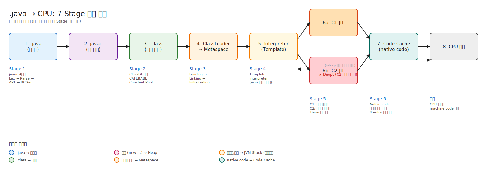
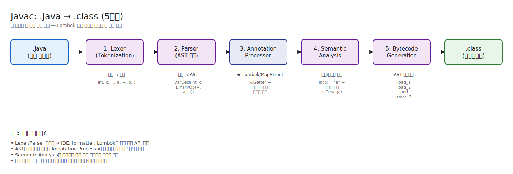
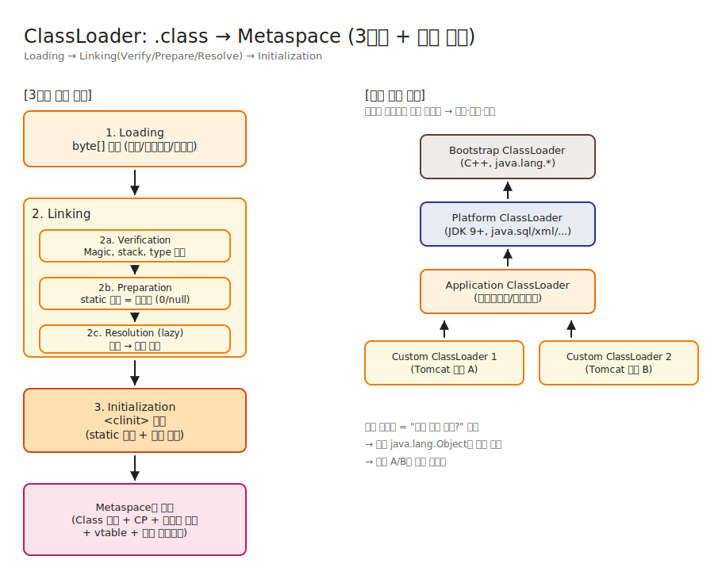
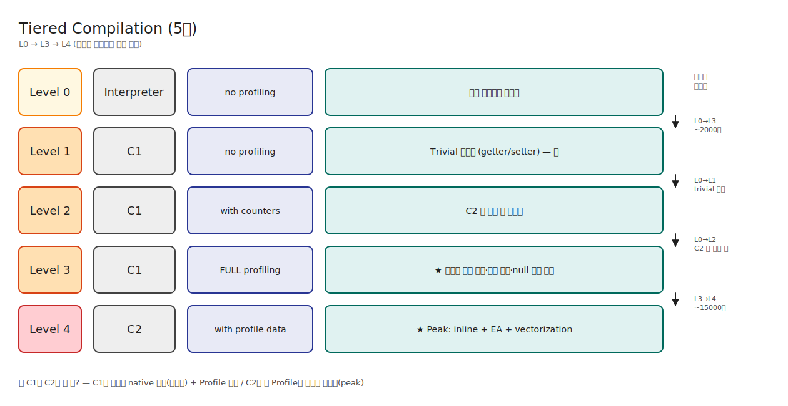
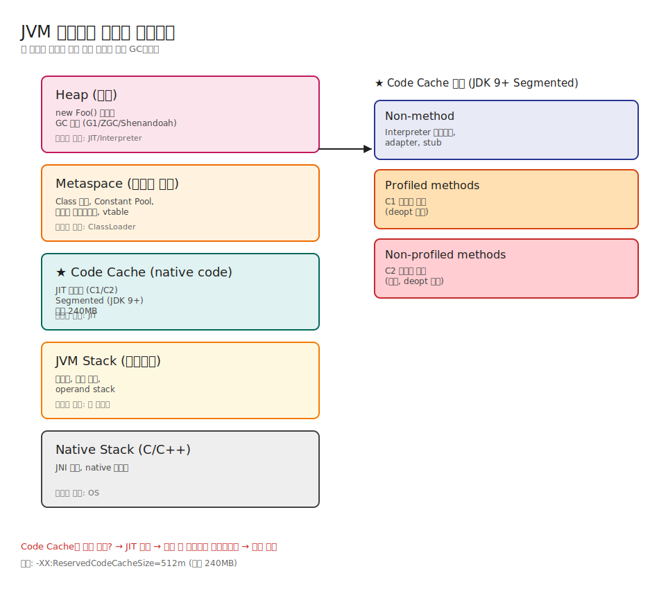
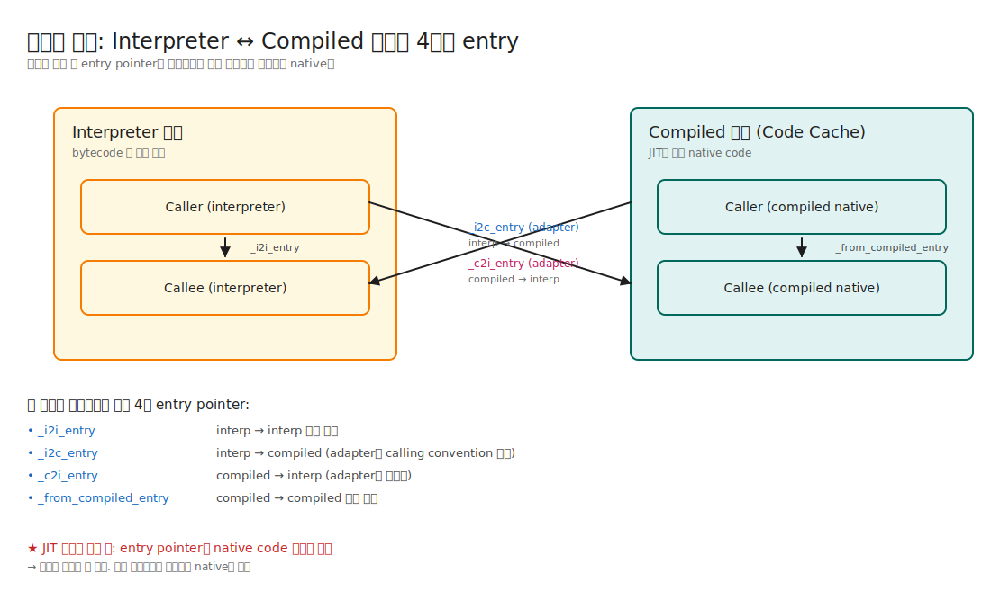

# 02. 컴파일 흐름 — .java가 CPU 명령어가 되기까지

> "Java는 컴파일 언어인가요, 인터프리트 언어인가요?" 라는 함정 질문에 "둘 다요" 라고 답할 수 있어야 한다.
> 더 정확히는: **"javac로 한 번, JIT으로 한 번 — 두 번 컴파일한다. 그 사이엔 인터프리트한다."**

---

## 📍 학습 목표

1. `.java` → `.class` → 메모리 → native 코드의 7단계를 머리에서 그릴 수 있다.
2. `javac`가 하는 일을 4단계로 분해할 수 있다 (Lexing → Parsing → Annotation Processing → Bytecode Gen).
3. `.class` 파일의 첫 4바이트가 왜 `CAFEBABE`인지, 그 뒤에 무엇이 오는지 안다.
4. Tiered Compilation의 Level 0~4를 설명하고, 왜 이렇게 5단계로 나눴는지 안다.
5. JIT 컴파일된 코드가 어디에 저장되며, 어떻게 폐기되는지 안다.
6. `javap -c -p HelloWorld`의 출력을 해석할 수 있다.

---

## 🎨 1단계: 백지 그리기 가이드

> 가로로 긴 흐름도다. A4를 가로로 놓고 그려라.

### Step 1: 좌우로 7개 박스 — 메인 흐름

```
[1) .java] → [2) javac] → [3) .class] → [4) ClassLoader] → [5) Interpreter] → [6) JIT] → [7) Native]
```

박스마다 색을 다르게 (파랑 → 보라 → 초록 → 주황 → 분홍 → 진주황 → 회색)

### Step 2: 단계 5(Interpreter) 아래에 갈래
- 인터프리트 후 호출 빈도 측정 → 임계치 넘으면 6a (C1), 더 핫하면 6b (C2)
- "역최적화(Deopt)" 화살표를 6b → 5로 점선으로 (가정 깨지면 인터프리터로 복귀)

### Step 3: 우측 하단에 5단 Tiered Compilation 사다리
- L0 → L1 → L2 → L3 → L4
- 각 단계 옆에 한 줄 설명

### Step 4: 좌하단에 javac 4단계
- Lexer / Parser / Annotation Processor / Bytecode Gen 박스를 javac 박스 안 작은 박스들로

### Step 5: 우상단 메모리 행선지 표
- Class 메타데이터 → Metaspace
- 객체 → Heap
- Native code → Code Cache
- 스택 프레임 → JVM Stack

### 정답 그림


> SVG로 직접 임베드된다. 편집하려면 [02-compile-flow.excalidraw](./_excalidraw/02-compile-flow.excalidraw)을 [excalidraw.com](https://excalidraw.com/)에서 "Open" 으로 열면 된다.

---

## 🧠 2단계: 직관

### 핵심 비유

> 통역사 비유:
> - 인터프리터 = 동시통역사. 한 문장 듣고 한 문장 통역. 즉시. 하지만 같은 문장이 100번 나오면 100번 통역.
> - JIT = 번역가. 한 문단을 모아서 정성껏 번역. 처음엔 느리지만 같은 문단이 또 나오면 즉시 재사용.
> - JVM은 **두 사람 다 고용**한다. 처음엔 인터프리터로 빠르게 시작 (warmup 빠름), 자주 나오는 문단은 번역가에게 맡긴다 (steady-state 빠름).

**정확한 정의** (비유와 분리):
- **인터프리터**: bytecode 명령어를 한 번에 하나씩 해석해 실행하는 방식. HotSpot은 Template Interpreter 변형을 쓰지만, 다른 JVM 구현은 다른 방식일 수 있다.
- **JIT (Just-In-Time) 컴파일러**: 런타임에 bytecode(또는 그 일부)를 native machine code로 변환하는 컴파일러. HotSpot은 C1(빠른 컴파일)과 C2(공격적 최적화)를 Tiered Compilation으로 조합한다.
- **두 방식 공존의 이유**: 컴파일 비용 vs 실행 성능의 균형. 자주 안 쓰이는 코드까지 컴파일하면 시동이 느려진다.

<details>
<summary><b>🔎 "Template Interpreter 변형"이 정확히 뭐고, 다른 JVM은 뭐가 다른가?</b></summary>

> "인터프리터"라는 단어 하나가 구현 방식을 다 가린다. JVM 인터프리터 구현은 4가지 스펙트럼이 있고, JVM 구현체마다 선택이 다르다.

### 인터프리터 구현 스펙트럼 — 4가지 방식

**(1) Switch-based Interpreter — 가장 순진한 방식**

```c
while (true) {
    uint8_t opcode = *pc++;
    switch (opcode) {
        case ICONST_0: push(0); break;
        case ICONST_1: push(1); break;
        case IADD: { int b=pop(), a=pop(); push(a+b); } break;
        // ... 200여 개 case
    }
}
```

- C/C++의 `switch` 문 하나에 모든 bytecode를 case로 나열.
- **문제**: 매 bytecode마다 점프 테이블을 거치고, CPU의 **branch predictor가 다음 opcode를 예측 못 함** (인덱스가 매번 다름) → indirect branch misprediction이 거의 항상 발생.
- 1996년 Classic VM이 이 방식. **C++ 대비 20~50배 느렸던 이유**.

**(2) Direct-Threaded Interpreter — 살짝 진화**

각 opcode 핸들러의 주소를 테이블에 저장하고, 각 핸들러 끝에서 다음 opcode 주소로 직접 점프 (`goto *next_handler`). GCC 확장 `&&label`을 쓴다. switch보다 빠르지만, 표준 C는 아님. **CPython 3.11+, Lua가 이 방식**.

**(3) Template Interpreter — HotSpot의 방식 ★**

이게 핵심이다. **"인터프리터지만 사실상 매우 단순한 JIT"**.

```
JVM 시작 시:
1. CPU 아키텍처 감지 (x86_64인지 aarch64인지)
2. 각 bytecode opcode에 대해 "이 opcode에 해당하는 어셈블리 시퀀스"를 생성
3. 생성된 어셈블리를 메모리에 배치 (이게 진짜 인터프리터의 실체)
4. 각 어셈블리 끝에는 "다음 bytecode 위치 계산 → 그 핸들러로 점프" 코드 자동 추가

실행 시:
- bytecode를 만나면 → 해당 opcode의 generated assembly로 jump
- switch도, 함수 호출도 없음. 그냥 직접 점프.
```

**예시**: `iadd` opcode를 만나면 HotSpot은 미리 생성해둔 어셈블리로 점프:

```asm
pop     rax              ; operand stack에서 두번째 값
add     [rsp], eax       ; 첫번째 값과 더해서 stack top에 저장
movzbl  eax, [r13+1]     ; 다음 bytecode opcode 읽기
inc     r13              ; pc 증가
jmp     [r14 + rax*8]    ; 다음 opcode의 generated assembly로 점프
```

즉, **HotSpot 인터프리터는 부팅 시점에 자기 자신을 어셈블리로 컴파일한다**. 그래서 `templateInterpreter.cpp`가 그렇게 길고 이상한 매크로(`__`)를 쓴다.

**왜 이렇게 만들었나**:
- 일반 C++ switch보다 2~3배 빠름.
- JIT 컴파일된 코드와 **calling convention이 동일** → 인터프리터 ↔ JIT 코드 전환이 매끄러움 (OSR, Deopt이 가능한 결정적 이유).
- Register 사용도 직접 제어 가능 → operand stack pointer를 register에 고정 (x86_64에선 `rsp`/`r13` 등).

<details>
<summary><b>🔎 "어셈블리·미리 generate·점프 테이블·단순한 JIT"이 정확히 무슨 뜻인가</b></summary>

> 바로 위 (3) Template Interpreter 절에 나온 단어 4개를 한 호흡에 풀어본다.
>
> - **어셈블리**가 정확히 뭔가?
> - **미리 generate**는 왜 하나?
> - **점프 테이블**처럼 쓴다는 게 무슨 뜻인가?
> - 왜 **"매우 단순한 JIT"**이라 부르나? 그럼 진짜 JIT은 뭐가 복잡한가?

---

### 1. 어셈블리(Assembly) — "CPU가 직접 실행하는 기계어를 사람이 읽기 쉽게 쓴 것"

#### 기계어와 어셈블리의 관계

CPU가 진짜로 이해하는 건 **기계어(machine code) = 0과 1의 시퀀스**.

```
기계어 (x86_64):        01 D8         ← 진짜 CPU가 보는 것 (2바이트)
어셈블리:               add eax, ebx  ← 사람이 보는 표현
의미:                   eax = eax + ebx  (두 register를 더해라)
```

**같은 명령을 두 표기로 쓴 것**. 어셈블러(`as`, `nasm`)가 어셈블리 → 기계어로 1:1 변환. CPU 모델마다(x86, ARM, RISC-V, ...) 명령어 집합이 다르므로 어셈블리도 다르다.

#### 자바 세계의 4층 구조

| 층 | 예시 | 누가 실행/이해 |
|---|---|---|
| Java 소스 | `int c = a + b;` | 사람·javac |
| **Bytecode** | `iload_1 iload_2 iadd istore_3` | **JVM** |
| **어셈블리** | `mov eax, [rbp-4]` `add eax, [rbp-8]` ... | **CPU (변환 후)** |
| 기계어 | `8B 45 FC 03 45 F8 ...` | **CPU 직접** |

- **Bytecode는 가상 CPU의 명령어**. JVM이 해석해야 실행됨. 플랫폼 독립.
- **어셈블리/기계어는 실제 CPU의 명령어**. 직접 실행 가능. 플랫폼 종속.

x86_64 어셈블리는 ARM Mac에서 못 돈다. 그래서 자바가 bytecode 층을 두고 "한 번 컴파일, 어디서나 실행"을 가능하게 한 것.

---

### 2. "미리 generate"는 왜 하나 — 부팅 시점에 어셈블리를 만드는 이유

#### 두 가지 인터프리터 만드는 방식 비교

**방법 A — C 코드로 작성된 인터프리터** (Switch / Direct-Threaded)

```c
// JVM 빌드 시점에 이미 컴파일된 상태
while (true) {
    uint8_t op = *pc++;
    switch (op) {
        case IADD: { int b=pop(), a=pop(); push(a+b); } break;
        ...
    }
}
```

→ JVM **빌드할 때** C 컴파일러가 이걸 어셈블리로 변환. **JVM 바이너리는 자기 자신의 어셈블리만 들고 다님**. 부팅 시점에 아무것도 generate 안 함.

**방법 B — HotSpot Template Interpreter**

```cpp
// JVM 부팅 시점에 호출됨
void TemplateInterpreterGenerator::generate_all() {
  for (각 opcode) {
    이 opcode를 처리하는 어셈블리 시퀀스를 메모리에 생성;
  }
}
```

→ **JVM이 부팅하면서 자기가 쓸 인터프리터의 어셈블리를 그 자리에서 만든다**.

#### 왜 이렇게 하나 — 세 가지 이유

**(1) C 컴파일러가 만든 어셈블리가 충분히 최적이 아니라서**

- C 컴파일러는 범용. 인터프리터처럼 **"한 줄 처리 후 다음 opcode로 분산 점프"** 라는 특수 패턴에 최적화 못 함
- register 배치, branch 배치, calling convention을 **인터프리터 전용으로 손수 설계**하고 싶다
- 결과: C로 짠 인터프리터보다 **2~3배 빠름**

**(2) CPU 아키텍처별 코드를 한 소스로 관리하기 위해**

- HotSpot은 x86_64, aarch64, ppc, s390 등을 지원
- 각 아키텍처마다 어셈블리가 완전히 다름
- **부팅 시점에 "이 CPU가 뭐냐"를 보고 거기 맞는 어셈블리를 generate** → 하나의 소스로 여러 아키텍처 대응

**(3) JIT과 calling convention을 통일하기 위해**

- 인터프리터 ↔ JIT 코드 사이를 매끄럽게 점프하려면 둘이 **같은 register 규약, 같은 스택 레이아웃**을 써야 함
- C 컴파일러는 이걸 강제 못 함. 어셈블리를 직접 generate하면 강제 가능
- 결과: **deoptimization** (JIT 코드 → 인터프리터로 돌아가기) 이 가능해짐

> 비유: C 컴파일러가 만든 인터프리터 = 기성품 양복. Template Interpreter = 맞춤 양복. 맞춤이라 비쌀 것 같지만, **한 번만 만들어두면 평생 입는다** (부팅 시 한 번, 그 후엔 고정).

---

### 3. 점프 테이블(Jump Table) — "배열의 인덱스로 점프할 곳을 결정"

#### 일반 분기 vs 점프 테이블

**일반 if-else** (200개 비교):
```c
if (op == 0x1B) handle_iload_1();
else if (op == 0x1C) handle_iload_2();
else if (op == 0x60) handle_iadd();
... (200번 비교)
```

→ 최악 200번 비교. 평균 100번.

**점프 테이블** (O(1)):
```c
void* table[256] = {
    [0x1B] = &&handle_iload_1,   // opcode 0x1B의 처리 코드 주소
    [0x1C] = &&handle_iload_2,
    [0x60] = &&handle_iadd,
    ...
};

goto *table[opcode];   // 단 한 번의 메모리 로드 + 점프
```

→ **O(1)**. opcode가 곧 인덱스.

#### 그림으로 보면

```
점프 테이블 (256개 슬롯의 배열):
┌──────────────────────────────────────────┐
│ index 0x00:  →  handle_nop의 어셈블리    │ ─┐
│ index 0x01:  →  handle_aconst_null의 ... │  │
│ ...                                       │  │  메모리의
│ index 0x1B:  →  handle_iload_1의 어셈블리│  ├─ 어딘가에
│ index 0x1C:  →  handle_iload_2의 어셈블리│  │  있는
│ ...                                       │  │  어셈블리
│ index 0x60:  →  handle_iadd의 어셈블리   │  │  코드들
│ ...                                       │  │  (부팅 시
│ index 0xFF:  →  ...                       │ ─┘  generate됨)
└──────────────────────────────────────────┘
         ↑
  opcode를 이 배열의 인덱스로 사용
```

bytecode 실행 = "다음 opcode 읽기 → 테이블에서 주소 가져오기 → 그 주소로 점프" 무한 반복.

#### HotSpot의 실제 어셈블리

```asm
; iadd 처리 어셈블리 (단순화)
pop    rax                    ; 스택에서 b를 register로
add    [rsp], eax             ; 스택 top(a)에 더함
movzbl eax, byte [r13+1]      ; 다음 bytecode opcode 읽기
inc    r13                    ; pc 1 증가
jmp    [r14 + rax*8]          ; ← 여기가 점프 테이블 사용 지점
                              ;   r14 = 테이블 base, rax = opcode
```

마지막 `jmp [r14 + rax*8]` 한 줄이 "다음 opcode의 핸들러로 점프". **매 핸들러 끝에 이 패턴이 반복**됨.

> 핵심: opcode가 **1바이트(0~255 범위)인 것**과 **256-entry 점프 테이블의 인덱스**가 정확히 맞물려 설계됐다. opcode 디자인 자체가 점프 테이블 디스패치를 전제.

> 더 깊은 분석(branch predictor가 학습하는 메커니즘 등)은 [§ opcode가 정확히 뭐고, 왜 핸들러 주소 테이블을 만들어 직접 점프하는가](#-opcode가-정확히-뭐고-왜-핸들러-주소-테이블을-만들어-직접-점프하는가) 토글에 있음.

---

### 4. 왜 "매우 단순한 JIT"이라 부르나 — 진짜 JIT은 뭐가 복잡한가

Template Interpreter도 **결국 부팅 시점에 어셈블리를 동적 생성**한다. 이건 JIT의 정의(런타임에 코드 생성)에 부분적으로 해당. 그래서 "사실상 매우 단순한 JIT"이라고 표현한 것.

하지만 진짜 JIT(C1/C2)과는 차이가 크다:

| 항목 | Template Interpreter | C1 JIT | C2 JIT |
|---|---|---|---|
| **언제 generate?** | JVM 부팅 시 **1회** | 메서드가 hot해진 시점 (매번) | 더 hot해진 시점 (매번) |
| **무엇을 generate?** | 각 opcode의 핸들러 (200개) | 한 메서드 전체의 native code | 한 메서드 + inlined 메서드들 |
| **최적화** | 거의 없음 (정해진 템플릿) | constant folding, null 제거, 간단한 devirt | inline, EA, vectorization, loop unrolling, GVN, ... |
| **컴파일 시간** | 부팅 시 수 ms | 메서드당 1~10 ms | 메서드당 10~수백 ms |
| **결과물 크기** | 메서드 크기와 무관 (고정) | bytecode의 3~5배 | bytecode의 10~30배 (inline 때문) |
| **프로파일 활용?** | ❌ (실측 데이터 안 봄) | △ (수집은 하지만 활용 적음) | ✅ (MethodData를 적극 활용) |
| **deopt 가능?** | N/A | ✅ | ✅ |

#### "복잡한 JIT"이 정확히 뭘 하는지 — C2 예시

```java
int sumSquares(int n) {
    int s = 0;
    for (int i = 0; i < n; i++) s += i * i;
    return s;
}
```

C2가 hot 판정 후 만드는 어셈블리:

```asm
; Loop unrolling 4배 + SIMD 벡터화 후
vpmulld  ymm0, ymm1, ymm1    ; 8개 정수 제곱을 한 번에
vpaddd   ymm2, ymm2, ymm0    ; 8개 합산을 한 번에
add      eax, 32
cmp      eax, ecx
jl       loop
...
vphaddd  ymm2, ymm2, ymm2    ; horizontal add로 8개 합 → 1개
vextracti128 xmm3, ymm2, 1
...
```

이런 코드를 만들려면 **수십 가지 최적화 패스**가 돌아야 한다 (Sea of Nodes IR 생성 → GVN → loop opt → EA → vectorization → register allocation → scheduling → emit). **이게 "복잡한 JIT"의 의미**.

Template Interpreter는 그냥 `iload`, `iload`, `iadd` 핸들러를 차례로 점프하면서 매번 메모리 접근. SIMD는커녕 register 할당도 매번 새로.

---

### 한 줄 정리

- **어셈블리**: CPU가 직접 실행하는 기계어의 사람-친화 표현. 플랫폼 종속
- **미리 generate**: 부팅 시 어셈블리를 메모리에 만들어두기. C 컴파일러 한계 회피 + 멀티 아키텍처 + JIT과 calling convention 통일
- **점프 테이블**: opcode(0~255)를 인덱스로 핸들러 주소를 찾는 256-entry 배열. O(1) 디스패치
- **"매우 단순한 JIT"**: 부팅 시 어셈블리를 generate한다는 점에서만 JIT스럽다. 실측 프로파일도, inline도, EA도 없다. 진짜 JIT(C1/C2)은 메서드 단위로 매번 generate하고 수십 가지 최적화를 한다

</details>

**(4) AST + Self-optimizing — Truffle (GraalVM)**

이건 완전히 다른 발상. 뒤 GraalVM 항목에서 설명.

---

### JVM 구현별 인터프리터 차이

| JVM | 인터프리터 | JIT |
|---|---|---|
| **HotSpot (OpenJDK)** | Template Interpreter | C1 + C2 (Tiered) |
| **OpenJDK** | = HotSpot (사실상 같은 코드) | = HotSpot |
| **GraalVM (Community/Enterprise)** | HotSpot Template Interpreter 그대로 | **Graal JIT**으로 C2를 교체 |
| **GraalVM Native Image** | **없음** (AOT 컴파일) | 없음 (AOT) |
| **Eclipse OpenJ9 (IBM)** | 자체 구현 (어셈블리 + JIT helper) | **Testarossa JIT** (TR) |
| **Azul Zing / Prime** | HotSpot fork (Template) | **Falcon** (LLVM 기반) |
| **Android ART** | 자체 (register-based) | **AOT + JIT 혼합** |
| **Dalvik (구 Android)** | register-based 인터프리터 | JIT (4.0~) |
| **Avian, JamVM** | switch 또는 threaded | 미니 JIT 또는 없음 |

#### OpenJDK vs HotSpot — 사실상 같은 것

자주 혼동되는 지점:
- **OpenJDK** = "Java 표준의 오픈소스 구현체" (JDK 라이브러리 + 도구 + JVM 전부 포함)
- **HotSpot** = 그 OpenJDK 안에 들어있는 **JVM 부분의 이름**
- 즉 OpenJDK = HotSpot JVM + JDK 라이브러리 + javac 등 도구

Oracle JDK, Amazon Corretto, Azul Zulu, Adoptium Temurin, Microsoft OpenJDK 등은 전부 **OpenJDK 소스를 빌드한 결과물**이라 인터프리터가 동일하다 (Template Interpreter).

#### GraalVM — 인터프리터는 같지만, JIT은 다름

**모드 A: HotSpot + Graal JIT (기본)**
- 인터프리터: HotSpot Template Interpreter **그대로**
- C1: HotSpot C1 **그대로**
- C2: **Graal JIT으로 교체** (Java로 작성된 컴파일러)
- 즉, "C2만 갈아끼운 HotSpot"

```
[Template Interpreter (HotSpot)] → [C1 (HotSpot)] → [Graal JIT (Java)]
```

Graal JIT의 장점:
- Java로 작성됨 → 디버깅/확장 쉬움
- Partial Escape Analysis가 C2보다 강력
- Stream/람다 최적화가 더 좋다고 알려짐

**모드 B: Native Image (AOT)**
- **인터프리터, JIT 둘 다 없음**
- 빌드 시점에 reachable한 모든 코드를 native binary로 AOT 컴파일
- closed-world assumption — reflection은 빌드 시점에 설정으로 알려줘야 함
- 시작 시간이 ms 단위 (HotSpot은 수백 ms ~ 수 초)

**모드 C: Truffle Framework**
Ruby(TruffleRuby), Python(GraalPy), JavaScript(GraalJS)를 GraalVM에서 돌릴 때 쓰는 방식:

```
1. 언어 구현자가 AST 인터프리터를 Java로 작성
2. Truffle이 AST의 각 노드에 "자기-프로파일링" 기능 추가
3. 핫한 AST 서브트리는 Graal JIT이 통째로 native code로 컴파일
4. 가정 깨지면 다시 AST 인터프리터로 폴백
```

**"AST 자체가 인터프리터이자 IR"**. AST를 직접 JIT한다. 일반적인 bytecode 인터프리터와는 차원이 다른 접근.

<details>
<summary><b>🔎 그런데 "AST"가 정확히 뭔가? — 코드를 트리로 표현하는 자료구조</b></summary>

> 위에서 "AST 자체가 인터프리터이자 IR" 같은 표현이 나왔는데, AST를 모르면 이 문장이 안 읽힌다.
>
> 한 줄 정의: **AST = Abstract Syntax Tree (추상 구문 트리). 소스 코드를 트리 구조로 표현한 것**. 컴파일러가 "코드를 이해하기 위해 가장 먼저 만드는 자료구조".

---

### 1. 직관 — 식 `(1 + 2) * 3`을 트리로 그리면

소스코드:
```
(1 + 2) * 3
```

AST:
```
       *
      / \
     +   3
    / \
   1   2
```

각 노드는 **하나의 연산 또는 값**. 루트부터 깊이우선으로 평가하면:
1. `1 + 2` → 3
2. `3 * 3` → 9

이게 AST의 본질. **"이 코드를 어떻게 실행할지"가 트리 구조에 그대로 박혀 있다**.

---

### 2. 자바 한 줄을 AST로 그리면

소스:
```java
int c = a + b;
```

AST (단순화):
```
        VariableDeclaration
       /        |         \
   Type       Name       Initializer
    │          │              │
   "int"      "c"         BinaryOp(+)
                          /        \
                    Identifier   Identifier
                       "a"          "b"
```

각 노드의 역할:
- `VariableDeclaration` — "변수 선언이라는 종류의 문장이다"
- `Type` — "타입 부분이 여기"
- `BinaryOp(+)` — "이항 연산자 +"
- `Identifier` — "변수 이름 참조"

**중요한 포인트**: AST에는 **공백, 줄바꿈, 괄호, 세미콜론 같은 "문법용 토큰"이 사라져 있다**. 의미에 필요한 정보만 남음. 그래서 "**Abstract** Syntax Tree" — "추상" 구문 트리다.

> 반대 개념: **Concrete Syntax Tree (CST) = Parse Tree**는 모든 토큰을 그대로 담음. AST는 그걸 정리한 결과.

---

### 3. AST가 어디서 만들어지나 — 컴파일 파이프라인 안에서

이 문서의 [§ javac의 내부 4단계](#javac의-내부-4단계) 절을 다시 보면:

```
.java 소스
   ↓
1. Lexer (Token화)        ← 글자 → 토큰 시퀀스: ["int", "c", "=", "a", "+", "b", ";"]
   ↓
2. Parser (AST 생성)       ← 토큰 시퀀스 → AST (트리)
   ↓
3. Annotation Processor    ← AST를 보고 코드 생성/변환
   ↓
4. Semantic Analysis       ← AST에 타입 정보 부착
   ↓
5. Bytecode Generation     ← AST → bytecode
   ↓
.class
```

**AST는 Parser의 산출물**이고, 그 뒤 모든 단계가 AST를 입력으로 받는다. **Lombok이 `@Getter`로 메서드를 "삽입"한다는 게 정확히 AST 단계에서 일어나는 일** — getter 메서드 노드를 AST에 새 가지로 붙여넣는 것.

---

### 4. AST vs Bytecode — 두 IR의 차이

JVM 세계엔 **코드를 표현하는 IR이 여러 층** 있다:

```
.java 소스 (텍스트)
   ↓ Parser
AST (트리, 메모리 안)
   ↓ Bytecode Generator
Bytecode (선형 명령어 시퀀스, .class 파일)
   ↓ JIT
Native code (CPU 명령어)
```

| 축 | AST | Bytecode |
|---|---|---|
| **구조** | 트리 | 선형 시퀀스 (1차원 배열) |
| **추상화 레벨** | 높음 (소스에 가까움) | 낮음 (CPU에 가까움) |
| **저장 위치** | 컴파일러 메모리 (휘발성) | `.class` 파일 (디스크) |
| **수명** | 컴파일 끝나면 폐기 | 영구 |
| **수정 용이성** | 쉬움 (노드 add/remove) | 어려움 (오프셋 재계산) |
| **언어 종속** | 자바 문법에 종속 | 언어 중립 (JVM 표준) |

`(1 + 2) * 3`을 둘로 비교:

**AST**:
```
       *
      / \
     +   3
    / \
   1   2
```

**Bytecode**:
```
iconst_1      ; 1 push
iconst_2      ; 2 push
iadd          ; pop 두 개 더해서 push (= 3)
iconst_3      ; 3 push
imul          ; pop 두 개 곱해서 push (= 9)
```

같은 식이지만 **표현이 완전히 다르다**. AST는 구조를 보존, bytecode는 실행 순서를 보존.

---

### 5. 그래서 Truffle이 "AST를 직접 JIT한다"는 게 왜 충격적인가

**일반적인 JVM 흐름**:
```
.java → AST → bytecode → 인터프리터로 실행 + 핫코드는 bytecode를 JIT으로 native 변환
                ↑
                AST는 javac에서 한 번 만들고 버림. 런타임엔 안 봄.
```

**Truffle의 흐름**:
```
.rb (Ruby 코드) → AST → AST를 트리 채로 메모리에 보존
                          ↓
                  AST 노드를 직접 인터프리트 (자식 노드 재귀 평가)
                          ↓
                  핫한 서브트리 발견 → AST를 통째로 Graal JIT으로 native 변환
                          ↓
                  가정 깨지면 다시 AST 인터프리터로 폴백

                  ※ bytecode 단계 자체가 없다
```

왜 충격적인가:
- **JVM 표준 모델은 bytecode가 IR**. AST는 javac 안에서만 살고 죽는다
- **Truffle은 bytecode를 안 만든다**. AST를 IR로 그대로 쓴다
- **AST 노드 하나가 "자기 자신을 어떻게 실행할지"를 들고 있음** — 노드 = 인터프리터의 한 명령
- **트리 구조가 보존돼 있어서** "이 if 노드의 조건이 99% true다" 같은 정보를 노드에 직접 붙이고, 그걸 보고 통째로 JIT 가능

> 비유: 일반 JVM이 **"책을 줄거리로 요약해서(bytecode) 읽는 것"** 이라면, Truffle은 **"책의 목차 트리를 그대로 들고 다니면서 챕터별로 실행하는 것"**. 요약을 안 하니까 정보 손실이 없고, 챕터별 통계도 그 자리에서 매길 수 있다.

---

### 6. 친숙한 예시 — AST는 어디에나 있다

| 도구 | AST를 어떻게 쓰나 |
|---|---|
| **javac** | 파싱 결과로 AST 만들고, 어노테이션 프로세싱·타입 검사·bytecode 생성에 사용 |
| **Lombok / MapStruct** | javac AST에 노드를 직접 삽입/수정해서 코드 생성 |
| **IntelliJ / Eclipse** | 코드 인덱싱, 리팩토링(rename, extract method), inspections 전부 AST 기반 |
| **ESLint / Prettier** | JS AST를 만들어서 룰 검사 + 재포매팅 |
| **Babel / TypeScript** | AST를 변환해서 ES5/ES6 트랜스파일 |
| **Roslyn (C#)** | AST 자체가 공개 API. C# 코드를 프로그래밍으로 분석/생성 |
| **Tree-sitter** | 에디터용 빠른 AST 파서. GitHub의 syntax highlighting이 이걸로 |
| **SonarQube / Checkstyle / SpotBugs** | AST를 순회하면서 룰 검사 |

> 즉 **"코드를 코드로 다루는 모든 도구"의 출발점이 AST**. IDE의 리팩토링이 작동하는 이유, Lombok이 마법처럼 getter를 만드는 이유, ESLint가 룰을 검사하는 이유 — 다 AST를 손대기 때문.

---

### 한 줄 요약

> **AST = "코드를 트리로 표현한 것"**.
> - **Parser**가 텍스트를 받아 AST를 만들고,
> - **컴파일러**(javac)는 AST를 bytecode로 변환하면서 AST를 버린다.
> - 하지만 **Truffle**은 bytecode를 안 만들고 **AST를 IR로 평생 들고 다니면서 JIT한다** — 그래서 "AST 자체가 인터프리터이자 IR"이라는 말이 나온 것.

</details>

#### Eclipse OpenJ9 — 완전히 다른 코드베이스

IBM J9가 오픈소스화된 것. HotSpot과 **소스 공유 전혀 없음**.
- **인터프리터**: HotSpot처럼 어셈블리 템플릿 기반이지만 구조가 다름. `bcInterp.asm` 같은 어셈블리 파일에 직접 작성.
- **JIT**: Testarossa (TR). HotSpot C1/C2와 완전히 다른 아키텍처.
- **차이가 두드러지는 지점**:
  - 메모리 사용량이 HotSpot보다 작음 (메모리 제약 환경에 강함)
  - Shared Class Cache (여러 JVM이 클래스 메타데이터 공유) — 컨테이너에서 강력
  - Pauseless GC (Metronome) 옵션

#### Android ART — register-based, 완전 다른 길

- **register-based bytecode** (Dalvik bytecode, `.dex`)
- 처음엔 인터프리터로 시작 → hot 메서드는 **AOT로 디스크에 저장** (앱 설치/유휴 시) → 이후 실행 시 즉시 native
- HotSpot 식 "어셈블리 템플릿"이 아니라 **C++로 작성된 switch interpreter**가 기본. 단, "Mterp"라는 어셈블리 인터프리터를 별도로 갖고 있어 hot path에선 그걸 사용.

---

### 그래서 "Template Interpreter 변형" 표현은 왜 썼나

아래 [4단계 내부 구현](#-4단계-내부-구현-hotspot)의 Template Interpreter 절이 답이다. HotSpot 인터프리터는 **부팅 시점에 어셈블리를 generate**하는 매우 독특한 구현이고, 학술적으로 분류하면 "switch-based"도 "threaded"도 아니라 별도 카테고리다.

다른 JVM도 비슷한 발상을 쓰지만 (OpenJ9도 어셈블리 기반), HotSpot의 구체적 구현 — `TemplateTable` 클래스, `MacroAssembler` 매크로, 부팅 시 `generate_all()` — 은 HotSpot 고유이므로 "HotSpot은 Template Interpreter 변형을 쓴다"고 한정한 것이다.

---

### 한 줄 요약

- **인터프리터에도 여러 구현 방식이 있다** (switch / threaded / template / AST)
- **HotSpot은 Template Interpreter**: 부팅 시 각 opcode를 어셈블리로 미리 generate해서 그걸 점프 테이블처럼 쓴다. 사실상 매우 단순한 JIT.
- **OpenJDK = HotSpot** (같은 코드)
- **GraalVM**: 인터프리터는 HotSpot 그대로 빌려 쓰고, C2 자리만 Graal JIT으로 교체. Native Image 모드면 인터프리터 자체가 없음 (AOT).
- **OpenJ9**: 별도 코드베이스. 인터프리터/JIT 둘 다 자체 구현. 메모리 효율 강점.
- **Android ART**: 아예 register-based + AOT 중심으로 다른 길.

> 💡 면접 꼬리질문 소재: "왜 GraalVM은 C2만 갈아끼웠을까?" → 인터프리터/JIT/Calling Convention의 분리도를 묻는 좋은 시그널.

<details>
<summary><b>🔎 GraalVM이 "C2 자리만" 갈아끼운 진짜 이유 + 언제 써야 하나 + JVM 종류별 깊이 비교</b></summary>

> 위 면접 꼬리질문에 대한 본격 답. **왜 C2만? 장단점은? 언제 GraalVM을 골라야 하는가? 다른 JVM은 HotSpot과 뭐가 다른가?**

---

### 1. 어디까지가 같고 어디부터 다른가

```
HotSpot (기본):
[Template Interpreter] → [C1] → [C2 (C++로 작성)]
                                 ↑
                                 1999년~2024년 동안 쌓인 C++ 코드

GraalVM (HotSpot 모드):
[Template Interpreter] → [C1] → [Graal JIT (Java로 작성)]
                                 ↑
                                 C2 자리에만 들어감
```

**HotSpot과 GraalVM의 차이는 "Tier 4 컴파일러"** 한 자리뿐. 인터프리터, C1, GC, classloader, JNI, 모든 게 동일하다. JVMCI(JVM Compiler Interface, JEP 243)라는 표준 API를 통해 **C2를 핫스왑하듯 갈아끼울 수 있게** 한 것.

---

### 2. 왜 C2만 갈아끼웠나 — 3가지 이유

**(1) C2가 진짜 가치 있는 자리, 그리고 진짜 아픈 자리**

- **가치**: Peak 성능은 Tier 4에서 결정됨. 여기를 개선하면 throughput이 직접 좋아짐
- **고통**: C2는 1999년 Cliff Click 박사 논문(Sea of Nodes) 기반 C++ 코드. 25년 묵었고 손대기 무서움
- **확장 어려움**: 새 최적화 추가하려면 C++ + Sea of Nodes 내부를 깊이 알아야 함. 사내에 그걸 아는 사람이 손가락에 꼽힘

> Oracle 내부 농담: "C2를 이해하는 사람은 10명이고, 그중 5명은 은퇴했다."

**(2) Java로 컴파일러를 다시 쓰면 얻는 것**

- **자기 자신을 컴파일** (메타써큘러): Graal JIT 자체가 Java니까, Graal이 Graal을 컴파일한다. 디버깅·튜닝이 보통 Java 코드처럼 됨
- **모듈러**: Java 클래스/패키지 구조로 깔끔. 새 최적화 패스를 노드 클래스 추가로 끝낼 수 있음
- **확장 가능**: API가 깨끗해서 사외(Twitter, Renaissance Benchmark 등)에서도 기여 가능

**(3) Truffle을 위한 발판**

- Truffle(다국어 프레임워크, Ruby/Python/JS)이 작동하려면 **AST 인터프리터를 native로 컴파일하는 JIT**이 필요
- 그게 C2론 불가능 (C2는 JVM bytecode 전용). Graal은 Java API로 노출돼서 Truffle이 Graal을 라이브러리처럼 호출
- **Graal은 그냥 더 좋은 C2가 아니라, Truffle/polyglot/Native Image의 공용 컴파일 백엔드**

#### 인터프리터와 C1은 왜 안 건드렸나

- **인터프리터**: 부팅 시 generate되는 단순한 어셈블리. 갈아끼울 가치 적음. 호환성 위험만 큼
- **C1**: warmup 단계라 빠르기만 하면 됨. 공격적 최적화 없어도 됨. 잘 동작 중
- **C2 = 최고 성능 자리**: 여기만 잘 만들면 peak throughput이 좋아짐

---

### 3. Graal JIT의 장단점

#### 장점

| 축 | Graal vs C2 |
|---|---|
| **Partial Escape Analysis** | ✅ C2보다 강력. 조건부로만 escape하는 객체도 제거 가능 |
| **Stream/람다 최적화** | ✅ 평균 5~30% 빠름 (Twitter 사례 유명) |
| **Scala/Kotlin 최적화** | ✅ 함수형 패턴(map/filter/reduce)에 강함 |
| **확장성** | ✅ Java로 작성돼서 새 최적화 추가 쉬움 |
| **Polyglot** | ✅ Truffle 통해 Ruby/Python/JS 가속 |
| **AOT** | ✅ Native Image의 백엔드 |

#### 단점

| 축 | Graal vs C2 |
|---|---|
| **메모리** | ❌ Graal JIT 자체가 Java라 Code Cache + Graal의 힙 둘 다 사용. **메모리 사용량 1.5~2배** |
| **워밍업** | ❌ Graal JIT이 자기 자신을 컴파일하느라 처음엔 느림. **first-N 호출이 C2보다 느림** |
| **워크로드 의존** | ⚠️ 단순 CRUD/HTTP 서버는 차이 거의 없음. 함수형/스트림 무거운 데서만 유리 |
| **C2가 더 빠른 경우도 있음** | ⚠️ 정수 산술 heavy 워크로드에선 C2가 더 빠를 때도 |
| **안정성·접근성** | ⚠️ JDK 17에서 OpenJDK 트리에서 제거됨 (`-XX:+UseJVMCICompiler` 옵션). **GraalVM distribution을 별도로 받아야 함** |

---

### 4. GraalVM을 언제 써야 하나

#### 강하게 추천 — Native Image (AOT 모드)

| 시나리오 | 이유 |
|---|---|
| **AWS Lambda·Cloud Run·Knative** | 콜드 스타트가 ms 단위 (HotSpot은 수 초). 비용·UX 직결 |
| **CLI 도구** | `java -jar foo.jar`가 1초 걸리는 게 `./foo`로 10ms |
| **컨테이너 (CPU/메모리 제한 환경)** | 메모리 50~100MB로 끝 (HotSpot은 200~500MB) |
| **Spring Boot 3 native** | 공식 지원. `./gradlew nativeCompile` |
| **Quarkus / Micronaut** | 처음부터 GraalVM Native를 1순위로 설계된 프레임워크 |

대가:
- **빌드 시간 폭증** (5분~30분)
- **reflection·dynamic class loading 설정 필요** (빌드 시점에 알려줘야 함, `reflect-config.json`)
- **JFR/JMX 등 동적 관측 어려움**

#### 조건부 추천 — Graal JIT (HotSpot 모드)

| 시나리오 | 이유 |
|---|---|
| **Scala 백엔드 (Spark, Akka, Play)** | 함수형 패턴이 많아서 Graal이 5~30% 더 빠를 때 많음 |
| **Twitter 식 마이크로서비스** | Twitter가 2018년에 사내 JVM을 Graal로 교체해서 11% CPU 절감 |
| **Stream/람다 무거운 데이터 처리** | Partial EA가 진가 발휘 |
| **Kotlin 백엔드 일부** | 코루틴/시퀀스 heavy 코드에선 유리 |

비추천:
- **단순 CRUD HTTP 서버** (DB가 병목, JIT 차이 의미 없음)
- **메모리 빡빡한 환경** (Graal 자체가 메모리 더 씀)
- **워밍업 짧아야 하는 곳** (서버리스인데 JIT 모드면 의미 없음 — 이땐 Native Image)

#### Polyglot — Truffle

| 시나리오 |
|---|
| **JVM 위에서 Ruby/Python/JS 도구를 자바와 함께 쓰고 싶다** |
| **언어 자체를 설계 중 — DSL이나 새 언어를 만들고 싶다** (Truffle 프레임워크) |

실무에선 드물지만 학습/연구 가치 큼.

#### 안 써도 됨

- **일반 Spring Boot 서버에서 부팅 후 안정 운영 중**: HotSpot이 검증됐고 메모리 절약됨. 굳이 Graal로 안 가도 됨
- **JDK 21 LTS 갓 도입한 팀**: 일단 표준 OpenJDK로 안정화 후 Graal 시도

---

### 5. JVM 종류 — HotSpot과 뭐가 다른가

#### 한눈에 보는 비교표

| JVM | 만든 곳 | 인터프리터 | JIT | GC 특징 | 강점 | 약점 |
|---|---|---|---|---|---|---|
| **HotSpot** | Oracle/OpenJDK | Template | C1+C2 | G1, ZGC, Shenandoah | 표준, 안정, 풍부한 문서 | 메모리 큼 |
| **GraalVM** | Oracle Labs | (HotSpot 빌림) | C1+Graal | (HotSpot 빌림) | Native Image, polyglot, peak 성능 | 메모리, warmup |
| **Eclipse OpenJ9** | Eclipse (구 IBM J9) | 자체 어셈블리 | Testarossa (TR) | Balanced, Metronome, gencon | **메모리 1/2~1/3**, 공유 클래스 캐시 | 생태계 작음, 문서 적음 |
| **Azul Zing/Prime** | Azul Systems | (HotSpot fork) | **Falcon (LLVM)** | **C4 Pauseless** | GC pause 1ms 미만, peak 성능 | 상용 (비쌈), 큰 메모리 필요 |
| **Amazon Corretto** | Amazon | (HotSpot 그대로) | (HotSpot) | (HotSpot) | AWS 최적화 + 보안 패치 빠름 | = HotSpot |
| **Eclipse Temurin** | Adoptium | (HotSpot 그대로) | (HotSpot) | (HotSpot) | 가장 검증된 OpenJDK 빌드 | = HotSpot |
| **Microsoft OpenJDK** | Microsoft | (HotSpot 그대로) | (HotSpot) | (HotSpot) | Azure 최적화 | = HotSpot |
| **Android ART** | Google | 자체 (Mterp) | AOT + JIT | 모바일용 GC | 앱 설치 시 AOT, 모바일 최적 | 표준 JVM 아님, register-based bytecode |
| **Avian / JamVM** | OSS | Switch/threaded | 없음 또는 미니 | 단순 | 작음 (수 MB) | 느림 |

#### HotSpot 클론 vs 진짜 다른 JVM

**HotSpot의 빌드 배포본일 뿐인 것들** (실질적으로 같은 JVM):
- Oracle JDK
- Amazon Corretto
- Eclipse Temurin (구 AdoptOpenJDK)
- Microsoft OpenJDK
- Azul Zulu
- Liberica JDK (BellSoft)
- Red Hat OpenJDK

→ 전부 **OpenJDK 소스를 빌드한 결과물**. 인터프리터/JIT/GC는 동일. 차이는 **빌드 옵션, 보안 패치 속도, 지원 정책**뿐.

**진짜 다른 JVM**:
- **GraalVM**: C2를 Graal로 교체 + Native Image + Truffle
- **OpenJ9**: 완전 다른 코드베이스. 메모리 효율 강점
- **Azul Zing/Prime**: HotSpot fork지만 GC(C4)와 JIT(Falcon) 완전 교체. **GC pause가 거의 없는 게 특징**
- **Android ART**: register-based bytecode부터 다름. 사실상 별개 생태계

---

### 6. OpenJ9 — HotSpot과 깊은 비교

진짜 다른 두 JVM 중 하나. 자주 비교됨:

| 항목 | HotSpot | OpenJ9 |
|---|---|---|
| **메모리 사용량** | 기본 | **약 50~70% (1/2)** |
| **시작 속도** | 기본 | 비슷~약간 빠름 |
| **Peak throughput** | 기본 | 약간 느림 (5~10%) |
| **GC** | G1/ZGC/Shenandoah | gencon/balanced/metronome |
| **Class Data Sharing** | AppCDS (일부) | **Shared Class Cache (강력)** — 여러 JVM이 메타데이터 공유 |
| **컨테이너 적합도** | △ (JVM이 커서 작은 컨테이너에 부담) | ✅ (메모리 작아서 한 노드에 더 많이 띄움) |

**언제 OpenJ9**:
- 컨테이너를 빽빽하게 띄우는 환경 (Kubernetes 노드당 10~20개 pod)
- 메모리 빡빡한 환경 (저비용 인스턴스, 엣지 디바이스)
- IBM WebSphere 계열 (IBM이 표준으로 권장)

**언제 HotSpot**:
- 일반적 서버, peak 성능 중시
- 생태계/문서가 풍부해야 할 때
- 팀 학습 비용을 줄여야 할 때

---

### 7. Azul Zing/Prime — 깊은 비교

상용 JVM. 비싸지만 **GC pause가 진짜로 없음**:

| 항목 | HotSpot ZGC | Azul C4 |
|---|---|---|
| **GC pause** | ~1ms (ZGC) | **< 1ms 보장 (C4 Pauseless)** |
| **힙 크기** | 16TB까지 | **8TB까지, 더 안정적** |
| **JIT** | C1+C2 | **Falcon (LLVM 기반)** — peak 성능 더 좋다고 알려짐 |
| **가격** | 무료 (OpenJDK) | 상용 (코어당 라이선스) |

**언제 Azul**:
- 초저지연 거래 시스템(금융 HFT)
- p99 latency가 SLA에 박혀 있는 시스템
- 큰 힙(수백 GB) 운용
- HotSpot ZGC로 안 되는 워크로드를 만났을 때

---

### 8. Android ART/Dalvik — 모바일의 다른 길

Android는 자바를 쓰지만 **JVM이 아니다**:

| 항목 | HotSpot | Android ART |
|---|---|---|
| **Bytecode** | Stack-based (`.class`) | **Register-based (`.dex`)** |
| **컴파일 모델** | JIT 중심 | **AOT (앱 설치 시) + JIT 보강** |
| **출처** | OpenJDK 트리 | Google 자체 구현, OpenJDK 라이브러리만 사용 |
| **GC** | G1/ZGC | 모바일 특화 GC (Generational CC) |

**Dalvik → ART 전환** (Android 5.0, 2014):
- Dalvik은 JIT만, 매 실행마다 JIT
- ART는 앱 설치 시 AOT로 디스크에 native code 저장 → 실행 즉시 빠름
- 배터리·성능 둘 다 좋아짐

> 자바 코드로 Android 앱을 만들지만 실제로 도는 건 ART다. JVM 책의 내용이 90% 적용되지만, **GC·컴파일 모델·bytecode 포맷**은 다르다는 점 주의.

---

### 9. 한 그림 — 전체 정리

```
"JVM"이라고 부르는 것들의 분류

[1] HotSpot 계열 (사실상 같은 JVM, 빌드만 다름)
    ├─ Oracle JDK
    ├─ Eclipse Temurin
    ├─ Amazon Corretto
    ├─ Microsoft OpenJDK
    ├─ Azul Zulu
    └─ ...

[2] HotSpot 변형 (C2를 갈아끼운 것)
    └─ GraalVM
       ├─ HotSpot 모드 (C1 + Graal JIT)
       └─ Native Image 모드 (AOT, 인터프리터·JIT 없음)

[3] 완전 다른 JVM
    ├─ Eclipse OpenJ9    — 메모리 효율, 컨테이너 강점
    ├─ Azul Zing/Prime   — GC pause 없음, 상용
    └─ Android ART/Dalvik — 모바일, register-based, 표준 JVM 아님

[4] 마이크로 JVM (학습용/임베디드)
    └─ Avian, JamVM, Kaffe (대부분 deprecated)
```

---

### 한 줄 요약

- **GraalVM이 C2만 갈아끼운 이유**: C2가 최고 성능 자리이자 손대기 어려운 자리. Java로 새로 쓰면 확장성·Truffle·Native Image까지 같이 얻음. 인터프리터·C1은 충분히 잘 동작 중이라 건드릴 가치 적음
- **Graal JIT 장단점**: Partial EA·Stream·Scala에 강하지만 메모리·warmup·워크로드 의존
- **Graal 쓸 때**: Native Image는 서버리스/CLI/컨테이너에서 강추, Graal JIT은 함수형 워크로드에서 조건부 추천
- **JVM 종류**: 대부분은 HotSpot 클론(같은 코드 다른 빌드). 진짜 다른 건 GraalVM·OpenJ9·Azul·Android ART **4개뿐**

</details>

</details>

<details>
<summary><b>🔎 opcode가 정확히 뭐고, 왜 핸들러 주소 테이블을 만들어 직접 점프하는가?</b></summary>

위 토글의 "Switch-based / Direct-Threaded" 설명에서 등장한 두 핵심 개념 — `opcode`와 `goto *handler_table[...]` — 을 한 단계 더 풀어본다.

---

### 1. opcode란 무엇인가

> **opcode = "operation code"의 줄임말**. CPU나 가상 머신이 이해하는 **기본 명령어 단위**의 식별자.

JVM 바이트코드에서 한 명령은 보통:
- **1바이트 opcode** (0~255 중 하나의 숫자)
- **0~여러 바이트의 operand** (피연산자, 명령에 따라 가변)

예를 들어 `iconst_1` 명령은 **1바이트짜리 숫자 `0x04`** 한 개로 표현된다. 사람이 읽기 좋게 `iconst_1`이라는 이름을 붙였을 뿐, JVM이 보는 건 숫자 하나.

#### JVM의 200여 개 opcode (대표적인 것들)

| 16진수 | 이름 | 동작 |
|---|---|---|
| `0x01` | `aconst_null` | null을 operand stack에 push |
| `0x03` | `iconst_0` | int 0을 stack에 push |
| `0x04` | `iconst_1` | int 1을 stack에 push |
| `0x1B` | `iload_1` | 지역변수 1번을 stack에 push |
| `0x3E` | `istore_3` | stack top을 지역변수 3번에 저장 |
| `0x60` | `iadd` | int 두 개 pop → 더해서 push |
| `0x99` | `ifeq` | stack top이 0이면 분기 |
| `0xB6` | `invokevirtual` | 가상 메서드 호출 |
| `0xB8` | `invokestatic` | static 메서드 호출 |
| `0xBA` | `invokedynamic` | 동적 메서드 호출 (JDK 7+) |
| `0xBB` | `new` | 객체 할당 |

#### `.class` 파일에 실제로 들어있는 모습

```java
int c = a + b;
```

이 한 줄이 `.class` 파일에선 정확히 이런 4바이트로 들어간다:

```
1B 1C 60 3E
```

각 바이트의 의미:
- `0x1B` → `iload_1` (a를 push)
- `0x1C` → `iload_2` (b를 push)
- `0x60` → `iadd` (더하기)
- `0x3E` → `istore_3` (c에 저장)

`javap -c`가 보여주는 `iload_1` 같은 이름은 **사람을 위한 디스어셈블리 결과**일 뿐, 디스크에는 숫자 한 바이트로 저장돼 있다.

#### 왜 1바이트인가

- **컴팩트함**: `.class` 파일이 작아짐 → 메모리/디스크/네트워크 효율
- **빠른 디스패치**: 1바이트면 0~255 → 256-entry 점프 테이블의 **인덱스로 바로 사용 가능**
- **단순한 디코딩**: 한 바이트만 읽으면 명령 종류가 결정됨

255개로 부족하지 않나? JVM은 현재 약 200여 개 opcode 사용. 여유 있음. 추가 인자 확장이 필요하면 `wide` opcode (`0xC4`) — "다음 명령의 인자를 2바이트로 확장"이라는 prefix가 있다.

> 📌 정리: **opcode = "이 1바이트가 어떤 동작을 의미하는가"를 식별하는 숫자**. JVM 인터프리터의 출발점은 매번 "이 바이트가 어느 opcode야?"를 묻는 것이다.

---

### 2. 핸들러 주소 테이블 — 왜 만들고, 왜 직접 점프하나

#### 출발점: Switch 문은 왜 느린가?

가장 단순한 구현:

```c
while (true) {
    uint8_t opcode = *pc++;
    switch (opcode) {
        case 0x1B: /* iload_1 */ push(local[1]); break;
        case 0x1C: /* iload_2 */ push(local[2]); break;
        case 0x60: /* iadd */ { int b=pop(), a=pop(); push(a+b); } break;
        // ... 200여 개 case
    }
}
```

컴파일러는 보통 이걸 **점프 테이블**로 최적화한다:

```asm
jump_table:
    .quad case_iload_1     ; opcode 0x1B에 대응하는 코드 주소
    .quad case_iload_2     ; opcode 0x1C에 대응하는 코드 주소
    .quad case_iadd        ; opcode 0x60에 대응하는 코드 주소
    ...

main_loop:                  ; ← 모든 case가 여기로 돌아옴
    movzx eax, byte [pc]
    inc   pc
    jmp   [jump_table + rax*8]   ; ← 단 하나의 디스패치 지점

case_iload_1:
    push local[1]
    jmp main_loop           ; ← 다시 디스패치 지점으로

case_iload_2:
    push local[2]
    jmp main_loop           ; ← 또 다시 디스패치 지점으로

case_iadd:
    ...
    jmp main_loop           ; ← 항상 같은 곳으로 복귀
```

**문제**: 모든 디스패치가 `main_loop`의 단 한 줄 `jmp [jump_table + rax*8]`에서 일어난다.

이 한 줄은 매번 `rax` 값에 따라 다른 곳으로 점프한다 (indirect branch). CPU 입장에서:
- **branch predictor가 학습 못 함**: "여기선 다음에 어디로 갈까?"를 묻는데, 입력 패턴이 사실상 random
- → 거의 항상 **branch misprediction**
- → 파이프라인이 잘못된 명령을 prefetch했다가 버림 (수 사이클 손실)

200줄짜리 메서드 실행하면 200번 다 misprediction → 인터프리터가 느려지는 진짜 이유.

#### 해결: 디스패치를 "분산"시킨다 — Direct-Threaded

> **핵심 아이디어**: 디스패치 지점을 한 곳에 모으지 말고, **각 핸들러 끝에 따로따로** 두자.

```c
// 각 라벨의 주소를 담은 테이블 (GCC 확장)
static void* handler_table[256] = {
    [0x1B] = &&handle_iload_1,    // && 는 라벨 주소를 얻는 GCC 문법
    [0x1C] = &&handle_iload_2,
    [0x60] = &&handle_iadd,
    // ...
};

// 시작: 첫 opcode를 읽고 그 핸들러로 점프
goto *handler_table[*pc++];

handle_iload_1:
    push(local[1]);
    goto *handler_table[*pc++];   // ← 이 핸들러 전용 디스패치 지점

handle_iload_2:
    push(local[2]);
    goto *handler_table[*pc++];   // ← 또 다른 디스패치 지점

handle_iadd:
    int b = pop(), a = pop();
    push(a + b);
    goto *handler_table[*pc++];   // ← 여기도 자기만의 디스패치 지점
```

이제 디스패치가 **200개 핸들러에 200개 분산**된다.

#### 왜 이게 빠른가 — branch predictor의 학습

CPU의 indirect branch predictor는 **각 점프 명령마다 별도의 학습 기록**을 가진다.

- **Switch**: 디스패치 지점 = 1개 → 1개의 학습 기록에 200개 opcode 시퀀스를 다 우겨넣으려고 함 → 패턴 분간 못함
- **Direct-Threaded**: 디스패치 지점 = 200개 → 각 핸들러가 자기만의 학습 기록을 가짐

자바 코드의 실제 분포:
```
iload + iload + iadd + istore + iload + iload + iadd + istore + ...
```

이런 패턴이 흔하다. Direct-Threaded에선 `iload_1` 핸들러 끝의 디스패치 지점이 **"내 다음엔 iload_2가 자주 와"** 를 학습한다. Predictor 적중률이 급격히 올라감.

> 측정 결과: Direct-Threaded는 일반적으로 Switch보다 **20~50% 빠름**. Python 3.11이 이 방식으로 바꿔서 평균 25% 빨라진 이유.

#### 왜 "주소 테이블"인가 — opcode를 인덱스로 쓰기 위해

핵심 질문: **opcode 값 `0x1B`를 받았을 때 어떻게 `handle_iload_1`로 가나?**

답: **opcode가 곧 테이블의 인덱스**. `handler_table[0x1B]`이 곧 `&&handle_iload_1`을 담고 있다.

```
opcode = 0x1B  →  handler_table[0x1B]  →  &&handle_iload_1 (주소)  →  jmp 그 주소
```

- 배열 인덱싱은 **O(1) 메모리 접근 한 번** — 사실상 register 연산 한두 개로 끝
- if-else 체인이면 O(N), 평균 N/2번 비교 — 200개면 100번 비교
- 점프 테이블이면 1번의 메모리 로드 + 1번의 점프

→ **opcode가 1바이트이고 0~255 범위인 것**과 **256-entry 테이블의 인덱스**가 정확히 맞물려서 설계됐다.

#### 왜 "직접 점프(goto)"인가 — 함수 호출 비용 회피

대안 1: 핸들러를 함수로 만들기

```c
void handle_iload_1(VM* vm) { vm->push(vm->local[1]); }

while (true) {
    handler_funcs[*pc++](vm);   // 함수 포인터 호출
}
```

이 경우 매 핸들러마다 발생하는 비용:
- 함수 호출 prologue (스택 프레임 생성, callee-saved register 저장)
- 인자 전달 (calling convention)
- 핸들러 본문
- 함수 호출 epilogue (register 복원, 스택 정리)
- `ret` 명령
- 다시 루프로 돌아와 디스패치

대안 2: `goto *...`로 직접 점프

- 그냥 `jmp` 명령 한 번
- 함수 호출 prologue/epilogue **없음**
- 모든 핸들러가 **같은 함수 안에 있음** → 컴파일러가 operand stack pointer, frame pointer 같은 핵심 변수를 **register에 고정 배치 가능**
- 함수 호출이면 그 register들을 매번 save/restore 해야 함

→ goto 방식이 **함수 호출 비용 + register 트래픽 둘 다 0**.

---

### 3. HotSpot Template Interpreter는 이걸 한 단계 더 — 어셈블리 직접 생성

위에서 본 Direct-Threaded도 결국 C로 작성한 인터프리터다. 핸들러 **본문은 C 컴파일러가 만든 어셈블리**.

HotSpot은 거기서 한 발 더 나간다:
- C 코드를 거치지 않고
- **부팅 시점에 어셈블리를 직접 generate**
- 각 opcode별로 가장 효율적인 native instruction sequence를 손수 설계
- `r13` (bytecode pointer), `r14` (handler table base), `rsp` (operand stack) 같은 register를 **강제로 고정 배치**
- C 컴파일러가 절대 못 만드는 calling convention을 만들어서 JIT 코드와 호환되게 함

결과: C로 짠 인터프리터(Direct-Threaded 포함)보다 또 **2~3배 빠름**. 이게 HotSpot이 "Template Interpreter"라는 별도 카테고리로 분류되는 이유.

---

### 한 줄 요약

- **opcode** = JVM이 이해하는 명령어의 1바이트 식별자 (0x1B = iload_1, 0x60 = iadd, ...). `.class`에 실제로 들어가는 건 이 숫자 하나
- **핸들러 테이블** = `handler_table[opcode]` → 그 opcode 처리 코드의 주소. opcode가 곧 인덱스
- **직접 점프(goto)** = 함수 호출 비용 회피 + register 고정 배치 가능 + branch predictor 학습 가능

세 가지가 합쳐져서 "C++의 switch 인터프리터보다 훨씬 빠른 native-speed dispatch"가 가능해진다. HotSpot은 거기서 한 발 더 나가 어셈블리를 직접 생성한다.

</details>

<details>
<summary><b>🔎 왜 JVM은 처음부터 인터프리터로 시작했을까 — 1995년의 제약</b></summary>

> "성능이 중요한데 왜 처음부터 JIT을 안 만들고 인터프리터부터 만들었나?"라는 의문에 대한 답.
>
> 한 줄 답: **1995년의 Java가 풀어야 했던 핵심 문제는 "성능"이 아니라 "이식성·동적 로딩·보안·작은 메모리"였다. 그 네 가지를 동시에 만족시키는 가장 단순한 답이 인터프리터였다.** JIT은 **나중에 (1999~2000, HotSpot) 추가된 최적화**다.

---

### 1. 시대 배경 — Java가 풀려고 했던 진짜 문제

Java(1991~1995)는 처음부터 "C++ 대체 범용 언어"가 아니었다. 시작은 **셋톱박스(Star7)·케이블 박스·인터랙티브 TV** 용 임베디드 언어였다. 1995년 인터넷 붐을 만나 "웹 브라우저 안에서 도는 애플릿"으로 방향이 바뀐다.

이 시나리오에 깔린 제약:

| 제약 | 의미 |
|---|---|
| **이종 하드웨어** | 셋톱박스 칩이 SPARC/MIPS/x86 등 제각각, 웹 클라이언트도 마찬가지 |
| **네트워크 다운로드** | 바이너리는 **인터넷으로** 떨어진다 — 작아야 하고, 신뢰 못 함 |
| **저사양 메모리** | 셋톱박스 RAM 수 MB, 클라이언트 PC도 16~32MB가 흔하던 시대 |
| **샌드박스 보안** | 외부에서 다운로드된 코드가 OS를 망가뜨리면 안 됨 |
| **느린 CPU도 견디기** | Pentium 100MHz가 흔했던 시기. CPU는 부족, 디스크는 더 부족 |

C/C++ 식 **AOT 네이티브 바이너리**로는 이걸 한 번에 풀 수 없다.
- x86 바이너리는 SPARC에서 못 돈다 → 플랫폼마다 재빌드/재배포 (이식성 ✗)
- 네이티브 코드는 메모리 권한·시스템 콜을 직접 만짐 → 신뢰 못 할 코드를 받아서 돌릴 수 없다 (보안 ✗)
- 받은 즉시 검증할 수 있는 표준 형식이 없다 (검증성 ✗)

---

### 2. 그래서 왜 "bytecode + interpreter"인가 — 5가지 이유

#### (1) 이식성 — "한 번 컴파일, 어디서나 실행"

bytecode는 **가상 CPU의 명령어**라서 어떤 실제 CPU에도 묶이지 않는다. 새 플랫폼이 나오면 **JVM 하나만 포팅하면** 모든 기존 `.class`가 즉시 돈다.

AOT라면? 플랫폼 수 × 컴파일러 백엔드 수만큼 빌드를 관리해야 한다. 1995년 환경에선 사실상 비현실적.

#### (2) 보안 — "실행 전 검증" 가능

bytecode는 **검증기(BytecodeVerifier)** 가 한 줄씩 읽으면서 타입·스택 균형·접근 권한을 점검할 수 있는 **잘 정의된 IR**이다.

- "이 메서드는 스택을 음수로 만들지 않는가?"
- "private 필드를 외부에서 직접 건드리지 않는가?"
- "타입이 안 맞는 캐스팅이 없는가?"

이런 검증을 **네이티브 머신 코드에서 하기는 거의 불가능**하다. x86 인스트럭션 스트림만 보고 "이게 안전한지"를 알아내는 건 정지 문제급. bytecode는 검증이 가능하도록 **일부러 추상화 레벨을 높게** 잡았다 — 그 추상화를 실행하려면 **인터프리터(또는 그 자리에서 native로 변환할 무언가)** 가 반드시 필요하다.

> 애플릿이 신뢰 못 할 코드를 다운로드해서 브라우저 안에서 돌리는데, 이걸 검증 없이 CPU에 던질 순 없다. 이 한 줄이 1995년 JVM 설계의 절반을 결정했다.

#### (3) 동적 클래스 로딩 — AOT가 못 푸는 영역

자바는 **실행 도중 임의의 시점에 새로운 `.class`를 로드해서 링크**할 수 있다. 애플릿이 코드 본체를 받고, 필요해지면 추가 클래스를 또 받아 오는 식.

AOT가 이걸 풀려면:
- 모든 가능한 클래스 조합을 빌드 시 알아야 함 (closed-world) → 동적 로딩 자체와 모순
- 또는 런타임에 클래스 단위 AOT 컴파일러를 들고 있어야 함 → 그게 결국 JIT

bytecode + 인터프리터는 **"로드 → 검증 → 즉시 실행"** 의 사이클이 자연스럽다. JVM이 새 클래스를 받자마자 인터프리터가 그냥 해석하면 끝.

#### (4) 메모리 — 인터프리터가 압도적으로 작다

1995년 메모리 가격은 지금의 100배 이상. 셋톱박스/일반 PC에 **JVM + 컴파일러 + 생성된 native code**를 모두 얹는 건 사치였다.

- **인터프리터**: bytecode 자체를 그대로 들고 다니며 한 줄씩 해석. 별도 산출물 없음
- **JIT/AOT**: bytecode + 컴파일러 코드 + 생성된 native code(보통 bytecode의 5~10배 크기) + 메타데이터

> 자바 1.0~1.1 시절 JVM 전체가 수 MB였다. JIT까지 넣었다면 셋톱박스에 들어갈 수 없었다.

#### (5) 단순함과 출시 속도 — "일단 돌아가야 시장이 생긴다"

Sun은 1995년에 **언어를 출시해서 시장을 만들어야** 했다. 컴파일러를 백엔드까지 만드는 건 수년이 걸리는 작업.

- 인터프리터: 수 명이 수개월에 끝낼 수 있는 규모
- JIT 컴파일러: 수십 명이 수년 걸리는 작업

Sun은 **"먼저 인터프리터로 출시하고, 언어가 살아남으면 JIT을 추가한다"** 는 단계 전략을 택했다. 실제로:

| 년도 | 사건 |
|---|---|
| 1995 | Java 1.0 — **인터프리터만** (Classic VM) |
| 1996 | Sun이 사내에서 JIT 컴파일러 실험 시작 |
| 1997 | Symantec JIT 등 외부 JIT 등장 (옵션) |
| 1999 | Sun이 Animorphic의 **Strongtalk 팀 인수** — 그들이 만든 게 곧 HotSpot |
| 2000 | **JDK 1.3에 HotSpot이 기본 VM**으로 채택 |
| 2008 | Tiered Compilation 도입 (인터프리터 + C1 + C2 협업) |

즉 **JVM은 "인터프리터로 출시되고, 5년 뒤에 JIT을 얻은"** 역사다. 처음부터 둘 다였던 게 아니다.

---

### 3. 그럼 지금은 왜 JIT만 안 쓰고 인터프리터를 그대로 두는가

1995년 제약은 사라졌는데도 HotSpot은 **여전히 인터프리터를 출발점**으로 쓴다. 이유:

**(a) 콜드 코드** — 한두 번만 도는 코드를 컴파일하면 손해. 대부분 메서드는 **몇 번만 실행되고 끝**난다 (한 번 호출되는 main, 초기화 코드, 예외 경로 등). 이걸 다 JIT으로 컴파일하면 컴파일 비용 > 실행 비용. 인터프리터는 이런 콜드 코드를 **공짜로 처리**한다.

**(b) 워밍업 0초** — JIT 컴파일은 수 ms~수십 ms 걸린다. 부팅 시점에 모든 코드를 JIT으로 컴파일하면 시작이 느려진다. 인터프리터는 "로드 → 즉시 실행" 사이클이 0ms.

**(c) 프로파일 수집기 역할** — 인터프리터는 그냥 실행만 하지 않고 **실행하면서 통계를 쌓는다** (가상 호출의 receiver 타입 분포, if문 잡힘 확률, 인자 타입 분포). 이 데이터가 있어야 C2가 "99% Dog로 가정하고 inline" 같은 공격적 최적화를 할 수 있다. AOT는 이 정보가 0이라 못 한다.

**(d) Deoptimization의 안전망** — C2가 "Dog만 들어온다고 가정"하고 컴파일한 코드에 갑자기 Cat이 들어오면? **인터프리터로 폴백**한다. 인터프리터가 없으면 deopt 메커니즘 자체가 성립 안 된다. JIT의 공격적 최적화는 "틀려도 인터프리터에 되돌릴 수 있다"는 안전망이 있어서 가능한 것.

**(e) 디버깅·JVMTI·HotSwap** — JDWP 디버거가 한 줄씩 step over 하거나, JVMTI 에이전트가 클래스를 재정의하거나, IDE가 메서드 본문을 핫스왑할 때 — JIT 코드는 그 자리에서 폐기하고 **인터프리터로 떨어진다**. 인터프리터가 있어야 이런 동적 기능이 매끄럽다.

---

### 4. 정리 — 한 그림

```
1995년 환경                          현재 환경
─────────                          ───────
이종 하드웨어, 작은 메모리,           충분히 빠른 CPU, 큰 메모리,
네트워크 다운로드, 신뢰 못 할 코드     하지만 여전히 동적 기능·콜드코드·deopt 필요

   ↓                                   ↓
"인터프리터로                       "인터프리터로 시작 + 핫 코드만 JIT
 충분히 빠르고                       + 프로파일 수집 + deopt 안전망"
 충분히 안전하고                          (= Tiered Compilation)
 충분히 작다"
   ↓                                   ↓
   Java 1.0                            HotSpot (오늘날)
   (인터프리터만)                       (인터프리터 + C1 + C2)
```

> - **출발점이 인터프리터였던 건** "성능을 포기한 것"이 아니라, 1995년에 풀어야 했던 진짜 제약(이식성·보안·동적 로딩·메모리·출시 속도)을 푸는 **최적해**였다.
> - **JIT을 나중에 얹은 건** "원래 그래야 했는데 늦은 것"이 아니라, 언어가 살아남고 하드웨어가 따라준 뒤에 가능해진 **자연스러운 다음 단계**였다.
> - **지금도 인터프리터를 안 뺀 건**, JIT 혼자선 풀 수 없는 일(콜드 코드·워밍업·프로파일·deopt·핫스왑)이 여전히 있기 때문이다.

<details>
<summary><b>🔎 그런데 "AOT"가 정확히 뭔가? — 약자와 한 그림</b></summary>

> 위에서 "AOT 네이티브 바이너리로는 못 푼다"는 표현이 자꾸 나왔다. AOT가 정확히 뭔지부터.
>
> 한 줄 정의: **AOT = Ahead-of-Time (Compilation), "실행되기 전에 미리" 컴파일하는 방식.**
>
> 더 깊은 설명은 아래 "왜 두 번 컴파일하나?" 절의 AOT 토글에 있다. 여기선 **약자와 핵심 개념만**.

---

### 1. 약자 풀어쓰기

| 약자 | 풀어 쓰기 | 한국어 | 한 줄 의미 |
|---|---|---|---|
| **AOT** | **A**head-**o**f-**T**ime | "(실행) 시간보다 **앞서서**" | 실행 전에 미리 native code로 변환 |
| **JIT** | **J**ust-**i**n-**T**ime | "(실행) 시간에 **딱 맞춰서**" | 실행 도중 필요한 시점에 native code로 변환 |
| **Interpreter** | (약자 아님) | 통역사/해석기 | 매번 한 줄씩 읽고 그 자리에서 실행 |

> 세 단어가 정확히 **"native code로 변환하는 시점이 언제냐"** 라는 한 축 위에 놓여 있다.
> AOT (미리) ←→ JIT (실행 중) ←→ Interpreter (변환 안 함)

---

### 2. 작동 방식 — 한 그림

```
AOT (C/C++/Rust/Go):
  [hello.c] ──(컴파일 시점)──> [hello.exe (x86_64 기계어)] ──> CPU가 바로 실행
                                       ↑
                                       빌드 끝나면 이미 native. 런타임 변환 0.

JIT (JVM, .NET):
  [hello.java] ──(빌드)──> [hello.class (bytecode)]
                                   ↓
                          (실행 시작) JVM이 로드
                                   ↓
                          인터프리터로 시작 → 핫코드 감지 → JIT이 native 변환
                                   ↓
                                CPU 실행

Interpreter only (1995 Java, 옛 Python):
  [hello.py] ──> 인터프리터가 한 줄씩 읽어서 실행 (native 변환 안 함)
```

핵심 차이: **언제 native machine code가 만들어지느냐**.
- AOT: 빌드 시점 (개발자 PC, CI 서버)
- JIT: 런타임 (사용자 PC, 프로덕션 서버)
- Interpreter: 만들어지지 않음

---

### 3. 대표 예시

| 방식 | 대표 언어/런타임 |
|---|---|
| **AOT only** | C, C++, Rust, Go, Swift, **GraalVM Native Image**, Kotlin/Native |
| **JIT only / JIT 중심** | (순수 JIT만 있는 건 드뭄. 대부분 인터프리터 + JIT 조합) |
| **Interpreter + JIT** | **JVM (HotSpot)**, .NET CLR, V8 (Chrome JS), CPython 3.13+, LuaJIT |
| **Interpreter only** | 옛 Python (3.10 이하), PHP (Zend 옛 버전), 1995년 Java 1.0 |
| **AOT + JIT 혼합** | Android ART (앱 설치 시 AOT, 실행 중엔 JIT 보강), .NET ReadyToRun |

---

### 4. 트레이드오프 — 왜 AOT를 안 쓰나 (JVM의 입장)

| 축 | AOT 유리 | JIT 유리 |
|---|---|---|
| **시작 속도** | ✅ ms 단위 (변환 비용 0) | ❌ warmup 필요 (수십 ms~수 초) |
| **Peak 성능** | ⚠️ 정적 분석 한계 | ✅ 실측 프로파일 활용 |
| **메모리 사용** | ✅ 적음 (컴파일러 없음) | ❌ 큼 (JIT + Code Cache + MethodData) |
| **플랫폼 이식** | ❌ 플랫폼당 재빌드 | ✅ bytecode는 어디서나 |
| **동적 기능** | ❌ reflection·hot-swap 어려움 | ✅ 자연스러움 |
| **빌드 시간** | ❌ 김 (특히 LTO) | ✅ 빠름 (bytecode까지만) |

JVM이 AOT를 안 택한 이유: 1995년엔 **이식성·동적 로딩·메모리·보안** 네 축 모두에서 AOT가 불리. JIT을 택한 뒤로는 **peak 성능까지 AOT를 추월**해버렸다 (실측 기반 devirtualization·EA가 정적 분석으로 못 얻는 것).

---

### 5. 그래도 JVM 세계가 AOT로 다시 가는 흐름

2020년대 들어 "JIT의 warmup 비용"이 클라우드/서버리스에서 너무 비싸지자, **JVM이 AOT를 다시 도입**하고 있다:

| 기술 | 년도 | 위치 |
|---|---|---|
| **`jaotc`** | 2017 (JDK 9) | 실험적 AOT — 실패해서 JDK 17에서 제거 |
| **GraalVM Native Image** | 2019~ | 빌드 시점에 전체 AOT. 시작 ms 단위, 메모리 1/10. Spring Boot 3.0+ 공식 지원 |
| **CDS / AppCDS** | 2010, 2018 | Class Data Sharing — bytecode 파싱 결과를 디스크에 미리 저장 (부분 AOT) |
| **Project Leyden** | 2022~ | OpenJDK 공식 AOT 로드맵. JDK 24부터 단계별 도입 중 |
| **AOT Method Profiling** (JEP 483) | JDK 24 (2025) | 이전 실행의 프로파일을 저장해 다음 실행에 재사용 |
| **AOT Code Caching** (JEP 514) | JDK 25 (2025) | JIT 결과를 디스크에 저장해 다음 실행에 재사용 |

> 아이러니: **JVM이 AOT를 거부했다가 다시 부분 AOT를 도입**하고 있다. 1995년의 "이식성" 제약은 사라졌고, 2020년대의 "콜드 스타트" 제약이 새로 생겼기 때문.

---

### 한 줄 비유

> **AOT = "출국 전에 미리 환전"** — 공항 도착하자마자 바로 쓸 수 있지만, 환율이 미래에 어떻게 바뀔지 모름.
> **JIT = "현지에서 그때그때 환전"** — 처음엔 줄 서서 기다리지만, 실제 환율을 보고 환전 가능.
> **Interpreter = "결제 때마다 한국 카드로 그 자리에서 환산"** — 환전 자체를 안 함. 매번 비용 발생.

---

### 어디서 더 자세히 보나

- 이 문서 [§ 왜 두 번 컴파일하나?](#왜-두-번-컴파일하나)의 **"🔎 AOT란 뭐고, JVM의 javac+JIT 모델은 어떻게 동작하는가?"** 토글 → 동적 컴파일이 활용하는 5가지 실측 정보까지
- [§ JVM 구현별 인터프리터 차이](#jvm-구현별-인터프리터-차이) → GraalVM Native Image의 closed-world assumption

</details>

<details>
<summary><b>🔎 그런데 "애플릿"이 정확히 뭔가? — JVM 설계의 절반을 결정한 죽은 기술</b></summary>

> 위에서 자꾸 나온 "애플릿" 시나리오가 정확히 뭔지 모르면 1995년 제약을 체감하기 어렵다.
>
> 한 줄 정의: **1995~2017년 사이에 존재했던, 웹 브라우저 안에 박혀서 실행되던 작은 자바 프로그램**.
>
> 지금은 사실상 사라진 기술이지만, **JVM 설계의 절반이 이걸 위해 만들어졌다**. 자바의 보안 모델·이식성·동적 로딩이 다 애플릿 시나리오에서 비롯됐다.

---

### 1. 동작 방식 — HTML 안에 `.class`를 박는다

1990년대 후반의 웹페이지에 이런 태그가 흔했다:

```html
<html>
<body>
  <h1>주식 차트</h1>
  <applet code="StockChart.class"
          archive="stock.jar"
          width="600" height="400">
    이 브라우저는 자바를 지원하지 않습니다.
  </applet>
</body>
</html>
```

브라우저가 이 페이지를 받으면:

```
1. HTML 파싱 중 <applet> 태그 발견
        ↓
2. 브라우저가 StockChart.class를 서버에서 다운로드
        ↓
3. 브라우저에 내장된 JVM (Java Plug-in)이 깨어남
        ↓
4. 다운받은 .class를 ClassLoader로 로드
        ↓
5. BytecodeVerifier가 검증 (악성 코드 차단)
        ↓
6. SecurityManager가 샌드박스 설정
        ↓
7. 인터프리터가 init() → start() → paint() 호출
        ↓
8. 브라우저 페이지의 600×400 영역 안에 그려짐
```

사용자 입장: 페이지를 열면 그 자리에 **인터랙티브한 차트·게임·계산기**가 나타난다. **HTML/JavaScript로는 1995년엔 불가능했던 것들**.

---

### 2. 코드 모양

```java
import java.applet.Applet;
import java.awt.Graphics;

public class HelloApplet extends Applet {
    public void init() {
        // 애플릿이 로드될 때 한 번 호출
    }

    public void start() {
        // 사용자가 페이지를 열 때마다 호출
    }

    public void paint(Graphics g) {
        // 화면에 그릴 때마다 호출
        g.drawString("Hello, Applet!", 50, 50);
    }

    public void stop() {
        // 페이지를 떠나면 호출
    }
}
```

`main()`이 없다. **브라우저가 라이프사이클 메서드를 호출**하는 구조 (Spring의 `@PostConstruct` 같은 발상).

---

### 3. 왜 이게 JVM 설계의 절반을 결정했나

애플릿 시나리오의 제약:

| 시나리오 | JVM에 강제된 설계 |
|---|---|
| **모르는 서버에서 다운로드한 코드** | → BytecodeVerifier 필수, SecurityManager 필수 |
| **Windows·Mac·Solaris·SGI 등 어디서나 같은 페이지** | → 플랫폼 독립 bytecode + JVM 포팅 |
| **모뎀 속도(28.8kbps)로 다운로드** | → `.class` 파일이 작아야 함 → 컴팩트한 1바이트 opcode |
| **브라우저 안에서 돌아야 함** | → JVM이 가벼워야 함 → 인터프리터로 출발 |
| **악성 코드가 디스크·네트워크를 못 만지게** | → 샌드박스, classloader 격리, 권한 모델 |

> 자바의 **"Write Once, Run Anywhere"** 라는 슬로건 자체가 애플릿 마케팅용이었다. "이 페이지의 자바 프로그램은 당신 PC가 뭐든 돌아갑니다"가 셀링 포인트였던 것.

---

### 4. 왜 사라졌나

2000년대 후반부터 빠르게 죽어갔다:

| 년도 | 사건 |
|---|---|
| 2005~2008 | **Flash와 Ajax**가 인터랙티브 웹의 대안으로 떠오름 |
| 2010~2013 | 애플릿의 **보안 취약점이 연속 폭발** (Java 7 시기). 워터링홀 공격의 단골 벡터 |
| 2014 | 브라우저들이 NPAPI 플러그인 차단 시작 (Chrome이 먼저) |
| 2015 | **Oracle이 "Java Plug-in deprecate"** 공식 선언 |
| 2017 | JDK 9에서 Java Plug-in 제거 |
| 2018 | JDK 11에서 `java.applet` 패키지 자체가 deprecated for removal |
| 2026 (현재) | **사실상 0개의 애플릿이 실제로 돌아간다**. 보안 박물관에만 남아 있음 |

대체된 것들:
- **인터랙티브 UI**: HTML5 + JavaScript + WebAssembly
- **데스크탑 앱**: JavaFX, Electron
- **서버 측 자바**: Spring, Jakarta EE (애플릿과 정반대 방향 — 자바는 클라이언트가 아니라 서버 언어로 정착)

---

### 5. 그래도 알아야 하는 이유 — JVM 역사의 "원시 환경"

오늘날 우리가 쓰는 JVM의 **이상해 보이는 설계들**이 대부분 애플릿 시대의 흔적이다:

- `SecurityManager` (JDK 17에서 deprecated, 18에서 제거 시작) — 애플릿 샌드박스용으로 만들어진 것
- `ClassLoader`의 부모 위임 모델 — 브라우저 안에서 여러 애플릿을 격리하려고 만든 것
- `Bytecode Verifier`의 엄격함 — 신뢰 못 할 다운로드 코드 전제
- `.class` 파일 포맷의 컴팩트함 (1바이트 opcode, constant pool 공유) — 모뎀 다운로드 전제
- **인터프리터 기반 출발** (위 토글 참고) — 브라우저 안에 들어가야 했으니까

> 애플릿은 죽었지만, **애플릿이 만든 JVM 설계 원칙은 그대로 살아남아 지금의 서버 자바를 떠받치고 있다**. JVM이 왜 그렇게 생겼는지 이해하려면 애플릿이라는 1990년대의 죽은 시나리오를 알아야 하는 이유.

---

### 한 줄 비유

> **애플릿 = 90년대판 WebAssembly**
>
> "브라우저 안에서, 신뢰 못 할 코드를, 안전하게, 어떤 OS에서도 돌리자"는 발상은 2020년대 WebAssembly가 거의 똑같이 풀고 있는 문제다. 다만 WASM은 애플릿이 죽은 길(보안 사고·플러그인 의존)을 피하려고 **샌드박스를 브라우저 자체에 내장**하고, **언어 중립**으로 만들었을 뿐.

</details>

</details>

### 왜 두 번 컴파일하나?

> **답**: 트레이드오프의 균형.
>
> - 옵션 A: 전부 AOT (Ahead-of-Time) 컴파일 → C/C++ 방식. 시작은 빠르지만 **포팅 어려움**, **동적 정보 활용 못 함**.
> - 옵션 B: 전부 인터프리트 → 원조 JVM (1.0). 단순하지만 **느림**.
> - 옵션 C: AOT + 인터프리트 → 효율적이지만 **JVM의 동적 기능 (reflection, dynamic class loading) 약함**.
> - 옵션 D: javac (bytecode) + JIT — **현재 JVM 방식**. javac가 플랫폼 독립적 중간 표현으로 컴파일 → JVM이 런타임에 실측 프로파일로 추가 컴파일.

<details>
<summary><b>🔎 AOT란 뭐고, JVM의 javac+JIT 모델은 어떻게 동작하는가? 동적 컴파일이 정확히 뭔가?</b></summary>

### 1. AOT (Ahead-of-Time) 컴파일이란

> **"실행되기 전에 미리"** 컴파일.

C/C++, Rust, Go가 이 방식이다. 빌드 시점에 소스코드 → CPU가 직접 실행하는 **기계어(native code)** 까지 한 번에 만든다.

```
[hello.c] → (gcc) → [hello.exe]
                     ↑
                     이게 이미 x86_64 기계어. CPU가 바로 실행.
```

**장점**:
- **시작이 빠름**: 변환 비용을 빌드 때 다 지불했으니 실행 시점엔 0
- **결정론적**: 같은 입력 → 같은 결과 (워밍업 변동 없음)
- **메모리 적음**: 런타임에 컴파일러를 들고 있을 필요 없음

**한계**:
- **플랫폼 종속**: x86_64 Linux 바이너리는 ARM Mac에서 못 돈다. 새 플랫폼마다 재컴파일/포팅
- **동적 정보 0**: 컴파일 시점엔 "어떤 분기가 99% 잡힌다", "어떤 타입이 항상 들어온다"를 **알 길이 없음**. 그래서 보수적 최적화만 가능
- **Dynamic feature 약함**: reflection, dynamic class loading, 코드 hot-swap이 본질적으로 어렵다

> GraalVM Native Image가 정확히 이 길로 간 것. 시작 ms 단위지만 reflection을 빌드 설정으로 미리 알려줘야 함.

---

### 2. JVM 모델 — javac + JIT의 분업

JVM은 **컴파일을 두 단계로 쪼개서** AOT의 한계를 우회한다.

#### 1차 컴파일: `javac` (정적, 빌드 시점)

`javac`가 하는 일: **`.java` → 바이트코드 (`.class`)**.

바이트코드는 **"가상의 CPU"가 이해하는 명령어**다. 실제 x86이나 ARM과 무관한 추상 명령어 집합.

**예시 — 한 줄짜리 자바를 javac가 어떻게 바이트코드로 만드는가**:

```java
int c = a + b;
```

```
iload_1       // 지역변수 1번(a)을 operand stack에 push
iload_2       // 지역변수 2번(b)을 operand stack에 push
iadd          // stack top 두 정수를 pop해서 더한 뒤 결과를 push
istore_3      // pop해서 지역변수 3번(c)에 저장
```

핵심 포인트:
- 이 4개 명령어는 **x86이든 ARM이든 RISC-V든 똑같다** → 플랫폼 독립
- 이건 아직 CPU가 직접 실행 못 함. **JVM이 해석해줘야 한다**
- "stack-based" 가상 머신: register 없이 operand stack에서만 연산

> 그래서 `.class`는 정확히 말하면 **"중간 표현(IR)이 디스크에 저장된 것"** 이다. C 컴파일러의 LLVM IR이 디스크에 남아있는 거라고 생각하면 비슷하다.

#### 2차 컴파일: JVM이 런타임에 — Interpreter + JIT

JVM이 `.class`를 받으면 두 가지 방법으로 실행한다:

**(A) Interpreter** — 바이트코드를 한 줄씩 해석해서 실행:

```
프로그램 시작
 ↓
Interpreter가 iload_1 만남 → "지역변수 1번을 stack에 push해야 하는구나" → 실행
 ↓
다음 명령어 iload_2 만남 → 실행
 ↓
다음 명령어 iadd 만남 → 실행
 ↓ ... (한 줄씩 해석 반복)
```

- 변환 비용 0 → **즉시 시작 가능**
- 하지만 같은 코드가 100만 번 실행되면 100만 번 해석함 → 느림

**(B) JIT** — 자주 실행되는 메서드는 **native code로 변환해서 캐싱**:

```
이 메서드가 1만 번 호출됨 → "hot하다" → JIT 컴파일러 호출
                                          ↓
                              바이트코드 → x86_64 어셈블리 변환
                                          ↓
                              Code Cache에 저장
                                          ↓
                              다음 호출부터는 어셈블리로 직접 점프 (해석 안 함)
```

---

### 3. 동적 컴파일 — JIT이 AOT보다 잘하는 지점

> 핵심: **JIT은 "실제 실행을 본 결과"를 가지고 컴파일한다.**

AOT 컴파일러는 코드를 정적으로 보면서 "최선의 추측"으로 최적화한다. 그런데 실제 프로그램의 동적 특성은 코드만 봐선 알 수 없다.

#### JIT이 활용하는 5가지 "실측 정보"와 그 활용

**(1) Inlining — 자주 호출되는 작은 메서드 본문을 호출 사이트에 끼워넣기**

```java
int square(int x) { return x * x; }

int sum() {
    int s = 0;
    for (int i = 0; i < 1000; i++) {
        s += square(i);   // 1000번 호출
    }
    return s;
}
```

JIT 판단: `square`가 hot, 짧음 → `sum` 안에 통째로 삽입:

```java
// JIT이 만든 가상 코드
int sum() {
    int s = 0;
    for (int i = 0; i < 1000; i++) {
        s += i * i;   // square 호출 사라짐
    }
    return s;
}
```

→ 함수 호출 비용(스택 프레임, register save) 0. 그리고 이걸 발판으로 다음 최적화들이 가능해진다.

**(2) Devirtualization — 가상 호출을 정적 호출로**

```java
interface Animal { void speak(); }
class Dog implements Animal { void speak() { ... } }
class Cat implements Animal { void speak() { ... } }

void run(Animal a) {
    a.speak();   // 어느 구현이 호출될지 정적으로는 모름
}
```

AOT는 가상 호출 테이블 조회를 거쳐야 함 (vtable lookup).

JIT은 1만 번 실측을 보고: **"항상 Dog만 들어왔네"** → `Dog.speak()`로 가정 + inline:

```
[가정] a는 Dog다
[가드] if (a.getClass() != Dog) goto deopt;
[본문] Dog.speak()의 본문을 펼친 코드
[deopt] 가정 깨지면 인터프리터로 복귀
```

→ 가상 호출 비용 0. 만약 어느 날 Cat이 들어오면 deopt 발생 → 인터프리터 → 재컴파일.

**(3) Branch Prediction — 자주 잡히는 분기 우선 배치**

```java
if (x == null) { /* 에러 처리 */ }
else { /* hot path */ }
```

JIT이 본 결과: 99% null 아님 → 어셈블리에서 else 본문을 **fall-through**(점프 없이 다음에 바로 오는 경로)로 배치:

```asm
test    eax, eax       ; x가 null인지 검사
jz      error_handler  ; null이면 점프 (드뭄)
; hot path 본문이 바로 여기 옴 — CPU 캐시 hit, branch predictor 정확
...
```

→ CPU 명령어 캐시 효율 + branch predictor 정확도 ↑.

**(4) Escape Analysis + Scalar Replacement — Heap 할당 제거**

```java
int distance(int x1, int y1, int x2, int y2) {
    Point p1 = new Point(x1, y1);
    Point p2 = new Point(x2, y2);
    return Math.abs(p1.x - p2.x) + Math.abs(p1.y - p2.y);
}
```

JIT 분석: `p1`, `p2`가 메서드 밖으로 안 나감("escape" 안 함) → **Heap 할당 자체를 제거** + 필드를 register로 분해:

```java
// JIT이 만든 가상 코드 — 객체가 사라짐
int distance(int x1, int y1, int x2, int y2) {
    return Math.abs(x1 - x2) + Math.abs(y1 - y2);
}
```

→ GC 부담 0. allocation 0. 이게 JVM이 "객체 마구 만들어도 빠른" 이유의 핵심.

**(5) Loop Unrolling + Vectorization**

```java
for (int i = 0; i < 1000; i++) sum += arr[i];
```

JIT이 만드는 어셈블리:

```asm
; 4개씩 묶어 SIMD 명령으로 한 번에 처리
vmovdqu  ymm0, [rax]       ; arr[i..i+7] 8개 정수를 한 번에 load
vpaddd   ymm1, ymm1, ymm0  ; 8개를 한 번에 더함
add      rax, 32
cmp      rax, rcx
jl       loop
```

→ 8개 정수를 한 명령으로 처리. 이론적으로 8배 빠름.

---

### 4. JVM은 어떻게 "hot 코드"를 알아내는가 — 동적 컴파일의 실제 흐름

JIT의 메커니즘은 결국 **세 가지**다:
1. **카운터로 hot 판정**
2. **인터프리터에서 프로파일 수집**
3. **임계치 넘으면 JIT 큐에 제출**

#### 카운터 시스템

JVM은 메서드마다 두 카운터를 둔다:

| 카운터 | 의미 |
|---|---|
| **Invocation counter** | 이 메서드가 호출된 횟수 |
| **Back-edge counter** | 이 메서드 안의 루프가 회전한 횟수 |

기본 임계치 (Tiered Compilation 기준):
- C1 컴파일 트리거: invocation ≥ ~200, back-edge ≥ ~1000
- C2 컴파일 트리거: invocation ≥ ~5000, back-edge ≥ ~10000
- (정확한 값은 `-XX:Tier3InvocationThreshold` 등으로 조정)

#### 프로파일 데이터 수집 — `MethodData`

인터프리터와 C1이 메서드 실행 중에 모으는 데이터:

```
MethodData {
    invocation_count
    backedge_count

    // 각 가상 호출 site별로
    receiver_class_distribution: { Dog: 9990, Cat: 10 }

    // 각 if/switch별로
    branch_taken_count
    branch_not_taken_count

    // 각 null check별로
    null_seen_count

    // 각 메서드 인자별로
    type_profile: { String: 9999, Object: 1 }
}
```

이게 Metaspace에 메서드마다 저장된다. C2가 컴파일할 때 이걸 읽어서 **"99% Dog면 Dog로 가정"** 같은 결정을 내린다.

#### 전체 라이프사이클

```
[새 메서드 호출됨]
        │
        ▼
[Level 0: 인터프리터 실행]
        │ invocation/backedge 카운터 ++
        │
        │ 카운터 ≥ 임계치
        ▼
[Level 3: C1 컴파일 (with full profiling)]
        │ Code Cache에 native code 저장
        │ 호출 시 어셈블리로 직접 점프
        │ MethodData에 profile 누적
        │
        │ 카운터 더 누적
        ▼
[Level 4: C2 컴파일 (profile-guided)]
        │ MethodData를 읽어서 공격적 최적화
        │ inline + EA + vectorization
        │ Code Cache에 새 native code 저장 (L3 코드 폐기)
        │
        │ ← 가정 깨짐 (예: 갑자기 Cat 들어옴)
        ▼
[Deoptimization]
        │ register/stack 상태를 인터프리터 frame으로 재구성
        │
        ▼
[Level 0으로 복귀 → 다시 카운터 누적 → 재컴파일]
```

---

### 5. AOT vs JIT — 정리 비교

| 항목 | AOT (C/C++) | JIT (JVM) |
|---|---|---|
| **컴파일 시점** | 빌드 시 (한 번) | 런타임 (반복) |
| **결과물** | 플랫폼 종속 binary | bytecode + 런타임에 생성된 native code |
| **시작 속도** | 빠름 (바로 실행) | 느림 (warmup 필요) |
| **Peak 성능** | 좋음 (정적 최적화 한계) | 더 좋을 수 있음 (실측 기반 최적화) |
| **플랫폼 이식** | 재컴파일 | bytecode는 어디서나 |
| **메모리** | 적음 | 많음 (JVM + Code Cache + MethodData) |
| **최적화 정보** | 정적 분석만 | 정적 + **실측 프로파일** |
| **동적 기능** | 어려움 | reflection, hot-swap 자연스러움 |
| **대표 사례** | C, C++, Rust, Go | Java, Kotlin, Scala |

---

### 6. 한 줄 요약

> **AOT는 "예측 컴파일"이고, JIT은 "관측 컴파일"이다.**

- AOT는 코드만 보고 "이렇게 돌아갈 것이다"를 가정한다
- JIT은 실제로 돌아가는 걸 보고 "이렇게 돌아간다"를 알아낸 다음 컴파일한다
- 그래서 JIT은 **AOT가 절대 할 수 없는 최적화** — devirtualization, escape analysis, branch prediction에 실측 적용 — 를 한다
- 대가는 **warmup**(처음엔 인터프리터로 느리게 시작) + **메모리**(JIT 컴파일러 + Code Cache + MethodData)

이게 "javac가 한 번, JIT이 한 번, 그 사이엔 인터프리트"라는 이 챕터 도입부 문장의 본질이다. 같은 코드를 **두 번 컴파일**하는 이유는 — **정적 컴파일러가 알 수 없는 정보를, 동적 컴파일러가 실측으로 알아낸 뒤 더 깊이 최적화하기 위해서**다.

</details>

### "Bytecode가 왜 stack-based인가?"

JVM의 bytecode는 register가 없다. 모든 연산이 **operand stack**에서 일어난다.
이유:
- **단순함**: 명령어가 짧다. 1바이트 opcode가 대부분.
- **플랫폼 독립**: register 개수가 CPU마다 다르다. 추상화하기 좋다.
- **검증 용이**: Stack-based는 타입 추론이 simpler.

대가:
- 같은 연산에 더 많은 instruction이 필요 (push, pop)
- → JIT이 register allocation을 새로 해야 함

> **참고**: Lua VM, Python의 CPython, .NET CLR도 stack-based.
> Dalvik(Android), Lua 5.1+의 LuaJIT는 register-based.

---

## 🔬 3단계: 구조 — `.java`가 CPU에서 실행되기까지 (단계별)

> 1단계 백지 그리기에서 그린 7개 박스를 **하나씩 풀어쓴다**. 각 Stage 끝에 "더 깊이"가 필요한 부분은 위의 토글로 가는 링크.

### 전체 흐름 한눈에



> 편집: [02f-7-stage-flow.excalidraw](./_excalidraw/02f-7-stage-flow.excalidraw)를 [excalidraw.com](https://excalidraw.com/)에서 "Open"으로.
>
> 아래 Stage 1~7이 이 박스 각각을 풀어쓴다.

<details>
<summary>🔎 ASCII 버전 (텍스트로 보고 싶을 때)</summary>

```
 ┌──────────┐  javac    ┌──────────┐  ClassLoader  ┌──────────────┐
 │  .java   │ ────────> │  .class  │ ────────────> │  Method Area │
 │ (텍스트)  │           │ (binary) │               │  (Metaspace) │
 └──────────┘           └──────────┘               └──────┬───────┘
                                                          │ 첫 호출
                                                          ▼
                          ┌─────────────────────────────────────────┐
                          │           Interpreter                    │
                          │     (Template-based, HotSpot 기본)        │
                          └────────┬─────────────────┬──────────────┘
                                   │ hot 감지         │ interp 실행
                                   ▼                  │
                          ┌─────────────────┐         │
                          │   C1 JIT        │         │
                          │  (빠른 컴파일)    │         │
                          └────────┬────────┘         │
                                   │ 더 hot           │
                                   ▼                  │
                          ┌─────────────────┐         │
                          │   C2 JIT        │         │
                          │  (공격적 최적화)  │         │
                          └────────┬────────┘         │
                                   │                  │
                                   ▼                  │
                          ┌─────────────────┐         │
                          │  Code Cache     │         │
                          │  (native code)  │         │
                          └────────┬────────┘         │
                                   │ 직접 호출         │
                                   ▼                  ▼
                          ┌──────────────────────────────────┐
                          │             CPU                   │
                          └──────────────────────────────────┘

 ★ 역최적화 (Deoptimization): C1/C2의 speculation이 깨지면 Interpreter로 복귀
```

</details>

---

### Stage 1 — javac: `.java` → bytecode (4단계 분해)

`javac`("자바씨", Java Compiler)는 **Java로 작성된 컴파일러**다. 입력 `.java` 텍스트, 출력 `.class` 바이너리. 내부에서 4단계(엄밀히는 5단계)를 거친다.

#### javac의 내부 4단계



> 편집: [02a-javac-stages.excalidraw](./_excalidraw/02a-javac-stages.excalidraw)

> Annotation Processing은 다단계 가능 (한 라운드에서 생성된 코드를 다음 라운드에서 또 처리).
> Lombok이 `@Getter` 어노테이션을 AST에 직접 삽입할 수 있는 이유.

<details>
<summary>🔎 ASCII 버전</summary>

```
   ┌──────────────┐
   │  .java 소스   │
   └──────┬───────┘
          │
          ▼
   ┌──────────────────────┐
   │ 1. Lexer (Token화)    │
   └──────┬───────────────┘
          ▼
   ┌──────────────────────┐
   │ 2. Parser (AST 생성)  │
   └──────┬───────────────┘
          ▼
   ┌──────────────────────────────────────────────┐
   │ ★ 3. Annotation Processor                    │
   │     (Lombok, MapStruct, Dagger, ...)         │
   │     라운드 반복 가능 — 생성된 코드를 다시 처리   │
   └──────┬───────────────────────────────────────┘
          ▼
   ┌──────────────────────────────┐
   │ 4a. Semantic Analysis         │
   │     (타입 검사, scope, flow)   │
   └──────┬───────────────────────┘
          ▼
   ┌──────────────────────────────┐
   │ 4b. Bytecode Generation       │
   └──────┬───────────────────────┘
          ▼
   ┌──────────────┐
   │  .class 출력  │
   └──────────────┘
```

</details>

#### 1.1 Lexing (Tokenization) — 글자를 토큰으로

> **Lexer(렉서) = "글자 시퀀스를 의미 있는 단어 단위(토큰)로 자르는 단계"**.

자바 소스는 컴퓨터 입장에선 그냥 **글자 시퀀스**(`i`, `n`, `t`, ` `, `c`, ...)다. 이걸 의미 있는 단위로 잘라야 다음 단계가 작업 가능.

```
입력:  "int c = a + b;"
       ↓ Lexer
출력:  [TOKEN(KEYWORD, "int"),
        TOKEN(IDENT,   "c"),
        TOKEN(OP,      "="),
        TOKEN(IDENT,   "a"),
        TOKEN(OP,      "+"),
        TOKEN(IDENT,   "b"),
        TOKEN(SEMI,    ";")]
```

각 토큰은 두 가지를 들고 다닌다:
- **종류** (keyword, identifier, operator, number literal, string literal, ...)
- **원문 텍스트** (필요할 때 참조용)

Lexer가 처리하는 것:
- 공백·줄바꿈·들여쓰기 **제거** (의미 없음)
- `// ...`, `/* ... */` 주석 **제거**
- `if`, `while`, `class`, `int` 같은 **예약어 인식**
- `"hello"` 같은 **문자열 리터럴 묶기** (따옴표 안의 공백은 그대로)
- `123`, `0xFF`, `3.14f` 같은 **숫자 리터럴 파싱**
- `==`, `>=`, `++` 같은 **다중 문자 연산자** 식별

위치: `com.sun.tools.javac.parser.Scanner`, `JavaTokenizer`

> 💡 다른 이름: **Tokenizer**(토크나이저) = **Scanner**(스캐너). 같은 것. Compilers 책에서는 "Scanner"라고도 함.

#### 1.2 Parsing — 토큰을 AST로

> **Parser(파서) = "토큰 시퀀스를 문법 규칙에 맞춰 AST(트리)로 조립하는 단계"**.

토큰 시퀀스만으로는 중첩 관계가 안 보인다. **트리 구조**로 만들어야 "이 표현식 안에 저 표현식이 들어있다"는 게 명시됨.

```
입력:  [int, c, =, a, +, b, ;]
       ↓ Parser
출력:  VariableDeclaration
       ├─ type: int
       ├─ name: c
       └─ init: BinaryOp(+)
                ├─ left:  Identifier(a)
                └─ right: Identifier(b)
```

이게 바로 **AST (Abstract Syntax Tree)**. 자세한 건 위의 [§ 그런데 "AST"가 정확히 뭔가?](#-그런데-ast가-정확히-뭔가--코드를-트리로-표현하는-자료구조) 토글이 다룬다.

Parser가 하는 일:
- **문법 규칙 적용**: Java Language Specification(JLS)의 grammar(BNF) 따라 매칭
- **연산자 우선순위**: `a + b * c`를 `(a + b) * c`가 아니라 `a + (b * c)`로 트리 구조에 반영
- **문법 오류 검출**: `int = ;` 같은 깨진 코드면 여기서 컴파일 에러
- **AST 노드 생성**: 각 노드는 자바 클래스 (`JCVariableDecl`, `JCBinary` 등)

위치: `com.sun.tools.javac.parser.JavacParser`

> 💡 자바는 **recursive descent parser** — 함수가 자기 자신을 부르면서 트리를 만드는 가장 단순한 방식.

#### 1.3 Annotation Processing — Lombok이 마법을 부리는 곳

> **Annotation Processor = "AST가 만들어진 직후에 끼어들어 코드를 추가/변환하는 플러그인"**.

실제 사례:

| 처리기 | 어노테이션 | 하는 일 |
|---|---|---|
| **Lombok** | `@Getter`, `@Setter`, `@Data` | AST에 직접 getter/setter 메서드 노드 삽입 |
| **MapStruct** | `@Mapper` | DTO ↔ Entity 변환 코드를 별도 `.java` 파일로 생성 |
| **Dagger / Hilt** | `@Inject`, `@Module` | DI 그래프 코드 생성 |
| **Hibernate JPA Meta** | `@Entity` | `Person_.java` 같은 metamodel 클래스 생성 |
| **AutoValue / Immutables** | `@Value.Immutable` | 불변 클래스 구현체 생성 |

처리 흐름:
```
[AST 1차 생성]
     │
     ▼
[Annotation Processor 라운드 1]
  - @Getter 발견 → getter 메서드를 AST에 추가
  - @Mapper 발견 → 새 .java 파일 생성
     │
     ▼
[새 .java가 생겼다면 다시 Lex+Parse]
     │
     ▼
[Annotation Processor 라운드 2]
  - 새 파일의 어노테이션 처리
     │
     ▼
[더 생성된 코드 없으면 종료]
```

**중요 포인트**:
- 라운드를 **반복**한다. 처리기가 새 코드를 생성하면 그 코드도 다시 처리됨
- Lombok은 **공식 API가 아닌 내부 javac AST를 직접 건드림**. 그래서 "마법"처럼 보임 (정식 처리기는 보통 새 파일만 생성)

위치: `com.sun.tools.javac.processing.JavacProcessingEnvironment`

> 💡 IDE에서 Lombok 플러그인을 따로 깔아야 하는 이유: javac는 알아도 IDE는 모르니까. IntelliJ/Eclipse가 코드를 분석할 때 Lombok이 어떤 메서드를 만들어줬는지 알려줘야 자동완성·"go to definition"이 동작.

#### 1.4 Semantic Analysis & Bytecode Generation

Annotation processing이 끝나면 마지막 두 단계:

**(a) Semantic Analysis (의미 분석)**

> "AST가 문법은 맞지만, **의미가 맞나**?"를 검사.

- **타입 검사**: `int x = "hello"` → 컴파일 에러
- **스코프 검사**: 정의 안 된 변수 사용 → 에러
- **흐름 분석 (Flow Analysis)**: 반환값 누락, 도달 불가 코드, definite assignment(`final` 변수가 한 번만 할당되는가)
- **예외 검사**: checked exception을 `throws`로 선언했나
- **이름 해결 (Symbol Resolution)**: `System.out.println`에서 `System`이 어느 패키지의 어느 클래스인지 결정

이 단계에서 AST의 각 노드에 **타입 정보가 부착**된다 (`a` Identifier 노드에 "이건 int 타입" 같은 메타데이터).

**(b) Desugar (당분 제거)**

> "문법적 설탕(syntactic sugar)을 풀어쓰는 단계".

자바엔 "사람 쓰기 좋게 만든 단축 표기"가 많다. 이걸 더 단순한 형태로 변환:

| 문법 설탕 | 풀어쓰기 |
|---|---|
| `for (X x : list) { ... }` | `Iterator<X> it = list.iterator(); while(it.hasNext()) { X x = it.next(); ... }` |
| `() -> doStuff()` (람다) | `invokedynamic` + `LambdaMetafactory` |
| `String s = "a" + b + "c"` | `StringBuilder` 또는 `StringConcatFactory` (JDK 9+) |
| `try-with-resources` | `try-finally`에 `close()` 호출 |
| `switch expression` | `switch statement` + `yield` |
| Generics | type erasure (런타임에 raw type) |

이 단계 끝나면 AST가 훨씬 "기계적"인 형태가 된다.

**(c) Bytecode Generation**

> "Desugar된 AST를 후위순회하면서 bytecode 명령어를 차례로 emit".

`int c = a + b` AST를 후위순회:
```
1. left subtree 방문  → iload_1 emit  (a를 스택에 push)
2. right subtree 방문 → iload_2 emit  (b를 스택에 push)
3. + 연산 노드 처리   → iadd emit     (스택 top 둘 더해서 push)
4. assignment 노드   → istore_3 emit (스택 top을 c에 저장)
```

결과: `1B 1C 60 3E` 4바이트.

이때 동시에:
- **Constant Pool 채우기**: 메서드 참조, 문자열 리터럴 등을 CP에 등록하고 인덱스로 참조
- **Stack Map Frame 계산**: 각 분기점에서 operand stack 상태를 기록 (검증기 빠르게 돌리기 위함)
- **Line Number Table**: 디버거가 "이 bytecode가 .java의 몇 줄에 해당하는가"를 알도록

최종 산출물: `.class` 파일 1개.

위치: `com.sun.tools.javac.jvm.Gen`, `ClassWriter`

#### 왜 4단계로 쪼갰나

답: **각 단계가 한 가지 일만 하면 (a) 재사용성·확장성이 좋고, (b) 외부 도구가 끼어들 수 있어서**.

- **Lexer 재사용**: IDE의 syntax highlighting, code formatter도 같은 lexer를 씀
- **Parser 재사용**: AST는 javac만 쓰는 게 아님. Lombok, IntelliJ, ErrorProne 모두 javac AST API를 호출
- **Annotation Processor 끼어듦**: 4단계로 쪼개졌기 때문에 "AST 만들어진 다음, bytecode 생성 전"에 외부 코드가 끼어들 수 있음 → Lombok/Dagger 생태계 가능
- **Semantic Analysis 분리**: 타입 검사 알고리즘이 복잡한데, AST 생성과 섞으면 디버깅 불가능

> 더 깊은 javac 내부 구조(`JavaCompiler.compile()`의 실제 코드)는 아래 [§ 4단계: 내부 구현](#-4단계-내부-구현-hotspot)의 `javac는 JVM이 아니다` 항목 참고.

---

### Stage 2 — `.class` 파일: 바이트코드의 컨테이너

`.class` 파일은 단순한 "바이트코드 덤프"가 아니라 **잘 정의된 컨테이너 포맷**이다. 클래스의 메타데이터(상수 풀, 필드, 메서드 시그니처)와 각 메서드의 바이트코드를 한 파일에 묶는다.

> 바이트코드의 1바이트 opcode 구조 자체는 [§ opcode가 정확히 뭐고](#-opcode가-정확히-뭐고-왜-핸들러-주소-테이블을-만들어-직접-점프하는가) 토글에 자세히.

#### ClassFile 포맷 (.class)

```
ClassFile {
    u4             magic;            // 0xCAFEBABE  (4 bytes)
    u2             minor_version;    // ex: 0       (2 bytes)
    u2             major_version;    // 65 = JDK 21 (2 bytes)
    u2             constant_pool_count;
    cp_info        constant_pool[constant_pool_count - 1];   // 1-indexed!
    u2             access_flags;     // public, final, abstract, ...
    u2             this_class;       // CP index
    u2             super_class;      // CP index (Object면 java.lang.Object)
    u2             interfaces_count;
    u2             interfaces[interfaces_count];
    u2             fields_count;
    field_info     fields[fields_count];
    u2             methods_count;
    method_info    methods[methods_count];
    u2             attributes_count;
    attribute_info attributes[attributes_count];  // SourceFile, InnerClasses, ...
}
```

> `u4`는 4바이트 unsigned, `u2`는 2바이트 unsigned.
> Constant Pool은 1-indexed라는 함정. 0번 인덱스는 안 씀.

#### major_version 매핑

| JDK | major | 출시 |
|---|---|---|
| 1.0 | 45 | 1996 |
| 5 | 49 | 2004 |
| 6 | 50 | 2006 |
| 7 | 51 | 2011 |
| 8 | 52 | 2014 |
| 11 | 55 | 2018 |
| 17 | 61 | 2021 |
| 21 | 65 | 2023 |

> 공식: `major - 44 = JDK 버전 (1.x 시리즈는 1.x = major - 44)`.
> JDK 5부터는 `major - 44 = 메이저 버전`.

#### `javap -c -p` 실제 출력 해석

```java
public class HelloWorld {
    public static void main(String[] args) {
        System.out.println("Hello, World!");
    }
}
```

```bash
$ javac HelloWorld.java
$ javap -c -p HelloWorld
```

```
Compiled from "HelloWorld.java"
public class HelloWorld {
  public HelloWorld();
    Code:
       0: aload_0                  // this를 operand stack에 push
       1: invokespecial #1         // java/lang/Object."<init>":()V 호출
       4: return

  public static void main(java.lang.String[]);
    Code:
       0: getstatic     #7         // System.out 필드 push
       3: ldc           #13        // "Hello, World!" 문자열 push
       5: invokevirtual #15        // PrintStream.println 호출
       8: return
}
```

각 줄의 첫 숫자는 **bytecode 오프셋**. `aload_0`은 1바이트지만 `invokespecial`은 3바이트(opcode + 2바이트 CP 인덱스)라서 0 → 1 → 4 점프.

---

### Stage 3 — ClassLoader: `.class`를 메모리로 (가장 헷갈리는 단계)

> **ClassLoader = ".class 파일을 byte[]로 읽고, 검증하고, 메모리에 클래스 객체로 등록하는 컴포넌트"**.
>
> 단순히 "파일을 읽는다"가 아니다. **JVM 스펙이 정의한 3단계**(Loading → Linking → Initialization)를 거친다.



> 편집: [02b-classloader-flow.excalidraw](./_excalidraw/02b-classloader-flow.excalidraw)

#### 3.1 Loading — byte[]를 메모리로

질문: "**.class 파일이 디스크에 있는데, 어떻게 JVM 메모리에 들어가나?**"

답: ClassLoader가 다음 중 하나의 방법으로 byte[]를 얻는다:
- **파일 시스템**: `~/.m2/repository/.../foo.jar` 안의 `Foo.class`를 읽음
- **네트워크**: 옛 애플릿/RMI는 HTTP로 받았음 ([§ 애플릿이 정확히 뭔가?](#-그런데-애플릿이-정확히-뭔가--jvm-설계의-절반을-결정한-죽은-기술) 토글 참고)
- **메모리 내 생성**: 동적 프록시, ASM/Byte Buddy로 런타임 생성한 byte[]
- **부모 ClassLoader에 위임**: 자기가 못 찾으면 부모에게 부탁 (아래 "부모 위임 모델")

읽어들인 byte[]는 **검증되지 않은 상태**다. 다음 단계로 넘긴다.

#### 3.2 Linking — 3단계로 쪼개진다

JVM 스펙 §5.4. Linking은 **3개 부속 단계**:

**(a) Verification (검증)**

> "이 bytecode가 안전한가?"를 점검.

- Magic number가 `0xCAFEBABE`인가?
- Constant Pool 인덱스가 범위 안인가?
- 모든 메서드의 operand stack이 underflow/overflow하지 않는가?
- final 클래스를 상속하지 않는가?
- private 필드를 외부에서 직접 건드리지 않는가?
- 타입이 안 맞는 캐스팅이 없는가?

검증 실패 → `VerifyError`. 이게 1995년 애플릿 보안 모델의 핵심이었다.

JDK 7+는 **StackMapTable**(`.class`에 미리 계산돼 있음)을 이용해 검증을 빠르게 한다. 자세한 건 [Q5 꼬리질문](#q5-killer-javap--v의-출력에서-stack2-locals1은-무슨-뜻이고-그-값은-어떻게-결정되나요)에.

**(b) Preparation (준비)**

> "static 필드를 기본값으로 초기화".

```java
class Foo {
    static int x = 42;
    static String name = "hello";
}
```

Preparation 단계에선:
- `x = 0` (int 기본값)
- `name = null` (참조 기본값)

**아직 `42`, `"hello"` 안 들어감**. 이건 Initialization 단계의 일.

**(c) Resolution (해결)** — 게으르게(lazy)

> "Constant Pool의 심볼 참조를 실제 참조로 바꾸기".

`.class`엔 `"java/lang/String"` 같은 **문자열 형태의 심볼**이 들어있다. 이걸 진짜 `String` 클래스의 메모리 주소·메서드 슬롯 번호로 바꾸는 게 Resolution.

JVM 스펙은 **lazy**를 허용. HotSpot은 메서드가 처음 호출될 때, 필드가 처음 접근될 때 그제서야 resolve한다.

#### 3.3 Initialization — `<clinit>` 실행

> "static 초기화 블록과 static 필드 할당 코드를 실행".

```java
class Foo {
    static int x = 42;          // ← 여기
    static int y;
    static { y = x * 2; }       // ← 여기
}
```

이 두 줄을 모은 **`<clinit>`** ("class initializer")이라는 특수 메서드가 자동 생성돼 있다. Initialization 단계에서 이걸 실행:
```
x = 42;
y = x * 2;   // y = 84
```

**Initialization 트리거** (JVM 스펙 §5.5):
- `new Foo()` 첫 호출
- `Foo.staticMethod()` 첫 호출
- `Foo.STATIC_FIELD` 첫 접근 (단, compile-time constant는 제외 — inline됨)
- `Class.forName("Foo")` 호출
- 서브클래스가 초기화될 때 부모도 (재귀적)

> 💡 면접 단골: "**클래스 로드 ≠ 초기화**". Loading은 한참 전에 일어났을 수 있고, Initialization은 처음 쓸 때까지 미뤄진다.
>
> 예: `Class.forName("Foo", false, ...)`로 로드만 하고 초기화는 안 시키는 것도 가능.

#### 부모 위임 모델 (Parent Delegation)

JVM 안에는 ClassLoader가 **여러 개** 있다. 위 SVG 오른쪽의 트리가 이 구조 — 자식이 부모에게 먼저 물어보는 위임 흐름.

<details>
<summary>🔎 ASCII 버전 (트리)</summary>

```
Bootstrap ClassLoader   (JVM 자체. java.lang.*, java.util.* 로드. C++로 구현)
       ↑
Platform ClassLoader    (구 Extension. JDK 9+. java.sql, java.xml 등 모듈)
       ↑
Application ClassLoader (= System ClassLoader. 클래스패스/모듈패스에서 로드)
       ↑
[Custom ClassLoader 1] [Custom ClassLoader 2]   (Tomcat 웹앱별, OSGi 번들별 등)
```

</details>

클래스를 로드할 때:
1. **자식이 부모에게 먼저 물어봄** ("이 클래스 갖고 있어?")
2. 부모가 없으면 또 그 부모에게
3. 최상단(Bootstrap)도 없으면 그제서야 자식이 직접 찾음

**왜 이런 구조?**
- **보안**: 사용자가 `java.lang.String`을 위조해도 Bootstrap이 먼저 로드해버리니 안전
- **공유**: `java.lang.Object`는 어디서나 같은 인스턴스 → 메모리 절약
- **격리**: Tomcat이 웹앱마다 다른 ClassLoader를 줘서 같은 클래스의 다른 버전을 같은 JVM에서 돌릴 수 있음

#### Loading 끝나면 Metaspace에 무엇이 들어가나

`.class`를 byte[]로 읽었지만 **그대로 들고 있지 않는다**. JVM이 자기 내부 구조로 변환해서 **Metaspace**(클래스 메타데이터 영역)에 저장:

- **Class 객체** (`java.lang.Class` 인스턴스 1개)
- **Constant Pool** (resolved된 형태로 변환)
- **메서드 메타데이터** (시그니처, bytecode, exception table, 카운터, MethodData)
- **필드 레이아웃** (오프셋, 타입, modifier)
- **vtable / itable** (가상 호출 디스패치용)

> 💡 JDK 7까지는 **PermGen**(힙의 한 영역, 크기 고정), JDK 8부터 **Metaspace**(Native 메모리, OS 한도까지 확장 가능). OOM이 덜 일어남.

---

### Stage 4 — Interpreter: 첫 실행은 한 줄씩 해석

#### 메서드가 처음 호출되는 순간

```java
foo.bar();   // 처음 호출
```

JVM이 하는 일:
1. `foo`의 클래스에서 `bar` 메서드 메타데이터 찾기 (vtable lookup)
2. 그 메서드의 entry point가 어디인지 확인
   - 아직 JIT 컴파일 안 됨? → **인터프리터 entry**로
   - 이미 컴파일됨? → **Code Cache의 native entry**로 (Stage 6에서 자세히)
3. 인터프리터로 가는 경우 → Template Interpreter의 메서드 시작점으로 점프

#### Template Interpreter가 받아서 디스패치 시작

메서드 시작 시:
- **operand stack** 초기화 (메서드의 `max_stack`만큼 공간 확보)
- **local variable table** 초기화 (`max_locals`만큼)
- **pc (program counter)** = 메서드 bytecode의 0번 오프셋

그 다음은 **무한 루프** (이 루프 자체가 어셈블리로 generate돼 있음):
```
1. pc가 가리키는 opcode 1바이트 읽기
2. 점프 테이블에서 그 opcode의 핸들러 어셈블리 주소 찾기
3. 그 주소로 점프 → 핸들러 실행
4. 핸들러 끝에서 pc 증가하고 1번으로 돌아감
```

> Template Interpreter가 부팅 시점에 자기 자신을 어셈블리로 generate하는 메커니즘은 위의 [§ "어셈블리·미리 generate·점프 테이블·단순한 JIT"](#-어셈블리미리-generate점프-테이블단순한-jit이-정확히-무슨-뜻인가) 토글에 자세히.

#### 카운터 누적 → JIT 트리거

핸들러가 실행될 때마다:
- 메서드 entry에 진입 → **invocation counter ++**
- 백워드 점프(루프 회전) → **back-edge counter ++**

카운터가 임계치를 넘으면 **JIT 컴파일 큐에 메서드 제출**. 인터프리터는 계속 실행하면서, 백그라운드 컴파일러 스레드가 native code를 만들어둠. 다음번 호출부턴 자동으로 native로 감.

> 카운터 임계치와 MethodData 구조는 위의 [§ AOT란 뭐고...](#-aot란-뭐고-jvm의-javacjit-모델은-어떻게-동작하는가-동적-컴파일이-정확히-뭔가) 토글의 "카운터 시스템" 절에 자세히.

---

### Stage 5 — JIT 컴파일러: C1과 C2

> JIT = **메서드 단위로** bytecode를 native code로 변환하는 컴파일러. HotSpot은 두 종류를 둔다 — **C1과 C2**.

#### 5.1 C1 — Client Compiler (빠른 컴파일)

**설계 의도**: "빠르게 컴파일해서 일단 native 성능을 얻자. 최적화는 적당히."

**원래 이름**: HotSpot Client VM. 데스크탑 클라이언트 앱(스윙)에서 **시작이 빨라야 한다**는 요구로 만들어짐.

**IR (Intermediate Representation) 구조**:
- **HIR (High-level IR)** — bytecode와 비슷하지만 SSA(Static Single Assignment) 형태. value-based
- **LIR (Low-level IR)** — 어셈블리에 가까운 형태. register와 명령어 형태

**알고리즘**:
- **Linear Scan Register Allocation** — register를 빠르게 배정. 최적은 아니지만 O(n)
- 단순한 최적화: constant folding, null check 제거, 명백한 devirtualization

**컴파일 시간**: 메서드당 **1~10 ms**

**결과 성능**: 인터프리터의 ~5~10배. C2의 ~50~70% 수준

위치: `src/hotspot/share/c1/`

#### 5.2 C2 — Server Compiler (공격적 최적화)

**설계 의도**: "**컴파일은 오래 걸려도 좋다. 일단 가장 빠른 native code를 만들어라.**"

**원래 이름**: HotSpot Server VM. 서버 앱(JBoss 등)에서 **throughput이 최우선**이라는 요구로 만들어짐.

**IR 구조**:
- **Sea of Nodes** — 1999년 Cliff Click 박사 논문. **Control flow와 Data flow가 한 그래프에 통합**된 IR
- 노드들이 의존성만으로 연결, 위치는 스케줄링 단계에서 결정

**최적화 패스 (20개 이상)**:

| 패스 | 무엇을 하나 |
|---|---|
| **Inlining** | 작은 hot 메서드 본문을 호출 사이트에 끼워넣음 |
| **GVN (Global Value Numbering)** | 같은 계산 재사용 |
| **Escape Analysis** | 메서드 밖으로 안 새는 객체를 스택/register로 |
| **Scalar Replacement** | 객체를 필드별 register로 분해 |
| **Loop Unrolling** | 루프를 4/8배 펼침 |
| **Vectorization (SuperWord)** | SIMD로 변환 (AVX, NEON) |
| **Range Check Elimination** | 배열 인덱스 검사 제거 |
| **Devirtualization** | 가상 호출을 정적 호출로 |
| **Lock Elision** | 경합 없는 락 제거 |

**알고리즘**:
- **Graph Coloring Register Allocation** (Chaitin 알고리즘) — 최적이지만 O(n²) 이상
- **Profile-guided optimization** — MethodData에서 받은 실측 데이터로 분기/타입 가정

**컴파일 시간**: 메서드당 **10~수백 ms**

**결과 성능**: C1의 ~1.5~3배. C/C++ AOT와 동급이거나 일부 더 빠름

위치: `src/hotspot/share/opto/`

#### 5.3 C1 vs C2 — 나란히 비교

| 축 | C1 (Client) | C2 (Server) |
|---|---|---|
| **목표** | 빠른 컴파일 | 최고 성능 |
| **IR** | HIR + LIR (선형) | Sea of Nodes (그래프) |
| **Register Allocation** | Linear Scan O(n) | Graph Coloring O(n²+) |
| **최적화 깊이** | 가벼움 (10개 미만) | 공격적 (20개 이상) |
| **컴파일 시간** | 1~10 ms | 10~수백 ms |
| **생성 코드 크기** | bytecode의 3~5배 | 10~30배 (inline 때문) |
| **Profile 활용** | 일부 | 전적으로 의존 |
| **언제 트리거** | 카운터 ≥ ~2000 (Tier 3) | 카운터 ≥ ~15000 (Tier 4) |
| **워밍업 단계** | 1차 | 2차 (peak) |
| **Deopt 가능?** | ✅ | ✅ |

#### 5.4 Tiered Compilation — C1과 C2가 협업하는 방식 (5단)



> 편집: [02c-tiered-compilation.excalidraw](./_excalidraw/02c-tiered-compilation.excalidraw)

**일반적 승격 경로**: L0 → L3 → L4 (대부분 메서드)
**Trivial 메서드**: L0 → L1 (computed by `is_trivial` heuristic)
**C2 큐 막힘 시**: L0 → L2 → L3 → L4 (C2가 바빠 미뤄지면 L2로 우회)

<details>
<summary>🔎 ASCII 버전</summary>

```
┌────────────────────────────────────────────────────────────┐
│  Level 0 │ Interpreter, no profiling                       │
│          │ → 모든 메서드의 출발점                            │
├──────────┼─────────────────────────────────────────────────┤
│  Level 1 │ C1, no profiling                                │
│          │ → 단순 메서드 (getter/setter 등) — 컴파일 후 끝   │
├──────────┼─────────────────────────────────────────────────┤
│  Level 2 │ C1, with invocation/back-edge counters          │
│          │ → C1이 잠시 컴파일, 카운터 누적                   │
├──────────┼─────────────────────────────────────────────────┤
│  Level 3 │ C1, full profiling                              │
│          │ → 메서드 인자 타입, 분기 빈도, null 빈도 등 수집    │
├──────────┼─────────────────────────────────────────────────┤
│  Level 4 │ C2, with profile data                           │
│          │ → 공격적 최적화: inline, EA, branch pred, vec    │
└──────────┴─────────────────────────────────────────────────┘
```

</details>

#### 왜 두 컴파일러를 둘 다 두나

**옵션 A: C2만 쓰기**
- 컴파일이 느려서 시작이 느림. 메서드 호출 1만 번 동안 인터프리터만 도니까 warmup이 김
- 또 컴파일 결과가 한 번에 너무 큼 → Code Cache 부담

**옵션 B: C1만 쓰기**
- Peak throughput이 부족 → 서버에서 늘 C/C++보다 느림

**옵션 C (HotSpot의 선택): 둘 다 쓰기**
- C1: warmup 단계의 native 코드를 빠르게 공급 (인터프리터 → C1)
- C2: 정말 hot한 메서드만 깊은 최적화 (C1 → C2)
- **Profile 데이터는 C1 단계(Level 3)에서 모음** → C2가 그 데이터로 공격적 가정 가능

> 더 깊은 꼬리질문은 [§ Q2-1: 왜 C1과 C2를 둘 다 두나요](#-꼬리-q2-1-왜-c1과-c2를-둘-다-두나요-c2만-쓰면-안-되나요)에.

---

### Stage 6 — Native Code: CPU가 직접 실행하는 코드

#### 6.1 Native code가 정확히 뭔가

> **Native code = 현재 CPU 아키텍처(x86_64, aarch64, ...)가 직접 디코딩해서 실행할 수 있는 기계어 명령어 시퀀스**.

JIT 컴파일이 끝나면 bytecode `iload_1 iload_2 iadd istore_3`가 이런 native code로 변환된다:

```asm
; x86_64 native code 예시 (단순화)
mov eax, [rbp-4]    ; 지역변수 1번 (a) → eax register
add eax, [rbp-8]    ; eax += 지역변수 2번 (b)
mov [rbp-12], eax   ; eax → 지역변수 3번 (c)
```

위 어셈블리는 인간 표기. 진짜 메모리엔 **기계어 바이트** (`8B 45 FC 03 45 F8 89 45 F4`)가 들어간다. CPU가 한 사이클당 하나씩 디코딩해서 실행.

**핵심 차이**:
- **bytecode** = JVM이 **해석**해야 실행됨. 플랫폼 독립
- **native code** = **CPU가 직접 실행**. 플랫폼 종속 (x86_64용은 ARM에서 못 돔)

> 어셈블리·기계어 구분은 [§ "어셈블리·미리 generate..."](#-어셈블리미리-generate점프-테이블단순한-jit이-정확히-무슨-뜻인가) 토글의 1번 절에 더 자세히.

#### 6.2 어디에 저장되나 — Code Cache

JIT이 만든 native code는 JVM 프로세스의 **Code Cache**라는 메모리 영역에 저장된다.



> 편집: [02e-jvm-memory.excalidraw](./_excalidraw/02e-jvm-memory.excalidraw)

JDK 9+는 **Segmented Code Cache** (3개 영역, 위 SVG 오른쪽):
- **Non-method**: 인터프리터 어셈블리, adapter, stub
- **Profiled methods**: C1이 만든 코드 (deopt 가능성 있음)
- **Non-profiled methods**: C2가 만든 코드 (안정)

기본 크기: **240MB**. `-XX:ReservedCodeCacheSize=512m`로 조정.

<details>
<summary>🔎 ASCII 버전</summary>

```
JVM 프로세스의 메모리 레이아웃:
┌─────────────────────────────┐
│  Heap (객체)                  │
├─────────────────────────────┤
│  Metaspace (클래스 메타)       │
├─────────────────────────────┤
│  Code Cache (native code) ★  │  ← JIT 산출물이 여기
├─────────────────────────────┤
│  JVM Stack (스레드별)          │
├─────────────────────────────┤
│  Native Stack                │
└─────────────────────────────┘
```

</details>

#### 6.3 메서드 호출이 native로 점프하는 흐름

가장 헷갈리는 부분. **같은 자바 코드 `foo.bar()`가 어떨 땐 인터프리터로, 어떨 땐 native로 가는 메커니즘**:



> 편집: [02d-method-call-entries.excalidraw](./_excalidraw/02d-method-call-entries.excalidraw)

**컴파일이 완료되면 entry pointer를 갈아끼운다**. 다음 호출부턴 자동으로 native로 감. 호출자 코드는 안 바꿈 — entry pointer 한 줄만 갱신.

<details>
<summary>🔎 ASCII 버전</summary>

```
foo.bar() 호출:
       │
       ▼
[메서드 메타데이터의 entry pointer 읽기]
       │
       │ ┌──────────────────────────────────────────────┐
       │ │ HotSpot이 각 메서드마다 들고 다니는 4개 entry: │
       │ │  _i2i_entry          - interp → interp 호출  │
       │ │  _i2c_entry          - interp → compiled 호출 (adapter) │
       │ │  _c2i_entry          - compiled → interp 호출 │
       │ │  _from_compiled_entry - compiled → compiled  │
       │ └──────────────────────────────────────────────┘
       │
       ▼
[해당 entry로 점프]
       │
       ├─→ 아직 컴파일 안 됨: 인터프리터 시작점으로
       │
       └─→ 컴파일 완료: Code Cache의 해당 메서드 native code로 직접 점프
```

</details>

#### 6.4 가상 호출은 어떻게? — Inline Cache

```java
Animal a = ...;
a.speak();   // Dog일 수도, Cat일 수도
```

가상 호출은 vtable lookup이 필요해서 느리다. JIT은 **Inline Cache (IC)** 라는 트릭을 씀:

```asm
; 첫 호출: vtable 조회 후 inline cache에 결과 캐싱
; 두 번째 호출부터:
cmp    [rax+8], 0x12345678   ; receiver의 클래스가 Dog 클래스인가?
jne    miss                   ; 다르면 vtable로 fallback (miss)
call   0xabcdef00            ; 맞으면 Dog.speak() 어셈블리로 직접 call
```

→ 첫 호출 후 같은 타입이 계속 오면 vtable 조회를 **건너뛴다**. 99% Dog로 들어오던 가상 호출이 정적 호출만큼 빨라지는 이유.

**Polymorphic Inline Cache (PIC)**: 2~3개 타입이 번갈아 들어오면 IC가 표 형태로 확장. 그 이상이면 megamorphic으로 떨어져서 vtable 사용.

#### Native code의 수명

- **만들어지면 Code Cache에 머문다** (메서드 unload, deopt, Code Cache eviction 전까지)
- **메서드 unload**: ClassLoader가 GC되면 → 그 클래스의 native code도 폐기
- **Deopt**: speculation이 깨지면 native code 무효화 → 인터프리터로 복귀 → 카운터 누적되면 재컴파일 (Stage 7)
- **Code Cache 가득 참**: 새 컴파일 거부, 기존 코드 evict 시작 → 성능 폭락 ([§ Q4](#q4-code-cache가-가득-차면-어떻게-되나요) 참고)

---

### Stage 7 — Deoptimization: 가정이 깨질 때 인터프리터로 복귀

C2(또는 C1)가 한 **가정(speculation)** 이 런타임에 깨지면 그 native code는 무효화되고 L0(인터프리터)로 떨어진다. 이게 **deoptimization**.

#### 깨지는 가정의 종류

| 트리거 | 예시 |
|---|---|
| **Class hierarchy change** | 새 서브클래스 로드 → CHA 가정 깨짐 → 가상 호출 inline 무효 |
| **Type speculation 실패** | 항상 `String`이 오던 곳에 `Integer`가 옴 → uncommon trap |
| **Class redefinition** | JVMTI agent가 클래스 재정의 |
| **Null check 실패** | 항상 non-null이라 가정 → null이 옴 |
| **Range check 실패** | 항상 in-range 가정 → out-of-bounds |

#### 일어나는 순서

```
[C2 native code 실행 중]
        │
        ▼ trap! (가정이 깨짐을 감지)
[Deoptimization 핸들러 진입]
        │
        ▼
[스택 프레임 재구성]
  - native code의 register 상태를 인터프리터 frame 모양으로 변환
  - inlined된 메서드들을 각각 별도 frame으로 펼침
        │
        ▼
[인터프리터로 점프]
  - 해당 메서드의 bytecode 위치(safe point)부터 재실행
        │
        ▼
[원래 native code는 무효 마킹]
  - 다음 호출자도 인터프리터/C1으로 fallback
  - 카운터 리셋, 충분히 hot해지면 재컴파일
```

> 💡 deopt 비용은 **공짜가 아니다**. 한 메서드에서 deopt가 자주 일어나면 그 메서드는 영영 C2 컴파일이 안 될 수도 있음 (`Tier4InvocationThreshold` 도달 못함). 자세한 비용 분석은 [§ Q3-1 꼬리질문](#-꼬리-q3-1-역최적화-비용은-얼마나-큰가요).

#### Deopt의 종류 두 가지

- **Eager deopt**: 즉시 발생. trap이 일어나면 그 자리에서 frame 재구성하고 인터프리터로
- **Lazy deopt**: 메서드가 반환할 때까지 미뤄짐. 활성 frame은 그대로 두고, 다음 호출부터 인터프리터로 가도록 entry pointer만 갱신

> Deopt 구현의 실제 C++ 코드는 [§ 4단계: 내부 구현](#-4단계-내부-구현-hotspot)의 `Deoptimization 구현` 항목에.

---

## 🧬 4단계: 내부 구현 (HotSpot)

### javac는 JVM이 아니다

> 함정: `javac`는 JDK 도구이지 JVM의 일부가 아니다.
> 실제로 `javac`는 **Java로 작성된 컴파일러**다. JDK 자체가 `javac`를 컴파일했다.
> 위치: `src/jdk.compiler/share/classes/com/sun/tools/javac/`.

```java
// com.sun.tools.javac.main.JavaCompiler 의 핵심 메서드 (요약)
public void compile(Collection<JavaFileObject> sourceFileObjects, ...) {
    // 1. Parse
    List<JCCompilationUnit> roots = parseFiles(sourceFileObjects);

    // 2. Enter (심볼 테이블 구축)
    enterTrees(roots);

    // 3. Annotation Processing (라운드 반복)
    if (processAnnotations) {
        processAnnotations(roots);
    }

    // 4. Attribute (타입 검사, 시멘틱)
    attribute(todo);

    // 5. Flow analysis (definite assignment, exception 검사)
    flow(todo);

    // 6. Desugar (lambda → invokedynamic, foreach → iterator, ...)
    desugar(todo);

    // 7. Generate bytecode
    generate(todo);
}
```

### Interpreter는 무엇으로 만들어졌나? — Template Interpreter

> HotSpot의 인터프리터는 **런타임에 어셈블리를 생성**한다. 이게 진짜 충격적인 부분.

위치: `src/hotspot/share/interpreter/templateInterpreter.cpp`

각 bytecode opcode마다 어셈블리 템플릿이 있다. JVM 시작 시:
1. CPU 아키텍처(x86_64/aarch64) 감지
2. 각 opcode에 대응하는 native code 시퀀스를 메모리에 generate
3. 그 메모리 영역을 "interpreter"로 사용

```cpp
// templateInterpreter.cpp의 핵심 흐름 (요약)
void TemplateInterpreterGenerator::generate_all() {
  // 각 bytecode마다 generator 호출
  set_entry_points_for_all_bytes();
  // ...
}

void TemplateTable::iconst(int value) {
  // int 상수를 operand stack에 push하는 어셈블리 생성
  __ push(value);  // x86_64 push 명령어 emit
}

void TemplateTable::iadd() {
  // operand stack 위 두 정수를 더해서 다시 push
  __ pop_i(rax);
  __ addl(at_tos(), rax);
}
```

> `__` 매크로는 `MacroAssembler*`를 풀어쓴 것. 한 줄이 x86 asm 한 줄을 생성한다.

### 결과: HotSpot 인터프리터는 사실상 매우 단순한 JIT

- 컴파일된 native 어셈블리가 메모리에 있다
- bytecode 실행 = 그 generated assembly로 점프
- 그래서 일반적인 "스위치-케이스 인터프리터"보다 훨씬 빠르다

### C1 컴파일러: 빠른 컴파일, 적당한 최적화

위치: `src/hotspot/share/c1/`

C1은 **선형 IR**을 쓴다. 옛 이름은 Linear Scan Register Allocation의 C1.

흐름:
1. Bytecode → HIR (High-level IR, value-based)
2. HIR 단순 최적화 (constant folding, null check 제거, devirtualization)
3. HIR → LIR (Low-level IR)
4. Register allocation (Linear Scan)
5. Machine code emit

목표: **빠른 컴파일** (수 ms ~ 수십 ms). 최적화는 적당히.

### C2 컴파일러: Sea of Nodes, 공격적 최적화

위치: `src/hotspot/share/opto/`

C2는 **Sea of Nodes** IR을 쓴다. 1999년 Cliff Click 박사 논문 기반.

핵심 아이디어:
- 모든 노드(연산, 값)가 평등한 그래프에 흩뿌려져 있음
- Control flow와 Data flow가 한 그래프에 통합
- 노드 간 의존성만 표현 — 위치는 스케줄링 단계에서 결정

```cpp
// opto/compile.cpp 핵심 진입
void Compile::Optimize() {
  // 1. Parse: bytecode → Ideal Graph
  Parse parse(this, igvn);

  // 2. Optimization passes
  IterGVN(...);          // Global Value Numbering
  PhaseIdealLoop(...);   // Loop opts (unrolling, vectorization)
  Escape::do_analysis(...); // Escape Analysis
  PhaseMacroExpand(...); // 매크로 노드 풀기

  // 3. Schedule: 노드 순서/블록 결정
  PhaseCFG::do_global_code_motion();

  // 4. Machine-specific lowering
  PhaseChaitin::Register_Allocate();  // Graph coloring RA

  // 5. Emit machine code
  Output();
}
```

> C2의 진짜 강점은 **inlining**, **escape analysis**, **branch prediction**.
> 작은 메서드를 마구잡이로 inline하면서 큰 메서드 하나처럼 만든 다음, 한꺼번에 최적화한다.

### JIT 결과: Code Cache

위치: `src/hotspot/share/code/codeCache.cpp`

```cpp
// codeCache.cpp
class CodeCache : public AllStatic {
  static GrowableArray<CodeHeap*>* _heaps;  // 3개 영역

  // JDK 9+ Segmented Code Cache:
  // - non-profiled methods (C2 컴파일 결과, GC root scan 제외)
  // - profiled methods (C1 컴파일 결과, 자주 deopt될 수 있음)
  // - non-methods (interpreter, adapter, stub)
};
```

기본 크기: 240 MB. `-XX:ReservedCodeCacheSize=512m`로 조정.

Code Cache가 차면 **CodeCacheFull warning** → JIT 중단 → 인터프리터로 fallback → 성능 폭락.

### Deoptimization 구현

위치: `src/hotspot/share/runtime/deoptimization.cpp`

```cpp
// deoptimization.cpp (핵심 흐름)
void Deoptimization::deoptimize(JavaThread* thread, frame& fr) {
  // 1. 어셈블된 native frame을 인터프리터 frame들로 "vframe-ize"
  GrowableArray<compiledVFrame*>* chunk = collect_chunk(thread, fr);

  // 2. 각 inlined call에 대해 interpreter frame을 새로 만들 준비
  UnrollBlock* info = fetch_unroll_info_helper(thread, ...);

  // 3. 스택 다시 쌓기 (각 vframe → interpreter frame)
  unpack_frames(thread, info);

  // 4. 다음에 호출되면 인터프리터에서 재실행
  // 5. 컴파일러에게 "이 메서드 다시 컴파일하지 마, 또 같은 trap 날 거야" 신호
  if (reason == reason_unstable_if) {
    // ...
  }
}
```

> 가장 신기한 부분: native register들에 흩어진 값들을 **bytecode 오프셋 기준의 stack frame**으로 재구성한다.
> 이게 가능한 이유는 C2가 컴파일 시 **OopMap**과 **debug info**를 같이 저장해두기 때문.

---

## 📜 5단계: 역사

### 1996: Classic VM — 순수 인터프리터

- bytecode를 switch-case로 디스패치. 한 줄 한 줄.
- C++ 대비 20~50배 느림. **"Java is slow"** 신화의 출발.

### 1999: HotSpot 1.0 (JDK 1.3) — JIT 등장

- Strongtalk VM(Smalltalk용) 만든 Animorphic Systems를 Sun이 1997년 인수
- "Hot Spot"이 의미하는 것: 자주 실행되는 코드(hot)만 컴파일. 차가운 코드는 인터프리트.
- **Pareto principle**: 10%의 코드가 90% 실행 시간을 차지 → 그 10%만 컴파일하면 충분

### 2000: Server VM (C2) 추가

- 1.3에서 C2 출시 (`-server` 옵션). 더 공격적인 최적화.
- 기본은 Client VM (C1). 서버 배포는 `-server` 명시해야 함.

### 2012: Tiered Compilation (JDK 7)

- 그 전까지: C1 또는 C2 중 하나만 선택 (`-client` vs `-server`).
- JDK 7부터 둘 다 사용. 처음엔 C1, hot해지면 C2로 승격.
- JDK 8부터 **기본 활성화**.

### 2014: JDK 8 — Metaspace, Lambda

- PermGen 제거, Metaspace 도입. Class 메타데이터는 GC 안 되는 native 메모리로.
- Lambda 컴파일: **invokedynamic**으로. lambdaMetafactory가 런타임에 hidden class 생성.

### 2018: JDK 11 — AOT (실험적, JEP 295)

- `jaotc` 도구: 클래스를 미리 native로 컴파일.
- 잘 안 쓰임. JDK 17에서 GraalVM Native Image로 사실상 대체. JDK 16에서 제거.

### 2020: JDK 16 — JEP 396 Strong Encapsulation

- 내부 API에 대한 reflection 접근이 deprecated → 19에서 막힘
- 이게 컴파일 흐름과 무관해 보이지만, **build tool(Maven/Gradle)에 큰 영향**

### 2023: JDK 21 — Generational ZGC

- ZGC가 generation을 가짐. Young/Old 분리.
- Code Cache와 직접 관련은 없지만, GC가 컴파일된 코드 내부의 oop 참조를 어떻게 처리하는지 변화.

### 미래: Project Leyden — Static Java

- AOT + closed-world assumption + size 감소
- 2026년경 첫 안정화 예상

---

## ⚔️ 6단계: 꼬리질문 트리

### Q1. `.java`가 어떻게 `.class`가 되고, 어떻게 실행되나요?

**예상 답변** (간단 버전):
> javac가 .java를 lexing/parsing/타입검사/bytecode 생성을 거쳐 .class로 변환.
> JVM이 ClassLoader로 .class를 메모리에 로드.
> Interpreter가 bytecode를 한 줄씩 실행.
> hot한 메서드는 C1/C2 JIT으로 native 코드로 컴파일 → Code Cache에 저장.

#### 🪝 꼬리 Q1-1: "그 .class 파일의 첫 4바이트가 뭐죠?"

**예상 답변**:
> `0xCAFEBABE`. James Gosling이 자주 가던 카페 이름에서 따왔다고 함.

##### 🪝 꼬리 Q1-1-1: "그 뒤엔 뭐가 오나요? Constant Pool 구조를 설명해보세요."

**예상 답변**:
> magic(4B) → minor_version(2B) → major_version(2B) → constant_pool_count(2B) → constant_pool 엔트리들.
> Constant Pool은 1-indexed (0번은 안 씀, 빈 슬롯). 각 엔트리는 tag(1B) + 가변 길이 데이터.
> 주요 tag:
> - CONSTANT_Utf8 (1): UTF-8 인코딩된 문자열 (modified UTF-8, null byte를 2바이트로)
> - CONSTANT_Integer (3), CONSTANT_Float (4): 4바이트 값
> - CONSTANT_Long (5), CONSTANT_Double (6): 8바이트 값 + **다음 슬롯 하나 비움** (역사적 실수)
> - CONSTANT_Class (7): name_index 가리킴
> - CONSTANT_String (8): string_index
> - CONSTANT_Fieldref/Methodref/InterfaceMethodref (9/10/11)
> - CONSTANT_NameAndType (12)
> - CONSTANT_MethodHandle (15), MethodType (16), Dynamic (17), InvokeDynamic (18): JDK 7+
> - CONSTANT_Module (19), Package (20): JDK 9+

###### 🪝 꼬리 Q1-1-1-1: "Long과 Double이 슬롯을 2개 차지하는 이유는?"

**예상 답변**:
> JVM 초기 설계 실수. JVMS Section 4.4.5에 명시되어 있다:
> "In retrospect, making 8-byte constants take two constant pool entries was a poor choice."
> 처음엔 Constant Pool 인덱스가 8바이트 값을 가리킬 수 있도록 stride를 맞추려 했으나, 결과적으로 복잡도만 늘었다.
> 호환성 때문에 못 고치고 그대로 유지.

#### 🪝 꼬리 Q1-2: "javac가 lambda를 어떻게 컴파일하나요?"

**예상 답변**:
> JDK 8부터 lambda는 **invokedynamic** + lambdaMetafactory로 처리.
> javac는 lambda 본문을 private static 메서드로 추출 (`lambda$0` 같은 이름).
> 그리고 invokedynamic 명령으로 호출 시점에 `LambdaMetafactory.metafactory`를 부르고, factory가 **hidden class**를 동적 생성해서 lambda 인스턴스를 반환.

##### 🪝 꼬리 Q1-2-1: "왜 익명 클래스(.class 미리 생성)가 아니라 invokedynamic을 썼나요?"

**예상 답변**:
> 1. **유연성**: 미래에 lambda 구현 방식을 바꿔도 bytecode는 그대로. (실제로 hidden class 변경됨)
> 2. **메모리 효율**: 익명 클래스는 클래스 로딩 + Metaspace 사용. invokedynamic은 lazy하게 한 번만.
> 3. **inlining**: lambda body가 작으면 JIT이 호출 사이트에 통째로 inline 가능.
> 4. **언어 진화**: invokedynamic은 JRuby, Scala 등 다른 언어가 이미 쓰던 것 — Java가 그 인프라를 활용.

### Q2. Tiered Compilation의 5단계를 설명하세요.

**예상 답변** (Q1 외 추가):
> L0(Interp) → L3(C1 full profile) → L4(C2)가 메인 경로.
> Trivial 메서드는 L0 → L1로 끝. C2 큐 막히면 L0 → L2(C1 with counters) → L3 → L4.
> 각 단계 전환은 invocation counter + back-edge counter가 임계치 넘을 때.

#### 🪝 꼬리 Q2-1: "왜 C1과 C2를 둘 다 두나요? C2만 쓰면 안 되나요?"

**예상 답변**:
> C2는 **컴파일이 느리다**. 큰 메서드 하나가 수백 ms 걸릴 수 있다.
> 모든 메서드를 C2로 컴파일하면 warmup이 매우 느림.
> C1은 **밀리세컨 단위 컴파일** + 어느 정도 빠른 코드 생성.
> 또한 C1에서 **profile** 수집 → C2가 그 데이터를 활용해 더 공격적 최적화 가능.
> "빠른 1차 컴파일 + 천천히 더 좋은 2차 컴파일"의 파이프라인.

##### 🪝 꼬리 Q2-1-1: "C2가 어떤 profile 정보를 활용하나요?"

**예상 답변**:
> - **Branch frequency**: if-else에서 어느 쪽이 자주 잡히는지 → branch prediction hint
> - **Virtual call target**: 가상 메서드 호출 시 실제 호출되는 클래스 분포 → monomorphic이면 inline, bimorphic이면 type-check + inline 두 개
> - **Type profile**: 메서드 인자가 항상 같은 클래스인지
> - **Null check 빈도**: 항상 non-null이면 null check 제거 + speculation
> - **Loop iteration count**: unrolling 결정
> 이걸 모두 `MethodData` 객체에 저장 (Metaspace).

### Q3. 역최적화(Deoptimization)는 언제 일어나고, 어떻게 일어나나요?

**예상 답변**:
> C2가 한 가정(speculation)이 깨질 때:
> - Class hierarchy change (새 서브클래스 로드)
> - Type speculation 실패
> - Null/Range check 실패
> - Class redefinition (JVMTI)
>
> 일어나는 방법:
> 1. C2 native code 실행 중 trap 발생
> 2. 어셈블된 register/stack 상태를 인터프리터 frame들로 재구성 (debug info 기반)
> 3. 인터프리터로 점프
> 4. 카운터 리셋, 일정 횟수 후 재컴파일 대기

#### 🪝 꼬리 Q3-1: "역최적화 비용은 얼마나 큰가요?"

**예상 답변**:
> 한 번 일어나면 수 µs ~ 수십 µs (스택 재구성 + 명령어 캐시 미스).
> 빈번하면 **OSR(On-Stack Replacement)도 못 따라가서** P99 latency 폭증.
> `-XX:+PrintCompilation` + `-XX:+PrintInlining` + `-XX:+PrintDeoptimization`로 감지.
> 또는 JFR `jdk.Deoptimization` 이벤트.

##### 🪝 꼬리 Q3-1-1: "OSR이 뭐죠?"

**예상 답변**:
> **On-Stack Replacement**: 인터프리터로 실행 중인 **루프**가 hot해졌을 때, **루프 도중에** 컴파일된 코드로 전환.
> 메서드 입구가 아니라 백엣지(loop back-edge)에서 점프.
> 일반적인 JIT 컴파일은 메서드 호출 진입 시에만 가능. OSR은 이미 시작된 메서드에 대해 동작.
> 구현: 인터프리터 frame을 native frame으로 변환 (Deopt의 역방향).

### Q4. Code Cache가 가득 차면 어떻게 되나요?

**예상 답변**:
> 1. `CodeCache is full. Compiler has been disabled.` 경고가 stderr에 나옴.
> 2. 새 JIT 컴파일이 중단됨.
> 3. 이미 컴파일된 코드는 계속 실행되지만, 새 hot 메서드는 인터프리터로만 동작.
> 4. 결과: **성능 5~10배 저하**.
>
> 방지:
> - `-XX:ReservedCodeCacheSize=512m`로 충분히 크게
> - `-XX:+UseCodeCacheFlushing` (기본 on): 오래된 코드 제거 시도
> - Segmented Code Cache 모니터링: `jcmd <pid> Compiler.codecache`

#### 🪝 꼬리 Q4-1: "Code Cache가 가득 찰 만한 상황은?"

**예상 답변**:
> - **너무 많은 메서드** (수백만 줄 코드베이스 + dependency)
> - **dynamic class generation** (Mockito, Spring AOP, CGLib, ByteBuddy로 매번 새 클래스)
> - **frequent class redefinition** (JRebel, JVMTI agents)
> - **너무 작은 `-XX:ReservedCodeCacheSize`** (기본 240MB가 부족한 경우)

##### 🪝 꼬리 Q4-1-1: "Spring 앱에서 Code Cache가 빨리 차는 이유는?"

**예상 답변**:
> 1. Spring AOP가 각 `@Service`/`@Transactional` 빈마다 **CGLib subclass** 또는 **JDK Dynamic Proxy** 생성.
> 2. 그 proxy의 각 메서드가 또 JIT 컴파일됨.
> 3. Spring Boot fat jar에는 수천 개 클래스 + 수만 개 메서드.
> 4. Tiered Compilation은 각 메서드를 **두 번 (C1, C2)** 컴파일 → Code Cache 사용량 2배.

### Q5. (Killer) `javap -v`의 출력에서 `stack=2, locals=1`은 무슨 뜻이고, 그 값은 어떻게 결정되나요?

**예상 답변**:
> 메서드의 **operand stack 최대 깊이 = 2**, **local variable slots = 1** (this 포함).
> `stack`은 javac가 bytecode 생성 시 각 instruction의 stack effect를 simulate해서 최대값을 계산.
> `locals`은 메서드 시그니처 + 메서드 내 선언된 변수로부터 결정.
>
> JVM은 이 값을 보고 **그 메서드의 stack frame 크기를 미리 정확히 할당**할 수 있다.
> 이게 JVM이 stack-based이면서도 빠른 이유 중 하나 — 동적 stack growth 없음.

#### 🪝 꼬리 Q5-1: "`stack`과 `locals`가 ClassFile에 저장된다는 건, javac가 그 계산을 한다는 뜻인데, 잘못된 값을 넣으면 어떻게 되나요?"

**예상 답변**:
> **Verifier가 잡는다**. ClassLoader의 Linking 단계에서 Verify가 동작:
> - 각 bytecode 위치에서 stack 상태를 추론 (type + 크기)
> - 선언된 `max_stack`을 초과하는 push 발견 시 `VerifyError` throw
> - JDK 6부터는 `StackMapTable` attribute로 javac가 검증 정보를 미리 채워두고, JVM은 type 검사만 수행 (이전: dataflow 분석)

##### 🪝 꼬리 Q5-1-1: "StackMapTable이 도입된 이유는?"

**예상 답변**:
> JDK 5까지의 verification은 **fixed-point iteration**으로 각 basic block의 타입 상태를 수렴시켰다. 시간 복잡도 O(n²) ~ O(n³). 큰 메서드에서 느림.
> JDK 6 + `-target 1.6` 부터 javac가 `StackMapTable`을 미리 채움. 각 분기 지점에서의 stack/locals 타입 상태를 명시.
> JVM은 그 정보를 신뢰하면서 **linear 검사**만 하면 됨. O(n).
> JDK 7부터는 필수가 됨 (`-target 1.7`+ class에서 StackMapTable 없으면 verify 실패).

---

## 🔗 다음 단계

- → [03. JVM 아키텍처 큰 그림](./03-jvm-architecture-bigpicture.md): 이 챕터의 각 단계가 JVM 내부의 어디에 매핑되는지
- → 01-class-lifecycle (예정): ClassLoader 부모 위임 + Verification/Preparation/Resolution/Initialization 풀버전
- → 03-execution-engine (예정): Template Interpreter, C1, C2 풀버전

## 📚 참고

- **JVMS §4 (ClassFile Format)**: https://docs.oracle.com/javase/specs/jvms/se21/html/jvms-4.html
- **JVMS §6 (Bytecode Instructions)**: https://docs.oracle.com/javase/specs/jvms/se21/html/jvms-6.html
- **Tiered Compilation (JEP 165)**: https://openjdk.org/jeps/165
- **Cliff Click — Sea of Nodes paper (1995)**: https://www.oracle.com/technetwork/java/javase/tech/c2-ir95-150110.pdf
- **HotSpot Glossary**: https://openjdk.org/groups/hotspot/docs/HotSpotGlossary.html
