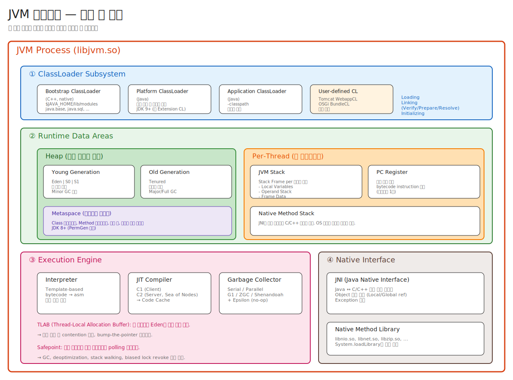

# 03. JVM 아키텍처 — 큰 그림 한 장으로

> 이 챕터의 그림 하나가 머리에 박히면, 이후 모든 챕터(GC, Threading, JIT)가 "이 그림의 어느 박스 안 얘기"로 정리된다.
> 반대로 이 그림 없이 GC를 공부하면 그냥 알고리즘 잡학사전이 된다.

---

## 📍 학습 목표

1. JVM의 4대 서브시스템(ClassLoader / Runtime Data Areas / Execution Engine / Native Interface)을 손으로 그릴 수 있다.
2. **per-process 영역** vs **per-thread 영역**을 구분할 수 있다.
3. TLAB이 왜 필요하고 어떻게 동작하는지 안다.
4. Safepoint가 무엇이고, GC가 왜 Safepoint에 의존하는지 안다.
5. Metaspace가 어디 있고(Heap 안? 밖?), 누가 거기 데이터를 넣는지 안다.
6. JIT 컴파일된 코드의 위치(Code Cache)와 GC와의 관계를 설명할 수 있다.

---

## 🎨 1단계: 백지 그리기 가이드

> 이건 챕터 1, 2의 그림을 합친 종합판이다. A3 또는 가로 모드 A4가 필요할 수 있다.

### Step 1: 가장 바깥 박스 — JVM Process
- 화면 가득 채우는 큰 박스, 라벨 **"JVM Process (libjvm.so)"**
- 우상단 모서리에 작게 "한 JVM = 한 OS 프로세스"

### Step 2: 박스를 가로 4단으로 분할
1. 최상단(높이 15%): **ClassLoader Subsystem**
2. 중간(높이 35%): **Runtime Data Areas**
3. 하단 좌측(높이 35%): **Execution Engine**
4. 하단 우측(같은 높이): **Native Interface**

### Step 3: ① ClassLoader Subsystem 안에 4개 박스
- Bootstrap CL (C++)
- Platform CL (Java)
- Application CL (Java)
- User-defined CL (Tomcat WebappCL 등)
- 오른쪽에 "Loading → Linking → Initializing" 텍스트

### Step 4: ② Runtime Data Areas 안에 좌우 분할
**좌측 - 모든 스레드 공유:**
- Heap (Young Gen / Old Gen)
- Metaspace (네이티브 메모리)

**우측 - Per-Thread:**
- JVM Stack (Stack Frame들)
- PC Register
- Native Method Stack

### Step 5: ③ Execution Engine 안에 2개 박스 + ③-b 별도 박스
- ③ Execution Engine
  - Interpreter (HotSpot은 Template 방식 — 구현체별로 다를 수 있음)
  - JIT Compiler (C1 / C2 / Code Cache)
- ③-b Memory Management — **Garbage Collector** (별도 책임)
  - ②의 Heap에 걸쳐 있도록 화살표
- 하단에 작은 글씨: "TLAB, Safepoint" (③과 ③-b 모두에 걸친 메커니즘)

### Step 6: ④ Native Interface 안에 2개 박스
- JNI
- Native Method Library

### Step 7: 화살표
- ClassLoader → Runtime Data Areas (클래스가 메모리에 적재됨)
- Execution Engine ↔ Runtime Data Areas (실행 + 메모리 접근)
- Execution Engine ↔ Native Interface (JNI 호출)

### 정답 그림



> SVG로 직접 임베드된다. 편집하려면 [03-jvm-architecture.excalidraw](./_excalidraw/03-jvm-architecture.excalidraw)을 [excalidraw.com](https://excalidraw.com/)에서 "Open" 으로 열면 된다.

---

## 🧠 2단계: 직관

### 4대 서브시스템의 역할 분담

> **빌딩 비유**:
> - **ClassLoader** = 자재 반입 (외부 도면 → 내부 청사진)
> - **Runtime Data Areas** = 작업장과 보관소 (자재와 작업 공간)
> - **Execution Engine** = 작업자 (실제로 일하는 사람)
> - **Native Interface** = 외부 협력 업체와의 창구 (OS, C 라이브러리)

### 가장 자주 헷갈리는 것: "메모리는 다 Heap이다?"

> **답: 아니다.**
>
> JVM이 OS에게 받는 메모리는 크게 셋:
> 1. **Java Heap** — `-Xmx`로 제어. GC가 관리.
> 2. **Metaspace** — `-XX:MaxMetaspaceSize`로 제어. Native 메모리. 클래스 메타데이터.
> 3. **Code Cache** — `-XX:ReservedCodeCacheSize`로 제어. Native 메모리. JIT 컴파일 결과.
>
> 그 외에도 **DirectByteBuffer**(NIO), **JNI에서 malloc**한 메모리, **스레드 스택**도 모두 JVM 프로세스 메모리의 일부지만 Heap이 아님.
>
> 그래서 `top`에서 보이는 RSS는 `-Xmx`보다 훨씬 클 수 있다. **"왜 java 프로세스가 4GB 먹지? -Xmx2g 줬는데?"** 의 답이 여기 있다.

### "JVM의 어떤 영역이 GC 대상인가?"

| 영역 | GC 대상? | 비고 |
|---|---|---|
| Java Heap (Young/Old) | ✅ | GC의 주된 무대 |
| Metaspace | △ | ClassLoader 단위로 unload만. 객체 단위 GC 아님 |
| Code Cache | △ | UseCodeCacheFlushing으로 unload 가능. 별개 GC 아님 |
| JVM Stack | ❌ | 메서드 리턴 시 pop으로 자동 해제 |
| PC Register | ❌ | 4~8바이트, GC 무의미 |
| Native Method Stack | ❌ | OS 스택, JVM 영역 밖 |
| DirectByteBuffer 영역 | ❌ | Cleaner나 명시적 해제 |

---

## 🔬 3단계: 구조

### 4대 서브시스템 + 외부 연결

```
┌─────────────────────────────────────────────────────────────────────────┐
│ JVM Process  (libjvm.so / jvm.dll / libjvm.dylib)                       │
│                                                                         │
│  ┌────────────────────────────────────────────────────────────────────┐ │
│  │ ① ClassLoader Subsystem                                             │ │
│  │    Bootstrap CL (C++)  →  Platform CL  →  Application CL  →  User  │ │
│  └──────────────────────────────┬─────────────────────────────────────┘ │
│                                 │ 메모리 적재                              │
│                                 ▼                                       │
│  ┌────────────────────────────────────────────────────────────────────┐ │
│  │ ② Runtime Data Areas                                                │ │
│  │                                                                     │ │
│  │   [모든 스레드 공유]                  [Per-Thread]                     │ │
│  │   ┌──────────────────────┐          ┌────────────────────────┐    │ │
│  │   │ Heap                  │          │ JVM Stack              │    │ │
│  │   │   Young / Old         │          │   (Stack Frame들)       │    │ │
│  │   ├──────────────────────┤          ├────────────────────────┤    │ │
│  │   │ Metaspace             │          │ PC Register            │    │ │
│  │   │  (native memory)      │          ├────────────────────────┤    │ │
│  │   └──────────────────────┘          │ Native Method Stack     │    │ │
│  │                                      └────────────────────────┘    │ │
│  └─────────────┬──────────────────────────────────────────────────────┘ │
│                │ 실행 + 접근                                              │
│                ▼                                                        │
│  ┌────────────────────────────────────────────────────────────────────┐ │
│  │ ③ Execution Engine        │ ③-b Memory Management                   │ │
│  │   ├ Interpreter           │   └ Garbage Collector                   │ │
│  │   └ JIT (C1/C2 + Code     │      (Heap 관리 책임 — 실행과 별도)        │ │
│  │         Cache)            │                                         │ │
│  └────────────┬───────────────────────────────────────────────────────┘ │
│               │ 호출                                                    │
│               ▼                                                        │
│  ┌────────────────────────────────────────────────────────────────────┐ │
│  │ ④ Native Interface                                                  │ │
│  │   ├ JNI Bridge                                                      │ │
│  │   └ Native Method Library  (libnio.so, libnet.so, ...)              │ │
│  └────────────────────────┬───────────────────────────────────────────┘ │
└───────────────────────────┼─────────────────────────────────────────────┘
                            │ 시스템 콜
                            ▼
                  ┌────────────────────┐
                  │     OS Kernel       │
                  └─────────┬──────────┘
                            ▼
                  ┌────────────────────────────────────┐
                  │ CPU / Memory / Disk / Network       │
                  └────────────────────────────────────┘
```

### 각 영역별 상세

#### ① ClassLoader Subsystem

| ClassLoader | 구현 언어 | 로드 대상 |
|---|---|---|
| **Bootstrap** | C++ (HotSpot 내장) | `$JAVA_HOME/lib/modules` 내 핵심 모듈 (java.base, java.sql, ...). `getClassLoader()` 결과는 `null` |
| **Platform** | Java (`jdk.internal.loader.ClassLoaders$PlatformClassLoader`) | 표준이지만 핵심은 아닌 모듈. JDK 9+. 구 ExtensionClassLoader 대체 |
| **Application** | Java (`jdk.internal.loader.ClassLoaders$AppClassLoader`) | `-classpath`, `CLASSPATH` env, 모듈 path |
| **User-defined** | Java (직접 구현) | Tomcat WebappCL, OSGi BundleCL, Spring DevTools, JRebel 등 |

**부모 위임 모델**:
```
[Application CL] ──"이 클래스 로드해줘"──→ [Platform CL] ──→ [Bootstrap CL]
                                                                    │
                ┌─────────"못 찾았으면 너가 찾아"───────────────────┘
                ▼
        [Application CL] 직접 검색
```

#### ② Runtime Data Areas

##### Heap — 모든 스레드 공유

```
┌────────────────────────────────────────────────────┐
│  Heap                                              │
│  ┌─────────────────────┐  ┌──────────────────────┐ │
│  │  Young Generation   │  │  Old Generation       │ │
│  │  ┌──┬──┬──┐         │  │  (Tenured)            │ │
│  │  │E │S0│S1│         │  │                       │ │
│  │  └──┴──┴──┘         │  │                       │ │
│  │  Eden + Survivor    │  │  오래된 객체             │ │
│  │  (TLAB 여기)         │  │                       │ │
│  └─────────────────────┘  └──────────────────────┘ │
│        Minor GC                Major / Full GC      │
└────────────────────────────────────────────────────┘
```

> **TLAB (Thread-Local Allocation Buffer)**:
> 각 스레드가 Eden 안에 가진 작은 영역(기본 ~수 KB).
> 객체 할당 시 lock 없이 **bump-the-pointer**로 즉시 할당.
> Eden 안의 동시 contention 회피.
> TLAB이 다 차면 새 TLAB 할당 또는 슬로우 패스(Eden 직접 할당).

##### Metaspace — Heap이 아닌 네이티브 메모리

```
┌───────────────────────────────────────────────────┐
│  Metaspace (네이티브 메모리, JDK 8+)               │
│                                                   │
│  Klass 메타데이터:                                  │
│  ├─ Field 정보                                     │
│  ├─ Method 정보 (bytecode, line number table)      │
│  ├─ Constant Pool                                  │
│  ├─ Method counters (profiling 데이터)             │
│  └─ Klass*-Mirror Klass (java.lang.Class 인스턴스)  │
│                                                   │
│  ClassLoaderData 단위로 묶임.                       │
│  ClassLoader unload 시 통째로 free.                │
└───────────────────────────────────────────────────┘
```

> **Compressed Class Space** (Metaspace의 일부):
> Klass 포인터를 32비트로 압축. 기본 1GB. `-XX:CompressedClassSpaceSize`.
> JVM이 메모리 절약을 위해 사용. `-XX:-UseCompressedOops`면 비활성.

##### Per-Thread: JVM Stack, PC, Native Stack

JVM Stack의 각 Stack Frame:
```
┌────────────────────────────────────┐
│  Stack Frame (한 메서드 호출 당 하나)  │
│                                    │
│  ┌──────────────────────────────┐  │
│  │  Local Variable Array         │  │
│  │  [0]: this (instance method)  │  │
│  │  [1]: arg1                    │  │
│  │  [2]: arg2                    │  │
│  │  ...                          │  │
│  │  [n]: 지역 변수                 │  │
│  └──────────────────────────────┘  │
│                                    │
│  ┌──────────────────────────────┐  │
│  │  Operand Stack                │  │
│  │  (LIFO, bytecode가 push/pop)  │  │
│  └──────────────────────────────┘  │
│                                    │
│  ┌──────────────────────────────┐  │
│  │  Frame Data                   │  │
│  │  ├ Constant Pool Reference   │  │
│  │  ├ Return Address            │  │
│  │  └ Method Reference          │  │
│  └──────────────────────────────┘  │
└────────────────────────────────────┘
```

> **`stack=2, locals=1`** (javap 출력)이 여기 결정된다.
> javac가 미리 계산해서 ClassFile에 저장 → JVM이 그 크기로 한 번에 할당.

#### ③ Execution Engine

**책임**: bytecode를 실제로 실행해서 결과를 만드는 부분.

| 컴포넌트 | 무엇을 |
|---|---|
| **Interpreter** | bytecode를 직접 실행. HotSpot은 **Template Interpreter**라는 방식(런타임에 어셈블리 generate)을 쓰며, 일반 switch-case 인터프리터보다 빠르다. 다른 JVM 구현은 다른 방식을 쓸 수 있다. |
| **JIT (C1/C2)** | hot method를 native code로 컴파일 → Code Cache 저장 |

> **GC는 여기 속하지 않는다.** GC는 "코드를 실행하는" 책임이 아니라, **Runtime Data Areas 중 Heap을 관리**하는 책임. 다음 섹션의 별도 컴포넌트로 다룬다.

#### ③-b Memory Management — GC

**책임**: ② Runtime Data Areas 중 **Heap**(과 일부 native 영역)을 관리한다.

| 항목 | 내용 |
|---|---|
| **위치** | 개념적으로 ②(메모리)와 ③(실행) 사이에 걸쳐 있음. Heap 관리가 본업이지만, safepoint·write barrier 등 실행 엔진과 긴밀히 협력. |
| **하는 일** | unreachable 객체 식별·회수, 살아있는 객체 재배치(compaction), allocation 경로 제공 |
| **종류** | Serial, Parallel, G1, ZGC, Shenandoah, Epsilon — 04-gc 챕터에서 깊이 |
| **실행 엔진과의 접점** | safepoint 메커니즘 활용 (STW 단계), JIT이 emit하는 write barrier, OopMap |

> 정리: "**Interpreter / JIT / GC**"를 한 줄에 나열하면 마치 셋 다 "코드 실행 방식"처럼 보인다. 실제로는 **Interpreter/JIT은 실행, GC는 메모리 관리**다. 같이 그려도 되지만 책임이 다르다.

##### Code Cache — JIT의 결과물

```
┌────────────────────────────────────────────┐
│  Code Cache (네이티브 메모리, 기본 240MB)    │
│                                            │
│  Segmented (JDK 9+):                       │
│  ┌────────────────┐                        │
│  │ Non-profiled   │  → C2 결과 (최종 컴파일)  │
│  ├────────────────┤                        │
│  │ Profiled       │  → C1 결과 (profile 수집)│
│  ├────────────────┤                        │
│  │ Non-methods    │  → interpreter, stub,   │
│  │                │     adapter             │
│  └────────────────┘                        │
└────────────────────────────────────────────┘
```

##### Safepoint — 모든 것의 동기화 지점

**Safepoint** (개념): JVM이 Java 스레드들의 메모리/스택 상태가 일관되었음을 보장할 수 있는 지점. 명세적 개념이며, 어떻게 도달시키는지는 **구현체별로 다르다**.

**Safepoint가 필요한 작업** (대표 사례):
- GC (Heap을 일관된 상태로 검사)
- Deoptimization (스택 재구성)
- Biased Lock revoke (JDK 15+에서 deprecated, 일부 빌드에서 비활성)
- Stack walking (`jstack`, JFR)
- Class redefinition

**HotSpot에서 자주 쓰이는 구현 방식** (플랫폼/버전별 차이 존재):
- 모든 메서드 epilogue / 일부 loop back-edge에 **safepoint polling instruction** 삽입.
- 정지가 필요하면 JVM이 polling page를 **읽기 불가**로 만든다 (Linux/macOS는 `mprotect`, Windows는 `VirtualProtect`).
- 다음 polling 명령에서 메모리 보호 위반 시그널(POSIX의 `SIGSEGV` 등)이 발생 → JVM이 등록한 signal handler가 catch → 해당 스레드를 safepoint blocking 상태로 전환.

**버전·플랫폼별 변형**:
- **JDK 10 (JEP 312)**: Thread-Local Handshakes — 글로벌 polling page 대신 스레드별 polling word를 둘 수 있게 되었음. 모든 안전 작업이 STW 전체 동기화를 요구하지 않게 됨.
- **OS별**: 시그널 이름(`SIGSEGV` vs SEH)과 권한 변경 API가 다르다.
- **CPU별**: polling이 emit되는 정확한 위치(branch/return/safepoint poll)와 비용이 다르다.
- 위 코드는 **HotSpot의 대표적인 흐름**이며, 모든 JVM 구현이 동일한 메커니즘을 쓰지 않는다 (OpenJ9 등은 별도 방식 채택).

```cpp
// 의사 코드 — HotSpot 흐름의 단순화. 실제 구현은 SafepointMechanism::process_if_requested 등에서 분기.
test_safepoint_polling() {
    if (polling_page is unreadable) {  // 또는 thread-local polling word가 armed
        block_at_safepoint();           // 자발적 정지
    }
}
```

> **STW (Stop-The-World)의 본질**: JVM이 스레드를 강제로 멈추는 게 아니라, **각 스레드가 다음 polling 지점에서 자발적으로 멈춘다**.
> 그래서 **TTSP (Time To Safepoint)** — 큰 메서드 / counted loop가 길면 STW 전체가 늘어진다.

#### ④ Native Interface (JNI)

JNI 호출의 책임:
- Java 객체 핸들 관리 (Local/Global/Weak Global Reference)
- Exception 전파 (`(*env)->ExceptionCheck`)
- 호출 규약 변환 (Java calling convention ↔ C ABI)

```c
// JNI 함수 시그니처 예
JNIEXPORT jstring JNICALL
Java_com_example_MyClass_nativeMethod(JNIEnv* env, jobject this, jstring arg) {
    const char* utf = (*env)->GetStringUTFChars(env, arg, NULL);
    // ...
    (*env)->ReleaseStringUTFChars(env, arg, utf);
    return (*env)->NewStringUTF(env, "result");
}
```

> JNI 함수 진입/탈출 시 **safepoint sync** 필요 → 호출 비용이 일반 메서드 호출보다 비싸다 (수십 ~ 수백 ns).
> Project Panama의 **Foreign Function & Memory API (JDK 22)**가 이걸 개선하려는 시도.

---

## 🧬 4단계: 내부 구현 (HotSpot)

### JVM의 메인 구조체: `JavaThread`

위치: `src/hotspot/share/runtime/javaThread.hpp`

```cpp
// javaThread.hpp (핵심 멤버만 발췌)
class JavaThread: public Thread {
private:
  ThreadFunction _entry_point;

  // (1) JNI 환경
  JNIEnv        _jni_environment;

  // (2) JVM Stack 관련
  StackOverflowState _stack_overflow_state;
  address       _stack_base;        // 스택 베이스
  size_t        _stack_size;        // 스택 크기
  JavaFrameAnchor _anchor;          // 최상위 Java frame anchor

  // (3) PC Register는 실제로 frame의 일부로 관리

  // (4) Thread state (런닝/블록드/세이프포인트)
  JavaThreadState _thread_state;

  // (5) GC 관련
  ThreadHeapSampler _heap_sampler;
  ThreadLocalAllocBuffer _tlab;     // ★ TLAB ★

  // (6) Exception
  oop           _pending_exception;

  // (7) Compiler 관련
  CompileTask*  _compile_task;
};
```

> 한 `JavaThread` 객체가 한 Java 스레드의 모든 per-thread 상태를 들고 있다.
> TLAB도 여기 들어있다 → 정말로 "thread-local".

### TLAB 할당 — bump-the-pointer

위치: `src/hotspot/share/gc/shared/threadLocalAllocBuffer.hpp`

```cpp
// threadLocalAllocBuffer.hpp
class ThreadLocalAllocBuffer {
private:
  HeapWord* _start;     // TLAB 시작
  HeapWord* _top;       // 다음 할당 위치 (bump 포인터)
  HeapWord* _end;       // TLAB 끝
public:
  HeapWord* allocate(size_t size) {
    HeapWord* obj = _top;
    HeapWord* new_top = _top + size;
    if (new_top <= _end) {
      _top = new_top;
      return obj;       // 성공 — lock-free, single instruction
    }
    return NULL;        // TLAB full, slow path로 fallback
  }
};
```

→ **단 3개 instruction으로 객체 할당**. 이게 Java의 객체 할당이 C++ `new`보다 빠른 이유 (중간 lock 없음).

### Safepoint 메커니즘

위치: `src/hotspot/share/runtime/safepoint.cpp`

```cpp
// safepoint.cpp — 핵심 흐름
void SafepointSynchronize::begin() {
  // 1. 모든 Java 스레드에게 "정지하라" 신호
  arm_safepoint();
  //    내부적으로:
  //    - SafepointMechanism::_polling_page를 mprotect(PROT_NONE)
  //    - 또는 thread-local polling page를 막음

  // 2. 모든 스레드가 safepoint에 도착할 때까지 대기
  while (still_running_threads()) {
    // spin 또는 yield
  }

  // 3. 모두 도착하면 ready
  set_state(_synchronized);
}

void SafepointSynchronize::end() {
  // polling page를 다시 읽기 가능하게
  disarm_safepoint();
  // 모든 스레드 깨우기
  set_state(_not_synchronized);
}
```

각 Java 스레드의 polling 코드(JIT이 emit):
```asm
# 메서드 epilogue 또는 루프 back-edge에서
movq r10, [rip + safepoint_polling_page]   ; 이 페이지가 PROT_NONE이면 SEGV
                                            ; → signal handler가 safepoint_handle 호출
```

> **이게 polling 모델**. "stop sign이 보이면 멈춘다".
> 다른 VM(.NET)은 cooperative interrupt를 쓰기도 함.

### ClassLoader의 위임 구현

위치: `src/java.base/share/classes/java/lang/ClassLoader.java`

```java
// ClassLoader.java
protected Class<?> loadClass(String name, boolean resolve) throws ClassNotFoundException {
    synchronized (getClassLoadingLock(name)) {
        // 1. 이미 로드됐는지 확인
        Class<?> c = findLoadedClass(name);
        if (c == null) {
            try {
                if (parent != null) {
                    c = parent.loadClass(name, false);  // ★ 부모에게 먼저 ★
                } else {
                    c = findBootstrapClassOrNull(name);  // Bootstrap은 native
                }
            } catch (ClassNotFoundException e) {
                // 부모가 못 찾으면 무시, 내가 찾는다
            }

            if (c == null) {
                c = findClass(name);  // ★ 내가 찾기 ★
            }
        }
        if (resolve) {
            resolveClass(c);
        }
        return c;
    }
}
```

> 부모 위임 = "먼저 부모, 못 찾으면 자기".
> Tomcat의 WebappCL은 이걸 뒤집어서 "먼저 자기, 못 찾으면 부모"로 만든다.

---

## 📜 5단계: 역사

### PermGen → Metaspace (JDK 8)

> **PermGen** (Permanent Generation, ~JDK 7)
> - Heap의 일부. 별도 generation.
> - Class 메타데이터 + interned String + static field 저장.
> - 크기 고정 (`-XX:MaxPermSize=256m`). 동적 클래스 생성 많으면 **`OutOfMemoryError: PermGen space`** 단골.

JDK 8에서 폐기 이유:
1. **크기 고정 문제**: 동적으로 늘릴 수 없어 OOM 빈번.
2. **GC 비효율**: Heap 안에 있으면서 GC 정책에 끼어들음.
3. **Compressed Oops 충돌**: Klass 포인터를 압축하려는데 PermGen 위치가 걸림돌.

**Metaspace** 도입:
- Heap 밖, 네이티브 메모리.
- 기본 크기 무제한 (OS 메모리까지). `-XX:MaxMetaspaceSize`로 제한 가능.
- ClassLoaderData 단위로 chunk 할당 → CL unload 시 chunk 회수.
- interned String은 Heap의 일반 영역으로 이동.

### Tiered Compilation 통합 (JDK 7→8)

JDK 7 이전: `-client` 또는 `-server`. 둘 중 하나.
JDK 7: Tiered Compilation 추가 (실험).
JDK 8: **기본 활성화**. C1과 C2가 한 JVM 안에 공존.

### Project Loom과 Stack 분리 (JDK 21)

Virtual Thread는 **OS 스레드 1:1 매핑**을 끊었다.
- 일반 스레드: 1 Java thread = 1 OS thread. JVM Stack은 OS thread stack 위에 (보통 1MB).
- Virtual Thread: 1 Java thread → 사용자 영역 스케줄러. **Stack chunk를 Heap에 저장**.

즉 Virtual Thread의 **JVM Stack은 Heap 안의 객체**다. 이건 큰 패러다임 변화.

```
일반 Thread:    JVM Stack = OS Stack (네이티브 메모리)
Virtual Thread: JVM Stack = StackChunk 객체 (Heap)
```

### Code Cache Segmentation (JDK 9)

JDK 8까지: Code Cache 하나의 큰 영역.
JDK 9: 3분할.
- non-profiled (C2 결과, GC root scan 제외) — 안정적
- profiled (C1 결과, deopt 자주)
- non-methods (stub, adapter) — 매우 작음

이유: GC root scanning 시 non-profiled는 건너뛸 수 있어 latency 개선.

---

## ⚔️ 6단계: 꼬리질문 트리

### Q1. JVM의 메모리 구조를 설명하세요.

**예상 답변**:
> 4 카테고리.
> 1. **스레드 공유**: Heap (Young/Old), Metaspace (네이티브)
> 2. **스레드별**: JVM Stack, PC Register, Native Method Stack
> 3. **JVM 내부**: Code Cache (네이티브), Compressed Class Space (Metaspace의 하위)
> 4. **외부**: DirectByteBuffer, JNI native 메모리, OS 스레드 스택

#### 🪝 꼬리 Q1-1: "Metaspace는 왜 Heap 밖에 있나요?"

**예상 답변**:
> PermGen 시절의 문제들 때문.
> 1. 크기 고정 → OOM 빈번 (특히 동적 클래스 생성 — Spring AOP, Hibernate proxy 등).
> 2. Heap GC 정책에 묶임 → 클래스 unload가 비효율적.
> 3. Compressed Oops와 충돌.
> Metaspace는 ClassLoaderData 단위로 chunk 할당하고 CL unload 시 통째로 free.

##### 🪝 꼬리 Q1-1-1: "Metaspace OOM은 그럼 안 나나요?"

**예상 답변**:
> 난다. `OutOfMemoryError: Metaspace`.
> 기본은 무제한이지만 `-XX:MaxMetaspaceSize` 설정 시 그 한계.
> 가장 흔한 원인: **ClassLoader 누수**.
> 예: 웹앱 reload 시 옛 WebappClassLoader가 GC되지 않음 (어딘가에서 reference 들고 있음) → 옛 클래스들이 Metaspace에서 못 빠짐 → 누적.
> Tomcat 운영자가 흔히 겪음.

###### 🪝 꼬리 Q1-1-1-1: "ClassLoader 누수를 어떻게 찾나요?"

**예상 답변**:
> 1. `jmap -clstats <pid>` 또는 `jcmd <pid> VM.classloader_stats` — 각 CL이 들고 있는 클래스 수.
> 2. heap dump (`jcmd VM.heapdump`) → Eclipse MAT의 `Find Leaks` 또는 `Histogram → ClassLoader`.
> 3. 의심되는 CL의 GC root path 추적 → 누가 못 놓고 있는지 발견.
> 흔한 범인: ThreadLocal에 옛 WebappCL이 로드한 클래스의 인스턴스를 담아두고 Thread Pool이 재사용되는 경우.

#### 🪝 꼬리 Q1-2: "Direct Memory가 뭐고 왜 쓰나요?"

**예상 답변**:
> `ByteBuffer.allocateDirect()` 또는 `Unsafe.allocateMemory()`로 할당.
> Heap 밖, OS의 malloc 영역.
>
> 왜 쓰나:
> - **Zero-copy I/O**: 네트워크/디스크 I/O 시 Heap의 byte[]는 OS가 직접 접근 못 함. Direct Memory는 OS가 직접 read/write 가능 → 복사 한 번 제거.
> - **JIT/Native interop**: JNI나 Project Panama로 native 코드와 메모리 공유.
> - **큰 메모리 매핑**: MappedByteBuffer로 GB 단위 파일을 메모리에 매핑.

##### 🪝 꼬리 Q1-2-1: "Direct Memory도 GC 대상인가요?"

**예상 답변**:
> 직접 GC 대상은 아니다.
> 대신 `DirectByteBuffer` 객체에 **Cleaner**가 등록되어 있어, `DirectByteBuffer` 객체가 GC될 때 Cleaner가 native 메모리를 free.
> 그래서 **DirectByteBuffer 자체가 일찍 GC되지 않으면 native 메모리도 안 풀린다** — 흔한 메모리 누수 패턴.
> JDK 9부터 `Cleaner`가 `sun.misc.Cleaner` → `java.lang.ref.Cleaner`로 공식화.
> `-XX:MaxDirectMemorySize` 초과 시 `OutOfMemoryError: Direct buffer memory`.

### Q2. TLAB이 뭐고 어떻게 동작하나요?

**예상 답변**:
> Thread-Local Allocation Buffer. 각 스레드가 Eden 안에 가진 작은 영역.
> 객체 할당 시 lock 없이 **bump-the-pointer**로 즉시 할당 (TLAB._top += size).
> TLAB이 다 차면 새 TLAB 요청 또는 slow path (Eden 직접 할당, 이때는 lock 또는 CAS).
> 이게 Java의 객체 할당이 빠른 이유 — 일반 케이스에서 3개 instruction.

#### 🪝 꼬리 Q2-1: "TLAB 크기는 어떻게 결정되나요?"

**예상 답변**:
> 동적이다. JVM이 thread별로 할당 패턴을 관찰해서 조정.
> 자주 할당하는 스레드는 TLAB 크게, 가끔 할당하는 스레드는 작게.
> 기본 크기는 Eden / (병렬 GC 스레드 수 * 2)로 시작.
> `-XX:TLABSize=...`, `-XX:ResizeTLAB` 옵션.

##### 🪝 꼬리 Q2-1-1: "큰 객체(예: 10MB 배열)도 TLAB에 들어가나요?"

**예상 답변**:
> 안 들어간다. TLAB보다 큰 객체는 Eden 직접 할당.
> 또는 G1/ZGC에서는 **Humongous Object**로 분류되어 Old gen에 직접 할당 (G1 region 크기의 절반 이상).
> Humongous는 region을 통째로 차지해서 fragmentation 유발 → 4MB+ 배열은 setup 단계에 신중히 생성.

#### 🪝 꼬리 Q2-2: "TLAB이 가득 차면 정확히 어떻게 되나요?"

**예상 답변**:
> 두 옵션 중 선택:
> 1. **Retire & Allocate New**: 남은 자투리 공간을 dummy filler object로 채워 buried 시키고 새 TLAB 요청.
> 2. **Fall back to Eden**: 객체 하나만 Eden 직접 할당 (TLAB은 그대로 유지).
> 어느 쪽이냐는 남은 공간 비율, 객체 크기 등 휴리스틱.
> filler object 패턴이 신기한 점 — Heap walking을 위한 일관성 유지.

### Q3. Safepoint가 뭐고 왜 필요한가요?

**예상 답변**:
> 모든 Java 스레드를 동시에 정지시킬 수 있는 상태.
> GC, Deoptimization, Stack walking, Biased lock revoke 등에 필요.
> "정지시킨다" = JVM이 polling page를 막아두면, 각 스레드가 polling instruction에서 segfault → safepoint blocking.

#### 🪝 꼬리 Q3-1: "왜 강제로 못 멈추고 polling을 쓰나요?"

**예상 답변**:
> 강제 중단 (signal 보내서 즉시 정지) 하면 **스레드 상태가 일관적이지 않을 수 있음**.
> 예: 객체 할당 중에 멈추면 half-initialized 객체 — GC가 그걸 마킹하려다 segfault.
> Polling은 "스레드가 일관된 지점에서만 멈춤"을 보장.
> 모든 polling 위치에서 JVM은 **register/stack의 oop 위치를 정확히 안다** (OopMap).
> 이 정보 없으면 GC가 어떤 메모리가 객체 참조인지 모름.

##### 🪝 꼬리 Q3-1-1: "TTSP가 길어지는 케이스는?"

**예상 답변**:
> **Time To Safepoint** = "정지 신호 보낸 후 모든 스레드가 safepoint에 도달하기까지의 시간".
> 길어지는 케이스:
> 1. **Counted Loop**: `for (int i = 0; i < N; i++)`에서 N이 매우 크면 JIT이 safepoint polling을 루프 안에 안 넣는다 (성능 이유). 루프 끝까지 정지 못함.
>    → 해결: JDK 10 JEP 312 "Thread-Local Handshakes"로 부분적 해결.
> 2. **긴 native 함수 호출**: JNI 안에서는 safepoint 불가 (단, safepoint blocking 상태로 진입한 경우 OK).
> 3. **Heap dump 중**: 메모리 walking이 길어짐.
> 진단: `-XX:+PrintSafepointStatistics`, JFR `jdk.SafepointBegin/End` 이벤트.

###### 🪝 꼬리 Q3-1-1-1: "JEP 312 Thread-Local Handshakes는 뭘 해결했나요?"

**예상 답변**:
> 그 전엔 "정지시킨다 = 모든 스레드를 동시에 멈춘다"였다 → 한 스레드 느리면 모두 대기.
> 312는 **개별 스레드만 정지** 가능하게 함. polling page를 스레드별로 가지게 함.
> 적용: stack sampling (`AsyncGetCallTrace` for profiler), biased lock revocation, JFR.
> 전체 STW가 필요한 GC에는 영향 적음.

### Q4. 클래스가 메모리에 로드되는 과정을 풀로 설명하세요.

**예상 답변**:
> 1. **Loading**: ClassLoader가 .class 바이트를 메모리로 읽어옴 (디스크, network, byte[]에서).
> 2. **Linking**:
>    a. **Verification**: bytecode 타입 안전성 검증. StackMapTable 검사.
>    b. **Preparation**: static field에 default 값(0, null, false) 할당. 아직 초기화 코드 실행 안 함.
>    c. **Resolution**: symbolic reference(이름)를 direct reference(메모리 주소)로 변환. lazy.
> 3. **Initialization**:
>    a. static initializer 블록 + static field initializer 실행.
>    b. 부모 클래스가 먼저 초기화됨.
>    c. 단 한 번만 실행 (JLS 12.4.2의 lock 절차).

#### 🪝 꼬리 Q4-1: "Linking의 Resolution은 lazy하다고 했는데, 언제 일어나죠?"

**예상 답변**:
> 명세상 두 옵션 모두 허용: eager (Linking 시) 또는 lazy (해당 reference 첫 사용 시).
> HotSpot은 **lazy**. 처음 그 reference를 쓸 때 (예: invokevirtual 실행 시) 그 시점에 resolve.
> 결과는 caching → 두 번째부터는 즉시 사용.

##### 🪝 꼬리 Q4-1-1: "Resolve에서 NoClassDefFoundError vs ClassNotFoundException 차이?"

**예상 답변**:
> - **ClassNotFoundException**: `Class.forName("...")`처럼 **명시적 로딩** 실패. RuntimeException 아닌 checked.
> - **NoClassDefFoundError**: 컴파일 시점엔 있었는데 실행 시점에 사라진 클래스. **Resolution 단계** 실패.
> 흔한 시나리오:
> - **CNFE**: classpath 잘못, plugin 누락.
> - **NCDFE**: 빌드 시 dependency 있었는데 deploy에서 빠짐. 또는 static initializer 실패해서 클래스가 broken 상태가 됨.

###### 🪝 꼬리 Q4-1-1-1: "static initializer가 예외 던지면 어떻게 되나요?"

**예상 답변**:
> **ExceptionInInitializerError**가 던져진다 (Error, 잡으면 안 된다).
> 그 클래스는 영구히 **broken** 상태가 되어, 이후 **모든 접근에서 `NoClassDefFoundError`** 발생.
> → 매우 어렵게 진단되는 버그. 첫 stacktrace의 ExceptionInInitializerError가 핵심 단서.

### Q5. (Killer) JVM 프로세스가 OS에 요청하는 메모리는 어떤 영역들이고, 각각 언제 할당되나요?

**예상 답변** (한 번에 그릴 수 있어야 함):
> 1. **Heap**: JVM 시작 시 `-Xms`만큼 commit, `-Xmx`까지 reserve. mmap.
> 2. **Metaspace**: 클래스 로드 시 동적으로 chunk 단위 할당. 무제한이지만 `-XX:MaxMetaspaceSize` 가능.
> 3. **Compressed Class Space**: 32비트 Klass 포인터용. Metaspace의 하위. 기본 1GB.
> 4. **Code Cache**: JVM 시작 시 240MB reserve. `-XX:ReservedCodeCacheSize`.
> 5. **Thread stacks**: 스레드 생성 시 `-Xss`만큼 (기본 1MB). N개 스레드면 N MB.
> 6. **Direct Memory**: `ByteBuffer.allocateDirect` 호출 시. `-XX:MaxDirectMemorySize`.
> 7. **JIT scratch**: C1/C2가 컴파일 중 임시로 쓰는 메모리.
> 8. **GC bookkeeping**: card table, remembered set, mark bitmap 등. Heap 크기에 비례.
>
> 그래서 `top`의 RSS가 `-Xmx`보다 훨씬 크게 보인다.
>
> **운영 함정**: container 환경에서 `-Xmx=8g`인데 메모리 limit=10g 주면 OOM-killed 위험.
> 위 모든 영역을 합쳐서 limit보다 작아야 함. 보통 `-Xmx`는 limit의 50~70%로 설정.

#### 🪝 꼬리 Q5-1: "Native Memory Tracking을 어떻게 켜고 보나요?"

**예상 답변**:
> ```
> java -XX:NativeMemoryTracking=summary  # 또는 detail
> ```
> 실행 중:
> ```
> jcmd <pid> VM.native_memory summary
> jcmd <pid> VM.native_memory baseline   # 기준점 잡고
> jcmd <pid> VM.native_memory summary.diff  # 차이 확인
> ```
> 출력에서 영역별 reserved/committed 확인. 평소 운영자 필수 도구.

##### 🪝 꼬리 Q5-1-1: "NMT 오버헤드는?"

**예상 답변**:
> summary: ~5% 메모리 (메타데이터), 무시할 수준 CPU.
> detail: ~10% 메모리 + 호출 스택 추적 → 약간의 CPU 오버헤드.
> prod에서 summary는 상시 켜둘 만함.

---

## 🔗 다음 단계

이 챕터를 완벽히 이해했으면 다음 챕터부터는 "어느 박스 안 이야기인지"가 자동으로 매핑된다.

- **01-class-lifecycle** → ① ClassLoader Subsystem의 상세
- **02-runtime-data-areas** → ② Runtime Data Areas의 상세
- **03-execution-engine** → ③ Execution Engine의 상세
- **04-gc** → ③의 GC 컴포넌트만 깊이
- **05-threading** → ② Per-Thread 영역 + ③의 Safepoint

## 📚 참고

- **JVMS §2 (JVM Structure)**: https://docs.oracle.com/javase/specs/jvms/se21/html/jvms-2.html
- **HotSpot Runtime Overview**: https://openjdk.org/groups/hotspot/docs/RuntimeOverview.html
- **JEP 122 (Remove PermGen)**: https://openjdk.org/jeps/122
- **JEP 312 (Thread-Local Handshakes)**: https://openjdk.org/jeps/312
- **JEP 197 (Segmented Code Cache)**: https://openjdk.org/jeps/197
