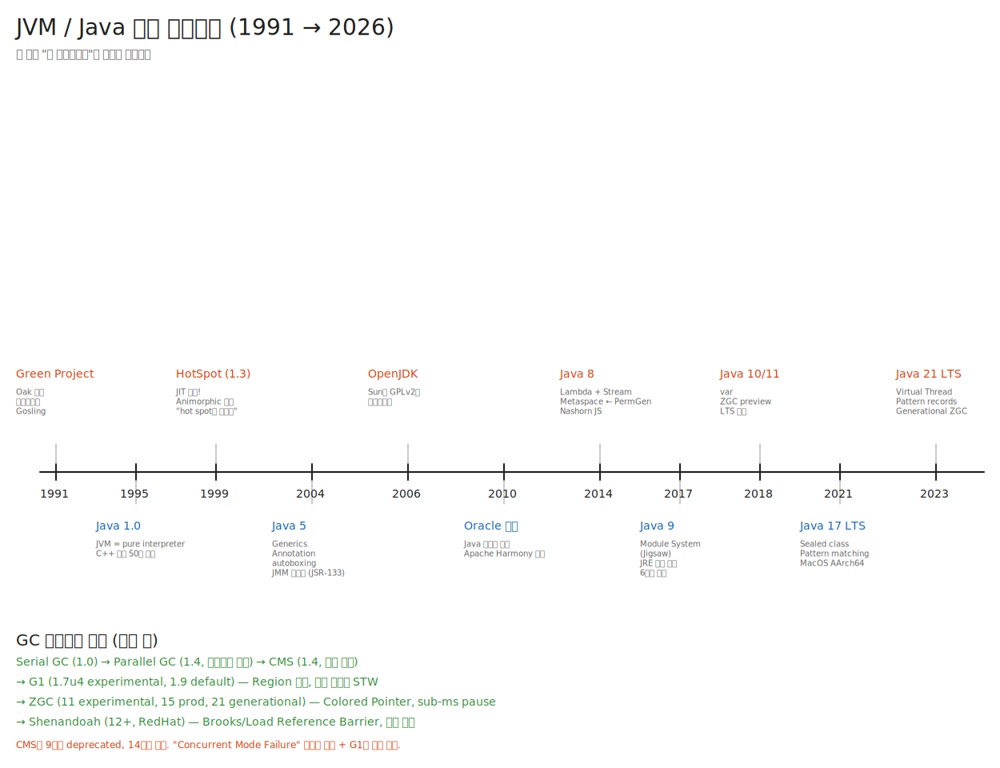

# 04. JVM 역사 — 30년의 진화, "왜" 중심으로

> 역사를 모르면 "왜 PermGen이 사라졌나", "왜 G1이 나왔나", "왜 Module System이 필요했나"에 답할 수 없다.
> 현재의 설계는 과거의 상처다. 각 결정의 **트리거가 된 사건**을 기억하라.

---

## 📍 학습 목표

1. Java/JVM의 주요 마일스톤 10여 개를 연도+이유로 말할 수 있다.
2. HotSpot이 등장한 1999년 전후의 상황을 안다.
3. JDK 8 → 9 → 17 → 21 메이저 변화의 **원인**을 설명할 수 있다.
4. 각 GC가 도입된 동기를 시대 흐름으로 안다 (CMS의 짧은 생애 등).
5. Oracle의 라이선스 정책 변화(2018 BCL → No-Fee 2021)와 OpenJDK 생태계 분화를 안다.

---

## 🎨 1단계: 백지 그리기 가이드

> 가로로 긴 타임라인을 그려라. 시간 축은 왼쪽에서 오른쪽으로.

### Step 1: 메인 축
- 화면 가로 중앙에 긴 화살표 (1991 → 2026+)
- 5년 단위 눈금: 1995, 2000, 2005, 2010, 2015, 2020, 2025

### Step 2: 주요 마일스톤 (위/아래로 번갈아 표기)
**위쪽 (Language/Runtime)**:
- 1991 Green Project (Oak)
- 1995 Java 1.0
- 1999 HotSpot
- 2004 Java 5 (Generics, JMM)
- 2014 Java 8 (Lambda, Stream, Metaspace)
- 2017 Java 9 (Module)
- 2021 Java 17 LTS
- 2023 Java 21 LTS (Virtual Thread)

**아래쪽 (Ecosystem/Tooling)**:
- 2006 OpenJDK
- 2010 Oracle, Sun 인수
- 2017 6개월 릴리스 주기
- 2019 GraalVM 1.0 GA
- 2021 No-Fee Oracle JDK

### Step 3: GC 진화 축 (별도 라인)
- 1.0 Serial → 1.4 Parallel → 1.4 CMS → 1.7u4 G1 → 11 ZGC → 12 Shenandoah → 21 Generational ZGC

### Step 4: 각 점 옆에 "왜?" 한 줄
- 예: "Java 9: 모듈 — rt.jar 60MB 비대화, 임베디드 적합성 + 강한 캡슐화"

### 정답 그림



> SVG로 직접 임베드된다. 편집하려면 [04-jvm-timeline.excalidraw](./_excalidraw/04-jvm-timeline.excalidraw)을 [excalidraw.com](https://excalidraw.com/)에서 "Open" 으로 열면 된다.

---

## 🧠 2단계: 직관 — 30년을 3시대로

### 1기 (1991~2005): "Java is Slow" 시대 — 성능 따라잡기
- 인터프리터 → JIT → 멀티코어 GC. C++과의 속도 격차를 좁히는 데 14년.

### 2기 (2006~2017): 오픈소스화 + 정체 → 폭발 — Java 6, 7 사이 4년 공백, 그리고 8의 폭발
- Sun의 재정난, Oracle 인수. OpenJDK 출범. 그리고 Java 8의 lambda가 분기점.

### 3기 (2018~현재): 모던 Java — 6개월 주기, GC 혁신, 클라우드 적응
- ZGC, Loom, Panama, Valhalla. Java가 클라우드 네이티브로 변모하려는 노력.

---

## 🔬 3단계: 구조 — 시간순 깊이 분석

> **표기 컨벤션**: 각 마일스톤은 다음 형식으로 통일한다.
> - **연도** = 실제 일반 공개(GA) 연도 (preview/RC가 아닌 정식 출시)
> - **릴리스** = 자바 언어 버전 (Java N) 또는 JDK 버전. JDK와 Java N은 5부터 같은 숫자.
> - **핵심 이유** = "어떤 문제를 풀기 위해"
> - "발표/preview/RC"와 "GA"가 다르면 별도 표시. 같은 해에 여러 일이 있으면 따로 표기.
>
> 빠른 참조 테이블:
>
> | 연도 | 릴리스 | 핵심 이유 |
> |---|---|---|
> | 1995 | Java 1.0 발표 (베타) | applet으로 웹 동적 콘텐츠 |
> | 1996 | JDK 1.0 GA | 첫 정식 JVM |
> | 1999 | JDK 1.3 (HotSpot) | JIT으로 성능 격차 좁힘 |
> | 2002 | JDK 1.4 | NIO, assert, Parallel/CMS GC |
> | 2004 | Java 5 (JDK 5) | Generics, Annotation, JMM (JSR-133) |
> | 2006 | Java 6 / OpenJDK 출범 | 오픈소스화 |
> | 2011 | Java 7 | invokedynamic, try-with-resources |
> | 2014 | Java 8 | Lambda, Stream, Metaspace |
> | 2017 | Java 9 | Module System, jlink, 6개월 주기 시작 |
> | 2018 | Java 11 LTS | 첫 LTS, HTTP Client |
> | 2021 | Java 17 LTS | Sealed class, Pattern matching |
> | 2023 | Java 21 LTS | Virtual Thread, Generational ZGC |

## 📅 1기: 탄생과 성장 (1991-2005)

### 1991: Green Project — Oak

- Sun Microsystems의 13인 비밀 프로젝트, 리더 **James Gosling**
- 목표: **가전제품(셋톱박스, 토스터)을 제어할 언어**
- 왜 C++이 아니었나: C++은 플랫폼별 컴파일 필요 + 메모리 관리 위험. 가전 디바이스의 CPU가 너무 다양.
- 이름 Oak: 사무실 창밖의 참나무.
- 결과: 셋톱박스 시장이 안 열렸음. 프로젝트 사실상 실패.

### 1995: Java 1.0 — 우연히 인터넷이 등장

- Mosaic 브라우저(1993), Netscape(1994). 갑자기 "다양한 OS에서 돌아야 하는" 코드가 필요해짐.
- Oak를 **Java**로 개명 (트레이드마크 충돌, 인도네시아 자바 섬에서)
- **HotJava 브라우저** + Java applet — "웹에서 동적인 것"의 첫 시도
- JVM = pure interpreter. 매우 느림. C++ 대비 20~50배.
- 명세 첫 출판: The Java Virtual Machine Specification, 1996.

### 1996: JDK 1.0 — Classic VM

- Sun JDK 1.0 정식 출시 (1996.01.23)
- "Classic VM"이라 불리던 첫 구현. 스택 기반 인터프리터.
- **AWT** GUI 라이브러리 포함. 느리고 못생겼다는 평.

### 1997: Sun, Animorphic Systems 인수

- Animorphic은 **Strongtalk VM** (Smalltalk용) 만든 회사
- 그 팀이 **HotSpot**의 핵심 개발자가 됨
- 핵심 인물: Lars Bak (나중에 V8 만든 사람), Urs Hölzle

### 1998: Java 1.2 — Swing, Collections

- Swing GUI (AWT 대체)
- Collections Framework (`Map`, `List`, `Set`)
- JIT 컴파일러 옵션화 (Sun JIT — HotSpot 이전의 단순 JIT)

### 1999: HotSpot 1.0 — JIT의 시대 (JDK 1.3)

- **"Hot Spot"의 뜻**: 자주 실행되는 코드(=hot)만 컴파일.
- 핵심 아이디어 (Pareto principle):
  > **10%의 코드가 90%의 실행 시간을 차지한다.**
  > 그 10%만 컴파일하면 사실상 다 컴파일한 것과 같다.
- 처음엔 **Client VM**(`-client`, 작고 빠른 JIT). 1.4에서 **Server VM**(`-server`, 공격적 JIT) 추가.

### 2002: Java 1.4 — Parallel GC, Assert, NIO

- **Parallel GC** 도입: Young Gen을 멀티스레드로 수집. CPU 코어 활용.
- **CMS (Concurrent Mark Sweep) GC** 도입: Old gen을 stop-the-world 없이 동시 마킹.
- `assert` 키워드 추가
- **NIO** (New I/O): non-blocking I/O, ByteBuffer

### 2004: Java 5 — 언어의 대변혁

- **Generics** (JSR 14)
- **Annotation** (JSR 175) — Java EE의 기반
- **Autoboxing**: `int` ↔ `Integer` 자동 변환
- **Enhanced for**: `for (T t : list)`
- **Enum** 타입
- **Varargs**: `Object... args`
- **JMM 명세화** (JSR-133): happens-before 관계, volatile semantics 정립 — 멀티코어 시대 필수

> **JSR-133의 충격**: 그 전까진 JMM이 거의 정의 안 됨. 멀티스레드 코드의 동작이 JVM 구현마다 달랐다.
> 이후 모든 동시성 라이브러리(`java.util.concurrent`)가 JSR-133 위에 만들어짐.

## 📅 2기: 오픈소스화와 정체 (2006-2013)

### 2006: OpenJDK — GPLv2 오픈소스화

- Sun이 JDK를 **GPLv2 (with Classpath Exception)** 로 공개
- 그 전까지: Sun JDK는 무료 다운로드는 가능했지만 소스 비공개
- 영향:
  - IBM, Red Hat 등 컨트리뷰터 합류
  - Apache Harmony (Apache가 만들던 클린룸 JDK) → 점차 의미 잃음
  - 후에 Android의 Java SE 호환성 분쟁 (Oracle vs Google) 의 배경

### 2006: Java 6 — 성능 안정화

- Compiler API (`javax.tools.JavaCompiler`)
- ServiceLoader
- HotSpot 안정화. **이 시기까지 Java는 "이미 성숙한 언어"로 평가됨**

### 2009: Sun 재정난

- 닷컴 버블 후유증, MySQL 인수 (2008) 등으로 Sun이 흔들림
- Java 개발 정체. Java 7이 나와야 할 시점인데 안 나옴.

### 2010: Oracle, Sun 인수

- 56억 달러
- Java의 소유권이 Oracle로
- **Apache Harmony의 종말**: Apache가 TCK(Java 호환성 인증) 접근을 요구했으나 Oracle 거부 → Harmony 프로젝트 종료
- **Google과의 소송**: Android가 Java API를 사용한 것이 저작권 침해인가? 10년 끌다 2021 대법원 Google 승소.

### 2011: Java 7 — 늦은 출시 (4년 공백)

- **try-with-resources**, **diamond operator** `<>`, **multi-catch**
- **invokedynamic** (JSR 292) — JRuby, Scala 같은 동적 언어를 위한 새 bytecode → **나중에 Java 8 lambda의 인프라**
- **G1 GC** experimental 도입 (`-XX:+UseG1GC`)
- Fork/Join framework — 작업 분할 병렬 처리

### 2013: Java 8 RC, Lambda 통합

- 출시는 2014.03이지만 개발은 2013에 마무리
- Brian Goetz가 주도한 **Project Lambda** 5년 작업 (2009 시작)

## 📅 3기: 모던 Java (2014-현재)

### 2014: Java 8 LTS — 함수형의 도입

> **현재까지도 가장 많이 쓰이는 버전**. 모든 면접의 기준.

- **Lambda Expression** + **Stream API** — 함수형 패러다임
- **Default Method** (인터페이스에 구현체) — Stream과 기존 Collection 통합 위해
- **Method Reference**: `Class::method`
- **`Optional<T>`** — null 안전성
- **`java.time`** (JSR 310, Stephen Colebourne) — Date/Calendar의 악몽 종결
- **PermGen 제거 → Metaspace** (JEP 122)
- **Nashorn** — JavaScript 엔진 (나중에 GraalVM JS로 대체, JDK 15에서 제거)

### 2017: Java 9 — Module System (Jigsaw), 6개월 주기 시작

- **JPMS (Java Platform Module System)** (JEP 261): `module-info.java`로 명시적 의존성/공개 패키지 선언
  - **왜?**: `rt.jar`가 60MB로 비대화. 임베디드/IoT에서 부담. 내부 API 누출 (sun.misc.* 같은 것).
- **JEP 282 jlink**: 필요한 모듈만 골라 커스텀 런타임 빌드 → **전통적 "표준 JRE 별도 배포" 모델이 축소**되고 jlink 기반 커스텀 런타임이 권장됨. JRE라는 **개념 자체가 사라진 것은 아니며**, Oracle은 JDK 11부터 standalone JRE 별도 배포를 중단했으나 Temurin 등 일부 벤더는 한동안 JRE 빌드를 유지했음.
- **JShell**: REPL (Python의 인터프리터 같은 것)
- **6개월 릴리스 주기 시작** — 그 전까진 메이저가 3~5년에 한 번, 이제는 매년 3월/9월
  - **왜?**: 작은 기능을 빨리 풀어 사용자 피드백 받기 위해. 3~5년 주기는 "전부 다 들어가야 한다"는 압박 → 일정 슬립.
  - LTS는 2~3년에 한 번 지정 (11, 17, 21, 25 예정)

### 2018: Java 10 — `var` (Local Variable Type Inference)

- `var x = new ArrayList<String>()` (지역 변수만)
- **G1 GC가 기본 GC**로 (그 전엔 Parallel GC)
- **Application Class-Data Sharing**: 클래스 메타데이터를 archive해 startup 가속

### 2018: Java 11 — 첫 LTS, ZGC experimental

- **HTTP Client** API 표준화 (`java.net.http`)
- **String API 확장**: `isBlank()`, `lines()`, `strip()`, `repeat()`
- **ZGC** experimental (JEP 333) — sub-ms pause를 목표로 한 새 GC
- **Epsilon GC** (JEP 318) — no-op GC. 메모리 사용 측정용
- **Nashorn deprecated**
- **2018.10: Oracle JDK 라이선스 정책 변경** — 상업적 사용 유료, 6개월 보안 패치만. AdoptOpenJDK / Amazon Corretto / Eclipse Temurin 같은 무료 빌드가 부상.

### 2019: Java 12, 13 — Switch Expression preview

- **JEP 325 Switch Expression**: `var x = switch (day) { case MON -> 1; ... };`
- **Shenandoah GC** experimental (Red Hat 제공)

### 2020: Java 14, 15 — Records, Pattern Matching

- **Records** (JEP 384, preview → 16 stable): 불변 데이터 클래스. `record Point(int x, int y) {}`
- **Pattern Matching for `instanceof`** (JEP 305)
- **Text Blocks** (`"""..."""`)
- **ZGC production-ready** (JEP 377)
- **CMS GC 제거** (JEP 363) — JDK 9에서 deprecated, 5년 만에 제거

### 2021: Java 16 — Strong Encapsulation

- **JEP 396**: JDK internal API (`sun.misc.*`, `jdk.internal.*`)이 기본 inaccessible. 17, 19에서 더 강화.
- **JEP 376** (ZGC concurrent thread-stack processing) — STW 시 stack scan을 동시화

### 2021: Java 17 LTS — 모던 Java의 분기점

> Java 8 다음으로 가장 많이 채택될 LTS. 많은 기업이 8 → 17로 점프.

- **Sealed Classes** (JEP 409): `sealed`/`permits` — 상속 제한
- **Pattern Matching for `switch`** preview
- **macOS AArch64** (M1) 정식 지원
- **JEP 411**: Security Manager deprecated for removal — Java SecurityManager의 종말
- **Oracle JDK No-Fee Terms**: 다시 무료화 (JDK 17부터, 2026까지 보장)

### 2022: Java 18, 19 — Virtual Thread preview

- **JEP 425** Virtual Threads preview (Project Loom) — JDK 19
- **Pattern Matching for switch** preview 계속 다듬기

### 2023: Java 21 LTS — Virtual Thread, Generational ZGC

> **클라우드 시대를 위한 LTS**.

- **JEP 444 Virtual Threads** stable — OS 스레드 1:1 매핑 종결
- **JEP 441 Pattern Matching for switch** stable
- **JEP 440 Record Patterns** stable
- **JEP 439 Generational ZGC** — ZGC가 Young/Old 분리. ZGC + 일반적 워크로드 효율 ↑
- **JEP 451** Sequenced Collections — `List`, `Deque` 등에 일관된 first/last API
- **String Templates** preview

### 2024: Java 22, 23, 24 — 점진적 진화

- Foreign Function & Memory API stable (JEP 454, Project Panama) — JNI의 미래
- Stream Gatherers preview
- Class File API stable (JEP 484)

### 2025: Java 25 LTS (예정)

- Project Leyden — AOT + closed-world 최적화
- Project Valhalla — value types (선택적 stable?)

---

## 🌳 GC 진화사

```
1996 │ Serial GC
     │ Single-threaded. 단순.
     │
1999 │ HotSpot에 통합
     │
2002 │ Parallel GC + CMS (JDK 1.4)
     │ Parallel: Young Gen 멀티스레드 → 처리량 ↑
     │ CMS: Old Gen 동시 마킹 → STW ↓
     │
2012 │ G1 (JDK 7u4)
     │ Region 기반. "예측 가능한 STW".
     │
2017 │ G1이 기본 GC (JDK 9)
     │
2018 │ ZGC experimental (JDK 11)
     │ Colored Pointer, Load Barrier. sub-ms pause 목표.
     │
2019 │ Shenandoah experimental (JDK 12, Red Hat 제공)
     │ Brooks Pointer → Load Reference Barrier. 동시 압축.
     │
2020 │ CMS 제거 (JDK 14)
     │ G1이 사실상 완전 대체. CMS의 Concurrent Mode Failure 문제 결정타.
     │ ZGC production-ready (JDK 15)
     │
2023 │ Generational ZGC (JDK 21)
     │ ZGC가 Young/Old 분리. 더 효율적.
```

### CMS의 짧은 생애 — 왜 죽었나?

1. **Concurrent Mode Failure**: CMS가 동시 마킹 중 Old gen이 꽉 차면, fallback으로 single-threaded Serial Old GC가 작동 → 긴 STW.
2. **압축 안 함**: CMS는 mark-sweep만. 압축(compaction)을 안 해서 fragmentation 누적.
3. **Footprint 큼**: 동시 마킹용 자료구조가 메모리 차지.
4. **G1의 완성**: G1이 모든 CMS의 장점 + 압축 + 예측 가능성 제공.

→ JDK 9 deprecated, JDK 14 제거.

---

## ☁️ 라이선스 / 디스트리뷰션 역사

### 2006: OpenJDK 출범 — GPLv2 + Classpath Exception

### 2010: Oracle 인수 후 — Oracle JDK ≠ OpenJDK

- 둘 다 같은 코드 베이스지만, Oracle JDK에 추가 상용 기능 (Java Flight Recorder, Mission Control 등) 포함

### 2018.09: Oracle JDK 11 — 라이선스 폭탄

- Oracle JDK 상업적 사용 유료화
- 무료는 6개월 보안 패치만
- 시장 충격: 모두가 대안 모색

### 2018-2019: 대안 빌드 폭발

- **AdoptOpenJDK** (커뮤니티) → 2021 **Eclipse Adoptium / Temurin**으로 이전
- **Amazon Corretto** (무료, 무제한, 장기 지원)
- **Azul Zulu** (Azul Systems)
- **SapMachine** (SAP)
- **Red Hat OpenJDK** (RHEL용)
- **Microsoft Build of OpenJDK**
- **Liberica JDK** (BellSoft)

### 2019: GraalVM 1.0 GA

- Oracle Labs의 새 JVM 구현
- Graal compiler (Java로 작성) + Native Image (AOT) + Truffle (polyglot)

### 2021.09: Oracle JDK No-Fee — JDK 17 LTS

- Oracle이 다시 무료화 발표 (JDK 17부터, 2026까지)
- 하지만 시장은 이미 분화됨. Temurin, Corretto, Liberica 등의 점유율이 매우 큼.

### 2022.09: JDK 19 — Project Loom 첫 출시 (preview)

### 2023.09: JDK 21 LTS — Virtual Thread stable

---

## 🧬 4단계: 내부 구현 — 코드로 보는 진화

### 1. JIT의 진화: Sun JIT → HotSpot Client → HotSpot Server → C1+C2 Tiered

#### Sun JIT (1998) — 단순했다

```cpp
// 의사 코드 — 그 시절 JIT의 본질
void compile_method(method* m) {
  for (bytecode bc : m->bytecodes) {
    emit_naive_assembly(bc);  // bytecode 한 줄마다 asm 한 두 줄
  }
}
```

→ 기본적으로 "확장된 인터프리터". 빠르지만 최적화 없음.

#### HotSpot Server VM (C2, 2000) — Sea of Nodes

```cpp
// opto/compile.cpp 본질
void compile_method(method* m) {
  // 1. Parse: bytecode → Ideal Graph (Sea of Nodes IR)
  Parse parser(m);

  // 2. 다단계 최적화
  IterGVN(...);            // Global Value Numbering
  PhaseIdealLoop(...);     // Loop optimization
  Escape::do_analysis(...);// Escape Analysis
  // ... 수십 개 phase

  // 3. Schedule: 노드 순서 결정 (Global Code Motion)
  // 4. Register Allocation (Graph Coloring)
  // 5. Machine code emit
}
```

→ "고품질 컴파일러". 단점은 **느리다** (큰 메서드 수백 ms).

#### Tiered Compilation (2012, JDK 7) — 통합

```cpp
// compileBroker.cpp 본질
void compile_method(method* m, int level) {
  switch (level) {
    case CompLevel_simple:           // L1: C1 no profile
    case CompLevel_limited_profile:  // L2: C1 with counters
    case CompLevel_full_profile:     // L3: C1 full profile
      C1Compiler::compile(m, level);
      break;
    case CompLevel_full_optimization: // L4: C2
      C2Compiler::compile(m);
      break;
  }
}
```

→ C1과 C2를 워크로드에 따라 자동 분배.

### 2. GC의 진화: Mark-Sweep → Generational → Region-based → Colored Pointer

#### Serial GC (1.0) — 기본형

```cpp
// 의사 코드
void collect() {
  stop_all_threads();
  mark_reachable_from_roots();    // Mark phase
  sweep_unreachable();             // Sweep
  resume_all_threads();
}
```

#### Generational GC (1.2+)

```cpp
void minor_collect() {  // Young만
  mark_from_roots_into_young();
  copy_survivors_to_other_survivor_space();
  promote_old_objects_to_old_gen();
}

void major_collect() {  // Full GC
  mark_all_reachable();
  compact_old_gen();
}
```

핵심: **대부분의 객체는 일찍 죽는다** (Weak Generational Hypothesis). Young만 자주 수집하면 충분.

#### G1 (2012)

```cpp
// 의사 코드
void g1_collect_pause() {
  // 1. Concurrent: 마킹 (스레드 실행 중)
  concurrent_mark();

  // 2. STW: 수집 region 선택
  CollectionSet cs = select_regions_by_efficiency();

  // 3. STW: 선택된 region만 evacuate
  for (Region r : cs) {
    copy_live_objects_to_new_region(r);
    free_region(r);
  }
}
```

핵심: **Heap을 region(1~32MB)으로 쪼개고, 쓰레기 많은 region만 골라 수집**. STW 시간을 예측 가능하게.

#### ZGC (2018+)

```cpp
// 의사 코드 — Load Barrier가 핵심
oop ZBarrier::load(oop* field) {
  oop o = *field;
  if (is_marked_bad(o)) {  // 포인터 색깔로 판단
    // 동시 evacuation 중에 옛 위치의 객체 → 새 위치로 forwarding
    o = forwarding_get(o);
    *field = o;            // self-healing
  }
  return o;
}
```

핵심: **포인터의 unused bit를 색깔로 사용** (Colored Pointers). 모든 reference load가 barrier를 거쳐 forwarding을 처리.
→ STW 거의 없이 동시 압축 가능.

---

## 📜 5단계: 시대 정신과 트렌드

### 시대별 화두

| 시대 | 화두 | JVM의 응답 |
|---|---|---|
| 90년대 | "C++ 너무 위험, 메모리 누수" | GC, Bytecode 검증 |
| 2000s 초 | "멀티코어 시대 도래" | Parallel GC, JMM, java.util.concurrent |
| 2000s 후 | "RIA, 동적 언어" | invokedynamic, scripting API |
| 2010s 초 | "Java is bloated" | Module System, Compact Profiles |
| 2010s 중 | "함수형, 빅데이터" | Lambda, Stream, ForkJoin |
| 2010s 후 | "GC pause 못 견딘다" | G1 기본, ZGC, Shenandoah |
| 2020s | "클라우드 네이티브, 콜드스타트" | GraalVM Native Image, AOT |
| 2020s | "동시성 100만 연결" | Virtual Thread (Loom) |

### 면접 답변 황금 패턴

> "JDK X에서 Y가 추가됐다"고만 말하지 말고, **"무슨 문제를 풀기 위해 Y가 만들어졌는가"**를 같이 말하면 한 단계 위로 보인다.

예:
- ❌ "JDK 9에 모듈 시스템이 들어갔어요."
- ✅ "JDK 9에 모듈 시스템이 들어간 이유는 rt.jar가 60MB로 비대해지면서 임베디드/IoT 적합성이 떨어졌고, `sun.misc.*` 같은 내부 API가 무분별하게 노출되어 의존성 관리가 어려웠기 때문이에요. Project Jigsaw가 그 답이고, 부수효과로 jlink가 가능해져서 **표준 JRE 별도 배포가 의미를 잃었죠** (JRE 개념 자체가 사라진 건 아니고요)."

---

## ⚔️ 6단계: 꼬리질문 트리

### Q1. JDK 8과 17의 가장 큰 차이를 꼽으라면?

**예상 답변**:
> 언어 측면: lambda는 이미 8에 있었고, 17은 sealed class, records, pattern matching for instanceof, text blocks가 추가.
> 런타임 측면: 9의 Module System 도입, GC가 G1 기본 (8은 Parallel), ZGC/Shenandoah experimental → production-ready.
> 라이선스: 8까지는 Oracle JDK 무료 → 11에서 유료화 → 17에서 다시 No-Fee.

#### 🪝 꼬리 Q1-1: "8 → 17로 마이그레이션 시 가장 흔한 함정은?"

**예상 답변**:
> 1. **Strong Encapsulation**: `sun.misc.Unsafe`, `jdk.internal.*` 접근이 막힘. Reflection으로 쓰던 라이브러리(Hibernate, Lombok 일부)가 깨짐. `--add-opens` 회피 필요.
> 2. **Removed API**: Nashorn, Java EE 모듈 (`java.xml.ws`, `javax.activation`) 삭제. 별도 dependency 추가 필요.
> 3. **Default GC 변경**: Parallel → G1. tuning이 달라짐. throughput-critical 워크로드는 측정 후 결정.
> 4. **JEP 396 / 403**: 모든 reflection이 default deny. `--illegal-access=permit` 옵션도 사라짐.

##### 🪝 꼬리 Q1-1-1: "구체적으로 어떤 라이브러리가 깨지나요?"

**예상 답변**:
> - **Hibernate 5.x → 6.x로 업데이트 필요** (Jakarta EE namespace 변경 + 내부 reflection)
> - **Lombok**: 1.18.22+ 필요 (이전 버전은 javac internal 접근)
> - **Mockito**: 4.x+ (3.x는 ByteBuddy 의존, JDK 17 호환성 이슈)
> - **MapStruct**: 1.5.x+
> - **Spring**: 5.3+ (6.x는 JDK 17 필수)
> - **Cassandra driver, Netty**: 일부 버전이 `sun.misc.Unsafe` 호출
> - 진단: `jdeps --jdk-internals my-app.jar`

### Q2. CMS GC는 왜 사라졌나요?

**예상 답변**:
> 네 가지 이유.
> 1. **Concurrent Mode Failure**: Old gen이 동시 마킹 중 가득 차면 Serial Old GC로 fallback → 매우 긴 STW.
> 2. **압축 안 함**: mark-sweep만. fragmentation 누적되어 큰 객체 할당 시 OOM 위험.
> 3. **유지보수 부담**: HotSpot에서 가장 복잡한 GC 코드. 버그 수정이 어려워짐.
> 4. **G1이 완성**: G1이 동시 마킹 + 압축 + 예측 가능성을 모두 제공.
> JDK 9에서 deprecated, JDK 14에서 제거.

#### 🪝 꼬리 Q2-1: "G1의 '예측 가능한 STW'가 정확히 무슨 의미인가요?"

**예상 답변**:
> `-XX:MaxGCPauseMillis=200` 같은 옵션으로 **목표 STW 시간을 지정**할 수 있다.
> G1은 region 단위로 수집하므로, "이 STW에 몇 개 region을 수집할지"를 동적으로 조정.
> 과거 처리량 통계를 보고, 목표 시간 안에 처리 가능한 region 수를 선택.
> 단, hard guarantee는 아님 — "최선의 노력". 실제로는 약간 초과 가능.

##### 🪝 꼬리 Q2-1-1: "그 통계는 어떻게 누적되나요?"

**예상 답변**:
> G1의 **PausePrediction** 모듈이 이전 GC들의 실측 데이터(region copy 비용, RSet 스캔 비용)를 누적.
> Exponential moving average 또는 linear regression.
> 새 GC 결정 시 이 모델로 "X개 region을 수집하면 Y ms 걸린다"를 예측.
> 너무 보수적이면 throughput 손실, 너무 공격적이면 STW 초과.

### Q3. Virtual Thread는 왜 만들어졌나요? 그 전엔 어떻게 했나요?

**예상 답변**:
> 그 전엔 **OS 스레드 = Java 스레드 1:1**. OS 스레드는 비싸다 (1MB 스택, context switch 비용).
> 10,000개 connection이면 10,000개 스레드 = 10GB 스택. 비현실적.
> 그래서 **Reactive Programming** (Reactor, RxJava, CompletableFuture) 등장 — non-blocking I/O + callback hell.
>
> Virtual Thread는 OS 스레드 의존을 끊고, **JVM이 직접 스케줄링**.
> 100만 개 virtual thread도 메모리 GB 단위로 처리 가능.
> Spring 6.1+, Tomcat 11+이 채택 → "blocking 코드처럼 짜면서 reactive 성능".

#### 🪝 꼬리 Q3-1: "Virtual Thread가 어떻게 그게 가능하죠?"

**예상 답변**:
> 핵심은 **Continuation**.
> Virtual Thread는 OS 스레드 대신 **carrier thread**(소수의 OS 스레드 풀) 위에서 실행.
> blocking I/O 호출 (read, sleep, lock) 직전에 **현재 stack을 Heap으로 swap-out** (=Continuation 저장) → carrier thread 해제.
> I/O 완료 시 다른 carrier thread에서 **swap-in** → 이어서 실행.
> Project Loom의 핵심 메커니즘.

##### 🪝 꼬리 Q3-1-1: "swap-out이 안 되는 케이스가 있나요?"

**예상 답변**:
> 있다. **pinning**.
> 1. **synchronized 블록 안** (JDK 21 기준 — 24에서 해결됨)
> 2. **native 메서드** (JNI) 안
> Pinning되면 carrier thread도 같이 막혀서 효과 사라짐.
> 진단: `-Djdk.tracePinnedThreads=full` 옵션 → pinning 발생 시 stack trace 출력.
> 권장: synchronized → ReentrantLock으로 교체.

###### 🪝 꼬리 Q3-1-1-1: "JDK 24에서 synchronized pinning이 어떻게 해결됐나요?"

**예상 답변**:
> **JEP 491** (Synchronize Virtual Threads without Pinning).
> 그 전: synchronized monitor가 OS thread에 묶여 있어 virtual thread가 unmount할 수 없었다.
> JDK 24부터 monitor 구현을 바꿔 virtual thread도 unmount 가능하게 함.
> 단, JNI/native 안에서의 pinning은 여전.

### Q4. 6개월 릴리스 주기는 왜 도입됐나요?

**예상 답변**:
> 그 전엔 3~5년에 한 번 메이저 릴리스. 매번 "모든 기능을 다 넣자" 압박 → 일정 슬립.
> 예: Java 8이 lambda 때문에 1.5년 지연. Java 9는 Module System 때문에 2년 지연.
> 6개월 주기는 **"준비된 기능만 들어가고 나머진 다음 6개월"** 모델. 일정 슬립 없음.
> 대신 LTS를 2~3년 한 번 (11, 17, 21, 25) 지정해서 prod 채택자가 안정적 베이스 가지게 함.
> preview/experimental feature가 활발해진 부수효과.

#### 🪝 꼬리 Q4-1: "preview feature vs experimental feature 차이는?"

**예상 답변**:
> - **Preview**: 언어/API 기능. 명세는 거의 완성, 피드백 받는 단계. `--enable-preview` 컴파일 옵션 + 같은 옵션으로 실행 필요. Switch Expression, Records가 preview 거쳐서 stable이 됨.
> - **Experimental**: JVM 기능. ZGC가 11에서 experimental, 15에서 production. `-XX:+UnlockExperimentalVMOptions` 필요.
> - **Incubator**: 새 모듈/API (HTTP Client 9의 사례). `jdk.incubator.*` 패키지.

### Q5. (Killer) 만약 당신이 JDK 22를 책임진다면, 어떤 기능을 우선순위에 둘 건가요?

**예상 답변** (정답 없음. 논리 보는 질문):
> 워크로드를 어디에 두느냐에 따라:
> - **클라우드 네이티브**: GraalVM Native Image 표준화, Leyden 가속, Foreign Function & Memory API 안정화.
> - **AI/ML**: Vector API stable (현재 incubator), JNI 대체 패스의 성숙.
> - **개발자 경험**: Pattern matching 완성, String Templates stable, Async API의 통합 (Loom + structured concurrency).
> - **운영 효율**: ZGC generational 완전화, JFR streaming 개선, CRaC (Checkpoint Restore at Checkpoint).
>
> 개인적으로는 **Structured Concurrency**가 가장 큰 잠재력 — Virtual Thread + scope-based 에러 처리로 동시성 프로그래밍 모델을 근본적으로 단순화 가능.

#### 🪝 꼬리 Q5-1: "Project Leyden이 GraalVM Native Image와 어떻게 다른가요?"

**예상 답변**:
> 둘 다 AOT지만:
> - **GraalVM Native Image**: **closed-world** 가정. 모든 reflection/dynamic class loading을 빌드 시 명시. 결과물은 standalone 바이너리, JVM 없음.
> - **Leyden**: **partial AOT**. JVM 위에서 동작하면서 가능한 부분을 미리 컴파일. JIT은 여전히 존재. dynamic 기능 보존.
> Leyden은 "Java의 동적성 유지하면서 startup만 가속" 노선. Spring처럼 동적 로딩 많은 앱에 유리.

---

## 🔗 다음 단계

00-overview 챕터가 끝났다. 다음:
- **01-class-lifecycle** (예정): ClassFile 포맷, ClassLoader, Linking 풀버전
- **02-runtime-data-areas** (예정): Heap, Metaspace 깊이 파기
- **03-execution-engine** (예정): Interpreter, JIT 풀버전
- **04-gc** (예정): 각 GC 알고리즘 + 구현
- **06-version-history** (예정): 본 챕터의 풀버전 (각 JDK 버전 풀 JEP 분석)

## 📚 참고

- **JEP Index**: https://openjdk.org/jeps/0
- **Java Almanac (모든 JDK 버전 비교)**: https://javaalmanac.io/
- **The History of Java Technology**: https://www.oracle.com/java/moved-by-java/timeline/
- **Brian Goetz on Project Lambda**: https://www.youtube.com/results?search_query=brian+goetz+lambda
- **Cliff Click on HotSpot history**: https://www.cliffc.org/blog/
