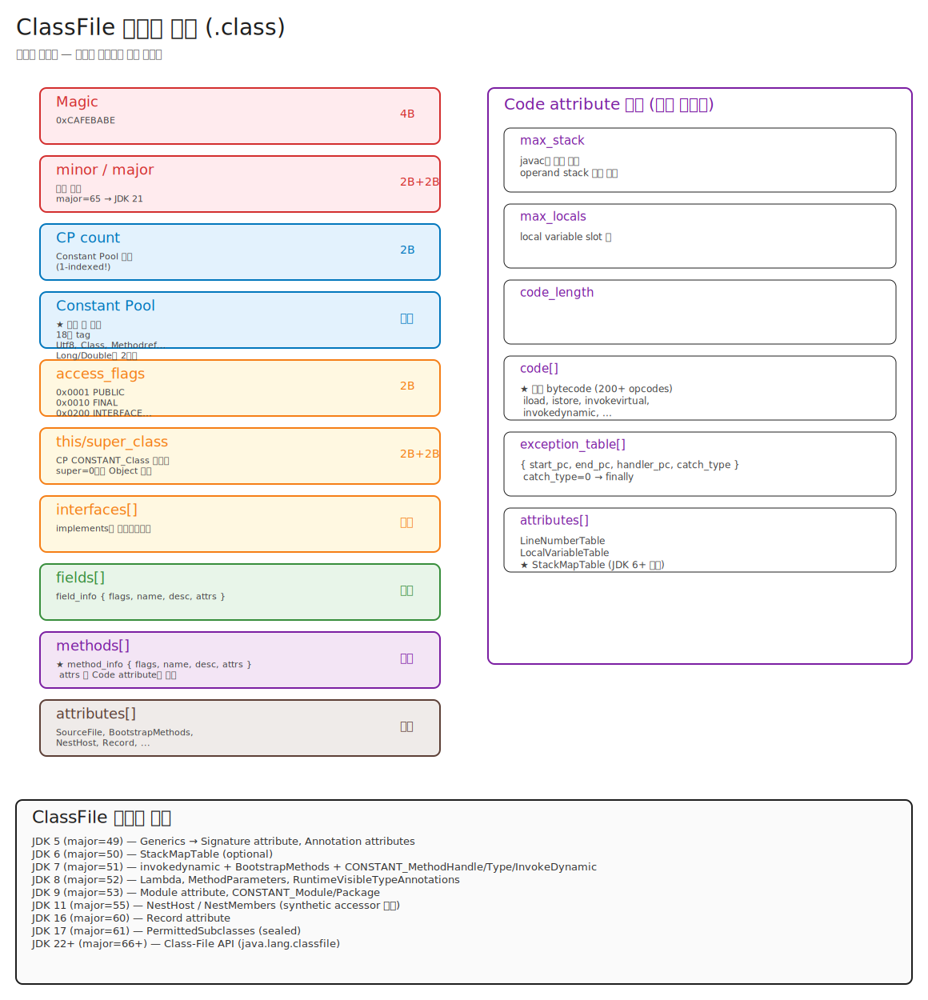

# 01-01. ClassFile 포맷 — 시니어가 실제로 쓰는 만큼만

> "ClassFile의 첫 4바이트가 0xCAFEBABE다" 라고 답하는 건 입문자.
> **시니어가 ClassFile을 안다는 건 무엇인가** — production에서 `UnsupportedClassVersionError`, `NoSuchMethodError`, Lambda Metaspace 누수, hot reload 한계 같은 사고가 났을 때 `javap -v` 한 번으로 5분 안에 원인 가설을 세우는 능력이다.
> 이 챕터는 **byte offset을 외우는 것이 아니라, 어떤 ClassFile 지식이 어떤 production 문제를 푸는지** 매핑한다.

---

## 🗺️ JVM 라이프사이클 안에서 이 챕터의 위치

이 챕터(01-classfile-format)는 클래스 라이프사이클 5단계 중 **Loading 진입 직전, 입력 자체**를 다룬다.


```
                        ★ 이 챕터 ★
                        ━━━━━━━━━━━━
   .java  ──javac──►  .class (ClassFile)  ──ClassLoader.defineClass──► InstanceKlass (Metaspace)
                          │                          │
                          │                          ▼
                          │                  Linking (Verify, Prepare, Resolve)
                          │                          │
                          │                          ▼
                          │                  Initialization (<clinit>)
                          │                          │
                          │                          ▼
                          │                  Usage (메서드 호출, 객체 생성)
                          │                          │
                          │                          ▼
                          └─────────────────► Unloading (ClassLoader unreachable)
```

**다음 챕터들과의 연결**:
- → [02-classloader-hierarchy](./02-classloader-hierarchy.md): 이 ClassFile을 **누가 어떻게** 메모리에 가져오나
- → [03-linking](./03-linking.md): 가져온 ClassFile을 어떻게 **검증·준비·해결**하나
- → [04-initialization-and-unload](./04-initialization-and-unload.md): 검증된 클래스를 **언제** 초기화하고 unload하나

전체 JVM 아키텍처에서 이 챕터는 `ClassLoader 서브시스템`의 입력 단계 (00-overview 3편 4대 서브시스템 그림 참조).

### 🎯 책임 경계 — 이 챕터의 주체는 **javac**다

> 라이프사이클 4개 챕터에서 **누가 무엇을 책임지는지**는 [README.md의 책임 경계 표](./README.md#-가장-헷갈리는-한-가지--누가-무엇을-하는가-책임-경계)에 박혀있다. 여기서는 그중 **javac 부분만** 다룬다.

| 이 챕터가 다루는 것 (javac의 책임) | 이 챕터가 다루지 않는 것 |
|---|---|
| `.class` 파일 포맷 (CAFEBABE, CP, attribute, descriptor) | ClassLoader가 어떻게 읽어들이나 → **02장** |
| `<clinit>` 메서드가 **합성되어 .class에 박히는 시점** | `<clinit>`이 **실행되는 시점/락 절차** → **04장** |
| ConstantValue 인라이닝, 메서드 디스크립터, BootstrapMethods | Verification/Resolution이 실제로 도는 시점 → **03장** |

핵심 한 줄: **javac는 `.class`를 만들고 끝. 락도 안 잡고, `Class` 객체도 안 만들고, `<clinit>`을 실행하지도 않는다.** 그 모든 일은 런타임에 **ClassLoader(02장)와 JVM 본체(03·04장)**의 몫.

---

## 📍 학습 목표 — 운영 관점으로

이 챕터를 마치면 다음을 production에서 **실제로 할 수 있다**.

1. `UnsupportedClassVersionError`를 받았을 때 어떤 라이브러리가 어떤 JDK로 빌드됐는지 `javap`로 5분 안에 식별한다.
2. `NoSuchMethodError`를 받았을 때 그게 정말 메서드 없음인지, **descriptor 불일치(overload)** 인지 구분한다.
3. Lambda를 많이 쓰는 앱의 Metaspace 증가가 정상인지 누수인지 판단하기 위해, lambda 표현식이 ClassFile에 어떻게 컴파일되는지(invokedynamic + BootstrapMethods + LambdaMetafactory + hidden class) 설명할 수 있다.
4. Generics가 erasure로 컴파일된다는 사실과, `Signature` attribute로 reflection이 generic 정보를 어떻게 복원하는지 안다. **bridge method**가 stack trace에 보이는 이유를 안다.
5. HotSwap(IDE의 hot reload)가 **메서드 body는 바꿀 수 있지만 시그니처/필드 추가는 못 하는** ClassFile-level 이유를 설명할 수 있다.
6. ASM/ByteBuddy로 동적 클래스를 만드는 라이브러리(Mockito, Hibernate proxy, Spring AOP)가 디버깅 시 stack trace에 이상한 이름으로 나타나는 패턴을 안다.
7. `javap -v` 출력의 모든 섹션을 읽고, stack trace의 `Method.foo(Foo.java:42)`가 어느 bytecode offset인지 매칭할 수 있다.
8. 외울 필요가 **없는 것**도 안다 — magic number의 hex 값, 모든 CONSTANT tag 번호, access_flags 비트 자릿수, mUTF-8 인코딩 디테일 등은 **운영에서 한 번도 쓰지 않는다**.

---

## 🎨 1단계: 백지 그리기 가이드 — 개념 수준

> ClassFile은 7개 큰 블록의 순차적 묶음이다. **각 블록의 의미와 javap 출력 매핑**만 그릴 수 있으면 충분.

### 7개 블록을 위에서 아래로 — 각 블록의 본질

```
┌─────────────────────────────────┐
│ ① 헤더 (magic + version)          │  10바이트. magic 4B + minor 2B + major 2B + cp_count 2B
├─────────────────────────────────┤
│ ② Constant Pool                  │  가장 큼. 모든 이름·시그니처·문자열·숫자의 단일 출처
├─────────────────────────────────┤
│ ③ Access Flags + this/super      │  클래스 자체의 modifier + 자기/부모 클래스 이름
├─────────────────────────────────┤
│ ④ Interfaces                     │  implements 목록 (CP 인덱스 배열)
├─────────────────────────────────┤
│ ⑤ Fields                         │  필드 선언: access + 이름 + descriptor + attributes
├─────────────────────────────────┤
│ ⑥ Methods                        │  메서드 선언 + 본문(Code attribute)
│   └ Code attribute               │  ★ bytecode + max_stack/locals + exception_table
│                                  │    + LineNumberTable (stack trace의 line number 출처)
├─────────────────────────────────┤
│ ⑦ Class Attributes               │  클래스 레벨 메타: SourceFile, BootstrapMethods,
│                                  │  NestHost, Record, PermittedSubclasses, Module 등
└─────────────────────────────────┘
```

#### 각 블록을 한 단락씩 — 왜 존재하나

**① 헤더 (10바이트)**: 파일이 진짜 ClassFile인지(magic), 어느 JDK로 컴파일됐는지(major/minor) 식별. 이 10바이트가 잘못되면 JVM은 더 읽지 않고 `ClassFormatError` 또는 `UnsupportedClassVersionError` throw. 운영에서 `UnsupportedClassVersionError` 디버깅의 단서가 모두 여기서 옴.

**② Constant Pool**: ClassFile의 다른 모든 부분이 "이름"이나 "리터럴 값"을 참조할 때 직접 적지 않고 **여기 한 번 정의된 엔트리를 인덱스로 참조**. 즉, 한 클래스 안에서 `"Hello"` 문자열을 100번 써도 CP에는 한 엔트리. 메서드 호출 `invokevirtual Foo.bar()`도 bytecode 안에 "Foo.bar"가 직접 들어가지 않고 CP 인덱스만. → bytecode의 **고정 길이 명령** 보장 + **중복 제거** + Linking 단계의 **resolve 단일화**.

**③ Access Flags + this_class + super_class**: 이 클래스 자체의 정체. `public class Foo extends Bar` 한 줄을 4가지 정보로 분해해 저장 — modifier(public/final/abstract/...), 자기 이름(this_class), 부모 이름(super_class), 그리고 sealed/record/enum 같은 추가 표시. 모두 CP 인덱스 또는 비트마스크.

**④ Interfaces**: 이 클래스가 `implements`한 인터페이스 이름들의 배열 (각각 CP의 Class 엔트리 인덱스). interface의 default method, 인터페이스 메서드 dispatch(invokeinterface)가 모두 여기서 출발.

**⑤ Fields**: 인스턴스/static 필드 선언. 각 필드는 access + 이름(CP Utf8) + descriptor(타입을 인코딩한 CP Utf8) + attributes(예: static final의 상수값 = ConstantValue attribute, generic 시그니처 = Signature attribute, annotation). **descriptor 한 글자가 다르면 다른 필드** — `NoSuchFieldError`의 본질.

**⑥ Methods + Code attribute**: ClassFile의 가장 큰 부분. 각 메서드는 access + 이름 + descriptor + attributes. 메서드 본문(bytecode)은 attributes 중 **Code attribute** 안에 들어간다. Code 안에는 실제 bytecode 외에도 max_stack(operand stack 최대 깊이), max_locals(로컬 변수 슬롯 수), exception_table(try-catch 범위 매핑), 그리고 LineNumberTable·StackMapTable·LocalVariableTable 같은 내부 attributes가 또 들어 있다. → **stack trace의 line number는 LineNumberTable에서 온다는 사실**이 가장 운영에 직결.

**⑦ Class Attributes**: 클래스 레벨 메타데이터. SourceFile(원본 .java 이름 — 그래서 stack trace에 파일명이 나옴), BootstrapMethods(invokedynamic/lambda가 호출할 부트스트랩 메서드 정보), NestHost/NestMembers(JDK 11+ 같은 nest의 private 접근), Record(JDK 16+ 컴포넌트 정보), PermittedSubclasses(JDK 17+ sealed), Module(JDK 9+ module-info.class만), InnerClasses, RuntimeVisibleAnnotations 등.

### 정답 그림



> 편집은 [01-classfile-format.excalidraw](./_excalidraw/01-classfile-format.excalidraw)를 [excalidraw.com](https://excalidraw.com/)에서 "Open"으로.

**시니어 관점에서 외울 만한 단 두 가지**:
1. 9개 블록의 **이름과 역할** (offset이나 바이트 수는 무시).
2. 메서드 본문은 **Code attribute**라는 곳에 들어가고, 거기에 `max_stack`, `max_locals`, bytecode, exception_table, LineNumberTable이 있다. — 이건 stack trace 해석할 때 직결.

나머지(magic hex, CONSTANT tag 번호, access_flags 비트 자릿수)는 `javap -v` 가 다 출력해준다.

---

## 🧠 2단계: 직관

### 핵심 비유 + 정확한 정의

> **빌딩 도면 비유**:
> - **Constant Pool** = 자재 목록표. 콘크리트·철근·문 같은 모든 자재가 여기 한 번만 정의되고, 도면 어디서든 "#13 자재" 같은 인덱스로 참조.
> - **Fields/Methods** = 설계도 본문. "1층 거실에 #5 자재를 #3 방식으로 설치".
> - **Attributes** = 도면 모서리의 메모. SourceFile(원본 .java 이름), LineNumberTable(소스 라인 매핑), Annotation 같은 정보.

**정확한 정의**: ClassFile은 **JVM이 클래스 1개를 메모리에 로드하기 위해 필요한 모든 정보를 담은 단일 파일**. JVMS §4에 명세된 big-endian 바이트 스트림. 일반적으로 `.class` 확장자.

### 시니어가 실제로 기억해야 하는 3가지 핵심

1. **Constant Pool은 단일 출처(single source)** — 클래스 이름, 메서드 시그니처, 문자열, 상수 모두 여기서 인덱스로 참조. → `javap -v`에서 `#13` 같은 인덱스는 CP를 가리킨다.
2. **메서드 본문은 Code attribute** — `max_stack`, `max_locals`, bytecode, exception_table, LineNumberTable이 한 묶음. → stack trace의 line number는 LineNumberTable에서 옴.
3. **버전은 major_version 한 숫자가 결정** — 65 = JDK 21, 61 = JDK 17, 55 = JDK 11, 52 = JDK 8. → `UnsupportedClassVersionError` 진단의 90%.

이 3가지만 알면 **production 디버깅의 80%** 해결.

### Stack-based가 핵심이라는 사실 (한 줄)

JVM bytecode는 register 기반이 아닌 **operand stack 기반**. 그래서 `iadd`는 "stack top 두 개 pop → 더해서 push" 같은 형태. CPU 추상화가 단순해서 platform-independent.

### 외울 필요는 없지만 각 개념의 본질은 정확히 알아야 할 것 ⭐

> **핵심 원칙**: hex 값, 비트 자릿수, tag 번호 같은 **표면 값**은 외울 필요가 없다. `javap` 같은 도구가 다 풀어준다. 그러나 **그 값이 왜 존재하는지, 무엇을 표현하는지, 어떻게 만들어졌는지**는 시니어가 정확히 이해해야 한다. 그래야 운영 사고 시 도구 출력을 읽고, 라이브러리 동작을 이해하고, JVMS를 참고할 수 있다.

다섯 가지 개념 — 표면 값은 잊되, 본질은 깊게.

---

#### 1) Magic Number `0xCAFEBABE` — 파일 타입 시그니처

**개념**: 운영체제와 도구가 파일 첫 몇 바이트만 보고 "이게 무슨 형식인지" 즉시 식별하기 위한 universal pattern. ClassFile은 첫 4바이트가 `0xCAFEBABE` (big-endian). 이 값이 아니면 JVM은 더 읽지 않고 `ClassFormatError` 즉시 throw.

**다른 파일 형식의 매직 넘버 (비교 이해용)**:

| 형식 | 매직 (hex) | ASCII |
|---|---|---|
| ZIP/jar | `50 4B 03 04` | `PK..` |
| PNG | `89 50 4E 47` | `.PNG` |
| ELF (Linux 실행파일) | `7F 45 4C 46` | `.ELF` |
| PDF | `25 50 44 46` | `%PDF` |
| Java ClassFile | `CA FE BA BE` | (사람 눈에 띄게) |

**0xCAFEBABE의 기원**: James Gosling이 자주 갔던 카페 'Cafe Babe'(Peet's Coffee의 한 단골 그룹 별명)에서 따왔다는 일화. hex 표현 가능한 영어 단어(`0-9`, `A-F`만 사용)로 골라졌고, 메모리 dump 시 사람 눈에 잘 띄도록 의도. 다른 SunOS 시절 매직: `0xDEADBABE`, `0xFEEDFACE` 등 같은 계열.

**JVM 내부 동작**: HotSpot `classFileParser.cpp::parse_stream`의 첫 줄이 `magic = stream->get_u4_fast()`. 그 다음 줄이 `guarantee_property(magic == JAVA_CLASSFILE_MAGIC, ...)`. 통과 못 하면 즉시 종료.

**운영에서 만나는 케이스**:
- `.class`라고 받은 파일이 실은 jar (PK 시작) — 빌드 배포 사고.
- 손상된 jar에서 추출된 파일이 0으로 시작 — 디스크 손상.
- 진단: `xxd -l 4 Foo.class` 한 번이면 즉시 확인.

**왜 운영자가 hex 값을 외울 필요 없나**: 직접 매직을 손으로 비교할 일은 거의 없다. `xxd | head -1`로 보면 `cafe babe`가 그대로 ASCII에도 보임. `file Foo.class` 명령도 즉시 "compiled Java class data"라고 출력. 도구가 다 처리.

→ **운영 가치**: "ClassFormatError가 떴다 = 파일이 .class 형식이 아니거나 손상됐다"만 즉시 떠올리면 충분.

---

#### 2) Constant Pool의 18가지 CONSTANT 타입 — 단일 출처의 18가지 형태

**개념**: Constant Pool은 ClassFile 안에서 "이름·시그니처·리터럴 값"을 **딱 한 번** 정의하고, 다른 모든 곳은 그 인덱스(1부터 시작)로 참조한다. 각 엔트리는 **1바이트 tag**로 어떤 종류인지 표시하고, tag에 따라 뒤에 오는 데이터 형식이 달라진다.

**18가지 tag — 시대별로 추가된 순서**:

| tag | 이름 | 도입 | 내용 | 어디 쓰이나 |
|---|---|---|---|---|
| 1 | Utf8 | 1.0 | u2 길이 + 바이트들 | **모든 문자열의 베이스**. 클래스 이름, 메서드 이름, descriptor가 다 Utf8 |
| 3 | Integer | 1.0 | u4 | int 상수 (`ldc`로 로드) |
| 4 | Float | 1.0 | u4 | float 상수 |
| 5 | Long | 1.0 | u8 | long 상수 (★ 슬롯 2개 차지 — 아래 5번 항목) |
| 6 | Double | 1.0 | u8 | double 상수 (★ 슬롯 2개 차지) |
| 7 | Class | 1.0 | name_index → Utf8 | 클래스 참조. `new Foo` 의 Foo |
| 8 | String | 1.0 | string_index → Utf8 | java.lang.String 객체 상수. `"Hello"` |
| 9 | Fieldref | 1.0 | class_idx + nat_idx | 필드 심볼릭 참조 |
| 10 | Methodref | 1.0 | class_idx + nat_idx | 클래스 메서드 심볼릭 참조 |
| 11 | InterfaceMethodref | 1.0 | class_idx + nat_idx | 인터페이스 메서드 심볼릭 참조 |
| 12 | NameAndType | 1.0 | name_idx + desc_idx | (이름, 시그니처) 페어 — Fieldref/Methodref가 이걸 참조 |
| 15 | MethodHandle | 7 | kind + ref_idx | invokedynamic의 부속 |
| 16 | MethodType | 7 | desc_idx | invokedynamic의 부속 |
| 17 | Dynamic | 11 | bsm_idx + nat_idx | constant dynamic (condy) — JEP 309 |
| 18 | InvokeDynamic | 7 | bsm_idx + nat_idx | invokedynamic 호출 사이트 |
| 19 | Module | 9 | name_idx | 모듈 참조 (module-info.class용) |
| 20 | Package | 9 | name_idx | 패키지 참조 (module-info.class용) |

> tag **2, 13, 14는 비어 있다** — JVMS가 명시적으로 reserved 처리. 미래 확장 슬롯.

**왜 단일 통합 테이블인가 — 3가지 설계 이유**:

1. **중복 제거**: 같은 문자열 `"Hello"` 100번 쓰면 CP에 1개 엔트리. 모든 참조가 같은 인덱스 가리킴. ClassFile 크기 ↓.
2. **고정 길이 명령**: bytecode 명령어는 "opcode + operand". 만약 명령어가 가변 길이 문자열을 직접 안고 다니면 instruction dispatch 복잡. CP 인덱스(u2 = 2바이트)만 안고 다니면 명령어 길이 일정 → 인터프리터/JIT 빠름.
3. **Linking 단계의 분리**: Resolution이 "심볼릭 참조 → 실제 메모리 주소"로 변환할 때 CP의 각 엔트리를 한 번씩만 처리 → caching이 자연스럽다. 동일 CP 엔트리의 다음 사용은 캐시된 결과 재사용.

**서로 참조하는 그래프 구조 (가장 중요한 부분)**:

```
Methodref (tag 10)               예: System.out.println(String) 호출
  ├─ class_index ──► Class (tag 7)
  │                    └─ name_index ──► Utf8 "java/io/PrintStream"
  └─ name_and_type_index ──► NameAndType (tag 12)
                              ├─ name_index ──► Utf8 "println"
                              └─ descriptor_index ──► Utf8 "(Ljava/lang/String;)V"
```

`invokevirtual #15`만 보면 한 번에 클래스, 메서드 이름, 시그니처를 따라 들어갈 수 있다. **CP 인덱스 하나 = 4단계 indirection을 거치는 그래프 노드 하나**.

**왜 운영자가 tag 번호를 외울 필요 없나**: `javap -v`가 `#15 = Methodref #16.#17 // PrintStream.println:(Ljava/lang/String;)V` 형태로 모두 풀어 출력. tag 번호 10이라는 사실은 도구가 인코딩 단계에서만 신경 씀.

**그러나 알아야 할 본질**:
- **모든 이름/시그니처는 Utf8을 끝점으로 가진다** — 그래서 Java 클래스의 모든 식별자가 결국 mUTF-8로 저장됨.
- **NameAndType은 (이름, 시그니처) 쌍 — 같은 이름의 오버로드된 메서드를 구분하는 단위**.
- **Methodref vs InterfaceMethodref 분리**는 `invokevirtual`(vtable)과 `invokeinterface`(itable)의 dispatch 방식 차이 때문.
- **InvokeDynamic 엔트리는 BootstrapMethods attribute의 인덱스를 들고 있다** — lambda Metaspace 추적 시 결정적 (시나리오 3).

---

#### 3) `access_flags` 비트마스크 — 16비트로 표현된 modifier 모음

**개념**: 클래스/필드/메서드의 modifier(`public`, `private`, `static`, `final`, `abstract` 등)를 **2바이트(16비트) 비트마스크**로 표현. 한 클래스/메서드에 여러 modifier가 동시에 적용 가능하므로(예: `public static final`) bitwise OR 조합이 자연스럽다.

**클래스 access_flags 비트 (전체)**:

| Hex | 이름 | 의미 |
|---|---|---|
| `0x0001` | ACC_PUBLIC | `public` 키워드 |
| `0x0010` | ACC_FINAL | `final` 키워드 |
| `0x0020` | ACC_SUPER | (역사적) invokespecial 의미 보정용. JDK 1.0.2부터 항상 set. JDK 24부터 무시 (JEP 480). |
| `0x0200` | ACC_INTERFACE | `interface` |
| `0x0400` | ACC_ABSTRACT | `abstract` |
| `0x1000` | ACC_SYNTHETIC | javac가 합성한 것 (소스에 없는 멤버/클래스) |
| `0x2000` | ACC_ANNOTATION | `@interface` |
| `0x4000` | ACC_ENUM | `enum` |
| `0x8000` | ACC_MODULE | JDK 9+. `module-info.class`만. |

**메서드 access_flags 추가 비트**:

| Hex | 이름 | 의미 |
|---|---|---|
| `0x0008` | ACC_STATIC | `static` |
| `0x0020` | ACC_SYNCHRONIZED | `synchronized` (메서드 전체) |
| `0x0040` | ACC_BRIDGE | ★ generics erasure로 javac가 생성한 bridge method 표시 (시나리오 4) |
| `0x0080` | ACC_VARARGS | `T... args` |
| `0x0100` | ACC_NATIVE | `native` (JNI 진입점) |
| `0x0800` | ACC_STRICT | `strictfp` (JDK 17부터 의미 없음) |

**ACC_SUPER의 역사적 사연** (운영에서 만나기 어렵지만 알 가치 있음):
- JDK 1.0의 `invokespecial` 명령은 버그가 있었음 — `super.method()`가 잘못 디스패치되는 경우.
- 1.0.2에서 수정하면서, 옛 컴파일러로 만든 .class와 구분하기 위해 `ACC_SUPER`를 **새 의미를 원하는 클래스의 표시**로 도입. javac는 1.0.2 이후 항상 set.
- 결과: 30년 가까이 모든 클래스에 set돼 있는 dead 플래그.
- JDK 24 (JEP 480)에서 무시 결정 — historical baggage 제거.

**ACC_SYNTHETIC + ACC_BRIDGE의 운영 의미**:
- `ACC_SYNTHETIC`: 소스에 없는 것 (compile에 의해 생성). 예: inner class용 `access$000`, lambda body 추출용 `lambda$main$0`, enum의 `values()`/`valueOf()`, generics의 bridge method.
- `ACC_BRIDGE`: synthetic 중에서 특히 covariant return / generics erasure로 생성된 위임 메서드. → **stack trace에 같은 메서드가 두 번 나오면 이 플래그가 단서** (시나리오 4).

**왜 운영자가 hex 값을 외울 필요 없나**: `javap`가 `(0x0021) ACC_PUBLIC, ACC_SUPER` 형태로 이름까지 출력. `0x0021`을 손으로 디코딩할 일 없음. ASM, ByteBuddy도 enum/상수로 추상화 (`Opcodes.ACC_PUBLIC` 같은).

**그러나 알아야 할 본질**:
- modifier를 **bitwise OR로 조합**한다는 메커니즘 자체 (다른 형식 매직 넘버나 옵션 플래그와 동일 패턴).
- `ACC_SYNTHETIC` / `ACC_BRIDGE`의 존재가 stack trace 디버깅에 직결.
- `ACC_INTERFACE`와 `ACC_ABSTRACT`가 동시에 set돼 있는 게 정상(interface는 본질적으로 abstract). `ACC_ENUM`, `ACC_ANNOTATION`도 종류 식별 비트.

---

#### 4) Modified UTF-8 (mUTF-8) — JNI 호환을 위한 변형 UTF-8

**개념**: ClassFile의 Utf8 엔트리는 **일반 UTF-8이 아니라 Modified UTF-8**이라는 변형. 1995년 Java 1.0 설계 당시 JNI(Java Native Interface)와 C 코드의 null-terminated string 호환을 위해 두 가지 규칙을 일반 UTF-8과 다르게 정의.

**일반 UTF-8과의 두 가지 차이**:

**(1) Null byte (`U+0000`)의 인코딩**:
- 일반 UTF-8: `0x00` (1바이트). → C의 `strlen`, `strcpy`가 문자열 끝으로 오인.
- mUTF-8: `0xC0 0x80` (2바이트). → C 문자열 안에 null이 들어가도 끝이 아닌 진짜 null 문자로 처리.

UTF-8 명세상 `0xC0 0x80`은 **overlong encoding** (1바이트로 표현 가능한 값을 2바이트로) — 정상 UTF-8 디코더는 이를 거부한다. mUTF-8은 의도적으로 이걸 허용.

**(2) BMP 외부 문자 (U+10000 이상, supplementary character)**:
- 일반 UTF-8: 4바이트로 1번 인코딩. 예: 🎉 (U+1F389) → `F0 9F 8E 89`.
- mUTF-8: UTF-16 surrogate pair로 변환 후 각 surrogate를 3바이트씩 인코딩. 예: 🎉 → high surrogate `0xD83C` + low surrogate `0xDF89` → `ED A0 BC ED B8 89` (6바이트).

**왜 surrogate pair인가**: Java 내부 String은 **UTF-16 char[]** 로 저장 (JDK 9의 Compact Strings 이후는 ISO-8859-1 또는 UTF-16). UTF-16에서 supplementary character는 자연스럽게 surrogate pair → mUTF-8 인코딩이 UTF-16 char 배열을 그대로 바이트로 직렬화한 것에 가까움. 디코딩 시 char[] 복원이 단순.

**전체 비교 예시**:

```
문자       | UTF-8                | mUTF-8
─────────|──────────────────────|──────────────────────
'A'      | 41                   | 41                   ← 같음 (ASCII)
'한'      | EC 95 84             | EC 95 84             ← 같음 (BMP)
'\0'     | 00                   | C0 80                ← 다름 (null)
🎉 U+1F389| F0 9F 8E 89          | ED A0 BC ED B8 89    ← 다름 (supplementary)
```

**운영에서의 함정**:
- Java의 `String.getBytes(StandardCharsets.UTF_8)`는 **일반 UTF-8**.
- `DataOutputStream.writeUTF(String)`이 mUTF-8.
- 같은 이유로 ClassFile parsing 시 표준 UTF-8 라이브러리 쓰면 한국어 클래스 이름은 잘 되지만 supplementary character(emoji 포함) 들어가면 깨진다.
- 한국어/일본어/중국어 ASCII 외 식별자는 BMP 안에 있어 일반 UTF-8과 mUTF-8이 동일 — 대부분의 한글 클래스명은 문제 없음.

**왜 운영자가 인코딩 디테일을 외울 필요 없나**: ASM, ByteBuddy, Class-File API가 처리. JVM 외부에서 `.class`를 직접 만들지 않는 한 마주칠 일 없음.

**그러나 알아야 할 본질**:
- ClassFile의 모든 이름·시그니처가 mUTF-8로 인코딩됨.
- 일반 UTF-8과 두 가지 다름(null + supplementary)이 있다는 사실.
- 직접 ClassFile 파서를 짠다면 `DataInputStream.readUTF()`를 쓸 것 (표준 라이브러리에 이미 있음).
- 1995년 JNI와 C 코드 호환이라는 시대적 결정의 산물 — 30년 호환성 때문에 그대로 유지.

---

#### 5) Long/Double이 CP 슬롯 2개를 차지하는 이유 — JVMS가 인정한 "후회"

**개념**: Constant Pool은 1-indexed (0번 슬롯은 "invalid/null" 의미로 예약, 사용 안 함). 일반 엔트리는 1슬롯 차지하지만 **Long(tag 5)과 Double(tag 6)은 2슬롯을 차지**한다. CP[N]에 Long을 놓으면 CP[N+1]은 사용 불가 슬롯이 된다.

**구체적 메모리 레이아웃**:

```
CP index:    1     2     3     4     5      6      7
Entry:       Utf8  Class Utf8  Utf8 Long [unused] String
                                     ^^^^^^^^^^^^
                                     2슬롯 점유
다음 사용 가능한 인덱스는 7. 6번에 접근하면 ClassFormatError.
```

**JVMS의 공식 인정** (§4.4.5):
> "In retrospect, making 8-byte constants take two constant pool entries was a poor choice."

JVM 명세 만든 사람들이 직접 "잘못된 선택이었다"고 명시한 매우 드문 케이스.

**왜 그렇게 만들어졌나 (추정)**:
- 1995년 설계 시점 — 모든 자료구조가 4바이트 단위로 정렬됐던 시대.
- 8바이트 데이터를 표현하기 위해 "한 슬롯이 4바이트라고 가정하면 두 슬롯이 자연스럽다"는 직관.
- 또는 향후 메모리 alignment 일관성 위함.
- 결과: 인덱스 계산 복잡도만 증가. CP 순회 코드마다 "이 엔트리가 Long/Double이면 +2, 아니면 +1" 분기 필요.

**왜 못 고치나 — 30년 호환성**:
- ClassFile 포맷의 모든 변경은 기존 .class 파일과 호환 유지 필수.
- 인덱스 체계 변경 = 모든 .class 파일 무효화.
- 그래서 JVMS는 "후회한다"고만 적고 그대로 유지.

**HotSpot의 처리**:
```cpp
// classFileParser.cpp (요약)
for (int index = 1; index < cp_size; index++) {
  u1 tag = stream->get_u1_fast();
  switch (tag) {
    case JVM_CONSTANT_Long:
      cp->long_at_put(index, value);
      index++;  // ★ 다음 슬롯 건너뛰기
      break;
    ...
  }
}
```

→ HotSpot은 두 번째 슬롯에 "invalid tag" 마커를 저장하고, 누가 그 인덱스에 접근하면 verify 단계에서 거부.

**왜 운영자가 외울 필요 없나**: bytecode를 손으로 작성하지 않는 한 무의미. ASM, ByteBuddy, Class-File API가 인덱스 계산을 추상화 — 사용자는 "Long 추가"만 하면 라이브러리가 인덱스 +2 자동 처리.

**그러나 알아야 할 본질**:
- ClassFile 포맷은 **시대적 결정의 산물**이며 호환성 때문에 영원히 고정.
- "JVMS가 명시적으로 인정한 설계 결함"이라는 사실 자체 — 명세도 완벽하지 않다.
- HotSpot 코드 읽다가 인덱스 +2 점프 보면 이 디테일 때문임을 인지.

---

### 다섯 개념의 공통 메시지

이 다섯 항목은 모두 **JVM 설계자들의 시대적 결정**(1995년 JNI 호환, C 코드 호환, 4바이트 정렬 직관, 매직 넘버 관습)의 결과다. 30년 후 운영자가 매일 만지는 것이 아니라, **도구(`javap`, ASM, JDK Class-File API)가 추상화하는 layer**.

운영자의 의무는 **표면 hex 값을 외우는 것이 아니라, "이 layer 뒤에 무엇이 있는지" 정확히 이해해서, 도구가 실패하거나 비정상 출력을 낼 때 그 의미를 짚어내는 것**. JVMS §4는 reference로 두고, 필요할 때 한 번 찾아보면 된다.

---

## 🔬 3단계: 구조 — `javap -v`로 읽기

### 시니어의 진짜 도구는 `javap`

```bash
javac HelloWorld.java          # .java → .class
javap -v HelloWorld            # .class를 사람이 읽을 수 있게 dump
```

운영에서 ClassFile을 본다는 건 99%의 경우 **`javap -v` 출력을 해석한다**는 뜻이다. byte editor로 .class를 열어 hex를 헤아리는 건 ClassFile API 개발자나 보안 분석가 영역.

### 예제 — Hello World의 `javap -v` 출력 + 해석

```java
public class HelloWorld {
    public static void main(String[] args) {
        System.out.println("Hello, World!");
    }
}
```

```text
Classfile /.../HelloWorld.class
  Compiled from "HelloWorld.java"
public class HelloWorld
  minor version: 0
  major version: 65                           ← ① 헤더: JDK 21로 컴파일됨
  flags: (0x0021) ACC_PUBLIC, ACC_SUPER       ← ③ Access Flags
  this_class: #21                              // HelloWorld
  super_class: #2                              // java/lang/Object
  interfaces: 0, fields: 0, methods: 2, attributes: 1
Constant pool:                                ← ② Constant Pool
   #1 = Methodref          #2.#3       // java/lang/Object."<init>":()V
   #2 = Class              #4          // java/lang/Object
   ...
   #13 = String             #14         // Hello, World!
   #14 = Utf8               Hello, World!
   #15 = Methodref          #16.#17     // java/io/PrintStream.println:(Ljava/lang/String;)V
{                                              ← ⑥ Methods
  public static void main(java.lang.String[]);
    descriptor: ([Ljava/lang/String;)V         ← 시그니처 (descriptor)
    flags: (0x0009) ACC_PUBLIC, ACC_STATIC
    Code:                                       ← Code attribute
      stack=2, locals=1, args_size=1
         0: getstatic     #7     // System.out:Ljava/io/PrintStream;
         3: ldc           #13    // String Hello, World!
         5: invokevirtual #15    // PrintStream.println:(Ljava/lang/String;)V
         8: return
      LineNumberTable:                          ← stack trace 해석의 핵심
        line 3: 0
        line 4: 8
}
SourceFile: "HelloWorld.java"                  ← ⑦ Class Attribute
```

### Descriptor 문법 — 시그니처의 형식

**시니어가 가장 자주 마주치는 ClassFile 디테일**이 descriptor다. `NoSuchMethodError`나 reflection 디버깅에서 결정적 정보.

```
Field descriptor (타입 1개):
  B = byte           Z = boolean
  I = int            J = long      ← long이 J인 이유: L은 객체 참조용
  F = float          D = double
  C = char           S = short
  Lpackage/Class;    = 객체 참조 (예: Ljava/lang/String;)
  [T                 = T 배열 (예: [I = int[], [[I = int[][])

Method descriptor:
  (ParamDescriptors) ReturnDescriptor
  V = void (return 전용)
```

**descriptor 예시**:
```java
int main(String[] args)        → ([Ljava/lang/String;)I
void println(String s)          → (Ljava/lang/String;)V
long max(long a, long b)        → (JJ)J
Object[] toArray()              → ()[Ljava/lang/Object;
List<String> getNames()         → ()Ljava/util/List;    ← ★ Generics는 사라짐!
```

> **Generics erasure의 흔적**: `List<String>`이 descriptor에서는 그냥 `Ljava/util/List;`. 그래서 reflection은 `Method.getReturnType()`만으로는 generic 정보를 못 얻고, 별도 `Signature` attribute의 `getGenericReturnType()`을 써야 한다. (운영 시나리오 4 참조)

### 메서드 호출 명령 5종 — 운영에서 의미 있는 만큼만

bytecode 명령어는 ~200개지만 시니어가 의식적으로 구분하는 건 **메서드 호출 5종**이다:

| 명령 | 사용처 | Production 의미 |
|---|---|---|
| `invokevirtual` | 일반 인스턴스 메서드 | vtable 기반, JIT에서 monomorphic 추적 |
| `invokespecial` | 생성자, super, private | 정적 바인딩, JIT 인라인 친화 |
| `invokestatic` | static 메서드 | 인스턴스 없음, 가장 단순 |
| `invokeinterface` | 인터페이스 메서드 | itable lookup, CHA로 monomorphic이면 vtable급으로 빠름 |
| `invokedynamic` | lambda, switch on String, String concat (JDK 9+) | BootstrapMethod 호출 → CallSite 캐시. **Lambda Metaspace 누수의 진원지** |

→ **운영 시나리오 3 (Lambda + Metaspace)** 에서 invokedynamic이 어떻게 hidden class를 만들어 Metaspace를 압박하는지 다룬다.

### 외울 필요는 없지만 인지해두면 좋은 명령어 분류

push/pop, 산술, 분기, 객체 생성, 배열 접근 등 — `javap -v` 보면서 "iadd니까 int 더하기, getfield니까 인스턴스 필드 읽기" 정도 reading comprehension만 되면 충분.

---

## 🛠️ 4단계: 운영 시나리오 — ClassFile 지식이 푸는 실제 문제 ⭐

> **이 챕터의 진짜 핵심.** 시니어가 ClassFile을 "안다"는 것은 아래 시나리오를 마주쳤을 때 `javap -v` 또는 그에 준하는 도구로 5~10분 안에 가설을 세우고 검증할 수 있다는 뜻.

### 시나리오 1: `UnsupportedClassVersionError`

#### 증상

```
Exception in thread "main" java.lang.UnsupportedClassVersionError:
  com/foo/Service has been compiled by a more recent version of the Java Runtime
  (class file version 61.0), this version of the Java Runtime only recognizes
  class file versions up to 55.0
```

#### 진단

```bash
# 의심 라이브러리 jar 안의 .class 하나 추출
unzip -p service.jar com/foo/Service.class > /tmp/Service.class
javap -v /tmp/Service.class | head -5
#   major version: 61   ← JDK 17로 컴파일됨
#   minor version: 0    (0xFFFF면 preview)
```

#### 시니어의 사고 흐름

1. **major 61 = JDK 17**. 운영 JDK는 메시지에서 "up to 55.0" → JDK 11.
2. 빌드 환경에서 누가 17로 빌드했나? `pom.xml`/`build.gradle`의 `targetCompatibility`, `--release` 옵션 확인.
3. 임시 우회: 운영 JDK를 17로 올리거나, 라이브러리를 11 호환 버전으로 다운그레이드.
4. 항구적 fix: CI에서 빌드 시 target version 검증 추가 (`maven-enforcer-plugin` 등).

#### major 번호 → JDK 매핑 (외울 필요 없이 ±1 기억하면 됨)

| major | JDK | major | JDK | major | JDK |
|---|---|---|---|---|---|
| 52 | 8 | 55 | 11 | 61 | 17 |
| 53 | 9 | 56 | 12 | 62 | 18 |
| 54 | 10 | ... | | 65 | 21 |

**힌트**: JDK N → major = N + 44. JDK 21 → 65. 한 번만 외우면 됨.

#### 부수 케이스: `minor_version: 0xFFFF` (preview)

```text
minor version: 65535   ← --enable-preview로 빌드된 것
```

JDK 21 preview 코드는 정확히 JDK 21에서 `--enable-preview`로만 실행 가능. JDK 22에서는 거부.

---

### 시나리오 2: `NoSuchMethodError` — 메서드는 있는데 못 찾는다?

#### 증상

```
Exception in thread "main" java.lang.NoSuchMethodError:
  'java.util.List com.foo.Repository.findAll(java.lang.String)'
```

분명히 `findAll(String)` 메서드는 존재하는데도 런타임에 못 찾음.

#### 가능한 원인 — descriptor 불일치

1. **컴파일 시점의 라이브러리 버전 ≠ 런타임 버전**.
2. **return type 변경**: 한쪽은 `List<String>` (descriptor `Ljava/util/List;`), 다른쪽은 `Collection<String>` (descriptor `Ljava/util/Collection;`).
3. **Bridge method 누락** (generics 변경 시 자주).
4. **Overload 모호성**: `findAll(String)` vs `findAll(CharSequence)`.

#### 진단

```bash
# 1. 호출한 쪽(caller)의 invoke 명령 확인
javap -v Caller.class | grep -A 2 findAll
# 5: invokevirtual #25 // Method com/foo/Repository.findAll:(Ljava/lang/String;)Ljava/util/List;

# 2. 실제 로드된 라이브러리의 메서드 확인
javap -v Repository.class | grep findAll
# public java.util.Collection findAll(java.lang.String);
#   descriptor: (Ljava/lang/String;)Ljava/util/Collection;    ← ★ Collection!
```

→ caller는 `List` return을 가정해 컴파일됐지만, 실제 라이브러리는 `Collection` return. **descriptor의 일부분(return type)이 다르면 다른 메서드**다.

#### 시니어의 사고 흐름

1. NoSuchMethodError는 "메서드 이름이 없다"가 아니라 **"이 정확한 descriptor의 메서드가 없다"**. JVM은 메서드를 `name + descriptor`로 식별.
2. caller와 callee의 descriptor를 `javap -v`로 양쪽 추출해 비교.
3. 라이브러리 버전을 맞추거나, return type을 호환되게 조정.

#### 부수 함정: covariant return type

```java
class A { Object get() { ... } }
class B extends A { @Override String get() { ... } }
```

→ javac가 B에 **bridge method**를 생성: `Object get()`이 실제로는 `String get()`을 호출. Stack trace에 가끔 `(synthetic)` 같은 표시 + descriptor가 두 개로 보임. 다음 시나리오 4와 연결.

---

### 시나리오 3: Lambda + Metaspace 누수의 진원지 — invokedynamic

#### 증상

```
[gc] Metaspace: used 480M, capacity 512M, ...
java.lang.OutOfMemoryError: Metaspace
```

Lambda를 많이 쓰는 reactive/stream 코드에서 자주.

#### Lambda가 ClassFile에 컴파일되는 방식

```java
Runnable r = () -> System.out.println("hi");
```

javac는:
1. lambda body를 **private static 메서드 `lambda$main$0`**로 추출.
2. lambda 위치에 **`invokedynamic`** 명령 emit.
3. ClassFile의 `BootstrapMethods` attribute에 `LambdaMetafactory.metafactory(...)` 호출 정보 저장.

`javap -v`로 보면:
```text
0: invokedynamic #2,  0     // InvokeDynamic #0:run:()Ljava/lang/Runnable;
...
BootstrapMethods:
  0: #34 REF_invokeStatic java/lang/invoke/LambdaMetafactory.metafactory:(...)
    Method arguments:
      #35 ()V
      #36 REF_invokeStatic Main.lambda$main$0:()V
      #37 ()V
```

#### 런타임 동작

1. 첫 invokedynamic 실행 시 `LambdaMetafactory.metafactory`가 호출됨.
2. metafactory가 **hidden class (이름 패턴: `Main$$Lambda$1/0x...`)** 를 동적 생성. 이 클래스는 `Runnable` 인터페이스를 구현하고 `run()` 메서드 안에서 `lambda$main$0`을 호출.
3. `CallSite` 객체에 그 인스턴스를 묶어 캐싱.
4. 같은 invokedynamic 사이트의 다음 실행은 O(1) — 캐시된 CallSite 재사용.

#### 운영 함정

- 캡처 없는 lambda는 **싱글톤**처럼 재사용됨 → hidden class 1개만 생성.
- 캡처가 있으면 **호출마다 새 인스턴스**. hidden class는 여전히 1개 (각 invokedynamic 사이트당 1개), 단 인스턴스는 매번.
- **anonymous inner class와 차이**: `new Runnable() { ... }`은 anonymous class (.class 파일이 추가로 생성됨, `Main$1.class`). lambda는 hidden class (디스크에 안 남음, ClassLoader에 등록 안 됨, GC 대상).

#### 진단

```bash
# hidden class가 폭주하는지 확인
jcmd <pid> VM.classloader_stats | grep -i 'hidden\|lambda'

# JFR로 ClassLoad 이벤트 추적
jcmd <pid> JFR.start name=cl duration=60s settings=profile filename=cl.jfr
jfr summary cl.jfr | grep ClassLoad
```

#### 시니어의 사고 흐름

1. Metaspace OOM이 lambda 때문인가? → `jcmd VM.metaspace summary`로 클래스 수 확인. Hidden class도 카운트됨.
2. Lambda 때문이라면 ClassLoader 누수 패턴이 아니라 **invokedynamic 사이트 수** 자체가 많은 것 — 코드 구조 검토.
3. 또는 라이브러리(예: 일부 reflection-heavy 프레임워크)가 매 호출마다 새 lambda를 만드는지.

---

### 시나리오 4: Generics erasure와 bridge method가 stack trace에 보이는 이유

#### 증상

```
Caused by: java.lang.ClassCastException: class String cannot be cast to class Integer
  at java.base/java.util.HashMap.compare(HashMap.java:...)
  at com.foo.Comp.compare(Comp.java:...)
  at com.foo.Comp.compare(Comp.java:1)    ← ★ 같은 메서드가 2번?
```

같은 메서드가 stack trace에 두 번 나오는 이상한 케이스.

#### 원인 — Bridge method

```java
class IntComparator implements Comparator<Integer> {
    @Override
    public int compare(Integer a, Integer b) { ... }
}
```

Generics erasure 후:
- `Comparator` 인터페이스의 raw type: `int compare(Object, Object)` (descriptor `(Ljava/lang/Object;Ljava/lang/Object;)I`).
- `IntComparator.compare(Integer, Integer)`: descriptor `(Ljava/lang/Integer;Ljava/lang/Integer;)I`.

→ 두 descriptor가 달라서 인터페이스 컨트랙트 충돌. javac는 **synthetic + bridge method**를 자동 생성:

```text
$ javap -v IntComparator
public int compare(java.lang.Integer, java.lang.Integer);          ← 우리가 작성한 것
  flags: (0x0001) ACC_PUBLIC
  ...

public int compare(java.lang.Object, java.lang.Object);            ← ★ javac 자동 생성
  flags: (0x1041) ACC_PUBLIC, ACC_BRIDGE, ACC_SYNTHETIC
  Code:
    0: aload_0
    1: aload_1
    2: checkcast     #23  // class java/lang/Integer    ← cast → 여기서 CCE!
    5: aload_2
    6: checkcast     #23  // class java/lang/Integer
    9: invokevirtual #25  // compare(Integer, Integer)I  ← 진짜 메서드로 위임
    12: ireturn
```

#### 시니어의 사고 흐름

1. Stack trace에 같은 메서드가 두 번 → bridge method 의심.
2. `javap -v`로 `ACC_BRIDGE`, `ACC_SYNTHETIC` flag 확인.
3. CCE의 진짜 원인은 raw-type 컨트랙트에서 들어온 잘못된 타입 — bridge가 `checkcast`로 잡아냄.

#### Generic 정보가 reflection에서 "살아있는" 이유 — Signature attribute

```text
private java.util.List<java.lang.String> names;
  descriptor: Ljava/util/List;                                     ← erasure 결과
  flags: (0x0002) ACC_PRIVATE
  Signature: #16   // Ljava/util/List<Ljava/lang/String;>;        ← ★ 별도 attribute
```

→ `Field.getGenericType()`는 Signature attribute를 파싱해서 generic 정보 복원. Erasure는 bytecode만, ClassFile에는 metadata 형태로 남아있다.

---

### 시나리오 5: Hot reload(HotSwap)의 한계

#### 증상

IDE에서 코드를 고치고 hot reload 했는데 변경이 반영되지 않거나 에러:

```
Hot Swap Failed: Operation not supported by the VM:
  hierarchy changes are not implemented
```

#### ClassFile-level 이유

JVM의 표준 HotSwap (JVMTI `RedefineClasses`)이 허용하는 변경은 **메서드 body만**.

| 변경 종류 | 표준 HotSwap | 이유 |
|---|---|---|
| 메서드 body 수정 | ✅ | Code attribute 안의 bytecode만 변경 — InstanceKlass의 다른 메타데이터 영향 없음 |
| 메서드 추가/삭제 | ❌ | vtable, itable 변경 필요 — 이미 컴파일된 호출 사이트들 무효화 |
| 필드 추가/삭제 | ❌ | 객체 layout 변경 — 기존 인스턴스들의 메모리 재배치 불가 |
| 상속 변경 | ❌ | 전체 vtable 재구성 |
| Annotation 변경 | △ (JDK 14+) | RuntimeVisibleAnnotations attribute만 변경 가능 |

#### 도구별 한계 돌파

- **JRebel**: 자체 클래스 변환 layer로 메서드 추가 등을 지원 (실제로는 indirection 추가).
- **DCEVM** (Hotswap Agent): JVM 자체를 패치해 더 광범위한 변경 허용.
- **Spring DevTools**: 클래스 변경 시 ClassLoader 전체 재시작 (full hot reload보다는 fast restart에 가까움).

#### 시니어의 사고 흐름

"왜 hot reload가 메서드 body만?" → ClassFile-level의 Code attribute는 독립적이지만, 시그니처/필드는 InstanceKlass의 vtable/layout과 묶여 있다. 즉, **운영 사고를 줄이려면 hot reload에 메서드 추가 같은 큰 변경은 기대하지 말 것**.

---

### 시나리오 6: ASM/ByteBuddy/Mockito stack trace 디버깅

#### 증상

```
at com.foo.Service$$EnhancerByCGLIB$$abc12345.findAll(<generated>)
at com.foo.Service$$FastClassByCGLIB$$def67890.invoke(<generated>)
at org.springframework.cglib.proxy.MethodProxy.invoke(MethodProxy.java:218)
```

`<generated>` 같은 의문스러운 stack frame.

#### 원인 — Bytecode 조작 프레임워크

| 도구 | 동작 | Stack trace 흔적 |
|---|---|---|
| **CGLib** | 대상 클래스의 subclass를 ASM으로 동적 생성 | `$$EnhancerByCGLIB$$...` |
| **JDK Dynamic Proxy** | 인터페이스 기반, `java.lang.reflect.Proxy` | `$Proxy0`, `$Proxy1` ... |
| **ByteBuddy** | CGLib 후속, 더 유연 | `$ByteBuddy$...` |
| **Mockito (mock-maker-inline)** | Java Agent + Instrumentation으로 기존 클래스 변경 | mocked 클래스 이름 그대로 + retransform |
| **Hibernate** | lazy loading proxy (Javassist 또는 ByteBuddy) | `_$$_jvst...`, `HibernateProxy$...` |
| **Spring AOP** | JDK Proxy or CGLib | `$Proxy...` or `$$EnhancerBySpringCGLIB$$...` |

#### 시니어의 사고 흐름

1. Stack frame 이름 패턴으로 어떤 프레임워크가 개입했는지 식별.
2. `<generated>` 또는 합성 클래스명은 **InstanceKlass가 디스크의 .class 파일에서 온 게 아님** — 메모리에서 직접 생성된 ClassFile bytes.
3. 디버깅이 어렵다면 해당 프레임워크의 옵션으로 **생성된 클래스를 디스크에 dump** 가능:
   - CGLib: `-Dcglib.debugLocation=/tmp/cglib`
   - ByteBuddy: `ByteBuddyAgent.builder().with(TypeStrategy.Default.DECORATE)... .writeTo(...)`
   - JDK Proxy: `-Djdk.proxy.ProxyGenerator.saveGeneratedFiles=true`
4. Dump된 .class를 `javap -v`로 분석.

---

### 시나리오 7: Stack trace의 line number는 어디서 오나? — LineNumberTable

#### 시니어가 알아야 할 사실

stack trace의 `(Foo.java:42)`는 magic이 아니다. **각 메서드 Code attribute의 LineNumberTable**에서 옴.

```text
public static void main(java.lang.String[]);
  Code:
       0: getstatic     #7
       3: ldc           #13
       5: invokevirtual #15
       8: return
    LineNumberTable:
      line 3: 0      ← bytecode offset 0 ~ 4 → 소스 line 3
      line 4: 8      ← bytecode offset 5 ~ 7 → 소스 line 4 (return 직전)
```

#### 운영 함의

1. **컴파일 옵션** `-g:none`이면 LineNumberTable 제거 → stack trace에 line number 없음 (`<Unknown Source>`). 빌드 크기 줄이려고 끄는 경우 디버깅 지옥.
2. **빌드 옵션** `-g:vars`까지 켜면 `LocalVariableTable`도 포함 → 디버거가 변수 이름을 본다.
3. **Production 권장**: 최소 `-g:source,lines` (LineNumberTable + SourceFile). 변수 이름은 빼도 됨.

#### `Throwable.getStackTrace()`의 정확도

같은 코드 line에 여러 호출이 있으면 stack trace는 line만 보여주고 어느 호출인지는 모름:

```java
foo().bar().baz();  // line 42
```

→ stack trace에서 `(Foo.java:42)` 만 나옴. NPE면 어느 단계인지 알 수 없음. JDK 14+ **Helpful NullPointerExceptions** (JEP 358)이 이걸 해결 — `"Cannot invoke .bar() because foo() is null"` 같은 메시지.

---

## 🧬 5단계: HotSpot 내부 구현 (간략화)

> 시니어 운영자가 알아두면 좋은 진실: "HotSpot의 ClassFile 파서는 `src/hotspot/share/classfile/classFileParser.cpp` 한 파일이 약 **6,000줄**이다." 즉, 명세의 모든 코너 케이스가 여기 구현되어 있다. 운영자가 이 코드를 읽을 일은 거의 없지만, **버그 리포트할 때 이 파일을 가리킨다**.

### 흐름 요약

```cpp
// classFileParser.cpp 진입점 (요약)
parse_stream(stream, ...);  // 1. magic + version 검증
parse_constant_pool(...);   // 2. CP (가장 큼)
parse_access_flags(...);    // 3. access_flags + this/super/interfaces
parse_fields(...);          // 4. fields
parse_methods(...);         // 5. methods (Code attribute 포함)
parse_class_attributes(...);// 6. ClassFile attributes
post_process(...);          // 7. 검증 끝나면 InstanceKlass 생성
```

### 진단할 때 알아두면 좋은 검증 함수

- `guarantee_property(condition, ...)` — 검증 실패 시 즉시 `ClassFormatError`. 6,000줄에서 수백 번 호출.
- `UnsupportedClassVersionError`는 ClassLoader가 아니라 **이 파서가 던진다** (`is_supported_version` 체크 실패 시).

### 결과물: `InstanceKlass`

ClassFile → 파싱 → 검증 → **InstanceKlass** (Metaspace에 저장). 다음 챕터 [02-classloader-hierarchy](./02-classloader-hierarchy.md) 의 끝점.

> InstanceKlass 자체의 풀버전은 [02-runtime-data-areas/02-metaspace-and-class-space.md](../02-runtime-data-areas/02-metaspace-and-class-space.md)에서.

---

## 📜 6단계: 역사 — 운영 관점에서

> 시니어 관점에서 history의 의미: "이 attribute가 언제 추가됐는지 알면, 어떤 JDK 버전까지 backport할 수 있는지 안다."

### 운영자가 외울 만한 마일스톤

| 연도 | JDK (major) | 운영자 관점의 의미 |
|---|---|---|
| 2004 | 5 (49) | Generics + Annotation 도입. **Signature attribute** — reflection의 generic 정보 source. |
| 2011 | 7 (51) | **invokedynamic + BootstrapMethods**. JDK 7 미만에서 lambda 컴파일된 class 못 돌림. |
| 2014 | 8 (52) | **Lambda + MethodParameters**. `-parameters` 옵션 시 파라미터 이름 보존. |
| 2017 | 9 (53) | **Module + module-info.class**. `--module-path` 필요. |
| 2018 | 11 (55) | **NestHost/NestMembers**. javac가 inner class용 `access$000` synthetic accessor 더 이상 생성 안 함. LTS. |
| 2021 | 17 (61) | **PermittedSubclasses** (sealed). `Class.isSealed()`. LTS. |
| 2021 | 16 (60) | **Record stable**. `Class.isRecord()`. |
| 2024 | 22+ | **Class-File API stable (JEP 484)** — JDK 표준으로 ClassFile 만들기. ASM 의존성 줄이는 추세. |

### "왜 이게 바뀌었나"의 운영 의미

- **JDK 7 StackMapTable 필수화** — Verifier 속도 ↑. JDK 7 이전 ClassFile은 그대로 돌아가지만 새 컴파일러는 항상 StackMapTable 생성.
- **JDK 8 Lambda + invokedynamic** — Anonymous class 대신 invokedynamic. **운영 메모리 footprint 변화 (.class 파일 적어짐, hidden class 동적 생성)**.
- **JDK 11 Nest 도입** — Inner class private 접근의 synthetic accessor 제거. **bytecode 코드 크기 감소, JIT 친화**.

---

## ⚖️ 7단계: 트레이드오프 — Bytecode 도구 선택

### Bytecode 조작 라이브러리 비교

| 도구 | 추상화 수준 | 성능 | 시니어가 만나는 곳 |
|---|---|---|---|
| **ASM** | low-level (visitor) | 빠름, 메모리 적음 | Hibernate(과거), Mockito 내부, Cglib 내부 |
| **ByteBuddy** | high-level (fluent DSL) | 빠름, ASM 기반 | Mockito 2+, Hibernate(현재), Spring 일부 |
| **Javassist** | high-level (source string) | 중간 | Hibernate(과거), 오래된 프레임워크 |
| **CGLib** | mid-level | 빠름, 옛 코드 | Spring AOP (인터페이스 없을 때), Hibernate (과거) |
| **JDK 22+ Class-File API** | mid-level (표준) | 빠름 | 신규 프로젝트, 외부 의존 제거 목적 |

**시니어의 결정 기준**: 신규 프로젝트는 **Class-File API**(JDK 22+) 또는 **ByteBuddy**. 기존 코드 유지보수는 그 코드가 쓰는 도구.

### Hot reload 도구 비교

| 도구 | 변경 허용 범위 | Production 적합성 |
|---|---|---|
| 표준 HotSwap (JVMTI) | 메서드 body만 | 디버깅용 |
| Spring DevTools | ClassLoader 재시작 (fast restart) | 개발용 |
| JRebel (유료) | 거의 모든 변경 | 개발용 (production 위험) |
| DCEVM + Hotswap Agent | 광범위 변경 (JVM 패치) | 개발용 |

**Production에서는 hot reload 안 함**. Rolling deploy로 해결. Hot reload는 개발 생산성 도구.

### `-g` 컴파일 옵션 트레이드오프

| 옵션 | 포함 | Production 권장? |
|---|---|---|
| `-g:none` | nothing | ❌ stack trace에 line 없음 |
| `-g:source,lines` | SourceFile + LineNumberTable | ✅ 최소 권장 |
| `-g:source,lines,vars` | + LocalVariableTable | ✅ 디버거 사용 시 |
| `-g` | 전부 | ✅ |

→ `-g:source,lines`로도 ClassFile 크기 영향은 ~5% 이내. Production 진단을 위해 항상 켤 것.

---

## 📊 8단계: 측정·진단

### `javap` — 모든 ClassFile 진단의 시작

```bash
# 가장 자주 쓰는 옵션 조합
javap -v -p Foo.class            # -v 전체, -p private까지

# CP만 보기
javap -v Foo.class | sed -n '/Constant pool:/,/^{/p'

# 특정 메서드 Code만
javap -v -c Foo.class | grep -A 30 'main('

# jar 안의 .class
unzip -p app.jar com/foo/Foo.class | javap -v -

# 모든 클래스의 major version 확인
for f in $(unzip -l app.jar | grep .class | awk '{print $4}'); do
  version=$(unzip -p app.jar "$f" | xxd -l 8 | awk '{print $4}')
  echo "$f: 0x$version"
done
```

### `jcmd VM.class_hierarchy` — 런타임 클래스 추적

```bash
jcmd <pid> VM.class_hierarchy com.foo.Service
# Service의 상속 트리, 로드한 ClassLoader, 메모리 주소
```

### JFR — ClassLoad 이벤트

```bash
jcmd <pid> JFR.start name=cl duration=60s settings=profile filename=cl.jfr
jfr summary cl.jfr | grep -E 'ClassLoad|ClassUnload|ClassDefine'
```

**핵심 이벤트**:
- `jdk.ClassLoad` — 클래스 로드 시점, 어떤 ClassLoader, 어디서 (jar/디렉토리/network).
- `jdk.ClassDefine` — 동적 클래스 생성 (hidden class 포함).
- `jdk.ClassUnload` — 클래스 unload.

### `-Xlog:class+load` / `class+unload` — 직관적 로그

```bash
java -Xlog:class+load=info,class+unload=info -jar app.jar 2> classes.log

# 의심 패턴 검색
grep -i 'lambda\|hidden\|cglib\|enhance' classes.log
```

### Stack trace 분석 워크플로

```
NoSuchMethodError 발생
        │
        ▼
1. 메시지에서 'name + descriptor' 추출
        │
        ▼
2. caller의 .class 추출 후 javap -v
   → 어떤 descriptor로 호출하는지 확인
        │
        ▼
3. callee의 실제 .class 추출 후 javap -v
   → 실제 descriptor 확인
        │
        ▼
4. 두 descriptor 비교 → 차이 발견
        │
        ▼
5. 버전 mismatch / signature 변경 식별
```

---

## ⚔️ 9단계: 꼬리질문 트리

### Q1. `UnsupportedClassVersionError`가 났을 때 어떻게 진단하시겠어요?

**예상 답변**:
> 메시지에 두 숫자가 있다 — "compiled by ... class file version X.0" 과 "recognizes up to Y.0".
> X가 컴파일 major, Y가 런타임 JVM 지원 한계.
> major = JDK + 44 (JDK 21 → 65, JDK 17 → 61, JDK 11 → 55, JDK 8 → 52).
> 어떤 jar이 범인인지: 의심 jar에서 `.class` 하나 추출해 `javap -v ... | head -5`로 major 확인.
> 해결: 런타임 JDK 업그레이드 또는 라이브러리 다운그레이드. CI에 enforcer 추가로 재발 방지.

#### 🪝 Q1-1: `minor_version: 65535`는 무슨 의미인가요?

> `--enable-preview`로 컴파일된 ClassFile. JVM은 정확히 같은 major version + `--enable-preview` 옵션에서만 실행 허용. JDK 21 preview는 JDK 22에서도 거부.

### Q2. `NoSuchMethodError` 진단 절차를 설명해주세요.

**예상 답변**:
> JVM은 메서드를 `이름 + descriptor` 페어로 식별. descriptor 한 글자라도 다르면 다른 메서드.
> 절차:
> 1. caller의 `javap -v`로 호출 명령의 `invokevirtual #N // Class.method:(...)` 추출.
> 2. callee의 `javap -v`로 실제 메서드 descriptor 확인.
> 3. 두 descriptor의 어느 부분(파라미터 타입? return type?)이 다른지 식별.
> 4. 흔한 원인: 라이브러리 버전 mismatch, return type 변경(특히 generics), overload 변경.
> 보너스: covariant return의 bridge method도 의식.

#### 🪝 Q2-1: descriptor가 `(Ljava/util/List;)V`로 나오면 generic 정보는 어디서 보나요?

> Erasure 결과라 descriptor에는 없음. 같은 메서드의 `Signature` attribute에 `(Ljava/util/List<Ljava/lang/String;>;)V` 형태로 저장. javap -v로 보면 메서드 아래에 `Signature: #N // ...` 라인.
> Reflection: `Method.getGenericParameterTypes()`가 이 attribute 파싱.

### Q3. Lambda를 많이 쓰는 앱에서 Metaspace가 증가하는데 누수인지 정상인지 어떻게 판단하시겠어요?

**예상 답변**:
> Lambda의 정상 메커니즘:
> - javac가 lambda를 invokedynamic + BootstrapMethods(LambdaMetafactory)로 컴파일.
> - 런타임 첫 invoke 시 hidden class 1개 생성 (사이트당). 그 후 캐시 → 사이트당 정확히 1개.
> - hidden class는 ClassLoader 등록 안 됨 → 보통 reflection에 안 잡힘, GC 가능.
> 
> 정상 vs 누수 구분:
> - 정상: 코드의 invokedynamic 사이트 수만큼 hidden class. 보통 수백 ~ 수천 개.
> - 의심: hidden class가 시간에 비례해 증가 → 동적으로 매번 다른 lambda factory가 만들어지는 패턴 (특이 케이스).
> 
> 진단: `jcmd VM.classloader_stats`에서 hidden class 카운트, `Xlog:class+load=info` 로그에서 lambda$ 패턴 빈도.

#### 🪝 Q3-1: invokedynamic이 lambda 말고 또 어디 쓰이나요?

> 1. **String concat** (JDK 9+, JEP 280) — `"a" + b + "c"`도 invokedynamic. StringBuilder 호출 줄임.
> 2. **switch on String** (JDK 7+) — hashCode 기반 lookup.
> 3. **Record의 equals/hashCode/toString** (JDK 16+) — ObjectMethods.bootstrap 호출.
> 4. **Pattern matching for switch** (JDK 21+).

### Q4. stack trace에 같은 메서드가 두 번 나오는 경우가 있어요. 왜 그럴까요?

**예상 답변**:
> **Bridge method** 가능성 높음.
> Generics + covariant return의 erasure 처리 결과 javac가 자동으로 같은 이름의 두 메서드를 생성 — 하나는 erased type 시그니처(`compare(Object, Object)`), 다른 하나는 우리가 작성한 것(`compare(Integer, Integer)`).
> 첫 번째에는 `ACC_BRIDGE`, `ACC_SYNTHETIC` 플래그. 본문은 `checkcast` + 실제 메서드 위임.
> `javap -v`로 확인 가능. Stack trace에 둘 다 보이면 raw-type 컨트랙트로 진입한 경로.

### Q5. HotSwap이 메서드 body는 바꾸는데 시그니처는 못 바꾸는 이유는?

**예상 답변**:
> ClassFile 관점:
> - 메서드 body는 Code attribute라는 **독립적 단위** — bytecode + max_stack + max_locals + exception_table. 다른 부분과 거의 결합 없음.
> - 메서드 시그니처 변경 = method_info 자체 변경 → InstanceKlass의 vtable/itable 재구성 필요.
> - 필드 추가 = 객체 layout 변경 → 이미 할당된 인스턴스들의 메모리 재배치 불가.
> - 상속 변경 = 전체 클래스 계층 재검증.
> 
> JVMTI `RedefineClasses`는 안전한 범위(메서드 body)만 표준 지원. JRebel/DCEVM은 추가 indirection이나 JVM 패치로 더 광범위 변경.

### Q6. (Killer) `<generated>` 또는 `$$EnhancerByCGLIB$$xxx` 같은 stack frame을 봤을 때 어떻게 디버깅하나요?

**예상 답변**:
> 단계:
> 1. **프레임워크 식별**:
>    - `$$EnhancerByCGLIB$$` / `$$EnhancerBySpringCGLIB$$` → CGLib (Spring AOP, Hibernate).
>    - `$ByteBuddy$` → ByteBuddy 직접 사용.
>    - `$$Lambda$N/0x...` → JDK Lambda hidden class.
>    - `$Proxy[0-9]+` → JDK Dynamic Proxy.
>    - `HibernateProxy$...` / `_$$_jvst...` → Hibernate proxy.
> 2. **클래스 dump 켜기**:
>    - CGLib: `-Dcglib.debugLocation=/tmp/cglib`
>    - JDK Proxy: `-Djdk.proxy.ProxyGenerator.saveGeneratedFiles=true`
>    - ByteBuddy: 코드에서 `.with(saveTo(...))`.
> 3. **Dump된 .class를 javap -v**로 분석 — 실제 generated bytecode 확인.
> 4. **컨텍스트 추적**: AOP advice chain, Hibernate lazy loading 등 어떤 인터셉션이 개입했는지.

#### 🪝 Q6-1: Mockito가 final class도 mock하는 mock-maker-inline은 어떻게 동작하나요?

> Java Agent의 Instrumentation API로 **기존 클래스의 bytecode를 retransform**. final method를 인터셉트하도록 변경.
> 단점:
> 1. JVM startup에 agent attach 비용.
> 2. Metaspace 사용량 증가 (변경된 클래스가 추가 메타데이터).
> 3. 다른 JVMTI agent(JaCoCo, JRebel)와 transformation 순서 충돌 가능.
> 4. CI에서 `mockito-inline` 의존성 추가 필요.

### Q7. 운영자가 "외울 필요 없는" ClassFile 디테일은 무엇이고, 왜 그런가요?

**예상 답변**:
> 외울 필요 없는 것:
> - 0xCAFEBABE의 hex 값 (매직 넘버라는 사실만 알면 됨).
> - 모든 CONSTANT tag 번호 (javap가 이름으로 출력).
> - access_flags 비트 자릿수 (javap가 `ACC_PUBLIC` 형태로 출력).
> - Modified UTF-8 인코딩 (라이브러리가 처리).
> - Long/Double CP 슬롯 2개 디테일 (직접 bytecode 작성 안 하는 한 무의미).
> 
> 이유: 이건 명세 작성자의 시대적 결정이지, 운영 가치가 없다. 도구(`javap`, `jcmd`, JFR, ASM)가 추상화한다.
> 
> 외울 가치 있는 것:
> - major version → JDK 매핑 공식 (+44).
> - 9개 큰 블록의 이름과 역할.
> - Code attribute가 메서드 본문이고 LineNumberTable이 stack trace의 line number source라는 사실.
> - invokedynamic이 lambda·String concat·switch on String·record method 등에 쓰인다는 사실.
> - Signature attribute가 generic 정보를 reflection에 제공한다는 사실.
> - Bridge method가 covariant return / generics erasure 때문에 생성된다는 사실.

---

## 🔗 다음 단계

- → [02. ClassLoader 계층](./02-classloader-hierarchy.md): 이 ClassFile을 **누가** 어떻게 메모리에 가져오나
- → [03. Linking](./03-linking.md): 로드된 ClassFile을 어떻게 **검증·준비·해결**하나
- → [04. Initialization](./04-initialization-and-unload.md): 검증된 클래스를 **언제** 초기화하고 unload하나
- → [02-runtime-data-areas/02. Metaspace](../02-runtime-data-areas/02-metaspace-and-class-space.md): InstanceKlass가 사는 곳

## 📚 참고

- **JVMS §4 ClassFile Format**: https://docs.oracle.com/javase/specs/jvms/se21/html/jvms-4.html
- **JVMS §6 JVM Instruction Set**: https://docs.oracle.com/javase/specs/jvms/se21/html/jvms-6.html
- **HotSpot classFileParser.cpp**: https://github.com/openjdk/jdk/blob/master/src/hotspot/share/classfile/classFileParser.cpp
- **JEP 181 Nest-Based Access Control**: https://openjdk.org/jeps/181
- **JEP 358 Helpful NullPointerExceptions**: https://openjdk.org/jeps/358
- **JEP 484 Class-File API**: https://openjdk.org/jeps/484
- **ASM**: https://asm.ow2.io/
- **ByteBuddy**: https://bytebuddy.net/
- **JVMTI RedefineClasses spec**: https://docs.oracle.com/en/java/javase/21/docs/specs/jvmti.html#RedefineClasses
