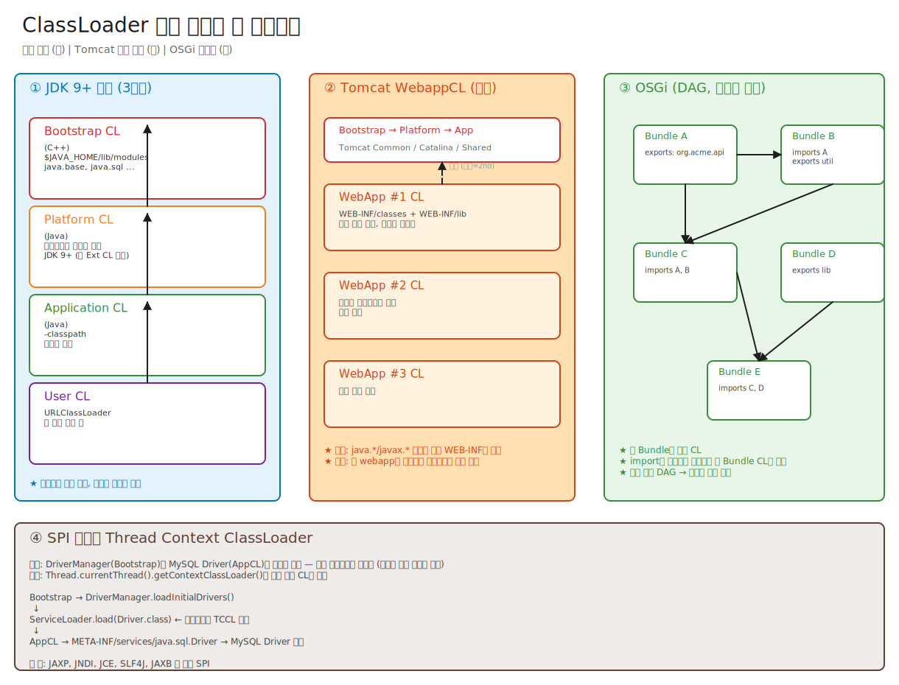

# 01-02. ClassLoader 계층 — 일반 Spring Boot 앱 기준 완전 해부

> "ClassLoader가 부모 위임 모델로 동작한다"는 한 줄은 답이 아니라 **시작**이다.
> 일반 Spring Boot 앱(`java -jar app.jar`) 한 번 띄울 때:
> - 어떤 CL이 몇 개 만들어지고, 각자 어디서 어떤 클래스를 가져오며,
> - fat jar 안 폴더(`BOOT-INF/classes`, `BOOT-INF/lib`)와 CL이 어떻게 대응되고,
> - 왜 이렇게 설계됐고,
> - 로딩이 망가지면 어떤 에러(`ClassNotFoundException` / `NoClassDefFoundError` / `LinkageError` 등)가 어디서 어떻게 튀어나오는지
>
> 까지를 끝까지 그릴 수 있어야 한다. JDBC DriverManager가 왜 `ThreadContextClassLoader`로 일반 위임을 우회하는지도 같은 맥락에서 풀린다.

---

## 🗺️ JVM 라이프사이클 안에서 이 챕터의 위치

이 챕터는 클래스 라이프사이클 5단계 중 **Loading** — `.class` bytes를 메모리로 가져와 `InstanceKlass`로 변환하는 단계의 **주체(누가)** 를 다룬다.


```
   .java  ──javac──►  .class
                          │
                          ▼  ★ 이 챕터 ★ — ClassLoader가 .class를 어떻게 찾고, 누가 부모이고, 위임 모델
                      Loading
                          │
                          ▼
                      Linking (Verify, Prepare, Resolve)  → [03-linking](./03-linking.md)
                          │
                          ▼
                      Initialization (<clinit>)            → [04-initialization-and-unload](./04-initialization-and-unload.md)
                          │
                          ▼
                      Usage → Unloading
```

**이전 챕터와의 연결**:
- ← [01-classfile-format](./01-classfile-format.md): 이 챕터의 **입력**(`.class` 파일의 구조)이 무엇인지.
- → 이 챕터의 **출력**: `defineClass`가 만든 `InstanceKlass` — Metaspace에 저장됨. 풀버전은 [02-runtime-data-areas/02-metaspace](../02-runtime-data-areas/02-metaspace-and-class-space.md).

### 🎯 책임 경계 — ClassLoader는 "Loading까지만" 한다

> 4개 챕터 전체의 책임 경계는 [README.md의 책임 경계 표](./README.md#-가장-헷갈리는-한-가지--누가-무엇을-하는가-책임-경계)에 박혀있다. 여기서는 **ClassLoader의 책임 범위**를 명확히 못박는다.

| ClassLoader가 하는 일 | ClassLoader가 **안 하는** 일 |
|---|---|
| `.class` 바이트 찾기 (디스크/네트워크/jar) | Verification(타입 안전성 증명) → **JVM 본체**가 함 → 03장 |
| `defineClass()` 호출 → `Class` 객체 생성 | Preparation(static 필드 default 세팅) → **JVM 본체** → 03장 |
| 부모 위임 (parent delegation) | Resolution(심볼릭 → 직접 레퍼런스) → **JVM 본체** → 03장 |
| `loadClass()`의 자기 락 (parallel-capable일 때 per-class name 락) | **`<clinit>` 실행, JLS 12.4.2 12-step init lock** → **JVM Initializer** → 04장 |

#### 자주 헷갈리는 두 가지

1. **"ClassLoader.loadClass()가 끝났다" ≠ "클래스가 초기화됐다"**
   `loadClass()`는 Loading만 보장. 클래스가 **Class 객체로 메모리에 올라와 있어도, 누가 Active Use(`new`, `getstatic` 등)를 트리거하기 전까진 `<clinit>`은 안 돈다**.
   → `Class.forName(name, false, loader)`가 동작하는 근본 이유.

2. **ClassLoader가 쓰는 락 ≠ Initialization 락**
   - ClassLoader 자기 락 (parallel CL): `loadClass(name)` 호출의 동시성 보호 — **이름 단위** 락
   - Initialization 락 (`InstanceKlass._init_lock`): `<clinit>` 실행 게이트 — **Class 객체 단위** 락, JVM이 잡음, 04장에서 다룸
   둘은 완전히 다른 락, 다른 시점에 등장.

핵심 한 줄: **ClassLoader는 "어디서 가져오나"를 책임지고, "어떻게 검증·초기화하나"는 JVM 본체가 책임진다.**

---

## 📍 학습 목표

1. JDK 9 이전(3계층)과 이후(Bootstrap/Platform/App) ClassLoader 변화를 안다.
2. 부모 위임 모델(parent delegation)의 **두 가지 보장**(중복 방지 + 보안)을 설명할 수 있다.
3. 일반 Spring Boot fat jar 구조와 `LaunchedURLClassLoader`가 어디서 등장하는지, 각 CL이 무엇을 어떻게 로드하는지 안다.
4. JDBC DriverManager가 ThreadContextClassLoader를 쓰는 SPI 패턴을 안다.
5. Spring Boot 앱에서 로딩 시 발생하는 실전 에러(`ClassNotFoundException`, `NoClassDefFoundError`, `LinkageError`, `NoSuchMethodError`, `ClassCastException`, 버전 충돌)의 원인과 진단법을 안다.
6. ClassLoader 누수(memory leak)의 원리와 진단법을 안다 (특히 Spring DevTools, JDBC Driver).
7. `defineClass`와 `findClass`의 차이, `loadClass` 호출 흐름을 코드로 그릴 수 있다.

---

## 📖 용어 사전 — 이 문서를 처음 보는 사람을 위한 핵심 단어

> 아래 단어들이 본문 전반에 깔려 있다. 한 번에 다 외울 필요는 없고, 본문을 읽다가 모르는 단어가 나오면 여기로 돌아와 확인하면 된다.

### 기본 용어

| 용어 | 한 줄 정의 | 본질 (왜 존재) |
|---|---|---|
| **ClassLoader (CL)** | `.class` 파일(바이트 묶음)을 JVM 메모리 안의 `Class<?>` 객체로 변환하는 컴포넌트. | 자바는 "필요할 때 클래스 가져오기(lazy loading)"를 지원해야 하고, 클래스를 어디서·누구 권한으로 가져왔는지 추적해야 한다. 그 추적자가 ClassLoader다. |
| **Bootstrap** | "(컴퓨터를 처음 켤 때처럼) 아무것도 없는 상태에서 가장 먼저 시동을 거는 단계" 라는 일반 단어. | 부팅(boot) = 부츠 끈 잡고 자기 자신 끌어올리기. 즉 "최초 출발점". |
| **Bootstrap ClassLoader** | JVM이 시동될 때 가장 먼저 등장하는 **최상위 CL**. `java.lang.Object`, `java.lang.String` 같은 자바 표준 핵심 클래스를 메모리로 올린다. | 자바로 작성된 ClassLoader는 그 자신도 ClassLoader가 로드해야 하는 모순(닭과 달걀). → JVM이 C++ 코드로 직접 만들어 둔 native CL이 필요하다. |
| **Platform CL** | JDK 9부터 등장. 자바 표준이지만 핵심은 아닌 모듈(`java.sql`, `java.xml` 등)을 담당. | JDK 9 모듈 시스템에서 "꼭 코어는 아니지만 표준인" 영역을 별도 CL로 분리하기 위해. |
| **Application CL (=System CL)** | 우리가 작성한 코드와 `-cp`/`-classpath`로 지정한 라이브러리 jar를 로드. 일상적으로 가장 많이 만나는 CL. | 사용자 코드는 표준 라이브러리와 다른 보안 등급·다른 라이프사이클이 필요하므로 분리. |
| **부모 위임 (Parent Delegation)** | "내가 로드하기 전에 부모 CL에게 먼저 물어본다"는 규칙. | 같은 클래스가 두 번 정의되는 것 방지 + 표준 라이브러리 위변조 방지. |

### Spring Boot 세계 용어

<details>
<summary><b>fat jar / BOOT-INF / LaunchedURLClassLoader가 뭔가요?</b> (펼치기)</summary>

| 용어 | 정의 | 한 줄 풀이 |
|---|---|---|
| **fat jar (executable jar)** | 의존성 라이브러리까지 모두 한 jar에 묶은 "혼자 돌아가는" jar. `java -jar app.jar` 한 줄로 실행. | 옛날엔 라이브러리들을 `lib/` 폴더에 풀어두고 `-cp lib/*` 해야 했지만, fat jar는 그게 다 jar 안에 들어 있다. |
| **BOOT-INF/classes** | Spring Boot fat jar 안에서 **내 프로젝트 코드**가 들어가는 디렉터리. | 예: 내가 짠 `com.example.shop.OrderController` 등. |
| **BOOT-INF/lib** | Spring Boot fat jar 안에서 **의존성 jar(중첩 jar)**가 들어가는 디렉터리. | 예: `spring-core-6.1.x.jar`, `hibernate-core-6.4.x.jar`, `jackson-databind-2.x.jar`. |
| **`org/springframework/boot/loader/`** | fat jar 가장 바깥에 있는 **Spring Boot 부트 로더 클래스들**. 표준 JVM이 이걸 먼저 실행해서 진짜 앱 부팅을 시작한다. | `Main-Class`로 지정된 `JarLauncher`가 여기 있다. |
| **JarLauncher / `Main-Class`** | `META-INF/MANIFEST.MF`에 적힌, JVM이 가장 먼저 실행하는 클래스. Spring Boot fat jar에서는 `org.springframework.boot.loader.JarLauncher`. | "표준 jar 실행 → 내부 nested jar 풀기 → 진짜 메인 클래스 호출"의 다리 역할. |
| **LaunchedURLClassLoader** | `JarLauncher`가 만드는 커스텀 `URLClassLoader`. `BOOT-INF/classes` + `BOOT-INF/lib/*.jar`를 URL 후보로 등록. | AppClassLoader의 **자식 CL**. 우리 코드와 의존성 라이브러리는 전부 여기서 로드된다. |
| **`Start-Class`** | manifest에 적힌 "원래 우리가 작성한 `@SpringBootApplication` 클래스". `JarLauncher`가 이걸 reflection으로 호출해 진짜 앱을 시작. | 예: `com.example.shop.ShopApplication`. |

**한 줄 요약**: Spring Boot fat jar = "JVM이 표준 jar 실행 절차로 `JarLauncher`를 먼저 시작 → 그게 `LaunchedURLClassLoader`를 만들어 `BOOT-INF` 내용을 읽음 → 거기서 `Start-Class`를 호출하면 우리가 아는 Spring 부팅 시작" 이라는 두 단계 부팅 구조.

</details>

<details>
<summary><b>Spring DevTools / RestartClassLoader가 뭔가요?</b> (펼치기)</summary>

| 용어 | 정의 |
|---|---|
| **Spring DevTools** | 개발 편의 라이브러리(`spring-boot-devtools`). 코드를 저장하면 앱을 **빠르게 재시작**해 변경을 반영. |
| **RestartClassLoader** | DevTools가 만드는 "내 코드 + DevTools가 감지하는 변경 가능 영역" 전용 CL. 매 재시작마다 새로 만들어진다. |
| **Base ClassLoader** | "거의 안 바뀌는" 의존성(Spring/Hibernate/Jackson 등)을 들고 있는 CL. 재시작해도 살아남음. |

**왜 둘로 쪼개나?** 매번 모든 라이브러리를 다시 로드하면 재시작이 느리다. "잘 안 바뀌는 의존성"은 Base CL에 두고 살려두고, "내가 자주 고치는 내 코드"만 RestartCL에 넣어 그것만 새로 만들면 된다. 단점: 이 분리 때문에 **`ClassCastException`이나 CL 누수**가 자주 생긴다(뒤에서 다룸).

</details>

<details>
<summary><b>Thread Context ClassLoader / SPI가 뭔가요?</b> (펼치기)</summary>

| 용어 | 정의 | 한 줄 풀이 |
|---|---|---|
| **SPI (Service Provider Interface)** | "표준 인터페이스는 JDK가 정의하고, 실제 구현체(provider)는 외부 라이브러리가 끼워 넣는다"는 자바의 플러그인 패턴. | 예: `java.sql.Driver`는 표준 인터페이스, 실제 `com.mysql.cj.jdbc.Driver`는 MySQL이 제공. 누가 끼울지 컴파일 시점에 모름. |
| **API vs SPI** | API = "내가 사용하라고 노출한 표면". SPI = "남이 끼워서 확장하라고 노출한 슬롯". | API는 "내가 부른다", SPI는 "내가 불려진다". |
| **ServiceLoader** | `META-INF/services/<인터페이스 FQCN>` 파일을 읽어 구현체를 찾아주는 JDK 표준 SPI 로더(JDK 6+). | `ServiceLoader.load(Driver.class)` 한 줄로 classpath의 모든 Driver 구현 검색. |
| **Thread Context ClassLoader (TCCL)** | `Thread` 객체마다 1개씩 들고 있는 "이 스레드의 작업 맥락에서 쓰일 CL". `Thread.currentThread().setContextClassLoader(cl)`로 지정. | 부모-자식 위임 트리만으로는 "Bootstrap이 자식 CL의 코드를 봐야 하는" SPI 시나리오를 풀 수 없어 도입한 우회로. |

**SPI가 왜 ClassLoader 문제를 만드나?**
1. `DriverManager`(SPI 표준) → Bootstrap이 로드.
2. `MySQL Driver`(provider 구현) → App CL이 로드 (사용자 classpath).
3. 부모 위임은 자식→부모 방향만 본다. Bootstrap 입장에서 App CL은 자식 → 자기 자손에게 묻는 경로가 위임 모델에 없음.
4. → "현재 스레드가 일하는 맥락의 CL"을 별도 슬롯에 박아두자 → TCCL.

</details>

<details>
<summary><b>그 외 자주 나오는 짧은 용어</b> (펼치기)</summary>

- **`jrt:/`**: JDK 9+에서 표준 모듈 클래스를 가리키는 URL 스킴. `jrt:/java.base/java/lang/String.class` 식. 디스크에는 `lib/modules` 하나의 jimage 파일로 묶여 있다.
- **jimage**: JDK 9 모듈을 묶는 자체 포맷(zip 대체). 부팅 속도와 메모리 사용량을 최적화하기 위해 도입.
- **ClassLoaderData (CLD)**: 각 ClassLoader에 1:1로 붙는 HotSpot 내부 C++ 구조. 이 CL이 로드한 클래스·Metaspace chunk를 관리.
- **Metaspace**: JDK 8+에서 클래스 메타데이터(Klass, Method, ConstantPool)를 두는 영역. CLD 단위로 chunk 할당 → CL이 GC되면 통째로 해제.
- **PermGen**: JDK 7 이하의 옛 클래스 메타데이터 영역. 고정 크기 → `OutOfMemoryError: PermGen` 악명. JDK 8에서 Metaspace로 대체.
- **JPMS (Java Platform Module System)**: JDK 9에서 도입한 자바 표준 모듈 시스템(JEP 261). `module-info.java` + `requires`/`exports`.

</details>

---

## 🎨 1단계: 백지 그리기 가이드

### Step 1: 좌측 — JDK 9+ 표준 ClassLoader 계층

> **왜 JDK 9+를 먼저 그리는가**
> 2026년 현재 LTS 자바는 17과 21. 둘 다 JDK 9의 3계층(`Bootstrap → Platform → Application`)을 그대로 쓴다. 즉 **요즘 운영 환경의 사실상 표준**이라서 이걸 기본 골격으로 잡는다.
> JDK 8 이하의 옛 3계층(`Bootstrap → Extension → System`)은 같은 자리에 `Extension` 대신 `Platform`이 들어간 형태라서, 9+ 를 익히면 8을 거꾸로 읽기는 쉽다. (역사 디테일은 아래 토글에서)

세로 트리:
```
        [Bootstrap CL] (C++)
              ↑
        [Platform CL]
              ↑
        [Application CL]
              ↑
        [User-defined CL ...]
```

각 CL 박스 옆에 "어디서 로드?" 메모.

<details>
<summary><b>그럼 Spring Boot에서 가져오는 라이브러리는 Platform CL에 들어가나? (자주 헷갈리는 포인트)</b> (펼치기)</summary>

**아니다. Application CL에 들어간다.** Platform CL은 JDK가 자체 제공하는 표준 모듈(`java.sql`, `java.xml`, `java.naming` 등)만 담당하는 **JDK 내부 슬롯**이라, Maven/Gradle로 가져오는 외부 라이브러리는 절대 들어가지 않는다.

| CL | 로드 대상 | 우리가 만지는 영역? |
|---|---|---|
| **Bootstrap** | `java.base` (`java.lang.*`, `java.util.*` 등 JDK 코어) | ❌ JDK 고정 |
| **Platform** | `java.sql`, `java.xml`, `java.naming`, `java.logging` 등 JDK 표준 비핵심 모듈 | ❌ JDK 고정 (Maven/Gradle로 못 넣음) |
| **Application** | `-cp` / `--module-path` / fat jar 안의 모든 외부 jar | ✅ Spring, Hibernate, Jackson, Lombok, **내 코드 전부** |

**Spring Boot fat jar의 경우 한 단계 더**

`java -jar app.jar` 형태의 Spring Boot fat jar는 안쪽에 사용자 라이브러리를 nested로 둔다:
```
app.jar
├─ org/springframework/boot/loader/   ← 부트로더 (AppCL이 로드)
├─ BOOT-INF/classes/                  ← 내 코드
└─ BOOT-INF/lib/                      ← Spring, Hibernate 등 의존성 jar들
```
이걸 풀려고 Spring Boot가 직접 만든 `LaunchedURLClassLoader`(AppCL의 자식)가 `BOOT-INF/lib/*.jar`를 읽는다. 실제 계층은:
```
Bootstrap → Platform → Application → LaunchedURLClassLoader → (Spring, Hibernate, 내 코드)
                                       ↑ Spring Boot가 만든 커스텀 CL
```
일반 `mvn spring-boot:run` 또는 IDE 실행이면 fat jar 풀 일이 없어 그냥 AppCL이 직접 모든 의존성을 로드.

**직접 확인하는 코드**

```java
System.out.println(java.sql.Connection.class.getClassLoader());
// → jdk.internal.loader.ClassLoaders$PlatformClassLoader@xxxx  (Platform)

System.out.println(org.springframework.context.ApplicationContext.class.getClassLoader());
// → org.springframework.boot.loader.LaunchedURLClassLoader@xxxx  (fat jar 실행)
// → jdk.internal.loader.ClassLoaders$AppClassLoader@xxxx        (IDE / plain Spring 실행)

System.out.println(MyController.class.getClassLoader());
// → LaunchedURLClassLoader 또는 AppClassLoader (위와 동일)
```

**오해 정정 — "표준 라이브러리니까 Platform 아닐까?"라는 함정**
- `java.sql.Driver` (인터페이스) → **Platform CL** (JDK가 정의한 표준 API라서)
- `com.mysql.cj.jdbc.Driver` (구현) → **Application CL** (외부 라이브러리라서)
- 둘은 부모-자식 관계의 다른 CL에서 정의된다. 이 비대칭이 뒤에 나올 **TCCL/SPI** 문제의 출발점이다.

</details>

<details>
<summary><b>JDK 8 이하의 옛 3계층 (Extension CL)은 어디 갔나?</b> (펼치기)</summary>

```
JDK 1.2 ~ 8                          JDK 9+
─────────────                        ─────────────
[Bootstrap CL] (C++)                 [Bootstrap CL] (C++)
  로드: rt.jar (60MB 한 덩어리)         로드: $JAVA_HOME/lib/modules의 java.base 등 핵심 모듈
       i18n.jar 등
        ↑                                  ↑
[Extension CL]                       [Platform CL]      ★ 이름과 역할이 바뀜
  로드: $JAVA_HOME/lib/ext/*.jar       로드: java.sql, java.xml, java.naming 등 비핵심 표준 모듈
       (보안 확장, 암호 알고리즘 등)         (lib/ext 디렉터리 자체가 폐기됨)
        ↑                                  ↑
[System CL = AppClassLoader]         [Application CL = AppClassLoader]
  로드: -cp / CLASSPATH                 로드: -cp / --module-path
```

**무엇이 바뀐 이유**
1. **rt.jar 해체 (JEP 220)**: 60MB짜리 한 jar가 부팅·메모리·보안에 비효율 → 모듈로 잘게 분리.
2. **Extension 메커니즘 폐기 (JEP 220)**: `lib/ext`에 jar를 떨궈서 모든 자바 앱에 강제 주입하는 방식이 보안 위험. 더 이상 사용 불가.
3. **이름 변경**: `sun.misc.Launcher$AppClassLoader` (JDK 8 이하) → `jdk.internal.loader.ClassLoaders$AppClassLoader` (JDK 9+). 기존 reflection 코드가 깨지는 흔한 마이그레이션 이슈.

**JDK 1.0 ~ 1.1 (1996~1998)**
- 단일 ClassLoader. 부모 위임 모델 없음.
- "샌드박스" 보안 = 모든 클래스 같은 권한.
- 1998년 JDK 1.2부터 3계층 + 위임 모델 도입 → 오늘날 우리가 아는 형태의 시작.

**왜 우리가 이 역사를 알아야 하나?**
- 운영 중인 시스템이 JDK 8을 쓰고 있을 가능성이 매우 높다 (2026년 기준에도 적지 않음).
- 오래된 라이브러리(특히 Java EE 5/6 시절 코드)가 `sun.misc.Launcher$ExtClassLoader`를 reflection으로 접근 → JDK 9+에서 `ClassNotFoundException` 또는 `IllegalAccessError`.
- Tomcat이 깨는 위임도 이 옛 모델 위에서 설계된 거라서, "왜 Catalina CL이 AppCL 아래에 또 있나?" 같은 질문의 답이 옛 구조에서 나온다.

</details>

### Step 2: 우측 — Spring Boot fat jar의 실제 계층

```
        [Bootstrap CL]                  ← JVM 코어 (java.base)
              ↑
        [Platform CL]                   ← JDK 표준 비핵심 (java.sql, java.xml ...)
              ↑
        [Application CL]                ← java -jar로 띄운 fat jar의 "겉껍데기".
                                          org/springframework/boot/loader/*만 본다.
              ↑
        [LaunchedURLClassLoader]        ← AppCL이 만드는 자식 CL.
                                          BOOT-INF/classes(내 코드) +
                                          BOOT-INF/lib/*.jar(의존성 jar들)을 본다.
```

화살표 메모:
- 위로 향하는 화살표는 모두 **표준 부모 위임**(자식이 먼저 부모에게 물어봄). 일반 Spring Boot 앱은 이 모델을 그대로 따른다.
- "왜 LaunchedURLClassLoader가 필요한가" 옆에 메모: **jar 안의 jar는 표준 JVM이 직접 못 푼다** → Spring Boot가 자기 CL을 끼워 넣어야 함.

### Step 3: 우상단 — SPI + ThreadContextCL

DriverManager(Platform/Bootstrap 영역에서 정의)가 ServiceLoader로 MySQL Driver(`BOOT-INF/lib`에 있음 → LaunchedURLClassLoader가 로드)를 어떻게 찾는지, 일반 위임 트리로는 왜 안 되는지를 작은 화살표로 표시.

### 정답 그림



> 편집은 [02-classloader-hierarchy.excalidraw](./_excalidraw/02-classloader-hierarchy.excalidraw)을 [excalidraw.com](https://excalidraw.com/)에서 "Open"으로.

---

## 🧠 2단계: 직관

### 핵심 비유

> 도서관 비유:
> - 시립 도서관(Bootstrap) ← 학교 도서관(Platform) ← 학과 도서관(Application) ← 개인 책장(User)
> - 책(클래스)을 찾을 때 "내가 있는 가장 가까운 책장에서 찾기 전에, **항상 시립부터 묻고 내려와라**"
> - 이유: 시립이 들고 있는 표준 책을, 학교가 자기 카피본으로 덮어쓰면 일관성이 깨진다.

### 부모 위임의 두 가지 보장

> 1. **보안 (Class spoofing 방지)**:
>    공격자가 `java.lang.String`이라는 이름의 악성 클래스를 만들어 classpath에 두어도, AppCL이 먼저 Bootstrap에 위임 → Bootstrap이 진짜 String 로드 → 가짜 무시.
>
> 2. **유일성 (Type identity)**:
>    JVM은 **클래스 = (이름, 정의한 ClassLoader)** 라는 쌍으로 식별한다. 부모 위임은 같은 클래스가 여러 CL에 의해 정의되는 것을 막아 type identity를 유지.

### "표준 위에 한 겹 더 얹는 패턴"

일반 Spring Boot 앱이 깨는 곳은 거의 없다. 그 대신 표준 3계층 **위에 자기 전용 CL을 한 겹 더 얹어** 자기 문제를 푼다.

- **Spring Boot `LaunchedURLClassLoader`**: fat jar 안에 jar가 또 있는 "중첩 jar" 구조. 표준 JVM은 jar 안 jar를 못 읽음 → Spring Boot가 자기 CL을 만들어 `BOOT-INF/lib/*.jar`를 URL 후보로 등록. 위임 방향은 일반 그대로(부모 먼저).
- **Spring DevTools `RestartClassLoader`**: "자주 바뀌는 내 코드 / 잘 안 바뀌는 의존성"을 두 CL로 분리. 재시작할 때 RestartCL만 새로 만들면 빠르다.
- **JDBC DriverManager (SPI)**: `java.sql.DriverManager`는 Platform CL이, `com.mysql.cj.jdbc.Driver`는 LaunchedURLClassLoader가 로드. 부모(Platform)가 자식(LaunchedURL)의 코드를 찾아야 한다 → 일반 위임으로 못 풀어 **ThreadContextClassLoader**라는 사이드채널을 쓴다.

이 세 가지가 일반 Spring Boot 앱에서 실제로 만나는 ClassLoader 변주의 전부. 본문은 이 셋을 차례로 자세히 파고든다.

---

## 🔬 3단계: 구조

### JDK 9+ 표준 3계층

| ClassLoader | 클래스 | 무엇을 로드 | 부모 |
|---|---|---|---|
| **Bootstrap** | (C++ HotSpot 내장) | `$JAVA_HOME/lib/modules`의 핵심 모듈 (`java.base`, `java.sql`, `java.xml` ...) | (없음) |
| **Platform** | `jdk.internal.loader.ClassLoaders$PlatformClassLoader` | 비핵심 표준 모듈, JDK 모듈 | Bootstrap |
| **Application** | `jdk.internal.loader.ClassLoaders$AppClassLoader` | `-classpath`, `-cp`, `--module-path`, `CLASSPATH` env | Platform |

JDK 8 이전:
- Bootstrap → Extension(`$JAVA_HOME/lib/ext`) → System(=Application)
- JDK 9에서 Extension 폐기 (모듈 시스템으로 대체), Platform CL이 그 역할.

### `getClassLoader()` 결과

```java
String.class.getClassLoader();   // null  (Bootstrap은 null 반환 — 약속)
javax.transaction.xa.XAResource.class.getClassLoader();
                                  // PlatformClassLoader
MyClass.class.getClassLoader();   // AppClassLoader
new URLClassLoader(...).getClass().getClassLoader();
                                  // AppClassLoader (이 CL을 정의한 CL)
```

> 함정: Bootstrap이 `null`인 이유 — Bootstrap은 Java 객체가 아니다(C++).  
> `null`을 "부모 없음"으로도 동시에 표현. JLS의 약속.

### 부모 위임 알고리즘

```java
// ClassLoader.java (JDK 21, 핵심)
protected Class<?> loadClass(String name, boolean resolve)
        throws ClassNotFoundException {
    synchronized (getClassLoadingLock(name)) {
        // 1. 이미 로드된 클래스인지 확인
        Class<?> c = findLoadedClass(name);

        if (c == null) {
            try {
                // 2. 부모에게 위임 (★ 핵심 ★)
                if (parent != null) {
                    c = parent.loadClass(name, false);
                } else {
                    // Bootstrap이 부모면 native로
                    c = findBootstrapClassOrNull(name);
                }
            } catch (ClassNotFoundException e) {
                // 부모가 못 찾았다 — 정상. 내가 찾으면 됨.
            }

            if (c == null) {
                // 3. 부모가 못 찾았으면 내가 찾는다
                long t1 = System.nanoTime();
                c = findClass(name);  // ★ subclass에서 override ★

                // record metrics
            }
        }
        if (resolve) {
            resolveClass(c);
        }
        return c;
    }
}
```

### 같은 클래스의 두 가지 정의 = 다른 타입

```java
// 같은 이름이지만 다른 ClassLoader가 로드 → 다른 Class 객체 → ClassCastException
URLClassLoader cl1 = new URLClassLoader(new URL[]{...});
URLClassLoader cl2 = new URLClassLoader(new URL[]{...});

Class<?> c1 = cl1.loadClass("com.example.Foo");
Class<?> c2 = cl2.loadClass("com.example.Foo");

c1 == c2;  // false!
c1.cast(c2.newInstance());  // ClassCastException
```

JVM의 클래스 동등성:
```
identity(Class) = (name, defining ClassLoader)
```

### `findClass` vs `defineClass` vs `loadClass`

| 메서드 | 누가 호출? | 역할 |
|---|---|---|
| `loadClass(name)` | 외부에서 호출 (보통 JVM) | 위임 알고리즘 실행 |
| `findClass(name)` | `loadClass`가 내부적으로 호출 | 실제로 .class 바이트 찾기 (subclass가 override) |
| `defineClass(name, bytes, ...)` | `findClass`가 내부에서 | byte[]를 `Class<?>` 객체로 변환 (native call) |

### 커스텀 ClassLoader 작성

```java
public class MyClassLoader extends ClassLoader {
    private final Path baseDir;

    public MyClassLoader(Path baseDir, ClassLoader parent) {
        super(parent);
        this.baseDir = baseDir;
    }

    @Override
    protected Class<?> findClass(String name) throws ClassNotFoundException {
        try {
            Path path = baseDir.resolve(name.replace('.', '/') + ".class");
            byte[] bytes = Files.readAllBytes(path);
            return defineClass(name, bytes, 0, bytes.length);
        } catch (IOException e) {
            throw new ClassNotFoundException(name, e);
        }
    }
}
```

> 일반적 패턴: `findClass`만 override, `loadClass`는 그대로 두면 표준 위임 모델 유지.

---

### 🏗️ 일반 Spring Boot 앱의 부팅·로딩 전체 흐름

이게 이 챕터의 메인이다. `java -jar app.jar` 한 줄로 시작했을 때 안에서 일어나는 일을 끝까지 따라간다.

#### 0) 빌드 결과물 — fat jar 안 폴더 구조

Gradle/Maven으로 `bootJar` / `package`를 돌리면 다음 구조의 jar가 나온다:

```
shop-1.0.0.jar                                        ← java -jar의 인자
├── META-INF/
│   └── MANIFEST.MF                                   ★ 표준 jar 매니페스트
│         Main-Class: org.springframework.boot.loader.JarLauncher
│         Start-Class: com.example.shop.ShopApplication
│         Spring-Boot-Classes: BOOT-INF/classes/
│         Spring-Boot-Lib: BOOT-INF/lib/
├── org/springframework/boot/loader/                  ★ Spring Boot 부트 로더 (압축 안 됨)
│   ├── JarLauncher.class
│   ├── LaunchedURLClassLoader.class
│   ├── archive/JarFileArchive.class
│   └── jar/JarFile.class
├── BOOT-INF/
│   ├── classes/                                      ★ 내가 짠 코드
│   │   ├── com/example/shop/ShopApplication.class
│   │   ├── com/example/shop/OrderController.class
│   │   ├── application.yml
│   │   └── templates/ ...
│   └── lib/                                          ★ 의존성 jar들 (중첩 jar)
│       ├── spring-core-6.1.5.jar
│       ├── spring-boot-3.2.3.jar
│       ├── hibernate-core-6.4.4.jar
│       ├── jackson-databind-2.16.1.jar
│       ├── mysql-connector-j-8.3.0.jar
│       └── ... (수십~수백 개)
```

핵심:
- `Main-Class`는 우리가 만든 `ShopApplication`이 아니라 **Spring Boot의 `JarLauncher`**.
- 진짜 메인 `@SpringBootApplication` 클래스는 `Start-Class`에 따로 적혀 있다 (`JarLauncher`가 reflection으로 호출).
- `BOOT-INF/lib`의 jar들은 일반 jar 안에 들어 있는 **중첩 jar**다. 표준 JVM은 이걸 직접 못 푼다 → Spring Boot가 자기 CL을 끼워 넣어 푼다.

#### 1) JVM 부팅 — `java -jar shop-1.0.0.jar`가 한 일

```
시간 ──────────────────────────────────────────────────────────────►

[a] OS가 java 바이너리 실행
       ↓
[b] HotSpot이 부팅하며 Bootstrap CL 만듦 (C++ 코드, java.base 로드)
       ↓
[c] Bootstrap이 Platform CL을 만듦 (java.sql 등 비핵심 표준 모듈 준비)
       ↓
[d] Platform이 Application CL을 만듦 (-cp / jar 매니페스트 해석)
       ↓
[e] AppCL이 MANIFEST의 Main-Class = "JarLauncher"를 로드 → main() 호출
       ↓
[f] JarLauncher가 LaunchedURLClassLoader(부모=AppCL) 생성
       ↓
[g] LaunchedURLClassLoader가 BOOT-INF/lib/*.jar + BOOT-INF/classes를 URL 후보로 등록
       ↓
[h] JarLauncher가 Thread Context CL을 LaunchedURLClassLoader로 설정
       ↓
[i] JarLauncher가 Start-Class("ShopApplication")를 LaunchedURLClassLoader로 로드 + main() reflection 호출
       ↓
[j] ShopApplication.main()이 SpringApplication.run(...) 호출 → 우리가 아는 부팅 시작
```

[a]~[e]는 모든 자바 앱이 똑같다. **[f]부터가 Spring Boot 고유**. 이 단계 덕에 `BOOT-INF/lib` 안의 jar들이 클래스패스에 잡힌다.

#### 2) 각 CL의 역할과 실제 로드되는 클래스 예시

| CL | 부모 | 어디서 클래스 가져오나 | 실제 로드 예시 |
|---|---|---|---|
| **Bootstrap CL** | (없음) | `$JAVA_HOME/lib/modules`의 `java.base` 등 핵심 모듈 | `java.lang.Object`, `java.lang.String`, `java.util.HashMap`, `java.lang.Thread`, `java.io.File` |
| **Platform CL** | Bootstrap | `$JAVA_HOME/lib/modules`의 비핵심 표준 모듈 | `java.sql.Connection`, `java.sql.DriverManager`, `java.xml.parsers.SAXParser`, `java.naming.InitialContext`, `java.util.logging.Logger` |
| **Application CL** | Platform | fat jar 자체 + `-cp` (실제로는 fat jar 1개만) | `org.springframework.boot.loader.JarLauncher`, `org.springframework.boot.loader.LaunchedURLClassLoader` 그 자체 |
| **LaunchedURLClassLoader** | Application | `BOOT-INF/classes/` + `BOOT-INF/lib/*.jar` | `com.example.shop.ShopApplication`, `com.example.shop.OrderController`, `org.springframework.context.ApplicationContext`, `org.hibernate.SessionFactory`, `com.fasterxml.jackson.databind.ObjectMapper`, `com.mysql.cj.jdbc.Driver` |

> **확인 코드**
> ```java
> System.out.println(String.class.getClassLoader());                 // null  (Bootstrap)
> System.out.println(java.sql.Connection.class.getClassLoader());    // PlatformClassLoader
> System.out.println(JarLauncher.class.getClassLoader());            // AppClassLoader
> System.out.println(ShopApplication.class.getClassLoader());        // LaunchedURLClassLoader
> System.out.println(com.mysql.cj.jdbc.Driver.class.getClassLoader());// LaunchedURLClassLoader
> ```

#### 3) `BOOT-INF/lib`의 jar 하나를 로드하는 순간

내 코드가 `new ObjectMapper()`를 호출하면:

```
1. JVM이 "com.fasterxml.jackson.databind.ObjectMapper" 클래스 필요 인식
2. 호출한 클래스(OrderController)를 정의한 CL = LaunchedURLClassLoader에 loadClass 위임
3. LaunchedURLClassLoader.loadClass("com.fasterxml.jackson.databind.ObjectMapper"):
   a. findLoadedClass — 캐시 확인 (이미 로드됐나)
   b. parent.loadClass — Application CL에 위임
      → AppCL: Platform → Bootstrap 다 묻고 "없음"
   c. ★ 이제 내가 찾는다 ★ findClass:
      → URL 후보 목록 순회: BOOT-INF/lib/jackson-databind-2.16.1.jar 에서
        com/fasterxml/jackson/databind/ObjectMapper.class 의 byte[] 추출
      → defineClass(byte[], LaunchedURLClassLoader) → InstanceKlass 생성
   d. Metaspace에 ClassLoaderData(LaunchedURLClassLoader)의 chunk로 적재
4. Linking (Verify → Prepare → Resolve)
5. Initialization (static 블록, static 필드 초기화)
6. 호출자에게 Class<?> 반환
```

> 이 순서가 일반 Spring Boot 앱에서 **모든 외부 라이브러리 클래스가 메모리에 올라오는 표준 경로**다. 외워두면 로딩 에러 진단할 때 어느 단계에서 깨졌는지 짚을 수 있다.

#### 4) 왜 Spring Boot는 굳이 이렇게 설계했나

| 만약 fat jar가 아니라면? | 실제로 일어나는 문제 |
|---|---|
| 의존성 jar들을 별도 `lib/` 디렉터리에 풀어두기 | 배포·실행 시 `-cp lib/*` 같은 길고 깨지기 쉬운 명령. Docker 이미지에 파일이 수백 개로 늘어남. |
| 모든 클래스를 한 jar에 풀어 합치기(shade) | 같은 패키지의 다른 버전이 섞이면 정의 충돌. `META-INF/services` 같은 SPI 등록 파일이 jar별로 다른데 이름이 같아 덮어쓰기. |
| 표준 `URLClassLoader`로 nested jar 읽기 | 불가. 표준 `URLClassLoader`는 "jar 안의 jar"를 못 본다. |

→ Spring Boot는 **fat jar 구조를 유지하면서 클래스패스 시맨틱은 깨지지 않게** 하려고, jar 안의 jar를 풀 수 있는 자기 CL을 끼웠다.

#### 5) Spring DevTools가 켜졌을 때 — CL이 두 개로 쪼개진다

`spring-boot-devtools` 의존성을 추가하고 IDE에서 실행하면 CL 구조가 한 단계 더 늘어난다:

```
[Bootstrap] → [Platform] → [Application]
                              ↓
                  [Base ClassLoader]          ← jar 의존성 (변경 거의 안 됨)
                       Spring, Hibernate, Jackson ...
                              ↓
                  [Restart ClassLoader]       ← 매 재시작마다 새로 생성
                       내 코드 (BOOT-INF/classes 또는 IDE의 build/classes)
```

코드 저장 → DevTools가 `RestartClassLoader`만 버리고 새로 생성 → 내 코드만 다시 로드. Base CL은 그대로 살아남음 → 재시작 빠름.

> **DevTools 분리의 부작용**:
> - `instanceof` 가 거짓이 됨. 예: 내 코드의 `Order`가 Base에 있는 캐시 라이브러리에 들어갔다가 재시작하면, 캐시 안 `Order`(옛 RestartCL)와 새 `Order`(새 RestartCL)가 다른 Class → `ClassCastException`.
> - 옛 RestartCL이 어딘가에 참조되면 GC 안 됨 → **Metaspace 누수** (재시작 10번 누적되면 `OutOfMemoryError: Metaspace`).

---

### 🔥 로딩이 망가졌을 때 — Spring Boot 앱에서 실제로 보는 에러들

이 챕터의 가장 실전적인 부분. 각 에러가 **어느 단계에서 어떤 이유로 발생**하고, **어떻게 진단**하는지.

<details>
<summary><b>① ClassNotFoundException — "그 클래스가 classpath에 없음"</b> (펼치기)</summary>

**언제 발생**: `loadClass`가 표준 위임을 다 돌고도 해당 이름의 `.class` 바이트를 못 찾았을 때. 보통 호출 코드가 명시적으로 `Class.forName(...)` 했거나 reflection을 썼을 때 표면화.

**전형적 원인**
1. 의존성이 빠짐. Maven `scope=provided`로 묶었는데 fat jar에 안 들어감.
2. 모듈명 오타. `com.fasterxml.jackson.databind.ObjectMappr` 같은 typo.
3. JDK 9+에서 옛 내부 클래스 reflection (`sun.misc.Launcher$ExtClassLoader`).
4. JPMS에서 `--add-modules`로 추가하지 않은 비기본 모듈.

**진단**
```bash
# fat jar 안에 실제로 있는지
unzip -l shop-1.0.0.jar | grep ObjectMapper

# 클래스가 어느 CL에서 보이는지
jcmd <pid> VM.classloaders
```

</details>

<details>
<summary><b>② NoClassDefFoundError — "컴파일 시점엔 있었는데 런타임에 없음"</b> (펼치기)</summary>

**ClassNotFoundException과의 차이**: ClassNotFoundException은 *지금 처음 찾는 중에 실패*. NoClassDefFoundError는 *과거에 로드는 됐는데 그 클래스의 초기화 등이 실패*했거나, *컴파일 때 보였던 클래스가 런타임 classpath에 없음*. JVM이 던지는 `Error` 계열.

**전형적 원인**
1. **연쇄적 초기화 실패**: 어떤 클래스 X의 `static {}` 블록이 예외를 던지면, 그 이후 X를 참조하는 모든 코드는 NoClassDefFoundError(첫 실패의 후속 증상)를 본다. 진짜 원인은 **첫 번째 발생한 ExceptionInInitializerError의 스택**.
2. **Provided scope 잘못 설정**: `javax.servlet-api`처럼 컨테이너가 제공한다고 가정한 jar가 실제 런타임엔 없음.
3. **버전 다운그레이드**: 컴파일은 Spring 6.1로 했는데 배포 클래스패스엔 6.0이 있어 추가된 클래스가 없음.

**진단**
```
스택에서 "Caused by: java.lang.ExceptionInInitializerError"부터 찾는다.
그게 진짜 원인. NoClassDefFoundError는 후속 증상.
```

</details>

<details>
<summary><b>③ LinkageError / IncompatibleClassChangeError — "같은 클래스 다른 버전 충돌"</b> (펼치기)</summary>

**언제 발생**: 같은 이름 클래스가 두 CL에서 정의됐는데 서로 다른 시그니처를 갖고 있을 때, 또는 인터페이스가 일치하지 않을 때.

**전형적 원인 (Spring Boot 실전)**
1. **transitive 의존성의 버전 충돌**:
   ```
   spring-data-jpa → spring-orm 6.1.x → spring-core 6.1.x
   직접 추가한 spring-core 6.0.x (오타로 버전 박았다고 가정)
   ```
   Maven/Gradle이 한 버전만 골라줘도, 어떤 jar는 6.1 시그니처를 가정한 채 컴파일됐는데 런타임은 6.0 → `NoSuchMethodError` 또는 `LinkageError`.
2. **DevTools의 두 CL에 같은 클래스가 동시에 들어감**: include/exclude 설정 잘못으로 `Order`가 Base와 Restart 양쪽에 정의 → `LinkageError: loader constraint violation`.

**진단**
```bash
# Gradle 의존성 트리에서 중복 버전 찾기
./gradlew dependencyInsight --dependency spring-core
# Maven
mvn dependency:tree -Dverbose | grep -A2 spring-core
```

</details>

<details>
<summary><b>④ NoSuchMethodError — "메서드가 없어졌거나 시그니처가 바뀜"</b> (펼치기)</summary>

**언제 발생**: 컴파일 시점에 있던 메서드가 런타임 클래스에선 사라졌거나 시그니처가 바뀐 경우. 거의 항상 **버전 불일치**.

**전형적 시나리오**
- 라이브러리 A를 2.0으로 컴파일했는데 B가 A 1.x를 trans-depend 해 1.x가 살아남음.
- Spring Boot 버전 올린 뒤 직접 추가한 third-party starter가 옛 Spring을 가정.

**디버깅 팁**: 에러 메시지에 적힌 클래스가 어느 jar에서 로드되는지 확인:
```java
URL u = SomeClass.class.getProtectionDomain().getCodeSource().getLocation();
System.out.println(u);  // → file:/.../BOOT-INF/lib/spring-core-6.0.x.jar!/
```

</details>

<details>
<summary><b>⑤ ClassCastException "X cannot be cast to X" — 같은 이름 다른 CL</b> (펼치기)</summary>

**언제 발생**: 같은 FQCN인데 다른 ClassLoader가 각각 정의한 Class 객체가 둘 있을 때. JVM 입장에서는 `(name, defining loader)` 쌍이 다르면 다른 타입.

**Spring Boot 실전 케이스**
1. **DevTools의 Restart/Base 경계 위반** (가장 흔함):
   ```
   Base CL의 Caffeine 캐시에 RestartCL의 Order 인스턴스를 put → 재시작 →
   새 RestartCL의 Order로 get 시도 → ClassCastException: Order cannot be cast to Order
   ```
2. **부모-자식 양쪽에 같은 jar**: 사용자 코드가 직접 `URLClassLoader`를 만들어 같은 jar를 등록. 그 CL이 로드한 클래스를 부모 CL의 메서드 시그니처(같은 FQCN)에 넘기면 캐스트 실패.

**진단**: 두 Class의 `getClassLoader()`를 출력해 비교.
```java
System.out.println(obj1.getClass().getClassLoader());
System.out.println(obj2.getClass().getClassLoader());
// 둘이 다르면 그게 원인.
```

</details>

<details>
<summary><b>⑥ ExceptionInInitializerError — static 초기화 실패의 첫 신호</b> (펼치기)</summary>

**언제 발생**: 클래스의 `<clinit>`(static 블록 + static 필드 초기화) 중 예외가 던져졌을 때.

**Spring Boot 실전**
- `application.yml`에서 가져오는 값으로 `static final` 필드 초기화 시도하다 NPE.
- JDBC 드라이버 static init에서 `DriverManager.registerDriver` 호출이 SecurityManager 등으로 차단.
- `@ConfigurationProperties` 클래스의 enum static 변환 실패.

**중요**: 한 번 `<clinit>` 실패한 클래스는 **그 CL의 수명 동안 영원히 실패한 상태**. 이후 그 클래스 접근은 모두 NoClassDefFoundError.

</details>

<details>
<summary><b>⑦ "Metaspace OutOfMemoryError" — CL 누수가 누적</b> (펼치기)</summary>

**언제 발생**: DevTools로 재시작을 누적하면 옛 `RestartClassLoader`가 어딘가 참조돼 GC 안 됨 → 각 CL의 Metaspace chunk가 살아남음 → 누적되어 한계 초과.

**일반 Spring Boot 앱에서 흔한 누수 원인**
1. **ThreadLocal**: 풀의 스레드가 옛 CL이 로드한 클래스의 인스턴스를 `ThreadLocal`에 보관. 풀 스레드는 안 죽으니 영원히 살아남음.
2. **JDBC Driver 등록**: `DriverManager`(Platform CL)가 `BOOT-INF/lib`의 MySQL Driver(LaunchedURL/Restart CL) 참조 보관 → 재시작해도 옛 Driver 인스턴스 살아남음. 옛 RestartCL 전체가 GC root에 잡힘.
3. **JMX MBean**: 등록 해제 안 한 MBean이 옛 CL의 클래스 참조 보관.
4. **static cache**: 라이브러리 내부의 reflection 캐시(예: `java.beans.Introspector`), Caffeine static 캐시 등.

**진단 흐름**
```
1. heap dump: jcmd <pid> GC.heap_dump dump.hprof
2. MAT(Eclipse Memory Analyzer) 열기
3. Histogram에서 ClassLoader 검색
   → "LaunchedURLClassLoader" 또는 "RestartClassLoader" 인스턴스 개수 확인
   → 1개여야 정상. 여러 개면 누수.
4. 해당 CL 인스턴스 마우스 우클릭 → "Path to GC Roots"
   → 누가 참조하고 있는지 추적
5. 보통 범인:
   - java.lang.Thread (ThreadLocal 또는 TCCL 참조)
   - java.sql.DriverManager의 registeredDrivers
   - 사용자 코드의 static field
```

**예방 (서버 종료 hook에서)**:
```java
@PreDestroy
public void cleanup() {
    Enumeration<Driver> drivers = DriverManager.getDrivers();
    while (drivers.hasMoreElements()) {
        Driver d = drivers.nextElement();
        if (d.getClass().getClassLoader() == getClass().getClassLoader()) {
            DriverManager.deregisterDriver(d);
        }
    }
}
```

</details>

<details>
<summary><b>⑧ IllegalAccessError / InaccessibleObjectException — JPMS 캡슐화</b> (펼치기)</summary>

**언제 발생**: JDK 9+의 모듈 캡슐화에 막혔을 때. `jdk.internal.*` 같은 비공개 패키지를 reflection으로 건들면 차단.

**Spring Boot 실전**
- 옛 라이브러리(JDK 8 시절 코드)가 `sun.misc.Unsafe` 또는 `jdk.internal.misc.Unsafe`를 reflection 접근.
- ByteBuddy/CGLib 옛 버전이 `java.lang`에 클래스 정의 시도.

**해결**: JVM 옵션
```
--add-opens java.base/java.lang=ALL-UNNAMED
--add-opens java.base/sun.nio.ch=ALL-UNNAMED
```
Spring Boot 3 + JDK 17+ 조합에서 마이그레이션 중 자주 보이는 에러.

</details>

---

### 깨는 자들 — Thread Context ClassLoader (TCCL)

#### 먼저: SPI 패턴이 뭔가

> **SPI = Service Provider Interface**
> "**표준 인터페이스는 JDK(또는 프레임워크)가 정의하고, 실제 구현체는 외부 라이브러리가 끼워 넣는다**"는 자바 플러그인 패턴.
>
> | 비교 | API | SPI |
> |---|---|---|
> | 누가 호출? | 내가 호출 | 내가 호출당함 (프레임워크/JDK가 호출) |
> | 누가 구현? | 라이브러리가 구현, 내가 사용 | 내가 구현, 라이브러리가 사용 |
> | 예시 | `List`, `Map` (내가 add/get) | `Driver`, `MessageBodyReader` (JDK가 찾아서 부름) |
>
> **표준화된 SPI 등록 방법**: jar 안에 `META-INF/services/<인터페이스 FQCN>` 텍스트 파일을 두고, 한 줄에 구현 클래스 FQCN을 적는다.
> ```
> # mysql-connector-j.jar 안에:
> META-INF/services/java.sql.Driver
>   └─ com.mysql.cj.jdbc.Driver
> ```
> 그러면 `ServiceLoader.load(Driver.class)`가 이걸 읽어 구현을 발견.
>
> **SPI 사례**
> - `java.sql.Driver` (JDBC 드라이버)
> - `javax.xml.parsers.SAXParserFactory` (XML 파서)
> - `javax.naming.spi.InitialContextFactory` (JNDI provider)
> - `java.nio.file.spi.FileSystemProvider` (Zip, S3 등의 파일시스템)
> - `org.slf4j.spi.SLF4JServiceProvider` (로거 백엔드)
> - Spring `META-INF/spring.factories` (Spring 자체 SPI)

#### 문제: SPI 역참조 (Spring Boot 앱 기준)

```
[Platform CL]
    │
    ├─ java.sql.DriverManager        ← Platform CL이 로드 (JDK 표준)
    │
[Application CL]                      ← JarLauncher 등 부트로더
    │
[LaunchedURLClassLoader]
    │
    ├─ com.mysql.cj.jdbc.Driver      ← BOOT-INF/lib/mysql-connector-j-8.x.jar
```

DriverManager가 `ServiceLoader.load(Driver.class)`로 모든 Driver 구현체를 찾으려고 한다.
일반 부모 위임은 **자식이 부모에게 묻는 방향**만 본다. Platform CL 입장에서 LaunchedURLClassLoader는 자기 자손 → 자손에게 묻는 경로가 위임 모델에 없음. → MySQL Driver를 못 찾음.

#### Thread Context ClassLoader는 정확히 뭔가

> **TCCL (Thread Context ClassLoader)**
> 모든 `java.lang.Thread` 객체는 필드 1개로 ClassLoader 참조를 들고 있다. 그게 TCCL이다.
> ```java
> public class Thread {
>     private ClassLoader contextClassLoader;  // ★ 모든 스레드가 1개씩 ★
>     public ClassLoader getContextClassLoader() { ... }
>     public void setContextClassLoader(ClassLoader cl) { ... }
> }
> ```
> - **기본값**: 스레드 생성 시 **부모 스레드의 TCCL을 복사**. `main` 스레드의 TCCL은 AppClassLoader.
> - **목적**: "지금 일하는 코드의 맥락 CL"을 부모 위임 트리와 별개 슬롯으로 노출. → Bootstrap 코드도 `Thread.currentThread().getContextClassLoader()`만 부르면 자식 CL을 손에 넣는다.
> - **위임 모델과의 관계**: TCCL은 위임 트리를 **대체**하는 게 아니라 **우회**한다. 일반 클래스 로딩은 여전히 부모 위임. TCCL은 SPI처럼 정상 위임으로 풀 수 없는 케이스에서만 쓰는 사이드채널.

#### 해결: Thread.currentThread().getContextClassLoader()

```java
// DriverManager.java (요약)
private static void loadInitialDrivers() {
    ServiceLoader<Driver> loadedDrivers = ServiceLoader.load(Driver.class);
    // ServiceLoader는 기본으로 Thread Context ClassLoader 사용
    Iterator<Driver> driversIterator = loadedDrivers.iterator();
    while (driversIterator.hasNext()) {
        driversIterator.next();
    }
}
```

`ServiceLoader.load(Driver.class)`는 내부적으로:
```java
return load(service, Thread.currentThread().getContextClassLoader());
```

Thread Context ClassLoader는 기본적으로 **App ClassLoader** (main 스레드 기준).
→ DriverManager(Bootstrap)이 AppCL을 통해 MySQL Driver 발견 가능.

#### 다른 SPI 사례

- JAXP (XML 파서)
- JNDI provider
- Java EE 컨테이너의 ResourceFactory
- Logging frameworks의 backend 검색
- Spring `META-INF/spring.factories` (Spring 자체 SPI)

#### 함정: TCCL 누수 (Spring Boot DevTools에서 자주 발생)

```java
ExecutorService es = Executors.newFixedThreadPool(10);
es.submit(() -> { ... });

// 풀의 스레드는 만들 당시 부모 스레드의 TCCL을 그대로 들고 있는다.
// DevTools가 동작 중이면 그 TCCL은 RestartClassLoader.
// 코드 저장 → 앱 재시작 → 새 RestartCL 생성. 그런데 풀 스레드는 안 죽음.
// 풀 스레드의 TCCL 필드가 옛 RestartCL을 계속 들고 있음
// → 옛 RestartCL 전체가 GC root에 도달 가능
// → Metaspace에 옛 CL의 chunk가 남음 → 누수
```

> 재시작이 누적되면 `OutOfMemoryError: Metaspace`로 표면화. DevTools 환경 외에도 `@Async`/스레드 풀에서 TCCL을 명시 변경한 뒤 복원 안 하면 동일 패턴 발생.

---

### 다른 ClassLoader 사례

#### URLClassLoader

```java
URL[] urls = { new URL("file:/path/to/lib.jar"), new URL("http://...") };
URLClassLoader cl = new URLClassLoader(urls, parent);
Class<?> c = cl.loadClass("com.example.Foo");
```

표준 위임 + URL에서 .class 파일/JAR을 검색. AppCL의 부모 클래스가 이거.

#### MethodHandles.Lookup.defineClass() / defineHiddenClass()

```java
MethodHandles.Lookup lookup = MethodHandles.lookup();
Class<?> c = lookup.defineHiddenClass(bytes, true).lookupClass();
```

JDK 15+. **Hidden Class**:
- ClassLoader에 등록 안 됨
- 일반 reflection으로 검색 불가
- 더 이상 참조 없으면 unload
- Lambda, ASM, ByteBuddy 5+에서 사용

#### 동적 클래스 생성 라이브러리

| 라이브러리 | 방식 |
|---|---|
| **CGLib** | `Enhancer`로 subclass 생성, native `defineClass` 호출 |
| **ByteBuddy** | `DynamicType.Builder` → `make()` → `Class.load()` |
| **ASM** | `ClassWriter` → byte[] → 직접 `defineClass` |
| **Javassist** | 소스 텍스트로 메서드 정의 + 컴파일 |
| **Spring AOP** | JDK Dynamic Proxy (인터페이스만) 또는 CGLib (클래스도) |

---

## 🗺️ 잠깐 — 우리는 라이프사이클 어디인가? (Reminder)

> 4단계로 내려가기 전에 다시 한 번. 지금까지 본 위임 모델·findClass·defineClass는 모두 **Loading** 단계의 일이다.
>
> ```
> .class ──[★ Loading: ClassLoader가 찾아 메모리로 ★]──► Linking ──► Init ──► Use ──► Unload
> ```
>
> 다음 4단계는 HotSpot 내부에서 이 Loading이 어떻게 구현되어 있는지(C++ 코드 레벨)다. Linking·Init은 [03-linking](./03-linking.md), [04-initialization-and-unload](./04-initialization-and-unload.md)에서.

---

## 🧬 4단계: 내부 구현 — HotSpot

### Bootstrap ClassLoader는 C++

위치: `src/hotspot/share/classfile/classLoader.cpp`

```cpp
// classLoader.cpp
ClassPathEntry* ClassLoader::_jrt_entry = NULL;  // JDK 9+ jrt:/ (jimage)

InstanceKlass* ClassLoader::load_class(Symbol* name, ...) {
  // 1. jrt: 검색 (JDK 9+ modules)
  if (_jrt_entry != NULL) {
    stream = _jrt_entry->open_stream(THREAD, file_name);
    if (stream != NULL) {
      return KlassFactory::create_from_stream(stream, name, loader_data, ...);
    }
  }
  // 2. -Xbootclasspath/a 추가 경로
  // 3. 못 찾으면 NULL
  return NULL;
}
```

#### jrt: 가상 파일시스템

JDK 9+: 모듈들이 `$JAVA_HOME/lib/modules`에 **jimage** 포맷으로 묶여 있음. `jrt:/` URL 스킴으로 접근.

```java
URI uri = URI.create("jrt:/java.base/java/lang/String.class");
try (InputStream in = uri.toURL().openStream()) {
    // ...
}
```

### Platform / Application ClassLoader는 Java

위치: `src/java.base/share/classes/jdk/internal/loader/BuiltinClassLoader.java`

```java
// BuiltinClassLoader.java
public final Class<?> loadClass(String cn, boolean resolve) throws ClassNotFoundException {
    Class<?> c = loadClassOrNull(cn, resolve);
    if (c == null) {
        throw new ClassNotFoundException(cn);
    }
    return c;
}

protected Class<?> loadClassOrNull(String cn, boolean resolve) {
    synchronized (getClassLoadingLock(cn)) {
        // 1. 이미 로드됐나
        Class<?> c = findLoadedClass(cn);

        if (c == null) {
            // 2. 모듈 이름이 결정되어 있나 (JPMS)
            LoadedModule loadedModule = findLoadedModule(cn);

            if (loadedModule != null) {
                // 모듈이 정해진 패키지 — 그 모듈을 정의한 CL이 로드
                BuiltinClassLoader loader = loadedModule.loader();
                if (loader == this) {
                    c = findClassInModuleOrNull(loadedModule, cn);
                } else {
                    c = loader.loadClassOrNull(cn);
                }
            } else {
                // 모듈 경계 밖 — 표준 위임
                if (parent != null) {
                    c = parent.loadClassOrNull(cn);
                }
                if (c == null) {
                    // classpath 검색
                    c = findClassOnClassPathOrNull(cn);
                }
            }
        }
        return c;
    }
}
```

> JDK 9+ 위임은 **모듈 우선**. 같은 클래스 이름이라도 모듈에 따라 다르게 해석.

### `defineClass`의 native

위치: `src/java.base/share/native/libjava/ClassLoader.c`

```c
// ClassLoader.c
JNIEXPORT jclass JNICALL
Java_java_lang_ClassLoader_defineClass1(JNIEnv *env, jclass cls,
                                         jobject loader, jstring name,
                                         jbyteArray data, jint offset, jint length,
                                         jobject pd, jstring source) {
    // 1. byte[] → native buffer
    jbyte *body = (*env)->GetPrimitiveArrayCritical(env, data, NULL);

    // 2. JVM_DefineClassWithSource 호출 (HotSpot 진입)
    jclass result = JVM_DefineClassWithSource(env, utfName, loader,
                                                 body + offset, length, pd, utfSource);

    // 3. cleanup
    (*env)->ReleasePrimitiveArrayCritical(env, data, body, 0);
    return result;
}
```

위치: `src/hotspot/share/prims/jvm.cpp`의 `JVM_DefineClassWithSource`:

```cpp
JVM_ENTRY(jclass, JVM_DefineClassWithSource(JNIEnv *env, const char *name,
                                              jobject loader, const jbyte *buf,
                                              jsize len, jobject pd, const char *source)) {
  return jvm_define_class_common(name, loader, buf, len, pd, source, THREAD);
}

static jclass jvm_define_class_common(...) {
  // 1. ClassLoaderData 찾기 또는 생성
  ClassLoaderData* loader_data = register_loader(class_loader);

  // 2. ClassFileParser로 .class 파싱
  ClassFileStream st((u1*)buf, len, source, ClassFileStream::verify);
  Handle protection_domain(THREAD, JNIHandles::resolve(pd));

  Klass* k = SystemDictionary::resolve_from_stream(
      &st, class_name, class_loader, loader_data,
      protection_domain, ...);

  // 3. 결과를 java.lang.Class oop으로 변환
  return (jclass)JNIHandles::make_local(THREAD, k->java_mirror());
}
```

### ClassLoaderData (CLD)

각 ClassLoader에는 **ClassLoaderData**라는 C++ 객체가 매핑되어 있다.

```cpp
// classLoaderData.hpp
class ClassLoaderData : public CHeapObj<mtClass> {
  oop _class_loader;                  // Java ClassLoader 객체 (weak ref)
  Klass* _klasses;                    // 이 CL이 로드한 클래스들 (linked list)
  Metaspace* _metaspace;              // ★ 이 CL 전용 Metaspace ★
  Dependencies _dependencies;         // 다른 CL과의 의존성
  // ...
};
```

> **Metaspace는 ClassLoaderData 단위로 chunk가 할당됨**.
> ClassLoader가 GC되면 그 CLD의 Metaspace chunk 통째로 해제.
> → CL 누수 = Metaspace 누수.

---

## 📜 5단계: 역사

### Java 1.0 — 단일 ClassLoader

처음엔 ClassLoader 하나. 모든 클래스를 그 CL이 로드.

### Java 1.2 (1998) — 3계층 도입

- **Bootstrap → ExtClassLoader → AppClassLoader** 3계층
- 부모 위임 모델 도입
- `URLClassLoader` 표준화

### Java 5 (2004) — `Class.getClassLoader()` 일반화

ClassLoader API가 안정화. ServiceLoader (JDK 6에서 정식)의 기반.

### Java 6 (2006) — ServiceLoader

`ServiceLoader<T>` 도입. `META-INF/services/`의 SPI 표준화. TCCL을 기본 사용.

### Java 7 (2011) — Parallel ClassLoader

JEP 168:
- 그 전: `loadClass`가 `synchronized` — 한 번에 한 클래스만 로드.
- 7부터: `parallelLockMap`으로 클래스별 lock → 동시 다른 클래스 로드 가능.
- 활성화: `ClassLoader.registerAsParallelCapable()` 호출.

### Java 8 (2014) — Lambda + 마지막 PermGen

- Lambda가 invokedynamic + hidden class 사용 (anonymous class CL 활용)
- PermGen → Metaspace 전환. 클래스 메타데이터가 ClassLoaderData 단위로 관리.

### Java 9 (2017) — Module System + Layer

JEP 261:
- **3계층 변화**: Bootstrap → Platform → Application
- **ExtClassLoader 폐기**
- **ModuleLayer**: 모듈 그래프 단위의 ClassLoader 묶음
- `sun.misc.Launcher$AppClassLoader` → `jdk.internal.loader.ClassLoaders$AppClassLoader`로 클래스 이름 변경

### Java 11 (2018) — NestHost/NestMembers

- 같은 nest의 private 접근 허용 → synthetic accessor 사라짐
- ClassLoader는 그대로지만 access check 로직 변경

### Java 15 (2020) — Hidden Class

JEP 371:
- `MethodHandles.Lookup.defineHiddenClass()`
- ClassLoader에 등록 안 됨, GC 가능
- Lambda 구현이 anonymous class 대신 hidden class로 전환

### Java 16+ — Strong Encapsulation

JEP 396, 403:
- Reflection으로 `jdk.internal.*` 접근 차단
- `--add-opens` 옵션 필요

---

## ⚔️ 6단계: 꼬리질문 트리

### Q1. 부모 위임 모델을 설명하세요.

**예상 답변**:
> 모든 ClassLoader는 부모 CL을 가진다. `loadClass` 호출 시:
> 1. 이미 로드된 클래스인지 확인.
> 2. 부모에게 먼저 위임 (재귀적).
> 3. 부모가 못 찾으면 자기가 찾는다 (`findClass`).
> 4. 최상위는 Bootstrap (`parent == null`).
>
> 보장:
> - **Class spoofing 방지**: 표준 클래스를 위조 못 함.
> - **Type identity**: 같은 클래스가 여러 CL에서 정의되지 않음.

#### 🪝 꼬리 Q1-1: "Bootstrap ClassLoader는 왜 Java로 안 만들고 C++인가요?"

**예상 답변**:
> Chicken-and-egg 문제.
> Bootstrap이 로드하는 클래스 = `java.lang.Object`, `java.lang.ClassLoader`, ...
> 즉 Bootstrap은 ClassLoader 클래스 자신을 로드해야 한다.
> → ClassLoader 클래스가 아직 메모리에 없는 상태에서 Java로 작성된 ClassLoader는 작동 불가.
> → Bootstrap은 JVM의 native 코드 (HotSpot C++)로 작성.
>
> `getClassLoader()` 결과가 `null`인 이유도 이것 — Java 객체가 아니라서.

#### 🪝 꼬리 Q1-2: "부모 위임이 깨지면 무슨 일이 생기나요?"

**예상 답변**:
> 1. **같은 클래스 두 번 로드** → 다른 Class 객체 → ClassCastException.
> 2. **표준 라이브러리 충돌** 가능 (악성 java.lang.String 같은 시도).
> 3. **Type identity 깨짐** → reflection, instanceof가 예상 외 결과.
>
> 단, 의도적으로 별도 CL을 두는 경우(Spring Boot의 `LaunchedURLClassLoader`, DevTools의 Restart/Base 분리)는 부팅/격리 목적이고 자식이 여전히 표준 위임을 따른다. 잘 제어하면 OK.

### Q2. Spring Boot fat jar에서 `LaunchedURLClassLoader`는 왜 필요한가요?

**예상 답변**:
> Spring Boot의 fat jar는 의존성을 `BOOT-INF/lib/*.jar`라는 **중첩 jar(jar 안의 jar)** 로 묶는다. 표준 `URLClassLoader`는 jar 안의 jar를 직접 열어 클래스 바이트를 추출하지 못한다.
> Spring Boot는 이를 위해 `LaunchedURLClassLoader`(AppCL의 자식)를 만들어 `BOOT-INF/lib`의 각 nested jar를 URL 후보로 등록하고, `findClass`가 호출되면 그 안에서 `.class` 바이트를 직접 꺼내 `defineClass`로 정의한다.
> 위임 방향은 표준 그대로(부모 먼저) — 위임을 깨는 게 아니라 **표준 모델 위에 한 단계 더 얹는** 접근.

#### 🪝 꼬리 Q2-1: "그럼 IDE에서 실행하거나 `mvn spring-boot:run`을 쓰면 `LaunchedURLClassLoader`는 안 만들어지나요?"

**예상 답변**:
> 안 만들어진다. IDE/Maven 플러그인은 의존성 jar들을 `-cp`에 펼쳐서 넘기므로 표준 `AppClassLoader`가 직접 모두 로드한다.
> `LaunchedURLClassLoader`는 **`java -jar fat.jar` 실행 경로일 때만** 등장한다. → 운영 환경(보통 Docker에서 `java -jar`)에서만 보임. 이 점 때문에 "IDE에선 잘 되는데 운영에선 ClassNotFoundException"이 종종 발생 (resource 경로 처리 차이 등).

#### 🪝 꼬리 Q2-2: "DevTools가 켜졌을 때 ClassCastException이 자꾸 나면 어떻게 진단하나요?"

**예상 답변**:
> 거의 항상 **Restart/Base CL 경계 위반**.
> 1. 같은 FQCN의 두 Class 객체가 각각 다른 CL에 들어 있는지 확인:
>    ```java
>    System.out.println(a.getClass().getClassLoader());  // RestartCL@xxxx
>    System.out.println(b.getClass().getClassLoader());  // RestartCL@yyyy (다른 인스턴스)
>    ```
> 2. 옛 RestartCL이 어디서 살아남았는지 추적: Base CL의 캐시(예: Caffeine static), `ThreadLocal`, JDBC `DriverManager.registeredDrivers` 등.
> 3. 해결책: 변경되는 클래스는 Base 캐시에 넣지 않거나, DevTools `restart.exclude`로 영역을 명확히 분리.

### Q3. ClassLoader 메모리 누수는 왜 발생하나요?

**예상 답변**:
> ClassLoader는 자기가 로드한 모든 클래스를 참조하고, 그 클래스들도 자기 ClassLoader를 역참조.
> 누구든 그 CL을 GC root에서 도달 가능한 곳에 들고 있으면, **전체 CL + 그 클래스들 + 그 인스턴스들이 모두 살아남음**.
>
> 흔한 원인:
> 1. **ThreadLocal**: Thread Pool의 스레드가 옛 CL이 로드한 클래스의 인스턴스를 ThreadLocal에 보관.
> 2. **JDBC Driver**: DriverManager(Bootstrap)에 등록된 Driver(AppCL/WebappCL)의 참조.
> 3. **Static 필드**: 부모 CL의 static collection에 자식 CL의 객체 보관.
> 4. **JMX**: MBeanServer에 등록된 객체.
> 5. **Logging**: Log4j MDC, SLF4J marker 등.
> 6. **Reflection cache**: `Class.getMethods()` 결과를 부모 CL이 캐시.

#### 🪝 꼬리 Q3-1: "Spring Boot DevTools로 재시작 누적하다 `OutOfMemoryError: Metaspace`가 나면 어떻게 진단하나요?"

**예상 답변**:
> 1. **heap dump**: `jcmd <pid> GC.heap_dump file.hprof`.
> 2. **MAT (Eclipse Memory Analyzer)** 열기:
>    - Histogram → `RestartClassLoader` 검색
>    - 정상이면 인스턴스 1개. 여러 개면 누수 — 옛 RestartCL이 GC 안 됨.
>    - "Path to GC Roots" 확장 → 누가 옛 CL을 들고 있는지 추적.
> 3. **흔한 범인** (Spring Boot 일반 앱):
>    - `java.lang.Thread`의 `contextClassLoader` 필드 (TCCL이 옛 CL을 가리킴)
>    - `java.lang.Thread`의 `threadLocals` (ThreadLocal에 옛 CL의 클래스 인스턴스)
>    - `java.sql.DriverManager.registeredDrivers` (JDBC Driver 등록 해제 안 됨)
>    - `java.beans.Introspector`의 BeanInfo 캐시
>    - 사용자 코드의 `static` collection
> 4. **수정**: 종료 hook(`@PreDestroy` 또는 `ApplicationListener<ContextClosedEvent>`)에서 Driver deregister, ThreadLocal cleanup, ExecutorService shutdown.

##### 🪝 꼬리 Q3-1-1: "JDBC Driver 누수는 일반 Spring Boot 앱에서 어떻게 정확히 일어나나요?"

**예상 답변**:
> 1. fat jar 실행 시 Hibernate/HikariCP가 `DriverManager.getConnection(...)` 호출.
> 2. `DriverManager`(Platform CL)가 TCCL(=LaunchedURLClassLoader/RestartClassLoader)을 통해 `META-INF/services/java.sql.Driver`에 적힌 MySQL Driver 발견.
> 3. MySQL Driver의 `<clinit>`에서 `DriverManager.registerDriver(this)` 호출.
> 4. `DriverManager.registeredDrivers`(Platform CL의 static 리스트)에 Driver 인스턴스(LaunchedURL/RestartCL이 정의한 클래스의 인스턴스)가 들어감.
> 5. Spring 컨텍스트 종료 시 LaunchedURL/RestartCL을 unload하고 싶어도 위 리스트가 참조를 들고 있음 → CL 누수 → Metaspace 살아남음.
>
> 수정 (종료 시점):
> ```java
> @PreDestroy
> public void deregisterDrivers() {
>     ClassLoader myCL = getClass().getClassLoader();
>     for (Driver d : Collections.list(DriverManager.getDrivers())) {
>         if (d.getClass().getClassLoader() == myCL) {
>             try { DriverManager.deregisterDriver(d); } catch (SQLException ignore) {}
>         }
>     }
> }
> ```
> 일반 운영(앱이 한 번 떴다가 SIGTERM으로 죽는 경우)에선 무해. DevTools나 테스트 컨텍스트 재로딩처럼 한 JVM 안에서 CL이 반복 생성되는 환경에서 표면화.

### Q4. ThreadContextClassLoader는 언제 어떻게 쓰나요?

**예상 답변**:
> SPI 패턴에서 Bootstrap이 자식 CL의 코드를 사용해야 할 때.
> `Thread.currentThread().getContextClassLoader()` 결과 = 보통 AppClassLoader.
> 사용처:
> - JDBC DriverManager → Driver 검색
> - JAXP → XML 파서 구현 검색
> - JNDI → Provider 검색
> - Logging frameworks (SLF4J) → 백엔드 검색

#### 🪝 꼬리 Q4-1: "Thread Pool에서 TCCL을 어떻게 설정하나요?"

**예상 답변**:
> 풀의 스레드는 만들 때의 부모 스레드 TCCL을 상속받음.
> 변경하려면:
> ```java
> ClassLoader saved = Thread.currentThread().getContextClassLoader();
> try {
>     Thread.currentThread().setContextClassLoader(targetCL);
>     // task 실행
> } finally {
>     Thread.currentThread().setContextClassLoader(saved);  // ★ 반드시 복원 ★
> }
> ```
> 복원 안 하면 CL 누수 발생.
> Spring `@Async`, ExecutorService.submit() 등에서 흔한 패턴.

##### 🪝 꼬리 Q4-1-1: "Virtual Thread는 TCCL을 어떻게 처리하나요?"

**예상 답변**:
> JDK 21+: Virtual Thread는 부모 스레드의 TCCL을 그대로 사용. `Thread.setContextClassLoader()` 명시 변경도 가능.
> 다만 **carrier thread와의 분리**:
> - VThread A가 setContextClassLoader 호출 → A의 TCCL만 변경.
> - 같은 carrier thread에서 실행되는 다른 VThread B의 TCCL은 영향 없음.
> - 이건 ThreadLocal 처리와 동일한 원리 (JEP 444의 ScopedValue 영향).

### Q5. (Killer) `URLClassLoader.close()`를 호출하면 무슨 일이 일어나나요?

**예상 답변**:
> 1. 열려있는 JAR/URL stream을 닫음 — 파일 핸들 해제.
> 2. 그 CL이 더 이상 새 클래스를 로드 못 함 — 이후 `loadClass`는 `ClassNotFoundException`.
> 3. **하지만 이미 로드한 클래스는 메모리에 남음** — 누군가 그 CL이나 클래스 참조 있으면 GC 안 됨.
>
> 즉, `close()`는 **리소스 정리**일 뿐, **메모리 회수**가 아님.
> 메모리까지 회수하려면 그 CL 참조가 모두 사라져야 함 + GC 발생.

#### 🪝 꼬리 Q5-1: "ClassLoader는 언제 GC되나요?"

**예상 답변**:
> 다음 조건 모두 만족 시:
> 1. ClassLoader 객체에 대한 reachable reference 없음.
> 2. 그 CL이 로드한 모든 클래스의 인스턴스가 unreachable.
> 3. 그 CL이 로드한 모든 클래스의 Class 객체가 unreachable.
> 4. 다른 CL이 이 CL이 로드한 클래스를 참조하지 않음 (resolution dependency).
>
> 한 가지라도 깨지면 누수. 보통 ThreadLocal, static field, JMX 등이 문제.

##### 🪝 꼬리 Q5-1-1: "ClassLoader가 GC될 때 Metaspace는 어떻게 정리되나요?"

**예상 답변**:
> 1. ClassLoader oop이 GC된 것을 GC가 감지.
> 2. 그 CL의 `ClassLoaderData` 객체를 dead로 표시.
> 3. **다음 Metaspace GC 사이클**에서 그 CLD의 모든 Metaspace chunk를 free list로 반환.
> 4. Compressed Class Space의 entry도 함께 정리.
> 5. CLD가 들고 있던 InstanceKlass들도 모두 해제.
>
> 즉, 즉시 해제가 아니라 두 단계 (Java Heap GC → Metaspace cleanup).
> `-XX:+ClassUnloadingWithConcurrentMark`로 동시 마킹과 같이 처리 가능 (G1 기본 on).

###### 🪝 꼬리 Q5-1-1-1: "ZGC에서 ClassUnloading은 어떻게 다르나요?"

**예상 답변**:
> ZGC는 모든 phase가 concurrent — 별도 ClassUnloading STW 없음.
> 마킹 중에 reachable한 CLD를 표시 → 마킹 끝나면 unmarked CLD 발견 → 그것들을 free list로.
> 모두 백그라운드. `-XX:+ClassUnloading` (기본 on)으로 활성화.
> Shenandoah도 유사.

### Q6. JDK 9의 Module System은 ClassLoader 모델을 어떻게 바꿨나요?

**예상 답변**:
> 1. **Bootstrap의 역할 축소**: 옛 rt.jar(60MB)를 잘게 쪼개 모듈로 분리. Bootstrap이 로드하는 모듈은 `java.base` + 핵심.
> 2. **Platform CL 등장**: 표준이지만 핵심 외 모듈 담당 (`java.sql`, `java.xml`, ...).
> 3. **ExtClassLoader 폐기**.
> 4. **ModuleLayer 도입**: `Configuration.resolveAndBind` → `Module Graph` → `ModuleLayer` → CL 매핑.
> 5. **위임에 모듈 우선 검색**: 같은 클래스 이름이라도 모듈에 따라 다른 CL이 로드.
> 6. **`requires`/`exports`로 명시적 의존성**: 패키지 단위가 아니라 모듈 단위 캡슐화.

#### 🪝 꼬리 Q6-1: "왜 Module System이 ClassLoader를 완전히 대체하지 않았나요?"

**예상 답변**:
> 1. **하위 호환성**: 기존 라이브러리들이 모두 ClassLoader 기반. Module System은 그 위에 추가됨.
> 2. **다른 추상화 레벨**:
>    - ClassLoader = "어떻게 로드할지" (mechanism)
>    - Module = "무엇을 누구에게 공개할지" (policy)
> 3. **동적 로딩 호환**: Module은 정적, ClassLoader는 동적. 두 모델 공존 필요.
> 4. **사용자 정의 CL 호환**: Spring Boot의 `LaunchedURLClassLoader`처럼 런타임에 동적으로 만드는 CL은 모듈 시스템 밖에서도 동작해야 한다 → ClassLoader 모델이 그대로 필요.

---

## 🔗 다음 단계

- → [03. Linking](./03-linking.md): 로드된 클래스를 검증·준비·해결하는 3단계
- → [04. Initialization](./04-initialization-and-unload.md): static 블록 실행 + CL unload

## 📚 참고

- **JLS §12 (Execution)**: https://docs.oracle.com/javase/specs/jls/se21/html/jls-12.html
- **JVMS §5 (Loading, Linking, Initializing)**: https://docs.oracle.com/javase/specs/jvms/se21/html/jvms-5.html
- **JEP 261 (Module System)**: https://openjdk.org/jeps/261
- **JEP 168 (Parallel ClassLoader)**: https://openjdk.org/jeps/168
- **JEP 371 (Hidden Classes)**: https://openjdk.org/jeps/371
- **Spring Boot Executable Jar Format**: https://docs.spring.io/spring-boot/specification/executable-jar/
- **Spring Boot DevTools (Restart vs Base CL)**: https://docs.spring.io/spring-boot/reference/using/devtools.html
- **Sangwook Han, ClassLoader 깊이 분석** (한국어 자료 검색 권장)
