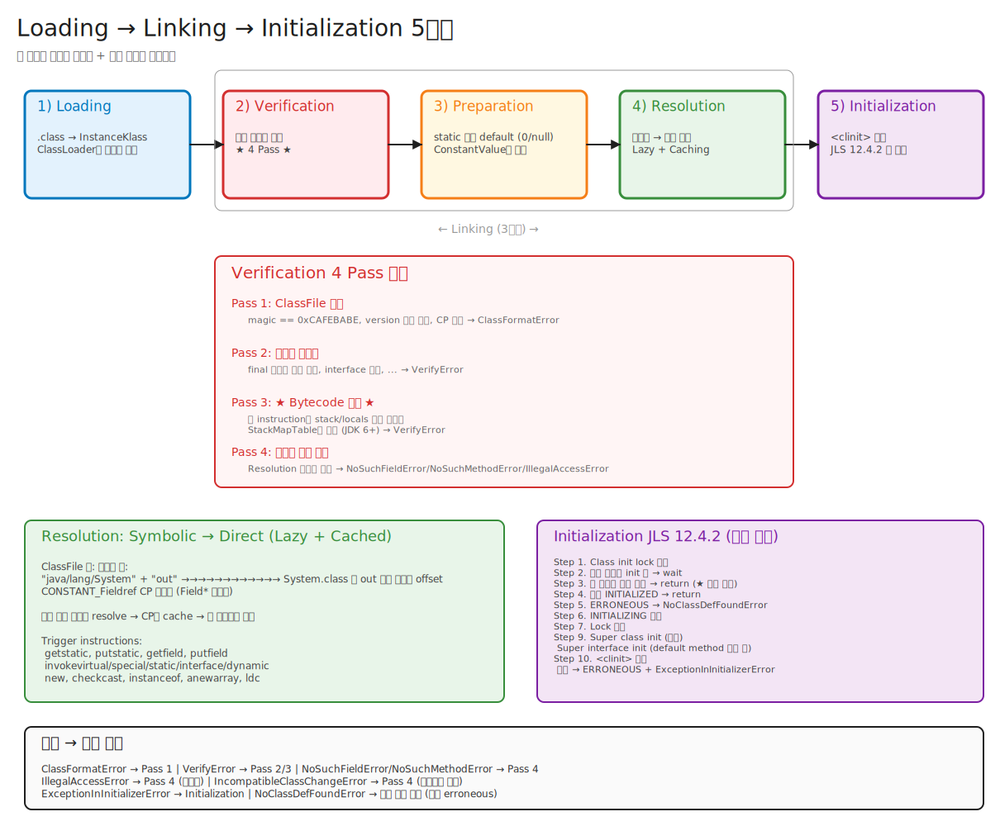

# 01-03. Linking — Verify, Prepare, Resolve

> "ClassLoader가 클래스를 로드하면 끝" 이라고 생각하면 절반만 안 것이다.
> Loading 다음에는 **Linking**이 있다. 그리고 이 단계가 JVM의 진짜 안전망이다.
> `.class` 파일을 신뢰할 수 없다는 가정 하에, JVM은 **타입 안전성을 수학적으로 증명**한다.

---

## 📍 학습 목표

1. Loading → Linking → Initialization의 경계를 명확히 그릴 수 있다.
2. Linking의 3단계 **Verification / Preparation / Resolution**을 각각 한 줄로 설명할 수 있다.
3. Verifier가 무엇을 검증하는지, 4가지 패스(Pass 1~4)를 안다.
4. JDK 6의 StackMapTable이 왜 도입됐고, 어떻게 verification을 가속하는지 안다.
5. Resolution이 lazy인 이유와 caching 메커니즘을 안다.
6. `VerifyError` vs `NoClassDefFoundError` vs `IncompatibleClassChangeError`의 차이를 안다.

---

## 🎨 1단계: 백지 그리기 가이드

### Step 1: 가로 5단계 흐름
```
[Loading] → [Verification] → [Preparation] → [Resolution] → [Initialization]
              └──────── Linking (3단계) ─────────┘
```

### Step 2: 각 단계 아래에 박스로 설명
- Loading: .class 바이트 → InstanceKlass 객체
- Verification: 4 Pass로 바이트코드 안전성 증명
- Preparation: static 필드에 default 값 (0, null, false)
- Resolution: 심볼릭 참조 → 직접 참조 (lazy)
- Initialization: static block + static field initializer 실행

### Step 3: Verification 4 Pass 세부
1. Pass 1: ClassFile 포맷 (마법 넘버, 버전, CP 일관성)
2. Pass 2: 시멘틱 (final 클래스 상속 등)
3. Pass 3: ★ Bytecode 검증 (StackMapTable, type inference) ★
4. Pass 4: 심볼릭 참조 검증 (Resolution 시 수행)

### Step 4: Pass 3 안의 알고리즘
- StackMapFrame: 분기점마다의 stack/locals 타입 상태
- Type inference + 일관성 검증

### Step 5: Resolution 패턴
- Lazy: 처음 사용 시
- Caching: ResolvedRef 저장 후 재사용

### Step 6: 에러 매핑
- Pass 1 실패 → `ClassFormatError`
- Pass 2/3 실패 → `VerifyError`
- Pass 4 실패 → `NoSuchFieldError`, `NoSuchMethodError`, `IllegalAccessError`, ...

### 정답 그림



> 편집은 [03-linking-stages.excalidraw](./_excalidraw/03-linking-stages.excalidraw)을 [excalidraw.com](https://excalidraw.com/)에서 "Open"으로.

---

## 🧠 2단계: 직관

### 핵심 비유

> 부동산 거래 비유:
> - **Loading** = 등기부등본 받아오기 (서류 입수)
> - **Verification** = 서류 위조 검사 (인감 진위, 권리 관계)
> - **Preparation** = 명의 이전 준비 (계좌 개설, 빈 칸 채울 양식 만들기)
> - **Resolution** = 실제 권리자 찾기 (등기부의 이름으로 실제 사람 매칭)
> - **Initialization** = 입주 (가구 들이기, 사람 살기)

### 왜 Verification이 그토록 엄격한가?

> 1995년 Java applet 시대: 브라우저가 untrusted 코드를 다운받아 실행. **악성 bytecode**가 JVM을 깨거나 메모리를 망가뜨릴 수 있음.
>
> 해결책: bytecode를 실행하기 전에 **수학적으로 타입 안전성을 증명**. 검증된 bytecode는 segfault 같은 native crash를 일으킬 수 없음을 보장.
>
> 즉 Verifier는 **JVM 보안의 첫 방어선**. 이게 없으면 Java의 "safe by construction" 가정이 무너진다.

### 왜 Resolution이 lazy인가?

> 모든 심볼릭 참조를 클래스 로드 시점에 미리 resolve하면:
> - Class A가 B를 참조 → B 로드 → B가 C를 참조 → C 로드 → 연쇄적으로 수많은 클래스 로드.
> - 사용하지 않는 클래스까지 모두 로드 → startup 느림 + 메모리 낭비.
>
> Lazy resolution: 그 reference를 **실제로 쓰는 순간** 해결. 사용 안 하면 안 함.

---

## 🔬 3단계: 구조

### 5단계 전체 흐름

```
                  ┌──────── Linking (3단계) ─────────┐
                  │                                   │
┌─────────┐   ┌──────────────┐  ┌───────────┐  ┌──────────┐   ┌──────────────┐
│ Loading │ → │ Verification │ →│Preparation│ →│Resolution│ → │Initialization│
└─────────┘   └──────────────┘  └───────────┘  └──────────┘   └──────────────┘
     │              │                 │              │                │
     ▼              ▼                 ▼              ▼                ▼
 .class bytes  타입 안전성 검증     static 필드     symbolic →       <clinit>
   → Instance  → VerifyError       default 값      direct           실행
     Klass       (Pass 1~4)        (0/null/false)  (lazy + cached)
     생성                                                           ↓
                                                              ExceptionIn
                                                              InitializerError
                                                              (가능)
```

---

## 1️⃣ Loading

**입력**: 클래스 이름  
**출력**: `.class` 바이트 → 메모리의 `InstanceKlass` 객체

핵심 동작:
1. ClassLoader가 `.class` 바이트 획득 (디스크/네트워크/byte[]).
2. ClassFileParser가 바이트를 파싱 → `InstanceKlass` 생성.
3. `java.lang.Class` mirror 객체 생성 (Heap에).
4. Metaspace의 SystemDictionary에 등록.

> 이 단계는 챕터 02 (ClassLoader)와 챕터 01 (ClassFile 포맷)에서 다뤘다.

---

## 2️⃣ Verification — 안전성 증명

### 4 Pass 구조

| Pass | 시점 | 검증 항목 | 실패 시 |
|---|---|---|---|
| **1** | Loading 직후 | ClassFile 구조 (magic, version, CP 형식) | `ClassFormatError` |
| **2** | Loading 직후 | 의미적 일관성 (final 클래스 상속 금지 등) | `VerifyError` |
| **3** | Linking 단계 | ★ Bytecode 검증 ★ | `VerifyError` |
| **4** | Resolution 시 | 심볼릭 참조 검증 | `NoSuchFieldError`, ... |

### Pass 1: ClassFile Format

```cpp
// classFileParser.cpp의 책임
- magic == 0xCAFEBABE
- major_version이 지원 범위 안
- CP의 모든 tag가 유효
- CP 인덱스가 범위 안 (1 ~ count-1)
- attributes의 length 일관성
- 각 method의 Code attribute 존재
```

실패: 파싱 중 즉시 `ClassFormatError`.

### Pass 2: Semantic Checks

```cpp
- super_class가 final이면 안 됨
- interface는 super_class가 java.lang.Object여야 함
- 모든 메서드 시그니처 형식 유효
- ACC_INTERFACE인 클래스의 메서드는 ACC_ABSTRACT만 (default method 제외)
- 같은 시그니처의 메서드 중복 금지
```

### Pass 3: Bytecode Verification — 핵심

**목표**: 모든 메서드의 모든 bytecode 위치에서 **타입 안전성을 증명**.

**증명할 것**:
1. 모든 instruction이 valid opcode.
2. 모든 instruction의 stack/locals 사용이 max_stack/max_locals 안.
3. 모든 instruction이 받는 타입이 올바름 (예: `iadd`는 stack 위에 int 둘이 있어야 함).
4. 메서드 종료 시 stack이 비어있거나 반환 타입과 맞음.
5. 모든 분기 대상이 유효한 instruction 시작 위치.

#### Type System

JVMS §4.10.1의 verification type lattice:

```
                 top
                  │
       ┌──────────┴──────────┐
   oneWord                twoWord
       │                     │
  ┌────┴────┐          ┌─────┴─────┐
 int      ...        long       double
                       │           │
                  long2 (slot2)  double2 (slot2)
```

각 stack slot과 local variable slot이 어떤 타입인지 추적.

#### 알고리즘 1: 옛 방식 (JDK 5 이하) — Type Inference

각 메서드의 모든 instruction에서:
1. 입력 stack/locals 타입 상태 (예: `[int, ref]`, `int`).
2. instruction 실행 후 상태 계산.
3. 분기점에서 여러 진입 경로의 상태를 **merge** — 공통 supertype으로 통합.
4. **fixed-point iteration**: 변화 없을 때까지 반복.

복잡도: O(n²)~O(n³). 큰 메서드에서 매우 느림.

#### 알고리즘 2: 새 방식 (JDK 6+) — StackMapTable

핵심 아이디어: **javac가 미리 계산해서 ClassFile에 적어둔다.**

`StackMapTable` attribute (Code attribute 안):
```
StackMapTable {
    u2 number_of_entries;
    StackMapFrame entries[];
}
```

각 `StackMapFrame`은 **basic block 시작점**의 stack/locals 타입 상태를 명시.

JVM Verifier는:
1. 첫 instruction의 초기 상태 = 메서드 파라미터 타입.
2. 다음 instruction마다 시뮬레이션 (한 단계씩).
3. 분기점 도달 시: 현재 상태가 ClassFile에 명시된 StackMapFrame과 일치하는지만 확인.
4. 불일치면 `VerifyError`.

복잡도: O(n) (한 번만 훑음). 매우 빠름.

**Verifier가 가짜 StackMapTable에 속을까?** 안 됨. Verifier는 **현재 상태에서 명시된 상태로의 transition이 valid한지**를 검사. 가짜 frame이 명시되어도 시뮬레이션 결과와 불일치 → 거부.

#### Pass 3 예시

```java
public int example(int a) {
    int b = 0;
    if (a > 0) {
        b = a;
    } else {
        b = -a;
    }
    return b;
}
```

bytecode (개략):
```
0:  iconst_0
1:  istore_2          // b = 0, locals = [this:ref, a:int, b:int]
2:  iload_1           // stack = [int]
3:  ifle 12           // 분기점. stack = [], 양 분기로 갈라짐
6:  iload_1           // (true branch)
7:  istore_2
8:  goto 16
12: iload_1           // (false branch) ★ StackMapFrame 필요 ★
13: ineg
14: istore_2
16: iload_2           // (merge point) ★ StackMapFrame 필요 ★
17: ireturn
```

StackMapTable:
```
Frame 1 (offset 12):  same_frame   // locals/stack 변화 없음
Frame 2 (offset 16):  same_frame
```

Verifier가 12와 16에 도달 시 현재 상태와 명시된 frame을 비교 → 일치하면 OK.

### Pass 4: Symbolic Reference Verification

Resolution 단계와 같이 일어남. 다음 챕터(Resolution)에서 다룸.

---

## 3️⃣ Preparation — static 필드 초기화 준비

**무엇을**: static 필드에 **default 값**을 할당.

```java
class Foo {
    static int x = 42;       // Preparation 시: x = 0
                              // Initialization 시: x = 42
    static String s = "hi";   // Preparation 시: s = null
                              // Initialization 시: s = "hi"
    static final int CONST = 100;  // Preparation 시: 100 (compile-time constant)
}
```

> **함정**: Preparation에서는 **사용자 코드를 실행하지 않는다**. static initializer는 Initialization에서.
> 예외: `static final` + compile-time constant (primitive 또는 String literal)는 Preparation에서 바로 할당. ConstantValue attribute로 .class에 저장됨.

### `static final` 함정

```java
class A {
    static final int X = 10;          // ConstantValue attribute로 .class에 인라인
    static final int Y = computeY();  // ConstantValue 아님 — clinit에서 계산
}

class B {
    public static void main(String[] args) {
        System.out.println(A.X);  // A를 init하지 않음! (constant inlining)
        System.out.println(A.Y);  // A 초기화 트리거
    }
}
```

`A.X`는 **B의 ClassFile에 10이라는 값으로 직접 박힌다** — `ldc 10`.
→ B 컴파일 후 A의 X를 20으로 바꿔도, B는 여전히 10을 출력 (재컴파일 필요).

운영 함정: **버전 호환성 깨짐**. dependency의 `public static final`을 절대 가볍게 바꾸면 안 됨.

---

## 4️⃣ Resolution — 심볼릭 → 직접

### Symbolic Reference vs Direct Reference

```
Symbolic Reference (ClassFile 안):
  "java/lang/System" + "out" + "Ljava/io/PrintStream;"
       ↓
  CONSTANT_Fieldref CP 엔트리

Direct Reference (메모리 안):
  실제 InstanceKlass*, Field*, 또는 메모리 offset
```

Resolution = symbolic → direct 변환.

### Lazy Resolution

JVMS는 두 옵션 허용:
1. **Eager**: Linking 시점에 모두 resolve.
2. **Lazy**: 그 reference를 처음 사용할 때 resolve.

HotSpot은 **lazy**. 이유: startup 시간 + 메모리.

### 첫 사용 시점

각 instruction이 reference를 사용할 때:
- `getstatic`, `putstatic`: static 필드 reference
- `getfield`, `putfield`: instance 필드 reference
- `invokevirtual`, `invokespecial`, `invokestatic`, `invokeinterface`: 메서드 reference
- `new`: 클래스 reference
- `checkcast`, `instanceof`: 클래스 reference
- `anewarray`, `multianewarray`: 컴포넌트 타입 reference
- `ldc` of CONSTANT_Class: 클래스 reference

### Resolution 단계

| reference 타입 | 단계 |
|---|---|
| **Class** | 1. CP에서 클래스 이름 가져옴. 2. 그 클래스의 ClassLoader가 로드 (트리거 가능). 3. 접근 권한 검사. |
| **Field** | 1. Field의 owner class resolve. 2. 그 클래스에서 (이름, 타입) 매칭 필드 검색. 3. 부모/인터페이스 탐색 가능. 4. 접근 권한 검사. |
| **Method** | 1. Method의 owner class resolve. 2. 그 클래스 + 부모에서 (이름, 시그니처) 검색. 3. 인터페이스도 검색 (invokeinterface). 4. 접근 권한 검사. |

### Caching: ResolvedReference

처음 resolve 후 결과를 CP 슬롯에 caching:
- `ConstantPool::klass_at_put` (Class)
- `ConstantPool::resolved_field_at_put` (Field)
- `ConstantPool::resolved_methodref_at` (Method)

같은 instruction이 두 번째 실행될 때는 즉시 cached 결과 사용.

### Resolution 에러

| 에러 | 시나리오 |
|---|---|
| `NoClassDefFoundError` | 클래스 자체를 찾을 수 없음 |
| `NoSuchFieldError` | 필드 이름/타입이 클래스에 없음 |
| `NoSuchMethodError` | 메서드 시그니처가 없음 |
| `IllegalAccessError` | private/package 가시성 위반 |
| `IncompatibleClassChangeError` | 메서드를 호출했는데 그 메서드가 static/instance가 바뀌었거나 인터페이스 ↔ 클래스 변경 |
| `AbstractMethodError` | abstract 메서드를 직접 호출 시도 (이론상 안 일어나지만 클래스 hierarchy 변경 시) |

### Resolution 함정: 컴파일 시 vs 실행 시 불일치

```java
// 컴파일 시: A.java
class A {
    public int x = 10;
}

// 컴파일 시: B.java (A를 참조)
class B {
    void doIt() { System.out.println(new A().x); }
}

// 실행 시: A를 다음으로 교체
class A {
    public String x = "hello";  // 타입이 바뀜!
}
```

B는 재컴파일 안 함. 실행 시:
- B.class의 CP에 `Fieldref A.x:I` (int).
- 새 A에는 `x:Ljava/lang/String;` 만 있음.
- Resolution → `NoSuchFieldError`.

이게 **binary compatibility**의 영역. JLS 13장에서 자세히 정의.

---

## 🧬 4단계: 내부 구현 — HotSpot

### Verification

위치: `src/hotspot/share/classfile/verifier.cpp` (3,000+ 줄)

```cpp
// verifier.cpp
class ClassVerifier : public StackObj {
public:
  void verify_class(TRAPS) {
    // Pass 2 — 의미적 검증
    verify_supertype(THREAD, CHECK);

    // Pass 3 — 메서드별 bytecode verify
    for (int index = 0; index < num_methods; index++) {
      Method* m = _klass->methods()->at(index);
      verify_method(methodHandle(THREAD, m), CHECK);
    }
  }

  void verify_method(const methodHandle& m, TRAPS) {
    // StackMapTable이 있으면 그걸 사용 (JDK 6+)
    StackMapTable stackmap_table(m->stackmap_data(), ...);

    // bytecode 시뮬레이션
    for (Bytecodes::Code opcode : m->bytecode_iter()) {
      switch (opcode) {
        case Bytecodes::_iadd:
          current_frame.pop_stack(VerificationType::integer_type(), CHECK);
          current_frame.pop_stack(VerificationType::integer_type(), CHECK);
          current_frame.push_stack(VerificationType::integer_type(), CHECK);
          break;
        case Bytecodes::_invokevirtual:
          verify_invoke_instructions(...);
          break;
        // ... 200+ opcodes
      }

      // 분기점에서 StackMapTable과 비교
      if (is_branch_target(bci)) {
        StackMapFrame* expected = stackmap_table.entry_for_bci(bci);
        if (!current_frame.is_assignable_to(expected)) {
          verify_error("Inconsistent stackmap frames", ...);
        }
      }
    }
  }
};
```

### Resolution

위치: `src/hotspot/share/oops/constantPool.cpp`

```cpp
// constantPool.cpp
Klass* ConstantPool::klass_at_impl(const constantPoolHandle& this_cp,
                                    int which, TRAPS) {
  // 1. 이미 resolved되어 있나
  CPKlassSlot kslot = this_cp->klass_slot_at(which);
  int resolved_klass_index = kslot.resolved_klass_index();
  Klass* klass = this_cp->resolved_klasses()->at(resolved_klass_index);
  if (klass != NULL) {
    return klass;  // ★ cache hit ★
  }

  // 2. 클래스 이름 가져옴
  Symbol* name = this_cp->klass_name_at(which);

  // 3. ClassLoader 통해 로드
  Klass* k = SystemDictionary::resolve_or_fail(
      name, Handle(THREAD, loader), domain, true /* throw error */, CHECK_NULL);

  // 4. 접근 권한 검사
  if (k->is_instance_klass()) {
    Reflection::VerifyClassAccessResults vca_result =
        Reflection::verify_class_access(this_cp->pool_holder(),
                                          InstanceKlass::cast(k), false);
    if (vca_result != Reflection::ACCESS_OK) {
      // IllegalAccessError throw
      ResourceMark rm(THREAD);
      char* msg = Reflection::verify_class_access_msg(...);
      THROW_MSG_NULL(vmSymbols::java_lang_IllegalAccessError(), msg);
    }
  }

  // 5. cache
  this_cp->klass_at_put(which, k);
  return k;
}
```

### Method Resolution — 가장 복잡

```cpp
// linkResolver.cpp
void LinkResolver::resolve_method(LinkInfo& result, Bytecodes::Code code, TRAPS) {
  // 1. invokestatic이면 정적 메서드만 검색
  // 2. invokevirtual이면 instance method (private 제외)
  // 3. invokespecial이면 정확한 메서드 (디스패치 안 함)
  // 4. invokeinterface이면 interface method

  Method* resolved_method = lookup_method_in_klasses(
      link_info, link_info.resolved_klass(),
      /*checkpolymorphism*/ true, /*in_imethod_resolve*/ false);

  if (resolved_method == NULL) {
    THROW_MSG(vmSymbols::java_lang_NoSuchMethodError(), ...);
  }

  // access check, abstract check
  if (resolved_method->is_abstract() && code == Bytecodes::_invokespecial) {
    THROW_MSG(vmSymbols::java_lang_AbstractMethodError(), ...);
  }

  result.set_resolved_method(resolved_method);
}
```

### vtable / itable 구축

Resolution 후 Method가 자주 호출되면, JVM은 클래스의 **vtable**(virtual method table)과 **itable**(interface method table)을 구축.

```cpp
// instanceKlass.hpp
class InstanceKlass : public Klass {
  // ...
  int _vtable_len;
  int _itable_len;
  // 실제 vtable/itable은 InstanceKlass 객체 메모리 뒤에 inline
};
```

- vtable: 인덱스로 O(1) 접근, invokevirtual에서 사용
- itable: (interface, method) 쌍 검색, invokeinterface에서 사용 + inline cache로 최적화

---

## 📜 5단계: 역사

### Java 1.0 — Verification 도입

처음부터 verification은 핵심. Java applet 보안 모델의 기반.

### Java 1.4 — Class Data Sharing 첫 등장 (Sun JDK)

자주 사용되는 시스템 클래스의 메타데이터를 archive로 묶어 다음 실행 시 재사용 → startup 가속.

### Java 5 — Stack Map Type Inference

Type inference 알고리즘 표준화. JVMS §4.10.2.

### Java 6 (2006) — StackMapTable + Split Verifier

- **StackMapTable** attribute 도입.
- 두 종류 verifier: **old type inference** (compatibility) + **new type checker** (StackMapTable 기반).
- `-target 1.6` 컴파일 시 javac가 StackMapTable 생성.

### Java 7 (2011) — StackMapTable 필수

`-target 1.7`+ 클래스에서 StackMapTable 없으면 verify 실패.
JSR/RET 명령 (그 옛 finally 구현) 폐기.

### Java 8 — invokespecial 변경

Interface default method 도입과 함께 invokespecial의 의미 확장:
- super.defaultMethod() 호출 시 직접 super interface의 default method 호출.
- invokespecial이 interface method도 받을 수 있게.

### Java 11 — invokevirtual + Nest Access

같은 nest 안의 private 메서드를 invokevirtual로 직접 호출 가능. resolution 단계에서 NestHost/NestMembers 확인.

### Java 13+ — Dynamic Class-File Constants (JEP 309 — 실제로는 11에 들어감)

`CONSTANT_Dynamic` (CP tag 17): condy. invokedynamic 같은 메커니즘으로 상수도 동적 계산.

### Java 17 — Sealed Class Resolution

Resolution 시 PermittedSubclasses 확인 — 허용 안 된 클래스가 sealed 클래스를 상속하면 `IncompatibleClassChangeError`.

---

## ⚔️ 6단계: 꼬리질문 트리

### Q1. Linking의 3단계를 설명하세요.

**예상 답변**:
> Verification, Preparation, Resolution.
> - **Verification**: bytecode의 타입 안전성을 검증. 4 Pass로 구성. JDK 6+에서는 StackMapTable로 가속.
> - **Preparation**: static 필드에 default 값(0, null, false) 할당. 사용자 코드 실행 X.
> - **Resolution**: 심볼릭 참조를 직접 참조로 변환. lazy + caching.

#### 🪝 꼬리 Q1-1: "Preparation에서 static final도 default 값이 들어가나요?"

**예상 답변**:
> 케이스 분리.
> - `static final int X = 10;` (compile-time constant): ClassFile에 `ConstantValue` attribute. Preparation에서 바로 10 할당.
> - `static final int Y = compute();`: ConstantValue 없음. Preparation에서 0, Initialization에서 compute() 결과.
> - `static final String S = "hi"`: literal이라 ConstantValue. 바로 "hi".
> - `static final String S = new String("hi")`: ConstantValue 아님.

##### 🪝 꼬리 Q1-1-1: "ConstantValue가 ClassFile에 박히면 어떤 부작용이 있나요?"

**예상 답변**:
> 그 상수를 참조하는 다른 클래스의 ClassFile에 값이 **직접 인라인**된다.
> ```java
> // A.java
> class A { public static final int VERSION = 1; }
>
> // B.java
> class B { void print() { System.out.println(A.VERSION); } }
> ```
> B.class의 bytecode에 `bipush 1`이 들어감 (A.VERSION을 동적으로 안 읽음).
> 만약 A의 VERSION을 2로 바꾸고 A만 재컴파일하면, B는 여전히 1을 출력 — **재컴파일 필요**.
> 운영 함정: API의 public static final을 가볍게 바꾸면 dependent 모듈을 모두 재컴파일하지 않으면 깨짐.

### Q2. Verification은 무엇을 검증하나요?

**예상 답변**:
> 4 Pass:
> 1. ClassFile 포맷 (magic, version, CP 구조).
> 2. 의미적 일관성 (final 클래스 상속 금지, interface 제약 등).
> 3. ★ Bytecode 타입 안전성 ★ — StackMapTable과 비교.
> 4. 심볼릭 참조 유효성 (Resolution과 같이).

#### 🪝 꼬리 Q2-1: "Pass 3 bytecode verification이 정확히 뭘 보장하나요?"

**예상 답변**:
> 1. 모든 instruction이 valid opcode.
> 2. operand stack overflow/underflow 없음.
> 3. local variable 인덱스가 max_locals 안.
> 4. 각 instruction이 받는 stack 타입이 적합 (예: iadd는 int 두 개).
> 5. 분기 대상이 valid instruction 시작.
> 6. 메서드 종료 시 stack 상태 일관 (return 타입과 매칭).
> 7. `subroutine` (옛 jsr/ret) 사용 시 (JDK 6 이하) 일관성.
>
> 즉 verified bytecode는 **native crash를 일으킬 수 없다**.

##### 🪝 꼬리 Q2-1-1: "그런데 verification을 우회하는 방법이 있나요?"

**예상 답변**:
> 1. **`-Xverify:none`** (또는 `-noverify`): JDK 13까지 가능, JDK 13에서 deprecated, 21에서도 동작은 함. prod에서 절대 금지.
> 2. **`-Xverify:remote`**: remote-loaded (network) 클래스만 verify, local은 skip — 위험.
> 3. **`Unsafe.defineAnonymousClass`** (deprecated, JDK 17에서 제거) 또는 hidden class: 일부 verify 우회.
> 4. **JNI agents**: 클래스 transformation 후 verify가 다시 실행됨 (회피 어려움).
> 5. **Native code**: native 함수는 verify 안 됨, JVM 안전성 깰 수 있음.
>
> 우회는 가능하지만 **모든 안전성 보장이 무효**. 잘못된 bytecode 실행 시 segfault / 메모리 손상 / 보안 취약점.

###### 🪝 꼬리 Q2-1-1-1: "운영 환경에서 -Xverify:none을 켜면 startup이 얼마나 빨라지나요?"

**예상 답변**:
> 측정치마다 다르지만 일반적으로 5~15% 정도 startup 단축.
> JDK 6+ StackMapTable 도입 후 verify가 매우 빨라져서 효과가 크지 않음 (옛날엔 30%+).
> 또한 **AppCDS** (Application Class Data Sharing) + Generational ZGC가 더 큰 startup 가속을 제공하므로, verify 끄는 것보다 그쪽이 권장.
> Container/Serverless 환경에서는 GraalVM Native Image나 Project Leyden이 더 근본적 해결.

### Q3. StackMapTable이 도입된 이유는?

**예상 답변**:
> JDK 5 이하: verifier가 fixed-point iteration으로 type inference. O(n²)~O(n³). 큰 메서드/많은 메서드일 때 매우 느림.
> JDK 6: javac가 미리 각 basic block의 stack/locals 타입을 계산해서 StackMapTable attribute에 저장. Verifier는 linear (O(n))로 검증.

#### 🪝 꼬리 Q3-1: "javac가 가짜 StackMapTable을 만들어 넣으면 verifier를 속일 수 있나요?"

**예상 답변**:
> 안 됨. Verifier는 **현재 상태에서 다음 frame으로의 transition이 valid한지** 검사.
> 가짜 frame이 명시되어도 시뮬레이션 결과와 불일치하면 `VerifyError`.
> 즉 StackMapTable은 **힌트**일 뿐, 검증을 우회하지 않음.

### Q4. Resolution은 언제 일어나나요?

**예상 답변**:
> Lazy. 해당 reference를 처음 사용하는 instruction이 실행될 때.
> 예: `invokevirtual Foo.bar`가 처음 실행되면 그때 Foo와 bar 메서드를 resolve.
> 결과는 CP에 cache되어 두 번째부터 즉시 사용.

#### 🪝 꼬리 Q4-1: "그럼 클래스가 로드되어도 그 안의 메서드 참조는 resolve 안 되어 있다?"

**예상 답변**:
> Yes. Loading + Verification + Preparation까지는 메서드 호출이 안 일어남.
> Initialization 시 `<clinit>`이 실행되면서 호출되는 메서드들이 그때 resolve.
> static initializer가 없거나 짧으면, 메서드 reference들은 첫 호출까지 미해결 상태.

##### 🪝 꼬리 Q4-1-1: "Lazy resolution이 만드는 함정은?"

**예상 답변**:
> 1. **에러가 늦게 발견됨**: 컴파일 시 OK였지만 dependency 변경으로 깨진 reference가 있어도, 실행 도중에 발견 (`NoSuchMethodError`).
> 2. **불완전한 fail-fast**: startup에서 모든 reference 검증하면 빠르게 알 수 있지만, lazy면 production에서 한참 후에 발견.
> 3. **테스트 어려움**: 일부 경로만 타는 코드의 resolution 실패가 운영에서 드러남.
> 회피: `-Xverify:all` + 의도적 warmup으로 모든 클래스를 미리 로드.

### Q5. NoClassDefFoundError와 ClassNotFoundException의 차이?

**예상 답변**:
> - **ClassNotFoundException**: checked. `Class.forName()`, `ClassLoader.loadClass()`처럼 명시적으로 클래스를 찾을 때 실패.
> - **NoClassDefFoundError**: error (unchecked). 컴파일 시점엔 존재했지만 런타임에 사라진 경우. Resolution 단계 실패.
>
> 시나리오:
> - CNFE: classpath에 누락, plugin 못 찾음.
> - NCDFE: 빌드 시 있던 jar이 deploy에서 빠짐. 또는 static initializer 실패한 클래스 재접근.

#### 🪝 꼬리 Q5-1: "ExceptionInInitializerError가 나면 그 클래스는 어떻게 되나요?"

**예상 답변**:
> 그 클래스는 영구히 **erroneous** 상태로 마킹됨.
> 이후 그 클래스에 대한 **모든 접근**(메서드 호출, 필드 접근, instanceof 등)에서 `NoClassDefFoundError` throw.
> 첫 stacktrace의 ExceptionInInitializerError가 진짜 원인이고, 그 다음부터는 NCDFE만 보임 — **로그 첫 번째를 못 잡으면 영원히 헤매는 함정**.
> 회복 불가 — 그 ClassLoader 폐기 후 새 CL로 다시 로드해야 함.

##### 🪝 꼬리 Q5-1-1: "왜 그렇게 가혹한가요? 다시 init 시도해도 되지 않나요?"

**예상 답변**:
> 1. **JLS 12.4.2**: Initialization은 단 한 번. 재시도 명세상 없음.
> 2. **부분 초기화 위험**: static 블록이 일부만 실행되고 예외가 나면, 일부 static 필드가 잘못된 값 — 그 상태를 살리는 것보다 클래스 전체를 dead로 처리하는 게 안전.
> 3. **Thread-safety**: 여러 스레드가 동시에 init 시도 → 첫 시도가 실패하면 다른 스레드도 같은 결과를 봐야 함.

### Q6. (Killer) JDK 21에서 클래스 로딩 / linking / initialization 시간을 줄이려면 어떤 옵션이 있나요?

**예상 답변** (여러 옵션 조합):
> 1. **AppCDS** (`-XX:SharedArchiveFile=...`): 사용 클래스들을 archive로 묶어 다음 실행 시 파싱/verify 스킵.
>    - 빌드: `java -XX:DumpLoadedClassList=classes.lst MyApp`
>    - 사용: `java -XX:SharedArchiveFile=archive.jsa MyApp`
> 2. **Class Data Sharing의 confined area**: 시스템 클래스 외 사용자 클래스도 포함 (JDK 13+).
> 3. **CDS + Class Loader Hierarchy**: 여러 CL의 클래스를 archive (JDK 13+).
> 4. **AOT (deprecated)** → **GraalVM Native Image** 또는 **Project Leyden**.
> 5. **`-Xverify:none`** (production 금지지만 실험용): verify 스킵.
> 6. **`-XX:+UseAppCDS`** (JDK 11에서 기본 on).
> 7. **`-XX:+EnableJVMCI`** + GraalVM JIT.
> 8. **Tiered Compilation 조정** (`-XX:-TieredCompilation`로 첫 컴파일 시간 단축 가능, throughput은 감소).

#### 🪝 꼬리 Q6-1: "AppCDS가 정확히 무엇을 archive하나요?"

**예상 답변**:
> 1. **InstanceKlass 객체** (메타데이터): 파싱된 클래스 구조.
> 2. **Constant Pool**: 모든 CP 엔트리 (resolution 결과 포함).
> 3. **Method bytecode** + StackMapTable.
> 4. **vtable / itable**.
> 5. **Klass에 연관된 oop들** (java.lang.Class mirror 일부).
>
> 다음 실행 시:
> - archive 파일을 **mmap**으로 매핑 → Heap에 로드.
> - 파싱 / verification 스킵.
> - linking 일부 결과 재사용.

##### 🪝 꼬리 Q6-1-1: "AppCDS로 archive한 클래스를 수정하면 어떻게 되나요?"

**예상 답변**:
> Archive 파일의 timestamp/checksum과 실제 .class의 그것이 다르면 archive invalidate.
> JVM이 archive 사용 거부 → 일반 로딩으로 fallback (warning 메시지).
> 따라서 dev 환경에서는 archive 사용 안 하는 게 일반적, prod에서 immutable image에서 사용.

### Q7. invokedynamic의 resolution은 일반 메서드 호출과 어떻게 다른가요?

**예상 답변**:
> 일반 invokevirtual/invokespecial 등: CP의 Methodref를 resolve → 호출.
> invokedynamic: CP의 `InvokeDynamic` 엔트리는 **bootstrap method 정보**를 가리킴 (BootstrapMethods attribute).
> 첫 호출 시:
> 1. Bootstrap method 호출 (예: `LambdaMetafactory.metafactory`).
> 2. Bootstrap method가 `CallSite` 객체 반환.
> 3. CallSite의 target MethodHandle을 호출 사이트에 link.
> 4. 이후 호출은 link된 target으로 직접.
>
> 즉 invokedynamic은 **첫 호출에 사용자 정의 link 로직** 실행 → bytecode 변경 없이 동적 dispatch 가능.

#### 🪝 꼬리 Q7-1: "MutableCallSite와 ConstantCallSite의 차이?"

**예상 답변**:
> - **ConstantCallSite**: target이 한 번 설정되면 불변. JIT이 inline 최대화. Lambda 호출 사이트.
> - **MutableCallSite**: target 교체 가능. Dynamic 언어(JRuby 등)에서 사용. 교체 시 다른 스레드에 visibility 보장을 위해 `SwitchPoint` 메커니즘.
> - **VolatileCallSite**: 매번 target을 다시 읽음. 거의 안 씀.

---

## 🔗 다음 단계

- → [04. Initialization & Class Unload](./04-initialization-and-unload.md): clinit 실행 순서, JLS 12.4.2 lock, CL unload

## 📚 참고

- **JVMS §5.4 Linking**: https://docs.oracle.com/javase/specs/jvms/se21/html/jvms-5.html#jvms-5.4
- **JVMS §4.10 Verification of class Files**: https://docs.oracle.com/javase/specs/jvms/se21/html/jvms-4.html#jvms-4.10
- **JLS §13 Binary Compatibility**: https://docs.oracle.com/javase/specs/jls/se21/html/jls-13.html
- **JEP 309 Dynamic Class-File Constants**: https://openjdk.org/jeps/309
- **JEP 310 AppCDS**: https://openjdk.org/jeps/310
- **JEP 350 Dynamic CDS Archives**: https://openjdk.org/jeps/350
- **HotSpot verifier.cpp**: https://github.com/openjdk/jdk/blob/master/src/hotspot/share/classfile/verifier.cpp
- **HotSpot linkResolver.cpp**: https://github.com/openjdk/jdk/blob/master/src/hotspot/share/interpreter/linkResolver.cpp
