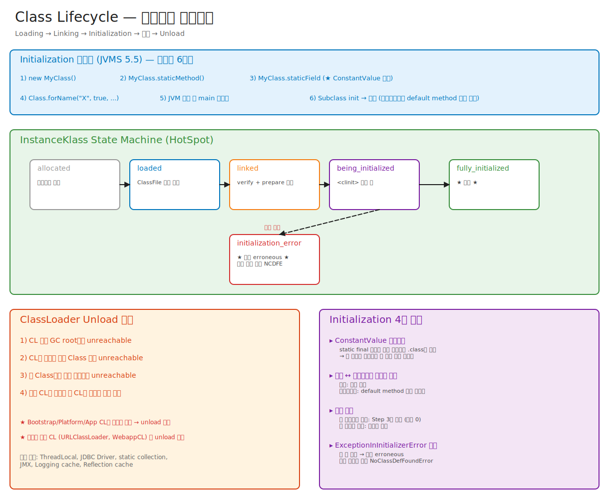

# 01-04. Initialization & Class Unload — clinit의 함정과 ClassLoader 회수

> Initialization 한 줄짜리 설명: "static 블록 실행".
> 그런데 그 한 줄에 **JLS 12.4.2의 12단계 락 절차**, **순환 초기화의 데드락 회피**, **상속 시 초기화 순서**, **lazy initialization 패턴**의 모든 함정이 다 들어있다.
> 그리고 끝에는 클래스가 어떻게 죽는가 — ClassLoader unload.

---

## 🗺️ JVM 라이프사이클 안에서 이 챕터의 위치

이 챕터는 클래스 라이프사이클의 **마지막 두 단계** — Initialization(`<clinit>`)과 Unloading(ClassLoader 회수)을 다룬다.



```
   .java ──javac──► .class
                       │
                       ▼
                   Loading                                  → [02-classloader-hierarchy](./02-classloader-hierarchy.md)
                       │
                       ▼
                   Linking (Verify, Prepare, Resolve)       → [03-linking](./03-linking.md)
                       │
                       ▼  ★ 이 챕터 (전반) ★
                   Initialization (<clinit>)
                       │
                       ▼
                   Usage (메서드 호출, 객체 생성)
                       │
                       ▼  ★ 이 챕터 (후반) ★
                   Unloading (ClassLoader unreachable → CLD chunk free)
```

**이전 챕터와의 연결**:
- ← [01-classfile-format](./01-classfile-format.md): `<clinit>`는 javac가 ClassFile에 합성한 메서드.
- ← [02-classloader-hierarchy](./02-classloader-hierarchy.md): Unloading의 주체는 ClassLoader (CLD 단위 회수).
- ← [03-linking](./03-linking.md): Linking이 끝나야 Initialization 시작.

**관련된 다른 챕터**:
- → [02-runtime-data-areas/02-metaspace](../02-runtime-data-areas/02-metaspace-and-class-space.md): ClassLoader 누수의 5대 패턴 + Metaspace에서 chunk가 어떻게 free되는지.

---

## 📍 학습 목표

1. Initialization이 트리거되는 6가지 조건을 외운다.
2. `<clinit>` 메서드가 무엇이고 어떻게 생성되는지 안다.
3. JLS 12.4.2의 12-step lock 절차를 도식화할 수 있다.
4. 부모 클래스 초기화 순서와 인터페이스의 예외를 안다.
5. 순환 의존 초기화에서 데드락이 안 일어나는 이유를 안다.
6. ClassLoader unload의 조건과 어떻게 안 일어나는지(누수)를 안다.
7. 클래스 redefinition (JVMTI, JRebel)의 한계를 안다.

---

## 🎨 1단계: 백지 그리기 가이드

### Step 1: 좌측 — 6가지 Initialization 트리거

박스 6개:
1. `new MyClass()`
2. `MyClass.staticMethod()`
3. `MyClass.staticField` / `staticField = ...` (단, ConstantValue 제외)
4. `Class.forName("MyClass")` (initialize=true)
5. main 클래스 (JVM 시작 시)
6. Subclass 초기화 (부모는 항상 먼저)

### Step 2: 중앙 — JLS 12.4.2 락 절차

12 단계 박스를 위에서 아래로:
1. CL 동기화 락 획득
2. 다른 스레드가 init 중이면 wait
3. 이 스레드가 이미 init 중이면 (재귀) → 그냥 빠져나옴
4. erroneous면 NCDFE
5. 초기화 진행 중으로 마킹
6. 락 해제
7. 부모 클래스 초기화 (재귀)
8. assertion check
9. `<clinit>` 실행
10. 완료 마킹
11. 다른 스레드 깨움
12. (에러 시) erroneous 마킹

### Step 3: 우측 — Class Unload 조건

```
[CL이 GC root에서 unreachable]
       ↓
[CL이 로드한 모든 Class 객체 unreachable]
       ↓
[그 Class들의 모든 인스턴스 unreachable]
       ↓
[다른 CL의 의존성 없음]
       ↓
[Java Heap GC] → CL oop dead
       ↓
[Metaspace GC] → CLD 해제
       ↓
[클래스 unload 완료]
```

### Step 4: 하단 — Initialization 함정 4가지
- ConstantValue inlining
- 부모 vs 인터페이스 초기화 차이
- 순환 의존
- ExceptionInInitializerError 후 영구 broken

### 정답 그림


> 편집은 [04-class-lifecycle.excalidraw](./_excalidraw/04-class-lifecycle.excalidraw)을 [excalidraw.com](https://excalidraw.com/)에서 "Open"으로.

---

## 🧠 2단계: 직관

### 핵심 비유

> 회사 입사 비유:
> - **Loading** = 이력서 제출
> - **Verification** = 신원 조회
> - **Preparation** = 책상/사원증 배정 (빈 상태)
> - **Resolution** = 부서 배치 (lazy: 첫 업무 시)
> - **Initialization** = OT (오리엔테이션) — **딱 한 번**만, **순서 있음** (부장님 OT 먼저, 그 다음 신입)

### 왜 Initialization은 단 한 번인가

> JVMS 5.5: "A class or interface T may be initialized only as a result of: ..."
> 그 트리거 조건이 만족되는 순간 한 번. 두 번은 절대 안 됨.
>
> 이유:
> 1. **Static 필드의 일관성**: 두 번 초기화하면 첫 번째와 두 번째 값이 다를 수 있어 (timestamp 등) 동일 클래스의 동작이 비결정적.
> 2. **Side effect 통제**: static 블록에서 외부 리소스 (파일 열기, DB 연결) 할당 시 두 번 실행되면 자원 누수.
> 3. **JMM 보장**: `<clinit>` 끝남 = 모든 static 필드 publish — happens-before. 두 번 실행은 이 보장을 깨뜨림.

### 왜 부모는 먼저, 인터페이스는 lazy인가

> 부모: 자식 클래스가 부모의 static 멤버에 의존할 수 있음 → 미리 초기화.
> 인터페이스: 다중 상속 가능 + default method 도입(JDK 8) → 모든 super interface를 미리 초기화하면 비용 큼 → **사용하는 시점에 lazy 초기화** (단, default method가 있는 interface만).

---

## 🔬 3단계: 구조

## 1️⃣ Initialization 트리거 (JVMS §5.5)

정확히 6가지:

```java
1. new MyClass()                          // ★ instance 생성
2. MyClass.staticMethod()                  // static 메서드 호출
3. MyClass.staticField                     // static 필드 읽기
   MyClass.staticField = ...               // static 필드 쓰기
   // 단, ConstantValue attribute가 있는 final field는 트리거 X
4. Class.forName("MyClass")                // (initialize=true)
   // Class.forName(name, false, loader)는 트리거 X
5. JVM 시작 시 main 클래스                  // java MyMainClass
6. MyClass extends Parent or implements I → MyClass 초기화 시 Parent도 (인터페이스는 조건부)
```

### 트리거 안 되는 경우

```java
// 1. ConstantValue
class A {
    public static final int X = 10;  // ConstantValue
}
System.out.println(A.X);            // A 초기화 X

// 2. 배열 생성
A[] arr = new A[10];                 // A 초기화 X (인스턴스는 안 만듦)

// 3. Class.forName(initialize=false)
Class<?> c = Class.forName("A", false, loader);  // A 초기화 X

// 4. .class 리터럴
Class<?> c = A.class;                // A 초기화 X (linking까지만)

// 5. instanceof
boolean b = obj instanceof A;        // A 초기화 X

// 6. assignment compatibility check
Object o = (A) obj;                  // A 초기화 X
```

> 함정: `A.class.newInstance()`는 A.class에 접근만 하므로 초기화 X. 하지만 `newInstance()` 호출이 결국 `new` 와 동등하므로 그 시점에 초기화.

## 2️⃣ `<clinit>` 메서드

javac가 자동 생성하는 특별한 메서드.

### 무엇이 들어가나

```java
class Example {
    static int x = 1;          // static field initializer
    static int y;
    static String s = "hi";

    static {                    // static block
        y = 2;
        System.out.println("Initialized");
    }

    static int z = compute();   // 또 다른 initializer

    static int compute() {
        return 42;
    }
}
```

생성되는 `<clinit>`:
```
static void <clinit>() {
    x = 1;                    // line 2
    s = "hi";                  // line 4
    // static block
    y = 2;
    System.out.println("Initialized");
    // 다음 initializer
    z = compute();
}
```

> 순서: **소스 코드 등장 순서** 그대로. static field initializer와 static block이 섞이면 등장 순서대로.

### 명시적으로 호출 못 함

`<clinit>`은 JVM만 호출. 사용자 코드에서 `invokestatic` 못 함.
이름이 `<`로 시작 — 일반 메서드 이름 규칙 위반 → javac/사용자가 못 만듦.

비슷한 메서드 `<init>` (생성자) 도 같은 패턴.

## 3️⃣ JLS 12.4.2 — 12-step Lock 절차

**왜 락이 필요한가**: 여러 스레드가 동시에 같은 클래스를 처음 접근 시, 한 스레드만 `<clinit>` 실행하고 나머지는 대기해야 함.

### 12 단계

```
Step 1. Class object의 init lock 획득 (각 Class마다 별도 락)
Step 2. 다른 스레드가 init 중이면 → wait, lock 풀고 끝나면 다시 가져옴
Step 3. 현재 스레드가 이미 이 클래스를 init 중이면 → unlock하고 종료 (재귀 호출 회피)
Step 4. 클래스가 이미 init 완료면 → unlock하고 종료 (정상 케이스)
Step 5. 클래스가 erroneous 상태면 → unlock + NoClassDefFoundError throw
Step 6. 이 스레드가 init 중이라고 마킹 (state = INITIALIZING)
Step 7. lock 해제 (★ 여기서 풀어야 다른 스레드가 wait에 들어갈 수 있음)
Step 8. final static 필드 (ConstantValue 외)와 static block 외 (사실 step 9에서 함)
        — 실제로는 step 9에 통합됨
Step 9. (인터페이스가 아니면) super 클래스 초기화 (재귀)
       슈퍼 인터페이스 중 default method 가진 것 초기화 (재귀)
Step 10. <clinit> 실행
        - 정상 완료 → state = INITIALIZED, lock 다시 잡고 다른 스레드 깨움 (notifyAll)
        - 예외 발생 → state = ERRONEOUS, ExceptionInInitializerError로 wrap, 다른 스레드 깨움
Step 11. (보통 통합) 다른 스레드 깨움
Step 12. (에러 시) erroneous mark
```

### 재귀 호출 (Step 3) — 데드락 회피

```java
class A {
    static int x = B.y;       // B 초기화 트리거
}

class B {
    static int y = A.x;       // A 초기화 트리거 — 순환!
}
```

만약 스레드 T1이 A를 먼저 초기화 시작:
1. A의 락 잡음. state(A) = INITIALIZING.
2. A의 `<clinit>` 실행 → `B.y` 접근 → B 초기화 트리거.
3. B의 락 잡음. state(B) = INITIALIZING.
4. B의 `<clinit>` 실행 → `A.x` 접근 → A 초기화 트리거.
5. **Step 3 매칭**: "이 스레드가 이미 A를 init 중이다." → 그냥 return.
6. → A.x를 (아직 초기화 안 된 0) 값으로 읽음 → B.y = 0.
7. B 초기화 완료. T1이 A로 돌아옴 → A.x = 0 (B.y의 현재 값).
8. → 둘 다 0이 됨. 데드락은 아니지만 **순환 의존의 결과는 비직관적**.

### 데드락이 일어나는 경우

```java
// Thread T1
class A {
    static { B.foo(); }    // B 초기화 트리거
}

// Thread T2
class B {
    static { A.foo(); }    // A 초기화 트리거
}

T1.start();  // A 초기화 시작
T2.start();  // B 초기화 시작 (T1이 A 락 잡은 상태에서)
```

- T1: A의 락 잡음 → B 초기화 시도 → B의 락 잡으려 함 → 대기.
- T2: B의 락 잡음 → A 초기화 시도 → A의 락 잡으려 함 → 대기.
- → **데드락**.

JVM은 이 케이스를 감지 못 함. 진단: `jstack`으로 두 스레드가 서로의 Class init lock 대기 발견.

> 이걸 막으려면: static block에서 다른 클래스를 호출 안 하는 것이 좋다. 또는 호출하더라도 한쪽 방향으로만.

## 4️⃣ 부모 초기화 vs 인터페이스 초기화

### 부모 클래스 (extends)

JLS 12.4.1 — **항상 먼저**:
```java
class Parent {
    static { System.out.println("Parent init"); }
}
class Child extends Parent {
    static { System.out.println("Child init"); }
}

new Child();
// 출력:
// Parent init
// Child init
```

### 인터페이스 (implements) — 까다로움

JDK 7까지: 인터페이스에 static 필드 외에 다른 것 없음 → 클래스 초기화 시 인터페이스는 초기화 안 함.

JDK 8+: default method 등장 → 인터페이스도 "실행 코드"를 가질 수 있음 → 초기화 필요.

JLS 12.4.1 (JDK 8+):
> "A class or interface I is initialized just before ... if I has at least one **non-abstract** default method"

```java
interface IWithDefault {
    static int x = init();
    static int init() {
        System.out.println("Interface init");
        return 42;
    }
    default void foo() {}   // default method!
}

interface IWithoutDefault {
    static int y = init();
    static int init() {
        System.out.println("이건 출력 안 됨");
        return 99;
    }
}

class C implements IWithDefault, IWithoutDefault {}

new C();
// 출력: Interface init   (IWithDefault만)
// IWithoutDefault는 default method가 없어 lazy
```

> 함정: `IWithoutDefault.y`를 직접 읽을 때만 초기화. 단순히 implements만 하면 X.

---

### 🗺️ 여기까지가 챕터 전반 (Initialization). 다음은 후반 (Unloading).

> 1~4️⃣까지가 클래스가 **태어나 사용되는 단계**였다면, 이제 클래스가 **죽는 단계**로 넘어간다.
>
> ```
> Loading ──► Linking ──► [★ Init: 방금까지 ★] ──► Use ──► [★ Unload: 지금부터 ★]
> ```
>
> Unloading은 ClassLoader unreachable과 직결. Metaspace의 chunk가 free되는 메커니즘은 [02-runtime-data-areas/02-metaspace](../02-runtime-data-areas/02-metaspace-and-class-space.md)와 같이 읽으면 그림이 완성된다.

---

## 5️⃣ Class Unload — 클래스의 죽음

### Unload 조건

다음 **모두** 만족 시:
1. ClassLoader 객체가 GC root에서 unreachable.
2. 그 ClassLoader가 로드한 모든 `java.lang.Class` 객체가 unreachable.
3. 그 클래스들의 모든 인스턴스가 unreachable.
4. 다른 CL의 클래스가 이 CL의 클래스를 reference로 들고 있지 않음.

> Bootstrap CL이 로드한 클래스는 **절대 unload 안 됨** — Bootstrap CL은 GC 안 됨.

### Unload 절차

```
1. Heap GC 사이클 시작
2. Marking 중 ClassLoader oop이 unreachable로 판정
3. CL의 ClassLoaderData (CLD) 객체를 dead로 마킹
4. 그 CLD가 가리키는 모든 InstanceKlass, ConstantPool, Method 등도 dead
5. (이건 G1/ZGC/Shenandoah마다 다름)
   - G1: `ClassUnloadingWithConcurrentMark` (기본 on)에서 동시 처리
   - ZGC: concurrent class unloading
6. Metaspace GC 사이클: dead CLD의 chunk를 free list로 반환
7. Code Cache: 그 클래스의 JIT 코드도 invalidate
8. SystemDictionary에서 entry 제거
```

### 누수 시나리오

#### A. ThreadLocal 누수

```java
// Web app A의 ServletContextListener
class MyListener implements ServletContextListener {
    static ThreadLocal<MyData> CONTEXT = new ThreadLocal<>();

    public void contextInitialized(ServletContextEvent e) {
        // 요청 처리 중 어딘가에서 CONTEXT.set(new MyData());
        // → MyData는 WebappCL이 로드한 클래스
    }
}
```

문제:
- Tomcat ThreadPool의 스레드가 reusable.
- 첫 요청에서 ThreadLocal에 MyData 인스턴스 보관.
- WebApp redeploy → WebappCL이 새로 만들어짐.
- 옛 ThreadLocal entry는 그대로 → 옛 MyData 인스턴스 reference 보관 → 옛 MyData의 Class → 옛 WebappCL.
- → 옛 WebappCL이 GC 안 됨.

#### B. JDBC Driver

```java
Class.forName("com.mysql.cj.jdbc.Driver");
// Driver의 static init: DriverManager.registerDriver(this);
// DriverManager는 Bootstrap CL이 로드.
// 그 DriverManager가 WebappCL의 Driver 인스턴스 reference 보관.
```

수정: WebApp 종료 시 deregisterDriver.

#### C. Static collection in parent CL

```java
// AppCL이 로드한 com.acme.Cache
public class Cache {
    public static final Map<String, Object> CACHE = new HashMap<>();
}

// WebApp이 사용
Cache.CACHE.put("key", new WebAppObject());
// → CACHE가 WebAppObject 인스턴스 보관 → WebAppObject의 Class → WebappCL 누수
```

#### D. Reflection cache

`Class.getMethods()` 결과를 부모 CL의 코드가 캐시.

### Unload 진단

```bash
# 1. 현재 CLD 목록
jcmd <pid> VM.classloader_stats

# 2. heap dump
jcmd <pid> GC.heap_dump /tmp/dump.hprof

# 3. MAT으로 분석
#    Histogram → java.lang.ClassLoader 검색
#    옛 WebappCL의 incoming references 추적
#    어떤 GC root가 들고 있는지 발견

# 4. -XX:+TraceClassUnloading 옵션 (deprecated, -Xlog:class+unload로 대체)
java -Xlog:class+unload:stdout MyApp
```

## 6️⃣ Class Redefinition (JVMTI, JRebel)

### JVMTI Agent

```c
// Java Agent (Native) — JVMTI
jvmtiError result = (*jvmti)->RedefineClasses(
    jvmti, 1, &class_def);
```

`RedefineClasses`의 제약:
- 메서드 body는 변경 가능.
- 메서드 시그니처/이름은 변경 불가.
- 필드 추가/삭제 불가.
- 클래스 hierarchy 변경 불가.
- 어노테이션 변경 불가.

JDK 9에서 `RetransformClasses` 추가 — 비슷하지만 transformation 체인이 다름.

### JRebel — 더 자유로움

JRebel은 JVMTI + 자체 ClassLoader transformation으로 **메서드 추가, 필드 추가**까지 지원.
원리: 새 클래스를 새 hidden class로 정의 + 옛 클래스의 reference를 invokedynamic으로 redirect.

비용: agent attach 오버헤드, Metaspace 누수 가능성.

### Spring DevTools

자체 restartable ClassLoader 두 개:
- **base CL**: 변경 안 되는 라이브러리 (Spring, libs)
- **restart CL**: 변경되는 사용자 코드 (자식)

코드 변경 시 restart CL만 재생성 → base CL 유지하면서 빠른 reload.

---

## 🧬 4단계: 내부 구현 — HotSpot

### `<clinit>` 호출

위치: `src/hotspot/share/oops/instanceKlass.cpp`

```cpp
// instanceKlass.cpp
void InstanceKlass::initialize_impl(TRAPS) {
  HandleMark hm(THREAD);

  // ★ Step 1: init lock 획득 ★
  Handle init_lock(THREAD, this->init_lock());
  ObjectLocker ol(init_lock, THREAD);

  // ★ Step 2: 다른 스레드 init 중이면 wait ★
  while (is_being_initialized() && !is_reentrant_initialization(jt)) {
    wait = true;
    jt->set_class_to_be_initialized(this);
    ol.wait_uninterruptibly(jt);
    jt->set_class_to_be_initialized(NULL);
  }

  // ★ Step 3: 이미 이 스레드가 init 중 (재귀) ★
  if (is_being_initialized() && is_reentrant_initialization(jt)) {
    return;  // 그냥 빠져나옴
  }

  // ★ Step 4: 이미 완료 ★
  if (is_initialized()) {
    return;
  }

  // ★ Step 5: erroneous ★
  if (is_in_error_state()) {
    DTRACE_CLASSINIT_PROBE_WAIT(erroneous, -1, wait);
    ResourceMark rm(THREAD);
    Handle cause(THREAD, get_initialization_error(THREAD));

    stringStream ss;
    ss.print("Could not initialize class %s", external_name());
    if (cause.is_null()) {
      THROW_MSG(vmSymbols::java_lang_NoClassDefFoundError(), ss.as_string());
    } else {
      THROW_MSG_CAUSE(vmSymbols::java_lang_NoClassDefFoundError(),
                       ss.as_string(), cause);
    }
  }

  // ★ Step 6: INITIALIZING으로 마킹 ★
  set_init_thread(jt);
  set_init_state(being_initialized);

  // ★ Step 7: lock 해제 (다른 스레드가 wait할 수 있도록) ★
  } // ObjectLocker 끝

  // ★ Step 9: super class init ★
  if (super_klass != NULL && !super_klass->is_initialized()) {
    super_klass->initialize(THREAD);
    if (HAS_PENDING_EXCEPTION) {
      // 에러 처리
      set_initialization_state_and_notify(initialization_error, ...);
      return;
    }
  }

  // ★ Step 9b: super interface init (default method 가진 것만) ★
  for (int i = 0; i < interfaces->length(); i++) {
    Klass* iface = interfaces->at(i);
    if (iface->is_initialized()) continue;
    if (InstanceKlass::cast(iface)->declares_nonstatic_concrete_methods()) {
      iface->initialize(THREAD);
    }
  }

  // ★ Step 10: <clinit> 호출 ★
  Method* clinit = find_method(vmSymbols::class_initializer_name(),
                                 vmSymbols::void_method_signature());
  if (clinit != NULL) {
    JavaValue result(T_VOID);
    JavaCalls::call(&result, methodHandle(THREAD, clinit), THREAD);
  }

  // ★ Step 10b: 결과 처리 ★
  if (HAS_PENDING_EXCEPTION) {
    Handle e(THREAD, PENDING_EXCEPTION);
    CLEAR_PENDING_EXCEPTION;

    // ExceptionInInitializerError로 wrap (Error/RuntimeException은 그대로)
    if (e->is_a(vmClasses::Error_klass()) ||
        e->is_a(vmClasses::RuntimeException_klass())) {
      // Wrap
    }
    set_initialization_state_and_notify(initialization_error, THREAD);
    THROW_OOP(e());
  }

  // ★ Step 10c: 정상 완료 ★
  set_initialization_state_and_notify(fully_initialized, CHECK);
}
```

### ClassLoader Unload

위치: `src/hotspot/share/classfile/classLoaderDataGraph.cpp`

```cpp
// classLoaderDataGraph.cpp
void ClassLoaderDataGraph::clean_module_and_package_info() {
  ClassLoaderDataGraphMetaspaceIterator iter;
  while (iter.repeat()) {
    ClassLoaderData* data = iter.get_next();
    if (data->is_unloading()) {
      // dead CLD 처리
      data->unload();
    }
  }
}

void ClassLoaderData::unload() {
  // 1. 이 CLD의 모든 클래스 처리
  loaded_classes_do(InstanceKlass::unload);

  // 2. 이 CLD의 Metaspace chunk를 free list로 반환
  if (_metaspace != NULL) {
    _metaspace->release_chunks();
  }

  // 3. Code Cache에서 이 CLD의 클래스 JIT 코드 invalidate
  CodeCache::do_unloading(...);

  // 4. SystemDictionary entry 정리
  SystemDictionary::remove_from_table(...);
}
```

### State machine

```cpp
// instanceKlass.hpp
enum ClassState {
  allocated,              // 메모리만 할당
  loaded,                 // ClassFile 파싱 완료
  linked,                 // verify + prepare 완료
  being_initialized,      // <clinit> 실행 중
  fully_initialized,      // 완료
  initialization_error    // 에러
};
```

상태 전이는 단방향. 한 번 `initialization_error` 되면 영구.

---

## 📜 5단계: 역사

### Java 1.0 — 기본 Initialization 모델

JLS §12.4가 그 때부터 정립.

### Java 1.4 — Class Data Sharing

Sun JDK 1.4부터 시스템 클래스 archive로 startup 가속.

### Java 5 (2004) — Class Redefinition 표준화

JVM TI (Tool Interface) 도입. RedefineClasses, RetransformClasses.

### Java 6 — Concurrent Class Unloading

CMS GC에서 concurrent class unloading 실험적 지원.

### Java 8 — Default Method + 인터페이스 초기화

Interface initialization 규칙 변경. default method 있는 인터페이스만 lazy init.
PermGen → Metaspace로 unload 정책 변경.

### Java 9 — Module Layer

ModuleLayer 단위의 init/unload. 모듈 전체를 동시에 unload 가능.

### Java 13 — Dynamic CDS

JEP 350: 사용자 실행 중에 CDS archive 생성. 다음 실행에서 사용.

### Java 15 — Hidden Class

ClassLoader에 등록 안 됨 → 항상 unload 가능 (참조 없으면 즉시).

### Java 16+ — Strong Encapsulation

JEP 396: `--add-opens` 없이 internal API 접근 불가 → reflection으로 init 트리거하는 일부 코드가 깨짐.

### JDK 21 — Generational ZGC

Class unloading이 더 효율 — old generation에서 일괄 처리.

---

## ⚔️ 6단계: 꼬리질문 트리

### Q1. Initialization이 트리거되는 조건을 모두 말해보세요.

**예상 답변**:
> 6가지:
> 1. `new MyClass()` — 인스턴스 생성.
> 2. `MyClass.staticMethod()` — static 메서드 호출.
> 3. `MyClass.staticField` 또는 `staticField = ...` — static 필드 접근 (ConstantValue 제외).
> 4. `Class.forName("MyClass")` (initialize=true).
> 5. JVM 시작 시 main 클래스.
> 6. Subclass 초기화 → 부모 클래스 (인터페이스는 default method 있을 때만).

#### 🪝 꼬리 Q1-1: "트리거 안 되는 케이스도 말해보세요."

**예상 답변**:
> 1. `A.X` (ConstantValue 박힌 final).
> 2. `new A[10]` (배열 생성).
> 3. `Class.forName("A", false, loader)` (initialize=false).
> 4. `A.class` (.class literal).
> 5. `obj instanceof A`.
> 6. `(A) obj` cast (실제 cast 검사만, A 자체는 init 안 함).
> 7. interface가 default method 없으면 implements만으로는 init 안 함.

##### 🪝 꼬리 Q1-1-1: "왜 `A.class`는 트리거 안 되나요?"

**예상 답변**:
> JLS 15.8.2: `T.class`는 그 클래스의 `java.lang.Class` mirror를 반환할 뿐, 클래스 자체를 사용하지 않음.
> Loading + Linking은 필요 (Class 객체가 있어야 하므로). Initialization은 안 함.
> 그래서 reflection으로 lazy init이 가능: `Class<?> c = Foo.class; c.newInstance();`에서 init은 `newInstance` 시점.

#### 🪝 꼬리 Q1-2: "ConstantValue가 박히는 정확한 조건은?"

**예상 답변**:
> `static final` + **compile-time constant expression**:
> - primitive literal: `static final int X = 10;`
> - String literal: `static final String S = "hi";`
> - constant expression of primitives: `static final int X = 1 + 2;`
> - 다른 ConstantValue 참조: `static final int Y = A.X;` (A.X도 ConstantValue면)
>
> ConstantValue 아닌 것:
> - `static final int X = compute();`
> - `static final String S = new String("hi");`
> - `static final Date D = new Date();`
> - `static final int[] ARR = {1, 2, 3};` (배열은 절대 ConstantValue 아님)

### Q2. 다음 코드의 출력은?

```java
class Parent {
    static { System.out.println("P static"); }
    {        System.out.println("P inst"); }
    Parent() { System.out.println("P ctor"); }
}
class Child extends Parent {
    static { System.out.println("C static"); }
    {        System.out.println("C inst"); }
    Child() { System.out.println("C ctor"); }
}
public class Test {
    public static void main(String[] args) {
        new Child();
        new Child();
    }
}
```

**예상 답변**:
```
P static       ← Parent 초기화 (Child 초기화 트리거 → 부모 먼저)
C static       ← Child 초기화
P inst         ← 첫 new Child() — 부모 instance initializer
P ctor         ← 부모 생성자
C inst         ← 자식 instance initializer
C ctor         ← 자식 생성자
P inst         ← 두 번째 new Child() — static은 한 번뿐, instance는 매번
P ctor
C inst
C ctor
```

#### 🪝 꼬리 Q2-1: "static initializer와 instance initializer의 실행 순서는?"

**예상 답변**:
> Static: 클래스 로드 시 한 번. 부모 → 자식.
> Instance: 인스턴스 생성 시. 매번. 부모 → 자식.
>
> 한 클래스 안에서 static initializer와 static field initializer는 소스 순서대로.
> 같은 클래스 안에서 instance initializer와 instance field initializer도 소스 순서대로 (생성자 본문보다 먼저).

### Q3. 순환 의존 초기화는 어떻게 처리되나요?

**예상 답변**:
> ```java
> class A { static int x = B.y; }
> class B { static int y = A.x; }
> ```
> JLS 12.4.2 Step 3: "이 스레드가 이미 그 클래스를 init 중이면 그냥 return."
>
> 시나리오:
> 1. A 초기화 시작 (state(A) = INITIALIZING).
> 2. A.x = B.y → B 초기화 트리거.
> 3. B 초기화 시작.
> 4. B.y = A.x → A 초기화 시도.
> 5. A의 state == INITIALIZING이고, 같은 스레드 → Step 3: return.
> 6. A.x = 0 (아직 초기화 중인 default 값) → B.y = 0.
> 7. B 완료. A로 돌아옴 → A.x = B.y = 0.
>
> 결과: 둘 다 0. 데드락은 아니지만 결과가 비직관적.

#### 🪝 꼬리 Q3-1: "두 스레드가 각각 다른 클래스 init 시 데드락은?"

**예상 답변**:
> 가능.
> T1: A의 락 잡고 init 시작 → static block에서 B 트리거 → B 락 시도 → 대기.
> T2: B의 락 잡고 init 시작 → static block에서 A 트리거 → A 락 시도 → 대기.
> → 데드락.
>
> JVM은 이 케이스를 자동 감지 안 함. `jstack` 출력에서 두 스레드가 서로의 `<class init>` lock 대기로 보임.
> 회피: static block에서 다른 클래스의 코드를 호출하지 않거나, 의존성을 한 방향으로 정렬.

### Q4. ExceptionInInitializerError가 나면 그 클래스는 어떻게 되나요?

**예상 답변**:
> 영구 erroneous 상태.
> 그 클래스에 대한 이후 모든 접근에서 `NoClassDefFoundError` throw (원인: 이전 ExceptionInInitializerError).
> 회복 불가 — 그 ClassLoader 폐기 후 새 CL로 다시 로드해야 함.

#### 🪝 꼬리 Q4-1: "왜 retry 못 하나요?"

**예상 답변**:
> JLS 12.4.2: Initialization은 단 한 번.
> 1. **부분 초기화 위험**: static block이 일부 필드만 초기화하고 예외 → 일부 필드는 의도된 값, 일부는 default. 그 상태에서 retry하면 일부는 두 번 초기화 → 일관성 깨짐.
> 2. **happens-before 보장**: `<clinit>` 완료 = 모든 static 필드 publish. 부분 실패는 이 보장을 깨뜨림.
> 3. **외부 자원**: static block에서 파일/DB 등 자원 할당 시 retry는 누수 위험.

##### 🪝 꼬리 Q4-1-1: "그럼 ExceptionInInitializerError가 발생할 만한 static initializer는 어떻게 안전하게 짜나요?"

**예상 답변**:
> 1. **외부 자원 접근 금지**: 파일/DB/네트워크 같은 실패할 수 있는 작업은 static block에서 안 함.
> 2. **try-catch 명시**: 실패 가능한 작업은 try-catch로 감싸고 fallback 정의.
> 3. **Lazy initialization 패턴**: 진짜로 init 시점에 자원이 필요하면 holder 패턴 사용.
> ```java
> public class Resource {
>     private static class Holder {
>         static final Resource INSTANCE = new Resource();
>     }
>     public static Resource getInstance() { return Holder.INSTANCE; }
> }
> ```
> 4. **명시적 init 메서드**: `Resource.init()` 같은 메서드를 명시적으로 호출, 실패 시 retry 정책 외부에서 제어.

### Q5. 인터페이스 초기화는 클래스와 어떻게 다른가요?

**예상 답변**:
> 클래스: 부모 클래스가 항상 먼저 초기화.
> 인터페이스: 일반적으로 implements한 클래스 초기화 시 함께 init 안 함.
> **예외**: JDK 8+의 default method를 가진 인터페이스는 그 인터페이스를 구현하는 클래스 init 시 같이 init.

#### 🪝 꼬리 Q5-1: "왜 default method 있을 때만 init하나요?"

**예상 답변**:
> JDK 7 이전 인터페이스는 코드 실행이 없음 (static 필드는 ConstantValue 또는 lazy) → init 트리거 의미 없음.
> JDK 8 default method 등장 → 실행 코드 보유 → 그 인터페이스의 static initializer가 실제로 의미 있을 수 있음 → init 필요.
>
> Lazy 정책 (default method 없으면 init 안 함):
> - 인터페이스는 다중 상속 가능 → 한 클래스가 수십 개 인터페이스 구현 가능.
> - 모두 미리 init하면 startup 느림.
> - default method 없는 인터페이스는 static 필드만 — 그 필드를 실제로 읽을 때 lazy init.

### Q6. ClassLoader는 언제 unload되나요?

**예상 답변**:
> 모두 충족 시:
> 1. CL 객체가 GC root에서 unreachable.
> 2. 그 CL이 로드한 모든 Class 객체가 unreachable.
> 3. 그 클래스들의 모든 인스턴스가 unreachable.
> 4. 다른 CL의 코드가 이 CL의 클래스를 참조하지 않음.
>
> 절차:
> 1. Heap GC가 CL oop dead 판정.
> 2. CLD를 dead로 마킹.
> 3. Metaspace cleanup에서 CLD의 chunk free.
> 4. Code Cache의 JIT 코드 invalidate.
> 5. SystemDictionary entry 제거.

#### 🪝 꼬리 Q6-1: "Bootstrap CL은 unload 안 되나요?"

**예상 답변**:
> 안 됨. JVM이 살아있는 동안 영구 존재. Bootstrap CL이 로드한 java.lang.Object, java.lang.String 등은 unload 불가.
> Platform/Application CL도 사실상 unload 안 됨 — JVM main 자체가 reference 보유.
> Unload 가능한 건 **사용자가 만든 ClassLoader** (URLClassLoader, WebappCL 등).

### Q7. (Killer) Spring Boot 앱에서 Class.forName으로 동적으로 클래스를 로드하면, 그 클래스가 사용 안 될 때 unload되나요?

**예상 답변**:
> 케이스 분리:
> 1. **AppClassLoader가 로드한 경우** (`Class.forName("com.foo.Bar")`): AppCL은 JVM 종료까지 살아있으므로 unload 안 됨.
> 2. **별도 ClassLoader가 로드** (`Class.forName("com.foo.Bar", true, customCL)`): customCL이 GC되면 unload 가능.
> 3. **Hidden Class** (`MethodHandles.Lookup.defineHiddenClass`): CL에 등록 안 됨, 인스턴스/Class만 unreachable되면 unload.
>
> Spring 환경 함정:
> - `BeanFactory`가 한 번 빈을 생성하면 그 빈 인스턴스 보관 → 그 클래스 unload 안 됨.
> - `@Lazy`도 빈을 캐시하므로 unload 트리거 안 됨.
> - DevTools는 자체 restart CL을 폐기/재생성하지만, base CL의 클래스는 그대로 유지.

#### 🪝 꼬리 Q7-1: "Spring DevTools가 어떻게 빠른 reload를 하나요?"

**예상 답변**:
> 두 ClassLoader 분리:
> 1. **Base CL**: Spring, dependency 라이브러리 — 변경 안 됨.
> 2. **Restart CL**: 사용자 코드 — 변경되면 폐기 후 재생성.
>
> 파일 변경 감지 (file watcher) → restart CL 폐기 → 새 restart CL 생성 → 사용자 코드만 다시 로드.
> Base CL의 클래스들은 그대로 → init 비용 없음 → 1초 안 reload.
>
> 한계:
> 1. Base CL의 라이브러리 변경되면 적용 안 됨 (앱 재시작 필요).
> 2. JPA entity의 메타데이터 변경 시 캐시 invalidate 필요.
> 3. 메모리 사용량: 옛 restart CL이 reference 누수 있으면 점점 메모리 증가.

##### 🪝 꼬리 Q7-1-1: "JRebel은 Spring DevTools와 어떻게 다른가요?"

**예상 답변**:
> JRebel은 **메서드 추가/필드 추가** 같은 hot reload도 지원.
> 원리: JVMTI agent + ClassLoader 우회.
> - 클래스 변경 감지 → 새 hidden class 생성 → 옛 클래스의 reference를 invokedynamic으로 redirect.
> - 같은 클래스가 여러 버전 메모리에 공존 → 항상 최신 버전이 호출됨.
>
> 비용:
> - Agent attach 오버헤드.
> - Metaspace 사용량 증가 (옛 버전들 보존).
> - 일부 framework는 클래스 identity 가정 (Hibernate, JPA) → 잘못 동작 가능.
> - 라이센스 비용.
>
> Spring DevTools는 ClassLoader 교체 방식이라 단순하지만 메서드 시그니처 변경 시 reload 안 됨.

---

## 🔗 다음 단계

01-class-lifecycle 챕터 종료. 다음:
- → [02-runtime-data-areas](../02-runtime-data-areas/) (예정): Heap, Metaspace, Stack의 내부 구조
- → [03-execution-engine](../03-execution-engine/) (예정): Interpreter, JIT 풀버전

## 📚 참고

- **JLS §12.4 Initialization**: https://docs.oracle.com/javase/specs/jls/se21/html/jls-12.html#jls-12.4
- **JVMS §5.5 Initialization**: https://docs.oracle.com/javase/specs/jvms/se21/html/jvms-5.html#jvms-5.5
- **JLS §13 Binary Compatibility**: https://docs.oracle.com/javase/specs/jls/se21/html/jls-13.html
- **JVMTI Specification**: https://docs.oracle.com/en/java/javase/21/docs/specs/jvmti.html
- **HotSpot instanceKlass.cpp**: https://github.com/openjdk/jdk/blob/master/src/hotspot/share/oops/instanceKlass.cpp
- **MAT (Eclipse Memory Analyzer)**: https://www.eclipse.org/mat/
- **JRebel**: https://www.jrebel.com/
- **Spring Boot DevTools**: https://docs.spring.io/spring-boot/docs/current/reference/html/using.html#using.devtools
