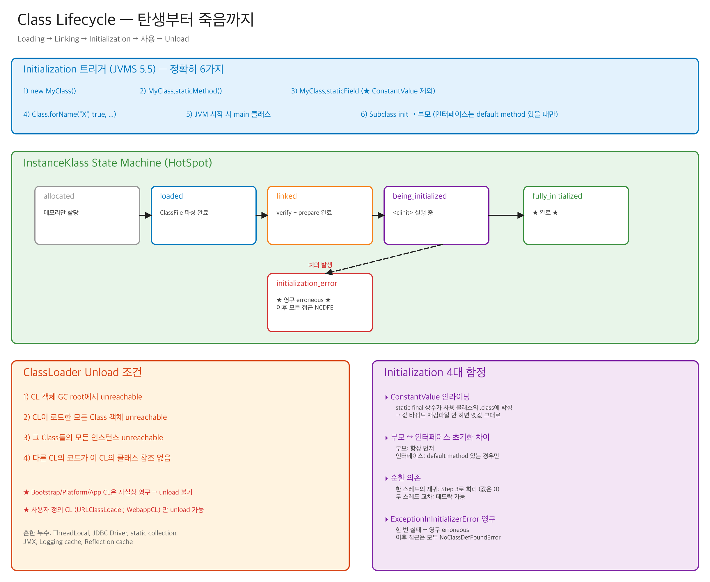

# 01-04. Initialization & Class Unload — clinit의 함정과 ClassLoader 회수

> Initialization 한 줄짜리 설명: "static 블록 실행".
> 그런데 그 한 줄에 **JLS 12.4.2의 12단계 락 절차**, **순환 초기화의 데드락 회피**, **상속 시 초기화 순서**, **lazy initialization 패턴**의 모든 함정이 다 들어있다.
> 그리고 끝에는 클래스가 어떻게 죽는가 — ClassLoader unload.

---

## 🗺️ JVM 라이프사이클 안에서 이 챕터의 위치

이 챕터는 클래스 라이프사이클의 **마지막 두 단계** — Initialization(`<clinit>`)과 Unloading(ClassLoader 회수)을 다룬다.

<details>
<summary>📌 클래스 라이프사이클 전체 다이어그램 펼치기</summary>



</details>

```
   .java ──javac──► .class
                       │
                       ▼
                   Loading                                  → [02-classloader-hierarchy](./02-classloader-hierarchy.md)
                       │
                       ▼
                   Linking (Verify, Prepare, Resolve)       → [03-linking](./03-linking.md)
                       │
                       ▼  ★ 이 챕터 (전반) ★
                   Initialization (<clinit>)
                       │
                       ▼
                   Usage (메서드 호출, 객체 생성)
                       │
                       ▼  ★ 이 챕터 (후반) ★
                   Unloading (ClassLoader unreachable → CLD chunk free)
```

**이전 챕터와의 연결**:
- ← [01-classfile-format](./01-classfile-format.md): `<clinit>`는 javac가 ClassFile에 합성한 메서드.
- ← [02-classloader-hierarchy](./02-classloader-hierarchy.md): Unloading의 주체는 ClassLoader (CLD 단위 회수).
- ← [03-linking](./03-linking.md): Linking이 끝나야 Initialization 시작.

**관련된 다른 챕터**:
- → [02-runtime-data-areas/02-metaspace](../02-runtime-data-areas/02-metaspace-and-class-space.md): ClassLoader 누수의 5대 패턴 + Metaspace에서 chunk가 어떻게 free되는지.

### 🎯 책임 경계 — Initialization은 **JVM Initializer**가 한다 (ClassLoader 아님)

> 4개 챕터 전체의 책임 경계는 [README.md의 책임 경계 표](./README.md#-가장-헷갈리는-한-가지--누가-무엇을-하는가-책임-경계)에 박혀있다. 이 챕터는 그중 **마지막 주체 — JVM Initializer**의 책임을 다룬다.

| 시점 | 주체 | 무엇을 하나 |
|---|---|---|
| 컴파일 타임 | **javac** | `<clinit>`을 합성해 `.class`에 박음 → 01장 |
| 런타임 - 첫 참조 시 | **ClassLoader** | `.class` → `Class` 객체 (**Loading만**) → 02장 |
| 런타임 - Loading 직후 | **JVM Linker** | Verify · Prepare · Resolve → 03장 |
| 런타임 - **Active Use 시점** | **JVM Initializer** | ★ **이 챕터** — `<clinit>` 실행, JLS 12.4.2 12-step 락 |
| 런타임 - 마지막 | **GC + ClassLoader 회수** | Class Unloading (CLD 단위)|

#### 가장 자주 묻는 질문 — 락은 누가, 언제, 어디에 잡는가

> **"`.class`로 컴파일된 클래스를 ClassLoader가 초기화 과정 중에 락을 세팅하는 건가?"**

**아니다. 세 가지 오해를 한 번에 풀면:**

1. **ClassLoader는 "초기화"를 안 한다**
   ClassLoader는 Loading 단계까지만 책임. `<clinit>` 실행과 그 락 절차는 **JVM 본체(Initializer)**가 한다. ClassLoader.loadClass()가 끝났다고 해서 init이 시작된 것도 아니다.

2. **락은 "세팅되는" 게 아니라 Class 객체에 **항상** 박혀있다**
   각 `Class` 객체는 생성 순간부터 내부 모니터(HotSpot: `InstanceKlass._init_lock`)를 들고 있다. 12-step은 이미 박혀있는 락을 **사용하는 절차**지, **만드는 절차가 아니다**.

3. **락이 실제로 잡히는 시점은 Active Use 발동 직후**
   `new A()`, `A.staticMethod()`, `A.staticField`, `Class.forName(name, true)` 같은 트리거 바이트코드가 실행되는 순간, JVM이 그 클래스의 `_init_lock`을 잡고 12-step에 진입한다. Active Use가 없으면 **클래스가 로드돼 있어도 락은 안 잡힌다**.

#### init lock의 정체

```
Class 객체 (메모리에 1개, ClassLoader가 만들어 둔 것)
├─ _init_state    : not_initialized / being_initialized / fully_initialized / init_error
├─ _init_thread   : 지금 <clinit>을 돌리고 있는 스레드 (재진입 판별용)
└─ _init_lock     : ← ★ 12-step이 잡는 락 (per-Class 내부 모니터)
```

특징:
- **클래스마다 하나** (전역 락 아님 → 서로 다른 클래스의 init은 병렬 가능)
- **`synchronized(A.class)`로 사용자가 잡는 모니터와는 별개** (사용자 코드에서 접근 불가)
- ClassLoader가 만드는 게 아니라, Class 객체가 만들어질 때 JVM이 자동으로 부여

핵심 한 줄: **javac가 `<clinit>`을 만들고, ClassLoader가 Class 객체를 메모리에 올리고, JVM Initializer가 Active Use 시점에 그 Class에 박혀있는 `_init_lock`으로 12-step을 돌려 `<clinit>`을 정확히 한 번 실행한다.**

---

## 📍 학습 목표

1. Initialization이 트리거되는 6가지 조건을 외운다.
2. `<clinit>` 메서드가 무엇이고 어떻게 생성되는지 안다.
3. JLS 12.4.2의 12-step lock 절차를 도식화할 수 있다.
4. 부모 클래스 초기화 순서와 인터페이스의 예외를 안다.
5. 순환 의존 초기화에서 데드락이 안 일어나는 이유를 안다.
6. ClassLoader unload의 조건과 어떻게 안 일어나는지(누수)를 안다.
7. 클래스 redefinition (JVMTI, JRebel)의 한계를 안다.

---

## 🎨 1단계: 백지 그리기 가이드

### Step 1: 좌측 — 6가지 Initialization 트리거

박스 6개:
1. `new MyClass()`
2. `MyClass.staticMethod()`
3. `MyClass.staticField` / `staticField = ...` (단, ConstantValue 제외)
4. `Class.forName("MyClass")` (initialize=true)
5. main 클래스 (JVM 시작 시)
6. Subclass 초기화 (부모는 항상 먼저)

### Step 2: 중앙 — JLS 12.4.2 락 절차

> 📛 **JLS 12.4.2** = Java Language Specification §12.4.2 "Detailed Initialization Procedure" — `<clinit>`(클래스 이니셜라이저, "클리닛")을 어떤 락 순서로 실행할지 정한 표준 명세.
>
> 💡 **왜 12단계나 되는 락 절차가 필요한가**: 여러 스레드가 동시에 같은 클래스를 처음 접근해도 `<clinit>`은 **정확히 한 번**, **happens-before가 보장된 채로**, **부분 상태 노출 없이** 실행돼야 함. 락은 그 보장을 위한 게이트일 뿐, `<clinit>` 본문 자체를 직렬화하지 않음 — 그래서 단계가 "락 잡기 → state 확인 → 마킹 → 락 해제 → `<clinit>` 실행 → 결과 마킹"으로 갈라짐.

12 단계 박스를 위에서 아래로:
1. CL 동기화 락 획득
2. 다른 스레드가 init 중이면 wait
3. 이 스레드가 이미 init 중이면 (재귀) → 그냥 빠져나옴
4. erroneous면 NCDFE
5. 초기화 진행 중으로 마킹
6. 락 해제
7. 부모 클래스 초기화 (재귀)
8. assertion check
9. `<clinit>` 실행
10. 완료 마킹
11. 다른 스레드 깨움
12. (에러 시) erroneous 마킹

### Step 3: 우측 — Class Unload 조건

```
[CL이 GC root에서 unreachable]
       ↓
[CL이 로드한 모든 Class 객체 unreachable]
       ↓
[그 Class들의 모든 인스턴스 unreachable]
       ↓
[다른 CL의 의존성 없음]
       ↓
[Java Heap GC] → CL oop dead
       ↓
[Metaspace GC] → CLD 해제
       ↓
[클래스 unload 완료]
```

### Step 4: 하단 — Initialization 함정 4가지
- ConstantValue inlining
- 부모 vs 인터페이스 초기화 차이
- 순환 의존
- ExceptionInInitializerError 후 영구 broken

### 정답 그림

<details>
<summary>📌 정답 그림 펼치기 (먼저 백지에 그려본 후 확인)</summary>


</details>

> 편집은 [04-class-lifecycle.excalidraw](./_excalidraw/04-class-lifecycle.excalidraw)을 [excalidraw.com](https://excalidraw.com/)에서 "Open"으로.

---

## 🧠 2단계: 직관

### 핵심 비유

> 회사 입사 비유:
> - **Loading** = 이력서 제출
> - **Verification** = 신원 조회
> - **Preparation** = 책상/사원증 배정 (빈 상태)
> - **Resolution** = 부서 배치 (lazy: 첫 업무 시)
> - **Initialization** = OT (오리엔테이션) — **딱 한 번**만, **순서 있음** (부장님 OT 먼저, 그 다음 신입)

### 왜 Initialization은 단 한 번인가

> JVMS 5.5: "A class or interface T may be initialized only as a result of: ..."
> 그 트리거 조건이 만족되는 순간 한 번. 두 번은 절대 안 됨.
>
> 이유:
> 1. **Static 필드의 일관성**: 두 번 초기화하면 첫 번째와 두 번째 값이 다를 수 있어 (timestamp 등) 동일 클래스의 동작이 비결정적.
> 2. **Side effect 통제**: static 블록에서 외부 리소스 (파일 열기, DB 연결) 할당 시 두 번 실행되면 자원 누수.
> 3. **JMM 보장**: `<clinit>` 끝남 = 모든 static 필드 publish — happens-before. 두 번 실행은 이 보장을 깨뜨림.

### 왜 부모는 먼저, 인터페이스는 lazy인가

> 부모: 자식 클래스가 부모의 static 멤버에 의존할 수 있음 → 미리 초기화.
> 인터페이스: 다중 상속 가능 + default method 도입(JDK 8) → 모든 super interface를 미리 초기화하면 비용 큼 → **사용하는 시점에 lazy 초기화** (단, default method가 있는 interface만).

---

## 🔬 3단계: 구조

## 1️⃣ Initialization 트리거 (JVMS §5.5)

> ⚡ **이 챕터에서 가장 먼저 이해해야 할 원리** — 이거 모르고 6+6 케이스를 외우면 절대 안 외워진다. 이 원리 알고 보면 단 한 번에 다 풀린다.

### 🎯 핵심 원리 — Active Use vs Passive Use

> **JVM은 그 클래스의 `<clinit>` 결과(static 필드의 의미 있는 값, side effect)에 실제로 의존할 때만 init한다.**
> "타입 정보만" 또는 "이름만" 필요하면 init **안 함**.

이걸 JLS 12.4.1 옛 표현으로 **active use(능동 사용) vs passive use(수동 사용)**라고 했다. 용어는 deprecate됐지만 개념은 그대로 유효.

```
┌──────────────────────────────────────────────────────────────┐
│ 결정 질문:                                                    │
│ "그 클래스의 <clinit>이 만든 static state나 side effect를     │
│  실제로 사용해야 하는가?"                                     │
└──────────────────────────────────────────────────────────────┘
       │                                       │
       Yes (Active Use)                        No (Passive Use)
       │                                       │
       ▼                                       ▼
┌─────────────────────┐                ┌──────────────────────┐
│ init 트리거 발동    │                │ init 불필요          │
├─────────────────────┤                ├──────────────────────┤
│ • new A()           │                │ • A.X (ConstantValue)│
│ • A.staticMethod()  │                │ • new A[10]          │
│ • A.staticField     │                │ • forName(name,false)│
│ • forName(name,true)│                │ • A.class            │
│ • main 클래스       │                │ • obj instanceof A   │
│ • Subclass init     │                │ • (A) obj            │
└─────────────────────┘                └──────────────────────┘
```

### ❗ 흔한 오해 — Stack/Heap 위치는 기준이 아니다

> "Stack에 쌓이는 건 거기서 끝나니까 init 안 하고, Heap에서 static하게 공유되는 건 init한다"
> → **틀림.**

반례:
- `A.class` literal은 **Heap의 Class 객체**를 사용하는데도 init 안 함.
- `instanceof A`도 **Heap의 Klass 메타데이터**를 보는데도 init 안 함.
- `new A[10]`도 **Heap에 배열 객체**를 만드는데도 init 안 함.

메모리 위치(Stack vs Heap)가 기준이 아니라, **"그 클래스의 코드/값이 실제로 의미 있게 사용되는가"**가 기준.

### 왜 active use는 init이 필수인가 — 한 줄씩

| Active Use | init이 필요한 이유 |
|------------|------------------|
| `new A()` | 생성자가 static 필드/메서드에 의존 가능. static state ready 안 되면 NPE. |
| `A.staticMethod()` | 메서드 body가 static 필드 사용 가능. `<clinit>` 안 돌면 default(null/0) 상태. |
| `A.staticField` | 필드의 **값** 자체가 의미 있어야 함. Preparation 단계 default → `<clinit>`에서 진짜 값. |
| `Class.forName(name, true)` | API 명세상 init 완료 보장. JDBC Driver 등록의 `<clinit>` 활용이 대표 패턴. |
| main 클래스 | `main()` static 메서드 호출 → 위의 case 2와 동일. |
| Subclass | Child의 `<clinit>`이 Parent의 static state 사용 가능. Parent 없이 Child 동작 불가. |

### 왜 passive use는 init이 불필요한가 — 한 줄씩

| Passive Use | init이 불필요한 이유 |
|-------------|--------------------|
| `A.X` (ConstantValue) | 컴파일러가 사용처에 **literal 인라이닝** (`bipush 10`). 런타임에 A를 안 봐도 됨. |
| `new A[10]` | 배열은 `[LA;`라는 **별도 합성 클래스**의 인스턴스. A 코드 한 줄도 안 돌림. |
| `forName(name, false)` | API 호출자가 명시적으로 "init 안 함" 선언. JVM은 그대로 따름. |
| `A.class` | mirror Class 객체만 가져옴. Loading+Linking까지면 충분. static state 안 씀. |
| `obj instanceof A` | **타입 계층 검사**만. Klass 메타데이터 검색. static 값 안 씀. |
| `(A) obj` cast | instanceof와 동일 원리. **타입 검사**만. A의 코드 실행 안 함. |

### 시니어 운영 관점 — 이 원리가 풀어주는 의문들

1. **`Class.forName("com.mysql.cj.jdbc.Driver")`의 본질**: Driver의 `<clinit>`에서 `DriverManager.registerDriver(this)`를 호출하는 **side effect를 트리거**하려는 active use. `forName(name, false)`로 호출하면 등록 안 됨.

2. **Spring `ClassPathScanner`가 안 쓰는 클래스도 발견할 수 있는 이유**: `forName(name, false)`로 메타데이터만 읽어 빈 후보를 추림 → 안 쓸 클래스는 init 안 됨. 실제 빈 생성 시 `new`로 active use 발생.

3. **Lazy initialization 패턴의 비밀**: `Class<?> c = A.class;`로 Loading만 끝내두고, 진짜 필요할 때 `c.getDeclaredConstructor().newInstance()`로 init.

4. **AppCDS와 Native Image의 분기점**: CDS는 passive use 결과(Loading/Linking)를 archive. Native Image는 active use(`<clinit>`)까지 build-time에 실행 → environment-specific 값 함정 발생.

5. **테스트의 흔한 함정**: `Mockito.mock(A.class)`는 `A.class` literal만 사용 → passive use → A의 static block 안 돎. static state 의존 코드의 테스트는 명시적 init 필요.

---

### 이제 케이스별로 — 위 원리를 6+6에 적용

정확히 6가지:

```java
1. new MyClass()                          // ★ instance 생성
2. MyClass.staticMethod()                  // static 메서드 호출
3. MyClass.staticField                     // static 필드 읽기
   MyClass.staticField = ...               // static 필드 쓰기
   // 단, ConstantValue attribute가 있는 final field는 트리거 X
4. Class.forName("MyClass")                // (initialize=true)
   // Class.forName(name, false, loader)는 트리거 X
5. JVM 시작 시 main 클래스                  // java MyMainClass
6. MyClass extends Parent or implements I → MyClass 초기화 시 Parent도 (인터페이스는 조건부)
```

### 트리거 안 되는 경우

```java
// 1. ConstantValue
class A {
    public static final int X = 10;  // ConstantValue
}
System.out.println(A.X);            // A 초기화 X

// 2. 배열 생성
A[] arr = new A[10];                 // A 초기화 X (인스턴스는 안 만듦)

// 3. Class.forName(initialize=false)
Class<?> c = Class.forName("A", false, loader);  // A 초기화 X

// 4. .class 리터럴
Class<?> c = A.class;                // A 초기화 X (linking까지만)

// 5. instanceof
boolean b = obj instanceof A;        // A 초기화 X

// 6. assignment compatibility check
Object o = (A) obj;                  // A 초기화 X
```

> 함정: `A.class.newInstance()`는 A.class에 접근만 하므로 초기화 X. 하지만 `newInstance()` 호출이 결국 `new` 와 동등하므로 그 시점에 초기화.

## 2️⃣ `<clinit>` 메서드

> ⚡ **외우지 말고 "왜 JVM이 이걸 가져갔는가"부터 이해할 것.**

### 📛 이름의 뜻 — `<clinit>`은 무엇의 줄임인가

- `<clinit>` = **"class initializer"** 의 줄임 — 그 클래스 전체의 초기화자.
- 발음: 보통 **"클리닛"** (cl-init). "씨엘-이닛"이라고도 부름.
- 짝이 되는 메서드: `<init>` = **"instance initializer"** = 생성자.
  - `<clinit>` : 클래스 단위, 1회.
  - `<init>` : 인스턴스 단위, 매 `new`마다.
- 왜 이름이 `<`로 시작? — **사용자가 자바 식별자로 못 만들 이름**이라서. "이건 JVM 내부만의 메서드다"의 강제 시그널.

### 🎯 핵심 원리 — 왜 javac가 `<clinit>`을 자동으로 만드는가

> Static 초기화는 **사용자에게 맡기면 무조건 깨진다.** 그래서 JVM이 강제로 회수한 것.

Static 초기화가 반드시 지켜야 하는 4가지:
1. **정확히 1회 실행**
2. **소스 코드 순서대로**
3. **끝나면 모든 static 필드가 모든 스레드에 visible** (happens-before)
4. **어느 스레드가 트리거했든 동일한 결과**

이걸 사용자가 직접 `initialize()` 메서드로 짠다면:
- 누구는 호출 까먹음.
- 누구는 두 번 호출.
- thread-safety는 사용자가 매번 직접 짜야 함.
- 라이브러리 사용자는 그 존재조차 모름.

그래서 JVM의 선언:
> **"Static 초기화는 내가 책임진다. 너는 `static` 키워드만 써."**

### 그래서 어떻게 풀었나 — 세 가지 설계 결정

| 결정 | 왜 |
|------|----|
| 모든 static initializer + static block을 **한 메서드에 통째로** 합성 | "끝났다/안 끝났다" 두 상태로 단순화. 단계별 트래킹 불필요. |
| **소스 코드 등장 순서대로** 합성 | 프로그래머의 의도(위에서 아래) 보존. 의존성도 자연스럽게 해결. |
| 이름을 `<clinit>` — **사용자가 못 만들고 못 호출하는 이름**으로 | "사용자 손대지 마"의 강제 메커니즘. JVM만의 영역으로 격리. |

이 세 결정의 공통점: **모든 통제를 JVM이 쥐고, 사용자에게는 선언적 인터페이스(`static` 키워드)만 노출**.

### 무엇이 들어가나

```java
class Example {
    static int x = 1;          // static field initializer
    static int y;
    static String s = "hi";

    static {                    // static block
        y = 2;
        System.out.println("Initialized");
    }

    static int z = compute();   // 또 다른 initializer

    static int compute() {
        return 42;
    }
}
```

생성되는 `<clinit>`:
```
static void <clinit>() {
    x = 1;                    // line 2
    s = "hi";                  // line 4
    // static block
    y = 2;
    System.out.println("Initialized");
    // 다음 initializer
    z = compute();
}
```

> 순서: **소스 코드 등장 순서** 그대로. static field initializer와 static block이 섞이면 등장 순서대로.

### 명시적으로 호출 못 함

`<clinit>`은 JVM만 호출. 사용자 코드에서 `invokestatic` 못 함.
이름이 `<`로 시작 — 일반 메서드 이름 규칙 위반 → javac/사용자가 못 만듦.

비슷한 메서드 `<init>` (생성자) 도 같은 패턴.

## 3️⃣ JLS 12.4.2 — 12-step Lock 절차

> ⚡ **12-step은 외우지 말 것. "왜 락이 필요했고, 왜 이런 모양으로 풀었나"만 잡으면 단계는 저절로 따라온다.**

> 🎯 **주체 다시 한 번**: 이 12-step을 **잡는 주체는 JVM Initializer**다. ClassLoader가 아니고, javac도 아니다.
> **잡는 락**은 각 `Class` 객체에 박혀있는 **per-Class `_init_lock`** (앞선 [책임 경계 박스](#-책임-경계--initialization은-jvm-initializer가-한다-classloader-아님) 참조).
> **잡는 시점**은 어떤 스레드가 **Active Use 바이트코드**(`new`, `getstatic`, `invokestatic`, `putstatic`, `Class.forName(name, true)`, subclass 트리거 등)를 실행하는 바로 그 순간.

### 📛 JLS 12.4.2가 정확히 뭔가

- **JLS** = **Java Language Specification** (자바 언어 명세서). 자바 언어가 어떻게 동작해야 하는지를 정의한 공식 표준 문서.
- **§12.4** = "Initialization of Classes and Interfaces" (클래스·인터페이스의 초기화)
- **§12.4.2** = "Detailed Initialization Procedure" (초기화의 상세 절차) — `<clinit>`을 정확히 어떤 락 순서로 실행해야 하는지 12 단계로 못박은 절.
- 자매 문서: **JVMS** = **Java Virtual Machine Specification** (JVM이 어떻게 구현돼야 하는지를 정의). §5.5에 초기화 트리거 조건이 명시.
- 즉, "JLS 12.4.2"라고 하면 **자바 언어 표준의 12장 4절 2항 — 초기화 절차의 정확한 명세**를 가리킴. JDK 8/11/17/21 모두 이 절을 기준으로 동작.

### 🎯 핵심 원리 — 락은 무엇을 막고 무엇을 보장하는가

#### 락이 없으면 깨지는 3가지

여러 스레드가 동시에 같은 클래스를 처음 접근하면:
1. **중복 실행** — `<clinit>`이 두 번 돌면 DB connect 두 번, 파일 핸들 두 번 → 자원 누수.
2. **결과 비결정** — 누가 늦게 끝났는지에 따라 static 필드 값이 달라짐.
3. **부분 상태 노출** — 다른 스레드가 만들다 만 객체를 봄 → NPE.

#### 락이 있으면 보장되는 3가지

1. **정확히 한 번 실행** — 한 스레드만 진짜 실행, 나머지는 대기 후 완성된 결과만 봄.
2. **happens-before** — `<clinit>`의 모든 쓰기가 다른 스레드에 visible (notifyAll/wait 짝이 메모리 배리어).
3. **부분 상태 노출 없음** — 항상 완성된 결과만 노출.

### 세 가지 설계 결정 — 왜 이런 모양으로 풀었나

| 결정 | 왜 |
|------|----|
| **클래스마다 별도 락** (`InstanceKlass.init_lock`) | 전역 락 하나면, A의 `<clinit>`이 B를 트리거할 때 자기 락에 갇혀 자기 데드락. 클래스 단위 독립이 필수. |
| **같은 스레드의 재진입은 통과** | 순환 의존(`class A {static int x = B.y;} class B {static int y = A.x;}`)에서 자기가 들고 있는 락을 다시 잡으면 자기 데드락 → "같은 스레드면 그냥 return"으로 회피. |
| **락은 짧게 잡고, `<clinit>` 본문은 락 없이 실행** | `<clinit>`은 수초~수분 걸릴 수 있음. 락은 **"누가 INITIALIZING의 주인인지 결정하는 진입 게이트"**일 뿐, 본문을 직렬화하는 게 아님. |

이 마지막 결정이 가장 중요한 통찰:
> **락이 보호하는 건 "state transition"이지 "`<clinit>` 본문"이 아니다.**
> `<clinit>` 실행 중에는 `state = INITIALIZING` 마킹만 한 채로 락은 풀어둠. 다른 스레드는 그 state를 보고 wait. 같은 스레드는 자기가 주인이므로 그냥 통과.

### 12-step을 외우지 않고 이해하는 3축

```
┌──────────────────────────────────────────┐
│ 축 1. State machine                       │
│   loaded → linked → INITIALIZING          │
│        → INITIALIZED                      │
│        → ERRONEOUS (영구 broken)          │
├──────────────────────────────────────────┤
│ 축 2. 진입 게이트 (락 잡고 state 확인)    │
│   - INITIALIZED → 통과                    │
│   - ERRONEOUS  → NoClassDefFoundError     │
│   - INITIALIZING(다른 스레드) → wait      │
│   - INITIALIZING(같은 스레드) → 통과(재귀)│
│   - 새로 시작 → INITIALIZING 마킹 후 락 해제│
├──────────────────────────────────────────┤
│ 축 3. 실행 + 결과 마킹                    │
│   부모 먼저 → <clinit> 실행                │
│   정상 → INITIALIZED + notifyAll          │
│   예외 → ERRONEOUS + 영구 broken          │
└──────────────────────────────────────────┘
```

12-step의 각 단계는 이 3축의 자연스러운 구현일 뿐. **"왜 이런 절차가 필요한가"** 답할 수 있으면 시니어 시그널, **"12-step 순서를 다 외웠다"**는 그냥 외운 것.

### 12 단계 (참고용 — 외우지 말고 위 3축으로 해석)

```
Step 1. Class object의 init lock 획득 (각 Class마다 별도 락)
Step 2. 다른 스레드가 init 중이면 → wait, lock 풀고 끝나면 다시 가져옴
Step 3. 현재 스레드가 이미 이 클래스를 init 중이면 → unlock하고 종료 (재귀 호출 회피)
Step 4. 클래스가 이미 init 완료면 → unlock하고 종료 (정상 케이스)
Step 5. 클래스가 erroneous 상태면 → unlock + NoClassDefFoundError throw
Step 6. 이 스레드가 init 중이라고 마킹 (state = INITIALIZING)
Step 7. lock 해제 (★ 여기서 풀어야 다른 스레드가 wait에 들어갈 수 있음)
Step 8. final static 필드 (ConstantValue 외)와 static block 외 (사실 step 9에서 함)
        — 실제로는 step 9에 통합됨
Step 9. (인터페이스가 아니면) super 클래스 초기화 (재귀)
       슈퍼 인터페이스 중 default method 가진 것 초기화 (재귀)
Step 10. <clinit> 실행
        - 정상 완료 → state = INITIALIZED, lock 다시 잡고 다른 스레드 깨움 (notifyAll)
        - 예외 발생 → state = ERRONEOUS, ExceptionInInitializerError로 wrap, 다른 스레드 깨움
Step 11. (보통 통합) 다른 스레드 깨움
Step 12. (에러 시) erroneous mark
```

### 재귀 호출 (Step 3) — 데드락 회피

```java
class A {
    static int x = B.y;       // B 초기화 트리거
}

class B {
    static int y = A.x;       // A 초기화 트리거 — 순환!
}
```

만약 스레드 T1이 A를 먼저 초기화 시작:
1. A의 락 잡음. state(A) = INITIALIZING.
2. A의 `<clinit>` 실행 → `B.y` 접근 → B 초기화 트리거.
3. B의 락 잡음. state(B) = INITIALIZING.
4. B의 `<clinit>` 실행 → `A.x` 접근 → A 초기화 트리거.
5. **Step 3 매칭**: "이 스레드가 이미 A를 init 중이다." → 그냥 return.
6. → A.x를 (아직 초기화 안 된 0) 값으로 읽음 → B.y = 0.
7. B 초기화 완료. T1이 A로 돌아옴 → A.x = 0 (B.y의 현재 값).
8. → 둘 다 0이 됨. 데드락은 아니지만 **순환 의존의 결과는 비직관적**.

### 데드락이 일어나는 경우

```java
// Thread T1
class A {
    static { B.foo(); }    // B 초기화 트리거
}

// Thread T2
class B {
    static { A.foo(); }    // A 초기화 트리거
}

T1.start();  // A 초기화 시작
T2.start();  // B 초기화 시작 (T1이 A 락 잡은 상태에서)
```

- T1: A의 락 잡음 → B 초기화 시도 → B의 락 잡으려 함 → 대기.
- T2: B의 락 잡음 → A 초기화 시도 → A의 락 잡으려 함 → 대기.
- → **데드락**.

JVM은 이 케이스를 감지 못 함. 진단: `jstack`으로 두 스레드가 서로의 Class init lock 대기 발견.

> 이걸 막으려면: static block에서 다른 클래스를 호출 안 하는 것이 좋다. 또는 호출하더라도 한쪽 방향으로만.

## 4️⃣ 부모 초기화 vs 인터페이스 초기화

### 부모 클래스 (extends)

JLS 12.4.1 — **항상 먼저**:
```java
class Parent {
    static { System.out.println("Parent init"); }
}
class Child extends Parent {
    static { System.out.println("Child init"); }
}

new Child();
// 출력:
// Parent init
// Child init
```

### 인터페이스 (implements) — 까다로움

JDK 7까지: 인터페이스에 static 필드 외에 다른 것 없음 → 클래스 초기화 시 인터페이스는 초기화 안 함.

JDK 8+: default method 등장 → 인터페이스도 "실행 코드"를 가질 수 있음 → 초기화 필요.

JLS 12.4.1 (JDK 8+):
> "A class or interface I is initialized just before ... if I has at least one **non-abstract** default method"

```java
interface IWithDefault {
    static int x = init();
    static int init() {
        System.out.println("Interface init");
        return 42;
    }
    default void foo() {}   // default method!
}

interface IWithoutDefault {
    static int y = init();
    static int init() {
        System.out.println("이건 출력 안 됨");
        return 99;
    }
}

class C implements IWithDefault, IWithoutDefault {}

new C();
// 출력: Interface init   (IWithDefault만)
// IWithoutDefault는 default method가 없어 lazy
```

> 함정: `IWithoutDefault.y`를 직접 읽을 때만 초기화. 단순히 implements만 하면 X.

---

### 🗺️ 여기까지가 챕터 전반 (Initialization). 다음은 후반 (Unloading).

> 1~4️⃣까지가 클래스가 **태어나 사용되는 단계**였다면, 이제 클래스가 **죽는 단계**로 넘어간다.
>
> ```
> Loading ──► Linking ──► [★ Init: 방금까지 ★] ──► Use ──► [★ Unload: 지금부터 ★]
> ```
>
> Unloading은 ClassLoader unreachable과 직결. Metaspace의 chunk가 free되는 메커니즘은 [02-runtime-data-areas/02-metaspace](../02-runtime-data-areas/02-metaspace-and-class-space.md)와 같이 읽으면 그림이 완성된다.

---

## 5️⃣ Class Unload — 클래스의 죽음

### Unload 조건

다음 **모두** 만족 시:
1. ClassLoader 객체가 GC root에서 unreachable.
2. 그 ClassLoader가 로드한 모든 `java.lang.Class` 객체가 unreachable.
3. 그 클래스들의 모든 인스턴스가 unreachable.
4. 다른 CL의 클래스가 이 CL의 클래스를 reference로 들고 있지 않음.

> Bootstrap CL이 로드한 클래스는 **절대 unload 안 됨** — Bootstrap CL은 GC 안 됨.

### Unload 절차

```
1. Heap GC 사이클 시작
2. Marking 중 ClassLoader oop이 unreachable로 판정
3. CL의 ClassLoaderData (CLD) 객체를 dead로 마킹
4. 그 CLD가 가리키는 모든 InstanceKlass, ConstantPool, Method 등도 dead
5. (이건 G1/ZGC/Shenandoah마다 다름)
   - G1: `ClassUnloadingWithConcurrentMark` (기본 on)에서 동시 처리
   - ZGC: concurrent class unloading
6. Metaspace GC 사이클: dead CLD의 chunk를 free list로 반환
7. Code Cache: 그 클래스의 JIT 코드도 invalidate
8. SystemDictionary에서 entry 제거
```

### 누수 시나리오

#### A. ThreadLocal 누수

```java
// Web app A의 ServletContextListener
class MyListener implements ServletContextListener {
    static ThreadLocal<MyData> CONTEXT = new ThreadLocal<>();

    public void contextInitialized(ServletContextEvent e) {
        // 요청 처리 중 어딘가에서 CONTEXT.set(new MyData());
        // → MyData는 WebappCL이 로드한 클래스
    }
}
```

문제:
- Tomcat ThreadPool의 스레드가 reusable.
- 첫 요청에서 ThreadLocal에 MyData 인스턴스 보관.
- WebApp redeploy → WebappCL이 새로 만들어짐.
- 옛 ThreadLocal entry는 그대로 → 옛 MyData 인스턴스 reference 보관 → 옛 MyData의 Class → 옛 WebappCL.
- → 옛 WebappCL이 GC 안 됨.

#### B. JDBC Driver

```java
Class.forName("com.mysql.cj.jdbc.Driver");
// Driver의 static init: DriverManager.registerDriver(this);
// DriverManager는 Bootstrap CL이 로드.
// 그 DriverManager가 WebappCL의 Driver 인스턴스 reference 보관.
```

수정: WebApp 종료 시 deregisterDriver.

#### C. Static collection in parent CL

```java
// AppCL이 로드한 com.acme.Cache
public class Cache {
    public static final Map<String, Object> CACHE = new HashMap<>();
}

// WebApp이 사용
Cache.CACHE.put("key", new WebAppObject());
// → CACHE가 WebAppObject 인스턴스 보관 → WebAppObject의 Class → WebappCL 누수
```

#### D. Reflection cache

`Class.getMethods()` 결과를 부모 CL의 코드가 캐시.

### Unload 진단

```bash
# 1. 현재 CLD 목록
jcmd <pid> VM.classloader_stats

# 2. heap dump
jcmd <pid> GC.heap_dump /tmp/dump.hprof

# 3. MAT으로 분석
#    Histogram → java.lang.ClassLoader 검색
#    옛 WebappCL의 incoming references 추적
#    어떤 GC root가 들고 있는지 발견

# 4. -XX:+TraceClassUnloading 옵션 (deprecated, -Xlog:class+unload로 대체)
java -Xlog:class+unload:stdout MyApp
```

## 6️⃣ Class Redefinition (JVMTI, JRebel)

### JVMTI Agent

```c
// Java Agent (Native) — JVMTI
jvmtiError result = (*jvmti)->RedefineClasses(
    jvmti, 1, &class_def);
```

`RedefineClasses`의 제약:
- 메서드 body는 변경 가능.
- 메서드 시그니처/이름은 변경 불가.
- 필드 추가/삭제 불가.
- 클래스 hierarchy 변경 불가.
- 어노테이션 변경 불가.

JDK 9에서 `RetransformClasses` 추가 — 비슷하지만 transformation 체인이 다름.

### JRebel — 더 자유로움

JRebel은 JVMTI + 자체 ClassLoader transformation으로 **메서드 추가, 필드 추가**까지 지원.
원리: 새 클래스를 새 hidden class로 정의 + 옛 클래스의 reference를 invokedynamic으로 redirect.

비용: agent attach 오버헤드, Metaspace 누수 가능성.

### Spring DevTools

자체 restartable ClassLoader 두 개:
- **base CL**: 변경 안 되는 라이브러리 (Spring, libs)
- **restart CL**: 변경되는 사용자 코드 (자식)

코드 변경 시 restart CL만 재생성 → base CL 유지하면서 빠른 reload.

## 7️⃣ JVM 워밍업 — Lazy Initialization과 P99 최적화

### 왜 워밍업이 필요한가

JVM의 Initialization은 **lazy** — 트리거가 와야만 `<clinit>` 실행. 이 lazy 모델의 비용은 **첫 트래픽 N개 요청에 init 비용이 집중**되며 P99/P99.9 tail latency 스파이크로 드러난다.

```
배포 직후 latency 그래프 모양:

  P99
   │   ▲▲▲▲           ← init + JIT 비용 폭주
   │  ▲    ▲▲▲
   │ ▲       ▲▲▲▲▲▲
   │▲              ▲▲▲▲▲▲▲▲▲▲▲▲▲▲▲▲   ← 안정 상태
   └─────────────────────────────────► time
   배포                              30s 후
```

첫 요청의 비용 구성:
```
첫 호출 비용 = Loading + Linking + Initialization + JIT 컴파일 + 캐시 미스
```

P50(median)에는 거의 안 보이지만, P99/P99.9에 그대로 드러남.

### 워밍업의 5가지 기법

#### 1. Eager initialization (코드 레벨)

자주 쓰일 클래스를 시작 시점에 강제 트리거:

```java
public class WarmUp {
    static {
        // 트리거 #4: Class.forName(initialize=true)
        try {
            Class.forName("com.acme.HotPath1", true, WarmUp.class.getClassLoader());
            Class.forName("com.acme.HotPath2", true, WarmUp.class.getClassLoader());
        } catch (ClassNotFoundException e) {
            // 워밍업 실패는 fatal로 처리 (어차피 첫 요청에서 어차피 터졌을 것)
            throw new IllegalStateException(e);
        }
    }
}

// Spring 환경
@Component
public class WarmUpRunner implements ApplicationRunner {
    @Override
    public void run(ApplicationArguments args) {
        // 주요 빈을 직접 한 번 호출 → 빈 트리, JIT, init 모두 워밍업
        userService.findById(0L);
        productService.list(0, 10);
    }
}
```

#### 2. Synthetic traffic (워밍업 요청)

배포 직후 LB가 트래픽 붙기 전, **자기 자신에게 mock 요청**을 N번 보냄.

```
[배포] ──► [self warm-up loop 30s] ──► [readinessProbe OK] ──► [LB 트래픽 받음]
```

Kubernetes 환경:
- `readinessProbe`를 워밍업 끝난 후 OK로 응답하도록 구성
- Netflix 등이 이 패턴을 canary 전 워밍업으로 사용

#### 3. AppCDS / Dynamic CDS (Class Data Sharing)

```bash
# 1단계: 사용 패턴 기록
java -XX:ArchiveClassesAtExit=app.jsa -jar app.jar

# 2단계: 다음 실행에서 archive 사용
java -XX:SharedArchiveFile=app.jsa -jar app.jar
```

효과:
- Loading/Linking 단계를 미리 메모리에 매핑 → startup -20~40%
- **단, `<clinit>` 자체는 여전히 lazy** (CDS는 Load/Link만 archive)
- JDK 13+ Dynamic CDS, JDK 19+ Project Leyden으로 점점 강력해짐

#### 4. AOT (Ahead-of-Time)

- **GraalVM Native Image**: `--initialize-at-build-time=com.foo.Bar` → 빌드 시점에 `<clinit>` 실행, 그 결과 상태를 native image에 박음. 런타임 init 비용 0.
- **JEP 483 (JDK 24)**: Leyden의 AOT class loading.
- **함정**: build-time init한 클래스의 static 필드에 환경별 값(hostname, secret)을 박으면 안 됨 → 그건 runtime init.

#### 5. JIT 워밍업 (init과 별개지만 짝궁)

C1/C2 컴파일은 메서드 호출 횟수가 임계값을 넘어야 발동. Init과 별개의 워밍업 축.

```bash
# 컴파일 임계값 낮춤 (소량 호출에도 빠르게 컴파일)
-XX:CompileThreshold=1000

# Profile-Guided Optimization: 사전 프로파일 활용
-XX:+UseAOTProfiles
```

### 의사결정 트리 (시니어 운영 관점)

```
P99 스파이크 측정 (배포 직후 vs 안정 상태)
   │
   ├─ 차이가 작다 (수십 ms) → 그냥 둠. 워밍업 비용 > 이득
   │
   └─ 차이가 크다 (수백 ms ~ 수 초)
       │
       ├─ 모놀리스 + 자주 재배포
       │    → Synthetic traffic + readinessProbe 분리
       │
       ├─ Cold start 민감 (FaaS, Serverless, K8s 잦은 스케일링)
       │    → GraalVM Native Image / Project CRaC
       │
       ├─ Spring Boot 일반
       │    → AppCDS + ApplicationRunner 워밍업
       │
       └─ 라이브러리 무거움 (Hibernate, Spring 풀스택)
            → Dynamic CDS + Eager bean init
```

### 함정 — 놓치면 후회

1. **Eager init이 startup 시간을 늘린다**: 안 쓸 수도 있는 클래스까지 init하면 startup ↑. 트레이드오프.
2. **Static block의 부작용 폭탄**: 자주 쓰이는 클래스라고 다 미리 트리거하면, `<clinit>`에서 DB/네트워크 접근하는 게 있으면 startup이 외부 의존성을 타게 됨. 외부 시스템이 죽으면 앱이 아예 안 뜸.
3. **`<clinit>`은 단 한 번**: 워밍업 실패해도 retry 불가 → ExceptionInInitializerError → 그 클래스는 영구 broken (NoClassDefFoundError로 이후 모든 접근 실패). 워밍업을 너무 공격적으로 하면 전체 앱이 시작 못 함.
4. **JIT 워밍업과 헷갈리지 말 것**: Init은 `<clinit>` 1회. JIT은 메서드별 hotness 임계값. 둘 다 워밍업이지만 메커니즘 완전 다름.
5. **GraalVM의 build-time init 함정**: hostname/secret 등 환경별 값을 build-time init한 클래스 안에 두면 image에 하드코딩됨. `@RuntimeInitialization` 같은 메타로 명시적 제외 필요.
6. **워밍업 ≠ 캐시 hit**: DB 캐시, Redis 캐시는 별개. 워밍업이 클래스/JIT만 데우면 첫 요청은 여전히 캐시 miss로 느릴 수 있음.

### 실제 production 신호

토스/카카오뱅크/네이버 같은 곳에서 "배포 후 N초 P99 스파이크" 알람의 80%는 이 영역:
- 진단: `-Xlog:class+init=info` + JFR(`jdk.ClassLoad`, `jdk.Compilation`) → 어떤 클래스가 첫 요청 path에서 init되는지
- 결정: synthetic traffic vs AppCDS vs Native Image — 각각 비용/이득 비교
- 검증: 워밍업 전후 P99 그래프 비교 (배포 직후 30초 구간)

---

## 🧬 4단계: 내부 구현 — HotSpot

### `<clinit>` 호출

위치: `src/hotspot/share/oops/instanceKlass.cpp`

```cpp
// instanceKlass.cpp
void InstanceKlass::initialize_impl(TRAPS) {
  HandleMark hm(THREAD);

  // ★ Step 1: init lock 획득 ★
  Handle init_lock(THREAD, this->init_lock());
  ObjectLocker ol(init_lock, THREAD);

  // ★ Step 2: 다른 스레드 init 중이면 wait ★
  while (is_being_initialized() && !is_reentrant_initialization(jt)) {
    wait = true;
    jt->set_class_to_be_initialized(this);
    ol.wait_uninterruptibly(jt);
    jt->set_class_to_be_initialized(NULL);
  }

  // ★ Step 3: 이미 이 스레드가 init 중 (재귀) ★
  if (is_being_initialized() && is_reentrant_initialization(jt)) {
    return;  // 그냥 빠져나옴
  }

  // ★ Step 4: 이미 완료 ★
  if (is_initialized()) {
    return;
  }

  // ★ Step 5: erroneous ★
  if (is_in_error_state()) {
    DTRACE_CLASSINIT_PROBE_WAIT(erroneous, -1, wait);
    ResourceMark rm(THREAD);
    Handle cause(THREAD, get_initialization_error(THREAD));

    stringStream ss;
    ss.print("Could not initialize class %s", external_name());
    if (cause.is_null()) {
      THROW_MSG(vmSymbols::java_lang_NoClassDefFoundError(), ss.as_string());
    } else {
      THROW_MSG_CAUSE(vmSymbols::java_lang_NoClassDefFoundError(),
                       ss.as_string(), cause);
    }
  }

  // ★ Step 6: INITIALIZING으로 마킹 ★
  set_init_thread(jt);
  set_init_state(being_initialized);

  // ★ Step 7: lock 해제 (다른 스레드가 wait할 수 있도록) ★
  } // ObjectLocker 끝

  // ★ Step 9: super class init ★
  if (super_klass != NULL && !super_klass->is_initialized()) {
    super_klass->initialize(THREAD);
    if (HAS_PENDING_EXCEPTION) {
      // 에러 처리
      set_initialization_state_and_notify(initialization_error, ...);
      return;
    }
  }

  // ★ Step 9b: super interface init (default method 가진 것만) ★
  for (int i = 0; i < interfaces->length(); i++) {
    Klass* iface = interfaces->at(i);
    if (iface->is_initialized()) continue;
    if (InstanceKlass::cast(iface)->declares_nonstatic_concrete_methods()) {
      iface->initialize(THREAD);
    }
  }

  // ★ Step 10: <clinit> 호출 ★
  Method* clinit = find_method(vmSymbols::class_initializer_name(),
                                 vmSymbols::void_method_signature());
  if (clinit != NULL) {
    JavaValue result(T_VOID);
    JavaCalls::call(&result, methodHandle(THREAD, clinit), THREAD);
  }

  // ★ Step 10b: 결과 처리 ★
  if (HAS_PENDING_EXCEPTION) {
    Handle e(THREAD, PENDING_EXCEPTION);
    CLEAR_PENDING_EXCEPTION;

    // ExceptionInInitializerError로 wrap (Error/RuntimeException은 그대로)
    if (e->is_a(vmClasses::Error_klass()) ||
        e->is_a(vmClasses::RuntimeException_klass())) {
      // Wrap
    }
    set_initialization_state_and_notify(initialization_error, THREAD);
    THROW_OOP(e());
  }

  // ★ Step 10c: 정상 완료 ★
  set_initialization_state_and_notify(fully_initialized, CHECK);
}
```

### ClassLoader Unload

위치: `src/hotspot/share/classfile/classLoaderDataGraph.cpp`

```cpp
// classLoaderDataGraph.cpp
void ClassLoaderDataGraph::clean_module_and_package_info() {
  ClassLoaderDataGraphMetaspaceIterator iter;
  while (iter.repeat()) {
    ClassLoaderData* data = iter.get_next();
    if (data->is_unloading()) {
      // dead CLD 처리
      data->unload();
    }
  }
}

void ClassLoaderData::unload() {
  // 1. 이 CLD의 모든 클래스 처리
  loaded_classes_do(InstanceKlass::unload);

  // 2. 이 CLD의 Metaspace chunk를 free list로 반환
  if (_metaspace != NULL) {
    _metaspace->release_chunks();
  }

  // 3. Code Cache에서 이 CLD의 클래스 JIT 코드 invalidate
  CodeCache::do_unloading(...);

  // 4. SystemDictionary entry 정리
  SystemDictionary::remove_from_table(...);
}
```

### State machine

```cpp
// instanceKlass.hpp
enum ClassState {
  allocated,              // 메모리만 할당
  loaded,                 // ClassFile 파싱 완료
  linked,                 // verify + prepare 완료
  being_initialized,      // <clinit> 실행 중
  fully_initialized,      // 완료
  initialization_error    // 에러
};
```

상태 전이는 단방향. 한 번 `initialization_error` 되면 영구.

---

## 📜 5단계: 역사

### Java 1.0 — 기본 Initialization 모델

JLS §12.4가 그 때부터 정립.

### Java 1.4 — Class Data Sharing

Sun JDK 1.4부터 시스템 클래스 archive로 startup 가속.

### Java 5 (2004) — Class Redefinition 표준화

JVM TI (Tool Interface) 도입. RedefineClasses, RetransformClasses.

### Java 6 — Concurrent Class Unloading

CMS GC에서 concurrent class unloading 실험적 지원.

### Java 8 — Default Method + 인터페이스 초기화

Interface initialization 규칙 변경. default method 있는 인터페이스만 lazy init.
PermGen → Metaspace로 unload 정책 변경.

### Java 9 — Module Layer

ModuleLayer 단위의 init/unload. 모듈 전체를 동시에 unload 가능.

### Java 13 — Dynamic CDS

JEP 350: 사용자 실행 중에 CDS archive 생성. 다음 실행에서 사용.

### Java 15 — Hidden Class

ClassLoader에 등록 안 됨 → 항상 unload 가능 (참조 없으면 즉시).

### Java 16+ — Strong Encapsulation

JEP 396: `--add-opens` 없이 internal API 접근 불가 → reflection으로 init 트리거하는 일부 코드가 깨짐.

### JDK 21 — Generational ZGC

Class unloading이 더 효율 — old generation에서 일괄 처리.

---

## ⚔️ 6단계: 꼬리질문 트리

### Q1. Initialization이 트리거되는 조건을 모두 말해보세요.

**예상 답변**:
> 6가지:
> 1. `new MyClass()` — 인스턴스 생성.
> 2. `MyClass.staticMethod()` — static 메서드 호출.
> 3. `MyClass.staticField` 또는 `staticField = ...` — static 필드 접근 (ConstantValue 제외).
> 4. `Class.forName("MyClass")` (initialize=true).
> 5. JVM 시작 시 main 클래스.
> 6. Subclass 초기화 → 부모 클래스 (인터페이스는 default method 있을 때만).

#### 🪝 꼬리 Q1-1: "트리거 안 되는 케이스도 말해보세요."

**예상 답변**:
> 1. `A.X` (ConstantValue 박힌 final).
> 2. `new A[10]` (배열 생성).
> 3. `Class.forName("A", false, loader)` (initialize=false).
> 4. `A.class` (.class literal).
> 5. `obj instanceof A`.
> 6. `(A) obj` cast (실제 cast 검사만, A 자체는 init 안 함).
> 7. interface가 default method 없으면 implements만으로는 init 안 함.

##### 🪝 꼬리 Q1-1-1: "왜 `A.class`는 트리거 안 되나요?"

**예상 답변**:
> JLS 15.8.2: `T.class`는 그 클래스의 `java.lang.Class` mirror를 반환할 뿐, 클래스 자체를 사용하지 않음.
> Loading + Linking은 필요 (Class 객체가 있어야 하므로). Initialization은 안 함.
> 그래서 reflection으로 lazy init이 가능: `Class<?> c = Foo.class; c.newInstance();`에서 init은 `newInstance` 시점.

#### 🪝 꼬리 Q1-2: "ConstantValue가 박히는 정확한 조건은?"

**예상 답변**:
> `static final` + **compile-time constant expression**:
> - primitive literal: `static final int X = 10;`
> - String literal: `static final String S = "hi";`
> - constant expression of primitives: `static final int X = 1 + 2;`
> - 다른 ConstantValue 참조: `static final int Y = A.X;` (A.X도 ConstantValue면)
>
> ConstantValue 아닌 것:
> - `static final int X = compute();`
> - `static final String S = new String("hi");`
> - `static final Date D = new Date();`
> - `static final int[] ARR = {1, 2, 3};` (배열은 절대 ConstantValue 아님)

### Q2. 다음 코드의 출력은?

```java
class Parent {
    static { System.out.println("P static"); }
    {        System.out.println("P inst"); }
    Parent() { System.out.println("P ctor"); }
}
class Child extends Parent {
    static { System.out.println("C static"); }
    {        System.out.println("C inst"); }
    Child() { System.out.println("C ctor"); }
}
public class Test {
    public static void main(String[] args) {
        new Child();
        new Child();
    }
}
```

**예상 답변**:
```
P static       ← Parent 초기화 (Child 초기화 트리거 → 부모 먼저)
C static       ← Child 초기화
P inst         ← 첫 new Child() — 부모 instance initializer
P ctor         ← 부모 생성자
C inst         ← 자식 instance initializer
C ctor         ← 자식 생성자
P inst         ← 두 번째 new Child() — static은 한 번뿐, instance는 매번
P ctor
C inst
C ctor
```

#### 🪝 꼬리 Q2-1: "static initializer와 instance initializer의 실행 순서는?"

**예상 답변**:
> Static: 클래스 로드 시 한 번. 부모 → 자식.
> Instance: 인스턴스 생성 시. 매번. 부모 → 자식.
>
> 한 클래스 안에서 static initializer와 static field initializer는 소스 순서대로.
> 같은 클래스 안에서 instance initializer와 instance field initializer도 소스 순서대로 (생성자 본문보다 먼저).

### Q3. 순환 의존 초기화는 어떻게 처리되나요?

**예상 답변**:
> ```java
> class A { static int x = B.y; }
> class B { static int y = A.x; }
> ```
> JLS 12.4.2 Step 3: "이 스레드가 이미 그 클래스를 init 중이면 그냥 return."
>
> 시나리오:
> 1. A 초기화 시작 (state(A) = INITIALIZING).
> 2. A.x = B.y → B 초기화 트리거.
> 3. B 초기화 시작.
> 4. B.y = A.x → A 초기화 시도.
> 5. A의 state == INITIALIZING이고, 같은 스레드 → Step 3: return.
> 6. A.x = 0 (아직 초기화 중인 default 값) → B.y = 0.
> 7. B 완료. A로 돌아옴 → A.x = B.y = 0.
>
> 결과: 둘 다 0. 데드락은 아니지만 결과가 비직관적.

#### 🪝 꼬리 Q3-1: "두 스레드가 각각 다른 클래스 init 시 데드락은?"

**예상 답변**:
> 가능.
> T1: A의 락 잡고 init 시작 → static block에서 B 트리거 → B 락 시도 → 대기.
> T2: B의 락 잡고 init 시작 → static block에서 A 트리거 → A 락 시도 → 대기.
> → 데드락.
>
> JVM은 이 케이스를 자동 감지 안 함. `jstack` 출력에서 두 스레드가 서로의 `<class init>` lock 대기로 보임.
> 회피: static block에서 다른 클래스의 코드를 호출하지 않거나, 의존성을 한 방향으로 정렬.

### Q4. ExceptionInInitializerError가 나면 그 클래스는 어떻게 되나요?

**예상 답변**:
> 영구 erroneous 상태.
> 그 클래스에 대한 이후 모든 접근에서 `NoClassDefFoundError` throw (원인: 이전 ExceptionInInitializerError).
> 회복 불가 — 그 ClassLoader 폐기 후 새 CL로 다시 로드해야 함.

#### 🪝 꼬리 Q4-1: "왜 retry 못 하나요?"

**예상 답변**:
> JLS 12.4.2: Initialization은 단 한 번.
> 1. **부분 초기화 위험**: static block이 일부 필드만 초기화하고 예외 → 일부 필드는 의도된 값, 일부는 default. 그 상태에서 retry하면 일부는 두 번 초기화 → 일관성 깨짐.
> 2. **happens-before 보장**: `<clinit>` 완료 = 모든 static 필드 publish. 부분 실패는 이 보장을 깨뜨림.
> 3. **외부 자원**: static block에서 파일/DB 등 자원 할당 시 retry는 누수 위험.

##### 🪝 꼬리 Q4-1-1: "그럼 ExceptionInInitializerError가 발생할 만한 static initializer는 어떻게 안전하게 짜나요?"

**예상 답변**:
> 1. **외부 자원 접근 금지**: 파일/DB/네트워크 같은 실패할 수 있는 작업은 static block에서 안 함.
> 2. **try-catch 명시**: 실패 가능한 작업은 try-catch로 감싸고 fallback 정의.
> 3. **Lazy initialization 패턴**: 진짜로 init 시점에 자원이 필요하면 holder 패턴 사용.
> ```java
> public class Resource {
>     private static class Holder {
>         static final Resource INSTANCE = new Resource();
>     }
>     public static Resource getInstance() { return Holder.INSTANCE; }
> }
> ```
> 4. **명시적 init 메서드**: `Resource.init()` 같은 메서드를 명시적으로 호출, 실패 시 retry 정책 외부에서 제어.

### Q5. 인터페이스 초기화는 클래스와 어떻게 다른가요?

**예상 답변**:
> 클래스: 부모 클래스가 항상 먼저 초기화.
> 인터페이스: 일반적으로 implements한 클래스 초기화 시 함께 init 안 함.
> **예외**: JDK 8+의 default method를 가진 인터페이스는 그 인터페이스를 구현하는 클래스 init 시 같이 init.

#### 🪝 꼬리 Q5-1: "왜 default method 있을 때만 init하나요?"

**예상 답변**:
> JDK 7 이전 인터페이스는 코드 실행이 없음 (static 필드는 ConstantValue 또는 lazy) → init 트리거 의미 없음.
> JDK 8 default method 등장 → 실행 코드 보유 → 그 인터페이스의 static initializer가 실제로 의미 있을 수 있음 → init 필요.
>
> Lazy 정책 (default method 없으면 init 안 함):
> - 인터페이스는 다중 상속 가능 → 한 클래스가 수십 개 인터페이스 구현 가능.
> - 모두 미리 init하면 startup 느림.
> - default method 없는 인터페이스는 static 필드만 — 그 필드를 실제로 읽을 때 lazy init.

### Q6. ClassLoader는 언제 unload되나요?

**예상 답변**:
> 모두 충족 시:
> 1. CL 객체가 GC root에서 unreachable.
> 2. 그 CL이 로드한 모든 Class 객체가 unreachable.
> 3. 그 클래스들의 모든 인스턴스가 unreachable.
> 4. 다른 CL의 코드가 이 CL의 클래스를 참조하지 않음.
>
> 절차:
> 1. Heap GC가 CL oop dead 판정.
> 2. CLD를 dead로 마킹.
> 3. Metaspace cleanup에서 CLD의 chunk free.
> 4. Code Cache의 JIT 코드 invalidate.
> 5. SystemDictionary entry 제거.

#### 🪝 꼬리 Q6-1: "Bootstrap CL은 unload 안 되나요?"

**예상 답변**:
> 안 됨. JVM이 살아있는 동안 영구 존재. Bootstrap CL이 로드한 java.lang.Object, java.lang.String 등은 unload 불가.
> Platform/Application CL도 사실상 unload 안 됨 — JVM main 자체가 reference 보유.
> Unload 가능한 건 **사용자가 만든 ClassLoader** (URLClassLoader, WebappCL 등).

### Q7. (Killer) Spring Boot 앱에서 Class.forName으로 동적으로 클래스를 로드하면, 그 클래스가 사용 안 될 때 unload되나요?

**예상 답변**:
> 케이스 분리:
> 1. **AppClassLoader가 로드한 경우** (`Class.forName("com.foo.Bar")`): AppCL은 JVM 종료까지 살아있으므로 unload 안 됨.
> 2. **별도 ClassLoader가 로드** (`Class.forName("com.foo.Bar", true, customCL)`): customCL이 GC되면 unload 가능.
> 3. **Hidden Class** (`MethodHandles.Lookup.defineHiddenClass`): CL에 등록 안 됨, 인스턴스/Class만 unreachable되면 unload.
>
> Spring 환경 함정:
> - `BeanFactory`가 한 번 빈을 생성하면 그 빈 인스턴스 보관 → 그 클래스 unload 안 됨.
> - `@Lazy`도 빈을 캐시하므로 unload 트리거 안 됨.
> - DevTools는 자체 restart CL을 폐기/재생성하지만, base CL의 클래스는 그대로 유지.

#### 🪝 꼬리 Q7-1: "Spring DevTools가 어떻게 빠른 reload를 하나요?"

**예상 답변**:
> 두 ClassLoader 분리:
> 1. **Base CL**: Spring, dependency 라이브러리 — 변경 안 됨.
> 2. **Restart CL**: 사용자 코드 — 변경되면 폐기 후 재생성.
>
> 파일 변경 감지 (file watcher) → restart CL 폐기 → 새 restart CL 생성 → 사용자 코드만 다시 로드.
> Base CL의 클래스들은 그대로 → init 비용 없음 → 1초 안 reload.
>
> 한계:
> 1. Base CL의 라이브러리 변경되면 적용 안 됨 (앱 재시작 필요).
> 2. JPA entity의 메타데이터 변경 시 캐시 invalidate 필요.
> 3. 메모리 사용량: 옛 restart CL이 reference 누수 있으면 점점 메모리 증가.

##### 🪝 꼬리 Q7-1-1: "JRebel은 Spring DevTools와 어떻게 다른가요?"

**예상 답변**:
> JRebel은 **메서드 추가/필드 추가** 같은 hot reload도 지원.
> 원리: JVMTI agent + ClassLoader 우회.
> - 클래스 변경 감지 → 새 hidden class 생성 → 옛 클래스의 reference를 invokedynamic으로 redirect.
> - 같은 클래스가 여러 버전 메모리에 공존 → 항상 최신 버전이 호출됨.
>
> 비용:
> - Agent attach 오버헤드.
> - Metaspace 사용량 증가 (옛 버전들 보존).
> - 일부 framework는 클래스 identity 가정 (Hibernate, JPA) → 잘못 동작 가능.
> - 라이센스 비용.
>
> Spring DevTools는 ClassLoader 교체 방식이라 단순하지만 메서드 시그니처 변경 시 reload 안 됨.

### Q8. (Killer) 배포 직후 P99 latency가 3초까지 튀었다가 30초 후 200ms로 안정화됩니다. 원인 진단과 해결책을 설명하세요.

**예상 답변**:
> 원인 진단 — 첫 트래픽이 받는 cold-start 비용:
> 1. **Class Initialization**: hot path 클래스의 `<clinit>`이 첫 요청에서 실행. static block에서 DB connection 풀 초기화, config 로드 등 발생.
> 2. **JIT 컴파일**: 메서드가 C1/C2 임계값 (보통 1500/10000) 넘기 전까지 interpreter로 실행 → 느림.
> 3. **캐시 cold**: CPU L1/L2, Spring bean cache, JDBC statement cache, Hibernate session factory 모두 비어 있음.
>
> 진단 도구:
> ```bash
> # 어떤 클래스가 언제 init됐는지
> java -Xlog:class+init=info:file=init.log MyApp
>
> # JFR로 init + JIT 컴파일 이벤트 수집
> java -XX:StartFlightRecording=filename=warmup.jfr,duration=60s MyApp
>
> # JMC에서 jdk.ClassLoad, jdk.Compilation 이벤트 분석
> ```
>
> 해결책 (단계별 시도):
> 1. **Synthetic traffic + readinessProbe 분리**: K8s readinessProbe를 워밍업 끝난 후 OK로. LB에 트래픽 안 붙은 상태에서 자기 자신에게 mock 요청 N번 → hot path 클래스 init + JIT 워밍업.
> 2. **Spring `ApplicationRunner`로 eager init**: 주요 빈을 직접 호출. `UserService.findById(0L)` 같은 dummy call.
> 3. **AppCDS 적용**: `-XX:ArchiveClassesAtExit=app.jsa`로 첫 실행 시 archive 생성, 이후 실행에서 `-XX:SharedArchiveFile=app.jsa` 사용. Loading/Linking 단계가 빨라짐 (init은 여전히 lazy지만 비용 감소).
> 4. **극단 케이스 — GraalVM Native Image**: cold start 0초 가능. 단 reflection/dynamic class load 제약 큼. Spring Boot 3+ `spring-aot`로 어느 정도 자동화.
> 5. **CRaC (Coordinated Restore at Checkpoint)**: 안정 상태의 JVM 메모리 snapshot을 떠놓고 다음 부팅에서 restore. JDK 21+에서 OpenJDK CRaC 지원.

#### 🪝 꼬리 Q8-1: "Eager init이 위험할 수 있다고 했는데, 어떤 함정이 있나요?"

**예상 답변**:
> 1. **Static block에서 외부 의존성 접근**: DB connect, 외부 API call 등이 있으면 그 시스템이 죽으면 앱이 아예 안 뜸. 부팅 자체가 외부 의존성을 타게 됨.
> 2. **ExceptionInInitializerError → 영구 broken**: `<clinit>`은 한 번뿐. 워밍업이 실패하면 그 클래스는 NoClassDefFoundError로 모든 이후 접근 실패. Retry 불가.
> 3. **Startup time 증가**: 안 쓸 수도 있는 클래스까지 init하면 startup ↑. K8s liveness 타임아웃 위험.
> 4. **순환 의존**: 워밍업하려고 여러 클래스를 동시에 트리거하면 데드락 (서로 다른 스레드가 서로의 클래스 init lock 대기).
>
> 안전한 워밍업 원칙:
> - Static block은 비어 있게 유지, 외부 자원 접근은 명시적 init 메서드로.
> - 워밍업 실패는 fatal로 처리 — 어차피 첫 요청에서도 터졌을 것.
> - 의존성을 한 방향으로 정렬해 순환 init 방지.

##### 🪝 꼬리 Q8-1-1: "GraalVM Native Image의 `--initialize-at-build-time` 옵션은 어떻게 동작하고 어떤 함정이 있나요?"

**예상 답변**:
> 동작:
> - 빌드 시점(jvm running build process)에 지정 클래스의 `<clinit>`를 실행.
> - 결과 static 필드 상태를 native image의 binary에 박음.
> - 런타임에는 init 비용 0 — 클래스가 이미 INITIALIZED 상태로 시작.
>
> 함정:
> 1. **환경별 값 하드코딩**: `static final String HOST = System.getenv("HOST");` 같은 게 build-time init되면 빌드 머신의 env가 박힘 → 다른 환경에서 잘못된 값.
> 2. **Random/Time**: `static final UUID ID = UUID.randomUUID();`가 build-time init되면 모든 인스턴스가 같은 UUID 사용.
> 3. **Resource 접근**: 빌드 머신의 파일 시스템에 접근하면 production에선 그 파일 없음.
>
> 해결:
> - `@RuntimeInitialization` 메타데이터로 명시적 제외.
> - reflection-config.json, resource-config.json으로 runtime 동작 명시.
> - Spring AOT 사용 시 `spring-aot-maven-plugin`이 자동으로 일부 처리.

### Q9. JVM 시작 시 모든 클래스가 자동으로 초기화되나요?

**예상 답변**:
> 아니오. JVM은 **lazy initialization** 모델. 트리거가 없으면 영원히 init 안 함.
>
> JVM 시작 시 자동 init되는 건:
> 1. Bootstrap CL이 로드하는 java.lang.Object, java.lang.String 등 핵심 클래스.
> 2. `main` 메서드를 가진 클래스 (트리거 #5).
> 3. 그 외엔 main() 실행 중 다른 트리거가 일어나야 init.
>
> 이 lazy 모델의 이유:
> 1. **Startup 가속**: classpath의 수만 개 클래스를 모두 init하면 startup이 수십 초~수 분.
> 2. **자원 절약**: 안 쓰는 클래스의 static block까지 실행하면 DB connect, 파일 열기 등 자원 낭비.
> 3. **Metaspace 보호**: 안 쓰는 클래스를 미리 로드하면 Metaspace 폭발.
>
> 함정:
> - Startup-time 검증을 static block에 넣어도, 그 클래스를 안 쓰면 검증 안 됨 → 첫 트래픽에서 ExceptionInInitializerError로 발견.
> - AOT / Native Image는 이 lazy 모델을 깨고 일부 클래스를 build-time init.

#### 🪝 꼬리 Q9-1: "그럼 P99 latency 줄이려고 자주 쓰는 클래스를 일부러 미리 init하는 게 가능한가요?"

**예상 답변**:
> 네, 이게 **JVM 워밍업** 전략의 핵심. (Q8과 연결)
>
> 기법:
> 1. `Class.forName("com.acme.Hot", true, loader)` — 트리거 #4를 명시적으로 호출.
> 2. Spring `ApplicationRunner`에서 주요 빈 dummy call.
> 3. Synthetic traffic으로 hot path 전체 워밍업.
> 4. AppCDS로 Loading/Linking 단계 미리 archive.
> 5. GraalVM Native Image로 build-time init.
>
> 트레이드오프: startup time ↑ vs first-request latency ↓.
> Production에서는 K8s readinessProbe를 워밍업 끝난 후 OK로 응답하게 분리해 LB 트래픽을 받기 전에 워밍업 완료.

---

## 📎 부록 — 클래스 생애주기 종합 정리 + 운영 진단

> **이 챕터 전체를 한 번에 훑는 부록.**
> ClassLoader 와 JVM 의 책임 분담, 각 단계의 순서, Unload 조건과 leak 진단까지 — 면접/리뷰에서 받았을 때 백지에서 풀 수 있게 토글로 정리.

<details>
<summary><b>① 전체 생애주기 한 장 — 책임 분담 마스터 그림</b></summary>

### 클래스 생애주기 7단계

```
┌───────────────────────────────────────────────────────────────────┐
│                                                                     │
│   [.class 파일]                                                     │
│        │                                                            │
│        │ ① Loading       ← ClassLoader 책임                        │
│        ▼                                                            │
│   ┌─────────────────────────────────────────┐                       │
│   │            Linking ← JVM 책임            │                       │
│   │   ┌─────────────────────────────────┐   │                       │
│   │   │ ② Verification (검증)            │   │                       │
│   │   │ ③ Preparation  (static 메모리)   │   │                       │
│   │   │ ④ Resolution   (심볼릭 → 직접)   │   │                       │
│   │   └─────────────────────────────────┘   │                       │
│   └─────────────────────────────────────────┘                       │
│        │                                                            │
│        │ ⑤ Initialization  ← JVM 책임                              │
│        ▼   (<clinit> 실행)                                          │
│   ┌─────────────────────────────────────────┐                       │
│   │ ⑥ Using (사용)                          │                       │
│   └─────────────────────────────────────────┘                       │
│        │                                                            │
│        │ ⑦ Unloading                                                │
│        ▼   (ClassLoader 가 GC 될 때)                                │
│   [회수됨]                                                          │
│                                                                     │
└───────────────────────────────────────────────────────────────────┘
```

### 책임 분담

| 단계 | 책임 주체 | 본질 |
|---|---|---|
| ① Loading | **ClassLoader** | .class 바이트를 어디서 가져올지 |
| ② Verification | **JVM** | 바이트코드가 안전한가 |
| ③ Preparation | **JVM** | static 변수 메모리 + 기본값 |
| ④ Resolution | **JVM** | 심볼릭 참조 → 직접 참조 (lazy) |
| ⑤ Initialization | **JVM** | `<clinit>` 실행 (lazy, thread-safe) |
| ⑥ Using | 애플리케이션 | JIT 컴파일도 이때 |
| ⑦ Unloading | **GC** | ClassLoader 단위로 회수 |

### 핵심 통찰
- **ClassLoader 는 ① 만 담당**, 나머지는 다 JVM
- **Unload 의 단위는 클래스가 아니라 ClassLoader**

</details>

---

<details>
<summary><b>② Loading — Parent Delegation 모델</b></summary>

### ClassLoader 계층

```
┌─────────────────────────────────────────────────────────────┐
│  Bootstrap ClassLoader    (JVM 내장, C++ 작성)               │
│  java.lang.*, java.util.* (코어)                             │
└─────────────────────────────────────────────────────────────┘
                  ▲ (부모)
┌─────────────────────────────────────────────────────────────┐
│  Platform ClassLoader     (JDK 9+, 옛 Extension CL)         │
└─────────────────────────────────────────────────────────────┘
                  ▲
┌─────────────────────────────────────────────────────────────┐
│  Application ClassLoader  (System CL, classpath)            │
│  우리가 짠 애플리케이션 코드                                  │
└─────────────────────────────────────────────────────────────┘
                  ▲
┌─────────────────────────────────────────────────────────────┐
│  Custom ClassLoader   (Tomcat, Spring Boot, OSGi 등)         │
└─────────────────────────────────────────────────────────────┘
```

### 부모 위임 흐름

```
Custom CL.loadClass("Foo")
   ↓ 1) 부모(Application)에게 위임
   ↓ 2) Application → Platform 에게 위임
   ↓ 3) Platform → Bootstrap 에게 위임
   ↓ 4) Bootstrap 못 찾음 → 자기 영역에서 찾아봄
   ↓ 5) Platform 자기 영역
   ↓ 6) Application 자기 영역
   ↓ 7) Custom 자기 영역 (마지막)
```

### 왜 이렇게? — 보안 + 일관성
- 사용자가 `java.lang.String` 을 가로채는 걸 방지
- 같은 클래스가 두 번 로드되는 것 방지

### 클래스 동일성
> **JVM 의 클래스 동일성 = "이름 + 로드한 ClassLoader"**

```
Foo (CL1 로 로드) ≠ Foo (CL2 로 로드)
→ 같은 이름이라도 ClassCastException 발생 가능
→ WAS 핫 리로드 함정의 정체
```

</details>

---

<details>
<summary><b>③ Linking — Verification / Preparation / Resolution</b></summary>

### Verification (검증) — 바이트코드 안전성

```
검증 항목:
  - 매직 넘버 (.class 파일 형식)
  - 바이트코드 명령어 유효성
  - 타입 안전성 (int 에 String 못 넣음)
  - final class 상속 여부
  - 접근 제어 위반 여부
```

→ Java 가 "안전한 언어" 인 이유의 절반. 비용은 큼 (startup 시간의 큰 부분).

### Preparation (준비) — static "방" 잡기

```java
class Foo {
    static int count = 100;        // ★ Preparation 후: count = 0
    static String name = "hello";  // ★ Preparation 후: name = null
}
```

- 자리만 잡고 **기본값** (0, null, false) 만 설정
- 실제 값 (100, "hello") 은 ⑤ Initialization 에서

### 왜 두 단계로 나누나 — 순환 참조 회피

```java
class A { static B b = new B(); }
class B { static A a = new A(); }
```

Preparation 에서 자리만 잡고 기본값 → 순환 시 NPE 안 나고 안전.

### Resolution (해결) — 심볼릭 → 직접 참조 (Lazy!)

```
.class 파일 안:
"java/util/ArrayList.add(Ljava/lang/Object;)Z"  ← 문자열 약속

Resolution 후:
ArrayList.add 의 실제 메모리 주소
```

**lazy** — 그 메서드를 처음 호출하는 순간에 resolve. 클래스 로딩 시점이 아님.

</details>

---

<details>
<summary><b>④ Initialization — `<clinit>` 와 Active Use</b></summary>

### `<clinit>` 의 정체

JVM 이 자동 생성하는 메서드. static 변수 대입 + static 블록을 순서대로 모아 만듦.

```java
class Foo {
    static int count = 100;
    static String name;
    static { name = "hello"; }
}

// JVM 이 자동 생성:
// <clinit>() {
//   count = 100;
//   name = "hello";
// }
```

### "Active Use" 6가지 — 언제 발생하나

JVM 은 클래스 초기화를 **lazy** 하게 함. 다음 중 하나가 일어날 때만:

```
1. new Foo()                  - 인스턴스 생성
2. Foo.staticMethod()         - static 메서드 호출
3. Foo.staticField (R/W)      - static 필드 접근
4. Class.forName("Foo")       - 명시적 로딩 (★ initialize=true)
5. 자식 클래스 초기화         - 부모도 초기화
6. main 클래스 (JVM 시작)
```

### Lazy 의 함정

```java
class Foo {
    static { System.out.println("Foo 초기화"); }
}

Class<?> c = Foo.class;   // ★ 출력 안 됨 — 초기화 안 일어남
new Foo();                // ★ 이때 출력
```

**클래스 로딩 ≠ 클래스 초기화**. 별개 사건.

### Thread Safety

`<clinit>` 실행은 **JVM 이 자동으로 synchronized**.
→ Lazy Singleton Holder 패턴의 안전성 기반.

```java
class Singleton {
    private static class Holder {
        static final Singleton INSTANCE = new Singleton();
    }
    public static Singleton get() { return Holder.INSTANCE; }
}
```

</details>

---

<details>
<summary><b>⑤ Unloading — 4가지 조건과 시나리오</b></summary>

### 본질

> **클래스 자체가 unload 의 단위가 아니라, ClassLoader 가 단위.**

ClassLoader 가 GC 되면 → 그 CL 이 로드한 모든 클래스가 함께 unload.

### Unload 의 4가지 조건 (모두 만족)

```
┌──────────────────────────────────────────────────────────────┐
│  ClassLoader X 가 unload 되려면:                              │
├──────────────────────────────────────────────────────────────┤
│  ① X 로 로드된 클래스의 인스턴스가 하나도 없어야              │
│  ② X 로 로드된 Class<?> 객체에 대한 참조가 없어야            │
│  ③ ClassLoader X 자체 참조가 없어야                          │
│  ④ static 필드의 외부 객체 chain 도 모두 GC 가능             │
└──────────────────────────────────────────────────────────────┘
```

조건 만족 → 다음 Full GC (또는 G1 concurrent mark) 시점에 unload.

### 어떤 ClassLoader 가 unload 되나

| ClassLoader | unload? |
|---|---|
| Bootstrap | ❌ 영원 (JVM 종료까지) |
| Platform | ❌ 영원 |
| Application | ❌ 사실상 영원 (main 클래스 chain) |
| **Custom** | ✅ **unload 가능** |

→ **실무에서 "Class unload" = "Custom ClassLoader unload"**

### Unload 가 실제로 일어나는 시나리오

| 시나리오 | 트리거 |
|---|---|
| **WAS 핫 리로드** | Tomcat WebappClassLoader 교체 |
| **Spring DevTools** | RestartClassLoader 교체 |
| **OSGi Bundle** | 플러그인 install/uninstall |
| **동적 클래스 생성** | ASM/Javassist/ByteBuddy 의 일회용 CL |

### Tomcat 핫 리로드 흐름

```
[v1 배포]
   Tomcat → WebappCL v1 생성 → app v1 로드 → 운영

[v2 새 WAR 배포]
   Tomcat → WebappCL v2 생성 → app v2 로드
          → 트래픽 v2 로 전환
          → v1 의 마지막 요청 끝나길 대기
          → WebappCL v1 참조 해제 ★
          → 다음 Full GC 에 v1 통째 unload
```

</details>

---

<details>
<summary><b>⑥ ClassLoader Leak — 운영 마스터의 악몽</b></summary>

### 본질

> ClassLoader 의 참조 chain 이 어디선가 안 풀려서 unload 가 안 되는 현상. **Metaspace 누수의 가장 흔한 원인.**

### Leak 흔한 패턴 6가지

#### ① ThreadLocal leak (★ 가장 흔함)

```java
public class WebappCode {
    static ThreadLocal<UserContext> ctx = new ThreadLocal<>();
}
```

```
Tomcat ThreadPool 스레드 (재배포 후에도 살아있음)
   → ThreadLocal 의 값 (UserContext 인스턴스)
   → UserContext class
   → WebappClassLoader  ★ 영원히 잡힘
```

#### ② JDBC Driver 정적 등록

```java
DriverManager.registerDriver(new MyDriver());
```

```
JDK DriverManager (Bootstrap CL) → MyDriver 인스턴스
   → MyDriver class → WebappClassLoader  ★
```

해결: `DriverManager.deregisterDriver()` 를 webapp shutdown 시 호출.

#### ③ JNI / Native 핸들

JNI 가 Java 객체 reference 를 native 메모리에 저장 → JVM 이 "잡혀 있다" 로 인식.

#### ④ Shutdown Hook

```java
Runtime.getRuntime().addShutdownHook(new Thread(() -> { ... }));
```

람다 안에서 webapp 클래스 참조 → JVM 의 shutdown hook chain 이 영원히 잡음.

#### ⑤ 정적 캐시 / Singleton

```java
SomeJDKCache.put(key, ourWebappObject);  // JDK 의 static 캐시
```

#### ⑥ Logger / Log4j / SLF4J

Logger 의 정적 캐시에 webapp 클래스 등록 → 재배포 후 안 풀림.

### 진단 흐름

```
"재배포할 때마다 메모리 늘어요"
   ↓
Q: "Heap 입니까 Metaspace 입니까?"
   ↓
Metaspace → ClassLoader Leak 의심
   ↓
jcmd <pid> VM.classloader_stats
   → 같은 webapp 의 CL 이 여러 개 살아있나?
   ↓
여러 개 → leak 확정
   ↓
jmap -dump:live,format=b,file=heap.bin <pid>
   ↓
Eclipse MAT 으로 열기
   ↓
"Path to GC Roots" 로 ClassLoader 추적
   ↓
대부분: ThreadLocal / JDBC / JNI / Shutdown Hook / 정적 캐시 중 하나
```

### 면접 안전 답
> "ClassLoader Leak 의 90% 는 ThreadLocal, JDBC Driver, JNI, Shutdown Hook, 정적 캐시 중 하나입니다. 진단은 jcmd VM.classloader_stats 로 중복 CL 확인 후 heap dump + MAT 의 Path to GC Roots 로 추적합니다."

</details>

---

### 부록 한 줄 정리

> **"ClassLoader 는 ① Loading 만, JVM 이 ② Verification → ③ Preparation → ④ Resolution → ⑤ Initialization 까지 전부. ⑦ Unload 는 클래스가 아니라 ClassLoader 단위이며, 모든 참조 chain 이 끊겨야 가능. 실무에선 Custom CL 만 unload 대상이고 (앞 3개는 영원), 운영 leak 의 90% 는 ThreadLocal/JDBC/JNI/정적 캐시 중 하나다."**

---

## 🔗 다음 단계

01-class-lifecycle 챕터 종료. 다음:
- → [02-runtime-data-areas](../02-runtime-data-areas/) (예정): Heap, Metaspace, Stack의 내부 구조
- → [03-execution-engine](../03-execution-engine/) (예정): Interpreter, JIT 풀버전

## 📚 참고

- **JLS §12.4 Initialization**: https://docs.oracle.com/javase/specs/jls/se21/html/jls-12.html#jls-12.4
- **JVMS §5.5 Initialization**: https://docs.oracle.com/javase/specs/jvms/se21/html/jvms-5.html#jvms-5.5
- **JLS §13 Binary Compatibility**: https://docs.oracle.com/javase/specs/jls/se21/html/jls-13.html
- **JVMTI Specification**: https://docs.oracle.com/en/java/javase/21/docs/specs/jvmti.html
- **HotSpot instanceKlass.cpp**: https://github.com/openjdk/jdk/blob/master/src/hotspot/share/oops/instanceKlass.cpp
- **MAT (Eclipse Memory Analyzer)**: https://www.eclipse.org/mat/
- **JRebel**: https://www.jrebel.com/
- **Spring Boot DevTools**: https://docs.spring.io/spring-boot/docs/current/reference/html/using.html#using.devtools
