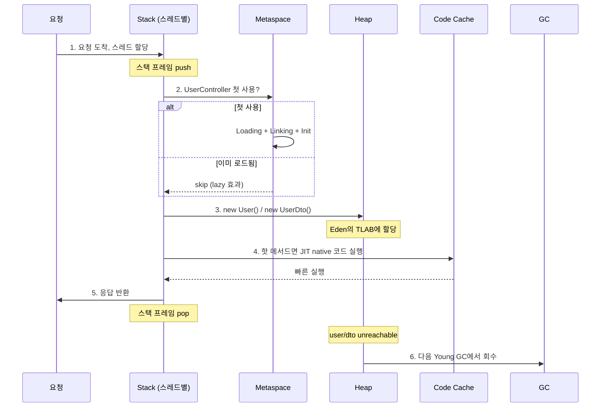

# 02. Runtime Data Areas — JVM이 OS로부터 받는 모든 메모리

> "JVM 메모리 = Heap" 이라고 답한 면접자는 절반은 모르는 것이다.
> JVM은 OS로부터 **7~10개 영역의 메모리**를 받아쓴다. 그래서 `-Xmx2g`인데 `top`의 RSS가 4GB가 나온다.
> 이 챕터는 그 모든 영역을 한 줄씩 따라간다.

---

## 📍 학습 목표

이 챕터를 마치면 다음을 막힘없이 답할 수 있다.

1. JVM 프로세스의 메모리 footprint를 구성하는 모든 영역을 종이에 그릴 수 있다.
2. `-Xmx2g`로 시작한 JVM이 RSS 4GB를 쓰는 이유를 영역별로 분해해 설명할 수 있다.
3. PermGen이 Metaspace로 바뀐 이유와 결과적 차이를 안다.
4. TLAB이 무엇이고 왜 bump-the-pointer 할당이 가능한지, 가득 차면 어떻게 되는지 안다.
5. Humongous Object가 무엇이고 왜 운영 함정인지 안다.
6. Code Cache가 가득 차면 무슨 일이 일어나는지, 어떻게 진단하는지 안다.
7. Direct Memory가 GC와 어떻게 상호작용하는지, 누수가 어떻게 발생하는지 안다.
8. Container 환경에서 `-Xmx`를 limit의 50~70%로 잡는 이유를 설명할 수 있다.

---

## 학습 흐름

```
┌───────────────────────────────────────────────────────────────┐
│ JVM Process 전체 메모리 (RSS = footprint)                      │
│                                                               │
│  ┌──────────────────────────────────────────────────────────┐ │
│  │ 01. Heap & TLAB                                           │ │
│  │     Young(Eden + Survivor) | Old | Humongous              │ │
│  │     ★ TLAB: Thread-Local Allocation Buffer                │ │
│  └──────────────────────────────────────────────────────────┘ │
│  ┌──────────────────────────────────────────────────────────┐ │
│  │ 02. Metaspace & Class Space                               │ │
│  │     Class 메타데이터, Method 정보, Constant Pool             │ │
│  │     PermGen → Metaspace (JDK 8), Compressed Class Space  │ │
│  └──────────────────────────────────────────────────────────┘ │
│  ┌──────────────────────────────────────────────────────────┐ │
│  │ 03. Stack & PC & Native Method Stack                      │ │
│  │     Per-Thread, Stack Frame, Operand Stack, Local Vars    │ │
│  │     Virtual Thread의 stack chunk (JDK 21+)                │ │
│  └──────────────────────────────────────────────────────────┘ │
│  ┌──────────────────────────────────────────────────────────┐ │
│  │ 04. Code Cache                                            │ │
│  │     JIT 컴파일 결과 native code 저장                         │ │
│  │     Segmented (JDK 9+): profiled / non-profiled / non-method│ │
│  └──────────────────────────────────────────────────────────┘ │
│  ┌──────────────────────────────────────────────────────────┐ │
│  │ 05. Direct Memory & MappedByteBuffer                      │ │
│  │     Off-heap, NIO, zero-copy I/O                          │ │
│  │     Cleaner 누수 패턴                                       │ │
│  └──────────────────────────────────────────────────────────┘ │
│  ┌──────────────────────────────────────────────────────────┐ │
│  │ 06. GC 부속 자료구조 & 기타                                  │ │
│  │     Card Table, Remembered Set, Mark Bitmap               │ │
│  │     JIT scratch, JVM internal                             │ │
│  └──────────────────────────────────────────────────────────┘ │
└───────────────────────────────────────────────────────────────┘
```

---

## 챕터 목록

| # | 파일 | 핵심 질문 | 상태 |
|---|---|---|---|
| 01 | [01-heap-and-tlab.md](./01-heap-and-tlab.md) | "Heap은 어떻게 나뉘고, TLAB은 왜 필요한가, Humongous는 무엇인가" | ✅ |
| 02 | [02-metaspace-and-class-space.md](./02-metaspace-and-class-space.md) | "Metaspace는 Heap 밖에 있는데 어떻게 동작하나, PermGen은 왜 죽었나" | ✅ |
| 03 | [03-stack-pc-native.md](./03-stack-pc-native.md) | "Per-Thread 영역의 정확한 구조, Stack Frame 안에 뭐가 있나, Virtual Thread는 어떻게 다른가" | ✅ |
| 04 | [04-code-cache.md](./04-code-cache.md) | "JIT 결과는 어디에 저장되고, full이 되면 무슨 일이 일어나나" | ✅ |
| 05 | [05-direct-memory.md](./05-direct-memory.md) | "DirectBuffer는 왜 쓰고, 어떻게 누수되나" | ✅ |
| 06 | [06-gc-bookkeeping-and-others.md](./06-gc-bookkeeping-and-others.md) | "Card Table, RSet, Mark Bitmap이 차지하는 메모리" | ✅ |

---

## 사전 학습

- [00-overview/03-jvm-architecture-bigpicture.md](../00-overview/03-jvm-architecture-bigpicture.md) — 4대 서브시스템 큰 그림 (이 챕터는 ② Runtime Data Areas의 풀버전)
- [01-class-lifecycle](../01-class-lifecycle/) — ClassLoader가 Metaspace에 무엇을 적재하는지 미리 알면 02번 sub-chapter가 더 와닿음

## 핵심 통찰 — 챕터 들어가기 전에

### memory footprint = JVM 전체가 OS로부터 받는 메모리

```
JVM 프로세스의 RSS (Resident Set Size)
━━━━━━━━━━━━━━━━━━━━━━━━━━━━━━━━━━━━━━━━━━━━

[Java 영역]
├── Java Heap          ← -Xmx 로 제어 (Young + Old + Humongous)
├── Metaspace          ← Class 메타데이터 (native 메모리)
├── Compressed Class Space  ← 32비트 Klass 포인터용 (~1GB)
└── String Pool        ← interned String (Heap 안의 별도 영역)

[JIT/실행]
├── Code Cache         ← JIT 결과 native code (기본 240MB reserve)
└── JIT scratch        ← 컴파일 중 임시 메모리

[Per-Thread]
├── JVM Stack          ← 스레드별 ~1MB × N 스레드
└── Native Method Stack ← JNI 스택

[Off-Heap]
├── Direct Buffer      ← ByteBuffer.allocateDirect
└── MappedByteBuffer   ← mmap된 파일

[GC 자료구조]
├── Card Table         ← Heap 크기에 비례
├── Remembered Set     ← G1/ZGC
└── Mark Bitmap        ← GC 마킹용

[Native]
├── JVM 내부 자료구조   ← libjvm.so의 .data/.bss
└── 네이티브 라이브러리  ← libnio.so, libnet.so, JNI 라이브러리

━━━━━━━━━━━━━━━━━━━━━━━━━━━━━━━━━━━━━━━━━━━━
                 = footprint (RSS)
```

### 흔한 함정

| 함정 | 사실 |
|---|---|
| "memory footprint = `-Xmx`" | ❌ Heap은 일부일 뿐. footprint = RSS |
| "`-Xmx512m`인데 RSS 1GB는 메모리 누수" | ❌ 정상. 나머지는 Metaspace/Code Cache/Stacks 등 |
| "container limit = `-Xmx`로 주면 안전" | ❌ OOM-killed 위험. limit의 50~70%가 안전 |
| "Heap GC가 모든 메모리를 관리" | ❌ Heap만. Metaspace/Code Cache는 별도 정책 |
| "Direct Memory도 GC 대상" | △ 간접적. DirectBuffer 객체가 GC될 때 Cleaner가 native free |

### 측정 명령 모음

```bash
# 1. 전체 RSS
ps -o pid,rss,vsz,cmd -p $(pgrep -f my-app)

# 2. JVM 영역별 (Native Memory Tracking 활성화 필요)
java -XX:NativeMemoryTracking=summary -jar app.jar
jcmd <pid> VM.native_memory summary

# 3. Heap 상세
jcmd <pid> GC.heap_info
jstat -gc <pid> 1s

# 4. Metaspace
jcmd <pid> VM.metaspace summary

# 5. Code Cache
jcmd <pid> Compiler.codecache

# 6. ClassLoader / 클래스 통계
jcmd <pid> VM.classloader_stats
jcmd <pid> GC.class_histogram | head -30
```

---

## 7단 레이어 적용 (이 챕터의 모든 sub-chapter에서)

| 단계 | 내용 |
|---|---|
| 1. 백지 그리기 | 메모리 영역을 손으로 그리기 + SVG 정답 비교 |
| 2. 직관 | 왜 이 영역이 존재하는지 비유 + 정확한 정의 |
| 3. 구조 | 영역 내부 분할 (Young/Old, Eden/Survivor, ...) ASCII 다이어그램 |
| 4. 내부 구현 | HotSpot C++ 코드 (`universe.cpp`, `g1CollectedHeap.cpp` 등) |
| 5. 역사 | 시대별 변화 (PermGen→Metaspace, Code Cache 분할 등) |
| 6. 트레이드오프 | HotSpot vs OpenJ9 vs ZGC, 옵션별 비교 |
| 7. 측정·진단 | jcmd, NMT, JFR, GC log 활용법 |
| + 꼬리질문 | 면접 시뮬레이션 |

---

## 📎 부록 — "요청 한 건" 의 전체 메모리 흐름 (시간 축으로 보기)

> **챕터 sub-file 들이 각 영역의 정적 구조를 다룬다면, 이 부록은 "요청이 들어왔을 때 그 영역들이 어떻게 동시에 움직이는가" 를 본다.**
> Build → Startup → Request → GC → Unload 의 시간 축에서 JVM 영역들이 어떻게 협업하는지, 백지에서 줄줄 풀 수 있게 토글로 정리.

<details>
<summary><b>① 큰 그림 한 줄 — Build / Runtime 의 분리</b></summary>

### 시간 축 큰 그림

```
   Build Time (개발자)              Runtime (JVM)
   ────────────────                 ─────────────
   .java                            
    │                               
    │ javac                         
    ▼                               
   .class (바이트코드)  ─────────▶  ① Loading (ClassLoader)
                                     ↓
                                    ② Verify ┐
                                    ③ Prepare├─ Linking (JVM)
                                    ④ Resolve┘
                                     ↓
                                    ⑤ Init (<clinit>, JVM)
                                     ↓                ┐
                                    ⑥ Use            │
                                     - Stack frame   │ 요청 처리
                                     - new → Heap    │ (반복)
                                     - JIT compile   │
                                                     ┘
                                     ↓
                                    ⑦ GC / Unload
```

### 핵심 인지

- **Build Time**: javac 가 .java → .class. JVM 과 무관.
- **Runtime**: ClassLoader 가 .class 바이트를 읽어 JVM 에 넘기는 순간 시작.
- **Lazy**: 클래스 로딩·초기화는 처음 쓸 때만 (요청 처리 중에도 발생 가능).
- **반복**: ⑥ 만 요청마다 반복, ①~⑤ 는 클래스당 한 번.

</details>

---

<details>
<summary><b>② 시간 축 4단계 — Build / Startup / Request / GC</b></summary>

```
┌───────────────────────────────────────────────────────────────┐
│                                                                 │
│   T0. Build Time (개발자 시점)                                  │
│   ────────────────────                                          │
│      .java  ──javac──▶ .class                                  │
│      ★ JVM 과 무관. 빌드 결과물만 만들어 둠.                    │
│                                                                 │
│   ─────────────────── JVM 시작 ───────────────────             │
│                                                                 │
│   T1. JVM Startup                                               │
│   ─────────────────                                             │
│      - Bootstrap CL 이 java.lang.* 등 코어 로드                 │
│      - Application CL 이 main 클래스 로드                       │
│      - main 의 Linking + Initialization                         │
│      - public static void main() 호출                           │
│      - WAS 라면 ServerSocket bind, ThreadPool 생성              │
│                                                                 │
│   ────────────────── 정상 운영 ───────────────────             │
│                                                                 │
│   T2. 요청 처리 (반복)                                          │
│   ────────────────────                                          │
│      [요청 도착]                                                │
│         │                                                       │
│         ▼                                                       │
│      ThreadPool 의 스레드 1개 할당                              │
│         │                                                       │
│         │ ① 새 stack frame 생성 (Stack)                         │
│         │ ② 처음 보는 클래스면 Loading+Linking+Init (lazy)      │
│         │ ③ new Foo() → Heap Eden TLAB 에 인스턴스             │
│         │ ④ 메서드 호출 거듭 → frame 쌓이고 풀림                │
│         │ ⑤ 핫 메서드는 JIT 컴파일 → Code Cache 의 native      │
│         │ ⑥ 응답 반환                                           │
│         ▼                                                       │
│      stack frame 모두 pop, 스레드는 ThreadPool 로 복귀          │
│      그 요청에서 만든 인스턴스들 → 참조 끊기면 garbage         │
│                                                                 │
│   ──────────────── 메모리 압박 ─────────────────               │
│                                                                 │
│   T3. GC 발생                                                   │
│   ─────────────                                                 │
│      Eden 차면 → Young GC                                       │
│      Old 차면  → Mixed GC / Full GC                             │
│      ClassLoader 참조 끊기면 → Metaspace 의 CLD chunk 회수     │
│                                                                 │
└───────────────────────────────────────────────────────────────┘
```

### 빈도

| 단계 | 빈도 | 비용 |
|---|---|---|
| T0 Build | 배포 시 1번 | 큼 (수십 초~수 분) |
| T1 Startup | JVM 시작 시 1번 | 큼 (수 초~수십 초) |
| T2 Request | **요청마다** | 작음 (ms 단위) |
| T2-Lazy 로딩 | 클래스당 1번 (요청 처리 중) | 중간 (수 ms) |
| T3 GC | 메모리 압박 시 | 작음(Young) ~ 큼(Full) |

</details>

---

<details>
<summary><b>③ 각 영역의 정확한 책임 — Class 와 Instance 의 분리</b></summary>

### 영역별 책임표

| 영역 | 무엇이 들어가나 | 누가 만지나 | 라이프사이클 |
|---|---|---|---|
| **Heap (Young/Old)** | `new` 로 만든 **인스턴스** | 모든 스레드 공유 | GC 가 회수 |
| **Metaspace** | **클래스 메타데이터** (Class 자체, Method 정의, Constant Pool) | ClassLoader 단위 | ClassLoader unload 시 |
| **Code Cache** | **JIT 컴파일된 native 코드** | JIT compiler | 메서드 invalidate / cache full |
| **Stack** | **메서드 호출 프레임**, 지역 변수, 참조 | 그 스레드만 | 메서드 return 시 자동 pop |
| **PC Register** | 현재 실행 중인 바이트코드 주소 | 그 스레드만 | 스레드 종료 시 |

### 가장 헷갈리는 부분 — Class 와 Instance 의 분리

```java
public class Foo {
    private String name;
    public void hello() { ... }
}

Foo a = new Foo();
Foo b = new Foo();
```

```
Metaspace                              Heap
─────────                              ────
┌──────────────────────┐               ┌────────────────┐
│ Class Foo (메타데이터)│ ◀────────────│ instance a     │
│  - 필드 정의: name    │   klass ptr   │  - name = ?    │
│  - 메서드 정의: hello │               └────────────────┘
│  - constant pool      │               ┌────────────────┐
│  - 바이트코드         │ ◀────────────│ instance b     │
│                        │   klass ptr   │  - name = ?    │
└──────────────────────┘               └────────────────┘
       (단 1개)                              (N개)
```

### 핵심 통찰

- **Class 정의 = Metaspace** (Foo 의 명세서, 단 1개, 영원)
- **Instance = Heap** (Foo 의 실체, N개, GC 회전)
- 인스턴스마다 **Klass Pointer** (Object Header) 로 자기 Class 가리킴
- `Foo.class` 같은 `Class<?>` 객체는 또 별개로 **Heap** 에 존재 (reflection 용)

</details>

---

<details>
<summary><b>④ 요청 1건의 메모리 발자국 — Spring Controller 예시</b></summary>

### 코드

```java
@RestController
class UserController {
    @GetMapping("/users/{id}")
    public UserDto getUser(@PathVariable Long id) {
        User user = userService.findById(id);
        return UserDto.from(user);
    }
}
```

### 시퀀스



### 영역별 변화

```
[요청 1건의 메모리 발자국]

Stack (Thread X):
  ┌─────────────────────────────────┐
  │ getUser() frame                  │ ← push
  │  - id: 42                        │
  │  - user: ref → Heap의 User       │
  │  - return: ref → Heap의 UserDto  │
  ├─────────────────────────────────┤
  │ findById() frame                 │
  ├─────────────────────────────────┤
  │ executeQuery() frame             │
  └─────────────────────────────────┘   ← 응답 끝 pop

Heap (Eden Thread X 의 TLAB):
  ┌─────────────────────────────────┐
  │ User instance (id=42)            │ ← new
  │ UserDto instance                 │ ← new
  │ List<Object[]> ResultSet 임시    │
  └─────────────────────────────────┘   ← 다음 Young GC 회수

Metaspace (변화 없음):
  ┌─────────────────────────────────┐
  │ UserController (이미 로드됨)     │
  │ UserService                      │
  │ UserDto, User                    │
  └─────────────────────────────────┘   ★ 요청마다 안 바뀜

Code Cache (변화 가능):
  ┌─────────────────────────────────┐
  │ getUser() native (JIT 됐다면)    │
  │ findById() native                │
  └─────────────────────────────────┘
```

### 한 줄 통찰

> **요청마다 회전하는 건 Stack 과 Heap 뿐. Metaspace 와 Code Cache 는 거의 정적.**
> 그래서 "요청 부하 = Stack + Heap 부하" 가 거의 전부, Metaspace 가 회전하면 그게 비정상 (ClassLoader leak 의심).

</details>

---

<details>
<summary><b>⑤ 자주 어긋나는 표현 — 정확한 다듬기</b></summary>

### 흔한 오해와 정확한 표현

| 흔한 표현 | 정확한 표현 |
|---|---|
| "ClassLoader 로 .class 를 바이트코드로" | .class **자체가 이미 바이트코드**. ClassLoader 는 바이트 배열로 읽어옴 |
| "링킹 과정에서 JVM 이 검증하고 **초기화**하고" | 초기화는 링킹의 일부가 아니라 **별도 5번째 단계**. 링킹 = Verify/Prepare/Resolve 3단계 |
| "Heap 과 Metaspace 에 정보들과 객체들을 올려놓고" | **Heap = 인스턴스만, Metaspace = 클래스 메타데이터만**. 역할 분리 |
| "Unload 과정을 통해 끊기면 GC 가 회수" | 인과 거꾸로: **참조 끊김 → GC 회수 판단 → Unload 발생** |
| "Foo 클래스를 로드하면 Foo 가 초기화됨" | 로딩 ≠ 초기화. `Class.forName("Foo", false, cl)` 또는 `Foo.class` 로는 초기화 안 일어남 |
| "Metaspace 가 늘면 메모리 누수" | △ 정상 운영 중에도 동적 클래스 생성으로 늘 수 있음. **재배포 시 누적되면 leak** |
| "TLAB 안 쓰면 Eden 에 못 넣음" | TLAB 우회 경로 있음 — 큰 객체나 TLAB refill 임계 미달 시 Eden 직접 (CAS) |

### 정확한 인과 한 줄

> **참조 끊김 → 다음 GC 사이클 → 인스턴스 회수 (Heap) / ClassLoader unload (Metaspace)**
> "Unload 가 일어나서" 가 아니라 "Unload 의 조건이 만족돼서 GC 가 처리한 결과로" 가 정확한 인과.

</details>

---

<details>
<summary><b>⑥ 백지 마스터 다이어그램 — 한 장 정리</b></summary>

```
┌─────────────────────────────────────────────────────────────┐
│                                                               │
│  Build Time          Runtime                                  │
│  ──────────          ───────                                  │
│  .java                                                        │
│   ↓ javac                                                    │
│  .class  ────▶  ① Loading (ClassLoader)                      │
│                  ↓                                            │
│                 ② Verify                                     │
│                  ↓        ┐                                  │
│                 ③ Prepare ├─ Linking (JVM)                  │
│                  ↓        │                                  │
│                 ④ Resolve ┘                                  │
│                  ↓                                            │
│                 ⑤ Initialize (<clinit>, JVM)                 │
│                  ↓                                            │
│                  ↓ 메타데이터 → Metaspace                    │
│                  ↓                                            │
│  [요청 도착] ──▶ ⑥ Use (Thread, Stack, Heap, JIT)            │
│   loop          │                                            │
│                 │  - Stack frame push/pop (per call)         │
│                 │  - new → Heap Eden TLAB (lock-free)        │
│                 │  - 핫 메서드 → Code Cache (JIT native)     │
│                 │                                            │
│  [참조 끊김]                                                  │
│                 │                                            │
│                 ▼                                            │
│                ⑦ GC                                          │
│                  - Heap: Young GC / Old GC                   │
│                  - Metaspace: ClassLoader 통째 unload        │
│                                                               │
└─────────────────────────────────────────────────────────────┘
```

### 한 줄 정리

> **"javac 가 .java → .class. ClassLoader 가 바이트 읽어 ① Loading → JVM 이 ②③④ Linking → ⑤ Initialization → Metaspace 에 메타데이터 적재. 요청 들어오면 ThreadPool 스레드가 자기 Stack 에 프레임 쌓고 new 로 Heap Eden TLAB 에 인스턴스 할당, 핫 메서드는 JIT 가 Code Cache 의 native 로 컴파일. 응답 끝나면 Stack 자동 pop, 인스턴스는 참조 끊기면 Young GC 에서 회수. ClassLoader 가 unreachable 되면 Full GC 때 Metaspace 의 CLD chunk 통째로 unload."**

이걸 백지에 그릴 수 있으면 JVM 런타임 이해는 **마스터 수준**.

</details>

---

### 부록 마무리 한 줄

> **"각 sub-chapter (01~06) 가 한 영역의 정적 구조라면, 이 부록은 그 영역들이 요청 시간 축에서 어떻게 동시에 협업하는지를 본다. 두 시각이 합쳐져야 production 메모리 진단이 가능하다."**
