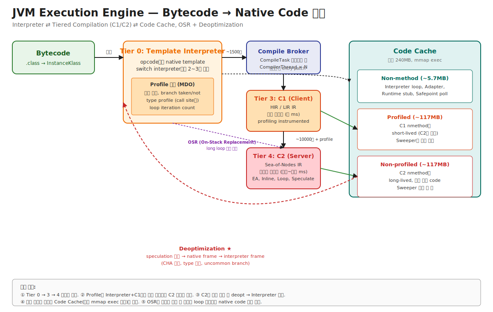

# 03-01. Execution Engine 전체 흐름 — Bytecode가 native code가 되기까지

> Java 메서드를 **한 번 호출**하면 무슨 일이 일어나는가?
> 처음에는 인터프리터가 한 줄씩 실행. 자주 호출되면 C1이 빠르게 컴파일. 더 자주 호출되고 profile이 모이면 C2가 공격적으로 최적화. 가정이 깨지면 deoptimize 해서 인터프리터로 돌아간다. 이 모든 게 **하나의 메서드 안에서 시간에 따라 동적으로** 일어난다.
> 시니어가 알아야 할 것: warmup 지연, P99 spike, "왜 같은 코드가 어떨 때는 빠르고 어떨 때는 느린가" — 모두 이 흐름의 어느 단계에서 일어나고 있는지의 문제다.

---

## 🗺️ JVM 아키텍처 안에서 이 챕터의 위치

이 챕터(03-01)는 Execution Engine 전체의 진입점이다. 인터프리터부터 C2까지 **모든 sub-chapter를 묶는 큰 그림**을 먼저 그린다.



```
[Chapter 01 ClassLoader] → InstanceKlass (bytecode)
                                │
                                ▼
[Chapter 02 Runtime Data]   Stack/PC/Heap 준비
                                │
                                ▼
[★ 본 챕터: Execution Engine ★]
   Bytecode 한 줄 = Interpreter 또는 native code 실행
                                │
                                ▼
[Chapter 02-04 Code Cache]  컴파일 결과 저장
```

---

## 📍 학습 목표

이 sub-chapter를 마치면 다음을 모두 답할 수 있다.

1. JVM이 한 메서드를 **처음 호출하는 순간부터 native code로 컴파일되어 실행되기까지의 5단계** 전체 흐름을 백지에서 그릴 수 있다.
2. **Template Interpreter / Tier 0 / Tier 3 (C1) / Tier 4 (C2)** 의 역할과 임계 호출 횟수 (대략 1500, 10000)를 안다.
3. **Profile 데이터(MDO, Method Data Object)** 가 무엇이고 어디서 수집되어 어디로 흘러가는지 안다.
4. **OSR (On-Stack Replacement)** 이 무엇이고 왜 필요한지 — `for (i = 0; i < 1_000_000_000; i++)` 같은 긴 루프에서.
5. **Deoptimization**이 어떤 상황에서 일어나고 그 결과 무엇이 발생하는지.
6. **Warmup 지연**의 정확한 원인 — Tier 승격 시간 + C2 컴파일 비용.
7. **P99 latency spike**의 단골 원인이 Tier 승격 중인 메서드 또는 deopt 발생.
8. `-XX:+PrintCompilation` 로그 한 줄을 읽고 "Tier 3 → 4 승격 중" 같은 해석을 할 수 있다.
9. `-XX:-TieredCompilation`, `-XX:TieredStopAtLevel=N` 같은 옵션이 어떤 효과를 낳는지.
10. 운영 시나리오: 시작 직후 응답 느림 / P99 가끔 튐 / 부하 변화 후 일시적 느려짐 — 각각의 원인이 이 흐름의 어디인지.

---

## 🎨 1단계: 백지 그리기 가이드

### Step 1: 가로 흐름 — 좌→우로 점진적 컴파일

```
Bytecode → Interpreter → C1 컴파일 → C2 컴파일 → Code Cache
   (.class)   (Tier 0)     (Tier 3)     (Tier 4)
```

### Step 2: Profile은 위에서 아래로 흐른다

```
Bytecode → Interpreter → C1 → C2
              │           │
              ▼           ▼
        Profile 수집  Profile 수집
              │           │
              └─────┬─────┘
                    ▼
              C2 컴파일 결정의 입력
```

### Step 3: Deopt와 OSR 화살표 추가

```
Bytecode → Interpreter ──→ C1 ──→ C2
              ▲                    │
              │                    │
              └────── Deopt ───────┘   (가정 깨짐)
              
              ┌─── OSR ────┐
              │            ▼
         (긴 loop 중간)   C1 또는 C2 코드 진입
```

### Step 4: Code Cache와의 연결

```
C1 결과 → Code Cache의 Profiled segment
C2 결과 → Code Cache의 Non-profiled segment
Interpreter loop, Adapter → Non-method segment
```

### 정답 그림 (SVG)

위의 [01-execution-overview.svg](./_excalidraw/01-execution-overview.svg) 임베드.

---

## 🧠 2단계: 직관

### 핵심 비유

> **학생의 성장 비유**:
> - **Interpreter** = 교과서를 한 줄씩 읽으며 공부 (느리지만 즉시 시작).
> - **Profiling** = "어느 챕터를 자주 읽는지" 기록.
> - **C1** = 자주 보는 챕터를 약식 노트로 만들기 (빠르게 만듦, 정확도 약식).
> - **C2** = 그 중 핵심 챕터를 완성판 노트로 (오래 걸리지만 가장 빠르게 다시 볼 수 있음).
> - **Deopt** = 노트의 가정이 틀렸을 때 (예: "이 챕터는 항상 답이 X" → 새 문제집 보니 Y) → 교과서로 돌아가 다시 공부.
> - **OSR** = 큰 챕터 중간을 공부하다가 그 챕터를 노트로 옮기고, 노트의 중간부터 이어서 보기.

### 정확한 정의 (비유와 분리)

| 용어 | 정의 |
|---|---|
| **Execution Engine** | JVM의 서브시스템 중 하나. Bytecode를 실제로 실행. Interpreter + JIT 컴파일러(C1/C2) + Code Cache 관리 + Profile 수집을 통합. |
| **Interpreter** | Bytecode 명령을 한 번에 하나씩 해석해 실행. HotSpot은 **Template Interpreter** — 각 opcode에 대응하는 native template을 미리 생성. |
| **JIT Compiler** | Just-In-Time. 런타임에 bytecode → native machine code 변환. HotSpot은 C1, C2 두 종류. Tiered로 함께 동작. |
| **C1 (Client Compiler)** | 빠른 컴파일러. HIR/LIR IR. 보통 메서드당 수 ms. 가벼운 최적화. **profiling instrumented** 코드 생성. |
| **C2 (Server Compiler)** | 느린 컴파일러. Sea-of-Nodes IR. 메서드당 수십~수백 ms. 공격적 최적화 (inlining, EA, loop unroll, vectorize, speculate). |
| **Tier** | 컴파일 단계 레벨. Tier 0 = interpreter, Tier 3 = C1 with profiling, Tier 4 = C2. (Tier 1, 2는 C1의 변형, 보통 안 쓰임.) |
| **Tiered Compilation** | C1 + C2를 결합해 단계적으로 승격하는 모델. JDK 8+ 기본 on. warmup ↑ + peak ↑ 양립 목표. |
| **Profile / MDO (Method Data Object)** | 한 메서드의 실행 통계 — 호출 횟수, branch taken/not taken, type profile (call site별), loop iteration. C2의 최적화 결정에 사용. |
| **OSR (On-Stack Replacement)** | 실행 중인 메서드를 동일 메서드의 native version으로 **중간에서** 전환. 긴 루프에 진입한 메서드를 메서드 호출 안 거치고 native code로 점프. |
| **Deoptimization** | C2의 가정(예: monomorphic, type guess)이 깨졌을 때 native code 폐기 + 인터프리터로 복귀. 일부 native frame들을 interpreter frame으로 변환. |
| **Compile Broker** | Compile task 우선순위 큐. CompilerThread가 task를 pickup해 컴파일 수행. |
| **Hot Method** | 자주 호출되거나 큰 loop를 가진 메서드. 컴파일 임계 도달. |
| **nmethod** | 컴파일된 메서드의 HotSpot 표현. Code Cache의 할당 단위. |

### 왜 인터프리터로 시작하는가 — 즉시성

```
[C2로 바로 컴파일하면]
        │
        ▼
JVM 시작 → C2 컴파일 시작 (수십 ms × N개 메서드)
        │
        ▼
사용자 코드 시작까지 수 초 ~ 수십 초 지연
        │
        ▼
warmup 너무 김

[Interpreter로 시작하면]
        │
        ▼
JVM 시작 → 즉시 인터프리터 실행 시작
        │
        ▼
사용자 코드 즉시 동작 (느리지만)
        │
        ▼
백그라운드에서 컴파일 진행 → 점진적 가속
```

→ Interpreter는 **즉시성**, JIT은 **궁극 성능**. 둘 다 필요.

### 왜 C2 단독 안 쓰고 Tiered인가 — Profile의 가치

```
[C2 단독]                              [Tiered (C1 → C2)]
━━━━━━━━━━                              ━━━━━━━━━━━━━━━━

profile 데이터 없이 컴파일 시작           Interpreter+C1에서 profile 충분히 수집
        │                                      │
        ▼                                      ▼
  type-guess 부정확 → deopt 많음           C2가 정확한 profile로 컴파일 →
        │                                  speculation 적중률 높음
        ▼
  inlining 결정 보수적                     공격적 inlining + EA + speculate
```

→ **Profile-guided optimization** 이 Tiered의 핵심 가치. C1은 단순히 "C2 전 단계"가 아니라 **profile 수집기**.

### 왜 OSR이 필요한가 — long loop 함정

```java
void main() {
    for (int i = 0; i < 1_000_000_000; i++) {  // 10억 번 반복
        process(i);
    }
}
```

이 메서드는 **딱 한 번 호출**됨. 호출 횟수 카운터로는 영원히 임계 도달 안 함. 그러나 loop body는 10억 번 실행. **메서드는 처음 호출이지만 실제 실행은 hot path**.

OSR 메커니즘:
1. Interpreter가 loop back-edge 횟수도 카운트.
2. Loop back-edge 카운터가 임계 도달 → OSR compilation 트리거.
3. C1/C2가 이 메서드의 OSR variant를 컴파일 (특정 bytecode index부터 entry 가능).
4. 다음 iteration에서 interpreter frame → native frame으로 **stack 위에서 직접** 전환.
5. Loop 나머지를 native code로 실행.

OSR 없으면 long loop는 영원히 인터프리터로 실행 — 처리량 10배 손실.

### 왜 Deopt가 필요한가 — Speculation의 안전판

C2는 **가정(speculation)** 을 적극 활용해 최적화:
- "이 인터페이스 메서드는 monomorphic" → inline.
- "이 분기는 거의 안 일어남" → uncommon path로 분리.
- "이 타입은 항상 String" → type check 제거.

이 가정들이 **항상 맞다고 보장 못 함**. 새 클래스 로드, 새 데이터 패턴 등으로 깨질 수 있음.

Deopt 메커니즘:
1. 가정 위반 감지 (예: 새 subclass 로드).
2. 영향받은 nmethod에 `make_not_entrant` 표시.
3. 실행 중인 스레드가 다음 safepoint에서 deopt 처리.
4. Native frame의 register/stack 값을 interpreter frame slot으로 복원.
5. 적절한 bytecode index부터 인터프리터로 재개.
6. nmethod는 Code Sweeper가 회수.

→ **Speculate + Deopt가 함께 동작해야 공격적 최적화 가능**. 안전판 없이는 speculate 못 함.

---

## 🔬 3단계: 구조 — 5단계 흐름

### 한 메서드의 라이프사이클 — 5단계

```
Stage 1: Cold Start
━━━━━━━━━━━━━━━━━━
호출 1~수십 회:
  - Bytecode를 Template Interpreter가 실행
  - 호출 카운터 + 1
  - MDO (Method Data Object) 점진적 채움 — call site별 type profile, branch profile

Stage 2: Tier 3 (C1) 컴파일
━━━━━━━━━━━━━━━━━━━━━━━
호출 카운터가 임계 (대략 1500) 도달:
  - Compile Broker에 task 등록 (Tier 3)
  - CompilerThread가 pickup → C1 컴파일
  - 결과 nmethod를 Code Cache의 Profiled segment에 저장
  - Method의 _code 필드 patch → 다음 호출부터 native code
  - native code에 profiling counter 내장 (실행마다 +1)

Stage 3: Profile 성숙
━━━━━━━━━━━━━━━━━━━
C1 코드 실행 중에도 profile 계속 수집:
  - Call site별 type histogram (최대 2~3개 타입 기록)
  - Branch taken/not 비율
  - 자주 도달하는 path

Stage 4: Tier 4 (C2) 컴파일
━━━━━━━━━━━━━━━━━━━━━━━
profile이 안정적이고 호출 카운터가 더 큰 임계 (대략 10000) 도달:
  - Compile Broker에 task 등록 (Tier 4)
  - CompilerThread가 C2 컴파일 (Sea-of-Nodes)
  - 공격적 최적화 적용: Inlining, EA, Loop unroll, Vectorize, Speculate
  - 결과 nmethod를 Code Cache의 Non-profiled segment
  - Method의 _code 필드 patch → C2 native code 실행
  - 옛 C1 nmethod는 not_entrant 표시 → Sweeper가 회수

Stage 5: Steady State 또는 Deopt
━━━━━━━━━━━━━━━━━━━━━━━━━━━━
정상: C2 native code로 계속 실행
가정 위반: Deopt 발생 → Interpreter로 복귀 → 새 profile 수집 → 다시 컴파일

OSR 분기: 메서드 중간의 loop가 hot이면 Stage 2/4가 loop entry용 OSR variant로 컴파일됨
```

### Tier 5종 (HotSpot 명세)

```
Tier 0: Interpreter
Tier 1: C1 (profiling 없음) — 보통 안 쓰임
Tier 2: C1 (제한적 profiling) — 보통 안 쓰임
Tier 3: C1 (전체 profiling) — Tiered의 기본 C1 단계
Tier 4: C2 (fully optimized) — 최종 단계
```

운영자는 **Tier 0, 3, 4** 만 의식하면 충분. Tier 1, 2는 HotSpot 내부 fallback 케이스.

### 메서드의 _code 필드 patch

각 `Method` 객체는 다음 필드들을 들고 있음:
```cpp
class Method : public Metadata {
    address _from_compiled_entry;  // 컴파일된 코드 진입점
    address _from_interpreted_entry;  // 인터프리터 진입점
    Method* _code;  // 현재 nmethod 또는 NULL (인터프리터)
};
```

흐름:
1. 메서드 호출 시 caller가 callee의 `_from_compiled_entry` 점프.
2. nmethod 없으면 그 entry는 인터프리터 stub.
3. C1 컴파일 완료 → `_from_compiled_entry`를 C1 nmethod entry로 patch.
4. 다음 호출부터 C1 native code 실행.
5. C2 완료 시 같은 방식 patch.
6. Deopt 시 다시 인터프리터 stub으로 patch.

**핵심**: patch는 **atomic word write** — 동시 실행 중인 다른 스레드도 안전. 다음 호출부터 새 entry 사용.

### OSR의 구체적 메커니즘

```
[Interpreter 실행 중]

  for (int i = 0; i < 1_000_000_000; i++) {  // ← back-edge 카운터 +1
      ...
  }

[Back-edge 카운터 임계 도달]

OSR compile task 등록 — "이 메서드의 bytecode index N부터 진입 가능한 nmethod"
                  │
                  ▼
C2가 OSR variant 컴파일 (entry point가 일반 entry와 다름)
                  │
                  ▼
[Interpreter가 다음 loop iteration 시작 시점]

  - Interpreter가 OSR nmethod 존재 확인
  - Interpreter frame의 local/operand stack을 native frame으로 복사
  - native code의 OSR entry point로 jump
  - Loop의 나머지가 native로 실행
```

OSR은 **stack 위에서 frame을 통째 교체**하므로 매우 복잡. HotSpot의 deopt 메커니즘과 함께 가장 정교한 부분.

### Deopt의 구체적 메커니즘

```
[C2 nmethod 실행 중, 가정 위반 감지]

예: 인터페이스 메서드가 항상 FooImpl이라 가정하고 inline했는데, 새 BarImpl 등장.

  ▼
영향받는 nmethod들에 _is_not_entrant 플래그 set
다음 호출은 인터프리터로

  ▼
이미 실행 중인 스레드가 그 nmethod 안에 있다면?

  ▼
다음 safepoint 도달 → JVM이 deopt 시작:
  1. Native frame의 PC, register, stack 값을 OopMap으로 해석
  2. 대응하는 bytecode index 찾기
  3. Interpreter frame을 새로 만들고 local/operand stack 값 복원
  4. 그 interpreter frame부터 실행 재개

  ▼
다시 인터프리터로 실행, MDO 갱신, 시간 지나 재컴파일
```

→ Deopt는 단순히 "느려짐"이 아니라 **정확성 보존** — 잘못된 native code 결과를 mitigate.

### 운영 시나리오와 5단계 매핑

| 운영 증상 | 5단계의 어느 곳 | 원인 |
|---|---|---|
| JVM 시작 직후 응답 느림 | Stage 1 (Cold Start) + Stage 2 (C1) | 모든 메서드가 인터프리터, C1 컴파일 진행 중 |
| 트래픽 시작 후 5분간 P99 ↑ | Stage 2~4 | C2 컴파일이 누적 |
| 정상 운영 중 P99 가끔 spike | Stage 5의 Deopt | speculation 깨짐 |
| 부하 변화 후 일시적 느려짐 | Stage 3 → 4 또는 Deopt | 새 코드 path가 hot, 재컴파일 진행 |
| 영원히 느린 메서드 | Stage 1 또는 2에 머묾 | Code Cache full → 컴파일 비활성 |

---

## 🧬 4단계: 내부 구현 — HotSpot

### Invocation Counter

위치: `src/hotspot/share/oops/method.hpp`

```cpp
class Method : public Metadata {
private:
  MethodCounters* _method_counters;  // 호출 횟수, OSR 카운터 등
  AdapterHandlerEntry* _adapter;
  address _from_compiled_entry;       // ★ 컴파일된 entry
  address _from_interpreted_entry;    // ★ interpreter entry
  CompiledMethod* volatile _code;     // 현재 nmethod

  AccessFlags _access_flags;
};

class MethodCounters : public Metadata {
private:
  InvocationCounter _invocation_counter;  // 호출 횟수
  InvocationCounter _backedge_counter;     // loop back-edge 횟수 (OSR용)
  // ...
};
```

### Tier 승격 결정

위치: `src/hotspot/share/compiler/tieredThresholdPolicy.cpp`

```cpp
CompLevel TieredThresholdPolicy::call_event(const methodHandle& method, ...) {
  int i = method->invocation_count();
  int b = method->backedge_count();

  // Tier 3 임계 도달?
  if (i >= Tier3InvocationThreshold ||
      b >= Tier3BackEdgeThreshold) {
    return CompLevel_full_profile;  // Tier 3 (C1 with profiling)
  }

  // Tier 4 임계 도달?
  if (i >= Tier4InvocationThreshold ||
      b >= Tier4BackEdgeThreshold) {
    return CompLevel_full_optimization;  // Tier 4 (C2)
  }

  return CompLevel_none;
}
```

옵션:
- `Tier3InvocationThreshold` 기본 200 (Server) 또는 2000 (Client).
- `Tier4InvocationThreshold` 기본 5000~15000 (Server, workload 따라).
- 정확한 값은 동적 조정 — HotSpot이 컴파일 큐 상태를 보고 임계 변경.

### Compile Broker — Task pickup

위치: `src/hotspot/share/compiler/compileBroker.cpp`

```cpp
void CompileBroker::compile_method(const methodHandle& method, int level, ...) {
  CompileTask* task = create_compile_task(method, level);

  CompileQueue* queue = compile_queue(level);  // level별 큐
  queue->add(task);
  queue->notify_one();  // CompilerThread 깨움
}

void CompilerThread::thread_main_inner() {
  while (!should_terminate()) {
    CompileTask* task = queue->get();
    if (task == NULL) {
      wait();
      continue;
    }

    if (task->comp_level() <= 3) {
      _c1_compiler->compile_method(task);
    } else {
      _c2_compiler->compile_method(task);
    }

    install_nmethod(task->method(), task->nmethod());
  }
}
```

→ CompilerThread는 일반 Java 스레드와 별도 OS thread. 개수: `-XX:CICompilerCount=N` (기본 자동).

### OSR Entry 생성

위치: `src/hotspot/share/compiler/compileBroker.cpp` + `src/hotspot/share/c1/c1_GraphBuilder.cpp` (C1) / `src/hotspot/share/opto/parse1.cpp` (C2)

OSR variant는 일반 컴파일과 다른 entry point를 가짐:
- 일반 entry: 메서드 호출 시 진입.
- OSR entry: 특정 bytecode index에서 진입.

C2의 OSR 컴파일은 일반 컴파일보다 복잡 — entry point에서 interpreter frame의 local/operand stack을 받아 native register/stack에 mapping.

### Deopt 실행

위치: `src/hotspot/share/runtime/deoptimization.cpp`

```cpp
void Deoptimization::deoptimize_frame(JavaThread* thread, intptr_t* fr_id) {
  // 1. native frame에서 vframe (virtual frame, interpreter frame 후보) 추출
  vframeArray* vfa = compute_vframe_array(thread, fr_id);

  // 2. interpreter frame들을 stack에 push
  for (int i = 0; i < vfa->frames(); i++) {
    interpreter_frame* iframe = create_interpreter_frame(vfa->element(i));
    push_to_stack(thread, iframe);
  }

  // 3. native frame을 unwind
  unwind_native_frame(thread, fr_id);

  // 4. 적절한 bytecode index부터 interpreter 재개
  thread->resume_at_bytecode(...);
}
```

→ "Deopt는 단순한 fallback이 아니라 stack 위에서 frame을 통째 변환"하는 매우 정교한 작업.

---

## 📜 5단계: 역사

| 연도 | 릴리스 | 변화 | 이유 |
|---|---|---|---|
| 1995 | Sun JIT (Symantec) | bytecode → JIT 컴파일 도입 | 인터프리터만으로는 너무 느림 |
| 1999 | HotSpot 1.0 | C1 (Client) JIT | 빠른 startup용 |
| 2000 | HotSpot 1.3 | C2 (Server) JIT 추가 | 처리량 중시 워크로드 |
| 2007 | JDK 6u20 | Tiered Compilation 실험 | C1+C2 결합 시도 |
| 2014 | JDK 8 | **Tiered 기본 on** | warmup+peak 양립 |
| 2018 | JDK 11+ | Graal (Java로 작성된 JIT) 옵션 | 더 공격적 최적화 + 메인테너빌리티 |
| 2020 | JDK 16+ | Sweeper concurrent 개선 | STW 영향 ↓ |
| 2023 | JDK 21 | Project Lilliput 진행 | object header 압축 |
| 2024+ | JDK 22+ | Project Leyden | AOT/CDS 통합으로 startup 최적화 |

### Tiered Compilation 도입의 동기 — `-server` vs `-client` 종말

JDK 7까지:
- `-server` 옵션: C2만 사용. startup 느림, peak 빠름.
- `-client` 옵션: C1만 사용. startup 빠름, peak 느림.

문제: 사용자가 둘 중 하나만 선택해야 함. 거대 서버 앱은 startup도 빨라야 하고 peak도 빨라야 함.

JDK 8 Tiered:
- 둘 다 사용. 시작은 C1으로, hot method는 C2로.
- `-server`/`-client` 옵션 사실상 의미 없어짐 (JDK 9+ deprecated).

### Graal — Java로 작성된 JIT

JDK 9+ JEP 295로 도입:
- C2는 C++로 작성, 30년치 유산 코드, 유지보수 어려움.
- Graal은 Java로 작성, 더 modular, 더 공격적 최적화 (Partial Escape Analysis 등).
- 옵션: `-XX:+UnlockExperimentalVMOptions -XX:+UseJVMCICompiler`.
- 현재: 주류 HotSpot은 여전히 C2. Graal은 GraalVM의 별도 배포 + 일부 ahead-of-time 컴파일 (Native Image).

상세는 [Chapter 08-graalvm](../08-graalvm/) 에서.

---

## ⚖️ 6단계: 트레이드오프

### Tiered Compilation on vs off

| Tiered on (기본, JDK 8+) | Tiered off (`-XX:-TieredCompilation`) |
|---|---|
| ✅ Warmup 빠름 (C1으로 일찍 컴파일) | ❌ Warmup 느림 (인터프리터 → C2 직접) |
| ❌ Code Cache 사용량 ↑ (C1+C2 양쪽) | ✅ Code Cache 사용량 ↓ |
| ✅ Peak 성능 동일 | ✅ Peak 성능 동일 |
| △ profile 수집 비용 (~5%) | ✅ profile 비용 없음 |

**언제 off 고려**:
- 메모리 매우 제한적 (컨테이너 limit ~512MB).
- Batch / 데몬 워크로드 (warmup 무시 가능).
- Code Cache 압박 명백한 경우.

### `-XX:TieredStopAtLevel=N`

| N=1 | N=3 | N=4 (기본) |
|---|---|---|
| C1만 (profiling 없음) | C1+profiling | C1+C2 (full) |
| 가장 빠른 startup | 균형 | 최고 peak |
| 가장 낮은 peak | 좋은 peak | |

→ `-XX:TieredStopAtLevel=1`은 거의 인터프리터 + 약식 컴파일 — 매우 가벼운 환경(컨테이너 limit < 256MB)에서만.

### Warmup vs Peak Throughput

```
Throughput
     ▲
Peak │      ┌─────────────── C2 steady state
     │     ╱
     │    ╱
     │   ╱  ← C2 컴파일 진행 (수 분)
     │  ╱
     │ ╱
     │╱  ← C1 컴파일 진행 (수 초)
     │
   0 └──────────────────────────► time
     start
```

운영에서:
- **트래픽 받기 전 warmup 필요** — Production traffic 시작 전 합성 부하로 hot method를 컴파일시킴.
- 도구: `JMH`의 warmup phase, K8s의 readiness probe에 warmup 포함.
- AOT (Native Image)는 startup이 거의 instant — warmup 필요 없음 (Chapter 08).

### Interpreter 비용

인터프리터는 JIT 대비 **5~10배 느림**. 하지만:
- JVM 시작 시 모든 메서드가 인터프리터 → JIT 컴파일 완료 전까지 5~10배 느린 응답.
- "Code Cache full"로 JIT 비활성 → 영원히 인터프리터.
- Deopt 빈발 → 자주 인터프리터로 복귀.

→ 운영 알람의 **첫 의심**은 항상 "JIT이 정상 동작 중인가?" — `-XX:+PrintCompilation` 또는 `jcmd Compiler.codecache`.

---

## 📊 7단계: 측정·진단

### `-XX:+PrintCompilation` — 실시간 컴파일 로그

```bash
java -XX:+PrintCompilation -jar app.jar 2>&1 | head -20
```

출력:
```
     38    1   n 0       java.lang.Object::<init> (1 bytes)
    140    2     3       java.lang.String::hashCode (49 bytes)
    142    3 %   4       MyApp::process @ 12 (123 bytes)
    150    4       4       MyApp::process (123 bytes)
   2100    5       3 made not entrant   MyApp::oldVersion (50 bytes)
```

필드 해석:
- **38** — JVM 시작 후 ms.
- **1** — compile ID.
- **n / s / ! / %** — flag: `n`=native, `s`=synchronized, `!`=exception handler, `%`=OSR.
- **0/3/4** — Tier (0=interpreter, 3=C1+profile, 4=C2).
- **made not entrant** — deopt 또는 superseded.

운영 의미:
- Tier 3 → 4 승격이 보임 → 정상 warmup.
- `made not entrant` 많음 → deopt 폭주 의심.
- 시간 지나도 새 컴파일 없음 → Code Cache 의심.

### `-XX:+PrintInlining`

```bash
java -XX:+UnlockDiagnosticVMOptions -XX:+PrintInlining -jar app.jar
```

각 메서드의 inlining 결정 출력 (예: "inline (hot)", "too big", "callee is megamorphic"). 자세한 건 05-inlining-and-ic 챕터.

### `jcmd Compiler.codecache`

[Chapter 02-04 Code Cache](../02-runtime-data-areas/04-code-cache.md)의 진단 명령. 컴파일 상태 + 사용량 확인.

### JFR Events

```bash
jcmd <pid> JFR.start name=jit duration=300s settings=profile filename=jit.jfr
jfr summary jit.jfr | grep -E 'Compilation|Deoptimization|CodeCache'
```

핵심 이벤트:
- `jdk.Compilation` — 각 컴파일 task의 시간/결과.
- `jdk.CompilerInlining` — inlining 결정.
- `jdk.Deoptimization` — deopt 발생 + reason.
- `jdk.CodeCacheStatistics` — 주기 사용량.
- `jdk.OSREvent` — OSR 발생.

### 운영 시나리오 진단 매트릭스

| 증상 | 명령 | 가능 원인 | 조치 |
|---|---|---|---|
| 시작 직후 5분 응답 느림 | `-XX:+PrintCompilation` 로 컴파일 진행 확인 | 정상 warmup | Warmup 시뮬레이션, K8s readiness probe |
| P99 가끔 spike | JFR `jdk.Deoptimization` | speculation 깨짐 | 코드 audit (polymorphic site 줄이기) |
| 모든 게 느림 (영구) | `jcmd Compiler.codecache` `stopped_count` | Code Cache full | ReservedCodeCacheSize ↑ |
| 부하 변화 후 일시적 느림 | `-XX:+PrintCompilation` 의 새 컴파일 burst | 새 path가 hot 됨, 재컴파일 | 정상 — 시간 후 안정 |
| `made not entrant` 폭주 | JFR `jdk.Deoptimization` reason | 잦은 deopt | code structure 단순화 |

### 시나리오 1: Warmup 지연

```
환경: Spring Boot, JDK 21, K8s pod
증상: 컨테이너 시작 후 첫 5분간 P99 latency 1000ms+ (정상은 50ms)

진단:
$ kubectl exec pod -- jcmd 1 Compiler.codecache
non-profiled: 8MB / 117MB    ← C2 컴파일 진행 중
$ kubectl exec pod -- jcmd 1 PerfCounter.print | grep compilation
java.ci.totalTime = 12345 ms

원인: C2가 hot method들을 컴파일 중. 정상 warmup 동작.

조치:
1. K8s readiness probe를 warmup 후로 — pod가 트래픽 받기 전 합성 부하 실행
2. AppCDS (Application Class Data Sharing)로 클래스 로딩 빠르게
3. JDK 22+의 Project Leyden 검토 (AOT)
```

### 시나리오 2: Deopt 폭주로 P99 spike

```
환경: gRPC 서비스, 모든 RPC가 같은 메서드를 거침
증상: 평시 P99 30ms, 매 5분마다 P99 500ms 스파이크

진단:
JFR 분석:
  jdk.Deoptimization 이벤트가 spike 시점에 burst
  reason: "unstable_if" (특정 분기가 자주 다른 쪽으로)

원인: 비즈니스 로직에 if (isWeekend) {...} 같은 분기. 
       대부분 false인데 가끔 true → speculation 깨짐 → deopt

조치:
1. 분기 logic 재구성 — 자주 변하는 분기는 isolated method로
2. -XX:+UnlockDiagnosticVMOptions -XX:+PrintInlining 로 inlining 결정 확인
3. 또는 -XX:CompileCommand 옵션으로 특정 메서드 inlining 강제/금지
```

### 시나리오 3: Code Cache full → JIT 비활성

```
환경: Spring Boot 거대 모놀리스, JDK 21, -Xmx 4g
증상: 시작 30분 후 응답 5~10배 느려짐. 회복 안 됨.

진단:
$ jcmd <pid> Compiler.codecache | grep stopped
stopped_count=1  ← ★ 한 번이라도 멈춤

원인: 240MB Code Cache가 가득 참. Lambda/proxy 폭주 + 동적 클래스.

조치:
-XX:ReservedCodeCacheSize=512m
또는 -XX:-TieredCompilation (Code Cache 사용량 ↓, warmup 느려짐 트레이드오프)
```

---

## ⚔️ 8단계: 꼬리질문 트리

### Q1. JVM이 한 메서드를 처음 호출하면 무슨 일이 일어나나요?

**예상 답변**:
> 5단계 라이프사이클:
> 1. Stage 1 (Cold Start): Template Interpreter로 한 줄씩 실행. 호출 카운터 + 1, MDO에 profile 수집.
> 2. Stage 2 (Tier 3 / C1): 카운터가 ~1500 도달 → Compile Broker → CompilerThread가 C1 컴파일 → Code Cache Profiled segment.
> 3. Stage 3 (Profile 성숙): C1 native code 실행 중에도 profiling 계속.
> 4. Stage 4 (Tier 4 / C2): ~10000 도달 + 안정 profile → C2 컴파일 → Code Cache Non-profiled segment.
> 5. Stage 5 (Steady or Deopt): 가정 위반 시 deopt → 인터프리터 복귀.

#### 🪝 Q1-1: 왜 인터프리터부터 시작하나요? C2로 바로 가면 안 되나요?

> C2는 메서드당 수십~수백 ms. 모든 메서드 C2로 컴파일하면 JVM 시작에 수 초~수십 초.
> 인터프리터는 즉시 시작 가능 (느리지만). Tier별 점진 승격이 startup + peak를 양립.
> 또한 C2는 정확한 profile이 있어야 잘 최적화 — Interpreter+C1에서 profile 수집한 후 C2가 그걸 활용 (profile-guided optimization).

### Q2. OSR이 무엇이고 왜 필요한가요?

**예상 답변**:
> On-Stack Replacement. 실행 중인 메서드의 interpreter frame을 native frame으로 stack 위에서 직접 교체.
> 
> 필요한 이유:
> ```java
> void main() {
>   for (int i = 0; i < 1e9; i++) process(i);
> }
> ```
> main은 한 번만 호출 → 호출 카운터로는 영원히 임계 미달. 하지만 loop body가 hot.
> OSR: loop back-edge 카운터가 임계 도달 → 그 loop entry용 nmethod 컴파일 → 다음 iteration에서 interpreter frame을 native frame으로 변환 → loop 나머지를 native code로.

#### 🪝 Q2-1: OSR과 일반 컴파일의 차이는?

> 일반 컴파일된 nmethod의 entry는 메서드 시작 (bytecode index 0).
> OSR variant의 entry는 특정 bytecode index (보통 loop start).
> OSR은 stack frame 위의 local/operand stack 값을 native register/stack에 mapping하는 prologue 필요 — 일반 entry보다 복잡.

### Q3. Deoptimization이 일어나면 정확히 무슨 일이 일어나나요?

**예상 답변**:
> C2의 speculation 가정이 깨졌을 때 native code 폐기 + 인터프리터 복귀.
> 
> 흐름:
> 1. 가정 위반 감지 (새 subclass 로드, type 변화, uncommon branch 등).
> 2. 영향받는 nmethod에 `not_entrant` 표시 → 다음 호출은 인터프리터로.
> 3. 이미 실행 중인 스레드: 다음 safepoint에서 처리.
>    - Native frame의 register/stack을 OopMap으로 해석.
>    - Interpreter frame을 새로 만들고 local/operand 값 복원.
>    - 적절한 bytecode index부터 인터프리터 재개.
> 4. nmethod는 Code Sweeper가 회수.
> 5. 시간 지나 profile 갱신 후 재컴파일.

#### 🪝 Q3-1: Deopt의 흔한 reason은?

> - `unstable_if`: 특정 분기가 자주 다른 쪽 (speculation 빗나감).
> - `class_check`: monomorphic 가정 깨짐 (새 구현체 등장).
> - `unreached`: C2가 "도달 안 함"으로 표시한 path 도달.
> - `predicate`: hoisted check 실패 (loop 최적화의 가정).
> 
> JFR `jdk.Deoptimization` 이벤트의 `reason` 필드로 확인.

### Q4. Tiered Compilation을 끄면 어떤 효과인가요?

**예상 답변**:
> `-XX:-TieredCompilation`:
> - C2만 직접 사용 (Tier 0 → 4).
> - Code Cache 사용량 ↓ (Profiled segment 거의 안 씀).
> - **Warmup 느림** — 인터프리터 → 바로 C2 컴파일 → 큰 컴파일 비용.
> - Peak 성능 동일 (최종 C2).
> 
> 언제: 메모리 제한, batch 워크로드.

### Q5. Warmup 후 P99 latency가 가끔 튀는 이유는?

**예상 답변**:
> 가장 흔한 두 원인:
> 1. **Deoptimization**: C2의 speculation이 깨져 잠시 인터프리터로. JFR `jdk.Deoptimization` 이벤트로 burst 확인.
> 2. **GC pause**: STW 동안 모든 스레드 정지. JFR `jdk.GarbageCollection`.
> 
> 진단 절차:
> 1. JFR로 spike 시점의 이벤트 확인.
> 2. Deopt면 코드 audit (polymorphic call site, branch instability).
> 3. GC면 GC 튜닝 (Chapter 04).

### Q6. (Killer) Spring Boot 앱이 시작 후 5분간 P99가 2000ms입니다. 어떻게 진단하시겠어요?

**예상 답변**:
> 단계적:
> 
> 1. **정상 warmup vs 비정상 구분**:
>    ```
>    -XX:+PrintCompilation 로그 확인
>    # 5분 동안 활발한 컴파일 → 정상 warmup
>    # 컴파일 거의 없음 → 비정상 (Code Cache full 또는 다른 이슈)
>    ```
> 
> 2. **Code Cache 확인**:
>    ```
>    jcmd <pid> Compiler.codecache
>    # stopped_count > 0 → JIT 비활성 (Code Cache 부족)
>    ```
> 
> 3. **JFR로 시간대별 분석**:
>    ```
>    jcmd <pid> JFR.start duration=300s filename=warmup.jfr
>    # jdk.Compilation, jdk.Deoptimization, jdk.GarbageCollection 시간 분포
>    ```
> 
> 4. **조치**:
>    - 정상 warmup이면: K8s readiness probe에 합성 부하 추가, AppCDS, AOT 검토.
>    - Code Cache 부족: ReservedCodeCacheSize ↑.
>    - Deopt 빈발: 코드 audit.
>    - GC 길면: GC 튜닝.

#### 🪝 Q6-1: K8s readiness probe로 warmup을 어떻게 시뮬레이션하나요?

> 1. **합성 부하**: 컨테이너 시작 시 자체적으로 hot path를 N번 호출 (warmup script).
> 2. **Probe 지연**: readinessProbe.initialDelaySeconds를 warmup 예상 시간만큼 (예: 60s).
> 3. **Probe 콘텐츠**: 단순 healthcheck 대신 실제 비즈니스 endpoint 호출 → JIT 컴파일 유도.
> 4. **Class Data Sharing**: -XX:SharedArchiveFile=app.jsa로 옛 컴파일된 클래스 미리 로드.
> 5. **AOT 검토**: JDK 22+의 Leyden 또는 GraalVM Native Image.

---

## 🔗 다음 단계

- → [02. Template Interpreter](./02-template-interpreter.md): HotSpot의 인터프리터 깊이
- → [03. Tiered Compilation](./03-tiered-compilation.md): Compile Broker + tier 결정
- → [04. C1 and C2](./04-c1-and-c2.md): 두 컴파일러의 IR/phase 비교
- → [08. Speculative and Deopt](./08-speculative-and-deopt.md): Deopt의 풀버전
- ← [Chapter 02-04 Code Cache](../02-runtime-data-areas/04-code-cache.md): 컴파일 결과가 어디 저장되는지

## 📚 참고

- **HotSpot src `tieredThresholdPolicy.cpp`**: https://github.com/openjdk/jdk/blob/master/src/hotspot/share/compiler/tieredThresholdPolicy.cpp
- **HotSpot src `compileBroker.cpp`**: https://github.com/openjdk/jdk/blob/master/src/hotspot/share/compiler/compileBroker.cpp
- **HotSpot src `deoptimization.cpp`**: https://github.com/openjdk/jdk/blob/master/src/hotspot/share/runtime/deoptimization.cpp
- **JEP 295 Ahead-of-Time Compilation** (제거됨): https://openjdk.org/jeps/295
- **JEP 317 Experimental Java-Based JIT (Graal)**: https://openjdk.org/jeps/317
- **JEP 295 + Graal context**: Lukas Stadler 등 OpenJDK 컨퍼런스 발표
- **JITWatch**: https://github.com/AdoptOpenJDK/jitwatch
- **Aleksey Shipilëv — JIT Internals**: https://shipilev.net/jvm/anatomy-quarks/
