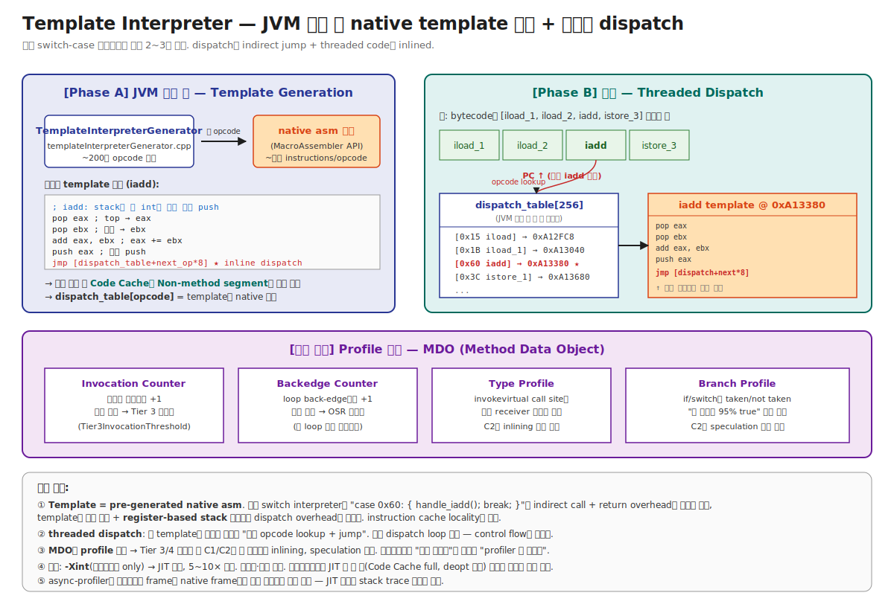

# 03-02. Template Interpreter — JVM 시작 시 native template을 generate하는 인터프리터

> "인터프리터는 switch-case로 opcode 분기"라고 답하면 학부 수준.
> HotSpot의 인터프리터는 **switch-case가 아니다**. JVM 시작 시 **각 opcode마다 native assembly template을 직접 generate**하고, 실행 시에는 **bytecode → dispatch table → 해당 template native code로 jump → template 끝에서 다음 opcode로 inline jump**. 이게 **Template Interpreter**고, 일반 인터프리터보다 2~3배 빠르다.
> 시니어가 이걸 알아야 하는 이유: warmup 동안 / Code Cache full 시 / deopt 후 — 인터프리터가 직접 실행하는 시간이 production에서 매우 길고, 그 시간의 성능이 결국 사용자가 보는 응답 시간이다.

---

## 🗺️ JVM 아키텍처 안에서 이 챕터의 위치

이 챕터는 [01-execution-overview](./01-execution-overview.md)의 **Stage 1 (Cold Start)** 깊이 들여다보기다.



```
[Bytecode]
    │
    ▼
[★ 이 챕터: Template Interpreter ★]   ← Tier 0
    │  (호출 카운터 + MDO profile 수집)
    │
    ▼ 호출 임계 도달
[Tier 3: C1]  → 03-tiered-compilation
    │
    ▼ 더 호출 + profile 안정
[Tier 4: C2]  → 04-c1-and-c2
```

---

## 📍 학습 목표

1. **Template Interpreter**가 일반 switch-case 인터프리터와 본질적으로 어떻게 다른지 안다 — pre-generated native template, threaded dispatch.
2. JVM 시작 시 **TemplateInterpreterGenerator**가 각 opcode의 native assembly를 어떻게 만드는지 큰 그림으로 안다.
3. **Dispatch table**의 구조 — opcode → template 주소 배열. 한 template 끝에서 다음 opcode로 어떻게 점프하는지.
4. **MDO (Method Data Object)** — 인터프리터가 수집하는 4가지 profile (invocation counter, backedge counter, type profile, branch profile)의 역할.
5. **OSR back-edge counter**가 어떻게 긴 loop 메서드의 컴파일을 트리거하는지.
6. 인터프리터의 **safepoint poll** — Concurrent GC가 모든 스레드를 어떻게 정지시키는지의 인터프리터 측면.
7. **`-Xint`** (인터프리터 only) 옵션과 실제 운영에서 인터프리터로만 도는 케이스 (Code Cache full, deopt 폭주).
8. **async-profiler, jstack 같은 도구가 인터프리터 frame을 어떻게 보는지** — JIT 단계별 stack trace 정확도 차이.
9. 운영 시나리오: 시작 직후 인터프리터 비율이 높은 시간 / Code Cache full 후 영구 인터프리터 / deopt 후 일시 인터프리터.
10. 일반 Bytecode 인터프리터(BCI) 종류 — switch, threaded, direct-threaded, indirect-threaded, computed-goto, **template**의 6가지 dispatch 방식 비교.

---

## 🎨 1단계: 백지 그리기 가이드

### Step 1: 일반 switch-case 인터프리터의 한계 (비교용)

```c
// 가장 단순한 인터프리터 (학부 수준)
while (running) {
    opcode = bytecode[pc++];
    switch (opcode) {
        case 0x15: /* iload */    handle_iload();    break;
        case 0x60: /* iadd */     handle_iadd();     break;
        case 0xB6: /* invokevirt*/ handle_invoke();   break;
        // ... ~200개 case
    }
}
```

**한계**:
- `switch` 자체가 indirect branch — branch predictor 잘 못 맞춤.
- 각 case 끝에 `break` → loop 조건 체크 → 다음 iteration → switch dispatch. **dispatch overhead가 명령마다 발생**.
- 컴파일러가 case branch table을 generate하지만 cache locality 안 좋음.

### Step 2: Template Interpreter의 두 단계

```
[Phase A: JVM 시작]
TemplateInterpreterGenerator가 각 opcode의 template을 native asm으로 generate
  → Code Cache의 Non-method segment에 저장
  → dispatch_table[opcode] = template 주소

[Phase B: 실행]
PC가 가리키는 bytecode의 opcode 읽기
  → dispatch_table[opcode] 점프
  → template native code 실행 (3~10 instruction)
  → 마지막에 다음 opcode로 inline jump
```

### Step 3: Dispatch table 그리기

```
dispatch_table[256]:   (opcode = 1바이트이므로 256개)
┌──────────────────────────────────┐
│ [0x00 nop]    → 0x...          │
│ [0x01 aconst_null] → 0x...     │
│ ...                              │
│ [0x15 iload]  → 0x0xA12FC8     │
│ [0x60 iadd]   → 0x0xA13380  ★  │
│ [0xB6 invokevirtual] → 0x...   │
│ ...                              │
└──────────────────────────────────┘
```

### Step 4: 한 template 내부 (iadd 예시)

```
iadd template:
  pop  eax              ; operand stack top → register
  pop  ebx              ; 다음 → register
  add  eax, ebx         ; 더하기
  push eax              ; 결과 push
  
  ; ★ inline dispatch (다음 opcode로 점프)
  movzx ecx, [esi]      ; PC가 가리키는 다음 opcode 읽기
  inc esi               ; PC++
  jmp [dispatch_table + ecx*8]
```

### Step 5: 병행 작업 — MDO 그리기

```
MDO (Method Data Object)
  ├─ Invocation Counter  (메서드 호출 += 1)
  ├─ Backedge Counter    (loop back-edge += 1) → OSR
  ├─ Type Profile        (invokevirtual call site별 receiver class)
  └─ Branch Profile      (if/switch의 taken/not taken)
```

### 정답 그림

위의 [02-template-interpreter.svg](./_excalidraw/02-template-interpreter.svg) 참조.

---

## 🧠 2단계: 직관

### 핵심 비유

> **요리 비유**:
> - **switch-case 인터프리터** = 매번 요리 책 색인을 뒤져 "이 단계는 몇 페이지?" 찾아본 후 그 페이지의 설명을 읽음. 매 단계마다 색인 조회.
> - **Template Interpreter** = 미리 모든 단계를 **준비된 카드**로 만들어 두고, 각 카드 마지막 줄에 "다음 단계는 이 색인으로 이동" 적어둠. 색인 조회 1번에 다음 카드로 즉시 이동. 책으로 안 돌아옴.
> - **Threaded code** = 카드들이 자동으로 다음 카드를 가리키게 묶인 구조.

### 정확한 정의 (비유와 분리)

| 용어 | 정의 |
|---|---|
| **Template Interpreter** | HotSpot의 bytecode 인터프리터 구현. JVM 시작 시 각 opcode에 대응하는 native assembly template을 generate하여 Code Cache에 저장. 실행 시 그 template으로 점프. |
| **Template** | 한 opcode의 실행 코드. native instruction 수십 개 이내. operand stack 조작 + dispatch 코드 포함. |
| **TemplateInterpreterGenerator** | HotSpot 시작 시 template을 생성하는 generator. C++로 작성, MacroAssembler API 사용. |
| **Dispatch Table** | opcode(0~255) → template 주소 매핑 배열. 256 entry × 8 byte (포인터) = 2KB. |
| **Threaded Dispatch** | 각 template 마지막에 "다음 opcode 읽고 dispatch" 코드가 inline. 별도 dispatch loop 없음. |
| **MDO (Method Data Object)** | 한 메서드의 실행 profile. 호출 카운터, branch profile, type profile 등. C1/C2의 최적화 결정 입력. |
| **Invocation Counter** | 메서드 호출 시마다 +1. 임계 도달 시 컴파일 트리거. |
| **Backedge Counter** | Loop의 back-edge (loop 끝에서 시작으로) 통과 시 +1. OSR compilation 트리거. |
| **Safepoint Poll** | 인터프리터가 (특정 명령에서) "GC가 safepoint를 요청했는가?" 확인. 요청 있으면 정지하고 GC에 협조. |
| **`-Xint`** | JIT 비활성화. 인터프리터로만 실행. 디버깅/재현 용도. 일반 5~10× 느림. |

### 왜 Template Interpreter가 일반 인터프리터보다 빠른가 — 3가지 본질

```
일반 switch interpreter:
   loop iteration:
      1. PC read
      2. switch dispatch (indirect branch, predictor 불리)
      3. case body 실행
      4. break, loop 조건 체크, jump back to loop head
      → 명령당 dispatch overhead ~10~20 cycles

Template Interpreter:
   각 template 끝:
      1. PC read
      2. dispatch_table lookup
      3. jmp [dispatch_table + opcode*8]
      → 명령당 dispatch overhead ~3~5 cycles
```

**3가지 본질적 차이**:

1. **No dispatch loop**: switch 인터프리터는 매번 dispatch loop의 시작으로 돌아감. Template은 각 명령이 직접 다음 명령으로 점프 — control flow 그래프가 더 평탄.

2. **Indirect branch locality**: switch의 indirect branch는 한 곳에서 ~200 곳으로 분기 → branch predictor history 못 활용. Template의 inline dispatch는 각 template마다 별도 indirect jump → 각 지점에서 다음 자주 오는 opcode를 predict 가능 (예: iload 다음에 자주 iadd).

3. **Register allocation**: switch interpreter는 C 컴파일러가 만든 generic 코드 — operand stack도 C array로. Template은 손으로 작성한 asm — operand stack top을 register에 캐싱 같은 최적화 가능.

### 왜 인터프리터에 profiling이 들어가는가 — Tier 승격의 기반

```
[인터프리터의 두 가지 책임]
        │
        ├── 1. Bytecode 실행 (느리지만 즉시 시작)
        │
        └── 2. Profile 수집 (★ 더 중요할 수도)
             │
             ├── Invocation Counter → Tier 승격 트리거
             ├── Backedge Counter → OSR 트리거
             ├── Type Profile → C2의 inlining 결정
             └── Branch Profile → C2의 speculation 결정
```

→ 인터프리터는 단순한 "느린 실행기"가 아니라 **JIT 컴파일러의 입력을 만드는 profiler**. 인터프리터 단계가 짧으면 C2가 결정에 쓸 데이터가 부족 → 보수적 최적화 → 성능 떨어짐.

### 왜 OSR이 인터프리터에서 트리거되나

```java
void main() {
    for (int i = 0; i < 1_000_000_000; i++) {   // 10억 회
        process(i);
    }
}
```

- 메서드 호출은 1회 → Invocation Counter는 1.
- Loop body는 10억 회 → Backedge Counter가 폭증.
- Backedge Counter 임계 (`Tier3BackEdgeThreshold` 등) 도달 → **OSR compile 요청**.

OSR compile은 메서드의 특정 bytecode index (보통 loop entry)에서 진입 가능한 nmethod 생성. 인터프리터가 다음 loop iteration 시작 시 그 nmethod로 stack frame 교체.

→ **인터프리터가 backedge counter를 수집하지 않으면 OSR 발생 안 함** — 영원히 인터프리터로 long loop 실행 = 처리량 손실.

---

## 🔬 3단계: 구조

### Bytecode 인터프리터 dispatch 방식 6종 비교

학부 자료가 흔히 빼먹는 — 인터프리터 dispatch는 여러 패턴이 있다:

| 방식 | dispatch overhead | branch predict | 구현 복잡도 | 사용처 |
|---|---|---|---|---|
| **Switch-case** | 큼 (loop + switch) | 나쁨 (한 점에서 N 분기) | 단순 | 학부, 작은 VM |
| **Threaded (direct)** | 작음 | 좋음 | 중간 | Forth, 일부 Lisp |
| **Threaded (indirect)** | 작음 | 좋음 | 중간 | Java Quick Interpreter (옛 sun) |
| **Computed-goto** | 매우 작음 | 좋음 | GCC 확장 의존 | Python, Ruby (CPython, MRI) |
| **Token-threaded** | 중간 | 보통 | 단순 | 일부 임베디드 |
| **Template** | 매우 작음 (3~5 cycle) | 좋음 | 매우 복잡 | **HotSpot ★** |

→ HotSpot의 선택: **template + threaded dispatch**. 성능을 위해 구현 복잡도를 감수.

### Template Generation — 시작 시 한 번

```
JVM 부팅 시퀀스:
        │
        ▼
1. TemplateInterpreterGenerator::generate_all() 호출
        │
        ▼
2. 각 opcode 순회 (~200개):
   for (opcode = 0; opcode < 256; opcode++) {
       generate_template(opcode);  // 그 opcode의 native asm 생성
       dispatch_table[opcode] = current_template_addr;
   }
        │
        ▼
3. 모든 template이 Code Cache의 Non-method segment에 저장
        │
        ▼
4. JVM이 사용자 코드 실행 시작 시 첫 메서드의 _from_interpreted_entry로 점프 
   → 메서드 prolog → 첫 bytecode template으로 dispatch
```

### Template의 구조 (예: iadd)

```
[iadd template의 일반화된 의사 코드]

iadd_template:
    ; 0. Bytecode 시작 시점에 PC는 다음 opcode를 가리킴
    
    ; 1. Operand stack 조작 (iadd: top 2 pop, sum push)
    pop  eax              ; top → eax (TOS, top of stack)
    pop  ebx              ; next → ebx
    add  eax, ebx         ; eax += ebx
    push eax              ; 결과 push
    
    ; 2. Profile / Safepoint (옵션)
    ; (iadd는 단순 산술이라 보통 없음)
    
    ; 3. Dispatch — 다음 opcode로 점프
    movzx ecx, byte ptr [rsi]   ; PC의 다음 opcode 읽기 (rsi가 PC)
    inc rsi                      ; PC++
    jmp qword ptr [r15 + rcx*8]  ; r15가 dispatch_table base
```

**핵심**:
- PC는 register에 캐싱 (`rsi`).
- Dispatch table base도 register에 캐싱 (`r15`).
- TOS를 register에 캐싱하기도 함 (TOS caching) — pop/push 줄여 추가 성능 향상.
- 마지막 `jmp` 한 번으로 다음 명령으로 — branch predictor가 다음 자주 오는 opcode를 학습 가능.

### Profile 수집 코드의 inline

자주 실행되는 명령(invokevirtual, if 등)의 template에는 profile 수집 코드가 추가로 inlined:

```
invokevirtual_template:
    ; 1. 호출 대상 resolve
    ...
    
    ; 2. 호출 카운터 증가 (★ profile)
    load  rax, [method_ptr + invocation_counter_offset]
    inc   rax
    store [method_ptr + invocation_counter_offset], rax
    
    ; 3. 임계 도달 확인 → 컴파일 요청
    cmp   rax, Tier3InvocationThreshold
    jge   request_compilation       ; Compile Broker 호출
    
    ; 4. Type profile 갱신 (call site의 receiver class 기록)
    load  rbx, [obj + klass_offset]
    update_type_profile_entry()
    
    ; 5. 실제 호출 dispatch
    ...
```

이게 인터프리터가 **느린 실행기 + 정확한 profiler**의 역할을 동시에 하는 메커니즘.

### Method 호출 시점의 entry 선택

```
caller 코드:
  invokevirtual #15  →  callee의 _from_interpreted_entry 또는 _from_compiled_entry로 점프
                         │
                         ├── nmethod 없음 → _from_interpreted_entry (인터프리터 stub)
                         │     → interpreter frame 생성
                         │     → 첫 bytecode template로 dispatch
                         │
                         └── nmethod 있음 → _from_compiled_entry (native code 진입)
                               → native frame
```

인터프리터 stub의 역할:
1. Interpreter frame 생성 (local variable array + operand stack + frame data).
2. `max_locals`, `max_stack`은 메서드의 Code attribute에서 알아냄.
3. 파라미터를 caller에서 callee의 local slot으로 복사.
4. 첫 bytecode template로 점프.

### Safepoint Poll의 인터프리터 측면

```
Concurrent GC가 모든 스레드를 정지시키려고 함:
        │
        ▼
1. JVM이 polling page를 mprotect(PROT_NONE)으로 설정
        │
        ▼
2. 인터프리터의 특정 명령들 (메서드 진입, loop back-edge, 메서드 return) 의 template에 
   safepoint poll instruction이 inlined:
   
   test rax, [polling_page_addr]   ; ← mprotect된 페이지 → SEGV
        │
        ▼
3. SEGV 발생 → signal handler → 스레드를 safepoint blocking 상태로
        │
        ▼
4. GC가 모든 스레드 정지 확인 후 GC 진행
```

→ 인터프리터는 자연스러운 polling 지점들이 많아 safepoint 진입이 빠름. JIT 컴파일된 코드는 별도 polling instruction 삽입 필요.

### `-Xint` 옵션

JIT를 완전 비활성화하고 인터프리터로만 실행:
```bash
java -Xint -jar app.jar
```

- 사용처: JIT 버그 의심 시 재현, debugger와의 호환성, 매우 빠른 startup (Code Cache 사용 안 함).
- 일반 5~10× 느림. Production 사용 거의 없음.
- **운영 함의**: Code Cache full이나 deopt 폭주 시 사실상 `-Xint`와 비슷한 상태 도달 — 인터프리터로 도는 메서드의 성능이 곧 응답 성능.

---

## 🧬 4단계: 내부 구현 — HotSpot

### TemplateInterpreterGenerator

위치: `src/hotspot/cpu/x86/templateInterpreterGenerator_x86.cpp` (CPU별 구현)

```cpp
class TemplateInterpreterGenerator {
private:
  MacroAssembler* _masm;        // 어셈블리 생성 도구
  address         _dispatch_table[256];

public:
  void generate_all() {
    // 1. 각 bytecode opcode의 template 생성
    for (int i = 0; i < 256; i++) {
      _dispatch_table[i] = generate_normal_template(i);
    }

    // 2. 특수 entry points 생성
    _entry_point_for_signature[normal] = generate_normal_entry();
    _entry_point_for_signature[synchronized] = generate_synchronized_entry();
    _entry_point_for_signature[native] = generate_native_entry();

    // 3. Return entries (메서드 return 시 caller로 돌아갈 stub)
    _return_entry[T_INT] = generate_return_entry_for(itos);
    _return_entry[T_VOID] = generate_return_entry_for(vtos);
    // ...
  }

private:
  address generate_normal_template(int opcode) {
    address start = _masm->pc();
    Template* t = Bytecodes::template_for(opcode);
    t->generate(_masm);  // 각 opcode별 generate
    return start;
  }
};
```

→ 각 opcode가 자기 `Template` 객체를 가지고, `generate(_masm)`로 자기 native code를 emit.

### 한 opcode의 generate (iadd 예)

위치: `src/hotspot/cpu/x86/templateTable_x86.cpp`

```cpp
void TemplateTable::iadd() {
  // 1. operand stack top 2개를 register로
  __ pop_i(rdx);              // 다음 → rdx
  __ pop_i(rax);              // top → rax (TOS는 rax에 캐싱됨)

  // 2. 더하기
  __ addl(rax, rdx);

  // 3. 결과는 rax에 — TOS caching이라 push 불필요
  
  // (dispatch는 dispatch_next() 매크로로 자동 inline)
}

void TemplateTable::dispatch_next() {
  // PC에서 다음 opcode 읽기
  __ load_unsigned_byte(rbx, Address(r13, 0));   // r13 = bcp (bytecode pointer)
  __ increment(r13);                              // bcp++
  
  // dispatch_table 점프
  __ jmp(Address(r14, rbx, Address::times_8));   // r14 = dispatch_table base
}
```

→ HotSpot의 인터프리터는 **rax(TOS), r13(BCP), r14(dispatch table base)** 같은 register를 영구 할당. 일반 native ABI를 따르지 않는 자체 calling convention.

### Method Counters

위치: `src/hotspot/share/oops/methodCounters.hpp`

```cpp
class MethodCounters : public Metadata {
private:
  InvocationCounter _invocation_counter;     // 호출 카운터
  InvocationCounter _backedge_counter;       // loop back-edge 카운터
  jint              _interpreter_invocation_count;
  jushort           _interpreter_throwout_count;
  // ...
};

class InvocationCounter {
private:
  unsigned int _counter;

public:
  void increment() {
    _counter += count_increment;  // 보통 +1
  }

  bool reached_threshold() {
    return _counter >= count_threshold;
  }
};
```

각 메서드의 첫 호출 시 `MethodCounters` 할당. profile counter들이 여기에 누적.

### MDO (Method Data) — 더 풍부한 profile

위치: `src/hotspot/share/oops/methodData.hpp`

```cpp
class MethodData : public Metadata {
private:
  Method* _method;
  
  // call site별 type profile, branch profile 저장소
  // 각 bytecode 위치마다 DataLayout 슬롯
  intptr_t _data[1];  // 가변 크기
};

class ReceiverTypeData {
  // invokevirtual call site의 receiver class 통계
  Klass* receiver(int row);
  uint   count(int row);
  // 보통 최대 2~3개 type 기록
};

class BranchData {
  // if/switch의 taken/not taken 카운터
  uint taken();
  uint not_taken();
};
```

C1/C2가 이 MDO를 읽어 inlining/speculation 결정. **MDO가 부족하면 C2의 최적화가 보수적**.

### Safepoint Poll in Interpreter

위치: `src/hotspot/share/interpreter/templateTable.cpp`

```cpp
// branch_backwards (loop back-edge) template
void TemplateTable::branch(bool is_jsr, bool is_wide) {
  // ... branch 처리 ...

  // ★ backward branch면 safepoint poll
  if (is_backward_branch) {
    // safepoint required?
    __ test_and_jump_safepoint_poll(...);

    // backedge counter 증가 + OSR 트리거 검사
    __ increment_backedge_counter();
    __ check_osr_threshold(...);
  }
}
```

→ Loop back-edge가 safepoint + OSR 두 가지를 모두 점검하는 가장 핵심적 위치.

---

## 📜 5단계: 역사

| 연도 | 릴리스 | 변화 | 이유 |
|---|---|---|---|
| 1996 | JDK 1.0 | Sun의 단순 switch-case 인터프리터 | 초기 |
| 1997 | JDK 1.1 | "Quick" Interpreter (threaded dispatch 일부) | 성능 ↑ |
| 1999 | HotSpot 1.0 | **Template Interpreter 도입** | switch 대비 2~3× 빠름 |
| 2000 | HotSpot 1.3 | 모든 플랫폼으로 확장 | x86, SPARC, ARM... |
| 2007 | JDK 6 | StackMapTable 활용 | verify 가속 |
| 2014 | JDK 8 | Tiered 기본 on — 인터프리터의 profile 역할 더 중요해짐 | |
| 2017 | JDK 9 | Code Cache 분리 — Non-method segment에 template 영구 보관 | |
| 2018 | JDK 11+ | Graal interpreter (대안) | 메인테너빌리티 |
| 2023 | JDK 21 | Project Lilliput 영향 — Mark Word 변화로 일부 template 수정 | object header 압축 |

### Template Interpreter 도입의 의미

HotSpot 1.0 (1999) 이전:
- Sun의 옛 JVM (Classic VM)은 switch-case 인터프리터.
- "Java is slow" 평판의 가장 큰 원인.

HotSpot의 두 가지 혁신:
1. **JIT 컴파일** (C1, C2) — peak 성능.
2. **Template Interpreter** — JIT 컴파일 전/중에도 빠른 baseline.

→ JIT가 컴파일 중인 동안 인터프리터로 도는 시간이 사용자 응답의 일부 — Template Interpreter가 그 시간을 5~10배 줄임.

### Project Lilliput과 인터프리터

JDK 21+ Project Lilliput (object header 압축):
- Mark Word + Klass Pointer = 12B → 4B 또는 8B로 축소 목표.
- 인터프리터의 모든 객체 접근 template (getfield, putfield, monitorenter 등)이 새 header layout에 맞게 재작성됨.
- 운영 의미: JDK 업그레이드 시 인터프리터 성능 미세 변화 (보통 좋아짐).

---

## ⚖️ 6단계: 트레이드오프

### Template Interpreter 자체의 트레이드오프 vs 다른 dispatch 방식

| | Template (HotSpot) | Computed-goto (Python/Ruby) | Switch (학부) |
|---|---|---|---|
| Dispatch overhead | 매우 작음 | 작음 | 큼 |
| 구현 복잡도 | 매우 복잡 (CPU별 asm) | 중간 (GCC 확장) | 단순 |
| 플랫폼 이식 | 어려움 (CPU별 별도) | 쉬움 (C) | 가장 쉬움 |
| Profile 통합 | 자연스러움 (asm에 inline) | 가능 | 어색 |
| 디버깅 | 어려움 | 중간 | 쉬움 |

→ HotSpot은 성능을 위해 복잡도/이식성을 감수. 새 CPU 지원 (RISC-V 등) 시 인터프리터 generator 새로 작성.

### `-Xint` vs 기본 (Tiered)

| `-Xint` | 기본 (Tiered) |
|---|---|
| 인터프리터만 | Interpreter + C1 + C2 |
| 시작 즉시 정상 | warmup 필요 |
| 5~10× 느림 (정상 상태) | peak 빠름 |
| Code Cache 안 씀 | Code Cache 사용 |
| 디버깅용 | 운영용 |

### Profile 수집 비용

```
인터프리터의 명령마다 profile 코드 (counter 증가 등):
  - 단순 명령 (iadd 등): ~0% overhead
  - 호출 명령 (invokevirtual 등): ~10~20% overhead
  - 분기 명령 (if 등): ~5~10% overhead

평균: 인터프리터 시간의 ~5% 정도가 profile 수집
```

→ 작아 보이지만 인터프리터 시간 자체가 워낙 비싸므로 (JIT 대비 5~10×) profile 비용도 절대적으로는 큼. 그러나 그 profile이 C2의 좋은 최적화를 만들기에 가치가 큼.

### Code Cache 사용량 — Template Interpreter 부분

```
Non-method segment 기본 5.7MB 중:
  - Template Interpreter: ~2MB
  - Adapter (calling convention 변환 stub): ~수백 KB
  - Runtime stub (safepoint, exception handler 등): ~수백 KB
```

→ Template Interpreter 자체는 작음. 한 번 generate되면 영구. JVM 시작 시간에 영향 ~수십 ms.

---

## 📊 7단계: 측정·진단

### `jstack`이 인터프리터 frame을 보는 방식

```
"main" #1 prio=5 os_prio=0 cpu=12345.67ms tid=0x7f8a... nid=0x123 runnable [0x7f8a...]
   java.lang.Thread.State: RUNNABLE
        at com.foo.Service.process(Service.java:42)
        - locked <0x...> (a java.lang.Object)
        at com.foo.Service.run(Service.java:25)
        at java.base/java.lang.Thread.run(Thread.java:840)
```

`Service.process(Service.java:42)` — interpreter frame일 수도, native frame일 수도. jstack은 둘 다 같은 형식으로 표시. 차이를 보려면:
- JFR `jdk.ExecutionSample` 이벤트의 `state` 필드 (interpreted vs native).
- async-profiler의 `-e cpu` 모드에서 `[i]` 표시 (interpreted) vs `[c]` (compiled).

### async-profiler 출력 해석

```bash
asprof -e cpu -d 60 -f profile.html <pid>
```

Flame graph에서:
- 정상 가독: 컴파일된 메서드의 stack trace.
- 가끔 깨진 stack: 인터프리터의 PC가 일반 native frame과 다른 형태 → unwinding 오류 가능.
- 시작 직후 (warmup 중) 프로파일링: 대부분 인터프리터 → flame graph가 흐릿할 수 있음.

→ **운영 함의**: warmup 끝난 후 프로파일링이 정확. 시작 직후는 측정 부정확.

### `-Xlog:interpreter` (JDK 9+)

```bash
java -Xlog:interpreter=debug -jar app.jar
```

Template 생성 + dispatch table 정보 출력. 일반 운영에선 사용 안 함, 디버깅용.

### JFR Method Profiling 이벤트

```bash
jcmd <pid> JFR.start name=mp duration=60s settings=profile filename=mp.jfr
jfr summary mp.jfr | grep -iE 'ExecutionSample|MethodSample'
```

각 `jdk.ExecutionSample` 이벤트의 method 정보 + tier 표시 — interpreter / C1 / C2 비율 확인.

### 운영 시나리오 진단 매트릭스

| 증상 | 진단 | 가능 원인 |
|---|---|---|
| 시작 후 첫 1~5분 응답 느림 | JFR `jdk.ExecutionSample`의 tier 분포 | 정상 — 인터프리터 비율 높은 warmup |
| 운영 중 갑자기 응답 5× 느려짐 | `jcmd Compiler.codecache` stopped_count | Code Cache full → 인터프리터로 회귀 |
| 특정 메서드만 영원히 느림 | `-XX:+PrintCompilation` 의 `made not entrant` | 그 메서드가 deopt 후 재컴파일 못 함 |
| async-profiler flame graph가 흐릿 | 측정 시점 확인 | warmup 중 측정 — 끝나고 다시 |

### 시나리오 1: Code Cache full → 인터프리터 회귀

```
환경: Spring Boot, JDK 21, -Xmx 2g
증상: 시작 30분 후 응답이 평소의 5배. P99 latency 50ms → 250ms.

진단:
$ jcmd <pid> Compiler.codecache | grep stopped
stopped_count=1   ← ★ JIT 한 번 멈춤
$ jcmd <pid> Compiler.codecache | grep -A 3 non-profiled
non-profiled: 117MB / 117MB (100%)   ← 가득 참
$ jcmd <pid> JFR.start duration=60s
$ jfr print --events jdk.ExecutionSample mp.jfr | head -50
# tier 분포가 interpreter:60%, compiled:40%   ← 정상은 ~5:95

원인: Code Cache full → 새 컴파일 안 됨 → deopt된 메서드들이 인터프리터로

조치:
-XX:ReservedCodeCacheSize=512m  (240M → 512M)
또는 컴파일 옵션 조정 (Tier 3 끄기 등 — trade-off)
```

### 시나리오 2: 인터프리터로만 도는 cold path

```
환경: 트래픽 99%가 path A, 1%가 path B
증상: path B 호출 시 응답이 5× 느림 (warmup된 path A 대비)

진단:
$ -XX:+PrintCompilation 의 출력
# path B의 메서드들은 컴파일 안 됨 (호출 임계 미달)

원인: path B 호출이 적어 invocation counter가 임계 도달 못 함 → 영원히 인터프리터

조치:
1. -XX:CompileThreshold=1000  (기본보다 낮춤)
2. 또는 `-XX:CompileCommand=compileonly,com.foo.Service::*` 로 강제 컴파일
3. 운영 시작 시 path B도 합성 부하로 warmup
```

### 시나리오 3: async-profiler 측정 부정확

```
환경: prod 트래픽 시작 1분 후 async-profiler로 hot path 분석
증상: flame graph가 흐릿, 일부 stack이 truncated

진단: 측정 시점이 warmup 중 — 인터프리터 frame이 많아 unwinding 오류.

조치:
1. 측정 전 warmup 충분히 (5~10분).
2. async-profiler에 `--cstack vm` 옵션으로 VM-side unwinding 사용.
3. JFR로 대신 측정 (HotSpot 내부 unwinding이라 더 정확).
```

---

## ⚔️ 8단계: 꼬리질문 트리

### Q1. HotSpot의 Template Interpreter가 일반 switch-case 인터프리터보다 빠른 이유는?

**예상 답변**:
> 3가지 본질적 차이:
> 1. **No dispatch loop**: switch는 매번 loop의 시작으로 → loop overhead. Template은 각 명령이 직접 다음 명령으로 점프 — control flow 평탄.
> 2. **Branch predictor 친화**: switch의 indirect branch는 한 곳에서 ~200 방향으로. Template의 inline dispatch는 각 위치마다 별도 indirect jump → 각 위치에서 다음 자주 오는 opcode를 predict 가능 (예: iload 다음 자주 iadd).
> 3. **손으로 작성한 asm**: TOS register caching, BCP register caching, dispatch table base register caching 등 일반 C 컴파일러가 못 하는 최적화.
> 
> 결과: 일반 switch 대비 2~3× 빠름.

#### 🪝 Q1-1: 그럼 Template Interpreter를 모든 VM이 안 쓰는 이유는?

> 구현 복잡도와 이식성:
> - CPU별로 따로 asm을 작성해야 함 (x86, ARM, RISC-V 등).
> - JIT 컴파일러도 마찬가지.
> - 작은 VM 프로젝트는 cost 못 감당.
> - Python (CPython), Ruby (MRI)는 computed-goto로 절충 — 성능 일부 양보하고 이식성 ↑.

### Q2. 인터프리터가 수집하는 profile에는 무엇이 있고 왜 필요한가요?

**예상 답변**:
> 4가지 핵심:
> 1. **Invocation Counter**: 메서드 호출 횟수. 임계 도달 시 Tier 승격 트리거.
> 2. **Backedge Counter**: loop back-edge 횟수. 임계 도달 시 OSR 컴파일 트리거.
> 3. **Type Profile**: invokevirtual call site별 receiver 클래스 통계. C2의 inlining 결정.
> 4. **Branch Profile**: if/switch의 taken/not taken 비율. C2의 speculation 결정.
> 
> 인터프리터는 "느린 실행기"가 아니라 **JIT의 정확한 입력을 만드는 profiler**. profile 부족하면 C2의 최적화가 보수적 → 성능 저하.

### Q3. OSR이 왜 인터프리터에서 트리거되나요?

**예상 답변**:
> 메서드 호출이 적지만 loop가 hot인 케이스 (예: `void main() { for (int i = 0; i < 1e9; i++) ...}`):
> - Invocation counter는 1.
> - Backedge counter가 폭증.
> 
> 인터프리터의 backward branch template이 backedge counter 증가 + 임계 검사 → OSR compile request.
> 
> OSR variant nmethod 컴파일 후, 인터프리터가 다음 loop iteration 시작 시 stack frame을 native frame으로 교체 → loop 나머지 native 실행.

### Q4. `-Xint` 옵션을 운영에서 쓰는 경우는?

**예상 답변**:
> 거의 없음. 5~10× 느림. 사용처:
> 1. JIT 버그 의심 시 재현/우회.
> 2. Debugger와 호환 (일부 디버거가 native code에서 buggy).
> 3. 매우 빠른 startup이 필요한 batch — 컴파일 시간 없음.
> 4. Code Cache 사용 안 함 — 컨테이너 메모리 매우 제한적.
> 
> Production에서는 `Code Cache full + JIT 비활성` 상태가 사실상 `-Xint`와 비슷한 결과 — 진단의 첫 의심.

### Q5. async-profiler가 인터프리터 frame을 잘 못 보는 이유는?

**예상 답변**:
> Stack unwinding의 정확도 문제:
> - 컴파일된 nmethod는 frame layout이 표준 (RBP 기반 등) → unwinder가 정확.
> - 인터프리터 frame은 HotSpot 자체 layout (RBP가 다른 의미) → 일반 unwinder가 혼란.
> 
> 해결책:
> - async-profiler `--cstack vm` 옵션 — HotSpot의 자체 unwinder 사용.
> - JFR의 `jdk.ExecutionSample` — VM 내부 unwinding으로 정확.
> 
> 운영 함의: warmup 끝난 후 측정하면 인터프리터 frame이 적어 정확도 ↑.

### Q6. (Killer) Spring Boot 앱이 시작 30분 후 응답이 평소의 5배 느려졌습니다. 인터프리터 회귀를 의심하고 진단해보세요.

**예상 답변**:
> 1. **Code Cache 상태 확인**:
>    ```
>    jcmd <pid> Compiler.codecache | grep -E 'stopped|non-profiled|profiled'
>    ```
>    `stopped_count > 0` → JIT 한 번이라도 멈춤.
>    각 segment 100% 도달 → full.
> 
> 2. **Tier 분포 확인 (JFR)**:
>    ```
>    jcmd <pid> JFR.start duration=60s settings=profile filename=tier.jfr
>    jfr print --events jdk.ExecutionSample tier.jfr | awk '{print $7}' | sort | uniq -c
>    ```
>    interpreter 비율이 정상(~5%)을 크게 넘으면 회귀.
> 
> 3. **메서드별 컴파일 상태**:
>    ```
>    -XX:+PrintCompilation 의 'made not entrant' 빈도
>    -XX:+UnlockDiagnosticVMOptions -XX:+PrintNMethods 의 nmethod 상태
>    ```
> 
> 4. **원인 식별**:
>    - Code Cache full: ReservedCodeCacheSize ↑.
>    - Deopt 폭주: JFR `jdk.Deoptimization` reason 분석.
>    - 둘 다 정상이지만 cold path: CompileThreshold 또는 CompileCommand로 강제 컴파일.

#### 🪝 Q6-1: Code Cache full을 미리 모니터링하려면?

> Prometheus + JMX:
> - `jvm.code_cache.usage` 또는 `java.lang:type=MemoryPool,name=CodeHeap.*` MBean.
> - 80% 임계에서 알람.
> - 또는 JFR 주기적 dump + `jdk.CodeCacheStatistics` 이벤트.
> 
> 또는 운영자 친화 도구:
> - JDK Mission Control의 Code Cache 패널.
> - VisualVM + Codecache 플러그인.

---

## 🔗 다음 단계

- → [03. Tiered Compilation](./03-tiered-compilation.md): Compile Broker + tier 결정 + CompilerThread
- → [04. C1 and C2](./04-c1-and-c2.md): C1/C2 컴파일러 비교 + Sea-of-Nodes
- → [08. Speculative and Deopt](./08-speculative-and-deopt.md): Deopt 후 인터프리터 복귀 풀버전
- ← [01. Execution Overview](./01-execution-overview.md): 전체 흐름
- ← [Chapter 02-04 Code Cache](../02-runtime-data-areas/04-code-cache.md): Non-method segment에 template 저장

## 📚 참고

- **HotSpot src `templateTable.hpp/cpp`**: https://github.com/openjdk/jdk/blob/master/src/hotspot/share/interpreter/templateTable.hpp
- **HotSpot src `templateInterpreterGenerator.hpp`**: https://github.com/openjdk/jdk/blob/master/src/hotspot/share/interpreter/templateInterpreterGenerator.hpp
- **HotSpot src `methodData.hpp`** (MDO): https://github.com/openjdk/jdk/blob/master/src/hotspot/share/oops/methodData.hpp
- **JVM Anatomy Quark #2 — Template Interpreter** (Shipilëv): https://shipilev.net/jvm/anatomy-quarks/
- **Krzysztof Słońka — Bytecode Interpreter Dispatch 방식 비교**: blog post
- **Cliff Click — Why HotSpot is Fast** 컨퍼런스 발표: Template Interpreter 설명 포함
- **HotSpot Glossary — Interpreter**: https://openjdk.org/groups/hotspot/docs/HotSpotGlossary.html
- **00-overview/02-deep-dive/D-opcode-dispatch**: 본 챕터의 단순 버전. 더 깊은 비교 원하면 거기.
