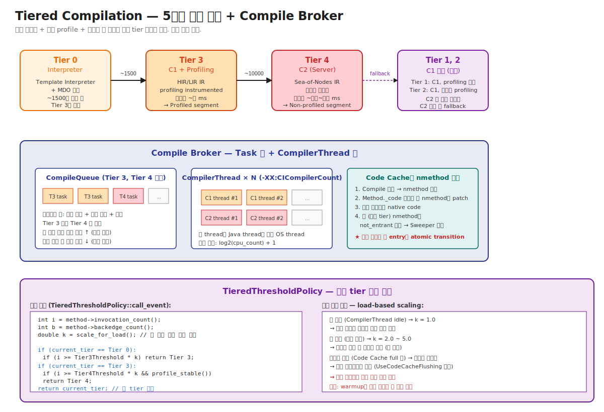

# 03-03. Tiered Compilation — 5단계 점진 승격 + Compile Broker

> "C1으로 빠르게, C2로 깊게" 한 줄 답은 절반이다.
> 실제로는 **Tier 0~4의 5단계 + 동적 임계 조정 + Compile Broker의 우선순위 큐 + CompilerThread 풀 + Code Cache 압박 시 fallback** 까지 — 한 시스템으로 묶여 있다.
> 시니어가 알아야 할 것: warmup이 평소보다 느린데 코드는 그대로일 때, **Compile Broker의 큐 상태**가 첫 의심지점이다. 큐가 길면 동적 임계가 올라가 컴파일 요청이 줄어든다 → 인터프리터가 더 오래 돈다. 이게 K8s pod의 startup 시간을 좌우한다.

---

## 🗺️ JVM 아키텍처 안에서 이 챕터의 위치

이 챕터는 [01-execution-overview](./01-execution-overview.md)의 **Stage 2~4 (Tier 승격)** 의 풀버전이다.



```
[Tier 0: Interpreter]   → 02-template-interpreter
       │
       ▼  ★ 이 챕터 ★
[TieredThresholdPolicy 결정]
       │
       ▼  CompileBroker에 task push
[Tier 3: C1+profiling]  → 04-c1-and-c2
       │
       ▼
[Tier 4: C2]            → 04-c1-and-c2
       │
       ▼
[Code Cache 설치]       → 02-04 code cache
```

---

## 📍 학습 목표

1. **Tier 0~4의 5단계**와 각 tier의 정확한 의미를 안다. Tier 1, 2가 일반 운영에서 거의 안 쓰이는 이유.
2. **TieredThresholdPolicy**가 어떤 정보(invocation count, backedge count, queue load)로 다음 tier를 결정하는지 안다.
3. **Compile Broker**의 구조 — Tier별 분리된 우선순위 큐, CompilerThread 풀.
4. **동적 임계 조정 (load-based scaling)** — 큐가 길어지면 임계가 올라가 요청을 줄이는 메커니즘.
5. **CompilerThread**가 일반 Java thread와 별도 OS thread인 이유, `-XX:CICompilerCount` 옵션의 의미.
6. **컴파일 결과 설치** — Method._code patch가 atomic word write로 안전한 이유.
7. **Tiered Off 옵션** (`-XX:-TieredCompilation`, `-XX:TieredStopAtLevel=N`)의 운영 효과.
8. **Compile Queue 적체**가 warmup을 늘리는 메커니즘 — production 시작 시 큐 상태 모니터링.
9. **`-XX:+PrintCompilation`** 로그를 보고 어느 tier 컴파일이 어떻게 진행 중인지 5분 안에 해석.
10. 운영 시나리오: K8s pod warmup 늦음 / 큐 폭주 / 컴파일 실패 후 fallback / 임계 튜닝.

---

## 🎨 1단계: 백지 그리기 가이드

### Step 1: 5개의 tier 박스를 가로로 (좌→우)

```
[Tier 0: Interpreter]  →  [Tier 3: C1+profile]  →  [Tier 4: C2]
                                                       ↑
                              [Tier 1, 2: C1 변형 (보조, fallback)]
```

### Step 2: 박스 사이에 임계 표시

```
Tier 0 ──(invocation ≥ 1500)──► Tier 3 ──(invocation ≥ 10000 + 안정 profile)──► Tier 4
```

### Step 3: 중앙에 Compile Broker 구조

```
[Tier 0~4 요청] ──► [Compile Broker]
                    ├── CompileQueue (Tier 3용)
                    ├── CompileQueue (Tier 4용)
                    └── CompilerThread 풀
                         ├── C1 thread × n
                         └── C2 thread × m
                             │
                             ▼
                         [Code Cache 설치]
                         Method._code patch (atomic)
```

### Step 4: 동적 임계 화살표

```
큐 길이 ── (load factor k) ──► 임계 임시 ↑ ──► 새 요청 줄어듦
큐 짧음 ── (load factor k=1) ──► 임계 정상
```

### 정답 그림

위의 [03-tiered-compilation.svg](./_excalidraw/03-tiered-compilation.svg) 참조.

---

## 🧠 2단계: 직관

### 핵심 비유

> **음식점 주방 비유**:
> - **Tier 0 (Interpreter)** = 인스턴트 라면 (즉시 만들지만 맛 적음).
> - **Tier 3 (C1)** = 30분 만에 만든 일반 요리 (괜찮은 맛, 빠르게 준비).
> - **Tier 4 (C2)** = 셰프가 2시간 만든 정통 요리 (최고의 맛, 시간 큼).
> - **Compile Broker** = 주방 매니저 — 어느 요리를 누구에게 맡길지, 순서를 결정.
> - **CompilerThread** = 셰프들 — C1 셰프 / C2 셰프 분리.
> - **동적 임계** = 주방이 바쁘면 "고급 요리는 조금 미루자" 결정 (큐 우선순위 조정).

### 정확한 정의 (비유와 분리)

| 용어 | 정의 |
|---|---|
| **Tier** | 컴파일 단계 레벨 0~4. HotSpot 내부 enum `CompLevel`. Tier 0 = interpreter, Tier 1~3 = C1 변형, Tier 4 = C2. |
| **Tier 0** | Interpreter. `CompLevel_none`. MDO 수집. |
| **Tier 1** | C1, **profiling 없음**. `CompLevel_simple`. C2 큐 적체나 short-running 메서드용 fallback. |
| **Tier 2** | C1, **invocation counter만 inline**. `CompLevel_limited_profile`. C2 가는 길의 임시 단계. |
| **Tier 3** | C1, **전체 profiling**. `CompLevel_full_profile`. 일반 Tiered 경로의 C1 단계. |
| **Tier 4** | C2, **fully optimized**. `CompLevel_full_optimization`. 최종 단계. |
| **TieredThresholdPolicy** | 어느 tier로 승격할지 결정하는 정책 클래스. `tieredThresholdPolicy.cpp` (현재는 `compilationPolicy.cpp`로 통합). |
| **Compile Broker** | Compile task를 큐에 push하고 CompilerThread에 dispatch. `compileBroker.cpp`. |
| **CompileQueue** | Tier별 분리된 우선순위 큐. |
| **CompilerThread** | C1 또는 C2 컴파일 작업을 수행하는 OS thread. Java thread와 별도. |
| **CompileTask** | 한 메서드의 한 tier 컴파일 작업 단위. |
| **Load-based scaling (`scale_for_load`)** | CompileQueue 길이에 따라 임계를 동적으로 올리는 메커니즘. |
| **`CICompilerCount`** | CompilerThread 총 개수 옵션. 기본 `max(2, log2(cpu)+1)`. |

### 왜 Tier 5개나 두는가 — 점진 승격의 가치

```
[직진: Tier 0 → 4 만 있으면 (Tiered off)]

호출 1번 → 인터프리터 (느림)
호출 N번 → 임계 도달
   → C2 컴파일 즉시 시작 (수십~수백 ms)
   → 그 사이 호출이 계속 들어옴 (모두 인터프리터)
   → C2 완료 후 비로소 빠르게
   = warmup이 길고 P99 spike

[Tiered: Tier 0 → 3 → 4]

호출 1번 → 인터프리터
호출 ~1500 → Tier 3 (C1) 컴파일 (수 ms)
   → C1 코드 빠르게 실행 시작
   → 그 사이 profile 안정화
호출 ~10000 → Tier 4 (C2) 컴파일
   → C2 완성 후 C1 → C2로 자연스러운 전환
   = warmup 빨라지고 P99 안정
```

→ **C1이 단순히 "빨리 컴파일하는 약식 C2"가 아니라 "C2의 profile을 수집해주는 wrap-up 단계"**. C1 결과의 native code는 다음 단계로 가는 다리.

### 왜 Tier 1, 2는 거의 안 쓰이나

```
일반 Tiered 흐름: Tier 0 → 3 → 4 (직선)

Tier 1, 2 사용 케이스:
  - C2 큐 매우 길 때 → Tier 2 (C1 with limited profile)로 우회
  - 컴파일 실패 시 fallback
  - 특정 메서드 종류 (예: trivial getter는 Tier 1으로 끝)

→ 운영자가 의식할 필요 거의 없음. Tier 0, 3, 4만 기억.
```

### 왜 동적 임계 조정이 필요한가

```
시나리오: 트래픽 burst 시작 (10× 트래픽)
        │
        ▼
모든 메서드의 호출 카운터가 동시에 임계 도달
        │
        ▼
수백 개 메서드가 동시에 컴파일 요청
        │
        ▼
CompileQueue가 폭주 — CompilerThread는 한정 (예: 4개)
        │
        ▼
[동적 임계 없이]
  큐 1000개씩 적체 → 컴파일 대기 시간 → warmup 매우 느림
  메서드들이 인터프리터로 계속 실행 → 트래픽 영향

[동적 임계 적용]
  큐 길이 봐서 임계를 ×2~5 임시 올림
  → 컴파일 요청이 줄어듦
  → 정말 hot한 메서드만 컴파일 큐 진입
  → CompilerThread가 capacity 안에서 처리
  → 가장 중요한 메서드 빨리 컴파일 → 트래픽 안정
```

→ "임계는 고정된 숫자"가 아니라 **시스템 부하에 적응**. 시니어 운영자는 큐 상태도 모니터링 대상.

### 왜 CompilerThread가 별도 OS thread인가

```
[일반 Java thread에 컴파일 시키면 (가상)]
        │
        ▼
Java thread가 사용자 코드 실행 중 컴파일도 같이
        │
        ▼
사용자 코드 응답 시간에 컴파일 시간 포함 → P99 spike
        │
        ▼
또는 사용자 코드가 컴파일을 차단 → 데드락 위험

[실제: 별도 CompilerThread]
        │
        ▼
사용자 코드는 인터프리터 또는 옛 nmethod로 계속 실행
        │
        ▼
백그라운드에서 컴파일 — 완료되면 Method._code 갱신
        │
        ▼
사용자 코드는 다음 호출부터 새 nmethod 사용
```

→ 비동기 컴파일이 응답 시간을 보호. CompilerThread 부족 (`CICompilerCount` 너무 적음) → 큐 적체 → warmup 느림.

---

## 🔬 3단계: 구조

### 5개 Tier의 정확한 정의

| Tier | CompLevel | 컴파일러 | Profiling | Code Cache | 사용 케이스 |
|---|---|---|---|---|---|
| 0 | `none` | (interpreter) | MDO 수집 | Non-method (template) | 모든 메서드의 시작 |
| 1 | `simple` | C1 | ❌ | Profiled | trivial method, C2 큐 적체 시 fallback |
| 2 | `limited_profile` | C1 | invocation only | Profiled | C2 가는 임시 단계 (rare) |
| 3 | `full_profile` | C1 | 전체 (type, branch) | Profiled | Tiered의 표준 C1 단계 |
| 4 | `full_optimization` | C2 | (사용만, 수집 안 함) | Non-profiled | 최종 단계 |

### TieredThresholdPolicy의 결정 로직

```cpp
// 의사 코드 (실제는 compilationPolicy.cpp에 통합됨)
CompLevel decide_next_level(Method* method, CompLevel current) {
    int i = method->invocation_count();
    int b = method->backedge_count();
    double k = scale_for_load();   // 큐 길이 따라 [1.0, 5.0] 사이

    switch (current) {
        case Tier 0:  // Interpreter
            if (i + b >= Tier3InvocationThreshold * k) {
                return Tier 3;
            }
            break;

        case Tier 3:  // C1 with profiling
            if (i + b >= Tier4InvocationThreshold * k &&
                profile_is_stable(method)) {
                return Tier 4;
            }
            break;

        // Tier 1, 2는 특수 케이스 — C2 fallback 등
    }

    return current;  // 승격 없이 유지
}
```

`Tier3InvocationThreshold` 기본:
- Server VM: 200
- Client VM: 2000

`Tier4InvocationThreshold` 기본:
- Server VM: 5000 ~ 15000 (workload 따라)

> 실제 값은 외울 필요 없음 — JVM이 동적 조정. 옵션도 거의 변경 안 함.

### Compile Broker — 풀버전 구조

```
Compile Broker (전역 singleton)
  │
  ├── CompileQueue _c1_compile_queue (Tier 1, 2, 3용)
  │     - 우선순위 큐 (호출 빈도 + 예상 이득 기반)
  │     - CompileTask들 (메서드 + tier + 우선순위)
  │
  ├── CompileQueue _c2_compile_queue (Tier 4용)
  │     - 우선순위 큐
  │
  └── CompilerThread 풀
        ├── _c1_threads[CICompilerCount * 1/3 정도]
        └── _c2_threads[CICompilerCount * 2/3 정도]
```

기본 `CICompilerCount`:
- 8 코어 시스템: 약 4 (1 C1 + 3 C2 정도).
- 16 코어: 약 6.
- 컨테이너 (cgroup 인식): 가용 코어 기준.

### CompilerThread Main Loop

```cpp
// compileBroker.cpp의 의사 코드
void CompilerThread::thread_main() {
    while (!should_terminate()) {
        CompileTask* task = my_queue()->get();  // 큐에서 task pickup
        if (task == NULL) {
            wait_for_notification();  // 큐 비어있으면 대기
            continue;
        }

        // ★ 컴파일 수행 (시간이 큼)
        if (task->comp_level() <= 3) {
            _c1_compiler->compile_method(task);
        } else {
            _c2_compiler->compile_method(task);
        }

        // 결과 nmethod를 Code Cache에 설치
        install_code(task->method(), task->nmethod());

        // Method._code 필드 patch
        method->set_code(nmethod);   // ★ atomic word write
    }
}
```

### Method._code Atomic Patch

```cpp
// 안전한 entry transition
void Method::set_code(CompiledMethod* code) {
    // 1. _from_compiled_entry를 patch
    Atomic::release_store(&_from_compiled_entry, code->verified_entry_point());

    // 2. _code 필드를 새 nmethod로
    Atomic::release_store(&_code, code);

    // ★ 동시에 다른 스레드가 호출 중이어도 안전
    //   - 다음 호출은 새 entry 사용
    //   - 진행 중 호출은 옛 nmethod로 계속 (정상 완료)
}
```

→ Atomic word write는 x86_64, ARM64에서 단일 instruction. JVM 어디서나 안전한 호출 전이가 가능한 이유.

### CompileQueue 우선순위

CompileTask의 우선순위 결정:
1. **호출 빈도** (recent invocation rate).
2. **예상 이득** (메서드 크기, hot path 비율).
3. **시간 (FIFO 보장)** — 너무 오래 대기한 task는 우선순위 ↑.

→ 큐가 적체될 때 진짜 hot method가 먼저 처리되도록.

### 동적 임계 조정 (`scale_for_load`)

```cpp
// compilationPolicy.cpp의 의사 코드
double scale_for_load() {
    int c1_queue_size = _c1_compile_queue->size();
    int c2_queue_size = _c2_compile_queue->size();

    if (c1_queue_size > 100 || c2_queue_size > 50) {
        // 큐 적체 — 임계 ↑ 새 요청 줄임
        return 5.0;
    } else if (c1_queue_size > 50 || c2_queue_size > 20) {
        return 2.0;
    } else {
        return 1.0;   // 정상
    }
}
```

→ 운영에서: warmup이 느려 보이면 큐 상태 확인 — `jcmd <pid> Compiler.queue` (JDK 11+).

### `-XX:-TieredCompilation` 의 효과

```
[Tiered on (기본)]
Tier 0 → Tier 3 → Tier 4
   - C1 nmethod (Profiled segment)
   - C2 nmethod (Non-profiled segment)
   - Code Cache 사용량: 둘 다

[Tiered off]
Tier 0 → Tier 4 (직접)
   - C2 nmethod만
   - Code Cache 사용량: 절반
   - Warmup: 매우 느림 (C2 단독, 큰 컴파일 비용)
```

### `-XX:TieredStopAtLevel=N` 의 효과

| N | 동작 |
|---|---|
| 1 | C1 (no profile) 까지만. 매우 가벼움. 빠른 startup. 낮은 peak. |
| 3 | C1 + profile 까지. C2 안 함. Peak이 C2 대비 ~50~70%. |
| 4 (기본) | C1 + C2. 정상. |

운영 사용:
- 컨테이너 limit ~256MB: `TieredStopAtLevel=1`.
- 컨테이너 limit ~512MB + warmup 중요: 기본 4.
- Batch job (warmup 무시): `-TieredCompilation`.

---

## 🧬 4단계: 내부 구현 — HotSpot

### CompileBroker 진입점

위치: `src/hotspot/share/compiler/compileBroker.cpp`

```cpp
void CompileBroker::compile_method(const methodHandle& method,
                                    int osr_bci,
                                    int comp_level,
                                    int hot_count, ...) {
    // 1. 이미 큐에 있거나 컴파일 중이면 skip
    if (method->queued_for_compilation()) return;

    // 2. Code Cache 상태 체크 — full이면 거부
    if (CompileBroker::should_compile_new_jobs() == false) {
        return;
    }

    // 3. CompileTask 생성
    CompileTask* task = create_compile_task(method, osr_bci, comp_level,
                                              hot_count, ...);

    // 4. 적절한 큐에 push
    CompileQueue* queue = (comp_level <= 3)
                          ? _c1_compile_queue
                          : _c2_compile_queue;
    queue->add(task);
    queue->notify();  // 대기 중인 CompilerThread 깨움
}
```

### CompilerThread 등록

```cpp
// CompilerThread는 JVM 시작 시 초기화
void CompileBroker::compilation_init(JavaThread* THREAD) {
    int count = CICompilerCount;
    int c1_count = count / 3;
    int c2_count = count - c1_count;

    for (int i = 0; i < c1_count; i++) {
        CompilerThread* t = make_thread(/* C1 */);
        _c1_threads->append(t);
    }
    for (int i = 0; i < c2_count; i++) {
        CompilerThread* t = make_thread(/* C2 */);
        _c2_threads->append(t);
    }
}
```

### CompilerThread::compile_method

```cpp
void CompilerThread::compile_method(CompileTask* task) {
    methodHandle method = task->method();
    int level = task->comp_level();

    // 1. 컴파일러 호출 (실제 시간 소요)
    CompileResult* result = NULL;
    if (level <= 3) {
        result = _c1_compiler->compile(method, level);   // C1
    } else {
        result = _c2_compiler->compile(method, level);   // C2
    }

    if (result->is_success()) {
        nmethod* nm = result->get_nmethod();

        // 2. Code Cache에 nmethod 할당
        CodeCache::commit(nm);

        // 3. Method의 _code 필드 patch
        method->set_code(nm);
    } else {
        // 컴파일 실패 — 보통 method를 not_compilable로 표시
        method->set_not_compilable();
    }
}
```

### `scale_for_load` 실제 코드

위치: `src/hotspot/share/compiler/compilationPolicy.cpp`

```cpp
double CompilationPolicy::weight(Method* method, double k) {
    // ...
    return ((double)method->invocation_count() +
            (double)method->backedge_count()) / k;
}

double CompilationPolicy::scale_for_load() {
    // 큐 길이 + CompilerThread 활용도 기반
    int c1_size = _c1_compile_queue->size();
    int c2_size = _c2_compile_queue->size();
    int total = c1_size + c2_size;

    return MAX2(1.0, total / (double)CICompilerCount);
}
```

### CompileQueue의 우선순위

```cpp
CompileTask* CompileQueue::get() {
    MutexLocker locker(_lock);
    while (_first == NULL) {
        _lock->wait();  // 큐 비어있으면 대기
    }

    // 우선순위가 가장 높은 task pickup
    CompileTask* highest = _first;
    for (CompileTask* t = _first; t != NULL; t = t->next()) {
        if (t->compile_reason_priority() > highest->compile_reason_priority()) {
            highest = t;
        }
    }
    remove(highest);
    return highest;
}
```

우선순위 계산:
- 호출 빈도 ↑ → 우선순위 ↑.
- OSR 요청 → 우선순위 ↑ (긴 loop 안에서 기다리는 메서드).
- 대기 시간 ↑ → 우선순위 ↑ (기아 방지).

---

## 📜 5단계: 역사

| 연도 | 릴리스 | 변화 | 이유 |
|---|---|---|---|
| 1996 | JDK 1.0 | 인터프리터만 | 초기 |
| 1999 | HotSpot 1.0 | C1 (Client) JIT 추가 | startup 가속 |
| 2000 | HotSpot 1.3 | C2 (Server) 추가 | 처리량 |
| ~2000~2007 | `-server` / `-client` | 사용자가 선택 | 통합 안 됨 |
| 2007 | JDK 6u20 | **Tiered Compilation 실험** | C1+C2 결합 시도 |
| 2014 | JDK 8 | **Tiered 기본 on** | warmup+peak 양립 |
| 2014 | JDK 8 | `-server`/`-client` 사실상 의미 없음 | Tiered가 둘 다 사용 |
| 2017 | JDK 9 | TieredThresholdPolicy 정리 | `compilationPolicy.cpp` 통합 |
| 2018 | JDK 11+ | Graal 옵션 (CompilerThread가 Graal 사용 가능) | 더 공격적 최적화 |
| 2020 | JDK 14+ | Compilation Policy 단순화 | maintenance |
| 2023 | JDK 21+ | 동적 임계 조정 정교화 | 클라우드 환경 적응 |

### Tiered Compilation 도입 동기 — `-server` vs `-client` 종말

JDK 7까지 사용자는 둘 중 하나 선택:
- `-server`: C2만. peak 빠름, warmup 느림.
- `-client`: C1만. warmup 빠름, peak 느림.

문제:
- 거대 서버 앱이 둘 다 필요 (warmup 빠르고 peak 빠름).
- 두 vm을 함께 못 씀 — 빌드 분리, 운영 복잡.

JDK 8 Tiered:
- 한 JVM이 C1 + C2 둘 다 사용.
- 사용자가 `-server` 입력해도 사실상 Tiered.
- `-client`는 deprecated → 작은 시스템 (32-bit, 옛 모바일)에서만.

### `compilationPolicy.cpp` 통합

JDK 16 이전: `TieredThresholdPolicy`가 별도 파일.
JDK 16+: `CompilationPolicy`로 통합. SimpleCompilationPolicy(예: `-XX:-TieredCompilation`)와 통합 관리.

운영 관점에서는 동일 — 옵션 이름과 동작은 유지.

---

## ⚖️ 6단계: 트레이드오프

### Tiered on vs off

(01-execution-overview에서 다룬 내용 + 본 챕터 추가)

| Tiered on (기본) | Tiered off (-XX:-TieredCompilation) |
|---|---|
| ✅ Warmup 빠름 | ❌ Warmup 느림 |
| ❌ Code Cache 사용량 ↑ | ✅ Code Cache 사용량 ↓ |
| ✅ CompilerThread 충분히 활용 (C1+C2 병렬) | ❌ C2 thread만 사용 |
| ✅ Peak 성능 동일 | ✅ Peak 성능 동일 |

### `-XX:CICompilerCount` 트레이드오프

| 작게 (1~2) | 크게 (8+) |
|---|---|
| ✅ 백그라운드 CPU 적게 사용 | ❌ 컴파일러가 CPU 점유 |
| ❌ 큐 적체 빠름 → warmup 느림 | ✅ 컴파일 빠름 |
| ✅ 1~2 vCPU 컨테이너 적합 | ✅ 8+ 코어 환경 적합 |

기본: `max(2, log2(cpu) + 1)`. 거의 항상 적정.

**컨테이너 함정**: JDK 8u131 이전은 host CPU 수를 봐 컨테이너의 한정된 코어를 무시. JDK 8u131+ / 11+: cgroup 인식. 옛 JDK 운영 중이면 `-XX:CICompilerCount` 수동 설정.

### `-XX:Tier3InvocationThreshold` 등 임계 튜닝

99% 케이스: **변경하지 말 것**. JVM이 동적 조정.

변경 케이스 (rare):
- 매우 짧은 메서드만 호출되는 batch — `Tier3InvocationThreshold=100` (더 빨리 컴파일).
- 매우 cold path가 많은 큰 모놀리스 — 임계 ↓로 강제 컴파일.

→ 측정 없이 변경하면 부작용 (Code Cache 압박, deopt 폭주). 시니어도 신중.

### TieredStopAtLevel 트레이드오프

| Level | Code Cache | Warmup | Peak | 사용처 |
|---|---|---|---|---|
| 1 | 매우 작음 | 매우 빠름 | 낮음 (~50%) | 컨테이너 256MB |
| 3 | 작음 | 빠름 | 중간 (~70%) | 컨테이너 512MB |
| 4 (기본) | 정상 | 정상 | 최고 | 일반 |

---

## 📊 7단계: 측정·진단

### `-XX:+PrintCompilation` 로그 해석 (재방문)

```
     38    1   n 0       java.lang.Object::<init> (1 bytes)
    140    2     3       java.lang.String::hashCode (49 bytes)
    142    3 %   4       MyApp::process @ 12 (123 bytes)
    150    4       4     MyApp::process (123 bytes)
   2100    5       3 made not entrant   MyApp::oldVersion (50 bytes)
```

각 필드를 다시 보면:
- `     38` — 시작 후 ms.
- `   1` — compile ID.
- `n / s / ! / %` — flag: `n`=native (JNI stub), `s`=synchronized, `!`=exception handler, `%`=OSR.
- `0/1/2/3/4` — Tier.
- 메서드명 + (크기 bytes).

운영 의미:
- "Tier 3"가 빨리 늘어나면 정상 warmup.
- 같은 메서드에 Tier 3 그 다음 Tier 4 — 정상 승격.
- "Tier 3 made not entrant" — 옛 C1 nmethod가 C2 컴파일 완료 후 회수됨 (정상).
- "Tier 4 made not entrant" — C2 nmethod가 deopt됨 (★ 의심).

### `jcmd <pid> Compiler.queue`

JDK 11+:
```
$ jcmd <pid> Compiler.queue
Current compiles: 
  C1 CompilerThread1   3   3       java.lang.String::indexOf (95 bytes)
  C2 CompilerThread2   4   4       MyApp::hotPath (300 bytes)

C1 compile queue:
  4   3       MyApp::method1 (50 bytes)
  5   3       MyApp::method2 (30 bytes)

C2 compile queue:
  6   4       MyApp::method3 (200 bytes)
```

- 현재 컴파일 중인 task + 대기 큐.
- 큐 길이가 운영 지표 — 길면 warmup 지연.

### `jcmd <pid> Compiler.directives_print`

현재 적용 중인 compile directive 출력. 사용자 옵션 + 동적 조정 결과.

### JFR Compilation 이벤트

```bash
jcmd <pid> JFR.start name=cc duration=300s settings=profile filename=cc.jfr
jfr summary cc.jfr | grep -iE 'Compilation|Tier'
```

핵심 이벤트:
- `jdk.Compilation` — 각 컴파일 task의 시간 + tier + 결과.
- `jdk.CompilerQueueUtilization` — 큐 활용도.
- `jdk.CompilerStatistics` — 누적 통계 (총 컴파일 수, 평균 시간 등).

### Prometheus / JMX 지표

- `jvm.compilations.completed.total` — 누적 컴파일 수.
- `jvm.compilations.failed.total` — 컴파일 실패 (Code Cache full 등).
- `jvm.compilations.standby.queue.size` — 큐 길이.

알람 기준:
- 큐 길이 > 50 (10분 평균) → CompilerThread 부족 또는 burst.
- 컴파일 실패 > 0 → 즉시 조사.

### 운영 시나리오 진단 매트릭스

| 증상 | 명령 | 가능 원인 |
|---|---|---|
| K8s pod warmup 느림 | `Compiler.queue` 큐 길이 | CompilerThread 부족 (작은 컨테이너) |
| Tier 4 컴파일 없음 | `-XX:+PrintCompilation` 의 Tier 4 빈도 | profile 안정화 못 됨 (deopt 반복?) |
| `made not entrant` 폭주 | JFR `jdk.Deoptimization` | speculation 깨짐 빈번 |
| 컴파일러가 CPU 50% 점유 | `top -H -p <pid>`, CompilerThread 식별 | CICompilerCount 과다 |
| 큐 항상 길음 | `Compiler.queue` 추세 | 동적 클래스 폭주 (Lambda, dynamic proxy) |

### 시나리오 1: K8s pod warmup 매우 느림

```
환경: K8s 0.5 CPU limit, JDK 21, Spring Boot
증상: pod 시작 후 readiness 통과까지 평소 30초 → 3분

진단:
$ kubectl exec pod -- jcmd 1 Compiler.queue
C1 compile queue: 47 tasks
C2 compile queue: 23 tasks   ← 큐 적체

$ kubectl exec pod -- jcmd 1 PerfCounter.print | grep -i compiler
java.ci.totalTime = 12.3 s    ← 컴파일 누적 시간 길음
sun.management.CompilationMXBean.CICompilerCount = 1   ← ★ 1개만!

원인: 0.5 CPU 컨테이너 → JDK가 cgroup 보고 CICompilerCount=1
       많은 메서드가 동시 컴파일 요청 → 큐 적체

조치:
1. CPU limit ↑ (1~2 코어) — 자연스러운 CICompilerCount 증가
2. 또는 -XX:CICompilerCount=2 명시 (저 CPU 환경에서 미세 튜닝)
3. -XX:TieredStopAtLevel=3 (C2 skip — Code Cache 절약 + 컴파일 부담 ↓)
4. AppCDS 또는 AOT 검토 (warmup 시간 자체 단축)
```

### 시나리오 2: Compile 큐가 항상 길음

```
환경: Spring Boot, 동적 proxy 많음 (Hibernate, AOP, Mockito 통합 테스트도)
증상: 운영 중 `jcmd Compiler.queue` 큐가 항상 100+

진단:
$ jcmd <pid> Compiler.directives_print
# 컴파일 옵션 정상

$ jcmd <pid> JFR.start duration=60s settings=profile
$ jfr print --events jdk.Compilation cc.jfr | head -50
# 같은 패턴 메서드 (proxy class) 가 반복 컴파일됨

원인: 동적 proxy class가 매 instance마다 새로 생성 → 매번 컴파일 요청
      → 큐 적체 → warmup 영구 영향

조치:
1. Hibernate, Spring AOP의 proxy 풀링 사용
2. Mockito mock_maker_inline 사용 (instance 재사용)
3. -XX:+UseCodeCacheFlushing (기본 on) 확인 — 옛 nmethod 회수
4. 근본: 코드 패턴 audit (Proxy 사용 줄이기)
```

### 시나리오 3: Tier 4 컴파일이 안 일어남

```
환경: 부하 충분, 메서드 hot path임이 명확
증상: -XX:+PrintCompilation 로그에 Tier 3는 많은데 Tier 4는 거의 없음

진단:
$ jfr print --events jdk.Compilation cc.jfr | awk '/Tier/ {print $5}' | sort | uniq -c
   1234 Tier 3
      5 Tier 4         ← ★ 매우 적음

$ jfr print --events jdk.Deoptimization cc.jfr | head -20
# deopt가 매우 많음 — 같은 메서드가 Tier 4 → deopt → Tier 3 → Tier 4 → deopt 반복

원인: profile이 안정화 못 됨 (메서드의 type/branch가 자주 변함)
       Tier 4 컴파일해도 곧 deopt → 다시 Tier 3로 → 반복

조치:
1. 코드 audit (polymorphic call site 정리, branch instability 줄임)
2. -XX:MaxRecompilation 옵션 — 같은 메서드의 재컴파일 한계 (반복 deopt 방지)
3. JFR jdk.Deoptimization reason 분석으로 정확한 원인 식별
```

---

## ⚔️ 8단계: 꼬리질문 트리

### Q1. Tier 0, 3, 4가 무엇이고 왜 5단계로 나뉘었나요?

**예상 답변**:
> - Tier 0: Interpreter (MDO 수집).
> - Tier 1: C1 without profiling (rare).
> - Tier 2: C1 with limited profiling (rare).
> - Tier 3: C1 with full profiling — Tiered 표준 C1 단계.
> - Tier 4: C2 fully optimized — 최종.
> 
> 일반 운영자는 Tier 0/3/4만 의식. 1/2는 C2 fallback 등 특수 케이스.
> 
> 5단계인 이유: C1과 C2 사이에 profile-only 단계를 두어 C2가 좋은 profile로 컴파일하게 함. 점진 승격으로 warmup ↑ + peak ↑ 양립.

#### 🪝 Q1-1: 그럼 항상 0 → 3 → 4 순서인가요?

> 거의 그렇지만 예외:
> - Trivial getter: 0 → 1 (C1 no profile) 에서 끝 — 더 최적화할 필요 없음.
> - C2 큐 적체: 0 → 3 → 2 → 4 (Tier 2 거쳐서 C2 우회) 가능.
> - C2 컴파일 실패: 0 → 3 (계속 stuck).
> - OSR: 동시에 OSR variant도 별도 컴파일 (일반 entry와 다른 nmethod).

### Q2. Compile Broker가 무엇이고 어떻게 동작하나요?

**예상 답변**:
> JVM의 컴파일 task 관리자.
> 
> 구조:
> - CompileQueue (Tier 별 분리: C1용, C2용).
> - CompilerThread 풀 (`CICompilerCount` 개의 OS thread).
> 
> 흐름:
> 1. TieredThresholdPolicy가 컴파일 필요 결정 → Compile Broker에 task push.
> 2. Compile Broker가 우선순위 큐에 추가.
> 3. CompilerThread가 큐에서 task pickup → 컴파일.
> 4. 결과 nmethod를 Code Cache에 설치 → Method._code patch.

#### 🪝 Q2-1: CompilerThread가 일반 Java thread와 다른 이유는?

> 별도 OS thread.
> - Java thread가 사용자 코드와 컴파일을 함께 하면 P99 spike.
> - CompilerThread는 백그라운드 — 사용자 코드는 인터프리터 또는 옛 nmethod로 계속 실행.
> - `top -H -p <pid>`에서 "C1 CompilerThread", "C2 CompilerThread" 이름으로 보임.
> - GC도 비슷한 패턴 (별도 OS thread).

### Q3. 동적 임계 조정이 무엇이고 왜 필요한가요?

**예상 답변**:
> Tier 승격 임계가 고정 숫자가 아니라 **컴파일 큐 길이에 따라 동적 조정**.
> 
> 큐 적체 시 임계를 ×2~5 임시 올림 → 컴파일 요청 줄임 → 큐 안정 → 정말 hot한 메서드만 처리.
> 
> 왜 필요:
> - 트래픽 burst 시 모든 메서드가 동시 임계 도달 → 큐 폭주.
> - 동적 조정 없으면 큐 길어져 warmup 영구 지연.
> - 운영자 관점에서 보면 같은 코드인데 시간대마다 warmup 속도 다른 이유 — 큐 상태.

### Q4. Code Cache full이 되면 Tiered 동작이 어떻게 변하나요?

**예상 답변**:
> Compile Broker가 `should_compile_new_jobs() == false` 반환 → 새 task 거부.
> 결과:
> - 새 메서드는 영원히 인터프리터 (Tier 0).
> - 이미 컴파일된 메서드는 그대로 실행.
> - Tier 3 → Tier 4 승격도 안 됨.
> - JVM 경고: "CodeCache is full. Compiler has been disabled."
> 
> 회복:
> - `-XX:+UseCodeCacheFlushing` 기본 on → Sweeper가 cold nmethod 회수.
> - 공간 확보되면 컴파일 재개. 안 되면 JVM 재시작.
> 
> 진단: `jcmd Compiler.codecache stopped_count`.

### Q5. K8s 컨테이너에서 warmup이 평소보다 느릴 때 첫 의심은?

**예상 답변**:
> 4가지 의심 (우선순위 순):
> 
> 1. **CICompilerCount 부족**: cgroup CPU limit이 작으면 자동으로 CICompilerCount=1 — 큐 적체.
>    - 확인: `jcmd PerfCounter.print | grep CICompilerCount`.
>    - 조치: CPU limit ↑ 또는 명시 설정.
> 
> 2. **Code Cache 부족**: Spring Boot 거대 앱은 240MB 부족 — 컴파일 비활성.
>    - 확인: `Compiler.codecache`.
>    - 조치: `ReservedCodeCacheSize=512m`.
> 
> 3. **트래픽 burst**: 동시에 많은 메서드 컴파일 요청 → 큐 적체.
>    - 확인: `Compiler.queue`.
>    - 조치: 시간 지나면 정상.
> 
> 4. **메모리 부족**: cgroup memory limit이 작아 GC 빈발 → CompilerThread 영향.
>    - 확인: GC log.

### Q6. (Killer) Production에서 같은 코드인데 어떤 인스턴스는 warmup 30초, 어떤 인스턴스는 5분입니다. 차이를 어떻게 진단하시겠어요?

**예상 답변**:
> 환경/부하 차이를 분리:
> 
> 1. **자원 상태**:
>    ```
>    # cgroup 확인
>    cat /sys/fs/cgroup/cpu.max
>    cat /sys/fs/cgroup/memory.max
>    ```
>    동일 limit인지 확인. K8s vertical pod autoscaler가 다르게 할당했을 가능성.
> 
> 2. **CompilerThread 수**:
>    ```
>    jcmd <pid> PerfCounter.print | grep -i CICompiler
>    ```
>    같은가? 다르면 cgroup 인식 문제.
> 
> 3. **컴파일 큐**:
>    ```
>    jcmd <pid> Compiler.queue
>    ```
>    한쪽은 큐가 길고 다른쪽은 비어있는지.
> 
> 4. **트래픽 패턴**:
>    - 두 pod에 같은 부하 분배인가? (Load balancer 확인)
>    - Cold cache 차이 (Redis, DB 커넥션 pool)?
> 
> 5. **JFR로 시간대별 비교**:
>    ```
>    jcmd <pid> JFR.start name=warmup duration=300s
>    # 두 pod의 jdk.Compilation, jdk.GarbageCollection 비교
>    ```
> 
> 6. **공통 원인 후보**:
>    - 한쪽이 다른 노드에 — CPU 모델 차이 (예: Intel vs AMD performance).
>    - 한쪽이 noisy neighbor와 같은 노드 — CPU throttling.
>    - 한쪽이 cold storage volume — DB initial latency.

---

## 🔗 다음 단계

- → [04. C1 and C2](./04-c1-and-c2.md): C1/C2 컴파일러 내부 비교 + IR
- → [05. Inlining and IC](./05-inlining-and-ic.md): Inlining 휴리스틱
- → [08. Speculative and Deopt](./08-speculative-and-deopt.md): Deopt 풀버전
- ← [01. Execution Overview](./01-execution-overview.md): 전체 흐름
- ← [02. Template Interpreter](./02-template-interpreter.md): Tier 0 깊이

## 📚 참고

- **HotSpot src `compileBroker.cpp`**: https://github.com/openjdk/jdk/blob/master/src/hotspot/share/compiler/compileBroker.cpp
- **HotSpot src `compilationPolicy.cpp`**: https://github.com/openjdk/jdk/blob/master/src/hotspot/share/compiler/compilationPolicy.cpp
- **HotSpot src `tieredThresholdPolicy.hpp`** (옛 path): https://github.com/openjdk/jdk/blob/master/src/hotspot/share/compiler/tieredThresholdPolicy.hpp
- **JEP 295 Ahead-of-Time Compilation** (제거됨): https://openjdk.org/jeps/295
- **Oracle — Tiered Compilation Notes**: https://docs.oracle.com/en/java/javase/21/vm/java-hotspot-virtual-machine-performance-enhancements.html
- **JITWatch**: https://github.com/AdoptOpenJDK/jitwatch
- **Aleksey Shipilëv — Tier Compilation Internals**: https://shipilev.net/jvm/anatomy-quarks/
