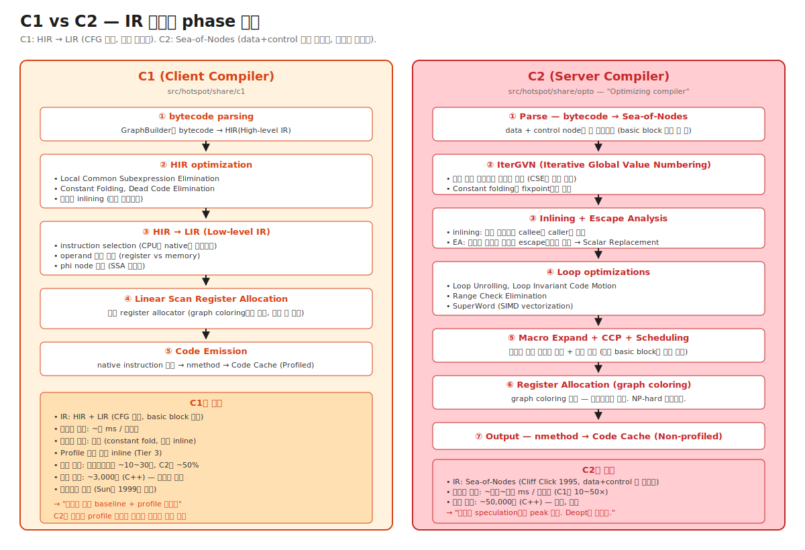

# 03-04. C1 and C2 — 두 컴파일러의 IR과 phase 순서

> HotSpot 안에는 컴파일러가 **두 개** 있다.
> - **C1 (Client Compiler)** — 빠른 컴파일. HIR/LIR. CFG 기반. 1999년 Sun이 작성. ~3,000줄 C++.
> - **C2 (Server Compiler)** — 공격적 최적화. Sea-of-Nodes. 1995년 Cliff Click 박사 논문 기반. ~50,000줄 C++.
> 두 컴파일러는 같은 bytecode를 받아 다른 IR로 변환하고 다른 최적화를 거쳐 다른 성능 특성의 native code를 만든다.
> 시니어가 알아야 할 것: 단순히 "C1은 빠르고 C2는 깊다"가 아니라, **각 IR이 어떤 최적화를 가능하게 하는지** + **C2의 phase 순서**가 운영 시 측정·진단의 기반이다.

---

## 🗺️ JVM 아키텍처 안에서 이 챕터의 위치

이 챕터는 [03-tiered-compilation](./03-tiered-compilation.md)의 **Tier 3 (C1)** 과 **Tier 4 (C2)** 컴파일러 내부를 풀어본다.



---

## 📍 학습 목표

1. **C1과 C2의 IR이 본질적으로 다른** 이유와 그 차이가 최적화에 어떻게 영향을 주는지 안다.
2. **HIR / LIR** 의 역할 — CFG 기반 IR의 일반적 형태.
3. **Sea-of-Nodes** 의 본질 — basic block을 명시하지 않고 노드의 의존성만 표현 → 최적화 패스가 노드를 자유롭게 배치.
4. **C2의 phase 7단계**: Parse → IterGVN → Inlining+EA → Loop opts → Macro Expand + CCP → Scheduling + RA → Output.
5. **IterGVN (Iterative Global Value Numbering)** — 같은 값을 계산하는 노드 통합 + constant folding fixpoint.
6. **C1의 Linear Scan vs C2의 Graph Coloring** — register allocator 알고리즘 차이.
7. 어느 메서드가 **C1에서 멈추고 C2에 안 가는지** — 너무 작은 메서드, deopt 반복 케이스.
8. **C1, C2 컴파일 시간 차이** 가 warmup에 미치는 영향.
9. `-XX:+PrintIdealGraphLevel`, JITWatch로 C2 IR을 시각화하는 방법.
10. 운영 시나리오: 특정 메서드만 컴파일 안 됨 / C2 컴파일 매우 느림 / C2 결과 코드가 비정상.

---

## 🎨 1단계: 백지 그리기 가이드

### Step 1: 좌우 분할

```
[C1 (좌)]                              [C2 (우)]
━━━━━━━━━━                              ━━━━━━━━━━

bytecode                               bytecode
   │                                     │
   ▼ Parse                                ▼ Parse
HIR (High-level IR)                    Sea-of-Nodes
   │                                     │
   ▼ Opt + lowering                      ▼ IterGVN → Inline+EA
LIR (Low-level IR)                     → Loop opts → Macro Expand
   │                                     → CCP → Scheduling → RA
   ▼ Linear Scan RA                       │
nmethod (Profiled segment)              ▼ Output
                                       nmethod (Non-profiled segment)
```

### Step 2: CFG vs Sea-of-Nodes 비교

```
[CFG 기반 IR (C1의 HIR, 일반 컴파일러)]
   - basic block 명시
   - 각 instruction이 어느 block 소속 명확
   - control flow와 data flow가 분리되어 있음
   - 최적화는 각 block 안에서 또는 block들 사이에서

[Sea-of-Nodes (C2)]
   - basic block 명시 안 함
   - control flow와 data flow가 한 그래프
   - 노드 사이는 dependency edge로만 연결
   - 노드의 실제 위치는 "Scheduling" phase에서 결정
   - 그래서 노드를 자유롭게 옮기는 최적화 가능
```

### 정답 그림

위의 [04-c1-and-c2.svg](./_excalidraw/04-c1-and-c2.svg) 참조.

---

## 🧠 2단계: 직관

### 핵심 비유

> **건축 설계 비유**:
> - **C1 (CFG 기반)** = 미리 정해진 도면 위에 자재를 배치. 1층은 1층 자재만, 2층은 2층 자재만. 옮길 수 있는 범위가 제한됨.
> - **C2 (Sea-of-Nodes)** = 자재들의 **의존 관계만** 정의 ("기둥은 바닥보다 먼저 설치"). 어느 층에 둘지는 **scheduling phase**에서 결정. 한 자재를 더 적합한 위치로 자유롭게 옮길 수 있어 공격적 최적화 가능.

### 정확한 정의 (비유와 분리)

| 용어 | 정의 |
|---|---|
| **C1 (Client Compiler)** | HotSpot의 첫 번째 JIT. HIR + LIR IR. CFG (Control Flow Graph) 기반. 빠른 컴파일이 목표. |
| **HIR (High-level Intermediate Representation)** | C1의 첫 IR. bytecode와 가깝지만 SSA 형태. basic block 명시. |
| **LIR (Low-level Intermediate Representation)** | C1의 두 번째 IR. HIR을 lowering — instruction selection 거의 끝남. CPU register와 가까움. |
| **C2 (Server Compiler)** | HotSpot의 두 번째 JIT. Sea-of-Nodes IR. 공격적 최적화. peak 성능 목표. |
| **Sea-of-Nodes** | C2의 IR. 모든 연산이 노드로 그래프에 흩뿌려져 있고, 노드 사이는 dependency edge로만 연결. basic block은 마지막 scheduling phase에서 결정. |
| **CFG (Control Flow Graph)** | 전통적 IR. basic block의 그래프. 각 instruction이 명시적으로 한 basic block에 속함. |
| **SSA (Static Single Assignment)** | 각 변수가 정확히 한 번만 할당되는 IR 형태. data flow 분석 용이. C1, C2 둘 다 사용. |
| **Phi node** | SSA에서 여러 분기로부터의 값을 합치는 가상 노드. `x = phi(x_then, x_else)`. |
| **IterGVN (Iterative Global Value Numbering)** | C2의 핵심 최적화. 같은 값을 계산하는 노드를 통합 + constant folding을 fixpoint까지 반복. |
| **CCP (Conditional Constant Propagation)** | 조건부 상수 전파. branch 결과에 따라 어느 변수가 상수인지 추론. |
| **Macro Expand** | C2의 phase. 고수준 노드(예: ArrayAllocation)를 더 낮은 수준(malloc + 초기화 등)으로 펼침. |
| **Scheduling** | C2의 phase. Sea-of-Nodes의 노드들을 basic block에 배치. data dependency를 만족하면서 최적 위치 선택. |
| **Register Allocation** | 가상 register를 CPU의 물리 register에 mapping. C1은 Linear Scan, C2는 Graph Coloring. |

### 왜 C2가 Sea-of-Nodes를 쓰는가 — 자유로운 노드 이동의 가치

```
[CFG 기반 IR의 한계]

basic block A:                basic block B:
  x = expensive_calc()         y = x + 1
  ...                          ...

→ x의 계산이 A에 묶임. 만약 B 안에서만 x가 쓰인다면:
  - x의 계산을 B로 옮기는 게 좋음 (A를 안 거치는 path는 x 계산 안 해도 됨).
  - CFG IR에서는 별도 "code motion" 패스가 필요하고 제약 많음.

[Sea-of-Nodes의 우위]

expensive_calc()와 (x + 1)이 노드로 존재. 사이엔 dependency edge.
basic block 소속이 미정.
  → scheduling phase에서 "B 안에서만 x가 쓰인다면 B에 두자"
  → 자연스럽게 code motion 발생
  → 다른 최적화(loop hoisting, dead code elimination)도 비슷하게 단순해짐
```

→ **Sea-of-Nodes는 "노드 위치를 마지막까지 미루는" 설계**. 이게 공격적 최적화의 기반.

### 왜 C1이 단순 IR을 쓰는가 — 빠른 컴파일의 가치

```
C1의 목표: 컴파일을 수 ms 안에 끝내기.
  - Sea-of-Nodes는 그래프 변환 패스가 많아 시간 큼.
  - CFG 기반은 단순 — 한 basic block 안에서만 분석.
  - C1은 작은 최적화만 (local CSE, constant fold).
  - 결과 코드는 C2 대비 ~50% 성능. 그러나 빠르게 만들어짐.
  
→ "충분히 빠른 baseline + profile 수집기" 역할.
```

---

## 🔬 3단계: 구조

### C1 phase 순서

```
1. GraphBuilder: bytecode → HIR
   - 각 bytecode를 HIR 노드로 변환
   - basic block 식별 (branch target 기준)
   - SSA 형태로 변환 (phi node 삽입)

2. HIR Optimization (간단)
   - Local CSE (Common Subexpression Elimination)
   - Constant Folding
   - Dead Code Elimination
   - 작은 메서드만 inlining (~35 bytes 이내)

3. LIR Generation: HIR → LIR
   - Instruction selection (HIR 노드를 LIR instruction으로)
   - Operand 결정 (register vs memory)
   - phi node를 실제 move로 변환

4. Linear Scan Register Allocation
   - virtual register들의 live interval 계산
   - intervals를 linear scan하며 physical register 할당
   - graph coloring보다 단순 + 빠름

5. Code Emission
   - LIR → native instruction
   - nmethod 생성, Code Cache (Profiled segment)에 저장
```

### C2 phase 순서 (운영 관점에서 외울 만한 단계)

```
1. Parse — bytecode → Sea-of-Nodes
   - 각 bytecode가 노드로
   - data dependency만 표현, basic block 미정
   - Type system 초기화 (각 노드의 type info)

2. IterGVN (Iterative Global Value Numbering)
   - 같은 값을 계산하는 노드 통합
   - Constant folding을 fixpoint까지 반복
   - Type propagation
   - 이 phase가 C2의 가장 자주 호출되는 최적화

3. Inlining + Escape Analysis
   - 호출 사이트의 callee를 caller에 펼침 (inlining)
   - 객체가 escape하는지 분석 → Scalar Replacement
   - (자세히: 05-inlining-and-ic, 06-escape-analysis)

4. Loop Optimizations
   - Loop Unrolling (loop body를 N번 복제)
   - Loop Invariant Code Motion (loop 밖으로 빼기)
   - Range Check Elimination (배열 경계 검사 제거)
   - SuperWord (SIMD vectorization)
   - (자세히: 07-loop-and-vector)

5. Macro Expand
   - 고수준 노드(ArrayAlloc, ConstantPoolNode 등)를 lower
   - 예: array allocation을 malloc + 초기화로 풀어 씀

6. CCP (Conditional Constant Propagation)
   - branch 결과 기반으로 상수성 추론
   - 예: if (x == 0) { ... } 안에서는 x = 0이라고 알 수 있음

7. Scheduling (Global Code Motion)
   - Sea-of-Nodes 노드들을 basic block에 배치
   - GCM (Global Code Motion) 알고리즘
   - 가능한 한 늦은 위치에 두기 (computation을 미루기)

8. Register Allocation (Graph Coloring)
   - virtual register들을 interference graph로
   - graph coloring으로 physical register 할당
   - NP-hard 문제 — 휴리스틱 사용

9. Output
   - native instruction 생성
   - nmethod, Code Cache (Non-profiled)에 저장
```

### IterGVN — C2의 핵심 최적화

```
초기 그래프:
  a = 3 + 4
  b = a * 2
  c = 3 + 4    ← a와 같은 값
  d = b + 1

IterGVN 1차:
  a = 3 + 4 → 7 (constant fold)
  b = 7 * 2 → 14
  c = 3 + 4 → 7 (constant fold)
  d = 14 + 1 → 15

IterGVN 2차 (GVN):
  c = 7 == a → c를 a로 통합 (value numbering)
  
최종:
  a = 7
  b = 14
  d = 15
  (c는 a로 통합되어 사라짐)
```

→ **iterative** 인 이유: 한 패스의 결과가 다른 최적화 기회를 만듦. fixpoint까지 반복.

### Scheduling — Sea-of-Nodes의 핵심 phase

```
[Sea-of-Nodes 상태]
expensive_calc 노드 (어느 basic block?)
  │
  ▼
x + 1 노드
  │
  ▼
return 노드

[Scheduling 결정]
- expensive_calc는 어느 path에서나 결과가 같음 → "가장 늦은" 위치
- x + 1은 expensive_calc 결과 필요 → expensive_calc 이후
- 보통: "if 조건 안의 path"가 단축되는 위치 선호 (lazy computation)

[Scheduling 후]
basic block A: 다른 코드
  └→ basic block B: expensive_calc; x + 1; return
  └→ basic block C: (계산 안 함, 다른 path)
```

→ "GCM (Global Code Motion)" 알고리즘. Cliff Click이 사용한 schedule_early / schedule_late 2-pass 방법.

### Register Allocation 알고리즘 차이

```
[C1: Linear Scan]
  - virtual register들의 live interval 계산
  - intervals를 시작 시점 순으로 linear scan
  - 각 시점에 free register pool에서 할당
  - 충돌 시 가장 멀리 쓰일 register를 spill
  - 시간 O(n log n)
  - 결과: 좋음, 최적은 아님

[C2: Graph Coloring]
  - virtual register들로 interference graph 구성
  - graph coloring (각 node를 색칠, 인접 node는 다른 색)
  - 색 = physical register
  - graph coloring은 NP-hard → 휴리스틱
  - 시간 O(n^2) ~ O(n^3)
  - 결과: 거의 최적
```

→ C2가 더 좋은 RA → register spill 줄임 → memory access 줄임 → 빠른 native code.

### 어느 메서드가 C1에서 멈추나

```
C1만 머무는 케이스:
1. 너무 작은 메서드 (~few bytes) — C2가 inline해버리므로 별도 컴파일 무의미
2. C2 컴파일 실패 (NULL pointer, type error 등)
3. `-XX:CompileCommand=dontinline` 등 옵션으로 명시 제외
4. C2 큐 적체 — 우선순위 낮으면 영원히 대기
5. Profile 불안정 — C2 컴파일 안전 못 보장
6. 매우 큰 메서드 — C2가 거부 (timeout 또는 메모리 limit)
```

진단:
- `-XX:+PrintCompilation` 로그에서 같은 메서드가 Tier 3 컴파일만 보이고 Tier 4 없음.
- JFR `jdk.Compilation` 이벤트의 `succeeded` 필드.

---

## 🧬 4단계: 내부 구현 — HotSpot

### C1 진입점

위치: `src/hotspot/share/c1/c1_Compiler.cpp`

```cpp
void Compiler::compile_method(ciEnv* env, ciMethod* method, int entry_bci) {
    // 1. HIR 빌드
    Compilation comp(this, env, method, entry_bci, ...);
    comp.compile_method();

    // 2. comp 내부에서:
    //    GraphBuilder → HIR optimization → LIR → Linear Scan RA → Code emit
}
```

### C2 진입점

위치: `src/hotspot/share/opto/compile.cpp`

```cpp
Compile::Compile(ciEnv* env, ciMethod* target, ...) {
    // Phase 순서가 명시됨
    
    // 1. Parse
    ParseGenerator parser(target);
    parser.parse();    // → Sea-of-Nodes
    
    // 2. IterGVN (여러 번 호출됨)
    PhaseIterGVN igvn(...);
    igvn.optimize();
    
    // 3. Inlining + Macros
    inline_incrementally();
    macro_eliminate();
    
    // 4. Escape Analysis
    PhaseMacroExpand mex(igvn);
    mex.expand_macro_nodes();
    
    // 5. Loop opts
    PhaseIdealLoop::optimize(igvn, ...);
    
    // 6. CCP
    PhaseCCP ccp(igvn);
    ccp.do_transform();
    
    // 7. Scheduling
    PhaseCFG cfg(...);
    cfg.do_global_code_motion();
    
    // 8. Register allocation
    PhaseChaitin allocator(...);
    allocator.Register_Allocate();
    
    // 9. Output
    output();
}
```

→ 각 `Phase*` 클래스가 한 phase. 일종의 pipeline.

### Sea-of-Nodes 노드 종류

위치: `src/hotspot/share/opto/node.hpp` 와 그 subclass들

```cpp
class Node : public ResourceObj {
    Node** _in;       // input edges (data dependency)
    Node** _out;      // output edges
    uint  _outcnt;
    
    // ... 다양한 type별 정보
};

// 주요 subclass:
class StartNode : public Node { };       // 메서드 entry
class RegionNode : public Node { };       // basic block boundary
class PhiNode : public Node { };          // SSA phi
class IfNode : public Node { };           // 분기
class ProjNode : public Node { };         // 결과 추출 (multi-output 노드용)
class CallNode : public Node { };         // 메서드 호출
class AddINode : public Node { };         // int 덧셈
class LoadNode : public Node { };         // memory load
class StoreNode : public Node { };        // memory store
class MemBarNode : public Node { };       // memory barrier
class SafePointNode : public Node { };    // safepoint 후보 지점
// ... 수백 종
```

### IterGVN 실제 구현

```cpp
void PhaseIterGVN::optimize() {
    while (true) {
        bool changed = false;
        for (Node* n : worklist) {
            // 각 노드에 대해 simplification 시도
            Node* simplified = n->Ideal(this, can_reshape);
            if (simplified != NULL) {
                replace_node(n, simplified);
                changed = true;
            }
            
            // value numbering: hash-table에서 같은 값 노드 찾기
            Node* identical = hash_find_equivalent(n);
            if (identical != NULL && identical != n) {
                replace_node(n, identical);
                changed = true;
            }
        }
        if (!changed) break;   // fixpoint 도달
    }
}
```

### Linear Scan RA (C1)

위치: `src/hotspot/share/c1/c1_LinearScan.cpp`

```cpp
void LinearScan::do_linear_scan() {
    compute_local_live_sets();
    compute_global_live_sets();
    build_intervals();          // live interval 계산
    sort_intervals_before_alloc();
    allocate_registers();        // 실제 할당
    resolve_data_flow();
    
    assign_reg_num();
    eliminate_spill_moves();
}
```

### Graph Coloring RA (C2)

위치: `src/hotspot/share/opto/chaitin.cpp`

Chaitin's algorithm 기반 (1982 IBM 논문):
1. Interference graph 구성 (각 virtual reg가 node, 동시 live인 reg pair가 edge).
2. Simplification (degree < k 인 node 제거, stack에 push).
3. Spill (degree ≥ k 인 node를 spill 후보로).
4. Selection (stack pop하며 색칠).
5. Coalescing (move instruction 제거).

---

## 📜 5단계: 역사

| 연도 | 변화 | 의의 |
|---|---|---|
| 1995 | Cliff Click 박사 논문 "Combining Analyses, Combining Optimizations" | Sea-of-Nodes 제안 |
| 1999 | HotSpot 1.0 + C1 | 빠른 client용 JIT |
| 2000 | HotSpot 1.3 + C2 (Server) | Sea-of-Nodes를 production에 |
| 2007 | JDK 6u20 Tiered 실험 | C1+C2 결합 |
| 2014 | JDK 8 Tiered 기본 on | "-server"/"-client" 사실상 종말 |
| 2018 | JDK 11 Graal 옵션 | C2의 Java 버전 (대안) |
| 2020 | JDK 14+ C2 phase 정교화 | maintenance |
| 2023 | JDK 21 Vector API stable | C2의 SuperWord 보완 |

### Cliff Click과 Sea-of-Nodes

박사 논문 (1995, Rice University):
- 전통적 IR은 control flow와 data flow를 분리 → 최적화 패스가 각각 별도 + 조합 어려움.
- "두 flow를 한 그래프에 통합 + 최적화를 노드 그래프 변환으로 일관화" 아이디어.
- 1999 Sun에 합류해 HotSpot C2에 적용.
- 이후 Azul Systems의 Zing JVM에도 적용 (자신이 직접 작성).

### Graal — C2의 Java 버전

JDK 9+:
- C2의 50,000줄 C++ 코드 유지보수 어려움.
- Oracle Labs가 Java로 동등 또는 더 강력한 컴파일러 작성 → Graal.
- Truffle (interpreter framework) + Native Image (AOT) 와 함께 GraalVM.
- 일부 워크로드에서 C2보다 빠름 (Partial Escape Analysis 등).
- 현재: 옵션 (`-XX:+UseJVMCICompiler`). Production 사용 늘어나는 추세.

상세는 Chapter 08-graalvm.

---

## ⚖️ 6단계: 트레이드오프

### C1 vs C2 컴파일 시간

| | C1 | C2 |
|---|---|---|
| 메서드당 컴파일 시간 | ~수 ms | ~수십~수백 ms |
| 컴파일 thread CPU | 짧음 | 김 |
| Warmup 영향 | 작음 | 큼 |
| Peak 성능 | ~인터프리터 × 10~30 | ~인터프리터 × 50~100 |
| Code size (compiled) | 작음 | 큼 (inlining 등) |

### 메모리 사용

| | C1 | C2 |
|---|---|---|
| 컴파일러 자체 코드 | ~수 MB | ~수십 MB |
| 컴파일 중 메모리 (per task) | ~수 MB | ~수십~수백 MB |
| nmethod 평균 크기 | ~수 KB | ~수십 KB (inlining 등) |

→ C2의 한 컴파일 task가 수백 MB까지 쓸 수 있음 (큰 메서드 + 깊은 inlining). 컨테이너 메모리 제한적이면 부담.

### Linear Scan vs Graph Coloring RA

| | Linear Scan (C1) | Graph Coloring (C2) |
|---|---|---|
| 시간 복잡도 | O(n log n) | O(n²~n³) |
| 결과 품질 | 약간 부족 | 거의 최적 |
| 구현 복잡도 | 보통 | 복잡 |
| Spill 발생 빈도 | 더 자주 | 적음 |
| 적합 워크로드 | warmup 빠르게 | peak 성능 |

---

## 📊 7단계: 측정·진단

### `-XX:+PrintCompilation` 의 Tier 정보 (재방문)

```
142    3 %   4       MyApp::process @ 12 (123 bytes)   ← Tier 4, OSR
150    4       4     MyApp::process (123 bytes)        ← Tier 4 일반
```

Tier 3은 C1, Tier 4는 C2.

### `-XX:+PrintIdealGraphLevel`

C2의 IR 그래프 dump (advanced, 디버깅용):
```bash
java -XX:+UnlockDiagnosticVMOptions \
     -XX:+PrintIdealGraphLevel=4 \
     -XX:PrintIdealGraphFile=/tmp/ig.xml \
     -jar app.jar
```

XML 결과를 **IdealGraphVisualizer** (Oracle Labs 도구)로 열어 시각화.

### JITWatch

[JITWatch](https://github.com/AdoptOpenJDK/jitwatch) — log를 분석해 시각화:
1. JVM 옵션: `-XX:+UnlockDiagnosticVMOptions -XX:+TraceClassLoading -XX:+LogCompilation`
2. `hotspot_pid<n>.log` 파일 생성.
3. JITWatch에서 열기.
4. 메서드별 컴파일 결과, inlining tree, deopt 위치 확인.

### `-XX:+PrintAssembly` — C2 결과 native code 확인

```bash
# hsdis-amd64.so 플러그인 필요
java -XX:+UnlockDiagnosticVMOptions -XX:+PrintAssembly \
     -XX:CompileCommand=print,MyApp::hotMethod \
     -jar app.jar
```

→ 특정 메서드의 native assembly 출력. C2 최적화 결과를 직접 확인.

### 운영 시나리오 진단 매트릭스

| 증상 | 진단 | 가능 원인 |
|---|---|---|
| 특정 메서드가 영원히 Tier 3 | PrintCompilation 의 Tier 4 부재 | 너무 큼, deopt 반복, C2 실패 |
| C2 컴파일 시간 매우 김 | JFR `jdk.Compilation` duration | 거대 메서드 + 깊은 inlining |
| C2 nmethod가 비정상 (deopt) | JFR `jdk.Deoptimization` reason | speculation 깨짐 |
| async-profiler에서 비정상 | JITWatch로 cross-check | C2 최적화로 inline된 코드 |
| C2 메모리 폭증 | jcmd VM.native_memory의 Compiler 영역 | 큰 compile task |

### 시나리오 1: 특정 메서드만 영원히 Tier 3

```
환경: Spring 거대 컨트롤러 메서드
증상: 그 메서드가 PrintCompilation 로그에 Tier 3만 보임. Tier 4 없음.

진단:
1. 메서드 크기 확인 — javap -v 의 Code attribute size
   (15KB 이상이면 C2가 거부할 가능성)
2. -XX:+PrintInlining 으로 inlining 시도 확인
   "too big" 메시지 다수
3. JFR jdk.Compilation 이벤트의 success 확인
   C2 시도했다가 timeout 또는 실패?

원인: 큰 메서드 + 깊은 호출 그래프 → C2가 inlining 후 IR 노드 수 한계 초과

조치:
- 메서드 분할 (refactor)
- -XX:MaxInlineLevel, -XX:MaxInlineSize 튜닝 (조심)
- -XX:CompileCommand=inline,MyClass::method 로 강제 inlining
```

### 시나리오 2: C2 컴파일 시간이 매우 김

```
환경: JDK 21, 일반 Spring Boot
증상: -XX:+PrintCompilation 로그에서 일부 메서드의 시간이 500ms+

진단:
$ jcmd <pid> JFR.start name=jit duration=300s settings=profile
$ jfr print --events jdk.Compilation jit.jfr | sort -k 4 -n -r | head

원인:
- 거대한 hot method (inlining 깊이 큼)
- C2의 phase 중 IterGVN이 fixpoint 도달 못 함 (극단적 케이스)

조치:
- 코드 audit (큰 메서드 분할)
- -XX:CompileCommand=exclude 로 그 메서드 컴파일 제외 (인터프리터 유지)
- 또는 -XX:TieredStopAtLevel=3 으로 C1까지만
```

---

## ⚔️ 8단계: 꼬리질문 트리

### Q1. C1과 C2의 IR은 어떻게 다르고 그 차이가 왜 중요한가요?

**예상 답변**:
> - C1: HIR + LIR. CFG 기반. basic block 명시. 각 instruction이 한 block에 속함. SSA 형태.
> - C2: Sea-of-Nodes. basic block 미명시. 노드 간 dependency edge만. 노드 위치는 scheduling phase에서 결정.
> 
> 차이의 의미:
> - CFG는 단순 — 최적화 패스가 block 단위로 보면 됨. 빠르지만 cross-block 최적화 제약.
> - Sea-of-Nodes는 복잡 — 그러나 노드를 자유롭게 옮기는 최적화 가능 (code motion, GVN, dead code 제거 등이 자연스러움).
> 
> 결과: C1은 ~수 ms 컴파일, C2는 ~수십~수백 ms — 공격적 최적화의 비용.

### Q2. C2의 phase 순서를 알려주세요.

**예상 답변**:
> 7단계 (운영자 관점):
> 1. Parse — bytecode → Sea-of-Nodes.
> 2. IterGVN — 같은 값 통합 + constant folding fixpoint.
> 3. Inlining + Escape Analysis.
> 4. Loop opts — Unrolling, RCE, LICM, SuperWord.
> 5. Macro Expand + CCP — 고수준 노드 풀어 씀, 조건부 상수 전파.
> 6. Scheduling (GCM) + Register Allocation (Graph Coloring).
> 7. Output — native instruction, nmethod.

#### 🪝 Q2-1: IterGVN이 "iterative"인 이유는?

> 한 패스의 결과가 다른 최적화 기회를 만들 수 있음.
> 예: constant folding으로 `if (3 == 3)` 의 조건이 항상 true가 되면, else branch가 dead code → 제거 → 그 안의 다른 계산도 dead → 추가 제거 가능.
> 이런 cascade를 잡기 위해 fixpoint (변화 없음)까지 반복.

### Q3. C1과 C2의 register allocator가 다른 이유는?

**예상 답변**:
> - C1: Linear Scan — O(n log n), 빠름, 결과 약간 부족 (spill 더 자주).
> - C2: Graph Coloring (Chaitin) — O(n²~n³), 느림, 거의 최적.
> 
> C1은 컴파일 시간 우선 (Tier 3, ~수 ms). C2는 결과 품질 우선 (Tier 4, peak 성능).
> Trade-off: C1 nmethod는 spill이 더 많아 memory access 빈번 → 약간 느림. C2는 spill 적어 register에서 거의 다 처리.

### Q4. Sea-of-Nodes는 어떤 노드들로 구성되나요?

**예상 답변**:
> 주요 노드 종류 (수백 개 중 핵심):
> - **StartNode**: 메서드 entry.
> - **RegionNode**: control flow merge point (basic block boundary).
> - **PhiNode**: SSA phi (여러 분기 값 합치기).
> - **IfNode**: 분기 — 두 ProjNode (true/false)로 결과.
> - **CallNode**: 메서드 호출.
> - **AddINode / SubINode / ...**: 산술.
> - **LoadNode / StoreNode**: memory 접근.
> - **MemBarNode**: memory barrier (volatile 등).
> - **SafePointNode**: safepoint 후보 지점.
> 
> 모든 노드는 input edges (data dependency) + output edges. 기본 클래스 `Node`.

### Q5. 어떤 메서드가 C2에 안 가고 C1에서 멈추나요?

**예상 답변**:
> 1. 너무 작은 메서드 — C2 inline 대상이 됨.
> 2. 너무 큰 메서드 — C2의 IR 노드 한계 초과로 거부.
> 3. 컴파일 실패 (NULL ptr, type error 등).
> 4. `-XX:CompileCommand=exclude/dontcompile` 등 명시 제외.
> 5. 반복 deopt — C2가 안정 못 보장.
> 6. C2 큐 적체 + 우선순위 낮음.
> 
> 진단: `-XX:+PrintCompilation` 의 같은 메서드에 Tier 4 부재.

### Q6. (Killer) Spring Boot의 큰 컨트롤러 메서드 한 개가 C2 컴파일에 1초가 걸려 warmup이 길어집니다. 어떻게 진단하시겠어요?

**예상 답변**:
> 단계적:
> 
> 1. **메서드 식별**:
>    ```
>    -XX:+PrintCompilation 로그에서 시간 ↑ 메서드
>    ```
> 
> 2. **메서드 분석**:
>    - 크기 (`javap -v Class.class` 의 Code length).
>    - 호출 사이트 수 (큰 메서드 = 큰 그래프).
>    - 컨트롤러라면 보통 여러 service 호출 — inlining 후 그래프 폭발.
> 
> 3. **inlining 깊이 확인**:
>    ```
>    -XX:+UnlockDiagnosticVMOptions -XX:+PrintInlining
>    ```
>    그 메서드에서 호출되는 모든 메서드의 inline 결정.
> 
> 4. **조치**:
>    - **단기**: `-XX:MaxInlineLevel=8` (기본 9) — inline 깊이 제한.
>    - **장기**: 메서드 분할 (controller → service → repository로 자연 분리).
>    - **최후**: `-XX:CompileCommand=exclude` 로 그 메서드 컴파일 제외. 단, 인터프리터로 영원히 → trade-off.
> 
> 5. **profile 시각화**:
>    - JITWatch로 그 메서드의 inlining tree 시각화.
>    - 거대한 tree면 분할.

---

## 🔗 다음 단계

- → [05. Inlining and IC](./05-inlining-and-ic.md): C2의 가장 강력한 최적화 — Inlining + Inline Cache
- → [06. Escape Analysis](./06-escape-analysis.md): Scalar Replacement
- → [07. Loop and Vector](./07-loop-and-vector.md): Loop opts, SIMD
- ← [03. Tiered Compilation](./03-tiered-compilation.md): 어느 메서드가 어디 가는지
- → [Chapter 07. HotSpot Internals](../07-hotspot-internals/): C2 phase의 풀버전 코드 투어

## 📚 참고

- **Cliff Click — "Combining Analyses, Combining Optimizations" (1995)**: 박사 논문
- **HotSpot src `c1_Compiler.cpp`**: https://github.com/openjdk/jdk/blob/master/src/hotspot/share/c1/c1_Compiler.cpp
- **HotSpot src `compile.cpp` (C2)**: https://github.com/openjdk/jdk/blob/master/src/hotspot/share/opto/compile.cpp
- **HotSpot src `node.hpp` (Sea-of-Nodes)**: https://github.com/openjdk/jdk/blob/master/src/hotspot/share/opto/node.hpp
- **HotSpot src `chaitin.cpp` (Graph Coloring RA)**: https://github.com/openjdk/jdk/blob/master/src/hotspot/share/opto/chaitin.cpp
- **JITWatch**: https://github.com/AdoptOpenJDK/jitwatch
- **IdealGraphVisualizer**: Oracle Labs 도구
- **Aleksey Shipilëv — Compilation Internals**: https://shipilev.net/jvm/anatomy-quarks/
