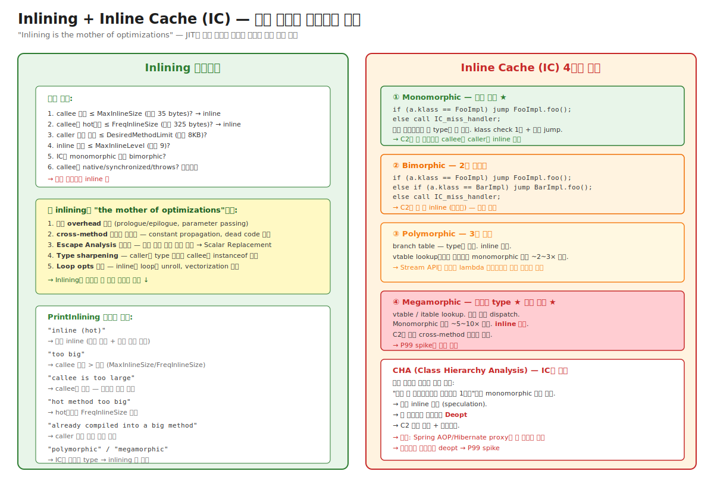

# 03-05. Inlining + Inline Cache — JIT의 가장 강력한 최적화

> "**Inlining is the mother of optimizations**" — 이 말은 JIT 분야의 격언이다.
> 한 함수 호출을 caller에 직접 펼치는 단순한 변환이 **다른 모든 최적화의 효과를 폭발적으로 늘린다**. Constant propagation, dead code elimination, escape analysis, loop optimization — 모두 inline된 코드에 더 잘 적용된다.
> Inlining의 성공은 **Inline Cache (IC)의 상태**에 직접 의존한다. IC가 monomorphic이면 C2가 자유롭게 inline. Megamorphic이면 inline 불가 + 모든 cross-method 최적화 차단.
> 시니어가 알아야 할 것: P99 latency spike의 단골 원인이 **megamorphic call site**다. 단순히 인터페이스 사용 늘렸을 뿐인데 갑자기 느려졌다면 IC가 발견하면 답이 보인다.

---

## 🗺️ JVM 아키텍처 안에서 이 챕터의 위치

이 챕터는 [04-c1-and-c2](./04-c1-and-c2.md)의 **C2 phase ③ Inlining + Escape Analysis** 중 inlining 부분 풀버전 + 모든 메서드 호출의 dispatch 메커니즘.



---

## 📍 학습 목표

1. **Inlining이 왜 "the mother of optimizations"** 인지 — 5가지 cascade 효과 (호출 overhead 제거, cross-method opt, EA 활성화, type sharpening, loop opt 확장).
2. **Inlining 휴리스틱 6단계** — MaxInlineSize, FreqInlineSize, DesiredMethodLimit, MaxInlineLevel, IC 상태, callee 종류.
3. **`-XX:+PrintInlining`** 의 메시지 해석 — "inline (hot)", "too big", "polymorphic" 등.
4. **Inline Cache (IC) 4단계** — monomorphic / bimorphic / polymorphic / megamorphic.
5. **CHA (Class Hierarchy Analysis)** — 현재 로드된 클래스 계층을 보고 monomorphic으로 간주 → speculation 기반 inline.
6. **Megamorphic call site** 가 production에서 발생하는 패턴 (Stream API, Strategy 패턴, framework reflection).
7. **CHA 위반 → Deopt** 의 연결고리 — P99 spike의 본질.
8. **메서드 분할 vs MaxInlineSize 튜닝** 의 트레이드오프.
9. JITWatch로 inlining tree 시각화하는 방법.
10. 운영 시나리오: 인터페이스 도입 후 P99 ↑ / Stream API 코드의 cold path 느림 / hot reload 후 deopt 폭주.

---

## 🎨 1단계: 백지 그리기 가이드

### Step 1: Inlining 전후 비교

```
[Inlining 전]
foo() {
   bar();    // 호출 — prologue + epilogue + parameter passing 비용
   ...
}
bar() {
   x = 1;
   return x + 2;
}

[Inlining 후]
foo() {
   // bar()의 본문이 여기에 펼쳐짐
   x = 1;
   tmp = x + 2;
   ...
}

→ 추가로 constant fold:
foo() {
   tmp = 3;  // x=1이라 알려져 (cross-method 최적화)
   ...
}
```

### Step 2: IC 4단계 비교 그림

```
Monomorphic       Bimorphic         Polymorphic      Megamorphic
━━━━━━━━━━━━      ━━━━━━━━━━        ━━━━━━━━━━━      ━━━━━━━━━━━

[FooImpl만]       [Foo + Bar]       [Foo+Bar+Baz]    [다양한 type]
1번 check         2번 check          branch table     vtable lookup
가장 빠름         빠름                중간            느림
inline 가능       조건부 inline      inline 불가      inline 불가
```

### Step 3: CHA + Deopt 흐름

```
[현재 로드된 클래스]
 - FooImpl 만 있음 (Foo 인터페이스의 유일 구현)
   ↓
[C2] CHA 보고 "monomorphic" 판단
   ↓
[C2] 강제 inline (speculation)
   ↓
[새 클래스 로드: BarImpl implements Foo]
   ↓
[CHA 위반 감지]
   ↓
[해당 nmethod에 not_entrant 표시]
   ↓
[Deopt] → 인터프리터 복귀 + 재컴파일
```

### 정답 그림

위의 [05-inlining-and-ic.svg](./_excalidraw/05-inlining-and-ic.svg) 참조.

---

## 🧠 2단계: 직관

### 핵심 비유

> **요리 비유 (확장)**:
> - **Inlining** = 레시피의 "부재료 양념 준비"를 별도 단계로 두지 않고 main 레시피에 직접 풀어 쓰기. 단계 전환 비용 없음 + 그 양념에 다른 조정 가능 (예: 메인 재료 보고 양념 더 줄이기).
> - **IC Monomorphic** = 그 양념이 항상 같은 종류 → 미리 준비된 그릇.
> - **IC Megamorphic** = 양념이 매번 달라 매번 양념통(vtable) 뒤져야 함.
> - **CHA** = "현재 가게에 양념 1종류뿐"이라고 가정해 간단히 만든 매뉴얼. 새 양념 입고 시 매뉴얼 다시 만듦 (deopt).

### 정확한 정의 (비유와 분리)

| 용어 | 정의 |
|---|---|
| **Inlining** | callee 메서드의 본문을 caller의 호출 사이트에 펼쳐 넣는 컴파일 시 변환. |
| **MaxInlineSize** | 항상 inline하는 callee 크기 한계 (bytecode bytes). 기본 35. |
| **FreqInlineSize** | hot callee의 inline 크기 한계. 기본 325. |
| **DesiredMethodLimit** | caller의 누적 크기 한계 (inline 후). 기본 8KB bytecode. |
| **MaxInlineLevel** | inline 깊이 한계 (A → B → C → D ...). 기본 9. |
| **Inline Cache (IC)** | 호출 사이트에 캐시된 dispatch 정보. 컴파일된 코드의 invokevirtual/invokeinterface 위치에 patch된 instruction. |
| **Monomorphic** | IC가 한 type만 본 상태. 가장 빠른 dispatch + inline 가능. |
| **Bimorphic** | 2개 type. 조건부 inline 가능. |
| **Polymorphic** | 3개 정도 type. branch table. inline 불가. |
| **Megamorphic** | 많은 type. vtable/itable lookup. 가장 느림. |
| **CHA (Class Hierarchy Analysis)** | 현재 로드된 클래스 계층을 분석해 "이 인터페이스/abstract 메서드의 구현이 N개"인지 파악. C2의 speculation 기반 inline 결정에 사용. |
| **Speculation-based inlining** | CHA 결과를 가정으로 inline. 가정 깨지면 (새 구현체 로드) deopt. |
| **Type Sharpening** | inline된 callee 안에서 receiver의 정확한 type을 알아내 instanceof/cast를 제거. |
| **Inline tree** | 한 메서드의 컴파일 결과에 inline된 모든 callee의 트리. JITWatch로 시각화. |

### 왜 Inlining이 "the mother of optimizations" 인가

```
Inlining 단순 효과:
  - 호출 overhead 제거 (prologue ~5 ns, parameter ~수 ns)
  ✓ 그러나 이 자체는 작은 이득

Inlining의 진짜 가치 — Cascade 효과:

1. Cross-method 최적화 활성화
   inline 전:
     foo() { x = bar(3); }   // bar()의 본문 모름
     bar(int n) { return n + 1; }
   inline 후:
     foo() { x = 3 + 1; }    // C2가 즉시 constant fold → x = 4

2. Escape Analysis 활성화
   inline 전:
     foo() { Point p = makePoint(); use(p); }   // p가 makePoint 안에서 escape?
   inline 후:
     foo() {
         p = new Point();  // 이 메서드 안에서만 사용
         use(p);
     }
     → EA가 "p는 escape 안 함" 결론
     → Scalar Replacement: new Point 안 만들고 fields를 register로

3. Type Sharpening
   inline 전:
     foo(Object o) { o.toString(); }   // o의 정확한 type 모름
   inline 후:
     foo(String s) { s.toString(); }   // s가 항상 String이라면
     → String.toString의 native code 직접 호출 (vtable 안 거침)

4. Dead Code Elimination
   inline 전:
     foo() { if (debug()) log("..."); }
   inline 후 (debug()가 inline되어 false 반환):
     foo() { if (false) log("..."); }   → if/log 전체 제거

5. Loop opts 확장
   inline 전: loop 안에서 호출 → loop unrolling 효과 제한
   inline 후: loop 안에서 직접 코드 → unrolling, vectorization 풍부

→ Inlining 1번이 위 5가지 효과를 폭발적으로 키움
→ "Inlining이 막히면 다른 최적화 다 죽는다"
```

### 왜 megamorphic이 단순한 polymorphism보다 훨씬 느린가

```
Monomorphic dispatch:
  cmp [a.klass], FooImpl   # 1 cmp
  jne miss_handler         # 1 branch (predicted not-taken)
  jmp FooImpl.foo          # 1 jmp (direct)
                           = ~3 cycles
                           + inline 가능 → 추가 0 cycles

Megamorphic dispatch (vtable):
  load [a.klass]           # 1 load (cache miss 가능)
  load [klass + foo_offset]  # 1 load
  jmp [function_ptr]       # 1 indirect jump (predictor 못 맞춤)
                           = ~10~20 cycles (cache miss 시 더)
                           + inline 불가 → 다른 최적화 효과 0
                           
실측: Stream API 같은 lambda heavy 코드에서 ~5~10× 차이
```

→ **단순한 latency 차이만이 아니라 cascade 효과 손실**이 megamorphic의 진짜 비용.

### 왜 CHA가 위험한 동시에 강력한가

```
CHA 없이:
  C2는 "이 인터페이스가 monomorphic"이라고 확신 못 함 → inline 못 함
  → Stream API 같은 인터페이스 heavy 코드 → 항상 vtable lookup

CHA 사용 시:
  C2가 "현재 로드된 클래스로 monomorphic"이라고 보고 inline
  → 인터페이스 메서드도 직접 호출 + 다른 최적화
  → 5~10× 빠름

위험:
  새 구현체 로드 (lazy class loading, hot reload) → CHA 가정 깨짐
  → Deopt → 컴파일된 nmethod 폐기 → 인터프리터 복귀
  → 일시적 P99 spike
```

→ **CHA는 speculation의 일종**. Speculation 정확하면 큰 이득, 깨지면 deopt 비용. Production에서 CHA 깨지는 패턴을 알아야 함.

---

## 🔬 3단계: 구조

### Inlining 결정 흐름

```
호출 사이트 A에서 method B를 호출
        │
        ▼
1. B가 unsafe? (native, synchronized 중 일부 case)
   → no inline
        │
        ▼
2. B의 IC 상태 확인
   - monomorphic: 한 target만 → 후보 1개
   - bimorphic: 두 target → 후보 2개 (양쪽 inline 시도)
   - polymorphic+: inline 불가
        │
        ▼
3. B 크기 확인
   - size ≤ MaxInlineSize (35 bytes) → 무조건 inline
   - size ≤ FreqInlineSize (325 bytes) + hot → inline
   - else: too big
        │
        ▼
4. caller A의 누적 크기 확인
   - inline 후 size ≤ DesiredMethodLimit (8KB) → OK
   - 초과: caller too big
        │
        ▼
5. inline 깊이 확인
   - level ≤ MaxInlineLevel (9) → OK
   - 초과: too deep
        │
        ▼
6. 다른 휴리스틱 (caller가 OSR이면 더 보수적 등)
        │
        ▼
모두 통과 → inline 실행
   - B의 IR 노드들을 A의 그래프에 통합
   - 추가 최적화 패스 실행
```

### Inline Cache의 변천 — 동적 진화

```
[메서드 첫 호출 시점]
컴파일된 nmethod의 invokevirtual 위치:
  call IC_uninitialized_handler   # 첫 호출 시 type 정보 없음
        │
        ▼ 첫 호출에서 receiver = FooImpl 발견
        │
[Monomorphic 상태]
  cmp [a.klass], FooImpl
  jne IC_megamorphic_handler      # 다른 type 시 handler
  jmp FooImpl.foo                  # 직접 점프
        │
        ▼ 다른 type BarImpl 등장
        │
[Bimorphic 또는 Polymorphic 상태]
  cmp [a.klass], FooImpl
  je  FooImpl.foo
  cmp [a.klass], BarImpl
  je  BarImpl.foo
  call IC_megamorphic_handler
        │
        ▼ 더 많은 type 등장 (3+)
        │
[Megamorphic 상태]
  call vtable_dispatch_helper
  # vtable 또는 itable lookup
```

### Stream API의 IC 함정

```java
// 코드 예시
list.stream()
    .map(x -> x.getName())
    .filter(name -> name.startsWith("A"))
    .collect(Collectors.toList());
```

내부:
- `map(Function)` — Function 인터페이스 호출.
- `filter(Predicate)` — Predicate 호출.
- 호출 사이트는 `Function.apply()`, `Predicate.test()`.

여러 Stream pipeline에서 같은 호출 사이트를 사용 → 다양한 lambda type이 흘러감 → 그 호출 사이트의 IC가 megamorphic.

```
List<User> users = ...;
List<Order> orders = ...;
List<Product> products = ...;

// 같은 stream API의 map() 호출 사이트지만
// User → String, Order → String, Product → String의 다른 Function들
users.stream().map(User::getName).collect(...);
orders.stream().map(Order::getId).collect(...);
products.stream().map(Product::getCode).collect(...);

// → Function.apply() 호출 사이트의 IC: User function, Order function, Product function
// → 3개 이상 → megamorphic
```

운영 의미: **같은 stream API method를 여러 lambda type으로 호출하면 그 사이트가 megamorphic**. lambda heavy 코드의 hidden cost.

### Strategy 패턴의 IC

```java
interface PaymentProcessor {
    void process(Payment p);
}

class CreditCardProcessor implements PaymentProcessor { ... }
class PaypalProcessor implements PaymentProcessor { ... }
class StripeProcessor implements PaymentProcessor { ... }

// 호출 사이트
PaymentProcessor processor = selectProcessor(payment);
processor.process(payment);   // ← 이 호출 사이트의 IC
```

- 구현체가 3+ → IC megamorphic → C2 inline 불가.
- 새 ProcessorClass 추가 시 CHA 위반 → deopt 가능.

해결:
- `sealed interface PaymentProcessor permits CreditCard, Paypal, Stripe` — 구현체 fix.
- 또는 switch 분기로 명시 (JIT가 인지하기 쉬움).

### CHA + Deopt 연결고리

```
[현재 상태]
 - interface Foo의 구현체: FooImpl 만 로드됨

[C2 컴파일 시]
 - call site: foo.method() (foo는 Foo type)
 - CHA: "현재 Foo 구현체 1개" → monomorphic 으로 간주
 - 강제 inline: FooImpl.method 본문 펼침
 - 추가 최적화: constant fold, dead code 등

[새 구현체 로드 시점]
 - BarImpl implements Foo 가 ClassLoader.defineClass로 로드됨
 - JVM의 CHA가 변화 감지

[Deopt 트리거]
 - 영향받는 모든 nmethod (CHA로 inline한 코드들) → not_entrant
 - 이미 실행 중인 스레드: 다음 safepoint에서 frame 변환
 - 일시적으로 인터프리터로 회귀

[재컴파일]
 - 시간 지나 profile 재수집 (이제 bimorphic 또는 megamorphic 가능)
 - 새 nmethod (덜 공격적인 inline)
```

운영 의미:
- **Spring AOP, Hibernate proxy, dynamic class generation**이 새 클래스 추가하는 순간 deopt.
- 시작 후 dynamic class 폭주 시기에 P99 spike.
- 안정 후엔 모든 가능한 type이 IC에 등록되어 더 이상 deopt 없음.

### Type Profile과 inlining 결정

```
호출 사이트 A의 IC를 컴파일 시 확인:
  - profile (MDO)에 receiver type 히스토그램 있음
  - 예: [FooImpl: 9800회, BarImpl: 200회]
  
C2 결정:
  - 만약 100% monomorphic (FooImpl만) → 무조건 inline
  - 98% FooImpl + 2% BarImpl → "FooImpl로 가정 + uncommon trap"으로 inline
    → 2% BarImpl 케이스에서 deopt 트리거 (느려짐)
    → 그러나 98% 빠름이 더 큰 이득
  - 50/50 → bimorphic, 양쪽 inline 시도
  - 다양 → polymorphic 또는 megamorphic
```

이게 **type profile guided inlining** 의 핵심.

---

## 🧬 4단계: 내부 구현 — HotSpot

### Inlining 결정 코드 (C2)

위치: `src/hotspot/share/opto/bytecodeInfo.cpp` (`InlineTree`)

```cpp
class InlineTree : public ResourceObj {
public:
    InlineDecision try_to_inline(ciMethod* callee_method, ...) {
        // 1. 너무 큰가?
        if (callee_method->code_size() > MaxInlineSize &&
            !is_hot(callee_method)) {
            return InlineDecision(NOT_INLINED, "too big");
        }
        
        // 2. caller 누적 크기
        if (caller_size + callee_size > DesiredMethodLimit) {
            return InlineDecision(NOT_INLINED, "caller too big");
        }
        
        // 3. inline depth
        if (inline_depth > MaxInlineLevel) {
            return InlineDecision(NOT_INLINED, "too deep");
        }
        
        // 4. IC 상태
        if (call_profile->morphism() > 2) {
            return InlineDecision(NOT_INLINED, "megamorphic");
        }
        
        // ... 다른 체크들
        
        return InlineDecision(INLINED, "hot");
    }
};
```

### CHA 구현

위치: `src/hotspot/share/code/dependencies.cpp` + `src/hotspot/share/classfile/dependencyContext.cpp`

```cpp
// CHA에 의존하는 컴파일 결정 기록
class Dependencies {
public:
    void assert_leaf_type(ciKlass* k);
    void assert_abstract_with_unique_concrete_subtype(ciKlass* abstract, 
                                                       ciKlass* concrete);
    void assert_unique_concrete_method(ciMethod* abstract_method, 
                                        ciMethod* concrete_method);
};

// 새 클래스 로드 시 dependency 검사
void DependencyContext::invalidate_dependent_nmethods(...) {
    for (each nmethod with dependencies on this class hierarchy) {
        nmethod->mark_for_deoptimization();
    }
}
```

### IC patch 메커니즘

위치: `src/hotspot/share/code/compiledIC.cpp`

```cpp
void CompiledIC::set_to_monomorphic(CompiledICInfo& info) {
    // 1. IC slot의 instruction을 patch
    
    // klass check 부분
    NativeMovConstReg* mov = nativeMov_at(_call->instruction_address());
    mov->set_data((intptr_t) info.klass());
    
    // jump target 부분
    NativeJump* jmp = nativeJump_at(_call->instruction_address() + offset);
    jmp->set_jump_destination(info.entry());
    
    // ★ atomic word write — 동시 실행 안전
}

void CompiledIC::set_to_megamorphic() {
    // monomorphic check 코드를 vtable dispatch로 변경
    patch_with_vtable_stub();
}
```

### IC가 monomorphic → megamorphic 전이

호출 사이트의 IC가 miss (예상 type과 다른 type 발견):
1. IC miss handler 호출.
2. Handler가 현재 IC 상태 확인.
3. Monomorphic이면 → bimorphic 시도. 그러나 대부분 구현에서 직접 megamorphic으로 전이.
4. Megamorphic 시: vtable/itable dispatch stub으로 patch.

→ **한 번 megamorphic이 되면 나중에 monomorphic 패턴이 와도 자동 회복 안 됨**. nmethod 자체가 재컴파일되어야 회복.

---

## 📜 5단계: 역사

| 연도 | 변화 | 의의 |
|---|---|---|
| 1983 | Smalltalk-80 (Deutsch & Schiffman) | Inline Cache 개념 첫 등장 |
| 1991 | Self language (David Ungar) | Polymorphic Inline Cache (PIC) 도입 |
| 1999 | HotSpot 1.0 + C2 | Java에 IC + CHA 적용 |
| 2004 | JDK 5 — generics + auto-boxing | Lambda 없을 때라 IC 단순 |
| 2014 | JDK 8 — Lambda + Stream API | IC megamorphic 함정 등장 |
| 2018 | JDK 11 — Graal/JVMCI | 더 정교한 inlining 휴리스틱 |
| 2021 | JDK 17 — sealed class | CHA에 도움 (구현체 명시) |
| 2023 | JDK 21 — Pattern matching for switch | type-stable dispatch 패턴 ↑ |

### Self의 PIC — IC의 원조

Self (1991, David Ungar):
- 첫 polymorphic inline cache 구현.
- 1, 2, 4, 8 등 여러 level의 IC 지원.
- HotSpot이 이 기법을 Java에 적용.

### Stream API와 megamorphic 함정

JDK 8 (2014):
- Lambda + Stream API 도입.
- 같은 `Function.apply()` 호출 사이트가 다양한 lambda를 받음 → megamorphic 빈발.
- 운영자가 이 함정을 인지하기까지 수년 — Stream API의 "느림" 평판의 일부 원인.

### Sealed Class의 CHA 효과

JDK 17 (2021):
- `sealed interface Foo permits A, B, C` — 구현체 명시.
- CHA가 더 강력 — "Foo의 구현체는 정확히 3개" 컴파일 시점에 확정.
- 새 구현체 로드 가능성 0 → speculation 더 강하게 가능.

---

## ⚖️ 6단계: 트레이드오프

### Inlining 적극도

| 적극적 inline | 보수적 inline |
|---|---|
| ✅ peak 성능 ↑ | ❌ peak 성능 ↓ |
| ❌ Code Cache 사용 ↑ | ✅ Code Cache 절약 |
| ❌ 컴파일 시간 ↑ | ✅ warmup 빠름 |
| ❌ 큰 nmethod로 I-cache 압박 | ✅ I-cache 효율 |
| ❌ deopt 폭증 위험 (큰 nmethod 영향 큼) | ✅ deopt 영향 작음 |

옵션 튜닝:
- `-XX:MaxInlineSize=N` — 작게 (10) 하면 inline 줄임, 크게 (100) 하면 늘림.
- `-XX:FreqInlineSize=N` — hot method inline 한계.
- `-XX:MaxInlineLevel=N` — 깊이 제한.
- `-XX:InlineSmallCode=N` — 작은 native code 한계.

99% 케이스: **기본값 유지**. 측정 없이 변경 금물.

### Sealed vs Open Interface (디자인 결정)

| Sealed (`permits A, B, C`) | Open Interface |
|---|---|
| ✅ CHA가 강력 → 공격적 inline | △ CHA가 보수적 |
| ✅ Deopt 위험 ↓ | ❌ 새 구현체 로드 시 deopt |
| ❌ 확장성 제한 | ✅ 자유로운 확장 |
| ✅ Pattern matching 친화 | △ |
| 적합: 도메인 모델, 명확한 set | 적합: 플러그인, 확장 라이브러리 |

운영 권장:
- 핵심 도메인 모델: sealed 적극 사용.
- 외부 확장 인터페이스 (SPI, plugin API): open 유지.

### Lambda vs Anonymous Class vs Method Reference

```java
// 1. Anonymous class
Runnable r1 = new Runnable() {
    public void run() { ... }
};

// 2. Lambda
Runnable r2 = () -> { ... };

// 3. Method reference
Runnable r3 = SomeClass::someMethod;
```

| | Anonymous | Lambda | Method ref |
|---|---|---|---|
| 클래스 생성 | static class (디스크에 남음) | hidden class (메모리만) | hidden class |
| IC 영향 | 새 type — IC pollution | hidden class라 type stable | 가장 type stable |
| 성능 | 가장 느림 | 보통 | 가장 빠름 (직접 호출 가능) |

운영: hot path는 method reference 또는 type 명시 클래스. anonymous는 피함.

---

## 📊 7단계: 측정·진단

### `-XX:+PrintInlining`

```bash
java -XX:+UnlockDiagnosticVMOptions -XX:+PrintInlining -jar app.jar
```

출력:
```
@ 5   java.lang.String::length (5 bytes)   inline (hot)
@ 12  java.lang.Integer::valueOf (32 bytes)   inline (hot)
@ 25  com.foo.expensive (200 bytes)   too big
@ 30  com.foo.callback (50 bytes)   polymorphic
```

각 라인:
- `@ N` — bytecode index.
- 메서드 시그니처.
- (size bytes).
- 결정 + 이유.

### JITWatch — Inline Tree 시각화

1. JVM 옵션:
   ```
   -XX:+UnlockDiagnosticVMOptions
   -XX:+TraceClassLoading
   -XX:+LogCompilation
   ```
2. `hotspot_pid<n>.log` 파일 생성.
3. JITWatch에서 열기.
4. 메서드별 inline tree 보기 — 어느 callee가 inline 됐고 어느 게 막혔는지.

### `-XX:CompileCommand` — 강제 inline / dontinline

```bash
# 특정 메서드 inline 강제
-XX:CompileCommand=inline,com.foo.Service::hot

# 특정 메서드 inline 금지
-XX:CompileCommand=dontinline,com.foo.Service::tooLarge

# 컴파일 자체 제외 (인터프리터만)
-XX:CompileCommand=exclude,com.foo.Service::buggy
```

진단/실험용. Production에서는 신중.

### JFR Inlining 이벤트

```bash
jcmd <pid> JFR.start name=inline duration=300s settings=profile filename=inline.jfr
jfr summary inline.jfr | grep -iE 'Inlining|Deopt'
```

이벤트:
- `jdk.CompilerInlining` — inline 결정 + reason.
- `jdk.Deoptimization` — 결과 deopt.

### IC 상태 확인 (간접)

직접 IC 상태를 dump하는 표준 도구는 없음. 간접 방법:
- `-XX:+PrintInlining` 의 "polymorphic" / "megamorphic" 메시지.
- JFR `jdk.CompilerInlining` 의 reason.
- async-profiler flame graph에서 vtable_dispatch_stub이 visible — megamorphic 의심.

### 운영 시나리오 진단 매트릭스

| 증상 | 진단 | 가능 원인 |
|---|---|---|
| 인터페이스 도입 후 응답 ↓ | PrintInlining → polymorphic/megamorphic | IC 함정 |
| Stream API 코드 느림 | JITWatch inline tree | lambda type pollution |
| Hot reload 후 P99 spike | JFR Deoptimization reason: class_check | CHA 위반 |
| 메서드가 inline 안 됨 | PrintInlining "too big" | 메서드 크기 |
| 같은 메서드 반복 deopt | jdk.Deoptimization burst | speculation 깨짐 반복 |

### 시나리오 1: 인터페이스 도입 후 P99 ↑

```
환경: 기존 직접 클래스 호출 → Strategy 패턴으로 리팩토링
증상: 평소 P99 30ms → 80ms

진단:
$ -XX:+UnlockDiagnosticVMOptions -XX:+PrintInlining 2>&1 | grep "PaymentProcessor"
@ 15  com.foo.PaymentProcessor::process (50 bytes)   megamorphic   ← ★

원인: PaymentProcessor 구현체 4개 → IC megamorphic → C2 inline 불가
       모든 cross-method 최적화 차단 → 5~10× 느림

조치:
1. sealed interface 적용 (JDK 17+)
2. 또는 type별 명시 switch 분기
3. 핵심 hot path는 직접 클래스 호출 유지
```

### 시나리오 2: hot reload 후 deopt 폭주

```
환경: Spring DevTools 사용 중, 코드 수정 후 reload
증상: reload 직후 5초간 응답 매우 느림

진단:
JFR jdk.Deoptimization 이벤트:
   reason: class_check, ConstantPoolEntry
   burst: 500 deopt in 5 seconds

원인: 새 ClassLoader가 클래스 새로 로드 → CHA 변화 →
      그 클래스들 사용 메서드들 deopt → 재컴파일까지 인터프리터

조치:
- Production에서는 hot reload 안 함 (rolling restart로)
- DevTools는 개발 환경만
- 또는 -XX:-UseCHA (CHA 비활성, peak 성능 ↓ 트레이드오프)
```

---

## ⚔️ 8단계: 꼬리질문 트리

### Q1. Inlining이 왜 "the mother of optimizations"인가요?

**예상 답변**:
> 단순한 함수 호출 펼치기지만 5가지 cascade 효과:
> 1. **호출 overhead 제거** (prologue/epilogue, parameter).
> 2. **Cross-method 최적화 활성화** — constant propagation, dead code 등.
> 3. **Escape Analysis 활성화** — 함수 경계 안에 객체 가둠 → Scalar Replacement.
> 4. **Type Sharpening** — caller의 type 정보로 callee의 instanceof/cast 제거.
> 5. **Loop opts 확장** — inline된 loop에 unrolling, vectorization 적용.
> 
> Inlining이 막히면 위 모든 효과 ↓ → "the mother".

### Q2. Inline Cache 4단계와 각각의 dispatch 비용 차이는?

**예상 답변**:
> | 단계 | 동작 | 비용 | inline |
> |---|---|---|---|
> | Monomorphic | klass check 1번 + 직접 jump | ~3 cycles | ✅ |
> | Bimorphic | klass check 2번 + 분기 | ~5 cycles | 조건부 |
> | Polymorphic | branch table | ~7~10 cycles | ❌ |
> | Megamorphic | vtable/itable lookup | ~10~20 cycles | ❌ |
> 
> Monomorphic ↔ Megamorphic 차이는 dispatch 자체뿐 아니라 inline 가능 여부 → cascade 효과 → 실측 5~10× 차이.

### Q3. CHA가 무엇이고 왜 위험한가요?

**예상 답변**:
> Class Hierarchy Analysis — 현재 로드된 클래스 계층을 분석해 "이 인터페이스/abstract 메서드의 구현이 N개"인지 파악.
> 
> 활용:
> - 현재 구현체 1개면 monomorphic으로 간주 → 강제 inline (speculation).
> 
> 위험:
> - 새 구현체가 나중에 로드되면 CHA 가정 깨짐.
> - 영향받은 nmethod들 → deopt → 인터프리터 복귀 → 재컴파일.
> - P99 spike 발생.
> 
> 운영 패턴:
> - Spring AOP/Hibernate proxy/Mockito 같은 dynamic class generation 후 deopt 폭주.
> - Hot reload 후 deopt 폭주.
> - 안정 후엔 모든 type이 IC에 들어가 더 이상 deopt 없음.

### Q4. Stream API와 Lambda가 IC를 megamorphic으로 만드는 메커니즘은?

**예상 답변**:
> `Function.apply()`, `Predicate.test()` 같은 인터페이스 메서드의 호출 사이트가 여러 lambda type을 받음 → IC megamorphic.
> 
> 예:
> ```java
> users.stream().map(User::getName).collect(...);   // Function: User → String
> orders.stream().map(Order::getId).collect(...);    // Function: Order → Long
> products.stream().map(Product::getCode).collect(...); // Function: Product → String
> ```
> 
> 같은 stream API의 map() 안의 Function.apply 호출이 3가지 다른 lambda type을 받음 → IC megamorphic.
> 
> 결과: 각 stream pipeline 성능 ↓. Stream "느리다" 평판의 일부.
> 
> 회피:
> - 특정 type 위주 stream은 단일 lambda 패턴 유지.
> - Hot path는 for-loop 또는 명시 코드.

### Q5. 메서드가 inline 안 되는 이유를 어떻게 진단하나요?

**예상 답변**:
> `-XX:+UnlockDiagnosticVMOptions -XX:+PrintInlining` 출력에 이유 메시지:
> - "inline (hot)" — 정상 inline.
> - "too big" — callee 크기 > MaxInlineSize 또는 FreqInlineSize.
> - "callee is too large" — 큰 메서드.
> - "already compiled into a big method" — caller 누적 크기 한계.
> - "polymorphic" / "megamorphic" — IC 상태.
> - "not inlineable" — native, synchronized 등 특수 케이스.
> 
> 해결:
> - too big: 메서드 분할 (refactor) 또는 `-XX:MaxInlineSize=N` 튜닝.
> - polymorphic+: type pollution 해결 (sealed, 명시 분기).
> - JITWatch로 inline tree 시각화 후 약한 부분 식별.

### Q6. (Killer) Spring 앱이 Strategy 패턴 도입 후 P99가 30ms에서 100ms로 증가했습니다. 원인을 진단하고 해결하세요.

**예상 답변**:
> 1. **IC 상태 확인**:
>    ```
>    -XX:+UnlockDiagnosticVMOptions -XX:+PrintInlining
>    grep "PaymentProcessor::process" inline.log
>    # "polymorphic" 또는 "megamorphic" 메시지 확인
>    ```
> 
> 2. **구현체 수 확인**:
>    ```java
>    // 코드 audit — 몇 개의 구현체가 PaymentProcessor를 implements?
>    // 3+ 이면 megamorphic 확정
>    ```
> 
> 3. **JITWatch로 시각화**:
>    - PaymentProcessor.process() 호출 사이트의 inline tree.
>    - "polymorphic — bailout" 메시지 + inline tree 단절.
> 
> 4. **해결 옵션**:
>    
>    A. **Sealed Interface (JDK 17+)**:
>    ```java
>    sealed interface PaymentProcessor permits CreditCard, Paypal, Stripe { }
>    ```
>    → CHA가 강력해짐, 일부 케이스에서 inline 회복.
>    
>    B. **명시 switch 분기 (hot path)**:
>    ```java
>    void process(Payment p) {
>        switch (p.type()) {
>            case CREDIT_CARD -> creditCard.process(p);
>            case PAYPAL -> paypal.process(p);
>            ...
>        }
>    }
>    ```
>    → 각 case에 monomorphic call site → 모두 inline 가능.
>    
>    C. **Hot path 별도 처리**:
>    - 95%의 traffic이 CreditCard라면 그 경우는 직접 호출, 나머지는 Strategy.
> 
> 5. **검증**:
>    - 변경 후 PrintInlining 다시 확인 → "inline (hot)".
>    - 부하 테스트 → P99 회복.

---

## 🔗 다음 단계

- → [06. Escape Analysis](./06-escape-analysis.md): Inline의 cascade 효과 중 EA + Scalar Replacement
- → [07. Loop and Vector](./07-loop-and-vector.md): Inline의 cascade 효과 중 loop opts
- → [08. Speculative and Deopt](./08-speculative-and-deopt.md): CHA 위반 → Deopt 풀버전
- ← [04. C1 and C2](./04-c1-and-c2.md): C2 phase 안에서 inlining 위치

## 📚 참고

- **Deutsch & Schiffman — Smalltalk-80 IC**: 1983 논문
- **David Ungar — Self PIC**: 1991 박사 논문
- **HotSpot src `bytecodeInfo.cpp` (InlineTree)**: https://github.com/openjdk/jdk/blob/master/src/hotspot/share/opto/bytecodeInfo.cpp
- **HotSpot src `compiledIC.cpp`**: https://github.com/openjdk/jdk/blob/master/src/hotspot/share/code/compiledIC.cpp
- **HotSpot src `dependencies.cpp` (CHA)**: https://github.com/openjdk/jdk/blob/master/src/hotspot/share/code/dependencies.cpp
- **JITWatch — Inline Tree Viewer**: https://github.com/AdoptOpenJDK/jitwatch
- **Aleksey Shipilëv — Inlining Anatomy**: https://shipilev.net/jvm/anatomy-quarks/
- **Brian Goetz — JEP 360 sealed**: https://openjdk.org/jeps/360
