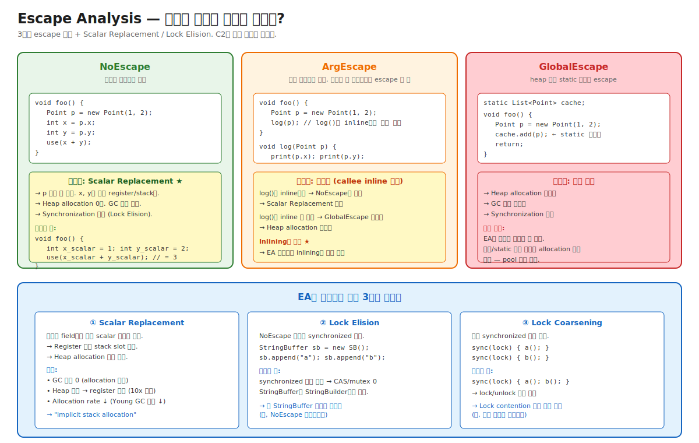

# 03-06. Escape Analysis — 객체가 메서드 밖으로 나가나?

> "Java는 모든 객체가 Heap에 할당된다" — 한 줄 답은 절반 거짓이다.
> C2가 **Escape Analysis (EA)** 로 "이 객체는 메서드 밖으로 escape하지 않음"을 증명하면, **객체 자체가 만들어지지 않을 수도 있다** — field들을 register로 분해 (Scalar Replacement). Heap allocation 0회, GC 부담 0, 동기화 무시 (Lock Elision).
> 즉, Java도 사실상 stack allocation에 가까운 효과를 얻는다 — 단, EA가 성공한 경우에만.
> 시니어가 알아야 할 것: 단순해 보이는 코드가 EA 덕분에 매우 빠른 이유와, 한 줄만 바꿔도 EA가 깨져 갑자기 GC가 폭증하는 패턴.

---

## 🗺️ JVM 아키텍처 안에서 이 챕터의 위치

이 챕터는 [04-c1-and-c2](./04-c1-and-c2.md)의 **C2 phase ③ Inlining + Escape Analysis** 중 EA 풀버전이다. [05-inlining-and-ic](./05-inlining-and-ic.md)와 깊이 연결 — Inlining이 EA의 가장 큰 enabler.



---

## 📍 학습 목표

1. **Escape Analysis**가 무엇이고 왜 JVM 성능에 결정적인지 안다.
2. **3가지 escape 종류** (NoEscape / ArgEscape / GlobalEscape)를 코드 예시로 식별할 수 있다.
3. **Scalar Replacement** — 객체의 field들을 register/stack slot으로 분해하는 변환.
4. EA가 가능하게 하는 **3가지 최적화** (Scalar Replacement, Lock Elision, Lock Coarsening).
5. **Inlining이 EA의 가장 큰 enabler** 인 이유 — 메서드 경계가 사라지면 객체 lifetime을 정확히 추적 가능.
6. **Partial Escape Analysis (Graal)** — escape하지 않는 path에서만 객체 안 만드는 더 정교한 기법.
7. EA가 **흔히 실패하는 패턴** — 객체를 List에 add, 다른 메서드 인자로 전달 후 그 메서드 inline 못 됨, exception throw 등.
8. `-XX:+PrintEscapeAnalysis`, JFR allocation 이벤트로 EA 효과 측정.
9. 운영 시나리오: 단순 코드인데 Heap allocation 폭증 / synchronized인데 빠른 이유 / 코드 한 줄 바뀐 후 GC 부담 ↑.
10. Java 객체 할당과 GC 부담을 줄이는 가장 강력한 도구 — **EA가 작동하도록 코드 작성**.

---

## 🎨 1단계: 백지 그리기 가이드

### Step 1: Escape 3종 분류

```
[NoEscape]
void foo() {
    Point p = new Point(1, 2);
    int x = p.x;
    use(x);
    // p가 메서드 밖으로 나가지 않음
}

[ArgEscape]
void foo() {
    Point p = new Point(1, 2);
    log(p);   // 다른 메서드로 전달
    // log()가 inline되면 NoEscape로 승격 가능
}

[GlobalEscape]
static List<Point> cache;
void foo() {
    Point p = new Point(1, 2);
    cache.add(p);   // static 필드로 보관
}
```

### Step 2: Scalar Replacement 변환

```
[변환 전]
Point p = new Point(1, 2);
use(p.x + p.y);

[변환 후 (NoEscape일 때)]
int p_x = 1;     // 객체 없음
int p_y = 2;     // 별도 scalar
use(p_x + p_y);  // = 3 (추가 constant fold)
```

### Step 3: 3가지 최적화 화살표

```
EA 결과:
  NoEscape ──► Scalar Replacement (객체 안 만듦)
            ──► Lock Elision (synchronized 제거)
            ──► (전제: Inlining이 메서드 경계 없앴음)

  ArgEscape (callee inline됨) ──► NoEscape로 승격
  
  GlobalEscape ──► 최적화 없음
```

### 정답 그림

위의 [06-escape-analysis.svg](./_excalidraw/06-escape-analysis.svg) 참조.

---

## 🧠 2단계: 직관

### 핵심 비유

> **택배 상자 비유**:
> - **NoEscape** = 받자마자 풀어서 안의 물건만 쓰고 상자는 안 만듦. (Scalar Replacement)
> - **ArgEscape** = 상자를 다른 방으로 옮김. 그 방이 같은 집 안이면 (inline) 결국 NoEscape. 다른 집으로 보내면 (escape) 진짜 상자 필요.
> - **GlobalEscape** = 상자를 창고(static field)나 우체국(Heap)에 영구 보관. 상자 그대로 보관 필수.

### 정확한 정의 (비유와 분리)

| 용어 | 정의 |
|---|---|
| **Escape Analysis (EA)** | 객체의 reference가 메서드/스레드 밖으로 escape하는지 분석. C2의 phase 중 하나. |
| **NoEscape** | 객체가 만들어진 메서드 안에서만 사용. 다른 곳으로 reference 전달 없음. |
| **ArgEscape** | 객체 reference가 다른 메서드의 인자로 전달되나, 그 메서드가 외부로 escape시키지 않음. |
| **GlobalEscape** | 객체 reference가 static 필드, 다른 객체의 필드, Heap의 배열 등으로 저장. 또는 thread 간 공유. |
| **Scalar Replacement** | NoEscape 객체의 field들을 별도 scalar 변수 (register/stack slot)로 분해. 객체 자체를 안 만듦. |
| **Lock Elision** | NoEscape 객체의 synchronized 블록을 제거. 다른 thread가 접근할 수 없으므로. |
| **Lock Coarsening** | 같은 lock에 대한 인접 synchronized 블록을 통합. lock/unlock 횟수 감소. |
| **Partial Escape Analysis (Graal)** | 객체가 일부 path에서만 escape할 때, 그 path에만 객체 생성 코드 두는 정교한 EA. C2는 미지원. |

### 왜 EA가 결정적인가 — Allocation의 진짜 비용

```
[일반 객체 할당의 비용]
1. TLAB의 top pointer 증가 (~3 instruction) — fast path
2. Heap에서 객체 메모리 zeroing
3. Object header 초기화 (Mark Word + Klass Pointer)
4. 생성자 코드 실행
5. GC가 추후 추적해야 함 (write barrier 영향)

[Scalar Replacement 후]
0. 아무것도 안 함. field 값이 register에 직접 들어감.
```

→ **fast path 할당도 absolutely 0보다는 느림**. 매 호출마다 작은 객체를 만드는 hot loop라면, EA가 누적 효과 큼.

### 왜 Inlining이 EA의 enabler인가

```
[Inline 안 됨]
void foo() {
    Point p = new Point(1, 2);
    Point.print(p);   // ★ print()의 본문 모름
                       // → p가 print() 안에서 어떻게 쓰이는지 불명
                       // → 보수적으로 GlobalEscape 간주
                       // → EA 실패
}

[Inline 됨 (print는 작아서 inline)]
void foo() {
    Point p = new Point(1, 2);
    // print() 본문이 여기에 펼쳐짐
    System.out.println(p.x);
    System.out.println(p.y);
    // ★ p는 메서드 안에서만 사용됨 → NoEscape
    // → Scalar Replacement 가능
}
```

→ **EA의 정확도는 inlining 깊이에 직접 의존**. inlining이 막히면 EA도 같이 죽음.

### NoEscape의 흔한 패턴

```java
// 1. 임시 객체로 계산
public int compute(int x, int y) {
    Point p = new Point(x, y);
    return p.distance(0, 0);   // distance()가 inline되면 EA OK
}

// 2. Optional 같은 wrapper
public Optional<String> findName(int id) {
    String name = lookup(id);
    return Optional.ofNullable(name);   // ← 호출 사이트에서 inline + EA
}

// 3. 짧은 lifetime의 Iterator
for (String s : list) {   // Iterator 객체 ← EA 성공 시 안 만들어짐
    process(s);
}
```

### GlobalEscape의 흔한 패턴

```java
// 1. 컬렉션에 add
List<Point> result = new ArrayList<>();
for (...) {
    Point p = new Point(x, y);
    result.add(p);   // ★ result는 caller에 return될 수 있음 → GlobalEscape
}

// 2. Exception throw
if (invalid) {
    throw new ValidationException(p);   // ★ exception은 stack 위로 escape
}

// 3. 비동기 task로 전달
executor.submit(() -> use(p));   // ★ lambda capture → GlobalEscape

// 4. 다른 객체의 필드로 저장
this.cachedPoint = p;   // ★ this의 필드 → GlobalEscape
```

---

## 🔬 3단계: 구조

### EA 분석 알고리즘 (Choi et al., 1999 — Whaley & Rinard 1999)

```
1. Build Escape Connection Graph
   - 각 객체 allocation site → 노드.
   - reference 흐름 → edge.
   - Field, array element, method parameter, return value 등 추적.

2. Propagate escape state
   - 각 노드의 escape state 초기화 (NoEscape).
   - reference가 escape하면 그 노드 + 도달 가능한 모든 노드를 GlobalEscape로.
   - fixpoint까지 반복.

3. Use result
   - NoEscape 노드: Scalar Replacement 후보.
   - ArgEscape: 그 메서드 inline 후 재분석.
   - GlobalEscape: 변경 없음.
```

### Scalar Replacement 변환

```
[변환 전 IR]
n1 = AllocateNode(Point.class)
n2 = StoreField(n1, "x", const 1)
n3 = StoreField(n1, "y", const 2)
n4 = LoadField(n1, "x")
n5 = LoadField(n1, "y")
n6 = Add(n4, n5)

[Scalar Replacement 후]
// Allocation 자체 제거
n1_x = const 1   // x field를 별도 scalar
n1_y = const 2   // y field를 별도 scalar
n6 = Add(n1_x, n1_y)
// = Add(1, 2) = const 3 (추가 constant fold)
```

→ Allocate 노드 자체가 그래프에서 제거됨. 후속 phase가 추가 최적화.

### Lock Elision 동작

```java
public String concat(String a, String b) {
    StringBuffer sb = new StringBuffer();   // ← NoEscape
    sb.append(a);
    sb.append(b);
    return sb.toString();   // toString이 String을 반환 → sb는 escape 안 함
}
```

`StringBuffer.append()` 는 내부적으로 `synchronized`. 그러나 `sb`가 NoEscape이므로:
- 다른 thread가 `sb`에 접근 불가능 (이 메서드의 stack에서만 가시).
- → synchronized 블록 안전하게 제거.
- 결과: `StringBuffer`가 `StringBuilder`처럼 동작.

> 옛 코드에 `StringBuffer`가 많이 남아있어도 EA가 동작하면 성능 영향 거의 없음. 단, EA가 실패하면 (예: sb를 다른 곳에 넘김) 그대로 synchronized.

### Lock Coarsening

```java
// 변환 전
synchronized(lock) { a(); }
synchronized(lock) { b(); }
synchronized(lock) { c(); }

// 변환 후
synchronized(lock) { a(); b(); c(); }
```

3번의 lock/unlock → 1번. CAS 비용 절감.

단, 같은 lock 객체에 대해서만. 또한 단일 메서드 안에서 가까운 위치여야 함.

### Partial Escape Analysis (Graal only)

```java
void foo(boolean rare) {
    Point p = new Point(1, 2);
    if (rare) {
        cache.add(p);   // 1% 경우만 escape
    } else {
        use(p.x + p.y);   // 99% 경우는 NoEscape
    }
}
```

C2의 EA:
- `p`가 한 path에서라도 escape → 전체를 GlobalEscape → 항상 allocation.

Graal의 Partial EA:
- escape하는 path에만 객체 생성 코드.
- non-escape path에서는 Scalar Replacement.
- 결과: 99% 경우 객체 안 만듦.

→ Graal이 C2보다 빠른 워크로드의 한 이유.

---

## 🧬 4단계: 내부 구현 — HotSpot

### EA Phase 진입

위치: `src/hotspot/share/opto/escape.cpp`

```cpp
// C2의 Compile::optimize_loops() 등 phase 중간에 호출
class ConnectionGraph {
public:
    static void do_analysis(Compile* C, PhaseIterGVN* igvn) {
        ConnectionGraph cg(C, igvn);
        cg.compute_escape();   // 분석
        
        if (cg.has_non_escaping_obj()) {
            cg.split_unique_types();   // NoEscape 객체 식별
        }
    }
    
private:
    void compute_escape() {
        // 1. Build connection graph
        build_connection_graph();
        
        // 2. Propagate escape state
        process_call_arguments();
        compute_escape_for_objects();
        
        // 3. Scalar replace candidates 표시
        find_scalar_replaceable();
    }
};
```

### EscapeState 4단계

```cpp
enum EscapeState {
    UnknownEscape,
    NoEscape,
    ArgEscape,
    GlobalEscape
};

class PointsToNode : public ResourceObj {
    EscapeState _escape_state;
    Node*       _ideal_node;
    // ...
};
```

각 allocation site에 PointsToNode 1개. Reference 흐름이 connection graph의 edge.

### Scalar Replacement 적용

위치: `src/hotspot/share/opto/macro.cpp`

```cpp
void PhaseMacroExpand::eliminate_allocate_node(AllocateNode* alloc) {
    // 1. 모든 LoadField/StoreField을 별도 scalar로
    extract_scalar_fields(alloc);
    
    // 2. AllocateNode 자체 제거
    igvn().replace_node(alloc, ...);
    
    // 3. 후속 SafePointNode들의 oop map 갱신
    update_safepoints();
}
```

### Lock Elision 적용

위치: `src/hotspot/share/opto/macro.cpp` (`MacroEliminate`)

```cpp
void PhaseMacroExpand::eliminate_lock(LockNode* lock) {
    // 객체가 NoEscape면 lock 노드 제거
    if (lock->obj()->is_scalar_replaceable()) {
        igvn().remove_node(lock);
    }
}
```

### `-XX:+PrintEscapeAnalysis`

```bash
java -XX:+UnlockDiagnosticVMOptions -XX:+PrintEscapeAnalysis -jar app.jar
```

각 메서드의 EA 결과 출력:
```
======== Connection graph for com.foo.Service::compute
JavaObject(NoEscape) NodeIdx=23 Allocate java/awt/Point
   Field x:I JavaObject(NoEscape)
   Field y:I JavaObject(NoEscape)
JavaObject(GlobalEscape) NodeIdx=45 Allocate java/util/ArrayList
...
```

NoEscape 객체가 Scalar Replacement 후보.

---

## 📜 5단계: 역사

| 연도 | 변화 | 의의 |
|---|---|---|
| 1999 | Choi et al. — Connection graph EA 논문 | 기초 알고리즘 |
| 1999 | Whaley & Rinard — Compositional EA | 메서드 단위 분석 |
| 2005 | HotSpot 1.6 — EA 첫 도입 (실험) | |
| 2009 | JDK 6u23 — EA 기본 on | -XX:+DoEscapeAnalysis 기본 true |
| 2014 | JDK 8 — Lambda + EA 효과 ↑ | lambda capture EA 처리 |
| 2018 | JDK 11 — Graal Partial EA | C2보다 더 정교 |
| 2021 | JDK 17 — Sealed class + EA 정확도 ↑ | type 정보 풍부 |

### Choi et al. 알고리즘의 의의

1999년 IBM 논문: "Escape Analysis for Java".
- Connection graph 표현으로 EA를 일관된 framework로.
- HotSpot, IBM J9, JikesRVM 등이 이 알고리즘을 채택.
- 이후 모든 JVM EA의 기초.

---

## ⚖️ 6단계: 트레이드오프

### EA 비활성 vs 활성

| `-XX:-DoEscapeAnalysis` | `-XX:+DoEscapeAnalysis` (기본) |
|---|---|
| ❌ Heap allocation 폭증 | ✅ NoEscape 객체 Scalar Replacement |
| ❌ GC 부담 ↑ | ✅ GC 부담 ↓ |
| ❌ Synchronized 비용 그대로 | ✅ Lock Elision |
| ✅ 컴파일 시간 ↓ (분석 안 함) | ❌ 컴파일 시간 ↑ |
| 사용 케이스: 없음 (디버깅용) | 사용 케이스: 정상 |

→ 기본 on. 끄는 경우는 EA 버그 의심 시 재현 용도.

### Code 패턴이 EA에 미치는 영향

```java
// EA 친화적
public int sum(int[] arr) {
    return Arrays.stream(arr).sum();   // Stream 객체 EA로 제거
}

// EA 비친화적
public int sum(int[] arr) {
    List<Integer> list = new ArrayList<>();   // ← GlobalEscape 가능성
    for (int x : arr) list.add(x);
    return list.stream().mapToInt(i -> i).sum();
}
```

운영 가이드:
- Hot loop에서 컬렉션 add 피하기 (또는 capacity 미리 할당).
- 짧은 lifetime 객체 OK (EA가 처리).
- 객체를 다른 메서드로 자주 넘기되 그 메서드가 inline 가능하게.

### EA 의존의 위험

```java
// 코드는 같은데 한 줄 추가로 EA가 깨짐
public int compute() {
    Point p = new Point(1, 2);
    int result = p.x + p.y;
    
    if (DEBUG) log(p);   // ← 이 한 줄로 GlobalEscape 가능
    
    return result;
}
```

EA 의존 hot path는 **변경 시 측정 필수**. JFR로 allocation rate 비교.

---

## 📊 7단계: 측정·진단

### `-XX:+PrintEscapeAnalysis`

각 메서드의 EA 분석 결과. 위에서 다룸.

### JFR Allocation Profiling

```bash
jcmd <pid> JFR.start name=alloc duration=60s settings=profile filename=alloc.jfr
jfr summary alloc.jfr | grep -iE 'AllocationSample|TLAB'
```

핵심 이벤트:
- `jdk.ObjectAllocationInNewTLAB` — TLAB에 새 객체 할당.
- `jdk.ObjectAllocationOutsideTLAB` — Eden 직접 할당 (큰 객체).

→ **EA가 잘 동작하면 allocation rate가 의외로 낮음**. Stream/Lambda heavy 코드인데 allocation 적으면 EA 성공.

### `async-profiler -e alloc`

```bash
asprof -e alloc -d 60 -f alloc.html <pid>
```

Allocation flame graph. Hot allocation site 식별. **자주 할당되는 site**의 코드를 audit해 EA 가능성 검토.

### 운영 시나리오 진단 매트릭스

| 증상 | 진단 | 가능 원인 |
|---|---|---|
| GC 빈도 ↑ | JFR allocation rate | EA 실패 (코드 변경?) |
| Synchronized 코드인데 fast | EA Lock Elision 작동 | 정상 |
| Synchronized 코드가 갑자기 slow | EA 깨짐 | 객체가 escape하게 됨 |
| Stream API 코드 allocation 적음 | EA 성공 | 정상 |
| 일부만 빠른 path 있음 (rare) | Partial EA 없음 | C2 한계, Graal 검토 |

### 시나리오 1: 코드 한 줄 추가 후 GC 빈도 ↑

```
환경: 평소 GC 분당 1회, 코드 한 줄 추가 후 분당 5회

진단:
1. JFR로 allocation 비교 (변경 전/후).
2. PrintEscapeAnalysis로 새 코드의 EA 결과 확인.
3. 결과: 새로 추가한 log(p) 호출로 인해 p가 GlobalEscape.

조치:
- log()를 inline 가능하게 (작게 유지).
- 또는 conditional log: if (LOG.isDebugEnabled()) log(p) — JIT가 LOG.isDebugEnabled 결과로 분기.
- 또는 hot path에서 log 제거.
```

---

## ⚔️ 8단계: 꼬리질문 트리

### Q1. Escape Analysis가 무엇이고 왜 중요한가요?

**예상 답변**:
> 객체의 reference가 메서드 밖으로 escape하는지 분석.
> 결과 3단계: NoEscape / ArgEscape / GlobalEscape.
> 
> 가능하게 하는 최적화:
> 1. **Scalar Replacement**: NoEscape 객체의 field를 register로 분해 → 객체 자체 안 만듦.
> 2. **Lock Elision**: NoEscape 객체의 synchronized 제거.
> 3. **Lock Coarsening**: 인접 synchronized 통합.
> 
> 중요성: Java가 사실상 stack allocation 효과를 얻는 핵심 메커니즘. EA 성공 시 GC 부담 0, 동기화 비용 0.

#### 🪝 Q1-1: NoEscape, ArgEscape, GlobalEscape의 차이는?

> - **NoEscape**: 객체가 만들어진 메서드 안에서만 사용. 최적화 가장 적극.
> - **ArgEscape**: 다른 메서드 인자로 전달, 그러나 그 메서드도 escape 안 함. callee가 inline되면 NoEscape로 승격.
> - **GlobalEscape**: static 필드, 다른 객체의 필드, 컬렉션 추가 등. 최적화 거의 없음.

### Q2. Scalar Replacement가 무엇이고 왜 "implicit stack allocation"이라 불리나요?

**예상 답변**:
> NoEscape 객체의 field들을 별도 scalar 변수(register 또는 stack slot)로 분해. 객체 자체는 만들어지지 않음.
> 
> 예:
> ```java
> Point p = new Point(1, 2);
> int sum = p.x + p.y;
> ```
> 변환:
> ```
> int p_x = 1; int p_y = 2;
> int sum = p_x + p_y;   // = 3
> ```
> 
> "implicit stack allocation"이라 부르는 이유: 객체가 Heap에 없고 마치 stack에 있는 것처럼 동작. C++의 stack allocation과 효과 동일.
> 
> Java 사용자가 명시적 stack allocation API를 안 가지지만, EA 덕분에 실효적으로 stack allocation을 얻음.

### Q3. Inlining과 EA의 관계는?

**예상 답변**:
> EA는 객체가 메서드 밖으로 escape하는지 봄. 그러나 다른 메서드로 객체를 넘기면 그 메서드의 본문을 모름 → 보수적으로 GlobalEscape 간주.
> 
> Inlining이 그 메서드의 본문을 caller에 펼치면:
> - 메서드 경계 사라짐.
> - EA가 객체의 전체 lifetime을 한 메서드 안에서 추적.
> - ArgEscape → NoEscape로 승격.
> - Scalar Replacement 가능.
> 
> 결론: **EA의 정확도는 inlining 깊이에 직접 의존**. inlining이 막히면 EA도 같이 죽음. 이게 "Inlining is the mother of optimizations"의 한 측면.

### Q4. Lock Elision이 동작하는 흔한 예시는?

**예상 답변**:
> `StringBuffer.append` — 옛 코드의 흔한 패턴.
> 
> ```java
> public String concat(String a, String b) {
>     StringBuffer sb = new StringBuffer();   // NoEscape
>     sb.append(a);
>     sb.append(b);
>     return sb.toString();
> }
> ```
> 
> `StringBuffer`는 thread-safe (모든 메서드가 synchronized). 그러나 `sb`가 메서드 안에서만 사용 → NoEscape → 다른 thread 접근 불가 → synchronized 안전하게 제거.
> 
> 결과: `StringBuffer`가 `StringBuilder`처럼 빠르게 동작. 옛 코드를 굳이 StringBuilder로 바꿀 필요 줄어듦 (단, EA 성공 가정).

### Q5. Partial Escape Analysis가 무엇이고 C2는 왜 안 하나요?

**예상 답변**:
> Graal에 있는 더 정교한 EA. C2는 미지원.
> 
> 차이:
> - **C2 EA**: 객체가 한 path에서라도 escape하면 전체를 GlobalEscape 처리.
> - **Partial EA**: escape하는 path에만 객체 생성 코드 두고, non-escape path는 Scalar Replacement.
> 
> 예:
> ```java
> Point p = new Point(1, 2);
> if (rare) cache.add(p);  // 1% escape
> else use(p.x + p.y);     // 99% NoEscape
> ```
> - C2: 항상 allocation (1% 때문에).
> - Graal: 99%는 allocation 0, 1%만 allocation.
> 
> C2가 안 하는 이유: 1990년대 설계, 구현 복잡도. Graal은 Java로 작성되어 더 정교한 알고리즘 적용 가능.

### Q6. (Killer) Stream API 코드가 List.add 코드보다 빠른 경우가 있는 이유는?

**예상 답변**:
> EA가 핵심 차이:
> 
> ```java
> // Stream
> int sum = list.stream().mapToInt(Integer::intValue).sum();
> 
> // List.add
> List<Integer> tmp = new ArrayList<>();
> for (Integer x : list) tmp.add(x);
> int sum = tmp.stream().mapToInt(...).sum();
> ```
> 
> Stream 코드의 객체들 (Stream, IntStream, Spliterator 등):
> - 호출 사이트가 monomorphic이면 inline.
> - inline 후 EA가 NoEscape 분석 → Scalar Replacement.
> - 객체들이 사실상 사라지고 단순 loop로 변환됨.
> 
> List.add 코드:
> - `tmp` ArrayList → 누가 잡고 있을 수 있음 → GlobalEscape.
> - Allocation 그대로.
> - 각 Integer 박싱 → 또 allocation.
> 
> 결과: Stream이 더 빠를 수도 있음 (EA 효과). 단, lambda 다양성으로 megamorphic이면 반대.
> 
> → **EA + Inlining의 조합이 Java의 hidden performance**. 단순 "객체 안 만드는 것보다 안 만들기"가 직관적으로 답이 아님.

---

## 🔗 다음 단계

- → [07. Loop and Vector](./07-loop-and-vector.md): Inlining + EA의 cascade — Loop opts
- → [08. Speculative and Deopt](./08-speculative-and-deopt.md): EA speculation + Deopt
- ← [05. Inlining and IC](./05-inlining-and-ic.md): EA의 enabler
- ← [04. C1 and C2](./04-c1-and-c2.md): C2 phase 안에서 EA 위치
- 관련: [05. Threading](../05-threading/) — Lock Elision의 동시성 측면

## 📚 참고

- **Choi et al. — "Escape Analysis for Java" (1999)**: IBM 논문, ECOOP
- **Whaley & Rinard — "Compositional Pointer and Escape Analysis"**: 1999 OOPSLA
- **HotSpot src `escape.cpp`**: https://github.com/openjdk/jdk/blob/master/src/hotspot/share/opto/escape.cpp
- **HotSpot src `macro.cpp` (Scalar Replacement)**: https://github.com/openjdk/jdk/blob/master/src/hotspot/share/opto/macro.cpp
- **Graal Partial Escape Analysis 논문**: Stadler et al. 2014
- **Aleksey Shipilëv — EA Quark**: https://shipilev.net/jvm/anatomy-quarks/
