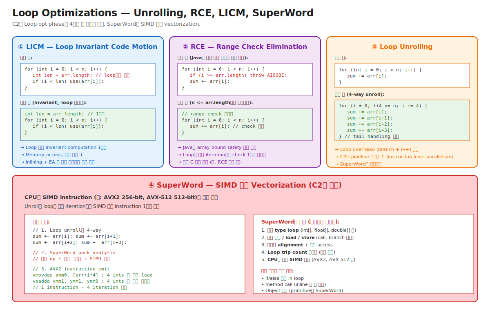

# 03-07. Loop Optimizations + Vectorization — C2의 hot loop 최적화

> Hot loop는 거의 모든 Java 앱 성능의 90%다. C2의 **Loop opt phase**가 그 loop를 어떻게 다루느냐가 peak 성능을 결정한다.
> 4가지 변환: **LICM (Loop Invariant Code Motion)**, **RCE (Range Check Elimination)**, **Loop Unrolling**, **SuperWord (SIMD vectorization)**.
> 시니어가 알아야 할 것: 같은 알고리즘이라도 **loop 안에 if/method call/Object array** 가 들어가면 SuperWord가 깨져 성능 5~10× 차이. JFR로 hot loop의 SIMD 활용도를 측정할 수 있어야 한다.

---

## 🗺️ JVM 아키텍처 안에서 이 챕터의 위치

[04-c1-and-c2](./04-c1-and-c2.md) C2 phase ④ Loop optimizations 풀버전.



---

## 📍 학습 목표

1. **LICM (Loop Invariant Code Motion)** — loop 안의 invariant computation을 밖으로 빼는 최적화.
2. **RCE (Range Check Elimination)** — Java의 array bound check 비용을 제거하는 메커니즘.
3. **Loop Unrolling** — loop body를 N번 복제. CPU pipeline 활용도 ↑, branch overhead ↓.
4. **SuperWord (SIMD Vectorization)** — 인접 iteration들을 SIMD instruction으로 통합. AVX2/AVX-512 활용.
5. SuperWord가 **깨지는 패턴** — if/method call/Object array를 loop에 두면 vectorization 실패.
6. **`Vector API` (JDK 16+ incubator, 25+ stable 예정)** — 수동 SIMD 코드 작성 vs SuperWord 자동.
7. **Loop의 종류** — counted loop, do-while, infinite loop의 C2 인식 차이.
8. **Loop strip mining** — 매우 긴 loop의 safepoint poll 최적화.
9. JFR + perf로 hot loop의 SIMD 활용도 측정.
10. 운영 시나리오: 알고리즘 같은데 성능 5× 차이 / Vector API 도입 효과 측정 / AVX-512 자동 활용 확인.

---

## 🎨 1단계: 백지 그리기 가이드

### Step 1: 4가지 변환 박스

```
Loop opt phase:
  ① LICM        — invariant code 밖으로
  ② RCE          — array bound check 제거
  ③ Unrolling    — body 복제
  ④ SuperWord    — SIMD 활용
```

### Step 2: SuperWord 흐름

```
Loop 원본
   │
   ▼ ① LICM
Loop with invariant outside
   │
   ▼ ③ Unrolling (4-way)
4 iter씩 펼쳐진 loop
   │
   ▼ ④ SuperWord pack analysis
인접한 op들을 SIMD pack
   │
   ▼ SIMD instruction emit
1 SIMD instruction = 4 iteration
```

### 정답 그림

위의 [07-loop-and-vector.svg](./_excalidraw/07-loop-and-vector.svg) 참조.

---

## 🧠 2단계: 직관

### 핵심 비유

> **공장 컨베이어 비유**:
> - **LICM** = 매 제품마다 도구 가져오는 대신 작업장 옆에 미리 둠.
> - **RCE** = "이 라인은 안전 검사 통과 보장" 확인 후 매 제품의 안전 검사 생략.
> - **Unrolling** = 한 사이클에 4개 제품 한꺼번에 처리.
> - **SuperWord** = 4개 동일 작업을 SIMD 머신 1대로 동시에. CPU의 "병렬 처리 슈퍼파워" 활용.

### 정확한 정의 (비유와 분리)

| 용어 | 정의 |
|---|---|
| **LICM (Loop Invariant Code Motion)** | Loop 안에서 계산되지만 매 iteration에서 같은 값을 가지는 computation을 loop 밖으로 hoist. |
| **RCE (Range Check Elimination)** | Java의 모든 배열 접근에 자동 삽입된 bound check (`i >= arr.length` 검사)를 loop 시작 전 한 번만 검사하도록 변환. |
| **Loop Unrolling** | Loop body를 N번 복제하여 한 iteration이 원래의 N iteration 분량 처리. branch overhead, IL parallelism 활용. |
| **SuperWord** | Unroll된 loop의 인접 iteration의 동일 연산을 SIMD instruction으로 packing. C2의 auto-vectorization. |
| **SIMD (Single Instruction Multiple Data)** | CPU 명령 1개가 여러 데이터를 동시 처리. x86의 SSE/AVX, ARM의 NEON. |
| **AVX2** | x86 256-bit SIMD. int 8개 또는 double 4개 한 번에 처리. |
| **AVX-512** | x86 512-bit SIMD. int 16개 또는 double 8개 한 번에 처리. 최신 Intel 서버 CPU. |
| **Vector API (JEP 414, ...)** | Java 표준 SIMD API. JDK 16+ incubator → 25+ stable 예상. SuperWord 자동을 우회하고 수동 SIMD. |
| **Counted Loop** | C2가 trip count를 추론 가능한 loop. `for (int i = 0; i < n; i++)` 패턴. 모든 loop opt의 전제. |
| **Loop Strip Mining** | 매우 긴 loop를 inner loop + outer loop로 변환. safepoint poll을 outer에 두어 inner를 빠르게. |

### 왜 LICM이 중요한가

```java
for (int i = 0; i < n; i++) {
    arr[i] = compute(i) * Math.PI;
}
```

- `Math.PI` 는 매 iteration에서 같은 값 → LICM이 loop 밖으로 hoist.
- `compute(i)` 는 invariant 아님 (i에 의존).

운영 의미: LICM은 거의 항상 동작. **단순 코드 작성하면 알아서 적용** — 사용자가 의식할 필요 없음. 단, **side effect 가진 함수**는 LICM 안 됨 (안전).

### 왜 RCE가 결정적인가 — Java의 array bound safety 비용

```java
// 모든 배열 접근에 JVM이 자동으로 추가:
if (i < 0 || i >= arr.length) throw new ArrayIndexOutOfBoundsException();
int x = arr[i];
```

- Tight loop의 모든 iteration에 추가 branch.
- C++의 raw array는 이 check 없음 → Java가 C보다 느린 한 이유.

RCE 적용 후:
```java
for (int i = 0; i < n; i++) {
    // n <= arr.length임이 증명되면 check 제거
    int x = arr[i];   // bare load instruction
}
```

→ Java가 C 수준 속도에 근접. 단, **RCE가 성공해야** 가능.

### 왜 Unrolling이 빠른가 — CPU pipeline

```
[Unroll 없는 loop body 1회 iteration]
1. compare i < n  (1 cycle)
2. branch          (1~3 cycle, predicted)
3. compute body    (k cycles)
4. i++             (1 cycle)
5. jump back       (1 cycle)
                   = 약 k + 3~5 cycles per iteration

[4-way unroll]
4 iteration 분량 body + branch overhead 1번
                   = 약 4k + 3 cycles for 4 iteration
                   = (4k + 3) / 4 ≈ k + 0.75 cycles per iteration

→ branch/i++ overhead가 1/4로
→ 추가: CPU pipeline이 독립 instruction을 병렬 실행 가능 (ILP)
```

### 왜 SuperWord가 폭발적인가

```
[일반 unroll]
4 iteration = 4번의 scalar 산술
즉 sum += arr[0]; sum += arr[1]; sum += arr[2]; sum += arr[3];

[SuperWord (AVX2)]
4 iteration = 1번의 SIMD 산술
vpaddd ymm1, ymm1, [arr]   ; int 4개 한 번에 더함

이론 4× 빠름. 실측 2~3× (memory bandwidth, alignment 등 영향).
AVX-512는 8× (int) ~ 16× (byte).
```

→ SIMD는 같은 cycle에 더 많은 일을 함. CPU의 "병렬 슈퍼파워".

---

## 🔬 3단계: 구조

### LICM 알고리즘

```
1. Loop의 dominator 분석 (각 node가 어느 loop에 속하는지).
2. Loop body의 각 instruction에 대해:
   - inputs가 모두 loop 밖 또는 invariant인가? → invariant
   - side effect 없음 + safe to speculate? → hoist 가능
3. Invariant instruction을 loop preheader로 이동.
4. Loop 안의 사용처는 hoisted 값을 참조.
```

### RCE 알고리즘

```
1. Loop induction variable 식별 (i = 0; i < n; i++).
2. 배열 접근 arr[i]에서:
   - i의 범위 추론: i ∈ [0, n).
   - arr.length 확인.
   - n <= arr.length 인지 증명 가능?
3. 증명되면 loop 시작 전 한 번만 check, loop 안은 제거.

[변환 전]
for (int i = 0; i < n; i++) {
    if (i >= arr.length) throw;
    sum += arr[i];
}

[변환 후 (predicate hoisted)]
if (n > arr.length) {
    // fast loop with no checks
    for (i = 0; i < arr.length; i++) sum += arr[i];
    // throw at i = arr.length
    throw new AIOOBE();
} else {
    // fast loop, no checks
    for (i = 0; i < n; i++) sum += arr[i];
}
```

### Loop Unrolling 알고리즘

```
1. Loop가 unroll 후보? (counted, body 작음, side effect 안전)
2. Unroll factor 결정 (보통 4 또는 8):
   - body 크기 × factor ≤ unroll size limit
   - register pressure 고려
3. Loop body × factor 복제, induction var 조정:
   for (i = 0; i < n; i++) { body; }
   →
   for (i = 0; i+factor <= n; i += factor) {
       body[i]; body[i+1]; ...; body[i+factor-1];
   }
   for (; i < n; i++) { body[i]; }   // tail handling
```

### SuperWord — Pack Analysis

```
1. Unrolled loop의 instruction들을 봄.
2. 같은 op + 인접 메모리 access인 instruction 그룹 식별:
   - sum += arr[i]   →  Add(sum, Load arr[i])
   - sum += arr[i+1] →  Add(sum, Load arr[i+1])
   - sum += arr[i+2] →  Add(sum, Load arr[i+2])
   - sum += arr[i+3] →  Add(sum, Load arr[i+3])
3. Pack 후보 검증:
   - 메모리 alignment (4-byte 정렬?)
   - 인접 (offset 0, 4, 8, 12)
   - 데이터 의존성 없음
   - CPU의 SIMD width와 일치 (4 ints = 16 bytes = SSE/AVX2의 128/256 bit)
4. SIMD instruction emit:
   vmovdqu ymm0, [arr + i*4]   ; 4 ints load
   vpaddd  ymm1, ymm1, ymm0     ; 4 ints add
```

### Counted Loop 인식

C2의 모든 loop opt는 **counted loop**가 전제:
```java
for (int i = 0; i < n; i++) { ... }   // ✅ counted
for (int i = n - 1; i >= 0; i--) { ... }   // ✅ counted (backward)
for (long i = 0; i < n; i++) { ... }   // △ long counted, 일부 opt만
for (int i = 0; i < arr.size(); i++) { ... }   // △ size()가 inline + EA + LICM 되어야
while (it.hasNext()) { ... it.next(); ... }   // ❌ counted 아님
```

→ Iterator-based loop는 counted loop opt 못 받음. for-each도 내부적으로 Iterator라 함정.

운영: **hot loop는 가능한 한 indexed for-loop**. Iterator/Stream은 EA가 잘 동작할 때만 비슷.

### SuperWord 깨지는 패턴

```java
// 1. Branch in loop
for (int i = 0; i < n; i++) {
    if (arr[i] > 0) sum += arr[i];   // ← branch → SuperWord 깨짐
}

// 2. Method call (inline 안 됨)
for (int i = 0; i < n; i++) {
    sum += complexCompute(arr[i]);   // call → SuperWord 깨짐
}

// 3. Object array
String[] strs = ...;
for (int i = 0; i < n; i++) {
    process(strs[i]);   // Object array → SuperWord 안 됨
}

// 4. 2D array (실제로는 array of arrays)
int[][] grid = ...;
for (int i = 0; i < n; i++) {
    sum += grid[r][i];   // grid[r]를 매 iter에서 load → LICM 후 OK
}
```

### Loop Strip Mining (긴 loop의 safepoint 최적화)

```java
for (long i = 0; i < 1_000_000_000L; i++) {   // 10억
    sum += data[i % size];
}
```

각 iteration의 back-edge에 safepoint poll → loop 자체 hot path에 oversized overhead.

Strip mining 변환:
```java
for (long outer = 0; outer < total; outer += stride) {
    // ★ safepoint poll outer에만
    for (long i = outer; i < outer + stride; i++) {
        sum += data[i % size];   // inner는 poll 없음
    }
}
```

→ Long-running computation의 latency 영향 ↓. JDK 11+에서 도입.

---

## 🧬 4단계: 내부 구현 — HotSpot

### Loop opt phase 진입

위치: `src/hotspot/share/opto/loopnode.cpp`

```cpp
void PhaseIdealLoop::optimize(...) {
    build_loop_tree();
    
    // 1. LICM
    do_loop_invariants();
    
    // 2. Loop predicate 삽입 (RCE 준비)
    insert_loop_predicates();
    
    // 3. RCE
    eliminate_range_checks();
    
    // 4. Unrolling
    do_unroll();
    
    // 5. SuperWord
    SuperWord sw(this);
    sw.transform_loop();
}
```

### SuperWord 구현

위치: `src/hotspot/share/opto/superword.cpp`

```cpp
class SuperWord : public ResourceObj {
public:
    void transform_loop() {
        // 1. Pack 후보 찾기
        find_adjacent_refs();
        extend_packlist();
        combine_packs();
        
        // 2. Alignment 분석
        align_initial_loop_index();
        
        // 3. SIMD instruction emit
        output_simd();
    }
};
```

### `-XX:UseSuperWord` 옵션

- 기본 on. CPU SIMD 지원 시 자동 활성.
- `-XX:-UseSuperWord` 로 끄기 (디버깅용).
- `-XX:LoopUnrollLimit=N` (기본 60) — unroll factor 한계.

### Vector API (JEP 414)

```java
// JDK 21 (incubator)
import jdk.incubator.vector.IntVector;

void sum(int[] arr) {
    IntVector vsum = IntVector.zero(IntVector.SPECIES_256);
    for (int i = 0; i < arr.length; i += 8) {
        IntVector v = IntVector.fromArray(IntVector.SPECIES_256, arr, i);
        vsum = vsum.add(v);
    }
    int total = vsum.reduceLanes(VectorOperators.ADD);
}
```

- **수동 SIMD**. SuperWord 자동에 의존 안 함.
- 복잡 알고리즘에서 SuperWord가 못 잡는 경우 유용.
- 단점: 코드 복잡, platform-specific 튜닝.

---

## 📜 5단계: 역사

| 연도 | 변화 | 의의 |
|---|---|---|
| 1999 | HotSpot 1.0 — 기본 loop opt | LICM, basic unrolling |
| 2002 | C2 — RCE 도입 | Java가 C 수준 array access |
| 2008 | JDK 6 — SuperWord 첫 도입 | SSE2 활용 |
| 2014 | JDK 8 — AVX2 지원 | 256-bit SIMD |
| 2017 | JDK 9 — AVX-512 지원 | 512-bit SIMD |
| 2018 | JDK 11 — Loop Strip Mining | safepoint 영향 ↓ |
| 2021 | JDK 16 — Vector API incubator (JEP 414) | 수동 SIMD |
| 2024 | JDK 22 — Vector API 8th incubator | 안정화 중 |

### SuperWord의 의의

옛 C/C++에서 SIMD를 쓰려면:
- intrinsic API (`_mm_add_epi32` 등)
- 또는 compiler의 auto-vectorization (gcc -O3)

Java는 SIMD intrinsic 없었음 → JVM이 auto-vectorize 못 하면 SIMD 못 씀.

SuperWord (2008+) 덕분에 Java가 numerical computation에서 C 수준 도달. 단, 알고리즘이 SuperWord 친화적이어야.

### Vector API의 동기

SuperWord 한계:
- branch, method call 들어가면 깨짐.
- 복잡 SIMD 패턴 (shuffle, gather, scatter) 표현 못 함.

Vector API: Java 코드로 명시적 SIMD. 복잡 알고리즘 + cross-platform.

---

## ⚖️ 6단계: 트레이드오프

### Auto-vectorization (SuperWord) vs 수동 (Vector API)

| | SuperWord | Vector API |
|---|---|---|
| 작성 복잡도 | 낮음 (일반 코드) | 높음 (vector primitives) |
| 적용 조건 | 까다로움 (단순 loop만) | 자유로움 |
| Cross-platform | ✅ JVM이 처리 | ✅ JVM이 처리 |
| 최적화 보장 | △ (조건 미달 시 실패) | ✅ (명시적) |
| 사용처 | 일반 numerical | HPC, ML inference |

### Loop opt 옵션 튜닝

99% 케이스: **기본값**. 변경 위험.

희귀 케이스:
- `-XX:LoopUnrollLimit=120` — 큰 unroll (코드 크기 ↑, peak ↑).
- `-XX:-UseSuperWord` — SIMD 끄기 (재현용).
- `-XX:-UseCountedLoopSafepoints` — counted loop의 safepoint poll 제거 (옛 옵션).

---

## 📊 7단계: 측정·진단

### `-XX:+PrintAssembly`로 SIMD instruction 확인

```bash
java -XX:+UnlockDiagnosticVMOptions -XX:+PrintAssembly \
     -XX:CompileCommand=print,MyApp::sum \
     -jar app.jar | grep -i 'vpaddd\|vmovdqu\|ymm'
```

출력에 `vpaddd ymm0, ymm1, ymm2` 같은 AVX2 instruction이 보이면 SuperWord 성공.

### perf로 IPC 측정

```bash
perf stat -e instructions,cycles,cache-misses,L1-dcache-load-misses java -jar app.jar
```

`insn per cycle (IPC)` 가 높으면 (3+) SIMD + unrolling 효과 좋음.

### JFR + `jdk.NativeMethodSample`

JIT 컴파일된 메서드의 hot loop가 어디인지. SIMD 활용도는 간접 추정.

### 운영 시나리오 진단 매트릭스

| 증상 | 진단 | 가능 원인 |
|---|---|---|
| 알고리즘 같은데 C++ 대비 5× 느림 | PrintAssembly에 SIMD 없음 | SuperWord 실패 |
| Vector API 도입 효과 없음 | PrintAssembly 비교 | 이미 SuperWord 잘 됨 |
| AVX-512 자동 활용? | CPU info + PrintAssembly | JDK 버전 + CPU 둘 다 지원? |
| 긴 loop의 GC pause 길음 | Loop Strip Mining 확인 | safepoint poll inner loop |

---

## ⚔️ 8단계: 꼬리질문 트리

### Q1. SuperWord가 무엇이고 어떤 조건에서 동작하나요?

> C2의 auto-vectorization phase. Unrolled loop의 인접 iteration의 동일 연산을 SIMD instruction으로 packing.
> 
> 조건:
> 1. Counted loop (`for (int i = 0; i < n; i++)`).
> 2. 단일 primitive type (int[], float[], double[] 등 — Object[] 안 됨).
> 3. 단순 산술/load/store만 (call, branch 없음).
> 4. 인접 메모리 access + alignment.
> 5. CPU가 해당 SIMD width 지원 (AVX2 등).
> 
> 깨지는 패턴: if/else in loop, inline 안 된 method call, Object array, complex indexing.

### Q2. RCE가 Java의 성능에 중요한 이유는?

> Java의 모든 배열 접근은 자동 bound check (`i < arr.length`). C/C++는 없음.
> Tight loop의 모든 iteration에 추가 branch → 성능 저하.
> 
> RCE: loop 시작 전 한 번만 check, loop 안은 제거 → Java가 C 수준 속도.
> 
> 단, RCE 성공 조건: induction variable의 범위가 arr.length 안에 있음을 증명 가능해야.

### Q3. Loop Strip Mining이 무엇이고 왜 도입됐나요?

> 매우 긴 loop의 safepoint poll 문제 해결.
> 
> 문제: counted loop의 back-edge에 safepoint poll → 10억 iteration이면 10억 번 poll.
> 
> 해결: outer + inner loop로 분리.
> - Outer loop에만 safepoint poll.
> - Inner loop는 poll 없이 빠르게.
> - Loop iteration N개씩 묶어서 처리.
> 
> JDK 11+ 도입. 긴 numerical computation의 latency 개선.

### Q4. Vector API와 SuperWord의 차이는?

> - **SuperWord**: 자동. 단순 loop에 적용. C2가 컴파일 시 결정.
> - **Vector API**: 수동. 명시적 SIMD primitive 사용. JDK 16+ incubator.
> 
> 선택:
> - 일반 numerical: SuperWord (자연스러운 코드).
> - HPC/ML inference (복잡 SIMD 패턴): Vector API.
> - SuperWord가 깨지는 알고리즘: Vector API로 강제.

### Q5. (Killer) 같은 알고리즘의 Java 코드가 두 가지인데 한 쪽이 5× 빠릅니다. 원인을 어떻게 찾을까요?

> 1. **PrintAssembly로 native code 비교**:
>    ```
>    -XX:+UnlockDiagnosticVMOptions -XX:+PrintAssembly
>    -XX:CompileCommand=print,...
>    ```
>    SIMD instruction (vpaddd, vmovdqu 등) 유무 확인.
> 
> 2. **JITWatch로 inlining tree**:
>    - 느린 쪽: 메서드 call이 inline 안 됨 → SuperWord 깨짐.
>    - 빠른 쪽: 모든 call inline → SuperWord 성공.
> 
> 3. **코드 차이 식별**:
>    - if/else 분기 추가?
>    - Iterator vs indexed loop?
>    - Object array vs primitive array?
> 
> 4. **수정 후 검증**:
>    - 변경 후 PrintAssembly로 SIMD 재확인.
>    - JMH로 정량 측정.

---

## 🔗 다음 단계

- → [08. Speculative and Deopt](./08-speculative-and-deopt.md): Speculation 깨짐 시 deopt
- ← [04. C1 and C2](./04-c1-and-c2.md): Loop opt가 phase ④
- ← [05. Inlining](./05-inlining-and-ic.md): inlining이 loop opt의 전제
- ← [06. Escape Analysis](./06-escape-analysis.md): EA가 loop 안 객체 제거

## 📚 참고

- **HotSpot src `loopnode.cpp`**: https://github.com/openjdk/jdk/blob/master/src/hotspot/share/opto/loopnode.cpp
- **HotSpot src `superword.cpp`**: https://github.com/openjdk/jdk/blob/master/src/hotspot/share/opto/superword.cpp
- **JEP 414 Vector API**: https://openjdk.org/jeps/414
- **Intel Intrinsics Guide** (SIMD 참조): https://www.intel.com/content/www/us/en/docs/intrinsics-guide/
- **Aleksey Shipilëv — Vectorization**: https://shipilev.net/jvm/anatomy-quarks/
