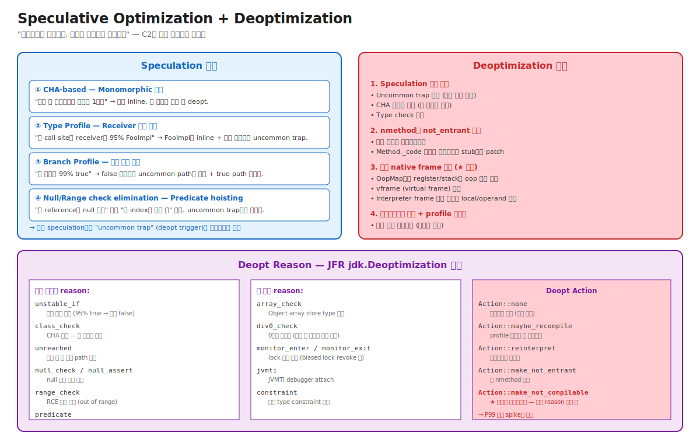

# 03-08. Speculative Optimization + Deoptimization

> C2의 모든 공격적 최적화는 **speculation (가정)** 위에 세워진다. CHA로 monomorphic 가정, type profile로 receiver 가정, branch profile로 분기 가정, RCE로 range 가정.
> 가정이 **항상 맞다고 보장 못 함**. 안전판이 **Deoptimization** — 가정 깨지면 native code 폐기 + 인터프리터 복귀 + 재컴파일.
> 시니어가 알아야 할 것: P99 spike의 가장 흔한 원인이 deopt다. JFR `jdk.Deoptimization` 이벤트의 `reason`을 읽고 코드 어디서 가정이 깨지는지 짚어낼 수 있어야 한다.

---

## 🗺️ JVM 아키텍처 안에서 이 챕터의 위치

03-execution-engine 챕터의 **종합** — 앞선 sub-chapter들의 speculation이 모두 deopt로 안전판화됨.



---

## 📍 학습 목표

1. **Speculation의 4종** — CHA, Type Profile, Branch Profile, Null/Range check.
2. **Uncommon Trap** — speculation 깨지면 진입하는 deopt trigger 코드.
3. **Deopt의 4단계** — 위반 감지 → not_entrant → native frame 변환 → 인터프리터 재개.
4. **vframe 변환** — native frame의 register/stack을 interpreter frame slot으로 매핑하는 메커니즘.
5. **Deopt reason 종류** — unstable_if, class_check, unreached, null_check, range_check 등.
6. **Deopt action** — none, maybe_recompile, reinterpret, make_not_entrant, **make_not_compilable** (영구).
7. **반복 deopt → make_not_compilable** 의 위험 — P99 영구 spike의 근본 원인.
8. **OSR과 Deopt의 차이** — OSR은 interpreter → native, Deopt는 native → interpreter (역방향).
9. JFR + `-XX:+UnlockDiagnosticVMOptions -XX:+TraceDeoptimization` 으로 deopt 분석.
10. 운영 시나리오: P99 burst → deopt 폭주 / 코드 변경 후 deopt 새로 발생 / hot reload 후 deopt 폭증.

---

## 🎨 1단계: 백지 그리기 가이드

### Step 1: Speculation + Uncommon Trap 페어

```
[C2 컴파일된 코드의 분기]
   if (a.klass == FooImpl) {     ← speculation (CHA: monomorphic 가정)
       jump inlined_FooImpl_body
   } else {
       jump uncommon_trap          ← deopt trigger
   }
```

### Step 2: Deopt 흐름 4단계

```
1. Speculation 위반 감지 (uncommon trap 도달 등)
        │
        ▼
2. 영향받는 nmethod에 not_entrant 표시
        │
        ▼
3. 현재 native frame을 interpreter frame으로 변환
   (OopMap → vframe → interpreter frame)
        │
        ▼
4. 인터프리터로 재개 + profile 재수집
```

### Step 3: Reason + Action 표

```
Reason                  | Action               | 결과
─────────────────────  | ────────────────────  | ─────────────────────
unstable_if            | maybe_recompile      | profile 재수집 후 재컴파일
class_check            | make_not_entrant     | 옛 nmethod 폐기
unreached (반복 N번)   | make_not_compilable  | 영원히 인터프리터 ★
```

### 정답 그림

위의 [08-speculative-and-deopt.svg](./_excalidraw/08-speculative-and-deopt.svg) 참조.

---

## 🧠 2단계: 직관

### 핵심 비유

> **시험 답안지 비유**:
> - **Speculation** = "이 문제는 항상 A가 답"이라 외워두고 채점 시간 절약.
> - **Uncommon trap** = "혹시 B나 C가 나오면 정식 풀이로" 안전판.
> - **Deopt** = B/C가 나옴 → 외운 답 폐기 + 처음부터 정식 풀이 (인터프리터 복귀).
> - **make_not_compilable** = "이 문제는 답이 너무 자주 바뀌니까 외우지 말고 영원히 정식 풀이로" → 영원히 느림.

### 정확한 정의 (비유와 분리)

| 용어 | 정의 |
|---|---|
| **Speculation** | "이 조건이 거의 항상 참"이라는 가정으로 공격적 최적화 수행. 가정 깨질 때를 위한 안전판 함께. |
| **Uncommon Trap** | Speculation의 안전판 코드. 가정 깨지면 이리 진입 → deopt 트리거. |
| **Deoptimization** | Native code 폐기 + 인터프리터 복귀. Native frame을 interpreter frame으로 변환. |
| **vframe (virtual frame)** | Deopt 시 native frame의 정보를 추상화한 표현. 어느 메서드의 어느 bytecode index인지 + local/operand 값. |
| **OopMap** | Native code의 각 safepoint에서 register/stack의 어느 slot이 oop (object reference)인지 매핑. GC와 Deopt 둘 다 사용. |
| **Deopt Reason** | Deopt의 원인. `unstable_if`, `class_check`, `unreached`, `null_check`, `range_check` 등. |
| **Deopt Action** | Deopt 후 행동 결정. `none`(재시도), `maybe_recompile`, `reinterpret`, `make_not_entrant`, `make_not_compilable` (영구 비활성). |
| **make_not_compilable** | 같은 메서드 + 같은 reason으로 반복 deopt 시 발동. 영원히 인터프리터로만 실행. P99 영구 spike의 원인. |
| **Profile-guided speculation** | MDO에 수집된 통계 (95% true, 5% false 등)를 기반으로 한 speculation. |

### 왜 speculation이 필수인가 — Java의 동적 dispatch 비용

```
[Speculation 없으면]
모든 메서드 호출:
  - vtable lookup (1 indirect load)
  - indirect call (branch predictor 못 맞춤)
  - 매번 type check, null check, range check
  → 단순 dispatch에 ~20 cycles

[Speculation 있으면 (monomorphic 가정)]
호출:
  - klass check 1번
  - 직접 jump
  - 추가로 inline → cross-method 최적화
  → ~3 cycles + 큰 후속 이득
```

→ Speculation 없으면 Java가 인터프리티드 언어 수준. Speculation + Deopt가 Java의 peak 성능 핵심.

### 왜 Deopt가 "안전판"이라 불리나

```
Speculation 한 번 깨졌을 때:
  - 깨진 곳 어느 native frame이든 안전하게 인터프리터로 전이.
  - 사용자 코드 결과는 정확 (gradient 없음).
  - 단지 그 호출 한 번이 느림.
  - 시간 지나 재컴파일 → 다시 빨라짐.

→ "최악의 경우에도 정확성 보장 + 임시 성능 저하"
→ 그래서 C2가 매우 공격적인 speculation 가능
```

### make_not_compilable의 위험

```
시나리오:
  메서드 M에 대해 C2 컴파일 → speculation X → 깨짐 → deopt → 재컴파일
                                              → speculation X' → 깨짐 → deopt → ...
                                              
N번 (기본 4번) 반복 후:
  Action::make_not_compilable
  → M은 영원히 인터프리터
  → 그 메서드를 거치는 모든 traffic이 5~10× 느림

운영자 관점:
  - 같은 메서드의 deopt가 자주 보이면 즉시 조사.
  - 코드 audit 또는 -XX:CompileCommand=exclude로 임시 회피.
  - 근본 원인: speculation이 신뢰성 없는 코드 패턴.
```

---

## 🔬 3단계: 구조

### Speculation 4종 자세히

#### 1. CHA-based (Class Hierarchy Analysis)

```java
interface Foo { void method(); }
class FooImpl implements Foo { void method() { ... } }

// 호출 사이트
foo.method();
```

- C2가 CHA로 "현재 Foo의 구현체 1개" 확인 → monomorphic 가정 → FooImpl.method를 inline.
- 새 구현체 `BarImpl`이 ClassLoader.defineClass로 로드되면 CHA 위반 → 영향 nmethod들 deopt.

#### 2. Type Profile

```java
void process(Object obj) {
    String s = (String) obj;
    use(s);
}
```

- MDO에 호출 사이트의 type 히스토그램: 95% String, 5% StringBuilder.
- C2가 "95% String"으로 speculation → String inline + uncommon trap 안전판.
- 5% StringBuilder 케이스 도달 시 deopt.

#### 3. Branch Profile

```java
void check(int x) {
    if (x > 0) {   // 99% true (profile)
        normalPath(x);
    } else {
        errorPath();
    }
}
```

- C2가 "99% true" 보고 errorPath를 uncommon path로.
- false 케이스 도달 시 deopt (또는 uncommon path 그대로 실행 후 트리거).

#### 4. Null check / Range check

```java
for (int i = 0; i < n; i++) {
    sum += arr[i];   // n <= arr.length 가정 (RCE)
}
```

- C2가 loop 시작 전 `n <= arr.length` predicate hoisting.
- Predicate 실패 (가정 깨짐) 시 uncommon trap → deopt.

### Uncommon Trap의 native code 위치

```
[C2 컴파일된 함수의 모습]

normal_path_code:
   ; 자주 실행되는 hot path
   ...
   jmp end

uncommon_path:
   ; 거의 안 실행되는 cold path (uncommon trap 또는 정상 처리)
   call deoptimize_handler   ; deopt trigger
   ; 이 stub이 호출되면 deopt 진행
```

Uncommon trap은 nmethod 내부에 작은 stub. 호출되면 deopt 진행.

### Deopt의 vframe 변환

Native frame → Interpreter frame 변환은 단순한 stack pop이 아님:

```
[Native frame의 정보]
- 현재 PC (native instruction pointer)
- Register 값들 (rax, rbx, ..., r15)
- Stack slot 값들

[변환에 필요한 정보]
1. OopMap: 어느 register/stack slot이 oop인지 — GC가 안전하게 처리
2. ScopeDesc: 그 native PC가 어느 메서드의 어느 bytecode index인지
3. Local variable / operand stack 값의 위치: register 또는 stack slot 어디인지

[변환 과정]
1. Native frame의 PC를 ScopeDesc로 해석 → "메서드 M의 bytecode index 42"
2. ScopeDesc가 알려주는 위치들에서 local/operand 값 추출
3. Interpreter frame 새로 만들기 (max_locals + max_stack 크기)
4. 추출한 값들을 interpreter slot에 복원
5. PC를 bytecode index 42로 설정 → 인터프리터 재개
```

→ 매우 복잡한 작업. ScopeDesc 정보는 C2가 컴파일 시 매 safepoint마다 기록.

### Inlined 메서드의 deopt — Nested vframe

```
[Caller가 callee를 inline해서 한 nmethod로 컴파일]

caller_method() {
    callee_method() {   // ← inline됨
        deopt 트리거    // 여기서 deopt
    }
}

[Deopt 결과]
- 한 native frame → 두 interpreter frame
  - Caller의 interpreter frame
  - Callee의 interpreter frame
- Stack에 두 frame이 push됨
- 깊이 N 만큼 inline됐으면 N개 frame 생성 가능
```

운영 의미: 깊은 inline 후 deopt = 매우 비싼 작업. Deopt 비용이 단순 "느려짐" 이상.

### Deopt Action 결정

```
make_not_entrant: 옛 nmethod 즉시 폐기. 다음 호출은 인터프리터.
maybe_recompile: 일정 시간 후 profile 재수집 후 재컴파일.
reinterpret: 한동안 인터프리터로만, 그 후 재시도.
make_not_compilable: ★ 영원히 컴파일 안 함.

결정 알고리즘:
  - 같은 메서드 + 같은 reason의 deopt 횟수 카운트.
  - N번 (기본 4) 도달 → make_not_compilable.
  - 메서드 별 별도 카운트.
```

### OSR vs Deopt 비교

| | OSR | Deopt |
|---|---|---|
| 방향 | Interpreter → Native | Native → Interpreter |
| 트리거 | Loop back-edge counter | Speculation 위반 |
| Frame 변환 | Interpreter frame → Native frame | Native frame → Interpreter frame |
| 빈도 | 긴 loop 진입 시 1회 | 가정 깨질 때마다 |
| 성능 영향 | 가속 (slow → fast) | 감속 (fast → slow) |

→ 두 메커니즘 모두 **stack 위의 frame을 변환**하는 정교한 작업. HotSpot의 정수.

---

## 🧬 4단계: 내부 구현 — HotSpot

### Deoptimization 진입점

위치: `src/hotspot/share/runtime/deoptimization.cpp`

```cpp
JRT_ENTRY(void, Deoptimization::uncommon_trap(JavaThread* thread,
                                              jint trap_request)) {
    // 1. 어떤 nmethod의 어떤 trap인지 식별
    DeoptReason reason = trap_request_reason(trap_request);
    DeoptAction action = trap_request_action(trap_request);
    
    // 2. nmethod의 frame 정보 수집
    nmethod* nm = ...;
    frame caller_frame = ...;
    
    // 3. vframe 추출
    vframeArray* vfa = create_vframeArray(...);
    
    // 4. Action 처리
    if (action == Action::make_not_entrant) {
        nm->make_not_entrant();
    } else if (action == Action::make_not_compilable) {
        method->set_not_compilable(reason);
    }
    
    // 5. Interpreter frame 설치
    install_interpreter_frames(thread, vfa);
    
    // 6. 인터프리터 entry로 jump
}
JRT_END
```

### ScopeDesc — Bytecode position 매핑

위치: `src/hotspot/share/code/scopeDesc.hpp`

```cpp
class ScopeDesc {
private:
    int _decode_offset;     // nmethod 안의 metadata offset
    Method* _method;
    int _bci;               // bytecode index
    bool _reexecute;        // 다시 실행할지 (uncommon trap)
    
    // Local variable, operand stack의 위치 정보
    GrowableArray<ScopeValue*>* _locals;
    GrowableArray<ScopeValue*>* _expressions;
};
```

각 safepoint마다 ScopeDesc 1개. nmethod의 metadata에 저장.

### vframeArray — Native → Interpreter 변환 결과

위치: `src/hotspot/share/runtime/vframeArray.hpp`

```cpp
class vframeArray : public CHeapObj<mtCompiler> {
    int _frames;                    // inline 깊이
    vframeArrayElement _elements[]; // 각 inline level의 정보
};

class vframeArrayElement {
    Method* _method;
    int _bci;
    StackValueCollection* _locals;
    StackValueCollection* _expressions;
};
```

### Deopt Action 결정

위치: `src/hotspot/share/runtime/deoptimization.cpp`

```cpp
void Deoptimization::process_deoptimization(...) {
    // 1. 같은 메서드 + reason 카운트 증가
    method_data->update_trap_count(reason);
    
    // 2. PerMethodTrapLimit (기본 100) 초과?
    if (method_data->trap_count(reason) > PerMethodTrapLimit) {
        action = Action::make_not_compilable;
    }
    
    // 3. PerBytecodeTrapLimit (기본 4) 초과?
    if (method_data->trap_count_at_bci(bci, reason) > PerBytecodeTrapLimit) {
        action = Action::reinterpret;
    }
    
    // ...
}
```

옵션:
- `-XX:PerMethodTrapLimit=N` (기본 100) — 메서드별 trap 한계.
- `-XX:PerBytecodeTrapLimit=N` (기본 4) — bytecode 위치별 trap 한계.

---

## 📜 5단계: 역사

| 연도 | 변화 | 의의 |
|---|---|---|
| 1991 | Self language — first deopt | Speculation + deopt의 원조 |
| 1999 | HotSpot 1.0 — C2 deopt | Java에 도입 |
| 2008 | JDK 6 — uncommon trap 정교화 | reason 분류 |
| 2014 | JDK 8 — Tiered + 다양한 speculation | C1에서 C2로 deopt 흐름 |
| 2020 | JDK 14 — Helpful NullPointerException | null_check deopt 정보 개선 |
| 2023 | JDK 21 — deopt 정보 더 풍부 | 디버깅 개선 |

### Self — Speculation의 원조

David Ungar의 Self (1991):
- 동적 type 언어인데 정적 type처럼 빠르게.
- Polymorphic Inline Cache + Type-aware compilation + Deopt.
- HotSpot이 이 기법을 Java에 적용.

---

## ⚖️ 6단계: 트레이드오프

### Speculation 적극도

| 적극적 (기본) | 보수적 |
|---|---|
| ✅ Peak 성능 ↑ | ❌ Peak 성능 ↓ |
| ❌ Deopt 가능성 ↑ | ✅ Deopt 거의 없음 |
| ❌ Deopt 시 P99 spike | ✅ 안정적 latency |
| 사용 케이스: 일반 서비스 | 사용 케이스: latency-critical (HFT 등) |

### 옵션 튜닝 (거의 안 함)

- `-XX:-UseCHA` — CHA 비활성. Speculation 큰 폭 감소. Peak ↓.
- `-XX:PerMethodTrapLimit=N` — trap 한계 (기본 100).
- `-XX:-Inline` — inlining 전체 비활성 (재현용).

→ 99% 기본값. 측정 없이 변경 금물.

---

## 📊 7단계: 측정·진단

### JFR `jdk.Deoptimization` 이벤트

```bash
jcmd <pid> JFR.start name=deopt duration=300s settings=profile filename=deopt.jfr
jfr print --events jdk.Deoptimization deopt.jfr | head -30
```

각 이벤트의 필드:
- `compileId` — 어느 nmethod
- `method` — 어느 메서드
- `bci` — bytecode index
- `reason` — unstable_if 등
- `action` — make_not_entrant 등

### `-XX:+TraceDeoptimization`

```bash
java -XX:+UnlockDiagnosticVMOptions -XX:+TraceDeoptimization -jar app.jar
```

상세 deopt 로그 — 운영에서는 verbose라 제한적 사용.

### `-XX:+PrintCompilation` 의 `made not entrant`

```
2100    5       4 made not entrant   MyApp::hotMethod (50 bytes)
2105    6       4               MyApp::hotMethod (50 bytes)   ← 즉시 재컴파일
```

- `made not entrant` 메시지 = 옛 nmethod 폐기.
- 그 직후 새 컴파일 시도.
- 같은 메서드의 not_entrant 빈도 ↑ = 반복 deopt 의심.

### 운영 시나리오 진단 매트릭스

| 증상 | 진단 | 가능 원인 |
|---|---|---|
| P99 spike, 단발 | JFR deopt burst | speculation 깨짐 (정상 복구) |
| P99 영구 ↑ | `make_not_compilable` 메서드 | 반복 deopt 한계 도달 |
| 특정 메서드 영원히 느림 | `-XX:+PrintCompilation` 에서 컴파일 없음 | not_compilable |
| Hot reload 후 deopt 폭주 | JFR reason: class_check | CHA 위반 |
| Stream API 코드 deopt | reason: unstable_if 또는 class_check | type pollution |

### 시나리오 1: P99 영구 spike — make_not_compilable

```
환경: Spring 앱, 어느 시점부터 특정 endpoint P99 영구 200ms (정상 30ms)
증상: 평소 빠르던 메서드가 5× 느려진 채로 회복 안 됨

진단:
$ -XX:+PrintCompilation 로그 검색
"PaymentService::process made not compilable: too many deopts"   ← ★

$ JFR jdk.Deoptimization 시간순:
2024-01-15 10:00:01  reason=class_check  count=1
2024-01-15 10:00:02  reason=class_check  count=2
2024-01-15 10:00:03  reason=class_check  count=3
2024-01-15 10:00:04  reason=class_check  count=4 → make_not_compilable

원인: 어느 dynamic class loading이 CHA 의존성을 자주 깸 (Spring AOP proxy 등)

조치:
1. 코드 audit: dynamic proxy 사용량 ↓
2. -XX:PerMethodTrapLimit=200 (한계 ↑, 더 인내)
3. JVM 재시작 — make_not_compilable 카운터 초기화
4. 근본: 안정적 코드 패턴 (sealed interface, 명시 분기)
```

### 시나리오 2: 단발 P99 spike — 정상 deopt

```
환경: 정상 운영 중 5분에 1번씩 P99 spike
증상: 평소 50ms, spike 시 500ms, 단발

진단:
JFR jdk.Deoptimization:
   spike 시점에 burst (10~50 deopt)
   reason: unstable_if 다양
   action: maybe_recompile

원인: 정상 speculation 깨짐. 시간 지나 재컴파일하면서 일시적 느림.

조치: 
- 보통은 정상 동작. 무시 가능.
- 빈도 ↑ 시: 코드 audit (branch instability).
- Latency-critical이면: warmup 시간 ↑ 또는 sealed interface로 안정화.
```

---

## ⚔️ 8단계: 꼬리질문 트리

### Q1. Deopt가 무엇이고 왜 필요한가요?

> C2의 speculation 가정이 깨졌을 때 native code 폐기 + 인터프리터 복귀.
> 
> 필요 이유: C2는 매우 공격적으로 speculation. 가정 깨질 가능성 항상 있음. Deopt가 없으면 잘못된 native code 실행 → 정확성 위반.
> 
> Deopt가 안전판이라 C2가 적극적으로 가정 가능 → peak 성능.

### Q2. Native frame을 interpreter frame으로 어떻게 변환하나요?

> 핵심: **vframe + ScopeDesc + OopMap**.
> 
> 1. ScopeDesc로 현재 native PC가 어느 메서드의 어느 bytecode index인지 파악.
> 2. OopMap으로 register/stack의 어느 slot이 oop인지 식별.
> 3. ScopeDesc의 local/expression value 위치 정보로 값 추출.
> 4. Interpreter frame 새로 만들고 local/operand stack에 복원.
> 5. PC를 bytecode index로 설정 후 인터프리터 재개.
> 
> Inlined 메서드 안에서 deopt 시 inline 깊이만큼 interpreter frame 여러 개 생성.

### Q3. Deopt reason 주요 5가지를 알려주세요.

> 1. **unstable_if** — branch profile 가정 깨짐 (95% true → 자주 false).
> 2. **class_check** — CHA 위반 (새 구현체 등장).
> 3. **unreached** — 도달 안 함 표시 path 도달.
> 4. **null_check** — null 아님 가정 깨짐.
> 5. **range_check** — RCE 가정 깨짐 (out of bounds).
> 
> JFR `jdk.Deoptimization` 이벤트의 `reason` 필드.

### Q4. make_not_compilable이 무엇이고 운영에서 왜 위험한가요?

> 같은 메서드 + 같은 reason으로 반복 deopt 시 발동 (기본 4번).
> 효과: **영원히 인터프리터로만 실행**. 재컴파일 시도 안 함.
> 
> 결과: 그 메서드의 모든 호출이 5~10× 느림 → P99 영구 spike.
> 
> 회복: JVM 재시작 (카운터 초기화).
> 
> 근본 원인: 코드 패턴이 speculation 신뢰성 없음 — dynamic proxy 빈번, type pollution 등.

### Q5. OSR과 Deopt의 차이는?

> 둘 다 **stack 위에서 frame을 변환**하는 정교한 메커니즘. 방향이 반대:
> 
> - **OSR**: Interpreter → Native. Long loop의 hot 진입.
> - **Deopt**: Native → Interpreter. Speculation 위반.
> 
> 공통: ScopeDesc / OopMap 사용. Local/operand stack 값 보존.

### Q6. (Killer) 운영 중 어느 endpoint의 P99가 갑자기 영구히 5× 증가했습니다. 어떻게 진단하시겠어요?

> 1. **Compilation 상태 확인**:
>    ```
>    -XX:+PrintCompilation 로그 grep 그 메서드
>    "made not compilable" 메시지 찾기
>    ```
>    있다면 → make_not_compilable 발동.
> 
> 2. **Deopt history**:
>    ```
>    JFR jdk.Deoptimization 이벤트 그 메서드 검색
>    reason 분포 + 시간순 추세
>    ```
> 
> 3. **원인 분류**:
>    - class_check 다수 → 새 구현체 dynamic load.
>    - unstable_if 다수 → branch profile 부정확.
>    - null_check 다수 → null 분포 변화.
> 
> 4. **단기 조치**:
>    - JVM 재시작 (make_not_compilable 초기화).
>    - `-XX:PerMethodTrapLimit=200` (한계 ↑).
> 
> 5. **장기 조치**:
>    - 코드 audit (dynamic proxy 줄이기, sealed interface, branch stability).
>    - 부하 환경 변화 추적 (입력 type 분포 변화).

#### 🪝 Q6-1: 그럼 deopt 자체를 모니터링 지표로 두려면?

> Prometheus + JMX 또는 JFR streaming:
> - `jvm.deoptimization.count` — 누적 deopt 수.
> - 분당 deopt rate 추세.
> - 알람: 분당 100+ deopt 또는 같은 메서드 분당 10+ deopt.
> 
> JFR continuous recording — 24/7 deopt 이벤트 수집 후 사후 분석.

---

## 🔗 다음 단계

03-execution-engine 챕터 종료. 다음 챕터로:
- → [Chapter 04. GC](../04-gc/): Memory management
- → [Chapter 05. Threading](../05-threading/): JMM, Memory Barriers
- → [Chapter 07. HotSpot Internals](../07-hotspot-internals/): C2 phase 풀버전 + Sea-of-Nodes 노드들

## 📚 참고

- **HotSpot src `deoptimization.cpp`**: https://github.com/openjdk/jdk/blob/master/src/hotspot/share/runtime/deoptimization.cpp
- **HotSpot src `vframeArray.hpp`**: https://github.com/openjdk/jdk/blob/master/src/hotspot/share/runtime/vframeArray.hpp
- **HotSpot src `scopeDesc.hpp`**: https://github.com/openjdk/jdk/blob/master/src/hotspot/share/code/scopeDesc.hpp
- **Hölzle, Chambers, Ungar — Type Inference / Deopt 논문 (1992)**: Self language
- **Aleksey Shipilëv — Deopt anatomy**: https://shipilev.net/jvm/anatomy-quarks/
