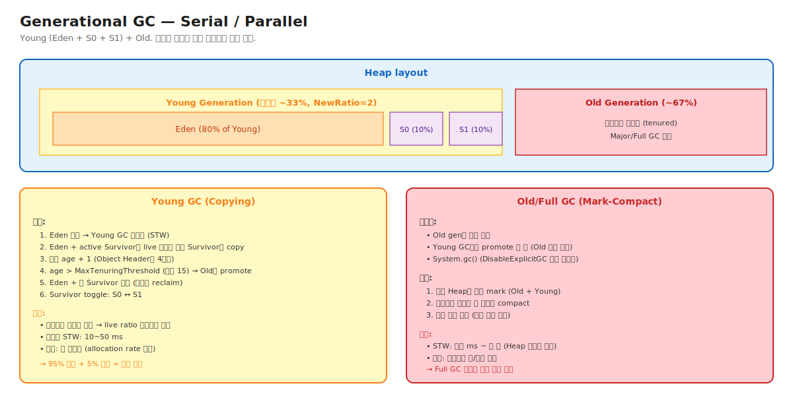

# 04-02. Generational GC + Serial / Parallel

> Java GC의 첫 30년 (1996-2017)의 표준. **Young/Old 분리** + **Copying + Mark-Compact 조합**.
> Serial은 single-thread, Parallel은 multi-thread. CMS/G1/ZGC가 이 위에 쌓아 올라간 기반.
> 시니어가 알아야 할 것: 최신 GC를 이해하려면 이 기본을 백지에서 그릴 수 있어야 한다. Young GC가 빠른 이유, Full GC가 비싼 이유 모두 여기서 출발.

---

## 🗺️ JVM 아키텍처 안에서 이 챕터의 위치



---

## 📍 학습 목표

1. **Weak Generational Hypothesis** + 실측 데이터 (80~98% 객체 일찍 죽음).
2. **Eden + Survivor 0/1 비율** (8:1:1 기본) 의 이유.
3. **Tenuring** — age 카운터 + MaxTenuringThreshold + 동적 조정.
4. **Serial GC** — 1996 origin, 작은 Heap + 단일 코어 적합.
5. **Parallel GC** — 멀티스레드 활용 + Throughput 우선.
6. **Survivor toggle** — S0/S1 ping-pong 메커니즘.
7. **Promotion failure** — Old 공간 부족 시 Full GC 트리거.
8. **`-XX:+UseSerialGC`, `-XX:+UseParallelGC`** 옵션과 default GC 변천.
9. **NewRatio, SurvivorRatio, MaxTenuringThreshold** 의미와 동적 조정.
10. 운영 시나리오: Full GC 빈발 / Survivor 부족 / Container 환경 적합 GC 선택.

---

## 🎨 1단계: 백지 그리기 가이드

### Step 1: Heap 4분할

```
Young (33%)         |  Old (67%)
[Eden 80%][S0 10%][S1 10%]  |  [Tenured]
```

### Step 2: Young GC (Copying)

```
GC 전:
Eden:  [a][b][c][d][e][f]   ← 가득
S0:    [x]                   ← 이전 GC에서 살아남음
S1:    (empty)
Old:   [...]

GC 후 (a,c,x 만 live):
Eden:  (empty)               ← 통째로 비움
S0:    (empty)
S1:    [a][c][x]             ← 복사됨, age + 1
Old:   [...]

다음 GC: S0 ↔ S1 toggle. 또는 age > threshold면 Old로 promote.
```

### 정답 그림

위의 [02-generational.svg](./_excalidraw/02-generational.svg) 참조.

---

## 🧠 2단계: 직관

### 핵심 비유

> **호텔 비유** (재방문):
> - **Eden** = 로비. 신규 투숙객. 회전율 매우 높음.
> - **Survivor** = 임시 객실. 며칠 더 머물 사람. 정기 청소 (Young GC).
> - **Tenured** = 장기 투숙. 충분히 오래 머문 사람. 청소 드물지만 큰 일.
> - **Tenuring Threshold** = "이만큼 머물면 장기 투숙으로 분류" 기준.

### 정확한 정의 (비유와 분리)

| 용어 | 정의 |
|---|---|
| **Generational GC** | Heap을 Young + Old로 나누고 각 영역을 다른 알고리즘으로 처리. Weak Generational Hypothesis 활용. |
| **Eden** | 신규 객체 할당 영역. Young의 80% 기본. TLAB이 여기 위치 (Chapter 02-01). |
| **Survivor (S0, S1)** | Young GC에서 살아남은 객체 임시 보관. ping-pong 방식. 각 Young의 10%. |
| **Tenuring** | 객체를 Young에서 Old로 promote. age 기반 또는 Survivor 공간 부족 시. |
| **MaxTenuringThreshold** | 객체가 Young에서 살아남을 수 있는 최대 GC cycle 수. 기본 15 (4비트 max). |
| **NewRatio** | Old:Young 비율. 기본 2 (Young은 전체의 1/3). |
| **SurvivorRatio** | Eden:Survivor 비율. 기본 8 (Eden 80%, S0/S1 각 10%). |
| **Promotion Failure** | Young GC가 살아남은 객체를 Old로 보내야 하는데 Old 공간 부족. Full GC 트리거. |
| **Serial GC** | Single-thread Mark-Compact (Old) + Copying (Young). JDK 1.0. |
| **Parallel GC** | Multi-thread 버전. JDK 1.4+. Throughput 우선. |

### Weak Generational Hypothesis 실측

```
일반 Java 앱의 객체 수명 분포 (대략):
   1세대 후 죽음: 80~90%
   2세대 후 죽음: 5~10%
   3세대 이상 살아남음: 5~10% (→ Old로 promote)

→ Young GC가 95% 메모리를 복사 안 하고 통째로 reclaim 가능
→ Old는 살아있는 객체 비율 높음 → Copying 비효율 → Mark-Compact 사용
```

### 왜 Survivor가 2개 (S0, S1)인가

Copying 알고리즘이 두 영역 필요:
- 한 영역(source)에서 다른 영역(target)으로 복사.
- 다음 GC에서 source/target toggle.

```
GC 1: Eden + S0(active) → S1
GC 2: Eden + S1(active) → S0
GC 3: Eden + S0(active) → S1
...
```

Eden은 항상 source. Survivor는 ping-pong.

---

## 🔬 3단계: 구조

### Young GC 흐름 (Copying)

```
1. STW 시작
2. GC Roots scan (모든 thread stack + static + JNI ...)
3. Card Table 스캔 (Old → Young 참조 추가)
4. Reachable Young 객체들을 inactive Survivor로 copy
   - age + 1
   - age > MaxTenuringThreshold 또는 Survivor 부족 시 Old로
5. Copy 끝나면:
   - Eden 통째 비움
   - 옛 active Survivor 통째 비움
   - 새 active Survivor = 방금 copy받은 곳
6. STW 끝
```

### Tenuring 동적 조정

```
정적: age > MaxTenuringThreshold (15) → promote

동적 (실제):
   각 GC 후 Survivor 사용량 측정
   if (Survivor 차서 OK):
       MaxTenuringThreshold 유지 또는 ↑
   if (Survivor 거의 가득):
       MaxTenuringThreshold ↓ (더 빨리 promote)

→ JVM이 적절한 threshold를 자동 찾음
→ 옵션 명시 거의 안 함
```

### Old GC (Full GC, Mark-Compact)

```
트리거:
   1. Old 사용량 임계 도달
   2. Promotion failure (Young GC가 Old로 옮기지 못함)
   3. Metaspace 압박
   4. System.gc() (강제)

흐름:
   1. STW 시작
   2. 전체 Heap mark
   3. Compact (살아있는 객체 한 쪽으로)
   4. 모든 참조 주소 갱신
   5. STW 끝

비용: Heap 크기에 비례 (수백 ms ~ 수 초)
```

### Serial GC

```
모든 phase가 single-thread:
   - Mark: 1 thread
   - Copy: 1 thread
   - Compact: 1 thread

장점: 단순, 메모리 footprint 작음, no thread overhead
단점: 멀티코어 활용 못 함

적합:
   - 작은 Heap (<512MB)
   - 단일 코어 환경
   - 개발/테스트
   - 컨테이너 매우 제한적 (1 CPU)

옵션: -XX:+UseSerialGC
```

### Parallel GC

```
Young GC: 멀티스레드 copy
   - n threads (기본 자동)
   - 각 thread가 GC Roots 일부 + reachable 객체 일부 처리
   - 작업 분배: work-stealing

Old GC: 멀티스레드 Mark-Compact (Parallel Old)
   - 같은 방식

장점: 멀티코어 충분히 활용 → throughput 높음
단점: STW 그대로 (단지 짧아짐)

적합:
   - Throughput 최우선 (batch, analytics)
   - Latency 신경 안 씀
   - JDK 8까지 기본 GC (-server)

옵션: -XX:+UseParallelGC (+ -XX:+UseParallelOldGC, JDK 14+에서 통합)
```

### 옵션 매트릭스

| 옵션 | Young | Old | Threading |
|---|---|---|---|
| `-XX:+UseSerialGC` | Serial Copying | Serial Mark-Compact | Single |
| `-XX:+UseParallelGC` | Parallel Scavenge | Parallel Old | Multi |
| `-XX:+UseG1GC` | G1 Young | G1 Mixed/Full | Multi |
| `-XX:+UseZGC` | ZGC | ZGC | Multi + Concurrent |

---

## 🧬 4단계: 내부 구현 — HotSpot

### Serial Heap 구조

위치: `src/hotspot/share/gc/serial/serialHeap.hpp`

```cpp
class SerialHeap : public CollectedHeap {
    DefNewGeneration*    _young_gen;    // Eden + Survivor
    TenuredGeneration*   _old_gen;       // Old
    GenerationSpec*      _gen_spec[2];
    
    void do_collection(...) override {
        if (young_only_collection) {
            _young_gen->collect(...);     // Copying
        } else {
            _old_gen->collect(...);        // Mark-Compact
        }
    }
};
```

### Copy 알고리즘 (Cheney's algorithm)

```cpp
void DefNewGeneration::copy_to_survivor_space(oop obj) {
    // 살아있는 객체를 Survivor로 복사
    size_t size = obj->size();
    HeapWord* new_addr = to_space->allocate(size);
    
    // memcpy
    Copy::aligned_disjoint_words(obj, new_addr, size);
    
    // forwarding pointer 설치 (옛 주소가 새 주소를 가리킴)
    obj->set_forwardee(new_addr);
    
    // age 증가
    new_addr->incr_age();
    
    // age > threshold면 Old로 promote
    if (new_addr->age() > MaxTenuringThreshold) {
        promote_to_old(new_addr);
    }
}
```

### Promotion Failure 처리

```cpp
oop DefNewGeneration::copy_to_survivor_space(oop obj) {
    HeapWord* new_addr = to_space->allocate(size);
    if (new_addr == NULL) {
        // Survivor 가득 → Old로 시도
        new_addr = _old_gen->allocate(size);
        if (new_addr == NULL) {
            // Old도 가득 → Full GC 트리거
            handle_promotion_failure();
        }
    }
    // ...
}
```

---

## 📜 5단계: 역사

| 연도 | 변화 | 의의 |
|---|---|---|
| 1996 | JDK 1.0 — Serial GC | 최초 |
| 2002 | JDK 1.4 — Parallel GC | 멀티코어 |
| 2007 | JDK 6 — Parallel Old | Full GC도 병렬 |
| 2009 | JDK 7 — G1 실험 | 차세대 |
| 2017 | JDK 9 — G1 기본 | Parallel 대체 (기본 GC 변경) |

JDK 9 이전까지 Parallel GC가 사실상의 default. JDK 9+부터 G1이 default — Parallel은 batch 워크로드 전용.

---

## ⚖️ 6단계: 트레이드오프

### Serial vs Parallel

| | Serial | Parallel |
|---|---|---|
| Throughput | 낮음 | 높음 |
| Footprint | 작음 | 큼 (GC threads) |
| STW | 길음 | 짧음 |
| 적합 Heap | <512MB | 1GB ~ 수십GB |
| 적합 CPU | 1 코어 | 멀티코어 |
| Latency | 부적합 | 부적합 |

→ Latency-critical은 G1+ 권장.

### 옵션 튜닝

```
-XX:NewRatio=2          # Old:Young = 2:1 (Young은 1/3)
-XX:SurvivorRatio=8     # Eden:S0:S1 = 8:1:1
-XX:MaxTenuringThreshold=15  # age 한계 (4비트 max)
-XX:ParallelGCThreads=N      # Parallel GC thread 수
```

99% 기본값. 운영 변경 시 측정 필수.

---

## 📊 7단계: 측정·진단

### GC log 분석

```bash
java -Xlog:gc*=info -jar app.jar
```

출력 예시:
```
[gc] GC(0) Pause Young (G1 Evacuation Pause) 100M->20M(256M) 50.123ms
[gc] GC(1) Pause Full (G1 Compaction Pause) 200M->50M(256M) 1500.456ms
```

판독:
- `100M->20M(256M)` — GC 전 → 후 (Heap 총 크기).
- `50ms` — STW 시간.
- `Pause Full`이 자주 나오면 운영 사고.

### `jstat -gc` 실시간

```bash
jstat -gc <pid> 1s
```

각 영역의 capacity / used + GC 횟수 + 누적 시간.

### 시나리오: Full GC 빈발

```
환경: Parallel GC, Heap 4GB
증상: 분당 Full GC 5회 (정상 0~1회)

진단:
1. GC log 확인 → "Allocation Failure" cause
2. Heap dump 분석 → Old gen에 cache 객체 누적
3. -XX:+PrintTenuringDistribution → MaxTenuringThreshold 자주 낮아짐

원인: Premature promotion — Young 작아서 객체가 Old로 빨리 감

조치:
- -Xmn 또는 NewRatio 조정 (Young ↑)
- 또는 G1으로 마이그레이션 (예측 가능한 STW)
```

---

## ⚔️ 8단계: 꼬리질문 트리

### Q1. Young GC가 빠른 이유는?

> Live ratio 차이.
> Young: ~5% 살아있음 → Copying이 매우 효율 (95% 통째 reclaim).
> 옛 GC들의 Copying이 Young에 적합한 이유.

### Q2. Survivor 영역이 왜 2개인가?

> Copying 알고리즘이 두 영역 필요. Source → Target 복사 후 toggle.
> Eden은 항상 source. S0/S1 ping-pong.

### Q3. Tenuring threshold 동적 조정이 무엇인가요?

> JVM이 매 GC 후 Survivor 사용량 측정해 MaxTenuringThreshold 동적 조정.
> Survivor 가득 → threshold ↓ (빨리 promote).
> 운영자가 명시 설정 거의 안 함.

### Q4. Promotion Failure가 무엇이고 결과는?

> Young GC가 살아남은 객체를 Old로 옮기지 못함 (Old 공간 부족).
> 결과: Full GC 트리거. STW 매우 김.
> 원인: cache 비대, Young 작음, allocation rate 폭증.

---

## 🔗 다음 단계

- → [03. CMS and G1](./03-cms-and-g1.md)
- ← [01. GC Fundamentals](./01-gc-fundamentals.md)
