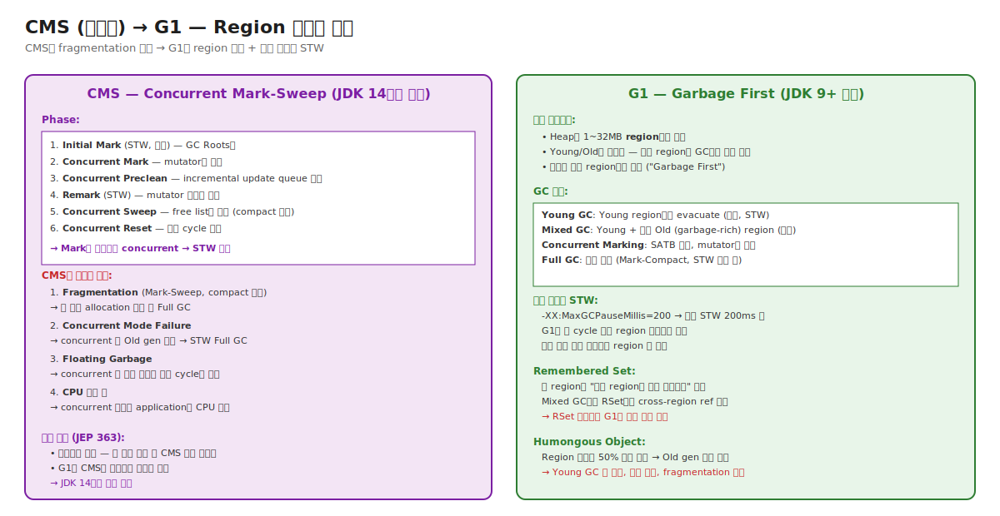

# 04-03. CMS (제거됨) → G1 — Region 기반의 진화

> CMS는 2002년 JDK 1.4에 도입되어 **첫 concurrent GC**로 latency 시대를 열었다. 그러나 fragmentation + Concurrent Mode Failure의 본질적 한계로 JDK 14에서 제거됐다.
> G1은 그 자리를 차지한 후속 — **region 기반**으로 fragmentation 해결 + **예측 가능한 STW 목표 지정 가능**.
> 시니어가 알아야 할 것: CMS는 production에서 거의 안 보지만 운영 사고의 옛 흔적(Concurrent Mode Failure 같은 메시지)이 코드/문서에 남아 있음. G1은 현재 default GC — 모든 운영자가 알아야.

---

## 🗺️ JVM 아키텍처 안에서 이 챕터의 위치



---

## 📍 학습 목표

1. **CMS의 6 phase** (Initial Mark / Concurrent Mark / Preclean / Remark / Concurrent Sweep / Reset).
2. CMS의 **3가지 본질적 한계** — Fragmentation, Concurrent Mode Failure, Floating Garbage.
3. **G1의 region 기반** 설계 — Young/Old가 논리적, region별 평가.
4. **G1의 GC 종류** — Young / Mixed / Concurrent Marking / Full GC.
5. **`-XX:MaxGCPauseMillis`** 옵션의 동작 — pause prediction model.
6. **Remembered Set** ([Chapter 02-06](../02-runtime-data-areas/06-gc-bookkeeping-and-others.md) 와 연결).
7. **Humongous Object** ([Chapter 02-01](../02-runtime-data-areas/01-heap-and-tlab.md) 와 연결).
8. **SATB (Snapshot-At-The-Beginning)** — G1의 concurrent marking 정확성 보장.
9. **JDK 9의 GC 기본 변경** — Parallel → G1.
10. 운영 시나리오: G1 RSet 비대화 / Humongous 빈발 / Mixed GC pause 김.

---

## 🎨 1단계: 백지 그리기 가이드

### Step 1: CMS phase 흐름

```
[Initial Mark (STW)]
  → GC Roots만 mark
[Concurrent Mark]
  → mutator와 동시, reachable 객체 mark
[Remark (STW)]
  → mutator 변경분 처리
[Concurrent Sweep]
  → free list에 죽은 객체 반환 (compact 없음 — fragmentation)
```

### Step 2: G1 region 그림

```
[Heap을 2048개 region으로]
[Eden][Eden][Survivor][Old][Old][Free][Humongous][Humongous]
[Old][Free][Eden][...]
```

각 region이 GC마다 역할 변경 (Young → Old → Free → ...).

### 정답 그림

위의 [03-cms-and-g1.svg](./_excalidraw/03-cms-and-g1.svg) 참조.

---

## 🧠 2단계: 직관

### 핵심 비유

> **창고 정리 비유** (재방문):
> - **Parallel GC** = 전 창고 통째 정리 (느림, 한꺼번에).
> - **CMS** = 가게 영업 중 일부 정리 (concurrent, 단 정리만, 재배치 X — fragmentation).
> - **G1** = 창고를 방으로 나누어 쓰레기 많은 방부터 정리. 영업 영향 시간 예측 가능.

### 정확한 정의

| 용어 | 정의 |
|---|---|
| **CMS (Concurrent Mark-Sweep)** | Old gen의 mark/sweep을 mutator와 동시 수행. STW 짧음. JDK 1.4~13. |
| **Concurrent Mode Failure** | CMS의 concurrent 처리가 따라가지 못해 Old gen 가득 → STW Full GC. CMS의 가장 큰 운영 사고. |
| **Floating Garbage** | Concurrent marking 중 죽은 객체. 이번 cycle엔 회수 못 함 (mark 시점엔 살아있었음). 다음 cycle에 처리. |
| **G1 (Garbage First)** | Heap을 region으로 나누고 쓰레기 많은 region부터 수집. JDK 9+ 기본. |
| **Region** | G1의 메모리 단위. 1~32MB (Heap 크기 따라 자동). Heap / 2048 가이드라인. |
| **Young Region** | G1에서 Young으로 사용 중인 region들. |
| **Mixed GC** | Young + 일부 Old region 같이 evacuate. G1의 핵심 GC 종류. |
| **Pause Prediction Model** | G1이 과거 GC 시간 통계로 다음 GC의 region 수를 결정해 MaxGCPauseMillis 목표 달성. |
| **Humongous Object** | Region 크기의 50% 이상. Old gen 직접 할당. ([Chapter 02-01](../02-runtime-data-areas/01-heap-and-tlab.md)). |
| **SATB (Snapshot-At-The-Beginning)** | G1의 concurrent marking 시 mutator의 ref 변경을 추적해 정확성 보장. |

### CMS의 본질적 한계 — 왜 제거됐나

```
1. Fragmentation (가장 큰 문제):
   Mark-Sweep만 — compact 안 함.
   시간 지나면 Old gen에 작은 free 영역 흩뿌려짐.
   큰 객체 할당 실패 → Full GC (compact 위해).

2. Concurrent Mode Failure:
   Concurrent collecting 진행 중 mutator가 Old를 너무 빠르게 채움.
   GC가 따라가지 못함 → 응급 Full GC (STW, 매우 김).
   CMS 운영 사고의 시그니처.

3. CPU 영향:
   Concurrent 작업이 application과 CPU 경쟁.
   Throughput ↓ (10~20%).

4. Floating Garbage:
   Concurrent 중 죽은 객체는 다음 cycle에야 회수.
   추가 메모리 부담.

5. 유지보수 부담:
   복잡한 코드 (수만 줄).
   새 GC 기능 (Generational ZGC 등) 추가 시 호환 어려움.

→ JEP 363 — JDK 14에서 제거. G1이 대체.
```

### G1의 핵심 통찰

```
"왜 전체 Heap을 한 번에 수집하는가?"
   → Heap을 작은 region으로 나누면 매번 일부만 수집 가능.
   → 쓰레기 많은 region부터 수집 → 적은 작업으로 많은 메모리 회수.
   → STW를 예측 가능한 시간 안에 끝낼 수 있음.

"왜 Young/Old를 물리적으로 분리하는가?"
   → 같은 region이 시간 따라 Young → Old로 역할 변경.
   → 더 유연한 메모리 사용.
   → 단점: cross-region 참조 추적 비용 (Remembered Set).
```

---

## 🔬 3단계: 구조

### CMS 6 phase 자세히

```
1. Initial Mark (STW, ~수 ms)
   - GC Roots만 mark
   - 매우 짧음

2. Concurrent Mark (concurrent, ~수 초)
   - reachable 객체 mark
   - mutator와 동시 → mutator의 ref 변경분은 별도 queue

3. Concurrent Preclean (concurrent)
   - Incremental update queue 처리
   - mutator 변경분 일부 처리

4. Remark (STW, ~수십 ms)
   - 남은 변경분 일괄 처리
   - 정확한 마킹 완료

5. Concurrent Sweep (concurrent)
   - 죽은 객체 → free list
   - compact 없음 ★ — fragmentation 누적

6. Concurrent Reset
   - 다음 cycle 준비
```

### G1 GC 흐름

```
[일반 흐름]

Young allocation
  ↓
Eden region 가득
  ↓
Young GC (STW): Eden + Survivor → 다른 region
  ↓ ...
  
Old gen 사용량 임계 도달 (-XX:InitiatingHeapOccupancyPercent)
  ↓
Concurrent Marking (SATB, mutator와 동시)
  ↓
Mixed GC: Young region + 일부 Old region (garbage-rich) evacuate
  ↓ ...

수 회의 Mixed GC로 충분한 Old 정리
  ↓
정상 운영 재개

[비정상]
Mixed GC가 따라가지 못함 → Full GC (Mark-Compact, STW 매우 김)
G1 Full GC는 운영 사고 신호.
```

### Pause Prediction Model

```
G1이 매 GC마다 통계 수집:
   - Region별 evacuate 시간
   - RSet 스캔 시간
   - Roots scan 시간

다음 GC 결정:
   목표 = MaxGCPauseMillis (기본 200ms)
   - 어느 region들을 수집할지 선택
   - 통계 기반 예상 시간 계산
   - 목표 안에 들도록 region 수 조정
```

→ 운영자가 STW 목표를 명시 (`-XX:MaxGCPauseMillis=100`) — G1이 그에 맞춤. 단, throughput 트레이드오프 (낮은 목표 = 잦은 GC).

### Remembered Set (재방문)

[Chapter 02-06](../02-runtime-data-areas/06-gc-bookkeeping-and-others.md) 참조.

각 region의 RSet = "어느 region의 어디서 나를 가리키나" 목록. Mixed GC에서 cross-region ref 추적의 핵심.

**운영 함정**: cross-region 참조 dense하면 RSet 비대화 → Mixed GC 시간 ↑.

### Humongous Allocation

```
Region 크기 = 4MB (예시)
새 객체 > 2MB (region의 50%)
  → Humongous로 분류
  → Old gen에서 연속된 region(s) 할당 (객체 크기 따라 1~N개)
  → Young GC 건너뜀, Mixed/Full GC에서만 회수
  
운영 함정:
  1. 큰 객체 빈번 → fragmentation
  2. 일찍 죽어도 Old GC 기다림 → 메모리 점유 ↑
  3. 한 Humongous가 region 일부만 사용 → 남는 공간 낭비
```

### G1 옵션 매트릭스

```
-XX:+UseG1GC                        # G1 활성 (기본, JDK 9+)
-XX:MaxGCPauseMillis=200             # 목표 STW
-XX:G1HeapRegionSize=32m             # region 크기 (1,2,4,8,16,32MB)
-XX:InitiatingHeapOccupancyPercent=45 # concurrent marking 시작 임계
-XX:G1MixedGCLiveThresholdPercent=85 # Mixed GC 대상 region의 live ratio 한계
-XX:G1HeapWastePercent=5              # 허용 낭비
```

99% 기본값. MaxGCPauseMillis만 워크로드별 조정.

---

## 🧬 4단계: 내부 구현 — HotSpot

### G1CollectedHeap

위치: `src/hotspot/share/gc/g1/g1CollectedHeap.cpp`

```cpp
class G1CollectedHeap : public CollectedHeap {
    HeapRegionManager*    _hrm;          // region 관리자
    G1Policy*             _policy;        // GC 정책 (pause prediction)
    G1RemSet*             _g1_rem_set;    // Remembered Set 관리
    G1ConcurrentMark*     _cm;            // concurrent marking
    
    void do_collection_pause_at_safepoint(...) {
        evacuate_collection_set(...);   // Young or Mixed
    }
};
```

### HeapRegion

```cpp
class HeapRegion : public ContiguousSpace {
    HeapRegionType  _type;     // Eden, Survivor, Old, Humongous, Free
    HeapRegionRemSet* _rem_set;
    
    bool is_young() const { return _type.is_young(); }
    bool is_humongous() const { return _type.is_humongous(); }
};
```

각 region이 type을 가짐. type은 GC마다 변경 가능 (Young → Old → Free → Eden).

### G1Policy — Pause Prediction

위치: `src/hotspot/share/gc/g1/g1Policy.cpp`

```cpp
class G1Policy {
    G1Predictions  _predictions;   // 통계 기반 예측
    
    size_t compute_target_region_count(...) {
        double target_time = MaxGCPauseMillis;
        double per_region_cost = _predictions.avg_evacuation_time();
        return target_time / per_region_cost;
    }
};
```

매 GC 후 통계 업데이트 → 다음 GC의 region 수 결정.

---

## 📜 5단계: 역사

| 연도 | 변화 |
|---|---|
| 2002 | JDK 1.4 — CMS 도입 (-XX:+UseConcMarkSweepGC) |
| 2009 | JDK 7 — G1 실험 (-XX:+UseG1GC) |
| 2017 | JDK 9 — G1 기본 GC, CMS deprecated |
| 2018 | JDK 11 — G1 production-ready |
| 2020 | JDK 14 — CMS 완전 제거 (JEP 363) |
| 2021 | JDK 17 — G1 더 정교 (Eager Reclaim) |

---

## ⚖️ 6단계: 트레이드오프

### Parallel vs G1

| | Parallel | G1 |
|---|---|---|
| Throughput | 매우 높음 | 약간 낮음 |
| STW pause | 김 (수백 ms ~ 수 초) | 짧음, 예측 가능 (~100ms) |
| Heap 크기 적합 | ~16GB | ~수십~수백 GB |
| Fragmentation | 거의 없음 | 거의 없음 |
| 운영 옵션 | 적음 | 많음 (조정 여지) |
| 적합 워크로드 | batch, analytics | 일반 서비스, latency 중요 |

### G1의 운영 트레이드오프

```
-XX:MaxGCPauseMillis 작게 (50):
  + Latency 좋음
  - Throughput ↓ (잦은 GC)
  - Heap을 효과적으로 못 씀

-XX:MaxGCPauseMillis 크게 (500):
  + Throughput ↑
  - Latency spike

권장: 200 (기본). 워크로드 측정 후 조정.
```

---

## 📊 7단계: 측정·진단

### G1 GC log

```bash
-Xlog:gc*,gc+phases=debug,gc+heap=debug
```

각 GC의 phase별 시간 + region 상태.

### 시나리오: Humongous 빈발

```
환경: G1, byte buffer 빈번 할당
증상: GC log에 "Humongous Allocation" 빈도 ↑

진단: -Xlog:gc+humongous=debug
조치:
  - Buffer 크기를 region 크기의 50% 미만으로
  - -XX:G1HeapRegionSize=32m (region ↑) 
  - 또는 buffer pool 사용 (Netty의 PooledByteBufAllocator)
```

### 시나리오: Mixed GC 시간 ↑

```
환경: G1, 큰 cache 사용
증상: Mixed GC pause 200ms → 800ms

진단:
  -Xlog:gc+phases=debug
  "Scan RS" 시간이 대부분이면 RSet 비대화
  
조치:
  - -XX:G1HeapRegionSize=32m (region 수 ↓ → RSet 수 ↓)
  - cache 크기 제한 (cross-region ref 줄임)
```

---

## ⚔️ 8단계: 꼬리질문 트리

### Q1. CMS가 왜 제거됐나요?

> 4가지 본질적 한계:
> 1. Fragmentation (Mark-Sweep, compact 없음).
> 2. Concurrent Mode Failure (Old 가득 시 응급 Full GC).
> 3. CPU 영향 (concurrent 작업이 application과 경쟁).
> 4. 유지보수 부담.
> JEP 363 — JDK 14에서 완전 제거. G1이 대체.

### Q2. G1의 region 기반 설계의 이점은?

> 1. Fragmentation 줄임 (region 단위 evacuate).
> 2. STW 예측 가능 (region 수 조절).
> 3. Mixed GC로 Full GC 회피.
> 4. Humongous object 처리.

### Q3. MaxGCPauseMillis는 어떻게 동작하나요?

> G1의 pause prediction model:
> - 매 GC 통계 (region별 evacuation 시간, RSet scan 시간 등).
> - 다음 GC 시 목표 시간 안에 끝나도록 region 수 조정.
> - 보장이 아닌 목표 — 워크로드 따라 초과 가능.

### Q4. (Killer) G1 사용 중 Mixed GC pause가 200ms → 800ms로 늘었습니다. 진단하세요.

> 1. **GC log 상세 분석**:
>    ```
>    -Xlog:gc+phases=debug
>    ```
>    어느 phase가 길어졌나? Scan RS / Update RS / Object Copy 중.
> 
> 2. **RSet 추세**:
>    ```
>    -Xlog:gc+remset=info
>    ```
>    `fine->coarse transitions` 빈발 시 RSet 비대.
> 
> 3. **원인 식별**:
>    - 큰 cache + cross-region ref 폭증 → RSet 비대.
>    - Humongous 누적.
>    - Heap 크기 증가 → region 수 증가.
> 
> 4. **조치**:
>    - `-XX:G1HeapRegionSize=32m` (region 크기 ↑ → 수 ↓).
>    - Cache 크기 제한.
>    - ZGC 검토 (100GB+ Heap).

---

## 🔗 다음 단계

- → [04. ZGC and Shenandoah](./04-zgc-and-shenandoah.md)
- ← [02. Generational](./02-generational-and-serial-parallel.md)
