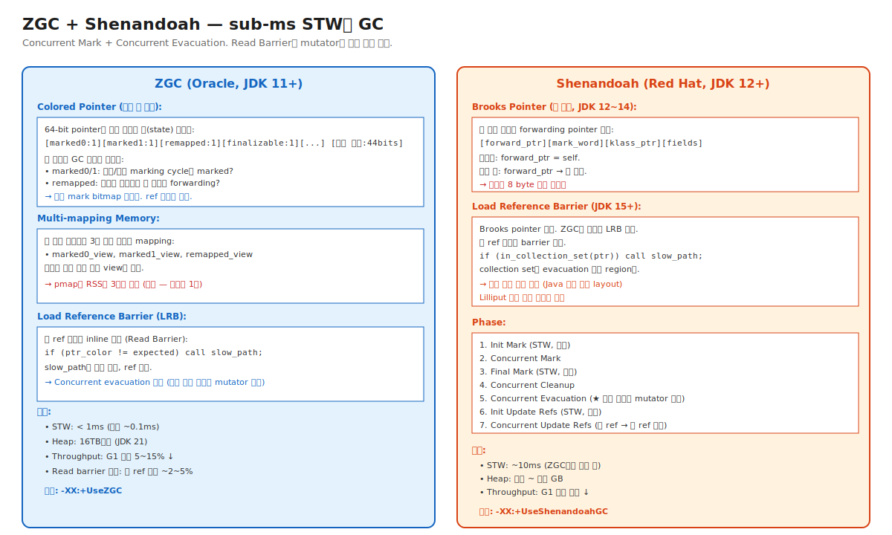

# 04-04. ZGC and Shenandoah — sub-ms STW의 GC

> 2018년 ZGC (Oracle), 2019년 Shenandoah (Red Hat) — 거의 동시에 등장한 **sub-millisecond STW** 의 두 GC. 둘 다 같은 목표를 다른 메커니즘으로 달성.
> 핵심 발상: **mutator와 동시에 객체 이동까지** 수행하려면 mutator가 항상 정확한 주소를 보도록 해야 한다 — Read Barrier로 해결.
> 시니어가 알아야 할 것: latency-critical 시스템 (HFT, 실시간 게임 서버, 큰 capacity의 web 서비스)이 채택하는 GC. Heap 크기 → ZGC, 운영 호환성 → Shenandoah가 일반 가이드.

---

## 🗺️ JVM 아키텍처 안에서 이 챕터의 위치



---

## 📍 학습 목표

1. **ZGC의 Colored Pointer** — 64-bit ref에 GC state 인코딩.
2. **Multi-mapping Memory** — 한 물리 페이지를 여러 가상 주소에 mapping. pmap 함정.
3. **Load Reference Barrier (LRB)** — Read Barrier로 concurrent evacuation 가능.
4. **Shenandoah의 Brooks Pointer (옛)** vs **LRB (현재)** — 두 세대의 차이.
5. **Concurrent Evacuation** — 객체 이동 중에도 mutator 진행 가능한 메커니즘.
6. **ZGC의 Generational (JDK 21+)** — Weak Generational Hypothesis 활용.
7. **Read Barrier의 비용** — 매 ref 읽기에 추가 instruction.
8. ZGC vs Shenandoah 선택 기준 — Heap 크기, JDK 버전, 운영 환경.
9. ZGC의 **pmap 3배 함정** — 가상 메모리 vs RSS.
10. 운영 시나리오: 큰 Heap + latency 목표 / Container 모니터링 함정 / GC 마이그레이션 절차.

---

## 🎨 1단계: 백지 그리기 가이드

### Step 1: Colored Pointer 인코딩

```
일반 64-bit pointer: [64 bits: 실제 주소]
ZGC colored pointer: [marked0:1][marked1:1][remapped:1][...][실제 주소:44 bits]
                       ↑ state bits        ↑ 실제 주소 영역

→ pointer 값 자체에 GC 상태 정보
```

### Step 2: Multi-mapping

```
물리 메모리 페이지 (4KB) ──┬──→ 가상 주소 #1 (marked0_view)
                          ├──→ 가상 주소 #2 (marked1_view)
                          └──→ 가상 주소 #3 (remapped_view)

→ pointer의 상태 비트로 어느 view 사용할지 결정
→ pmap이 동일 메모리를 3번 카운트 (가상 주소 기준)
→ RSS (물리)는 1배
```

### Step 3: Read Barrier (LRB)

```
Java 코드: x = obj.field;

JIT가 inline하는 LRB:
   raw_ptr = obj.field;
   if (raw_ptr_color != expected_color) {
       raw_ptr = lrb_slow_path(raw_ptr);  // 객체 이동, ref 갱신
   }
   x = raw_ptr;

→ 매 ref 읽기에 ~2~5% 비용
→ 그러나 concurrent evacuation 가능
```

### 정답 그림

위의 [04-zgc-shenandoah.svg](./_excalidraw/04-zgc-shenandoah.svg) 참조.

---

## 🧠 2단계: 직관

### 핵심 비유

> **이사 비유**:
> - **Stop-The-World GC (Parallel/G1)** = 이사하는 동안 가게 영업 정지. 영업 멈춤 시간 김.
> - **CMS** = 일부 정리는 영업 중 (concurrent mark), 그러나 재배치는 영업 정지 (compact 없음 — fragmentation).
> - **ZGC/Shenandoah** = 모든 정리를 영업 중에 (concurrent). 손님(mutator)이 옛 위치 가면 LRB가 "새 위치는 X" 알려줌.

### 정확한 정의 (비유와 분리)

| 용어 | 정의 |
|---|---|
| **Colored Pointer** | ZGC의 ref encoding. 64-bit pointer의 고위 비트에 GC state 비트 포함. |
| **Multi-mapping** | 한 물리 메모리를 여러 가상 주소에 mapping. ZGC가 colored pointer 처리에 사용. |
| **Load Reference Barrier (LRB)** | Read Barrier. ref를 읽을 때 GC state 확인 + 필요 시 forwarding. |
| **Concurrent Evacuation** | 객체를 새 위치로 이동하면서 mutator 동시 진행. LRB로 정확성 보장. |
| **Brooks Pointer** | Shenandoah 옛 버전 (JDK 12~14)의 forwarding pointer. 객체 헤더에 8 byte 추가. JDK 15+에서 LRB로 대체. |
| **Heap region** | ZGC/Shenandoah도 region 기반. ZGC: 2/32/large size. Shenandoah: 동일 크기 region. |
| **Generational ZGC** | JDK 21+. Young/Old 분리 도입 (이전 single-gen 모델 개선). |

### 왜 Read Barrier가 필요한가 — Concurrent Evacuation

```
[일반 GC (STW로 evacuate)]
1. 모든 mutator 정지 (STW)
2. 객체 A를 새 주소 B로 복사
3. 모든 ref를 A → B로 갱신
4. mutator 재개
→ 단순. 그러나 STW 길음.

[Concurrent Evacuation]
1. mutator 정지 안 함
2. 객체 A를 새 주소 B로 복사 (concurrent)
3. mutator가 A의 ref를 들고 있음 → 어떻게 정확성?
   
해결: Read Barrier
   mutator가 ref를 읽을 때:
     실제 ptr이 옛 주소(A)인가? → 새 주소(B)로 redirect
     이미 새 주소인가? → 그대로
   → mutator는 항상 최신 주소 받음
```

### 왜 ZGC와 Shenandoah가 다른 메커니즘인가

```
[ZGC — Colored Pointer + Multi-mapping]
   장점:
     - Pointer 자체에 정보 → 객체 헤더 변경 안 함
     - GC state check가 1 instruction (mask + cmp)
     - 매우 빠른 barrier
   단점:
     - 64-bit pointer 가정 (32-bit 불가)
     - OS가 multi-mapping 지원 필요 (Linux mmap)
     - 가상 주소 공간 3배 사용

[Shenandoah — Brooks Pointer (옛) 또는 LRB (현재)]
   장점:
     - 객체 헤더 기반 → 64-bit 가정 약함
     - Multi-mapping 의존 없음
     - 더 portable
   단점:
     - Brooks pointer 시절 객체당 8 byte 추가
     - LRB 시절은 ZGC와 유사한 비용

→ ZGC가 더 정교, Shenandoah가 더 호환성.
→ JDK 21+에서는 둘 다 LRB 기반으로 수렴 중.
```

---

## 🔬 3단계: 구조

### ZGC Colored Pointer 자세히

```
64-bit pointer 구조 (JDK 21):
   [unused:18][marked0:1][marked1:1][remapped:1][finalizable:1][...][addr:42]

State 비트:
   - marked0: 이번 marking cycle에 mark됐는가?
   - marked1: 이전 marking cycle에 mark됐는가? (snapshot)
   - remapped: relocated된 후 ref가 갱신됐는가?
   - finalizable: finalize 대기 중인가?

매 ref 읽기:
   raw = load(field);
   if ((raw & state_mask) != expected_state) {
       raw = lrb_slow_path(raw);   // GC 보조 함수
   }
   use raw;
```

### Multi-mapping의 의미

```
가상 주소 공간:
   marked0_view  : 0x0000_0000_0000 ~ 0x0000_FFFF_FFFF
   marked1_view  : 0x0001_0000_0000 ~ 0x0001_FFFF_FFFF
   remapped_view : 0x0002_0000_0000 ~ 0x0002_FFFF_FFFF
   
실제 물리 메모리는 모두 같은 페이지 (1배):
   Physical page X mapped to:
     marked0_view + offset
     marked1_view + offset
     remapped_view + offset

용도:
   colored pointer의 state 비트로 어느 view 통해 접근할지 결정.
   각 view는 OS의 분리된 가상 주소이지만 같은 데이터.

운영 함정:
   pmap이 가상 주소 합산 → 3배 보고.
   RSS (cgroup memory metric)는 1배 — 정확.
```

### Concurrent Evacuation 흐름 (ZGC)

```
1. Mark Phase (concurrent + 짧은 STW)
   - GC Roots scan
   - Concurrent mark (mutator와 동시)
   - Final mark (STW, 변경분 반영)
   - 살아있는 객체 식별

2. Select Collection Set
   - 쓰레기 많은 region들 선택 (Garbage First와 비슷)

3. Concurrent Relocation
   - Collection set의 객체들을 새 region으로 복사
   - Mutator 진행 — 옛 ptr 읽으면 LRB가 새 ptr 반환

4. Concurrent Remap (다음 cycle)
   - 옛 ptr들을 새 ptr로 갱신 (lazy)
   - mutator의 LRB가 점진적으로 처리
```

### Shenandoah LRB 시대 (JDK 15+)

```java
// Java 코드
x = obj.field;

// JIT inline 코드 (의사)
raw = obj.field;
if (in_collection_set(raw)) {   // 이 객체가 evacuation 중인가?
    raw = lrb_evacuate_or_forward(raw);
}
x = raw;
```

→ ZGC와 유사. 단, in_collection_set 체크가 다름.

### ZGC vs Shenandoah Side-by-side

| | ZGC | Shenandoah |
|---|---|---|
| Author | Oracle | Red Hat |
| 첫 stable | JDK 15 | JDK 15 |
| Generational | JDK 21+ | 미지원 (single-gen) |
| Heap 한계 | 16TB | 수십~수백 GB |
| Pointer | Colored (64-bit) | 표준 |
| Memory model | Multi-mapping | 표준 mmap |
| 객체 헤더 | 표준 | 표준 (LRB 시대) |
| Barrier | Load (Read) | Load (Read) |
| STW pause | < 1ms (보통 ~0.1ms) | ~10ms |
| OS 의존 | Linux/Mac/Windows 일부 | 더 portable |
| 옵션 | -XX:+UseZGC | -XX:+UseShenandoahGC |

### ZGC의 Generational 도입 (JDK 21)

```
JDK 11~20: Single-generation ZGC
   - Young/Old 구분 없이 한 영역
   - Weak Generational Hypothesis 활용 안 함
   - 단점: 짧은 lifetime 객체도 큰 영역에서 scan
   
JDK 21+: Generational ZGC
   - Young/Old 분리
   - Young GC + Old GC 별도 cycle
   - 더 효율적 (단명 객체 더 빨리 회수)
   - 옵션: -XX:+UseZGC -XX:+ZGenerational
```

자세히는 [05. Generational ZGC](./05-generational-zgc.md).

---

## 🧬 4단계: 내부 구현 — HotSpot

### ZGC 진입

위치: `src/hotspot/share/gc/z/zCollectedHeap.cpp`

```cpp
class ZCollectedHeap : public CollectedHeap {
    ZHeap* _heap;
    
    void collect(GCCause::Cause cause) override {
        // 1. Mark
        _heap->mark_start();
        _heap->mark_concurrent();   // mutator와 동시
        _heap->mark_end();           // 짧은 STW
        
        // 2. Relocation
        _heap->relocate_start();
        _heap->relocate_concurrent();   // mutator와 동시
        _heap->relocate_end();
    }
};
```

### Colored Pointer 구현

위치: `src/hotspot/share/gc/z/zAddress.hpp`

```cpp
// Pointer encoding
struct ZAddress {
    static const uintptr_t MARK0_BIT  = 1UL << 41;
    static const uintptr_t MARK1_BIT  = 1UL << 42;
    static const uintptr_t REMAPPED_BIT = 1UL << 43;
    
    static uintptr_t address_offset(uintptr_t addr) {
        return addr & ((1UL << 41) - 1);   // 하위 41 bit가 실제 주소
    }
    
    static bool is_marked(uintptr_t ptr) {
        return ptr & MARK0_BIT;
    }
};
```

### LRB 구현

위치: `src/hotspot/share/gc/z/zBarrier.cpp`

```cpp
oop ZBarrier::load_barrier_on_oop_field(oop* p) {
    oop o = *p;
    if (z_check_color(o)) {
        return o;   // fast path
    }
    return load_barrier_slow_path(p, o);   // GC 보조 호출
}
```

JIT이 이걸 inline해 매 oop load에 삽입.

---

## 📜 5단계: 역사

| 연도 | 변화 |
|---|---|
| 2018 | JDK 11 — ZGC 실험 (JEP 333) |
| 2019 | JDK 12 — Shenandoah 실험 (JEP 189) |
| 2020 | JDK 15 — 둘 다 production-ready |
| 2021 | JDK 17 — ZGC 16TB Heap 지원 |
| 2023 | JDK 21 — Generational ZGC (JEP 439) |

### Per Liden (Oracle) — ZGC

박사 논문 + JDK 11 도입. Colored Pointer + Multi-mapping의 정수.

### Christine Flood (Red Hat) — Shenandoah

Brooks pointer 시절부터 시작. JDK 15+ LRB 시대로 진화.

---

## ⚖️ 6단계: 트레이드오프

### ZGC vs Shenandoah 선택 가이드

```
Heap 크기:
   ~32GB:   둘 다 OK
   32~128GB: ZGC 권장 (latency 일정)
   128GB+:   ZGC 거의 필수 (Heap 한계, multi-mapping 효율)

JDK 버전:
   JDK 11~14: ZGC experimental, Shenandoah experimental
   JDK 15+:   둘 다 production-ready
   JDK 21+:   Generational ZGC (성능 ↑)

운영 환경:
   Cloud (AWS, GCP): ZGC 안정
   On-prem 거대 시스템: ZGC + AVX/AVX-512
   Container 제한적: Shenandoah가 더 portable
```

### Throughput vs Latency

| | G1 | ZGC | Shenandoah |
|---|---|---|---|
| Throughput | 100% (기준) | 85~95% | 85~95% |
| P99 latency | 50~200ms | <1ms | ~10ms |
| Heap 한계 | ~수십GB | 16TB | ~수백GB |
| 적합 | 일반 서비스 | latency-critical 큰 Heap | latency-critical |

### 운영 호환성

```
ZGC:
   + 안정적 (Oracle 지원)
   + 큰 Heap
   - pmap 3배 함정 (모니터링 도구 학습 필요)
   - 일부 OS 미지원

Shenandoah:
   + Portable
   + Brooks → LRB 진화 완료
   - Generational 없음 (JDK 21 기준)
   - Throughput G1 대비 낮음
```

---

## 📊 7단계: 측정·진단

### ZGC log

```bash
-Xlog:gc*=debug
```

출력:
```
[gc] GC(0) Garbage Collection (Allocation Rate)
[gc,phases] GC(0) Pause Mark Start 0.123ms       ← 매우 짧음
[gc,phases] GC(0) Concurrent Mark 50.456ms
[gc,phases] GC(0) Pause Mark End 0.234ms
[gc,phases] GC(0) Concurrent Relocate 30.789ms
```

각 STW phase가 <1ms 정도면 정상.

### pmap 함정 처리

```bash
# RSS 기준으로 메트릭 측정 (정확)
cat /sys/fs/cgroup/memory.current

# pmap은 가상 주소 기준 (3배 인플레이션)
pmap -x <pid>   # 의도와 다른 값 — 무시
```

Prometheus 알람 기준은 `process_resident_memory_bytes` (RSS).

### 시나리오: ZGC 도입 후 알람 폭주

```
환경: G1 → ZGC 마이그레이션 후
증상: 모니터링 도구의 memory usage 알람 3배 증가

진단: 알람이 가상 주소(pmap) 기준이었음
조치: RSS 기준 메트릭으로 변경 (cgroup memory.current 등)
```

### 시나리오: ZGC의 read barrier 비용 측정

```
환경: G1 vs ZGC 성능 비교
방법: JMH 벤치마크
결과: Throughput ZGC가 10% 낮음 (정상 범위)
       P99 latency ZGC가 95% 낮음
       
판단: latency 가치 > throughput 손실 → ZGC 채택
```

---

## ⚔️ 8단계: 꼬리질문 트리

### Q1. ZGC의 Colored Pointer가 무엇이고 왜 효과적인가요?

> 64-bit pointer의 고위 비트에 GC state (marked0/1, remapped 등) 인코딩.
> 효과:
> - Pointer 자체에 정보 → 별도 mark bitmap 불필요.
> - GC state check가 1 instruction (mask + cmp).
> - Concurrent evacuation 시 mutator가 정확한 state 즉시 확인.

### Q2. Multi-mapping의 동작과 pmap 함정은?

> 한 물리 페이지를 3개 가상 주소에 mapping. Colored pointer의 state 비트로 어느 view 사용할지 결정.
> 
> 운영 함정: `pmap`은 가상 주소 합산 → RSS의 3배 보고. 실제 물리 메모리는 1배.
> 
> → 모니터링 메트릭은 RSS 기준 (`/sys/fs/cgroup/memory.current` 또는 `process_resident_memory_bytes`).

### Q3. Read Barrier의 비용은?

> 매 ref 읽기에 추가 instruction 2~5개.
> 일반 워크로드 throughput ~2~5% 영향.
> Latency 가치 (sub-ms STW) 대비 매우 작은 비용.

### Q4. ZGC와 Shenandoah 선택 기준은?

> - Heap 크기 ~32GB: 둘 다 OK.
> - Heap 32GB+: ZGC 권장.
> - Heap 100GB+: ZGC 거의 필수.
> - Generational 활용 (JDK 21+): Generational ZGC.
> - 운영 portability: Shenandoah.

### Q5. (Killer) G1 → ZGC 마이그레이션을 검토 중입니다. 무엇을 확인해야 하나요?

> 1. **Heap 크기**: ZGC가 효과 있는 임계 (32GB+).
> 2. **JDK 버전**: 21+ 권장 (Generational ZGC).
> 3. **OS 지원**: Linux/Mac/Windows ZGC 호환 확인.
> 4. **메트릭 변경**: RSS 기준 (pmap 3배 함정 회피).
> 5. **벤치마크**: JMH로 throughput/latency 측정.
> 6. **운영 변화**: GC log 형식 다름 (학습 비용).
> 7. **Read barrier 비용**: hot path 성능 영향 측정.
> 8. **Container memory**: 가상 메모리는 3배지만 RSS는 1배 — limit 기준 RSS로.
> 9. **단계적 도입**: canary 1대로 시작, 모니터링 안정 후 확대.

---

## 🔗 다음 단계

- → [05. Generational ZGC](./05-generational-zgc.md)
- ← [03. CMS and G1](./03-cms-and-g1.md)
