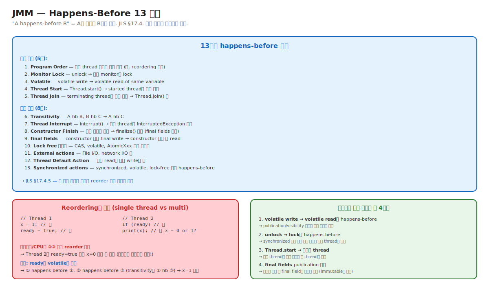

# 05-01. JMM + Happens-Before 13 규칙

> "synchronized를 쓰면 thread-safe" — 한 줄 답은 위험하다. **왜** synchronized가 thread-safe를 만드는가? 답: JMM의 happens-before 규칙.
> JMM (Java Memory Model, JLS §17.4) 은 **컴파일러/CPU가 reorder할 수 있는 범위**를 정의한다. 13개 happens-before 관계가 그 reorder의 안전판.
> 시니어가 알아야 할 것: lock 안 쓰고도 정확한 동시성 코드 작성 가능 (volatile, CAS). 단, JMM 규칙 명확히 이해해야.

---

## 🗺️ JVM 아키텍처 안에서 이 챕터의 위치



---

## 📍 학습 목표

1. **JMM (Java Memory Model)** 의 본질 — 컴파일러/CPU reorder 허용 범위.
2. **Happens-Before** 의 정확한 의미 — "A의 결과가 B에서 보임".
3. **13가지 happens-before 관계** 중 실무에 자주 쓰이는 4가지 (Program Order, Monitor Lock, Volatile, Thread Start/Join).
4. **Reordering의 함정** — single thread에서 보이지 않다가 multi-thread에서 발생.
5. **Publication safety** — 객체를 다른 thread에 안전하게 공개하는 방법.
6. **Final fields** 의 특수 보장 — Immutable 객체의 기반.
7. **Sequential consistency vs Relaxed memory model** — JMM의 위치.
8. **DCL (Double-Checked Locking)** 의 함정과 volatile 해결.
9. **AtomicXxx / CAS** 의 happens-before 보장.
10. 운영 시나리오: 코드는 맞는데 occasional 버그 / Heisenbug 진단.

---

## 🎨 1단계: 백지 그리기 가이드

### Step 1: 두 thread의 코드

```
Thread 1:        Thread 2:
x = 1;           if (ready)
ready = true;        print(x);
```

### Step 2: Reordering 시나리오

```
컴파일러/CPU가 ① ② 순서 reorder 가능:
ready = true;   // ② 먼저
x = 1;           // ① 나중

→ Thread 2가 ready=true 보고 x=0 읽음 (예상치 못한 버그)
```

### Step 3: Happens-Before 해결

```
ready를 volatile로 선언:
① x = 1
② ready = true  ← volatile write
③ if (ready)    ← volatile read
④ print(x)      

happens-before:
① hb ② (program order)
② hb ③ (volatile)
③ hb ④ (program order)
→ ① hb ④ (transitivity)
→ x = 1 보장
```

### 정답 그림

위의 [01-jmm-happens-before.svg](./_excalidraw/01-jmm-happens-before.svg) 참조.

---

## 🧠 2단계: 직관

### 핵심 비유

> **편지 전달 비유**:
> - **Sequential Consistency** (이상적) = 모든 thread가 같은 순서로 모든 write를 봄. 마치 한 명이 작성한 일기처럼. **현실에 없음** (너무 비쌈).
> - **Relaxed Memory Model** (현실) = thread마다 자기 작업 순서대로 볼 뿐, 다른 thread의 작업 순서는 다를 수 있음.
> - **Happens-Before** = "이 편지를 받기 전에 그 편지를 받았음을 보장" — 두 작업 사이 안전한 순서 표시.

### 정확한 정의 (비유와 분리)

| 용어 | 정의 |
|---|---|
| **JMM (Java Memory Model)** | Java 프로그램의 multi-thread 동작 명세. JLS §17.4. 어떤 reorder가 허용/금지되는지 정의. |
| **Happens-Before** | A happens-before B 관계. A의 결과(write)가 B(read)에서 보임을 보장. JLS §17.4.5. |
| **Sequential Consistency** | 이상적 메모리 모델. 모든 thread가 모든 write를 같은 순서로 봄. 실제는 너무 비싸 채택 안 됨. |
| **Relaxed Memory Model** | 현대 CPU의 실제 모델. thread마다 자기 순서대로 봄. Reorder 광범위. |
| **Reordering** | 컴파일러/CPU/캐시가 instruction 순서를 바꾸는 것. Single-thread 결과는 보장하지만 multi-thread는 영향. |
| **Visibility** | 한 thread의 write가 다른 thread의 read에 보이는 것. Happens-before로 보장. |
| **Publication Safety** | 객체를 다른 thread에 안전하게 공개. 생성자에서 partial-initialized 상태 노출 위험. |
| **Memory Barrier** | CPU instruction. Reorder를 막음. JMM이 happens-before를 보장하는 메커니즘. |
| **Final fields** | 생성자에서 한 번만 할당. JMM이 특별히 안전한 publication 보장. |

### 왜 JMM이 필요한가 — 4가지 동시성 함정

```
1. Reordering
   x = 1; ready = true;
   → CPU/컴파일러가 reorder 가능 (single thread는 같은 결과)
   → multi-thread는 깨짐

2. Caching
   Thread 1: x = 1 (CPU 1의 L1 cache)
   Thread 2: x read (CPU 2의 L1 cache — 아직 0)
   → 캐시 동기화 시점 모름

3. Word tearing
   long, double의 read/write가 atomic 아닐 수 있음 (32-bit JVM)
   → 한 thread가 절반만 작성된 값 봄

4. Partial Construction
   Object o = new Object();
   다른 thread가 o.field 읽음
   → o의 생성자가 끝나기 전에 ref 노출 가능 → field 초기화 안 됨
```

→ JMM이 이 모든 함정에 대한 명세. 운영자가 정확한 코드를 작성하려면 happens-before 이해 필수.

### 왜 Sequential Consistency 안 쓰나

```
[Sequential Consistency 강제하면]
   매 write에 모든 CPU 캐시 동기화 + memory barrier 풀.
   → CPU 성능 50%+ 손실.
   → 현대 CPU 아키텍처와 안 맞음.

[Relaxed + Happens-Before 모델 (Java/C++)]
   기본은 reorder 자유.
   특정 지점(volatile, lock 등)에서만 동기화 비용 지불.
   → CPU 성능 최대 활용 + 필요한 곳만 정확성 보장.
   
→ 트레이드오프: 정확성 vs 성능.
```

---

## 🔬 3단계: 구조

### 13개 Happens-Before 관계

**기본 (5개)**:
1. **Program Order** — 같은 thread 안의 코드 순서. 단, 단일 thread 결과가 같으면 reorder 허용.
2. **Monitor Lock** — `unlock(M)` → `lock(M)` (같은 monitor).
3. **Volatile** — `volatile write` → `volatile read` (같은 변수).
4. **Thread Start** — `t.start()` → t의 모든 액션.
5. **Thread Join** — t의 마지막 액션 → `t.join()` 후.

**파생 (8개)**:
6. **Transitivity** — A hb B, B hb C → A hb C.
7. **Thread Interrupt** — `t.interrupt()` → t의 InterruptedException 감지.
8. **Constructor Finish** — 생성자 종료 → finalize() 시작.
9. **Final Fields** — 생성자 안 final write → 외부에서 read (안전 publication).
10. **Lock-free 동기화** — CAS, Atomic의 happens-before.
11. **External Actions** — I/O 작업.
12. **Default Read** — 모든 read는 어떤 write를 봄.
13. **Synchronization Actions** — 모든 sync action이 happens-before 형성.

### Volatile의 happens-before

```java
class Foo {
    int x = 0;
    volatile boolean ready = false;
    
    // Thread 1
    void publish() {
        x = 1;              // ①
        ready = true;       // ② volatile write
    }
    
    // Thread 2
    void consume() {
        if (ready) {        // ③ volatile read
            print(x);       // ④
        }
    }
}
```

Happens-before:
- ① hb ② (program order, same thread)
- ② hb ③ (volatile)
- ③ hb ④ (program order, same thread)
- ∴ ① hb ④ (transitivity)
- ∴ ④의 x read는 1을 봄

→ **volatile은 단순 visibility가 아니라 happens-before를 만든다**. 그래서 다른 변수(`x`)의 publication도 보장.

### Monitor Lock의 happens-before

```java
class Counter {
    int count = 0;
    
    synchronized void inc() {
        count++;        // ① 안의 write
    }                   // ② unlock
    
    synchronized int get() {  // ③ lock
        return count;          // ④
    }
}
```

- 어느 thread가 inc() 호출 (① + ②).
- 다른 thread가 get() 호출 (③ + ④).
- ② hb ③ (monitor lock).
- ① hb ④ (transitivity).
- → count의 최신 값 보장.

### Final Fields의 특수 보장

```java
class Immutable {
    final int x;
    final List<String> items;
    
    Immutable() {
        this.x = 42;
        this.items = List.of("a", "b");
    }
}

// 어디서나 안전:
Immutable obj = new Immutable();
publishGlobally(obj);   // ← 다른 thread가 즉시 봐도

// 다른 thread:
Immutable obj = getGlobal();
print(obj.x);          // 42 보장
print(obj.items);      // 정상 list 보장
```

JMM의 특수 보장:
- 생성자 안의 final write가 생성자 종료 시점에 publish.
- 다른 thread가 publish된 ref를 보면 final field는 항상 정확한 값.
- → Immutable 객체의 안전 publication 기반.

### Double-Checked Locking (DCL)

```java
class Singleton {
    private static Singleton instance;  // ★ volatile 필요
    
    public static Singleton getInstance() {
        if (instance == null) {           // ① check
            synchronized (Singleton.class) {
                if (instance == null) {    // ② re-check
                    instance = new Singleton();   // ③
                }
            }
        }
        return instance;
    }
}
```

**volatile 없으면 위험**:
- ③에서 `new Singleton()` 는 사실 3단계:
  - `m = allocate();`
  - `init m;`
  - `instance = m;`
- reorder 가능: allocate → instance = m → init m.
- 다른 thread가 ① check 통과해 init 안 된 m 받음.

**해결**: `private static volatile Singleton instance;`
- volatile write → volatile read의 happens-before로 init이 다 끝났음을 보장.

### Sequential Consistency for Data Race Free programs (SC-DRF)

JMM의 핵심 보장:
- Data race가 없는 프로그램 (모든 shared access가 happens-before로 정렬됨)에서는 Sequential Consistency처럼 동작.
- 즉, "올바르게 sync된 프로그램"은 직관적 의미.

---

## 🧬 4단계: 내부 구현 — HotSpot

### Volatile의 JIT 구현

JIT이 volatile read/write에 memory barrier 삽입:

```
// volatile int v;

// volatile write 후
v = 42;
[StoreStore barrier]  ← 이후 모든 store가 이전 store보다 나중
[StoreLoad barrier]   ← 이후 load가 이 store 후

// volatile read
int x = v;
[LoadLoad barrier]    ← 이후 load가 이 load 후
[LoadStore barrier]   ← 이후 store가 이 load 후
```

자세히는 [02-memory-barriers](./02-memory-barriers.md).

### Final Fields의 구현

생성자 종료 시 implicit `StoreStore barrier`:
```
constructor body...
[StoreStore barrier]  ← final write가 publish 전에 완료
return new object
```

---

## 📜 5단계: 역사

| 연도 | 변화 |
|---|---|
| 1995 | Java 1.0 — JMM 초기 (부정확) |
| 2004 | JSR-133 (JDK 5) — JMM 재정의 ★ |
| 2014 | JDK 8 — `@Contended` annotation |
| 2021 | JEP 188 — Java Memory Model 추가 명세 (논의) |

### JSR-133의 의의

JDK 1.0~1.4의 JMM은 **명확하지 않음** — final field도 안전 보장 안 됐고, DCL도 비공식.

JSR-133 (Brian Goetz 등이 작성, 2004): JMM 재정의.
- Happens-before 공식화.
- Final fields의 publication 안전 보장.
- volatile의 의미 강화 (단순 visibility → happens-before).
- → 이후 모든 Java 동시성 코드의 기반.

---

## ⚖️ 6단계: 트레이드오프

### Lock vs volatile vs CAS

| | Lock (synchronized) | volatile | CAS (Atomic) |
|---|---|---|---|
| 정확성 | ✅ 모든 경우 | ✅ visibility만 | ✅ atomicity 보장 |
| 비용 | 가장 큼 | 작음 | 보통 (재시도 시 큼) |
| 적합 케이스 | 복잡 mutate | 단순 flag | counter, compare-set |
| Memory barrier | 큼 (mfence 등) | 작음 (lfence/sfence) | mfence + lock |

### Sequential Consistency 강제 비용

```
[관행 코드]
volatile int x;
x = 1;
[StoreLoad barrier]   ← mfence ~30 cycles

[일반 store]
x = 1;
0 cycles barrier
```

→ Volatile 1번이 일반 store 대비 ~30× 비싼 비용. 그러나 정확성 위해 필수.

---

## 📊 7단계: 측정·진단

### JFR Lock 이벤트

```bash
jcmd <pid> JFR.start name=lock duration=60s settings=profile
jfr summary lock.jfr | grep -i 'Monitor\|Synchronization'
```

이벤트:
- `jdk.JavaMonitorEnter` — synchronized 진입.
- `jdk.JavaMonitorWait` — Object.wait().
- `jdk.SocketRead/Write` — I/O blocking.

### `jstack` 으로 deadlock 발견

```bash
jstack <pid> | grep -A 20 "Found one Java-level deadlock"
```

JVM이 자동 감지해 dump에 표시.

### 운영 시나리오: Heisenbug

```
환경: 가끔 occasional 잘못된 결과
증상: 같은 코드 같은 input인데 결과 다름

진단:
1. -Xcomp 옵션 (모든 메서드 즉시 컴파일) → 차이?
2. 코드 audit: shared variable이 volatile/synchronized?
3. 단순 reproduction → 모르면 lock 강제

원인 가능성:
- Reordering — volatile 누락
- Visibility — 단순 race condition
- Partial construction — final 누락

해결: 적절한 happens-before 도입 (volatile, synchronized, AtomicXxx).
```

---

## ⚔️ 8단계: 꼬리질문 트리

### Q1. Happens-Before가 무엇이고 왜 중요한가요?

> A happens-before B 관계. A의 write가 B의 read에서 보임.
> 13가지 관계 (program order, monitor lock, volatile, thread start/join, transitivity 등).
> 
> 중요성: JMM은 reorder 광범위 허용. happens-before만이 동시성 정확성의 안전판.

### Q2. volatile의 정확한 의미는?

> 1. Visibility — write가 즉시 다른 thread에 보임.
> 2. Happens-before — volatile write → volatile read가 hb 관계.
> 3. **다른 변수의 publication도 보장** (단순 visibility가 아님).
> 4. Atomicity — long/double의 word tearing 방지.

### Q3. final field의 특수 보장은?

> 생성자 안의 final write가 생성자 종료 시점에 publish.
> 다른 thread가 publish된 ref를 보면 final field는 정확한 값 보장.
> → Immutable 객체의 안전 publication 기반.

### Q4. DCL이 volatile 없이 안 되는 이유는?

> `new Singleton()` 가 3단계:
> 1. allocate
> 2. initialize
> 3. assign to instance
> Reorder 가능: 1 → 3 → 2.
> 다른 thread가 instance != null 보고 init 안 된 객체 받음.
> 
> 해결: instance를 volatile로 — happens-before가 init 완료 보장.

### Q5. (Killer) 동시성 코드에 occasional bug가 있는데 reproduction이 어렵습니다. 어떻게 진단하나요?

> 1. **코드 audit**:
>    - 모든 shared variable이 volatile/synchronized/Atomic?
>    - 생성자에서 this escape (Listener 등록 등)?
>    - 잘못된 partial init?
> 
> 2. **`-Xcomp` 옵션** (모든 메서드 즉시 컴파일):
>    - 같은 버그 재현되나? 컴파일 단계의 reorder 영향 확인.
> 
> 3. **JFR jdk.JavaMonitorEnter/Wait**:
>    - Lock contention 패턴 확인.
>    - Deadlock 여부.
> 
> 4. **stress test**:
>    - 같은 코드를 multi-thread + heavy load → 확률 ↑.
>    - JCStress 도구 사용.
> 
> 5. **defensive 조치**:
>    - 의심 shared variable에 volatile 추가.
>    - 의심 객체에 final 강화.
>    - Lock 적용.
> 
> 6. **검증**:
>    - 변경 후 stress test 통과 시 가설 정확.

---

## 🔗 다음 단계

- → [02. Memory Barriers](./02-memory-barriers.md)
- → [03. Synchronized + Mark Word](./03-synchronized-and-mark-word.md)
- → [04. Virtual Threads + Loom](./04-virtual-threads-and-loom.md)
