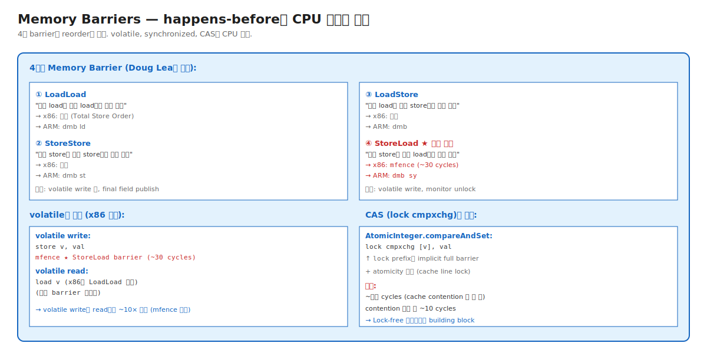

# 05-02. Memory Barriers — happens-before의 CPU 구현

> JMM happens-before는 추상적 명세. CPU 레벨에서 실제로 강제하는 메커니즘이 **Memory Barrier** (또는 fence).
> Doug Lea가 명명한 4종 — **LoadLoad / StoreStore / LoadStore / StoreLoad**. x86은 대부분 자동, **StoreLoad만 mfence 필요** (~30 cycles).
> 시니어가 알아야 할 것: volatile write가 read보다 ~10× 비싼 이유, CAS의 lock prefix가 implicit full barrier인 이유, AAA의 메모리 모델 차이 (x86 vs ARM).

---

## 🗺️ 위치



---

## 📍 학습 목표

1. **4종 Memory Barrier** — LoadLoad/StoreStore/LoadStore/StoreLoad의 정확한 의미.
2. **x86의 Total Store Order (TSO)** — 대부분 자동, StoreLoad만 명시.
3. **ARM의 Weakly Ordered** — 모든 barrier가 명시적 (`dmb` 명령).
4. **volatile 구현** (x86) — write에 `mfence`, read는 단순 load.
5. **synchronized monitorenter/exit** — 양쪽에 barrier.
6. **CAS의 `lock` prefix** — implicit full barrier + atomicity.
7. **Doug Lea's "Cookbook for Compiler Writers"** — JMM 구현 가이드.
8. **AAA의 CPU 차이** — x86 (Intel/AMD) vs ARM (Apple Silicon, AWS Graviton).
9. **Memory barrier가 코드 성능에 미치는 영향** — volatile 1번 ~수십 cycles.
10. 운영: lock-free 알고리즘 설계, hot path의 volatile/Atomic 비용 측정.

---

## 🎨 1단계: 백지 그리기 가이드

### Step 1: 4종 barrier 정의

```
LoadLoad:   "이전 load가 이후 load보다 먼저 완료"
StoreStore: "이전 store가 이후 store보다 먼저 완료"
LoadStore:  "이전 load가 이후 store보다 먼저 완료"
StoreLoad:  "이전 store가 이후 load보다 먼저 완료" ★ 가장 비쌈
```

### Step 2: x86 자동 vs 명시

```
x86 (Total Store Order):
   - LoadLoad: 자동
   - StoreStore: 자동
   - LoadStore: 자동
   - StoreLoad: ★ mfence 필요

ARM (Weakly Ordered):
   - 모든 barrier 명시 (dmb ld, dmb st, dmb sy)
```

### Step 3: volatile 구현

```
volatile write:
   store v, val
   mfence       ← StoreLoad

volatile read:
   load v       ← LoadLoad 자동 (x86)
```

### 정답 그림

위의 [02-memory-barriers.svg](./_excalidraw/02-memory-barriers.svg) 참조.

---

## 🧠 2단계: 직관

### 핵심 비유

> **공장 컨베이어 비유**:
> - **Memory Barrier** = 컨베이어 위의 정지선. 정지선 이전 작업이 모두 끝나야 이후 작업 시작.
> - **LoadLoad** = 부품 도착(load) 정지선 — 다음 부품 보기 전에 이전 부품 다 봐야.
> - **StoreLoad** = 완성품 출고(store) 후 새 부품 도착 사이 정지선 — 가장 비쌈, 전체 라인 동기화.

### 정확한 정의 (비유와 분리)

| 용어 | 정의 |
|---|---|
| **Memory Barrier (Fence)** | CPU instruction. 특정 reorder를 막음. |
| **LoadLoad** | 이전 read가 이후 read보다 완료 우선. |
| **StoreStore** | 이전 write가 이후 write보다 완료 우선. |
| **LoadStore** | 이전 read가 이후 write보다 완료 우선. |
| **StoreLoad** | 이전 write가 이후 read보다 완료 우선. 가장 비쌈. |
| **Total Store Order (TSO)** | x86의 메모리 모델. Store만 약간 reorder, 대부분 자동 정렬. |
| **Weakly Ordered** | ARM/POWER 모델. 모든 reorder 허용 — 명시 barrier 필요. |
| **mfence** | x86의 full memory barrier instruction. ~30 cycles. |
| **dmb** | ARM의 data memory barrier. ld/st/sy variant. |
| **lock prefix** | x86의 atomic instruction prefix. implicit full barrier + cache line lock. |

### x86 vs ARM 메모리 모델

```
[x86 — Total Store Order (TSO)]
   대부분의 reorder 금지:
   - 다른 thread의 store는 동일 순서로 보임
   - 자기 load는 store 뒤로 갈 수 있음 (Store Buffering)
   → 단 StoreLoad만 명시 필요

[ARM — Weakly Ordered]
   거의 모든 reorder 허용:
   - LoadLoad, StoreStore, LoadStore 모두 명시 필요
   - 단, 같은 주소에 대한 ordering은 보존
   → 모든 sync에 dmb 필요

결과:
   x86은 단순 코드도 비교적 안전
   ARM은 더 명시적 barrier 필요 — Java가 두 platform에 같은 결과 보장하려고 JIT이 적절한 barrier 삽입
```

### 왜 StoreLoad가 가장 비싼가

```
StoreLoad의 동작:
   store ...
   StoreLoad barrier
   load ...

CPU는 store를 Store Buffer에 임시 보관 (latency hiding).
StoreLoad는:
   1. Store Buffer flush — 모든 pending store를 cache에 반영
   2. Cache 일관성 보장 (다른 CPU와)
   3. 이후 load는 완전 동기화된 cache에서

비용:
   x86 mfence: ~30 cycles
   ARM dmb sy: ~수십 cycles

→ volatile write 1번이 일반 store 대비 ~30× 비쌈
```

---

## 🔬 3단계: 구조

### volatile의 정확한 barrier 배치 (JSR-133 Cookbook)

```
Required Barriers:
volatile write:
   - 이전 모든 작업 → 이 write 사이: StoreStore + LoadStore
   - 이 write → 이후 모든 작업 사이: StoreLoad ★

volatile read:
   - 이 read → 이후 모든 작업 사이: LoadLoad + LoadStore

x86 구현:
   volatile write:
      store v, val
      mfence       ← StoreLoad (다른 건 자동)
   
   volatile read:
      load v       ← LoadLoad 자동 (x86)
      (별도 barrier 없음)
```

### Monitor의 barrier

```
synchronized 진입 (monitorenter):
   acquire lock
   [LoadLoad + LoadStore barrier]
   ... 안의 코드 ...

synchronized 끝 (monitorexit):
   ... 안의 코드 ...
   [StoreStore + LoadStore barrier]
   release lock
   [StoreLoad barrier]   ← 외부에서 새 lock 시 visibility 보장
```

### CAS의 implicit barrier

```
AtomicInteger.compareAndSet(expected, new):
   x86 어셈블리:
      lock cmpxchg [v], new_val   ; expected는 eax
   
   lock prefix의 효과:
      - cache line lock (atomicity)
      - implicit full barrier (StoreLoad 등)
   
   비용: ~10~30 cycles (contention 없으면)
        ~수백 cycles (contention 시 cache bouncing)
```

### Final fields의 barrier

```
constructor body:
   final_field = ...;
[StoreStore barrier]   ← 생성자 종료 시 자동
return new object;
```

이 barrier가 final field publication 안전성 보장.

### Doug Lea's Cookbook (요약)

| 시점 | Required barrier |
|---|---|
| Normal Load → Volatile Load | nothing |
| Normal Store → Volatile Store | StoreStore |
| Volatile Load → Normal Load | LoadLoad |
| Volatile Load → Normal Store | LoadStore |
| Volatile Store → Normal Load | StoreLoad |
| Volatile Store → Volatile Load | StoreLoad |
| Volatile Store → Volatile Store | StoreStore |
| Volatile Load → Volatile Load | LoadLoad |

→ 모든 JVM의 JIT이 이 표를 따라 barrier 삽입.

---

## 🧬 4단계: 내부 구현 — HotSpot

### x86의 volatile 코드 emit

위치: `src/hotspot/cpu/x86/c1_LIRAssembler_x86.cpp` 등

```cpp
void LIR_Assembler::volatile_move_op(...) {
    if (op->type() == longType) {
        // 64-bit volatile move
        __ movq(dest, src);
    }
    
    if (is_volatile_store && op->type() != longType) {
        __ membar(Assembler::StoreLoad);   // ★ mfence
    }
}
```

### Doug Lea's Atomic 명세 (JDK)

`java.util.concurrent.atomic.AtomicInteger`:

```java
public final boolean compareAndSet(int expected, int newValue) {
    return UNSAFE.compareAndSwapInt(this, valueOffset, expected, newValue);
}
```

`UNSAFE.compareAndSwapInt`는 native:
```cpp
// HotSpot 구현
oop_old = atomic_cmpxchg(addr, new, expected);   // x86: lock cmpxchg
return oop_old == expected;
```

---

## 📜 5단계: 역사

- 1960s: 첫 multi-processor — cache coherence 문제 시작.
- 1990s: x86 Pentium Pro — Total Store Order 도입.
- 2004: JSR-133 + Doug Lea's Cookbook — Java 동시성 명세.
- 2010s: ARM 멀티코어 보편화 — weakly ordered 모델 영향.
- 2020s: Apple Silicon (ARM)에서 Java — JIT이 적절한 dmb 삽입.

---

## ⚖️ 6단계: 트레이드오프

### barrier 사용 비용

| 비교 | 비용 |
|---|---|
| 일반 store | 0 cycles barrier |
| volatile store (x86 mfence) | ~30 cycles |
| CAS (lock cmpxchg) | ~10~30 cycles (no contention) |
| synchronized lock | ~수십 cycles + Mark Word 처리 |

운영: hot path의 volatile/synchronized 누적 비용 측정 (JMH).

---

## 📊 7단계: 측정·진단

### JMH로 barrier 비용 측정

```java
@Benchmark
public int volatileRead() { return v; }

@Benchmark
public void volatileWrite() { v = 1; }

@Benchmark
public boolean cas() { return ai.compareAndSet(0, 1); }
```

결과: volatile read ~1 ns, volatile write ~10 ns, CAS ~10-30 ns.

---

## ⚔️ 8단계: 꼬리질문 트리

### Q1. 4종 barrier 중 가장 비싼 건?

> StoreLoad. x86의 mfence ~30 cycles. CPU의 Store Buffer flush + cache 일관성 보장.
> volatile write, monitor unlock 후 자동 삽입.

### Q2. x86 vs ARM의 차이는?

> x86: Total Store Order (TSO). 대부분 자동, StoreLoad만 명시.
> ARM: Weakly Ordered. 모든 barrier 명시 (dmb).
> Java는 JIT이 platform별 적절한 barrier 삽입 — 사용자는 의식 안 함.

### Q3. (Killer) volatile write가 read보다 ~10× 느린 이유는?

> Write 후 mfence (StoreLoad barrier) — ~30 cycles.
> Read는 x86 LoadLoad 자동 — 0 cycles.
> 결과: write ~30~40 ns, read ~1~5 ns.
> 
> 운영 함의: hot path의 volatile write를 줄이는 게 더 효과적. read는 거의 무시.

---

## 🔗 다음 단계

- → [03. Synchronized + Mark Word](./03-synchronized-and-mark-word.md)
- ← [01. JMM + Happens-Before](./01-jmm-and-happens-before.md)
