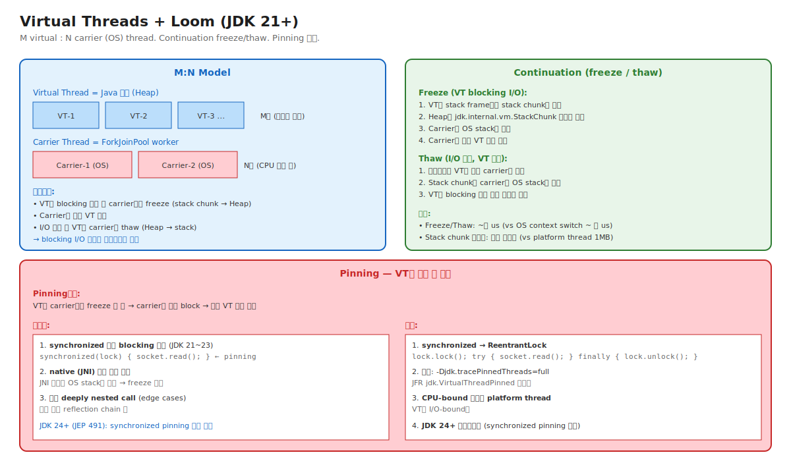

# 05-04. Virtual Threads + Project Loom (JDK 21+)

> 1998년 JDK 1.2부터 Java thread = OS thread (1:1). 25년 후 JDK 21에서 그 모델이 깨졌다 — **M개 virtual : N개 carrier** 의 M:N 모델.
> Virtual Thread는 Heap의 stack chunk + Continuation freeze/thaw로 수십만 thread 가능. 그러나 **synchronized + blocking** 조합이 carrier를 잡는 **Pinning 함정** 이 운영 사고의 단골.
> 시니어가 알아야 할 것: Virtual Thread는 만능 아니다. I/O bound는 좋지만 CPU bound는 부적합. Pinning 진단 능력 필수.

---

## 🗺️ 위치



---

## 📍 학습 목표

1. **M:N Threading Model** — Virtual Thread (M) : Carrier Thread (N).
2. **Continuation** — freeze (Heap stack chunk) / thaw (carrier OS stack).
3. **ForkJoinPool 기반 스케줄러** — 기본 carrier pool.
4. **Pinning** — VT가 carrier에 묶여 freeze 못 함. 4가지 트리거.
5. **`-Djdk.tracePinnedThreads=full`** — pinning 진단.
6. **synchronized vs ReentrantLock** — VT 환경의 선택.
7. **Virtual Thread per task 패턴** — `Executors.newVirtualThreadPerTaskExecutor()`.
8. **JDK 24+ JEP 491** — synchronized pinning 해소.
9. **ThreadLocal과 VT** — 수십만 thread × ThreadLocal 메모리 영향.
10. 운영 시나리오: VT 도입 후 throughput 변화 / pinning 진단 / Spring + VT 통합.

---

## 🎨 1단계: 백지 그리기 가이드

### Step 1: M:N 모델

```
[Virtual Thread (M개, Heap 객체)]
VT-1, VT-2, ..., VT-1000000

[Carrier Thread (N개, OS)]
Carrier-1, Carrier-2, ..., Carrier-8

VT는 carrier 사이를 freeze/thaw로 이동
```

### Step 2: Continuation

```
VT가 blocking 호출:
  - Stack frame들 → StackChunk (Heap)
  - Carrier OS stack 비움
  - Carrier가 다른 VT 실행

I/O 완료:
  - StackChunk → carrier OS stack
  - VT 재개
```

### Step 3: Pinning

```
synchronized(lock) {
    socket.read();   ← blocking
}

synchronized = carrier OS lock 사용
→ VT가 freeze 불가
→ carrier도 같이 block
→ 다른 VT 실행 못 함
→ M:N 이점 상실
```

### 정답 그림

위의 [04-virtual-threads.svg](./_excalidraw/04-virtual-threads.svg) 참조.

---

## 🧠 2단계: 직관

### 핵심 비유

> **택시 비유**:
> - **Platform Thread (1:1)** = 손님 1명 = 택시 1대. 손님이 많으면 택시도 많이 필요.
> - **Virtual Thread (M:N)** = 손님은 만 명, 택시는 100대. 손님이 식당(I/O) 들어가면 택시는 다른 손님 태움.
> - **Pinning** = 손님이 택시 안에서 식사 (synchronized + blocking). 택시는 못 떠나고 다른 손님 못 태움.

### 정확한 정의

| 용어 | 정의 |
|---|---|
| **Virtual Thread** | Java 21+ 의 경량 thread. Heap의 Java 객체. M:N 스케줄링. `Thread.ofVirtual().start(...)`. |
| **Carrier Thread** | Virtual Thread를 실제 실행하는 OS thread. 기본 ForkJoinPool worker. |
| **Continuation** | Stack 상태를 freeze/thaw하는 메커니즘. `jdk.internal.vm.Continuation`. |
| **Stack Chunk** | VT의 stack 데이터를 Heap에 보관하는 자료구조. `jdk.internal.vm.StackChunk`. 가변 크기. |
| **Freeze** | VT의 stack을 carrier에서 떼어 Heap chunk로 옮김. blocking 호출 시 자동. |
| **Thaw** | Heap chunk를 carrier OS stack에 복원. I/O 완료 후 자동. |
| **Pinning** | VT가 carrier에 묶여 freeze 불가능. carrier도 블록됨. |
| **`Executors.newVirtualThreadPerTaskExecutor()`** | 각 task마다 새 VT 생성하는 executor. JDK 21+ 표준. |

### 왜 Virtual Thread가 필요했나

```
[Platform Thread (1:1) 한계]
   서버가 10만 connection 동시 처리:
     10만 thread × 1MB stack = 100GB 메모리 ← 불가능
     OS context switch ~수 us × 10만 = ~수 초/요청 ← 불가능

[기존 해결 — 비동기 코드]
   Netty, CompletableFuture로 작성:
     - 코드 복잡 (callback hell, chained CompletableFuture)
     - 디버깅 어려움 (stack trace 잘림)
     - Synchronous 코드 패턴 못 씀

[Virtual Thread 약속]
   "평범한 synchronous 코드를 쓰면서 수십만 thread"
   - sync 코드 그대로 (직관적)
   - 디버깅 자연스러움 (stack trace 정상)
   - I/O blocking 호출이 freeze/thaw로 처리
```

### 왜 Pinning이 위험한가

```
정상 VT 동작:
  VT-1 blocks → freeze → carrier 실행 VT-2
  VT-2 blocks → freeze → carrier 실행 VT-3
  ...
  carrier 1대로 수많은 VT 처리

Pinning 발생:
  VT-1 synchronized 안 blocking → pinning
  carrier도 같이 block
  → carrier-1에서 다른 VT 실행 불가
  → 다른 VT들은 다른 carrier를 기다림
  → carrier 부족 시 throughput 급감

결과: Virtual Thread의 이점 상실
```

---

## 🔬 3단계: 구조

### Continuation의 freeze/thaw

```
[Freeze 흐름]

1. VT가 blocking 호출 (예: socket.read()):
   - JDK 21+ I/O API가 "이건 block될 것" 인식
   - Continuation.yield() 호출

2. Continuation.yield():
   - 현재 stack의 frame들을 StackChunk 객체로 복사
   - StackChunk를 VT 객체의 _continuation 필드에 저장
   - Carrier의 OS stack을 base까지 unwind
   - Carrier가 ForkJoinPool로 돌아감

3. Carrier가 다른 VT 실행:
   - 스케줄러가 다음 runnable VT 선택
   - 그 VT의 StackChunk를 carrier OS stack에 복원 (thaw)
   - 실행 재개

[Thaw 흐름]

1. I/O 완료 (OS의 epoll/kqueue 이벤트):
   - JDK 21+ NIO selector가 감지
   - 해당 VT를 runnable로 표시

2. 스케줄러가 VT를 어느 carrier에 할당:
   - StackChunk를 carrier OS stack에 복사
   - VT의 마지막 yield 지점부터 재개

3. socket.read() 다음 줄부터 실행 계속
```

### Pinning 트리거 자세히

#### 1. synchronized + blocking (JDK 21~23)

```java
synchronized (lock) {           // ← carrier의 OS mutex 잡음
    Thread.sleep(1000);          // ← blocking — freeze 시도
    // 그러나 carrier mutex 풀 수 없음
    // → pinning
}
```

JDK 24+ (JEP 491)에서 synchronized도 freeze 가능하게 개선.

#### 2. JNI 호출

```java
nativeMethod();   // ← JNI native 함수 호출 중
                  // OS stack 위에 native frame
                  // freeze 불가 (native 코드는 stack 의존)
```

#### 3. Deeply nested call

```
매우 깊은 reflection chain (1000+ frames):
  → StackChunk가 너무 큼
  → 성능 영향 또는 일부 케이스 pinning
```

### 진단 — `-Djdk.tracePinnedThreads=full`

```bash
java -Djdk.tracePinnedThreads=full -jar app.jar
```

Pinning 발생 시 stack trace 출력:
```
Thread[#23,virtual=Lambda$1234, ...]
   java.base/java.lang.VirtualThread.runWith
   java.base/java.lang.Thread.sleep
   ...
   <== monitors:1   ← ★ synchronized 안 pinning
   at MyService.process(MyService.java:42)
```

`<== monitors:N` = synchronized N개 holding 중.

### JFR Pinning 이벤트

```bash
jcmd <pid> JFR.start name=vt duration=300s settings=profile
jfr summary vt.jfr | grep -i 'Pinned'
```

이벤트:
- `jdk.VirtualThreadPinned` — pinning 발생.
- `jdk.VirtualThreadStart/End` — VT lifecycle.

### Virtual Thread per task 패턴

```java
// JDK 21+ 표준 패턴
try (var executor = Executors.newVirtualThreadPerTaskExecutor()) {
    IntStream.range(0, 10_000).forEach(i -> {
        executor.submit(() -> {
            // 각 task가 자기 VT에서 실행
            doWork(i);
        });
    });
}
```

vs 전통적 ThreadPool:
```java
// 옛 방식 — fixed pool
try (var executor = Executors.newFixedThreadPool(200)) {
    IntStream.range(0, 10_000).forEach(i -> {
        executor.submit(() -> doWork(i));
    });
}
// 10,000 task가 200 thread를 공유. 각 task가 blocking 시 throughput 제한.
```

→ VT per task: 무제한 동시성. blocking I/O 자유.

### ThreadLocal과 VT

```java
// 평범한 ThreadLocal
private static final ThreadLocal<Object> TL = new ThreadLocal<>();

// 100,000 VT가 각자 TL 사용:
for (int i = 0; i < 100_000; i++) {
    Thread.startVirtualThread(() -> {
        TL.set(new BigObject());   // ← 각 VT의 ThreadLocal에 객체
        // ...
    });
}

// 결과: 100,000 × BigObject 메모리 사용
```

운영 함의:
- ThreadLocal은 thread당 1개 entry.
- VT 수가 폭증하면 ThreadLocal 메모리도 폭증.
- 새로운 `ScopedValue` (JDK 21+ preview) 가 대안 — VT에 더 친화.

---

## 🧬 4단계: 내부 구현 — HotSpot

### VirtualThread 클래스

위치: `src/java.base/share/classes/java/lang/VirtualThread.java`

```java
class VirtualThread extends BaseVirtualThread {
    private Thread carrierThread;          // 현재 carrier
    private Continuation cont;             // 본 continuation
    
    void run(Runnable task) {
        // ForkJoinPool에 자기를 submit
        scheduler.execute(this);
    }
    
    void mount() {
        // Carrier에 thaw
        currentThread = carrierThread;
        cont.run();
    }
    
    void unmount() {
        // Carrier에서 freeze
        cont.yield();
    }
}
```

### Continuation 구현

위치: `src/hotspot/share/runtime/continuation.cpp`

```cpp
freeze_result Continuation::freeze(JavaThread* thread, ...) {
    // 1. 현재 stack frame들 walk
    for (frame f = thread->last_frame(); !f.is_continuation_entry(); f = f.sender()) {
        // 2. 각 frame을 StackChunk에 복사
        copy_frame_to_chunk(f);
    }
    
    // 3. Stack을 base까지 unwind
    unwind_stack();
    
    return freeze_ok;
}
```

### Pinning 감지

```cpp
freeze_result Continuation::freeze(...) {
    // Check for monitors (synchronized)
    if (thread->held_monitor_count() > 0) {
        return freeze_pinned_monitor;   // ★ pinning
    }
    
    // Check for native frames
    if (has_native_frames(thread)) {
        return freeze_pinned_native;     // ★ pinning
    }
    
    // ... freeze 진행
}
```

---

## 📜 5단계: 역사

| 연도 | 변화 |
|---|---|
| 1998 | JDK 1.2 — Native Thread (1:1) |
| 2017 | Project Loom 시작 |
| 2019 | JDK 13 — Continuation 실험 (internal) |
| 2022 | JDK 19 — Virtual Thread (preview) |
| 2023 | **JDK 21 — Virtual Thread stable** (JEP 444) |
| 2024 | JDK 23 — VT 개선 |
| 2025 | JDK 24+ (예상) — synchronized pinning 해소 (JEP 491) |

### Project Loom의 의의

- Ron Pressler 주도 (Oracle).
- 5년 개발.
- "color of function" 문제 해결 — sync/async 코드 분리 종말.
- Erlang/Go의 lightweight thread를 Java에.

---

## ⚖️ 6단계: 트레이드오프

### Virtual Thread vs Platform Thread

| | Virtual Thread | Platform Thread |
|---|---|---|
| 메모리 (per thread) | ~수 KB (Heap) | 1MB (OS stack) |
| 최대 수 | 수십만~수백만 | ~수천 |
| 생성 비용 | ~수 us | ~수 ms |
| Context switch | ~수 us (JVM) | ~수 us (OS) |
| I/O bound | ✅ 최적 | △ |
| CPU bound | ❌ (carrier 점유) | ✅ |
| synchronized + I/O | ❌ pinning (JDK 21~23) | ✅ |
| 디버깅 | stack trace 정상 | 정상 |

### 사용 가이드

```
I/O bound web service (DB, HTTP): VT 적극 사용.
CPU bound (image processing, ML inference): Platform thread.
Hybrid: VT + dedicated CPU pool 분리.
synchronized + blocking 많은 코드: ReentrantLock으로 변경 또는 JDK 24+ 대기.
```

---

## 📊 7단계: 측정·진단

### Pinning 진단

```bash
java -Djdk.tracePinnedThreads=full -jar app.jar
```

또는 JFR:
```bash
jcmd <pid> JFR.start name=vt duration=60s
jfr summary vt.jfr | grep Pinned
```

### VT 수 모니터링

```bash
jcmd <pid> Thread.print | grep -c "virtual="
```

### 시나리오: VT 도입 후 throughput 감소

```
환경: Spring Boot, JDK 21, VT executor 도입
증상: 평소 1000 req/s → 800 req/s

진단:
1. -Djdk.tracePinnedThreads=full → pinning 빈번?
2. JFR VirtualThreadPinned 이벤트 분포
3. synchronized 사용처 audit

원인 후보:
- synchronized + DB call (HikariCP, JDBC driver)
- synchronized + HTTP client

조치:
- DB/HTTP client 라이브러리 업그레이드 (VT 친화)
- synchronized → ReentrantLock 변경
- JDK 24+ 대기 (synchronized pinning 해소)
```

---

## ⚔️ 8단계: 꼬리질문 트리

### Q1. Virtual Thread와 Platform Thread의 차이는?

> - Platform: OS thread 1:1. Stack 1MB OS 영역. 생성 비용 큼.
> - Virtual: Heap 객체 + Continuation. Stack chunk 가변. M:N 스케줄링.
> 
> VT는 수십만 thread 가능. I/O blocking 자동 freeze/thaw로 처리.

### Q2. Pinning이 무엇이고 어떻게 진단하나요?

> VT가 carrier에 묶여 freeze 못 함. carrier도 같이 block.
> 트리거: synchronized 안 blocking, JNI, deeply nested.
> 진단: `-Djdk.tracePinnedThreads=full` 또는 JFR jdk.VirtualThreadPinned.
> 해결: synchronized → ReentrantLock, JDK 24+ 업그레이드.

### Q3. (Killer) Spring Boot에 VT 도입했더니 throughput이 줄었습니다. 진단하세요.

> 1. **Pinning 의심**:
>    - `-Djdk.tracePinnedThreads=full`로 즉시 확인.
>    - 출력에서 `<== monitors:N` 빈도.
> 
> 2. **Pinning 원인**:
>    - 옛 라이브러리 (synchronized + I/O).
>    - JDBC driver 일부 (HikariCP, Oracle JDBC 일부).
>    - HTTP client (Apache HttpClient 옛 버전).
> 
> 3. **조치**:
>    - 라이브러리 업그레이드 (VT 친화 버전).
>    - synchronized → ReentrantLock 변경.
>    - JDK 24+ 대기 (synchronized pinning 자동 해소).
>    - 다시 측정.
> 
> 4. **검증**:
>    - JFR 이벤트로 pinning rate 0 확인.
>    - 부하 테스트로 throughput 회복.

---

## 🔗 다음 단계

05-threading 종료. 다음:
- → [Chapter 06. Version History](../06-version-history/)
- → [Chapter 10. Ops Scenarios](../10-ops-scenarios/)
