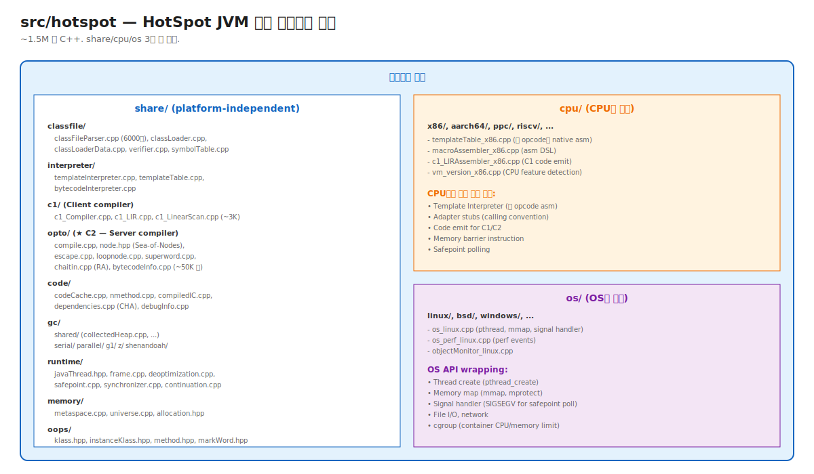

# 07. HotSpot Internals — src/hotspot 풀 투어

> JVM의 모든 기능 (Class Loading, Interpreter, JIT, GC, Threading, Safepoint)이 `src/hotspot` 한 디렉토리에 있다. ~1.5M 줄 C++.
> 시니어가 알아야 할 것: 사고 시 어느 파일을 봐야 하는지. OpenJDK bug report에서 source 참조 이해. 새 기능의 PR 추적.

---

## 🗺️ 위치



---

## 📍 학습 목표

1. **3대 분할**: share/ + cpu/ + os/.
2. **share/의 핵심 디렉토리** 11개와 각 책임.
3. **opto/ (C2 compiler)** 구조 — 50K 줄.
4. **C2 phase 순서 풀버전**: Parse → IterGVN → Inlining → EA → Loop opts → Macro Expand → CCP → Scheduling → RA → Output.
5. **Sea-of-Nodes 노드 종류** 풀 리스트.
6. **Safepoint 풀 구현** — polling page mprotect, signal handler.
7. **GC 디렉토리별 구현** 매핑.
8. **CPU별 디렉토리**의 책임 분할 — 새 CPU 지원 시 무엇을 추가하나.
9. **JVMCI** — Graal 같은 외부 JIT을 위한 인터페이스.
10. OpenJDK PR/JEP을 source 레벨로 추적하는 방법.

---

## 📂 디렉토리 매핑 (운영자 관점)

### `src/hotspot/share/` — Platform-independent

| 디렉토리 | 책임 | 핵심 파일 (이전 챕터와 연결) |
|---|---|---|
| `classfile/` | ClassFile parsing, ClassLoader | `classFileParser.cpp` (Chapter 01-01) |
| `interpreter/` | Template Interpreter | `templateTable.cpp` (Chapter 03-02) |
| `c1/` | C1 compiler | `c1_Compiler.cpp` (Chapter 03-04) |
| `opto/` | C2 compiler (Sea-of-Nodes) | `compile.cpp` (Chapter 03-04, 06, 07) |
| `code/` | Code Cache, nmethod, IC | `codeCache.cpp` (Chapter 02-04, 03-05) |
| `gc/shared/`, `gc/{serial,parallel,g1,z,shenandoah}/` | GC 알고리즘 | Chapter 04 |
| `runtime/` | Thread, frame, safepoint, deopt | `safepoint.cpp` (Chapter 04, 05) |
| `memory/` | Heap, Metaspace, Universe | `metaspace.cpp` (Chapter 02-02) |
| `oops/` | InstanceKlass, Method, oop | `klass.hpp` (Chapter 02-02) |
| `prims/` | JNI, Unsafe | `unsafe.cpp` (Chapter 02-05) |
| `compiler/` | Compile Broker, JVMCI | `compileBroker.cpp` (Chapter 03-03) |

### `src/hotspot/cpu/{x86,aarch64,...}/`

CPU별 구현. 각 CPU마다 별도 작성 필요:
- Template Interpreter의 opcode asm.
- C1/C2의 code emit.
- Memory barrier instruction.
- Adapter (calling convention 변환).
- Safepoint polling.

### `src/hotspot/os/{linux,bsd,windows,...}/`

OS API wrapping:
- Thread (pthread vs Win32).
- Memory (mmap, mprotect).
- Signal handler (SIGSEGV, SIGUSR1).
- I/O.
- cgroup (container limit 인식).

---

## 🎯 C2 phase 순서 풀 매핑

위치: `src/hotspot/share/opto/compile.cpp` `Compile::Optimize()`.

```cpp
void Compile::Optimize() {
    // Phase 1: Parse (별도 함수, ParseGenerator)
    // 결과: Sea-of-Nodes 초기 그래프
    
    // Phase 2: IterGVN (iterative)
    PhaseIterGVN igvn(initial_gvn());
    igvn.optimize();
    
    // Phase 3: Inlining (incremental)
    inline_incrementally();
    
    // Phase 4: Macro Expand 일부
    PhaseMacroExpand mex(igvn);
    mex.eliminate_macro_nodes();  // EA 결과 적용
    
    // Phase 5: Escape Analysis
    if (do_escape_analysis()) {
        ConnectionGraph::do_analysis(this, &igvn);
    }
    
    // Phase 6: Loop optimizations
    PhaseIdealLoop::optimize(igvn, ...);
    // - Loop unrolling
    // - Range Check Elimination
    // - Loop Invariant Code Motion
    // - SuperWord (vectorization)
    
    // Phase 7: CCP (Conditional Constant Propagation)
    PhaseCCP ccp(&igvn);
    ccp.do_transform();
    
    // Phase 8: Macro Expand 나머지
    mex.expand_macro_nodes();
    
    // Phase 9: Scheduling (Global Code Motion)
    PhaseCFG cfg(...);
    cfg.do_global_code_motion();
    
    // Phase 10: Register Allocation (Graph Coloring)
    PhaseChaitin allocator(...);
    allocator.Register_Allocate();
    
    // Phase 11: Output (machine code emit)
    output();
}
```

→ 각 phase의 풀버전 코드는 [Chapter 03-04 C1 and C2](../03-execution-engine/04-c1-and-c2.md) 참조.

---

## 🌐 Sea-of-Nodes 노드 종류 풀 리스트

위치: `src/hotspot/share/opto/{node.hpp, ...}`.

### Control 노드 (basic block boundary)
- `StartNode` — 메서드 entry.
- `RegionNode` — basic block merge point.
- `IfNode` — 분기.
- `ProjNode` — multi-output 노드의 한 결과 추출.
- `JumpNode` — switch.
- `ReturnNode` — 메서드 return.

### Data 노드 (computation)
- `AddINode`, `SubINode`, `MulINode`, `DivINode` — int 산술.
- `AddLNode`, `AddFNode`, `AddDNode` — long/float/double.
- `AndINode`, `OrINode`, `XorINode` — bitwise.
- `CmpINode`, `CmpPNode` — compare.

### Memory 노드
- `LoadNode` (LoadINode, LoadPNode 등) — memory read.
- `StoreNode` — memory write.
- `MemBarNode` — memory barrier (volatile 등).

### Call 노드
- `CallNode` (base).
- `CallJavaNode` — Java 메서드 호출.
- `CallStaticJavaNode` — static call.
- `CallDynamicJavaNode` — invokevirtual/interface (dynamic dispatch).
- `CallRuntimeNode` — VM helper call (GC 등).
- `CallLeafNode` — leaf call (no safepoint).

### SSA / Control
- `PhiNode` — SSA phi.
- `LoopNode` — loop header.

### Safepoint / Allocation
- `SafePointNode` — GC safepoint 후보.
- `AllocateNode` — `new` instruction (EA가 처리).
- `LockNode`, `UnlockNode` — synchronized.

각 노드는 `Node` 클래스의 subclass. `_in[]` (input edges) + `_out[]` (output edges)로 연결.

---

## 🛑 Safepoint 풀 구현

위치: `src/hotspot/share/runtime/safepoint.cpp`.

### Polling Page 설정

```cpp
void SafepointSynchronize::begin() {
    // 1. 모든 Java thread를 safepoint 진입 요청
    Universe::heap()->arm_polling_page();   // mprotect(PROT_NONE)
    
    // 2. 각 thread의 진행 확인
    for (JavaThread* t : threads) {
        if (t->is_in_running_state()) {
            // 아직 진행 중 — wait
        }
    }
    
    // 3. 모든 thread가 safepoint 도달 → GC 등 진행 OK
}
```

### Polling Instruction (JIT inline)

매 method entry/exit, loop back-edge에 JIT이 삽입:
```
test rax, [polling_page]   ; polling page read
                            ; 정상 시: read 성공
                            ; safepoint 요청 시: mprotect(PROT_NONE)으로 SEGV
```

### Signal Handler (SEGV → safepoint)

위치: `src/hotspot/os/linux/os_linux.cpp`

```cpp
extern "C" int JVM_handle_linux_signal(int sig, siginfo_t* info, void* ucVoid, int abort_if_unrecognized) {
    if (sig == SIGSEGV) {
        // SEGV 주소가 polling page인지 확인
        if (info->si_addr == polling_page_base) {
            // ★ 정상 safepoint poll — thread 정지
            current_thread->block_for_safepoint();
            return true;
        }
        // 진짜 SEGV — JVM crash
    }
    return false;
}
```

→ "mprotect + SEGV signal"이 safepoint의 핵심 메커니즘. 모든 polling 지점이 자연스러운 정지점.

---

## 🔌 JVMCI — 외부 JIT 인터페이스

위치: `src/hotspot/share/jvmci/`.

JVM Compiler Interface (JEP 243, JDK 9+):
- HotSpot이 외부 JIT compiler를 plugin으로 받음.
- Graal이 이걸 통해 동작.
- `-XX:+UnlockExperimentalVMOptions -XX:+UseJVMCICompiler`.

C2 대체 가능. [Chapter 08 GraalVM](../08-graalvm/) 참조.

---

## 📚 OpenJDK 소스 탐색

### Clone

```bash
git clone https://github.com/openjdk/jdk.git
cd jdk
```

### 핵심 디렉토리

- `src/hotspot/` — JVM C++ 소스.
- `src/java.base/` — Java 표준 라이브러리.
- `test/hotspot/` — JVM 테스트.

### PR/JEP 추적

```bash
# JEP 444 (Virtual Threads) 관련 commit
git log --all --grep="JEP 444" --oneline

# 특정 파일 history
git log --follow src/hotspot/share/runtime/continuation.cpp
```

### Bug report 이해

OpenJDK Bug Tracker: https://bugs.openjdk.org/

각 bug에 source file path + line number 참조. 본 챕터의 매핑으로 즉시 navigate.

---

## ⚔️ 꼬리질문

### Q1. C2 컴파일 시 phase 순서는?

> 11단계 (compile.cpp Compile::Optimize()):
> Parse → IterGVN → Inlining → Macro Eliminate → EA → Loop opts → CCP → Macro Expand → Scheduling → RA → Output.

### Q2. Safepoint polling이 어떻게 동작하나요?

> mprotect + SEGV 메커니즘:
> 1. JVM이 polling page를 정상 → safepoint 요청 시 PROT_NONE.
> 2. JIT 컴파일 코드가 polling page 읽음.
> 3. PROT_NONE 상태에서 SEGV.
> 4. Signal handler가 catch → safepoint 처리.
> 
> "예외를 통신 채널로" — 정상 polling 호출 비용 0, 안전한 stop 시점 보장.

### Q3. (Killer) OpenJDK bug report에서 source 참조를 어떻게 따라가나요?

> 1. Bug description의 file path 확인 (예: `src/hotspot/share/opto/escape.cpp`).
> 2. 본 챕터의 매핑으로 어느 컴포넌트인지 식별.
> 3. `git clone openjdk/jdk` 후 `git log --follow` 로 history.
> 4. PR commits 추적 — 어떤 변경이 bug fix.
> 5. JEP/RFE 번호 있으면 https://bugs.openjdk.org/ 검색.

---

## 🔗 다음 단계

- → [Chapter 08. GraalVM](../08-graalvm/)
- ← [모든 챕터의 C++ source 참조] — 본 챕터가 reference.

## 📚 참고

- **OpenJDK source**: https://github.com/openjdk/jdk
- **OpenJDK Bug Tracker**: https://bugs.openjdk.org/
- **HotSpot Glossary**: https://openjdk.org/groups/hotspot/docs/HotSpotGlossary.html
- **OpenJDK Wiki**: https://wiki.openjdk.org/display/HotSpot
