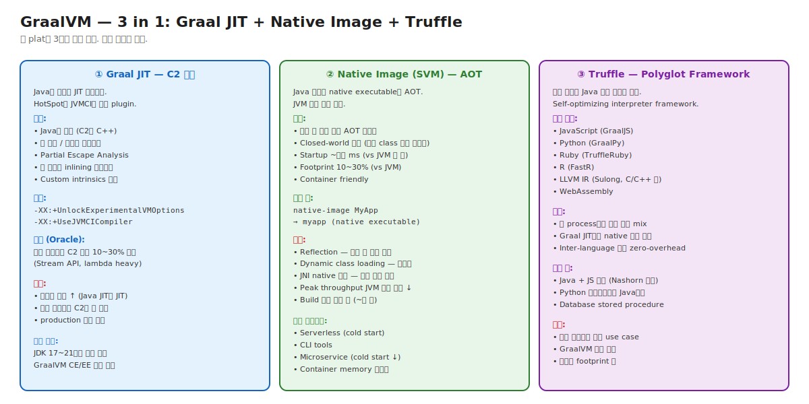

# 08. GraalVM — Graal JIT + Native Image + Truffle

> GraalVM 한 이름에 3가지 다른 도구. **Graal JIT** (C2 대체), **Native Image** (AOT, JVM 없이 실행), **Truffle** (polyglot framework).
> 시니어가 알아야 할 것: 각자 다른 운영 결정. Native Image가 cold start 시대(serverless, microservice)의 주요 무기.

---

## 🗺️ 위치



---

## 📍 학습 목표

1. **GraalVM 3 components** — 각자 다른 목적.
2. **Graal JIT** — JVMCI 통한 C2 대체.
3. **Native Image (SVM)** — Closed-world AOT.
4. **Native Image의 제약** — Reflection, Dynamic class loading.
5. **Truffle Polyglot** — 다른 언어 통합.
6. **Spring Boot 3 + Native Image** — 대표 use case.
7. **Quarkus, Micronaut** — Native Image friendly framework.
8. **JDK 22+ Project Leyden** — Native Image 표준화 방향.
9. **운영 결정**: 언제 GraalVM 도입하나.
10. JVM vs Native Image 트레이드오프.

---

## 🎯 운영 결정 매트릭스

```
┌────────────────────────────┬───────────────────────────┐
│ 워크로드/조건                │ GraalVM 도입 권장         │
├────────────────────────────┼───────────────────────────┤
│ Serverless (Lambda 등)      │ Native Image ✅            │
│ CLI tool (`mvn`, `kubectl` 류)│ Native Image ✅            │
│ Microservice cold start 중요│ Native Image ✅            │
│ 일반 web service            │ JVM (HotSpot) 권장        │
│ Latency-critical 큰 Heap   │ JVM + ZGC 권장            │
│ Polyglot 필요 (JS, Python)  │ Truffle ✅                │
│ Peak throughput 최우선      │ JVM + Graal JIT 검토      │
│ Container memory 제한적     │ Native Image 검토         │
└────────────────────────────┴───────────────────────────┘
```

## 🚀 Native Image 흐름

```
[빌드 시]
1. native-image MyApp
2. 모든 class를 scan + reachability 분석 (closed-world)
3. AOT 컴파일 (Graal compiler 사용)
4. SubstrateVM (작은 GC + threading) 통합
5. 결과: native executable (~수십 MB)

[런타임]
- JVM 없이 직접 실행
- Startup ~수십 ms
- Heap GC는 SubstrateVM이 처리 (Serial 또는 G1 비슷)
- JIT 없음 (이미 AOT 컴파일)
```

## ⚖️ JVM vs Native Image

| | JVM (HotSpot) | Native Image |
|---|---|---|
| Startup | 수 초 (warmup) | 수십 ms |
| Footprint | 200MB+ | 30~100MB |
| Peak throughput | 100% | 80~90% |
| Build 시간 | < 1분 | ~수 분 |
| Reflection | 자유 | 빌드 시 명시 |
| Dynamic class | 자유 | 제한적 |
| JIT 최적화 | continuous | 빌드 시 한 번 |
| Production maturity | 매우 성숙 | 성숙 중 |

## 🛠️ Spring Boot 3 + Native Image

```bash
# Spring Boot 3+가 Native Image 직접 지원
./mvnw -Pnative native:compile

# 결과: target/myapp (native executable)
# Startup: 200ms (vs JVM 3초)
# Footprint: 70MB (vs JVM 300MB)
```

Spring AOT engine이 reflection metadata 자동 생성 — 옛 Spring의 reflection-heavy 코드가 Native Image 친화.

## ⚔️ 꼬리질문

### Q1. Native Image의 closed-world 가정이 무엇인가요?

> 빌드 시점에 모든 class + method가 알려져 있다는 가정.
> Dynamic class loading, runtime reflection 제한.
> 빌드 시 reachability 분석 → 미사용 코드 제거 → 작은 binary.

### Q2. Native Image의 단점은?

> 1. Reflection — 빌드 시 명시 (hint files).
> 2. Build 시간 매우 김.
> 3. Peak throughput JVM 대비 약간 ↓ (JIT 최적화 없음).
> 4. Dynamic class loading 제한.
> 5. 일부 라이브러리 미지원.

### Q3. (Killer) Lambda 함수로 배포 중인 Java app의 cold start가 5초입니다. 어떻게 줄이나요?

> 옵션:
> 1. **Native Image**: 5초 → 200ms. 가장 큰 효과.
>    - Spring Boot 3 사용 시 `native-image` 빌드 지원.
>    - Quarkus, Micronaut도 Native friendly.
> 
> 2. **AppCDS** (JVM): 5초 → 2초. 적용 쉬움.
>    - Class data sharing.
> 
> 3. **Project Leyden** (JDK 22+): 진행 중. AOT 표준.
> 
> 4. **Lambda warmup** (Provisioned Concurrency): 인프라 비용 ↑.

---

## 🔗 다음 단계

- → [Chapter 10. Ops Scenarios](../10-ops-scenarios/)
- ← [Chapter 03. Execution Engine](../03-execution-engine/)

## 📚 참고

- **GraalVM**: https://www.graalvm.org/
- **Spring Boot 3 Native**: https://spring.io/blog/2022/11/22/spring-boot-3-0-goes-ga
- **Project Leyden**: https://openjdk.org/projects/leyden/
- **Quarkus**: https://quarkus.io/
- **Micronaut**: https://micronaut.io/
