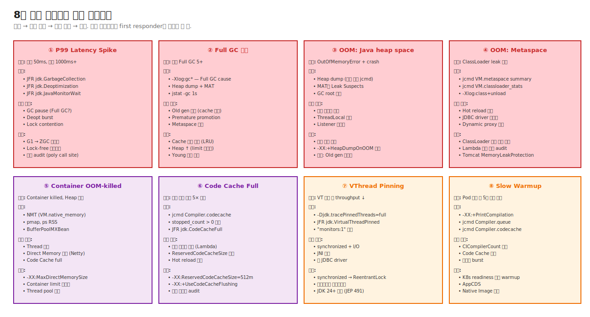

# 10. Ops Scenarios — 8대 운영 사고 종합

> JVM 모든 챕터가 결국 답하는 운영 질문 8가지. 시니어가 production에서 첫 30분 안에 진단할 수 있어야.

---

## 🗺️ 위치



---

## 📚 8대 시나리오 매트릭스

| # | 시나리오 | 증상 | First diagnostic |
|---|---|---|---|
| ① | P99 Latency Spike | 평소 50ms, 가끔 1000ms+ | JFR jdk.GarbageCollection, jdk.Deoptimization |
| ② | Full GC 빈발 | 분당 5+ Full GC | -Xlog:gc*, Heap dump |
| ③ | OOM: Java heap space | OutOfMemoryError | Heap dump + MAT |
| ④ | OOM: Metaspace | ClassLoader leak | jcmd VM.classloader_stats |
| ⑤ | Container OOM-killed | Heap dump 정상인데 죽음 | NMT, BufferPoolMXBean |
| ⑥ | Code Cache Full | 시간 지나 5× 느림 | jcmd Compiler.codecache |
| ⑦ | VThread Pinning | VT 도입 후 throughput ↓ | -Djdk.tracePinnedThreads |
| ⑧ | Slow Warmup | Pod cold start 5분 | jcmd Compiler.queue |

각 시나리오는 **증상 → 진단 명령 → 가능 원인 → 단계별 조치 → 검증** 흐름.

---

## 🛠️ 시나리오 ① — P99 Latency Spike

**증상**: 평소 P99 50ms, 1시간에 1~2회 P99 1000ms+.

**진단 절차**:
```bash
jcmd <pid> JFR.start name=spike duration=600s settings=profile filename=spike.jfr
jfr print --events jdk.GarbageCollection,jdk.Deoptimization,jdk.JavaMonitorWait spike.jfr
```

**원인 분류**: GC pause (Ch.04), Deopt (Ch.03-08), Lock contention (Ch.05-03), TTSP.

**조치**: G1 → ZGC / 코드 audit / Lock-free 자료구조 / counted loop opt.

## 🛠️ 시나리오 ② — Full GC 빈발

**증상**: 분당 5+ Full GC.

**진단**:
```bash
-Xlog:gc*=info
jcmd <pid> GC.heap_dump /tmp/heap.hprof
# MAT으로 Old gen 분석
```

**원인**: Old gen 누적 (cache 누수), premature promotion, Metaspace 압박.

**조치**: Cache LRU eviction, ClassLoader 누수 점검, Young/Old 비율, ZGC.

## 🛠️ 시나리오 ③ — OOM: Java heap space

**준비** (사전 필수):
```bash
-XX:+HeapDumpOnOutOfMemoryError -XX:HeapDumpPath=/var/log/heap.hprof
```

**5대 누수 패턴**:
1. 정적 컬렉션 (`static Map<>`).
2. ThreadLocal (Tomcat thread pool).
3. Listener 미해제.
4. Cache (TTL/Size limit 없음).
5. JDBC Driver 미해제.

**진단**: MAT의 Leak Suspects, Dominator tree, GC Roots 추적.

## 🛠️ 시나리오 ④ — OOM: Metaspace

**진단**:
```bash
jcmd <pid> VM.metaspace summary       # loaders 수 확인
jcmd <pid> VM.classloader_stats        # 같은 CL 인스턴스 다수?
-Xlog:class+unload=info                # unload 빈도
```

**5대 ClassLoader 누수**: 정적 캐시, ThreadLocal, JDBC Driver, Logger context, Reflection cache.

**조치**: 누수 코드 수정 + `-XX:MaxMetaspaceSize=512m`.

## 🛠️ 시나리오 ⑤ — Container OOM-killed

**증상**: 컨테이너 OOM-killed인데 Heap dump 정상.

**진단**:
```bash
# 사전: -XX:NativeMemoryTracking=summary
jcmd <pid> VM.native_memory summary

# 각 영역 합산:
# Java Heap + Metaspace + Thread (수 × 1MB) + Code Cache + GC + Direct Memory + Internal
```

**일반 분포** (5GB limit):
- Heap: 2GB, Metaspace: 500MB, Thread×500: 500MB, Code Cache: 240MB, Direct: 1GB, 여유: 700MB.

**조치**: container limit의 50~70% Heap, 모든 영역 명시.

## 🛠️ 시나리오 ⑥ — Code Cache Full

**진단**:
```bash
jcmd <pid> Compiler.codecache
# stopped_count > 0 → JIT 멈춤
# non-profiled: 117MB / 117MB (100%) → 가득
```

**조치**:
- `-XX:ReservedCodeCacheSize=512m`.
- `-XX:+UseCodeCacheFlushing` (기본 on).
- 동적 proxy/lambda audit.
- `-XX:TieredStopAtLevel=3` (Code Cache 절약 트레이드).

## 🛠️ 시나리오 ⑦ — VThread Pinning

**진단**:
```bash
java -Djdk.tracePinnedThreads=full -jar app.jar
# "<== monitors:1" 빈도

jcmd <pid> JFR.start name=vt duration=60s
jfr print --events jdk.VirtualThreadPinned vt.jfr
```

**트리거**: synchronized + I/O, JNI, 옛 JDBC driver.

**조치**: synchronized → ReentrantLock, 라이브러리 업그레이드, JDK 24+ 대기 (JEP 491).

## 🛠️ 시나리오 ⑧ — Slow Warmup

**진단**:
```bash
jcmd <pid> Compiler.queue           # 큐 적체?
jcmd <pid> PerfCounter.print | grep CICompiler   # CICompilerCount=1?
jcmd <pid> Compiler.codecache       # Code Cache 압박?
```

**조치**:
1. K8s readinessProbe.initialDelaySeconds 충분히.
2. 합성 부하 warmup script.
3. AppCDS — Class Data Sharing.
4. Native Image (GraalVM) — startup 200ms.
5. CPU limit ↑ (자연스러운 CICompilerCount 증가).

---

## 📚 Production JVM 권장 기본 설정

```bash
java \
  -Xms2g -Xmx2g \
  -XX:MaxMetaspaceSize=512m \
  -XX:MaxDirectMemorySize=512m \
  -XX:ReservedCodeCacheSize=256m \
  -XX:+UseG1GC -XX:MaxGCPauseMillis=200 \
  -XX:+UseStringDeduplication \
  -XX:NativeMemoryTracking=summary \
  -XX:+HeapDumpOnOutOfMemoryError \
  -XX:HeapDumpPath=/var/log/heap.hprof \
  -Xlog:gc*:file=/var/log/gc.log:time,uptime,level,tags:filesize=100M,filecount=10 \
  -Dcom.sun.management.jmxremote \
  -jar app.jar
```

---

## ⚔️ 종합 Killer Q

### Q. Production JVM의 P99 latency가 50ms → 500ms로 영구 증가. 30분 안에 진단 절차를?

> **0-5분: 정보 수집**
> 1. JFR continuous recording 확인 (있다면 spike 시점).
> 2. GC log의 STW pause 분포.
> 3. jcmd Compiler.codecache (stopped_count?).
> 4. jstack 1번 (BLOCKED/WAITING 다수?).
> 
> **5-15분: 가설 검증**
> 5. 원인 분류 (GC / Deopt / Lock / TTSP / Code Cache).
> 6. 가장 유력한 가설부터 검증.
> 
> **15-30분: 조치**
> 7. 단기 조치 (JVM 재시작 또는 옵션 변경).
> 8. 모니터링 강화 (알람 설정).
> 9. 장기 조치 계획 (코드, GC 마이그레이션).

기존 [00-real-world-cases.md](./00-real-world-cases.md)에 빅테크 8대 운영 사고 패턴 + 진단/해결 풀버전.

---

## 🔗 다음 단계

- → [11. Hands-on Workbook](../11-hands-on-workbook/)
- → [12. Tradeoff Master Table](../12-tradeoff-master-table/)
