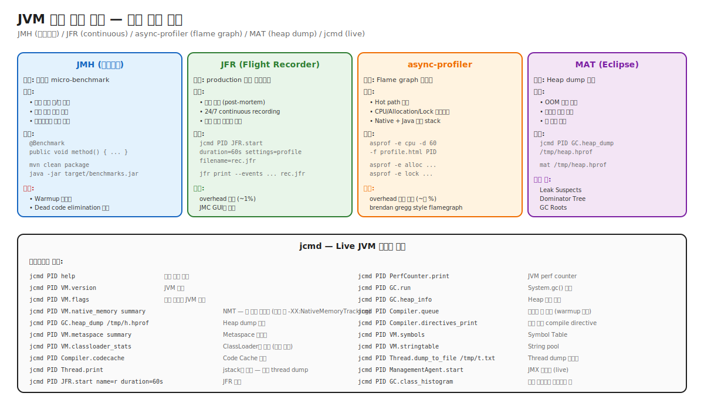

# 11. Hands-on Workbook — JMH/JFR/async-profiler/MAT/jcmd 실습

> 도구를 **이론으로 안다**와 **손에 익었다**는 별개. 시니어는 5초 안에 적절한 명령을 떠올린다.
> 본 챕터는 도구별 실습 + 시나리오별 명령 매핑.

---

## 🗺️ 위치



---

## 📚 도구 매트릭스

| 도구 | 용도 | 운영 위치 | overhead |
|---|---|---|---|
| **JMH** | Micro-benchmark | 개발/CI | N/A |
| **JFR** | Continuous recording | Production 상시 | ~1% |
| **async-profiler** | Flame graph | Production 일시 | ~수% |
| **MAT** | Heap dump 분석 | 사후 | N/A |
| **jcmd** | Live 다용도 | Production | 거의 0 |

---

## 🛠️ JMH 실습

### 설치 + Hello World

```bash
mvn archetype:generate -DinteractiveMode=false \
    -DarchetypeGroupId=org.openjdk.jmh \
    -DarchetypeArtifactId=jmh-java-benchmark-archetype \
    -DgroupId=org.example \
    -DartifactId=jmh-test \
    -Dversion=1.0
```

`src/main/java/MyBench.java`:
```java
@BenchmarkMode(Mode.AverageTime)
@OutputTimeUnit(TimeUnit.NANOSECONDS)
@State(Scope.Thread)
@Fork(value = 1, warmups = 1)
@Warmup(iterations = 3, time = 1)
@Measurement(iterations = 5, time = 1)
public class MyBench {
    int[] arr = new int[1000];
    
    @Benchmark
    public int sum() {
        int s = 0;
        for (int x : arr) s += x;
        return s;
    }
}
```

```bash
mvn clean package
java -jar target/benchmarks.jar
```

### 함정 회피

1. **Dead code elimination**: 결과 return 또는 `Blackhole.consume()`.
2. **Constant folding**: 입력을 `@State` 필드로 (compile time 모르게).
3. **Warmup 부족**: `@Warmup(iterations = 5+)`.
4. **Profile 종류**: `-prof gc`, `-prof perfasm` (assembly 보기).

---

## 🛠️ JFR 실습

### 즉시 시작

```bash
jcmd <pid> JFR.start name=r duration=60s settings=profile filename=rec.jfr
```

### Continuous recording

```bash
# JVM 시작 시
java -XX:StartFlightRecording=filename=continuous.jfr,maxsize=100M -jar app.jar

# 또는 production용 권장
java -XX:StartFlightRecording=disk=true,maxage=24h,maxsize=500M,settings=default \
     -XX:FlightRecorderOptions=stackdepth=128 \
     -jar app.jar
```

### 분석

```bash
# CLI
jfr summary rec.jfr
jfr print --events jdk.GarbageCollection rec.jfr
jfr print --events jdk.Deoptimization rec.jfr | head -50

# JMC (JDK Mission Control) GUI
jmc rec.jfr
```

### 핵심 이벤트 매핑

| 이벤트 | 용도 |
|---|---|
| `jdk.GarbageCollection` | GC 발생 + 시간 |
| `jdk.GCHeapSummary` | Heap 사용량 추세 |
| `jdk.Deoptimization` | Deopt + reason |
| `jdk.Compilation` | JIT 컴파일 |
| `jdk.JavaMonitorEnter/Wait` | Lock contention |
| `jdk.SocketRead/Write` | I/O |
| `jdk.ExecutionSample` | CPU 프로파일 sample |
| `jdk.ObjectAllocationInNewTLAB` | Allocation rate |
| `jdk.ClassLoad/Unload` | Class lifecycle |
| `jdk.VirtualThreadPinned` | VT pinning |
| `jdk.CodeCacheStatistics` | Code Cache 사용량 |

---

## 🛠️ async-profiler 실습

### 설치

```bash
# Linux
wget https://github.com/async-profiler/async-profiler/releases/download/v3.0/async-profiler-3.0-linux-x64.tar.gz
tar xzf async-profiler-*.tar.gz
```

### CPU flame graph

```bash
asprof -e cpu -d 60 -f cpu.html <pid>
# Open cpu.html in browser
```

### Allocation flame graph

```bash
asprof -e alloc -d 60 -f alloc.html <pid>
# Hot allocation site 식별
```

### Lock contention

```bash
asprof -e lock -d 60 -f lock.html <pid>
```

### 함정

- VT (Virtual Thread) 환경에서 stack unwinding 오류 가능 → `--cstack vm`.
- Warmup 후 측정 (인터프리터 frame은 정확도 ↓).

---

## 🛠️ MAT (Eclipse Memory Analyzer) 실습

### Heap dump 생성

```bash
# Live
jcmd <pid> GC.heap_dump /tmp/heap.hprof

# OOM 시 자동 (사전 설정 필요)
java -XX:+HeapDumpOnOutOfMemoryError -XX:HeapDumpPath=/var/log/heap.hprof -jar app.jar
```

### MAT 시작

```bash
mat /tmp/heap.hprof
# 또는 GUI에서 File → Open Heap Dump
```

### 핵심 분석 뷰

1. **Leak Suspects** — 자동 분석. 의심 큰 객체 + 점유 비율.
2. **Dominator Tree** — 어느 객체가 가장 많은 메모리 점유.
3. **GC Roots** — 어떤 root chain이 객체를 잡고 있는지.
4. **Histogram** — 클래스별 인스턴스 수.
5. **OQL (Object Query Language)** — SQL-like 객체 검색.

### 시나리오: ClassLoader 누수 찾기

```
1. Histogram에서 ClassLoader subclass 검색.
2. 같은 이름의 ClassLoader 인스턴스 수 확인.
3. 비정상 다수 → 누수.
4. 인스턴스 선택 → "Show in Dominator Tree".
5. 그 CL이 잡고 있는 객체들 → 어디서 누가 잡고 있는지 추적.
```

---

## 🛠️ jcmd 서브커맨드 매핑

위의 SVG 다이어그램 참조.

### 일상 운영 명령

```bash
# 1. JVM 상태 확인
jcmd <pid> VM.version
jcmd <pid> VM.flags
jcmd <pid> VM.command_line

# 2. 메모리
jcmd <pid> VM.native_memory summary    # NMT (사전 활성화)
jcmd <pid> GC.heap_info
jcmd <pid> GC.class_histogram | head -30
jcmd <pid> VM.metaspace summary
jcmd <pid> VM.classloader_stats

# 3. JIT
jcmd <pid> Compiler.codecache
jcmd <pid> Compiler.queue
jcmd <pid> Compiler.directives_print

# 4. Thread
jcmd <pid> Thread.print | head -100
jcmd <pid> Thread.dump_to_file /tmp/threads.txt

# 5. GC / Heap
jcmd <pid> GC.run                       # System.gc() 강제
jcmd <pid> GC.heap_dump /tmp/h.hprof

# 6. JFR
jcmd <pid> JFR.start name=r duration=60s settings=profile
jcmd <pid> JFR.dump name=r filename=r.jfr
jcmd <pid> JFR.stop name=r

# 7. Misc
jcmd <pid> PerfCounter.print
jcmd <pid> VM.symbols | head -30
jcmd <pid> VM.stringtable
jcmd <pid> ManagementAgent.start         # JMX live
```

---

## ⚔️ 시나리오별 도구 선택

| 시나리오 | 첫 도구 |
|---|---|
| P99 spike | JFR (continuous) |
| Full GC 빈발 | GC log + MAT |
| OOM | Heap dump + MAT |
| Container OOM-killed | NMT (jcmd) |
| Code Cache full | jcmd Compiler.codecache |
| Lock contention | jstack + JFR + async-profiler (lock) |
| Hot path 식별 | async-profiler (cpu) |
| Allocation rate | async-profiler (alloc) + JFR |
| 코드 변경 영향 | JMH |
| VT pinning | -Djdk.tracePinnedThreads, JFR |

---

## 🔗 다음 단계

- → [12. Tradeoff Master Table](../12-tradeoff-master-table/)
- ← [10. Ops Scenarios](../10-ops-scenarios/)
