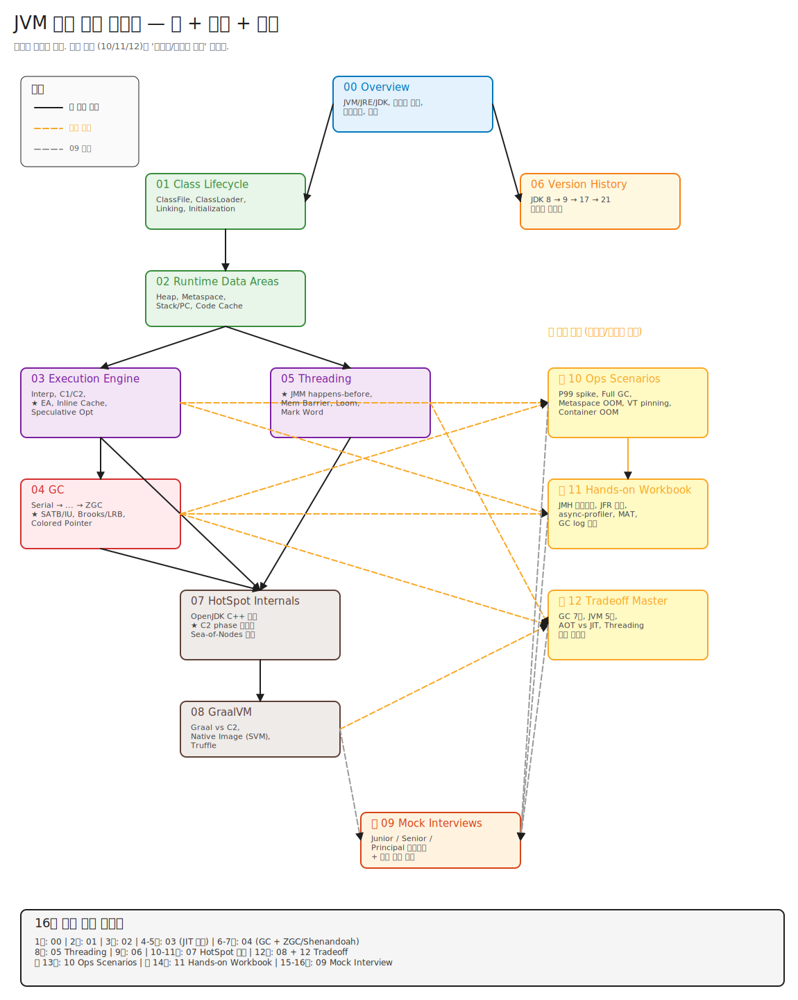

# JVM 깊이 학습 — 백지에서 창시자 수준까지

> "JVM은 단지 바이트코드를 실행하는 가상 머신이다" 라고 말할 수 있다면 입문자.
> "JVM은 Verifier로 타입 안전을 증명한 후 Template Interpreter로 시작하여 C2의 Sea-of-Nodes IR로 컴파일되고, SafepointSynchronize::begin()을 통해 모든 스레드를 polling page mprotect로 정지시킨 다음 G1의 Mixed GC가 Remembered Set을 스캔한다" 라고 말할 수 있다면 그 다음 단계.
> 이 학습 경로의 목표는 후자다.

<details>
<summary><strong>📖 위 문장의 용어가 하나도 안 와닿는다면 → 클릭해서 펼치기</strong></summary>

지금 모르는 게 정상이다. 이 가이드 전체의 목표가 이 한 문장을 풀어내는 것이다.
각 용어를 짧게 풀고, 어느 챕터에서 깊이 다루는지 링크한다.

---

<details>
<summary><strong>1. Verifier — JVM의 첫 방어선</strong></summary>

**정의**: `.class` 파일의 bytecode가 타입 안전한지 검증하는 컴포넌트.

**왜 필요**: bytecode는 외부에서 들어오는 신뢰할 수 없는 입력이다. 잘못된 bytecode가 실행되면 JVM 프로세스 자체가 segfault나 메모리 손상을 겪는다.
- 예: stack에 int 하나만 있는데 `iadd` (int 두 개 필요) 명령이 실행되면 → stack underflow → 메모리 침범.

**언제**: ClassFile 로드 직후, Initialization 전.

**자세히**: [01-class-lifecycle/03-linking.md](./01-class-lifecycle/03-linking.md)

</details>

<details>
<summary><strong>2. 타입 안전 증명 — Verifier가 하는 일</strong></summary>

**정의**: bytecode 실행이 절대 native crash를 일으킬 수 없음을 **수학적으로** 보장.

**어떻게**:
1. 각 instruction마다 operand stack과 local variable의 **타입 상태**를 추적.
2. 예: `iadd` → "stack 맨 위에 int 두 개" 가 보장되는가?
3. 모든 분기점(if, goto, switch)에서 진입 경로들의 타입 상태가 일치하는가?
4. 한 곳이라도 어긋나면 `VerifyError` throw, 그 클래스는 로드 거부.

**왜 중요**: 1995년 Java applet 시대 — 브라우저가 untrusted bytecode를 다운받아 실행. 검증 없으면 악성 코드가 JVM 깨뜨릴 수 있음.

**JDK 6 이후**: javac가 미리 계산해서 `StackMapTable` attribute에 저장 → Verifier가 linear time(O(n))으로 빠르게 검사.

**자세히**: [01-class-lifecycle/03-linking.md](./01-class-lifecycle/03-linking.md)

</details>

<details>
<summary><strong>3. Template Interpreter — HotSpot의 인터프리터</strong></summary>

**정의**: HotSpot의 bytecode 인터프리터. 일반 인터프리터(switch-case)가 아니라 **런타임에 native assembly를 generate**해서 실행하는 방식.

**어떻게**:
1. JVM 시작 시 각 bytecode opcode에 대응하는 assembly 템플릿을 메모리에 generate.
2. bytecode 실행 = 해당 generated assembly로 점프.
3. 결과: 일반 switch 인터프리터보다 2~3배 빠름.

**왜 "Template"**: 각 opcode가 native code 템플릿을 가져서 그 이름.

**자세히**: [00-overview/03-jvm-architecture-bigpicture.md](./00-overview/03-jvm-architecture-bigpicture.md)

</details>

<details>
<summary><strong>4. C1 / C2 — HotSpot의 두 JIT 컴파일러</strong></summary>

**정의**: HotSpot에는 JIT 컴파일러가 두 개 있다.
- **C1 (Client Compiler)**: 빠른 컴파일, 가벼운 최적화. 수 ms.
- **C2 (Server Compiler)**: 느린 컴파일, 공격적 최적화. 수십~수백 ms.

**왜 둘**: 모든 메서드를 C2로 컴파일하면 warmup이 너무 느림. 처음엔 C1으로 빠르게 만들고, 자주 호출되는 hot method만 C2로 승격.

**Tiered Compilation**: L0(인터프리터) → L3(C1+profiling) → L4(C2)로 자동 승격.

**자세히**: [00-overview/02-class-compilation-flow.md](./00-overview/02-class-compilation-flow.md)

</details>

<details>
<summary><strong>5. IR (Intermediate Representation) — 중간 표현</strong></summary>

**정의**: 컴파일러가 소스 코드(또는 bytecode)와 최종 machine code 사이에 두는 **추상화된 중간 형식**.

**왜 필요**: bytecode → machine code 직접 변환이면 모든 최적화가 bytecode 위에서. 추상화된 IR을 두면 더 정교한 최적화 알고리즘 적용 가능.

**예시**:
- LLVM IR (Clang, Rust 등)
- GCC GIMPLE
- HotSpot C1의 HIR/LIR
- HotSpot **C2의 Sea-of-Nodes**

**컴파일 파이프라인**: `bytecode → IR → 최적화 패스 N개 → IR → register allocation → machine code`

</details>

<details>
<summary><strong>6. Sea-of-Nodes — C2의 IR 스타일</strong></summary>

**정의**: C2가 사용하는 IR 스타일. 모든 연산이 평등한 **노드**로 그래프에 흩뿌려져 있고, 노드 간 **의존성**만 표현. 노드의 실행 위치는 마지막에 결정.

**왜**: 전통적 CFG(Control Flow Graph) 기반 IR은 노드가 "어느 basic block에 속하는지" 미리 정해짐 → 최적화 패스마다 제약. Sea-of-Nodes는 노드를 "scheduling" 단계에서 최적 위치로 배치 → inlining, escape analysis, loop optimization 등 공격적 최적화에 유리.

**기원**: 1995년 Cliff Click 박사 논문 ("Combining Analyses, Combining Optimizations").

**자세히**: [00-overview/02-class-compilation-flow.md](./00-overview/02-class-compilation-flow.md) + 추후 07-hotspot-internals 챕터.

</details>

<details>
<summary><strong>7. 컴파일 (여기서는 JIT 컴파일)</strong></summary>

**정의**: 여기서 "컴파일"은 `javac`가 하는 것이 아니라 **JIT 컴파일** — 런타임에 bytecode를 native machine code로 변환.

**Java는 두 번 컴파일된다**:
1. `javac` (정적): `.java` → `.class` bytecode. 플랫폼 독립적.
2. **JIT** (런타임): bytecode → x86_64/ARM64 machine code. 플랫폼 특화 + 런타임 프로파일 활용.

**왜 두 번**: javac만 하면 platform-specific 최적화 불가. JIT만 하면 매번 source 컴파일 비용. 절충안이 bytecode + JIT.

**자세히**: [00-overview/02-class-compilation-flow.md](./00-overview/02-class-compilation-flow.md)

</details>

<details>
<summary><strong>8. SafepointSynchronize::begin() — 모든 스레드 정지 진입점</strong></summary>

**정의**: HotSpot C++의 함수. 모든 Java 스레드를 "안전한 지점(safepoint)"에서 정지시키는 작업의 진입.

**파일 위치**: `src/hotspot/share/runtime/safepoint.cpp`

**왜 필요**:
- GC가 Heap을 스캔하려면 모든 스레드가 일관된 상태여야 함.
- 객체 할당 도중 멈추면 half-initialized 객체 → GC가 메모리 형식을 잘못 해석.
- Deoptimization, biased lock revoke, JFR stack walking 등도 마찬가지.

**자세히**: [00-overview/03-jvm-architecture-bigpicture.md](./00-overview/03-jvm-architecture-bigpicture.md) (Safepoint 섹션)

</details>

<details>
<summary><strong>9. polling page mprotect — 스레드 정지 메커니즘</strong></summary>

**Safepoint를 어떻게 강제하나?** 직접 멈추는 게 아니라 **polling 방식**.

**4단계**:
1. JVM 시작 시 **polling page**라는 메모리 페이지 한 장을 reserve.
2. JIT이 모든 메서드 epilogue / loop back-edge에 polling page를 **읽는** assembly 명령을 emit.
3. 정지가 필요하면 JVM이 `mprotect(PROT_NONE)`로 그 페이지를 **읽기 불가**로 막음.
4. 다음 polling 명령에서 **SEGV (segfault)** 발생 → signal handler가 그 스레드를 safepoint blocking 상태로 전환.

**왜 이렇게 복잡하게?**
- 강제 interrupt(시그널)로 멈추면 스레드 상태가 일관적이지 않을 수 있음 (예: register만 채우고 stack은 미완성).
- Polling은 스레드가 **자발적으로** 멈추는 모델 → 모든 polling 지점에서 JVM은 정확히 register/stack의 oop 위치를 안다 (OopMap).

**용어**: `mprotect`는 POSIX 시스템 콜 — 메모리 페이지의 보호 권한(읽기/쓰기/실행) 변경.

</details>

<details>
<summary><strong>10. segfault / SEGV — 메모리 침범 신호</strong></summary>

**정의**: 프로세스가 **자기에게 허용되지 않은 메모리 주소**에 접근하려고 할 때 OS(커널)가 발생시키는 신호.
정식 이름은 **SIGSEGV** (Signal **Seg**mentation **V**iolation). 줄여서 segfault, SEGV.

**왜 일어나나** (전형적 케이스):
1. **NULL 포인터 역참조** — C/C++의 `*ptr` 인데 `ptr == NULL` 인 경우.
2. **Use-after-free** — 이미 `free()`된 메모리 접근.
3. **버퍼 오버플로우** — 배열 범위 밖 접근.
4. **읽기 전용 메모리에 쓰기** — 코드 영역에 쓰기 시도.
5. **`mprotect(PROT_NONE)` 처리된 페이지 접근** — 의도적으로 막힌 페이지 (★ polling page 메커니즘이 이걸 이용).

**결과**: 일반적으로 프로세스가 **즉시 종료**되고 코어 덤프(core dump) 파일이 남는다 (디버깅용).
```
$ ./my_program
Segmentation fault (core dumped)
```

**JVM에서의 의미**:
- **정상 케이스**: Java 코드만으로는 segfault 못 일으킨다. Verifier가 잘못된 메모리 접근을 사전에 차단하기 때문. 그래서 Java는 "memory-safe language".
- **비정상 케이스**: JVM 자체의 버그, native 코드(JNI)가 메모리를 잘못 다룸, JIT 컴파일 결과가 잘못된 코드 → 이런 경우 segfault.
- **의도적 활용**: polling page (#9 참조). JVM이 **일부러** mprotect로 페이지를 막아 SEGV를 유발 → signal handler가 그 신호를 catch해서 "스레드 정지"로 변환. "예외를 통신 채널로 쓰는" 영리한 트릭.

**signal handler란**: OS 신호(SEGV, SIGTERM 등)가 발생했을 때 호출되는 사용자 정의 함수. JVM은 자체 signal handler를 설치해서 SEGV를 잡고, 그게 polling page에서 발생한 것이면 정상 처리 (= safepoint 진입), 아니면 진짜 crash로 처리한다.

**핵심 인사이트**: "메모리 침범 = 무조건 죽음"이 아니라, JVM은 그것을 **신호 메커니즘**으로 재활용한다.

</details>

<details>
<summary><strong>11. 왜 정지시키나? — Stop-The-World의 이유</strong></summary>

**한 줄**: GC가 reachable 객체를 정확히 식별하려면 메모리가 멈춰 있어야 한다.

**구체적 이유**:
1. **객체 그래프 일관성**: 스레드가 `obj.field = newRef`를 실행 중일 때, 그 중간에 GC가 스캔하면 옛 참조와 새 참조가 동시에 보임 → 메모리 손상.
2. **OopMap 정확성**: 각 polling 지점에서 register/stack의 어떤 슬롯이 객체 참조인지(OopMap) JVM이 알아야 함. 임의 지점에서 멈추면 모름.
3. **다른 작업도 필요**: deoptimization (C2 native frame → interpreter frame 변환), class redefinition, biased lock revoke, JVMTI debugging.

**현대 GC의 진화**: STW를 최소화. ZGC/Shenandoah는 marking과 evacuation을 거의 동시(concurrent)에 — STW는 1ms 이하.

</details>

<details>
<summary><strong>12. G1 (Garbage-First GC)</strong></summary>

**정의**: JDK 9+의 기본 GC. Heap을 1~32MB **region**들로 잘게 나누고, 쓰레기가 가장 많은 region부터 수집하는 알고리즘.

**왜 "Garbage-First"**: 이름 그대로. 살아있는 객체가 적은 region = 회수 효율 높은 region → 그것부터 수집하면 짧은 시간에 많은 메모리 회수.

**왜 도입**: 그 전 GC들 (Parallel, CMS)은 Young/Old 통째 수집 → STW 시간 예측 불가능. G1은 region 단위라 `-XX:MaxGCPauseMillis=200` 같이 **목표 STW 시간 지정 가능**.

**자세히**: 추후 04-gc 챕터.

</details>

<details>
<summary><strong>13. Mixed GC — G1의 한 collection 타입</strong></summary>

**G1의 GC 종류**:
- **Young GC**: Young region들만 수집. 빈번.
- **Mixed GC**: Young region들 + **일부 Old region들** 같이 수집.
- **Full GC**: 전체 통째 수집. 최후 수단.

**Mixed GC가 특별한 이유**:
- 그 전 GC들에서 Old gen은 "Full GC가 와야만" 수집됨 → 한 번에 큰 STW.
- G1은 동시 마킹으로 Old gen의 region 별 garbage 비율을 미리 알아둠.
- Young GC와 같이 garbage-rich한 Old region 몇 개를 골라 evacuate → **Full GC 회피**.

**자세히**: 추후 04-gc 챕터.

</details>

<details>
<summary><strong>14. Remembered Set (RSet) — region 간 참조 추적</strong></summary>

**정의**: 각 region이 "어느 다른 region이 나를 가리키는 참조를 들고 있나"를 기록한 자료구조.

**왜 필요**:
- Young GC만 할 때 reachability를 보려면 GC root뿐만 아니라 **"Old에서 Young으로 가는 참조"**도 알아야 함 (Old 객체가 살아있다면 그게 가리키는 Young 객체도 살아있어야).
- 매번 Old 전체를 스캔 → 비현실적 (Old가 수십 GB 가능).
- 해결: Old → Young 참조를 **미리 RSet에 기록**해두고, GC 시 RSet만 본다.

**기록 시점**: 사용자 코드에서 `obj.field = ref` 같은 write가 일어날 때, **write barrier**가 자동으로 RSet 갱신.

**자세히**: 추후 04-gc 챕터.

</details>

<details>
<summary><strong>15. RSet을 왜 스캔하나? — Mixed GC의 비용</strong></summary>

**Mixed GC 흐름**:
1. Young region들의 GC root 식별.
2. 수집 대상 region들의 **RSet 스캔** → 외부에서 가리키는 참조들 발견.
3. 그 참조들도 reachability source에 추가.
4. Marking → evacuation.

**RSet 스캔이 Mixed GC의 가장 큰 비용**:
- 큰 RSet (Old region이 Young을 많이 가리키는 경우)이 있으면 STW가 길어짐.
- 운영 함정: 큰 Heap + 많은 cross-region 참조 → RSet 비대화 → STW 증가.

**진단**: `-Xlog:gc*` 또는 GC log에서 "RSet Scan" 시간 확인. 길면 region 크기 조정 (`-XX:G1HeapRegionSize`).

**자세히**: 추후 04-gc 챕터.

</details>

---

**큰 그림**: 이 문장의 흐름은 사실 한 줄로 요약된다.
```
ClassFile 검증 → 인터프리터로 실행 시작 → 자주 쓰이는 메서드는 JIT으로 컴파일
              → 컴파일 결과 코드 실행 중 GC가 필요해지면
              → 모든 스레드를 안전하게 정지시키고
              → G1이 Heap을 효율적으로 청소한다.
```

이 흐름을 한 문장에 모든 기술 용어와 함께 담은 게 위 인용문이다. 이걸 자유롭게 풀어 말할 수 있게 되는 것이 이 가이드의 목표.

**한 단계 더**: 이 문장을 **풀어 설명**할 수 있다면 시니어. **실제로 prod에서 진단·튜닝**할 수 있다면 창시자 수준.
→ 본 챕터 (00~08)가 "설명 능력"을 만들고, 보강 챕터 (10/11/12)가 "실제 능력"을 만든다.

</details>

---

## 0. 학습 철학

### 7단 레이어 (모든 챕터의 통일된 깊이)

각 토픽은 다음 7단계를 **반드시** 거친다.
앞 5단은 "안다", 뒤 2단은 "할 줄 안다" — 둘 다 채워야 시니어급.

| 단계 | 무엇을 | 왜 |
|---|---|---|
| **1. 백지 그리기** | Excalidraw 지시문 + 그림 임베드 | 손으로 그려야 머릿속에 박힌다 |
| **2. 직관** | 한 줄 비유, "왜 존재하는가" | 본질을 잡지 못하면 디테일은 무용지물 |
| **3. 구조** | ASCII/Mermaid로 컴포넌트 분해 | 박스와 화살표로 사고하기 |
| **4. 내부 구현** | HotSpot OpenJDK C++ 핵심 함수 발췌 + 흐름 | "추상 → 실체" 점프 |
| **5. 역사** | 어떤 이슈로 어떻게 진화했나 | 현재 설계는 과거의 상처다 |
| **6. 트레이드오프** ⭐ | 다른 대안과의 비교표 + 왜 이걸 선택했나 | "왜 X 대신 Y인가" 답변의 논거 무장 |
| **7. 측정·진단** ⭐ | JFR/jcmd/GC log/async-profiler 실제 사용법 | "안다"와 "할 줄 안다"의 차이 — 면접 차별화 |
| **+ 꼬리질문** | Q → 예상답 → 꼬리 → 더 깊은 꼬리 (3단+) | 면접/실무 양쪽 검증 |

> **6단·7단 ⭐ 표시**: 시니어/창시자 수준에 도달하려면 필수 보강 영역. "외운 사람"과 "다뤄본 사람"의 경계.

### "왜" 중심 학습

> 모든 챕터는 다음 질문에 답해야 한다:
> 1. 이게 **없었던 시대**에는 어떻게 했나?
> 2. 어떤 **문제**가 이걸 만들게 했나?
> 3. **다른 대안**은 왜 안 됐나? (→ 6단 트레이드오프)
> 4. **현재의 한계**는 무엇이고, 다음 진화는?
> 5. **실제 운영**에서 어떻게 보고 어떻게 튜닝하나? (→ 7단 측정·진단)

### 버전별 진화 다이어그램 컨벤션

각 챕터는 **자기 책임 영역의 시대별 변화**를 별도 그림으로 그린다. "한 장 그림이 30년을 다 표현"하지 않는다.

| 챕터 | 시대별 그림 책임 영역 |
|---|---|
| **00-overview / 01-what-is-jvm-jre-jdk** | JDK 패키징/디렉토리 구조 (JDK 8 / 9~10 / 11+) |
| **00-overview / 04-jvm-history** | 전체 타임라인 1장 |
| **01-class-lifecycle** | ClassFile attribute 진화 (JDK 5/6/7/8/11/16/17) + ClassLoader 모델 (JDK 8/9/15) |
| **02-runtime-data-areas** | JVM 내부 메모리 영역 (JDK 7 PermGen / 8 Metaspace / 9+ Code Cache 분할) |
| **03-execution-engine** | JIT 진화 (Sun JIT / HotSpot Client / Tiered / Graal) |
| **04-gc** | GC 알고리즘 라인 (Serial → Parallel → CMS → G1 → ZGC → Shenandoah → Generational ZGC) |
| **05-threading** | Thread 모델 (Platform 1:1 / Virtual M:N JDK 21+) |
| **06-version-history** | 모든 변화를 종합한 마스터 타임라인 |

각 시대별 그림에는 **변화의 트리거(JEP 번호 또는 이슈) + 핵심 개념 + 한계(다음 진화 트리거)** 를 함께 적는다.

---

## 1. 전체 학습 지도

### 의존 그래프



> SVG가 안 보이는 환경을 위한 텍스트 트리:

```
                    ┌──────────────────────┐
                    │   00. Overview        │  ← 시작점
                    └──────────┬───────────┘
                               │
               ┌───────────────┴───────────────┐
               ▼                               ▼
    ┌──────────────────────┐       ┌──────────────────────┐
    │  01. Class Lifecycle  │       │  06. Version History  │
    └──────────┬───────────┘       └──────────┬───────────┘
               │                              │
               ▼                              │
    ┌──────────────────────┐                  │
    │ 02. Runtime Data Areas│                 │
    └────┬────────────┬────┘                  │
         │            │                       │
         ▼            ▼                       │
┌──────────────┐  ┌──────────────┐            │
│ 03. Execution │  │ 05. Threading │           │
│    Engine     │  └───────┬──────┘            │
└───┬───────┬──┘           │                   │
    │       │              │                   │
    ▼       │              │                   │
┌────────┐  │              │                   │
│ 04. GC │  │              │                   │
└────┬───┘  │              │                   │
     │      ▼              ▼                   │
     └──► ┌──────────────────────┐             │
          │ 07. HotSpot Internals │             │
          └──────────┬───────────┘             │
                     ▼                         │
          ┌──────────────────────┐             │
          │     08. GraalVM       │             │
          └──────────┬───────────┘             │
                     │                         │
                     │   ⭐ 보강 챕터 ⭐         │
                     │ ┌─────────────────────┐ │
                     │ │ 10. Ops Scenarios    │ │ ← 03/04/05에서 점선 의존
                     │ ├─────────────────────┤ │
                     │ │ 11. Hands-on Workbook│ │ ← 03/04에서 점선 의존
                     │ ├─────────────────────┤ │
                     │ │ 12. Tradeoff Master  │ │ ← 04/05/08에서 점선 의존
                     │ └──────────┬──────────┘ │
                     │            │             │
                     └────────────┴─────────────┘
                                  ▼
                       ┌──────────────────────┐
                       │ 🏁 09. Mock Interview│  ← 모든 챕터 통합
                       └──────────────────────┘
```

**읽는 법**:
- **실선 화살표** = 필수 선행 (위 챕터 끝낸 후 아래로).
- **점선 의존**(SVG에서 노란색) = 보강 챕터(10/11/12)는 본 챕터의 측정·진단·비교를 다룬다 — 본 챕터 학습 후 진입.
- 같은 레벨(03/05)은 어느 쪽 먼저 해도 OK.
- `_diagrams/dependency-graph.excalidraw`를 [excalidraw.com](https://excalidraw.com/)에서 열면 직접 편집 가능.

### 챕터 목록

#### 📚 본 챕터 (개념 → 내부)

| # | 폴더 | 핵심 질문 | 상태 |
|---|---|---|---|
| 00 | [00-overview](./00-overview/) | "JVM이 뭐고, 왜 만들었고, 어떻게 자랐나" | ✅ 완료 |
| 01 | [01-class-lifecycle](./01-class-lifecycle/) | ".class 파일은 어떤 바이트로 구성되고, JVM은 어떻게 그걸 로딩·검증·연결·초기화하나" | ✅ 완료 |
| 02 | 02-runtime-data-areas | "Heap, Metaspace, Stack, PC, Native Stack은 각각 무엇을 담고 어떻게 자라나" | ⏳ |
| 03 | 03-execution-engine | "Interpreter는 어떻게 동작하고, C1/C2 JIT은 언제·어떻게 컴파일하나 — **Escape Analysis, Inline Cache, Speculative Opt, Loop Unrolling, Lock Coarsening까지**" | ⏳ |
| 04 | 04-gc | "Serial → Parallel → CMS → G1 → ZGC → Shenandoah, 각 알고리즘 + **SATB vs Incremental Update, Brooks vs LRB, Colored Pointer, Multi-mapping Memory**" | ⏳ |
| 05 | 05-threading | "JMM **happens-before 13규칙**, **Memory Barriers (LoadLoad/StoreStore/...)**, synchronized **Mark Word 승격**, Park/Unpark native, Virtual Thread **Continuation**" | ⏳ |
| 06 | 06-version-history | "JDK 8 lambda → 9 module → 17 sealed → 21 virtual thread, 왜 이 순서였나" | ⏳ |
| 07 | 07-hotspot-internals | "OpenJDK C++ 소스 — Template Interpreter generator, **C2 phase 순서 (Parse → IterGVN → Loop opts → Macro Expand → CCP → Scheduling → RA → Output)**, Sea-of-Nodes 노드 종류" | ⏳ |
| 08 | 08-graalvm | "Graal vs C2, Native Image(SVM)의 폐쇄 세계 가정, Truffle 폴리글랏" | ⏳ |

#### 🎯 보강 챕터 (시니어/창시자 수준 도달용)

| # | 폴더 | 핵심 질문 | 상태 |
|---|---|---|---|
| **10** | **10-ops-scenarios** | **"증상 → 진단 → 해결" 운영 시나리오 매핑. P99 spike, Full GC 빈발, Metaspace OOM, JIT 멈춤, Virtual Thread pinning, 컨테이너 OOM-killed 등** | ⏳ |
| **11** | **11-hands-on-workbook** | **JMH 벤치마크 작성, JFR 기록·분석, async-profiler flame graph, GC log 해석, MAT heap dump 분석, jcmd 전체 서브커맨드 실습** | ⏳ |
| **12** | **12-tradeoff-master-table** | **cross-chapter 종합 비교: GC 7종 / JVM 구현 5종 / AOT vs JIT vs Tiered / Threading 모델 3종 / 트레이드오프 한눈에** | ⏳ |

#### 🏁 종합

| # | 폴더 | 핵심 질문 | 상태 |
|---|---|---|---|
| 09 | 09-mock-interviews | "Junior/Senior/Principal 종합 면접 시나리오 + 운영 사고 디버깅 시뮬레이션" | ⏳ |

---

## 2. 학습 순서 가이드 (16주 완전판)

> 12주로 압축도 가능하지만, "JVM 창시자 수준" 목표라면 16주가 정직한 기간이다.
> 각 주차는 본 챕터 + 트레이드오프 표 + 측정·진단 실습을 포함한다.

### Phase 1: 토대 (1~2주차)

**1주차: Overview (00번 챕터)**
- JVM/JRE/JDK, 컴파일 흐름, 아키텍처 큰 그림, 25년 역사
- **실습**: `java -XX:+PrintFlagsFinal` 출력 둘러보기, `jcmd <pid> help` 명령 목록

**2주차: Class Lifecycle (01번)**
- ClassFile 16바이트부터 마지막 attribute까지
- ClassLoader 위임 모델 + Tomcat/OSGi 변형
- Verify → Prepare → Resolve → Initialize 5단계
- **실습**: `javap -v`로 .class 분해, `-Xlog:class+load` 추적

### Phase 2: 메모리·실행 (3~5주차)

**3주차: Runtime Data Areas (02번)**
- Heap (Young/Old/TLAB/Humongous), Metaspace, Stack, PC, Code Cache, Direct Memory
- **실습**: Native Memory Tracking (`-XX:NativeMemoryTracking=summary`), `jcmd VM.native_memory`

**4주차: Execution Engine — 기본 (03번 전반)**
- Template Interpreter 내부, C1 컴파일러
- **실습**: `-XX:+PrintCompilation`, `-XX:+PrintInlining` 로그 해석

**5주차: Execution Engine — JIT 깊이 (03번 후반)** ⭐
- C2 Sea-of-Nodes, **Escape Analysis**, **Inline Cache**, **Speculative Opt**, **Loop Unrolling/Vectorization**, **Lock Coarsening**
- **실습**: JITWatch로 C2 컴파일 그래프 시각화

### Phase 3: GC 정복 (6~7주차)

**6주차: GC 1편 — Serial → G1 (04번 전반)**
- Mark-Sweep → Generational → Region-based 진화
- G1의 Pause Prediction Model, Mixed GC, Remembered Set
- **실습**: `-Xlog:gc*=info` 분석, GCViewer 사용

**7주차: GC 2편 — ZGC, Shenandoah (04번 후반)** ⭐
- **SATB vs Incremental Update**, **Brooks Pointer → Load Reference Barrier**, **Colored Pointer**, **Multi-mapping Memory**
- Generational ZGC (JDK 21)의 변화
- **실습**: ZGC 활성화 후 `-Xlog:gc*` 비교, JFR `jdk.GarbageCollection` 이벤트

### Phase 4: 동시성 (8주차)

**8주차: Threading + JMM (05번)** ⭐
- **happens-before 13규칙**, **Memory Barriers**, **CAS 구현 (lock cmpxchg)**
- synchronized **Mark Word 승격** (Biased → Light → Heavy)
- Park/Unpark의 `pthread_cond_wait` 내부
- Virtual Thread **Continuation + Scheduler**
- **실습**: `-Djdk.tracePinnedThreads=full`, jstack으로 데드락 분석

### Phase 5: 시간순 정리 (9주차)

**9주차: Version History (06번)**
- JDK 8 → 9 → 11 → 17 → 21 LTS 변천을 "왜" 중심으로 종합
- **실습**: 옛 JDK의 deprecated 옵션과 새 옵션 매핑

### Phase 6: 소스 투어 (10~11주차)

**10주차: HotSpot Internals 1편 (07번 전반)**
- `src/hotspot/share` 디렉토리 구조
- Template Interpreter generator 코드 풀 분석
- Safepoint 메커니즘 풀 구현

**11주차: HotSpot Internals 2편 — C2 깊이 (07번 후반)** ⭐
- **C2 phase 순서 풀버전** (Parse → IterGVN → Loop opts → Macro Expand → CCP → Scheduling → RA → Output)
- Sea-of-Nodes 노드 종류 (StartNode, RegionNode, PhiNode, MemBarNode, ...)
- G1/ZGC 핵심 함수 직접 추적

### Phase 7: 대안 비교 (12주차)

**12주차: GraalVM + 트레이드오프 종합 (08번 + 12번)** ⭐
- Graal compiler가 Java로 작성된 의미
- Native Image의 closed-world 가정
- Truffle polyglot
- **12번 트레이드오프 종합 표** 학습 (GC 7종, JVM 구현 5종, AOT vs JIT)

### Phase 8: 보강 — 측정·운영 (13~14주차) ⭐

**13주차: 운영 시나리오집 (10번)** ⭐
- "P99 spike", "Full GC 빈발", "Metaspace OOM", "JIT 멈춤", "VThread pinning", "Container OOM-killed" 등 시나리오별 진단
- **실습**: 의도적으로 사고를 재현하고 디버깅

**14주차: 실습 워크북 (11번)** ⭐
- **JMH** 벤치마크 직접 작성 + warmup/iteration 함정
- **JFR** 기록·분석 — `jdk.GarbageCollection`, `jdk.ExecutionSample` 등
- **async-profiler** flame graph로 hot path 찾기
- **MAT** heap dump 분석 — leak suspect 찾기
- **jstack** 출력 해석 (BLOCKED/WAITING 상태 의미)

### Phase 9: 종합 (15~16주차)

**15주차: Mock Interview 1편 (09번 전반)**
- Junior/Senior 시나리오 풀이

**16주차: Mock Interview 2편 — Principal (09번 후반)** ⭐
- "당신이 JDK 25의 책임자라면" 류의 시스템 설계 질문
- 운영 사고 시뮬레이션 (위 13번 시나리오를 면접 형태로)
- README 오프닝 문장을 한 번에 풀어 설명할 수 있는지 자가 평가

---

## 3. 사용법

### 다이어그램 보기 / 편집

각 챕터의 `_excalidraw/` 폴더에는 두 형식의 파일이 있다.

| 형식 | 용도 |
|---|---|
| `*.svg` | md 파일에 인라인 임베드. GitHub/VSCode 미리보기에서 즉시 보임 |
| `*.excalidraw` | [excalidraw.com](https://excalidraw.com/)에서 "Open"으로 열어 직접 수정/확장 |

> **TIP**: 챕터를 처음 학습할 때는 SVG를 **보기 전에** 백지 그리기 가이드만 보면서 직접 그려본 다음, 정답 그림과 비교한다. 그래야 머리에 박힌다.

### 다이어그램 재생성

```bash
cd flab/jvm
python3 _tools/gen_excalidraw.py
```

`.excalidraw`와 `.svg`가 동시에 갱신된다. 새 챕터는 `_tools/gen_excalidraw.py`에 `gen_XX_*()` 함수를 추가하고 `__main__`에서 호출.

### 꼬리질문 활용

각 챕터 말미의 꼬리질문 트리는 **Q1만 보고 답을 만들어본 후** 예상 답안을 본다.
꼬리질문은 일부러 잔인하게 만들었다. 막혀도 정상이다.

### HotSpot 소스 참조

이 가이드의 소스 인용은 모두 [OpenJDK 21 mainline](https://github.com/openjdk/jdk) 기준이다.
실제 소스를 보고 싶으면:

```bash
git clone https://github.com/openjdk/jdk.git
cd jdk/src/hotspot/share
```

---

## 4. 면접 모드 vs 학습 모드

| 모드 | 어떻게 읽나 |
|---|---|
| **학습 모드** | 5단 레이어를 순서대로, Excalidraw로 직접 그리며 |
| **면접 복습 모드** | 각 챕터의 꼬리질문 트리만, 답을 떠올린 후 확인 |
| **실무 디버깅 모드** | 04(GC), 05(Threading), 07(HotSpot)을 cross-reference |

---

## 5. 진행 현황

### 본 챕터
- [x] README 작성 + 의존 그래프 + 용어 풀이 토글
- [x] 00-overview 4편 + 패키징 시대별 진화 3편 + Excalidraw 7개
- [x] 01-class-lifecycle 4편 + Excalidraw 4개
- [ ] 02-runtime-data-areas — 진행 중
  - [x] README + 01-heap-and-tlab.md
  - [ ] 02-metaspace, 03-stack-pc-native, 04-code-cache, 05-direct-memory, 06-gc-bookkeeping
- [ ] 03-execution-engine — JIT 풀버전 (Escape Analysis, Inline Cache, ...)
- [ ] 04-gc — SATB/IU, Brooks/LRB, Colored Pointer, Multi-mapping
- [ ] 05-threading — happens-before 13규칙, Memory Barriers, Loom
- [ ] 06-version-history
- [ ] 07-hotspot-internals — C2 phase 풀버전
- [ ] 08-graalvm

### 보강 챕터 ⭐
- [ ] 10-ops-scenarios — 운영 시나리오 매핑집
- [ ] 11-hands-on-workbook — JMH/JFR/async-profiler/MAT 실습
- [ ] 12-tradeoff-master-table — cross-chapter 종합 비교

### 종합
- [ ] 09-mock-interviews

> 이 파일은 학습 진행에 따라 계속 업데이트된다.

## 00-overview 피드백 (Codex 리뷰 — 반영 상태 ✅)

Model: GPT-5 (Codex)

**반영 결과**:
- [x] #1 High — JVMS/구현/ClassFile 3레이어 분리 (01번 도입부 + 학습목표)
- [x] #2 High — Template/polling/mprotect/SEGV에 "HotSpot 흐름" 명시 + JEP 312 Thread-Local Handshakes 등 변형 추가 (03번 Safepoint)
- [x] #3 High — 04번 본문 시작에 "표기 컨벤션" + 빠른 참조 테이블 (연도/릴리스/핵심 이유)
- [x] #4 Medium — "JRE 폐기" → "표준 JRE 별도 배포 모델 종료, 개념은 유지" 완화 (01, 04 모두)
- [x] #5 Medium — JDK 8 vs JDK 9+ 도구 매핑 분리 표 (01번)
- [x] #6 Medium — GraalVM = "실행 환경 + Graal 컴파일러 + Native Image(SVM)" 3분해 (01번)
- [x] #7 Medium — ③ Execution Engine에서 GC 분리 → "③-b Memory Management" 별도 (03번)
- [x] #8 Low — "비유 + 정확한 정의" 페어 추가 (01 게임기 비유, 02 통역사 비유)

---

### Codex 원본 피드백

- 전체적으로는 "개념-그림-구조-역사"의 흐름이 좋아서 초학습자에게 강합니다.
- 다만 몇몇 단정적 표현은 실제 HotSpot/JVM 동작과 어긋나거나 과도하게 단순화되어 있습니다.
- 역사 파트는 연도와 버전 표기가 섞여 있어, 학습용으로는 좋지만 정확성 기준으로 한 번 더 정리하는 편이 낫습니다.

Feedback:

1. Severity: High
   Issue: `JVM`을 "ClassFile 포맷이라는 명세의 한 구현체"라고 쓰는 등, 명세와 구현의 경계가 일부 문장에서 흐립니다.
   Impact: 학습자가 JVM specification, HotSpot 구현, ClassFile 포맷을 같은 레벨의 개념으로 오해할 수 있습니다.
   Improvement idea: `JVMS`는 명세, `HotSpot/OpenJ9/GraalVM`은 구현, `ClassFile`은 그 명세가 정의하는 입력 포맷이라는 식으로 역할을 분리해서 서술하세요.

2. Severity: High
   Issue: `Template Interpreter`, `polling page`, `mprotect`, `SEGV` 설명은 핵심 흐름은 맞지만 "항상 이렇게 동작한다"는 식으로 읽히는 부분이 있습니다.
   Impact: JVM 내부 구현을 단일 메커니즘으로 고정해서 이해할 위험이 있습니다. 실제로는 플랫폼, 버전, 빌드 옵션에 따라 세부가 달라질 수 있습니다.
   Improvement idea: "HotSpot에서 흔히 쓰이는 방식" 또는 "대표적인 구현"이라고 범위를 명시하고, 예외 가능성을 짧게 덧붙이세요.

3. Severity: High
   Issue: 역사 파트의 연도/버전 대응이 몇 군데 혼재되어 있습니다. 예를 들면 Java 6, 7, 8, 9의 출시 연도와 마일스톤 표기가 문단마다 다르게 읽힐 수 있습니다.
   Impact: 학습자는 "버전 번호"와 "출시 연도"를 잘못 외울 수 있고, 이후 GC/JEP 타임라인도 같이 흔들립니다.
   Improvement idea: 각 이벤트를 `연도 / 릴리스 / 핵심 이유` 형식으로 통일하고, 필요한 경우 "발표", "GA", "preview"를 구분하세요.

4. Severity: Medium
   Issue: `JDK 9부터 JRE가 사라졌다`, `JRE 폐기 시작` 같은 표현이 다소 강합니다.
   Impact: 실제로는 런타임 배포 구조가 바뀐 것이지, 개념적으로 JRE가 완전히 사라졌다고 단정하면 오해가 생깁니다.
   Improvement idea: "전통적인 별도 JRE 배포가 사실상 사라지고, jlink 기반 커스텀 런타임으로 이동했다"처럼 표현을 완화하세요.

5. Severity: Medium
   Issue: `java`/`javac`/`jstack` 등 도구의 포함 관계를 설명하는 부분은 유용하지만, JDK 9+의 모듈화 이후 일부 도구의 배포/의존 방식이 바뀐 맥락이 빠져 있습니다.
   Impact: 도구 이름만 외우고 실제 설치 형태나 운영 환경 차이를 이해하지 못할 수 있습니다.
   Improvement idea: JDK 8 기준 그림과 JDK 9+ 기준 그림을 분리하거나, "개념적 포함"과 "실제 배포"를 구분해 적어두세요.

6. Severity: Medium
   Issue: `GraalVM` 설명이 지나치게 압축되어 있습니다.
   Impact: GraalVM이 HotSpot 대체인지, JVM 위 도구인지, Native Image까지 포함하는지 경계가 흐려집니다.
   Improvement idea: `GraalVM`을 `실행 환경 + JIT 컴파일러 + Native Image 도구군` 정도로 나누어 설명하고, 어떤 부분이 HotSpot과 겹치는지 적어주세요.

7. Severity: Medium
   Issue: `GC` 설명이 일부 장에서 실행 엔진의 하위 항목처럼 배치되어 있습니다.
   Impact: 학습자가 GC를 "인터프리터/JIT와 같은 실행 방식"으로 오해할 수 있습니다.
   Improvement idea: 실행 엔진과 메모리 관리 책임을 분리해서, GC는 Runtime Data Areas 중 Heap 관리 책임이라는 식으로 재배치하면 구조가 더 정확해집니다.

8. Severity: Low
   Issue: 비유와 수사 표현이 많아 초반 진입장벽은 낮추지만, 일부는 근거보다 인상에 의존합니다.
   Impact: 암기에는 좋지만 정확한 정의를 확인하기 어려워질 수 있습니다.
   Improvement idea: 각 비유 바로 아래에 "정확한 정의"를 한 줄 더 붙여, 비유와 사실을 분리하세요.

Questions / assumptions:

- 이 문서는 입문자용인지, 면접 대비용인지, 실무 내부 교육용인지에 따라 단정 강도를 더 조절할 수 있습니다.
- 역사 파트는 최신 Java 릴리스까지 계속 갱신할 계획인지, 아니면 Java 21/LTS 기준으로 고정할지 먼저 정하면 정리 기준이 깔끔해집니다.
