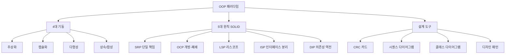

# 00. Overview — OOP는 왜 만들어졌고 어디로 가고 있나

> **이 챕터의 한 줄 목표**: "객체지향이 뭐냐"는 면접 질문에 30초 답변 / 5분 답변 / 30분 답변 세 가지를 모두 준비한다.

## 학습 목표

1. **OOP의 본질**을 한 문장으로 말할 수 있다 (메시지·책임 중심 vs. 클래스 중심 두 시각 다).
2. **절차지향의 어떤 한계**가 OOP를 만들었는지 구체적 코드 사례로 설명할 수 있다.
3. **Simula → Smalltalk → C++ → Java → Kotlin** 진화의 핵심 사건과 트리거를 안다.
4. **함수형 패러다임이 왜 부상**했고 OOP의 어떤 약점에 답하는지 안다.
5. **Java/Kotlin이 왜 하이브리드인지** 산업적·기술적 이유를 설명할 수 있다.

## 파일 목록

| # | 파일 | 핵심 질문 |
|---|---|---|
| 01 | [01-why-oop-exists.md](./01-why-oop-exists.md) | OOP가 없던 시대에는 어떻게 했고, 무엇이 한계였나 |
| 02 | [02-procedural-vs-oop.md](./02-procedural-vs-oop.md) | 동일한 문제를 절차지향/OOP로 풀 때 어떻게 다른가 (코드 비교) |
| 03 | [03-oop-history.md](./03-oop-history.md) | Simula 1967 → Smalltalk → C++ → Java → Kotlin (왜 이 순서) |
| 04 | [04-oop-architecture-bigpicture.md](./04-oop-architecture-bigpicture.md) | OOP의 4대 기둥 + 5대 원칙 한 장 그림 |
| 05 | [05-oop-vs-fp-bigpicture.md](./05-oop-vs-fp-bigpicture.md) | OOP와 FP가 어떻게 보완 관계인가 — 한 장 비교 |

## 7단 학습 레이어

### 1단. 백지 그리기

> Excalidraw 지시문 (각 .md 파일에 임베드):

```
[그림 1] OOP 진화 타임라인 (1967~현재)
        Simula 67 ── Smalltalk 72 ── C++ 85 ── Java 95 ── Java 8 (2014) ── Kotlin 16 ── Java 21 (2023)
          │            │              │          │             │              │            │
       시뮬레이션     생물학적         정적 타입   가상머신       Lambda         FP+OOP 균형  Pattern Matching
       객체         메시지객체         + 다중상속  + GC          (FP 도입)                      Virtual Thread

[그림 2] OOP의 4대 기둥
       ┌─────────────┐    ┌─────────────┐    ┌─────────────┐    ┌─────────────┐
       │ 추상화        │    │ 캡슐화        │    │ 다형성        │    │ 상속         │
       │ Abstraction │    │ Encapsulation│   │ Polymorphism│   │ Inheritance │
       └─────────────┘    └─────────────┘    └─────────────┘    └─────────────┘
            │                    │                    │                    │
        본질만 추출       내부 숨김+공개API      같은 메시지 다른응답     "is-a" 관계 + 코드재사용

[그림 3] OOP vs FP 보완 관계
        ┌───────────── OOP ──────────────┐         ┌───────────── FP ──────────────┐
        │  + 도메인 모델링 직관           │         │  + 불변성으로 동시성 안전        │
        │  + 캡슐화로 변경 격리            │  ←→    │  + 순수함수로 추론 가능          │
        │  + 다형성으로 확장              │         │  + 합성으로 재사용              │
        │  - 가변 상태 공유 위험           │         │  - 도메인 모델링 어색           │
        │  - 동시성 어려움                │         │  - 상태 표현 우회 (Monad 등)    │
        └───────────────────────────────┘         └───────────────────────────────┘
                            ⇩ 두 패러다임의 통합
                  Java 21 / Kotlin / Scala (멀티 패러다임)
```

### 2단. 직관

- **OOP 한 줄 비유**: "회사의 부서 같은 것. 인사팀은 인사 데이터를 가지고 인사 일을 한다. 영업팀이 인사 데이터를 직접 만지지 않고, 인사팀에게 메시지(요청)를 보낸다."
- **OOP 정확한 정의**: 자율적인 객체들이 메시지로 협력하여 책임을 분담하는 프로그래밍 패러다임.
- **절차지향 한 줄 비유**: "조립 라인. 데이터(부품)가 함수들(공정)을 거치며 변환된다."
- **함수형 한 줄 비유**: "수학 공식. 같은 입력에 같은 출력. 변경 없음."

### 3단. 구조



### 4단. 내부 구현 (이후 챕터에서 깊이)

- 다형성 → JVM `invokevirtual` + vtable + Inline Cache
- 캡슐화 → 접근 제어자 + 컴파일러 검증
- 람다 → `invokedynamic` + LambdaMetafactory
- Spring DI → BeanDefinition + ApplicationContext

### 5단. 역사

| 연도 | 사건 | 트리거 |
|---|---|---|
| 1967 | Simula 67 (Dahl, Nygaard) | 시뮬레이션 프로그램의 모듈화 필요성 |
| 1972 | Smalltalk (Alan Kay, Xerox PARC) | "메시지 전송" 메타포 — 생물 세포 영감 |
| 1985 | C++ (Stroustrup) | C에 OOP를 얹어 산업 적용 |
| 1994 | GoF Design Patterns | OOP 설계 노하우 표준화 |
| 1995 | Java (Gosling) | C++의 복잡성 제거 + 플랫폼 독립성 (JVM) |
| 2003 | Spring (Rod Johnson) | EJB의 무거움 → POJO + DI/IoC |
| 2004 | DDD (Eric Evans) | 도메인 중심 설계 방법론 |
| 2011 | Kotlin (JetBrains) | Java의 boilerplate + null 문제 해결 |
| 2014 | Java 8 | 람다 도입, 함수형 흡수 시작 |
| 2016 | Kotlin 1.0 GA | OOP/FP 균형 잡힌 하이브리드 출시 |
| 2017 | Google Android 공식 지원 | Kotlin 산업 확산 |
| 2023 | Java 21 | Pattern Matching, Virtual Thread — 표현식+동시성 통합 |

### 6단. 트레이드오프

이후 챕터별로 세부 비교가 있으나, 큰 그림 비교:

| 비교 축 | OOP | FP | 절차지향 |
|---|---|---|---|
| **상태 표현** | 객체 내부 (캡슐화) | 불변 데이터 + 변환 | 전역/지역 변수 |
| **재사용 단위** | 클래스, 컴포넌트 | 함수 합성 | 함수 |
| **변경 영향 범위** | 캡슐화로 격리 | 순수함수로 격리 | 데이터 전파 |
| **동시성** | 락/동기화 필요 | 자연스럽게 안전 | 매우 위험 |
| **도메인 모델링** | 직관적 | 어색 | 어색 |
| **데이터 변환** | 어색 (객체 chain) | 자연스러움 (map/filter) | 가능하지만 boilerplate |
| **테스트 용이성** | Mock 필요 | 입출력 검증으로 충분 | 전역 상태로 어려움 |

### 7단. 운영 진단

(이후 챕터에서 안티패턴별 풀버전)

- "DTO/Entity/Service 3층 구조"의 함정 — Anemic Domain의 시작점
- `@Autowired` field 주입의 위험 — 순환 의존, 테스트 어려움
- 상속으로 코드 재사용 — `equals`/`hashCode`/`toString`이 깨질 위험
- 함수형 도입한 척 `forEach` 안에 부작용 잔뜩 — 진짜 FP가 아님

## 꼬리질문 (Junior → Senior → Principal)

### Junior 레벨
1. **Q**: 객체지향이 뭔가요?
   → 데이터와 메서드를 묶어 객체로 만드는 프로그래밍 방식.
2. **꼬리**: 그럼 `struct + 함수`도 "데이터와 메서드를 함께 다루는데", 그건 OOP인가요?
   → No. 핵심은 "묶기"가 아니라 "**자율성**(자기 데이터를 자기가 책임)". struct는 데이터일 뿐, 행위는 외부 함수가 책임.

### Senior 레벨
3. **Q**: Alan Kay는 "OOP의 본질은 객체가 아니라 메시지"라고 했습니다. 무슨 뜻인가요?
   → 객체보다 객체 사이의 **인터페이스(메시지 시그니처)** 를 먼저 설계해야 한다는 의미. 구현(객체)은 메시지를 받기 위한 수단. → 좋은 OOP 설계는 "어떤 메시지를 누가 받을 것인가"로 시작.
4. **꼬리**: 그 사고가 실제 코드 작성 순서를 어떻게 바꾸나요?
   → "테스트 먼저" 작성이 가능해진다. 호출 쪽 코드를 먼저 쓰면 메시지가 드러나고, 그 메시지를 받을 객체의 인터페이스가 자연스럽게 도출됨 (TDD outside-in).
5. **꼬리의 꼬리**: 그럼 인터페이스 우선 사고와 "도메인 객체부터 모델링하라"는 DDD 사고는 충돌하지 않나요?
   → 충돌하지 않는다. DDD도 "유비쿼터스 언어"를 먼저 잡고, 그 언어가 메시지의 어휘가 됨. 도메인 명사(객체)와 도메인 동사(메시지)가 함께 도출되는 게 정상.

### Principal 레벨
6. **Q**: 만약 당신이 신규 언어를 설계한다면, OOP와 FP 중 어느 쪽을 기본으로 두겠습니까?
   → "도메인 복잡도 + 동시성 압박"의 균형. 현대 시스템은 둘 다 높음. → Rust처럼 **타입 시스템으로 FP의 안전성을 강제**하고 OOP스러운 메서드 디스패치는 trait로 제공하는 길이 합리적. Kotlin은 그 시도를 JVM 위에서 한 것.
7. **꼬리**: Java가 `record`, `sealed`, `pattern matching`을 도입하면서 어디까지가 OOP고 어디부터 FP인가요?
   → 경계가 흐려졌다. `sealed interface` + `pattern matching` = Sum Type (FP) + Subtype Polymorphism (OOP)의 통합. **두 패러다임은 더 이상 분리되지 않으며**, 한 언어가 두 도구를 모두 제공하는 게 정답.
8. **꼬리의 꼬리**: 그렇다면 Spring이 `@Service`, `@Component`로 객체를 강제하는 모델은 시대에 뒤떨어진 것 아닌가요?
   → 부분적으로 맞다. 하지만 Spring의 본질은 **객체 생명주기 관리 + 횡단 관심사 분리**이고, FP에서도 그건 필요. 다만 모든 클래스를 빈으로 만드는 관행은 안티패턴 — 진짜 도메인 객체는 빈이 아닌 POJO로 두고, "기술 어댑터"(Repository, Controller)만 빈으로 두는 것이 깔끔.

## 다음 챕터로

- [01-object-and-collaboration](../01-object-and-collaboration/) — 객체와 협력의 본질 (조영호 1~2장)
