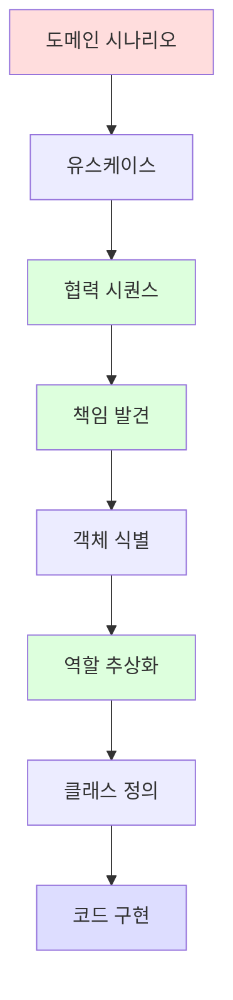

# 01. Object & Collaboration — 객체와 협력의 본질

> **이 챕터의 한 줄 목표**: 클래스 다이어그램을 그리기 전에 **CRC 카드와 시퀀스 다이어그램**을 먼저 그릴 수 있게 된다. 객체보다 메시지가 먼저, 클래스보다 협력이 먼저.

## 📖 이론적 골격 (조영호 『오브젝트』 & 『객체지향의 사실과 오해』)

| 책 / 장 | 핵심 개념 |
|---|---|
| 객사오 1장 | 객체는 협력하는 행위자 |
| 객사오 2장 | 이상한 나라의 객체 — 역할, 책임, 협력 |
| 객사오 3장 | 타입과 추상화 |
| 오브젝트 1장 | 영화 예매 시스템 — 객체와 클래스 |
| 오브젝트 2장 | 객체지향 프로그래밍 — 캡슐화의 진짜 의미 |

## 학습 목표

1. **객체란 무엇인가** — "데이터와 메서드의 묶음"이 왜 빈약한 정의인지 설명.
2. **메시지가 객체보다 먼저**라는 명제의 의미를 코드 작성 순서로 보일 수 있다.
3. **역할/책임/협력**(RRC) 3요소로 어떤 도메인이라도 모델링 시작.
4. **CRC 카드**로 즉석 도메인 모델링 가능.
5. **클래스는 객체를 표현하는 도구일 뿐**이라는 사고 — 클래스 기반 사고와 객체 기반 사고 분리.

## 파일 목록

| # | 파일 | 핵심 질문 |
|---|---|---|
| 01 | [01-what-is-an-object.md](./01-what-is-an-object.md) | 객체란 무엇인가 — 빈약한 정의 vs 풍부한 정의 |
| 02 | [02-collaboration-and-message.md](./02-collaboration-and-message.md) | 메시지가 먼저, 객체는 나중 — Alan Kay 사상의 실전 적용 |
| 03 | [03-responsibility-and-role.md](./03-responsibility-and-role.md) | 역할 추상화로 다형성을 끌어내는 사고 |
| 04 | [04-domain-modeling-with-crc.md](./04-domain-modeling-with-crc.md) | CRC 카드 / 시퀀스 다이어그램으로 영화 예매 모델링 |

## 7단 학습 레이어

### 1단. 백지 그리기

```
[그림 1] 객체의 3요소 (조영호)
        ┌─────────────────────────────────────────┐
        │             Object                        │
        │                                          │
        │   ① 상태(State)     ② 행동(Behavior)       │
        │      = 필드            = 메서드           │
        │                                          │
        │   ③ 식별자(Identity)                       │
        │      = 다른 객체과 구분되는 정체성          │
        └─────────────────────────────────────────┘

[그림 2] 협력 (Collaboration)
              영화                                                   고객
              │                                                       │
              │  ① 영화 예매해줘 (선택)                                  │
              │ ←─────────────────────────────────────────────────────│
              │                                                       │
              │  ② 가격 계산해줘 (DiscountPolicy)                        │
              │ ─────────────────────────────────────────► 할인정책      │
              │                                                       │
              │  ③ 예매 객체 생성                                       │
              │ ─────────────────────────────────────────► Reservation │
              │                                                       │
              ▼                                                       ▼

[그림 3] CRC 카드 (한 객체의 책임 정의)
     ┌─────────────────────────────────────────┐
     │ Class:   Movie                            │
     ├─────────────────────────────────────────┤
     │ Responsibilities (책임)                    │
     │  - 자신의 가격을 계산한다                    │
     │  - 할인 정책을 적용한다                      │
     ├─────────────────────────────────────────┤
     │ Collaborators (협력자)                     │
     │  - DiscountPolicy                         │
     │  - DiscountCondition                      │
     └─────────────────────────────────────────┘
```

### 2단. 직관

- **객체 = 자기 일은 자기가 하는 자율적 존재**.
- **클래스 = 그런 객체를 찍어내는 틀** (객체의 그림자, 표현 수단).
- **메시지 = 객체에게 "이 일 해줘"라고 부탁하는 행위** (메서드 호출의 본질).
- **잘못된 OOP 입문**: "클래스부터 그린다" → 클래스 다이어그램 → 코드.
- **올바른 OOP 사고**: "협력 시나리오부터 그린다" → 시퀀스 → 책임 → 객체 → 클래스.

### 3단. 구조



조영호의 강조: **C → D → F 단계가 OOP 설계의 본질**. 많은 신입은 A → G로 점프함.

### 4단. 내부 구현 (이후 챕터에서 깊이)

- 메시지 → 메서드 호출 → JVM `invokevirtual` (가상 호출).
- 객체 식별자 → JVM의 oop (Object-Oriented Pointer) + Mark Word + Klass Pointer.
- 상태 → Heap에 할당된 필드들.

### 5단. 역사

- **1967 Simula 67**: 객체 + 클래스 개념 첫 도입. 시뮬레이션 도메인 모델링이 동기.
- **1972 Smalltalk**: Alan Kay의 "메시지" 메타포. 생물 세포 영감.
- **1980s OO 분석/설계 (OOA/OOD)**: Rebecca Wirfs-Brock의 **책임 주도 설계 (RDD)**, CRC 카드.
- **1994 GoF Design Patterns**: 협력 패턴의 표준 어휘.
- **2003 DDD (Eric Evans)**: 도메인 중심으로 객체를 식별.
- **2014 조영호 『객체지향의 사실과 오해』, 2019 『오브젝트』**: 한국어권에서 책임 주도 설계의 결정판.

### 6단. 트레이드오프 — 객체 식별 방법 비교

| 방법 | 시작점 | 장점 | 단점 | 언제 |
|---|---|---|---|---|
| **데이터 주도** | DB 테이블 또는 데이터 구조 | 단순 CRUD에 빠름 | Anemic Domain으로 빠지기 쉬움 | 단순 CRUD 앱 |
| **유스케이스 주도 (절차)** | 시나리오의 절차 흐름 | 비즈니스 흐름이 명확 | God Service 양산 | 워크플로우 중심 |
| **책임 주도 (조영호식)** | 협력 시나리오 + CRC | 변경에 강함, 도메인이 풍부 | 학습 곡선 가파름 | 복잡한 도메인 |
| **도메인 주도 (DDD)** | 유비쿼터스 언어 + Bounded Context | 비즈니스 정렬 우수 | 대규모 팀/장기 프로젝트 전용 | 엔터프라이즈 |

### 7단. 운영 진단

(20-ops-scenarios 챕터에서 풀버전)

- **Anemic Domain 진단**: 도메인 클래스에 `get*` / `set*` 외에 비즈니스 메서드가 없으면 의심.
- **God Service 진단**: `*Service` 클래스가 200줄 넘고, 다른 서비스를 5개 이상 주입받으면 책임 분해 필요.
- **CRC 워크숍 도입**: 신규 도메인 시작 시 30분 CRC 카드 작성. 팀 합의 도구.

## 꼬리질문 (Junior → Senior → Principal)

### Junior 레벨
1. **Q**: 객체와 클래스의 차이가 뭔가요?
   → 클래스는 객체를 찍어내는 틀(template), 객체는 클래스의 instance.
2. **꼬리**: 그럼 객체지향에서 "클래스"가 본질인가요, "객체"가 본질인가요?
   → 객체. 클래스는 표현 수단. 실제 동작하는 것은 메모리에 할당된 객체들이고, 그 객체들 사이의 메시지 송수신이 시스템.

### Senior 레벨
3. **Q**: 조영호는 "데이터 주도 설계가 OOP의 적"이라고 했습니다. 무슨 뜻인가요?
   → 데이터(DB 테이블, JSON 스키마)를 먼저 정해놓고 그것에 클래스를 매핑하면, 클래스는 단순한 데이터 컨테이너가 되고 행위는 Service에 흩어진다 (Anemic Domain). 행위가 먼저, 데이터는 그 행위를 위한 부산물.
4. **꼬리**: 그렇다면 JPA Entity는 본질적으로 Anemic이 될 수밖에 없는 거 아닌가요? 테이블에 매핑되니까.
   → 그렇지 않다. Entity가 단순 매핑 객체로 보이는 것은 **개발자의 선택**이지 JPA의 강제가 아니다. Entity 안에 비즈니스 메서드(`order.cancel()`, `account.withdraw(amount)`)를 두면 Rich Domain. JPA Entity의 식별자 관리 + 영속성 컨텍스트는 객체지향과 충돌하지 않음.
5. **꼬리의 꼬리**: 그럼 Service Layer는 없어져도 되나요?
   → 아니다. Service는 **여러 Aggregate를 조율**하는 책임이 있고, Transaction Boundary, 트랜잭션 외부와의 통신(메시지큐 발행 등)도 담당. 다만 Service가 도메인 로직을 가져가버리면 안 됨 — Domain Service vs Application Service 구분.

### Principal 레벨
6. **Q**: Rebecca Wirfs-Brock의 책임 주도 설계 (RDD)와 Eric Evans의 DDD의 차이는?
   → 둘 다 책임/협력 사고를 공유하지만 스케일이 다름. RDD는 **마이크로 설계** (한 유스케이스 내 객체 협력). DDD는 **거시 설계** (Bounded Context, Aggregate, Ubiquitous Language). 결합해서 쓴다 — DDD로 큰 그림, RDD로 각 컨텍스트 내부.
7. **꼬리**: 마이크로서비스 환경에서 도메인 객체는 어떤 모습이어야 하나요?
   → 서비스 경계 = Bounded Context. 한 서비스 안에서는 Rich Domain (Aggregate + Domain Event). 서비스 간은 Event 또는 API로 통신, **객체 그래프를 공유하지 않음**. 객체 식별자는 서비스 안에서만 의미. → 객체지향의 자율성이 서비스 단위로 확장된 셈.

## 다음 챕터로

- [02-abstraction-and-encapsulation](../02-abstraction-and-encapsulation/) — 4대 기둥 깊이 분석
