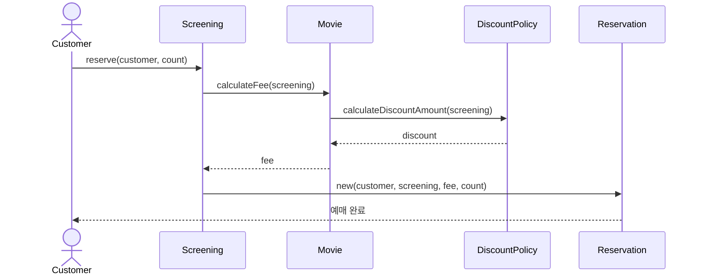

# 21. Hands-on Workbook — 조영호 예제 직접 구현

> **이 챕터의 한 줄 목표**: 읽기만 한 OOP를 **손으로 짜본다**. 조영호 책의 영화 예매 시스템 + 요금제 청구 시스템 + 도메인 모델링 카타를 백지에서 시작해 CRC 카드 → 시퀀스 다이어그램 → 코드까지 완성.

## 학습 목표

1. **CRC 카드 워크숍**을 30분에 끝낼 수 있다.
2. **시퀀스 다이어그램**을 PlantUML/Mermaid로 그릴 수 있다.
3. 조영호 영화 예매 시스템을 **Java + Kotlin 두 버전**으로 구현.
4. 동일 도메인의 **Anemic vs Rich** 두 버전을 비교.
5. **테스트 가능한 설계** — Mock 없이 단위 테스트.

## 예제 목록

| # | 파일 | 예제 |
|---|---|---|
| 01 | [01-movie-reservation/](./01-movie-reservation/) | 영화 예매 시스템 (조영호 책 1~5장) |
| 02 | [02-billing-system/](./02-billing-system/) | 요금제 청구 시스템 (조영호 책 10~14장) |
| 03 | [03-domain-modeling-kata/](./03-domain-modeling-kata/) | 즉석 도메인 모델링 카타 |
| 04 | [04-refactoring-kata/](./04-refactoring-kata/) | Anemic → Rich 리팩토링 카타 |
| 05 | [05-testing-without-mock/](./05-testing-without-mock/) | Mock 없는 단위 테스트 |

## 워크숍 진행 가이드

### 단계 1: CRC 카드 (30분)

각 도메인 객체별로 1장씩.

```
┌──────────────────────────────────────────────┐
│  Class: Movie                                  │
├──────────────────────────────────────────────┤
│  Responsibilities (책임):                       │
│  - 자신의 가격을 계산한다                          │
│  - 할인 정책을 적용한다                            │
├──────────────────────────────────────────────┤
│  Collaborators (협력자):                        │
│  - DiscountPolicy                              │
│  - DiscountCondition                           │
└──────────────────────────────────────────────┘
```

### 단계 2: 시퀀스 다이어그램 (30분)

핵심 유스케이스("예매하기")의 메시지 흐름:



### 단계 3: 코드 작성 (2시간)

CRC + 시퀀스에서 도출된 인터페이스 → 클래스 → 메서드.

### 단계 4: 테스트 작성 (1시간)

각 객체의 책임을 단위 테스트로.

### 단계 5: 리팩토링 (1시간)

새 요구사항 ("새 할인 정책 추가") 받으면 어디만 수정하면 되는지 확인.

## 영화 예매 시스템 (조영호 책)

### 도메인 설명

영화관 예매 시스템.
- 영화는 기본 가격과 할인 정책을 가진다.
- 할인 정책: **금액 할인** (1000원 차감), **비율 할인** (10% 차감), **할인 없음**.
- 할인 조건: **순서 조건** (3, 5회차 등), **기간 조건** (월요일 14~17시 등).
- 한 영화는 여러 할인 조건 중 **하나라도 만족**하면 할인.

### 객체 식별 (CRC)

- `Movie` — 영화. 가격 + 할인 정책 보유. **자기 가격 계산 책임**.
- `Screening` — 상영. 영화 + 시간 + 회차.
- `DiscountPolicy` (interface) — 할인 정책.
  - `AmountDiscountPolicy` — 금액 차감.
  - `PercentDiscountPolicy` — 비율 차감.
  - `NoneDiscountPolicy` — 할인 없음 (Null Object).
- `DiscountCondition` (interface) — 할인 조건.
  - `SequenceCondition` — 회차 기반.
  - `PeriodCondition` — 시간 기반.
- `Reservation` — 예매 (도메인 이벤트의 결과).

### 코드 골격 (Java)

```java
public class Movie {
    private final String title;
    private final Money fee;
    private final DiscountPolicy discountPolicy;

    public Money calculateMovieFee(Screening screening) {
        return fee.minus(discountPolicy.calculateDiscountAmount(screening));
    }
}

public interface DiscountPolicy {
    Money calculateDiscountAmount(Screening screening);
}

public abstract class DefaultDiscountPolicy implements DiscountPolicy {
    private final List<DiscountCondition> conditions;

    @Override
    public Money calculateDiscountAmount(Screening screening) {
        for (DiscountCondition c : conditions) {
            if (c.isSatisfiedBy(screening)) {
                return getDiscountAmount(screening);  // Template Method
            }
        }
        return Money.ZERO;
    }

    abstract protected Money getDiscountAmount(Screening screening);
}

public class AmountDiscountPolicy extends DefaultDiscountPolicy {
    private final Money discountAmount;

    @Override
    protected Money getDiscountAmount(Screening screening) {
        return discountAmount;
    }
}

public class PercentDiscountPolicy extends DefaultDiscountPolicy {
    private final double percent;

    @Override
    protected Money getDiscountAmount(Screening screening) {
        return screening.getMovieFee().times(percent);
    }
}
```

### Kotlin 버전 (개선)

```kotlin
sealed class DiscountPolicy {
    abstract fun calculateDiscountAmount(screening: Screening): Money

    data class Amount(val amount: Money, val conditions: List<DiscountCondition>) : DiscountPolicy() {
        override fun calculateDiscountAmount(screening: Screening): Money =
            if (conditions.any { it.isSatisfiedBy(screening) }) amount else Money.ZERO
    }

    data class Percent(val percent: Double, val conditions: List<DiscountCondition>) : DiscountPolicy() {
        override fun calculateDiscountAmount(screening: Screening): Money =
            if (conditions.any { it.isSatisfiedBy(screening) }) screening.movieFee * percent else Money.ZERO
    }

    object None : DiscountPolicy() {
        override fun calculateDiscountAmount(screening: Screening) = Money.ZERO
    }
}

class Movie(val title: String, val fee: Money, val discountPolicy: DiscountPolicy) {
    fun calculateFee(screening: Screening): Money =
        fee - discountPolicy.calculateDiscountAmount(screening)
}
```

**Kotlin 버전의 장점**:
- `sealed class` + `data class`로 ADT.
- `object None`으로 싱글톤 Null Object.
- Template Method 패턴 불필요 (각 case가 직접 구현).
- 함수형 + OOP 균형.

## 도메인 모델링 카타 (예시)

새 도메인을 30분 안에 모델링하는 연습:

### 예시 1: 도서관 대출
- 책, 회원, 대출, 연체. 회원 등급별 대출 한도. 연체 시 페널티.

### 예시 2: 호텔 예약
- 객실, 예약, 손님, 결제. 객실 종류, 시즌 요금, 취소 정책.

### 예시 3: 음식 주문
- 식당, 메뉴, 주문, 배달. 옵션, 할인 쿠폰, 배달 경로.

### 예시 4: 출퇴근 기록
- 직원, 근무 기록, 휴가, 급여. 야근 수당, 휴일 근무, 연차 차감.

각 카타: **CRC (15분) → 시퀀스 (10분) → 핵심 코드 (15분)**.

## 테스트 가능성 자가 평가

작성한 코드를 다음 기준으로 평가:

- [ ] **단위 테스트** 시 Spring 컨텍스트 필요한가? → 도메인 객체는 No여야.
- [ ] **Mock**이 5개 이상 필요한가? → 결합도 ↑ 신호.
- [ ] 테스트가 **결과 (상태)** 만 확인하는가? → Yes 좋음 (행위 검증은 fragile).
- [ ] **새 요구사항 추가** 시 테스트 수정 비율은? → 10% 이내면 좋은 설계.
- [ ] **테스트 코드가 사용 예제**로 읽히는가? → Yes면 API 설계 우수.

## 다음 챕터로

- [22-tradeoff-master-table](../22-tradeoff-master-table/) — 종합 비교
