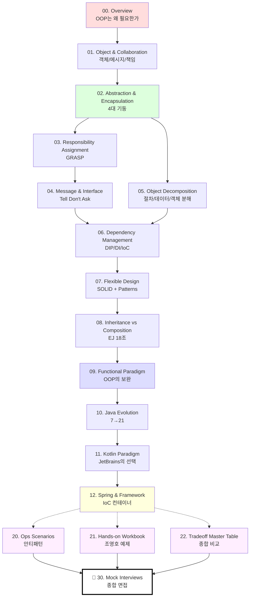

# OOP 학습 의존 그래프

> JVM 폴더의 `_diagrams/dependency-graph.svg`와 동일한 컨벤션.
> SVG 생성은 추후 (현재는 텍스트 트리).

## 챕터 의존 관계 (Mermaid)



## 챕터 의존 관계 (텍스트 트리)

```
                       ┌──────────────────────┐
                       │   00. Overview        │  ← 시작점
                       │ (OOP는 왜 필요한가)    │
                       └──────────┬───────────┘
                                  │
                                  ▼
                       ┌──────────────────────┐
                       │ 01. Object & Collab  │  조영호 1~2장
                       └──────────┬───────────┘
                                  │
                                  ▼
                       ┌──────────────────────┐
                       │ 02. Abstraction &     │  4대 기둥
                       │    Encapsulation      │
                       └──────┬───────┬───────┘
                              │       │
                ┌─────────────┘       └─────────────┐
                ▼                                   ▼
       ┌──────────────────┐               ┌──────────────────┐
       │ 03. Responsibility│               │ 05. Object        │
       │    Assignment    │               │    Decomposition  │
       │   (GRASP)         │               │                   │
       └────────┬─────────┘               └──────────┬───────┘
                │                                    │
                ▼                                    │
       ┌──────────────────┐                          │
       │ 04. Message &     │                          │
       │    Interface     │                          │
       └────────┬─────────┘                          │
                │                                    │
                └──────────────┬─────────────────────┘
                               ▼
                  ┌──────────────────────┐
                  │ 06. Dependency Mgmt   │  DIP/DI/IoC
                  └──────────┬───────────┘
                             ▼
                  ┌──────────────────────┐
                  │ 07. Flexible Design   │  SOLID + Patterns
                  └──────────┬───────────┘
                             ▼
                  ┌──────────────────────┐
                  │ 08. Inheritance vs    │  Effective Java 18
                  │    Composition       │
                  └──────────┬───────────┘
                             ▼
                  ┌──────────────────────┐
                  │ 09. Functional        │  OOP의 보완
                  │    Paradigm          │
                  └──────────┬───────────┘
                             ▼
                  ┌──────────────────────┐
                  │ 10. Java Evolution    │  7→21 진화
                  └──────────┬───────────┘
                             ▼
                  ┌──────────────────────┐
                  │ 11. Kotlin Paradigm   │  JetBrains의 답
                  └──────────┬───────────┘
                             ▼
                  ┌──────────────────────┐
                  │ 12. Spring &          │  IoC 컨테이너 내부
                  │    Framework         │
                  └──────────┬───────────┘
                             │
                             │  ⭐ 보강 챕터 ⭐
                             │ ┌─────────────────────┐
                             │ │ 20. Ops Scenarios   │  안티패턴 7대
                             │ ├─────────────────────┤
                             │ │ 21. Hands-on Workbook│ 영화 예매 등
                             │ ├─────────────────────┤
                             │ │ 22. Tradeoff Master │ 종합 비교
                             │ └──────────┬──────────┘
                             ▼            ▼
                  ┌──────────────────────────┐
                  │ 🏁 30. Mock Interviews    │  종합 면접
                  └──────────────────────────┘
```

## 읽는 법

- **실선 (──►)**: 필수 선행. 앞 챕터 끝낸 후 다음으로.
- **점선 (-.->)**: 보강 챕터 (20/21/22). 본 챕터 학습 후 진입.
- 같은 레벨 (03 ↔ 05)은 순서 무관.

## 학습 모드별 추천 경로

### 학습 모드 (체계적)
00 → 01 → 02 → 03 → 04 → 05 → 06 → 07 → 08 → 09 → 10 → 11 → 12 → 20 → 21 → 22 → 30

### 면접 복습 모드 (꼬리질문 중심)
각 챕터의 `_interview/` + 30의 시나리오만

### 코드 리뷰 모드
03(책임) ↔ 04(메시지) ↔ 06(의존성) ↔ 08(상속·합성) ↔ 20(안티패턴) cross-reference

### 리팩토링 모드
20 (시나리오 진단) → 해당 챕터의 4단(내부 구현)·6단(트레이드오프)으로 진입
