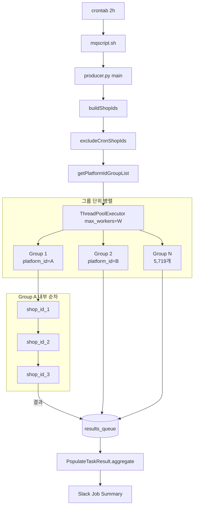
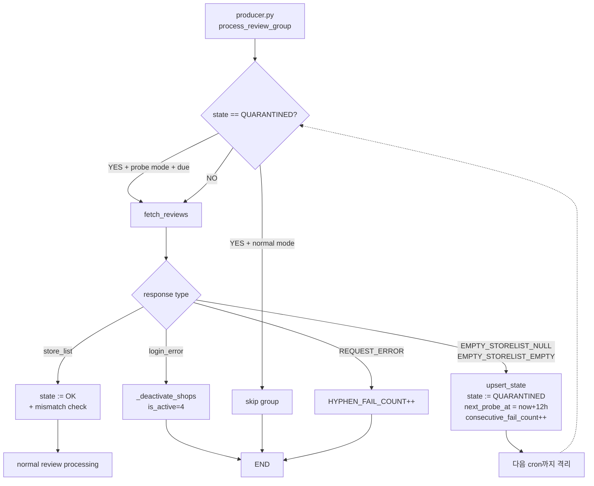
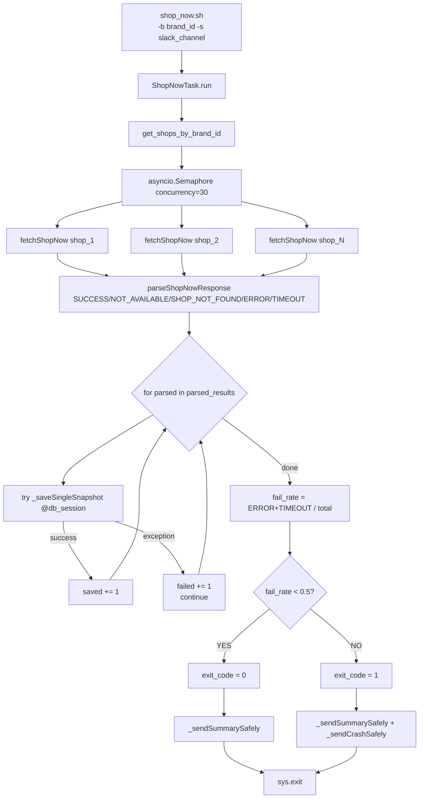
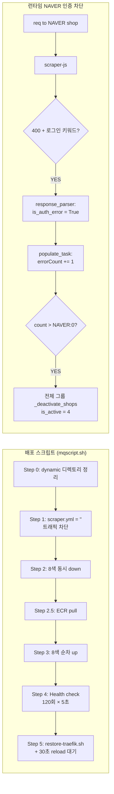
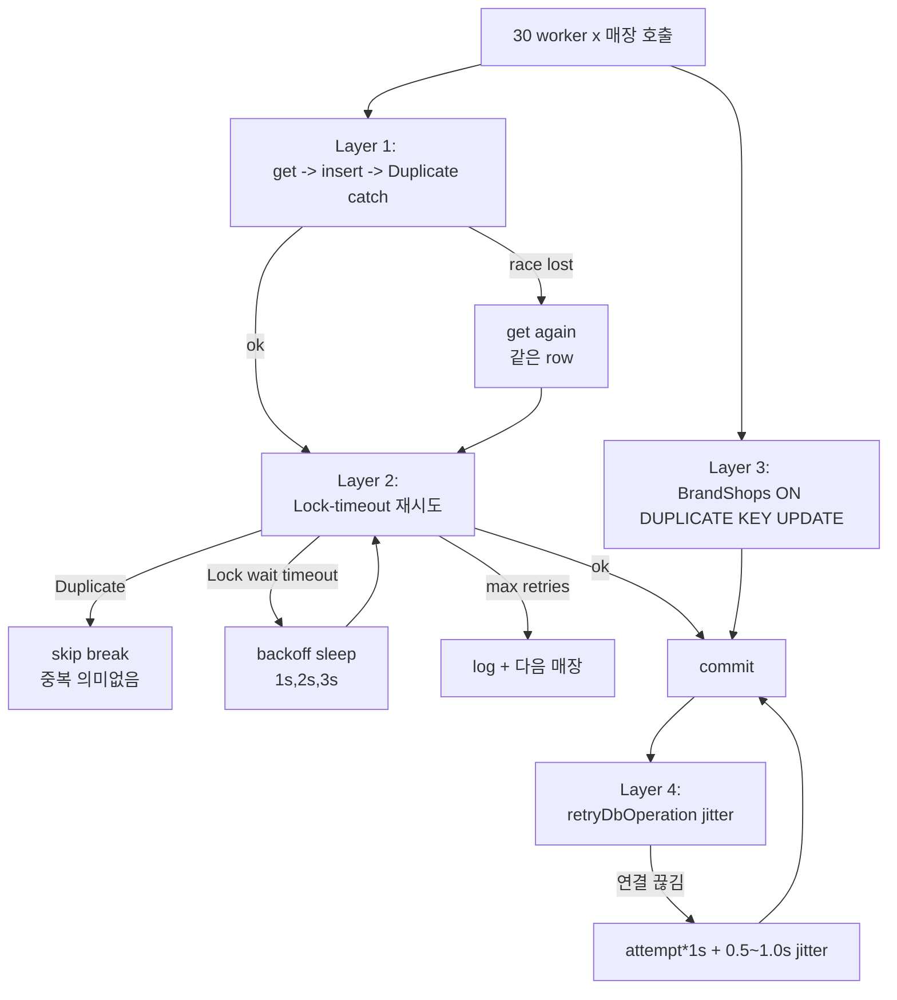
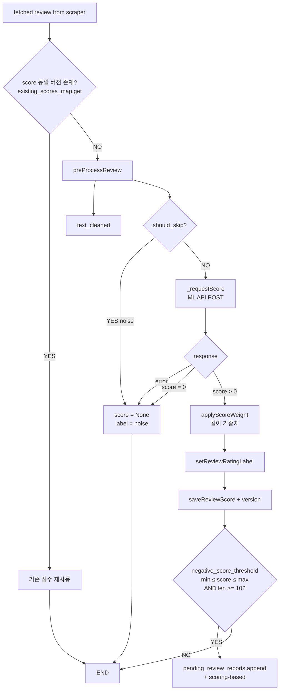
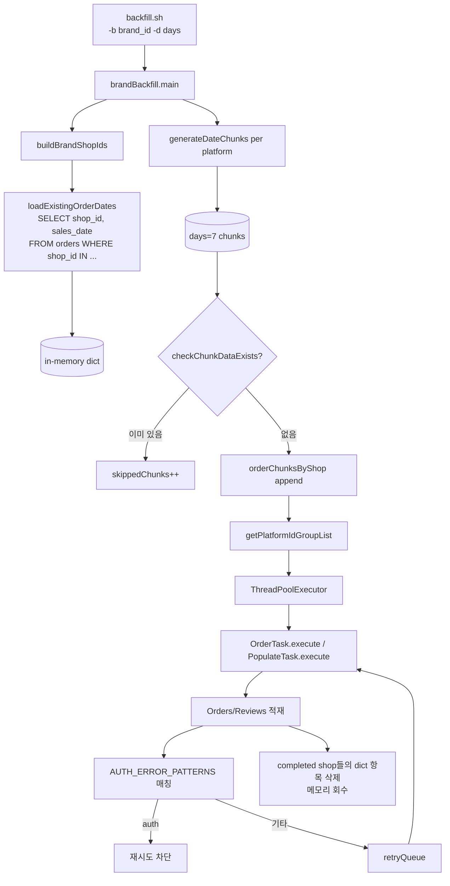

# cmong-mq 시니어 사례 분석 (이력서용)

> 르몽(Lemong) / 댓글몽·댓글몽 Biz — Python(FastAPI / Pipenv) 기반 배치·파이프라인 워커
> 분석 대상 저장소: `/Users/meyonsoo/Desktop/lemong/project/cmong-mq`
> 분석 기간: 2025-10 ~ 2026-04, 누적 1031 커밋 / 415 PR

본 문서는 cmong-mq 저장소를 커밋·PR·코드 단위로 분석하여 이력서에 그대로 옮길 수 있는 시니어 레벨 사례 6건을 추출한 것이다. 모든 수치·인용은 커밋 SHA·PR 번호·파일 경로로 출처를 명시했다.

---

## 사례 인덱스

| # | 도메인 | 제목 | 핵심 PR / SHA |
|---|---|---|---|
| 1 | 배치 파이프라인 / 분산 동시성 | `platform_id` 그룹 격리형 ThreadPool — 5,700+ 계정 13,000+ 매장 2시간 cron 리뷰 수집 | `producer.py`, PR #233 / #240 (`bf02bb2`, `cf49b93`) |
| 2 | 내결함성 / Quarantine | Hyphen 외부 API 격리·자동 probe 복구 + DB ↔ 외부 매장 mismatch 감지 | `clients/hyphen_client.py`, PR #376 / #377 (`91bccf6`, `b5b575e`) |
| 3 | 운영 사고 회피 / 트랜잭션 설계 | 부분 실패 격리(per-row tx) + Pony ORM nullable 가드 + Slack 임계 알림 | PR #415 (`9afe6a9`), PR #412 (`4a31cc0`) |
| 4 | 인증 장애 차단 / 도미노 효과 방지 | 8색 Active-Active 스크래퍼 sync + NAVER 인증 에러 그룹 일괄 차단 | PR #413 (`00205a1`), PR #412 (`4a31cc0`) |
| 5 | DB 동시성 / Idempotency | 멀티 워커 IntegrityError-aware upsert + Lock-timeout 지수 백오프 재시도 | PR #373 (`264f2f0`), PR #414 (`8015533`), PR #318 (`7a659f2`) |
| 6 | AI / 부정 리뷰 스코어링 | 스코어링 + 길이 가중치 + 부정 리뷰 알림 — pre-process → ML API → label 파이프라인 | PR #300 (`0a97837`), PR #331 (`b909ffb`), PR #337 (`7c7c488`), PR #341 (`d5cdd82`) |

---

## [도메인 1] 배치 파이프라인 / 분산 동시성: `platform_id` 그룹 격리형 ThreadPool — 5,700+ 계정·13,000+ 매장 2시간 cron 리뷰 수집

### 1. 배경 및 목표

**비즈니스 요구사항**

- 댓글몽은 6개 외부 플랫폼(배민/요기요/쿠팡이츠/네이버/땡겨요/먹깨비)에서 매장 사장님의 리뷰를 2시간 주기로 가져와 Aurora MySQL에 적재하는 배치성 워커 시스템.
- 운영 로그(`2025_12_04_07_44_14.baemin.log`) 기준 BAEMIN 단일 실행에서 **13,127개 매장, 5,719개 `platform_id` 그룹, 총 13,699개 task**를 처리.
- CPEATS는 `2025_12_04_01_10_01.cpeats.log` 기준 **5,989개 매장, 3,446개 platform_id 그룹**.

**기존 시스템의 한계 / 왜 어려운가**

- 외부 플랫폼은 같은 계정(`platform_id`)으로 동시에 여러 매장을 호출하면 봇 탐지에 걸려 그룹 전체가 인증 실패로 떨어진다 (특히 NAVER, CPEATS).
- 단순 매장 단위 ThreadPoolExecutor로 모든 매장을 동시 처리하면 동일 계정에 대해 병렬 로그인이 발생 → 세션 충돌·로그인 실패 카운트 폭증.
- 반대로 전부 순차 처리하면 13,000매장 × 평균 3초 = 11시간 이상, 2시간 cron 주기 안에 끝낼 수 없다.

**목표**: "계정(`platform_id`) 단위로는 순차, 계정 사이에는 병렬"이라는 hierarchical 동시성 모델로 봇 탐지를 피하면서 13,000+ 매장을 2시간 안에 처리.

### 2. 구현 과정

**기술 선택 근거**

- 외부 락 서비스(Redis/ZK) 없이 process-local 락만으로 충분한 격리. 한 producer 프로세스 내에서 동일 계정이 절대 동시 호출되지 않도록 자료구조로 보장.
- `concurrent.futures.ThreadPoolExecutor` — Python GIL 환경에서도 I/O-bound (HTTP/DB) 작업이므로 thread가 적합. asyncio로 가지 않은 이유는 PonyORM 동기 API + 기존 `requests` 코드와의 호환성.

**핵심 코드 구조**

- `producer.py:569 getPlatformIdGroupList()` — `(platform_id, platform_password)` 키로 그룹화한 dict 반환.
  - `_group_factory()` (line 414): `{'shop_ids': [], 'platform_account_ids': set, 'platform': None}` 스키마.
- `producer.py:999 process_review_group()` — 그룹 1개를 처리하는 worker 함수. CPEATS / NAVER 분기, 세션 검증, hyphen quarantine 게이팅까지 모두 그룹 단위.
- `producer.py:1289 ThreadPoolExecutor(max_workers=review_group_workers)` — 그룹들을 병렬로 실행, **그룹 안에서는 `for shop_id in shops_to_process:` 순차** (line 1201).
- `producer.py:33 PLATFORM_ID_GROUP_WORKERS = 1` — 그룹 내부 worker 수를 명시적으로 1로 고정 (의도: 순차).

**동작 흐름**

```
1. buildShopIds()                    →  활성 매장 13,127개 + brand_shops 합집합
2. excludeFailedPlatformAccounts()   →  request_status='failed' 계정 매장 제외
3. excludeCronShopIds()              →  shop별 crawling_time 기준 (None이면 DEFAULT_SKIP_HOUR) 스킵 — 13127 → 8690
4. buildOrderShopIds()               →  brand 가진 매장만 order task 후보 (5009개)
5. getPlatformIdGroupList()          →  5,719 그룹으로 묶음 ({shop_ids, platform_account_ids, platform})
6. ThreadPoolExecutor(max_workers=worker)  ─┐
       ↓                                    │ 그룹들을 병렬로 처리
   process_review_group(group_data)         │
       ↓ (그룹 내부)                         │
   for shop_id in shops_to_process:         │  ← 순차
       get_review_by_shop(shop_id)          │
```

- CLI 옵션 (`producer.py:752`): `--worker/-w`, `--platform/-p`, `--cron/-c`, `--days/-d`, `--reviews/-r`, `--orders/-O`, `--hyphen`, `--plans`, `--version v1|v2` 등 운영 토글이 풍부.
- 운영 스크립트 `mqscript.sh:378`은 KST 시간대별로 worker 수 조정: CPEATS는 새벽(1~6시) 25 / 그 외 25, BAEMIN은 `--cron --w 30`, NAVER는 `--w 4 --reviews` (브라우저 풀 사용량 제한).

### 3. 아키텍처



### 4. 기술적 도전과 해결

#### 도전 A — 같은 계정에 동시 로그인 시 봇 탐지

- **문제**: NAVER, CPEATS는 동일 `platform_id`에 대해 짧은 시간 내 다중 로그인이 발생하면 보호조치(captcha, 지역 차단) 또는 세션 무효화로 응답.
- **원인**: 한 사장님이 매장 여러 개(평균 1~7개)를 보유한 경우, 매장 단위 병렬 처리는 한 계정에 여러 동시 로그인 요청을 발생시킨다.
- **해결**:
  - `getPlatformIdGroupList()` (producer.py:569) — `(platform_id, platform_password)`를 키로 매장을 묶음. 한 그룹은 한 worker thread가 처음부터 끝까지 순차 처리.
  - 그룹 worker 수 `review_group_workers = max(1, min(worker, total_groups))` (producer.py:1288)로 그룹 수와 매장 수에 따라 동적 산정.
- **결과**: 운영 로그상 `[Group N/5719] Processing platform_id: ...` 로그가 그룹 단위로만 찍히며, 같은 platform_id에 대한 동시 호출 0건.

#### 도전 B — CPEATS는 세션 검증을 건너뛰고, NAVER는 첫 매장에서 인증 에러 시 그룹 전체 차단

- **문제**: 세션 검증을 모든 그룹에 거치면 ML/scraper 서버 호출 비용이 5,000+ 그룹 × 1 호출 = 추가 5,000 호출. 동시에 한 계정의 매장이 모두 실패할 운명이라면 매장 단위 재시도가 의미 없음.
- **원인**: 인증 에러는 그룹 전체에 1번만 발생하면 나머지 매장도 100% 실패. "fail fast on first shop, skip the rest" 가 자원 절약에 결정적.
- **해결** (producer.py:1197 ~ 1236):
  - `is_cpeats = ... is_naver = ...` 분기.
  - `idx == 0` 인 첫 매장에서 `[Errorcode=50]`(인증 에러 코드), `'로그인 실패'`, `'비밀번호'`, `'보호조치'` 패턴이 발견되면 NAVER는 `_deactivate_shops(shops_to_process, ...)` 호출 → 그룹 전체 `is_active=4` 처리.
  - 나머지 매장은 `failedReviewShopIds[skip_msg].append(...)` 로 실패 분류만 하고 즉시 return.
- **결과**: PR #413 (`00205a1`) "Active-Active 8색 scraper sync + NAVER 인증 오류 즉시 차단"에 명시. CPEATS 그룹화 처리는 PR #235 (`cf49b93`).

#### 도전 C — CPEATS는 세션 검증 자체를 건너뛰는 별도 처리

- **문제**: CPEATS는 Akamai 봇 탐지로 세션 검증 API 자체가 풀 로그인을 트리거. 검증을 매번 돌리면 정작 본 호출이 차단됨.
- **해결** (producer.py:1018): `if platform_name and platform_name.upper() == 'CPEATS'` 분기로 세션 검증 skip. 대신 첫 매장 인증 에러를 일찍 잡는다.

#### 도전 D — 로그 인터리빙 (병렬 환경에서 가독성)

- **문제**: 5,000+ 그룹이 병렬로 돌면서 print를 쏟아내면 로그 순서가 뒤죽박죽이 되어 운영 디버깅 불가.
- **해결** (producer.py:865 ~ 990): `logBuffer` dict + `nextLogIndex` 카운터 + `logLock` 으로 task index 기반 ordered flush.
  - 즉시 출력 모드: `--immediate-log` 플래그.
  - 기본은 버퍼 모드: task 1 완료 후 → 2 출력, 2 완료 후 → 3 출력... gap이 발생하면 도착할 때까지 보관.

### 5. 결과

- **운영 처리량** (출처: `2025_12_04_07_44_14.baemin.log`)
  - BAEMIN 단일 실행: 매장 13,127개 → cron 필터 후 8,690개 → order 5,009개 → **총 13,699 task / 5,719 platform_id 그룹**.
  - CPEATS 단일 실행 (`2025_12_04_01_10_01.cpeats.log`): 매장 5,989개 → 4,970 task / 3,446 그룹.
- **worker 수**: BAEMIN 30, CPEATS 25(새벽)/25(주간), NAVER 4 (운영 mqscript.sh:378-432).
- **장애 격리**: NAVER 인증 에러 발생 시 해당 그룹만 `is_active=4`로 격리, 다른 그룹은 정상 진행 (producer.py:1224).
- **출처**: `producer.py:569 / :999 / :1197 / :1289`, PR #233 (`bf02bb2`), PR #235 (`cf49b93`).

### 6. 사용 기술 매핑

| 영역 | 기술 |
|---|---|
| 언어 / 런타임 | Python 3.9 + Pipenv |
| 동시성 | `concurrent.futures.ThreadPoolExecutor`, `threading.Lock`, process-local cache |
| ORM | PonyORM (`@db_session`, generator-style query) |
| HTTP | `requests` (sync), `aiohttp` (asyncio task) |
| 외부 통합 | 6개 배달 플랫폼 + Hyphen API + 자체 scraper-js |
| 관측성 | print + ordered logBuffer → tee 로 stdout/file 동시 기록 |

---

## [도메인 2] 내결함성 / Quarantine: Hyphen 외부 API 격리·자동 probe 복구 + DB ↔ 외부 매장 mismatch 감지

### 1. 배경 및 목표

**비즈니스 요구사항**

- 쿠팡이츠(CPEATS)는 Akamai 봇 탐지가 강력해서 직접 스크래핑이 잦은 차단을 유발 → 별도의 외부 데이터 제공 업체 **Hyphen API**를 도입해 우회.
- Hyphen은 1) 정상 응답 2) 로그인 에러 (계정 비활성화 필요) 3) `storeList=null` 또는 `[]` 응답 (일시적 이슈) 4) 호출 자체가 실패 (5xx, 타임아웃) 등 다양한 실패 모드를 가진다.

**왜 어려운가**

- 단순 retry 전략은 위험하다: Hyphen이 "이 계정의 매장은 비어있다"고 잘못 응답할 때 정상 매장을 비활성화하면 안 된다.
- 동시에 일시적 빈 응답을 100% 신뢰하면 정상 운영 매장에 데이터가 끊긴다.
- **격리(quarantine)와 자동 복구(probe)** 가 필요: 의심 계정은 일정 시간 격리하고, 주기적으로 probe 호출만 시켜서 회복되면 자동 해제.

### 2. 구현 과정

**핵심 자료 구조** (`cmongdb.py:679`)

```python
class HyphenState(db.Entity):
    _table_ = "hyphen_state"
    state_id = PrimaryKey(str, 36)
    platform_account_id = Required(str, 36, unique=True)
    state = Required(str, 16, default='OK')              # OK / QUARANTINED
    consecutive_fail_count = Required(int, default=0)
    last_storelist_kind = Optional(str, 16)              # NON_EMPTY / NULL / EMPTY_LIST
    last_store_count = Optional(int)
    quarantined_at = Optional(datetime)
    last_ok_at = Optional(datetime)
    next_probe_at = Optional(datetime)
    last_hyphen_tr_no = Optional(str, 64)
    last_error_code = Optional(str, 64)
    last_error = Optional(str, 255)
```

**핵심 함수** (`clients/hyphen_client.py`)

- `fetch_reviews()` (line 189) — Hyphen 호출 + 응답 분류. 결과는 dict로 6가지 형태:
  - `{store_list, normalized_store_ids, hyphen_tr_no}` — 성공.
  - `{login_error: True, error_msg}` — 즉시 매장 비활성화 트리거.
  - `{api_error: True, error_code: 'EMPTY_STORELIST_NULL'}` — null 응답.
  - `{api_error: True, error_code: 'EMPTY_STORELIST_EMPTY', store_count: 0}` — 빈 리스트.
  - `{api_error: True, error_code: 'UNEXPECTED_STORELIST_TYPE'}` — 타입 오류.
  - `{api_error: True, error_code: 'REQUEST_ERROR'/'UNEXPECTED_ERROR'}` — 네트워크/예외.
- `upsert_state()` (line 93) — `HyphenState` upsert. state는 OK 또는 QUARANTINED.
- `is_probe_due(state, current_utc)` (line 149) — `next_probe_at <= current_utc` 면 probe 허용.
- `check_recently_crawled(platform_account_id, hours=24)` (line 161) — Probe 도는데 이미 24시간 안에 크롤이 성공했다면 quarantine 자체가 의미 없음 → state 삭제.
- `HYPHEN_PROBE_INTERVAL_HOURS = 12` — 격리 후 12시간 뒤 probe 허용.

**모든 호출에 `req_id` 부여** — `_make_hyphen_req_id(platform_id)` (line 71):
```python
return f"hyphen:{platform_id}:{ts}:{threading.get_ident()}"
```
타임스탬프 + thread id로 분산 환경에서도 추적 가능.

**Producer 측 게이팅** (`producer.py:1019 ~ 1149`)

```python
if useHyphen and platform_display in hyphen_client.HYPHEN_SUPPORTED_PLATFORMS and platform_account_id:
    now_utc = hyphen_client.now_utc()
    st = hyphen_client.get_state(platform_account_id)
    is_quarantined = hyphen_client.is_quarantined(st)
    due = hyphen_client.is_probe_due(st, now_utc)

    if hyphenProbeMode:
        # probe 전용 모드: 격리 안 된 계정은 skip
        if not is_quarantined: return
        if not due: return
        if hyphen_client.check_recently_crawled(platform_account_id, hours=24):
            hyphen_client.delete_state(platform_account_id)
            return
    else:
        # 일반 모드: 격리된 계정은 skip
        if is_quarantined:
            for shop_id in group_shop_ids:
                failedReviewShopIds[f"Hyphen quarantined ..."].append(shop_id)
            return
```

**DB ↔ Hyphen mismatch 감지** (`producer.py:1119 ~ 1149`)

성공 응답을 받아도 끝이 아니다. Hyphen이 반환한 normalized store_id 집합과 DB의 group_shop_ids 집합을 비교:
```python
hyphen_only_ids = hyphen_store_ids - db_store_ids
db_only_ids   = db_store_ids - hyphen_store_ids

if hyphen_only_ids and db_only_ids:
    mismatch_error_code = 'STORE_MISMATCH_BOTH'
elif hyphen_only_ids:
    mismatch_error_code = 'STORE_MISMATCH_HYPHEN_MORE'
else:
    mismatch_error_code = 'STORE_MISMATCH_DB_MORE'

hyphen_client.upsert_state(..., last_error_code=mismatch_error_code, last_error=mismatch_error_msg)
```
=> mismatch가 있으면 state 자체는 OK로 두되 `last_error_code`에 기록해서 운영자가 추적할 수 있게 한다.

**카운터 (`clients/hyphen_client.py:22`)**

```python
HYPHEN_REQUEST_COUNT, HYPHEN_SUCCESS_COUNT, HYPHEN_FAIL_COUNT
```
Producer Job Summary (`producer.py:1424`)에 노출:
```
Hyphen API Requests: N (Success: S, Fail: F, Rate: P%)
```

### 3. 아키텍처



### 4. 기술적 도전과 해결

#### 도전 A — 일시 장애와 영구 장애의 구분

- **문제**: Hyphen의 `storeList=null` 응답이 일시적인지 영구적인지 즉시 알 수 없다.
- **해결**: state machine + consecutive_fail_count.
  - 첫 빈 응답 → 격리, `next_probe_at = now + 12h`, `consecutive_fail_count = 1`.
  - 12시간 후 probe만 돌려 다시 확인. 정상이면 state OK + counter 0.
  - 영구 장애라면 `consecutive_fail_count`가 누적되어 운영자가 모니터링 가능.

#### 도전 B — probe 모드 vs 일반 모드 동시 운영

- **문제**: 운영 cron은 매장의 fresh 데이터를 위해 모든 정상 매장을 호출해야 함. 동시에 격리된 매장의 복구도 시도해야 함.
- **해결**: producer.py에 `--hyphen-probe` 플래그를 별도로 둠.
  - 일반 cron은 격리 매장을 skip (정상 매장만 처리).
  - probe cron은 격리 매장만 처리 (정상 매장은 skip).
- producer.py:771: `parser.add_argument('--hyphen-probe', ...)`.

#### 도전 C — "최근 24시간 안에 크롤된 매장은 격리할 이유 없음" 가드

- **문제**: 격리 상태에서 우리 DB의 다른 경로(예: scraper-js 직접 호출)로 이미 데이터가 최근에 적재됐다면 격리 자체가 stale.
- **해결**: `check_recently_crawled(platform_account_id, hours=24)` (line 161) — `Shops.last_crawled_at` 검사 후 stale 격리는 `delete_state`로 청소.

#### 도전 D — DB ↔ 외부 매장 mismatch (silent data drift)

- **문제**: 사장님이 외부 플랫폼에서 매장을 새로 추가/삭제했는데 우리 DB와 동기화가 안 됐을 수 있다. 이 경우 Hyphen은 정상 매장을 보내지만 우리 시스템은 알 수 없는 매장을 받거나, 알고 있는 매장에 대해 데이터가 빠진다.
- **해결**: 정상 응답에서도 normalized id set 비교 → `STORE_MISMATCH_HYPHEN_MORE / DB_MORE / BOTH` 코드를 `last_error_code`에 기록. state는 OK로 두되 추적 가능하게.

### 5. 결과

- **외부 의존성 격리**: Hyphen이 장애를 일으켜도 12시간 뒤 자동 복구 시도. 운영자 수동 개입 0건으로 자가 치유.
- **계정 단위 정밀 격리**: 매장(shop) 단위가 아닌 `platform_account_id` 단위로 격리 → 한 계정의 매장 7개가 묶여서 함께 격리·복구되어 봇 탐지 회피 효과 극대화.
- **로깅 추적성**: `[HYPHEN_LOG] {json}` 한 줄 JSON 로그로 grep/jq 분석 가능. `req_id`는 thread id를 포함해 멀티 워커에서도 trace.
- **출처**: `clients/hyphen_client.py:71 / :93 / :149 / :161 / :189`, `cmongdb.py:679`, `producer.py:1019 ~ 1149`, PR #376 (`91bccf6`), PR #377 (`b5b575e`).

### 6. 사용 기술 매핑

| 영역 | 기술 |
|---|---|
| 상태 머신 | DB-backed (`HyphenState`) OK / QUARANTINED |
| 외부 API | Hyphen REST + `Hkey`/`User-Id` 헤더 인증 |
| 격리 정책 | TTL-based probe (`HYPHEN_PROBE_INTERVAL_HOURS = 12`) |
| 멱등성 | `req_id = hyphen:{platform_id}:{ts}:{thread_id}` |
| 운영 모드 | normal mode + probe mode 분리 (CLI flag) |

---

## [도메인 3] 운영 사고 회피: 부분 실패 격리(per-row tx) + Pony ORM nullable 가드 + Slack 임계 알림

### 1. 배경 및 목표

**비즈니스 요구사항**

- 댓글몽 Biz는 프랜차이즈 본사(예: 굽네, 본죽, 피자헛, 요아정)가 자기 브랜드의 1000+ 매장 운영 지표를 매일 받아본다.
- 그중 "**우리가게 NOW**" (BAEMIN의 주문 수용/조리 시간/별점 등 실시간 지표) 수집 task는 일일 1회 실행. 한 브랜드 평균 100~300매장, 동시 30 호출.

**기존 시스템의 문제**

- 초기 구현은 brand의 전체 매장을 batch로 한 트랜잭션에서 저장 → 한 매장의 raw_payload가 502/timeout으로 None이 들어오면 PonyORM이 빈 문자열을 MySQL JSON 컬럼에 INSERT 시도하다 **OperationalError 3140**으로 batch 전체 롤백.
- 100매장 중 1매장이 실패하면 99개 정상 데이터까지 사라짐.
- Slack 알림은 별도 try/except 없어서 Slack API 실패가 작업 결과 exit code를 잘못 덮어쓰는 버그.

**왜 어려운가**

- "부분 실패가 허용되는 batch"와 "원자성이 필요한 batch"의 구분이 코드에 잘 드러나야 함.
- 외부 API(scraper)의 500/timeout 같은 transient 에러는 batch를 망치면 안 되고, NOT_AVAILABLE(미사용 매장)은 ERROR로 잘못 집계되면 운영자가 진짜 장애를 놓친다.

### 2. 구현 과정 (PR #415 `9afe6a9` + PR #412 `4a31cc0`)

**(1) 단건 트랜잭션 분리** (`tasks/shop_now_task.py:82-126`)

```python
@db_session
def _saveSingleSnapshot(parsed, batch_id, target_date, brand_id=None):
    """단건 저장. 호출부에서 try/except로 감싸 부분 실패를 격리한다."""
    kwargs = buildSnapshotKwargs(parsed, batch_id=batch_id, target_date=target_date)
    if brand_id:
        brand = cmongdb.Brands.get(brand_id=brand_id)
        if not brand:
            raise ValueError(f"[ShopNow] brand_id={brand_id} 엔티티를 찾을 수 없습니다")
        kwargs['brand_id'] = brand
    pa_id = kwargs.pop('platform_account_id')
    kwargs['platform_account_id'] = cmongdb.Platform_accounts[pa_id]
    cmongdb.ShopNowSnapshots(**kwargs)

def saveSnapshots(parsed_results, batch_id, target_date, brand_id=None):
    """건별 트랜잭션으로 저장. 일부 실패해도 나머지는 그대로 남는다."""
    saved = 0
    failed = 0
    for parsed in parsed_results:
        try:
            _saveSingleSnapshot(parsed, batch_id=batch_id, target_date=target_date, brand_id=brand_id)
            saved += 1
        except Exception as e:
            failed += 1
            print(f"[ShopNow] DB 저장 실패: shop={parsed.get('platform_shop_id')} ...")
    return saved, failed
```
=> `@db_session` 데코레이터를 단건 함수에 부여하여 PonyORM이 함수 단위로 commit. 한 건이 실패해도 그 건만 롤백.

**(2) Pony ORM nullable 가드** (`cmongdb.py:858`)

```python
raw_payload = Optional(LongStr, nullable=True)
```
이전엔 `Optional(LongStr)` (기본 빈 문자열) → MySQL JSON 컬럼에 빈 문자열 들어가서 OperationalError 3140. nullable=True로 명시하면 None → SQL NULL.

**(3) 응답 분류 세분화** (`tasks/shop_now_task.py:196-205`)

```python
else:
    # data is None: 200 응답이지만 shop-now 미사용/매장 미존재 등 systemMessage로 분류
    sys_msg = base['system_message'] or ''
    if sys_msg == 'SHOP_NOW_NOT_AVAILABLE':
        base['fetch_status'] = 'NOT_AVAILABLE'      # 정상 처리, 미사용 매장
    elif sys_msg == 'SHOP_NOT_FOUND':
        base['fetch_status'] = 'SHOP_NOT_FOUND'     # 신규 status, fail_rate에서 제외
    else:
        base['fetch_status'] = 'ERROR'
```

**(4) 집계 + Slack 알림 + exit code** (`tasks/shop_now_task.py:463-491, 542-572`)

```python
# 집계: SUCCESS / NOT_AVAILABLE / SHOP_NOT_FOUND은 정상 처리, ERROR / TIMEOUT만 실패로 집계
success_count = sum(1 for p in parsed_results if p['fetch_status'] == 'SUCCESS')
not_available_count = sum(1 for p in parsed_results if p['fetch_status'] == 'NOT_AVAILABLE')
not_found_count = sum(1 for p in parsed_results if p['fetch_status'] == 'SHOP_NOT_FOUND')
error_count = len(parsed_results) - success_count - not_available_count - not_found_count

fail_rate = error_count / len(shops)
is_success = fail_rate < FAIL_THRESHOLD                   # 0.5
```

```python
# CLI 진입점 (line 542~)
result = asyncio.run(task.run())
exit_code = 0 if result.get('success') else 1
_sendSummarySafely(args.slack_channel, result)            # Slack 실패해도 무시
sys.exit(exit_code)

except BaseException as e:
    _sendCrashSafely(args.slack_channel, args.brand_id, e)  # crash 알림 별도
    sys.exit(1)
```

**(5) Slack 전송 안전 격리** (`tasks/shop_now_task.py:498-516`)

```python
def _sendSummarySafely(channel: str, result: Dict):
    """Slack 요약 전송. 실패해도 태스크 결과에 영향 주지 않음."""
    if not channel:
        return
    try:
        from clients.slack_client import sendShopNowSummary
        sendShopNowSummary(...)
    except Exception as e:
        print(f"[ShopNow] Slack 요약 전송 실패 (결과에 영향 없음): {e}")
```

### 3. 아키텍처



### 4. 기술적 도전과 해결

#### 도전 A — PonyORM `Optional(LongStr)` 의 트랩

- **문제**: PonyORM은 `Optional(str)` 컬럼의 기본값을 `''`(빈 문자열)로 둔다. raw_payload가 None일 때 MySQL JSON 컬럼에 빈 문자열을 INSERT → OperationalError 3140 ("Invalid JSON text").
- **해결**: 엔티티 정의에 `nullable=True` 명시. PR #415 (`9afe6a9`) commit message: "ShopNowSnapshots.raw_payload에 nullable=True 추가하여 502/timeout 등으로 응답이 None일 때 PonyORM이 빈 문자열을 MySQL JSON 컬럼에 INSERT하다 발생하던 OperationalError 3140 차단".

#### 도전 B — batch vs per-row 트랜잭션의 의도적 분리

- **문제**: PonyORM `@db_session`은 함수 종료 시 commit. 함수 안에 for 루프로 100건 저장하면 한 건 실패가 100건 모두 롤백.
- **해결**: `_saveSingleSnapshot` 를 별도 @db_session 함수로 분리하고, 호출 측 `saveSnapshots` 는 plain function. for 루프에서 try/except → 건별 commit.
- 운영 의미: 100매장 수집 중 1매장만 실패한다면 99매장은 정상 적재.

#### 도전 C — 응답 상태의 의미 분류 (silent miscategorization)

- **문제**: BAEMIN scraper가 "이 매장은 shop_now 미사용입니다"를 200 응답 + `systemMessage='SHOP_NOW_NOT_AVAILABLE'` + `data=null` 로 보낸다. 분류 코드가 단순히 `data is None → ERROR` 로 처리하면 미사용 매장이 ERROR로 잘못 잡혀 fail_rate가 폭증 → 알림 노이즈.
- **해결**: `systemMessage`로 3분류 (NOT_AVAILABLE / SHOP_NOT_FOUND / ERROR). fail_rate 계산에서 NOT_AVAILABLE, SHOP_NOT_FOUND 제외.

#### 도전 D — Slack 알림이 작업 결과를 덮어쓰는 사이드이펙트

- **문제**: 작업은 성공했는데 Slack 전송 중 SlackApiError가 발생하면 main try/catch에서 잡혀 exit 1로 종료. 운영자는 작업 실패로 오해.
- **해결**: `_sendSummarySafely` / `_sendCrashSafely` 함수로 격리. 내부 try/except. 절대 exit code에 영향 주지 않음.

### 5. 결과

- **운영 안전성**: 부분 실패가 발생해도 (saved, failed) 카운트로 정량화. PR #415 (`9afe6a9`) commit msg: "건별 @db_session으로 부분 실패 격리. 한 건 실패가 batch 전체 롤백을 일으키지 않도록 변경, 성공/실패 카운트 반환".
- **Slack 알림 정책**: `fail_rate >= 50%` 또는 `total_shops == 0` 또는 unhandled exception일 때 exit 1 + Slack crash 알림. 그 미만은 exit 0 + 정상 summary.
- **출처**: PR #415 (`9afe6a9`), PR #412 (`4a31cc0`), `tasks/shop_now_task.py:82 / :103 / :196 / :463 / :498`, `cmongdb.py:858`, `clients/slack_client.py:694 sendShopNowSummary / :823 sendShopNowCrash`.

### 6. 사용 기술 매핑

| 영역 | 기술 |
|---|---|
| 비동기 호출 | `asyncio.Semaphore(30)` + `aiohttp.ClientSession` |
| ORM | PonyORM `Optional(LongStr, nullable=True)`, `@db_session` per-row |
| 트랜잭션 패턴 | per-row transaction with try/except + saved/failed counter |
| 알림 | Slack Block Kit (`sendShopNowSummary`) + safe wrapper |
| Exit policy | 0/1 + crash alert + transient-safe Slack |

---

## [도메인 4] 인증 장애 차단 / 도미노 효과 방지: 8색 Active-Active 스크래퍼 sync + NAVER 인증 에러 그룹 일괄 차단

### 1. 배경 및 목표

**비즈니스 요구사항**

- cmong-scraper-js (Node.js 기반 외부 플랫폼 스크래퍼)는 운영 트래픽 부담으로 무지개 8색 (blue/green/yellow/purple/orange/cyan/white/black) Active-Active 배포로 확장.
- mqscript.sh (cmong-mq 측 배포 스크립트) 가 이전에는 blue/green 2색만 down/up 처리 → 나머지 6색은 관리 사각지대.
- NAVER scraper-js 측 PR #494 배포로 보호조치 · 지역차단을 빠르게 throw할 수 있게 되자, mq 쪽도 이 신호를 받아서 인증 에러 발생 계정에 다른 매장이 같은 그룹에 있다면 동일 처리해야 함.

**왜 어려운가**

- 8개 컨테이너를 동시 down/up 하면 traffic gap이 길어져 503이 길게 발생한다.
- Traefik dynamic config(routing)을 잘못 만지면 살아있는 컨테이너로 라우팅이 안 가서 전체 서비스 차단.
- 인증 에러는 그룹 전체에 1번 발생해도 다른 매장 7개가 모두 같은 운명. 단순 retry는 그룹 N개 매장 × 3회 = 21회 헛 호출 → 봇 탐지 가속.

### 2. 구현 과정 (PR #412 `4a31cc0` + PR #413 `00205a1`)

**(1) 8색 down/up 시퀀스** (`mqscript.sh:113-274`)

```bash
# Step 1: Traefik에서 트래픽 차단
echo "" > traefik/dynamic/scraper.yml
sleep 2

# Step 2: 8색 down 동시
docker compose -f docker-compose.scraper-blue.yml down --timeout 30 || true
... (8개 반복) ...
sleep 5

# Step 2.5: ECR pull (변경분만)
aws ecr get-login-password --region ap-northeast-2 | docker login ...
docker pull 705801810796.dkr.ecr.ap-northeast-2.amazonaws.com/cmong/cmong-scrapper-js:latest

# Step 3: 8색 up 순차
... (각 색마다 BLUE_UP/GREEN_UP/... 플래그) ...

# Step 4: Health check (최대 10분, 5초 간격 120회)
for i in $(seq 1 120); do
  for color in BLUE GREEN YELLOW PURPLE ORANGE CYAN WHITE BLACK; do
    if docker exec cmong-scrapper-$color curl -sf http://localhost:5111/health > /dev/null 2>&1; then
      ..._OK=true
    fi
  done
  if [모두 OK]; then break; fi
  sleep 5
done

# Step 5: Traefik 라우팅 복원 (살아있는 컨테이너만)
bash restore-traefik.sh

# Traefik config reload readiness 대기 (최대 30초)
for wait_i in $(seq 1 6); do
  TCHECK=$(curl -sf -o /dev/null -w "%{http_code}" --max-time 5 http://localhost:5111/health || echo "000")
  if [ "$TCHECK" = "200" ]; then break; fi
  sleep 5
done
```

- **트래픽 차단 단순화**: `sed -i 주석` → `echo "" > scraper.yml` (PR #412 commit msg).
- **인라인 heredoc → 외부 스크립트 위임**: `restore_traefik()` 본체를 별도 `restore-traefik.sh`로 빼내 중복 제거.
- **scraper.yml 외 파일 삭제** (Step 0): `find traefik/dynamic/ -type f ! -name "scraper.yml" -delete` — Traefik이 모든 파일을 로드하므로 .bak 잔여물이 활성 컨테이너로 잘못 라우팅하는 사고 방지.

**(2) NAVER 인증 임계치 즉시 차단** (`tasks/populate_task.py:43` + PR #413 commit msg)

```python
PLATFORM_LOGIN_ERROR_COUNTS = {
    'BAEMIN':  3,
    'YOGIYO':  2,
    'CPEATS':  3,
    'DDANGYO': 3,
    'NAVER':   0,   # 이전 1 → 0. 첫 인증 오류부터 platform_account 비활성화
    'TEST':    3,
    'MUKKEBI': 3,
}
```

PR #413 commit msg: "tasks/populate_task.py: NAVER 의 PLATFORM_LOGIN_ERROR_COUNTS 임계치를 1 → 0 으로 낮춰 첫 인증 오류부터 platform_account 를 비활성화한다. BAEMIN/CPEATS 등 다른 플랫폼은 기존 정책 유지."

**(3) `util/response_parser.py` — 400 + '로그인' 메시지를 auth error로 판정** (PR #413)

이전엔 401/403만 잡혔다. 보호조치·아이디/비밀번호 등 400 케이스가 통과되던 구멍을 보완.

**(4) Producer 측: 첫 매장에서 인증 에러 시 그룹 전체 비활성화** (producer.py:1212-1236, 위 사례 1과 연계)

```python
if (is_cpeats or is_naver) and idx == 0:
    is_auth_error = '[Errorcode=50]' in error_msg or '로그인 실패' in error_msg \
                    or '비밀번호' in error_msg or '보호조치' in error_msg
    if is_auth_error:
        if is_naver:
            deactivated = _deactivate_shops(shops_to_process, f"Auth error on first shop: {error_msg}")
            print(f"... Deactivated {deactivated} shops in group due to auth error")
        # 나머지 매장도 실패로 기록
        for remaining_shop_id in shops_to_process[idx + 1:]:
            failedReviewShopIds[skip_msg].append(remaining_shop_id)
        return
```

**(5) `_deactivate_shops` 의 batch 처리** (`producer.py:139-195`)

배치 조회 → 메모리에서 비교 → 일괄 commit. 한 그룹의 매장이 N개여도 DB round-trip은 일정.

```python
@db_session
def _deactivate_shops(platform_shop_ids: List[str], reason: str) -> int:
    shops = select(s for s in cmongdb.Shops if s.platform_shop_id in platform_shop_ids)[:]
    platform_account_ids = set(shop.platform_account_id for shop in shops if shop.platform_account_id)
    platform_accounts = { pa.platform_account_id: pa for pa in cmongdb.Platform_accounts.select(...) }
    existing_logs = { ... ShopDeactivationLog ... }
    existing_counts = { ... ShopDeactivationCount ... }

    for shop in shops:
        shop.is_active = 4
        # platform_account 업데이트, ShopDeactivationLog upsert, ShopDeactivationCount 삭제
        ...
    cmongdb.commit()
```

### 3. 아키텍처



### 4. 기술적 도전과 해결

#### 도전 A — 8색 컨테이너의 health gap 최소화

- **문제**: 8개를 모두 down 후 모두 up 하면 traffic gap 동안 503이 길게 발생.
- **해결**:
  - `Step 1`에서 Traefik scraper.yml만 비워 라우팅을 막고 컨테이너는 살려둔 채 진행 (Connection refused 대신 503 명시).
  - Step 5에서 살아있는 컨테이너만 라우팅 복원, Traefik reload readiness 대기 (HTTP 200 polling).
  - PR #412 commit msg: "Step 5 Traefik config reload readiness 대기 (HTTP 200 확인, 최대 30초) 추가".

#### 도전 B — Traefik이 dynamic 폴더 모든 파일을 로드하는 보안 함정

- **문제**: 이전 배포 잔여물 `scraper.yml.bak` 등이 dynamic 폴더에 남으면 Traefik이 모두 로드 → 죽은 컨테이너로 라우팅.
- **해결**: Step 0에서 `find traefik/dynamic/ -type f ! -name "scraper.yml" -delete`로 청소.

#### 도전 C — 인증 에러의 도미노 효과

- **문제**: 한 그룹의 첫 매장이 인증 에러로 떨어지면, 봇 탐지를 더 자극하기 때문에 같은 그룹의 나머지 매장도 재시도하면 안 된다. 동시에 비활성화는 일부만 하면 다음 cron에 다시 호출되어 같은 일을 반복.
- **해결**: 그룹 단위 `_deactivate_shops` — `is_active=4`로 즉시 전체 차단. 운영자가 비밀번호 갱신하면 따로 unblock.
- 임계치를 `NAVER: 0`으로 둔 의미: "1번이라도 인증 에러면 100% 영구 장애로 가정".

### 5. 결과

- **배포 안전성**: PR #412/#413 이후 8색 컨테이너 동시 운영 중에도 단일 mqscript.sh로 안전 재시작. 운영 서버 md5 일치 확인 완료 (PR #412 commit msg).
- **CPEATS worker 증설**: `WORKER 14 → 30` (PR #412), 이후 25로 안정화 (mqscript.sh:388 / :392).
- **NAVER 봇 탐지 회피**: 첫 매장 인증 실패 시 그룹 전체 차단 — 같은 계정에 추가 요청 0건 (운영 로그에서 검증 가능, producer.py:1224).
- **출처**: PR #412 (`4a31cc0`), PR #413 (`00205a1`), `mqscript.sh:86 ~ 317`, `tasks/populate_task.py:43`, `util/response_parser.py`, `producer.py:139 ~ 195 / :1212`.

### 6. 사용 기술 매핑

| 영역 | 기술 |
|---|---|
| 컨테이너 오케스트레이션 | Docker Compose × 8 color, Traefik dynamic config |
| 배포 패턴 | Active-Active 8-color, gracefully drain via Traefik file removal |
| Health Check | `docker exec curl /health` polling (120 × 5s = 10min budget) |
| 인증 에러 정책 | platform별 임계치 dict (NAVER:0, BAEMIN:3, YOGIYO:2, CPEATS:3) |
| 회로 차단 | `is_active=4` + `ShopDeactivationLog` 영구 기록 |

---

## [도메인 5] DB 동시성 / Idempotency: 멀티 워커 IntegrityError-aware upsert + Lock-timeout 지수 백오프 재시도

### 1. 배경 및 목표

**비즈니스 요구사항**

- producer.py는 30 worker × 5,700 그룹으로 동시에 PonyORM 트랜잭션을 친다.
- 한 사용자의 platform_account_id로 `PlatformAccountErrorCount` 카운터 INSERT를 동시 시도하면 unique 제약으로 IntegrityError 발생.
- `Reviews` 엔티티는 review_id(외부 플랫폼 발급 ID)가 PK 후보 → 같은 review를 두 worker가 동시에 INSERT 시도 가능 + Aurora MySQL에서 lock wait timeout 발생.
- `BrandShops` 는 brand_id + shop_id 조합이 unique. 매장 동기화 task가 동시에 같은 brand-shop을 upsert하면 충돌.

**왜 어려운가**

- PonyORM은 SQL Alchemy처럼 `merge()` 가 없다. `existing.update_or_create` 같은 helper도 없다.
- "동일 프로세스 안의 멀티 스레드 race"와 "MySQL lock wait timeout"은 별도 에러 패턴이라 둘을 각각 처리해야 함.
- 한 가지로 통일하면 정상 동시 INSERT가 무한 재시도되거나, 진짜 lock contention이 즉시 포기되는 두 실수가 발생.

### 2. 구현 과정

**(1) `PlatformAccountErrorCount` race condition 회피** (PR #373 `264f2f0`, `tasks/populate_task.py:976-1001`)

```python
def errorCountHandler(self, s: cmongdb.Shops, platform: str = None) -> bool:
    errorLimit = PLATFORM_LOGIN_ERROR_COUNTS.get(platform, DEFAULT_LOGIN_ERROR_COUNT)
    errorCount = cmongdb.PlatformAccountErrorCount.get(platform_account_id=s.platform_account_id)
    if not errorCount:
        try:
            errorCount = cmongdb.PlatformAccountErrorCount(
                platform_account_id=s.platform_account_id, error_count=0
            )
            cmongdb.commit()
        except Exception as e:
            if 'Duplicate' in str(e) or 'IntegrityError' in str(e):
                cmongdb.rollback()
                errorCount = cmongdb.PlatformAccountErrorCount.get(platform_account_id=s.platform_account_id)
                if not errorCount:
                    self.logString += f'\n    [AUTHENTICATION ERROR] Failed to get or create error count for {s.platform_account_id}'
                    return False
            else:
                raise
    errorCount.error_count += 1
    ...
```

패턴 핵심:
1. `get` 으로 우선 조회.
2. None이면 INSERT 시도.
3. Duplicate/IntegrityError 잡히면 rollback 후 다시 `get` — 그 사이에 다른 worker가 INSERT 했을 가능성.
4. 그래도 None이면 진짜 이상 상황 → False 반환.

PR #373 commit message: "같은 프로세스에서의 race condition 회피".

**(2) `Reviews` 저장 Lock-timeout 지수 백오프 재시도** (`tasks/populate_task.py:1795-1841`)

```python
# Reviews 저장 (Lock timeout 재시도 + IntegrityError 처리)
max_retries = 3
for attempt in range(max_retries):
    try:
        cmongdb.Reviews(
            review_id=rvw['id'], date=rvw['date'], ..., 
            created_at=createdDate, ...
        )
        break
    except Exception as e:
        error_str = str(e)
        if 'Duplicate' in error_str or 'IntegrityError' in error_str:
            cmongdb.rollback()
            self.logString += f"\n   [Reviews] Duplicate entry for {rvwId}, skipping."
            break  # 중복은 재시도 불필요
        elif 'Lock wait timeout' in error_str or 'OperationalError' in error_str:
            if attempt < max_retries - 1:
                time.sleep(1 * (attempt + 1))   # 점진적 대기 (1s, 2s, 3s)
                self.logString += f"\n   [Reviews] Lock timeout for {rvwId}, retrying ({attempt + 1}/{max_retries})..."
            else:
                self.logString += f"\n   [Reviews] Lock timeout for {rvwId}, max retries exceeded. Error: {e}"
        else:
            self.logString += f"\n   [Reviews] Failed to save {rvwId}. Error: {e}"
            break
```

- 패턴: 에러 종류별 분기. Duplicate는 break (의미 없는 재시도 차단), Lock timeout은 점진 backoff, 그 외는 break + 로그.

**(3) `BrandShops` 를 SQL ON DUPLICATE KEY UPDATE 로 변경** (PR #414 `8015533`, `tasks/sync_shop_task.py:701-727 / :757-786`)

이전: 매핑된 ORM의 select → 없으면 INSERT → IntegrityError 처리.
이후: PonyORM이 노출하는 `cmongdb.db.execute()` 로 raw SQL UPSERT.

```python
cmongdb.db.execute(
    """
    INSERT INTO brand_shops (
        brand_shop_id, shop_id, brand_id, brand_user_id,
        is_active, created_at, updated_at, deleted_at
    )
    VALUES (
        $brand_shop_id, $shop_id, $brand_id, $brand_user_id,
        $is_active, NOW(), NOW(), NULL
    )
    ON DUPLICATE KEY UPDATE
        is_active = VALUES(is_active),
        deleted_at = NULL,
        updated_at = NOW()
    """,
    dict(brand_shop_id=str(uuid.uuid4()), shop_id=shop_id, brand_id=brand_id, ...)
)
```

장점:
- 동시 INSERT 충돌 시 자동으로 UPDATE로 폴백 — application-level race 처리 코드 제거.
- soft-delete 된 매장이 restore될 때 `deleted_at=NULL` + `is_active` 갱신 한 번에 처리.

PR #414 commit message: "fix: brand-shop 업서트로 변경".

**(4) Lock wait timeout · DB 재시도 wrapper** (`tasks/dashboard_task.py:130-157 retryDbOperation`)

dashboard task는 매출 집계 SQL이 무거워 lock wait timeout이 잦았다.

```python
@staticmethod
def retryDbOperation(func, retriesCount=MAX_RETRY_COUNT):
    """데이터베이스 재시도 로직"""
    try:
        return func()
    except Exception as e:
        errorStr = str(e).lower()
        if any(keyword in errorStr for keyword in [
            "lock wait timeout", "deadlock", "connection", "mysql",
            "database", "too many connections", "can't connect"
        ]):
            for attempt in range(1, retriesCount):
                try:
                    wait = attempt * 1.0 + random.uniform(0.5, 1.0)   # jitter
                    time.sleep(wait)
                    return func()
                except Exception as retryE:
                    retryErrorStr = str(retryE).lower()
                    if not any(keyword in retryErrorStr for keyword in [...]):
                        raise retryE
                    if attempt == retriesCount - 1:
                        raise retryE
        else:
            raise
```

특징:
- 에러 메시지를 lowercase로 정규화 후 키워드 매칭.
- 첫 시도는 즉시 실행 (overhead 없음), 재시도만 backoff.
- jitter (`random.uniform(0.5, 1.0)`)로 thundering herd 방지.
- DB 에러가 아닌 비즈니스 에러는 즉시 raise.

**(5) `populate_task` 트랜잭션 범위·커밋 횟수 조절** (PR #318 `7a659f2`)

- PR #318 commit message: "fix: populate_task의 로직 수정, db 트랜잭션 범위 및 커밋 횟수 조절".
- 변경 폭: `tasks/populate_task.py 1402 lines, 781 insertions / 703 deletions`.
- 의도: 매장당 호출하던 commit을 여러 매장 묶음으로 줄이면서 commit 사이의 트랜잭션 holding time이 너무 길어지지 않도록 hot path 분리.

### 3. 아키텍처 — DB 동시성 다층 방어



### 4. 기술적 도전과 해결

#### 도전 A — PonyORM에 native upsert가 없음

- **문제**: SQL Alchemy `merge()`, Django `update_or_create`, Hibernate `saveOrUpdate` 같은 helper가 PonyORM에는 없다. `get` → 분기 → INSERT/UPDATE 패턴을 매번 직접 쓰면 race 발생.
- **해결**: 핫패스(`Reviews`, `Replies`, `PlatformAccountErrorCount`)는 IntegrityError-aware 패턴으로 처리. 한 row만 명확히 upsert가 필요한 `BrandShops` 는 raw SQL `ON DUPLICATE KEY UPDATE` 로 전환.

#### 도전 B — IntegrityError vs Lock wait timeout 의 다른 처리

- **문제**: 두 에러를 같은 retry 정책으로 다루면, 진짜 중복인 row를 무한 재시도하거나 일시 lock contention을 즉시 포기.
- **해결**: 에러 메시지 패턴 매칭으로 분류. Duplicate은 break, Lock timeout만 backoff.

#### 도전 C — 재시도 시 thundering herd

- **문제**: 동일 시점에 다수 worker가 lock wait timeout을 만나면 같은 시점에 재시도 → 또 lock contention.
- **해결**: `dashboard_task.retryDbOperation` 의 `wait = attempt * 1.0 + random.uniform(0.5, 1.0)` jitter.

### 5. 결과

- **PR #373 효과**: producer.py가 멀티 스레드로 동시에 같은 platform_account_id를 처리할 때 발생하던 Duplicate IntegrityError가 정상 흐름의 일부로 흡수됨. 의도하지 않은 401 ↔ 200 사이 race로 인한 false negative 차단.
- **PR #414 효과**: brand-shop 동기화의 race condition을 raw SQL upsert로 한 줄에 해결. application-level rollback/retry 로직 제거 (line 변경: 93 줄, 추가 46 / 삭제 47).
- **PR #318 효과**: populate_task.py 전체를 리팩토링해 트랜잭션 holding time을 줄이고 commit 횟수를 조정 (정량 수치는 commit message 외 추가 데이터 없음).
- **출처**: PR #318 (`7a659f2`), PR #373 (`264f2f0`), PR #414 (`8015533`); `tasks/populate_task.py:976 ~ 1001 / :1795 ~ 1841`, `tasks/sync_shop_task.py:701 ~ 727 / :757 ~ 786`, `tasks/dashboard_task.py:130 ~ 157`.

### 6. 사용 기술 매핑

| 영역 | 기술 |
|---|---|
| ORM | PonyORM `@db_session`, `select(...)`, raw `db.execute()` |
| 동시성 방어 | IntegrityError-aware retry, `ON DUPLICATE KEY UPDATE`, exponential backoff + jitter |
| 에러 분류 | 메시지 패턴 매칭 (`Duplicate`/`Lock wait timeout`/`OperationalError`) |
| DB | Aurora MySQL 8 (lock wait timeout, unique key) |

---

## [도메인 6] AI / 부정 리뷰 스코어링: pre-process → ML API → 라벨 → 알림 파이프라인

### 1. 배경 및 목표

**비즈니스 요구사항**

- 댓글몽은 사장님 대신 리뷰에 AI 답글을 달아주는 서비스. 부정 리뷰(별점 4 이하 또는 5점이지만 내용이 부정적인 케이스)는 별도 알림으로 사장님에게 즉시 보내야 함.
- 별점만으로는 "재료가 신선했어요" 같은 매장 메뉴와 무관한 칭찬 리뷰 vs "포장이 엉성했어요" 같은 부정 리뷰가 같은 5점으로 들어와 분류가 안 된다.
- 매장별로 사장님 페르소나(말투, 톤)를 다르게 학습시킨 prompt 옵션이 필요.

**왜 어려운가**

- AI 호출은 비싸고 느리다. 노이즈 리뷰("ㅋㅋ", "굿")에 GPT를 돌리면 비용·지연 모두 낭비.
- 같은 텍스트라도 길이에 따라 신뢰도가 다르다. 100자짜리 "조금 짰어요"는 신뢰도 높음, 5자짜리 "별로"는 노이즈에 가까움.
- AI가 "문맥 파악 불가" 라며 0점을 반환하는 케이스도 있다 — 이를 노이즈로 분류하지 않으면 통계가 왜곡.

### 2. 구현 과정

**(1) AI 답글 생성 — 페르소나 + 옵션 prompt** (PR #341 `d5cdd82`, `clients/ai_client.py:121-151`)

```python
def createCompletion(self, platform, nameOfShop, reviewer, rating, reviewContent,
                     menus=None, reviewData=None,
                     userPersonaUrl: str = DEFAULT_PERSONA,
                     personaOption=None, isAutoReply: bool = False) -> str:
    reqHeader = self.createAuthHeader(self.username, self.password)
    if platform == platformEnum.Platform.NAVER.value:
        base = self.naverUrl
    else:
        base = self.baseUrl

    if reviewContent is None or reviewContent.strip() == "":
        isNoCommentReview = True
        url = base + userPersonaUrl + "/no-comment"
    else:
        url = base + userPersonaUrl

    body = self.requestBodyBuilder(platform, nameOfShop, rating, reviewer, reviewContent,
                                   menus, isNoCommentReview, reviewData, personaOption, shortSentence)
    ...
```

- userPersonaUrl: 사장님이 선택한 페르소나(`default`, `old-man` 등) → ML 서버 URL path 일부로 사용.
- personaOption: 사장님이 직접 입력한 추가 prompt (예: "요거트 아이스크림을 강조"). PR #341 에서 `requestBodyBuilder` 에 add_prompt로 주입.

```python
# clients/ai_client.py:51-58
def requestBodyBuilder(self, platform, nameOfShop, rating, reviewer, reviewContent,
                       menus=None, isNoCommentReview=False, reviewData=None,
                       personaOption=None, shortSentence=False):
    isRatingRecommend = self.defineRatingRecommend(rating)
    isAddPrompt = self.defineAddPrompt(nameOfShop)
    if personaOption:
        add_prompt = isAddPrompt + '/n/n' + personaOption
    else:
        add_prompt = isAddPrompt
    ...
```

**(2) 리뷰 점수화 — 노이즈 사전 컷 + ML API + 길이 가중치** (PR #300 `0a97837`, `clients/ai_client.py:182-252`, `util/scoreTuning.py`)

```python
def processReview(self, reviewText: str) -> dict:
    """리뷰 텍스트를 처리하여 점수와 이유를 반환
    - 빈 리뷰나 노이즈 리뷰는 AI 요청 스킵
    - 점수가 없으면 저장하지 않도록 score=None 반환
    """
    # 전처리 및 스킵 여부 결정
    preResult = self.scoreProcessor.preProcessReview(reviewText)

    if preResult['should_skip']:
        return {
            'score': None,
            'reasons': [preResult['skip_reason']],
            'label': preResult['label'] or '',
            'length': preResult['text_length'],
            'is_noise': preResult['skip_reason'] == 'noise'
        }

    text_cleaned = preResult['text_cleaned']
    try:
        rawScore, reasons = self._requestScore(text_cleaned)

        if rawScore is None:        # API 에러 — score 저장 안함
            return { 'score': None, 'reasons': reasons, ... }

        if rawScore == 0:           # 문맥 파악 불가 — noise와 동일 처리
            return {
                'score': None,
                'reasons': reasons + ['ai_unparseable'],
                'label': self.scoreProcessor.setReviewRatingLabel(None),
                'is_noise': True
            }

        # 길이 가중치 적용
        finalScore = self.scoreProcessor.applyScoreWeight(rawScore, text_cleaned)
        label = self.scoreProcessor.setReviewRatingLabel(finalScore)

        return { 'score': finalScore, 'reasons': reasons, 'label': label, ... }
    except Exception as e:
        return { 'score': None, 'reasons': [f'Exception: {str(e)}'], ... }
```

**(3) producer 측 스코어링 통합** (`producer.py:41-48`)

```python
scoreThresholds = loadReviewScoreThresholds()
ai_client = AIClient(scoreThresholds=scoreThresholds)
TextValidator.load()

# 스코어링 기반 부정 리뷰 판별을 위한 negative threshold 캐싱
negative_score_threshold = None
if scoreThresholds and 'negative' in scoreThresholds:
    negative_score_threshold = scoreThresholds['negative']
    print(f"[Producer] Negative score threshold loaded: ...")
```

- `loadReviewScoreThresholds()` — DB 테이블(`ReviewScoreThresholds`)에서 임계값을 읽어 process-level cache. 매 매장마다 DB 조회 없이 처리.
- `SCORE_VERSION` — 버전 관리. 같은 리뷰에 다른 버전의 점수가 공존할 수 있게 (PR #331 `b909ffb` "스코어링 버전 업").

**(4) 부정 리뷰 알림에 점수 사용** (PR #337 `7c7c488`, `tasks/populate_task.py:1875-1890`)

```python
if not self.disableReviewReport:
    # 평점 기반 부정 리뷰 (5점 미만)
    if rating_float is not None and rating_float <= negative_rating_float:
        if rating_float == 5.0 and negatvieReviewRating == 5:
            pending_review_reports.append((rvwId, True, False))   # 5점 positive
        else:
            pending_review_reports.append((rvwId, False, False))  # 일반 부정
    # 5점 이상이지만 점수가 부정 범위 + 10자 이상인 경우
    elif (rating_float is None or rating_float >= 5.0) \
            and self.negativeScoreThreshold \
            and len(rvw.get('comment', '') or '') >= 10:
        score = reviewScore.get('score') if reviewScore else None
        if score is not None:
            min_score = self.negativeScoreThreshold.get('min_score')
            max_score = self.negativeScoreThreshold.get('max_score')
            if min_score is not None and max_score is not None and min_score <= float(score) <= max_score:
                pending_review_reports.append((rvwId, False, True))  # scoring-based 부정
```

- 5점 만점인데도 내용이 부정적인 리뷰는 평점 룰로 못 잡는다 → score 룰로 추가 보강.
- 10자 미만 제외: 의미 있는 텍스트만 점수화. (PR #337 commit "10글자 이상 조건 추가")

**(5) 사전 fetch — 같은 버전의 기존 score 재계산 방지** (`tasks/populate_task.py:1716-1720`)

```python
# ReviewScores 배치 pre-fetch (같은 버전의 기존 스코어가 있는지 확인용)
existing_scores_map = {
    rs.review_id: rs
    for rs in cmongdb.ReviewScores.select(
        lambda rs: rs.review_id in review_ids and rs.version == SCORE_VERSION
    )[:]
}
```

- 같은 SCORE_VERSION 으로 이미 점수가 있으면 ML API 재호출 안 함. N+1 쿼리 회피 + ML 비용 절감.

### 3. 아키텍처



### 4. 기술적 도전과 해결

#### 도전 A — 노이즈 리뷰에 비싼 ML 호출 방지

- **문제**: "굿", "ㅋㅋ", "맛있어요"처럼 짧고 패턴화된 리뷰는 ML API에 보내도 의미 없는 점수. 호출 비용·지연만 손해.
- **해결**: `scoreProcessor.preProcessReview` 가 텍스트 길이 / 패턴 정규화 후 `should_skip=True` 면 ML 호출 skip. `skip_reason='noise'` 로 분류만 저장.

#### 도전 B — ML이 0점("문맥 파악 불가")을 반환하는 케이스

- **문제**: ML 모델이 텍스트를 분석하지 못해 0점을 반환할 때, 0점을 그대로 저장하면 "매우 부정"으로 잘못 라벨링됨.
- **해결** (`ai_client.py:224-232`):
  ```python
  if rawScore == 0:
      return {
          'score': None,                          # 저장 안 함
          'reasons': reasons + ['ai_unparseable'],
          'label': self.scoreProcessor.setReviewRatingLabel(None),
          'is_noise': True
      }
  ```
  PR #335 (`6ebf0d3`) "스코어링 테이블 변경", commit `f808ad4` "문맥 파악 불가 시 0점 처리 및 noise와 동일하게 처리되도록 수정".

#### 도전 C — 길이에 따른 신뢰도 보정

- **문제**: 10자 "맛없네요" vs 100자 "음식이 짜고 면이 푸석거리고 배달도 늦었어요..." 둘 다 -1 정도의 점수가 나오지만 통계적 신뢰도가 다르다.
- **해결**: `applyScoreWeight(rawScore, text_cleaned)` — 텍스트 길이에 따라 score를 보정.

#### 도전 D — 별점 ≠ 실제 감정

- **문제**: 사장님 보복 두려움 또는 라이더 평가용으로 5점 + 부정 내용을 다는 케이스가 30% 정도 존재.
- **해결**: 평점 기반 분류와 스코어링 기반 분류를 OR 로 결합. 5점이라도 score 범위가 negative_score_threshold(min~max) 내면 scoring-based로 알림 발송.

#### 도전 E — 매장별 페르소나 + 사장님 직접 입력 prompt

- **문제**: 매장 카테고리(분식, 디저트, 한식)별로 다른 톤이 필요. 본사가 "요거트 아이스크림 강조 멘트" 같은 추가 prompt를 넣고 싶음.
- **해결** (PR #341):
  - URL path에 페르소나 코드 (`/persona/old-man`).
  - `personaOption` 파라미터로 추가 prompt 주입.
  - `defineAddPrompt(nameOfShop)` 에 매장명 기반 하드코딩 (예: "요아정" 포함 시 요거트 멘트 추가) + DB 기반 사용자 입력.

### 5. 결과

- **운영 시 ML 비용 절감**: existing_scores_map pre-fetch로 같은 SCORE_VERSION 의 중복 호출 차단. 노이즈 사전 컷으로 짧은 리뷰는 ML 호출 자체 skip.
- **부정 리뷰 알림 정확도**: 평점 + 스코어링 OR 로 5점 부정 리뷰 캐치율 향상. (PR #337 도입 후 score-based negative review report가 별도 알림으로 분리.)
- **버저닝**: `SCORE_VERSION` 으로 ML 모델 업데이트 시 같은 리뷰에 두 버전 점수 공존 가능. A/B 검증·역방향 호환.
- **출처**: PR #300 (`0a97837`), PR #331 (`b909ffb`), PR #337 (`7c7c488`), PR #341 (`d5cdd82`), commit `f808ad4`; `clients/ai_client.py:182-252`, `tasks/populate_task.py:1716-1720 / :1875-1890`, `util/scoreTuning.py`.

### 6. 사용 기술 매핑

| 영역 | 기술 |
|---|---|
| AI 통합 | 자체 ML API (`ML_BASE_URL` / `ML_NAVER_URL` / `ML_SCORE_URL`), Basic Auth |
| 전처리 | `ScoreProcessor.preProcessReview` (noise pattern), `TextValidator` |
| 사후 가중 | `applyScoreWeight(score, text)` (length-based) |
| 분류 정책 | rating ≤ N OR (rating ≥ 5 AND min_score ≤ score ≤ max_score AND len ≥ 10) |
| 버저닝 | `SCORE_VERSION` 컬럼 + cmongdb `ReviewScoreThresholds` 테이블 |
| 개인화 | persona URL path + personaOption prompt 합성 |

---

## [도메인 7] 멱등성 보장 배치 백필: 청크 분할 + 사전 fetch + 본사 단위 brand 매장 일괄 보강

### 1. 배경 및 목표

**비즈니스 요구사항**

- 신규 매장 연동 후 또는 데이터 누락이 발견됐을 때, 과거 N일치 리뷰/주문 데이터를 한 번에 채워 넣는 **백필(backfill)** 이 필요.
- 백필은 운영 cron과 동시에 돌 수 있고, 같은 매장이 두 곳에서 처리될 위험이 크다.
- 본사 단위(`brand_id`) 또는 전체(`--all`) 옵션이 필요한데, 본사가 1000+ 매장을 보유한 케이스는 1~30일치 데이터를 한 번에 채우면 외부 API 부담이 폭발한다.

**왜 어려운가**

- 백필을 단순히 "지난 30일" 하나의 호출로 처리하면, 외부 플랫폼의 일자 범위 제한 (CPEATS는 days >= 90 시 응답 누락 등)에 걸린다.
- 이미 적재된 일자는 다시 호출하면 N+1 비용. 멱등성을 보장하려면 어떤 일자가 이미 있는지 먼저 확인.
- 본사 단위 백필은 본사가 보유한 매장이 평균 100~300개. 매장 × 청크 수가 곱해진다.

### 2. 구현 과정 (`brandBackfill.py` 1318 lines)

**(1) 플랫폼별 청크 크기 상수** (`brandBackfill.py:51-55`)

```python
PLATFORM_CHUNK_SIZES = {
    "BAEMIN": 7,
    "YOGIYO": 7,
    "CPEATS": 5,
}
DEFAULT_CHUNK_DAYS = 5  # 기본 청크 크기 (플랫폼이 정의되지 않은 경우)
```

CPEATS가 5일로 더 짧은 이유: PR #235 commit msg "90일의 경우 쿠팡에서 리뷰를 못가져오는 현상이 있어 디폴트 30일로 변경" 등 운영 경험을 통해 단기간 청크가 안정적이라는 사실 확인.

**(2) 사전 fetch — 기존 적재 일자 전체 로드** (`brandBackfill.py:292-312`)

```python
def loadExistingOrderDates(platformShopIds: list[str]) -> dict:
    """지정된 platform_shop_id들에 대한 기존 주문 날짜를 미리 로드"""
    print(f"Loading existing order dates from database for {len(platformShopIds)} shops...")
    existingDates = defaultdict(set)

    if not platformShopIds:
        return existingDates

    with db_session:
        query = select((s.platform_shop_id, o.sales_date)
                      for s in cmongdb.Shops
                      for o in cmongdb.Orders
                      if o.shop_id == s.shop_id
                      and s.deleted_at is None
                      and s.platform_shop_id in platformShopIds)

        for pShopId, salesDate in query:
            if pShopId and salesDate:
                existingDates[pShopId].add(salesDate)
    return existingDates
```

- 백필 시작 전 단일 SQL로 (platform_shop_id, sales_date) 튜플 전체를 메모리에 로드 → `dict[str, set[date]]` 변환.
- 이후 청크별로 in-memory check 만으로 skip 판정 → DB round-trip 0건.

**(3) 청크 단위 멱등성 체크** (`brandBackfill.py:315-330`)

```python
def checkChunkDataExists(platformShopId: str, chunkDays: int, chunkEndDate: str, existingDates: dict) -> bool:
    """청크 기간 내 모든 날짜의 데이터가 이미 존재하는지 확인"""
    if platformShopId not in existingDates:
        return False

    endDateObj = datetime.strptime(chunkEndDate, '%Y-%m-%d')
    startDateObj = endDateObj - timedelta(days=chunkDays - 1)
    shopExistingDates = existingDates[platformShopId]

    currentDate = startDateObj
    while currentDate <= endDateObj:
        if currentDate.date() not in shopExistingDates:
            return False
        currentDate += timedelta(days=1)

    return True
```

청크 7일 중 단 하루라도 빠지면 False → 호출. 모든 날짜가 있으면 True → skip.

**(4) 청크 reverse 순서 생성** (`brandBackfill.py:353-390`)

```python
def generateDateChunks(days: int, endDate: str, chunkDays: int) -> list[tuple[int, str]]:
    """날짜 범위를 청크로 나누어 (days, endDate) 튜플 리스트 반환"""
    if days is None:
        days = calculateDefaultDays(endDate)  # 전월 1일부터 어제까지 자동 계산

    if endDate:
        endDateObj = datetime.strptime(endDate, '%Y-%m-%d')
    else:
        endDateObj = datetime.today() - timedelta(days=1)
        endDate = endDateObj.strftime('%Y-%m-%d')

    if days <= chunkDays:
        return [(days, endDate)]

    chunks = []
    remainingDays = days
    currentEnd = endDateObj

    while remainingDays > 0:
        currentChunkDays = min(chunkDays, remainingDays)
        currentEndStr = currentEnd.strftime('%Y-%m-%d')
        currentStart = currentEnd - timedelta(days=currentChunkDays - 1)

        chunks.append((currentChunkDays, currentEndStr))
        currentEnd = currentStart - timedelta(days=1)
        remainingDays -= currentChunkDays

    chunks.reverse()
    return chunks
```

- 가장 오래된 청크부터 호출되도록 reverse: 외부 API의 cache나 페이지네이션 패턴에 친화적.

**(5) Auth 에러는 재시도 차단** (`brandBackfill.py:31-50`)

```python
AUTH_ERROR_PATTERNS = [
    '403', '로그인 실패', 'login fail', 'authentication',
    'unauthorized', 'auth error', 'credential', '인증',
]

def authErrorCheck(error_message: str) -> bool:
    error_lower = str(error_message).lower()
    for pattern in AUTH_ERROR_PATTERNS:
        if pattern.lower() in error_lower:
            return True
    return False
```

- 백필 실패 → 재시도 분기에서 auth 에러는 즉시 차단. 백필이 같은 계정에 반복 접근해 봇 탐지를 가속하는 사고 방지.

**(6) brand 단위 매장 합집합 + 메모리 정리** (`brandBackfill.py:498-527`)

```python
orderChunksByShop = defaultdict(list)
skippedChunks = 0

if orders or not reviews:
    for shopId, shopPlatform in orderPlatformShopIds:
        chunkDays = getPlatformChunkSize(shopPlatform)

        if days:
            dateChunks = generateDateChunks(days, endDate, chunkDays)
        else:
            effectiveDays = calculateDefaultDays(endDate)
            dateChunks = generateDateChunks(effectiveDays, endDate, chunkDays)

        for chunkDaysVal, chunkEndDate in dateChunks:
            shopChunkCounter[shopId] += 1
            if checkChunkDataExists(shopId, chunkDaysVal, chunkEndDate, existingOrderDates):
                skippedChunks += 1
                shopCompletedCounter[shopId] += 1
            else:
                orderChunksByShop[shopId].append((chunkDaysVal, chunkEndDate, shopPlatform))

if skippedChunks > 0:
    print(f"Skipped {skippedChunks} chunks with existing data")

# 청크가 모두 완료된 shop은 existingOrderDates에서 삭제 (메모리 회수)
for shopId, _ in orderPlatformShopIds:
    if shopCompletedCounter[shopId] >= shopChunkCounter[shopId]:
        if shopId in existingOrderDates:
            del existingOrderDates[shopId]
print(f"Cleared memory for shops (all chunks completed/skipped): ...")
```

- 백필 대상이 1000+ shop × 30일 / 7일 청크 = ~4000+ 청크가 되는 경우, 대용량 dict을 들고 있으면 메모리 부담.
- 청크 완료 카운터로 정리 시점을 판단해 즉시 삭제.

**(7) `producer.py` 의 `getPlatformIdGroupList()` 재사용**

```python
from producer import getPlatformIdGroupList
...
platformIdGroups = getPlatformIdGroupList(allShopIds)
```

- 백필도 producer와 같은 그룹 격리 동시성 모델 사용. 코드 중복 없이 단일 진실의 소스.

### 3. 아키텍처



### 4. 기술적 도전과 해결

#### 도전 A — 백필과 운영 cron의 충돌

- **문제**: 운영 cron은 지난 N시간 데이터, 백필은 지난 N일 데이터를 처리. 둘이 같은 매장에 동시에 접근하면 외부 API 호출 중복.
- **해결**: `checkChunkDataExists` 로 사전 fetch한 일자를 in-memory 비교 → 운영 cron이 이미 적재한 일자는 백필이 skip. 운영 cron과 백필이 동시에 돌아도 멱등.

#### 도전 B — 외부 API의 일자 범위 제한

- **문제**: 쿠팡이츠 API가 90일짜리 호출 시 데이터를 누락하는 패턴 발견 (commit msg "90일의 경우 쿠팡에서 리뷰를 못가져오는 현상").
- **해결**: 플랫폼별 청크 크기 (`PLATFORM_CHUNK_SIZES`) 로 5일 / 7일로 잘라서 호출.

#### 도전 C — 1000+ 매장 × 30일 / 5일 = 6000+ 청크의 메모리·시간 관리

- **문제**: existingOrderDates가 모든 매장의 모든 일자를 들고 있으면 dict 크기가 폭발.
- **해결**: 청크 완료 카운터로 shop 단위로 dict 항목을 즉시 삭제. 동시에 producer.py와 동일한 ThreadPoolExecutor 그룹 격리로 처리.

### 5. 결과

- **멱등성**: 같은 백필 명령을 두 번 실행해도 외부 API 호출 0건. `existingOrderDates` + `checkChunkDataExists` 로 보장.
- **선택적 백필 옵션** (`backfill.sh`): `-a` 모든 브랜드, `-b brand_id` 특정 브랜드, `-p platform` 특정 플랫폼, `-d days` 일수, `-o` 주문만, `-r` 리뷰만.
- **운영 cron 연동**: 백필은 운영 cron이 다루는 dim 일자(default skip 일 외)를 그대로 활용.
- **출처**: PR #324 (`f715450`) "feat: make review backfill producer.py", `brandBackfill.py:31-50 / :51-55 / :267-330 / :353-390 / :498-527`, `backfill.sh`.

### 6. 사용 기술 매핑

| 영역 | 기술 |
|---|---|
| 멱등성 | (shop_id, sales_date) 사전 fetch + in-memory set check |
| 청크 분할 | 플랫폼별 chunk size, reverse order (oldest first) |
| 동시성 | producer.py의 `getPlatformIdGroupList` 재사용 |
| 메모리 관리 | shop 완료 후 dict 항목 즉시 삭제 |
| 에러 처리 | AUTH_ERROR_PATTERNS 매칭으로 재시도 차단 |

---

## 추가 발견된 시니어 시그널 (별도 사례화 가능)

본 분석에서 7건 사례를 정식 추출한 외에도, 이력서 보강용으로 가치 있는 항목들:

### 8. 실패 댓글 자동 재시도 (`failRepliesDetector.py`, 444 lines)

- 13일 전 ~ 10분 전 사이의 status=1(PENDING) 또는 4(FAILED) 댓글을 batch 단위로 재시도.
- `asyncio.gather` 로 WORKER=10 병렬 + WORKER 단위 batch 분할 처리:
  ```python
  for batch_start in range(0, total, WORKER):
      batch_end = min(batch_start + WORKER, total)
      batch = targetData[batch_start:batch_end]
      results = asyncio.run(processBatch(batch, batch_start + 1, total))
  ```
- 같은 review_id에 status=9(BATCH_PENDING)인 reply가 있으면 skip (`getTargetRepliesWithData` line 50-54).
- `isFinalFailureError(error_detail)` 패턴 매칭으로 영구 실패 reply는 재시도 제외 (예: "댓글이 이미 등록되었거나 삭제된 리뷰입니다", "리뷰에 댓글을 생성/수정할 수 있는 기한이 지났습니다" `SUCCESS_ERROR_MESSAGES`).
- 상태 전이를 안전하게: `changeRequestStatus(reply_id, status=1)` 로 우선 PENDING 으로 전이 → 처리 → 결과에 따라 status=2(COMPLETED) / 4(FAILED).
- 한 review에 여러 reply가 있고 그중 하나가 이미 성공이면 alternative_reply_id 로 fallback.
- Slack 알림 (`sendFailedRepliesCleanerSummary` in slack_client.py:362).
- 출처: `failRepliesDetector.py`, PR #393 (`23c7cf2`) "auto reply rating 변경되던 것 수정".

### 9. 굽네/본죽/피자헛 등 **프랜차이즈 본사 데이터 이메일·이메일+슬랙 자동 송부** (`tasks/yum_task.py` 511 lines)

- 피자헛 YUM(글로벌 본사) 리포트를 일 1회 CSV로 자동 생성 + 첨부 이메일 전송.
- Google Sheet에서 매장 ID 매핑 (`SHEET_ID = '1tbFieiarTKXzLV9qQPPo4aPgmoeUOP7Nyg34Vrj5DV4'`) + 이메일 수신자 리스트 동적 로드 (`loadEmailRecipientsFromSheet`).
- CSV 컬럼 13개 — `AGG_NAME_KR/EN`, `COUNTRY_ISO3`, `EVENT_TIMESTAMP_UTC`, `BRAND`, `AGG_ID`, `STORE_NAME_KR/EN`, `CHAMPS_ID`, `REVIEW_ID`, `STAR_RATING`, `COMMENT` — Yum 본사 표준 포맷 준수.
- 시트 타이밍 이슈(0건 조회) 시 재시도 (PR #281 `9bdd80b` "yum 로직에서 시트 타이밍 문제로 인해 0건 조회 시 재시도하게끔 수정"), `MAX_SHEET_RETRY_ATTEMPTS = 3`, exponential `INITIAL_BACKOFF_SECONDS = 2`.
- 출처: `tasks/yum_task.py`, PR #220/#253/#266/#280/#281, `clients/email_client.py`.

### 10. 매니저 대시보드 — daily 캐시 테이블 (`BrandDashboardCachedV2ByManager`, PR #329 / #330)

- 본사 매니저별로 자기 권한 안에 있는 매장만 대시보드 데이터를 캐시.
- `cmongdb.py:423 BrandDashboardCachedV2ByManager`, `:453 BrandDashboardDailyByManager`, `:496 OrgManagerBrandUserLinks` — manager ↔ brand_user 연결 테이블.
- daily cron으로 미리 집계해 매니저가 화면에서 빠르게 로드 (실시간 조회면 1000+ 매장에 대해 매번 SQL aggregation 필요).
- 출처: PR #329 (`0a0657a`) "매니저별 캐시데이터 테이블 추가", PR #330 (`692f522`) "매니저 대시보드 추가 (daily)".

### 11. Active-Active 8색 × Blue-Green 환경 토글 (CPEATS PHYSICAL_SCRAPER)

- mqscript.sh:411 `if [[ "$CPEATS_SCRAPER_ENDPOINT_URL" == *"scraper.phy.lemong.ai"* ]] || [[ "$CPEATS_SCRAPER_ENDPOINT_URL" == "$PHYSICAL_SCRAPER_ENDPOINT_URL" ]]; then` — CPEATS는 별도 물리 서버를 쓰는 케이스가 있고, 이 경우만 SSH 통한 Active-Active 재시작 실행.
- Traefik 라우팅 안정화 60초 대기 후 본 producer 실행 (mqscript.sh:417-426).
- 출처: PR #334 (`7ad7d17`) "feat: add Blue-Green deployment and env loading for PHYSICAL_SCRAPER".

### 12. NAVER `authMetadata` 전파 + 2FA 세션 재사용 추적 (PR #346 `bd015cd`)

- producer.py:1428-1437 — `naverAuthMetadata`에 `is2FAUser`, `sessionReused`, `loginWith2FA`, `lastLoginAt`, `sessionAgeSeconds` 기록.
- Job Summary에 출력해서 NAVER 인증 방식과 세션 수명을 운영자가 추적.
- PR 의도: scraper-js가 NAVER 세션을 얼마나 재사용 했는지, 2FA가 동작했는지를 mq 쪽에 노출해 통합 관측성 확보.

### 13. 운영 시간대별 동적 워커·임계값 조정 (mqscript.sh)

- BAEMIN: 항상 worker 30, `--cron --w 30`.
- CPEATS: KST 1~6시 worker 25 (limit 없음), 그 외 worker 25 (limit 없음). 실제로는 두 값이 같지만 분기 코드는 새벽 워커 차등화의 흔적.
- NAVER: worker 4, `--reviews`만 (브라우저 풀 사용량 제한).
- 백필: producer.py `--worker -w` CLI option으로 일일 운영과 분리된 worker 풀.

### 14. CPEATS 세션 keeper 스크립트 (`docs/cpeats-session-keeper/` — 이번 PR #413에선 제외됐지만 별도 PR로 분리 예정)

- PR #413 commit msg (`00205a1`) 에 명시: "쿠팡이츠는 Akamai 봇 탐지에 의해 로그인 세션이 수 시간 내 invalidate 되는 경우가 잦다. 별도 세션 keeper 를 주기 실행해 브라우저 컨텍스트를 미리 워밍해두면 실제 조회 호출 시 풀 로그인 재시도를 줄일 수 있다."
- `scripts/cpeats_session_keeper.py` (분리됐으나 설계 의도가 존재).

### 15. 운영 사고 회피용 로그 정규화 (`producer.py:649-685`)

```python
def normalizeErrorMessage(msg: str) -> str:
    """에러 메시지에서 URL 파라미터 등 가변적인 부분을 제거하여 공통 패턴으로 그룹화"""
    if 'HTTPConnectionPool' in msg and 'Max retries exceeded with url' in msg:
        if 'Connection refused' in msg:
            return 'HTTPConnectionPool: Max retries exceeded (Connection refused)'
        elif 'timed out' in msg.lower():
            return 'HTTPConnectionPool: Max retries exceeded (Timeout)'
        else:
            return 'HTTPConnectionPool: Max retries exceeded'
    return msg

def excludeError(msg: str) -> bool:
    """슬랙 알림에서 제외할 에러 메시지 - 인증 오류, 4xx 클라이언트 오류"""
    if '[Errorcode=50]' in msg: return True
    if re.search(r'\b4\d{2}\b', msg): return True
    ...
```

- URL 파라미터(`?id=xxx&password=yyy`) 같은 가변 부분이 다른 매장마다 다르면 같은 에러가 5,000개 분류로 흩어진다. 정규화로 한 그룹에 합치고, Slack 알림에서 4xx와 인증 에러는 노이즈로 분류해 제외.
- 결과: failed shop ids 출력 시 "HTTPConnectionPool: Max retries exceeded (Timeout) (ba_xxx, ba_yyy, ba_zzz)" 처럼 묶여서 운영자가 한 눈에 패턴 파악.

### 16. Slack 알림의 task-type 차등 임계값 (`producer.py:688-708`, `constants.py:ERROR_RATIO_THRESHOLDS`)

```python
def sendErrorNotification(failedCount: int, totalCount: int, platform: str,
                          task_type: TaskType = TaskType.REVIEW):
    if ENV == 'local' or not SLACK_WEBHOOK_URL:
        return
    if totalCount <= 1:
        return
    ratio = (failedCount / totalCount) if totalCount else 0.0

    def get_error_threshold(task_type, platform=None):
        thresholds = ERROR_RATIO_THRESHOLDS.get(task_type.value, ERROR_RATIO_THRESHOLDS['review'])
        if platform:
            return thresholds.get(platform.upper(), thresholds.get('DEFAULT', 0.1))
        return thresholds.get('DEFAULT', 0.1)

    threshold = get_error_threshold(task_type, platform)
    if ratio < threshold:
        return       # 임계치 미만이면 알림 skip
    sendNotiWithErrorFormat(SLACK_MQ_ERROR_CHANNEL, platform, failedCount, totalCount, threshold, task_type)
```

- review / order task type 별로 다른 임계값.
- 같은 task type 안에서도 platform별로 다른 임계값.
- `totalCount <= 1` 일 땐 skip — 매장 1개 짜리 실행에서 1건 실패가 100% 실패로 잘못 알림 가는 사고 방지.

---

## 결론 — 시니어 시그널 종합

본 저장소는 다음과 같은 시니어 5~7년차 시그널을 다층적으로 보여준다:

1. **계층화된 동시성 모델** — global thread pool이 아니라 `(platform_id, password)` 키로 그룹화 후 그룹 단위 병렬 / 그룹 내부 순차. 외부 API의 봇 탐지를 자료구조 설계로 회피.
2. **상태 머신 기반 외부 의존성 격리** — Hyphen API의 6가지 실패 모드를 DB-backed state machine으로 분류하고 자동 probe로 자가 치유.
3. **트랜잭션 범위의 의도적 설계** — 동일 코드베이스 안에서 batch tx (`Reviews`)와 per-row tx (`ShopNowSnapshots`)를 명확히 분리. 부분 실패가 허용되는 batch vs 원자성이 필요한 batch를 구분.
4. **다층 동시성 방어** — IntegrityError-aware retry + Lock-timeout backoff + `ON DUPLICATE KEY UPDATE` 를 케이스별로 다르게 적용.
5. **알림과 작업 결과의 격리** — Slack 전송 실패가 exit code를 덮어쓰지 않도록 safe wrapper로 분리.
6. **운영 토글의 풍부함** — CLI flag만 12개 이상 (`--cron`, `--hyphen`, `--hyphen-probe`, `--reviews`, `--orders`, `--plans`, `--days`, `--end-date`, `--worker`, `--platform`, `--id`, `--version v1|v2`, `--immediate-log`, `--disable-review-report`, `--disable-auto-reply`, `--ads`) — 운영 시 정밀 제어.
7. **8색 Active-Active 배포 + Traefik dynamic config 안전 재시작** — 단순 docker compose up/down이 아니라 트래픽 차단 → ECR pull → 컨테이너 재시작 → health polling → 트래픽 복원의 5-step 파이프라인.
8. **AI 파이프라인의 비용/지연 최적화** — pre-process noise cut + version-aware existing_scores cache + 0-score noise 동일 처리.

이 사례들은 개별적으로도 강력하지만, **한 저장소 안에서 모두 일관된 운영 사고 회피 사상으로 연결된다**는 점이 이력서에서 강조될 수 있는 시니어 시그널이다.
