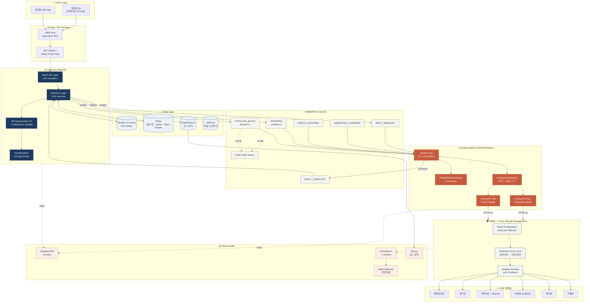
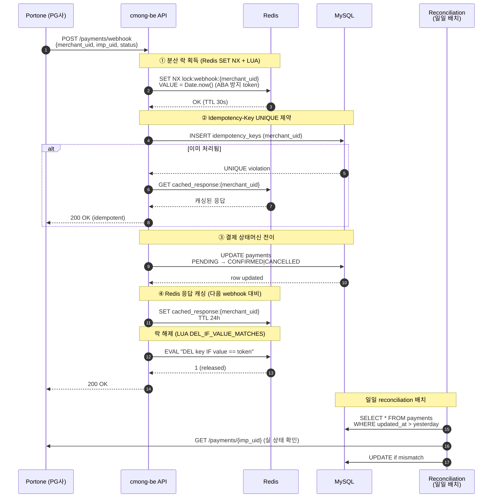
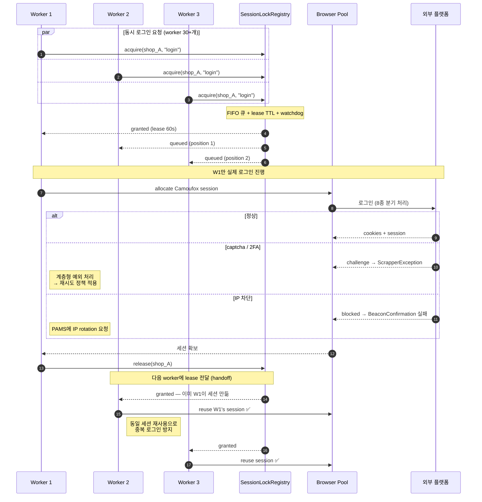
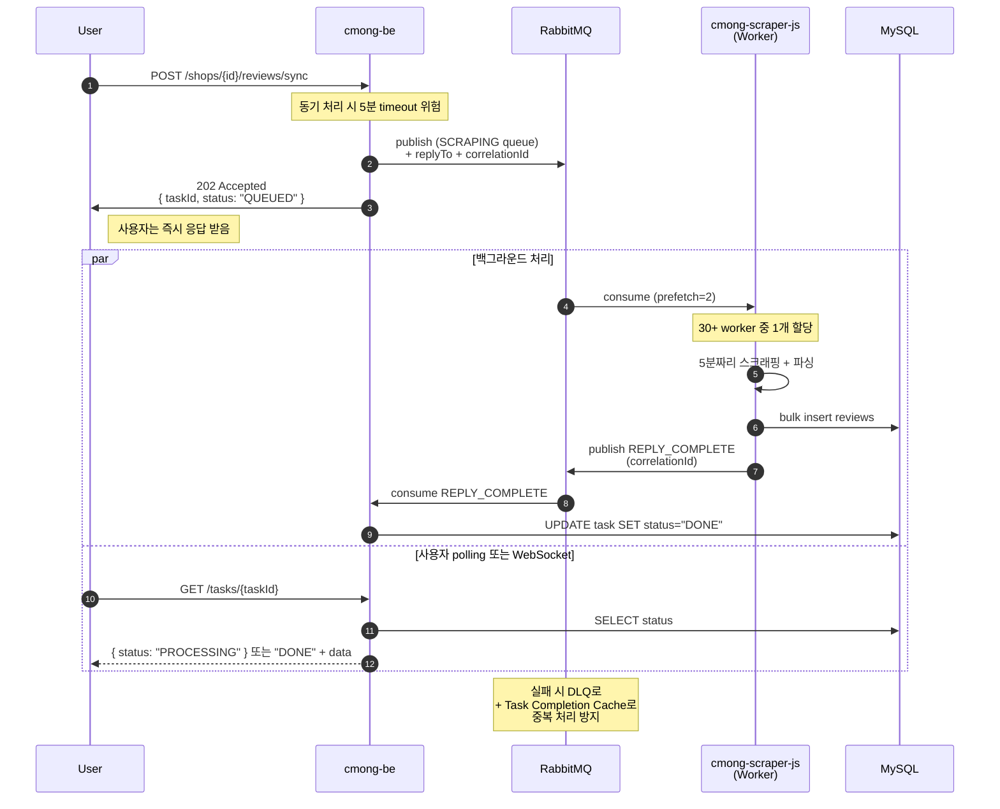
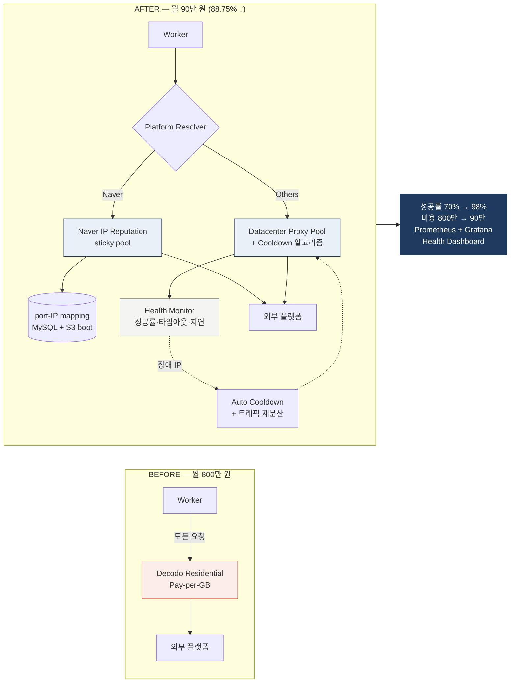
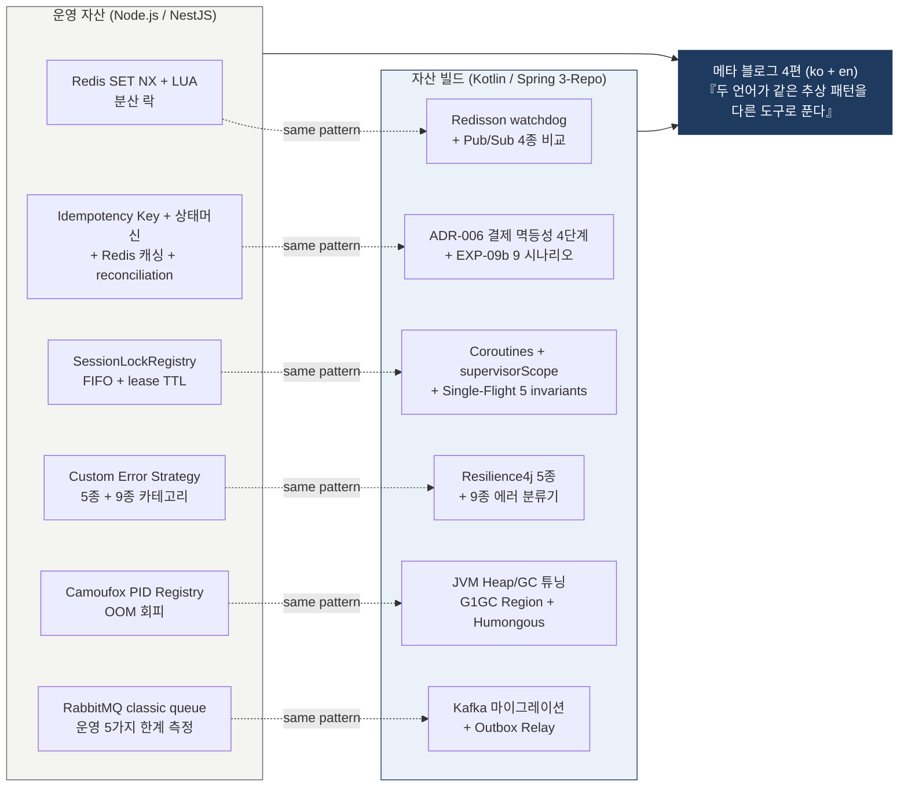

# 댓글몽 시스템 아키텍처 (이력서 보조 자료)

> 르몽(Lemong) 「댓글몽 / 댓글몽 Biz」 — 6개 배달 플랫폼 통합 리뷰 관리 SaaS
> 일일 API 호출 20만+ / 페이지 스크래핑 100만+ / 리뷰 수집 12만+ / 플랫폼별 동시 worker 30+

---

## 1. 전체 시스템 아키텍처 (High-Level)

---

## 2. 비동기 메시징 + 멱등성 4단계 (결제 webhook 흐름)

---

## 3. Multi-Worker 동시 로그인 Race 방지 (SessionLockRegistry FIFO)

---

## 4. 5분 단위 무거운 작업의 RabbitMQ 분리 (Reply-Request-Reply)

---

## 5. PAMS — Proxy 비용 88.75% 절감 아키텍처

---

## 6. JVM 자산 빌드 narrative — Node 추상 패턴 ↔ Kotlin/Spring 매핑

---

## 사용 안내

- 각 다이어그램은 mermaid 문법으로, GitHub README나 Notion에서 그대로 렌더링됩니다.
- 면접 시 `핵심 시그널 → 1번 다이어그램 → 깊이 질문 → 2~6번 중 해당 다이어그램`으로 답변 가능합니다.
- 라이브 미리보기: https://mermaid.live 에서 각 코드 블록을 붙여넣어 확인하세요.
