# 아키텍처 다이어그램 6장 (Mermaid)

`resume_v12.md` 의 `diagrams/*.svg` 6장을 mermaid 다이어그램으로 옮긴 버전입니다.
GitHub · GitLab · Notion · VSCode · Obsidian 에서 native 로 렌더링됩니다.

---

## A1. 리뷰 통합 관리 SaaS — 전체 시스템 아키텍처

> 4 책임 도메인 · 6 외부 플랫폼 통합 · 멀티 인스턴스 · 멀티 워커 풀

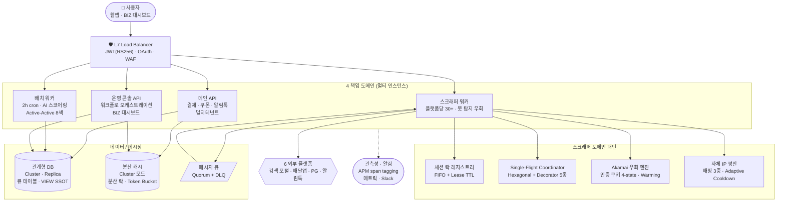

**운영 규모·핵심 성과 지표**

| 영역 | Before → After / 수치 |
|---|---|
| 일평균 처리량 | API **20만** · 페이지 스크래핑 **100만** · 리뷰 수집 **12만** |
| 프록시 풀 비용 | 월 800만 → **90만 (−88.75%)** |
| 요청 성공률 | 70% → **98%** |
| 세션 유지율 (6개월) | **99.2%** · 댓글 등록 중복 **0건** |
| Akamai 로그인 성공률 | 77.8% → **100%** (18/18 iter 측정 입증) |
| CROSSSLOT 사고 | **0건** |
| 오픈소스 | Kotest **6 PR** · Armeria **1 PR** · Spring Batch **1 PR** |

---

## A2. 결제 webhook 4중 멱등성 — 분산 락 · DB · 상태머신 · 원자 해제

> race / ABA / 상태 역전 / out-of-order 의 4 hazard 를 단계별로 곱셈 결합한 방어선

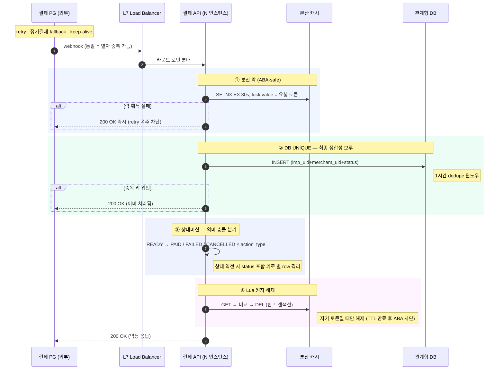

**4 hazard 매핑**

| Hazard | 어느 단계가 차단 |
|---|---|
| PG retry 폭주 | ① 분산 락 → 즉시 200 OK |
| 멀티 인스턴스 race · in-memory dedupe 한계 | ② DB UNIQUE |
| PAID 뒤 FAILED 도착 (상태 역전) | ③ 상태머신 (복합 키에 status) |
| TTL 만료 후 ABA (남의 락 삭제) | ④ Lua 원자 해제 |

**보완 라인 — 일일 정합성 reconciliation cron (사례 2)**

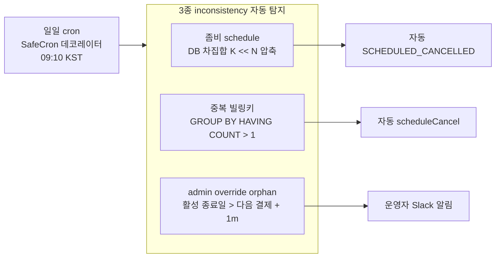

---

## B1. 관계형 DB 를 큐로 — CAS 기반 분산 작업 큐

> 「MySQL is the queue」 · 낙관락 CAS · 같은 플랫폼 계정 직렬화 · 좀비 작업 자동 복구

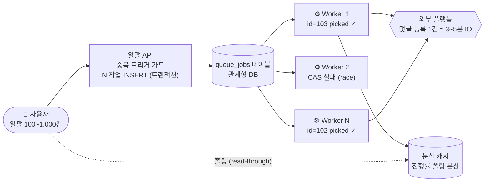

**CAS 픽업 SQL**

```sql
UPDATE queue_jobs
   SET status = 'IN_PROGRESS', updated_at = NOW(),
       status_message = '[[' || :instance_id || ']] processing'
 WHERE id = :picked_id
   AND status = 'WAITING'
   AND updated_at = :original_updated_at        -- ★ version 비교 (CAS)
   AND group_id NOT IN (:running_groups)
   AND platform_id NOT IN (:running_platforms); -- 같은 계정 직렬화
-- affected = 0 → 다른 인스턴스가 먼저 가져감 (Optimistic lock failed)
-- affected = 1 → 픽업 성공
```

**핵심 결정 — 왜 외부 큐가 아닌 RDB 인가**

| 옵션 | 한계 |
|---|---|
| 외부 메시지 큐 | fire-and-forget 최적, stateful 관리·취소·예약·진행률 폴링에 부적합 |
| 외부 큐 미들웨어 | 별도 인프라 비용 + 트랜잭션과 큐 묶기 어려움 |
| **관계형 DB 큐** | **트랜잭션 + 큐 책임 = 한 곳, CAS 가 분산 픽업 안전성 보장, SQL 운영 가시성** |

⇒ 분산 시스템의 검증된 패턴 — CAS(Compare-And-Set) SQL 버전 (`updated_at as version`)

---

## C1. 세션 락 레지스트리 — FIFO + Lease TTL + Cold-Start Guard

> 30+ 워커 동시 로그인 race 를 4 layer 직렬화 + Handoff + 안전망 3종

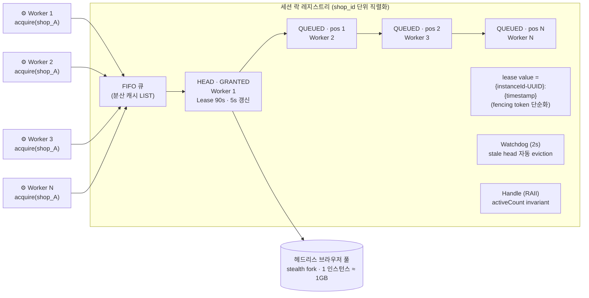

**Cold-Start Guard — 가장 미묘한 hazard**

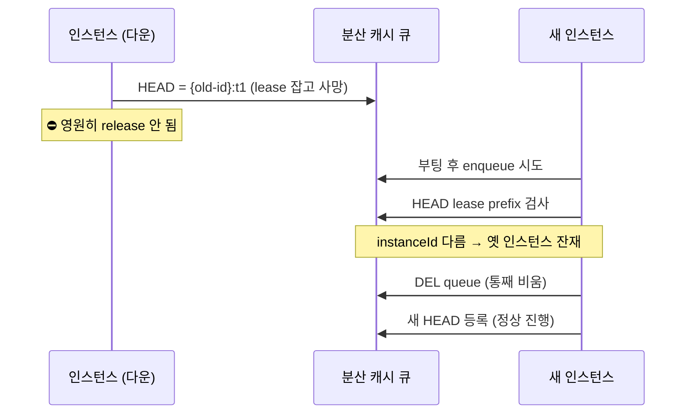

**Cluster CROSSSLOT 정책 — 모듈별 의도된 분기**

| 모듈 | 정책 | 우선 가치 |
|---|---|---|
| Queue | 단일 키 분리 (slot spread) | 부하 분산 > 트랜잭션 묶음 |
| 평판 (사례 10) | hash tag `{pool}` 슬롯 강제 | 트랜잭션 묶음 > 부하 분산 |

**안전망 3종**

- **forceRelease** — 운영자 kill switch, 대기자 즉시 reject
- **forceTerminate** — activeCount 강제 0, 락 누수 차단
- **evictStaleHead** — 2s 주기, head 의 lease 키 부재 시 LREM

**운영 검증 결과 (최근 6개월)**

| 지표 | 값 |
|---|---|
| 세션 유지율 | **99.2%** |
| 동일 매장 동시 로그인 | **0건** |
| 댓글 등록 중복 | **0건 / 6개월** |
| execution context destroyed | **0건** |
| dead-letter 누수 | **0건** |
| CROSSSLOT 에러 | **0건** |

---

## C2. 자체 IP 평판 시스템 — Before / After

> 외부 의존 제거 · 비용 88.75% 절감 · 성공률 70% → 98% · 14 phase phased rollout

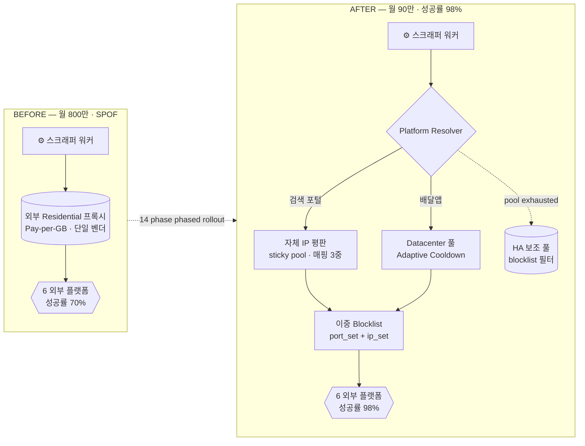

**port ↔ IP 매핑 3중 저장 — cold start 외부 의존 X**

| 계층 | 저장소 | 역할 |
|---|---|---|
| ① | In-memory Map | 가장 빠른 hot lookup · latency 최소화 |
| ② | 분산 캐시 HASH | 인스턴스 간 공유 · hash tag `{pool}` · CROSSSLOT 회피 |
| ③ | 관계형 DB + 외부 스토리지 manifest | 영구 매핑 · 클러스터 cold start 부트스트랩 |

**6개월간 풀어낸 4 hazard**

| # | Hazard | 해결 |
|---|---|---|
| 1 | Identifier IP → port 전환 | port↔IP 영구 매핑 3중 · ASN 분류 + KR 가드 |
| 2 | Cluster CROSSSLOT | hash tag `{pool}` 슬롯 강제 (queue 와 반대 정책) |
| 3 | Pool exhausted fallback | legacy 도 blocklist 필터 · AI 코드 리뷰 3회 정밀화 |
| 4 | port rotation 회피 | 차단 IP → 그 port 자동 SADD · 이중 blocklist |

---

## C3. Akamai Bot Manager 우회 — 인증 쿠키 4-state + Referrer Warming + Click Loop

> 로그인 성공률 77.8% → 100% (18/18 iter 측정) · 옛 구현 4 silent 결함 모두 차단

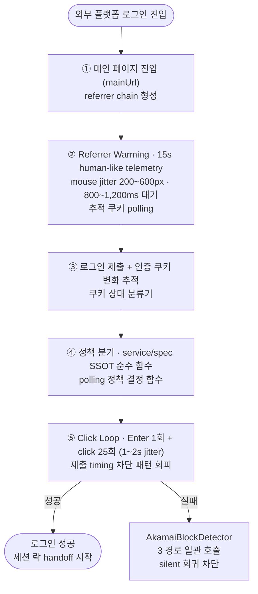

**`인증 쿠키` 상태머신 (우선순위: 차단 > challenge > 검증 > 초기)**

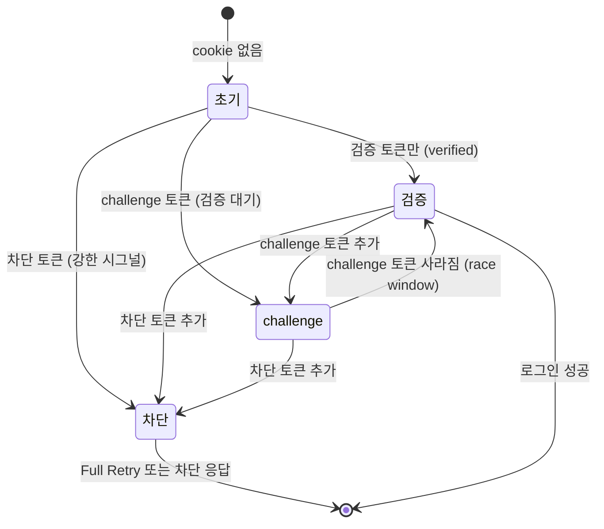

**측정 결과 (PR 본문에 박은 정량)**

| 단계 | 결과 |
|---|---|
| baseline (옛 구현) | 7 / 9 (**77.8%**) |
| **patch (Warming + Click Loop)** | **18 / 18 (100%)** |
| 6 iter × 3 worker | 모두 성공 → default ON 채택 |

**옛 구현의 4 silent 결함 → 모두 차단**

| 결함 | 옛 구현 | 신 구현 |
|---|---|---|
| ① 검증 토큰 첫 등장 즉시 break | race window 안 뒤늦은 challenge 토큰 놓침 | ENTER_RACE_WINDOW 안정 확인 후 break |
| ② 검증·차단 토큰 혼재 | 「검증 성공」 오분류 | 차단 토큰 포함 시 무조건 차단 |
| ③ Akamai → PASSWORD_ERROR | application 401/403 오분류로 retry | helper 3 경로 일관 호출 |
| ④ sensor 준비 전 제출 | 즉시 break · sensor 1~2초 추가 검증 못 받음 | Referrer Warming + Click Loop |

---


---

## B2. Hierarchical 동시성 (계정 단위 순차 · 계정 사이 병렬)

> 5,700+ 계정 · 13,000+ 매장 · 외부 락 서비스 없이 process-local 격리

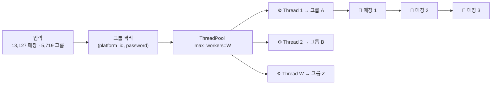

**임계치 dict — 플랫폼별 인증 에러 그룹 일괄 차단**

| 플랫폼 | 임계치 |
|---|---|
| 봇 탐지 심한 플랫폼 (검색 포털) | 0 |
| 배달앱 A | 3 |
| 배달앱 B | 2 |
| 배달앱 C | 3 |

---

## B3. BIZ 대시보드 — 2 단계 쿼리 + SQL VIEW SSOT

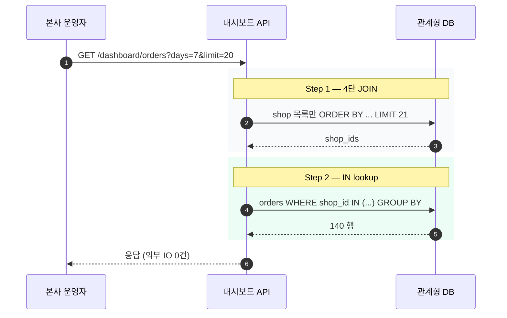

---

## C4. Single-Flight Coordinator — Hexagonal + Decorator 5종

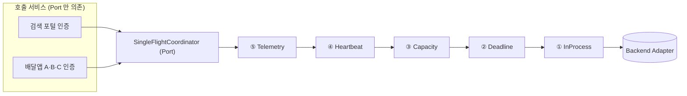

**행동 계약 7가지** — 코알레싱 · 결과 일관성 · 자원 정리 · kill switch · 호출자 격리 · 입력 계약 · 관측성

---

## D1. 자동 답글 종단 파이프라인 — TOCTOU 4 게이트

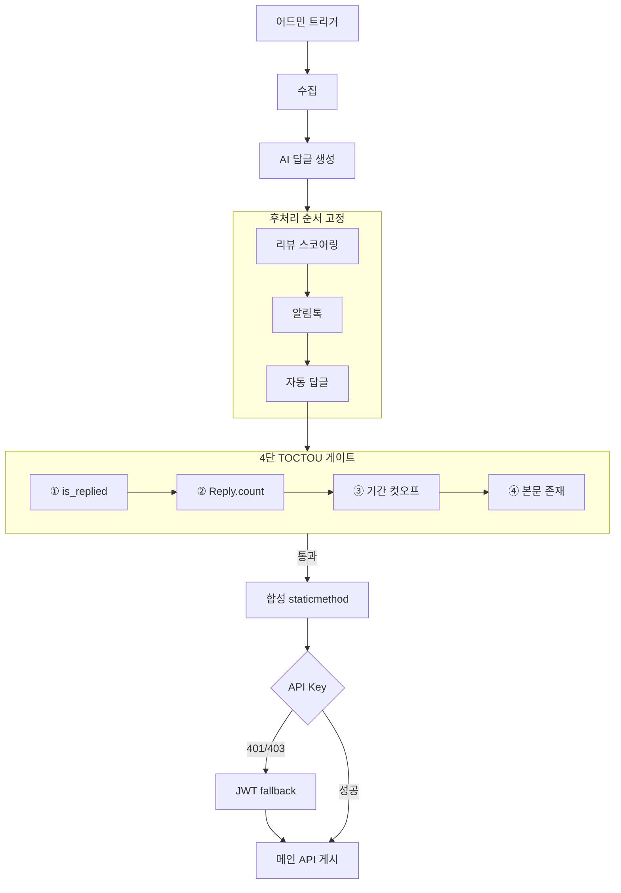


## 다이어그램 ID 매핑

| ID | 본 md 섹션 | resume_v13.md 참조 |
|---|---|---|
| A1 | 전체 시스템 아키텍처 | `diagrams/A1_system_overview.svg` |
| A2 | webhook 4중 멱등성 시퀀스 | `diagrams/A2_payment_webhook_4layer.svg` |
| B1 | 관계형 DB 작업 큐 + CAS | `diagrams/B1_rds_queue_cas.svg` |
| B2 | Hierarchical 동시성 | `diagrams/B2_hierarchical_concurrency.svg` |
| B3 | BIZ 대시보드 2 단계 쿼리 | `diagrams/B3_dashboard_2step_query.svg` |
| C1 | 세션 락 레지스트리 + Cold-Start Guard | `diagrams/C1_session_lock_registry.svg` |
| C2 | 자체 IP 평판 Before / After | `diagrams/C2_proxy_pool_before_after.svg` |
| C3 | Akamai 우회 + 인증 쿠키 상태머신 | `diagrams/C3_akamai_bypass_state_machine.svg` |
| C4 | Single-Flight Coordinator | `diagrams/C4_single_flight_hexagonal.svg` |
| D1 | 자동 답글 종단 파이프라인 | `diagrams/D1_auto_reply_pipeline.svg` |
