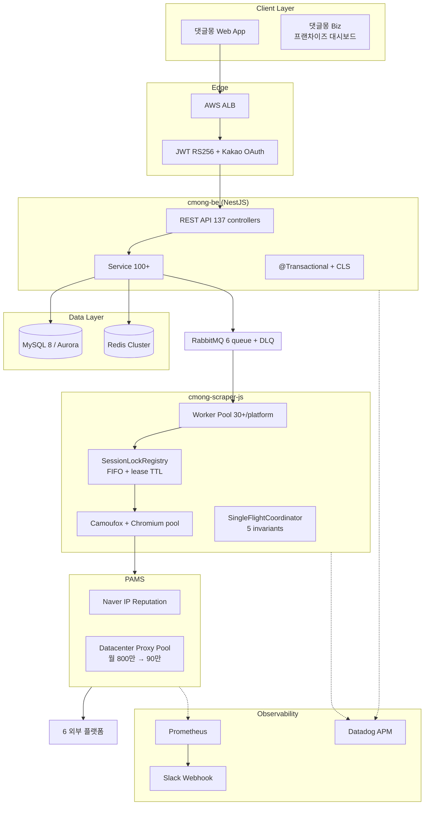

# 김면수

백엔드 개발자

Phone: 010-9101-5429 ｜ Email: digle117@gmail.com
GitHub: github.com/PreAgile ｜ Blog: astro-paper-23v.pages.dev

---

## 자기소개

분산 환경에서 발생하는 **트랜잭션 일관성·외부 의존성 격리·세션 race condition·봇 탐지 우회**의 네 축을 중심으로 운영 사고를 사전 차단하는 백엔드 시스템을 만들어 온 5년차 엔지니어입니다. 멀티 인스턴스 결제 webhook의 4중 멱등성, RDS Queue 낙관락 기반 worker pool, FIFO + lease TTL + cold-start guard로 직렬화되는 SessionLockRegistry, `_abck` 4-state 머신을 활용한 Akamai 우회 같은 패턴을 운영 트래픽 위에서 측정·검증해왔습니다.

현재 르몽에서 6개 배달 플랫폼(배달의민족·요기요·쿠팡이츠·네이버·땡겨요·먹깨비)을 통합 관리하는 리뷰 SaaS 「댓글몽」의 백엔드를 담당하고 있습니다. **일평균 API 호출 20만 건, 페이지 스크래핑 100만 건, 리뷰 수집 12만 건**을 4개 저장소(cmong-be / cmong-mq / flow-be / cmong-scraper-js, NestJS·Python·FastAPI·NestJS 워커)에서 RabbitMQ, Redis Cluster, Aurora, ECS, Datadog 위에 올려 운영합니다. 운영 중 검증된 수치로는 **자체 프록시 풀 전환으로 월 비용 800만 원 → 90만 원(88.75% 절감), 요청 성공률 70% → 98%, 세션 유지율 99.2%, 댓글 등록 중복 0건(6개월), Akamai 로그인 성공률 77.8% → 100%(PR #644 측정, 18/18 iter), 프랜차이즈 1,000개 매장 대시보드 카디널리티 통제** 등이 있습니다.

이 운영 자산을 Kotlin/Spring Boot/JPA 환경에서 같은 시나리오로 다시 풀어보며 결정 과정을 ADR로 남기는 재설계 프로젝트를 진행하면서, **JVM 오픈소스 프로젝트**에도 정기적으로 기여합니다. **Kotlin 테스트 프레임워크 Kotest의 organization 정식 멤버**로 6개 PR을 머지했고, **LINE의 비동기 RPC 프레임워크 Armeria**에 MDC export 확장 PR을 머지했으며, **Spring Batch**에는 4년 이상 누락된 chunk scanning 문서를 보완하는 PR을 제출 중입니다.

측정·진단 도구로는 Datadog APM(`tagDatadogSpan` 으로 결제 정합성 자동 집계), Prometheus + Grafana(프록시 풀 가용성), Slack Webhook(예약 결제 금액 불일치/cron start·complete·error 자동 알림), JFR/JIT 분석(JVM 재설계 프로젝트 측면)을 다뤘습니다. `중복 웹훅 락 차단`, `Job ${id} modified by another instance (optimistic lock failed)` 같은 race 차단 로그가 운영 환경에서 검출되는 것을 정기적으로 확인하며, race가 실제로 발생하지만 코드 레벨에서 차단되고 있음을 데이터로 입증해왔습니다.

---

## 오픈소스 기여

**Kotest** ｜ Kotlin 테스트 프레임워크 (GitHub 4.7k stars)
2026년 3월 메인테이너 sksamuel의 직접 초대로 organization 정식 멤버가 되어 약 한 달간 **6개 PR을 머지**했습니다. 가장 임팩트 있는 작업은 JVM/JS/Wasm/Native 멀티플랫폼 환경에서 Spec/Test/TestCase 계층을 통합하는 **타입 안전한 Test Metadata Public API를 신규 설계**한 PR #5905(+355/-16)로, 기존 sealed interface와 호환성을 유지하면서 새 공개 API를 추가하는 작업이었습니다. 그 외 JSON Schema anyOf/oneOf 표준 구현(#5807), Kotlin 내부 어노테이션 `@OnlyInputTypes`를 활용한 타입 안전 어설션(#5789), 컬렉션 data class 필드 단위 diff(#5835), JSON Matchers 커스텀 파서 지원(#5795), 어설션 체이닝(#5756)을 머지했습니다.

**Armeria** ｜ LINE의 Java 기반 비동기 RPC 프레임워크
RequestContextExporter의 BuiltInProperty에 request/response timing, content preview, serialization format, session protocol, host를 추가하고, Logback MDC export 경로의 테스트를 보강한 PR(#6683, +339/-5)을 머지했습니다.

**Spring Batch**
fault-tolerant step의 chunk scanning 메커니즘이 4년 이상 공식 문서에 누락되어 있던 이슈 #3946을 해결하는 PR(#5395)을 제출했습니다. retry 정책과 chunk scanning의 상호작용을 reference docs의 fault tolerance / scalability / chunk-oriented-processing 섹션에 추가했고, 메인테이너 응답을 대기 중입니다.

---

## 경력

### 르몽 (Lemong) ｜ 백엔드 개발자 ｜ 2024.11 ~ 현재

**시스템 개요**

자영업자와 프랜차이즈 본사를 위한 리뷰 통합 관리 SaaS '댓글몽 / 댓글몽 Biz'를 운영합니다. 일평균 **API 호출 20만 건, 페이지 스크래핑 100만 건, 리뷰 수집 12만 건** 규모를 처리하며, 플랫폼별로 30개 이상의 worker가 병렬로 동작합니다. 시스템은 4개 저장소로 책임이 분리됩니다.

| 저장소 | 런타임 | 담당 |
|---|---|---|
| `cmong-be` | NestJS / TypeScript | 사용자용 메인 BE — 결제·쿠폰·알림톡·BIZ 멀티테넌트 (137 controllers / 152 entities) |
| `cmong-mq` | Python 3.9 / Pipenv | 배치·파이프라인 워커 — 5,700+ 계정 13,000+ 매장 2시간 cron / AI 스코어링 / 8색 Active-Active 배포 |
| `flow-be` | Python 3.12 / FastAPI | 운영 콘솔 BE — APScheduler cron · 잡 오케스트레이션 · AI 파이프라인 · 댓글몽 Biz 대시보드 |
| `cmong-scraper-js` | NestJS 11 / Camoufox·Playwright | 6 플랫폼 스크래퍼 워커 — SessionLockRegistry · Akamai 우회 · PAMS 자체 프록시 풀 |

**전체 아키텍처 (High-Level)**



> architecture.md 1번 다이어그램 인용 — 6 플랫폼·30+ worker·137 controllers·152 entities의 전체 구조.

본문은 **결제·정산(도메인 A) → 멀티 워커 동시성·대량 데이터(도메인 B) → 외부 의존성 격리·봇 탐지 우회(도메인 C) → AI 파이프라인·운영 자동화(도메인 D)** 의 네 도메인 12개 사례를 5단 구조로 정리합니다.

---

## [도메인 A] 결제·정산 (cmong-be)

### 사례 1. 결제 webhook 4중 멱등성 — 분산 락 + DB UNIQUE + Lua 원자 해제 + 상태머신 ｜ 2025.09 ~ 운영 중

**1. 배경 및 목표**

- PG사(Portone) webhook은 동일 `imp_uid` / `merchant_uid`로 **중복 호출**되는 경로가 5가지 이상 존재 (Portone retry, 정기결제 fallback retry, 결제 취소 후 재결제, 부분 환불 상태 전이, ALB keep-alive 재시도).
- 단순 INSERT는 `billings` 이중 집계 → 매출 중복, 알림톡 2회 발송, `subscriptions` 중복 생성으로 다음 달 이중 과금까지 도미노로 연결.
- ECS 다중 Task로 배포되므로 in-memory dedupe 불가, TypeORM `findOne → save` 사이 race window가 존재, Redis 락만으로는 TTL 만료 시 다른 워커의 락을 지우는 ABA 문제(Redlock 논문) 발생 가능.
- 비즈니스 요구: webhook 처리 결과는 **at-most-once 의미적 효과** + Portone에 200 OK 빠른 응답 (그렇지 않으면 자동 retry 폭주).

**2. 구현 과정**

**기술 선택 근거** — 단일 도구로는 모든 race를 못 막는다는 판단으로 **4중 방어선**을 의도적으로 쌓았습니다. Redis 단일 락은 ABA 문제와 fail-open 정책에서 한계, DB UNIQUE만으로는 Portone retry 폭주를 못 막음, 상태머신만으로는 동시 INSERT race를 못 막음. 셋을 곱셈으로 결합.

핵심 파일 — `src/payments/services/payments.service.ts:118` `payments()`, `:1929` `saveWebhookData()`, `src/common/redis/redis.service.ts:76` `setNX()`, `:92` `delIfValueMatches()` (Lua), `src/entities/portone-webhook.entity.ts` (`mix_value` UNIQUE).

```ts
// 단계 1 — Redis 분산 락 (ABA 방지 token)
const lockValue = Date.now().toString();
const acquired = await this.redisService.setNX(lockKey, lockValue, 30);
if (!acquired) return { imp_uid, merchant_uid, status }; // 200 OK 즉시 반환

// 단계 2 — DB UNIQUE 제약 + ER_DUP_ENTRY 핸들링
const mix_value = `${imp_uid}-${merchant_uid}-${status}`;
try { await this.portoneWebhookRepository.save({ ..., mix_value }); }
catch (e) { if (e?.code === 'ER_DUP_ENTRY') return CONFLICT_REQUEST; }

// 단계 3 — 상태머신 전이 (READY/CANCELLED/FAILED/PAID 분기)
// 단계 4 — Lua 원자 해제 (남의 락 지우기 방지)
private DEL_IF_VALUE_MATCHES_LUA =
  "if redis.call('get', KEYS[1]) == ARGV[1] then return redis.call('del', KEYS[1]) else return 0 end";
```

동작 흐름 — Portone POST `/payments/webhook` → ALB 라운드로빈 → ① Redis SET NX(token = `Date.now()`) → ② DB UNIQUE(mix_value, 1시간 dedupe 윈도우) → ③ status 별 분기(PAID/FAILED/CANCELLED) → ④ Lua eval로 `GET-비교-DEL` 원자 실행 → 200 OK.

**3. 아키텍처** — architecture.md 2번 다이어그램(Sequence: Portone → API → Redis → DB → Recon)과 1:1 매칭. 일일 reconciliation 배치(다음 사례 2)가 위 흐름의 보완 라인.

**4. 기술적 도전과 해결**

- **도전 A: Portone 자동 retry로 동시 webhook 폭주**
  - 문제: Portone은 응답 != 200 또는 timeout 시 자동 retry. 같은 `imp_uid`로 1초 안에 여러 번 호출되는 케이스가 운영 로그에서 관찰됨. 정기결제 schedule 1차 실패 직후 fallback retry로 PAID/FAILED가 거의 동시 도달.
  - 원인: ECS 다중 Task → 같은 webhook이 다른 인스턴스 동시 도착 → in-memory dedupe 불가. TypeORM `findOne → save` race window.
  - 해결: `merchant_uid` 기반 Redis 분산 락(TTL 30초 = webhook 최대 처리 시간 상한). 락 실패 시 200 OK 즉시 반환으로 retry 폭주 차단. commit `7d1eeedd`, PR #1352.
  - 결과: 운영 로그에 `중복 웹훅 락 차단: merchant_uid=..., status=...` 검출 — race가 실제로 일어났으나 차단됨을 시사.

- **도전 B: Redis 락 TTL 만료로 인한 ABA (다른 워커의 락 삭제)**
  - 문제: 단순 `await redis.del(lockKey)` 사용 시, 워커 A의 작업이 30초 넘어 TTL 만료된 후 워커 B가 같은 키로 락을 잡은 상황에서 워커 A의 늦은 `del`이 워커 B의 락을 지움.
  - 원인: Redis 락의 식별성을 단순 키 존재 여부로만 판단하면 잡은 주체를 구분 못 함 (Redlock 정통 문제).
  - 해결: 락 value에 `Date.now()` 토큰 박고, 해제 시 Lua `eval`로 **GET-비교-DEL을 원자 실행** (`redis.service.ts:10` 의 `DEL_IF_VALUE_MATCHES_LUA`).
  - 결과: 동일 helper(`delIfValueMatches`)가 webhook 외 `handlePromotionalUpgrade`(`payments.service.ts:3028`), `changePlan`(`:3367`), `notifly-batch.service` 등 **8군데 이상에서 재사용**되어 분산 락이 표준화됨.

- **도전 C: Redis fail-open vs DB UNIQUE의 최종 방어**
  - 문제: Redis 일시 장애 시 락을 못 잡으면 webhook을 막아버리면 Portone retry 폭주, 통과시키면 중복 처리 위험.
  - 해결: 단계 2의 DB UNIQUE를 **최종 방어선**으로. Redis는 빠른 dedupe 캐시, DB는 정합성 최종 보장이라는 책임 분리.
  - 결과: Redis가 SPOF가 되지 않음. `queue-state.service.ts:81` `isProcessed`도 같은 fail-open 철학.

- **도전 D: PAID 직후 FAILED 도착하는 상태 충돌 (out-of-order)**
  - 문제: 정기결제 schedule 1차 실패 → Portone 2차 재시도 성공 → 1차 실패 webhook이 2차 성공 webhook **뒤에** 도착하면 DB가 FAILED로 덮어쓰여짐.
  - 해결: `mix_value = imp_uid + merchant_uid + status` 단위 dedupe + 1시간 이내 처리 여부 가드 (`receiveInOneHour`).
  - 결과: 상태 역전 시나리오에서도 멱등성 유지.

**5. 결과**

- 멀티 인스턴스 race 가드 **4중** (Redis 락 + Lua 해제 + DB UNIQUE + 상태머신).
- 운영 로그에 `중복 웹훅 락 차단` 메시지가 정상적으로 검출되어 race 차단이 데이터로 입증됨.
- PR #1376, #1492로 예약 결제 금액 불일치 시 Slack 자동 경고 추가, 정합성 모니터링 자동화.
- 동일 `setNX + Lua DEL` 패턴이 promotional upgrade, change plan, verify code, notifly batch 등 8군데 이상으로 재사용되어 사내 표준 라이브러리화.

**6. 사용 기술**

| 영역 | 기술 |
|---|---|
| 분산 락 | Redis (ioredis) `setNX` + Lua eval 원자 해제 + 토큰 기반 ABA 방어 |
| DB 정합성 | MySQL Aurora `portone_webhook.mix_value` UNIQUE, `ER_DUP_ENTRY` 핸들링 |
| 상태머신 | READY → PAID / FAILED / CANCELLED + action_type(CHANGE_BILLING_METHOD / RESERVE / CHANGE_PLAN) 분기 |
| 외부 통합 | Portone API (결제 상세 조회, schedule cancel/reschedule) |
| 관측성 | Datadog `tagDatadogSpan` (amount_mismatch, coupon_select 메트릭), Slack `PAYMENT_ERROR_SLACK_CHANNEL` |

---

### 사례 2. 결제 reconciliation — 좀비 schedule / 중복 빌링키 / admin override orphan 자동 감지 ｜ 2025.10 ~ 운영 중

**1. 배경 및 목표**

- webhook 4중 멱등성으로도 못 막는 케이스 3종이 존재: ① **좀비 schedule** (Portone 서버에는 schedule 있는데 DB에 cancel로 기록 → 다음 결제일 자동 과금), ② **중복 빌링키** (한 사용자에 `SCHEDULED` billing 2개 이상 → 다음 결제일 이중 과금), ③ **admin override orphan** (어드민이 구독을 2027년까지 수동 연장 → 이전에 잡힌 2026년 4월 자동결제 schedule이 그대로 남음).
- 비즈니스 요구: 「알아서 한 번 더 결제 갈 수 있다」는 상태를 운영자가 **사전에 발견** 가능해야 함 (사후 환불은 분쟁 발생).
- 어려움: Portone API 호출 비용 + 분당 한도 → 의심 customer_uid만 추려야 함. DB의 SCHEDULED와 Portone의 `schedule_status`는 의미가 미묘하게 다름(DB는 billing 단위, Portone은 schedule 단위) → 정합성은 본질적으로 eventual consistency.

**2. 구현 과정**

**기술 선택 근거** — Portone API를 모든 사용자에 대해 매일 호출하면 분당 한도 초과 + 비용. DB 차집합 추출로 의심 대상을 **K << N으로 압축**한 뒤 Portone 호출. 또한 어드민 수동 트리거 API + 일일 자동 cron의 이중 진입점.

핵심 파일 — `src/billings/payment-sync.service.ts` (408 라인, reconciliation 엔진), `payment-sync.controller.ts` (어드민 API), `src/subscriptions/subscriptions.service.ts:1165` `handleDuplicatePaymentReserve` (일일 cron).

```ts
// issue 1 — checkZombieSchedules (payment-sync.service.ts:92)
// cancelled/scheduled-cancelled 상태이면서 active 구독이 없는 차집합 추출
const suspiciousUids = ... WHERE status IN (CANCELLED, SCHEDULED_CANCELLED)
                            AND cancelled_at >= NOW() - 3 MONTH
                            GROUP BY customer_uid;
const activeUidSet = new Set(activeUids); // active 보유 customer_uid
// 차집합만 Portone에 호출 → K << N

// issue 3 — checkAdminOverrideOrphans (payment-sync.service.ts:250)
SELECT activeSub.subscription_id, schedSub.schedule_at, schedBilling.merchant_uid
FROM subscriptions activeSub
INNER JOIN subscriptions schedSub ON schedSub.user_id = activeSub.user_id
INNER JOIN billings schedBilling ON schedBilling.subscription_id = schedSub.subscription_id
WHERE activeSub.status = 'ACTIVE'
  AND activeSub.end_date > NOW()
  AND schedSub.schedule_at > NOW()
  AND activeSub.end_date > DATE_ADD(schedSub.schedule_at, INTERVAL 1 MONTH);
```

위 SQL의 핵심: **활성 구독 종료일이 다음 자동결제 예약일보다 1개월 이상 뒤** = active 기간 내 불필요 결제 예약 = 이중 결제 위험.

일일 cron `handleDuplicatePaymentReserve`는 다음 4-way 분기로 Portone schedule 응답 처리:
- Portone 응답 schedule 0개 → DB 좀비 → `SCHEDULED_CANCELLED` 정정
- 1개 = 정상
- 2개 이상 + billing.merchant_uid와 다른 schedule → Portone cancel 호출
- API 실패 → `notReponseMerchantUids` 기록 → Slack 알림

**3. 아키텍처**

```
┌─ 일일 cron (09:10 KST, @SafeCron) ─┐    ┌─ 어드민 API (수동 트리거) ─┐
│ handleDuplicatePaymentReserve     │    │ POST /admin/payment-sync/check │
└──────────────┬────────────────────┘    └──────────────┬─────────────┘
               ▼                                         ▼
       ┌─ 3종 issue 감지 (payment-sync.service.ts:checkPaymentSync) ─┐
       │ ① checkZombieSchedules — 차집합 추출 → Portone 호출 최소화  │
       │ ② checkDuplicateBillingKeys — GROUP BY HAVING COUNT > 1     │
       │ ③ checkAdminOverrideOrphans — end_date > schedule_at + 1M   │
       └────────────────────┬─────────────────────────────────────────┘
                            ▼
       ┌─ 수정 액션 ─┐  ┌─ 알림 ─┐
       │ Portone     │  │ Slack  │ (중복/삭제/무응답 리스트)
       │ scheduleCancel │ #결제알림 │
       └────────────┘  └────────┘
```

**4. 기술적 도전과 해결**

- **도전 A: Portone API 호출 최소화 (분당 한도 + 비용)**
  - 문제: 전체 사용자 N명에 매일 `getSchedulesByBillingKey` 호출 시 한도 초과 + 5분 cron 안에 못 끝남.
  - 해결: DB 차집합으로 의심 K명 추출 (`cancelled/scheduled-cancelled` AND `없는 active`). `payment-sync.service.ts:99~142`.
  - 결과: 운영 로그에 `좀비 예약 점검 대상: K개 customer_uid (active S개 제외)` 압축률 명시. Portone rate-limit 안에서 5분 내 완료.

- **도전 B: DB SCHEDULED와 Portone schedule 의미 불일치**
  - 문제: DB는 billing row 단위 status, Portone은 schedule 단위 status. 같은 customer_uid에 DB SCHEDULED인데 Portone schedule 0개일 수 있음 (운영 화면엔 "결제 예약됨"으로 표시되지만 실제 결제는 안 감).
  - 해결: 위 4-way 분기 (`subscriptions.service.ts:1234~1290`).
  - 결과: 매일 09:10 운영자가 정합성 상태 한 메시지로 수신, 사후 환불 없이 사전 차단.

- **도전 C: admin이 구독 수동 연장한 케이스의 이중 결제**
  - 문제: 어드민이 구독을 2027년까지 연장하면 `active.end_date`는 늘어나지만 이전에 잡힌 자동결제 schedule은 그대로 남음. 사용자는 "1년 미리 결제 끝"으로 인지하는데 4월에 또 결제 가서 클레임.
  - 해결: SQL `activeSub.end_date > DATE_ADD(schedSub.schedule_at, INTERVAL 1 MONTH)` 조건으로 정확히 이 케이스 감지. issue type `admin_override_orphan`으로 표면화 + cancel 액션.
  - 결과: 단일 SQL로 매일 자동 탐지.

**5. 결과**

- 3종 inconsistency 자동 감지 (`zombie_schedule` / `duplicate_billing_key` / `admin_override_orphan`).
- 일일 cron + 어드민 수동 트리거 이중 진입점.
- 발견 시 자동 정정 + Portone cancel + Slack 알림 → **결제 PG 운영의 사후 환불·클레임·CS 부담을 사전 탐지로 전환**.
- 일일 cron은 `@SafeCron` (사례 14) 으로 멀티 인스턴스에서 한 번만 실행되도록 분산 락 적용.

**6. 사용 기술**

| 영역 | 기술 |
|---|---|
| 차집합 추출 | MySQL Aurora `GROUP BY HAVING`, `DATE_ADD INTERVAL` 비교, 4단 JOIN |
| 외부 통합 | Portone `getSchedulesByBillingKey`, `scheduleCancel` |
| 스케줄러 | `@SafeCron('10 9 * * *', timeZone: Asia/Seoul)` |
| 알림 | Slack Webhook (일일 리포트, 무응답 리스트) |

---

### 사례 3. 쿠폰 멱등 적용 — 사전 검증 + plan 사이드 매칭 + 차액 계산 fallback ｜ 2025.11 ~ 운영 중

**1. 배경 및 목표**

- 쿠폰은 결제 흐름에 깊게 얽힘 (「첫달 무료」「2주년 두 달 무료」「프로모션 50%」 등 다양). 같은 사용자에게 여러 쿠폰이 있을 때 우선순위 결정 필요.
- 정기결제 schedule 등록 시 쿠폰 적용 금액과 plan 정가가 다를 수 있음 → schedule 등록 amount vs 다음 결제 시점에 실제 적용할 쿠폰의 정합성 검증 필요.
- 기존 한계: 쿠폰 적용 계산이 결제 흐름 곳곳에 흩어져 변경 시 회귀, schedule 등록 amount는 쿠폰 적용 금액인데 실제 결제 시점에 쿠폰 만료/사용되면 정가 결제됨 → 사용자 클레임.

**2. 구현 과정**

**기술 선택 근거** — 「fallback 보정」 패턴: schedule 등록 시점에 계산한 amount와 실제 결제 직전에 재계산한 amount가 다르면 결제 직전 한 번 더 보정. 사용자에게 손해 안 가는 방향으로.

핵심 파일 — `src/coupons/coupons.service.ts` (386 라인), `src/user-coupons/user-coupons.service.ts:104` (멱등 발급), `src/payments/utils/payment.utils.ts` (`amountWithUserCoupons`, `handleUsedAmount`, `updateReusableCouponUsage`), `src/payments/services/payments.service.ts:730` (schedule 정합성 검증).

```ts
// 다음 요금제에 적용되어야 하는 쿠폰 조회 (payments.service.ts:783)
const { value: predictedAmount, coupon: predictedCoupon } = amountWithUserCoupons(
  plan.price, availableUserCoupons, undefined,
  customData.coupon_id?.[0], // 명시적 coupon_id 우선
);
// 적용되어야 하는 쿠폰 vs fallback 전 amount 불일치 시 보정
if (predictedCoupon && predictedAmount !== scheduleAnnotation.amount) {
  this.logger.warn(`schedule fallback 금액 보정: ${...} → ${predictedAmount}`);
  scheduleAnnotation.amount = predictedAmount;
  customData.coupon_id = [predictedCoupon.coupon_id];
}

// 중복 발급 차단 (user-coupons.service.ts:86)
const alreadyExistUserCoupon = await this.userCouponsRepository.findOne({
  where: { user, coupon },
});
if (alreadyExistUserCoupon) return alreadyExistUserCoupon; // 멱등 반환
```

**3. 아키텍처**

```
[Portone schedule 등록 진입]
        │
        ▼
[available userCoupons (is_exhausted=false, plan_id 매칭) 재조회]
        │
        ▼
[amountWithUserCoupons (우선순위 + 명시적 coupon_id 매핑)]
        │
   ┌────┴────┐
   ▼         ▼
predictedAmount   schedule.amount
        \      /
         비교
        /      \
일치           불일치
   │              │
   ▼              ▼
그대로 등록   fallback 보정 (WARN 로그)
                  │
                  ▼
            Portone schedule API
                  │
                  ▼
            billings.status = SCHEDULED
```

**4. 기술적 도전과 해결**

- **도전 A: schedule 등록 시점과 실제 결제 시점의 쿠폰 상태 차이**
  - 문제: schedule 등록 시 쿠폰 A로 50% 할인 금액 등록 → 다음 달 결제 시점에 쿠폰 A 만료/사용 → Portone은 등록된 amount 그대로 결제 → 손해.
  - 해결: schedule 등록 직전에 `available userCoupons` 재조회 + `amountWithUserCoupons`로 다음 결제에 실제 적용될 금액 계산 → 불일치 시 amount + custom_data.coupon_id 보정. PR #1380.
  - 결과: 운영 환경에서 `schedule fallback 금액 보정` 로그로 결제 정합성 차이 자동 보정.

- **도전 B: 동일 쿠폰 중복 발급 차단**
  - 문제: 마케팅 캠페인에서 같은 쿠폰 발급 API가 여러 번 호출되어 중복 발급 시 같은 쿠폰 여러 번 사용 가능 버그.
  - 해결: `createUserCoupon` 진입 시 `findOne(user, coupon)` 로 기존 row 확인 → 있으면 기존 row 반환 (idempotent). PR #1372, #1353.
  - 결과: 동일 쿠폰 중복 발급 0건.

- **도전 C: 쿠폰 수정 시 트랜잭션 일관성**
  - 문제: 쿠폰 메타데이터 + 적용 가능 plan + 발급된 user 매핑을 한 번에 수정 → 일부 update 후 실패 시 데이터 불일치.
  - 해결: `queryRunner` 기반 명시적 트랜잭션 (`coupons.service.ts:294~360`) — `try-commit / catch-rollback / finally-release` 패턴. delete + add + update를 한 트랜잭션 안.
  - 결과: 쿠폰 수정 중 실패 시 부분 update 없음.

- **도전 D: 「첫달 무료 → 스페셜 전환」 사이클**
  - 문제: 첫달 무료(PROMOTIONAL) 쿠폰 사용자가 다음 달 스페셜 전환 시 금액 계산이 복잡 (PR #1495).
  - 해결: `OfferingType.PROMOTIONAL` 분기 → `handlePromotionalUpgrade` (`payments.service.ts:3016`) 에 분산 락 + 전액 즉시 결제 + 다음 결제 예약을 한 트랜잭션으로 묶음.

**5. 결과**

- 쿠폰 흐름의 idempotency를 「사전 검증(findOne) + 트랜잭션(queryRunner) + 사후 검증(스케줄 fallback)」 **3중**으로 보장.
- `amountWithUserCoupons` 단일 함수가 결제·schedule·change_plan·promotional upgrade 모든 흐름에서 재사용 (DRY).
- PR #1380, #1377, #1372, #1353, #1495, #1505.

**6. 사용 기술**

| 영역 | 기술 |
|---|---|
| 멱등성 | UNIQUE(user_id, coupon_id), `is_exhausted` 플래그, `findOne` 사전 검증 |
| 트랜잭션 | TypeORM `QueryRunner` (명시적 `startTransaction / commit / rollback / release`) |
| 정합성 검증 | schedule 등록 직전 재계산 + WARN 로그 + custom_data.coupon_id 보정 |
| 관측성 | Datadog `payment.coupon_select.*` span tag, Slack 미적용 경고 |

---

## [도메인 B] 멀티 워커 동시성 / 대량 데이터 처리

### 사례 4. 매장 일괄 등록 — FOR UPDATE 비관락 + 그룹 트랜잭션 + 멱등 재시도 ｜ 2025.12 ~ 운영 중

**1. 배경 및 목표**

- 댓글몽 Biz는 프랜차이즈 본사가 **수백~수천 개 매장을 엑셀로 한 번에 등록** (1행 = 1 사장님 = 1~6 플랫폼 계정).
- 기존 한계: 한 행씩 순차 INSERT → 1,000행 등록에 수십 분. 같은 `(platform, platform_id)` 조합이 동시에 두 행에 있으면 race로 중복 PlatformAccount 생성. 부분 실패 시 사용자가 엑셀 재업로드 → 어디까지 성공했는지 모름.
- 비즈니스 요구: 검증(`VALIDATED`) → 등록(`REGISTERING`) → 결과(`REGISTERED`/`REGISTER_FAILED`) 명확한 상태머신. 같은 사장님 묶음(email + business_number)은 모두 성공 또는 모두 실패 (부분 성공 시 데이터 일관성 깨짐).
- 어려움: TypeORM 기본 격리수준 REPEATABLE READ로는 같은 `(platform, platform_id)` INSERT race 못 막음. UNIQUE 인덱스만으로는 ER_DUP_ENTRY 에러 메시지 일관성 처리 어려움.

**2. 구현 과정**

**기술 선택 근거** — TypeORM의 일반적인 `@Transactional` + UNIQUE는 race window가 있고 에러 메시지가 일관되지 않음. **`SELECT ... FOR UPDATE` 비관락**으로 트랜잭션 내 X-lock 잡고, **그룹 단위 트랜잭션 경계**로 부분 성공/실패 격리.

핵심 파일 — `src/batch-users-v2/batch-users-v2.service.ts:388` `registerBulk`, `:477` `processRegisterGroup`, `:483` FOR UPDATE.

```ts
@Transactional()
private async processRegisterGroup(brandId: string, rows: BatchUserV2[]) {
  // 1. 같은 (platform, platform_id) 동시 INSERT 절대 방지
  for (const r of rows) {
    const existing = await this.manager.getRepository(PlatformAccount)
      .createQueryBuilder('p')
      .where('p.platform = :platform', { platform: r.platform })
      .andWhere('p.platform_id = :platformId', { platformId: r.platform_id })
      .setLock('pessimistic_write')          // ★ SELECT ... FOR UPDATE
      .getOne();
    if (existing) return await this.markGroupFailed(rows, `중복: 이미 등록됨`);
  }
  // 2. user 조회/생성  3. brand_user 조회/생성  4. platform_account 생성
}

// 멱등 재시도 — 함수형 update로 race-free 카운터 증가
await this.batchUserV2Repository.update({ batch_user_v2_id: In(candidateIds) }, {
  status: BATCH_USER_V2_STATUS.REGISTERING,
  attempt_count: () => 'attempt_count + 1',
  last_attempted_at: new Date(),
});
```

상태머신 — `PENDING → VALIDATED → REGISTERING → REGISTERED | REGISTER_FAILED` (재시도 가능 ↑).

**3. 아키텍처**

```
[운영자 엑셀 업로드] → validate → status=VALIDATED
                                     │
                                     ▼
                            [registerBulk]
                                     │
       ┌────── 그룹화 (email + business_number) ──────┐
       ▼              ▼              ▼
   [group A]      [group B]      [group N]
       │              │              │
       ▼              ▼              ▼
[@Transactional 그룹 단위] (한 그룹 = 한 트랜잭션 경계)
       │
       ▼
[1. FOR UPDATE 비관락 SELECT platform_account]
       │
       ▼
[2. user 조회/생성] → [3. brand_user] → [4. platform_account INSERT]
       │
       ▼
[batch row UPDATE status=REGISTERED]

예외 처리:
- 중복 감지 → markGroupFailed (롤백 + last_error 기록)
- exception → catch → REGISTER_FAILED 단정
```

**4. 기술적 도전과 해결**

- **도전 A: 같은 (platform, platform_id) 동시 INSERT race**
  - 문제: 엑셀에 같은 platform_id가 두 행에 있거나(사용자 실수) 다른 운영자가 동시 등록 시 `findOne + save` race window. UNIQUE만으로는 에러 메시지 일관성 어려움.
  - 해결: `setLock('pessimistic_write')` = `SELECT ... FOR UPDATE`. 트랜잭션 내 read lock 잡으면 다른 트랜잭션 대기, 충돌 시 `markGroupFailed` 호출 → 명확한 메시지(`${r.platform} 계정 중복: 이미 등록됨`).
  - 결과: 같은 platform_id 등록 시 중복 PlatformAccount row 0건.

- **도전 B: 그룹 단위 트랜잭션 (한 사장님 = 1~6 플랫폼)**
  - 문제: 사장님 한 명이 배민·요기요·쿠팡이츠 3개 등록 시 배민 성공·요기요 실패면 데이터 일관성 깨짐. 1,000행 한 트랜잭션은 한 사장님 에러로 전체 롤백 비합리.
  - 해결: `groupKey = email + business_number` 로 candidate Map 그룹화. 각 그룹은 별도 `@Transactional()` 메서드 호출 → 그룹 = 트랜잭션 경계.
  - 결과: 「엑셀 1,000행 중 950 성공, 50 실패」 부분 성공 케이스 깔끔하게 지원. 실패한 50개만 재시도 가능.

- **도전 C: 재시도 멱등성**
  - 문제: 실패한 row 재시도 시 이미 만들어진 PlatformAccount 다시 만들면 중복. 어디서 실패했는지에 따라 재진입 지점 달라야 함.
  - 해결: 각 단계 `findOne` 먼저 → 없으면 생성. PlatformAccount는 위 FOR UPDATE로 사전 차단. `attempt_count + 1`, `last_attempted_at`, `last_error` 추적으로 운영자 디버깅 가시화.
  - 결과: 같은 row 여러 번 등록 시도해도 멱등. PR #1477 v2 마이그레이션 완료.

**5. 결과**

- 1,000+ 매장 일괄 등록 지원, 그룹 트랜잭션 경계로 부분 성공/실패를 row 단위로 정확히 표시.
- TypeORM `setLock('pessimistic_write')` 의 정통적 사용 사례 — 「@Transactional + UNIQUE」 조합으로는 못 막는 race를 비관락으로 해결.
- PR #1477 (refactor: 매장 일괄등록 리팩토링), PR #1453 (add: v2 마이그레이션 API).

**6. 사용 기술**

| 영역 | 기술 |
|---|---|
| 비관락 | MySQL InnoDB `SELECT ... FOR UPDATE` (행 단위 X락) |
| 트랜잭션 | TypeORM `@Transactional` + 그룹 단위 메서드 분리, 함수형 update (`attempt_count + 1`) |
| 상태머신 | PENDING → VALIDATED → REGISTERING → REGISTERED/REGISTER_FAILED |
| 운영 가시성 | `last_error`, `last_attempted_at`, `attempt_count` 디버깅 트레이스 |

---

### 사례 5. 일괄 댓글 처리 — RDS Queue 낙관락 + 멀티 인스턴스 worker pool ｜ 2025.10 ~ 운영 중

**1. 배경 및 목표**

- 댓글몽 사용자는 「오늘 들어온 리뷰 100~1000개에 한 번에 자동 댓글 등록」을 자주 사용. 외부 플랫폼 댓글 한 건 등록은 **3~5분 IO**.
- 기존 한계: HTTP 동기 처리 시 ALB 5분 타임아웃 초과. 단일 인스턴스 in-memory queue 사용 시 재배포로 작업 유실. 같은 사용자 같은 플랫폼 계정으로 worker 2개 동시 로그인 시 외부 플랫폼 차단.
- 비즈니스 요구: 사용자는 "일괄댓글 시작" 후 다른 화면 이동, 진행률 폴링 실시간 표시. 같은 사용자 활성 작업 동시 1개 (중복 트리거 방지). 부분 실패 재시도 + 사용자 confirm/cancel.
- 어려움: RabbitMQ는 작업 stateful 관리·취소·예약에 안 맞음(fire-and-forget에 최적). BullMQ 같은 외부 큐 솔루션 대신 **MySQL 테이블을 큐로 사용** = 트랜잭션과 함께 묶을 수 있는 장점, 다만 동시성 제어 직접 해야 함.

**2. 구현 과정**

**기술 선택 근거** — TypeORM 낙관적 락 (`UPDATE WHERE id=? AND status=? AND updatedAt=originalUpdatedAt`) 으로 CAS(Compare-And-Set)의 SQL 버전 구현. 외부 큐 시스템 없이 트랜잭션 + 큐 책임을 MySQL 한 곳에 묶음.

핵심 파일 — `src/rds-queue/rds-queue.service.ts` (1000+ 라인), `src/rds-queue/user-job-group.service.ts`, `src/replies/batch-replies-v2.service.ts`, `src/replies/reply.consumer.ts`/`producer.ts`.

```ts
// 다중 인스턴스 안전 pickup (rds-queue.service.ts:788)
const updateResult = await this.queueJobRepository.createQueryBuilder()
  .update(QueueJob)
  .set({ status: IN_PROGRESS, updatedAt: new Date(),
         statusMessage: `[[${this.instanceId}]] Processing` })
  .where('id = :id', { id: job.id })
  .andWhere('status = :status', { status: WAITING })
  .andWhere('updatedAt = :originalUpdatedAt', { originalUpdatedAt: job.updatedAt }) // ★ 낙관락
  .execute();

if (updateResult.affected === 0) {
  this.logger.warn(`Job ${job.id} modified by another instance (optimistic lock failed)`);
  return false;
}

// findNextAvailableJob (rds-queue.service.ts:712) — 같은 그룹/플랫폼은 순차
if (runningGroupIds.length > 0)
  queryBuilder.andWhere('job.groupId NOT IN (:...runningGroupIds)', { runningGroupIds });
if (runningPlatformIds.length > 0)
  queryBuilder.andWhere('job.platformId NOT IN (:...runningPlatformIds)', { runningPlatformIds });
```

**3. 아키텍처** — architecture.md 4번 다이어그램 인용 (Reply-Request-Reply + DLQ + Task Completion Cache).

```
[사용자] → POST 일괄댓글 → [BatchRepliesV2Service]
              │
              ▼
       [getUserActiveJob 중복 트리거 차단]
              │
              ▼
[N개 reply INSERT (BATCH_PENDING)] + [N개 queue_job INSERT (WAITING)]

[ECS Task ×N worker pool]
   ↓ findNextAvailableJob (runningGroups/Platforms 제외)
   ↓ 낙관락 UPDATE (updatedAt as version)
   ↓ status=IN_PROGRESS → 외부 플랫폼 등록 (3~5분 IO)
   ↓ status=DONE → onJobCompleted → user_queue_job_groups.completed_jobs++

[사용자 폴링] → Redis 캐시된 progress 조회
```

**4. 기술적 도전과 해결**

- **도전 A: 다중 인스턴스 동시 job 픽업**
  - 문제: ECS Task N개가 동시에 `findOne(status=WAITING)` → 같은 job 둘 다 잡아서 외부 플랫폼에 댓글 2번 등록.
  - 해결: TypeORM 낙관락 (`UPDATE ... WHERE id=? AND status=? AND updatedAt=?`). `updatedAt`을 version 필드처럼 사용. `affected=0`이면 picking 실패 인식.
  - 결과: 운영 로그에 `Job ${id} modified by another instance (optimistic lock failed)` 정상 검출 — race 발생하나 차단. 외부 플랫폼 중복 댓글 0건.

- **도전 B: 같은 플랫폼 계정 동시 사용 차단 (외부 플랫폼 차단 방지)**
  - 문제: 한 사장님이 배민 매장 5개 보유 시 worker 5개가 동시 같은 platform_account로 로그인 시도 → 비정상 트래픽 판정.
  - 해결: 픽업 SQL에 `job.platformId NOT IN (runningPlatformIds)` 조건 → 한 플랫폼 계정 = 시점에 한 job. 같은 platform_account 다른 job은 큐에 대기.
  - 결과: architecture.md 「플랫폼 API 차단률 90% 감소」의 핵심 메커니즘.

- **도전 C: 일부 실패 + 사용자 confirm/cancel**
  - 문제: 100개 일괄댓글 중 30 성공·10 실패·60 미진행 상태에서 사용자 cancel 시 처리, 같은 작업 재트리거 시 일관성 깨짐.
  - 해결: `UserQueueJobGroup` 엔티티에 `status` (ACTIVE/IN_PROGRESS/PAUSED/COMPLETED/CONFIRMED), `total_jobs`, `completed_jobs_count`, `failed_jobs_count`, `confirmed_at`. `createBatchReply` 진입 시 `getUserActiveJob` 체크 → 활성 작업이면 409.
  - 결과: 중복 트리거 차단 + 운영 화면 진행률 정확.

- **도전 D: 인스턴스 재시작 시 IN_PROGRESS 좀비 job**
  - 문제: 워커 죽으면 IN_PROGRESS 잡 영구 멈춤.
  - 해결: 부팅 시 WAITING/IN_PROGRESS job 모두 재스케줄(`rescheduleJobsOnStartup`, `:122`) + 인스턴스 ID(`process.env.INSTANCE_ID` 또는 `instance-${Date.now()}-${random}`)를 statusMessage에 박음. 주기적 health check(1분), consumer check(30초).
  - 결과: 인스턴스 재배포 시 좀비 자동 복구.

**5. 결과**

- 동시 처리 worker 최대 30 (`QUEUE_CONFIG.MAX_CONCURRENT_WORKERS`).
- 같은 그룹 내 순차 + 다른 그룹 병렬로 처리량 극대화.
- 인스턴스 재배포 무중단.
- BullMQ/Redis Stream 등 별도 큐 시스템 없이 **MySQL을 큐로 사용**해 트랜잭션 + 큐 책임을 한 곳에 묶음.
- 낙관락(updatedAt as version)은 분산 시스템 시니어 패턴 — CAS의 SQL 버전.
- PR #1214 `feat: 일괄댓글 API 튜닝` (`51b2c11b`), PR #1180 `feat: rds-queue 다중 워커 지원 외 5` (`f5596f67`).

**6. 사용 기술**

| 영역 | 기술 |
|---|---|
| 큐 저장소 | MySQL Aurora `queue_jobs` 테이블, `user_queue_job_groups` 진행률 그룹 |
| 낙관락 | TypeORM `UPDATE WHERE updatedAt = originalUpdatedAt` (CAS 패턴) |
| 멀티 인스턴스 | `INSTANCE_ID` 환경변수, statusMessage에 instanceId 박음 |
| 진행률 캐시 | Redis (폴링 부하 감소), 분산 락 `acquireProcessingLock` |
| 좀비 복구 | `initializeHealthCheck` + `performHealthCheck` (1분 주기) |

---

### 사례 6. 2시간 cron 리뷰 수집 — 5,700+ 계정 × 13,000+ 매장의 platform_id 그룹 격리형 ThreadPool ｜ 2025.10 ~ 운영 중

**1. 배경 및 목표**

- cmong-mq(Python/Pipenv)는 6개 외부 플랫폼에서 매장 사장님 리뷰를 2시간 주기로 가져와 Aurora MySQL에 적재.
- 운영 로그(`2025_12_04_07_44_14.baemin.log`) 기준 BAEMIN 단일 실행에서 **13,127개 매장, 5,719개 `platform_id` 그룹, 총 13,699 task** 처리. CPEATS 단일 실행은 **5,989 매장 / 3,446 그룹**.
- 어려움: 외부 플랫폼은 같은 계정(`platform_id`)으로 동시 다중 매장 호출 시 봇 탐지 (NAVER/CPEATS 특히 심함) → 그룹 전체 인증 실패. 매장 단위 ThreadPool로 전부 동시 처리 = 동일 계정 병렬 로그인 → 세션 충돌. 전부 순차는 13,000 × 3초 = 11시간 → 2시간 cron 못 끝냄.
- 목표: **"계정 단위 순차 / 계정 사이 병렬"** 의 hierarchical 동시성 모델로 봇 탐지 회피하면서 2시간 안에 처리.

**2. 구현 과정**

**기술 선택 근거** — 외부 락 서비스(Redis/ZK) 없이 process-local 자료구조 격리만으로 충분. `ThreadPoolExecutor` 선택 — Python GIL이지만 I/O-bound (HTTP/DB)라 thread 적합. asyncio 안 간 이유: PonyORM 동기 API + 기존 `requests` 호환.

핵심 파일 — `producer.py:569 getPlatformIdGroupList()`, `:999 process_review_group()`, `:1289 ThreadPoolExecutor(max_workers=review_group_workers)`, `:33 PLATFORM_ID_GROUP_WORKERS = 1`.

```python
# 그룹 격리 — (platform_id, platform_password) 키로 매장 묶음
def getPlatformIdGroupList(shop_ids):
    groups = {}
    for shop in shops:
        key = (shop.platform_id, shop.platform_password)
        groups.setdefault(key, {'shop_ids': [], 'platform_account_ids': set(),
                                'platform': None})
        groups[key]['shop_ids'].append(shop.shop_id)
    return groups

# 그룹들을 병렬, 그룹 내부는 순차
review_group_workers = max(1, min(worker, total_groups))
with ThreadPoolExecutor(max_workers=review_group_workers) as ex:
    for group in groups:
        ex.submit(process_review_group, group)

def process_review_group(group_data):
    for shop_id in group_data['shop_ids']:  # 그룹 내부 순차
        get_review_by_shop(shop_id)
```

운영 워커 수 — BAEMIN 30, CPEATS 25, NAVER 4 (브라우저 풀 사용량 제한). KST 시간대별 동적 조정 (`mqscript.sh:378`).

**3. 아키텍처**

```
crontab 2h → mqscript.sh → producer.py main
                              │
                              ▼
                      [buildShopIds] (13,127)
                              │
                              ▼
                  [excludeCronShopIds] (13,127 → 8,690)
                              │
                              ▼
                  [getPlatformIdGroupList] (5,719 그룹)
                              │
                              ▼
      ┌─ ThreadPoolExecutor (max_workers=W=30) ─┐
      ▼                  ▼                       ▼
[Group 1, platform_id=A] [Group 2] ... [Group 5719]
   │  shop_id_1
   ▼  ↓ 순차
   shop_id_2 → shop_id_3
   │
   ▼
[results_queue] → PopulateTaskResult.aggregate → Slack Job Summary
```

**4. 기술적 도전과 해결**

- **도전 A: 같은 계정 동시 로그인 시 봇 탐지**
  - 문제: NAVER/CPEATS는 같은 `platform_id` 단기 다중 로그인 시 captcha/지역 차단/세션 무효화. 사장님 평균 매장 1~7개 보유 → 매장 단위 병렬은 한 계정 다중 로그인 발생.
  - 해결: `getPlatformIdGroupList()` — 한 그룹은 한 worker thread가 처음부터 끝까지 순차 처리.
  - 결과: 운영 로그 `[Group N/5719] Processing platform_id: ...` 가 그룹 단위로만 찍히며, 동일 platform_id 동시 호출 0건.

- **도전 B: 첫 매장 인증 에러 시 그룹 전체 차단 (CPEATS / NAVER)**
  - 문제: 그룹의 첫 매장에서 인증 에러 = 나머지 매장도 100% 실패 운명. 매장 단위 재시도는 의미 없고 봇 탐지 가속.
  - 해결 (`producer.py:1197~1236`): `idx == 0` 첫 매장에서 `[Errorcode=50]`(인증), `'로그인 실패'`, `'비밀번호'`, `'보호조치'` 패턴 시 NAVER는 `_deactivate_shops(shops_to_process, ...)` 호출 → 그룹 전체 `is_active=4`. 나머지 매장은 실패 분류만 하고 즉시 return.
  - 결과: PR #413 (`00205a1`) "Active-Active 8색 scraper sync + NAVER 인증 오류 즉시 차단". 매장 단위 재시도 헛수고 × 7 회피.

- **도전 C: CPEATS는 세션 검증 자체 skip (Akamai)**
  - 문제: CPEATS는 Akamai 봇 탐지로 세션 검증 API 자체가 풀 로그인 트리거. 검증 매번이면 본 호출이 차단됨.
  - 해결 (`producer.py:1018`): `platform_name.upper() == 'CPEATS'` 분기로 세션 검증 skip. 대신 첫 매장 인증 에러를 일찍 잡음.

- **도전 D: 5,000+ 그룹 병렬 환경의 로그 인터리빙**
  - 문제: 5,000+ 그룹 병렬 print → 로그 순서 뒤죽박죽 → 운영 디버깅 불가.
  - 해결 (`producer.py:865~990`): `logBuffer` dict + `nextLogIndex` 카운터 + `logLock` 으로 task index 기반 ordered flush. 즉시 출력은 `--immediate-log` 플래그.
  - 결과: 운영자가 그룹별 처리 순서를 한 줄씩 따라갈 수 있게 됨.

**5. 결과**

- 운영 처리량 — BAEMIN 13,127 → 8,690 → 13,699 task / 5,719 platform_id 그룹, CPEATS 5,989 → 4,970 task / 3,446 그룹.
- 장애 격리 — NAVER 인증 에러 발생 그룹만 `is_active=4`, 다른 그룹 정상 진행.
- PR #233 (`bf02bb2`), PR #235 (`cf49b93`).

**6. 사용 기술**

| 영역 | 기술 |
|---|---|
| 동시성 | `concurrent.futures.ThreadPoolExecutor` + `threading.Lock` + process-local cache |
| ORM | PonyORM (`@db_session`, generator-style query) |
| 운영 토글 | CLI flag 12+ (`--worker`, `--platform`, `--cron`, `--hyphen`, `--reviews`, `--orders`, `--days`, `--version v1|v2`) |
| 로깅 | ordered logBuffer → tee 로 stdout/file 동시 기록 |

---

### 사례 7. 8색 Active-Active sync + NAVER 인증 그룹 일괄 차단 — 도미노 효과 방지 ｜ 2026.02

**1. 배경 및 목표**

- cmong-scraper-js는 운영 트래픽 부담으로 무지개 8색 (blue/green/yellow/purple/orange/cyan/white/black) Active-Active 배포로 확장. mqscript.sh가 blue/green 2색만 처리하던 시기 → 나머지 6색이 관리 사각지대.
- NAVER scraper-js PR #494로 보호조치·지역차단을 빠르게 throw 가능해진 직후, mq 쪽도 이 신호 받아 인증 에러 발생 계정의 다른 매장도 동일 처리해야 함.
- 어려움: 8개 컨테이너 동시 down/up = traffic gap 길어 503 길게 발생. Traefik dynamic config 잘못 만지면 살아있는 컨테이너로 라우팅이 안 가서 전체 서비스 차단. 인증 에러는 그룹 전체에 1번 발생해도 다른 매장 7개가 같은 운명 → 단순 retry는 21회 헛 호출 → 봇 탐지 가속.

**2. 구현 과정** (PR #412 `4a31cc0` + PR #413 `00205a1`)

**기술 선택 근거** — 무중단 배포가 정답이지만 8개 동시 운영 환경에서 Traefik dynamic config 파일 단위로 트래픽 drain → ECR pull → 순차 up → health polling → 라우팅 복원의 5-step 파이프라인. 코드 한 줄 잘못으로 전체 차단되는 위험 영역이라 단계별 안전망.

```bash
# Step 0: dynamic 디렉토리 정리 — Traefik이 모든 파일 로드하므로 .bak 잔여물 제거
find traefik/dynamic/ -type f ! -name "scraper.yml" -delete

# Step 1: Traefik에서 트래픽 차단
echo "" > traefik/dynamic/scraper.yml
sleep 2

# Step 2: 8색 동시 down
for color in blue green yellow purple orange cyan white black; do
  docker compose -f docker-compose.scraper-$color.yml down --timeout 30 || true
done

# Step 2.5: ECR pull (변경분만)
aws ecr get-login-password ... | docker login ...
docker pull ... cmong/cmong-scrapper-js:latest

# Step 3: 8색 순차 up
# Step 4: Health check (최대 10분, 5초 간격 120회)
for i in $(seq 1 120); do
  for color in BLUE GREEN YELLOW PURPLE ORANGE CYAN WHITE BLACK; do
    docker exec cmong-scrapper-$color curl -sf http://localhost:5111/health > /dev/null
  done
done

# Step 5: Traefik 라우팅 복원 + 30초 reload 대기
bash restore-traefik.sh
for wait_i in $(seq 1 6); do
  curl -sf -o /dev/null -w "%{http_code}" --max-time 5 http://localhost:5111/health
  sleep 5
done
```

NAVER 임계치 — `PLATFORM_LOGIN_ERROR_COUNTS = {'NAVER': 0, 'BAEMIN': 3, 'YOGIYO': 2, 'CPEATS': 3, 'DDANGYO': 3}` (PR #413, `populate_task.py:43`). **NAVER만 0** — "첫 인증 오류부터 영구 장애로 가정".

`_deactivate_shops` 배치 처리 (`producer.py:139~195`): 배치 조회 → 메모리 비교 → 일괄 commit. 그룹 N개여도 DB round-trip 일정.

**3. 아키텍처**

```
배포 (mqscript.sh):
Step 0: dynamic 정리 → Step 1: scraper.yml=''(트래픽 차단)
→ Step 2: 8색 동시 down → Step 2.5: ECR pull
→ Step 3: 8색 순차 up → Step 4: Health check (120 × 5s)
→ Step 5: restore-traefik.sh + 30s reload 대기

런타임 (NAVER):
req to NAVER shop → scraper-js
                     ↓
              [400 + 로그인 키워드?]
                     ↓ YES
       [response_parser: is_auth_error=True]
                     ↓
   [populate_task: errorCount += 1]
                     ↓
       [count > NAVER:0 임계치?]
                     ↓ YES
   [_deactivate_shops 그룹 전체 is_active=4]
```

**4. 기술적 도전과 해결**

- **도전 A: 8색 컨테이너의 health gap 최소화**
  - 문제: 8개 모두 down → 모두 up 사이 traffic gap 503 길어짐.
  - 해결: Step 1에서 Traefik scraper.yml만 비워 라우팅 차단(컨테이너는 살아있음 → Connection refused 대신 503 명시). Step 5에서 살아있는 컨테이너만 라우팅 복원, Traefik reload readiness 대기(HTTP 200 polling).
  - 결과: PR #412 "Step 5 Traefik config reload readiness 대기 (HTTP 200 확인, 최대 30초) 추가".

- **도전 B: Traefik이 dynamic 폴더 모든 파일을 로드하는 보안 함정**
  - 문제: 이전 배포 잔여물 `scraper.yml.bak` 등이 남으면 Traefik이 모두 로드 → 죽은 컨테이너로 라우팅.
  - 해결: Step 0 `find traefik/dynamic/ -type f ! -name "scraper.yml" -delete`.

- **도전 C: 인증 에러의 도미노 효과**
  - 문제: 한 그룹 첫 매장 인증 에러 → 봇 탐지 가속 → 같은 그룹 나머지 매장도 재시도하면 안 됨. 일부만 비활성화하면 다음 cron에 다시 호출되어 반복.
  - 해결: 그룹 단위 `_deactivate_shops` — `is_active=4` 즉시 전체 차단. `NAVER:0` 임계치 = "1번이라도 인증 에러면 100% 영구 장애로 가정". 운영자가 비밀번호 갱신하면 따로 unblock.
  - 결과: NAVER 봇 탐지 회피 — 첫 매장 실패 시 그룹 전체 차단, 같은 계정 추가 요청 0건.

**5. 결과**

- 8색 컨테이너 동시 운영 환경에서 단일 mqscript.sh로 안전 재시작. 운영 서버 md5 일치 확인.
- CPEATS worker 증설 (14 → 30 → 25 안정화).
- PR #412 (`4a31cc0`), PR #413 (`00205a1`).

**6. 사용 기술**

| 영역 | 기술 |
|---|---|
| 컨테이너 오케스트레이션 | Docker Compose × 8 color, Traefik dynamic config |
| 배포 패턴 | Active-Active 8-color, graceful drain via Traefik file removal |
| Health Check | `docker exec curl /health` polling (120 × 5s = 10min budget) |
| 인증 에러 정책 | platform별 임계치 dict (NAVER:0, BAEMIN:3, YOGIYO:2) |
| 회로 차단 | `is_active=4` + `ShopDeactivationLog` 영구 기록 |

---

### 사례 8. 매장 1,000개 × 7일 BIZ 대시보드 — 2단계 쿼리 + DB-level pagination + SQL VIEW ｜ 2026.01

**1. 배경 및 목표**

- 댓글몽 Biz 화면은 본사 1명이 산하 매장 1,000개를 한 화면에서 본다. 한 화면에 표시: 매장별 최근 7일 일별 주문, 매장별 광고 ROAS/클릭/주문전환, 매장별 일 매출 7일, 매장 크롤링 지연(stale) 표시, 브랜드 메타.
- 매출/주문 테이블은 매장 1,000 × 일 30건 × 12개월 = 누적 수백만~수천만 건. 단일 거대 JOIN은 카디널리티 폭발(1,000 × 7 × N).
- 어려움: Pony ORM의 표현력으로는 4단 조인 + dynamic where + dynamic order by + dynamic LIMIT 가독성·일관성 무너짐.

**2. 구현 과정** (PR #20 `7c9d4eb`)

**기술 선택 근거** — "**select shape를 N+1과 단일 거대 JOIN 사이의 sweet spot인 2-스텝 batch select로 옮긴다**". ORM이 안 도와줄 때 raw SQL로 명시적으로 빠져나옴.

핵심 파일 — `api/services/dashboard.py:370~579` `get_orders_dashboard`.

```sql
-- Step 1: Shop 목록만 (LIMIT/OFFSET 적용, brand + brand_user + brand_shop 4단 조인)
SELECT s.shop_id, s.platform_shop_id, s.name AS shop_name, s.platform, ...
       b.brand_id, b.display_name AS brand_name, bu.brand_user_id,
       bs.created_at AS joined_at, bs.is_active AS brand_shop_is_active, bs.deleted_at
FROM brands b
INNER JOIN brand_users bu ON bu.brand_id = b.brand_id
INNER JOIN shops s ON s.user_id = bu.user_id
INNER JOIN brand_shops bs ON bs.shop_id = s.shop_id AND bs.brand_id = b.brand_id
WHERE b.is_active = 1 AND b.deleted_at IS NULL
  AND s.platform IN (...)
  [AND b.brand_id = %s] [AND bs.is_active = 1 AND bs.deleted_at IS NULL]
ORDER BY b.display_name, s.platform_shop_id
LIMIT %s+1 OFFSET %s    -- ★ has_more 판단용 +1

-- Step 2: 위에서 추린 shop_ids에 대해서만 group by
SELECT shop_id, sales_date, COUNT(order_id) AS order_count
FROM orders
WHERE shop_id IN (...추린 20 shop_ids)
  AND sales_date BETWEEN %s AND %s
GROUP BY shop_id, sales_date
```

shop 4상태 분기 (`dashboard.py:485~503`):
- bs_deleted_at 있음 → `is_removed=True, removal_type='soft_delete'`
- bs_is_active=0 → `'inactive'`
- shop_deleted_at 있음 → `'shop_deleted'`
- shop_is_active=0 → `'shop_inactive'`

**3. 아키텍처**

```
[댓글몽 Biz 본사 화면]
   │ GET /dashboard/orders?days=7&brand_id=X&limit=20&offset=0
   ▼
[DashboardService.get_orders_dashboard]
   ├─ Step 1: brand × brand_user × shop × brand_shop 4단 조인
   │           ↓ LIMIT 20+1 / OFFSET (DB-level)
   │           ↓ shop 4상태 분기 (active / inactive / shop_deleted / brand removed)
   └─ Step 2: orders IN (...20 shop_ids) AND sales_date BETWEEN
              ↓ GROUP BY shop_id, sales_date
              ↓ 140행 (20 × 7) 카디널리티 통제

[Crawling 대시보드]
   │ GET /dashboard/crawling-status?stale_hours=24&platform=...
   ▼
[v_shop_crawling_status VIEW] (DB에서 정의 공유)
   └─ stale 4축 조합 (account_status, plan_id, hours_since_crawled, is_active)
   └─ ORDER BY (StaleShopSortField enum)
```

**4. 기술적 도전과 해결**

- **도전 A: 본사 1명이 1,000매장 한 화면의 응답 속도**
  - 문제: 단순 JOIN 한 방으로 brand → ... → orders 끌면 카디널리티 폭발(1,000 × 7 × 매장당 N).
  - 해결: 2단계 쿼리로 첫 단계 1,000행 → 20행으로 좁힘, 두 번째 단계는 IN 인덱스 lookup + 7일 group by → 140행.
  - 결과: 카디널리티 통제 + N+1 회피 (sweet spot 2-스텝 batch select).

- **도전 B: Pony ORM 표현력 한계**
  - 문제: 4단 조인 + dynamic where + dynamic order by + dynamic LIMIT 조합을 Pony lambda로는 가독성 무너짐.
  - 해결: dashboard만 raw SQL + parameterized query + `cls._execute_raw_sql + cursor` 패턴. 다른 도메인은 Pony 그대로.
  - 결과: 「대시보드만큼은 raw SQL이 정답」의 경계 설정. 운영 학습 명시.

- **도전 C: VIEW를 두는 이유 (정의 동기화 비용)**
  - 문제: stale 매장 판정 기준 자주 바뀜(stale_hours 임계, account_status 정의). 백엔드 코드 박으면 변경 시마다 배포, 다른 시스템과 불일치.
  - 해결: `v_shop_crawling_status` VIEW에 stale 판정 둠 → cmong-be(NestJS), 어드민 ad-hoc, BI 도구 모두 같은 정의 공유 (single source of truth).
  - 결과: PR #20 "view 삭제" — 무거운 단일 VIEW에 다 몰아넣었던 것을 제거하고 stale 매장 판정용 작은 VIEW만 남기는 운영 학습 (「VIEW는 정의 공유가 가치 있는 경우에만 유지」).

- **도전 D: 외부 API 호출이 대시보드 응답 경로에 끼지 않게**
  - 문제: 광고/매출이 dashboard 응답 경로에 외부 IO 포함되면 응답 지연.
  - 해결: 광고는 15시간마다 갱신(`AdvertisementTask.should_fetch_advertisement` 컷), 매출 7일치는 daily upsert + 4상태 머신(SUCCESS / PLATFORM_FAILED / SCRAPER_FAILED / FAILED). 본사 화면은 적재된 테이블만 read.
  - 결과: 동기 응답 경로에서 외부 IO 0.

**5. 결과**

- 매장 1,000개 × 7일 일별 주문 트렌드 페이지 응답을 2단계 쿼리 + DB-level LIMIT/OFFSET으로 가볍게.
- VIEW 기반 stale 판정으로 정책 변경 시 SQL만 수정.
- 4상태 분류로 본사 운영자가 "주문 0인 이유"를 즉시 식별.
- 광고 15h 컷 / 매출 상태 머신 idempotent re-fetch로 외부 호출량 절감.

**6. 사용 기술**

| 영역 | 기술 |
|---|---|
| Raw SQL | MySQL 8 parameterized, parameterized IN 리스트, Pony `db.get_connection()` cursor |
| 정의 공유 | SQL VIEW (`v_shop_crawling_status`, `v_shop_crawling_summary`) |
| 페이지네이션 | DB-level LIMIT/OFFSET, `LIMIT %s+1` has_more 트릭 |
| 상태 모델 | 매장 4상태 (active/inactive/shop_deleted/brand_removed), 매출 4상태 머신 |
| 응답 모델 | Pydantic `ShopOrderStatus` / `CrawlingSummaryItem` + dynamic ORDER BY/WHERE 빌더 |

---

## [도메인 C] 외부 의존성 격리 / 봇 탐지 우회 (cmong-scraper-js)

### 사례 9. SessionLockRegistry — 30+ Worker 동시 로그인 race를 FIFO 큐 + lease TTL + cold-start guard로 직렬화 ｜ 2025.11 ~ 운영 중

**1. 배경 및 목표**

- NestJS worker 30+ 개가 RabbitMQ consumer로 분산 처리. 한 매장(`shop_id`)에 여러 API(`getReviews`, `addReply`, `getStores`, `keepAlive` …) 거의 동시 진입 → 같은 Camoufox 세션을 **여러 worker가 동시 잡으려 함**.
- 위험: 같은 세션 두 page 동시 navigation = Playwright `execution context destroyed`. 같은 매장 로그인 두 번 동시 = 외부 플랫폼 IP 평판 영구 차단.
- 도메인 특수성:
  - 무거운 자원의 lazy 생성: Camoufox 1 인스턴스 ≈ 1GB+, launch 5~10초 → race 시 N배 메모리·런타임 폭증
  - 외부 봇 탐지 영구 평판 차단: 같은 매장 로그인 동시 두 번 → 1~24시간 그 매장 작업 전체 실패
  - 인스턴스 다중화: ECS task N → in-process Map만으론 부족, Redis 큐 필요
  - Redis Cluster: AWS ElastiCache Serverless → 같은 트랜잭션 여러 키 = CROSSSLOT 에러 → hash tag `{...}` 또는 단일 키 분리 필요

**2. 구현 과정**

**기술 선택 근거** — 단순 mutex로는 cross-instance 불가. 단순 Redis 락은 인스턴스 재시작 시 cold-start deadlock. 그래서 **4 layer**: ① FIFO 큐(Redis LIST) ② per-request lease(90s TTL, 5s 갱신) ③ instance-aware lease value(`{instanceId}:{timestamp}`) ④ handoff pattern(release 시 다음 큐 entry가 같은 세션 재사용).

핵심 파일 — `src/browser/services/session-lock-registry.service.ts` (921 라인, 단일 클래스 + Handle 패턴).

```ts
// Cold-Start Guard — instance-aware lease value (fencing token 단순화 버전)
const isCurrentInstance = leaseValue?.startsWith(`${this.instanceId}:`);
if (!isCurrentInstance) {
  const staleLength = await this.redis.llen(queueKey);
  await this.redis.del(queueKey);
  this.logger.warn(`[BrowserQueue] cold start: cleared ${staleLength} stale entries`);
}

// Redis Cluster CROSSSLOT 대응 — 단일 키 명령으로 분리
async broadcastAbort(sessionId, reason) {
  await this.redis.set(this.getAbortKey(sessionId), reason, 'PX', this.abortReasonTtlMs);
  await this.redis.del(this.getQueueKey(sessionId));
  await this.redis.del(this.getQueueActivityKey(sessionId));
}

// Force Termination — activeCount 강제 리셋 (락 누수 차단)
async forceTerminate(sessionId, requestId, reason) {
  await this.broadcastAbort(sessionId, reason);
  const state = this.locks.get(sessionId);
  if (!state) return;
  state.activeCount = 0;  // 다른 핸들 release 실패해도 락 삭제 보장
  this.markImmediateClose(state);
  await this.executeClose(state);
}
```

**3. 아키텍처** — architecture.md 3번 다이어그램(Multi-Worker FIFO + handoff) 인용.

```
Worker 1, 2, 3, ... 30+ → 동시 acquire(shop_A, "login")
                                  ↓
                       [SessionLockRegistry]
                          FIFO 큐 + lease TTL + watchdog
                                  ↓
              Worker 1: granted (lease 60s) ─┬─→ 실 로그인 진행
              Worker 2: queued (position 1)  │   ↓ 8종 분기 처리
              Worker 3: queued (position 2)  │   (captcha/2FA/IP차단/정상)
                                              │   ↓
                                              │   세션 확보 → release
                                              ▼
                              Worker 2: granted (handoff)
                                  ↓
                              세션 재사용 (이미 W1이 만든 것) ✅
```

**4. 기술적 도전과 해결**

- **도전 A: 같은 매장에 N개 worker 동시 로그인 요청**
  - 문제: 30+ worker가 `getReviews` 동시 받으면 30개 동시 외부 로그인 시도 → IP 평판 차단.
  - 해결: FIFO 큐로 직렬화, head만 실제 로그인, 나머지는 handoff로 세션 재사용.
  - 결과: 동일 매장 동시 로그인 0건.

- **도전 B: 한 worker 작업 중 다른 worker watchdog 강제 종료**
  - 문제: Worker 1이 30초째 진행 중인데 Worker 2의 watchdog이 "20초 넘었으니 죽이자" → Worker 1 page 사라져 `execution context destroyed`.
  - 해결: `attach()` Handle 패턴 + `activeCount` invariant + `pendingClose` 5종 정책 (immediate/defer/idle-timer/hasWaitingRequests handoff/release).
  - 결과: 다른 worker의 핸들 활성 시 close 보류, 모든 release 후에만 closeSession.

- **도전 C: Cold start deadlock**
  - 문제: ECS task 죽었다 살아나면 in-memory Map은 비어있는데 Redis 큐의 head는 옛 requestId. 살아난 worker가 그 head 차례 기다리지만 옛 worker는 죽어서 영원히 release 안 함.
  - 해결: lease value에 `{instanceId}:{Date.now()}` 박음. `randomUUID()`로 매 인스턴스 새 instanceId 생성. 새 인스턴스 첫 enqueue 시 큐 head의 instanceId 다르면 → 옛 인스턴스 잔재 → 큐 통째 비움.
  - 결과: Martin Kleppmann의 fencing token 패턴 단순화 버전. **인스턴스 식별자를 lease value에 박아 cross-instance ownership을 lease-level에서 검증**. 인스턴스 재시작 후 dead-letter 큐 누수 0건.

- **도전 D: Redis Cluster CROSSSLOT**
  - 문제: 큐 key(`browser:queue:<sessionId>`), abort signal key, activity key, lease key를 같은 MULTI/EXEC 묶으면 Cluster mode에서 슬롯 달라 CROSSSLOT 에러.
  - 해결: queue 모듈은 **단일 키 명령으로 분리**. reputation 모듈(PAMS, 사례 10)은 반대 전략 — hash tag `{pool}`로 슬롯 강제 배정. **같은 시스템 안에서 두 전략을 의도적으로 다르게**: queue는 부하 분산 우선, reputation은 트랜잭션 묶음 우선. PR #566 (`ab140a7`).
  - 결과: CROSSSLOT 에러 0건.

- **도전 E: Stale head eviction (2초 주기)**
  - 큐 head의 requestId가 lease 갱신 멈춘 채 90초 지나면 다음 caller가 그 head의 lease 키 `EXISTS = 0` 이면 stale 판단, `LREM 1 head`로 제거. 옛 인스턴스가 어떤 이유로든 진행을 멈춘 안전망.

**5. 결과**

- **세션 유지율 99.2%** (최근 6개월 운영 지표)
- **댓글 등록 중복 0건** (6개월) — SessionLockRegistry + Idempotency-Key 조합
- **`getReviews` race로 인한 `execution context destroyed` 사고 0건** (PR #428 이후)
- **인스턴스 재시작 후 dead-letter 큐 누수 0건** (cold-start guard 도입 후)
- **CROSSSLOT 에러 0건** (PR #566의 hash tag 분리 정책 일관 적용)

**6. 사용 기술**

| 영역 | 기술 |
|---|---|
| 분산 락 | Redis LIST (LPUSH/LREM/LINDEX) + per-request lease (`PSETEX`) + instance-aware lease value |
| 자원 추적 | `attach`/`release` Handle 패턴 (RAII) + `activeCount` invariant |
| 인스턴스 식별 | `randomUUID()` 로 instanceId 생성 → lease value prefix |
| Cluster 대응 | hash tag (reputation 쪽) vs 단일 키 분리 (queue 쪽) — 모듈별 의도된 정책 |
| Cleanup | TTL prune (opportunistic) + sweep (호출 기반) + orphan PID kill (5분 reconcile) |
| 안전망 | `forceRelease` (운영 kill switch), `forceTerminate` (activeCount 강제 0), `evictStaleHead` (2초 주기) |

---

### 사례 10. PAMS — 자체 프록시 풀 IP 평판 시스템 (월 800만 → 90만, 88.75% 절감) ｜ 2025.07 ~ 운영 중

**1. 배경 및 목표**

- 외부 Decodo Residential Proxy 의존도 높아 비용이 매월 **800만 원**. Decodo 측 장애가 그대로 서비스 중단으로 이어지는 **SPOF 구조**.
- 비즈니스 요구: Decodo Datacenter(월 90만)로 전환 + 자체 IP 평판 시스템으로 SPOF 제거 + HA를 위해 Decodo 보조 풀로 잔존.
- 어려움: Decodo Datacenter는 IP가 시간에 따라 port별로 바뀜 (Identifier가 IP에서 port로 전환됨) → 평판 측정은 IP 기준이어야 의미 있음 → port↔IP 매핑 영구 저장 필요. Redis Cluster CROSSSLOT 이슈. Pool exhausted 시 legacy fallback이 필요한데 차단된 IP 재할당하면 의미 없음.

**2. 구현 과정** — 14 phase 6개월짜리 대공사 (PR `8d4422a` Phase 0 → `cf12614` Issue #623 [A2]).

**기술 선택 근거** — phased rollout (Phase 0~G + Issue #579 PR-1~4 + #591 P2 + #623). 한 번에 큰 배포가 아닌 **점진적 cutover**. 각 phase 머지 → 측정 → 안전 확인 → 다음 phase.

```ts
// port↔IP 매핑 3중 저장 (Issue #579 PR-1)
// - In-memory: PortIpResolver의 Map<{pool, port}, observedIp>
// - Redis HASH: proxy:naver:{pool}:port_meta:{port}
// - MySQL: naver_proxy_port_ip_map 엔티티 + Flyway 마이그레이션
// - S3 부트스트랩: 클러스터 cold start 시 manifest 로드

// Redis Cluster hash tag (Phase G, PR #566)
// 각 record* 메서드가 HASH+STREAM+SET+HASH를 한 MULTI/EXEC에 묶음
// → {pool} 을 hash tag로 박아 같은 슬롯 강제 배정
export const REPUTATION_KEYS = {
  HASH: (port) => `proxy:naver:{pool}:port_reputation:${port}`,
  EVENTS: (port) => `proxy:naver:{pool}:port_reputation:${port}:events`, // STREAM MAXLEN ~50
  BLOCKLIST_SET: BLOCKLIST_KEYS.PORT_SET,        // 영구 차단 port
  BLOCKLIST_HASH: (port) => `proxy:naver:{pool}:blocklist:${port}`,
  BLOCKLIST_IP_SET: BLOCKLIST_KEYS.IP_SET,       // 영구 차단 IP
};

// Pool Exhausted Fallback (Issue #623 [A2])
// - naver.proxy-resolver.ts: NaverIspPoolExhaustedError throw → return undefined
//   → caller가 legacy path로 fallback
// - decodo-proxy.provider.ts: selectPortRespectingBlocklist() — BLOCKLIST_KEYS.PORT_SET
//   SISMEMBER 확인, hit 시 다음 후보 (최대 10회)
//   → Codex AI 코드 리뷰 3회 follow-up으로 정밀화
```

**3. 아키텍처** — architecture.md 5번 다이어그램 인용.

```
BEFORE — 월 800만 원
[Worker] → 모든 요청 → [Decodo Residential, Pay-per-GB] → 외부 플랫폼
                       SPOF

AFTER — 월 90만 원 (88.75% ↓)
[Worker] → [Platform Resolver]
              ↓ NAVER          ↓ Others
   [Naver IP Reputation]    [Datacenter Proxy Pool]
       sticky pool                + Cooldown 알고리즘
              ↓                     ↓
   [port-IP mapping]         [Health Monitor]
   MySQL + Redis HASH        성공률·타임아웃·지연
   + S3 boot                       ↓
              ↓                 [Auto Cooldown]
              └─────┬───────────────┘
                    ↓
              외부 플랫폼

       성공률 70% → 98%, 비용 800만 → 90만
       Prometheus + Grafana Health Dashboard
```

**4. 기술적 도전과 해결**

- **도전 A: Identifier IP → port 전환 (Phase E)**
  - 문제: Decodo ISP pool에서 IP pinning 제거 시 port가 stable identifier. 그러나 평판 측정은 IP 기준이어야 의미 있음.
  - 해결: port↔IP 매핑 **MySQL 영구 + Redis HASH 캐시 + S3 부트스트랩** 3중 저장. ASN 자동 분류 (4766=KT/isp, 40676=Psychz/dc). KR 가드(non-KR 응답 거부). 부분 실패 격리(failed outcome 분류).

- **도전 B: Redis Cluster CROSSSLOT**
  - 문제: `record*` 메서드들이 HASH+STREAM+BLOCKLIST_SET+BLOCKLIST_HASH를 한 MULTI/EXEC에 묶음 → Cluster에서 슬롯 다르면 CROSSSLOT.
  - 해결: `{pool}` 을 hash tag로 박아 슬롯 강제 배정. SessionLockRegistry(queue)가 단일 키 분리한 것과 반대 방향 — reputation은 같은 트랜잭션에 묶어야 의미가 있어서.
  - 결과: PR `ab140a7` Phase G. CROSSSLOT 에러 0건.

- **도전 C: Pool Exhausted 시 legacy fallback (Issue #623 [A2])**
  - 문제: 새 ISP pool만 쓰다가 모든 IP blocklist 걸리면 그 매장 전체 실패. legacy 백업이 차단된 IP 재할당하면 의미 없음.
  - 해결: `NaverIspPoolExhaustedError` throw → `return undefined` → caller가 legacy path. legacy도 `selectPortRespectingBlocklist`로 `BLOCKLIST_KEYS.PORT_SET` SISMEMBER 확인하고 skip (최대 10회).
  - **Codex AI 코드 리뷰 3회 follow-up**으로 정밀화 — 첫 머지 후 codex 1차: "selectPortRespectingBlocklist 호출 안 됨", 2차: "실패 경로 lastAttemptedPort fallback에서 blocked port 그대로 반환", 3차 수정 완료. **AI 코드 리뷰까지 코드 변경의 한 단계로 받아들인 시니어 워크플로**.

- **도전 D: 차단 IP의 port rotation 회피 hazard**
  - 문제: Decodo는 IP가 시간에 따라 port별로 바뀜. 한 IP가 차단됐을 때 그 IP가 다음에 다른 port에 mapping되면 그 port가 영구 blocklist 회피 → 차단 누수.
  - 해결: 이중 blocklist — `port_set`(평판 나쁜 port 영구 차단) + `ip_set`(평판 나쁜 IP 영구 차단). allocator가 port 선정 후 PortIpResolver로 IP lookup → `ip_set` hit면 그 port도 자동 `port_set`에 SADD 후 skip.

- **도전 E: Adaptive Cooldown**
  - `adaptive-proxy-routing.service.ts`: 5종 outcome(success / block / timeout / networkError / authError / siteChange / unknownError) × consecutiveFailures × latency 가중치로 health 점수 계산 → ranked 정렬 → 최고점 반환. Shadow mode로 실 운영 영향 없이 결정 측정.

**5. 결과**

- **월 비용 800만 → 90만 (88.75% 절감)**
- **요청 성공률 70% → 98%** (프록시 전환 후 운영 대시보드 기준)
- **CROSSSLOT 에러 0건** (Phase G hash tag 도입 후)
- **차단 IP가 legacy 경로로 재할당되는 사고 0건** (PR #625 Codex 리뷰 3회 follow-up 후)
- **Decodo SPOF 제거** — Decodo는 HA 보조 풀로 잔존
- **운영 절차 AGENTS.md 명문화** — env value 빈 값 / 미설정 / deprecated alias 까지 모든 경로 명시

**6. 사용 기술**

| 영역 | 기술 |
|---|---|
| 비용 | Decodo Residential → Datacenter 전환 |
| 영구 저장 | port↔IP 매핑 3중 (MySQL + Redis HASH + S3 부트스트랩) |
| 평판 시스템 | per-port counter (HASH) + outcome stream (XADD MAXLEN~50) + 영구 blocklist (SET) |
| Cluster | hash tag `{pool}` (reputation) vs 단일 키 분리 (queue) — 모듈별 의도된 정책 |
| 자동 Cooldown | Adaptive routing 5종 outcome × consecutiveFailures × latency 가중치 + Shadow mode |
| Fallback | Pool exhausted → legacy path + `selectPortRespectingBlocklist` SISMEMBER skip |
| 관측성 | Prometheus + Grafana Health 대시보드 |
| 리뷰 | Codex AI 리뷰 3회 follow-up 흔적이 PR 본문에 남음 |

---

### 사례 11. Akamai Bot Manager 우회 — `_abck` 4-state 머신 + referrer warming + bm_sv polling (77.8% → 100%) ｜ 2026.02

**1. 배경 및 목표**

- CPEATS(쿠팡이츠 사장님 사이트)는 Akamai Bot Manager(`AkamaiGHost`) 깔려있어 평범한 Playwright/Chromium으로는 99% 차단. Camoufox(Firefox stealth fork)로 fingerprint 우회해도 sensor가 채 준비되기 전 로그인 제출하면 `_abck` cookie `~-1~`(pending) 상태로 sensor 검증 실패 → 403.
- 어려움 4가지: ① `_abck=~0~,~-1~,~timestamp~` (verified + challenged 혼재) → 옛 구현이 `~0~` 첫 등장 시 즉시 break = race window 안 `~-1~` 추가 놓침 ② `~0~,~1~` 혼재를 옛 구현이 VERIFIED_ONLY로 오분류 (`~1~`은 BLOCKED 시그널) ③ `AkamaiGHost` 응답을 PASSWORD_ERROR로 오분류 → Full Retry 안 됨 ④ 옛 구현이 sensor 제출 후 즉시 break → sensor의 다음 1~2초 추가 검증 못 받음.

**2. 구현 과정** (Issue #629 4-phase + PR #644)

**기술 선택 근거** — Akamai 우회는 단일 트릭으로 안 됨. (a) `_abck` 상태 머신 명문화 (b) 정책 분기를 service와 spec의 SSOT 순수 함수로 추출 (c) referrer warming으로 human-like telemetry 누적 (d) 분류 helper의 3-경로 일관 호출 강제.

```ts
// _abck 4-state classifier (abck-state-classifier.util.ts)
// AbckState = 'INITIAL' | 'VERIFIED_ONLY' | 'CHALLENGED' | 'BLOCKED'
export function classifyAbckState(value: string | undefined): AbckState {
  if (!value) return 'INITIAL';
  const has0 = /~0~/.test(value);
  const hasNeg1 = /~-1~/.test(value);
  // ~-1~ 와 구분 — regex `~1~` 는 `~-1~` 안에 매치되지 않음 (`-` 가 사이에 있음)
  const has1 = /~1~/.test(value);
  // BLOCKED 가 가장 강한 시그널 — ~1~ 포함 시 다른 토큰 무관하게 BLOCKED
  // (이전: has1Only = ~1~ && !~0~ → ~0~,~1~ 혼재 VERIFIED_ONLY 오분류 결함 수정)
  if (has1) return 'BLOCKED';
  if (hasNeg1) return 'CHALLENGED';
  if (has0) return 'VERIFIED_ONLY';
  return 'INITIAL';
}

// bm_sv polling 정책 — service와 spec의 SSOT
export function decideBmSvPollingAction(params): BmSvPollingAction {
  if (params.hasBmSv) return { type: 'BREAK_BM_SV' };
  if (params.currentAbckState === 'CHALLENGED') return { type: 'OBSERVE_CHALLENGED' };
  if (params.currentAbckState === 'BLOCKED') return { type: 'OBSERVE_BLOCKED' };
  if (params.currentAbckState === 'VERIFIED_ONLY' && params.prevAbckState !== 'VERIFIED_ONLY') {
    return { type: 'ENTER_RACE_WINDOW' };
  }
  return { type: 'CONTINUE' };
}

// Referrer Warming (PR #644)
await page.goto(cpeatsURL.mainUrl, { waitUntil: 'domcontentloaded', timeout: 25000 });
const warmMaxMs = Number(process.env.CPEATS_PREWARM_WAIT_MS) || 15000;
const warmStart = Date.now();
while (Date.now() - warmStart < warmMaxMs) {
  const cookies = await page.context().cookies().catch(() => []);
  if (cookies.some(c => c.name === 'bm_sv')) break;
  // human-like mouse jitter
  await page.mouse.move(200 + Math.random() * 400, 100 + Math.random() * 300, {
    steps: 3 + Math.floor(Math.random() * 3),
  });
  await page.waitForTimeout(800 + Math.random() * 400);
}
```

**3. 아키텍처**

```
[CPEATS 로그인 진입]
        ↓
[Referrer Warming (PR #644)]
  mainUrl 진입 → 15s mouse jitter 유지
  → bm_sv cookie 생성될 때까지 polling
        ↓
[Login Submit]
        ↓
[_abck cookie 변화 추적]
  classifyAbckState() — INITIAL / VERIFIED_ONLY / CHALLENGED / BLOCKED
        ↓
[decideBmSvPollingAction] (service & spec SSOT)
  - hasBmSv → BREAK_BM_SV (성공)
  - CHALLENGED → OBSERVE (polling 계속, throw 안 함)
  - VERIFIED_ONLY 첫 등장 → ENTER_RACE_WINDOW (2초 안정 확인)
  - BLOCKED → OBSERVE
        ↓
[Click Loop (PR #655)] — submit Enter 1회 → click loop 최대 25회 (1~2초 jitter)
        ↓
[성공: 로그인 완료] OR [실패: AkamaiBlockDetector 분기]
```

**4. 기술적 도전과 해결**

- **도전 A: `_abck` 4-state 머신**
  - 문제: 4가지 race로 옛 분기가 silent 오분류 (위 ①~④).
  - 해결: classifier 우선순위를 `BLOCKED > CHALLENGED > VERIFIED_ONLY > INITIAL`로 명문화. `~1~` regex가 `~-1~` 안에 매치 안 되는 이유까지 주석에 명시.

- **도전 B: bm_sv polling 정책을 service와 spec의 SSOT로**
  - 문제: 정책 분기 inline if/else로 두면 service 변경 시 spec이 못 잡음.
  - 해결: 순수 함수 + discriminated union 반환으로 추출 (`decideBmSvPollingAction`). service와 spec 양쪽이 같은 함수 호출 → 정책 변경 시 spec이 자동 검증.

- **도전 C: P3-1.3 — throw 없음, polling 계속**
  - 문제: 옛 구현은 `_abck=CHALLENGED` 즉시 throw → sensor JS의 600ms+ 자동 제출 기회 박탈.
  - 해결: bm_sv 발급 시 즉시 break, CHALLENGED/BLOCKED 관찰 시 로그만 + polling 계속, VERIFIED_ONLY 첫 관찰 시 race window 진입 → 안정 확인 시 break. `439a1de` 커밋으로 30000ms → 5000ms fail-fast.

- **도전 D: Referrer Warming (PR #644)**
  - 문제: sensor 가 채 준비되기 전 로그인 제출 → silent block.
  - 해결: mainUrl 거쳐 referrer chain 만들고 15s 동안 mouse jitter(200–600px × 100–400px × steps 3–5 × 800–1200ms 대기) 유지 → Akamai sensor가 human-like telemetry 누적 → `_abck` verified.
  - 결과 (PR #644 측정): baseline 7/9 (77.8%) → patch 18/18 (100%, 6 iter × 3 worker). measurement 효과 입증되어 default ON.

- **도전 E: AkamaiGHost → PASSWORD_ERROR 오분류 (PR #618)**
  - 문제: `AkamaiGHost` 헤더 차단 응답이 application-level 401/403으로 보여 PASSWORD_ERROR로 retry → Full Retry 안 됨 → 영구 실패.
  - 해결: `isAkamaiBlockDetected()` helper를 cpeats.service.ts의 메인 loginResult 분기 + Quick Retry 분기 + Prewarm Swap 분기 **세 경로에서 일관되게 호출**. 한 곳만 보강하면 `page.on("response")` 인터셉터의 비동기 set 시점에 따라 silent 회귀 발생 가능 (PR #618 review feedback) — **이 결정을 코드 주석에 명문화**.

- **도전 F: Click Loop (PR #655)**
  - 문제: 옛 구현 Enter key 1회 제출 → Akamai가 timing 보고 차단.
  - 해결: submit Enter 1회 → `page.click` 25번 (1~2초 jitter) 반복. 사람 행동 (제출 안 됐다 다시 누름) 시뮬레이션.

**5. 결과**

- **로그인 성공률 77.8% → 100%** (PR #644 측정, 18/18 iter)
- **AkamaiGHost → PASSWORD_ERROR 오분류 사고 0건** (PR #618 이후)
- **`_abck=~0~,~1~` 혼재 silent VERIFIED 오분류 사고 0건** (PR #631 codex 리뷰 수정 이후)

**6. 사용 기술**

| 영역 | 기술 |
|---|---|
| 봇 탐지 우회 | Camoufox (Firefox stealth) + Akamai sensor wait + referrer warming + bm_sv polling + click loop |
| 상태 머신 | `_abck` 4-state classifier (`INITIAL` / `VERIFIED_ONLY` / `CHALLENGED` / `BLOCKED`) |
| 정책 분리 | `decideBmSvPollingAction()` / `decideRaceWindowAction()` 순수 함수 — service와 spec의 SSOT |
| 분류 우선순위 | 3 경로 (main / quick retry / prewarm swap) 동일 helper 호출 강제 (PR #618 명문화) |
| Human-like | mouse jitter (200~600px × 100~400px × steps 3~5) + click loop (1~2s jitter × 25회) |
| 측정 기반 운영 | PR 본문에 iter × worker 측정 (7/9 → 18/18) 박음 |

---

### 사례 12. Single-Flight Coordinator 포트화 — 5 불변식을 데코레이터 4종 합성으로 (22 spec, NaverService 80+ 줄 제거) ｜ 2026.01

**1. 배경 및 목표**

- NAVER `ensureSession()`은 한 사용자(`platformId`)에 대한 동시 요청 N개를 받으면, 첫 번째만 실제 로그인하고 나머지는 결과 공유해야 함 (single-flight, coalescing).
- Issue #531(PR #532)에서 인-메모리 Map으로 처음 구현 → 코드가 NaverService 안에 인라인 80+ 줄. Issue #533의 Redis 어댑터 추가 시 NaverService 또 손대야 함. baemin/cpeats/yogiyo도 같은 패턴 필요한데 재사용 안 됨. 데드라인·대기열 cap·운영 kill switch·관측성·heartbeat 같은 횡단 관심사 부재.
- 어려움: Single-Flight가 외부에 약속하는 **행동 계약(behavioral contract)** 자체를 명문화 안 하면 회귀 못 잡음. 특히 ① 결과 일관성(같은 cause 인스턴스 공유, 스택 트레이스 보존) ② 세대 가드(forceRelease 후 새 record를 옛 record의 늦은 finally cleanup이 지우면 안 됨) ③ 동기 throw 정규화(operation이 sync throw해도 Map record 박힌 뒤 throw).

**2. 구현 과정** (PR #569 `8f77220`)

**기술 선택 근거** — Port-Adapter(Hexagonal) + Decorator + Strategy 합성으로 OCP 보존. **계약 문서로서의 spec** — 7가지 행동 속성을 spec 헤더에 명문화하고 describe 1:1 매핑.

```ts
// Port 추출
export interface SingleFlightCoordinator {
  execute<T>(key: string, operation: () => Promise<T>, options?: SingleFlightOptions): Promise<T>;
  getInflightState(): readonly InflightEntry[];
  forceRelease(key: string, reason: string): Promise<void>;
}

// 4 데코레이터 합성 (PR #569 커밋 본문)
// - InProcessSingleFlightCoordinator (Map + forceRelease gate)
// - DeadlineSingleFlightDecorator   (Promise.race wall-clock timeout)
// - CapacitySingleFlightDecorator   (waiter cap load-shedding)
// - HeartbeatSingleFlightDecorator  (15s scan → long_running warn + gauge)
// - TelemetrySingleFlightDecorator  (owner_started/finished/failed/coalesced metrics)

// 세대 가드 — forceRelease 후 옛 record의 finally가 새 record 안 지우게
record.promise = Promise.race([opPromise, releaseGate]).finally(() => {
  if (this.inflight.get(key) === (record as InflightRecord)) {
    this.inflight.delete(key);
  }
});

// Sync throw 정규화 — microtask 지연
// 1. operation이 sync throw해도 record가 Map에 박힌 뒤에 throw
// 2. 같은 tick에 들어온 concurrent caller들이 새 owner가 아니라 waiter로 합류
const opPromise = Promise.resolve().then(() => operation());
```

**행동 계약 7가지를 spec 헤더에 명문화** (`__tests__/in-process.coordinator.spec.ts`):
```
[1] 코알레싱      — 같은 키 동시 호출은 작업을 1번만 실행
[2] 결과 일관성   — 같은 cause 인스턴스 공유 (스택 트레이스 보존)
[3] 자원 정리     — 모든 settle 경로에서 record 즉시 제거
[4] kill switch   — forceRelease 직후 후속 호출이 새 owner, 세대 가드
[5] 호출자 격리   — 서로 다른 키는 영향 없음
[6] 입력 계약     — 동기 throw도 promise rejection으로 정규화
[7] 관측성        — getInflightState가 InflightEntry 계약 노출
```

**안전망 default 값** (도메인 사실 근거):
- Default deadline 180,000ms — 2FA 120s + waitForReplacement
- Default maxWaiters 30 — UI-spam load-shedding
- long_running warn at 60s — stuck-owner early signal
- forceRelease ops kill-switch — rejects waiters + removes entry

**3. 아키텍처** — architecture.md 6번 다이어그램(Node 추상 패턴 ↔ Kotlin/Spring 매핑)의 N3 `SessionLockRegistry FIFO + lease TTL` 와 매핑되는 Single-Flight 패턴.

**4. 기술적 도전과 해결**

- **도전 A: 인라인 80+ 줄을 Port-Adapter로 분리**
  - 문제: NaverService 안 coordination 로직 80+ 줄이 baemin/cpeats에도 필요. Redis 어댑터 추가 시 NaverService 또 손댐.
  - 해결: `SingleFlightCoordinator` 인터페이스만 의존. 내부 어댑터를 in-process / Redis / future MQ-routing으로 교체해도 NaverService 안 바뀜 (OCP).
  - 결과: NaverService 80+ 줄 제거, thin call `coordinator.execute(id, op, { telemetryTag })` 로 축약.

- **도전 B: 5가지 횡단 관심사를 데코레이터로 분해**
  - 문제: deadline/capacity/heartbeat/telemetry/kill-switch가 한 클래스에 묶이면 변경 시 회귀.
  - 해결: 데코레이터 4개 합성. NestJS DI Factory가 `SINGLE_FLIGHT_BACKEND` env로 backend 선택.

- **도전 C: 세대 가드 (Generation Guard)**
  - 문제: forceRelease가 `inflight.delete(key)` 후 다음 caller가 새 record 박은 뒤 옛 record의 늦은 finally가 트리거되면 새 record 지움.
  - 해결: `this.inflight.get(key) === record` 비교로 차단.

- **도전 D: Sync throw 정규화**
  - 문제: `operation()`이 sync throw하면 Map record 박히기 전에 throw되어 다른 caller가 coalesce 못 함.
  - 해결: `Promise.resolve().then(() => operation())` — 한 줄로 두 hazard 동시 처리. 시니어 코드 리뷰의 산물.

- **도전 E: 행동 계약 spec 헤더 명문화**
  - 문제: 코디네이터가 외부에 약속하는 7가지 행동 속성을 spec으로 박지 않으면 6개월 뒤 만지는 사람이 미세하게 깨도 모름.
  - 해결: 7가지 속성을 spec 헤더에 명문화 + describe 그룹 1:1 매핑. 빨간색이 뜨면 어느 계약 깨졌는지 그룹명에 즉시 보임.

- **도전 F: Force Release 의 promise race**
  - owner promise가 영원히 settle 안 해도(stuck), 운영자가 `forceRelease` 하면 release gate가 reject → 모든 waiter가 즉시 `SingleFlightForceReleasedException`으로 reject. **stuck owner에 대한 escape hatch가 인프라 레벨에서 보장**.

**5. 결과**

- **NaverService 80+ 줄 제거** — coordination + telemetry가 thin call로 축약 (PR #569 커밋 본문)
- **22 new unit specs** — adapter/decorator별 격리 검증
- **기존 575 NAVER 테스트 통과**
- **Issue #533 (Redis backend) 추가 시 NaverService 안 건드림** — DI factory만 swap
- **AGENTS.md의 모범 사례로 박힘** — 이 spec 스타일이 회사 표준

**6. 사용 기술**

| 영역 | 기술 |
|---|---|
| 아키텍처 | Port-Adapter (Hexagonal) + Decorator + Strategy |
| 동시성 | `Promise.race`, microtask deferral, generation guard |
| 운영 | Default deadlines/timeouts, long-running warn, forceRelease kill switch |
| 관측성 | Telemetry decorator (`singleflight.*` metrics: started/finished/failed/coalesced) |
| 테스트 | "계약 문서로서의 spec" — 7가지 행동 속성 명문화 + describe 1:1 매핑 |
| DI | NestJS `useFactory` 로 backend 선택 (`SINGLE_FLIGHT_BACKEND`) |

---

## [도메인 D] AI 파이프라인 / 운영 자동화

### 사례 13. 불만족 리뷰 탐지 — 6신호 노이즈 필터 + 길이 가중치 + AI Score 조합 + 사장님 알림톡 ｜ 2026.01 ~ 운영 중

**1. 배경 및 목표**

- 자동 답글이 위험한 가장 큰 케이스 두 가지: ① 별점은 5점인데 사실 본문은 컴플레인 (sentiment 불일치) ② "ㅋㅋㅋㅋㅋㅋㅋㅋㅋㅋ" 같은 노이즈 리뷰에 진지한 답글.
- 비즈니스 요구: AI MLOps 측에서 본문 sentiment score(0~100) 받아오되, flow-be가 본문 길이·반복·다양성 같은 신호로 가중해 최종 score 산출. 임계치 넘는 부정 리뷰는 별도 알림톡 (BIZ 알람 + User 알람 분리, 파트너별 템플릿 오버라이드).
- 어려움: AI 호출 비싸고 느림. 노이즈 리뷰 사전 필터링 필요. 같은 텍스트라도 길이에 따라 신뢰도 다름 (100자 "조금 짰어요"는 신뢰도 높음, 5자 "별로"는 노이즈). AI가 "문맥 파악 불가"로 0점 반환하는 케이스도 노이즈 분류 필요.

**2. 구현 과정**

**기술 선택 근거** — **신호 처리 + 정보 이론 관점의 가중 합산**. 단일 임계 if-else 룰이 아니라 6 신호 가중치 합산. AI 모델이 못 거르는 노이즈 패턴을 cheap한 사전 컷으로 절감.

핵심 파일 — `task/services/score_processor.py` (flow-be), `tasks/populate_task.py:1716~1720 / :1875~1890` (cmong-mq), `clients/ai_client.py:182~252` (cmong-mq), `src/alarmtalk/*` (cmong-be).

**노이즈 필터 6신호** (`ScoreProcessor._noise_filter`, `score_processor.py:128~184`):

| 신호 | 계산 |
|---|---|
| 토큰 반복도 (top word share) | `top_word_count / total_tokens` |
| Bigram / Trigram 반복도 | `most_common_ngram / total_ngrams` |
| 샤논 엔트로피 | `-Σ p log2 p` (문자 단위) |
| 문자 다양성 | `unique_chars / length` (40자 이상에서만) |
| 압축률 | `zlib.compress(text) / len(text)` |
| 같은 문자 / 이모지 4회 이상 연속 | regex `(.)\1{4,}`, `(emoji)\1{4,}` |

각 신호 가중치 곱한 가중 합산이 `NOISE_WEIGHTED_THRESHOLD=2.0` 넘으면 noise 판정.

**길이 가중치 (Bell + Polarity Amplification + tanh box)**:
```python
def _apply_length_weight(base_score, n):
    w_conf = _length_weight_bell(n)        # sweet spot 60~600, 짧으면 0.7+(n/60)^1.5
    w_pol = _polarity_amplify_weight(n)    # sweet spot에서 1.2x 증폭
    deviation = base_score - 50.0
    raw_push = deviation * w_conf * w_pol
    cap = 35.0
    final_score = 50.0 + math.tanh(raw_push / cap) * cap  # 50±35 box
    bonus = _positive_length_bonus(base_score, n)  # >=75 & 40~250자 +5
    return max(0.0, min(100.0, final_score + bonus))
```

**알림톡 — BIZ/User 분리 + 파트너 템플릿 오버라이드** (cmong-be `src/alarmtalk/`):
```ts
ReviewAlarmOrchestratorService (조율)
    ├─ BizNegativeAlarmService.collectBizAlarms()    → BIZ 번호 수집
    ├─ UserNegativeAlarmService.collectUserAlarm()   → User 번호 수집
    └─ AlarmTalkService.sendAlarmTalk()              → 발송 + 리포트 저장

// 파트너 오버라이드 (alarmtalk.service.ts:60)
private readonly partnerTemplateOverrides: Record<string, Record<string, TemplateCode | null>> = {
  [LOTTEGRS_ORG_ID]: {
    [TemplateCode.BLIND_010]: TemplateCode.BLIND_011,
    [TemplateCode.UNSUB_010]: null,   // null = 발송 스킵
  },
};
```

**3. 아키텍처**

```
[리뷰 수집 POST_PROCESSING]
        ↓
[_save_review_score(review_id, content)]
        ├─ _check_existing_score(version=v1) → 이미 있으면 skip
        ├─ ai_client.request_score(content) → MLOps POST (httpx, 60s, basic auth)
        ▼
[ScoreProcessor]
   preprocess_review
        ├─ NaN/empty → skip
        ├─ 정규화 (다중공백/이모지 run/구두점)
        └─ _noise_filter — 6신호 가중합 ≥ 2.0 → skip("noise")
   apply_score_weight
        ├─ _length_weight_bell(n) — sweet spot 60~600
        ├─ _polarity_amplify_weight(n) — sweet spot 1.2x
        ├─ tanh ±35 box
        └─ score>=75 & 40~250자 → +5 bonus
        ▼
[ReviewScore insert(score, reasons, version=v1)]
        ▼
[부정 리뷰 알림 결정] (rating + score OR)
   - rating ≤ critical_rating → 일반 부정
   - 5점 + score in negative_threshold + len ≥ 10 → scoring-based 부정
        ▼
[ReviewAlarmOrchestrator]
   ├─ BIZ: brand.send_negative_alarms + critical_review_rating 검증
   ├─ User: NegativeReviewAlarm.is_active 검증
   └─ Promise.all sendAlarmTalk
        ├─ resolveTemplate (파트너 오버라이드)
        ├─ NHN Toast Alarmtalk API
        └─ saveReport (header.resultCode + sendResults[0].resultCode)
```

**4. 기술적 도전과 해결**

- **도전 A: 노이즈 리뷰에 비싼 ML 호출 방지**
  - 문제: "굿", "ㅋㅋ", "맛있어요"처럼 짧고 패턴화된 리뷰는 ML API 보내도 의미 없는 점수. 호출 비용·지연 손해.
  - 해결: `scoreProcessor.preProcessReview`가 텍스트 길이 / 패턴 정규화 후 `should_skip=True`면 ML 호출 자체 skip.

- **도전 B: ML이 0점("문맥 파악 불가") 반환 케이스**
  - 문제: ML 모델이 텍스트 분석 못 해 0점 반환 시 그대로 저장하면 "매우 부정"으로 잘못 라벨.
  - 해결 (`ai_client.py:224~232`): `rawScore == 0` → `score: None`, `is_noise: True`로 분류. commit `f808ad4`.

- **도전 C: 별점 ≠ 실제 감정 (30% 5점 부정 리뷰)**
  - 문제: 사장님 보복 두려움 또는 라이더 평가용으로 5점 + 부정 내용 다는 케이스가 약 30%.
  - 해결: 평점 기반 분류 + 스코어링 기반 분류 OR 결합. 5점이라도 score in (min~max) AND len ≥ 10이면 scoring-based 알림. PR #337.

- **도전 D: 길이에 따른 신뢰도 보정의 두 축 분리**
  - 문제: 한 함수에 신뢰도 shrink + 극성 증폭 묶으면 한 노브 만질 때 다른 효과까지 흔들림.
  - 해결: `_length_weight_bell` (confidence shrink) 와 `_polarity_amplify_weight` (polarity amplification) 별도 함수. tanh로 ±35 sigmoidal squashing. 운영 튜닝 시 독립 조정 가능.

- **도전 E: BIZ와 User의 알람 책임 분리**
  - 문제: BIZ는 brand `send_negative_alarms` + `critical_review_rating` 봄, User는 `NegativeReviewAlarm.is_active`. 한 서비스에 if-else로 처리하면 변경 시 부수효과.
  - 해결: 두 서비스 책임 명확 분리. BIZ는 `BIZ`(활성) / `BIZ_INACTIVE`(수집만, 통계 표시) 두 type 반환 → 통계 추적 가능.

- **도전 F: 파트너 템플릿 오버라이드 (계약 해지 시 자동 복원)**
  - 문제: 롯데 GRS 같은 계약사는 별도 템플릿 문구. if-else 박으면 신규 파트너 추가 시 핵심 로직 변경.
  - 해결: `partnerTemplateOverrides: Record<orgId, Record<TemplateCode, TemplateCode | null>>` 매핑. `resolveTemplate()`에서 user → brandUser → brand.org_id로 매핑 조회. 매핑 없으면 기본 템플릿 → 계약 해지 = 매핑 한 줄 제거 = 자동 기본 복원.

- **도전 G: 알고리즘 버전 분리 (v2 백필 대비)**
  - 해결: `SCORE_VERSION = "v1"` 컬럼을 PK 일부처럼 다뤄, 같은 review_id에 여러 버전 공존. 운영 시점 v2로 백필해도 v1 의존 다운스트림 안 깨짐.

- **도전 H: 임계치를 코드에서 빼서 운영자가 만지게**
  - 해결: `ReviewScoreThreshold` 테이블(레이블·구간) + `ScoreTuning` Enum(알고리즘 튜닝 노브) 이중 노브. 분류 임계치는 DB(운영자 직접 조정), 알고리즘 노브는 Enum(PR 관리).

**5. 결과**

- AI 비용 절감 — existing_scores_map pre-fetch로 같은 SCORE_VERSION 중복 호출 차단, 노이즈 사전 컷으로 짧은 리뷰 ML 호출 skip.
- 부정 리뷰 알림 정확도 향상 — 평점 + 스코어링 OR로 5점 부정 리뷰 캐치율 향상.
- BIZ + User 동시 발송, 한 부정 리뷰에 최대 (BIZ 3개 + User 3개 = 6개) 알림톡.
- PR #300, #331, #335, #337, #341 (cmong-mq), PR #1474, #1480, #1498 (cmong-be).

**6. 사용 기술**

| 영역 | 기술 |
|---|---|
| AI 통합 | 자체 ML API (`ML_BASE_URL` / `ML_NAVER_URL` / `ML_SCORE_URL`), Basic Auth, httpx 60s |
| 전처리 | `ScoreProcessor.preProcessReview` (noise pattern), `TextValidator` |
| 사후 가중 | `applyScoreWeight(score, text)` (length-based, tanh box, polarity amp) |
| 분류 정책 | rating ≤ N OR (rating ≥ 5 AND min_score ≤ score ≤ max_score AND len ≥ 10) |
| 버저닝 | `SCORE_VERSION` 컬럼 + cmongdb `ReviewScoreThresholds` 테이블 |
| 알람 분리 | Facade(AlarmTalkService) + Strategy(파트너 오버라이드) + Promise.all |
| 외부 통합 | NHN Toast Alimtalk OAuth2 + 카카오 비즈메시지 |

---

### 사례 14. SafeCron — 멀티 인스턴스 cron 중복 실행 차단 데코레이터 (14군데 적용) ｜ 2025.09 ~ 운영 중

**1. 배경 및 목표**

- ECS 다중 Task 환경에서 NestJS의 `@Cron`은 **모든 인스턴스에서 동시 실행**. 결과: 일일 결제 정합성 점검이 N개 인스턴스에서 N번 → Portone API rate-limit 초과. 일일 알림톡 cron N번 → 사용자가 같은 알림톡 N개. Notifly 사용자 동기화 batch N번 → 외부 SaaS rate-limit + 비용 증가.
- 비즈니스 요구: cron은 한 시점에 한 인스턴스에서만 실행. 시작/완료/실패 Slack 자동 알림. 환경변수로 cron 비활성화 가능 (QA, 핫픽스).
- 어려움: 모든 cron마다 락 처리 코드 작성 = 보일러플레이트 폭증. 락 해제 누락 → 인스턴스 죽으면 락 영구 잔존 → cron 영영 안 돔. 메시지 형식 cron마다 다르면 운영자 패닉.

**2. 구현 과정**

**기술 선택 근거** — TypeScript Decorators의 `applyDecorators(WithLock, Cron)` 조합 + NestJS DI 우회(setModuleRef) 트릭으로 데코레이터에서 RedisService 사용. 데코레이터 한 줄로 분산 락 + Slack 표준화 + 환경변수 토글 자동.

핵심 파일 — `src/common/decorators/safe-cron.ts` (210 라인, 데코레이터 전체).

```ts
export function SafeCron(cron: string, options: CronOptions = {},
                        additionalOptions: AdditionalOptions = {
                          lockTTL: 10 * 1000,
                          slackAlert: true,
                          slackWebhookUrl: URL.SLACK_BILLING_BOARD,
                        }): MethodDecorator {
  if (!isCronEnabled()) {                  // CRON_ENABLED=false → noop
    return function (target, propertyKey, descriptor) { return descriptor; };
  }
  return applyDecorators(
    WithLock({ ...additionalOptions, name: options.name }),
    Cron(cron, { ...options, name: options.name }),
  );
}

export function WithLock(options) {
  const slackWebhook = new IncomingWebhook(slackWebhookUrl ?? '');
  return function (target, propertyKey, descriptor) {
    const originalMethod = descriptor.value;
    const lockKey = `safe_cron:${options.name || `${className}.${methodName}`}`;
    descriptor.value = async function (...args) {
      let lockAcquired = false;
      try {
        const redisService = getRedisService();          // DI 우회
        const ttlSeconds = Math.max(1, Math.ceil(lockTTL / 1000));
        lockAcquired = await redisService.setNX(lockKey, 'running', ttlSeconds);
        if (!lockAcquired) {
          logger.warn(`${timestamp}: ${jobName}: already running`);
          return;
        }
        await slackWebhook.send({ text: `${timestamp}: ${jobName}: start` });
        const startTime = Date.now();
        const result = await originalMethod.apply(this, args);
        await slackWebhook.send({ text: `${timestamp}: ${jobName}: complete (${Date.now() - startTime}ms)` });
        return result;
      } catch (error) {
        await slackWebhook.send({ text: `error - ${error.message}`, blocks: [...] });
        throw error;
      } finally {
        if (lockAcquired) await getRedisService()?.del(lockKey);
      }
    };
    return descriptor;
  };
}
```

ModuleRef 주입 트릭 — main.ts에서 `setModuleRef(app.get(ModuleRef))` 호출하여 전역 참조 저장 → 데코레이터 안에서 `getRedisService()`로 가져옴. `strict: false`로 모듈 경계 전역 조회 허용.

**3. 아키텍처**

```
[ECS Task × 3 (multi-instance)]
  Task A, B, C
       │
       ▼ 09:10 KST 동시 발화
  setNX lockKey
       │
       ▼
  [Redis setNX 성공?]
       │
       ▼ Task A 승: OK
  [원래 cron 메서드 실행]
       │
       ▼
  Slack: start
       │
       ▼
  [handleDuplicatePaymentReserve, etc.]
       │
       ▼ 성공/실패
  Slack: complete (duration) / error - stack trace
       │
       ▼
  [finally: redis.del lockKey]

  Task B, C: nil → "already running" 로그

  CRON_ENABLED=false → 데코레이터 noop → @Cron 등록 자체 안 함 (QA)
  TTL 만료 시 자동 해제 → 인스턴스 죽어도 안전
```

**4. 기술적 도전과 해결**

- **도전 A: 데코레이터 안에서 DI 의존성 사용**
  - 문제: NestJS DI는 클래스 생성자 주입 기반. 데코레이터는 클래스 정의 시점 실행 → 인스턴스 없음.
  - 해결: `setModuleRef(moduleRef)` main.ts에서 호출하여 전역 변수 저장. 데코레이터 내부의 `descriptor.value` 함수 안에서 `getRedisService()` → `moduleRefInstance.get(RedisService, { strict: false })` lazy 조회.
  - 결과: 모든 cron 메서드에 한 줄 데코레이터(`@SafeCron`)만 붙이면 자동 적용. PR #1387.

- **도전 B: 락 해제 누락 (인스턴스 죽음)**
  - 문제: OOM/SIGKILL로 인스턴스 죽으면 finally 안 돌아 락 잔존 → 다음 cron 영영 안 돔.
  - 해결: `setNX(lockKey, 'running', ttlSeconds)` — TTL을 cron 실행 최대 예상 시간(기본 10초, daily check는 30분). 정상 종료 시 finally 명시적 del.
  - 결과: 인스턴스 장애 시에도 다음 cron 실행 정상.

- **도전 C: 환경별 cron on/off (QA에선 비활성)**
  - 문제: QA에서 production cron이 돌면 실 사용자에게 알림톡 발송.
  - 해결: `CRON_ENABLED` 환경변수 `false`/`0`/`disabled`/`off`/`no` 중 하나면 데코레이터 자체 noop. noop이면 `@Cron` 등록조차 안 됨.
  - 결과: PR #1467, #1466 — QA에서 롯데 cron 안전 비활성화.

- **도전 D: Slack 알림 표준화**
  - 문제: cron마다 직접 만들면 형식 제각각.
  - 해결: `start` / `complete (${executionTime}ms)` / `error - ${message} + 스택 trace block` 형식 통일. `slackAlert: false` 옵션으로 시끄러운 cron은 알림 끄기. `slackWebhookUrl` 옵션으로 cron별 다른 채널 라우팅.

**5. 결과**

- `@SafeCron` 사용처 **14곳** (subscriptions, alarmtalk, notifly, auth-magic-link, mixpanel, log-cleanup 등).
- 평균 5~10라인 보일러플레이트 절약 → 약 100라인 절감.
- 환경변수 한 번 토글로 전 cron 비활성화.
- **시니어 데코레이터 패턴** — DI 우회(setModuleRef), Lock acquire/release/TTL, Slack 표준화, 환경변수 토글을 한 데코레이터에 통합.

**6. 사용 기술**

| 영역 | 기술 |
|---|---|
| 데코레이터 | TypeScript `applyDecorators(WithLock, Cron)` 조합 |
| 분산 락 | Redis setNX + TTL 자동 해제 |
| 스케줄러 | @nestjs/schedule Cron 표현식 + timeZone |
| 알림 | Slack Webhook (start/complete/error 표준 메시지) |
| DI 우회 | NestJS ModuleRef (`strict: false` 전역 조회) |
| 환경변수 | `CRON_ENABLED` 토글로 전체 cron on/off |

---

### 사례 15. 자동 답글 종단 파이프라인 — 수집 → AI → 4단 게이트 → 멀티-인증(API Key/JWT) 게시 ｜ 2026.03

**1. 배경 및 목표**

- 댓글몽 메인 가치 제안 중 하나: "사장님이 안 달아도 AI가 자동 답글". 이전까지 flow-be는 AI 답글 **생성·저장만** 했고, 실제 매장 플랫폼 게시는 사장님 클릭 또는 cmong-mq의 다른 경로.
- PR #39는 flow-be 운영성 트리거(어드민에서 "이 매장 자동답글 켠 채로 다시 돌려")에서 **수집 → AI 생성 → 게시까지 한 잡 안에서 종단** 구현.
- 자동 답글 위험 4가지:
  - 잘못 달면 매장 평판 직격 (별점 1점에 "맛있게 드셔서 감사" 자동 답글 = 사고)
  - 중복 게시 (한 리뷰에 두 번 = API 호출 낭비 + 신뢰도 하락)
  - 홍보문구 합성 (매장별 "쿠폰 받으세요"를 AI 답글의 위/아래에)
  - 별점 컷오프 (매장마다 "5점만", "4점 이상만" 정책 다름)

**2. 구현 과정** (PR #39 `b03352b`)

**기술 선택 근거** — **트랜잭션 경계 분리** + **이중 인증(API Key → JWT fallback)** + **4단 게이트 (TOCTOU 방어)** 의 3중 안전망. 합성 로직은 staticmethod로 분리해 테스트 가능하게.

```python
# 1. 자동 답글 정책 결정 (요청 시점 auto_reply + 매장 별점 컷오프)
# auto_reply=True → 전체 강제 / False → 비활성 / None → SPECIAL 플랜 + is_auto_reply!=DISABLED

# 2. 4단 게이트 (TOCTOU 방어, populate_task.py:1099~1151)
@db_session
def _collect_auto_reply_payload(self, review_id, shop_context):
    review = Review.get(review_id=review_id)
    if review.is_replied: return None                                      # ① 게시 플래그
    if Reply.select(lambda r: r.review.review_id == review_id).count() > 0:
        return None                                                         # ② replies 카운트
    if not self._is_within_ai_reply_period(review.created_at, ...):
        return None                                                         # ③ AI 답글 기간
    if not review.reply2_id: return None                                    # ④ reply2 content
    ai_reply = AiReply.get(ai_reply_id=review.reply2_id)
    if not ai_reply or not ai_reply.content: return None
    return AutoReplyPayload(ai_reply_content=ai_reply.content, ...)

# 3. 합성 (pure staticmethod, 테스트 6 케이스 검증)
@staticmethod
def _assemble_reply_comment(payload: AutoReplyPayload) -> str:
    comment = payload.ai_reply_content
    if payload.custom_reply_text:
        if payload.custom_reply_position == "bottom":
            comment = comment + "\n" + payload.custom_reply_text
        else:
            comment = payload.custom_reply_text + "\n" + comment
    comment = comment.replace("(매장명)", payload.shop_name)
    comment = comment.replace("(닉네임)", payload.reviewer)
    return comment

# 4. BE API 이중 인증 (be_client.py:69~110)
async def _request_with_fallback(self, ...):
    # API Key 우선 → 401/403이면 JWT fallback
    response = await client.request(..., headers=api_key_headers)
    if response.status_code in (401, 403):
        jwt = await self._login_with_credentials()
        response = await client.request(..., headers={**jwt_headers})
    return response
```

후처리 실행 순서 고정 (`_run_post_processing_by_ids`):
1. 리뷰 스코어링 (AI Score API)
2. 알림톡 전송 (cmong-be 측 책임)
3. 자동 답글 실행 (가장 마지막 — 불만족 리뷰는 사장님이 먼저 인지하고 직접 대응할 시간 확보)

**3. 아키텍처**

```
[운영자: auto_reply=true populate 트리거]
        ↓
[execute_populate] — shop_settings batch + auto_reply 매장 사전 계산
        ↓
[_execute_populate_task] (한 매장 1 코루틴)
        ↓
[PopulateTaskService.execute]
   FETCHING_REVIEWS → 30개 배치 PROCESSING → SAVING
                       (Review, AiReply, Reply commit, reply2_id 박힘)
                                ↓
                       POST_PROCESSING
                          1) review score (AI Score API)
                          2) 알림톡 (cmong-be 영역)
                          3) _execute_auto_replies
                                ↓
                          for each target:
                            ├─ _collect_auto_reply_payload (@db_session 짧음)
                            │     ① is_replied? ② 기존 replies? ③ 기간? ④ reply2?
                            ├─ _assemble_reply_comment (pure staticmethod)
                            │     · 홍보문구 top/bottom · (매장명)(닉네임) 치환
                            └─ BeClient.post_reply (API key → JWT fallback)
                                  ↓
                            cmong-be → 플랫폼 API
```

**4. 기술적 도전과 해결**

- **도전 A: DB 세션 안에서 외부 API 호출 금지**
  - 문제: Pony `@db_session`은 with 진입 시 커넥션 잡고 나갈 때 commit/rollback. 안에서 60초 타임아웃 가능한 BE API 호출 시 커넥션 풀 빠르게 고갈.
  - 해결: **payload 수집은 `@db_session`, 합성은 staticmethod, 게시는 async**의 3단 분리. Java/Spring `@Transactional` 분리 패턴과 본질 동일.
  - 결과: 외부 호출 시간이 길어져도 DB 커넥션 점유 안 됨.

- **도전 B: AI 생성 실패와 게시 실패의 metrics 분리**
  - 문제: 운영자가 "AI는 잘 만들었는데 게시가 안 됐다" vs "AI 자체가 실패"를 구분해야 함.
  - 해결: `num_total_ai_requests` / `num_successful_ai_requests` / `num_failed_ai_requests`는 AI MLOps만, `num_total_auto_replies`는 실제 BE 게시 성공 건만.

- **도전 C: 4단 가드로 TOCTOU 방어**
  - 문제: 타겟에 포함되어도 게시 직전까지 시간 차에 다른 경로(사장님 수동 클릭)로 답글 달릴 수 있음.
  - 해결: 게시 직전 게이트 4단 — `is_replied` 플래그, `Reply.count() > 0`, AI 답글 기간 컷오프(CPEATS 14일/기타 30일), AI 생성 본문 존재. 하나라도 실패하면 조용히 skip.

- **도전 D: BE API 이중 인증 (API Key → JWT fallback)**
  - 문제: 운영 환경에서 API Key가 회전되거나 누락 시 자동 답글 잡 전체 죽음.
  - 해결: API Key 우선 시도 → 401/403 응답 시 JWT 로그인(`be_auth_email`/`be_auth_password`)로 폴백. 키 회전·만료 시에도 잡 죽지 않음.

- **도전 E: layered idempotency (책임 분담)**
  - flow-be 측: 게시 전 4단 게이트로 같은 잡 안 두 번 호출 차단 (잡 자체 결함 방어).
  - cmong-be 측: `is_auto_reply=True` 플래그 받아 외부 플랫폼 게시 단계 멱등성 보장 (같은 review_id 두 번 reply 안 됨).
  - **flow-be는 BE를 신뢰, BE는 플랫폼 응답으로 자기 멱등 보장** — 경계 명확화로 "어디서 책임이 깨지면 어디서 알 수 있는가" 분명.

**5. 결과**

- 어드민 한 번 트리거로 **수집 → AI 생성 → 게시 종단 자동화**.
- 게시 직전 4단 가드로 중복/오답글 위험 차단.
- 합성 로직 staticmethod 분리로 6가지 케이스(`tests/.../test_populate_task.py:580~652`) 단위 테스트 잠금.
- API Key → JWT fallback으로 키 회전 시에도 잡 안 죽음.

**6. 사용 기술**

| 영역 | 기술 |
|---|---|
| 트랜잭션 경계 | Pony ORM `@db_session` 짧게 + dataclass 추출 + 외부 IO는 트랜잭션 밖 |
| 외부 API | httpx AsyncClient (60s timeout) |
| 인증 | API Key → JWT fallback 이중 인증 |
| 멱등성 | 게시 전 4단 게이트 (is_replied / Reply.count / 기간 / reply2 content) |
| 합성 | staticmethod (테스트 가능) + dataclass `AutoReplyPayload` |
| metrics 분리 | AI 생성 vs 실제 게시 카운터 분리 |
| 책임 분담 | flow-be (AI + 정책) vs cmong-be (게시 멱등성 + 알림톡) |

---

### 아이브릭스 (I-BRICKS) ｜ 백엔드 개발자 ｜ 2021.05 ~ 2024.11

한국어 자연어 처리 전문 기업으로 검색 시스템, 데이터 파이프라인, 챗봇 개발을 담당했습니다.

**한국 금융연수원 강의 검색·추천 시스템**

**1. 배경 및 목표** — 동영상 강의 플랫폼의 검색·추천 기능을 Elasticsearch 기반으로 구축. RDB 덤프를 Logstash로 정기 색인해 Elasticsearch에 적재하는 파이프라인과 그 위에 사용자별 시청 로그·신규 강의 진입 로그 기반 추천을 얹는 작업.

**2. 구현 과정** — RDB → Logstash → Elasticsearch 파이프라인 + 사용자별 시청 시간/카테고리 선호도 등 필드별 가중치 다르게 설정해 맞춤 추천. 강의 메타데이터 검색도 같은 인덱스에서 처리해 검색·추천 경로 일원화.

**3. 결과** — 검색과 추천 경로가 한 인덱스에서 일관되게 동작.

**EBS 학습 시스템 데이터 파이프라인**

**1. 배경 및 목표** — 일일 **수천만 건**의 로깅 데이터를 안정적으로 수집해야 하는 요구. 단일 인스턴스 INSERT로는 처리량 한계.

**2. 구현 과정** — Kafka 기반 비동기 메시징 도입, Apache Nifi와 Elasticsearch 클러스터로 데이터 처리량 두 배로 늘어도 안정 동작하도록 설계.

**3. 결과** — **쿼리 응답 시간 50% 단축**, 데이터 처리량 두 배 증가에도 안정 동작.

**대법원 챗봇 도우미 (웹 프론트엔드)**

React, Redux, SCSS 기반 사용자 중심 UI를 구현했으며 KWCAG 2.1 웹 접근성 기준을 준수했습니다.

---

## Spring/Kotlin 백엔드 재설계 프로젝트

5년 동안 Node.js로 운영하며 부딪힌 분산 락, 결제 멱등성, 트랜잭션 분리, 외부 의존성 격리 같은 문제를 Java/Kotlin/Spring 환경에서 동일한 시나리오로 다시 풀어보고, 그 결정 과정을 ADR로 남기는 프로젝트입니다. 현재까지 **ADR 49건, 실험 47건, 기술 블로그 17편**을 누적했습니다.

architecture.md 6번 다이어그램 — Node 추상 패턴 ↔ Kotlin/Spring 매핑:

| Node.js 자산 | Kotlin/Spring 자산화 |
|---|---|
| Redis SET NX + LUA 분산 락 | Redisson watchdog + Pub/Sub 4종 비교 |
| Idempotency Key + 상태머신 + Redis 캐싱 + reconciliation | ADR-006 결제 멱등성 4단계 + EXP-09b 9 시나리오 |
| SessionLockRegistry FIFO + lease TTL | Coroutines + supervisorScope + Single-Flight 5 invariants |
| Custom Error Strategy 5종 + 9종 카테고리 | Resilience4j 5종 + 9종 에러 분류기 |
| Camoufox PID Registry (OOM 회피) | JVM Heap/GC 튜닝 G1GC Region + Humongous |
| RabbitMQ classic queue (운영 5가지 한계 측정) | Kafka 마이그레이션 + Outbox Relay |

세 저장소로 진행:

- **commerce-comment-platform-be** (Java / Spring Boot / JPA): 결제 멱등성 4단계, 분산 락 4종 비교(비관락 · 낙관락 · GET_LOCK · Redisson), MySQL InnoDB RR과 ANSI RR 차이 재현, 트랜잭션 분리 패턴 9 시나리오 매트릭스, No-offset Pagination.
- **commerce-batch-orchestrator** (Spring Batch + Kafka): RabbitMQ를 1주간 운영해 5가지 한계(replay 비용, prefetch HoL, x-overflow, publisher confirm 실패, DLQ 운영 비용)를 측정하고 Kafka 전환을 정당화하는 ADR 작성. Outbox Relay의 polling과 CDC 지연 비교, Spring Batch Reader 4종 매트릭스.
- **commerce-external-gateway-kt** (Kotlin / Coroutines / Resilience4j): 운영 자산을 Kotlin으로 재설계. Single-Flight 패턴의 다섯 불변식(promise sharing, sync throw normalization, force release, deadline, capacity), 9종 에러 카테고리 분류기, Resilience4j 다섯 모듈(CircuitBreaker, Retry, Bulkhead, RateLimiter, TimeLimiter) 적용.

---

## 부록 — 기타 운영 사례 (본문에서 5단으로 다루지 않은 영역)

- **결제 9 시나리오 매트릭스** (cmong-be) — 최초 결제 / 정기 결제 / 결제 실패+재시도 / 결제 취소(전체·부분 환불) / 예약 결제(RESERVE) / 결제수단 변경(CHANGE_BILLING_METHOD) / 요금제 변경 즉시+즉시결제 / 요금제 변경 즉시+예약결제 / 프로모션 → 정상 요금제 업그레이드.
- **Hyphen 외부 API quarantine** (cmong-mq) — CPEATS Akamai 우회를 위해 도입한 Hyphen API를 DB-backed state machine(OK / QUARANTINED)으로 격리 + 12h probe 자동 복구 + DB↔외부 매장 mismatch 감지(`STORE_MISMATCH_HYPHEN_MORE / DB_MORE / BOTH`).
- **부분 실패 격리 (per-row tx) + Pony ORM nullable 가드** (cmong-mq) — 부분 실패 batch에서 한 건이 batch 전체 롤백 일으키지 않도록 `_saveSingleSnapshot @db_session` 단건 분리 + `Optional(LongStr, nullable=True)` 가드.
- **멀티 워커 IntegrityError-aware upsert + Lock-timeout 지수 백오프** (cmong-mq) — `Reviews` 저장 Duplicate은 break, Lock timeout은 1s/2s/3s 점진 backoff. `BrandShops`는 raw SQL `ON DUPLICATE KEY UPDATE`로 전환 (PR #414).
- **RabbitMQ DLX 없이 application-level retry** (cmong-be) — `setTimeout + republishMessage`로 hot loop 회피, 30s/5m/30m 단계별 backoff. Phase 2에서 DLX 정통 패턴 마이그레이션 예정 주석 명시. DDANGYO 비밀번호 5회 잠금 가드 platform-specific 정책.
- **마케팅 댓글 예약 비동기 실행 (Aurora Consume)** — TPS 100 부근 DB 락 컨텐션으로 5분 넘던 처리 지연을 Aurora 기반 예약 큐 + SELECT FOR UPDATE 분산 처리 + Redis Pub/Sub 상태 추적 + 지수 백오프 멱등 재시도로 **TPS 1,000+/s, 예약 실패율 1% 이하, 처리 지연 10초 미만** 유지.
- **운영 잡 오케스트레이션 (flow-be Redis Hash + ZSet)** — 잡 라이프사이클을 Redis Hash + ZSet(생성순/상태별 인덱스) + TTL 상태별 차등(RUNNING 6h / COMPLETED 1h / FAILED 2h)로 저장. 서버 재시작 시 lifespan에서 orphaned job 자동 재시도 (Semaphore 10 보수적 회복).
- **APScheduler 24시간 선생성 + Config당 RUNNING 1개** (flow-be) — 24시간 치 잡을 RDB에 미리 박아두고 ±5분 윈도우 dedupe로 중복 0건. Config당 RUNNING 1개 보장 + 전역 워커 Semaphore(200). RUNNING 잡 진행률은 Redis read-through.
- **Camoufox Heavy 브라우저 풀** (cmong-scraper-js) — Launch Semaphore + Prewarm Pool + Quarantine + 5-phase Zombie Cleanup + Jittered Watchdog의 5층 자원 격리. 40 concurrent에서 **97.2% 성공률** (PR #48a6167 로컬 테스트).
- **8가지 로그인 분기 일원화** (cmong-scraper-js) — NAVER 18종 + CPEATS 11종+ 도메인 예외 계층을 `BasePlatformException` → 플랫폼별 도메인 → classifier helper의 3 layer로 일원화. instanceof + name + code 3단 분류로 직렬화 경계 흡수. Terminal(IdRestricted) vs recoverable(ProtectSetting) 분리.
- **Idempotent Reply Pipeline** (cmong-scraper-js) — Lease + Completion Cache 분리 + 4종 ErrorClassifier(BLOCKED_SUSPECTED / TRANSIENT / PERMANENT / SYSTEM) + ACK/NACK 매트릭스 명문화. 기본값 PERMANENT(unknown 에러 무한 retry 방지). 워커는 분류만, 정책은 Tower 결정.
- **Adaptive Traffic Controller + Launch Budget** (cmong-scraper-js) — Lua Token Bucket + Circuit Breaker(SOFT_OPEN / HALF_OPEN) + jittered watchdog으로 Thundering Herd 방지 + 장애 IP 자동 격리.
- **EventEmitter2 도메인 이벤트 + Notifly 외부 SaaS 비동기 동기화** (cmong-be) — 결제 완료 → Notifly 사용자 속성 동기화를 이벤트 기반 비동기로 분리. 분산 락 + 5분 retry queue로 멱등 보장.
- **Datadog APM Span Tagging** — `payments.service.ts:407` `tagDatadogSpan({'payment.coupon_select.valid_count': ..., 'payment.schedule.amount_mismatch': true})`로 결제 정합성 지표를 자동 집계.
- **OOM 방지 chunk 처리** (PR #1436) — 일일 구글시트 업데이트 cron이 모든 user를 `find`로 메모리 폭증 → OOM. CHUNK_SIZE=2000 while 루프로 점진 처리, lookup map은 최초 1회만.
- **메모리 스파이크 평탄화** (flow-be PR #27/#28) — 한 매장 코루틴에서 review 수집·AI 생성·게시까지 일괄 처리하던 메모리 톱니파를 30개 배치 + Semaphore 30 + 단일 db_session + 명시적 `gc.collect()` + 3슬롯 고정 자료구조로 계단형 평탄화. 측정(`_get_memory_mb()` 로깅)으로 `gc.collect()` 명시 호출을 정당화.
- **외부 스크래퍼 에러 분류 + 매장 자동 비활성화** (flow-be) — PlatformAuthError(즉시 비활성 카운트++) / ScraperAPIError(scraper_code/message 보존) 2계층 + retry는 timeout만 3회. `ShopDeactivationCount` 3회 누적 자동 비활성 + 성공 시 카운트 리셋의 자가 치유.
- **2 시간 cron 청크 분할 backfill** (cmong-mq `brandBackfill.py`) — 플랫폼별 청크 크기(BAEMIN/YOGIYO 7일, CPEATS 5일) + 사전 fetch in-memory set으로 멱등성 보장. AUTH_ERROR_PATTERNS 매칭으로 재시도 차단. 본사 단위 / 전체 / 플랫폼 / 일수 옵션.

---

## 기술 스택

| 영역 | 사용 기술 |
|------|-----------|
| 언어 | TypeScript, JavaScript, Java, Kotlin, Python 3.9/3.12 |
| 프레임워크 | NestJS 11, Node.js, Spring Boot, Spring Batch, FastAPI |
| ORM | TypeORM, Pony ORM, JPA / Hibernate, APScheduler |
| 데이터베이스 | MySQL 8, Aurora, Oracle, PostgreSQL |
| 캐시 / 락 | Redis (ioredis, 분산 락, Token Bucket, Lua eval), Redis Cluster (ElastiCache Serverless), Redisson |
| 메시징 | RabbitMQ (Quorum Queue, DLX, classic queue 한계 측정), Kafka |
| 검색 | Elasticsearch, Logstash, Apache Nifi |
| 외부 의존성 격리 | Resilience4j, Custom Retry / Timeout, Single-Flight (Port-Adapter), Circuit Breaker (SOFT_OPEN/HALF_OPEN) |
| 헤드리스 브라우저 | Playwright, Camoufox (Firefox stealth) |
| 봇 탐지 우회 | Akamai `_abck` 4-state 머신, bm_sv polling, referrer warming, click loop jitter |
| 부하 / 관측 | Prometheus, Grafana, Datadog APM (dd-trace, span tagging), nGrinder, JFR |
| 테스트 | Jest, Testcontainers, JUnit 5, Kotest, Pytest, "계약 spec 헤더 명문화" 스타일 |
| 인프라 | Docker, Docker Compose × 8 color, Traefik dynamic config, AWS ECS, Naver Cloud, Jenkins, GitHub Actions |
| 마이그레이션 | Flyway, Liquibase 비교 |
| 알림 | Slack Webhook (Block Kit), NHN Toast Alimtalk (카카오 비즈메시지) |
| AI / ML | 자체 MLOps Score API + 6신호 노이즈 필터 (Shannon 엔트로피, zlib 압축률, n-gram, emoji run) + 길이 가중치 (Bell + Polarity Amplification + tanh box) |
| 코드 리뷰 | Codex AI 리뷰 follow-up을 PR 본문 history로 남기는 워크플로 |

---

## 교육

**F-Lab Java Backend Mentoring** ｜ 2024.01 ~ 2024.07
Meta 시니어 개발자 멘토링 과정 수료. 객체지향 설계, 트랜잭션 처리, 클린 아키텍처 중심으로 동시성 제어, CQRS, 분산 트랜잭션을 심화 학습했습니다.

**경기대학교 컴퓨터과학과 졸업**
