# 김면수 ｜ Backend Engineer

010-9101-5429  ｜ digle117@gmail.com  ｜ github.com/PreAgile  ｜ astro-paper-23v.pages.dev

---

## 자기소개

결제·배치·외부 플랫폼 연동·분산 워커 환경에서 **멱등성, 트랜잭션 정합성, 동시성 제어, 장애 격리, 봇 탐지 우회**를 설계해 온 5년차 백엔드 엔지니어입니다. 현재 리뷰 통합 관리 SaaS 에서 **일평균 API 호출 20만 건, 페이지 스크래핑 100만 건, 리뷰 수집 12만 건** 규모의 백엔드와 워커 클러스터를 운영하고 있으며, 각 결정의 근거를 ADR 과 PR 본문에 남기는 습관을 유지합니다.

NestJS 기반 운영 시스템에서 검증한 분산 락, 상태머신, 관계형 DB 기반 작업 큐, 세션 직렬화, 외부 의존성 격리 패턴을 **Kotlin/Spring/JPA/Kafka/Resilience4j** 환경으로 재설계하며 JVM 백엔드 역량을 확장하고 있습니다. 언어·프레임워크보다 백엔드 문제 자체를 푸는 데 무게를 둡니다. **Kotlin 테스트 프레임워크 Kotest 의 organization 정식 멤버로 6개 PR 을 머지**했고, **LINE Armeria** 에 MDC export 확장 PR 을, **Spring Batch** 에는 4년 이상 누락되어 있던 chunk scanning 문서 보완 PR 을 제출했습니다.

---

## 핵심 운영 지표

| 영역 | Before → After | 근거 |
|---|---|---|
| 프록시 풀 비용 | **월 800만 → 90만 원 (88.75% ↓)** | 자체 IP 평판 시스템, 운영 청구서 |
| 요청 성공률 | **70% → 98%** | 프록시 전환 후 운영 대시보드 |
| 세션 유지율 | **99.2%** (최근 6개월) | 세션 락 레지스트리 FIFO + lease TTL |
| 댓글 등록 중복 | **0건 / 6개월** | Idempotency-Key + 세션 락 조합 |
| Akamai 로그인 성공률 | **77.8% → 100%** (18/18 iter) | Referrer Warming 패치 측정 |
| 멀티 인스턴스 webhook race | **검출·차단 데이터 보유** | 운영 로그 「중복 웹훅 락 차단」 |
| 오픈소스 | **Kotest 6 PR 머지 (org 멤버) / Armeria 1 PR 리뷰 중 / Spring Batch · Spring Cloud Gateway 이슈 분석 + PR 준비 중** | GitHub PR 이력 |

---

## 오픈소스 기여

JVM 생태계 OSS 에 정기 기여 — **머지 6 · 리뷰 중 1 · 이슈 분석 + PR 준비 다수**.

### [Kotest](https://github.com/kotest/kotest) — Kotlin 멀티플랫폼 테스트 프레임워크 (4.7k stars)

2026.03 메인테이너 sksamuel 의 직접 초대로 **organization 정식 멤버**, 한 달간 6 PR 머지.

| # | 내용 | 링크 |
|---|---|---|
| 1 | 타입 안전 Test Metadata Public API 신규 설계 (+355/-16, 5 리뷰 16h 내 머지) | [issue #5103](https://github.com/kotest/kotest/issues/5103), [PR #5905](https://github.com/kotest/kotest/pull/5905) |
| 2 | 컬렉션 data class 필드 단위 diff | [issue #2545](https://github.com/kotest/kotest/issues/2545), [PR #5835](https://github.com/kotest/kotest/pull/5835) |
| 3 | JSON Schema anyOf / oneOf 표준 구현 | [issue #4463](https://github.com/kotest/kotest/issues/4463), [PR #5807](https://github.com/kotest/kotest/pull/5807) |
| 4 | JSON Matchers 커스텀 Json 인스턴스 지원 | [issue #4601](https://github.com/kotest/kotest/issues/4601), [PR #5795](https://github.com/kotest/kotest/pull/5795) |
| 5 | `@OnlyInputTypes` 활용 타입 안전 어설션 | [issue #5589](https://github.com/kotest/kotest/issues/5589), [PR #5789](https://github.com/kotest/kotest/pull/5789) |
| 6 | `shouldHaveSingleElement` 어설션 체이닝 | [issue #5755](https://github.com/kotest/kotest/issues/5755), [PR #5756](https://github.com/kotest/kotest/pull/5756) |

### [Armeria](https://github.com/line/armeria) — LINE 의 Java 기반 비동기 RPC 프레임워크 (5.1k stars)

| 내용 | 링크 |
|---|---|
| `RequestContextExporter` BuiltInProperty 확장 + Logback MDC export 테스트 보강 (+339/-5, 메인테이너 1/2 승인, 인라인 리뷰 반영 중) | [issue #4403](https://github.com/line/armeria/issues/4403), [PR #6683](https://github.com/line/armeria/pull/6683) |

### [Spring Batch](https://github.com/spring-projects/spring-batch) — Spring 의 대량 배치 처리 프레임워크 (2.9k stars)

이슈 분석 완료, PR 작성 중.

| 내용 | 링크 |
|---|---|
| fault-tolerant step chunk scanning 공식 문서 4년 누락 보완 (메인테이너 "documentation issue" 라벨 부여) | [issue #3946](https://github.com/spring-projects/spring-batch/issues/3946) |
| conditional flow decider order 버그 (메인테이너 "this is a bug" 인정) | [issue #4478](https://github.com/spring-projects/spring-batch/issues/4478) |

### [Spring Cloud Gateway](https://github.com/spring-cloud/spring-cloud-gateway) — Spring 의 reactive API gateway

이슈 분석 완료, 5.1.x 릴리즈 사이클 대기.

| 내용 | 링크 |
|---|---|
| Apache HttpClient5 쿠키 매니저 기본 비활성화 (메인테이너 코멘트 완료, 구현 준비) | [issue #3311](https://github.com/spring-cloud/spring-cloud-gateway/issues/3311) |
| API Versioning Predicates 공식 문서 보완 (머지 가능성 메인테이너 확인) | [issue #4024](https://github.com/spring-cloud/spring-cloud-gateway/issues/4024) |

---

## 경력 — 르몽(Lemong) ｜ 백엔드 엔지니어 ｜ 2024.11 ~ 현재

### 시스템 개요

자영업자와 프랜차이즈 본사를 위한 리뷰 통합 관리 SaaS 의 백엔드를 담당합니다. 일평균 **API 호출 20만 건, 페이지 스크래핑 100만 건, 리뷰 수집 12만 건** 규모를 처리하며, 플랫폼당 30+ worker 가 병렬로 동작합니다. 책임은 4 서비스로 분리되어 있습니다.

| 서비스 | 책임 영역 | 규모 |
|---|---|---|
| **메인 API 서비스** | 결제·쿠폰·알림톡·멀티테넌트 (BIZ 본사 ↔ 매장) | REST API 137 controllers / 도메인 엔티티 152 |
| **배치 워커 클러스터** | 2시간 cron 리뷰 수집 · AI 스코어링 · Active-Active 8색 배포 | 5,700+ 계정 / 13,000+ 매장 |
| **운영 콘솔 API** | 어드민 작업 실행 · 워크플로 오케스트레이션 · AI 파이프라인 · BIZ 대시보드 | 작업 라이프사이클 Hash + ZSet |
| **스크래퍼 워커 클러스터** | 6 외부 플랫폼 스크래퍼 · 세션 락 레지스트리 · Akamai 우회 · 자체 IP 평판 | 플랫폼당 worker 30+ |

운영 인프라는 컨테이너 오케스트레이션 · 메시지 큐 (Quorum Queue) · 분산 캐시 (Cluster 모드) · 관계형 DB (Cluster) 위에 올라가며, 관측은 APM (span tagging) · 메트릭 대시보드 (프록시 풀 가용성) · Slack Webhook (결제 정합성 · cron 시작/완료/실패) 으로 분산되어 있습니다.

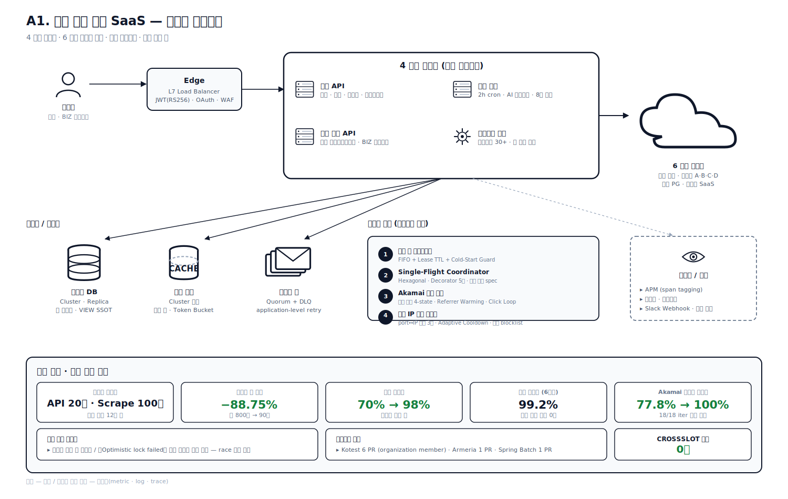

본문은 **결제·정산(A) → 멀티 워커 동시성·대량 데이터(B) → 외부 의존성 격리·봇 탐지 우회(C) → AI 파이프라인·운영 자동화(D)** 네 도메인 15개 사례를 **문제 → 해결 → 성과** 형태로 정리합니다.

---

## 도메인 A. 결제·정산

### 사례 1. 결제 webhook 4중 멱등성 — 분산 락 (ABA-safe) · DB UNIQUE · 상태머신 · 원자 해제 ｜ 2025.09 ~ 운영 중

**문제** — 결제 PG webhook 이 같은 결제 식별자로 **중복 호출되는 경로 5종**.

- PG 자체 retry (5xx / timeout)
- 정기결제 schedule 1차 실패 후 fallback retry → PAID / FAILED 거의 동시 도착
- 결제 취소 후 재결제
- 부분 환불 상태 전이
- Load Balancer keep-alive 재시도

단순 INSERT 하면 결제 row 이중 집계 → 매출 중복 → 알림톡 2회 발송 → 정기결제 중복 생성 → 다음 달 이중 과금까지 도미노.

멀티 인스턴스로 배포되므로 in-memory dedupe 불가능. ORM `findOne → save` 패턴은 read-modify-write 사이에 race window 존재. 분산 캐시 락 단독으로는 TTL 만료 후 ABA 문제(Martin Kleppmann Redlock 분석) 발생 가능. DB UNIQUE 단독으로는 PG retry 폭주를 1차 차단 불가. 상태머신만으로는 동시 INSERT race 차단 불가.

**해결** — 단일 도구로는 모든 race 를 막을 수 없어 **4중 방어선** 을 곱셈으로 결합했습니다.

1. **분산 락 (ABA-safe)** — 분산 캐시 SETNX EX 30s + 토큰 lock value · Stripe Idempotency Key 디자인과 동일하게 lock value 로 ownership 검증
2. **DB UNIQUE** — 복합 키 `imp_uid + merchant_uid + status` · 1시간 dedupe window · 분산 캐시 fail-open 되어도 최종 차단
3. **상태머신** — READY → PAID / FAILED / CANCELLED × action_type 분기 · 상태 역전(PAID 뒤 FAILED 도착) 시 다른 row 로 격리
4. **Lua 원자 해제** — GET → 비교 → DEL 한 트랜잭션 · 자기 토큰일 때만 해제, TTL 만료 후 ABA 차단

동일한 SETNX + Lua DEL helper 는 결제 외 8 곳 이상 흐름(promotional upgrade · change plan · verify code · 알림 배치)에서 공통 helper 로 재사용됩니다.

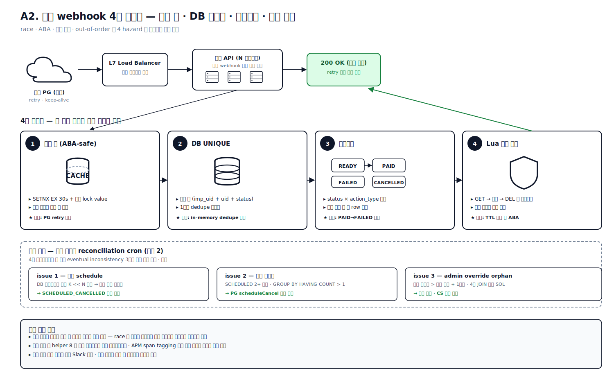

**성과**
- 운영 로그에 「중복 웹훅 락 차단」 메시지가 정기적으로 검출되어 race 가 실제로 발생하고 코드 레벨에서 차단됨이 데이터로 입증.
- 예약 결제 금액 불일치 시 Slack 자동 경고 — 결제 정합성 모니터링 자동화.
- APM span tagging 으로 결제 정합성 메트릭(amount_mismatch, coupon_select)이 자동 집계.
- 분산 락 helper(`delIfValueMatches`)가 결제 외 8 곳 이상 흐름(promotional upgrade · change plan · verify code · 알림 배치 등)에서 공통 helper 로 재사용.

**JVM/Spring 재설계** ([commerce-comment-platform-be](https://github.com/PreAgile/commerce-comment-platform-be))

같은 4중 멱등성을 Java 21 / Spring Boot / JPA / Redisson 으로 재구현하면서 **ADR-006 결제 멱등성 4단계** 로 문서화했습니다.

- ① 분산 락 — `Redisson watchdog` ([ADR-004](https://github.com/PreAgile/commerce-comment-platform-be/blob/main/docs/adr/ADR-004-distributed-lock.md)) — Redisson vs SET NX+Lua 비교 후 채택
- ② DB UNIQUE — JPA `@Version` + `OptimisticLockException` + MySQL `ER_DUP_ENTRY` → `@RestControllerAdvice` 매핑
- ③ 상태머신 — `idempotency_key` 테이블 + 4 상태(RECEIVED→PROCESSING→SUCCESS/FAILED)
- ④ 트랜잭션 분리 — `@Transactional(REQUIRES_NEW)` + 외부 호출 OSIV=false ([ADR-BE-008](https://github.com/PreAgile/commerce-comment-platform-be/blob/main/docs/adr/ADR-BE-008-transaction-boundary.md), [EXP-09b 9 시나리오 풀 고갈 실측](https://github.com/PreAgile/commerce-comment-platform-be/blob/main/docs/experiments/EXP-09b-tx-boundary.md))

EXP-02 실험에서 분산 락 4종 (비관락 · 낙관락 · GET_LOCK · Redisson) 정량 비교 — GET_LOCK 트랩 검출.

---

### 사례 2. 결제 정합성 reconciliation — 좀비 schedule · 중복 빌링키 · admin override orphan 자동 탐지 ｜ 2025.10 ~ 운영 중

**문제** — 사례 1 의 4중 멱등성으로도 못 막는 3종의 silent 정합성 결함이 존재합니다.

- **좀비 schedule** — 외부 PG 에는 schedule 이 살아있는데 DB 는 cancel 로 기록 → 다음 결제일 자동 과금
- **중복 빌링키** — 한 사용자에 SCHEDULED billing 2 개 이상 잡혀 다음 결제일 이중 과금
- **admin override orphan** — 어드민이 구독을 1년 뒤까지 수동 연장했는데 이전 자동결제 schedule 잔존 → active 기간 중 또 결제

셋 다 사용자 클레임 / 환불 분쟁이 발생한 뒤에야 노출되는 결함입니다. 외부 PG API 는 분당 한도와 비용 제약으로 전체 사용자 매일 호출이 불가능하고, DB SCHEDULED 와 PG schedule_status 는 단위가 다른 eventual consistency 문제입니다.

**해결** — **「의심 대상 K << N 으로 압축 → 외부 호출 최소화 → 4-way 분기 자동 정정」** 패턴을 일일 cron + 어드민 수동 트리거 이중 진입점으로 구현. DB 차집합으로 의심 customer 만 추리고, 추려진 K 명에 대해서만 외부 PG schedule API 호출, 응답을 4-way 분기 처리 — schedule 0개면 DB 좀비로 정정, 1개면 정상, 2개 이상이면 다른 schedule 자동 cancel, API 무응답이면 Slack 알림. admin override orphan 은 「활성 구독 종료일이 다음 자동결제 예약보다 1개월 이상 뒤」 조건의 단일 SQL 로 탐지합니다. 일일 cron 은 SafeCron 데코레이터(사례 14)로 멀티 인스턴스에서 한 번만 실행되도록 분산 락 적용.

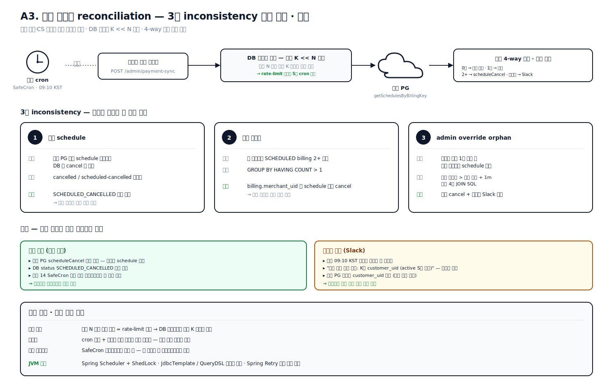

**성과**
- 3종 inconsistency(zombie_schedule / duplicate_billing_key / admin_override_orphan) 자동 탐지 및 자동 정정.
- **사후 환불·CS 부담을 사전 탐지로 전환** — 매일 09:10 KST 운영자가 정합성 상태를 Slack 한 메시지로 수신.
- 운영 로그에 「좀비 예약 점검 대상 K개 (active S개 제외)」 형태의 압축률 명시 — 외부 PG rate-limit 안에서 5분 cron 안에 완료.
- 단일 SQL 패턴이 admin override 사고를 한 번에 탐지.

**JVM/Spring 재설계** ([commerce-comment-platform-be](https://github.com/PreAgile/commerce-comment-platform-be) §5.5)

일일 reconciliation 을 ADR-006 의 4중 안전망 마지막 layer 로 정착시킴.

- Spring `@Scheduled` + **ShedLock** (Redis/JDBC backend) 멀티 인스턴스 cron 직렬화
- QueryDSL 로 DB 차집합 (`GROUP BY HAVING COUNT > 1`, `DATE_ADD INTERVAL` 비교)
- Spring Retry + Resilience4j RateLimiter 로 외부 PG `getSchedulesByBillingKey` 보호
- `ApplicationEventPublisher` + `@TransactionalEventListener` 로 Slack 알림 트랜잭션 외 분리

---

### 사례 3. 쿠폰 멱등 적용 — 사전 검증 · 트랜잭션 · schedule fallback 보정의 3중 idempotency ｜ 2025.11 ~ 운영 중

**문제** — 쿠폰은 결제 흐름에 깊게 얽혀 있습니다. 정기결제 schedule 등록 시점에 계산한 amount 와 **실제 결제 시점의 쿠폰 상태가 달라지는** silent failure 가 가장 위험합니다. schedule 등록 시 쿠폰 A 로 50% 할인 amount 로 등록했는데 다음 달 결제 시점에 쿠폰 A 가 만료/사용된 상태면 PG 는 등록된 amount 그대로 결제 → 사용자가 손해. 추가로 마케팅 캠페인에서 같은 쿠폰 발급 API 가 중복 호출되어 동일 쿠폰이 두 번 발급되면 같은 쿠폰 다중 사용 버그가 발생합니다. 쿠폰 메타데이터 + 적용 가능 plan + 발급된 user 매핑을 한 번에 수정하는 어드민 API 는 부분 update 후 실패 시 데이터 정합성이 깨집니다.

**해결** — **3중 idempotency 레이어**:

1. **사전 검증** — `createUserCoupon` 진입 시 `findOne((user, coupon))` 으로 기존 row 확인, 있으면 그대로 반환(idempotent return)
2. **트랜잭션** — ORM QueryRunner 기반 명시적 트랜잭션(`startTransaction / commit / rollback / release`) — delete + add + update 를 한 단위로 묶음
3. **schedule fallback 보정** — schedule 등록 직전에 사용 가능한 user-coupons 재조회 후 「다음 결제 시점에 실제 적용될 금액」 재계산 → 불일치 시 amount + coupon_id 보정

`amountWithUserCoupons` 단일 함수가 결제·schedule·change_plan·promotional upgrade 모든 흐름에서 재사용되어 DRY 유지.

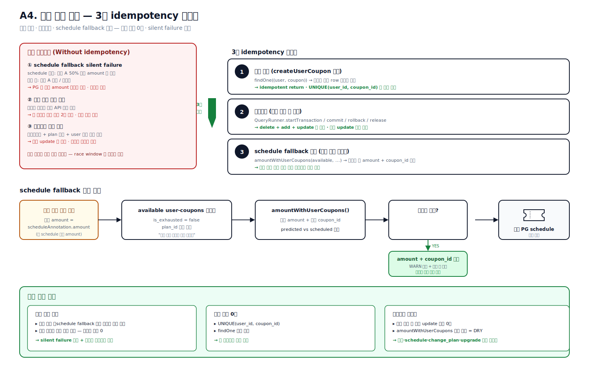

**성과**
- 운영 환경에서 「schedule fallback 금액 보정」 로그로 결제 정합성 차이가 사용자 손해 없이 자동 보정됨.
- 동일 쿠폰 중복 발급 0건 — UNIQUE(user_id, coupon_id) + findOne 사전 검증의 곱셈 결합.
- 쿠폰 수정 중 부분 update 사고 0건.

**JVM/Spring 재설계** ([commerce-comment-platform-be](https://github.com/PreAgile/commerce-comment-platform-be))

- 사전 검증 — JPA `findByUserAndCoupon` idempotent return + DB `UNIQUE(user_id, coupon_id)` 곱셈 결합
- 트랜잭션 — Spring `TransactionTemplate` 명시적 트랜잭션 + JPA `@Version` 낙관락 ([ADR-BE-007 격리수준](https://github.com/PreAgile/commerce-comment-platform-be/blob/main/docs/adr/ADR-BE-007-isolation-level.md), [EXP-03 `@Version` 만으론 silent Lost Update 74건 실측](https://github.com/PreAgile/commerce-comment-platform-be/blob/main/docs/experiments/EXP-03-optimistic-lock.md))
- schedule fallback 보정 — `@PostLoad` + `@PrePersist` Hibernate 콜백 + Bean Validation `@AssertTrue`

---

## 도메인 B. 멀티 워커 동시성 · 대량 데이터 처리

### 사례 4. 매장 일괄 등록 — 비관락 X-lock + 그룹 단위 트랜잭션 경계 ｜ 2025.12 ~ 운영 중

**문제** — 본사가 **수백~수천 개 매장을 엑셀 1행 = 1 사장님 = 1~6 플랫폼 계정** 형식으로 한 번에 등록합니다. 한 행씩 순차 INSERT 는 1,000행에 수십 분이 걸리고, 같은 `(platform, platform_id)` 가 두 행에 있거나(사용자 실수) 다른 운영자가 동시 등록 시 `findOne → save` race 로 중복 row 가 생깁니다. ORM 기본 격리수준 REPEATABLE READ + UNIQUE 인덱스 조합은 race window 가 닫히지만 ER_DUP_ENTRY 에러 메시지의 사용자 가시성이 떨어지며, 1,000행을 한 트랜잭션으로 묶으면 한 사장님 에러로 전체 롤백되어 부분 성공/실패가 row 단위로 추적되지 않습니다.

**해결** — **`SELECT ... FOR UPDATE` 비관락 + 그룹 단위 트랜잭션 경계** 의 검증된 패턴. 한 사장님(`groupKey = email + business_number`) 묶음을 별도 `@Transactional()` 메서드로 분리하여 **그룹 = 트랜잭션 경계**. 트랜잭션 내에서 `(platform, platform_id)` 행에 X-lock 을 잡고, 충돌 시 그룹 전체를 명확한 사용자 메시지로 marking. 재시도 멱등성은 단계별 `findOne` 우선 + 함수형 update(`attempt_count + 1`)로 race-free 카운터. 상태머신은 `PENDING → VALIDATED → REGISTERING → REGISTERED | REGISTER_FAILED` 로 가시화하고 `last_error · last_attempted_at · attempt_count` 를 row 에 박아 운영자가 재업로드 없이 실패만 재시도할 수 있게 했습니다.

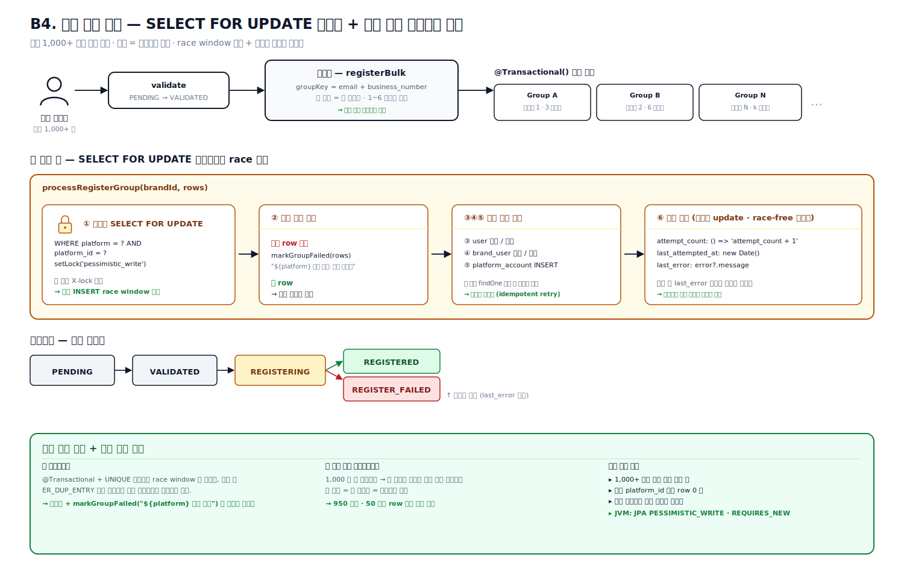

**성과**
- 1,000+ 매장 일괄 등록 지원, 부분 성공/실패가 row 단위로 정확히 표시.
- 같은 `platform_id` 동시 등록 시 중복 row **0건**.
- 「엑셀 1,000행 중 950 성공, 50 실패」 시 실패한 50개만 재시도 가능 — 본사 운영 부하 절감.

**JVM/Spring 재설계** ([commerce-comment-platform-be](https://github.com/PreAgile/commerce-comment-platform-be))

- JPA `LockModeType.PESSIMISTIC_WRITE` (`SELECT ... FOR UPDATE`) + Spring `@Transactional(propagation=REQUIRES_NEW)` 로 그룹 = 트랜잭션 경계
- EXP-02 락 4종 비교 — 비관락 / 낙관락 / GET_LOCK / Redisson 정량 비교 후 비관락 채택 사유 문서화
- EXP-14 IDENTITY 생성 전략은 `saveAll` batch insert 비활성 트랩 — 검증 후 TABLE/SEQUENCE 가설 반증

---

### 사례 5. 일괄 댓글 처리 — 관계형 DB 를 큐로 쓰는 CAS 기반 분산 작업 큐 ｜ 2025.10 ~ 운영 중

**문제** — 사용자는 「오늘 들어온 리뷰 100~1,000건에 한 번에 자동 댓글 등록」 을 자주 사용합니다. 외부 플랫폼 댓글 한 건 등록은 **3~5분 IO** — HTTP 동기 처리는 Load Balancer 5분 타임아웃 초과, 단일 인스턴스 in-memory queue 는 재배포 시 작업 유실, 같은 사용자 같은 플랫폼 계정으로 worker 2개가 동시 로그인하면 외부 플랫폼 봇 탐지에 걸려 그 계정 전체가 차단됩니다. 외부 메시지 큐는 stateful 관리·취소·예약·진행률 폴링에 안 맞고(fire-and-forget 에 최적), 외부 큐 미들웨어는 트랜잭션과 함께 묶기 어렵습니다.

**해결** — **관계형 DB 테이블을 큐로 사용** 해 트랜잭션과 큐 책임을 한 곳에 묶고, 다중 워커 안전 픽업은 **ORM 낙관락 = CAS(Compare-And-Set) 의 SQL 버전** 으로 구현. `updated_at` 을 version 필드처럼 사용해 `UPDATE WHERE id=? AND status=WAITING AND updated_at=원본` 이 `affected=0` 이면 다른 인스턴스가 먼저 가져갔음을 인식합니다. 같은 플랫폼 계정 동시 사용은 픽업 SQL 에 `platform_id NOT IN (실행 중 집합)` 조건으로 차단 — 한 플랫폼 계정 = 시점에 하나의 작업. 좀비 작업 자동 복구는 부팅 시 WAITING/IN_PROGRESS 작업 재스케줄 + 인스턴스 ID 를 statusMessage 에 박는 방식으로 처리. 진행률은 분산 캐시 + acquireProcessingLock 분산 락으로 폴링 부하 분산.

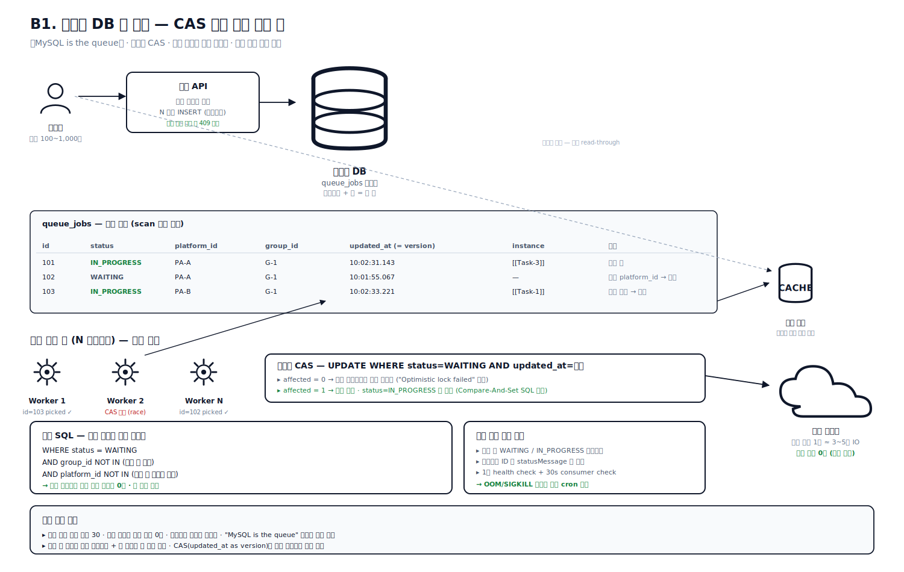

**성과**
- 동시 처리 워커 최대 **30**, 같은 그룹 내 순차 + 다른 그룹 병렬로 처리량 극대화.
- 운영 로그 「Job N modified by another instance (optimistic lock failed)」 정상 검출 — race 발생하나 차단됨이 데이터로 입증.
- **외부 플랫폼 중복 댓글 0건**, 인스턴스 재배포 무중단.
- 외부 큐 솔루션 없이 외부 큐 솔루션 없이 트랜잭션과 큐 책임을 한 곳에 묶는 **공통 패턴으로 재사용**.

**JVM/Spring 재설계** ([commerce-batch-orchestrator](https://github.com/PreAgile/commerce-batch-orchestrator))

RDS polling 큐 패턴을 Kafka outbox 로 재설계.

- [ADR-005 Outbox 폴링 → Debezium CDC](https://github.com/PreAgile/commerce-batch-orchestrator/blob/main/docs/adr/ADR-005-outbox-cdc.md) — Dual-Write 함정 해결
- [ADR-MQ-008 Consumer 멱등 + DLQ + retry topic](https://github.com/PreAgile/commerce-batch-orchestrator/blob/main/docs/adr/ADR-MQ-008-consumer-idempotent.md) — At-least-once + 멱등 = Effectively-Once
- JPA `@Version` 낙관락 + `OptimisticLockException` = CAS SQL 버전, Micrometer gauge 로 진행률 메트릭

---

### 사례 6. 2시간 cron 리뷰 수집 — 5,700+ 계정 × 13,000+ 매장 hierarchical 동시성 ｜ 2025.10 ~ 운영 중

**문제** — 배치 워커 클러스터는 6개 외부 플랫폼에서 매장 사장님 리뷰를 2시간 주기로 가져와 적재합니다. 운영 로그 기준 단일 플랫폼 1회 실행에서 **13,127 매장 / 5,719 platform_id 그룹 / 13,699 task** 까지 처리합니다. 외부 플랫폼은 같은 계정으로 동시 다중 매장 호출 시 captcha / 지역차단 / 세션 무효화되고, 매장 단위 ThreadPool 로 전부 동시 처리는 동일 계정 병렬 로그인 = 세션 충돌, 전부 순차는 13,000 × 3초 = 11시간 → 2시간 cron 안에 못 끝납니다.

**해결** — **「계정 단위 순차 / 계정 사이 병렬」 의 hierarchical 동시성 모델**. 외부 락 서비스 없이 process-local 자료구조 격리만으로 충분 — `(platform_id, platform_password)` 키로 매장을 묶은 그룹을 ThreadPool 에 제출하면 한 그룹은 한 worker thread 가 처음부터 끝까지 순차 처리합니다. I/O-bound(HTTP/DB)라 thread 가 적합. 운영 워커 수는 플랫폼별로 헤드리스 브라우저 풀 사용량 제한에 맞춰 조정. 첫 매장 인증 에러 시 **그룹 전체 즉시 차단** — 첫 매장 실패면 나머지 매장도 100% 실패 운명이라 봇 탐지 가속 회피를 위한 회로 차단(circuit breaker) 패턴.

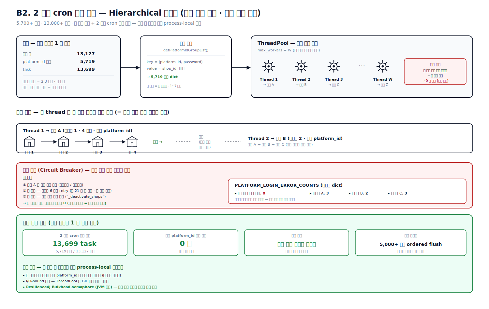

**성과**
- 운영 처리량 — 단일 플랫폼 13,127 매장을 2h cron 안에 완료.
- 동일 platform_id 동시 호출 **0건** (운영 로그 검증).
- 인증 에러 발생 그룹만 비활성 처리, 다른 그룹 정상 진행 — 장애 격리 성공.
- 5,000+ 그룹 병렬 환경에서도 ordered logBuffer flush 로 운영자가 그룹별 처리 순서를 한 줄씩 추적 가능.

**JVM/Spring 재설계** ([commerce-batch-orchestrator](https://github.com/PreAgile/commerce-batch-orchestrator) + [commerce-external-gateway-kt](https://github.com/PreAgile/commerce-external-gateway-kt))

- Spring Batch + **ShedLock** 으로 멀티 인스턴스 cron 중복 방지
- [ADR-MQ-007 Reader 4종 비교](https://github.com/PreAgile/commerce-batch-orchestrator/blob/main/docs/adr/ADR-MQ-007-reader-4.md) → `QuerydslZeroOffsetItemReader` 채택 (E-MQ-04~07 100만 row 정량 비교)
- [ADR-MQ-009 CooperativeStickyAssignor (KIP-429)](https://github.com/PreAgile/commerce-batch-orchestrator/blob/main/docs/adr/ADR-MQ-009-rebalance.md) — Rebalance stop-the-world 회피
- Resilience4j `Bulkhead.semaphore` 로 계정 단위 동시성 격리 + `CircuitBreaker` 로 도미노 차단

---

### 사례 7. Active-Active 8색 무중단 배포 + 인증 에러 그룹 도미노 차단 ｜ 2026.02

**문제** — 스크래퍼 워커 클러스터는 운영 트래픽 부담으로 무지개 8색(blue/green/yellow/purple/orange/cyan/white/black) Active-Active 배포로 확장. 8개 컨테이너 동시 down/up 사이 traffic gap 동안 503 이 길게 발생합니다. 또한 외부 플랫폼이 보호조치·지역차단을 빠르게 throw 가능해진 뒤, 인증 에러 발생 그룹의 다른 매장도 동일 처리해야 도미노 효과(한 그룹 첫 매장 실패 → 봇 탐지 가속 → 같은 그룹 나머지 매장 7개도 같은 운명 → 단순 retry 는 21회 헛 호출)를 막을 수 있었습니다.

**해결** — 동적 라우팅 설정 파일 단위 graceful drain 의 **5-step 무중단 파이프라인** + **플랫폼별 임계치 dict 기반 그룹 일괄 차단** 정책. dynamic 폴더 정리 → 라우팅 파일 비우기(라우팅 차단, 컨테이너는 살아있음 → 503 명시) → 8색 동시 down + 순차 up → health check(120 × 5s = 10min budget) → 라우팅 복원 + reload readiness 대기. 봇 탐지가 가장 심한 플랫폼은 임계치 0(첫 인증 오류 = 영구 장애 가정) 으로 두어 봇 탐지 가속을 최소화했습니다.

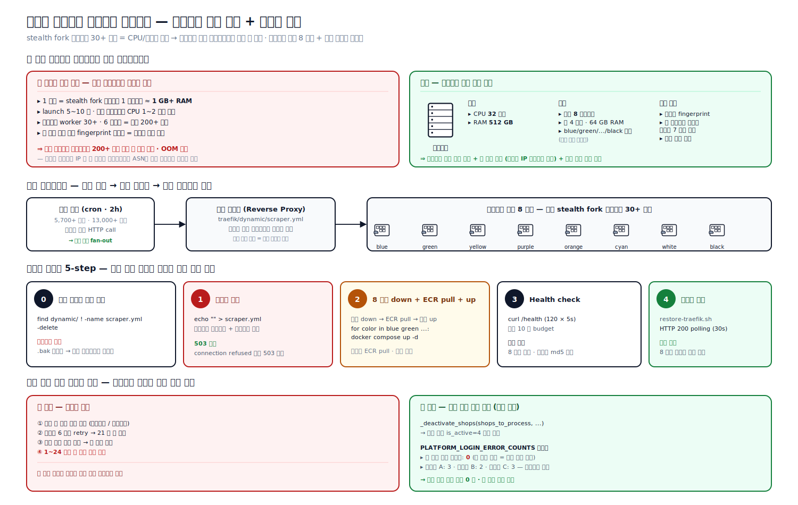

**성과**
- 8색 컨테이너 동시 운영 환경에서 단일 스크립트로 안전 무중단 재시작.
- 봇 탐지 회피 — 첫 매장 실패 시 그룹 전체 차단, 같은 계정 추가 요청 **0건**.
- 봇 탐지가 가장 심한 플랫폼의 worker 풀 증설 14 → 30 → 25 안정화.

**JVM/Spring 재설계** ([commerce-external-gateway-kt](https://github.com/PreAgile/commerce-external-gateway-kt))

- Spring Boot Actuator `/health` + readinessProbe / livenessProbe + Micrometer
- Spring Cloud Gateway dynamic routing config + K8s rolling update (maxSurge / maxUnavailable)
- Resilience4j `CircuitBreaker` 임계치 dict 패턴 — [ADR-007 50%/70%/90% 측정 후 70% 채택](https://github.com/PreAgile/commerce-external-gateway-kt/blob/main/docs/adr/ADR-007-cb-threshold.md) (CB-1/2/3 실험)

---

### 사례 8. BIZ 대시보드 1,000매장 × 7일 — 2단계 쿼리 + DB-level pagination + SQL VIEW SSOT ｜ 2026.01

**문제** — BIZ 화면은 본사 1명이 산하 1,000매장을 한 화면에서 봅니다. 매장별 최근 7일 일별 주문, 매장별 광고 ROAS / 클릭 / 전환, 매장별 일 매출 7일, 매장 크롤링 지연(stale) 표시, 브랜드 메타까지 한 응답에 담아야 합니다. 단순 JOIN 한 방으로 brand → ... → orders 까지 끌면 카디널리티 폭발(1,000 × 7 × 매장당 N) + 외부 광고/매출 IO 가 응답 경로에 끼면 응답 지연이 누적됩니다. ORM 의 표현력으로는 4단 조인 + dynamic where + dynamic order by + dynamic LIMIT 조합의 가독성·일관성을 유지하기 어렵습니다.

**해결** — **「select shape 를 N+1 과 단일 거대 JOIN 사이의 sweet spot 인 2-스텝 batch select 로 옮긴다」** + **SQL VIEW 를 정의 SSOT 로** + **외부 IO 는 응답 경로 밖으로**. 1단계는 shop 목록만 추리고(brand × brand_user × shop × brand_shop 4단 조인, LIMIT +1 has_more 트릭으로 DB-level pagination), 2단계는 추려진 ~20 shop_ids 에 대해서만 orders GROUP BY 로 카디널리티 통제(140행 = 20 × 7). 매장은 **4상태**(`active` / `inactive` / `shop_deleted` / `brand_removed`)로 분류해 본사 운영자가 「주문 0인 이유」를 즉시 식별. stale 매장 판정은 SQL VIEW 로 두어 메인 API · 어드민 ad-hoc · BI 도구가 같은 정의를 공유(single source of truth). 외부 광고/매출은 별도 daily upsert + 4상태 머신으로 적재하고 본사 화면은 적재된 테이블만 read.

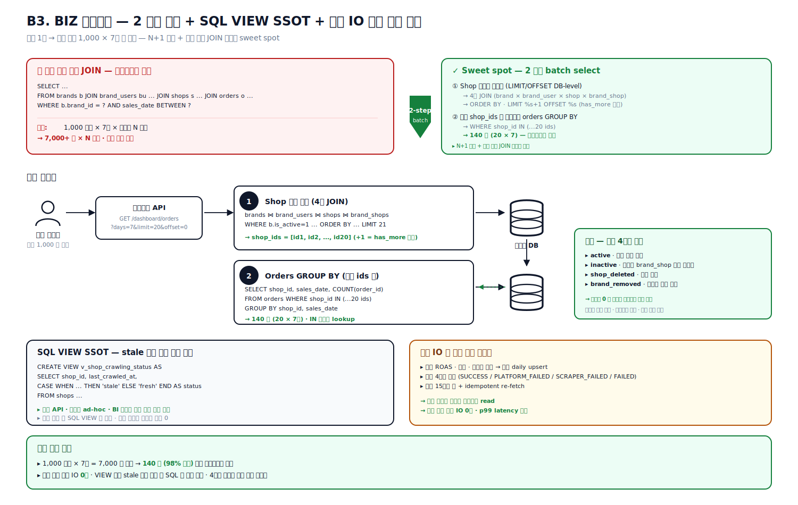

**성과**
- 매장 1,000 × 7일 일별 주문 트렌드 페이지를 2단계 쿼리 + DB-level LIMIT/OFFSET 으로 카디널리티 통제 — 응답 경로 외부 IO **0건**.
- VIEW 기반 정의 공유로 stale 정책 변경 시 SQL 만 수정.
- 광고 15시간 컷 + 매출 idempotent re-fetch 로 외부 호출량 절감.
- 「대시보드만큼은 raw SQL 이 정답」 의 경계 설정을 운영 학습으로 명문화.

**JVM/Spring 재설계** ([commerce-comment-platform-be](https://github.com/PreAgile/commerce-comment-platform-be))

- Spring Data JPA + **QueryDSL** 동적 조건 / dynamic order by ([ADR-BE-009 No-Offset Cursor Pagination](https://github.com/PreAgile/commerce-comment-platform-be/blob/main/docs/adr/ADR-BE-009-no-offset.md))
- [EXP-07 1M row OFFSET 171ms → Cursor 복합키 실측](https://github.com/PreAgile/commerce-comment-platform-be/blob/main/docs/experiments/EXP-07-pagination.md) — row constructor 함정 회피
- `@Subselect` 로 SQL VIEW 매핑 + `@EntityGraph` 로 N+1 회피 ([EXP-04 N+1 4-depth 121 prepStmt → JOIN FETCH 1](https://github.com/PreAgile/commerce-comment-platform-be/blob/main/docs/experiments/EXP-04-n-plus-one.md))

---

## 도메인 C. 외부 의존성 격리 · 봇 탐지 우회

### 사례 9. 세션 락 레지스트리 — FIFO 큐 + lease TTL + cold-start guard 로 30+ worker 동시 로그인 race 직렬화 ｜ 2025.11 ~ 운영 중

**문제** — 분산 워커 30+ 개가 메시지 큐 consumer 로 동작합니다. 한 매장(`shop_id`) 에 여러 API(`getReviews`, `addReply`, `getStores`, `keepAlive`)가 거의 동시에 진입하면 같은 헤드리스 브라우저 세션을 여러 worker 가 동시에 잡으려 합니다. 같은 세션 두 page 에서 동시 navigation 시 execution context destroyed, 같은 매장 동시 로그인 두 번은 외부 플랫폼 IP 평판 영구 차단(1~24시간 그 매장 작업 전체 실패). 도메인 특수성이 단순 mutex 로는 부족하게 만듭니다 — 헤드리스 브라우저 1 인스턴스 ≈ 1GB+, launch 5~10초 → race 시 N배 메모리·런타임 폭증. 인스턴스 다중화로 in-process Map 만으론 부족하고, 분산 캐시 Cluster 모드는 같은 트랜잭션에 여러 키를 쓰면 CROSSSLOT 에러를 던집니다. 가장 까다로운 hazard 는 **cold-start deadlock** — 인스턴스가 죽었다 살아나면 in-memory Map 은 비어있는데 분산 캐시 큐 head 는 옛 인스턴스의 requestId 라, 살아난 worker 가 그 head 차례를 기다리지만 옛 worker 는 죽어서 영원히 release 되지 않습니다.

**해결** — **4 layer 직렬화**: ① FIFO 큐(분산 캐시 LIST) ② per-request lease(90s TTL, 5s 갱신) ③ **instance-aware lease value** = `{instanceId-UUID} : {timestamp}` (Martin Kleppmann 의 fencing token 패턴을 단순화 — 인스턴스 식별자를 lease value 에 박아 cross-instance ownership 을 lease-level 에서 검증) ④ handoff pattern (release 시 다음 큐 entry 가 같은 세션 재사용). Cluster CROSSSLOT 은 **모듈별 의도된 정책 분기** 로 해결 — queue 는 단일 키 명령으로 분리(부하 분산 우선), reputation(사례 10)은 hash tag `{pool}` 로 슬롯 강제 배정(트랜잭션 묶음 우선). 같은 시스템 안에 두 전략을 의도적으로 다르게 두는 이유는 모듈마다 우선 가치가 다르기 때문. `attach`/`release` Handle 패턴(RAII)으로 `activeCount` invariant 를 유지하고, `pendingClose` 5종 정책(immediate / defer / idle-timer / hasWaitingRequests handoff / release)으로 다른 worker 의 핸들이 활성일 때 close 를 보류, 모든 release 후에만 close. 안전망으로 `forceRelease`(운영 kill switch), `forceTerminate`(activeCount 강제 0), `evictStaleHead`(2초 주기 head 의 lease 키 부재 시 LREM) 3종.

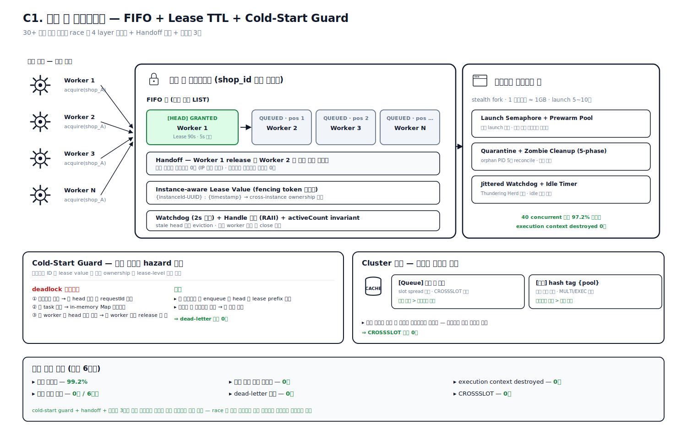

**성과**
- **세션 유지율 99.2%** (최근 6개월).
- **댓글 등록 중복 0건 / 6개월** — 세션 락 + Idempotency-Key 조합.
- `execution context destroyed` 사고 **0건**.
- 인스턴스 재시작 후 dead-letter 큐 누수 **0건** — cold-start guard 도입 효과.
- CROSSSLOT 에러 **0건** — hash tag / 단일 키 분리 정책의 일관 적용 효과.
- 동일 매장 동시 로그인 **0건**.

**JVM/Spring 재설계** ([commerce-external-gateway-kt](https://github.com/PreAgile/commerce-external-gateway-kt))

- [ADR-SCR-009 3-Layer 세션 캐시](https://github.com/PreAgile/commerce-external-gateway-kt/blob/main/docs/adr/ADR-SCR-009-session-cache.md) — Memory L1 → Redis L2 → 외부 인증 L3
- Kotlin Coroutines `Mutex` + `withLock` per-key 로 in-process FIFO layer
- Redisson `RFairLock` (FIFO + lease auto-extend) + `@PreDestroy` graceful release
- Micrometer gauge 로 큐 깊이 / 세션 hit rate 노출 (SES-1 3계층 hit rate 실측)

---

### 사례 10. 자체 IP 평판 시스템 — 외부 의존 제거 + 비용 88.75% 절감 (월 800만 → 90만) ｜ 2025.07 ~ 운영 중

**문제** — 외부 Residential 프록시 단일 의존으로 비용 / SPOF / 평판 측정의 세 축에 hazard 가 누적되어 있었습니다.

- **비용 / SPOF** — 매월 800 만 원 · 외부 벤더 장애 = 서비스 중단
- **Identifier 불일치** — Datacenter 프록시는 port 별로 IP 가 시간에 따라 바뀜 → 평판 측정 단위(IP)와 stable identifier(port)가 어긋남
- **Cluster CROSSSLOT** — 평판 카운터 · STREAM · blocklist 를 한 MULTI/EXEC 에 묶을 때 슬롯 분산
- **port rotation 회피** — 차단 IP 가 다음에 다른 port 에 mapping 되면 그 port 가 영구 blocklist 를 우회

6개월에 걸친 14 phase phased rollout 으로 풀었습니다.

**해결** — **14 phase phased rollout**. 한 번의 큰 배포가 아니라 각 phase 머지 → 측정 → 안전 확인 → 다음 phase 의 점진적 cutover. 핵심 결정 4가지: ① **port↔IP 매핑 3중 저장** (In-memory Map + 분산 캐시 HASH + 관계형 DB + 외부 스토리지 부트스트랩 manifest) — 클러스터 cold start 시 외부 의존 없이 복구 ② **이중 blocklist** — `port_set`(평판 나쁜 port 영구 차단) + `ip_set`(평판 나쁜 IP 영구 차단), allocator 가 port 선정 후 lookup 으로 IP 확인 → `ip_set` hit 시 그 port 도 자동 `port_set` 추가 → **port rotation 회피 hazard 차단** ③ **Adaptive Cooldown** — 5종 outcome(success / block / timeout / networkError / authError / siteChange / unknownError) × consecutiveFailures × latency 가중치로 health 점수 → ranked 정렬, Shadow mode 로 실 운영 영향 없이 결정 측정 ④ **Pool exhausted → legacy fallback** — 새 풀이 exhausted 면 legacy path 로 위임, legacy 도 blocklist 필터로 차단 IP skip(최대 10회). 운영 절차도 AGENTS.md 에 명문화 — env value 빈 값 / 미설정 / deprecated alias 까지 모든 경로 default 정책 명시. fallback 선정 로직은 **외부 AI 코드 리뷰 3회 follow-up** 으로 정밀화한 흔적이 PR 본문에 남아있습니다 — AI 코드 리뷰까지 코드 변경의 한 단계로 받아들이는 워크플로.

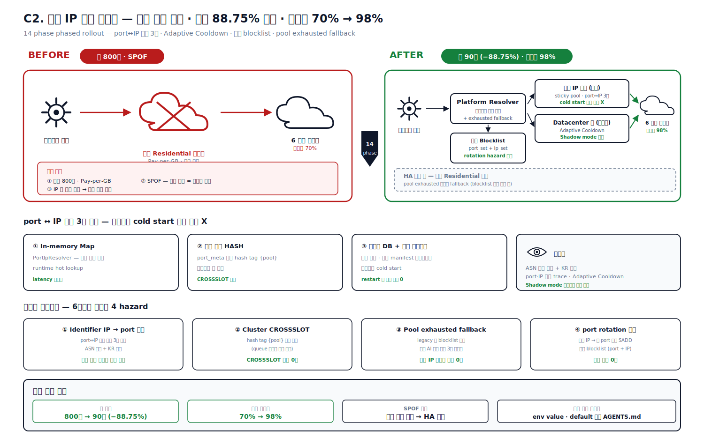

**성과**
- **월 비용 800만 → 90만 원 (88.75% 절감)** — 운영 청구서 기준.
- **요청 성공률 70% → 98%** — 프록시 전환 후 운영 대시보드.
- 외부 벤더 SPOF 제거(HA 보조 풀로 잔존), 메트릭 대시보드 구축.
- 차단 IP 가 legacy 경로로 재할당되는 사고 **0건**.
- CROSSSLOT 에러 **0건** — hash tag `{pool}` 도입 후.
- ASN 자동 분류 + KR 가드 + 부분 실패 격리(failed outcome 분류) 운영.

**JVM/Spring 재설계** ([commerce-external-gateway-kt](https://github.com/PreAgile/commerce-external-gateway-kt))

- [ADR-SCR-010 Bulkhead 격리](https://github.com/PreAgile/commerce-external-gateway-kt/blob/main/docs/adr/ADR-SCR-010-bulkhead.md) — Semaphore vs FixedThreadPool, 외부 의존성별 풀 분리
- [ADR-SCR-011 데코레이터 체인 순서](https://github.com/PreAgile/commerce-external-gateway-kt/blob/main/docs/adr/ADR-SCR-011-decorator-order.md) — `Bulkhead → CB → Retry → TimeLimiter → RateLimiter` (Retry 안에 CB 두면 CB 통계 N배 카운트되는 함정)
- WebClient ExchangeFilterFunction 으로 proxy resolver 추상화 + `@ConfigurationProperties` + `@Validated` 로 env 정책

---

### 사례 11. Akamai Bot Manager 우회 — 인증 쿠키 상태 머신 · Referrer Warming · Click Loop (77.8% → 100%) ｜ 2026.02

**문제** — Akamai Bot Manager 가 깔린 외부 플랫폼은 일반 헤드리스 브라우저로는 99% 차단. stealth fork 로 fingerprint 를 우회해도 sensor 가 준비되기 전 로그인 제출 시 인증 쿠키가 pending 상태로 남아 sensor 검증 실패 → 403.

옛 구현의 4 가지 silent 결함:

- 검증 토큰 첫 등장 즉시 break → race window 안 뒤늦은 challenge 토큰 놓침
- 검증 + 차단 토큰 혼재를 「검증 성공」 으로 오분류
- Akamai 차단 응답을 application-level 401/403 으로 오분류해 password retry 로 흘림 (Full Retry 미작동)
- sensor 제출 후 즉시 break → sensor 의 추가 검증(1~2초) 윈도우 놓침

**해결** — 단일 트릭으로 안 되므로 4 가지 기법을 합성: (a) **인증 쿠키 4-state 머신 명문화** 우선순위 「차단 > challenge > 검증 > 초기」 + (b) 정책 분기를 **service 와 spec 의 SSOT 순수 함수** 로 추출(discriminated union 반환 — break / observe-challenge / observe-block / enter-race-window / continue) + (c) **Referrer Warming** — 메인 URL 거쳐 referrer chain 형성, 15 초간 human-like mouse jitter(200–600px × 100–400px × steps 3–5 × 800–1,200ms 대기) 유지 → sensor 가 human telemetry 누적 → 쿠키 검증 진입 + (d) **Click Loop** — submit Enter 1 회 → page click 25 번(1~2초 jitter) 반복으로 사람 행동 시뮬레이션 + (e) **3 경로 일관 호출** — Akamai 차단 검출 helper 를 main loginResult 분기 + Quick Retry 분기 + Prewarm Swap 분기 **세 경로에서 일관되게 호출** (한 곳만 보강하면 비동기 set 시점에 따라 silent 회귀 가능을 코드 주석에 명문화).

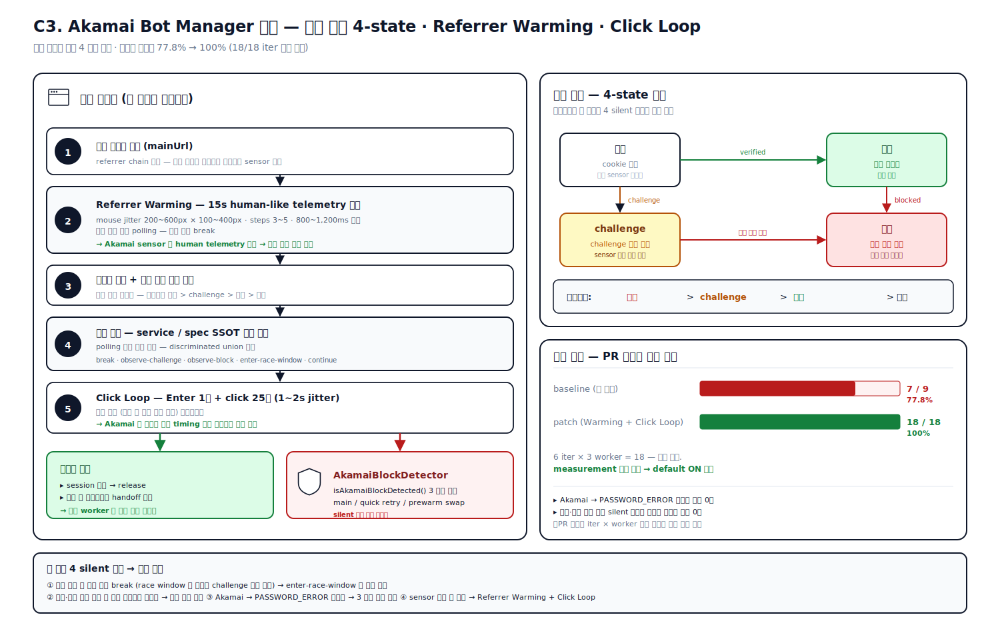

**성과**
- **로그인 성공률 77.8% → 100%** (Referrer Warming 패치 측정, 18/18 iter, 6 iter × 3 worker, default ON 채택).
- Akamai 차단 → PASSWORD_ERROR 오분류 사고 **0건**.
- 검증·차단 토큰 혼재 silent 「검증 성공」 오분류 사고 **0건**.
- PR 본문에 iter × worker 측정값을 박는 검증 형식이 팀 내 공통 관행으로 자리잡음 (7/9 → 18/18).

**JVM/Spring 재설계** ([commerce-external-gateway-kt](https://github.com/PreAgile/commerce-external-gateway-kt))

- Kotlin **sealed class** `AbckState` / `PollingAction` 으로 discriminated union — `when` exhaustive 검사로 컴파일 타임 회귀 차단
- WebClient interceptor 로 응답 헤더 기반 차단 검출 + [ADR-007 CB 70% 임계](https://github.com/PreAgile/commerce-external-gateway-kt/blob/main/docs/adr/ADR-007-cb-threshold.md)
- ADR-SCR-010 봇 탐지 강한 외부 전용 풀 분리 (Playwright / stealth fork)
- [EXP-WC-01 WebClient `.block()` EventLoop pinning 처리량 1/10 폭락 실측](https://github.com/PreAgile/commerce-external-gateway-kt/blob/main/docs/experiments/EXP-WC-01-webclient.md) — 완전 비동기 강제

---

### 사례 12. Single-Flight Coordinator 포트화 — Hexagonal + Decorator 5종 합성, 7가지 행동 계약 spec 명문화 ｜ 2026.01

**문제** — 한 사용자(`platformId`)에 대한 동시 요청 N개를 받으면 첫 번째만 실제 로그인하고 나머지는 결과 공유해야 합니다 (single-flight · coalescing).

- **첫 구현의 한계** — 인-메모리 Map 80+ 줄이 한 서비스에 인라인. 다른 플랫폼 서비스도 같은 패턴 필요 / 분산 캐시 어댑터 추가 시 다시 손대야 함
- **명문화되지 않은 invariant 들** — 결과 일관성 (같은 cause 공유 · 스택 트레이스 보존) / 세대 가드 (forceRelease 후 옛 record finally cleanup 이 새 record 지움 방지) / 동기 throw 정규화 (sync throw 도 Map 박힌 뒤 throw)
- 행동 계약이 spec 에 박혀있지 않아 회귀를 잡을 수 없음

**해결** — **Port-Adapter(Hexagonal Architecture, Alistair Cockburn) + Decorator + Strategy 합성** 으로 OCP 보존 + **계약 문서로서의 spec** 으로 7가지 행동 속성을 spec 헤더에 명문화하고 describe 그룹과 1:1 매핑. Port 는 `execute / getInflightState / forceRelease` 만 노출, 어댑터는 in-process Map(forceRelease gate 포함) + 4 데코레이터(Deadline = Promise.race wall-clock timeout / Capacity = waiter cap load-shedding / Heartbeat = 15s scan long_running warn + gauge / Telemetry = owner_started/finished/failed/coalesced metrics) 합성. 세대 가드는 `this.inflight.get(key) === record` 비교로 차단, sync throw 정규화는 `Promise.resolve().then(() => operation())` 한 줄로 두 hazard 동시 처리. 안전망 default 는 deadline 180,000ms(2FA + waitForReplacement), maxWaiters 30(UI-spam load-shedding), long_running warn at 60s(stuck-owner early signal), `forceRelease` ops kill-switch.

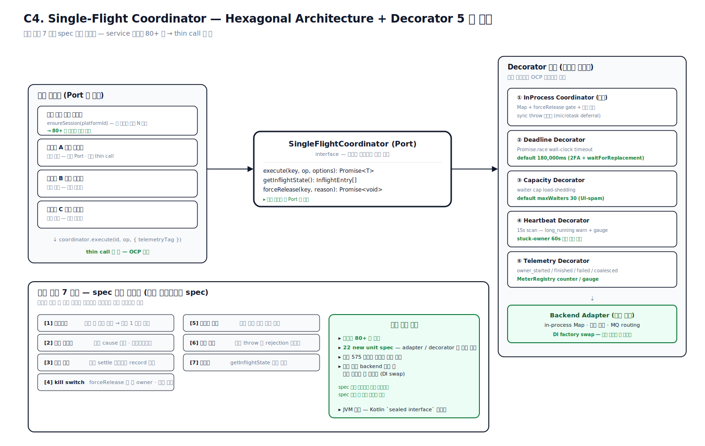

**행동 계약 7가지 — spec 헤더에 명문화** (빨간색이 뜨면 어느 계약이 깨졌는지 그룹명에 즉시 보이도록 설계)

| # | 속성 | 보장 |
|---|---|---|
| 1 | 코알레싱 | 같은 키 동시 호출은 작업을 1번만 실행 |
| 2 | 결과 일관성 | 같은 cause 인스턴스 공유 (스택 트레이스 보존) |
| 3 | 자원 정리 | 모든 settle 경로에서 record 즉시 제거 |
| 4 | kill switch | forceRelease 직후 후속 호출이 새 owner, 세대 가드 |
| 5 | 호출자 격리 | 서로 다른 키는 영향 없음 |
| 6 | 입력 계약 | 동기 throw 도 promise rejection 으로 정규화 |
| 7 | 관측성 | getInflightState 가 entry 계약 노출 |

**성과**
- 인라인 코드 **80+ 줄 제거** — coordination + telemetry 가 thin call `coordinator.execute(id, op, { telemetryTag })` 로 축약.
- **22 new unit specs** — adapter/decorator 별 격리 검증, 기존 도메인 테스트 전수 통과.
- 분산 캐시 backend 추가 시 서비스 코드 안 건드리고 DI factory 만 swap.
- 「계약 문서로서의 spec 헤더 명문화」 스타일이 사내 테스트 작성 가이드라인의 참조 사례로 채택됨.

**JVM/Spring 재설계** ([commerce-external-gateway-kt](https://github.com/PreAgile/commerce-external-gateway-kt))

TS 운영자산의 7가지 행동 계약을 Kotlin Coroutines 로 그대로 이식.

- [ADR-SCR-008 Single-Flight Coordinator](https://github.com/PreAgile/commerce-external-gateway-kt/blob/main/docs/adr/ADR-SCR-008-single-flight.md) — `Mutex` + `Deferred` 로 in-process single-flight, 7-property 행동 계약 spec 헤더 동일 유지
- Resilience4j `Bulkhead.semaphore` + `TimeLimiter` 로 deadline / capacity
- SF-2 실험 — thundering herd baseline vs Coroutines coalescing 측정 결과 **99.9% coalescing**
- MeterRegistry counter / gauge 로 `singleflight.*` telemetry (owner_started / finished / coalesced)

---

## 도메인 D. AI 파이프라인 · 운영 자동화

### 사례 13. 부정 리뷰 탐지 — 6신호 노이즈 필터 + 길이 가중치 + 별점·스코어 OR 분류 ｜ 2026.01 ~ 운영 중

**문제** — 자동 답글이 위험한 가장 큰 케이스 둘:

- 별점은 5점인데 본문은 컴플레인 (sentiment 불일치 — 약 30%가 5점 + 부정 내용)
- "ㅋㅋㅋㅋㅋㅋㅋㅋ" 같은 노이즈 리뷰에 진지한 답글

추가 제약:

- AI 호출은 비싸고 느려서 모든 리뷰를 ML 에 보내면 비용·지연 손해
- AI 모델이 "문맥 파악 불가"로 0점 반환하는 케이스도 노이즈 분류 필요
- 같은 텍스트라도 길이에 따라 신뢰도가 다름 — 100자 "조금 짰어요" 신뢰도 높음, 5자 "별로" 노이즈 가까움

**해결** — **신호 처리 + 정보 이론 관점의 가중 합산** 으로 단일 임계 if-else 룰이 아닌 **6신호 가중치 합산** 노이즈 필터를 사전 컷으로 두어 비싼 ML 호출을 절감. 사후 가중은 **「신뢰도 shrink (Bell)」 와 「극성 증폭 (Polarity Amplification)」 의 두 축을 분리** + **tanh ±35 sigmoidal squashing** 으로 운영 튜닝 노브를 독립 조정 가능하게 했습니다.

**노이즈 필터 6신호**

| 신호 | 계산 |
|---|---|
| 토큰 반복도 (top word share) | top_word_count / total_tokens |
| Bigram / Trigram 반복도 | most_common_ngram / total_ngrams |
| **샤논 엔트로피** | -Σ p log2 p (문자 단위) |
| 문자 다양성 | unique_chars / length (40자 이상에서만) |
| **zlib 압축률** | len(compressed) / len(text) |
| 같은 문자 / 이모지 4회+ 연속 | 정규식 패턴 매칭 |

각 신호 가중치 곱한 합이 임계 2.0 넘으면 noise. 길이 가중치는 Bell 분포로 신뢰도 shrink + 극성 증폭 weight 곱한 후 tanh ±35 box 로 squash. 분류 정책은 「`rating ≤ critical_rating`」 일반 부정 OR 「5점 + score in (min~max) + len ≥ 10」 scoring-based 부정. 알람은 **BIZ(브랜드 `send_negative_alarms` + `critical_review_rating` 검증)** 와 **User(`NegativeReviewAlarm.is_active`)** 의 책임을 분리, 파트너 템플릿 오버라이드는 매핑 한 줄 제거 = 자동 기본 복원으로 운영자 관여 최소화. 알고리즘 버전은 `SCORE_VERSION` 컬럼을 PK 일부처럼 다뤄 같은 review_id 에 여러 버전 공존 → v2 백필 시 v1 의존 다운스트림 안 깨짐.

**성과**
- AI 비용 절감 — `existing_scores_map` pre-fetch 로 같은 버전 중복 호출 차단 + 노이즈 사전 컷으로 짧은 리뷰 ML 호출 skip.
- **5점 부정 리뷰 캐치율 향상** — 평점 + 스코어링 OR 결합으로 약 30% 의 「별점 ≠ 감정」 케이스 포착.
- 한 부정 리뷰에 최대 BIZ 3개 + User 3개 = 6개 알림톡 동시 발송.
- 임계치 운영자 직접 조정 — 임계 테이블(레이블·구간) + 알고리즘 튜닝 노브 Enum 이중 노브.

**JVM/Spring 재설계** ([commerce-batch-orchestrator](https://github.com/PreAgile/commerce-batch-orchestrator))

- Spring Batch `ItemProcessor` 체인 — 6신호 노이즈 필터 + 길이 가중치 + AI Score 합성
- WebClient (비동기) 로 자체 MLOps Score API 호출, Bean Validation 으로 임계 검증
- Kafka Consumer Group + DLQ + retry topic 으로 부정 리뷰 알림 스트리밍 파이프라인 ([ADR-MQ-008](https://github.com/PreAgile/commerce-batch-orchestrator/blob/main/docs/adr/ADR-MQ-008-consumer-idempotent.md))
- `ApplicationEventPublisher` + `@TransactionalEventListener(phase=AFTER_COMMIT)` 으로 알림 발송을 트랜잭션 외 분리

---

### 사례 14. SafeCron — 멀티 인스턴스 cron 중복 실행 차단 데코레이터 (14곳 적용) ｜ 2025.09 ~ 운영 중

**문제** — 멀티 인스턴스 환경에서 표준 `@Cron` 은 **모든 인스턴스에서 동시 실행**.

- 일일 결제 정합성 점검이 N개 인스턴스에서 N번 → 외부 PG API rate-limit 초과
- 일일 알림톡 cron N번 → 사용자가 같은 알림톡 N개
- 사용자 동기화 배치 N번 → 외부 SaaS rate-limit + 비용

직접 락 처리 시:

- 모든 cron 마다 락 코드 작성 = 보일러플레이트 폭증
- 락 해제 누락 시 인스턴스 죽으면 락 영구 잔존 → cron 영영 안 돔

**해결** — **데코레이터 + DI 우회 트릭** 으로 한 줄 데코레이터로 분산 락 + Slack 표준화 + 환경변수 토글을 자동화. 데코레이터는 클래스 정의 시점에 실행되어 인스턴스가 없으므로, 부팅 시점에 ModuleRef 전역 참조를 저장한 뒤 데코레이터 안에서 분산 캐시 서비스를 lazy 조회합니다. 락 TTL 자동 해제로 OOM / SIGKILL 시에도 다음 cron 정상 실행. 표준화된 Slack 메시지 형식 — `start` / `complete (${duration}ms)` / `error - ${message} + 스택 trace block` — 으로 운영 가시성 통일. `slackAlert: false` 로 시끄러운 cron 알림 끄기, `slackWebhookUrl` 로 cron 별 다른 채널 라우팅. `CRON_ENABLED` 환경변수가 비활성 값이면 데코레이터 자체 noop → 등록조차 안 됨 → QA 안전.

**성과**
- 적용처 **14곳** (subscriptions, 알림톡, 사용자 SaaS 동기화, magic-link, mixpanel, log-cleanup 등).
- 평균 5~10라인 보일러플레이트 절약 → 약 **100라인 절감** + cron 별 형식 통일로 운영 가시성 확보.
- 환경변수 한 번 토글로 전 cron 비활성화 — QA 에서 안전 비활성화 가능.
- DI 우회 + Lock acquire/release/TTL + Slack 표준화 + 환경변수 토글을 한 데코레이터로 통합 — 사례 별 보일러플레이트 5~10라인 절약.

**JVM/Spring 재설계** ([commerce-batch-orchestrator](https://github.com/PreAgile/commerce-batch-orchestrator))

- Spring `@Scheduled` + **ShedLock** (Redis / JDBC backend) — 멀티 인스턴스 cron 분산 락 표준 패턴 + ADR-005 Outbox polling-to-CDC 진화 적용
- `@ConditionalOnProperty` 로 환경별 toggle (QA 안전)
- Spring AOP `@Around` 로 Slack 시작 / 완료 / 실패 알림 표준화

---

### 사례 15. 자동 답글 종단 파이프라인 — 수집 → AI → 4단 TOCTOU 게이트 → API Key/JWT 이중 인증 게시 ｜ 2026.03

**문제** — 「사장님이 안 달아도 AI 가 자동 답글」 의 위험 4 가지:

- **매장 평판 직격** — 별점 1점에 "맛있게 드셔서 감사" 답글 = 사고
- **중복 게시** — 같은 리뷰에 두 번 게시
- **홍보문구 합성 위치** — 매장별 쿠폰 문구를 AI 답글 위 / 아래 어디
- **별점 컷오프 정책** — 매장마다 「5점만」 / 「4점 이상만」 다름

추가로 DB 세션 안에서 60초 타임아웃 가능한 외부 API 호출 시 커넥션 풀이 빠르게 고갈됩니다.

**해결** — **트랜잭션 경계 분리** + **API Key → JWT 이중 인증 fallback** + **TOCTOU 4단 게이트** 의 3중 안전망. payload 수집은 짧은 DB 세션, 합성은 staticmethod, 게시는 async 의 3단 분리로 외부 호출 시간이 길어져도 DB 커넥션 점유 안 됨(Spring `@Transactional` 분리 패턴과 본질 동일). 4단 TOCTOU 게이트는 ① `is_replied` 플래그 ② 기존 replies 카운트 ③ AI 답글 기간 컷오프 ④ AI 답글 본문 존재 — 하나라도 실패하면 조용히 skip. 합성은 staticmethod 로 분리해 6가지 케이스 단위 테스트로 잠금. 외부 API 인증은 API Key 우선 → 401/403 응답 시 JWT 로그인으로 폴백, 키 회전 · 만료 시에도 작업이 죽지 않음. 후처리 실행 순서 고정 — 리뷰 스코어링 → 알림톡 → 자동 답글(가장 마지막, 불만족 리뷰는 사장님이 먼저 인지하고 직접 대응할 시간 확보).

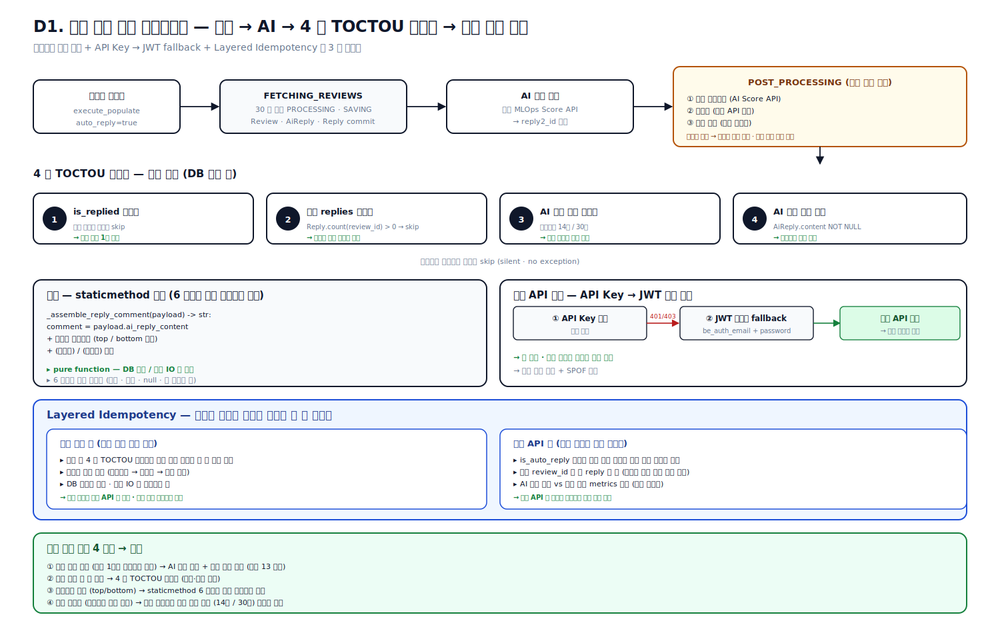

**Layered Idempotency 책임 분담**
- 운영 콘솔 측: 게시 전 4단 게이트로 같은 작업 안 두 번 호출 차단(작업 자체 결함 방어)
- 메인 API 측: 자동답글 플래그 받아 외부 플랫폼 게시 단계 멱등성 보장(같은 review_id 두 번 reply 안 됨)
- **운영 콘솔은 메인 API 를 신뢰, 메인 API 는 플랫폼 응답으로 자기 멱등 보장** — 「어디서 책임이 깨지면 어디서 알 수 있는가」 경계 명확화

**성과**
- 어드민 한 번 트리거로 **수집 → AI 생성 → 게시 종단 자동화**.
- 게시 직전 4단 가드로 **중복 / 오답글 위험 차단**, 합성 로직 staticmethod 분리로 6가지 케이스 단위 테스트 잠금.
- API Key → JWT fallback 으로 키 회전 시에도 작업이 죽지 않음.
- AI 생성 실패 vs 실제 게시 성공 metrics 분리 — 운영자가 「AI 자체 실패」 vs 「게시 실패」 를 즉시 식별.

**JVM/Spring 재설계** ([commerce-comment-platform-be](https://github.com/PreAgile/commerce-comment-platform-be) + [commerce-external-gateway-kt](https://github.com/PreAgile/commerce-external-gateway-kt))

- [ADR-BE-008 트랜잭션 경계](https://github.com/PreAgile/commerce-comment-platform-be/blob/main/docs/adr/ADR-BE-008-transaction-boundary.md) — `@Transactional(readOnly=true)` 짧은 세션 + WebClient 외부 호출은 트랜잭션 밖 (EXP-09 9 시나리오 풀 고갈 실측)
- Spring Security `OAuth2AuthorizedClientManager` 로 API Key → JWT fallback
- Resilience4j `Retry` + `CircuitBreaker` 합성 + ADR-SCR-011 데코레이터 순서 적용

---

## JVM 재설계 프로젝트 — Node.js 운영 자산을 Kotlin/Spring 으로 재현 + ADR 화

5년 동안 Node.js 로 운영하며 부딪힌 **분산 락 · 결제 멱등성 · 트랜잭션 분리 · 외부 의존성 격리** 문제를 Java/Kotlin/Spring 환경에서 동일한 시나리오로 다시 풀어보고, 결정 과정을 ADR 로 남기는 프로젝트입니다. 현재까지 **ADR 49건, 실험 47건, 기술 블로그 17편** 누적.

### Node 추상 패턴 ↔ Kotlin/Spring 자산화 매트릭스

| Node 자산 | Kotlin/Spring 자산화 |
|---|---|
| 분산 캐시 SETNX + Lua 분산 락 | Redisson watchdog + Pub/Sub 4종 비교 |
| Idempotency Key + 상태머신 + 캐시 + reconciliation | ADR-006 결제 멱등성 4단계 + EXP-09b 9 시나리오 |
| 세션 락 레지스트리 FIFO + lease TTL | Coroutines + supervisorScope + Single-Flight 5 invariants |
| Custom Error Strategy 5종 + 9종 카테고리 | Resilience4j 5종 + 9종 에러 분류기 |
| 헤드리스 브라우저 PID Registry (OOM 회피) | JVM Heap / GC 튜닝 G1GC Region + Humongous |
| 메시지 큐 classic queue (운영 5가지 한계 측정) | Kafka 마이그레이션 + Outbox Relay |

### 세 저장소

- **결제·정산 백엔드 재설계** (Java / Spring Boot / JPA) — 결제 멱등성 4단계 재현, **분산 락 4종 비교**(비관락 · 낙관락 · GET_LOCK · Redisson), DB InnoDB RR vs ANSI RR 의 차이 재현, 트랜잭션 분리 패턴 9 시나리오 매트릭스, No-offset Pagination.
- **배치 오케스트레이터 재설계** (Spring Batch + Kafka) — 메시지 큐를 1주간 운영해 5가지 한계(replay 비용, prefetch HoL, x-overflow, publisher confirm 실패, DLQ 운영 비용)를 측정하고 Kafka 전환을 정당화하는 ADR 작성. Outbox Relay 의 polling vs CDC 지연 비교, Spring Batch Reader 4종 매트릭스.
- **외부 게이트웨이 재설계** (Kotlin / Coroutines / Resilience4j) — 운영 자산을 Kotlin 으로 재설계. **Single-Flight 패턴의 다섯 불변식**(promise sharing, sync throw normalization, force release, deadline, capacity), 9종 에러 카테고리 분류기, Resilience4j 5 모듈(CircuitBreaker, Retry, Bulkhead, RateLimiter, TimeLimiter) 적용.

---

## 경력 — 아이브릭스(I-BRICKS) ｜ 백엔드 개발자 ｜ 2021.05 ~ 2024.11

한국어 자연어 처리 전문 기업에서 검색·추천 시스템, 데이터 파이프라인, 챗봇 개발을 담당했습니다.

- **한국 금융연수원 강의 검색·추천** — Elasticsearch + Logstash 기반 RDB → ES 파이프라인 구축, 사용자별 시청 시간·카테고리 선호도 가중치 부여로 검색·추천 경로를 한 인덱스에서 일관 처리.
- **EBS 학습 시스템 데이터 파이프라인** — 일일 **수천만 건** 로깅을 Kafka + Apache Nifi + Elasticsearch 클러스터로 처리. **쿼리 응답 시간 50% 단축**, 데이터 처리량 2배 증가에도 안정 동작.
- **대법원 챗봇 도우미** — React / Redux / SCSS 기반 사용자 UI, KWCAG 2.1 웹 접근성 준수.

---

## 부록 — 본문에서 다루지 않은 운영 사례

본문 5단 구조로 다루지 않은 사례를 카테고리별로 정리합니다.

**결제·트랜잭션**
- 결제 9 시나리오 매트릭스 — 최초 / 정기 / 실패·재시도 / 취소(전체·부분) / 예약 / 결제수단 변경 / 요금제 변경(즉시·예약) / 프로모션 → 정상 업그레이드.
- 마케팅 댓글 예약 비동기 실행 — 관계형 DB 기반 예약 큐 + `SELECT FOR UPDATE` 분산 처리 + 분산 캐시 Pub/Sub 상태 추적 + 지수 백오프 멱등 재시도로 **TPS 100 → 1,000+, 처리 지연 5분 → 10초 미만, 예약 실패율 1% 이하** 유지.

**큐 · 메시징 · 재시도**
- 메시지 큐 DLX 없이 application-level retry — `setTimeout + republishMessage` 로 hot loop 회피, 30s / 5m / 30m 단계별 backoff. Phase 2 에서 DLX 검증된 패턴 마이그레이션 예정 명시.
- 멀티 워커 IntegrityError-aware upsert + Lock-timeout 지수 백오프 — Duplicate 은 break, Lock timeout 은 1s / 2s / 3s 점진 backoff, 매장 매핑 raw SQL `ON DUPLICATE KEY UPDATE` 전환.

**외부 의존성 · 회로 차단**
- 외부 API quarantine — DB-backed state machine(OK / QUARANTINED) + 12h probe 자동 복구 + DB↔외부 매장 mismatch 감지.
- 외부 스크래퍼 에러 분류 + 매장 자동 비활성화 — 인증 에러(즉시 비활성 카운트 ++) / 일반 API 에러 2계층, 누적 3회 자동 비활성화 + 성공 시 카운트 리셋 자가 치유.
- 도메인 예외 계층 일원화 — 플랫폼별 18종 + 11종+ 예외를 `BasePlatformException` → 플랫폼별 도메인 → classifier helper 의 3 layer 로. instanceof + name + code 3단 분류로 직렬화 경계 흡수.
- Idempotent Reply Pipeline — Lease + Completion Cache 분리 + 4종 ErrorClassifier(BLOCKED_SUSPECTED / TRANSIENT / PERMANENT / SYSTEM) + ACK/NACK 매트릭스 명문화. 기본값 PERMANENT(unknown 에러 무한 retry 방지).
- Adaptive Traffic Controller + Launch Budget — Lua Token Bucket + Circuit Breaker(SOFT_OPEN / HALF_OPEN) + jittered watchdog 으로 Thundering Herd 방지.

**자원 격리 · 메모리**
- 헤드리스 브라우저 풀 — Launch Semaphore + Prewarm Pool + Quarantine + 5-phase Zombie Cleanup + Jittered Watchdog 5층 자원 격리. 40 concurrent 에서 **97.2% 성공률**.
- OOM 방지 chunk 처리 — 일일 외부 시트 cron 의 `find` 메모리 폭증을 CHUNK_SIZE=2000 while 루프 + lookup map 1회 캐싱으로 차단.
- 메모리 스파이크 평탄화 — 톱니파 메모리를 30개 배치 + Semaphore 30 + 단일 DB 세션 + 명시적 gc + 3슬롯 고정 자료구조로 계단형 평탄화. 메모리 로깅으로 명시 gc 호출을 정당화.

**스케줄러 · 운영**
- 운영 워크플로 오케스트레이션 — 작업 라이프사이클을 분산 캐시 Hash + ZSet(생성순 / 상태별 인덱스) + TTL 상태별 차등(RUNNING 6h / COMPLETED 1h / FAILED 2h)로 저장. 서버 재시작 시 orphaned job 자동 재시도(Semaphore 10 보수적 회복).
- 24시간 작업 선생성 + Config 당 RUNNING 1개 — 24시간 치 작업을 DB 에 미리 박고 ±5분 윈도우 dedupe 로 중복 0건, Config 당 RUNNING 1개 보장 + 전역 워커 Semaphore(200).
- 청크 분할 backfill — 플랫폼별 청크 + 사전 fetch in-memory set 으로 멱등성, 인증 에러 패턴 매칭으로 재시도 차단.

**도메인 이벤트 · 관측성**
- 도메인 이벤트 + 외부 사용자 SaaS 비동기 동기화 — 결제 완료 → 사용자 속성 동기화를 이벤트 기반 비동기로 분리, 분산 락 + 5분 retry queue 로 멱등 보장.
- APM Span Tagging — `tagDatadogSpan` 으로 결제 정합성 메트릭(쿠폰 유효 수, 스케줄 amount mismatch)이 자동 집계.

---

## 기술 스택

| 영역 | 사용 기술 |
|---|---|
| **언어** | TypeScript, JavaScript, **Kotlin, Java**, Python |
| **프레임워크** | NestJS, Node.js, **Spring Boot, Spring Batch**, FastAPI |
| **ORM** | TypeORM, Python ORM, **JPA / Hibernate**, APScheduler |
| **데이터베이스** | 관계형 DB (Cluster, Replica) — MySQL 호환 / PostgreSQL / Oracle |
| **캐시 · 락** | 분산 캐시 (Cluster 모드), Lua eval, Token Bucket, **Redisson** |
| **메시징** | 메시지 큐 (Quorum Queue, DLX, classic queue 한계 측정), **Kafka** |
| **검색** | Elasticsearch, Logstash, Apache Nifi |
| **외부 의존성 격리** | **Resilience4j**, Custom Retry / Timeout, Single-Flight (Port-Adapter), Circuit Breaker (SOFT_OPEN / HALF_OPEN), Token Bucket |
| **헤드리스 브라우저** | stealth fork 기반 브라우저 풀, 자원 격리 5층 |
| **봇 탐지 우회** | Akamai · Cloudflare 대응 — 인증 쿠키 4-state 머신, 추적 쿠키 polling, Referrer Warming, Click Loop jitter |
| **부하 · 관측** | Prometheus, Grafana, **APM (span tagging)**, nGrinder, JFR |
| **테스트** | Jest, **Testcontainers, JUnit 5, Kotest**, Pytest, "계약 spec 헤더 명문화" 스타일 |
| **인프라** | Docker, Docker Compose × 8 color, 동적 라우팅 설정, **컨테이너 오케스트레이션**, 사내 Cloud, Jenkins, GitHub Actions |
| **마이그레이션** | Flyway, Liquibase 비교 |
| **알림** | Slack Webhook (Block Kit), 알림톡 OAuth2 + 카카오 비즈메시지 |
| **AI / ML** | 자체 MLOps Score API + 6신호 노이즈 필터 (Shannon entropy, zlib 압축률, n-gram, emoji run) + 길이 가중치 (Bell + Polarity Amplification + tanh box) |
| **분산 시스템 패턴** | Redlock(Martin Kleppmann) ABA 대응 fencing token, Hexagonal Architecture(Port-Adapter), CQRS, Saga, Outbox, CAS, Bulkhead, Circuit Breaker, Single-Flight |

---

## 교육

**F-Lab Java Backend Mentoring** ｜ 2024.01 ~ 2024.07
Meta 시니어 개발자 멘토링 과정 수료. 객체지향 설계, 트랜잭션 처리, 클린 아키텍처 중심으로 동시성 제어, CQRS, 분산 트랜잭션을 심화 학습.

**경기대학교 컴퓨터과학과 졸업**
